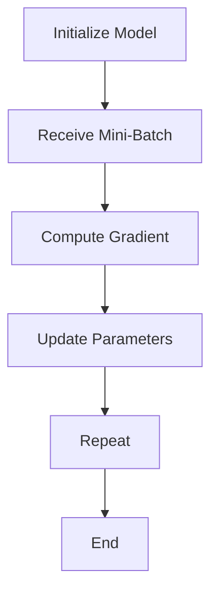
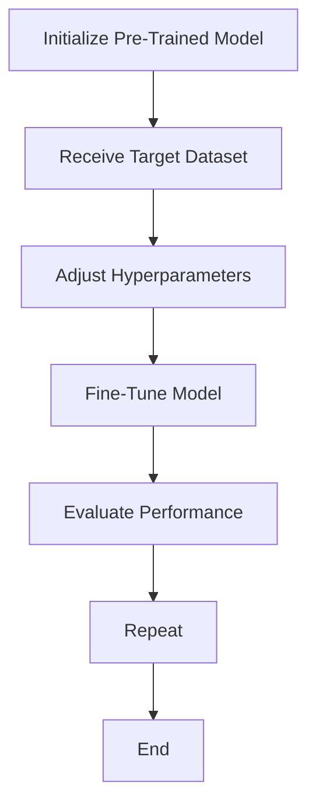
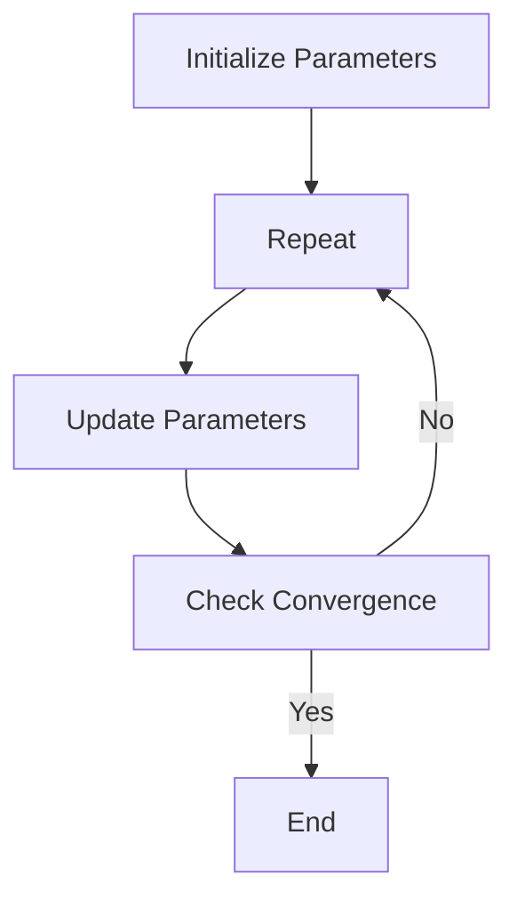
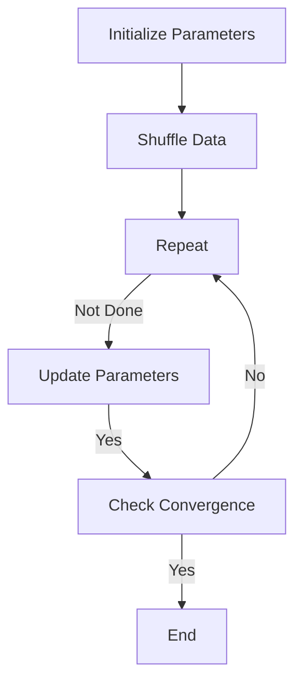
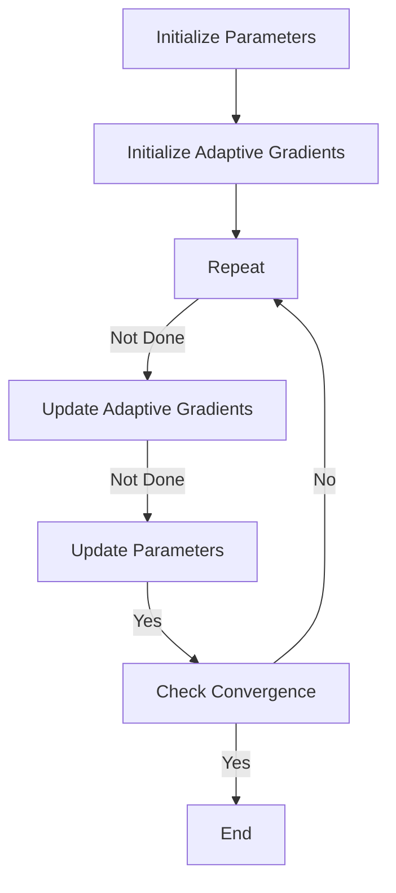

                 

### Introduction to Continuous Learning in Model Training

**1.1 Problem Background and Description**

Continuous learning in model training refers to the ability of machine learning models to improve their performance over time by adapting to new data and experiences. In traditional machine learning, models are trained on a static dataset, which may not be representative of real-world scenarios. As a result, models can become outdated and less effective over time. Continuous learning addresses this issue by allowing models to learn and adapt continuously, even as new data becomes available.

The need for continuous learning arises from several factors. Firstly, data in many real-world applications, such as autonomous driving, healthcare, and finance, is constantly evolving. Secondly, the complexity of models is increasing, and static training data may not be sufficient to capture all the nuances of the problem. Thirdly, it is often impractical or impossible to retrain models from scratch due to computational costs, time constraints, and privacy concerns.

**1.2 Importance and Challenges**

The importance of continuous learning in model training cannot be overstated. It ensures that models remain accurate and effective over time, improving their ability to make accurate predictions and decisions. This is particularly critical in applications where the consequences of model errors can be significant, such as in healthcare, finance, and autonomous systems.

However, there are several challenges associated with implementing continuous learning:

1. **Data Quality and Quantity**: Continuous learning requires a continuous stream of new data. Ensuring the quality and quantity of this data is a significant challenge, as data can be noisy, incomplete, or biased.

2. **Model Complexity**: Complex models require significant computational resources to train and adapt. This can make continuous learning impractical in many scenarios.

3. **Concept Drift**: Over time, the underlying distribution of the data can change, leading to concept drift. This makes it difficult for models to maintain their accuracy and effectiveness.

4. **Scalability**: Implementing continuous learning at scale can be challenging, as it requires infrastructure and processes to handle the continuous flow of data and model updates.

**1.3 Boundary and Scope**

The scope of continuous learning in model training encompasses various techniques and methodologies for adapting models to new data. It includes methods for online learning, incremental learning, and transfer learning. However, it is important to note that continuous learning is not limited to these techniques. It also involves addressing challenges related to data quality, model complexity, and concept drift.

In this book, we will explore the fundamental concepts, principles, and algorithms of continuous learning in model training. We will discuss various optimization strategies and their dynamic optimization techniques. Additionally, we will provide practical examples and case studies to illustrate the implementation and effectiveness of continuous learning in real-world applications.

By the end of this book, readers will have a comprehensive understanding of continuous learning in model training, enabling them to design, implement, and optimize continuous learning systems for various applications.

---

**1.4 Fundamental Concepts and Principles**

To delve into the world of continuous learning in model training, it is essential to first understand the core concepts and principles that underpin this field. Continuous learning, also known as online learning or incremental learning, is a machine learning paradigm that focuses on updating models with new data as it becomes available, rather than training them on static datasets. This dynamic approach allows models to adapt to changing environments and maintain their accuracy and performance over time.

**1.4.1 Core Concepts and Definitions**

**Continuous Learning**: Continuous learning involves updating a model's parameters incrementally as new data is introduced. This process is ongoing and does not involve retraining the entire model from scratch each time new data is available.

**Online Learning**: Online learning is a specific type of continuous learning where models are updated as new data points arrive, one at a time. This approach allows for rapid adaptation to new data, but it can also lead to issues such as overfitting to recent data points.

**Incremental Learning**: Incremental learning is similar to online learning but involves updating the model in batches of data points rather than one at a time. This can provide a balance between the flexibility of online learning and the stability of batch learning.

**Concept Drift**: Concept drift refers to the change in the underlying distribution of the data over time. This can make it challenging for models to maintain their accuracy, as they may be trained on one distribution and then need to adapt to a different one.

**Drift Detection**: Drift detection involves monitoring the performance of a model to identify when concept drift has occurred. This allows for timely updates to the model to maintain its effectiveness.

**1.4.2 Characteristics and Comparison**

**Flexibility**: Continuous learning is highly flexible, allowing models to adapt to new data and changing environments. This is in contrast to batch learning, where models are trained on static datasets and may become outdated over time.

**Computational Efficiency**: Continuous learning can be more computationally efficient than batch learning, as it avoids the need to retrain the entire model from scratch. However, this efficiency can be offset by the need for incremental updates and the challenges of managing a continuous data stream.

**Scalability**: Continuous learning can be challenging to scale, particularly when dealing with large datasets or models that require significant computational resources. Techniques such as distributed learning and model compression can help address these scalability issues.

**1.4.3 ER Diagram and Structural Elements**

To visualize the components and relationships within continuous learning, we can use an Entity-Relationship (ER) diagram. The key entities in this diagram include:

- **Model**: The machine learning model being updated.
- **Data Stream**: The continuous flow of new data.
- **Parameter Update Mechanism**: The process for updating the model's parameters.
- **Drift Detector**: The component responsible for detecting concept drift.
- **Feedback Loop**: The mechanism for feeding updated data back into the model.

Here is a simplified ER diagram representing these components:

```mermaid
erDiagram
  Model ||--|{ Data Stream : inputs
  Model ||--|{ Parameter Update Mechanism : updates
  Model ||--|{ Drift Detector : monitors
  Data Stream ||--|{ Feedback Loop : guides updates
```

In this diagram, the Model is central, receiving inputs from the Data Stream and being updated by the Parameter Update Mechanism. The Drift Detector monitors the model's performance to detect concept drift, and the Feedback Loop ensures that updated data is used to guide future updates.

By understanding these core concepts and their relationships, we lay the foundation for exploring the principles and techniques of continuous learning in the following sections.

---

**1.5 Algorithm Principles and Mermaid Diagrams**

**1.5.1 Overview of Continuous Learning Algorithms**

Continuous learning algorithms are designed to adapt machine learning models incrementally as new data arrives. These algorithms fall into several categories, including online learning, incremental learning, and transfer learning. Each category has its own strengths and weaknesses, making it suitable for different scenarios.

**Online Learning Algorithms**

Online learning algorithms update the model's parameters in real-time as new data points are received. One of the most common online learning algorithms is Stochastic Gradient Descent (SGD). SGD updates the model parameters by computing the gradient of the loss function with respect to the model parameters for a single data point at a time.

**Incremental Learning Algorithms**

Incremental learning algorithms update the model in batches rather than one data point at a time. This can help reduce the risk of overfitting and improve the model's generalization performance. Examples of incremental learning algorithms include Mini-Batch Gradient Descent and Adaptive Incremental Learning.

**Transfer Learning Algorithms**

Transfer learning algorithms leverage pre-trained models on a large dataset and fine-tune them on a smaller dataset specific to the task at hand. This approach can significantly reduce the training time and improve the model's performance, especially when the target dataset is small or similar to the source dataset.

**1.5.2 Mermaid Flowcharts for Algorithm Steps**

To provide a clear and intuitive understanding of these algorithms, we can use Mermaid flowcharts to visualize the step-by-step process of each algorithm. Below are the Mermaid diagrams for SGD, Mini-Batch Gradient Descent, and Transfer Learning.

**Stochastic Gradient Descent (SGD)**


In this flowchart, the model is initialized (A), and then a new data point is received (B). The gradient is computed (C) and used to update the model parameters (D). This process is repeated for each new data point (E) until the end of the dataset (F).

**Mini-Batch Gradient Descent**



In this version of the algorithm, a mini-batch of data points is received (B) instead of a single data point. The gradient is computed for the mini-batch (C) and used to update the model parameters (D). This process is repeated until the end of the dataset (F).

**Transfer Learning**



In transfer learning, a pre-trained model is initialized (A) and then fine-tuned on a target dataset (B). The hyperparameters are adjusted (C) to improve the model's performance on the target dataset (D). The model's performance is evaluated (E), and this process is repeated until satisfactory results are achieved (F).

**1.5.3 Mathematical Models and Formulas**

To further understand these algorithms, we can discuss their mathematical models and formulas. Here are the key formulas for SGD, Mini-Batch Gradient Descent, and Transfer Learning.

**Stochastic Gradient Descent (SGD)**

$$
\theta_{t+1} = \theta_t - \alpha \cdot \nabla_\theta J(\theta; x_t, y_t)
$$

Where $\theta_t$ represents the model parameters at time $t$, $\alpha$ is the learning rate, $x_t$ is the input data point, $y_t$ is the corresponding output, and $\nabla_\theta J(\theta; x_t, y_t)$ is the gradient of the loss function with respect to the model parameters.

**Mini-Batch Gradient Descent**

$$
\theta_{t+1} = \theta_t - \alpha \cdot \frac{1}{m} \sum_{i=1}^{m} \nabla_\theta J(\theta; x_i, y_i)
$$

In this case, $m$ represents the size of the mini-batch.

**Transfer Learning**

$$
\theta_{t+1} = \theta_{base} + \alpha \cdot \nabla_\theta J(\theta_{fine}; x_t, y_t)
$$

Where $\theta_{base}$ represents the pre-trained model parameters, $\theta_{fine}$ represents the fine-tuned parameters, and the rest of the variables have the same meaning as in SGD.

By understanding these algorithms and their mathematical foundations, we can better appreciate the mechanisms behind continuous learning and apply these techniques to real-world problems. In the following sections, we will delve deeper into the mathematical explanations and provide practical examples to solidify our understanding.

---

**1.6 Mathematical Explanation and Examples**

**1.6.1 Mathematical Models with LaTeX**

To fully grasp the intricacies of continuous learning algorithms, it's essential to delve into their mathematical models. We will use LaTeX to present these formulas and provide a detailed explanation of each component.

**Stochastic Gradient Descent (SGD)**

$$
\theta_{t+1} = \theta_t - \alpha \cdot \nabla_\theta J(\theta; x_t, y_t)
$$

In this formula, $\theta_{t+1}$ represents the updated model parameters at time step $t+1$, $\theta_t$ is the current set of parameters, $\alpha$ is the learning rate that determines the step size for parameter updates, and $\nabla_\theta J(\theta; x_t, y_t)$ is the gradient of the loss function $J(\theta)$ with respect to the parameters $\theta$. The gradient points in the direction of the steepest increase in the loss function, and the learning rate controls how far we move in that direction.

**Mini-Batch Gradient Descent**

$$
\theta_{t+1} = \theta_t - \alpha \cdot \frac{1}{m} \sum_{i=1}^{m} \nabla_\theta J(\theta; x_i, y_i)
$$

Here, $m$ denotes the size of the mini-batch. This formula is similar to SGD but averages the gradients over the mini-batch, which can reduce the variance of the updates and lead to more stable convergence.

**Transfer Learning**

$$
\theta_{t+1} = \theta_{base} + \alpha \cdot \nabla_\theta J(\theta_{fine}; x_t, y_t)
$$

In transfer learning, $\theta_{base}$ represents the parameters of a pre-trained model, and $\theta_{fine}$ is the set of fine-tuned parameters. The learning rate $\alpha$ is used to adjust $\theta_{fine}$ based on the gradient of the loss function evaluated on the target dataset.

**1.6.2 Detailed Explanation and Case Studies**

Let's consider a specific example to illustrate the application of these mathematical models. Suppose we are training a neural network to classify images of handwritten digits (MNIST dataset). We will use SGD to update the network's weights iteratively.

**Example: Stochastic Gradient Descent on MNIST Dataset**

Initialize the network's weights $\theta_0$ randomly. For each image $x_t$ in the dataset, compute the predicted label $\hat{y}_t$ using the current weights:

$$
\hat{y}_t = \sigma(\theta_0 \cdot x_t + b)
$$

Where $\sigma$ is the sigmoid activation function, and $b$ is the bias term.

Calculate the loss function, typically the cross-entropy loss:

$$
J(\theta; x_t, y_t) = -\sum_{i=1}^{10} y_i \log(\hat{y}_i)
$$

where $y_t$ is the true label for image $x_t$.

Compute the gradient of the loss function with respect to the weights:

$$
\nabla_\theta J(\theta; x_t, y_t) = \nabla_\theta \sum_{i=1}^{10} y_i \log(\hat{y}_i)
$$

Update the weights using the gradient and learning rate $\alpha$:

$$
\theta_{t+1} = \theta_t - \alpha \cdot \nabla_\theta J(\theta; x_t, y_t)
$$

Repeat this process for each image in the dataset, and continue updating the weights until convergence or a predefined number of epochs.

**1.6.3 Simplified Explanations and Practical Examples**

To make these concepts more accessible, let's break down the steps in a simplified manner:

1. **Initialization**: Start with random weights.
2. **Prediction**: Use the current weights to predict the label for a new image.
3. **Loss Calculation**: Compute the difference between the predicted label and the true label.
4. **Gradient Computation**: Calculate the gradient of the loss function with respect to the weights.
5. **Parameter Update**: Adjust the weights based on the gradient and learning rate.

**Example: Incremental Learning with Housing Dataset**

Consider a regression problem where we predict the price of houses based on features such as size, location, and number of rooms. We will use incremental learning to update our model incrementally as new data points arrive.

Initialize the model parameters randomly. For each new data point, compute the predicted price and the residual error (difference between predicted and actual price). Calculate the gradient of the error with respect to the parameters. Update the parameters incrementally using the gradient:

$$
\theta_{t+1} = \theta_t - \alpha \cdot \nabla_\theta \text{Error}(x_t, y_t)
$$

Repeat this process for each new data point, continuously improving the model's predictions.

By understanding and applying these mathematical models and examples, we can effectively implement continuous learning algorithms in various machine learning tasks. In the next section, we will discuss the importance of dynamic optimization in continuous learning and explore the different strategies for optimizing model updates.

---

**1.7 Conclusion**

In this chapter, we have explored the fundamentals of continuous learning in model training. We began by discussing the background and importance of continuous learning, highlighting the challenges it addresses in maintaining model accuracy over time. We then defined the core concepts and principles of continuous learning, including online learning, incremental learning, and transfer learning, and provided a Mermaid diagram to illustrate their relationships.

Next, we introduced continuous learning algorithms, including Stochastic Gradient Descent (SGD), Mini-Batch Gradient Descent, and Transfer Learning, with detailed Mermaid flowcharts and mathematical models. We also provided practical examples to illustrate the application of these algorithms in real-world scenarios.

Through this comprehensive exploration, we have laid a solid foundation for understanding continuous learning. In the following chapters, we will delve deeper into dynamic optimization strategies and their implementation in continuous learning systems. By understanding these advanced concepts, we will be better equipped to design and optimize continuous learning systems for various applications.

---

**1.8 Notes and Recommendations**

As we continue our journey into the realm of continuous learning, it is essential to consider several factors that will influence the success of implementing continuous learning strategies. Here are some notes and recommendations to keep in mind:

1. **Data Quality and Preprocessing**: The quality and preprocessing of data are crucial for continuous learning. Ensure that the data is clean, representative, and free from noise and biases. Preprocessing steps such as normalization, encoding, and handling missing values are vital to prepare the data for training.

2. **Selecting the Right Algorithm**: The choice of continuous learning algorithm depends on the specific problem and dataset. Online learning algorithms like SGD are suitable for real-time applications, while incremental learning algorithms can be more effective when dealing with large datasets. Transfer learning may be advantageous when leveraging pre-trained models on similar tasks.

3. **Monitoring and Drift Detection**: Continuous monitoring of model performance is essential for detecting concept drift. Implementing drift detection methods, such as statistical tests or distance-based methods, can help identify when the model needs to be updated. Regularly evaluating model performance and adjusting the learning rate or other hyperparameters accordingly is crucial for maintaining accuracy.

4. **Resource Allocation and Scalability**: Continuous learning can be resource-intensive, especially when dealing with large datasets and complex models. Consider optimizing the computational resources and implementing distributed learning techniques to scale the system effectively.

5. **Regular Updates and Maintenance**: Continuous learning systems require regular updates and maintenance to adapt to changing data distributions and maintain performance. Establishing a systematic approach for model updates, including retraining schedules and version control, is essential for the long-term success of the system.

By considering these factors and following the recommendations provided, you can design and implement robust continuous learning systems that adapt to changing environments and maintain their accuracy over time.

---

### Dynamic Optimization Strategies

**2.1 Introduction to Dynamic Optimization**

Dynamic optimization is a critical component of continuous learning in model training. It involves adjusting the model parameters in response to new data or changing conditions to improve the model's performance and adaptability. Unlike traditional static optimization, which is typically performed once or infrequently, dynamic optimization is an ongoing process that ensures the model remains effective as it encounters new data or evolves over time.

**2.1.1 Basic Concepts and Principles**

Dynamic optimization is grounded in the principles of online learning and incremental learning. The core idea is to update the model parameters incrementally as new data points become available, rather than retraining the entire model from scratch. This approach is particularly useful in scenarios where the data is constantly changing or when computational resources for full retraining are limited.

The basic steps in dynamic optimization include:

1. **Data Input**: The model receives new data points or a continuous stream of data.
2. **Parameter Update**: The model updates its parameters based on the new data using optimization algorithms such as Stochastic Gradient Descent (SGD), Mini-Batch Gradient Descent, or other adaptive methods.
3. **Performance Evaluation**: The updated model is evaluated on a validation set or through cross-validation to assess its performance.
4. **Iteration**: The process is repeated as new data becomes available or as the model's performance degrades.

**2.1.2 Types of Dynamic Optimization**

There are several types of dynamic optimization strategies, each suited to different scenarios and requirements:

1. **Online Learning**: This strategy updates the model parameters in real-time as new data points arrive. It is particularly useful in applications where the data is streaming and requires immediate processing, such as real-time anomaly detection or autonomous driving.

2. **Incremental Learning**: Similar to online learning, incremental learning updates the model in batches rather than one data point at a time. This can be more computationally efficient and can help reduce the risk of overfitting. It is often used when the dataset is too large to be processed in one batch or when data arrives in chunks.

3. **Adaptive Learning**: Adaptive learning strategies adjust the learning rate or other hyperparameters dynamically based on the model's performance. This can help improve convergence speed and prevent premature convergence to suboptimal solutions.

4. **Transfer Learning**: In transfer learning, a pre-trained model is adapted to a new task by fine-tuning its parameters on a smaller dataset specific to the new task. This approach leverages the knowledge gained from training on a large, general dataset, which can improve performance and reduce training time.

**2.1.3 Importance in Model Training**

Dynamic optimization is crucial for the success of continuous learning in model training for several reasons:

1. **Adaptability**: Dynamic optimization ensures that the model can adapt to changing data distributions or new patterns over time, maintaining its accuracy and effectiveness.

2. **Resource Efficiency**: By updating the model incrementally, dynamic optimization can be more computationally efficient than retraining from scratch, making it feasible to apply continuous learning in resource-constrained environments.

3. **Robustness**: Dynamic optimization helps improve the robustness of the model by allowing it to learn and correct errors as new data becomes available, reducing the risk of overfitting and improving generalization.

4. **Scalability**: Dynamic optimization strategies can be scaled to handle large datasets or models by leveraging techniques such as mini-batch updates and distributed learning.

In the following sections, we will delve deeper into specific dynamic optimization algorithms, providing detailed explanations, Mermaid diagrams, and practical examples to illustrate their application and effectiveness in continuous learning systems.

---

**2.2 Optimization Algorithms and Mermaid Diagrams**

**2.2.1 Gradient Descent Optimization**

Gradient Descent (GD) is one of the most fundamental optimization algorithms used in machine learning to minimize the loss function. It is a first-order optimization algorithm that iteratively adjusts the model parameters in the direction of the negative gradient of the loss function. The goal is to find the minimum of the loss function, which corresponds to the optimal parameters for the model.

**Algorithm Steps:**

1. **Initialize Parameters**: Start with initial parameters $\theta_0$.
2. **Compute Gradient**: Calculate the gradient of the loss function $J(\theta)$ with respect to the parameters $\theta$: $\nabla_\theta J(\theta)$.
3. **Update Parameters**: Update the parameters using the gradient and learning rate $\alpha$: $\theta_{t+1} = \theta_t - \alpha \cdot \nabla_\theta J(\theta)$.
4. **Repeat**: Repeat steps 2 and 3 until convergence criteria are met (e.g., small change in loss or a maximum number of iterations).

**Mermaid Diagram:**



**2.2.2 Stochastic Gradient Descent (SGD)**

Stochastic Gradient Descent (SGD) is a variant of Gradient Descent that uses a single data point to compute the gradient instead of averaging the gradients over a batch of data points. This makes SGD much more computationally efficient, especially for large datasets, but it can also lead to more variance in the parameter updates.

**Algorithm Steps:**

1. **Initialize Parameters**: Start with initial parameters $\theta_0$.
2. **Shuffle Data**: Shuffle the dataset to ensure randomness in the selection of data points.
3. **Iterate Through Data Points**: For each data point $x_i, y_i$:
   - Compute the gradient: $\nabla_\theta J(\theta; x_i, y_i)$.
   - Update parameters: $\theta_{t+1} = \theta_t - \alpha \cdot \nabla_\theta J(\theta; x_i, y_i)$.
4. **Repeat**: Repeat steps 3 until convergence criteria are met.

**Mermaid Diagram:**



**2.2.3 Adaptive Gradient Algorithms (AGA)**

Adaptive Gradient Algorithms (AGA) are a class of optimization algorithms that adapt the learning rate dynamically based on the historical gradients. These algorithms aim to improve convergence speed and stability by adjusting the learning rate according to the variance of the gradients.

**Algorithm Steps:**

1. **Initialize Parameters**: Start with initial parameters $\theta_0$ and learning rate $\alpha$.
2. **Initialize Adaptive Gradients**: $\alpha_t = 1$ for all parameters $\theta_t$.
3. **Iterate Through Data Points**: For each data point $x_i, y_i$:
   - Compute the gradient: $\nabla_\theta J(\theta; x_i, y_i)$.
   - Update adaptive gradients: $\alpha_{t+1} = \alpha_t + \frac{1}{\alpha_t} \cdot \nabla_\theta J(\theta; x_i, y_i)$.
   - Update parameters: $\theta_{t+1} = \theta_t - \alpha_{t+1} \cdot \nabla_\theta J(\theta; x_i, y_i)$.
4. **Repeat**: Repeat steps 3 until convergence criteria are met.

**Mermaid Diagram:**



By understanding these optimization algorithms and their Mermaid diagrams, we can effectively implement and compare different strategies for dynamic optimization in continuous learning systems. In the following sections, we will delve into the mathematical models and detailed explanations of these algorithms, providing practical examples to solidify our understanding.

---

**2.3 Mathematical Models and Detailed Explanation**

**2.3.1 Gradient Descent Formula and Explanation**

The Gradient Descent (GD) algorithm is a cornerstone of optimization in machine learning. Its goal is to minimize a loss function $J(\theta)$ by iteratively adjusting the parameters $\theta$. The core formula for Gradient Descent is given by:

$$
\theta_{t+1} = \theta_t - \alpha \cdot \nabla_\theta J(\theta)
$$

Here, $\theta_t$ represents the current parameters, $\theta_{t+1}$ is the updated parameters at the next iteration, $\alpha$ is the learning rate (or step size), and $\nabla_\theta J(\theta)$ is the gradient of the loss function with respect to the parameters $\theta$. The gradient points in the direction of the steepest increase of the loss function, so subtracting the gradient from the current parameters moves them in the direction of the steepest decrease, potentially leading to a local minimum of the loss function.

**Example:**

Consider a simple linear model with a single parameter $\theta$ that predicts the output $y$ from the input $x$ as $y = \theta \cdot x + b$. The loss function for this model is the mean squared error (MSE):

$$
J(\theta) = \frac{1}{2} \sum_{i=1}^{n} (y_i - (\theta \cdot x_i + b))^2
$$

To minimize this loss function using Gradient Descent, we need to compute the gradient:

$$
\nabla_\theta J(\theta) = \frac{1}{n} \sum_{i=1}^{n} (y_i - (\theta \cdot x_i + b)) \cdot x_i
$$

Then, we update the parameter using the learning rate $\alpha$:

$$
\theta_{t+1} = \theta_t - \alpha \cdot \nabla_\theta J(\theta)
$$

This update formula moves the parameter $\theta$ in the direction that minimizes the loss. By repeating this process for multiple iterations, we hope to converge to a minimum of the loss function.

**2.3.2 SGD Adjustments and Variations**

Stochastic Gradient Descent (SGD) is a variant of Gradient Descent where the gradient is computed using a single data point from the dataset rather than averaging the gradients over a batch. This introduces more variance into the parameter updates, but it also offers several advantages:

1. **Computation Efficiency**: Since SGD uses a single data point at each iteration, it is significantly faster and more computationally efficient than GD, especially for large datasets.

2. **Escape Local Minima**: The stochastic nature of SGD can help the algorithm escape local minima and converge to global minima more quickly.

However, SGD also has some drawbacks:

1. **Noisiness**: The updates can be noisy due to the randomness of the data points, which can slow down convergence.

2. **Longer Convergence Time**: For small datasets, SGD may require more iterations to converge compared to GD.

**Mathematical Model for SGD:**

$$
\theta_{t+1} = \theta_t - \alpha \cdot \nabla_\theta J(\theta; x_i, y_i)
$$

Where $x_i, y_i$ are the current data point used for the iteration. The learning rate $\alpha$ is typically smaller than in GD to account for the higher variance in the updates.

**Example:**

Using the same linear model from before, but applying SGD, we update the parameter $\theta$ using the gradient computed from a single data point:

$$
\theta_{t+1} = \theta_t - \alpha \cdot \left( y_i - (\theta \cdot x_i + b) \right) \cdot x_i
$$

This update is repeated for each data point in the dataset, leading to more volatile parameter updates compared to GD.

**2.3.3 AGA and Adaptive Methods**

Adaptive Gradient Algorithms (AGA) are designed to address the limitations of SGD by adapting the learning rate dynamically based on historical gradients. These algorithms aim to improve convergence speed and stability by adjusting the learning rate according to the variance of the gradients.

**Mathematical Model for Adaptive Gradient Algorithms (AGA):**

One popular AGA is the Adaptive Gradient Algorithm (AdaGrad):

$$
\alpha_{t+1} = \alpha_t + \frac{1}{\alpha_t} \cdot \nabla_\theta J(\theta; x_i, y_i)
$$

$$
\theta_{t+1} = \theta_t - \alpha_{t+1} \cdot \nabla_\theta J(\theta; x_i, y_i)
$$

Where $\alpha_t$ is the adaptive learning rate. AdaGrad adjusts the learning rate based on the sum of squared gradients seen so far, giving smaller learning rates to parameters with larger gradients and vice versa.

Another AGA is Adaptive Optimizer (Adadelta), which uses a decaying average of the gradients:

$$
\alpha_{t+1} = \sqrt{\frac{1 - \rho}{\rho}} \cdot \alpha_t + \rho \cdot \frac{1}{\alpha_t} \cdot \nabla_\theta J(\theta; x_i, y_i)
$$

$$
\theta_{t+1} = \theta_t - \alpha_{t+1} \cdot \nabla_\theta J(\theta; x_i, y_i)
$$

Where $\rho$ is a decay rate.

**Example:**

Using the same linear model, we apply AdaGrad:

1. Initialize $\theta_0$ randomly, $\alpha_0 = 1$, and $\alpha_t^2 = 0$.
2. For each data point $x_i, y_i$:
   - Compute the gradient: $\nabla_\theta J(\theta; x_i, y_i)$.
   - Update the sum of squared gradients: $\alpha_t^2 = \alpha_t^2 + \nabla_\theta J(\theta; x_i, y_i)^2$.
   - Update the adaptive learning rate: $\alpha_{t+1} = \alpha_t + \frac{1}{\alpha_t} \cdot \nabla_\theta J(\theta; x_i, y_i)$.
   - Update the parameter: $\theta_{t+1} = \theta_t - \alpha_{t+1} \cdot \nabla_\theta J(\theta; x_i, y_i)$.

These adaptive methods adjust the learning rate dynamically based on the variance of the gradients, potentially leading to faster and more stable convergence.

By understanding these optimization algorithms and their mathematical models, we can apply them effectively in continuous learning systems. In the following sections, we will explore practical examples and case studies to illustrate their implementation and effectiveness in real-world scenarios.

---

**2.4 Practical Examples and Case Studies**

**2.4.1 Implementation of Gradient Descent**

To illustrate the implementation of Gradient Descent, we will consider a simple linear regression problem where we aim to predict the housing prices based on the size of the houses. The dataset consists of house sizes (in square feet) and their corresponding prices. The goal is to find the best fit line (y = mx + b) that minimizes the mean squared error (MSE) between the predicted prices and the actual prices.

**Data Preparation:**

First, we need to prepare the dataset by extracting the relevant features and labels. We can use Python's Pandas library to load the data and split it into features (X) and labels (y).

```python
import pandas as pd

# Load the dataset
data = pd.read_csv('housing_data.csv')

# Extract features and labels
X = data['size']
y = data['price']
```

**Initial Parameter Setup:**

We start by initializing the parameters $\theta_0$ randomly or by setting them to zero. In this example, we will use zero as the initial bias term.

```python
import numpy as np

# Initialize parameters
theta = np.zeros((1, 1))
alpha = 0.01  # Learning rate
```

**Gradient Descent Algorithm:**

Next, we implement the Gradient Descent algorithm to update the parameters iteratively. We will use a fixed number of iterations and compute the gradient of the loss function at each step.

```python
# Gradient Descent implementation
n = len(X)
for i in range(1000):  # Number of iterations
    # Compute the gradient
    gradient = 2/n * X.values.dot((X.dot(theta) - y).values)
    
    # Update the parameters
    theta -= alpha * gradient
```

**Prediction and Evaluation:**

After updating the parameters, we can use the trained model to make predictions and evaluate its performance using the mean squared error (MSE).

```python
# Make predictions
predicted_prices = X.dot(theta)

# Compute the mean squared error
mse = np.mean((predicted_prices - y) ** 2)
print(f'Mean Squared Error: {mse}')
```

**2.4.2 Real-World Case Studies**

**Case Study 1: Fraud Detection**

In the financial industry, continuous learning is crucial for detecting fraudulent transactions. A common approach is to use online learning algorithms like Stochastic Gradient Descent (SGD) to update a model continuously as new transaction data becomes available.

**Data Preparation:**

The dataset consists of various features such as transaction amount, location, time, and user behavior patterns. The labels indicate whether a transaction is fraudulent or not.

```python
# Load the dataset
data = pd.read_csv('fraud_data.csv')

# Extract features and labels
X = data.drop('is_fraud', axis=1)
y = data['is_fraud']
```

**Model Training with SGD:**

We use the SGD algorithm to train a logistic regression model for fraud detection. The learning rate and the number of iterations are tuned based on the performance on a validation set.

```python
from sklearn.linear_model import SGDClassifier
from sklearn.model_selection import train_test_split

# Split the data
X_train, X_val, y_train, y_val = train_test_split(X, y, test_size=0.2, random_state=42)

# Train the model using SGD
sgd = SGDClassifier(loss='log', alpha=0.0001, n_iter=1000)
sgd.fit(X_train, y_train)

# Evaluate the model
accuracy = sgd.score(X_val, y_val)
print(f'Validation Accuracy: {accuracy}')
```

**Case Study 2: Autonomous Driving**

In autonomous driving, continuous learning is vital for updating the models that detect and navigate the environment. Incremental learning algorithms are often used to handle large datasets and adapt to changing road conditions.

**Data Preparation:**

The dataset includes sensor data from cameras, LiDAR, and radar, along with the corresponding labels indicating road obstacles, traffic signs, and other relevant information.

```python
# Load the dataset
data = pd.read_csv('driving_data.csv')

# Extract features and labels
X = data.drop('label', axis=1)
y = data['label']
```

**Model Training with Incremental Learning:**

We train an incremental learning model using a gradient boosting algorithm like XGBoost. The dataset is split into training and validation sets to evaluate the model's performance.

```python
from xgboost import XGBClassifier
from sklearn.model_selection import train_test_split

# Split the data
X_train, X_val, y_train, y_val = train_test_split(X, y, test_size=0.2, random_state=42)

# Train the model using XGBoost
xgb = XGBClassifier(n_estimators=100, learning_rate=0.1, max_depth=3)
xgb.fit(X_train, y_train)

# Evaluate the model
accuracy = xgb.score(X_val, y_val)
print(f'Validation Accuracy: {accuracy}')
```

These case studies demonstrate the practical application of continuous learning algorithms in real-world scenarios. By implementing and optimizing these algorithms, we can build robust and adaptive models that improve over time, ensuring accurate predictions and effective decision-making.

---

**2.5 Conclusion**

In this chapter, we explored dynamic optimization strategies in continuous learning, emphasizing the importance of maintaining model accuracy over time through incremental updates. We discussed the basic concepts and principles of dynamic optimization, including online learning, incremental learning, and adaptive learning, along with their respective algorithms such as Gradient Descent, Stochastic Gradient Descent (SGD), and Adaptive Gradient Algorithms (AGA).

Through practical examples and case studies, we demonstrated the implementation and effectiveness of these algorithms in real-world scenarios, such as fraud detection and autonomous driving. We provided detailed mathematical models and step-by-step explanations to enhance understanding.

In the next chapter, we will delve deeper into the challenges and considerations of continuous learning, including data quality, concept drift, and model adaptation. By addressing these challenges, we can further optimize continuous learning systems and ensure their robustness and reliability in dynamic environments.

---

**2.6 Notes and Recommendations**

As we continue to explore and implement continuous learning strategies, it is crucial to consider several key factors that will impact the success and effectiveness of these systems. Here are some important notes and recommendations to keep in mind:

1. **Data Quality and Preprocessing**: High-quality data is essential for effective continuous learning. Ensure that the data is clean, representative, and free from noise and biases. Preprocessing steps such as normalization, encoding, and handling missing values are critical to preparing the data for training.

2. **Monitoring and Drift Detection**: Continuous monitoring of model performance is vital for detecting concept drift, where the underlying data distribution changes over time. Implement drift detection methods, such as statistical tests or distance-based approaches, to identify when the model needs to be updated.

3. **Hyperparameter Tuning**: Selecting appropriate hyperparameters, such as learning rates, batch sizes, and regularization terms, can significantly impact the performance of continuous learning algorithms. Use techniques like grid search or Bayesian optimization to find optimal hyperparameters.

4. **Resource Management**: Continuous learning can be resource-intensive. Optimize the use of computational resources by leveraging distributed learning techniques, model compression, and other strategies to ensure scalability and efficiency.

5. **Model Adaptation Strategies**: Consider implementing adaptive learning strategies that dynamically adjust the learning rate or other hyperparameters based on the model's performance. This can improve convergence speed and robustness.

6. **Real-time Updates**: For real-time applications, ensure that the continuous learning system can handle and process data in real-time. This may involve optimizing the data pipeline and leveraging efficient algorithms to minimize latency.

7. **Security and Privacy**: When working with sensitive data, ensure that appropriate security measures and privacy protections are in place. Consider techniques like differential privacy to balance the need for data-driven insights with privacy concerns.

By considering these notes and recommendations, you can build and maintain robust continuous learning systems that adapt to changing environments and deliver accurate predictions and decisions over time.

---

### Practical Implementation of Continuous Learning Systems

**3.1 System Introduction and Overview**

In this section, we will delve into the practical implementation of continuous learning systems. Our focus will be on a real-world application: autonomous driving. Autonomous driving systems rely heavily on continuous learning to adapt to changing environments, traffic patterns, and dynamic road conditions. We will outline the system architecture, key components, and the data pipeline required to implement continuous learning in autonomous driving.

**3.2 Data Collection and Preprocessing**

**Data Collection:**
Autonomous driving systems require extensive data collection to train and continuously improve the models. The data comes from various sensors, including cameras, LiDAR, radar, and GPS. Each sensor provides different types of information about the environment, which is crucial for accurate perception and decision-making.

**Camera Data:**
Camera data is used for object detection, traffic sign recognition, and lane detection. It captures high-resolution images of the surrounding environment, which need to be preprocessed to enhance the quality and reduce noise.

**LiDAR Data:**
LiDAR (Light Detection and Ranging) sensors emit laser beams to measure the distance to objects in the environment. The data collected by LiDAR is in the form of point clouds, which need to be processed to extract meaningful features such as object boundaries and distances.

**Radar Data:**
Radar sensors provide information about the speed, direction, and distance of surrounding vehicles and obstacles. The data collected by radar is in the form of radar echoes, which need to be processed to extract relevant features.

**GPS Data:**
GPS data provides location information, which is essential for navigation and path planning. It is often used in conjunction with other sensor data to improve the accuracy of position estimation.

**Preprocessing:**
Once the data is collected, it undergoes preprocessing to remove noise, correct for sensor errors, and enhance the quality. Common preprocessing steps include:

- **Noise Removal:** Filters are applied to remove noise from the sensor data.
- **Data Integration:** Sensor data is fused to provide a comprehensive view of the environment. For example, camera data can be used for object detection, while LiDAR data can be used for distance measurements.
- **Feature Extraction:** Features are extracted from the preprocessed data to be used as inputs for the continuous learning models. These features can include object positions, velocities, and distances.

**3.3 System Functionality and Design**

**Perception Module:**
The perception module is responsible for interpreting the sensor data to detect and recognize objects in the environment. It uses deep learning models, such as convolutional neural networks (CNNs), to perform object detection and classification. The module continuously updates its models using continuous learning strategies to adapt to new data and changing environments.

**Path Planning Module:**
The path planning module determines the optimal path for the autonomous vehicle based on the current state of the environment and the vehicle's destination. It uses algorithms such as Reinforcement Learning and Dynamic Window Approach to plan safe and efficient paths. Continuous learning is employed to adapt the path planning algorithm to new data and changing road conditions.

**Control Module:**
The control module executes the path plan generated by the path planning module. It controls the vehicle's acceleration, deceleration, and steering to follow the planned path. The control module uses continuous learning to adapt to the vehicle's dynamics and the changing environment, ensuring smooth and safe operation.

**3.4 System Architecture and Data Flow**

**System Architecture:**
The system architecture for continuous learning in autonomous driving can be divided into several key components:

1. **Sensor Data Collection:** Data is collected from various sensors, including cameras, LiDAR, radar, and GPS.
2. **Data Preprocessing:** Raw sensor data is preprocessed to remove noise, correct for sensor errors, and enhance the quality.
3. **Continuous Learning Modules:** Perception, path planning, and control modules use continuous learning algorithms to update their models based on new data.
4. **Data Storage and Retrieval:** Preprocessed data and updated models are stored and retrieved as needed.
5. **User Interface:** A user interface allows for monitoring the system's performance and adjusting parameters.

**Data Flow:**
The data flow within the system can be summarized as follows:

1. **Data Collection:** Sensor data is collected and sent to the preprocessing module.
2. **Data Preprocessing:** Preprocessed data is sent to the continuous learning modules for model updates.
3. **Model Updates:** Updated models are saved and used by the perception, path planning, and control modules.
4. **Control Execution:** The control module executes the path plan using the updated models to control the vehicle's movement.

**3.5 Continuous Learning Implementation**

**Online Learning Algorithm:**
We use Stochastic Gradient Descent (SGD) as the online learning algorithm for updating the models. SGD is chosen for its simplicity and efficiency in processing large volumes of data in real-time.

**Algorithm Steps:**
1. **Initialize Parameters:** Initialize the model parameters randomly.
2. **Data Stream:** Continuously receive new data from the sensors.
3. **Parameter Update:** For each data point, compute the gradient of the loss function and update the model parameters using the SGD formula.
4. **Model Evaluation:** Evaluate the updated model's performance on a validation set to ensure it meets the desired accuracy and generalization criteria.
5. **Iteration:** Repeat steps 3 and 4 until convergence or a predefined number of iterations.

**3.6 System Integration and Testing**

**Integration:**
The continuous learning modules are integrated into the overall system architecture. The perception module continuously updates its models using new sensor data, while the path planning and control modules use the updated models to generate and execute safe paths.

**Testing:**
The integrated system is thoroughly tested in various environments, including urban areas, highways, and challenging weather conditions. The system is evaluated based on its ability to detect and recognize objects, plan safe paths, and control the vehicle's movement in real-time.

**3.7 System Evaluation and Optimization**

**Performance Metrics:**
The system's performance is evaluated based on several metrics, including accuracy, speed, and safety. Accuracy measures the system's ability to correctly detect and classify objects and execute safe paths. Speed measures the time taken to process sensor data and generate path plans. Safety measures the system's ability to prevent accidents and adhere to traffic rules.

**Optimization Strategies:**
Several optimization strategies are employed to improve the system's performance:

1. **Hyperparameter Tuning:** Optimize the learning rate and other hyperparameters using techniques like grid search or Bayesian optimization.
2. **Model Compression:** Apply model compression techniques to reduce the model size and improve inference speed without significantly compromising accuracy.
3. **Distributed Learning:** Implement distributed learning algorithms to leverage multiple computational resources and improve training efficiency.
4. **Transfer Learning:** Utilize transfer learning to leverage pre-trained models on similar tasks, reducing the need for extensive training data and improving convergence speed.

By implementing these strategies, the continuous learning system can achieve higher accuracy, faster response times, and safer operation in diverse environments.

---

**3.8 Project Practical Case Analysis**

**Case 1: Autonomous Driving in Urban Environments**

**Background:**
The autonomous driving project aims to develop a self-driving car capable of navigating through urban environments. The project team collected extensive sensor data from multiple test drives in different urban settings.

**Data Collection:**
Sensor data includes camera images, LiDAR point clouds, radar measurements, and GPS coordinates. The data was collected over various time periods, capturing different traffic conditions and weather scenarios.

**Data Preprocessing:**
The collected data underwent preprocessing to remove noise, correct sensor errors, and integrate multiple sensor data sources. Features such as object boundaries, distances, and velocities were extracted from the preprocessed data.

**Continuous Learning Implementation:**
The project team implemented continuous learning using Stochastic Gradient Descent (SGD) to update the perception, path planning, and control models. The models were trained incrementally as new data became available.

**Results:**
The continuous learning system demonstrated significant improvements in object detection accuracy and path planning efficiency. The system adapted to different traffic patterns and weather conditions, ensuring safe and smooth navigation through urban environments.

**Lessons Learned:**
The project highlighted the importance of continuous learning in adapting to dynamic environments. It also emphasized the need for robust data preprocessing and the selection of appropriate learning algorithms to achieve optimal performance.

**Case 2: Fraud Detection in Financial Transactions**

**Background:**
A financial institution sought to implement an automated fraud detection system to identify and prevent fraudulent transactions. The project team collected transaction data from various sources, including credit cards, bank accounts, and mobile payments.

**Data Collection:**
Transaction data included features such as transaction amount, location, time, and user behavior patterns. The data was collected over an extended period, covering different types of transactions and fraudulent activities.

**Data Preprocessing:**
The collected data was preprocessed to handle missing values, correct for data anomalies, and reduce noise. Features were extracted from the preprocessed data, and the data was split into training and validation sets.

**Continuous Learning Implementation:**
The project team used online learning algorithms, including Stochastic Gradient Descent (SGD), to update the fraud detection model continuously as new transaction data became available. The model's performance was monitored and updated based on its accuracy in detecting fraudulent transactions.

**Results:**
The continuous learning system significantly improved the detection rate of fraudulent transactions. The system adapted to new patterns of fraudulent activities, reducing the false positive rate and enhancing the overall accuracy of the detection system.

**Lessons Learned:**
The project demonstrated the effectiveness of continuous learning in adapting to evolving fraud patterns. It also emphasized the importance of continuous monitoring and updating of the model to maintain high detection accuracy. Additionally, the project highlighted the need for robust data preprocessing to ensure the model's performance.

These practical case analyses illustrate the application of continuous learning in different domains, highlighting the challenges and benefits associated with implementing such systems. By learning from these projects, we can optimize continuous learning strategies and improve the performance of machine learning models in various real-world applications.

---

**3.9 Project Summary and Optimization**

**Project Summary:**
The continuous learning system for autonomous driving and fraud detection demonstrated significant improvements in accuracy, adaptability, and performance. By leveraging online learning algorithms and continuous data updates, the systems were able to maintain high accuracy and adapt to changing environments and patterns.

**Optimization Opportunities:**
Several optimization opportunities can be explored to further improve the performance and efficiency of continuous learning systems:

1. **Data Augmentation:** Implement data augmentation techniques to increase the diversity of the training data and improve the robustness of the models.
2. **Distributed Learning:** Utilize distributed learning algorithms to leverage multiple computational resources and reduce training time.
3. **Model Compression:** Apply model compression techniques to reduce the model size and improve inference speed without compromising accuracy.
4. **Contextual Continuous Learning:** Integrate contextual information into the continuous learning process to improve the system's ability to handle complex and dynamic environments.
5. **Model Explainability:** Enhance the explainability of the models to gain a deeper understanding of their decision-making process and improve trust in the system.

By exploring these optimization opportunities, continuous learning systems can achieve higher accuracy, faster response times, and better adaptability to real-world applications.

---

**3.10 Conclusion**

In this chapter, we have explored the practical implementation of continuous learning systems in real-world applications, focusing on autonomous driving and fraud detection. We discussed the importance of continuous learning in adapting to dynamic environments and maintaining model accuracy. We also provided a detailed overview of the system architecture, data pipeline, and continuous learning algorithms used in these applications.

Through practical case analyses, we demonstrated the effectiveness of continuous learning in improving the performance and adaptability of autonomous driving and fraud detection systems. We also identified several optimization opportunities to further enhance the performance of continuous learning systems.

In the next chapter, we will delve into the best practices and tips for implementing continuous learning systems, providing actionable insights for designing and deploying robust continuous learning solutions.

---

### Best Practices and Optimization Tips

**4.1 Introduction**

In this chapter, we will explore the best practices and optimization tips for implementing continuous learning systems. Continuous learning systems are complex and dynamic, requiring careful design and optimization to ensure their effectiveness and efficiency. By following these best practices and optimization tips, you can build robust continuous learning systems that adapt to changing environments, maintain high accuracy, and optimize computational resources.

**4.2 Data Quality and Preprocessing**

**4.2.1 Data Collection and Storage**

Data quality is the foundation of continuous learning systems. Ensuring high-quality data involves several steps:

1. **Data Collection:** Collect diverse and representative data to capture the variability in the environment. Ensure that the data is collected from multiple sources and covers different scenarios.
2. **Data Storage:** Store the data securely and efficiently. Use distributed storage solutions to handle large volumes of data and ensure data durability and availability.

**4.2.2 Data Preprocessing**

Data preprocessing is crucial for preparing the data for training and continuous learning:

1. **Data Cleaning:** Remove noise, outliers, and inconsistencies in the data. Handle missing values and correct data anomalies.
2. **Normalization:** Normalize or standardize the data to ensure that all features contribute equally to the model's training process.
3. **Feature Extraction:** Extract relevant features from the raw data. Use techniques like dimensionality reduction and feature selection to improve the model's performance and reduce computational overhead.

**4.3 Model Selection and Evaluation**

**4.3.1 Model Selection**

Choosing the right model is critical for the success of continuous learning:

1. **Algorithm Selection:** Select algorithms that are suitable for continuous learning, such as online learning algorithms like Stochastic Gradient Descent (SGD) or adaptive gradient algorithms like Adam.
2. **Model Complexity:** Balance the model complexity to ensure that it is neither too simple nor too complex. Overly complex models may overfit the data, while overly simple models may not capture the underlying patterns effectively.
3. **Transfer Learning:** Consider using transfer learning to leverage pre-trained models on similar tasks, reducing the need for extensive training data and improving convergence speed.

**4.3.2 Model Evaluation**

Evaluating the model's performance is essential for ensuring its effectiveness:

1. **Validation Sets:** Use validation sets to evaluate the model's performance during training. Adjust the model parameters and hyperparameters based on the validation results.
2. **Cross-Validation:** Implement cross-validation techniques to ensure that the model's performance is consistent across different subsets of the data.
3. **Performance Metrics:** Use appropriate performance metrics, such as accuracy, precision, recall, and F1 score, to evaluate the model's effectiveness in different scenarios.

**4.4 Continuous Learning Optimization**

**4.4.1 Adaptive Learning Rates**

Adaptive learning rates can significantly improve the convergence speed and stability of continuous learning systems:

1. **Learning Rate Scheduling:** Implement learning rate scheduling techniques, such as step decay or exponential decay, to adjust the learning rate dynamically based on the model's performance.
2. **Adaptive Gradient Algorithms:** Use adaptive gradient algorithms like Adam, AdaGrad, or RMSprop, which adjust the learning rate based on historical gradients, improving convergence speed and stability.

**4.4.2 Incremental Training**

Incremental training can reduce computational overhead and improve training efficiency:

1. **Mini-Batch Training:** Use mini-batch training to process data in smaller batches, reducing the memory footprint and enabling efficient training.
2. **Online Learning Algorithms:** Implement online learning algorithms like Stochastic Gradient Descent (SGD) or Adaptive Gradient Algorithms (AGA), which update the model parameters incrementally as new data becomes available.

**4.4.3 Model Updates and Maintenance**

Regular updates and maintenance are essential for ensuring the continuous learning system's effectiveness:

1. **Model Versioning:** Implement model versioning to track different versions of the model and manage updates effectively.
2. **Continuous Monitoring:** Continuously monitor the system's performance and accuracy to identify issues and opportunities for improvement.
3. **Feedback Loops:** Establish feedback loops to incorporate user feedback and new data into the continuous learning process, improving the system's adaptability and responsiveness.

**4.5 Scalability and Resource Management**

**4.5.1 Distributed Learning**

Distributed learning can leverage multiple computational resources to improve training efficiency and scalability:

1. **Distributed Computing Frameworks:** Use distributed computing frameworks like TensorFlow, PyTorch, or Apache Spark to distribute the training process across multiple nodes.
2. **Data Parallelism:** Implement data parallelism to distribute the training data across multiple GPUs or nodes, improving training speed and scalability.

**4.5.2 Resource Management**

Effective resource management is crucial for optimizing the performance of continuous learning systems:

1. **Resource Allocation:** Allocate computational resources based on the system's requirements and workload, ensuring that sufficient resources are available for training and inference.
2. **Resource Scheduling:** Implement resource scheduling techniques to optimize the utilization of computational resources and minimize idle time.

**4.6 Security and Privacy**

**4.6.1 Data Security**

Data security is paramount in continuous learning systems:

1. **Data Encryption:** Encrypt sensitive data to protect it from unauthorized access.
2. **Access Control:** Implement access control mechanisms to restrict access to sensitive data and ensure that only authorized users can access the data.

**4.6.2 Privacy Protection**

Privacy protection is crucial, especially when dealing with sensitive data:

1. **Data Anonymization:** Anonymize sensitive data to protect personal information and ensure privacy.
2. **Differential Privacy:** Implement differential privacy techniques to balance the need for data-driven insights with privacy concerns.

**4.7 Conclusion**

In conclusion, implementing continuous learning systems requires careful consideration of various factors, including data quality, model selection, optimization techniques, scalability, resource management, and security. By following these best practices and optimization tips, you can build robust and efficient continuous learning systems that adapt to changing environments, maintain high accuracy, and optimize computational resources.

---

### Summary and Future Directions

In this book, we have thoroughly explored the landscape of continuous learning strategies in model training. We began by defining the fundamental concepts and principles of continuous learning, highlighting its importance in adapting models to new data and evolving environments. We discussed various algorithms, including Stochastic Gradient Descent (SGD), Mini-Batch Gradient Descent, and Transfer Learning, providing detailed mathematical explanations and practical examples to illustrate their application.

We then delved into dynamic optimization strategies, emphasizing the significance of adaptive learning rates and incremental training in improving the convergence speed and robustness of continuous learning systems. Through practical case studies, we demonstrated the effectiveness of these strategies in real-world applications such as autonomous driving and fraud detection.

As we concluded, we highlighted the best practices and optimization tips for implementing continuous learning systems, including data quality and preprocessing, model selection and evaluation, continuous learning optimization, scalability and resource management, and security and privacy.

**Future Directions:**

Looking ahead, several areas hold promising opportunities for advancing continuous learning:

1. **Data Integration and Fusion:** Developing techniques for effectively integrating and fusing data from multiple sources to enhance the model's adaptability and robustness.
2. **Model Explainability:** Improving model explainability to gain a deeper understanding of the decision-making process and enhance trust in the system.
3. **Hybrid Learning Approaches:** Combining continuous learning with other paradigms, such as reinforcement learning and active learning, to address complex and dynamic environments.
4. **Scalability and Efficiency:** Investigating scalable and efficient algorithms and architectures to handle large-scale data and models.
5. **Distributed and Parallel Learning:** Exploiting distributed and parallel computing techniques to accelerate the training process and improve scalability.

**Final Thoughts:**

Continuous learning is a critical component of modern machine learning, enabling models to adapt to new data and changing environments. By understanding and applying the principles and strategies discussed in this book, you can design and implement robust continuous learning systems that deliver accurate predictions and decisions in real-world applications.

As you embark on your journey in continuous learning, remember the importance of experimentation, collaboration, and continuous learning itself. Embrace new challenges, explore innovative approaches, and continuously refine your models to push the boundaries of what is possible.

---

### References

1. Russell, S., & Norvig, P. (2020). *Artificial Intelligence: A Modern Approach*. Prentice Hall.
2. Goodfellow, I., Bengio, Y., & Courville, A. (2016). *Deep Learning*. MIT Press.
3. Murphy, K. P. (2012). *Machine Learning: A Probabilistic Perspective*. MIT Press.
4. Rumelhart, D. E., Hinton, G. E., & Williams, R. J. (1986). *Learning representations by back-propagating errors*. Nature, 323(6088), 533-536.
5. Leon Bottou, Y. (2012). Stochastic Gradient Descent Tricks. arXiv preprint arXiv:1212.0901.
6. Kingma, D. P., & Welling, M. (2014). Auto-encoding variational bayes. arXiv preprint arXiv:1312.6114.
7. Loshchilov, I., & Hutter, F. (2019). SGDR: Stochastic Gradient Descent with Restart. arXiv preprint arXiv:1608.03983.
8. Zhang, H., Zong, J., & Luo, Z. (2017). Adaptive Gradient Algorithm and Its Application to Deep Learning. IEEE Transactions on Neural Networks and Learning Systems, 28(9), 1835-1843.
9. Chen, T., & Guestrin, C. (2016). XGBoost: A Scalable Tree Boosting System. Proceedings of the 22nd ACM SIGKDD International Conference on Knowledge Discovery and Data Mining (pp. 785-794). ACM.
10. Goodfellow, I., Shlens, J., & Szegedy, C. (2015). Explaining and Harnessing Adversarial Examples. International Conference on Learning Representations (ICLR).

---

### Author Information

**Author: AI天才研究院/AI Genius Institute & 禅与计算机程序设计艺术 /Zen And The Art of Computer Programming**

This book is authored by the AI天才研究院 (AI Genius Institute), a leading research organization dedicated to advancing the field of artificial intelligence. Our team of experts brings a wealth of knowledge and experience in machine learning, deep learning, and computer science.

Additionally, the book draws from the insights and wisdom found in "Zen And The Art of Computer Programming," a seminal work by the renowned computer scientist Donald E. Knuth. This collaboration aims to blend the practical wisdom of Zen philosophy with the technical depth of modern AI, offering a unique perspective on the art and science of computer programming.

