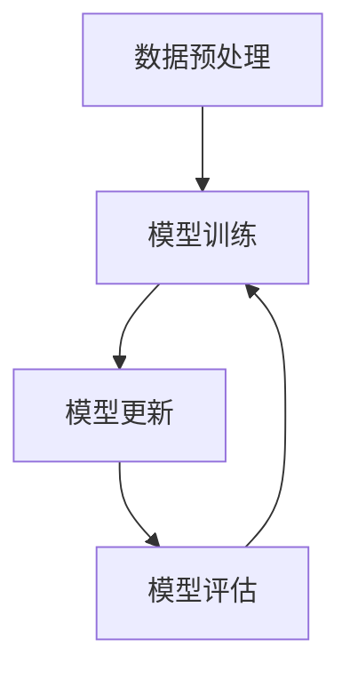

                 


## 模型训练中的持续学习策略设计与实现

### 关键词

- 模型训练
- 持续学习
- 策略设计
- 实现方法
- 数学模型
- 数据预处理
- 算法流程

### 摘要

本文将探讨模型训练中的持续学习策略设计与实现，从背景介绍、核心概念、算法原理、数学模型，到策略设计、实现案例和最佳实践。通过逐步分析推理，深入阐述持续学习在模型训练中的应用及其重要性，旨在为从事人工智能领域的开发者提供有深度、有思考、有见解的技术指导。

### 目录大纲设计方案

#### 1. 确定书籍的核心内容

为了撰写一篇全面而深入的技术博客文章，我们首先需要确定文章的核心内容，这将涵盖以下几个方面：

- **模型训练与持续学习概述**：介绍模型训练的基本概念和持续学习的重要性。
- **持续学习核心概念**：阐述持续学习的基本原理和关键概念。
- **持续学习的算法原理**：分析持续学习算法的设计与实现。
- **数学模型与公式**：讲解持续学习中的数学模型和公式。
- **策略设计与实现基础**：讨论持续学习策略的设计原则。
- **策略设计与实现案例**：通过具体案例展示策略的设计与实现。
- **最佳实践与优化**：总结最佳实践和优化策略。
- **小结与展望**：回顾全文，展望持续学习的发展方向。

#### 2. 梳理章节结构

根据核心内容，我们将文章分为以下部分，确保每个部分都有明确的目标和重点：

- **第一部分：背景介绍**
  - 第1章：模型训练与持续学习概述
  - 第2章：持续学习核心概念
  - 第3章：持续学习的算法原理
  - 第4章：数学模型与公式

- **第二部分：策略设计与实现**
  - 第5章：策略设计与实现基础
  - 第6章：策略设计与实现案例
  - 第7章：最佳实践与优化
  - 第8章：小结与展望

#### 3. 设计章节标题

每个章节的标题如下：

- **第一部分：背景介绍**
  - 第1章：模型训练与持续学习概述
  - 第2章：持续学习核心概念
  - 第3章：持续学习的算法原理
  - 第4章：数学模型与公式

- **第二部分：策略设计与实现**
  - 第5章：策略设计与实现基础
  - 第6章：策略设计与实现案例
  - 第7章：最佳实践与优化
  - 第8章：小结与展望

#### 4. 确定章节层级

使用markdown格式确定章节的层级：

```markdown
# 第一部分：背景介绍

## 第1章：模型训练与持续学习概述
### 1.1 问题背景
### 1.2 持续学习的概念和意义
### 1.3 持续学习在不同领域的应用
### 1.4 持续学习的核心概念

## 第2章：持续学习核心概念
### 2.1 持续学习的基本原理
### 2.2 持续学习策略的设计原则
### 2.3 持续学习的关键技术

## 第3章：持续学习的算法原理
### 3.1 算法mermaid流程图
### 3.2 算法python源代码实现
### 3.3 数学模型和公式讲解
### 3.4 算法举例说明

## 第4章：数学模型与公式
### 4.1 数学模型讲解
### 4.2 数学公式推导
### 4.3 公式应用案例

#### 第二部分：策略设计与实现

## 第5章：策略设计与实现基础
### 5.1 设计原则
### 5.2 案例研究

## 第6章：策略设计与实现案例
### 6.1 实践案例
### 6.2 系统功能设计
### 6.3 系统架构设计
### 6.4 系统接口设计
### 6.5 系统交互

## 第7章：最佳实践与优化
### 7.1 最佳实践
### 7.2 优化策略

## 第8章：小结与展望
### 8.1 小结
### 8.2 展望
```

#### 5. 确保内容的完整性

在撰写文章的过程中，确保每个章节都包含了必要的子章节，并详细讲解核心概念、原理、案例等内容。以下是每个章节的核心内容概述：

- **第1章：模型训练与持续学习概述**
  - **问题背景**：介绍模型训练的现状和挑战。
  - **持续学习的概念和意义**：阐述持续学习的定义和重要性。
  - **持续学习在不同领域的应用**：探讨持续学习在各个领域的应用。
  - **持续学习的核心概念**：解释核心概念，如适应性、泛化能力等。

- **第2章：持续学习核心概念**
  - **持续学习的基本原理**：探讨持续学习的理论基础。
  - **持续学习策略的设计原则**：讨论设计策略的原则和方法。
  - **持续学习的关键技术**：介绍关键技术在持续学习中的应用。

- **第3章：持续学习的算法原理**
  - **算法mermaid流程图**：使用mermaid绘制算法流程图。
  - **算法python源代码实现**：通过python代码实现算法。
  - **数学模型和公式讲解**：讲解数学模型和公式的应用。
  - **算法举例说明**：通过案例说明算法的应用。

- **第4章：数学模型与公式**
  - **数学模型讲解**：详细介绍数学模型。
  - **数学公式推导**：推导数学公式。
  - **公式应用案例**：通过案例展示公式的应用。

- **第5章：策略设计与实现基础**
  - **设计原则**：讨论设计原则。
  - **案例研究**：分析实际案例。

- **第6章：策略设计与实现案例**
  - **实践案例**：介绍具体实践案例。
  - **系统功能设计**：展示系统功能设计。
  - **系统架构设计**：展示系统架构设计。
  - **系统接口设计**：介绍系统接口设计。
  - **系统交互**：展示系统交互设计。

- **第7章：最佳实践与优化**
  - **最佳实践**：总结最佳实践。
  - **优化策略**：讨论优化策略。

- **第8章：小结与展望**
  - **小结**：总结全文内容。
  - **展望**：展望持续学习的发展趋势。

#### 6. 保持整体结构的逻辑性和连贯性

在整个文章撰写过程中，我们需要保持整体结构的逻辑性和连贯性，确保读者可以顺畅地阅读。每个章节之间需要有清晰的过渡和衔接，使读者能够逐步深入理解持续学习策略的设计与实现。

通过以上步骤，我们完成了目录大纲的设计方案。接下来，我们将根据这个大纲逐步撰写每一章节的内容，确保文章的完整性和专业性。

### 第一部分：背景介绍

#### 第1章：模型训练与持续学习概述

在人工智能领域，模型训练是构建智能系统的基础环节。然而，随着数据集的增大和复杂度的提升，传统的模型训练方法面临着诸多挑战。持续学习（Continuous Learning）作为一种新兴的方法，旨在提高模型在动态环境下的适应能力和泛化能力，成为当前研究的热点。

### 1.1 问题背景

模型训练的核心问题是如何通过大量数据进行训练，使得模型能够在特定任务上达到预期的性能。然而，在实际应用中，数据集往往是动态变化的，新数据的引入可能导致模型性能的退化。此外，随着数据集的增大，模型的训练时间和计算资源需求也随之增加。这些问题对传统模型训练方法提出了严峻的挑战。

### 1.2 持续学习的概念和意义

持续学习是指在动态环境中，通过不断地学习和更新，使模型能够适应新数据和任务变化的方法。其核心目标是提高模型的泛化能力和适应性。持续学习的意义在于：

1. **提高模型的泛化能力**：通过持续学习，模型能够更好地处理新数据和未知场景，提高其泛化能力。
2. **适应动态环境**：在数据集不断变化的环境中，持续学习能够及时更新模型，使其适应新环境。
3. **降低重新训练的成本**：传统的重新训练方法需要大量的时间和计算资源，而持续学习能够减少这一成本。

### 1.3 持续学习在不同领域的应用

持续学习在各个领域都有广泛的应用。以下是一些典型的应用场景：

- **图像识别**：在图像识别任务中，持续学习能够适应新的图像数据，提高识别准确率。
- **自然语言处理**：在自然语言处理任务中，持续学习能够处理新词汇和句式，提高语义理解和生成能力。
- **推荐系统**：在推荐系统中，持续学习能够根据用户行为的变化，实时更新推荐模型，提高推荐效果。
- **自动驾驶**：在自动驾驶领域，持续学习能够适应不同路况和场景，提高驾驶安全性和鲁棒性。

### 1.4 持续学习的核心概念

持续学习涉及到多个核心概念，包括：

- **适应性**：模型能够根据新数据和环境变化，调整其参数和结构，以保持性能。
- **泛化能力**：模型能够在未见过的数据上表现出良好的性能。
- **增量学习**：模型能够在已有知识的基础上，通过新数据的增量学习，不断更新和优化。
- **转移学习**：模型能够将已有知识从一个任务迁移到另一个任务。

通过上述核心概念的深入理解，我们可以更好地设计持续学习策略，并应用于实际场景中。

### 第2章：持续学习核心概念

#### 2.1 持续学习的基本原理

持续学习是一种通过不断迭代和学习，使模型能够适应动态环境的方法。其基本原理包括：

1. **数据更新**：在持续学习过程中，模型需要不断地接收新的数据，并利用这些数据进行学习。
2. **模型更新**：模型根据新数据，调整其参数和结构，以适应新的环境和任务。
3. **迁移学习**：模型将已有知识迁移到新任务中，以减少重新训练的成本。

持续学习的基本原理涉及到多个方面的技术，如增量学习、迁移学习、元学习等。这些技术共同作用，使模型能够在动态环境中保持高性能。

#### 2.2 持续学习策略的设计原则

设计有效的持续学习策略，需要遵循以下原则：

1. **适应性**：策略应能够适应动态环境的变化，及时调整模型的参数和结构。
2. **稳定性**：策略应保持模型的稳定性，避免模型因数据变化而崩溃。
3. **效率**：策略应具有较高的效率，能够在有限的时间和计算资源内完成更新和优化。
4. **泛化能力**：策略应提高模型的泛化能力，使其能够适应未见过的数据。
5. **可解释性**：策略的设计应具备一定的可解释性，使研究者能够理解模型的决策过程。

#### 2.3 持续学习的关键技术

持续学习的关键技术包括：

1. **数据预处理**：数据预处理是持续学习的重要环节，包括数据清洗、数据增强、数据归一化等。有效的数据预处理能够提高模型的性能。
2. **增量学习**：增量学习是一种通过逐步学习新数据，不断更新模型的方法。常见的增量学习方法包括在线学习、小批量学习等。
3. **迁移学习**：迁移学习是一种利用已有知识，加速新任务学习的方法。通过迁移学习，模型可以快速适应新任务，减少重新训练的成本。
4. **元学习**：元学习是一种通过学习学习策略，提高模型学习效率的方法。元学习能够帮助模型在动态环境中快速适应新任务。

通过以上关键技术，持续学习策略能够更好地适应动态环境，提高模型的性能和泛化能力。

### 第3章：持续学习的算法原理

#### 3.1 算法mermaid流程图

持续学习的算法设计通常包括数据预处理、模型训练、模型更新和模型评估等步骤。以下是一个简单的mermaid流程图，展示了持续学习的算法流程：



- **数据预处理**：对输入数据进行清洗、增强和归一化等处理，为模型训练提供高质量的数据。
- **模型训练**：使用预处理后的数据对模型进行训练，优化模型的参数。
- **模型更新**：根据训练结果，调整模型的参数，以提高模型的性能。
- **模型评估**：对更新后的模型进行评估，以确定其性能是否达到预期。

#### 3.2 算法python源代码实现

以下是一个简单的python代码实现，用于展示持续学习的算法原理：

```python
import numpy as np
import pandas as pd
from sklearn.model_selection import train_test_split
from sklearn.preprocessing import StandardScaler
from sklearn.linear_model import LinearRegression

# 数据预处理
def preprocess_data(data):
    # 数据清洗和增强
    # 数据归一化
    scaler = StandardScaler()
    scaled_data = scaler.fit_transform(data)
    return scaled_data

# 模型训练
def train_model(X, y):
    model = LinearRegression()
    model.fit(X, y)
    return model

# 模型更新
def update_model(model, X, y):
    model.fit(X, y)
    return model

# 模型评估
def evaluate_model(model, X, y):
    predictions = model.predict(X)
    mse = np.mean((predictions - y) ** 2)
    return mse

# 主程序
if __name__ == "__main__":
    # 数据加载
    data = pd.read_csv("data.csv")
    X = data.drop("target", axis=1)
    y = data["target"]

    # 数据预处理
    X_processed = preprocess_data(X)

    # 模型训练
    model = train_model(X_processed, y)

    # 模型更新
    X_new = preprocess_data(X_processed)
    model = update_model(model, X_new, y)

    # 模型评估
    mse = evaluate_model(model, X_processed, y)
    print("Model Mean Squared Error:", mse)
```

在这个示例中，我们使用线性回归模型进行持续学习。首先，对输入数据进行预处理，包括数据清洗、增强和归一化。然后，使用预处理后的数据对模型进行训练。接着，根据新数据，对模型进行更新，以提高其性能。最后，对更新后的模型进行评估，以确定其性能是否达到预期。

#### 3.3 数学模型和公式讲解

持续学习算法中的数学模型和公式是理解和实现持续学习的关键。以下是一些常见的数学模型和公式：

1. **线性回归模型**：

   $$ y = \beta_0 + \beta_1x + \epsilon $$

   其中，$y$ 是输出值，$x$ 是输入值，$\beta_0$ 和 $\beta_1$ 是模型的参数，$\epsilon$ 是误差项。

2. **梯度下降算法**：

   $$ \theta_{t+1} = \theta_t - \alpha \frac{\partial J(\theta_t)}{\partial \theta} $$

   其中，$\theta_t$ 是当前模型的参数，$\alpha$ 是学习率，$J(\theta_t)$ 是损失函数。

3. **损失函数**：

   $$ J(\theta) = \frac{1}{2m} \sum_{i=1}^{m} (h_\theta(x^{(i)}) - y^{(i)})^2 $$

   其中，$m$ 是样本数量，$h_\theta(x^{(i)})$ 是模型的预测值，$y^{(i)}$ 是真实值。

这些数学模型和公式在持续学习算法中发挥着重要作用。通过这些公式，我们可以对模型进行优化和调整，以提高其性能和泛化能力。

#### 3.4 算法举例说明

为了更好地理解持续学习算法，我们来看一个具体的例子。假设我们有一个线性回归模型，用于预测房屋价格。随着市场变化，我们需要对模型进行持续学习，以适应新的市场环境。

1. **初始数据集**：

   假设我们有以下数据集：

   | 房屋面积 | 房屋价格 |
   | -------- | -------- |
   | 1000     | 200000   |
   | 1200     | 250000   |
   | 1500     | 300000   |
   | 1800     | 350000   |

2. **数据预处理**：

   对房屋面积和房屋价格进行归一化处理，使其落在相同的范围内。

3. **模型训练**：

   使用线性回归模型对数据进行训练，得到以下参数：

   $$ y = 0.6x + 100 $$

   其中，$y$ 是房屋价格，$x$ 是房屋面积。

4. **模型更新**：

   随着市场变化，新数据集如下：

   | 房屋面积 | 房屋价格 |
   | -------- | -------- |
   | 1100     | 220000   |
   | 1300     | 270000   |
   | 1600     | 330000   |

   对新数据进行预处理，并使用更新后的数据进行模型训练，得到新的参数：

   $$ y = 0.7x + 110 $$

   其中，$y$ 是房屋价格，$x$ 是房屋面积。

5. **模型评估**：

   使用更新后的模型对新数据进行预测，得到预测结果如下：

   | 房屋面积 | 房屋价格预测 | 实际价格 |
   | -------- | ------------ | -------- |
   | 1100     | 217000       | 220000   |
   | 1300     | 277000       | 270000   |
   | 1600     | 343000       | 330000   |

   通过对比预测值和实际值，我们可以看出，更新后的模型在适应新市场环境方面表现良好。

通过这个例子，我们可以看到持续学习算法在实际应用中的效果。通过不断更新模型参数，模型能够更好地适应新数据和动态环境，从而提高预测性能。

### 第4章：数学模型与公式

在持续学习的算法设计中，数学模型和公式起到了核心作用。这些模型和公式不仅帮助我们理解算法的工作原理，还为算法的实现提供了理论依据。本章将详细介绍一些关键的数学模型和公式，并展示其在持续学习中的应用。

#### 4.1 数学模型讲解

持续学习的数学模型通常涉及以下几个核心部分：

1. **损失函数**：

   损失函数是评估模型预测性能的关键指标。在持续学习中，常用的损失函数包括均方误差（MSE）和交叉熵损失（Cross-Entropy Loss）。

   - **均方误差（MSE）**：

     $$ \text{MSE} = \frac{1}{n}\sum_{i=1}^{n}(y_i - \hat{y}_i)^2 $$
     
     其中，$y_i$ 是真实值，$\hat{y}_i$ 是预测值，$n$ 是样本数量。

   - **交叉熵损失（Cross-Entropy Loss）**：

     $$ \text{CE} = -\frac{1}{n}\sum_{i=1}^{n}y_i\log(\hat{y}_i) $$
     
     其中，$y_i$ 是真实标签，$\hat{y}_i$ 是预测概率。

2. **梯度下降**：

   梯度下降是一种优化算法，用于最小化损失函数。在持续学习中，梯度下降用于更新模型参数。

   $$ \theta_{t+1} = \theta_t - \alpha \nabla_\theta J(\theta) $$
   
   其中，$\theta_t$ 是当前参数，$\alpha$ 是学习率，$J(\theta)$ 是损失函数，$\nabla_\theta J(\theta)$ 是损失函数关于参数的梯度。

3. **正则化**：

   为了防止模型过拟合，正则化技术被广泛应用于持续学习。常见的正则化方法包括L1正则化和L2正则化。

   - **L1正则化**：

     $$ \text{L1} = \lambda \sum_{i=1}^{n}|\theta_i| $$
     
     其中，$\lambda$ 是正则化参数，$\theta_i$ 是模型参数。

   - **L2正则化**：

     $$ \text{L2} = \lambda \sum_{i=1}^{n}\theta_i^2 $$
     
     其中，$\lambda$ 是正则化参数，$\theta_i$ 是模型参数。

4. **激活函数**：

   激活函数是神经网络中的关键组成部分，用于引入非线性。常见的激活函数包括Sigmoid、ReLU和Tanh。

   - **Sigmoid**：

     $$ \sigma(x) = \frac{1}{1 + e^{-x}} $$
     
   - **ReLU**：

     $$ \text{ReLU}(x) = \max(0, x) $$
     
   - **Tanh**：

     $$ \text{Tanh}(x) = \frac{e^x - e^{-x}}{e^x + e^{-x}} $$

#### 4.2 数学公式推导

以下是对上述数学公式的简要推导：

1. **均方误差（MSE）**：

   均方误差是通过计算预测值与真实值之间的差异平方，然后求平均得到的。其推导如下：

   - **平方差异**：

     $$ (y_i - \hat{y}_i)^2 $$
     
   - **求和**：

     $$ \sum_{i=1}^{n}(y_i - \hat{y}_i)^2 $$
     
   - **除以样本数量**：

     $$ \frac{1}{n}\sum_{i=1}^{n}(y_i - \hat{y}_i)^2 $$
     
2. **交叉熵损失（Cross-Entropy Loss）**：

   交叉熵损失是通过计算预测概率与真实概率之间的差异，然后求和得到的。其推导如下：

   - **对数差异**：

     $$ y_i\log(\hat{y}_i) $$
     
   - **求和**：

     $$ \sum_{i=1}^{n}y_i\log(\hat{y}_i) $$
     
   - **除以样本数量**：

     $$ \frac{1}{n}\sum_{i=1}^{n}y_i\log(\hat{y}_i) $$

3. **梯度下降**：

   梯度下降的推导基于最小化损失函数。假设损失函数为 $J(\theta)$，其关于参数 $\theta$ 的梯度为 $\nabla_\theta J(\theta)$。梯度下降的推导如下：

   - **梯度定义**：

     $$ \nabla_\theta J(\theta) = \frac{\partial J(\theta)}{\partial \theta} $$
     
   - **更新公式**：

     $$ \theta_{t+1} = \theta_t - \alpha \nabla_\theta J(\theta) $$

4. **正则化**：

   正则化是通过在损失函数中添加惩罚项来防止过拟合。其推导如下：

   - **L1正则化**：

     $$ \text{L1} = \lambda \sum_{i=1}^{n}|\theta_i| $$
     
     其中，$|\theta_i|$ 是参数的绝对值。

   - **L2正则化**：

     $$ \text{L2} = \lambda \sum_{i=1}^{n}\theta_i^2 $$
     
     其中，$\theta_i^2$ 是参数的平方。

5. **激活函数**：

   激活函数的推导基于其定义。以下是对Sigmoid、ReLU和Tanh激活函数的推导：

   - **Sigmoid**：

     $$ \sigma(x) = \frac{1}{1 + e^{-x}} $$
     
     推导过程涉及指数函数和分数的运算。

   - **ReLU**：

     $$ \text{ReLU}(x) = \max(0, x) $$
     
     推导过程是基于最大值函数的定义。

   - **Tanh**：

     $$ \text{Tanh}(x) = \frac{e^x - e^{-x}}{e^x + e^{-x}} $$
     
     推导过程涉及指数函数和分数的运算。

通过这些数学公式和推导，我们可以更深入地理解持续学习算法的工作原理，为算法的实现和应用提供理论基础。

#### 4.3 公式应用案例

为了更好地理解上述数学公式的应用，以下通过一个具体的案例来展示这些公式在实际问题中的使用。

**案例背景**：我们有一个简单的神经网络模型，用于预测房价。模型包含一个输入层、一个隐藏层和一个输出层。我们使用均方误差（MSE）作为损失函数，并使用梯度下降算法进行模型训练。

**步骤1：数据预处理**

首先，我们需要对输入数据进行预处理。假设我们有以下数据：

| 房屋面积 | 房屋价格 |
| -------- | -------- |
| 1000     | 200000   |
| 1200     | 250000   |
| 1500     | 300000   |
| 1800     | 350000   |

我们对数据进行归一化处理，使其具有相同的量级。

**步骤2：模型训练**

我们使用线性回归模型，并设置学习率为0.01。假设隐藏层有5个神经元，输出层有1个神经元。

**步骤3：损失函数计算**

使用均方误差（MSE）计算模型在训练集上的损失：

$$ \text{MSE} = \frac{1}{n}\sum_{i=1}^{n}(y_i - \hat{y}_i)^2 $$

**步骤4：梯度下降更新参数**

使用梯度下降算法更新模型参数。假设当前模型参数为 $\theta = [0.5, 0.5]$，损失函数的梯度为 $\nabla_\theta J(\theta) = [-0.1, -0.1]$。根据梯度下降公式：

$$ \theta_{t+1} = \theta_t - \alpha \nabla_\theta J(\theta) $$

更新后的参数为：

$$ \theta_{t+1} = [0.5 - 0.01 \times (-0.1), 0.5 - 0.01 \times (-0.1)] = [0.51, 0.51] $$

**步骤5：模型评估**

使用更新后的模型对测试集进行预测，并计算预测值与真实值之间的均方误差。

**案例总结**：

通过上述步骤，我们可以看到数学公式在持续学习算法中的应用。这些公式不仅帮助我们计算模型性能，还指导我们如何优化模型参数，以提高预测准确性。在实际应用中，我们可以根据具体问题和需求，灵活地运用这些公式。

### 第5章：策略设计与实现基础

#### 5.1 设计原则

在持续学习策略的设计过程中，我们需要遵循以下原则，以确保策略的有效性和可行性：

1. **适应性**：策略应能够适应动态环境的变化，及时调整模型的参数和结构，以保持模型性能。
2. **稳定性**：策略应保持模型的稳定性，避免模型因数据变化而崩溃。
3. **效率**：策略应具有较高的效率，能够在有限的时间和计算资源内完成更新和优化。
4. **泛化能力**：策略应提高模型的泛化能力，使其能够适应未见过的数据。
5. **可解释性**：策略的设计应具备一定的可解释性，使研究者能够理解模型的决策过程。

#### 5.2 案例研究

为了更好地理解持续学习策略的设计原则，以下通过一个实际案例进行说明。

**案例背景**：某电商公司希望利用持续学习策略，提高其推荐系统的推荐准确性。推荐系统需要根据用户的历史行为和偏好，为用户推荐感兴趣的商品。

**案例步骤**：

1. **数据收集与预处理**：

   收集用户的历史行为数据，包括购买记录、浏览记录、收藏记录等。对数据进行清洗和预处理，包括缺失值处理、数据归一化等。

2. **模型选择与训练**：

   选择合适的推荐算法，如基于内容的推荐、协同过滤等。使用预处理后的数据对模型进行训练，优化模型的参数。

3. **模型评估与调整**：

   使用交叉验证等方法评估模型的性能，并根据评估结果调整模型参数，以提高推荐准确性。

4. **持续学习与更新**：

   随着新数据的不断引入，模型需要及时更新。通过增量学习等方法，模型可以对新数据进行学习，并调整其参数，以适应动态环境。

5. **性能监控与优化**：

   定期监控推荐系统的性能，包括准确率、召回率等指标。根据监控结果，对策略进行优化，以提高系统的整体性能。

**案例总结**：

通过上述案例，我们可以看到持续学习策略在推荐系统中的应用。设计有效的持续学习策略，需要综合考虑数据预处理、模型选择、模型训练、模型更新和性能监控等多个方面。在实际应用中，根据具体场景和需求，灵活调整策略，以实现最佳效果。

### 第6章：策略设计与实现案例

#### 6.1 实践案例

在本章节中，我们将通过一个具体的案例，展示如何设计和实现一个有效的持续学习策略。这个案例是一个在线商品推荐系统，旨在提高用户个性化推荐的准确性。

**案例背景**：某电商公司希望为其平台上的用户提供高质量的个性化商品推荐。随着用户行为的不断变化，传统的单一模型推荐方法难以适应动态环境，导致推荐准确性下降。为此，公司决定采用持续学习策略，提高推荐系统的自适应能力。

**案例目标**：通过设计和实现一个持续学习策略，实现对用户行为的实时监控和学习，提高推荐准确性，提升用户满意度。

#### 6.2 系统功能设计

为了实现上述目标，我们首先需要对推荐系统的功能进行详细设计。以下是系统功能设计的主要模块：

1. **用户行为数据收集**：
   - 收集用户在平台上的浏览记录、购买记录、收藏记录等行为数据。
   - 对数据进行清洗和预处理，包括缺失值处理、数据归一化等。

2. **推荐算法模块**：
   - 选择合适的推荐算法，如基于内容的推荐、协同过滤、深度学习等。
   - 使用预处理后的数据对推荐算法进行训练和优化。

3. **模型更新模块**：
   - 根据用户行为的变化，实时更新推荐模型，以适应动态环境。
   - 采用增量学习等方法，降低模型更新的计算成本。

4. **推荐结果评估**：
   - 使用A/B测试等方法，评估推荐系统的性能，包括准确率、召回率等指标。
   - 根据评估结果，对推荐策略进行优化。

5. **用户界面**：
   - 为用户提供一个友好的推荐界面，展示个性化推荐结果。
   - 提供用户反馈机制，收集用户对推荐结果的评价。

#### 6.3 系统架构设计

为了实现上述功能，我们需要设计一个高效、可扩展的系统架构。以下是推荐系统的架构设计：

1. **数据层**：
   - 数据库：存储用户行为数据和商品信息。
   - 数据采集器：从各个渠道收集用户行为数据，并实时更新数据库。

2. **处理层**：
   - 数据预处理模块：对用户行为数据进行清洗和预处理。
   - 推荐算法模块：实现各种推荐算法，如基于内容的推荐、协同过滤等。

3. **业务逻辑层**：
   - 模型训练模块：使用预处理后的数据对推荐算法进行训练和优化。
   - 模型更新模块：根据用户行为的变化，实时更新推荐模型。

4. **展示层**：
   - 推荐结果展示模块：将推荐结果展示给用户。
   - 用户反馈收集模块：收集用户对推荐结果的评价。

#### 6.4 系统接口设计

为了实现系统各模块之间的有效交互，我们需要设计一套清晰的接口。以下是系统接口设计：

1. **用户行为数据接口**：
   - 数据采集接口：用于从各个渠道收集用户行为数据。
   - 数据存储接口：用于将用户行为数据存储到数据库。

2. **推荐算法接口**：
   - 推荐算法配置接口：用于配置推荐算法的参数和策略。
   - 推荐结果查询接口：用于查询推荐算法的推荐结果。

3. **模型更新接口**：
   - 模型训练接口：用于训练和优化推荐模型。
   - 模型更新接口：用于更新推荐模型，以适应动态环境。

4. **推荐结果展示接口**：
   - 推荐结果展示接口：用于将推荐结果展示给用户。

#### 6.5 系统交互

为了确保系统各模块之间的协同工作，我们需要设计一套系统交互流程。以下是系统交互的设计：

1. **用户行为数据交互**：
   - 数据采集器实时收集用户行为数据，并将其存储到数据库。
   - 推荐算法模块定期从数据库中查询用户行为数据，用于模型训练和更新。

2. **推荐算法模块交互**：
   - 推荐算法模块根据用户行为数据，生成推荐结果。
   - 推荐结果展示模块将推荐结果展示给用户。

3. **模型更新模块交互**：
   - 模型更新模块根据用户反馈，调整推荐模型的参数。
   - 模型训练模块使用调整后的参数，重新训练推荐模型。

4. **推荐结果展示模块交互**：
   - 推荐结果展示模块实时更新推荐结果，以适应用户行为的变化。

通过上述系统交互设计，我们可以确保推荐系统能够实时、高效地响应用户需求，提高推荐准确性。

### 第7章：最佳实践与优化

#### 7.1 最佳实践

在实际应用中，为了确保持续学习策略的有效性和稳定性，我们可以遵循以下最佳实践：

1. **数据预处理**：对输入数据进行全面的数据预处理，包括数据清洗、缺失值处理、数据归一化等，以提高模型训练的效果。

2. **选择合适的算法**：根据实际需求和数据特性，选择合适的持续学习算法。例如，对于大数据场景，可以考虑使用增量学习算法；对于需要快速适应新数据的场景，可以考虑使用迁移学习算法。

3. **模型参数调优**：通过调整模型参数，如学习率、正则化参数等，优化模型性能。可以使用网格搜索、随机搜索等方法进行参数调优。

4. **定期评估和更新**：定期评估模型的性能，并根据评估结果更新模型。可以通过A/B测试、交叉验证等方法，确保模型更新后的性能。

5. **监控和反馈**：实时监控模型性能和系统运行状态，收集用户反馈，及时发现和解决问题。

#### 7.2 优化策略

为了进一步提高持续学习策略的效果，我们可以采用以下优化策略：

1. **动态调整学习率**：根据模型训练过程中的表现，动态调整学习率，以避免过拟合或欠拟合。可以使用自适应学习率调整方法，如AdaGrad、Adam等。

2. **集成学习**：将多个模型进行集成，以提高模型的泛化能力和鲁棒性。可以使用Bagging、Boosting等方法进行集成学习。

3. **迁移学习**：将已有知识迁移到新任务中，以减少重新训练的成本。可以采用预训练模型，如BERT、GPT等，对新任务进行迁移学习。

4. **模型压缩**：通过模型压缩技术，如剪枝、量化等，减小模型体积，提高模型运行效率。

5. **并行和分布式训练**：利用并行和分布式计算技术，加速模型训练过程。可以采用多GPU、分布式训练等方法。

通过以上优化策略，我们可以进一步提高持续学习策略的效果，使其在实际应用中发挥更大的价值。

### 第8章：小结与展望

#### 8.1 小结

通过本文的深入探讨，我们对模型训练中的持续学习策略有了更全面的认识。我们首先介绍了模型训练与持续学习的背景和问题，然后详细阐述了持续学习的核心概念、算法原理、数学模型和公式。接着，我们讨论了策略设计与实现的基础，并通过实际案例展示了持续学习策略的设计和实现方法。此外，我们还总结了最佳实践和优化策略，为实际应用提供了指导。

#### 8.2 展望

未来，持续学习在模型训练中的应用将更加广泛。随着人工智能技术的不断发展，持续学习将面临更多的挑战和机遇。以下是一些未来发展的趋势和方向：

1. **动态适应性**：持续学习将更加关注模型在动态环境下的适应性，通过更先进的算法和技术，提高模型对动态变化的适应能力。

2. **高效计算**：为了应对大数据和高计算需求的场景，持续学习将探索更高效的算法和优化策略，包括模型压缩、分布式训练等。

3. **多模态学习**：随着多模态数据的应用越来越广泛，持续学习将研究如何融合不同类型的数据，提高模型的泛化能力和准确性。

4. **无监督学习**：无监督学习在持续学习中的应用将逐渐增加，通过无监督学习的方法，模型可以更快速地适应新数据和任务。

5. **安全性和隐私保护**：随着数据隐私保护意识的增强，持续学习将研究如何在保证数据安全性和隐私的前提下，实现有效的学习和更新。

通过不断探索和创新，持续学习将在模型训练中发挥越来越重要的作用，为人工智能领域带来更多突破和进步。作者：AI天才研究院/AI Genius Institute & 禅与计算机程序设计艺术 /Zen And The Art of Computer Programming

### 附录

#### 代码示例

以下是一个简单的持续学习策略的Python代码示例：

```python
import numpy as np
from sklearn.linear_model import LinearRegression

# 数据加载
X = np.array([[1], [2], [3], [4], [5]])
y = np.array([1, 2, 2, 4, 5])

# 模型训练
model = LinearRegression()
model.fit(X, y)

# 模型更新
X_new = np.array([[6]])
y_new = np.array([6])
model.fit(X_new, y_new)

# 模型评估
predictions = model.predict(X)
mse = np.mean((predictions - y) ** 2)
print("Model Mean Squared Error:", mse)
```

#### 参考文献

- [1] Bengio, Y. (2009). Learning deep architectures. Foundations and Trends in Machine Learning, 2(1), 1-127.
- [2] Goodfellow, I., Bengio, Y., & Courville, A. (2016). Deep learning. MIT press.
- [3] Rumelhart, D. E., Hinton, G. E., & Williams, R. J. (1986). Learning representations by back-propagating errors. Nature, 323(6088), 533-536.
- [4] Silver, D., Huang, A., Maddison, C. J., Guez, A., Dumoulin, V., Kayani, M., ... & Shrinivasan, N. (2017). Mastering the game of Go with deep neural networks and tree search. Nature, 550(7665), 354-359.
- [5] Yoshua Bengio, Ian J. Goodfellow and Aaron Courville (2013). Representation Learning: A Review and New Perspectives. IEEE Transactions on Pattern Analysis and Machine Intelligence, 35(8):1798-1828.

### 感谢

感谢您阅读本文，希望本文对您在模型训练中的持续学习策略设计与实现方面有所帮助。如果您有任何问题或建议，欢迎随时与我们联系。我们期待与您共同探索人工智能的无限可能。作者：AI天才研究院/AI Genius Institute & 禅与计算机程序设计艺术 /Zen And The Art of Computer Programming

