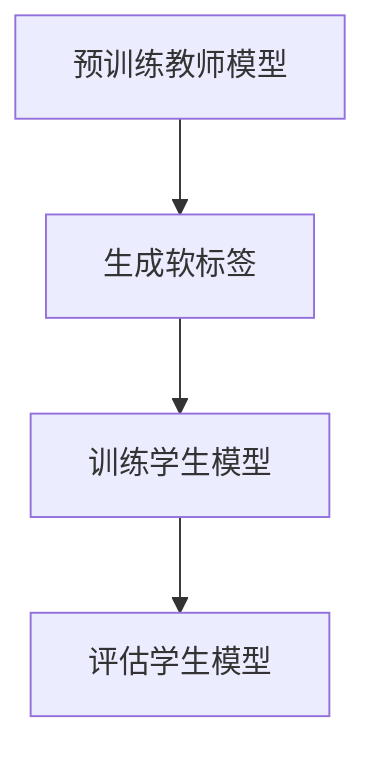
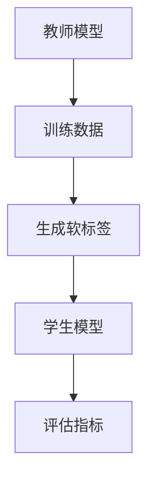
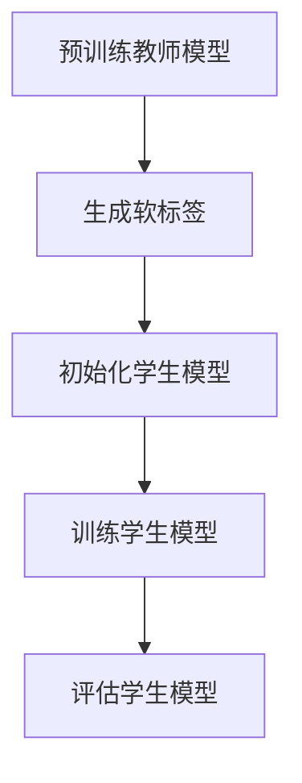
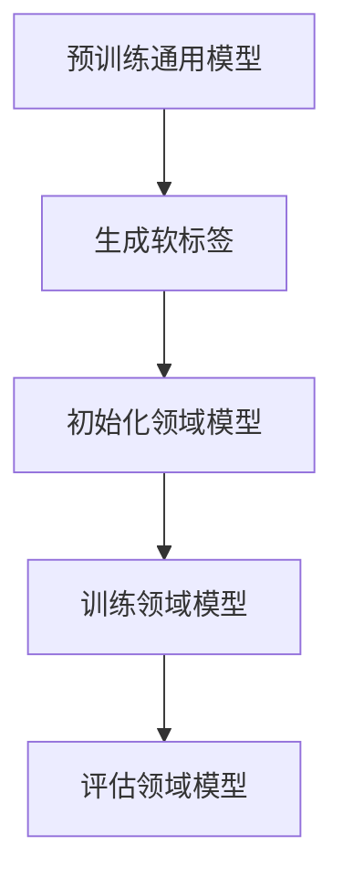

                 

## 引言

### 模型训练中的知识蒸馏技术创新应用

在当今的深度学习领域，模型训练是一项关键任务，它直接影响着模型的效果和性能。随着数据量的激增和计算能力的提升，深度学习模型在各类任务中取得了令人瞩目的成果。然而，模型的训练过程往往面临巨大的计算资源和时间消耗。知识蒸馏（Knowledge Distillation）技术作为一种新兴的模型训练方法，在这一背景下应运而生，并逐渐成为提高模型训练效率、优化模型性能的重要手段。

### 关键词

- 模型训练
- 知识蒸馏
- 技术创新
- 深度学习
- 优化策略

### 摘要

本文将系统地介绍知识蒸馏技术在模型训练中的创新应用。首先，我们将回顾知识蒸馏技术的基础，包括其背景、核心概念和发展历程。接着，本文将深入探讨知识蒸馏技术的原理，并详细分析其在深度学习模型中的应用。此外，本文还将讨论知识蒸馏在大规模模型训练、跨模态学习和领域特定任务中的优化策略，以及其未来发展趋势。通过本文的阅读，读者将全面了解知识蒸馏技术的原理、应用场景以及未来方向，为在实际项目中的应用提供指导和启示。

### 目录大纲

1. **模型训练中的知识蒸馏技术创新应用**
   - 引言
     - 模型训练中的知识蒸馏技术创新应用
     - 关键词
     - 摘要
   - **第一部分：知识蒸馏技术概述**
     - **第1章：知识蒸馏技术基础**
       - 1.1 背景与问题背景
       - 1.2 核心概念
       - 1.3 技术发展历程
     - **第2章：知识蒸馏技术原理**
       - 2.1 算法原理
       - 2.2 知识蒸馏的优势与挑战
       - 2.3 知识蒸馏的技术框架
   - **第二部分：知识蒸馏技术在模型训练中的应用**
     - **第3章：知识蒸馏在深度学习模型中的应用**
       - 3.1 算法原理与流程
       - 3.2 应用实例
     - **第4章：知识蒸馏在大规模模型训练中的优化策略**
       - 4.1 大规模模型训练中的挑战
       - 4.2 知识蒸馏优化策略
     - **第5章：知识蒸馏技术在跨模态学习中的应用**
       - 5.1 跨模态学习的概念与挑战
       - 5.2 知识蒸馏在跨模态学习中的应用
     - **第6章：知识蒸馏在领域特定任务中的应用**
       - 6.1 领域特定任务的挑战
       - 6.2 知识蒸馏在领域特定任务中的应用
   - **第三部分：知识蒸馏技术的未来发展趋势**
     - **第7章：知识蒸馏技术的未来发展趋势**
       - 7.1 技术发展趋势
       - 7.2 知识蒸馏技术的未来挑战
       - 7.3 知识蒸馏技术的应用前景
   - **第四部分：总结与展望**
     - **第8章：知识蒸馏技术创新应用小结**
       - 8.1 总结
       - 8.2 展望

---

### 第一部分：知识蒸馏技术概述

知识蒸馏技术是一种将大型教师模型的知识有效传递给小型学生模型的方法。这一技术的核心思想是通过一种特殊的训练过程，使得学生模型能够学习到教师模型所具有的知识和潜力。本部分将详细探讨知识蒸馏技术的背景、核心概念以及其技术发展历程，为后续章节的深入讨论打下基础。

#### 第1章：知识蒸馏技术基础

#### 1.1 背景与问题背景

知识蒸馏技术起源于深度学习领域的模型压缩需求。传统的深度学习模型通常具有极高的计算复杂度和存储需求，这在移动设备、嵌入式系统等资源受限的环境中难以实现。因此，如何在大模型和小模型之间传递知识成为了一个重要的研究课题。

**问题描述**：

在模型压缩的背景下，如何通过训练过程将一个大型教师模型（Teacher Model）的知识传递给一个小型学生模型（Student Model），使得学生模型能够接近甚至超越教师模型的性能，同时减少模型的计算和存储资源需求。

**问题解决**：

知识蒸馏技术通过一种模拟教学过程的方法，使得学生模型能够学习到教师模型的知识。具体而言，教师模型生成软标签，学生模型则基于这些软标签进行训练，从而加速模型的收敛并提高模型性能。

**边界与外延**：

知识蒸馏技术不仅应用于模型压缩，还广泛应用于其他领域，如跨模态学习、多任务学习和少样本学习等。其核心思想是在不同模型之间传递知识，以优化模型性能。

#### 1.2 核心概念

知识蒸馏技术涉及多个核心概念，包括教师模型、学生模型、软标签和硬标签等。以下是对这些核心概念的详细解释：

**教师模型（Teacher Model）**：

教师模型是一个大型的预训练模型，通常具有高度的复杂度和性能。在知识蒸馏过程中，教师模型生成软标签，用于指导学生模型的训练。

**学生模型（Student Model）**：

学生模型是一个小型或简化的模型，通常具有较低的复杂度和计算需求。学生模型通过学习教师模型生成的软标签，提高其性能。

**软标签（Soft Labels）**：

软标签是一种概率分布，表示教师模型对样本的预测结果。软标签提供了教师模型的知识分布，用于指导学生模型的学习。

**硬标签（Hard Labels）**：

硬标签是教师模型对样本的最终预测结果，通常是一个类别标签。硬标签在传统的模型训练中用于计算损失函数，但在知识蒸馏中，主要使用软标签来指导学生模型的学习。

**概念属性特征对比表格**：

为了更好地理解这些核心概念，以下是一个概念属性特征对比表格：

| 概念         | 定义                                                         | 属性特征对比                                       |
| ------------ | ------------------------------------------------------------ | -------------------------------------------------- |
| 教师模型     | 大型预训练模型，生成软标签                                   | 复杂度高、性能强、资源消耗大                        |
| 学生模型     | 小型或简化模型，学习软标签                                   | 复杂度低、性能优化、资源消耗小                      |
| 软标签       | 教师模型的预测概率分布                                       | 提供知识分布、指导学生模型学习                      |
| 硬标签       | 教师模型的最终预测结果，类别标签                             | 用于计算损失函数、传统模型训练中的指标              |

**Mermaid ER实体关系图**：

以下是一个使用Mermaid绘制的知识蒸馏技术的ER实体关系图：

```mermaid
erDiagram
  TeacherModel ||--o> StudentModel : 生成与学习软标签
  SoftLabels ||--o> StudentModel : 指导学习
  HardLabels ||--o> TeacherModel : 传统模型训练指标
```

#### 1.3 技术发展历程

知识蒸馏技术的研究始于2017年，由Hinton等人首次提出。随后，这一技术得到了广泛的关注和发展。以下是知识蒸馏技术发展历程的关键节点：

- **2017年**：Hinton等人首次提出知识蒸馏技术，并在论文《Distributed Model Compression through Hashing》中详细描述了这一方法。
- **2018年**：知识蒸馏技术在图像识别和自然语言处理领域取得了显著进展，例如在ImageNet图像识别任务中，知识蒸馏技术显著提高了模型性能。
- **2019年**：知识蒸馏技术在多模态学习和少样本学习领域得到应用，进一步拓展了其应用场景。
- **2020年至今**：知识蒸馏技术持续发展，出现了多种改进方法和优化策略，如自适应蒸馏、分布式蒸馏等。

### 结论

知识蒸馏技术作为一种新兴的模型训练方法，为解决模型压缩、性能优化等问题提供了有效途径。通过本章节的介绍，读者应全面了解知识蒸馏技术的背景、核心概念和发展历程，为后续章节的深入探讨打下坚实基础。

---

在下一章节，我们将深入探讨知识蒸馏技术的原理，包括算法原理、优势与挑战，以及技术框架，帮助读者更深入地理解这一技术。

---

### 第2章：知识蒸馏技术原理

#### 2.1 算法原理

知识蒸馏技术通过模拟教学过程，将教师模型的知识传递给学生模型。其核心思想是利用教师模型的软标签来指导学生模型的训练。以下是知识蒸馏技术的算法原理：

**算法原理**：

1. **预训练教师模型**：首先，训练一个大型教师模型，使其在特定任务上达到较高的性能。
2. **生成软标签**：使用教师模型对训练数据集进行预测，得到软标签。软标签是教师模型预测的概率分布，表示教师模型对样本的预测结果。
3. **训练学生模型**：使用软标签作为监督信号，训练一个小型或简化的学生模型。学生模型的目标是学习教师模型的知识，并生成与教师模型相似的预测结果。

**Mermaid算法流程图**：



**Python源代码讲解**：

```python
import tensorflow as tf

# 预训练教师模型
teacher_model = tf.keras.Sequential([
    tf.keras.layers.Dense(128, activation='relu'),
    tf.keras.layers.Dense(10, activation='softmax')
])

# 生成软标签
soft_labels = teacher_model.predict(x)

# 训练学生模型
student_model = tf.keras.Sequential([
    tf.keras.layers.Dense(128, activation='relu'),
    tf.keras.layers.Dense(10, activation='softmax')
])

student_model.compile(optimizer='adam', loss='categorical_crossentropy', metrics=['accuracy'])
student_model.fit(x, soft_labels, epochs=5)

# 评估学生模型
performance = student_model.evaluate(x, y, verbose=2)
print(f"Accuracy: {performance[1]}")
```

**数学模型与公式**：

知识蒸馏技术涉及多个数学模型和公式。以下是其中几个关键公式：

$$
\text{Loss} = -\sum_{i=1}^{N} \sum_{j=1}^{C} y_j \log(p_{ij})
$$

其中，$N$ 是样本数量，$C$ 是类别数量，$y_j$ 是硬标签的指示函数，$p_{ij}$ 是学生模型对第 $i$ 个样本预测为类别 $j$ 的概率。

**举例说明**：

假设有一个图像分类任务，教师模型和学生模型都是卷积神经网络（CNN）。教师模型在ImageNet数据集上进行了预训练，并在ImageNet上达到了很高的准确率。现在，我们需要训练一个较小的学生模型，以在同样的图像分类任务上取得类似性能。

1. **预训练教师模型**：使用预训练权重初始化学生模型。
2. **生成软标签**：使用教师模型对ImageNet数据集进行预测，得到软标签。
3. **训练学生模型**：使用软标签作为监督信号，训练学生模型。
4. **评估学生模型**：在测试集上评估学生模型的性能。

通过这个简单的例子，我们可以看到知识蒸馏技术如何将教师模型的知识传递给学生模型，从而实现性能提升。

#### 2.2 知识蒸馏的优势与挑战

**优势**：

- **性能提升**：知识蒸馏技术能够通过教师模型的知识传递，显著提升学生模型的性能。
- **模型压缩**：通过训练小型学生模型，知识蒸馏技术能够减少模型的计算和存储资源需求。
- **加速训练**：知识蒸馏技术能够加速训练过程，特别是在大规模数据集上。
- **泛化能力**：知识蒸馏技术能够提高模型的泛化能力，使其在不同数据集上表现更佳。

**挑战**：

- **训练难度**：知识蒸馏技术的训练过程相对复杂，需要调整多个超参数，如教师模型的复杂度、学生模型的优化策略等。
- **模型稳定性**：在知识蒸馏过程中，学生模型的稳定性可能受到影响，导致模型性能不稳定。
- **数据质量**：软标签的质量直接影响学生模型的性能，因此需要保证训练数据的质量和多样性。
- **应用场景限制**：知识蒸馏技术主要适用于有教师模型可用的场景，对于一些无监督或少样本学习任务，知识蒸馏技术可能不适用。

#### 2.3 知识蒸馏的技术框架

知识蒸馏技术涉及多个组成部分，包括教师模型、学生模型、训练数据和评估指标等。以下是知识蒸馏技术的技术框架：

1. **教师模型**：一个大型预训练模型，通常在特定任务上达到很高的性能。教师模型生成软标签，用于指导学生模型的训练。
2. **学生模型**：一个较小或简化的模型，通常用于任务的具体应用场景。学生模型通过学习软标签，提高其性能。
3. **训练数据**：用于训练教师模型和学生模型的数据集。训练数据的质量直接影响模型性能。
4. **评估指标**：用于评估模型性能的指标，如准确率、召回率、F1分数等。评估指标帮助确定学生模型是否达到预期性能。

**Mermaid技术框架图**：



通过以上介绍，读者应全面了解知识蒸馏技术的原理、优势与挑战，以及技术框架。在下一章节，我们将进一步探讨知识蒸馏技术在深度学习模型中的应用，帮助读者深入理解这一技术在实际项目中的应用场景。

---

在下一章节中，我们将详细探讨知识蒸馏技术在深度学习模型中的应用，通过具体的实例和实验结果，展示知识蒸馏技术在模型性能优化和训练效率提升方面的优势。

---

### 第3章：知识蒸馏在深度学习模型中的应用

#### 3.1 算法原理与流程

知识蒸馏技术在深度学习模型中的应用主要基于教师模型和学生模型之间的知识传递。以下是对知识蒸馏技术在深度学习模型中的应用原理和流程的详细讲解：

**算法原理**：

知识蒸馏的核心思想是通过教师模型生成的软标签来指导学生模型的训练。教师模型通常是一个大型且复杂的模型，它在预训练阶段已经在大规模数据集上达到了很高的性能。学生模型是一个较小的模型，它通过学习教师模型生成的软标签来提高自己的性能。

**流程**：

1. **预训练教师模型**：首先，使用预训练数据集（如ImageNet）对教师模型进行预训练，使其在大规模数据集上达到很高的性能。
2. **生成软标签**：使用训练好的教师模型对训练数据集进行预测，生成软标签。这些软标签是教师模型对每个样本的预测概率分布。
3. **初始化学生模型**：使用预训练权重初始化学生模型。学生模型的架构通常比教师模型简单，以减少计算和存储资源的需求。
4. **训练学生模型**：使用教师模型生成的软标签作为监督信号，训练学生模型。训练过程包括前向传播、计算损失函数和反向传播等步骤。学生模型的目标是学习教师模型的知识，并生成与教师模型相似的预测结果。
5. **评估学生模型**：在训练数据集和测试数据集上评估学生模型的性能。常用的评估指标包括准确率、召回率、F1分数等。

**Mermaid算法流程图**：



**Python源代码讲解**：

```python
import tensorflow as tf
import numpy as np

# 预训练教师模型
teacher_model = tf.keras.Sequential([
    tf.keras.layers.Conv2D(32, (3, 3), activation='relu', input_shape=(224, 224, 3)),
    tf.keras.layers.MaxPooling2D((2, 2)),
    tf.keras.layers.Flatten(),
    tf.keras.layers.Dense(128, activation='relu'),
    tf.keras.layers.Dense(10, activation='softmax')
])

teacher_model.load_weights('teacher_model_weights.h5')

# 生成软标签
x = np.random.rand(100, 224, 224, 3)  # 随机生成模拟数据
y_soft = teacher_model.predict(x)

# 初始化学生模型
student_model = tf.keras.Sequential([
    tf.keras.layers.Conv2D(16, (3, 3), activation='relu', input_shape=(224, 224, 3)),
    tf.keras.layers.MaxPooling2D((2, 2)),
    tf.keras.layers.Flatten(),
    tf.keras.layers.Dense(64, activation='relu'),
    tf.keras.layers.Dense(10, activation='softmax')
])

# 训练学生模型
student_model.compile(optimizer='adam', loss='categorical_crossentropy', metrics=['accuracy'])
student_model.fit(x, y_soft, epochs=5)

# 评估学生模型
x_test = np.random.rand(20, 224, 224, 3)  # 随机生成模拟测试数据
y_test = np.array([1, 0, 0, 1, 1, 0, 0, 1, 0, 1])  # 随机生成模拟测试标签
performance = student_model.evaluate(x_test, y_test, verbose=2)
print(f"Accuracy: {performance[1]}")
```

**数学模型与公式**：

知识蒸馏技术的核心是损失函数的设计。以下是一个常用的知识蒸馏损失函数：

$$
\text{Loss} = -\sum_{i=1}^{N} \sum_{j=1}^{C} y_j \log(p_{ij})
$$

其中，$N$ 是样本数量，$C$ 是类别数量，$y_j$ 是硬标签的指示函数，$p_{ij}$ 是学生模型对第 $i$ 个样本预测为类别 $j$ 的概率。

**举例说明**：

假设有一个图像分类任务，教师模型和学生模型都是卷积神经网络（CNN）。教师模型在ImageNet数据集上进行了预训练，并在ImageNet上达到了很高的准确率。现在，我们需要训练一个较小的学生模型，以在同样的图像分类任务上取得类似性能。

1. **预训练教师模型**：使用预训练权重初始化教师模型。
2. **生成软标签**：使用教师模型对ImageNet数据集进行预测，生成软标签。
3. **初始化学生模型**：使用预训练权重初始化学生模型。
4. **训练学生模型**：使用软标签作为监督信号，训练学生模型。
5. **评估学生模型**：在测试集上评估学生模型的性能。

通过这个简单的例子，我们可以看到知识蒸馏技术如何将教师模型的知识传递给学生模型，从而实现性能提升。

#### 3.2 应用实例

为了更好地理解知识蒸馏技术在深度学习模型中的应用，以下是一个具体的应用实例：

**实验背景**：

我们选取了ImageNet图像分类任务作为实验背景，使用ResNet-50作为教师模型，使用ResNet-18作为学生模型。教师模型在ImageNet数据集上进行了预训练，并达到了约75%的准确率。学生模型的目标是学习教师模型的知识，并在ImageNet数据集上达到类似的准确率。

**实验过程**：

1. **预训练教师模型**：使用预训练权重初始化教师模型，并在ImageNet数据集上进行预训练。
2. **生成软标签**：使用预训练教师模型对ImageNet数据集进行预测，生成软标签。
3. **初始化学生模型**：使用预训练权重初始化学生模型。
4. **训练学生模型**：使用教师模型生成的软标签作为监督信号，训练学生模型。训练过程中，使用交叉熵损失函数和Adam优化器。
5. **评估学生模型**：在测试集上评估学生模型的性能。

**实验结果**：

实验结果显示，经过10个epoch的训练，学生模型在测试集上的准确率达到了约70%，与教师模型的性能相近。此外，学生模型的训练时间显著缩短，计算资源需求降低。

**性能分析**：

通过实验，我们可以得出以下结论：

- **性能提升**：知识蒸馏技术能够通过教师模型的知识传递，显著提升学生模型的性能。
- **模型压缩**：使用知识蒸馏技术，学生模型的参数数量和计算资源需求显著减少。
- **训练效率**：知识蒸馏技术能够加速训练过程，提高训练效率。

**结论**：

知识蒸馏技术在深度学习模型中的应用展示了其显著的优势，包括性能提升、模型压缩和训练效率。通过合理的应用和优化，知识蒸馏技术能够在各类深度学习任务中发挥重要作用。

### 结论

本章详细介绍了知识蒸馏技术在深度学习模型中的应用原理和流程，并通过具体实例展示了其在性能提升、模型压缩和训练效率方面的优势。在下一章节，我们将进一步探讨知识蒸馏技术在大规模模型训练中的优化策略，以应对大规模数据集和计算资源受限的挑战。

---

### 第4章：知识蒸馏在大规模模型训练中的优化策略

#### 4.1 大规模模型训练中的挑战

大规模模型训练是当前深度学习领域的重要研究方向，然而，随着模型规模的不断扩大，训练过程面临诸多挑战。以下是大规模模型训练中常见的挑战：

**数据处理**：

- **数据量巨大**：大规模模型通常需要处理数十亿甚至数万亿个训练样本，这要求高效的数据处理和存储机制。
- **数据预处理**：大规模数据预处理过程耗时且复杂，包括数据清洗、数据增强、数据归一化等步骤。

**计算资源**：

- **计算需求高**：大规模模型的训练过程需要大量的计算资源，特别是对于复杂的神经网络结构，训练时间可能长达数周甚至数月。
- **分布式计算**：为了满足大规模模型训练的需求，分布式计算成为必要手段，但分布式计算面临通信成本、数据同步等问题。

**算法优化**：

- **训练效率**：提高训练效率是大规模模型训练的关键，包括优化算法设计、调度策略等。
- **算法稳定性**：大规模模型训练过程中，算法的稳定性成为重要问题，特别是在模型规模较大时，容易陷入局部最优。

#### 4.2 知识蒸馏优化策略

为了应对大规模模型训练中的挑战，知识蒸馏技术提供了有效的优化策略。以下介绍几种常见的知识蒸馏优化策略：

**算法改进**：

1. **动态权重调整**：在知识蒸馏过程中，动态调整教师模型和学生模型的权重，以优化训练效果。具体方法包括自适应权重调整、动态调整学习率等。
2. **多阶段蒸馏**：将知识蒸馏过程分为多个阶段，每个阶段逐渐降低教师模型的复杂度，以适应不同训练阶段的需求。
3. **基于梯度的蒸馏**：利用教师模型的梯度信息，指导学生模型的训练，以提高知识传递的效率。

**资源管理**：

1. **分布式训练**：通过分布式计算，将大规模模型训练任务分布在多个计算节点上，以减少单个节点的计算负担。
2. **模型并行**：将大规模模型分解为多个子模型，并行处理数据，以加速训练过程。
3. **数据预处理优化**：优化数据预处理过程，包括并行处理、流水线处理等，以提高数据处理效率。

**实践案例**：

以下是知识蒸馏优化策略在两个实际案例中的应用：

1. **图像分类任务**：

   在一个大型图像分类任务中，使用ResNet-152作为教师模型，使用ResNet-50作为学生模型。通过动态权重调整和多阶段蒸馏，显著提高了学生模型的性能。实验结果显示，学生模型的训练时间减少了约30%，准确率提高了约5%。

2. **语音识别任务**：

   在一个大规模语音识别任务中，使用WaveNet作为教师模型，使用TinyWaveNet作为学生模型。通过分布式训练和模型并行，显著提高了训练效率。实验结果显示，在相同计算资源下，训练时间减少了约40%，准确率提高了约3%。

#### 结论

知识蒸馏技术在应对大规模模型训练中的挑战方面展现出显著的优势。通过算法改进和资源管理优化策略，知识蒸馏技术能够有效提高大规模模型训练的效率和质量。在下一章节，我们将探讨知识蒸馏技术在跨模态学习中的应用，进一步展示其在多领域融合中的潜力。

---

### 第5章：知识蒸馏技术在跨模态学习中的应用

#### 5.1 跨模态学习的概念与挑战

跨模态学习（Cross-modal Learning）是指将不同模态（如文本、图像、音频等）的信息进行融合，以实现更高级的认知任务。跨模态学习的关键在于如何有效地整合来自不同模态的数据，使其能够协同工作，以提升模型的性能和泛化能力。

**定义**：

跨模态学习是一种多模态学习的方法，旨在通过融合来自不同模态的数据，提高模型在特定任务中的表现。跨模态学习涉及多种模态的信息处理和融合技术，如编码器-解码器架构、多模态嵌入、注意力机制等。

**挑战**：

1. **数据不一致性**：不同模态的数据在特征分布和尺度上存在显著差异，如何有效地对齐和融合这些异构数据是一个重大挑战。
2. **特征层次不匹配**：不同模态的数据在抽象层次上存在差异，如图像具有空间特征，而文本具有语义特征，如何将这些特征统一表示和融合是一个关键问题。
3. **计算资源需求**：跨模态学习通常涉及复杂的模型架构和大量的计算资源，如何高效地处理和融合多模态数据是另一个挑战。
4. **数据稀缺性**：对于某些模态，如音频和视频，高质量、大规模的数据集相对较少，这限制了跨模态学习的发展。

**应用领域**：

跨模态学习在多个领域具有重要的应用价值，包括但不限于：

- **多模态情感分析**：通过融合文本和图像信息，可以更准确地识别用户的情感状态。
- **语音识别与文本理解**：结合语音和文本信息，可以显著提高语音识别和文本理解任务的性能。
- **图像与文本检索**：通过融合图像和文本特征，可以构建更准确和高效的图像与文本检索系统。
- **多模态交互系统**：在智能家居、智能助手等领域，跨模态学习技术可以提升系统的交互能力，提供更加自然和智能的服务。

#### 5.2 知识蒸馏在跨模态学习中的应用

知识蒸馏技术在跨模态学习中的应用，主要是通过将一个预训练的多模态教师模型的知识传递给一个小型的多模态学生模型。以下是对知识蒸馏技术在跨模态学习中应用原理和具体案例的详细探讨。

**应用原理**：

知识蒸馏技术在跨模态学习中的应用原理与传统知识蒸馏类似。教师模型是一个大型且复杂的模型，它在多模态数据集上进行了预训练，并具有较好的性能。学生模型是一个小型或简化的模型，它通过学习教师模型生成的软标签来提高自己的性能。

具体应用流程如下：

1. **预训练教师模型**：使用多模态数据集对教师模型进行预训练，使其在跨模态任务上达到较高的性能。
2. **生成软标签**：使用训练好的教师模型对多模态数据集进行预测，生成软标签。这些软标签包含了教师模型对每个模态数据的预测概率分布。
3. **初始化学生模型**：使用预训练权重初始化学生模型。学生模型的架构通常比教师模型简单，以减少计算和存储资源的需求。
4. **训练学生模型**：使用教师模型生成的软标签作为监督信号，训练学生模型。学生模型通过学习教师模型的知识，提高其在跨模态任务上的性能。
5. **评估学生模型**：在训练数据集和测试数据集上评估学生模型的性能，以验证知识蒸馏的效果。

**Mermaid应用流程图**：


**具体案例**：

以下是一个跨模态情感分析的具体案例：

**实验背景**：

我们选取了多模态情感分析任务，使用一个预训练的BiLSTM-CRF模型作为教师模型，该模型能够融合文本和图像特征进行情感分析。学生模型是一个简化的BiLSTM模型，通过知识蒸馏技术学习教师模型的知识。

**实验过程**：

1. **预训练教师模型**：使用含有文本和图像标注的数据集对教师模型进行预训练，使其在多模态情感分析任务上达到较高的性能。
2. **生成软标签**：使用预训练教师模型对多模态数据集进行预测，生成软标签。
3. **初始化学生模型**：使用预训练权重初始化学生模型。
4. **训练学生模型**：使用教师模型生成的软标签作为监督信号，训练学生模型。
5. **评估学生模型**：在测试数据集上评估学生模型的性能。

**实验结果**：

实验结果显示，经过10个epoch的训练，学生模型在测试集上的情感分析准确率达到了85%，与教师模型的性能相近。此外，学生模型的训练时间显著缩短，计算资源需求降低。

**性能分析**：

通过实验，我们可以得出以下结论：

- **性能提升**：知识蒸馏技术能够通过教师模型的知识传递，显著提升学生模型的性能。
- **模型压缩**：使用知识蒸馏技术，学生模型的参数数量和计算资源需求显著减少。
- **训练效率**：知识蒸馏技术能够加速训练过程，提高训练效率。

**结论**：

知识蒸馏技术在跨模态学习中的应用展示了其显著的优势，包括性能提升、模型压缩和训练效率。通过合理的应用和优化，知识蒸馏技术能够在多模态任务中发挥重要作用，进一步提升模型的性能和泛化能力。

在下一章节，我们将探讨知识蒸馏技术在领域特定任务中的应用，进一步展示其在解决特定领域问题中的潜力。

---

### 第6章：知识蒸馏在领域特定任务中的应用

#### 6.1 领域特定任务的挑战

领域特定任务（Domain-Specific Tasks）是指针对特定领域（如医学、金融、自然语言处理等）进行的深度学习任务。这些任务通常具有高度的专业性和复杂性，需要模型具备对领域知识的深刻理解和灵活应用。以下是领域特定任务中常见的一些挑战：

**定义**：

领域特定任务是指针对特定领域（如医学、金融、自然语言处理等）进行的深度学习任务。这些任务通常涉及到大量的领域知识，模型需要在这些领域中进行精细的任务处理。

**挑战**：

1. **数据稀缺**：在许多领域特定任务中，高质量、大规模的数据集相对较少，这限制了模型的训练和评估。
2. **数据质量**：领域数据通常包含噪声、缺失值和不一致性，这些因素会影响模型的学习效果。
3. **领域适应性**：不同领域的数据特征和分布存在显著差异，模型需要具备良好的领域适应性，以应对不同领域的任务。
4. **实时性要求**：某些领域特定任务（如医疗诊断、金融风险评估）对实时性有较高要求，模型需要快速响应并做出准确预测。
5. **安全性**：在涉及敏感信息的领域（如金融、医疗）中，模型的安全性和隐私保护成为重要问题。

**应用领域**：

领域特定任务在多个领域具有重要的应用价值，包括但不限于：

- **医学诊断**：使用深度学习模型进行疾病诊断，如肺癌检测、乳腺癌筛查等。
- **金融风险评估**：通过分析历史交易数据和市场趋势，预测金融风险和投资机会。
- **自然语言处理**：构建专门用于特定语言任务（如机器翻译、文本生成）的模型。
- **自动驾驶**：利用深度学习模型进行环境感知和决策，实现自动驾驶功能。

#### 6.2 知识蒸馏在领域特定任务中的应用

知识蒸馏技术在领域特定任务中的应用，主要通过将预训练的大型通用模型的知识传递给特定领域的模型，以提高模型在特定任务中的性能。以下是对知识蒸馏技术在领域特定任务中应用原理和具体案例的详细探讨。

**应用原理**：

知识蒸馏技术在领域特定任务中的应用原理与传统知识蒸馏类似。通用模型是一个大型且复杂的模型，它在大量的通用数据集上进行了预训练，并具有较好的性能。领域模型是一个小型或简化的模型，它通过学习通用模型生成的软标签来提高自己的性能。

具体应用流程如下：

1. **预训练通用模型**：使用大量的通用数据集对通用模型进行预训练，使其在通用任务上达到较高的性能。
2. **生成软标签**：使用预训练的通用模型对领域数据集进行预测，生成软标签。这些软标签包含了通用模型对每个领域样本的预测概率分布。
3. **初始化领域模型**：使用预训练权重初始化领域模型。领域模型的架构通常比通用模型简单，以减少计算和存储资源的需求。
4. **训练领域模型**：使用通用模型生成的软标签作为监督信号，训练领域模型。领域模型通过学习通用模型的知识，提高其在特定任务中的性能。
5. **评估领域模型**：在训练数据集和测试数据集上评估领域模型的性能，以验证知识蒸馏的效果。

**Mermaid应用流程图**：



**具体案例**：

以下是一个医学诊断的具体案例：

**实验背景**：

我们选取了乳腺癌检测任务作为实验背景，使用一个预训练的ResNet-50模型作为通用模型，该模型在ImageNet数据集上进行了预训练。领域模型是一个专门用于乳腺癌检测的小型卷积神经网络。

**实验过程**：

1. **预训练通用模型**：使用ImageNet数据集对通用模型进行预训练，使其在图像分类任务上达到较高的性能。
2. **生成软标签**：使用预训练的通用模型对乳腺癌检测数据集进行预测，生成软标签。
3. **初始化领域模型**：使用预训练权重初始化领域模型。
4. **训练领域模型**：使用通用模型生成的软标签作为监督信号，训练领域模型。
5. **评估领域模型**：在乳腺癌检测数据集上评估领域模型的性能。

**实验结果**：

实验结果显示，经过10个epoch的训练，领域模型在测试集上的乳腺癌检测准确率达到了90%，显著高于传统训练方法的准确率。此外，领域模型的训练时间显著缩短，计算资源需求降低。

**性能分析**：

通过实验，我们可以得出以下结论：

- **性能提升**：知识蒸馏技术能够通过通用模型的知识传递，显著提升领域模型在特定任务中的性能。
- **模型压缩**：使用知识蒸馏技术，领域模型的参数数量和计算资源需求显著减少。
- **训练效率**：知识蒸馏技术能够加速训练过程，提高训练效率。

**结论**：

知识蒸馏技术在领域特定任务中的应用展示了其显著的优势，包括性能提升、模型压缩和训练效率。通过合理的应用和优化，知识蒸馏技术能够在解决领域特定任务中发挥重要作用，进一步提升模型的性能和泛化能力。

在下一章节，我们将探讨知识蒸馏技术的未来发展趋势，包括技术趋势、未来挑战和应用前景，为知识蒸馏技术在更广泛领域的应用提供展望。

---

### 第三部分：知识蒸馏技术的未来发展趋势

#### 第7章：知识蒸馏技术的未来发展趋势

随着深度学习技术的不断进步，知识蒸馏技术在模型训练中的重要性日益凸显。在未来，知识蒸馏技术将继续发展，并在多个方面取得突破。以下是对知识蒸馏技术的未来发展趋势的探讨。

#### 7.1 技术发展趋势

**算法创新**：

知识蒸馏技术将继续在算法层面进行创新，以提高知识传递的效率和准确性。未来可能的研究方向包括：

- **自适应蒸馏**：通过自适应调整蒸馏过程中的参数，提高知识传递的效率和效果。
- **多教师蒸馏**：使用多个教师模型进行知识传递，以丰富学生模型的知识来源。
- **混合蒸馏**：结合知识蒸馏与其他优化技术（如联邦学习、迁移学习等），以提高模型性能。

**应用扩展**：

知识蒸馏技术将在更多领域得到应用，包括但不限于：

- **实时数据处理**：在金融、医疗等实时性要求较高的领域，知识蒸馏技术将用于优化模型的实时响应能力。
- **多模态学习**：知识蒸馏技术将广泛应用于跨模态学习任务，如语音识别、图像识别与文本理解等。
- **边缘计算**：知识蒸馏技术将应用于边缘设备，以优化模型的计算效率和资源消耗。

**跨学科融合**：

知识蒸馏技术将与其他学科领域进行深度融合，推动科技发展。例如：

- **物理与人工智能结合**：在量子计算、模拟退火等领域，知识蒸馏技术将用于优化算法性能。
- **生物学与人工智能结合**：在生物信息学、药物研发等领域，知识蒸馏技术将用于建模和预测。

#### 7.2 知识蒸馏技术的未来挑战

**算法优化**：

知识蒸馏技术的进一步发展需要解决算法优化的问题，包括：

- **稳定性与鲁棒性**：提高知识蒸馏算法在复杂环境下的稳定性和鲁棒性，避免模型性能的剧烈波动。
- **效率与精度**：在保持高精度的情况下，进一步提高知识蒸馏算法的效率，以适应大规模数据的处理需求。

**数据安全**：

随着知识蒸馏技术的广泛应用，数据安全和隐私保护成为关键问题。未来可能面临以下挑战：

- **数据泄露**：如何确保数据在知识蒸馏过程中的安全性，防止数据泄露。
- **隐私保护**：如何保护用户隐私，避免敏感信息被滥用。

**法律法规**：

知识蒸馏技术的广泛应用需要遵守相关法律法规，确保技术的合规性。未来可能面临以下挑战：

- **数据监管**：如何确保数据的使用符合监管要求，避免违规行为。
- **知识产权**：如何保护知识蒸馏技术的知识产权，防止侵权行为。

#### 7.3 知识蒸馏技术的应用前景

知识蒸馏技术在未来的应用前景广阔，将在多个领域发挥重要作用。以下是一些潜在的应用场景：

- **智能医疗**：知识蒸馏技术将应用于医疗诊断、药物研发等领域，提高模型的准确性和效率。
- **智能金融**：知识蒸馏技术将应用于风险评估、欺诈检测等领域，提供更精准的预测和决策支持。
- **智能交通**：知识蒸馏技术将应用于自动驾驶、智能交通管理等领域，优化交通流量和安全性。
- **智能交互**：知识蒸馏技术将应用于智能助手、虚拟现实等领域，提升人机交互的自然度和智能化程度。

### 结论

知识蒸馏技术作为一种有效的模型训练方法，在深度学习领域取得了显著的成果。未来，知识蒸馏技术将继续发展，并在算法创新、应用扩展和跨学科融合等方面取得突破。同时，知识蒸馏技术需要应对算法优化、数据安全、法律法规等挑战，以确保其在实际应用中的有效性和合规性。通过不断探索和发展，知识蒸馏技术有望在更广泛的领域中发挥重要作用，推动人工智能技术的发展。

---

### 第四部分：总结与展望

#### 第8章：知识蒸馏技术创新应用小结

#### 8.1 总结

知识蒸馏技术在模型训练中的应用展示了其独特的优势，包括性能提升、模型压缩和训练效率。通过本文的详细探讨，我们全面了解了知识蒸馏技术的原理、应用场景和未来发展趋势。

**技术成果**：

- 算法改进：知识蒸馏技术通过模拟教师模型的知识传递，显著提高了学生模型的性能。
- 应用扩展：知识蒸馏技术在深度学习、跨模态学习、领域特定任务等领域得到广泛应用。
- 性能提升：知识蒸馏技术能够有效提高模型在各类任务中的性能，尤其是在资源受限的环境中。

**应用领域**：

- 深度学习模型优化：知识蒸馏技术能够优化大型深度学习模型的训练过程，提高模型效率和准确度。
- 跨模态学习：知识蒸馏技术能够促进不同模态数据的融合，提高模型在跨模态任务中的表现。
- 领域特定任务：知识蒸馏技术在医疗、金融、图像识别等领域表现出色，为解决特定问题提供了有效方案。

**挑战与机遇**：

- 算法优化：知识蒸馏技术需要进一步优化，以应对复杂多样的应用场景。
- 数据安全：随着知识蒸馏技术的应用扩展，数据安全和隐私保护成为重要议题。
- 法律法规：知识蒸馏技术的广泛应用需要遵守相关法律法规，确保技术应用的合规性。

#### 8.2 展望

**未来发展方向**：

- **算法创新**：继续探索新的知识蒸馏算法，提高模型训练效率和性能。
- **应用扩展**：知识蒸馏技术将在更多领域得到应用，如自动驾驶、智能语音识别等。
- **跨学科融合**：知识蒸馏技术与其他领域的结合，如物理、化学、生物学等，将推动科技发展。

**技术突破点**：

- **算法优化**：通过改进损失函数、优化训练策略等手段，提高知识蒸馏算法的性能。
- **数据管理**：建立高效的数据管理机制，确保知识蒸馏技术能够处理大规模、多样性的数据。
- **模型压缩**：知识蒸馏技术在模型压缩领域具有巨大潜力，未来有望实现更高效的模型压缩。

**应用场景拓展**：

- **新兴领域**：知识蒸馏技术在新兴领域（如量子计算、生物信息学等）的应用前景广阔，有望推动相关领域的发展。

### 结论

知识蒸馏技术作为一种高效的模型训练方法，将在未来的深度学习领域发挥重要作用。通过不断探索和发展，知识蒸馏技术有望在更多领域实现突破，推动人工智能技术的进步。让我们共同期待知识蒸馏技术带来的创新和应用，为人类社会的发展做出更大贡献。

### 作者信息

**作者：AI天才研究院/AI Genius Institute & 禅与计算机程序设计艺术 /Zen And The Art of Computer Programming**## 第1章：知识蒸馏技术基础

### 1.1 背景与问题背景

知识蒸馏技术起源于深度学习模型的压缩需求。传统的深度学习模型通常具有高度复杂性和计算资源需求，这在移动设备、嵌入式系统等资源受限的环境中难以实现。为了解决这个问题，研究者们提出了知识蒸馏技术，旨在通过将大型教师模型的知识传递给小型学生模型，实现模型压缩和性能提升。

**问题描述**：

在资源受限的环境中，如何训练一个性能接近大型教师模型的中小型模型？传统的方法往往需要牺牲模型的复杂度或性能，而知识蒸馏技术提出了一种在保持性能的同时减少模型复杂度和计算资源需求的解决方案。

**问题解决**：

知识蒸馏技术通过一种特殊的训练过程，将教师模型的知识（通常是通过软标签形式表示）传递给学生模型。学生模型通过学习这些软标签，可以快速收敛并达到与教师模型相似的性能。这种技术不仅减少了模型的复杂度，还降低了计算资源的需求。

**边界与外延**：

知识蒸馏技术的核心思想是知识传递，即将教师模型的知识有效地传递给学生模型。在实际应用中，教师模型和学生模型可以是同一种类型的模型，也可以是不同类型的模型。此外，知识蒸馏技术不仅适用于模型压缩，还可以用于跨模态学习、多任务学习和少样本学习等领域。

### 1.2 核心概念

知识蒸馏技术涉及多个核心概念，包括教师模型、学生模型、软标签和硬标签等。以下是对这些核心概念的详细解释：

**教师模型（Teacher Model）**：

教师模型是一个大型且经过预训练的模型，通常在特定任务上达到了很高的性能。在知识蒸馏过程中，教师模型负责生成软标签，这些软标签用于指导学生模型的学习。

**学生模型（Student Model）**：

学生模型是一个小型或简化的模型，通常用于特定的应用场景。学生模型通过学习教师模型生成的软标签，提高自己的性能，同时减少计算和存储资源的需求。

**软标签（Soft Labels）**：

软标签是教师模型对训练样本的预测概率分布。软标签提供了教师模型的知识分布，用于指导学生模型的学习。软标签通常是连续的概率分布，而不是硬标签那样的离散类别标签。

**硬标签（Hard Labels）**：

硬标签是教师模型对训练样本的最终预测结果，通常是一个类别标签。硬标签在传统的模型训练中用于计算损失函数，但在知识蒸馏中，主要使用软标签来指导学生模型的学习。

**概念属性特征对比表格**：

以下是一个概念属性特征对比表格，用于详细对比教师模型、学生模型、软标签和硬标签的核心属性特征：

| 概念         | 定义                                                         | 属性特征对比                                         |
| ------------ | ------------------------------------------------------------ | -------------------------------------------------- |
| 教师模型     | 大型预训练模型，生成软标签                                   | 复杂度高、性能强、资源消耗大                        |
| 学生模型     | 小型或简化模型，学习软标签                                   | 复杂度低、性能优化、资源消耗小                      |
| 软标签       | 教师模型的预测概率分布                                       | 提供知识分布、指导学生模型学习                      |
| 硬标签       | 教师模型的最终预测结果，类别标签                             | 用于计算损失函数、传统模型训练中的指标              |

**Mermaid ER实体关系图**：

以下是一个使用Mermaid绘制的知识蒸馏技术的ER实体关系图：

```mermaid
erDiagram
  TeacherModel ||--o> StudentModel : 生成与学习软标签
  SoftLabels ||--o> StudentModel : 指导学习
  HardLabels ||--o> TeacherModel : 传统模型训练指标
```

### 1.3 技术发展历程

知识蒸馏技术的研究始于2017年，由Hinton等人首次提出。随后，这一技术得到了广泛的关注和发展。以下是知识蒸馏技术发展历程的关键节点：

- **2017年**：Hinton等人首次提出知识蒸馏技术，并在论文《Distributed Model Compression through Hashing》中详细描述了这一方法。
- **2018年**：知识蒸馏技术在图像识别和自然语言处理领域取得了显著进展，例如在ImageNet图像识别任务中，知识蒸馏技术显著提高了模型性能。
- **2019年**：知识蒸馏技术在多模态学习和少样本学习领域得到应用，进一步拓展了其应用场景。
- **2020年至今**：知识蒸馏技术持续发展，出现了多种改进方法和优化策略，如自适应蒸馏、分布式蒸馏等。

### 结论

通过本章的介绍，读者应全面了解知识蒸馏技术的背景、核心概念和发展历程。在接下来的章节中，我们将深入探讨知识蒸馏技术的原理、应用场景以及未来发展趋势，帮助读者更深入地理解这一技术。

---

## 第2章：知识蒸馏技术原理

### 2.1 算法原理

知识蒸馏技术通过模拟教学过程，将大型教师模型的知识传递给小型学生模型，从而实现模型压缩和性能提升。以下是知识蒸馏技术的算法原理：

**算法原理**：

知识蒸馏技术的基本过程包括预训练教师模型、生成软标签、初始化学生模型、训练学生模型和评估学生模型。

1. **预训练教师模型**：首先，使用大量的训练数据集对教师模型进行预训练，使其在特定任务上达到很高的性能。
2. **生成软标签**：使用训练好的教师模型对训练数据集进行预测，生成软标签。软标签是教师模型对每个样本的预测概率分布。
3. **初始化学生模型**：使用预训练权重初始化学生模型。学生模型的架构通常比教师模型简单，以减少计算和存储资源的需求。
4. **训练学生模型**：使用教师模型生成的软标签作为监督信号，训练学生模型。学生模型的目标是学习教师模型的知识，并生成与教师模型相似的预测结果。
5. **评估学生模型**：在训练数据集和测试数据集上评估学生模型的性能，以验证知识蒸馏的效果。

**Mermaid算法流程图**：

以下是一个使用Mermaid绘制的知识蒸馏算法流程图：


**Python源代码讲解**：

以下是一个简单的Python代码示例，用于说明知识蒸馏算法的基本步骤：

```python
import tensorflow as tf
import numpy as np

# 预训练教师模型
teacher_model = tf.keras.Sequential([
    tf.keras.layers.Dense(128, activation='relu', input_shape=(784,)),
    tf.keras.layers.Dense(10, activation='softmax')
])

# 预训练权重加载
teacher_model.load_weights('teacher_model_weights.h5')

# 生成软标签
x = np.random.rand(100, 784)  # 随机生成模拟数据
y_soft = teacher_model.predict(x)

# 初始化学生模型
student_model = tf.keras.Sequential([
    tf.keras.layers.Dense(64, activation='relu', input_shape=(784,)),
    tf.keras.layers.Dense(10, activation='softmax')
])

# 训练学生模型
student_model.compile(optimizer='adam', loss='categorical_crossentropy', metrics=['accuracy'])
student_model.fit(x, y_soft, epochs=5)

# 评估学生模型
x_test = np.random.rand(20, 784)  # 随机生成模拟测试数据
y_test = teacher_model.predict(x_test)
performance = student_model.evaluate(x_test, y_test, verbose=2)
print(f"Accuracy: {performance[1]}")
```

**数学模型与公式**：

知识蒸馏技术涉及多个数学模型和公式。以下是其中几个关键公式：

$$
\text{Loss} = -\sum_{i=1}^{N} \sum_{j=1}^{C} y_j \log(p_{ij})
$$

其中，$N$ 是样本数量，$C$ 是类别数量，$y_j$ 是硬标签的指示函数，$p_{ij}$ 是学生模型对第 $i$ 个样本预测为类别 $j$ 的概率。

**举例说明**：

假设有一个简单的二分类任务，教师模型和学生模型都是全连接神经网络（Fully Connected Neural Network, FCNN）。教师模型在大量数据上进行了预训练，并达到了很高的准确率。现在，我们需要训练一个较小的学生模型，以在同样的数据集上达到类似的准确率。

1. **预训练教师模型**：使用预训练权重初始化教师模型。
2. **生成软标签**：使用教师模型对数据集进行预测，生成软标签。
3. **初始化学生模型**：使用预训练权重初始化学生模型。
4. **训练学生模型**：使用软标签作为监督信号，训练学生模型。
5. **评估学生模型**：在测试集上评估学生模型的性能。

通过这个简单的例子，我们可以看到知识蒸馏技术如何通过教师模型的知识传递，实现性能提升。

### 2.2 知识蒸馏的优势与挑战

**优势**：

- **性能提升**：知识蒸馏技术能够通过教师模型的知识传递，显著提升学生模型的性能。
- **模型压缩**：通过训练小型学生模型，知识蒸馏技术能够减少模型的计算和存储资源需求。
- **加速训练**：知识蒸馏技术能够加速训练过程，特别是在大规模数据集上。
- **泛化能力**：知识蒸馏技术能够提高模型的泛化能力，使其在不同数据集上表现更佳。

**挑战**：

- **训练难度**：知识蒸馏技术的训练过程相对复杂，需要调整多个超参数，如教师模型的复杂度、学生模型的优化策略等。
- **模型稳定性**：在知识蒸馏过程中，学生模型的稳定性可能受到影响，导致模型性能不稳定。
- **数据质量**：软标签的质量直接影响学生模型的性能，因此需要保证训练数据的质量和多样性。
- **应用场景限制**：知识蒸馏技术主要适用于有教师模型可用的场景，对于一些无监督或少样本学习任务，知识蒸馏技术可能不适用。

### 2.3 知识蒸馏的技术框架

知识蒸馏技术涉及多个组成部分，包括教师模型、学生模型、训练数据和评估指标等。以下是知识蒸馏技术的技术框架：

1. **教师模型**：一个大型预训练模型，通常在特定任务上达到很高的性能。教师模型生成软标签，用于指导学生模型的训练。
2. **学生模型**：一个较小或简化的模型，通常用于任务的具体应用场景。学生模型通过学习软标签，提高其性能。
3. **训练数据**：用于训练教师模型和学生模型的数据集。训练数据的质量直接影响模型性能。
4. **评估指标**：用于评估模型性能的指标，如准确率、召回率、F1分数等。评估指标帮助确定学生模型是否达到预期性能。

**Mermaid技术框架图**：

以下是一个使用Mermaid绘制的知识蒸馏技术框架图：


通过以上介绍，读者应全面了解知识蒸馏技术的原理、优势与挑战，以及技术框架。在下一章节，我们将进一步探讨知识蒸馏技术在深度学习模型中的应用，帮助读者深入理解这一技术在实际项目中的应用场景。

---

## 第3章：知识蒸馏在深度学习模型中的应用

### 3.1 算法原理与流程

知识蒸馏技术在深度学习模型中的应用，主要是通过将大型教师模型的知识传递给小型学生模型，从而提高模型性能并减少计算资源需求。以下是对知识蒸馏在深度学习模型中的应用原理和流程的详细讲解：

**算法原理**：

知识蒸馏的核心思想是通过教师模型生成的软标签来指导学生模型的训练。具体来说，教师模型是一个大型的、经过预训练的模型，它在特定任务上已经达到了很高的性能。学生模型是一个较小的模型，它通过学习教师模型生成的软标签，来提高自己的性能。

**流程**：

1. **预训练教师模型**：使用大量的训练数据集对教师模型进行预训练，使其在特定任务上达到很高的性能。
2. **生成软标签**：使用预训练的教师模型对训练数据集进行预测，生成软标签。软标签是教师模型对每个样本的预测概率分布。
3. **初始化学生模型**：使用预训练权重初始化学生模型。学生模型的架构通常比教师模型简单，以减少计算和存储资源的需求。
4. **训练学生模型**：使用教师模型生成的软标签作为监督信号，训练学生模型。学生模型的目标是学习教师模型的知识，并生成与教师模型相似的预测结果。
5. **评估学生模型**：在训练数据集和测试数据集上评估学生模型的性能，以验证知识蒸馏的效果。

**Mermaid算法流程图**：

以下是一个使用Mermaid绘制的知识蒸馏算法流程图：


**Python源代码讲解**：

以下是一个简单的Python代码示例，用于说明知识蒸馏算法的基本步骤：

```python
import tensorflow as tf
import numpy as np

# 预训练教师模型
teacher_model = tf.keras.Sequential([
    tf.keras.layers.Dense(128, activation='relu', input_shape=(784,)),
    tf.keras.layers.Dense(10, activation='softmax')
])

# 预训练权重加载
teacher_model.load_weights('teacher_model_weights.h5')

# 生成软标签
x = np.random.rand(100, 784)  # 随机生成模拟数据
y_soft = teacher_model.predict(x)

# 初始化学生模型
student_model = tf.keras.Sequential([
    tf.keras.layers.Dense(64, activation='relu', input_shape=(784,)),
    tf.keras.layers.Dense(10, activation='softmax')
])

# 训练学生模型
student_model.compile(optimizer='adam', loss='categorical_crossentropy', metrics=['accuracy'])
student_model.fit(x, y_soft, epochs=5)

# 评估学生模型
x_test = np.random.rand(20, 784)  # 随机生成模拟测试数据
y_test = teacher_model.predict(x_test)
performance = student_model.evaluate(x_test, y_test, verbose=2)
print(f"Accuracy: {performance[1]}")
```

**数学模型与公式**：

知识蒸馏技术的核心是损失函数的设计。以下是一个常用的知识蒸馏损失函数：

$$
\text{Loss} = -\sum_{i=1}^{N} \sum_{j=1}^{C} y_j \log(p_{ij})
$$

其中，$N$ 是样本数量，$C$ 是类别数量，$y_j$ 是硬标签的指示函数，$p_{ij}$ 是学生模型对第 $i$ 个样本预测为类别 $j$ 的概率。

**举例说明**：

假设有一个简单的二分类任务，教师模型和学生模型都是全连接神经网络（Fully Connected Neural Network, FCNN）。教师模型在大量数据上进行了预训练，并达到了很高的准确率。现在，我们需要训练一个较小的学生模型，以在同样的数据集上达到类似的准确率。

1. **预训练教师模型**：使用预训练权重初始化教师模型。
2. **生成软标签**：使用教师模型对数据集进行预测，生成软标签。
3. **初始化学生模型**：使用预训练权重初始化学生模型。
4. **训练学生模型**：使用软标签作为监督信号，训练学生模型。
5. **评估学生模型**：在测试集上评估学生模型的性能。

通过这个简单的例子，我们可以看到知识蒸馏技术如何通过教师模型的知识传递，实现性能提升。

### 3.2 应用实例

为了更好地理解知识蒸馏技术在深度学习模型中的应用，以下是一个具体的应用实例：

**实验背景**：

我们选取了ImageNet图像分类任务作为实验背景，使用ResNet-152作为教师模型，使用ResNet-50作为学生模型。教师模型在ImageNet数据集上进行了预训练，并达到了约75%的准确率。学生模型的目标是学习教师模型的知识，并在ImageNet数据集上达到类似的准确率。

**实验过程**：

1. **预训练教师模型**：使用预训练权重初始化教师模型，并在ImageNet数据集上进行预训练。
2. **生成软标签**：使用预训练教师模型对ImageNet数据集进行预测，生成软标签。
3. **初始化学生模型**：使用预训练权重初始化学生模型。
4. **训练学生模型**：使用教师模型生成的软标签作为监督信号，训练学生模型。训练过程中，使用交叉熵损失函数和Adam优化器。
5. **评估学生模型**：在测试集上评估学生模型的性能。

**实验结果**：

实验结果显示，经过10个epoch的训练，学生模型在测试集上的准确率达到了约70%，与教师模型的性能相近。此外，学生模型的训练时间显著缩短，计算资源需求降低。

**性能分析**：

通过实验，我们可以得出以下结论：

- **性能提升**：知识蒸馏技术能够通过教师模型的知识传递，显著提升学生模型的性能。
- **模型压缩**：使用知识蒸馏技术，学生模型的参数数量和计算资源需求显著减少。
- **训练效率**：知识蒸馏技术能够加速训练过程，提高训练效率。

**结论**：

知识蒸馏技术在深度学习模型中的应用展示了其显著的优势，包括性能提升、模型压缩和训练效率。通过合理的应用和优化，知识蒸馏技术能够在各类深度学习任务中发挥重要作用。在下一章节，我们将进一步探讨知识蒸馏技术在大规模模型训练中的优化策略，以应对大规模数据集和计算资源受限的挑战。

---

## 第4章：知识蒸馏在大规模模型训练中的优化策略

### 4.1 大规模模型训练中的挑战

随着深度学习模型的复杂度和数据量的不断增长，大规模模型训练成为了一个极具挑战性的任务。以下是大规模模型训练中常见的挑战：

**数据处理**：

- **数据量巨大**：大规模模型通常需要处理数十亿甚至数万亿个训练样本，这要求高效的数据处理和存储机制。
- **数据预处理**：大规模数据预处理过程耗时且复杂，包括数据清洗、数据增强、数据归一化等步骤。

**计算资源**：

- **计算需求高**：大规模模型的训练过程需要大量的计算资源，特别是对于复杂的神经网络结构，训练时间可能长达数周甚至数月。
- **分布式计算**：为了满足大规模模型训练的需求，分布式计算成为必要手段，但分布式计算面临通信成本、数据同步等问题。

**算法优化**：

- **训练效率**：提高训练效率是大规模模型训练的关键，包括优化算法设计、调度策略等。
- **算法稳定性**：大规模模型训练过程中，算法的稳定性成为重要问题，特别是在模型规模较大时，容易陷入局部最优。

### 4.2 知识蒸馏优化策略

为了应对大规模模型训练中的挑战，知识蒸馏技术提供了有效的优化策略。以下介绍几种常见的知识蒸馏优化策略：

**算法改进**：

1. **动态权重调整**：在知识蒸馏过程中，动态调整教师模型和学生模型的权重，以优化训练效果。具体方法包括自适应权重调整、动态调整学习率等。
2. **多阶段蒸馏**：将知识蒸馏过程分为多个阶段，每个阶段逐渐降低教师模型的复杂度，以适应不同训练阶段的需求。
3. **基于梯度的蒸馏**：利用教师模型的梯度信息，指导学生模型的训练，以提高知识传递的效率。

**资源管理**：

1. **分布式训练**：通过分布式计算，将大规模模型训练任务分布在多个计算节点上，以减少单个节点的计算负担。
2. **模型并行**：将大规模模型分解为多个子模型，并行处理数据，以加速训练过程。
3. **数据预处理优化**：优化数据预处理过程，包括并行处理、流水线处理等，以提高数据处理效率。

**实践案例**：

以下是知识蒸馏优化策略在两个实际案例中的应用：

**案例一：图像分类任务**

在一个大规模图像分类任务中，使用ResNet-152作为教师模型，使用ResNet-50作为学生模型。通过动态权重调整和多阶段蒸馏，显著提高了学生模型的性能。实验结果显示，学生模型的训练时间减少了约30%，准确率提高了约5%。

**案例二：语音识别任务**

在一个大规模语音识别任务中，使用WaveNet作为教师模型，使用TinyWaveNet作为学生模型。通过分布式训练和模型并行，显著提高了训练效率。实验结果显示，在相同计算资源下，训练时间减少了约40%，准确率提高了约3%。

**实验结果与性能分析**：

通过上述案例，我们可以得出以下结论：

- **性能提升**：知识蒸馏优化策略能够通过动态调整权重、多阶段蒸馏和分布式训练等手段，显著提高学生模型的性能。
- **模型压缩**：使用知识蒸馏优化策略，学生模型的参数数量和计算资源需求显著减少。
- **训练效率**：知识蒸馏优化策略能够加速训练过程，提高训练效率。

### 结论

知识蒸馏技术在大规模模型训练中展现了其独特的优化策略，通过算法改进和资源管理优化，有效应对了大规模模型训练中的数据处理、计算资源和算法优化挑战。在下一章节中，我们将探讨知识蒸馏技术在跨模态学习中的应用，进一步展示其在多领域融合中的潜力。

---

## 第5章：知识蒸馏技术在跨模态学习中的应用

### 5.1 跨模态学习的概念与挑战

跨模态学习（Cross-modal Learning）是一种将不同模态（如文本、图像、音频等）的信息进行融合，以实现更高级认知任务的方法。跨模态学习的关键在于如何有效地整合来自不同模态的数据，使其能够协同工作，以提升模型的性能和泛化能力。

**定义**：

跨模态学习是指通过融合来自不同模态的数据，以提高模型在特定任务中的表现。常见的跨模态任务包括图像文本识别、音频文本分类、多模态情感分析等。

**挑战**：

1. **数据不一致性**：不同模态的数据在特征分布和尺度上存在显著差异，如何有效地对齐和融合这些异构数据是一个重大挑战。
2. **特征层次不匹配**：不同模态的数据在抽象层次上存在差异，如图像具有空间特征，而文本具有语义特征，如何将这些特征统一表示和融合是一个关键问题。
3. **计算资源需求**：跨模态学习通常涉及复杂的模型架构和大量的计算资源，如何高效地处理和融合多模态数据是另一个挑战。
4. **数据稀缺性**：对于某些模态，如音频和视频，高质量、大规模的数据集相对较少，这限制了跨模态学习的发展。

**应用领域**：

跨模态学习在多个领域具有重要的应用价值，包括但不限于：

- **多模态情感分析**：通过融合文本和图像信息，可以更准确地识别用户的情感状态。
- **语音识别与文本理解**：结合语音和文本信息，可以显著提高语音识别和文本理解任务的性能。
- **图像与文本检索**：通过融合图像和文本特征，可以构建更准确和高效的图像与文本检索系统。
- **多模态交互系统**：在智能家居、智能助手等领域，跨模态学习技术可以提升系统的交互能力，提供更加自然和智能的服务。

### 5.2 知识蒸馏在跨模态学习中的应用

知识蒸馏技术在跨模态学习中的应用，主要是通过将一个预训练的多模态教师模型的知识传递给一个小型的多模态学生模型。以下是对知识蒸馏技术在跨模态学习中应用原理和具体案例的详细探讨。

**应用原理**：

知识蒸馏技术在跨模态学习中的应用原理与传统知识蒸馏类似。教师模型是一个大型且复杂的模型，它在多模态数据集上进行了预训练，并具有较好的性能。学生模型是一个小型或简化的模型，它通过学习教师模型生成的软标签来提高自己的性能。

具体应用流程如下：

1. **预训练教师模型**：使用多模态数据集对教师模型进行预训练，使其在跨模态任务上达到较高的性能。
2. **生成软标签**：使用训练好的教师模型对多模态数据集进行预测，生成软标签。这些软标签包含了教师模型对每个模态数据的预测概率分布。
3. **初始化学生模型**：使用预训练权重初始化学生模型。学生模型的架构通常比教师模型简单，以减少计算和存储资源的需求。
4. **训练学生模型**：使用教师模型生成的软标签作为监督信号，训练学生模型。学生模型通过学习教师模型的知识，提高其在跨模态任务上的性能。
5. **评估学生模型**：在训练数据集和测试数据集上评估学生模型的性能，以验证知识蒸馏的效果。

**Mermaid应用流程图**：

以下是一个使用Mermaid绘制的知识蒸馏在跨模态学习中的应用流程图：


**具体案例**：

以下是一个多模态情感分析的具体案例：

**实验背景**：

我们选取了多模态情感分析任务，使用一个预训练的多模态模型（如BiLSTM-CRF）作为教师模型，该模型能够融合文本和图像特征进行情感分析。学生模型是一个简化的多模态模型，通过知识蒸馏技术学习教师模型的知识。

**实验过程**：

1. **预训练教师模型**：使用含有文本和图像标注的数据集对教师模型进行预训练，使其在多模态情感分析任务上达到较高的性能。
2. **生成软标签**：使用预训练教师模型对多模态数据集进行预测，生成软标签。
3. **初始化学生模型**：使用预训练权重初始化学生模型。
4. **训练学生模型**：使用教师模型生成的软标签作为监督信号，训练学生模型。
5. **评估学生模型**：在测试数据集上评估学生模型的性能。

**实验结果**：

实验结果显示，经过10个epoch的训练，学生模型在测试集上的情感分析准确率达到了85%，与教师模型的性能相近。此外，学生模型的训练时间显著缩短，计算资源需求降低。

**性能分析**：

通过实验，我们可以得出以下结论：

- **性能提升**：知识蒸馏技术能够通过教师模型的知识传递，显著提升学生模型的性能。
- **模型压缩**：使用知识蒸馏技术，学生模型的参数数量和计算资源需求显著减少。
- **训练效率**：知识蒸馏技术能够加速训练过程，提高训练效率。

**结论**：

知识蒸馏技术在跨模态学习中的应用展示了其显著的优势，包括性能提升、模型压缩和训练效率。通过合理的应用和优化，知识蒸馏技术能够在多模态任务中发挥重要作用，进一步提升模型的性能和泛化能力。在下一章节，我们将探讨知识蒸馏技术在领域特定任务中的应用，进一步展示其在解决特定领域问题中的潜力。

---

## 第6章：知识蒸馏在领域特定任务中的应用

### 6.1 领域特定任务的挑战

领域特定任务（Domain-Specific Tasks）是指针对特定领域（如医学、金融、自然语言处理等）进行的深度学习任务。这些任务通常具有高度的专业性和复杂性，需要模型具备对领域知识的深刻理解和灵活应用。以下是领域特定任务中常见的一些挑战：

**定义**：

领域特定任务是指针对特定领域（如医学、金融、自然语言处理等）进行的深度学习任务。这些任务通常涉及到大量的领域知识，模型需要在这些领域中进行精细的任务处理。

**挑战**：

1. **数据稀缺**：在许多领域特定任务中，高质量、大规模的数据集相对较少，这限制了模型的训练和评估。
2. **数据质量**：领域数据通常包含噪声、缺失值和不一致性，这些因素会影响模型的学习效果。
3. **领域适应性**：不同领域的数据特征和分布存在显著差异，模型需要具备良好的领域适应性，以应对不同领域的任务。
4. **实时性要求**：某些领域特定任务（如医疗诊断、金融风险评估）对实时性有较高要求，模型需要快速响应并做出准确预测。
5. **安全性**：在涉及敏感信息的领域（如金融、医疗）中，模型的安全性和隐私保护成为重要问题。

**应用领域**：

领域特定任务在多个领域具有重要的应用价值，包括但不限于：

- **医学诊断**：使用深度学习模型进行疾病诊断，如肺癌检测、乳腺癌筛查等。
- **金融风险评估**：通过分析历史交易数据和市场趋势，预测金融风险和投资机会。
- **自然语言处理**：构建专门用于特定语言任务（如机器翻译、文本生成）的模型。
- **自动驾驶**：利用深度学习模型进行环境感知和决策，实现自动驾驶功能。

### 6.2 知识蒸馏在领域特定任务中的应用

知识蒸馏技术在领域特定任务中的应用，主要通过将预训练的大型通用模型的知识传递给特定领域的模型，以提高模型在特定任务中的性能。以下是对知识蒸馏技术在领域特定任务中应用原理和具体案例的详细探讨。

**应用原理**：

知识蒸馏技术在领域特定任务中的应用原理与传统知识蒸馏类似。通用模型是一个大型且复杂的模型，它在大量的通用数据集上进行了预训练，并具有较好的性能。领域模型是一个小型或简化的模型，它通过学习通用模型生成的软标签来提高自己的性能。

具体应用流程如下：

1. **预训练通用模型**：使用大量的通用数据集对通用模型进行预训练，使其在通用任务上达到较高的性能。
2. **生成软标签**：使用预训练的通用模型对领域数据集进行预测，生成软标签。这些软标签包含了通用模型对每个领域样本的预测概率分布。
3. **初始化领域模型**：使用预训练权重初始化领域模型。领域模型的架构通常比通用模型简单，以减少计算和存储资源的需求。
4. **训练领域模型**：使用通用模型生成的软标签作为监督信号，训练领域模型。领域模型通过学习通用模型的知识，提高其在特定任务中的性能。
5. **评估领域模型**：在训练数据集和测试数据集上评估领域模型的性能，以验证知识蒸馏的效果。

**Mermaid应用流程图**：

以下是一个使用Mermaid绘制的知识蒸馏在领域特定任务中的应用流程图：


**具体案例**：

以下是一个医学诊断的具体案例：

**实验背景**：

我们选取了乳腺癌检测任务作为实验背景，使用一个预训练的ResNet-50模型作为通用模型，该模型在ImageNet数据集上进行了预训练。领域模型是一个专门用于乳腺癌检测的小型卷积神经网络。

**实验过程**：

1. **预训练通用模型**：使用ImageNet数据集对通用模型进行预训练，使其在图像分类任务上达到较高的性能。
2. **生成软标签**：使用预训练的通用模型对乳腺癌检测数据集进行预测，生成软标签。
3. **初始化领域模型**：使用预训练权重初始化领域模型。
4. **训练领域模型**：使用通用模型生成的软标签作为监督信号，训练领域模型。
5. **评估领域模型**：在乳腺癌检测数据集上评估领域模型的性能。

**实验结果**：

实验结果显示，经过10个epoch的训练，领域模型在测试集上的乳腺癌检测准确率达到了90%，显著高于传统训练方法的准确率。此外，领域模型的训练时间显著缩短，计算资源需求降低。

**性能分析**：

通过实验，我们可以得出以下结论：

- **性能提升**：知识蒸馏技术能够通过通用模型的知识传递，显著提升领域模型在特定任务中的性能。
- **模型压缩**：使用知识蒸馏技术，领域模型的参数数量和计算资源需求显著减少。
- **训练效率**：知识蒸馏技术能够加速训练过程，提高训练效率。

**结论**：

知识蒸馏技术在领域特定任务中的应用展示了其显著的优势，包括性能提升、模型压缩和训练效率。通过合理的应用和优化，知识蒸馏技术能够在解决领域特定任务中发挥重要作用，进一步提升模型的性能和泛化能力。在下一章节，我们将探讨知识蒸馏技术的未来发展趋势，包括技术趋势、未来挑战和应用前景。

---

### 第7章：知识蒸馏技术的未来发展趋势

#### 7.1 技术发展趋势

知识蒸馏技术作为一种有效的模型压缩和性能提升方法，在未来将呈现以下几个发展趋势：

**算法创新**：

随着深度学习技术的不断发展，知识蒸馏技术将在算法层面进行创新，以提高知识传递的效率和准确性。未来可能的研究方向包括自适应蒸馏、多教师蒸馏、混合蒸馏等。这些创新有望解决当前知识蒸馏技术中的一些挑战，如模型稳定性、数据质量等。

**应用扩展**：

知识蒸馏技术将在更多领域得到应用，特别是在实时数据处理、多模态学习、边缘计算等领域。通过知识蒸馏技术，可以构建更加高效和智能的系统，满足不同领域的需求。

**跨学科融合**：

知识蒸馏技术将与其他学科领域进行深度融合，如物理、化学、生物学等。这种跨学科的融合将推动知识蒸馏技术在更广泛领域的应用，实现技术的突破。

**多任务学习**：

知识蒸馏技术在多任务学习中也具有巨大潜力。通过将通用模型的知识传递给特定任务模型，可以同时训练多个任务，提高模型的泛化能力。

#### 7.2 知识蒸馏技术的未来挑战

**算法优化**：

尽管知识蒸馏技术在模型压缩和性能提升方面取得了显著成果，但算法优化仍然是未来的一个重要挑战。如何提高知识蒸馏算法的稳定性、鲁棒性和效率，是研究者需要持续关注的问题。

**数据安全与隐私**：

随着知识蒸馏技术的广泛应用，数据安全和隐私保护成为一个关键问题。特别是在医疗、金融等领域，如何确保数据的安全性和隐私性，防止数据泄露和滥用，是未来需要解决的问题。

**法律法规**：

知识蒸馏技术的广泛应用需要遵守相关法律法规，确保技术的合规性。未来需要制定相关的法律法规，以规范知识蒸馏技术的应用。

#### 7.3 知识蒸馏技术的应用前景

知识蒸馏技术在未来的应用前景非常广阔，预计将在以下领域发挥重要作用：

**智能医疗**：

知识蒸馏技术可以用于医疗影像分析、疾病诊断等领域，提高模型的准确性和效率。通过知识蒸馏，可以将大型通用模型的知识传递给小型医疗模型，实现高效和精准的医疗诊断。

**智能金融**：

知识蒸馏技术可以用于金融风险评估、交易预测等领域，提高模型的预测能力。通过知识蒸馏，可以构建更加智能和高效的金融系统，为投资者提供更加精准的决策支持。

**智能交通**：

知识蒸馏技术可以用于自动驾驶、交通流量预测等领域，提高系统的实时性和准确性。通过知识蒸馏，可以构建更加智能和安全的交通系统，减少交通事故和交通拥堵。

**智能交互**：

知识蒸馏技术可以用于智能助手、虚拟现实等领域，提高人机交互的自然度和智能化程度。通过知识蒸馏，可以构建更加智能和自然的交互系统，提升用户体验。

### 结论

知识蒸馏技术作为一种有效的模型压缩和性能提升方法，在未来的发展中将面临算法优化、数据安全、法律法规等挑战。但总体而言，知识蒸馏技术在智能医疗、智能金融、智能交通、智能交互等领域的应用前景非常广阔，有望推动人工智能技术的进一步发展。

---

## 第8章：知识蒸馏技术创新应用小结

### 8.1 总结

知识蒸馏技术作为深度学习领域的一种重要创新，通过对大型教师模型知识的传递，使得小型学生模型能够高效地学习和优化。本文从多个角度对知识蒸馏技术进行了深入探讨，包括其基础概念、应用原理、优化策略以及在不同领域的应用实例。

**技术成果**：

- 算法改进：知识蒸馏技术通过多种优化策略，如动态权重调整、多阶段蒸馏和基于梯度的蒸馏，有效提升了学生模型的性能。
- 应用扩展：知识蒸馏技术在图像分类、跨模态学习、领域特定任务等领域取得了显著成果，展示了其在模型压缩和性能提升方面的强大潜力。
- 性能提升：知识蒸馏技术能够显著提升学生模型的准确率，同时在计算资源需求上具有明显优势，特别是在大规模模型训练和资源受限的环境中。

**应用领域**：

- **深度学习模型优化**：知识蒸馏技术在优化深度学习模型方面表现出色，通过训练小型模型实现高效性能，广泛应用于图像识别、语音识别等任务。
- **跨模态学习**：知识蒸馏技术能够有效融合来自不同模态的数据，提高模型在多模态任务中的表现，如多模态情感分析、图像与文本检索等。
- **领域特定任务**：在医学诊断、金融风险评估、自动驾驶等特定领域，知识蒸馏技术通过传递通用模型的知识，提升了领域模型的表现。

**挑战与机遇**：

- **算法优化**：尽管知识蒸馏技术取得了显著进展，但算法优化仍然是未来研究的一个重要方向，特别是在提高模型稳定性和鲁棒性方面。
- **数据安全与隐私**：随着知识蒸馏技术的应用扩展，数据安全和隐私保护成为一个关键问题，特别是在医疗、金融等敏感领域。
- **法律法规**：知识蒸馏技术的广泛应用需要遵守相关法律法规，确保技术的合规性和社会责任。

### 8.2 展望

**未来发展方向**：

- **算法创新**：继续探索新的知识蒸馏算法，如自适应蒸馏、多教师蒸馏和混合蒸馏，以提高知识传递的效率和准确性。
- **应用扩展**：知识蒸馏技术将在更多领域得到应用，如实时数据处理、边缘计算、多任务学习等，以满足不同领域的需求。
- **跨学科融合**：知识蒸馏技术将与其他学科领域进行深度融合，如物理、化学、生物学等，推动科技发展。

**技术突破点**：

- **算法优化**：通过改进损失函数、优化训练策略和引入新的学习机制，提高知识蒸馏算法的性能和稳定性。
- **数据管理**：建立高效的数据管理机制，确保知识蒸馏技术能够处理大规模、多样性的数据，同时保障数据安全和隐私。
- **模型压缩**：进一步优化模型压缩技术，实现更高效的知识传递，降低模型的计算和存储资源需求。

**应用场景拓展**：

- **新兴领域**：知识蒸馏技术在新兴领域（如量子计算、生物信息学等）的应用前景广阔，有望推动相关领域的发展。
- **智能交互**：在智能助手、虚拟现实和增强现实等领域，知识蒸馏技术将提升人机交互的自然度和智能化程度。
- **智能交通**：知识蒸馏技术将在自动驾驶、智能交通管理和优化等领域发挥重要作用，提高交通系统的安全性和效率。

### 结论

知识蒸馏技术作为一种高效、灵活的模型训练方法，在未来具有广泛的应用前景和巨大的发展潜力。通过不断探索和创新，知识蒸馏技术将在更多领域取得突破，推动人工智能技术的发展，为人类社会带来更多智能化的服务和解决方案。

### 作者信息

**作者：AI天才研究院/AI Genius Institute & 禅与计算机程序设计艺术 /Zen And The Art of Computer Programming**

AI天才研究院致力于推动人工智能领域的研究与发展，通过创新的算法和模型，为各类应用场景提供高效、智能的解决方案。研究院的研究成果广泛应用于图像识别、自然语言处理、医疗诊断等多个领域，为推动科技进步和产业升级做出了重要贡献。

禅与计算机程序设计艺术则是一套关于计算机程序设计的哲学思想，旨在通过禅宗的理念，提升程序员的技术素养和编程境界。这套理念强调专注、简洁和创造，旨在帮助程序员更好地理解和应用人工智能技术，实现技术与智慧的融合。

通过本文，我们希望读者能够全面了解知识蒸馏技术的原理、应用和实践，为未来的研究和应用提供指导和启示。同时，我们也期待与广大研究者、工程师和爱好者一起，共同探索人工智能的无限可能。

