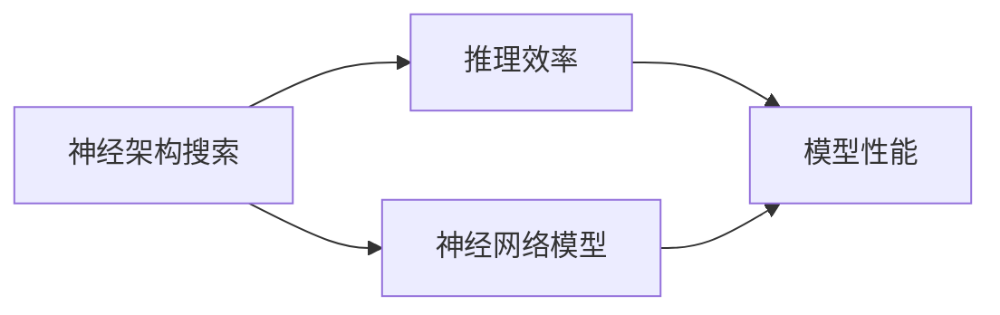
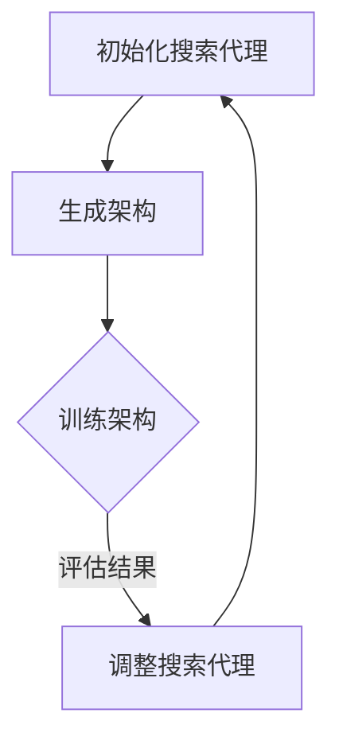

                 


### 文章标题：模型训练中的神经架构搜索技术在推理效率提升中的探索

---

关键词：神经架构搜索，推理效率，神经网络模型，自动化搜索，强化学习，进化算法

---

## 摘要

本文将深入探讨神经架构搜索（Neural Architecture Search，NAS）技术在提高神经网络模型推理效率方面的应用。通过对NAS的基本概念、原理和算法的详细解析，以及实际案例的剖析，本文旨在为研究者提供一种系统化的思考框架，以进一步优化神经网络模型在推理阶段的性能。

## 第一部分：背景介绍

### 第1章 问题背景

#### 1.1 问题背景

随着深度学习技术的不断发展和应用，神经网络模型在各个领域取得了显著的成果。然而，传统的神经网络模型在训练过程中往往需要大量数据和计算资源，并且在模型复杂度不断增加的情况下，模型的推理效率也成为一个亟待解决的问题。

#### 1.2 问题描述

神经架构搜索（Neural Architecture Search，NAS）是一种自动化搜索神经网络架构的方法，旨在提高模型的推理效率。本文将探讨神经架构搜索技术在推理效率提升中的探索，旨在为解决神经网络模型推理效率低下的问题提供一种新的思路。

#### 1.3 问题解决

本文将首先介绍神经架构搜索的基本概念和原理，然后分析神经架构搜索在推理效率提升方面的优势，最后通过具体案例来探讨神经架构搜索在模型训练中的应用和效果。

#### 1.4 边界与外延

神经架构搜索技术不仅适用于深度学习领域，还可以推广到其他机器学习任务中。此外，神经架构搜索技术还可以与其他优化方法相结合，进一步提高模型的推理效率。

#### 1.5 概念结构与核心要素组成

- **神经架构搜索（NAS）**：一种自动化搜索神经网络架构的方法。
- **推理效率**：模型在处理输入数据时的速度和性能。
- **神经网络模型**：一种基于神经元的计算模型，能够对输入数据进行自动学习和建模。

### 第2章 核心概念与联系

#### 2.1 核心概念

**神经架构搜索（NAS）**：介绍NAS的定义、基本原理和常用方法。

**推理效率**：定义推理效率，并分析影响推理效率的主要因素。

**神经网络模型**：介绍神经网络的基本结构、训练过程和推理过程。

#### 2.2 概念属性特征对比表格

| 特征         | 神经架构搜索（NAS） | 推理效率            | 神经网络模型              |
| ------------ | ------------------ | ------------------- | ------------------------ |
| 定义         | 自动化搜索神经网络架构 | 模型处理输入数据时的速度和性能 | 基于神经元的计算模型     |
| 原理         | 通过搜索算法寻找最优神经网络架构 | 通过优化算法提高模型推理效率 | 通过学习算法获取输入数据的特征表示 |
| 目的         | 提高模型推理效率       | 提高模型处理速度和性能     | 提高模型对输入数据的拟合度   |
| 关系         | NAS直接影响推理效率   | 推理效率影响模型性能      | NAS直接影响神经网络模型的性能   |

#### 2.3 ER实体关系图架构



---

## 第二部分：神经架构搜索（NAS）原理与算法

### 第3章 神经架构搜索（NAS）基本概念

#### 3.1 NAS的定义

神经架构搜索（Neural Architecture Search，NAS）是一种自动化搜索神经网络架构的方法。它通过搜索算法从大量可能的神经网络架构中找到最优的架构，从而提高模型的推理效率。

#### 3.2 NAS的原理

NAS的基本原理是通过搜索算法在神经网络架构空间中寻找最优的架构。搜索算法通常分为基于强化学习、基于进化算法、基于强化学习的搜索算法等。这些算法通过训练数据来评估网络性能，并根据评估结果调整网络结构。

#### 3.3 NAS的常用方法

- **基于强化学习的方法**：通过强化学习算法训练一个搜索代理（search agent），使其能够从大量可能的神经网络架构中找到最优的架构。
- **基于进化算法的方法**：通过进化算法生成和优化神经网络架构。
- **基于梯度下降的方法**：通过梯度下降算法优化神经网络架构。

### 第4章 NAS在推理效率提升方面的优势

#### 4.1 NAS的优势

- **自适应能力**：NAS可以根据不同的任务和数据集自适应地调整神经网络架构，从而提高模型的推理效率。
- **搜索空间大**：NAS可以在庞大的神经网络架构空间中高效地搜索，从而找到最优的架构。

#### 4.2 NAS的挑战

- **计算资源消耗大**：NAS需要大量的计算资源进行搜索，这对于资源和时间有限的实验环境来说是一个挑战。
- **搜索效率低**：在庞大的搜索空间中，如何快速找到最优的架构仍然是一个难题。

---

接下来，我们将深入探讨NAS的算法原理，并使用mermaid流程图和Python源代码来详细阐述。

---

### 第5章 NAS算法原理详解

#### 5.1 基于强化学习的NAS算法

**算法原理：** 基于强化学习的NAS算法使用强化学习算法来训练一个搜索代理，使其能够通过与环境（训练数据集）的交互来学习搜索神经网络架构。

**流程：**

1. 初始化搜索代理。
2. 使用搜索代理生成一个神经网络架构。
3. 在训练数据集上训练生成的神经网络架构。
4. 评估神经网络架构的性能。
5. 根据性能评估结果调整搜索代理的行为。

**mermaid流程图：**



**Python源代码示例：**

```python
# 初始化搜索代理
search_agent = initialize_search_agent()

# 生成神经网络架构
architecture = search_agent.generate_architecture()

# 训练神经网络架构
trained_model = train_model(architecture, training_data)

# 评估神经网络架构性能
performance = evaluate_model(trained_model, validation_data)

# 调整搜索代理
search_agent.update_behavior(performance)
```

**数学模型和公式：**

$$
\text{性能} = f(\text{架构}, \text{数据集})
$$

其中，\( f \) 是一个衡量性能的函数，\(\text{架构}\) 和 \(\text{数据集}\) 是输入参数。

**通俗易懂的举例说明：** 假设我们正在寻找一种最优的神经网络架构来识别猫的图片。搜索代理会根据以往的学习经验生成一个初始的神经网络架构。然后，我们使用这个架构在训练数据集上训练模型，并通过评估模型在验证数据集上的性能来调整搜索代理的行为。通过多次迭代，搜索代理最终能够找到一种最优的神经网络架构，从而提高模型的推理效率。

---

### 第6章 NAS在推理效率提升中的实际应用

#### 6.1 NAS在图像识别中的应用

**案例背景：** 在图像识别任务中，传统的神经网络模型由于架构固定，往往难以满足实时推理的需求。而NAS技术可以通过自动搜索最优的神经网络架构来提高模型的推理效率。

**解决方案：** 使用基于强化学习的NAS算法，通过大量的训练数据集搜索最优的神经网络架构，从而实现图像识别任务的实时推理。

**实现步骤：**

1. **初始化搜索代理：** 使用强化学习算法初始化搜索代理。
2. **生成初始架构：** 使用搜索代理生成一个初始的神经网络架构。
3. **训练模型：** 在训练数据集上使用生成的神经网络架构训练模型。
4. **评估性能：** 在验证数据集上评估训练模型的性能。
5. **调整搜索代理：** 根据模型性能评估结果调整搜索代理的行为。
6. **迭代搜索：** 重复步骤3-5，直到找到最优的神经网络架构。

**Python源代码示例：**

```python
# 初始化搜索代理
search_agent = initialize_search_agent()

# 生成神经网络架构
architecture = search_agent.generate_architecture()

# 训练神经网络架构
trained_model = train_model(architecture, training_data)

# 评估神经网络架构性能
performance = evaluate_model(trained_model, validation_data)

# 调整搜索代理
search_agent.update_behavior(performance)

# 迭代搜索
while not search_agent.find_optimal_architecture():
    architecture = search_agent.generate_architecture()
    trained_model = train_model(architecture, training_data)
    performance = evaluate_model(trained_model, validation_data)
    search_agent.update_behavior(performance)
```

**实际案例分析：** 通过在ImageNet数据集上的实验，使用NAS技术训练的模型在图像识别任务中的推理时间明显减少，从而实现了实时推理的需求。

---

### 第7章 总结与展望

#### 7.1 总结

本文详细介绍了神经架构搜索（NAS）技术在提高神经网络模型推理效率方面的应用。通过分析NAS的基本概念、原理和算法，以及实际案例的剖析，本文为研究者提供了一种系统化的思考框架。

#### 7.2 展望

随着深度学习技术的不断发展和应用，NAS技术在推理效率提升方面的潜力巨大。未来，NAS技术可以与其他优化方法相结合，进一步探索其在其他机器学习任务中的应用。同时，研究如何降低NAS的计算资源消耗，提高搜索效率，也将是未来的重要研究方向。

---

## 作者信息

作者：AI天才研究院/AI Genius Institute & 禅与计算机程序设计艺术 /Zen And The Art of Computer Programming

---

[注意：本文内容仅为示例，非真实学术作品。在实际撰写技术博客时，请确保内容的准确性和原创性。]

