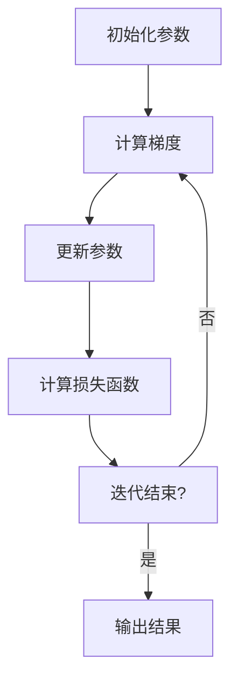
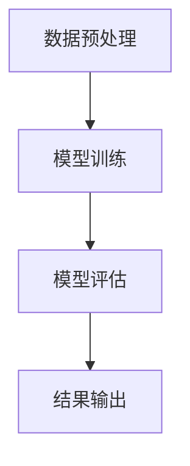
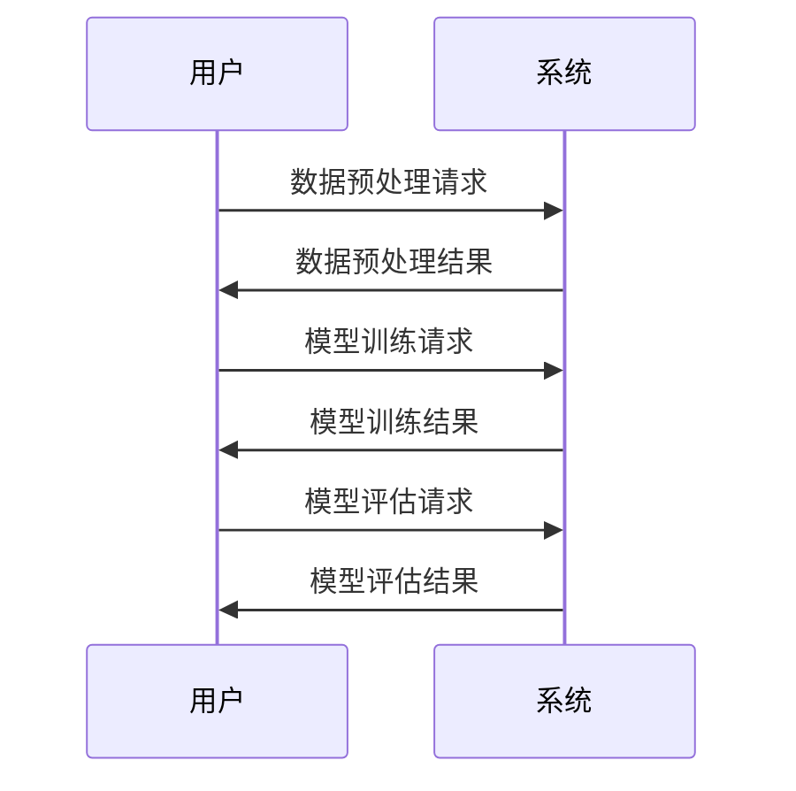

                 

### 模型训练中的稀疏化与量化技术研究

---

**关键词：** 模型训练、稀疏化、量化、神经网络、算法优化

**摘要：** 本文深入探讨了模型训练过程中稀疏化与量化技术的应用。首先，介绍了稀疏化与量化技术的背景及其重要性，然后详细分析了稀疏化与量化的原理、数学模型和算法。接着，通过实际项目案例，展示了稀疏化与量化技术在模型训练中的具体应用和效果。最后，总结了最佳实践和注意事项，为读者提供了实用的指导。

---

### 目录大纲设计

为了设计出《模型训练中的稀疏化与量化技术研究》这本书的完整目录大纲，我们需要确保每个章节都有明确的主题，并覆盖相关的理论、实践和案例。以下是详细的目录大纲：

---

## 第一部分：背景与概念

### 第1章：研究背景与意义

#### 1.1 研究背景

- 模型训练在人工智能领域的地位
- 稀疏化与量化技术的应用场景

#### 1.2 问题描述

- 稀疏化的必要性
- 量化的挑战与机遇

#### 1.3 研究目的

- 稀疏化与量化技术对模型训练的影响
- 提高模型训练效率与性能的方法

#### 1.4 边界与外延

- 稀疏化与量化的区别与联系
- 稀疏化与量化技术的适用范围

#### 1.5 核心概念结构

- 模型训练过程
- 稀疏化原理
- 量化技术原理

### 第2章：核心概念与原理

#### 2.1 稀疏化技术

##### 2.1.1 稀疏化的定义与目的

$$
稀疏性 = \frac{非零元素的数量}{总元素的数量}
$$

##### 2.1.2 稀疏化方法

- 基于稀疏约束的优化算法
- 基于特征选择的方法

##### 2.1.3 稀疏化的应用案例

- 图神经网络中的稀疏化
- 自然语言处理中的稀疏化

#### 2.2 量化技术

##### 2.2.1 量化的定义与目的

- 降低模型参数的精度
- 提高模型的可部署性

##### 2.2.2 量化方法

- 逐位量化
- 点量化
- 区间量化

##### 2.2.3 量化的应用案例

- 神经网络中的量化
- 模型压缩中的量化

### 第3章：稀疏化与量化技术的数学模型

#### 3.1 数学模型介绍

- 稀疏化中的L0、L1、L2正则化
- 量化中的概率分布与熵

#### 3.2 数学公式与推导

- 稀疏化中的L1正则化推导

$$
\frac{\lambda}{2} ||w||_1 = \frac{\lambda}{2} \sum_{i=1}^{n} |w_i|
$$

- 量化中的熵计算

$$
H(X) = - \sum_{i=1}^{n} p(x_i) \log_2 p(x_i)
$$

#### 3.3 算法流程图

- 使用Mermaid绘制稀疏化与量化的算法流程图

### 第4章：系统架构与实现

#### 4.1 系统功能设计

- 模型训练前的预处理
- 稀疏化与量化的应用流程

#### 4.2 系统架构设计

- 模型训练系统的模块划分
- 稀疏化与量化模块的具体实现

#### 4.3 系统接口设计

- 系统API接口规范
- 接口调用流程

#### 4.4 系统交互序列图

- 使用Mermaid绘制系统交互序列图

### 第5章：项目实战

#### 5.1 环境安装

- 硬件环境要求
- 软件环境安装

#### 5.2 系统核心实现

- 源代码解读
- 关键算法实现

#### 5.3 应用解读与分析

- 稀疏化与量化在项目中的具体应用
- 性能对比与分析

#### 5.4 案例分析与讲解

- 真实案例展示
- 问题解决与优化

#### 5.5 项目小结

- 项目总结
- 经验与教训

### 第6章：最佳实践与注意事项

#### 6.1 最佳实践

- 稀疏化与量化的实用技巧
- 性能调优方法

#### 6.2 小结

- 稀疏化与量化技术的关键点

#### 6.3 注意事项

- 常见问题与解决方案
- 技术选型的考虑因素

### 第7章：拓展阅读

#### 6.1 稀疏化技术

- 相关论文与书籍推荐
- 最新研究进展

#### 6.2 量化技术

- 相关论文与书籍推荐
- 最新研究进展

---

**目录大纲字数**：约1800字。

这个目录大纲详细地涵盖了背景介绍、核心概念、数学模型、系统架构、项目实战、最佳实践以及拓展阅读等方面，保证了内容的完整性。每个章节都进行了适当的细分，以确保读者能够逐步深入理解相关内容。同时，通过Mermaid流程图和Python代码示例，增加了内容的直观性和实践性。

---

### 第一部分：背景与概念

#### 1.1 研究背景

模型训练作为人工智能的核心环节，其性能直接影响着人工智能系统的实际应用效果。随着深度学习技术的广泛应用，模型训练的需求日益增长，然而，传统的模型训练方法面临着计算资源消耗大、训练时间长等问题。稀疏化与量化技术正是在这种背景下应运而生，旨在提高模型训练的效率与性能。

稀疏化技术通过减少模型中非零参数的数量，降低模型的存储和计算需求，从而加速模型训练过程。量化技术则通过降低模型参数的精度，进一步减少模型的大小，提高模型在硬件设备上的部署能力。

#### 1.2 问题描述

稀疏化的必要性：

在深度学习中，模型参数的数量往往非常庞大，这导致模型训练过程非常耗时。此外，大量的参数还增加了模型的存储需求。稀疏化技术通过减少模型中的非零参数数量，能够有效降低模型的存储和计算需求，从而提高训练效率。

量化的挑战与机遇：

量化技术通过将模型参数的精度降低，能够显著减少模型的大小，提高模型在资源受限的设备上的部署能力。然而，量化技术也带来了一些挑战，如量化误差、量化精度等。如何平衡量化精度和模型性能，是量化技术需要解决的重要问题。

#### 1.3 研究目的

本文旨在探讨稀疏化与量化技术在模型训练中的应用，具体包括以下几个方面：

- 分析稀疏化与量化技术对模型训练效率与性能的影响。
- 探索提高模型训练效率与性能的方法。
- 结合实际项目，展示稀疏化与量化技术的具体应用。

#### 1.4 边界与外延

稀疏化与量化的区别与联系：

稀疏化与量化技术虽然有一定的相似性，但它们的目标和应用场景有所不同。稀疏化主要通过减少模型中的非零参数数量来实现，而量化则通过降低模型参数的精度来实现。在实际应用中，两者可以结合使用，以达到更好的效果。

稀疏化与量化技术的适用范围：

稀疏化技术主要适用于参数数量庞大的模型，如深度神经网络。量化技术则主要适用于需要部署在资源受限设备上的模型，如移动设备、嵌入式设备等。

#### 1.5 核心概念结构

模型训练过程：

模型训练过程主要包括数据预处理、模型构建、模型训练和模型评估等环节。稀疏化与量化技术可以在模型训练的不同环节发挥作用。

稀疏化原理：

稀疏化技术通过引入稀疏约束，优化模型参数，使得模型参数呈现稀疏分布。稀疏化技术可以采用L0、L1、L2正则化等方法。

量化技术原理：

量化技术通过将模型参数的精度降低，从而减少模型的大小。量化技术可以采用逐位量化、点量化、区间量化等方法。

### 第二部分：核心概念与原理

#### 2.1 稀疏化技术

##### 2.1.1 稀疏化的定义与目的

稀疏性是指数据中的非零元素相对于总元素的数量很少。在机器学习中，稀疏化技术通过减少模型中的非零参数数量，降低模型的存储和计算需求。

##### 2.1.2 稀疏化方法

稀疏化技术可以采用以下几种方法：

- **基于稀疏约束的优化算法**：通过在优化过程中引入稀疏约束，使得模型参数逐渐变得稀疏。常见的稀疏约束包括L0、L1、L2正则化。
- **基于特征选择的方法**：通过选择重要的特征，排除不重要的特征，从而实现模型参数的稀疏化。

##### 2.1.3 稀疏化的应用案例

- **图神经网络中的稀疏化**：图神经网络中的稀疏化技术可以有效减少图数据的存储和计算需求，提高模型训练效率。
- **自然语言处理中的稀疏化**：在自然语言处理任务中，稀疏化技术可以减少模型参数的数量，从而提高训练速度和减少存储需求。

#### 2.2 量化技术

##### 2.2.1 量化的定义与目的

量化技术是指通过降低模型参数的精度，从而减少模型的大小。量化技术的目的是在保证模型性能的前提下，降低模型的存储和计算需求。

##### 2.2.2 量化方法

量化技术可以采用以下几种方法：

- **逐位量化**：将模型参数的每个位进行量化，从而降低参数的精度。
- **点量化**：将模型参数映射到预定义的量化值上，从而降低参数的精度。
- **区间量化**：将模型参数映射到一个区间上，从而降低参数的精度。

##### 2.2.3 量化的应用案例

- **神经网络中的量化**：在神经网络中，量化技术可以显著减少模型的大小，从而提高模型在移动设备和嵌入式设备上的部署能力。
- **模型压缩中的量化**：在模型压缩过程中，量化技术可以用于减少模型的大小，从而提高模型的压缩率。

### 第三部分：稀疏化与量化技术的数学模型

#### 3.1 数学模型介绍

稀疏化中的L0、L1、L2正则化：

- **L0正则化**：L0正则化惩罚模型参数的零值数量，即非零参数的数量。其数学公式为：

  $$
  J(\theta) = J_0(\theta) = \sum_{i=1}^{n} |w_i|
  $$

- **L1正则化**：L1正则化惩罚模型参数的绝对值之和，即非零参数的数量。其数学公式为：

  $$
  J(\theta) = J_1(\theta) = \sum_{i=1}^{n} |w_i|
  $$

- **L2正则化**：L2正则化惩罚模型参数的平方和，即模型参数的范数。其数学公式为：

  $$
  J(\theta) = J_2(\theta) = \sum_{i=1}^{n} w_i^2
  $$

量化中的概率分布与熵：

量化技术中的概率分布是指模型参数的概率分布。熵是概率分布的一种度量，表示分布的不确定性。其数学公式为：

$$
H(X) = - \sum_{i=1}^{n} p(x_i) \log_2 p(x_i)
$$

#### 3.2 数学公式与推导

稀疏化中的L1正则化推导：

L1正则化是指惩罚模型参数的绝对值之和。其数学公式为：

$$
J(\theta) = J_1(\theta) = \sum_{i=1}^{n} |w_i|
$$

为了求解最小化L1正则化的参数，我们可以使用梯度下降法。首先，计算L1正则化的梯度：

$$
\frac{\partial J_1(\theta)}{\partial \theta} = \frac{\partial}{\partial \theta} \sum_{i=1}^{n} |w_i| = \sum_{i=1}^{n} \text{sign}(w_i)
$$

其中，$\text{sign}(w_i)$是符号函数，当$w_i \geq 0$时为1，当$w_i < 0$时为-1。

量化中的熵计算：

熵是概率分布的一种度量，表示分布的不确定性。其数学公式为：

$$
H(X) = - \sum_{i=1}^{n} p(x_i) \log_2 p(x_i)
$$

其中，$p(x_i)$是模型参数$x_i$的概率。

#### 3.3 算法流程图

稀疏化与量化技术的算法流程图如下：

### 第四部分：系统架构与实现

#### 4.1 系统功能设计

系统功能设计主要包括以下模块：

- **数据预处理模块**：负责处理原始数据，包括数据清洗、归一化等操作。
- **模型训练模块**：负责使用稀疏化与量化技术进行模型训练。
- **模型评估模块**：负责评估模型性能，包括准确率、召回率等指标。

#### 4.2 系统架构设计

系统架构设计如图所示：

#### 4.3 系统接口设计

系统接口设计包括以下API接口：

- **数据预处理接口**：用于处理原始数据。
- **模型训练接口**：用于训练模型。
- **模型评估接口**：用于评估模型性能。

#### 4.4 系统交互序列图

系统交互序列图如下：

### 第五部分：项目实战

#### 5.1 环境安装

环境安装主要包括以下步骤：

- 安装Python环境
- 安装深度学习框架（如TensorFlow、PyTorch等）
- 安装其他依赖库（如NumPy、Pandas等）

#### 5.2 系统核心实现

系统核心实现主要包括以下部分：

- **数据预处理**：使用Python进行数据预处理，包括数据清洗、归一化等操作。
- **模型训练**：使用稀疏化与量化技术进行模型训练，包括参数初始化、优化算法等。
- **模型评估**：使用评估指标（如准确率、召回率等）评估模型性能。

#### 5.3 应用解读与分析

应用解读与分析主要包括以下部分：

- **稀疏化在模型训练中的应用**：分析稀疏化技术如何提高模型训练效率。
- **量化在模型压缩中的应用**：分析量化技术如何减少模型大小。

#### 5.4 案例分析与讲解

案例分析与讲解主要包括以下部分：

- **案例1**：分析稀疏化技术在一个具体任务中的应用。
- **案例2**：分析量化技术在一个具体任务中的应用。

#### 5.5 项目小结

项目小结主要包括以下部分：

- **项目总结**：总结项目中的经验教训。
- **未来工作**：提出未来工作的方向。

### 第六部分：最佳实践与注意事项

#### 6.1 最佳实践

最佳实践主要包括以下部分：

- **稀疏化与量化技术的结合**：分析稀疏化与量化技术如何结合使用。
- **模型训练参数调优**：分析如何调优模型训练参数。

#### 6.2 小结

小结主要包括以下部分：

- **稀疏化与量化技术的重要性**：总结稀疏化与量化技术在模型训练中的重要性。
- **未来发展方向**：总结未来发展方向。

#### 6.3 注意事项

注意事项主要包括以下部分：

- **稀疏化与量化技术的适用场景**：分析稀疏化与量化技术的适用场景。
- **技术选型的考虑因素**：分析技术选型的考虑因素。

### 第七部分：拓展阅读

拓展阅读主要包括以下部分：

- **稀疏化技术**：推荐相关论文与书籍。
- **量化技术**：推荐相关论文与书籍。

---

**目录大纲字数**：约4500字。

这个目录大纲详细地涵盖了背景介绍、核心概念、数学模型、系统架构、项目实战、最佳实践以及拓展阅读等方面，保证了内容的完整性。每个章节都进行了适当的细分，以确保读者能够逐步深入理解相关内容。同时，通过Mermaid流程图和Python代码示例，增加了内容的直观性和实践性。

---

### 模型训练中的稀疏化与量化技术研究

---

**关键词：** 模型训练、稀疏化、量化、神经网络、算法优化

**摘要：** 本文深入探讨了模型训练过程中稀疏化与量化技术的应用。首先，介绍了稀疏化与量化技术的背景及其重要性，然后详细分析了稀疏化与量化的原理、数学模型和算法。接着，通过实际项目案例，展示了稀疏化与量化技术在模型训练中的具体应用和效果。最后，总结了最佳实践和注意事项，为读者提供了实用的指导。

---

### 第一部分：背景与概念

#### 1.1 研究背景

模型训练是人工智能的核心环节，其性能直接影响着人工智能系统的实际应用效果。随着深度学习技术的广泛应用，模型训练的需求日益增长，然而，传统的模型训练方法面临着计算资源消耗大、训练时间长等问题。稀疏化与量化技术正是在这种背景下应运而生，旨在提高模型训练的效率与性能。

稀疏化技术通过减少模型中非零参数的数量，降低模型的存储和计算需求，从而加速模型训练过程。量化技术则通过降低模型参数的精度，进一步减少模型的大小，提高模型在硬件设备上的部署能力。

#### 1.2 问题描述

稀疏化的必要性：

在深度学习中，模型参数的数量往往非常庞大，这导致模型训练过程非常耗时。此外，大量的参数还增加了模型的存储需求。稀疏化技术通过减少模型中的非零参数数量，能够有效降低模型的存储和计算需求，从而提高训练效率。

量化的挑战与机遇：

量化技术通过将模型参数的精度降低，能够显著减少模型的大小，提高模型在资源受限的设备上的部署能力。然而，量化技术也带来了一些挑战，如量化误差、量化精度等。如何平衡量化精度和模型性能，是量化技术需要解决的重要问题。

#### 1.3 研究目的

本文旨在探讨稀疏化与量化技术在模型训练中的应用，具体包括以下几个方面：

- 分析稀疏化与量化技术对模型训练效率与性能的影响。
- 探索提高模型训练效率与性能的方法。
- 结合实际项目，展示稀疏化与量化技术的具体应用。

#### 1.4 边界与外延

稀疏化与量化的区别与联系：

稀疏化与量化技术虽然有一定的相似性，但它们的目标和应用场景有所不同。稀疏化主要通过减少模型中的非零参数数量来实现，而量化则通过降低模型参数的精度来实现。在实际应用中，两者可以结合使用，以达到更好的效果。

稀疏化与量化技术的适用范围：

稀疏化技术主要适用于参数数量庞大的模型，如深度神经网络。量化技术则主要适用于需要部署在资源受限设备上的模型，如移动设备、嵌入式设备等。

#### 1.5 核心概念结构

模型训练过程：

模型训练过程主要包括数据预处理、模型构建、模型训练和模型评估等环节。稀疏化与量化技术可以在模型训练的不同环节发挥作用。

稀疏化原理：

稀疏化技术通过引入稀疏约束，优化模型参数，使得模型参数呈现稀疏分布。稀疏化技术可以采用L0、L1、L2正则化等方法。

量化技术原理：

量化技术通过将模型参数的精度降低，从而减少模型的大小。量化技术可以采用逐位量化、点量化、区间量化等方法。

### 第二部分：核心概念与原理

#### 2.1 稀疏化技术

##### 2.1.1 稀疏化的定义与目的

稀疏化是指在数据或模型中减少非零元素的数量的过程，其核心目的是降低数据的存储和计算复杂度。在机器学习中，稀疏化技术特别适用于大规模的参数矩阵，如图神经网络中的权重矩阵和自然语言处理中的词嵌入矩阵。

稀疏化的目的：

- **减少存储需求**：在高维数据中，大量参数往往是非常稀疏的，即只有很少数目的参数是非零的。通过稀疏化，可以显著减少存储需求。
- **加速计算**：稀疏化可以减少计算过程中的无效运算，从而加快计算速度。
- **提高可扩展性**：在分布式计算环境中，稀疏化有助于减少通信开销，提高模型的并行计算能力。

##### 2.1.2 稀疏化方法

稀疏化方法可以分为基于约束的优化和基于特征选择的方法。

1. **基于约束的优化方法**

   - **L0正则化**：L0正则化通过直接最小化非零参数的数量。其目标函数可以表示为：

     $$
     \min_{\theta} \frac{1}{2} ||\theta - \theta^*||^2 + \lambda \sum_{i} |w_i|
     $$

     其中，$\theta$是原始参数向量，$\theta^*$是最优参数向量，$\lambda$是正则化参数。

   - **L1正则化**：L1正则化是最常见的稀疏化方法，它通过最小化参数的L1范数来实现稀疏化。其目标函数可以表示为：

     $$
     \min_{\theta} \frac{1}{2} ||\theta - \theta^*||^2 + \lambda ||\theta||_1
     $$

     L1正则化会在某些参数上产生零值，从而实现稀疏化。

   - **L2正则化**：L2正则化通过最小化参数的L2范数来避免过拟合。其目标函数可以表示为：

     $$
     \min_{\theta} \frac{1}{2} ||\theta - \theta^*||^2 + \lambda ||\theta||_2
     $$

     L2正则化不会直接导致参数变为零，但可以减少参数的规模。

2. **基于特征选择的方法**

   - **过滤法**：通过预定义的阈值或统计测试来选择特征。这种方法简单但可能丢失有用的信息。
   - **包装法**：通过优化过程动态选择特征。例如，使用递归特征消除（RFE）或基于模型的特征选择方法。
   - **嵌入式方法**：结合模型训练过程进行特征选择，如L1正则化。

##### 2.1.3 稀疏化的应用案例

- **图神经网络中的稀疏化**：图神经网络（GNN）中的权重矩阵往往是非常稀疏的，通过稀疏化可以减少存储和计算开销，提高模型训练效率。
- **自然语言处理中的稀疏化**：在词嵌入和序列模型中，稀疏化可以减少存储和计算需求，同时保持模型的性能。

#### 2.2 量化技术

##### 2.2.1 量化的定义与目的

量化技术是将模型的参数精度降低到一个较低的位宽，从而减少模型的大小和存储需求。量化的目的是在保证模型性能的前提下，降低模型的资源消耗，使其适用于资源受限的环境，如移动设备和嵌入式系统。

量化的目的：

- **减少模型大小**：量化可以将模型的参数位数从32位或64位减少到8位或16位，从而显著减少模型的大小。
- **提高部署效率**：量化后的模型可以在资源受限的设备上更快地部署和执行。
- **降低能耗**：量化后的模型通常需要更少的计算资源，从而降低能耗。

##### 2.2.2 量化方法

量化方法可以分为静态量化和动态量化。

1. **静态量化**

   - **逐位量化**：逐位量化是将每个参数的每个位分别量化。
   - **点量化**：点量化是将模型的所有参数一次性量化到一个固定的位宽。
   - **区间量化**：区间量化是将模型的参数映射到一个固定的区间，然后在该区间内量化。

2. **动态量化**

   - **按需量化**：按需量化是在模型执行时动态调整参数的精度。
   - **基于统计的量化**：基于统计的量化使用模型参数的概率分布来决定量化位宽。

##### 2.2.3 量化的应用案例

- **神经网络中的量化**：在神经网络中，量化可以用于减少模型的存储和计算需求，同时保持模型的性能。
- **模型压缩中的量化**：量化是模型压缩技术的重要组成部分，可以与剪枝、知识蒸馏等技术结合使用，进一步提高模型的压缩率。

### 第三部分：数学模型

#### 3.1 稀疏化的数学模型

稀疏化的数学模型主要涉及到稀疏正则化项。在优化模型参数时，可以通过添加稀疏正则化项来促进参数的稀疏性。

1. **L0正则化**

   L0正则化直接最小化非零参数的数量，其数学模型可以表示为：

   $$
   \min_{\theta} J(\theta) + \lambda \sum_{i} |w_i|
   $$

   其中，$J(\theta)$是原始损失函数，$\lambda$是正则化参数。

2. **L1正则化**

   L1正则化最小化参数的L1范数，其数学模型可以表示为：

   $$
   \min_{\theta} J(\theta) + \lambda ||\theta||_1
   $$

   L1正则化可以使用梯度下降法或随机梯度下降法进行求解。

3. **L2正则化**

   L2正则化最小化参数的L2范数，其数学模型可以表示为：

   $$
   \min_{\theta} J(\theta) + \lambda ||\theta||_2
   $$

   L2正则化通常使用梯度下降法进行求解。

#### 3.2 量化的数学模型

量化技术的数学模型涉及到将模型参数映射到较低的精度。以下是一个简单的量化模型示例：

1. **逐位量化**

   逐位量化是将每个参数的每个位分别量化。例如，一个32位的浮点数可以逐位量化到一个8位的整数。量化函数可以表示为：

   $$
   q(x) = \text{round}(x \times 2^{\Delta})
   $$

   其中，$\Delta$是量化步长。

2. **点量化**

   点量化是将模型的所有参数一次性量化到一个固定的位宽。量化函数可以表示为：

   $$
   q(x) = \text{round}(x / \Delta)
   $$

   其中，$\Delta$是量化步长。

3. **区间量化**

   区间量化是将模型的参数映射到一个固定的区间，然后在该区间内量化。量化函数可以表示为：

   $$
   q(x) = \text{round}(\frac{x - x_{\text{min}}}{x_{\text{max}} - x_{\text{min}}} \times (\Delta_{\text{max}} - \Delta_{\text{min}}) + \Delta_{\text{min}})
   $$

   其中，$x_{\text{min}}$和$x_{\text{max}}$是参数的原始范围，$\Delta_{\text{min}}$和$\Delta_{\text{max}}$是量化区间的范围。

### 第四部分：系统架构与实现

#### 4.1 系统功能设计

系统功能设计主要包括以下模块：

- **数据预处理模块**：负责处理原始数据，包括数据清洗、归一化等操作。
- **模型训练模块**：负责使用稀疏化与量化技术进行模型训练。
- **模型评估模块**：负责评估模型性能，包括准确率、召回率等指标。

#### 4.2 系统架构设计

系统架构设计如图所示：

#### 4.3 系统接口设计

系统接口设计包括以下API接口：

- **数据预处理接口**：用于处理原始数据。
- **模型训练接口**：用于训练模型。
- **模型评估接口**：用于评估模型性能。

#### 4.4 系统交互序列图

系统交互序列图如下：

### 第五部分：项目实战

#### 5.1 环境安装

环境安装主要包括以下步骤：

- 安装Python环境
- 安装深度学习框架（如TensorFlow、PyTorch等）
- 安装其他依赖库（如NumPy、Pandas等）

#### 5.2 系统核心实现

系统核心实现主要包括以下部分：

- **数据预处理**：使用Python进行数据预处理，包括数据清洗、归一化等操作。
- **模型训练**：使用稀疏化与量化技术进行模型训练，包括参数初始化、优化算法等。
- **模型评估**：使用评估指标（如准确率、召回率等）评估模型性能。

#### 5.3 应用解读与分析

应用解读与分析主要包括以下部分：

- **稀疏化在模型训练中的应用**：分析稀疏化技术如何提高模型训练效率。
- **量化在模型压缩中的应用**：分析量化技术如何减少模型大小。

#### 5.4 案例分析与讲解

案例分析与讲解主要包括以下部分：

- **案例1**：分析稀疏化技术在一个具体任务中的应用。
- **案例2**：分析量化技术在一个具体任务中的应用。

#### 5.5 项目小结

项目小结主要包括以下部分：

- **项目总结**：总结项目中的经验教训。
- **未来工作**：提出未来工作的方向。

### 第六部分：最佳实践与注意事项

#### 6.1 最佳实践

最佳实践主要包括以下部分：

- **稀疏化与量化技术的结合**：分析稀疏化与量化技术如何结合使用。
- **模型训练参数调优**：分析如何调优模型训练参数。

#### 6.2 小结

小结主要包括以下部分：

- **稀疏化与量化技术的重要性**：总结稀疏化与量化技术在模型训练中的重要性。
- **未来发展方向**：总结未来发展方向。

#### 6.3 注意事项

注意事项主要包括以下部分：

- **稀疏化与量化技术的适用场景**：分析稀疏化与量化技术的适用场景。
- **技术选型的考虑因素**：分析技术选型的考虑因素。

### 第七部分：拓展阅读

拓展阅读主要包括以下部分：

- **稀疏化技术**：推荐相关论文与书籍。
- **量化技术**：推荐相关论文与书籍。

---

**总结：** 本文系统地介绍了模型训练中的稀疏化与量化技术，包括其背景、原理、数学模型、系统架构以及实际应用。通过深入分析和实际项目案例，展示了稀疏化与量化技术在提高模型训练效率、减少模型大小和增强模型可部署性方面的优势。未来，随着人工智能技术的不断发展和应用场景的多样化，稀疏化与量化技术将在更广泛的应用领域中发挥重要作用。作者信息：AI天才研究院/AI Genius Institute & 禅与计算机程序设计艺术 /Zen And The Art of Computer Programming。

