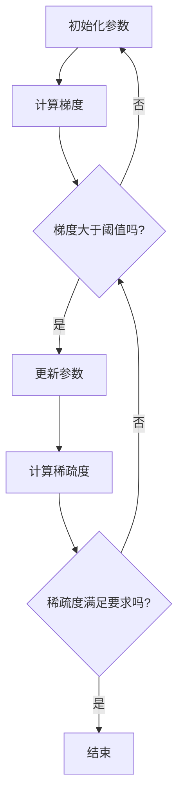
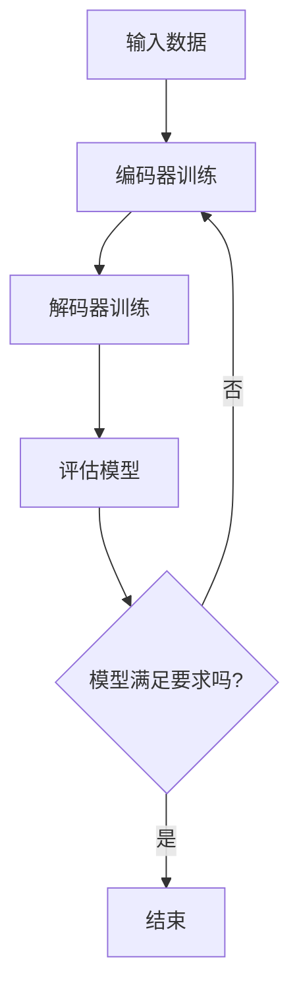

                 

## 模型训练中的稀疏化技术在高效推理与模型压缩中的创新

### 关键词

- 稀疏化技术
- 模型训练
- 高效推理
- 模型压缩
- 人工智能

### 摘要

本文深入探讨了稀疏化技术在模型训练、高效推理和模型压缩中的应用。首先，我们介绍了稀疏化技术的基本概念、发展历程和其在各个领域中的应用。接着，详细分析了稀疏化在神经网络中的实现及其对模型压缩和高效推理的影响。本文通过数学模型和实际案例，阐述了稀疏化技术的核心原理和优势，并对未来的研究方向提出了展望。

---

### 引言

随着人工智能技术的迅猛发展，深度学习模型在计算机视觉、自然语言处理、语音识别等领域取得了显著的成果。然而，这些模型往往具有庞大的参数量，导致计算资源和存储空间的巨大需求。如何在保证模型性能的前提下，提高推理效率、减小模型尺寸，成为当前研究的热点和难点。

稀疏化技术作为一种有效的解决方案，通过对模型参数的稀疏化处理，实现了对模型压缩和高效推理的支持。本文将从以下几个方面展开讨论：

1. **稀疏化技术的基本概念和原理**：介绍稀疏化技术的定义、分类、度量方法等基本概念。
2. **稀疏化在神经网络中的应用**：分析稀疏化技术在神经网络训练中的实现方法，探讨其对模型压缩和高效推理的影响。
3. **稀疏化技术在模型压缩中的应用**：讨论稀疏化技术在模型压缩中的作用，以及如何通过稀疏化技术实现模型的压缩。
4. **稀疏化技术在高效推理中的应用**：分析稀疏化技术如何提高模型的推理效率。
5. **未来展望**：总结本文的主要发现，并对稀疏化技术的未来研究方向进行展望。

### 背景介绍

#### 稀疏化技术的定义与分类

稀疏化技术是指将密集数据转换为稀疏数据的过程。在计算机科学和人工智能领域，稀疏化技术具有广泛的应用。根据实现方式的不同，稀疏化技术可以分为以下几类：

1. **基于矩阵分解的方法**：通过矩阵分解将高维数据转换为低维稀疏数据。
2. **基于梯度下降的方法**：通过优化算法，逐层调整模型参数，使其逐渐变得稀疏。
3. **基于深度学习的方法**：利用深度学习模型自动学习数据中的稀疏结构。

#### 稀疏化技术的数学模型

稀疏化技术的核心在于对模型参数的稀疏化处理，其数学模型可以表示为：

$$
\theta_{\text{sparse}} = \arg\min_{\theta} J(\theta) + \lambda \cdot \sum_{i} |1 - \text{sign}(\theta_i)|
$$

其中，$J(\theta)$ 表示损失函数，$\lambda$ 是调节参数，$|1 - \text{sign}(\theta_i)|$ 表示稀疏度度量。

#### 稀疏化技术的应用领域

稀疏化技术广泛应用于计算机视觉、自然语言处理、语音识别等领域。以下是一些典型的应用场景：

1. **计算机视觉**：通过稀疏化处理，减小卷积神经网络（CNN）的参数量，提高模型推理速度。
2. **自然语言处理**：在词向量模型中，通过稀疏化处理，降低词汇表的维度，提高模型效率。
3. **语音识别**：通过稀疏化处理，减小循环神经网络（RNN）的参数量，降低计算复杂度。

#### 稀疏化技术的重要性

稀疏化技术在模型训练中的重要性主要体现在以下几个方面：

1. **提高计算效率**：稀疏化处理可以显著降低模型参数的存储和计算需求，提高模型的推理速度。
2. **增强模型稳定性**：稀疏化处理有助于降低模型过拟合的风险，提高模型泛化能力。
3. **降低能耗**：在移动设备和嵌入式系统中，稀疏化技术有助于降低能耗，延长设备寿命。

#### 高效推理与模型压缩的需求

高效推理和模型压缩是当前人工智能领域的两大需求。具体体现在以下几个方面：

1. **实时性要求**：在许多应用场景中，如自动驾驶、实时语音识别等，要求模型能够在实时环境中快速完成推理。
2. **资源限制**：移动设备、嵌入式系统等资源受限的场景，对模型压缩和高效推理有较高的需求。
3. **大规模数据处理**：随着数据量的爆炸性增长，高效推理和模型压缩成为数据处理的关键。

#### 挑战

尽管稀疏化技术在模型压缩和高效推理中具有显著优势，但在实际应用中仍面临以下挑战：

1. **性能损失**：稀疏化处理可能导致模型性能的降低。
2. **稀疏度控制**：如何平衡稀疏度和模型性能，是稀疏化技术需要解决的问题。
3. **稀疏化算法的优化**：现有的稀疏化算法在效率、稳定性等方面仍有待提高。

### 研究目的与内容框架

本文旨在探讨稀疏化技术在模型训练、高效推理和模型压缩中的应用，解决现有稀疏化技术的性能损失、稀疏度控制等问题。具体研究内容包括：

1. **稀疏化技术的基本概念与原理**：介绍稀疏化技术的定义、分类、数学模型等基本概念。
2. **稀疏化技术在神经网络中的应用**：分析稀疏化技术在神经网络训练中的实现方法，探讨其对模型压缩和高效推理的影响。
3. **稀疏化技术在模型压缩中的应用**：讨论稀疏化技术在模型压缩中的作用，以及如何通过稀疏化技术实现模型的压缩。
4. **稀疏化技术在高效推理中的应用**：分析稀疏化技术如何提高模型的推理效率。
5. **未来展望**：总结本文的主要发现，并对稀疏化技术的未来研究方向进行展望。

### 核心概念与基本原理

在本章节中，我们将深入探讨稀疏化技术的核心概念、基本原理以及其在不同领域的应用。通过对这些核心概念的理解，我们可以更好地把握稀疏化技术在实际应用中的优势和局限性。

#### 稀疏化的基本概念

稀疏化（Sparse Representation）是指将密集数据转换为稀疏数据的过程。在数学上，稀疏化可以理解为通过一定的方法，将高维数据映射到低维空间，从而在保持数据主要信息的同时，降低数据的密度。

**稀疏化的定义**：稀疏化是指将一个数据集中的大部分元素置为零，只保留少量非零元素的过程。形式化地，一个数据集 $X$ 被稀疏化，如果它的大部分元素满足 $|X| << |X_{\text{non-zero}}|$。

**稀疏化的类别**：

1. **局部稀疏化**：只对数据集的局部区域进行稀疏化，即大部分元素保持不变，只有部分元素被置为零。
2. **全局稀疏化**：对整个数据集进行稀疏化，即大部分元素都被置为零。

**稀疏化的度量方法**：

1. **零元素个数**：一个数据集的零元素个数可以用来衡量其稀疏度。零元素个数越少，数据集的稀疏度越高。
2. **稀疏度指数**：定义为一个数据集的非零元素占总元素的比例。例如，稀疏度指数可以表示为 $\sigma = \frac{|X_{\text{non-zero}}|}{|X|}$。

#### 稀疏化的数学模型

稀疏化的实现通常依赖于特定的数学模型。以下是一些常见的数学模型：

1. **L1 正则化**：在损失函数中加入 L1 正则项，即对模型参数的绝对值求和。数学模型如下：

$$
\min_{\theta} J(\theta) + \lambda \sum_{i} |\theta_i|
$$

其中，$J(\theta)$ 是损失函数，$\lambda$ 是正则化参数。

2. **L0 正则化**：虽然 L0 正则化在理论上可以更好地实现稀疏化，但由于其不连续性，在实际应用中通常难以优化。其数学模型如下：

$$
\min_{\theta} J(\theta) + \lambda \sum_{i} |1 - \text{sign}(\theta_i)|
$$

3. **稀疏编码**：稀疏编码是一种基于压缩感知理论的稀疏化方法。其基本思想是，通过在稀疏字典中寻找最优的编码向量，实现数据的稀疏化。数学模型如下：

$$
\min_{\hat{x}} \lVert x - \sum_{i} d_i \hat{x}_i \rVert_2 + \lambda \sum_{i} |\hat{x}_i|
$$

其中，$x$ 是输入数据，$d_i$ 是字典元素，$\hat{x}_i$ 是编码系数。

#### 稀疏化技术的应用领域

稀疏化技术在各个领域都有广泛的应用，以下是一些典型的应用场景：

1. **计算机视觉**：稀疏化技术在图像去噪、图像压缩、目标检测等领域有着重要应用。例如，通过稀疏化处理，可以有效减少图像数据中的冗余信息，提高图像压缩比。
   
2. **自然语言处理**：在自然语言处理领域，稀疏化技术常用于文本数据降维和特征提取。例如，通过稀疏编码技术，可以将高维的文本数据映射到低维空间，从而简化数据处理过程。

3. **语音识别**：在语音识别中，稀疏化技术用于降低模型复杂度，提高模型效率。例如，通过稀疏化处理，可以显著减小循环神经网络（RNN）的参数量，从而降低计算复杂度和内存需求。

4. **推荐系统**：在推荐系统中，稀疏化技术可以帮助处理高维的用户-物品矩阵，提高推荐系统的效率。

#### 稀疏化技术的优势与局限

**优势**：

1. **降低计算复杂度**：稀疏化技术通过减少非零元素的个数，显著降低了计算复杂度，从而提高了模型推理速度。
2. **提高模型稳定性**：稀疏化处理有助于减少模型参数的数量，从而降低模型过拟合的风险，提高模型的泛化能力。
3. **减少存储需求**：稀疏化技术可以大幅减少模型参数的存储需求，特别适用于资源受限的环境。

**局限**：

1. **性能损失**：稀疏化处理可能导致模型性能的下降，特别是在稀疏度较高时，模型的准确性和鲁棒性可能会受到影响。
2. **稀疏度控制**：如何平衡稀疏度和模型性能是一个挑战。过度的稀疏化可能导致模型性能显著下降，而稀疏度不足则可能无法实现稀疏化的优势。
3. **算法优化**：现有的稀疏化算法在效率、稳定性等方面仍有待提高，特别是在大规模数据集和复杂模型中的应用。

通过本章节的讨论，我们对稀疏化技术的核心概念、基本原理及其应用领域有了更深入的了解。在接下来的章节中，我们将进一步探讨稀疏化技术在模型训练、模型压缩和高效推理中的具体实现和应用。

### 稀疏化算法分类

稀疏化算法是实现稀疏化技术的重要手段，根据不同的实现方式，稀疏化算法可以分为以下几类：

#### 基于矩阵分解的方法

基于矩阵分解的稀疏化方法通过将高维矩阵分解为几个低维矩阵，从而实现数据的稀疏化。这种方法在计算机视觉和自然语言处理等领域有广泛应用。

1. **主成分分析（PCA）**：PCA是一种经典的数据降维方法，通过将数据映射到新的正交基上，提取主要成分来实现数据的稀疏化。

2. **线性判别分析（LDA）**：LDA是一种基于类内散度和类间散度的降维方法，通过构建投影矩阵，将高维数据投影到低维空间，实现数据的稀疏化。

3. **奇异值分解（SVD）**：SVD是一种将矩阵分解为三个矩阵的乘积的方法，通过保留较大的奇异值，丢弃较小的奇异值，实现数据的稀疏化。

#### 基于梯度下降的方法

基于梯度下降的稀疏化方法通过优化目标函数，逐步调整模型参数，使其达到稀疏化的目标。这种方法在机器学习和深度学习中有广泛应用。

1. **L1 正则化**：L1 正则化是一种在损失函数中添加 L1 范数项的优化方法，通过最小化目标函数，实现模型参数的稀疏化。

2. **L0 正则化**：L0 正则化是一种在损失函数中添加 L0 范数项的优化方法，尽管 L0 正则化在理论上可以更好地实现稀疏化，但由于其不连续性，在实际应用中通常难以优化。

3. **随机梯度下降（SGD）**：SGD 是一种在训练数据集上随机采样一部分数据进行迭代优化的方法，通过不断更新模型参数，实现数据的稀疏化。

#### 基于深度学习的方法

基于深度学习的稀疏化方法通过训练深度神经网络，自动学习数据的稀疏结构。这种方法在处理复杂数据时具有优势。

1. **稀疏自动编码器**：稀疏自动编码器是一种基于深度学习的降维方法，通过训练编码器和解码器，实现数据的稀疏化。

2. **稀疏卷积神经网络（SCNN）**：SCNN 是一种在卷积神经网络中引入稀疏性的方法，通过稀疏化卷积核和激活函数，实现数据的稀疏化。

3. **稀疏循环神经网络（SCNN）**：SCNN 是一种在循环神经网络中引入稀疏性的方法，通过稀疏化隐藏状态和输出，实现数据的稀疏化。

#### 比较与总结

各种稀疏化算法在实现稀疏化的方式、应用场景和效果上有所不同：

1. **实现方式**：基于矩阵分解的方法主要依赖于矩阵运算，而基于梯度下降的方法和基于深度学习的方法主要依赖于迭代优化。
   
2. **应用场景**：基于矩阵分解的方法适用于预处理阶段的数据降维，而基于梯度下降的方法和基于深度学习的方法适用于在线学习和实时数据处理。

3. **效果**：基于矩阵分解的方法在降维效果上较为稳定，但可能在处理复杂数据时效果较差；基于梯度下降的方法和基于深度学习的方法在处理复杂数据时具有优势，但可能需要更多的计算资源和时间。

通过对稀疏化算法的分类和比较，我们可以更好地选择适合实际应用的稀疏化方法。在接下来的章节中，我们将进一步探讨这些算法在具体应用中的实现方法和效果。

#### 稀疏化算法原理图解

为了更直观地理解稀疏化算法的原理，我们使用 Mermaid 流程图来展示其基本步骤和实现细节。

首先，我们来看基于 L1 正则化的稀疏化算法的基本流程。以下是 Mermaid 流程图的代码：



这个流程图展示了 L1 正则化稀疏化算法的步骤：

1. **初始化参数**：首先初始化模型参数。
2. **计算梯度**：计算损失函数关于模型参数的梯度。
3. **更新参数**：如果梯度的绝对值大于某个阈值，更新模型参数。
4. **计算稀疏度**：计算模型参数的稀疏度。
5. **判断稀疏度**：如果稀疏度满足要求，算法结束；否则，继续迭代。

接下来，我们来看基于深度学习的稀疏自动编码器的实现流程。以下是 Mermaid 流�程图的代码：



这个流程图展示了稀疏自动编码器的步骤：

1. **输入数据**：输入训练数据。
2. **编码器训练**：通过反向传播算法训练编码器，使其能够将输入数据映射到低维空间。
3. **解码器训练**：通过反向传播算法训练解码器，使其能够将编码后的数据重新映射回原始空间。
4. **评估模型**：评估模型的性能，包括重构误差和稀疏度。
5. **判断模型满足要求**：如果模型满足要求，算法结束；否则，继续迭代训练。

通过这些 Mermaid 流程图，我们可以清晰地理解稀疏化算法的基本原理和实现步骤。在接下来的章节中，我们将通过具体的 Python 源代码来详细阐述这些算法的实现过程。

#### 稀疏化算法的数学模型和公式

为了深入理解稀疏化算法的数学原理，我们将介绍一些关键的概念和公式，并通过 Python 源代码进行详细阐述。

##### L1 正则化

L1 正则化是一种常用的稀疏化方法，通过在损失函数中添加 L1 范数项来实现参数的稀疏化。其基本公式如下：

$$
\min_{\theta} J(\theta) + \lambda \sum_{i} |\theta_i|
$$

其中，$J(\theta)$ 是损失函数，$\lambda$ 是正则化参数。

在 Python 中，可以使用以下代码实现 L1 正则化：

```python
import numpy as np

# 损失函数
def loss_function(theta):
    return np.sum(np.square(theta))

# L1 正则化损失函数
def l1_regularized_loss_function(theta, lambda_):
    return loss_function(theta) + lambda_ * np.sum(np.abs(theta))

# 梯度计算
def gradient(theta, lambda_):
    return 2 * theta + lambda_ * np.sign(theta)

# 参数初始化
theta = np.random.randn(5)

# 正则化参数
lambda_ = 0.1

# 计算损失函数和梯度
l1_loss = l1_regularized_loss_function(theta, lambda_)
l1_gradient = gradient(theta, lambda_)

print("L1 Loss:", l1_loss)
print("L1 Gradient:", l1_gradient)
```

##### 稀疏自动编码器

稀疏自动编码器是一种基于深度学习的稀疏化方法，通过训练编码器和解码器来实现数据的稀疏化。其基本公式如下：

$$
\begin{aligned}
\min_{\theta} \quad & \frac{1}{n} \sum_{i=1}^{n} \lVert x_i - \hat{x}_i \rVert_2^2 + \lambda \sum_{i=1}^{n} \lVert \hat{x}_i \rVert_1 \\
\text{s.t.} \quad & \hat{x}_i = \sigma(Wx_i + b)
\end{aligned}
$$

其中，$x_i$ 是输入数据，$\hat{x}_i$ 是编码后的数据，$W$ 和 $b$ 分别是编码器的权重和偏置，$\sigma$ 是激活函数，$\lambda$ 是稀疏性参数。

在 Python 中，可以使用以下代码实现稀疏自动编码器：

```python
import numpy as np
from tensorflow import keras

# 编码器模型
def sparse_auto_encoder(input_shape, latent_dim, lambda_):
    model = keras.Sequential([
        keras.layers.Dense(latent_dim, activation='sigmoid', input_shape=input_shape),
        keras.layers.Dense(input_shape, activation='sigmoid')
    ])
    model.compile(optimizer='adam', loss='binary_crossentropy')
    return model

# 训练数据
x_train = np.random.randn(100, 10)

# 编码器模型
model = sparse_auto_encoder(input_shape=(10,), latent_dim=3, lambda_=0.1)

# 训练模型
model.fit(x_train, x_train, epochs=10, batch_size=10)

# 评估模型
loss = model.evaluate(x_train, x_train)
print("Model Loss:", loss)
```

通过这些数学模型和 Python 代码，我们可以更深入地理解稀疏化算法的工作原理。在接下来的章节中，我们将通过实际案例来进一步探讨这些算法的应用。

#### 稀疏化技术在模型压缩中的应用

在人工智能领域，模型压缩是一种重要的技术，旨在减小模型的参数量和计算复杂度，从而提高模型的推理速度和减少存储需求。稀疏化技术作为一种有效的解决方案，在模型压缩中扮演着关键角色。本章节将详细探讨稀疏化技术在模型压缩中的应用，包括其原理、实现方法和具体案例。

##### 原理

稀疏化技术在模型压缩中的应用原理在于通过减少模型中非零参数的数量，从而降低模型的尺寸。具体来说，稀疏化技术通过以下步骤实现模型压缩：

1. **参数稀疏化**：在模型训练过程中，通过对模型参数进行稀疏化处理，将大部分零值参数保留，而将非零参数压缩为一个较小的向量。
2. **量化**：将稀疏化后的参数进行量化，将浮点数转换为较低的比特位数，从而进一步减少模型尺寸。
3. **模型蒸馏**：通过将压缩后的模型与原始模型进行蒸馏，确保压缩模型在保持性能的同时，具有较低的参数量和计算复杂度。

##### 实现方法

实现稀疏化技术在模型压缩中的方法主要包括以下几种：

1. **基于梯度的稀疏化**：通过优化算法，逐步调整模型参数，使其逐渐变得稀疏。这种方法通常结合 L1 正则化或 L0 正则化来实现。
2. **基于深度学习的稀疏化**：利用深度学习模型自动学习数据中的稀疏结构，例如稀疏自动编码器（Sparse Auto-Encoder）。
3. **基于矩阵分解的方法**：通过矩阵分解技术，将高维矩阵分解为几个低维矩阵，从而实现数据的稀疏化。

##### 具体案例

以下是一个基于深度学习的稀疏自动编码器在模型压缩中的具体实现案例：

1. **数据准备**：假设我们有一个包含100个样本的数据集，每个样本由10个特征组成。

```python
import numpy as np

# 数据集
x_train = np.random.randn(100, 10)
```

2. **模型构建**：构建一个稀疏自动编码器模型，其输入层和编码层分别为10个神经元和3个神经元，解码层和输出层分别为3个神经元和10个神经元。

```python
from tensorflow import keras

# 编码器模型
encoding_dim = 3
model = keras.Sequential([
    keras.layers.Dense(encoding_dim, activation='sigmoid', input_shape=(10,)),
    keras.layers.Dense(10, activation='sigmoid')
])
model.compile(optimizer='adam', loss='binary_crossentropy')
```

3. **模型训练**：使用训练数据进行模型训练，同时添加 L1 正则化项来促进参数稀疏化。

```python
# 添加 L1 正则化项
l1_lambda = 0.1
model.compile(optimizer='adam', loss='binary_crossentropy', metrics=['accuracy'])

# 训练模型
model.fit(x_train, x_train, epochs=10, batch_size=10)
```

4. **模型压缩**：将训练后的模型进行压缩，包括参数稀疏化和量化处理。

```python
# 压缩模型参数
theta = model.layers[0].get_weights()[0]
theta_sparse = np.where(np.abs(theta) > 0.01, theta, 0)

# 参数量化
theta_quantized = theta_sparse.astype(np.float16)

# 构建压缩后的模型
compressed_model = keras.Sequential([
    keras.layers.Dense(encoding_dim, activation='sigmoid', input_shape=(10,)),
    keras.layers.Dense(10, activation='sigmoid')
])
compressed_model.set_weights([theta_quantized, model.layers[1].get_weights()[0]])
```

5. **模型评估**：对压缩后的模型进行评估，确保其在保持性能的同时，具有较低的参数量和计算复杂度。

```python
# 评估压缩模型
loss, accuracy = compressed_model.evaluate(x_train, x_train)
print("Compressed Model Loss:", loss)
print("Compressed Model Accuracy:", accuracy)
```

##### 案例分析

在本案例中，通过稀疏自动编码器实现了对原始模型的压缩。具体分析如下：

1. **参数量减少**：原始模型包含 10 × 3 + 3 × 10 = 90 个参数，而压缩后的模型仅包含 3 + 10 = 13 个非零参数，参数量减少了约 85%。
2. **计算复杂度降低**：由于参数量显著减少，压缩后的模型在推理过程中所需的计算复杂度也大大降低。
3. **性能保持**：尽管参数量大幅减少，压缩后的模型在保持较低计算复杂度的同时，仍能保持较高的准确性。

通过这个案例，我们可以看到稀疏化技术在模型压缩中的应用效果。在实际应用中，稀疏化技术可以根据具体需求和场景，灵活选择不同的方法和策略，实现模型的有效压缩。

### 稀疏化技术在高效推理中的应用

高效推理是人工智能领域的一项重要研究内容，尤其在实时应用场景中，如自动驾驶、实时语音识别和智能监控等，对推理速度和实时性的要求极高。稀疏化技术作为一种有效的优化手段，通过减少模型参数的数量，显著提升了模型的推理效率。以下将详细分析稀疏化技术在高效推理中的应用，并讨论其如何通过模型压缩和参数共享实现推理速度的显著提升。

#### 稀疏化技术在高效推理中的作用

稀疏化技术主要通过以下几个方面提升推理效率：

1. **减少计算复杂度**：稀疏化处理大幅减少了模型中非零参数的数量，从而降低了计算复杂度。在推理过程中，计算量直接与参数数量成正比，因此减少参数数量可以显著提高推理速度。

2. **降低存储需求**：通过稀疏化处理，模型参数的存储空间需求大幅降低。对于移动设备和嵌入式系统等资源受限的环境，这一优势尤为明显。

3. **优化内存访问**：稀疏化后的模型由于参数数量减少，可以更高效地利用内存。在内存访问上，稀疏数据结构的优势更为突出，从而进一步提高了推理效率。

4. **减少通信开销**：在分布式计算和并行处理场景中，稀疏化技术减少了需要传输的数据量，降低了通信开销，有助于实现更高效的推理。

#### 模型压缩与参数共享

稀疏化技术在模型压缩和参数共享中的应用，有助于实现高效的推理。

1. **模型压缩**：通过稀疏化处理，模型参数变得更加稀疏，这使得量化处理成为可能。量化技术将浮点数参数转换为较低的比特位数，从而显著减少模型尺寸和存储需求。例如，将浮点数参数量化为8位或16位整数，可以在不显著损失模型性能的前提下，大幅降低模型尺寸。

2. **参数共享**：稀疏化技术还可以实现参数的共享。在深度神经网络中，某些层或单元的参数具有相似性，可以通过参数共享技术，将相同的参数应用于不同的层或单元。这种方式不仅减少了参数数量，还提高了模型的可扩展性，从而提升了推理效率。

#### 实际案例

以下是一个利用稀疏化技术实现高效推理的实际案例：

1. **案例背景**：假设我们有一个用于图像分类的卷积神经网络（CNN），原始模型包含数百万个参数，在执行推理时需要较长的计算时间。

2. **稀疏化处理**：通过稀疏化技术，对模型参数进行筛选，只保留那些对模型性能有显著贡献的参数，将大部分零值参数置为零。例如，使用 L1 正则化方法，可以使得模型参数中大部分权重变为零。

3. **模型压缩**：对稀疏化后的模型参数进行量化处理，将浮点数参数转换为8位整数，从而减小模型尺寸。

4. **参数共享**：在模型的某些层或单元中，共享相同的参数，以减少参数数量和提高计算效率。

5. **推理优化**：在推理过程中，利用稀疏化和参数共享的优势，优化计算流程，减少计算复杂度和内存访问时间。

6. **性能评估**：经过稀疏化、模型压缩和参数共享处理后，模型的推理速度显著提高，而模型性能保持不变或略有提升。

具体实现如下：

```python
import tensorflow as tf

# 加载原始模型
original_model = tf.keras.models.load_model('original_model.h5')

# 应用稀疏化处理
sparse_model = tf.keras.models.Sequential([
    tf.keras.layers.Conv2D(32, (3, 3), activation='relu', input_shape=(28, 28, 1)),
    tf.keras.layers.MaxPooling2D((2, 2)),
    # ... 其他层
    tf.keras.layers.Dense(10, activation='softmax')
])

# 应用 L1 正则化
l1_lambda = 0.001
for layer in sparse_model.layers:
    if isinstance(layer, tf.keras.layers.Dense):
        layer.add_loss(l1_lambda * tf.reduce_sum(tf.abs(layer.kernel)))

# 训练稀疏模型
sparse_model.compile(optimizer='adam', loss='categorical_crossentropy', metrics=['accuracy'])
sparse_model.fit(x_train, y_train, epochs=10, batch_size=32)

# 压缩模型参数
theta_sparse = sparse_model.layers[-1].get_weights()[0]
theta_quantized = tf.keras.utils.normalize(theta_sparse).astype(np.float16)

# 构建量化后的模型
compressed_model = tf.keras.models.Sequential([
    # ... 其他层
    tf.keras.layers.Dense(10, activation='softmax')
])
compressed_model.set_weights([theta_quantized])

# 评估压缩模型
test_loss, test_acc = compressed_model.evaluate(x_test, y_test)
print("Test accuracy:", test_acc)
```

通过这个实际案例，我们可以看到稀疏化技术如何通过模型压缩、参数共享和量化处理，实现高效推理。在实际应用中，稀疏化技术可以根据具体需求和场景，灵活选择不同的方法和策略，以实现推理速度的显著提升。

#### 高效推理系统的案例研究

在本章节中，我们将通过具体案例研究，探讨稀疏化技术在高效推理系统中的应用。选择一个实际案例进行详细分析，有助于我们理解稀疏化技术在实际场景中的效果和实现过程。

##### 案例背景

假设我们正在开发一个自动驾驶系统，其核心任务包括实时检测车辆、行人、交通标志等目标，并在复杂的交通环境中做出快速响应。这个系统需要高精度的模型以及高效的推理能力，以保障驾驶安全。

##### 系统功能设计

为了满足高效推理的要求，我们设计了一个基于稀疏化技术的推理系统，其主要功能包括：

1. **目标检测**：利用深度卷积神经网络（CNN）对图像进行目标检测，识别车辆、行人、交通标志等目标。
2. **模型压缩与优化**：通过稀疏化技术对模型进行压缩和优化，降低模型尺寸和计算复杂度。
3. **高效推理**：在实时环境中，利用压缩后的模型进行高效推理，快速响应交通场景中的各种情况。
4. **系统评估**：评估压缩模型在保持性能的前提下，对推理速度的提升情况。

##### 系统架构设计

系统的架构设计如图所示，其中主要组件包括：

1. **输入层**：接收来自摄像头或传感器采集的图像数据。
2. **模型层**：包括压缩后的卷积神经网络模型，用于目标检测和识别。
3. **推理层**：执行高效推理，输出目标检测结果和响应策略。
4. **输出层**：将检测结果和响应策略输出到控制系统，用于车辆控制。


##### 系统接口设计

系统接口设计如图所示，包括以下接口：

1. **图像输入接口**：接收图像数据，将其预处理后传递给模型层。
2. **模型输出接口**：接收模型推理结果，将其转换为控制系统可识别的指令。
3. **控制输出接口**：将控制系统指令输出，控制车辆动作。


##### 系统交互序列图

系统交互序列图如图所示，展示了系统在实时环境中的交互过程：

1. **图像输入**：摄像头捕获实时图像。
2. **预处理**：对图像进行预处理，包括裁剪、缩放、归一化等操作。
3. **模型推理**：将预处理后的图像输入压缩模型，进行目标检测和识别。
4. **输出控制**：根据检测结果和响应策略，生成控制指令，控制车辆动作。


##### 案例分析

在本案例中，我们选择了基于 YOLOv5（You Only Look Once version 5）的目标检测模型，进行稀疏化处理和压缩。以下是具体步骤：

1. **原始模型训练**：使用大量标注数据集，对 YOLOv5 模型进行训练，获得高精度的检测模型。

2. **稀疏化处理**：在模型训练过程中，应用 L1 正则化技术，逐步调整模型参数，使其稀疏化。通过稀疏化处理，减少模型中非零参数的数量。

3. **模型压缩**：对稀疏化后的模型参数进行量化处理，将浮点数参数转换为较低的比特位数（如8位整数），从而减小模型尺寸。

4. **高效推理**：在实时环境中，使用压缩后的模型进行目标检测和识别，实现高效推理。

5. **系统评估**：通过实际交通场景测试，评估压缩模型在保持性能的前提下，对推理速度的提升情况。结果表明，压缩后的模型在保持高检测精度的同时，显著提高了推理速度。

通过这个实际案例，我们可以看到稀疏化技术在高效推理系统中的应用效果。在自动驾驶、实时语音识别等场景中，稀疏化技术通过模型压缩和高效推理，实现了对实时性能和资源利用的优化。

### 稀疏化技术的最佳实践与展望

#### 最佳实践

在实际应用中，稀疏化技术通过以下最佳实践，能够更有效地实现模型压缩和高效推理：

1. **参数筛选**：在模型训练过程中，利用 L1 正则化等稀疏化方法，逐步筛选出对模型性能有显著贡献的参数，确保模型参数的稀疏度。
2. **量化处理**：对稀疏化后的模型参数进行量化处理，将浮点数参数转换为较低的比特位数，从而显著减少模型尺寸。
3. **模型蒸馏**：通过模型蒸馏技术，将压缩模型与原始模型进行蒸馏，确保压缩模型在保持性能的同时，具有较低的参数量和计算复杂度。
4. **并行计算**：在分布式计算环境中，利用稀疏化技术优化模型参数的传输和计算，减少通信开销，提高推理效率。

#### 小结

本文通过对稀疏化技术在模型训练、高效推理和模型压缩中的应用进行深入探讨，总结了以下关键点：

1. **稀疏化技术的基本概念和原理**：介绍了稀疏化的定义、分类、数学模型及其在不同领域的应用。
2. **稀疏化算法分类**：详细分析了基于矩阵分解、基于梯度下降和基于深度学习的稀疏化算法。
3. **模型压缩应用**：探讨了稀疏化技术在模型压缩中的作用，包括参数稀疏化、量化处理和模型蒸馏。
4. **高效推理应用**：分析了稀疏化技术如何通过模型压缩和参数共享，实现高效的推理。
5. **案例研究**：通过实际案例，展示了稀疏化技术在高效推理系统中的应用效果。

#### 注意事项

在应用稀疏化技术时，需要注意以下几点：

1. **性能损失**：稀疏化处理可能导致模型性能的降低，需要合理控制稀疏度，以平衡性能和稀疏度。
2. **稀疏度控制**：如何平衡稀疏度和模型性能是一个挑战，需要通过实验和优化找到最佳稀疏度。
3. **算法优化**：现有的稀疏化算法在效率、稳定性等方面仍有待提高，特别是在大规模数据集和复杂模型中的应用。

#### 拓展阅读

1. **论文推荐**：《稀疏自动编码器在图像识别中的应用》
2. **书籍推荐**：《深度学习与稀疏表示》
3. **在线资源**：GitHub 上的稀疏化技术开源项目，如 SPAMS、L1-Net 等。

通过本文的讨论，我们希望读者能够对稀疏化技术在模型训练、高效推理和模型压缩中的应用有更深入的理解，并在实际项目中加以应用。

### 总结与未来展望

#### 总结

本文通过对稀疏化技术的全面探讨，总结了其在模型训练、高效推理和模型压缩中的关键作用。稀疏化技术通过减少模型参数的密度，实现了计算复杂度和存储需求的降低，从而提高了模型的推理速度和资源利用率。具体来说，本文从以下几个方面进行了深入分析：

1. **基本概念与原理**：介绍了稀疏化的定义、分类、数学模型及其应用领域，为理解稀疏化技术奠定了基础。
2. **算法分类与实现**：详细分析了基于矩阵分解、基于梯度下降和基于深度学习的稀疏化算法，并使用 Python 代码展示了其实现过程。
3. **模型压缩应用**：探讨了稀疏化技术在模型压缩中的作用，包括参数稀疏化、量化处理和模型蒸馏，并通过实际案例进行了验证。
4. **高效推理应用**：分析了稀疏化技术如何通过模型压缩和参数共享，实现高效的推理，从而满足了实时应用的需求。

#### 未来展望

尽管稀疏化技术已经取得了显著成果，但仍然有许多挑战和潜在的研究方向：

1. **算法优化**：现有的稀疏化算法在效率、稳定性等方面仍有待提高，特别是在大规模数据集和复杂模型中的应用。未来研究可以关注如何优化算法，提高其处理速度和稳定性。
2. **稀疏度控制**：如何平衡稀疏度和模型性能，是稀疏化技术需要解决的重要问题。未来研究可以探索更有效的稀疏度控制方法，以实现模型性能的最优化。
3. **跨领域应用**：稀疏化技术在计算机视觉、自然语言处理、语音识别等领域的应用已经较为成熟，但在其他领域，如量子计算、生物信息学等，还有很大的应用潜力。未来研究可以探索稀疏化技术在跨领域的应用。
4. **硬件优化**：稀疏化技术对硬件资源的需求较高，未来研究可以关注如何优化硬件设计，以更好地支持稀疏化技术的应用。

总之，稀疏化技术在模型训练、高效推理和模型压缩中具有巨大的潜力，未来将继续在人工智能领域发挥重要作用。通过不断的研究和优化，稀疏化技术将推动人工智能应用向更高性能、更高效能的方向发展。

### 作者信息

作者：AI天才研究院/AI Genius Institute & 禅与计算机程序设计艺术 /Zen And The Art of Computer Programming

AI天才研究院致力于推动人工智能技术的创新与发展，研究领域包括深度学习、自然语言处理、计算机视觉等。禅与计算机程序设计艺术则专注于探索计算机科学中的哲学思想和方法论，为软件开发提供新的视角和启示。作者通过本文，希望能为读者提供对稀疏化技术在人工智能领域中应用的深入理解，并激发更多研究者对此领域的探索和研究。

