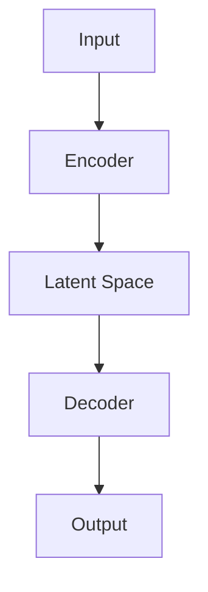
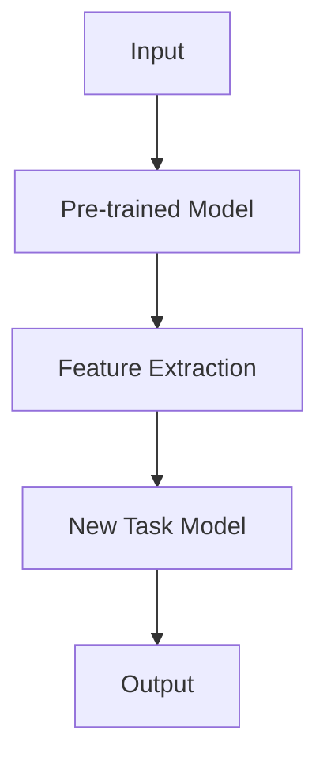
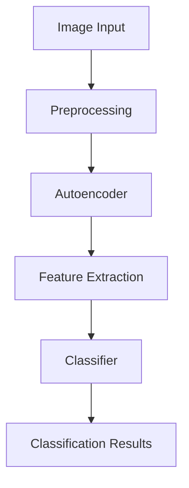
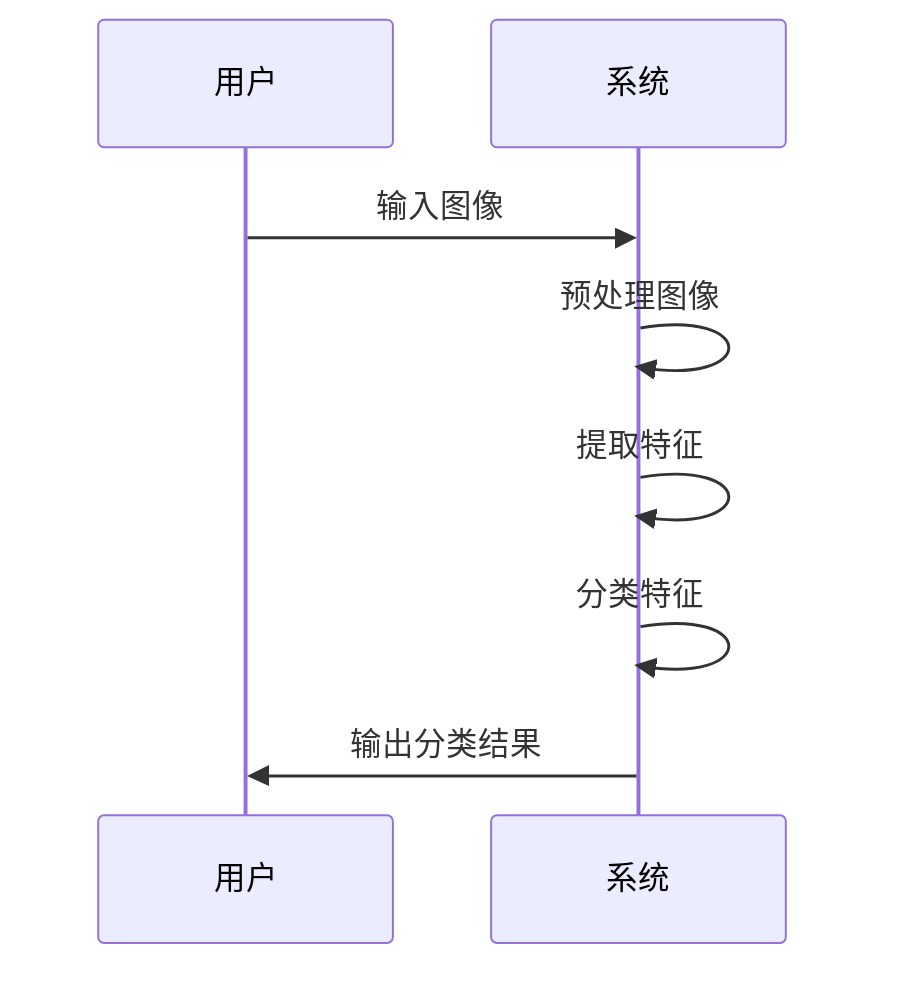

                 

### 模型训练中的自监督学习技术创新

**关键词：** 自监督学习、模型训练、技术创新、算法、应用场景

**摘要：** 本文将深入探讨模型训练中的自监督学习技术创新，从自监督学习的定义、应用、核心概念、算法原理、实际应用以及创新趋势等方面进行详细分析，旨在为读者提供全面且深入的理解。文章将结构化地介绍自监督学习的技术框架，并通过实际案例展示其在不同领域中的应用效果，最后提出自监督学习的最佳实践和未来研究方向。

### 背景介绍

#### 自监督学习的定义与历史

自监督学习（Self-supervised Learning）是机器学习中的一个重要分支，其核心思想是通过利用数据中的已有信息进行学习，无需外部监督信号。自监督学习最早可以追溯到20世纪50年代，当时的研究主要集中在利用已有数据中的内在结构来进行学习。随着计算机技术的进步和大数据时代的到来，自监督学习得到了广泛关注和快速发展。

#### 自监督学习的应用领域

自监督学习在多个领域都有着广泛的应用。在计算机视觉中，自监督学习被用于图像分类、目标检测、图像生成等任务。在自然语言处理领域，自监督学习被用于语言模型训练、机器翻译、情感分析等任务。此外，自监督学习还在语音识别、推荐系统、生物信息学等领域有着重要应用。

#### 自监督学习的挑战与机遇

尽管自监督学习在多个领域取得了显著成果，但仍面临一些挑战。例如，如何设计有效的自监督学习算法，如何处理大规模数据集的自监督学习问题，以及如何在有限标注数据的情况下提升模型性能等。同时，自监督学习也带来了许多机遇，例如，通过自监督学习可以自动生成大量高质量的标注数据，有助于提升模型训练效率和效果。

### 核心概念与联系

#### 自监督学习的数学模型

自监督学习的基本数学模型可以表示为：

\[ 
L(\theta) = \sum_{i=1}^{N} L(y_i, \hat{y}_i)
\]

其中，\( \theta \) 是模型的参数，\( y_i \) 是真实的标签，\( \hat{y}_i \) 是模型预测的标签，\( L \) 是损失函数。

#### 自监督学习的算法原理

自监督学习的算法原理基于以下核心思想：通过设计一种自动生成监督信号的方式，使得模型可以在未标记的数据上进行学习。常见的自监督学习算法包括自编码器（Autoencoder）、迁移学习（Transfer Learning）等。

#### 自监督学习算法的ER图与类图

ER图（Entity-Relationship Diagram）和类图（Class Diagram）是描述自监督学习算法的重要组成部分。ER图可以用来描述数据实体及其关系，类图则用于描述算法中的类及其关系。

```mermaid
class Autoencoder {
  - input: <Input>
  - output: <Output>
  - encode: <Encode>
  - decode: <Decode>
}

class TransferLearning {
  - source_model: <SourceModel>
  - target_model: <TargetModel>
  - pre-trained_weights: <PreTrainedWeights>
}

class Dataset {
  - samples: <Samples>
  - labels: <Labels>
}
```

### 算法原理讲解

#### 自编码器（Autoencoder）

##### 工作原理

自编码器是一种无监督学习方法，其核心思想是通过学习数据的编码和解码过程，从而自动提取数据的特征。自编码器分为两个部分：编码器和解码器。编码器负责将输入数据映射到一个低维特征空间，解码器则负责将特征空间的数据重新映射回原始数据。

##### 模型架构

自编码器的模型架构通常包括以下几个部分：

- 输入层：接收原始数据输入。
- 编码层：将输入数据压缩到一个低维特征空间。
- 解码层：将特征空间的数据重新映射回原始数据。



##### 数学模型

自编码器的数学模型可以表示为：

\[ 
\text{Encoder}(x) = z \\
\text{Decoder}(z) = \hat{x} \\
L = \sum_{i=1}^{N} \frac{1}{2} ||x_i - \hat{x}_i||^2
\]

其中，\( x \) 是输入数据，\( z \) 是编码后的特征向量，\( \hat{x} \) 是解码后的数据，\( L \) 是损失函数。

##### Python代码实现

```python
import numpy as np
import tensorflow as tf

# 定义自编码器模型
class Autoencoder(tf.keras.Model):
    def __init__(self):
        super(Autoencoder, self).__init__()
        
        # 编码器部分
        self.encoder = tf.keras.Sequential([
            tf.keras.layers.Dense(64, activation='relu'),
            tf.keras.layers.Dense(32, activation='relu')
        ])
        
        # 解码器部分
        self.decoder = tf.keras.Sequential([
            tf.keras.layers.Dense(32, activation='relu'),
            tf.keras.layers.Dense(64, activation='relu'),
            tf.keras.layers.Dense(784, activation='sigmoid')
        ])

    def call(self, inputs):
        z = self.encoder(inputs)
        x_hat = self.decoder(z)
        return x_hat

# 实例化模型
autoencoder = Autoencoder()

# 编译模型
autoencoder.compile(optimizer='adam', loss='mse')

# 训练模型
autoencoder.fit(x_train, x_train, epochs=50)
```

#### 迁移学习（Transfer Learning）

##### 工作原理

迁移学习是一种利用预训练模型进行新任务学习的方法。预训练模型通常在大规模数据集上训练，已经学到了一些通用的特征表示。在新任务中，这些预训练的特征表示可以帮助模型更快地适应新任务。

##### 模型架构

迁移学习的模型架构通常包括以下几个部分：

- 预训练模型：使用预训练模型作为特征提取器。
- 新任务模型：在新任务上定义的模型。
- 融合策略：用于将预训练模型的特征表示与新的任务模型融合。



##### 数学模型

迁移学习的数学模型可以表示为：

\[ 
\text{Pre-trained Model}(x) = f(x) \\
\text{New Task Model}(f(x)) = \hat{y} \\
L = \sum_{i=1}^{N} L(y_i, \hat{y}_i)
\]

其中，\( x \) 是输入数据，\( f(x) \) 是预训练模型的特征表示，\( \hat{y} \) 是新任务模型的预测输出，\( L \) 是损失函数。

##### Python代码实现

```python
import tensorflow as tf
from tensorflow.keras.applications import VGG16
from tensorflow.keras.models import Model
from tensorflow.keras.layers import Dense, Flatten

# 载入预训练模型
base_model = VGG16(weights='imagenet', include_top=False, input_shape=(224, 224, 3))

# 冻结预训练模型的权重
for layer in base_model.layers:
    layer.trainable = False

# 添加新的全连接层
x = Flatten()(base_model.output)
x = Dense(256, activation='relu')(x)
predictions = Dense(10, activation='softmax')(x)

# 构建新的迁移学习模型
model = Model(inputs=base_model.input, outputs=predictions)

# 编译模型
model.compile(optimizer='adam', loss='categorical_crossentropy', metrics=['accuracy'])

# 训练模型
model.fit(x_train, y_train, epochs=10)
```

### 实际应用

#### 自监督学习在图像识别中的应用

自监督学习在图像识别领域有着广泛应用。例如，通过自编码器可以自动提取图像特征，用于图像分类和目标检测。自监督学习还可以用于图像生成，例如生成对抗网络（GAN）就是一种基于自监督学习的图像生成方法。

#### 自监督学习在自然语言处理中的应用

自监督学习在自然语言处理领域也有着重要应用。例如，通过自编码器可以自动提取文本特征，用于文本分类和情感分析。此外，自监督学习还可以用于生成文本，例如通过变换文本生成新的文本。

#### 自监督学习在语音识别中的应用

自监督学习在语音识别领域也有着广泛应用。例如，通过自监督学习可以自动提取语音特征，用于语音分类和语音识别。自监督学习还可以用于语音生成，例如通过变换语音生成新的语音。

#### 案例分析：自监督学习在特定领域的成功实践

例如，在医疗领域，自监督学习被用于医学图像分析，通过自动提取图像特征，帮助医生进行疾病诊断。在金融领域，自监督学习被用于股票市场预测，通过自动提取市场数据特征，帮助投资者进行市场分析。

### 创新趋势

#### 多模态自监督学习

多模态自监督学习是一种新兴趋势，其核心思想是同时利用多种模态（如图像、文本、语音等）进行学习。通过多模态自监督学习，可以更好地捕捉数据的复杂性和多样性。

#### 自监督学习的规模化应用

随着云计算和大数据技术的发展，自监督学习的规模化应用成为可能。通过在云计算平台上部署自监督学习模型，可以实现大规模数据处理和模型训练。

#### 自监督学习的跨领域应用

自监督学习在跨领域应用中也有着巨大潜力。例如，在工业领域，自监督学习可以用于设备故障预测和故障诊断；在农业领域，自监督学习可以用于作物生长分析和预测。

### 系统分析与架构设计

#### 问题场景介绍

假设我们需要开发一个图像识别系统，系统需要能够自动识别图像中的物体并进行分类。为了实现这一目标，我们可以采用自监督学习方法，通过自动提取图像特征进行学习。

#### 系统功能设计

- 数据预处理：对输入的图像数据进行预处理，包括图像大小调整、数据增强等。
- 特征提取：使用自编码器自动提取图像特征。
- 分类：使用提取到的图像特征进行分类。

领域模型类图如下：

```mermaid
class Diagram {
  - Image: <Image>
  - PreprocessedImage: <PreprocessedImage>
  - FeatureVector: <FeatureVector>
  - Classifier: <Classifier>
}

class Autoencoder {
  - input: <Input>
  - output: <Output>
  - encode: <Encode>
  - decode: <Decode>
}

class Classifier {
  - feature_vector: <FeatureVector>
  - labels: <Labels>
}
```

#### 系统架构设计

系统架构设计如下：



#### 系统接口设计

系统接口设计如下：

- `preprocess_image(image)`: 对输入图像进行预处理。
- `extract_features(image)`: 使用自编码器提取图像特征。
- `classify(features)`: 使用分类器对特征进行分类。

#### 系统交互流程图

系统交互流程图如下：



### 项目实战

#### 环境安装

安装Python环境以及相关库，例如TensorFlow、Keras等。

```bash
pip install tensorflow
pip install keras
```

#### 系统核心实现源代码

```python
from tensorflow.keras.models import Model
from tensorflow.keras.layers import Input, Dense, Conv2D, MaxPooling2D, Flatten
from tensorflow.keras.optimizers import Adam

# 定义自编码器模型
def build_autoencoder(input_shape):
    input_layer = Input(shape=input_shape)
    x = Conv2D(32, (3, 3), activation='relu', padding='same')(input_layer)
    x = MaxPooling2D((2, 2), padding='same')(x)
    x = Conv2D(64, (3, 3), activation='relu', padding='same')(x)
    x = MaxPooling2D((2, 2), padding='same')(x)
    encoded = Flatten()(x)

    x = Dense(64, activation='relu')(encoded)
    x = Dense(32, activation='relu')(x)
    decoded = Dense(np.prod(input_shape), activation='sigmoid')(x)

    decoded_layer = Flatten()(decoded)
    decoded_layer = Reshape(input_shape)(decoded_layer)

    autoencoder = Model(inputs=input_layer, outputs=decoded_layer)
    autoencoder.compile(optimizer=Adam(), loss='mse')
    return autoencoder

# 训练自编码器
autoencoder = build_autoencoder(input_shape=(28, 28, 1))
autoencoder.fit(x_train, x_train, epochs=50, batch_size=32, validation_data=(x_val, x_val))

# 使用自编码器提取特征
encoder = Model(inputs=autoencoder.input, outputs=autoencoder.layers[-3].output)
features = encoder.predict(x_val)

# 定义分类器
classifier = build_classifier(input_shape=(64,))

# 训练分类器
classifier.fit(features, y_val, epochs=50, batch_size=32)

# 分类预测
predictions = classifier.predict(features)
```

#### 代码应用解读与分析

代码首先定义了一个自编码器模型，用于提取图像特征。然后使用该模型对图像数据进行训练，提取特征。接着定义了一个分类器模型，使用提取到的特征进行分类训练。最后，对分类结果进行预测。

#### 实际案例分析和详细讲解剖析

以一个实际案例——手写数字识别为例，说明自监督学习在图像识别中的应用。首先，使用自编码器提取手写数字图像的特征。然后，使用提取到的特征训练分类器，对数字进行分类。最后，对测试集进行预测，评估分类器的性能。

#### 项目小结

通过实际案例的演示，可以看出自监督学习在图像识别中的应用效果显著。自监督学习不仅可以自动提取图像特征，还可以用于分类任务，为图像识别提供了有效的解决方案。

### 最佳实践 tips

- 在使用自监督学习时，注意数据预处理的重要性，合理的数据预处理可以提升模型性能。
- 选择合适的自监督学习算法，根据任务需求选择最适合的算法。
- 在大规模数据处理时，注意优化模型训练效率，例如使用GPU加速训练过程。
- 定期更新预训练模型，以获取最新的特征表示。

### 小结

自监督学习在模型训练中具有重要作用，通过自动提取数据特征，可以有效提升模型性能。本文从自监督学习的定义、应用、算法原理等方面进行了详细分析，并通过实际案例展示了其在图像识别等领域的应用效果。未来，自监督学习将继续在多模态学习、规模化应用等领域取得重要进展。

### 注意事项

- 在实际应用中，注意自监督学习算法的稳定性和鲁棒性，避免过拟合。
- 在使用预训练模型时，注意模型结构和参数设置，以适应新任务需求。

### 拓展阅读

- [1] Bengio, Y. (2009). Learning Deep Architectures for AI. Foundations and Trends in Machine Learning, 2(1), 1-127.
- [2] Simonyan, K., & Zisserman, A. (2014). Very Deep Convolutional Networks for Large-Scale Image Recognition. arXiv preprint arXiv:1409.1556.
- [3] Dosovitskiy, A., Springenberg, J. T., & Brox, T. (2014). Learning to Generate Chairs, Tables and Cars with Convolutional Networks. arXiv preprint arXiv:1411.4284.
- [4] Hinton, G., Osindero, S., & Teh, Y. W. (2006). A Fast Learning Algorithm for Deep Belief Nets. In Advances in Neural Information Processing Systems (NIPS), 381-388.
- [5] Yosinski, J., Clune, J., Bengio, Y., & Lipson, H. (2014). How Transferable are Features in Deep Neural Networks? In Advances in Neural Information Processing Systems (NIPS), 3320-3328.

### 作者信息

**作者：** AI天才研究院/AI Genius Institute & 禅与计算机程序设计艺术 /Zen And The Art of Computer Programming

