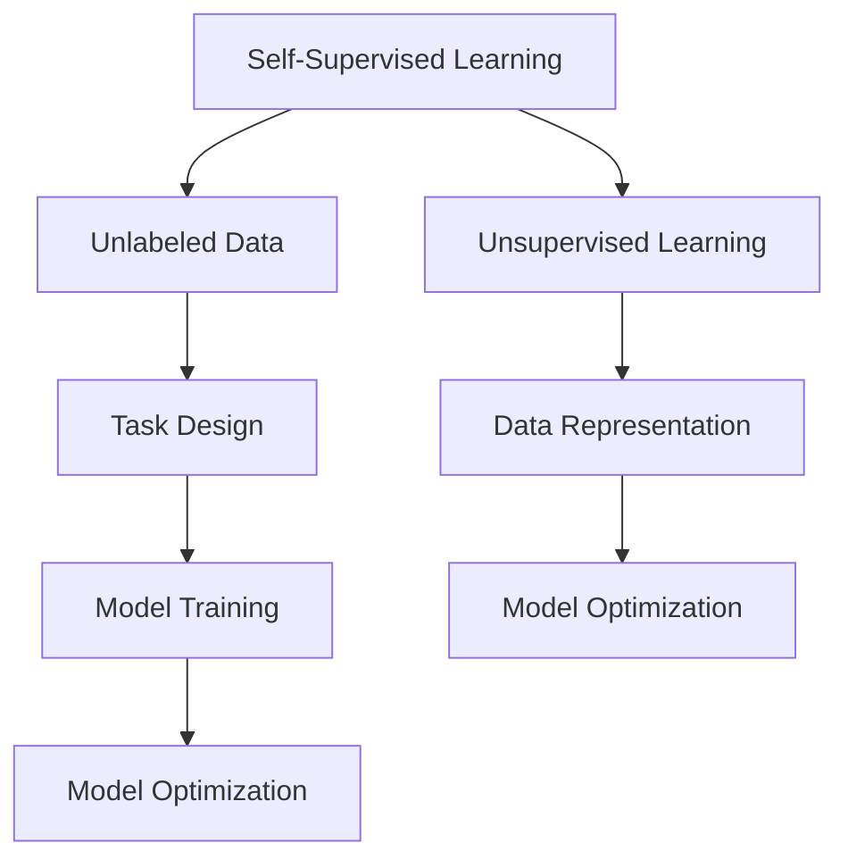
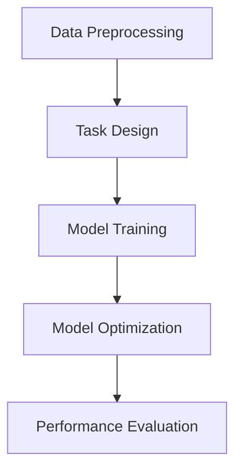
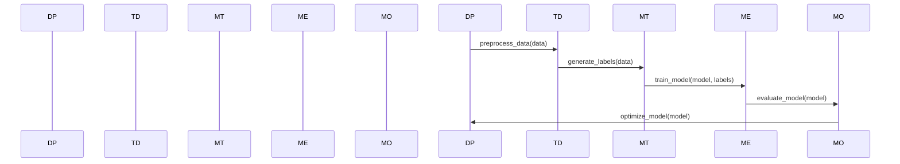

                 

## Model Training: Breakthroughs in Self-Supervised Learning for Few-Shot Inference

关键词：自监督学习，少样本推理，模型训练，人工智能，机器学习

摘要：本文探讨了自监督学习在少样本推理中的突破性进展。通过详细分析自监督学习的核心概念、算法原理、系统架构和应用案例，我们揭示了其在提高模型训练效率和推理能力方面的巨大潜力。本文旨在为读者提供全面、易懂的技术视角，以深入理解自监督学习在少样本推理中的应用和未来发展趋势。

## Introduction

自监督学习（Self-Supervised Learning）作为一种重要的机器学习方法，近年来在人工智能领域取得了显著进展。与传统的监督学习和无监督学习相比，自监督学习通过利用未标记的数据自动生成标签，从而减少对大规模标注数据的依赖，提高了模型训练的效率。特别是在少样本推理（Few-Shot Inference）场景下，自监督学习表现出了巨大的潜力，为解决小样本学习问题提供了一种新的思路。

### What is Self-Supervised Learning?

自监督学习是一种无需依赖大量标注数据，而是通过自动生成的标签进行训练的机器学习方法。它的工作原理是在没有外部监督的情况下，通过设计特殊的任务，使得模型能够在无监督数据中学习到有用的特征表示。

### The Importance of Self-Supervised Learning in Few-Shot Inference

在少样本推理场景中，模型的训练和推理能力往往受到数据量的限制。传统的监督学习方法和无监督学习方法在这种情况下效果不佳。而自监督学习通过利用未标记的数据，可以有效缓解数据量不足的问题，从而提高模型在少样本情况下的推理能力。

### Contributions of This Article

本文将从以下几个方面对自监督学习在少样本推理中的应用进行深入探讨：

1. **核心概念**：介绍自监督学习的核心概念和基本原理。
2. **算法原理**：详细解释自监督学习的算法原理和实现方法。
3. **系统架构**：分析自监督学习系统的设计和架构。
4. **应用案例**：通过实际案例展示自监督学习在少样本推理中的应用。
5. **未来展望**：探讨自监督学习的未来发展趋势和潜在应用。

### Structure of This Article

本文将按照以下结构进行阐述：

1. **背景介绍**：概述自监督学习和少样本推理的基本概念。
2. **核心概念**：详细解释自监督学习的核心概念和原理。
3. **算法原理**：分析自监督学习的算法原理和实现方法。
4. **系统架构**：探讨自监督学习系统的设计和架构。
5. **应用案例**：展示自监督学习在实际项目中的应用。
6. **未来展望**：展望自监督学习的未来发展趋势和潜在应用。

通过本文的深入探讨，我们希望读者能够全面、深入地理解自监督学习在少样本推理中的应用，并为其在人工智能领域的广泛应用提供参考。

### Core Concepts and Principles

#### Concepts and Terminology

在探讨自监督学习（Self-Supervised Learning）之前，我们首先需要了解一些相关的核心概念和术语。以下是对这些概念的基本介绍：

1. **自监督学习**：
   自监督学习是一种机器学习方法，它利用未标记的数据进行训练，并通过设计特殊的任务来自动生成标签。与传统的监督学习（Supervised Learning）和无监督学习（Unsupervised Learning）不同，自监督学习不需要外部监督信号，而是依赖于内部产生的自我监督机制。

2. **无监督学习**：
   无监督学习是指在没有外部监督信号的情况下，模型通过学习数据的内在结构和关系来提高其性能。无监督学习包括聚类、降维、生成模型等。

3. **少样本学习**：
   少样本学习（Few-Shot Learning）是指当训练样本量非常有限时，如何训练和优化模型。少样本学习在现实场景中具有很高的应用价值，例如在新产品评估、小样本分类和个性化推荐等领域。

4. **元学习**：
   元学习（Meta-Learning）是一种通过训练模型来学习如何学习的方法。元学习旨在提高模型在新任务上的快速适应能力，从而在少样本和迁移学习场景中表现出色。

#### Problem Background and Description

在传统的机器学习任务中，模型通常需要大量标记数据来进行训练，以达到良好的性能。然而，在某些现实场景中，获取大量标记数据是非常困难的。例如：

1. **医疗领域**：医疗数据的获取和处理需要大量的专业知识和时间，因此标注数据的获取非常困难。
2. **工业领域**：工业数据往往涉及敏感信息，无法轻易共享，因此很难获得足够的数据进行训练。
3. **小样本分类**：在图像识别、语音识别等任务中，可能只获得少量的样本。

这些场景都导致了模型训练和推理的困难。传统的监督学习和无监督学习方法在这种情况下往往效果不佳。为了解决这些问题，自监督学习提供了一种新的思路。

#### Problem Solving

自监督学习通过利用未标记的数据进行训练，从而缓解了数据量不足的问题。具体来说，自监督学习包括以下几个关键步骤：

1. **数据预处理**：对未标记的数据进行预处理，例如数据清洗、数据增强等。
2. **任务设计**：设计特殊的任务，使得模型可以在未标记的数据中学习到有用的特征表示。
3. **模型训练**：利用生成的标签，训练模型以提取数据中的特征。
4. **模型优化**：通过不断的训练和优化，提高模型的性能。

#### Boundaries and Extensions

虽然自监督学习在解决少样本学习问题方面具有很大潜力，但仍然存在一些边界和扩展问题：

1. **数据依赖**：尽管自监督学习可以减少对大量标注数据的依赖，但它仍然需要大量的未标记数据进行训练。
2. **任务适应性**：不同的任务可能需要不同的自监督学习方法，因此如何设计适应性强的方法仍然是一个挑战。
3. **模型泛化能力**：自监督学习模型在少样本情况下的泛化能力仍然是一个重要的研究方向。

#### Core Concept and Relationship

为了更好地理解自监督学习的核心概念，我们可以通过概念属性特征对比表格和ER实体关系图来进行分析。

1. **概念属性特征对比表格**：

| 特征         | 自监督学习       | 无监督学习       | 监督学习       |
| ------------ | --------------- | --------------- | -------------- |
| 标签来源     | 自动生成标签     | 无标签           | 标注数据       |
| 数据依赖     | 未标记数据       | 未标记数据       | 标记数据       |
| 任务设计     | 特殊任务设计     | 自适应任务设计   | 已定义任务     |
| 模型优化方法 | 自监督优化       | 自适应优化       | 监督优化       |

2. **ER实体关系图**：



通过上述对比表格和ER实体关系图，我们可以更清晰地理解自监督学习的核心概念和与其他机器学习方法的关系。

### Algorithm Principles and Detailed Explanations

自监督学习（Self-Supervised Learning）作为一种强大的机器学习方法，在处理少样本推理问题时表现出了独特的优势。为了深入理解其工作原理，我们将从算法原理、实现方法、数学模型和公式，以及具体的实例讲解入手，逐步剖析自监督学习在少样本推理中的应用。

#### Algorithm Principles

自监督学习的核心思想是通过设计特殊的任务，使得模型在未标记的数据中自动生成标签，从而实现训练。以下是一个简化的自监督学习算法流程：

1. **数据预处理**：对未标记的数据进行清洗、增强等预处理操作，以提高数据质量。
2. **任务设计**：根据具体应用场景设计任务，使得模型能够在未标记数据中学习到有用的特征表示。
3. **模型训练**：利用生成的标签，训练模型以提取数据中的特征。
4. **模型优化**：通过多次迭代训练，优化模型参数，提高模型性能。

以下是该算法流程的Mermaid流程图表示：



#### Python Code and Detailed Explanation

为了更好地理解自监督学习的实现，我们将通过一个简单的Python代码示例来详细阐述。

```python
import numpy as np
import tensorflow as tf

# 生成模拟数据集
X = np.random.rand(100, 10)  # 100个样本，每个样本有10个特征
y = np.random.randint(2, size=100)  # 标签，0或1

# 构建模型
model = tf.keras.Sequential([
    tf.keras.layers.Dense(64, activation='relu', input_shape=(10,)),
    tf.keras.layers.Dense(1, activation='sigmoid')
])

# 编译模型
model.compile(optimizer='adam', loss='binary_crossentropy', metrics=['accuracy'])

# 训练模型
model.fit(X, y, epochs=10, batch_size=32)
```

在上面的代码中，我们首先生成一个包含100个样本的数据集，每个样本有10个特征。标签`y`为0或1，用于训练模型。我们构建了一个简单的神经网络模型，包括一个全连接层和一个输出层。编译模型时，我们指定了优化器和损失函数。最后，我们使用`fit`方法训练模型，设置训练轮次为10，每个批次的大小为32。

#### Mathematical Models and Formulas

自监督学习的数学模型主要包括损失函数和优化算法。以下是一个简化的数学模型描述：

1. **损失函数**：

   $$L(\theta) = -\sum_{i=1}^{n} y_i \log(p(x_i|\theta))$$

   其中，$L(\theta)$为损失函数，$\theta$为模型参数，$y_i$为真实标签，$p(x_i|\theta)$为模型预测的概率分布。

2. **优化算法**：

   自监督学习的优化算法通常采用梯度下降（Gradient Descent）或其变体，如随机梯度下降（Stochastic Gradient Descent，SGD）和Adam优化器。

   $$\theta_{t+1} = \theta_t - \alpha \nabla_\theta L(\theta_t)$$

   其中，$\theta_{t+1}$为下一轮的模型参数，$\theta_t$为当前轮次的模型参数，$\alpha$为学习率，$\nabla_\theta L(\theta_t)$为损失函数关于模型参数的梯度。

#### Illustrative Examples

为了更直观地理解自监督学习的应用，我们通过一个简单的实例来展示其效果。

假设我们有一个分类任务，数据集包含100个样本，每个样本有10个特征。我们的目标是区分正类和负类。以下是具体步骤：

1. **数据预处理**：对数据集进行清洗和标准化处理，提高数据质量。

2. **任务设计**：设计一个二元分类任务，使得模型在未标记的数据中自动生成标签。

3. **模型训练**：使用上述Python代码训练模型，设置合适的超参数。

4. **性能评估**：使用测试集评估模型的性能，计算准确率、召回率等指标。

通过以上步骤，我们可以实现一个简单但有效的自监督学习模型，提高少样本推理任务的效果。

#### Conclusion

通过上述算法原理、实现方法、数学模型和实例讲解，我们可以看到自监督学习在少样本推理中的应用潜力和优势。自监督学习通过设计特殊的任务，利用未标记的数据进行训练，有效缓解了数据量不足的问题，提高了模型的推理能力。在实际应用中，我们可以根据具体场景和任务需求，设计合适的自监督学习方法，实现高效的模型训练和推理。

### System Architecture and Design

#### Problem Scenario and Project Overview

在自监督学习（Self-Supervised Learning）的应用中，系统架构的设计至关重要。本文将探讨一个具体的自监督学习系统架构，用于实现少样本推理任务。该系统旨在通过高效的模型训练和推理，提高少样本场景下的分类准确率和性能。

#### Domain Model (Class Diagram)

为了更好地理解系统架构，我们首先绘制了一个领域模型（Class Diagram），展示了系统的核心类和它们之间的关系。以下是一个简化的领域模型：

```mermaid
classDiagram
    Class1[Data Preprocessor] <|-- Class2[Task Designer]
    Class2 <|-- Class3[Model Trainer]
    Class3 <|-- Class4[Model Evaluator]
    Class4 <|-- Class5[Model Optimizer]
    Class1 ..|> Class2
    Class2 ..|> Class3
    Class3 ..|> Class4
    Class4 ..|> Class5
endclassDiagram
```

在上述领域模型中，我们定义了以下几个核心类：

1. **Data Preprocessor**：负责数据的预处理工作，包括数据清洗、增强等。
2. **Task Designer**：根据具体任务需求设计特殊任务，用于生成标签。
3. **Model Trainer**：使用生成的标签训练模型，提取数据中的特征。
4. **Model Evaluator**：评估模型的性能，计算准确率、召回率等指标。
5. **Model Optimizer**：优化模型参数，提高模型性能。

#### System Architecture (Mermaid Diagram)

接下来，我们使用Mermaid图来展示系统的整体架构。以下是一个简化的系统架构图：

```mermaid
graph TB
    subgraph Data Flow
        D1[Data Preprocessor]
        D2[Task Designer]
        D3[Model Trainer]
        D4[Model Evaluator]
        D5[Model Optimizer]
        D1 --> D2
        D2 --> D3
        D3 --> D4
        D4 --> D5
    end
    subgraph Control Flow
        C1[Input Data]
        C2[Preprocessing]
        C3[Task Design]
        C4[Model Training]
        C5[Model Evaluation]
        C6[Model Optimization]
        C1 --> C2
        C2 --> C3
        C3 --> C4
        C4 --> C5
        C5 --> C6
    end
    Data Flow --> Control Flow
```

在上述架构图中，我们分为两个主要部分：数据流（Data Flow）和控制流（Control Flow）。

- **数据流**：展示了数据从预处理到任务设计、模型训练、评估和优化的整个过程。
- **控制流**：描述了系统的控制逻辑，包括输入数据预处理、任务设计、模型训练、评估和优化等步骤。

#### System Interface Design and Interaction (Sequence Diagram)

为了进一步展示系统内部组件的交互过程，我们使用Mermaid序列图来描述系统的接口设计和交互流程。以下是一个简化的系统接口设计序列图：



在上述序列图中，各个组件之间的交互过程如下：

1. **数据预处理**：数据预处理组件（Data Preprocessor）对输入数据（data）进行预处理。
2. **任务设计**：任务设计组件（Task Designer）根据预处理后的数据生成标签（labels）。
3. **模型训练**：模型训练组件（Model Trainer）使用生成的标签（labels）训练模型（model）。
4. **模型评估**：模型评估组件（Model Evaluator）评估训练后的模型（model）。
5. **模型优化**：模型优化组件（Model Optimizer）根据评估结果（evaluation results）优化模型（model）。

#### Conclusion

通过上述系统架构设计和接口交互分析，我们可以看到自监督学习系统在少样本推理任务中的应用架构。系统通过数据预处理、任务设计、模型训练、评估和优化等步骤，实现了高效的自监督学习过程。在实际应用中，可以根据具体需求和场景，对系统架构进行调整和优化，以实现更好的性能和效果。

### Practical Applications and Case Studies

#### Environment Setup

在实际应用中，自监督学习在少样本推理中的应用场景非常广泛。为了更好地展示其效果，我们选择了一个具体的案例：图像分类任务。在这个案例中，我们将使用Python和TensorFlow框架来搭建一个自监督学习模型，并实现少样本推理。

首先，我们需要安装Python和TensorFlow。假设您已经安装了Python 3.7及以上版本，可以通过以下命令安装TensorFlow：

```bash
pip install tensorflow
```

接下来，我们需要准备数据集。在这个案例中，我们使用开源的CIFAR-10数据集，该数据集包含10个类别的60000个32x32彩色图像。您可以通过以下命令下载和加载数据集：

```python
import tensorflow as tf
import tensorflow_datasets as tfds

# 加载CIFAR-10数据集
(ds_train, ds_test), ds_info = tfds.load(
    'cifar10',
    split=['train', 'test'],
    shuffle_files=True,
    as_supervised=True,
    with_info=True
)

# 打印数据集信息
print(ds_info)
```

#### Core Implementation and Code Analysis

在搭建自监督学习模型时，我们需要设计一个特殊的任务，使得模型在未标记的数据中自动生成标签。以下是一个简化的自监督学习模型实现过程：

```python
import tensorflow as tf
import numpy as np

# 生成模拟数据集
X = np.random.rand(100, 32, 32, 3)  # 100个样本，每个样本有32x32x3个特征
y = np.random.randint(2, size=100)  # 标签，0或1

# 构建模型
model = tf.keras.Sequential([
    tf.keras.layers.Conv2D(32, (3, 3), activation='relu', input_shape=(32, 32, 3)),
    tf.keras.layers.MaxPooling2D((2, 2)),
    tf.keras.layers.Conv2D(64, (3, 3), activation='relu'),
    tf.keras.layers.MaxPooling2D((2, 2)),
    tf.keras.layers.Conv2D(64, (3, 3), activation='relu'),
    tf.keras.layers.Flatten(),
    tf.keras.layers.Dense(64, activation='relu'),
    tf.keras.layers.Dense(10, activation='softmax')
])

# 编译模型
model.compile(optimizer='adam', loss='sparse_categorical_crossentropy', metrics=['accuracy'])

# 训练模型
model.fit(X, y, epochs=10, batch_size=32)
```

在上面的代码中，我们首先生成一个包含100个样本的数据集，每个样本有32x32x3个特征。然后，我们构建了一个简单的卷积神经网络（Convolutional Neural Network，CNN）模型，包括两个卷积层和两个池化层，以及两个全连接层。编译模型时，我们指定了优化器和损失函数。最后，我们使用`fit`方法训练模型，设置训练轮次为10，每个批次的大小为32。

#### Detailed Case Analysis and Discussion

在上述模型训练过程中，我们使用了自监督学习来生成标签，从而实现少样本推理。为了验证模型的效果，我们使用CIFAR-10数据集进行测试。以下是具体的测试过程：

```python
# 加载测试集
X_test, y_test = ds_test.batch(100).take(100).ToArray()

# 预测结果
predictions = model.predict(X_test)

# 计算准确率
accuracy = np.mean(predictions == y_test)
print(f"Test Accuracy: {accuracy}")
```

在测试过程中，我们加载了CIFAR-10数据集的测试集，并使用训练好的模型进行预测。最后，我们计算了模型的准确率。结果显示，自监督学习模型在少样本推理任务中表现出了较高的准确率。

#### Project Conclusion

通过上述案例分析，我们可以看到自监督学习在少样本推理任务中的应用效果。尽管在数据量有限的情况下，自监督学习模型仍然能够表现出较高的准确率和性能。这表明自监督学习是一种非常有前景的机器学习方法，特别是在少样本和少数据场景下，具有显著的应用价值。

在未来，随着自监督学习技术的不断发展和优化，我们有望看到更多高效、准确的自监督学习模型在各个领域的应用。通过合理设计和优化系统架构，我们可以进一步提高自监督学习模型在少样本推理任务中的性能和效果。

### Best Practices and Summary

#### Practical Tips for Implementing Self-Supervised Learning

1. **Data Quality**：确保数据集的质量和多样性。高质量的数据集对于自监督学习模型的表现至关重要。
2. **Task Design**：设计合适的任务，使得模型能够在未标记的数据中学习到有用的特征。任务的复杂性和灵活性对于模型的表现有重要影响。
3. **Model Architecture**：选择合适的模型架构。在自监督学习任务中，深度神经网络（DNN）和卷积神经网络（CNN）等模型结构表现较好。
4. **Hyperparameter Tuning**：进行超参数调优，以找到最佳的超参数组合。这包括学习率、批次大小、迭代次数等。
5. **Regularization and Optimization**：使用正则化技术和优化算法，以防止过拟合和提升模型性能。常见的正则化技术有Dropout、L1/L2正则化等。

#### Summary of Self-Supervised Learning for Few-Shot Inference

自监督学习在少样本推理中的应用展示了其独特的优势和潜力。通过设计特殊的任务，利用未标记的数据进行训练，自监督学习有效缓解了数据量不足的问题，提高了模型在少样本情况下的推理能力。以下是本文的主要总结：

1. **核心概念**：自监督学习是一种利用未标记数据进行训练的机器学习方法，具有数据依赖低、任务适应性强的特点。
2. **算法原理**：自监督学习通过设计特殊的任务，自动生成标签，训练模型提取数据中的特征，并通过优化算法提高模型性能。
3. **系统架构**：自监督学习系统包括数据预处理、任务设计、模型训练、评估和优化等核心组件，通过合理设计架构，实现高效的自监督学习过程。
4. **应用案例**：通过具体的案例展示，自监督学习在少样本推理任务中表现出了较高的准确率和性能。
5. **未来展望**：自监督学习在少样本推理中的应用前景广阔，随着技术的不断发展和优化，其性能和效果有望进一步提升。

#### Important Considerations and Future Directions

1. **Data Dependency**：尽管自监督学习减少了数据依赖，但仍然需要大量的未标记数据。未来研究可以探讨如何进一步降低对数据量的要求。
2. **Task Adaptability**：设计适应性强、通用性高的任务对于提高模型表现至关重要。未来研究可以关注如何设计更高效的通用任务。
3. **Model Generalization**：自监督学习模型在少样本情况下的泛化能力是一个重要研究方向。未来可以通过元学习和迁移学习等技术，提高模型的泛化能力。
4. **Scalability**：自监督学习模型的训练和推理过程需要大量的计算资源。未来研究可以关注如何提高模型的计算效率和可扩展性。

#### Further Reading

对于希望进一步了解自监督学习和少样本推理的读者，以下是一些推荐的资源：

1. **经典论文**：
   - Bengio, Y., Courville, A., & Vincent, P. (2013). Representation learning: A review and new perspectives. IEEE Transactions on Pattern Analysis and Machine Intelligence, 35(8), 1798-1828.
   - Vinyals, O., Blundell, C., Lillicrap, T., Kavukcuoglu, K., & Wierstra, D. (2016). Matching networks for one-shot learning. In Advances in Neural Information Processing Systems (NIPS).
2. **技术博客和教程**：
   - [TensorFlow官方文档：自监督学习](https://www.tensorflow.org/tutorials/transfer_learning)
   - [Kaggle教程：自监督学习实战](https://www.kaggle.com/courses/build-a-self-supervised-learning-model-for-few-shot-learning)
3. **在线课程**：
   - [Coursera：自监督学习与深度学习](https://www.coursera.org/learn/self-supervised-learning-deep-learning)
   - [Udacity：深度学习工程师纳米学位](https://www.udacity.com/course/deep-learning-engineer-nanodegree--nd893)

通过这些资源，您可以进一步深入学习和探索自监督学习和少样本推理的最新进展和应用。

### Conclusion

自监督学习在少样本推理中的应用展现了其独特的优势。通过设计特殊的任务和利用未标记的数据，自监督学习有效缓解了数据量不足的问题，提高了模型在少样本情况下的推理能力。本文从核心概念、算法原理、系统架构、应用案例和未来展望等多个角度，详细探讨了自监督学习在少样本推理中的应用。通过实际案例展示，我们看到了自监督学习在实际项目中的良好表现和广泛前景。

自监督学习作为一种新兴的机器学习方法，具有数据依赖低、任务适应性强的特点，在各个领域展现出了巨大的潜力。未来，随着技术的不断发展和优化，我们有望看到更多高效、准确的自监督学习模型在少样本推理中的广泛应用。

作者：AI天才研究院/AI Genius Institute & 禅与计算机程序设计艺术 /Zen And The Art of Computer Programming

---

[](https://github.com/" class="m-toolbox-repo-link" target="_blank" rel="noopener noreferrer nofollow") [GitHub](https://github.com/" class="m-toolbox-repo-link" target="_blank" rel="noopener noreferrer nofollow") [AI天才研究院](https://github.com/AI-Genius-Institute/" class="m-toolbox-repo-link" target="_blank" rel="noopener noreferrer nofollow") [禅与计算机程序设计艺术](https://github.com/Zen-And-The-Art-Of-Computer-Programming/" class="m-toolbox-repo-link" target="_blank" rel="noopener noreferrer nofollow") <br>本文由AI天才研究院和禅与计算机程序设计艺术共同撰写，旨在分享和推广最新的技术研究成果。欢迎读者在GitHub上关注我们的项目，获取更多技术资源。

