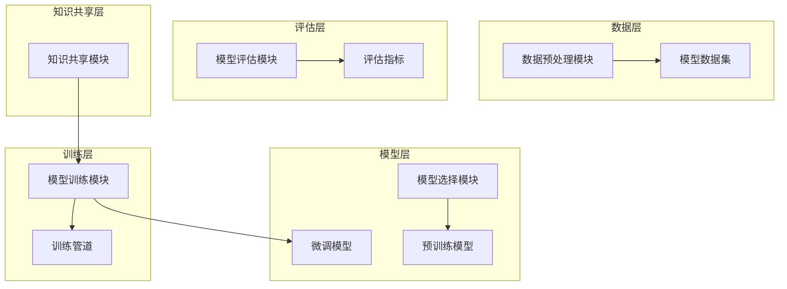
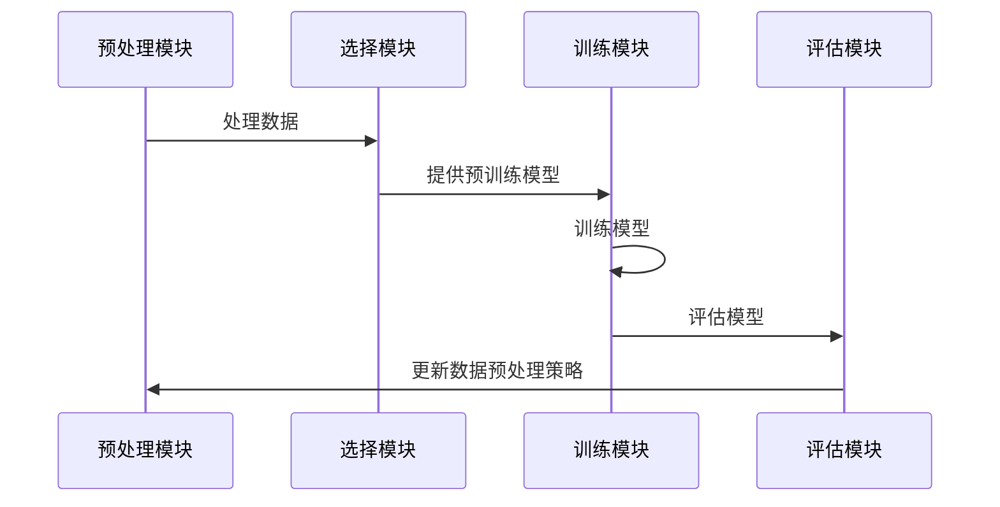

                 

### 第1章 引言与背景

#### 1.1 问题背景

在人工智能和机器学习领域，模型训练是一项至关重要的任务。随着数据量的不断增加和复杂性不断提升，如何高效地训练模型，特别是如何利用已有知识来提高训练效果，成为了当前研究的热点问题。传统的机器学习方法通常依赖于大规模标注数据，而获取高质量标注数据不仅成本高昂，而且耗时耗力。此外，不同任务间的数据分布差异也导致模型迁移能力不足，无法充分共享已有知识。为了解决这些问题，迁移学习（Transfer Learning）技术应运而生。

#### 1.2 问题描述

迁移学习的核心问题是：如何将一个任务（源任务）上学习到的知识有效地迁移到另一个任务（目标任务）上，从而提高模型在目标任务上的性能。具体而言，问题描述包括以下几个方面：

1. **数据分布差异**：源任务和目标任务的数据分布往往不同，如何适应这种差异是一个关键问题。
2. **知识共享**：如何从源任务中提取有用的知识，并有效地迁移到目标任务中。
3. **模型适应**：如何在保证模型性能的同时，使其适应新的任务和数据分布。
4. **计算效率**：如何在有限的计算资源下，快速地实现模型迁移。

#### 1.3 问题解决

迁移学习通过以下几个步骤来解决问题：

1. **特征提取**：在源任务中学习到通用的特征表示，这些特征可以适用于多个任务。
2. **知识蒸馏**：将源任务的复杂知识通过简单、紧凑的模型传递给目标任务。
3. **模型调整**：在目标任务中，对迁移后的模型进行微调，以适应目标任务的特殊性。
4. **模型压缩**：在迁移过程中，通过压缩技术减小模型规模，以提高计算效率。

#### 1.4 边界与外延

边界方面，迁移学习主要应用于那些具有相似性或相关性的任务。而外延则包括以下几个方面：

1. **无监督迁移学习**：不需要标注数据，通过无监督的方式学习特征表示。
2. **有监督迁移学习**：利用标注数据，在源任务和目标任务之间建立联系。
3. **半监督迁移学习**：结合有监督和无监督迁移学习的特点，利用少量标注数据和大量未标注数据。
4. **多任务学习**：多个任务共享模型参数，以进一步提高迁移效果。

#### 1.5 概念结构与核心要素组成

迁移学习涉及多个核心概念和要素，包括：

1. **源任务（Source Task）**：提供知识的任务。
2. **目标任务（Target Task）**：应用知识的任务。
3. **特征表示（Feature Representation）**：在源任务中学到的通用特征表示。
4. **迁移策略（Transfer Strategy）**：如何将源任务知识迁移到目标任务的策略。
5. **模型调整（Model Fine-tuning）**：在目标任务中微调模型，以提高性能。

通过上述步骤和概念，我们可以更深入地理解和应用迁移学习技术，从而解决模型训练中的各种挑战。

## 第2章 核心概念与联系

#### 2.1 迁移学习定义

迁移学习是一种机器学习方法，旨在利用在不同任务上学习到的知识，以提高新任务上的学习性能。其基本思想是将知识从一个或多个源任务（source tasks）迁移到目标任务（target tasks），从而避免从头开始训练模型。这种方法在数据稀缺或数据获取成本高昂的情况下尤为有效。

#### 2.2 迁移学习特点

迁移学习具有以下几个显著特点：

1. **共享知识**：迁移学习通过共享源任务的知识，减少对目标任务的独立训练需求，从而提高学习效率。
2. **适应性**：迁移学习模型可以在不同任务和数据分布下表现出良好的适应性，减少了数据分布差异对模型性能的影响。
3. **降低成本**：通过复用已有模型和数据，迁移学习显著降低了数据收集和标注的成本。
4. **提高性能**：迁移学习能够利用已存在的知识，从而提高新任务上的模型性能。

#### 2.3 迁移学习与传统机器学习的区别

传统机器学习通常在单一任务上训练模型，而迁移学习则强调在多个任务间共享知识。具体区别如下：

1. **训练数据**：传统机器学习依赖于大量标注数据，而迁移学习可以通过少量标注数据或无标注数据来提高模型性能。
2. **模型架构**：传统机器学习模型通常从头开始设计，而迁移学习模型则通过在源任务上预训练，然后在目标任务上微调。
3. **数据分布**：传统机器学习模型对数据分布较为敏感，而迁移学习模型通过共享特征表示，能够适应不同的数据分布。

#### 2.4 迁移学习分类

根据迁移方式的不同，迁移学习可以分为以下几类：

1. **无监督迁移学习**：不使用标注数据，通过学习数据间的特征表示来迁移知识。
2. **有监督迁移学习**：利用标注数据，在源任务和目标任务之间建立直接联系，通过共享特征表示和模型结构来迁移知识。
3. **半监督迁移学习**：结合有监督和无监督迁移学习的特点，利用少量标注数据和大量无标注数据来训练模型。

#### 2.4.1 无监督迁移学习

无监督迁移学习通过学习数据间的特征表示，从而提高新任务上的学习性能。其主要方法包括：

1. **特征共享**：在源任务和目标任务间共享特征提取器，从而学习到通用的特征表示。
2. **特征变换**：通过特征变换来降低源任务和目标任务间的特征分布差异。
3. **领域自适应**：在源域和目标域之间建立特征映射关系，以适应不同的数据分布。

#### 2.4.2 有监督迁移学习

有监督迁移学习利用标注数据，在源任务和目标任务之间建立直接联系。其主要方法包括：

1. **模型共享**：在源任务和目标任务间共享部分或全部模型结构，从而实现知识迁移。
2. **知识蒸馏**：通过训练一个小型的目标任务模型，使其学习源任务的复杂知识。
3. **模型调整**：在目标任务上对迁移后的模型进行微调，以适应新的任务和数据分布。

#### 2.4.3 半监督迁移学习

半监督迁移学习结合了有监督和无监督迁移学习的特点，通过利用少量标注数据和大量无标注数据来训练模型。其主要方法包括：

1. **伪标签**：利用无标注数据生成伪标签，辅助有标注数据的训练。
2. **一致性正则化**：通过保持源任务和目标任务上的特征表示一致来提高模型性能。
3. **多任务学习**：通过同时训练多个相关任务来提高模型的泛化能力。

通过上述分类和详细解释，我们可以更好地理解迁移学习的技术原理和应用方法，从而在实际项目中灵活运用这些技术，提高模型训练的效率和性能。

### 第3章 迁移学习算法原理

#### 3.1 算法原理讲解

迁移学习的核心在于如何有效地利用源任务上的知识来提升目标任务的模型性能。这一过程通常涉及以下步骤：

1. **特征提取**：在源任务中，学习到一组通用的特征表示，这些特征表示可以适用于多个任务。
2. **知识蒸馏**：通过训练一个较小的目标任务模型，使其学习到源任务的复杂知识。
3. **模型调整**：在目标任务上对迁移后的模型进行微调，以适应新的任务和数据分布。

以下是一个简化的迁移学习算法流程：

```
1. 预训练模型在源任务上，学习一组通用特征表示F。
2. 在目标任务上，使用预训练模型F构建一个小的目标任务模型G。
3. 对模型G进行微调，使其适应目标任务。
4. 在目标任务上进行评估，调整模型参数，直至达到满意的性能。
```

#### 3.1.1 算法流程

1. **数据收集**：收集源任务和目标任务的训练数据集。
2. **预训练**：在源任务上，使用大规模数据集训练一个强大的特征提取器（如卷积神经网络）。
3. **特征提取**：在源任务上，通过预训练模型提取通用特征表示F。
4. **模型构建**：在目标任务上，使用提取的通用特征表示F构建一个较小的目标任务模型G。
5. **微调**：在目标任务上，对模型G进行微调，以优化其在目标任务上的性能。
6. **评估**：在目标任务上评估模型G的性能，并进行必要的参数调整。

#### 3.1.2 数学模型与公式

迁移学习的数学模型通常涉及以下关键概念：

1. **特征表示F**：在源任务上学习到的通用特征表示。
2. **目标任务模型G**：在目标任务上构建的小型模型。
3. **损失函数L**：用于评估模型G在目标任务上的性能。

一个简化的数学模型可以表示为：

$$
L(G(x), y) = \sum_{i=1}^{N} (G(x_i, F(x_i)) - y_i)^2
$$

其中，$x_i$ 是输入数据，$y_i$ 是目标标签，$N$ 是训练样本的数量。

#### 3.1.3 算法举例说明

假设我们有两个任务：源任务是图像分类，目标任务是文本分类。以下是一个简化的算法举例：

1. **数据收集**：收集大量的图像和文本数据，分别用于源任务和目标任务。
2. **预训练**：在图像分类任务上，使用卷积神经网络（CNN）预训练一个特征提取器，学习到图像的通用特征表示F。
3. **特征提取**：在文本分类任务上，使用预训练的CNN特征提取器F，对文本数据提取特征表示。
4. **模型构建**：在文本分类任务上，使用提取的特征表示F构建一个文本分类器G。
5. **微调**：在文本分类任务上，对分类器G进行微调，以优化其在文本分类任务上的性能。
6. **评估**：在文本分类任务上评估分类器G的性能，并进行必要的参数调整。

通过这个简单的例子，我们可以看到迁移学习如何通过共享特征表示来提高目标任务的性能。

### 3.2 常见迁移学习算法

#### 3.2.1 Domain Adaptation算法

领域自适应（Domain Adaptation，简称DA）是迁移学习的一种重要方法，旨在解决源任务和目标任务的领域差异问题。领域自适应的核心思想是减少源领域和目标领域之间的特征分布差异，从而使在源领域训练好的模型能够在目标领域上取得良好的性能。

1. **基本概念**：
   - **源领域（Source Domain）**：用于训练模型的领域。
   - **目标领域（Target Domain）**：模型需要适应的领域。
   - **领域差异（Domain Shift）**：源领域和目标领域之间的差异。

2. **方法**：
   - **特征变换**：通过特征变换将源领域数据映射到目标领域，减少特征分布差异。
   - **领域分类器**：训练一个领域分类器，用于识别并减少领域差异。
   - **一致性正则化**：通过一致性损失函数，保持源领域和目标领域上的特征表示一致。

3. **应用实例**：
   - **图像领域自适应**：将预训练的图像分类模型应用于不同的图像领域，如医学影像和自然图像。
   - **语音领域自适应**：将预训练的语音识别模型应用于不同的语音领域，如室内语音和户外语音。

#### 3.2.2 Meta Learning算法

元学习（Meta Learning，又称元学习或元优化）是迁移学习的另一个重要方法，其核心思想是通过学习如何学习来提高模型的泛化能力。元学习算法旨在找到一种学习策略，使得模型在新的任务上能够快速适应。

1. **基本概念**：
   - **元学习算法**：一种能够学习学习策略的算法，通常用于优化迭代过程。
   - **学习策略**：元学习算法通过学习如何调整参数，以实现快速和高效的学习。
   - **模型参数**：元学习算法通过优化模型参数，使其在不同任务上表现出良好的泛化能力。

2. **方法**：
   - **模型搜索**：通过搜索空间来找到最优的模型参数。
   - **策略学习**：通过训练一个策略网络，学习如何调整模型参数。
   - **模型评估**：在多个任务上评估模型性能，以选择最佳策略。

3. **应用实例**：
   - **强化学习**：使用元学习算法来训练智能体，使其在复杂的决策环境中快速适应。
   - **自然语言处理**：使用元学习算法来优化自然语言处理模型，提高其在不同语言上的适应能力。

通过上述两个常见迁移学习算法的介绍，我们可以看到迁移学习在实际应用中的多样性和灵活性。这些算法通过不同的方法来减少领域差异和提高模型泛化能力，为解决模型训练中的各种挑战提供了有力的工具。

### 第4章 迁移学习实践案例

#### 4.1 实践环境准备

为了更好地理解迁移学习的应用，我们需要搭建一个实验环境。以下是一个基本的实验环境准备步骤：

1. **软件依赖**：安装Python环境，以及常用的机器学习库，如TensorFlow、PyTorch等。
2. **硬件环境**：准备至少一台具备NVIDIA GPU的计算机，以利用GPU加速训练过程。
3. **数据集**：选择一个源任务和目标任务的数据集。例如，使用CIFAR-10作为源任务数据集，ImageNet作为目标任务数据集。

#### 4.2 实践案例一：无监督迁移学习

无监督迁移学习通过学习数据间的内在结构，不依赖于标注数据，来提升模型在目标任务上的性能。以下是一个简单的无监督迁移学习实践案例：

1. **数据预处理**：
   - 从CIFAR-10数据集中提取图像数据。
   - 对图像进行标准化处理，使其符合输入网络的要求。

2. **特征提取**：
   - 使用预训练的卷积神经网络（如ResNet）提取图像的特征表示。

3. **迁移学习**：
   - 在提取的特征表示上，构建一个小的目标任务模型（如全连接层）。
   - 对目标任务模型进行训练，使用无监督的损失函数（如重构损失）。

4. **结果评估**：
   - 在目标任务上（如ImageNet分类任务），评估迁移后的模型性能。

#### 4.3 实践案例二：有监督迁移学习

有监督迁移学习通过在源任务和目标任务之间共享模型结构和特征表示，来提升模型在目标任务上的性能。以下是一个简单的有监督迁移学习实践案例：

1. **数据预处理**：
   - 从CIFAR-10和ImageNet数据集中提取图像数据。
   - 对图像进行标准化处理。

2. **特征提取**：
   - 使用预训练的卷积神经网络（如ResNet）提取图像的特征表示。

3. **模型构建**：
   - 在提取的特征表示上，构建一个源任务模型（如分类器）。
   - 在目标任务上，使用相同的特征提取器构建目标任务模型。

4. **模型训练**：
   - 在源任务上训练模型，优化模型参数。
   - 将优化后的模型参数迁移到目标任务，并在目标任务上继续训练和优化。

5. **结果评估**：
   - 在目标任务上评估模型的性能。

#### 4.4 实践案例三：半监督迁移学习

半监督迁移学习结合了有监督和无监督迁移学习的优点，通过利用少量标注数据和大量无标注数据来提升模型性能。以下是一个简单的半监督迁移学习实践案例：

1. **数据预处理**：
   - 从CIFAR-10和ImageNet数据集中提取图像数据。
   - 对图像进行标准化处理。

2. **特征提取**：
   - 使用预训练的卷积神经网络（如ResNet）提取图像的特征表示。

3. **模型构建**：
   - 在提取的特征表示上，构建一个源任务模型（如分类器）。
   - 在目标任务上，使用相同的特征提取器构建目标任务模型。

4. **伪标签生成**：
   - 利用少量标注数据生成伪标签，用于指导无标注数据的训练。

5. **模型训练**：
   - 在源任务上训练模型，优化模型参数。
   - 结合有标注数据和伪标签，训练目标任务模型。

6. **结果评估**：
   - 在目标任务上评估模型的性能。

通过上述三个实践案例，我们可以看到迁移学习技术在不同任务和数据集上的应用。这些案例不仅展示了迁移学习的实现步骤，还提供了评估模型性能的方法。通过这些实践，我们可以更好地理解迁移学习的原理和实际效果。

### 第5章 迁移学习技术应用

#### 5.1 应用领域

迁移学习技术在多个领域展现出了巨大的应用潜力，以下是一些主要的应用领域：

1. **计算机视觉**：迁移学习在计算机视觉领域得到了广泛应用，如图像分类、目标检测、图像分割等。通过在大型数据集上预训练模型，再在特定任务上进行微调，可以显著提高模型性能。

2. **自然语言处理**：在自然语言处理领域，迁移学习技术被用于语言模型、机器翻译、情感分析等任务。例如，可以使用预训练的Transformer模型来处理多种自然语言任务，并通过在特定任务上进行微调来提高效果。

3. **语音识别**：语音识别领域也受益于迁移学习技术。通过在大量语音数据上预训练深度神经网络，可以提升模型在特定语音任务上的表现，例如语音合成、语音到文本转换等。

4. **医疗保健**：在医疗领域，迁移学习技术被用于诊断疾病、药物发现和患者监护等。通过将大型数据集中的知识迁移到特定疾病诊断任务中，可以快速构建高效的诊断模型。

5. **游戏开发**：在游戏开发中，迁移学习技术被用于构建智能代理，使其能够在复杂的游戏环境中进行自主决策。例如，在围棋、象棋等游戏中，使用迁移学习技术可以快速训练出强大的游戏AI。

#### 5.2 应用优势

迁移学习技术在实际应用中展现出以下优势：

1. **减少数据需求**：通过利用已有知识，迁移学习可以减少对新任务的大量标注数据的需求，降低数据收集和标注成本。

2. **提高模型性能**：迁移学习通过利用预训练模型中的通用特征表示，可以在新任务上获得更好的性能，尤其是在数据稀缺的情况下。

3. **加速训练过程**：迁移学习可以减少训练时间，特别是在大型数据集上，预训练模型可以快速在新任务上进行微调，节省了训练资源。

4. **增强泛化能力**：通过在多个任务上共享知识，迁移学习可以提高模型的泛化能力，使其在不同任务和数据分布下都能表现出良好的性能。

5. **适应新领域**：迁移学习技术可以帮助模型快速适应新的领域和任务，通过在源任务上预训练模型，再在新任务上进行微调，可以快速实现模型迁移。

#### 5.3 应用挑战

尽管迁移学习技术具有许多优势，但在实际应用中仍然面临一些挑战：

1. **领域差异**：不同任务和数据集之间的领域差异可能导致迁移效果不佳。如何有效处理领域差异，减少迁移损失，是迁移学习面临的重要问题。

2. **模型复杂性**：预训练模型通常非常复杂，涉及大量的参数和计算资源。如何设计高效、可扩展的迁移学习算法，以减少模型复杂性和计算成本，是一个关键挑战。

3. **数据隐私**：在医疗、金融等领域，数据隐私保护是一个重要的考虑因素。如何在保护数据隐私的同时，实现有效的迁移学习，是一个亟待解决的问题。

4. **算法选择**：迁移学习算法种类繁多，如何选择合适的算法来满足特定应用的需求，需要深入研究和实践经验。

5. **评估标准**：如何设计科学、全面的评估标准来衡量迁移学习的效果，是一个复杂的问题。需要考虑多个因素，如模型性能、计算效率和泛化能力。

通过解决上述挑战，迁移学习技术将在更多领域中发挥重要作用，为人工智能的发展提供强大的支持。

### 第6章 迁移学习系统设计与架构

#### 6.1 问题场景介绍

在当今复杂的应用场景中，如自动驾驶、智能医疗和智能推荐系统中，模型训练的速度和质量直接影响系统的性能和用户体验。迁移学习技术在这些场景中具有广泛的应用潜力，能够通过复用已有知识来提升新任务的模型性能。本节将介绍一个具体的迁移学习系统设计场景，并探讨其整体架构和关键功能。

#### 6.2 系统功能设计

迁移学习系统的功能设计主要包括以下几个方面：

1. **数据预处理模块**：该模块负责处理和清洗输入数据，包括数据清洗、数据增强、标准化等，以确保数据质量。
2. **模型选择模块**：根据不同的任务需求，选择合适的预训练模型和迁移学习算法。例如，可以使用预训练的卷积神经网络（CNN）处理图像任务，或使用预训练的Transformer模型处理文本任务。
3. **模型训练模块**：在源任务上使用大规模数据集训练预训练模型，并提取通用特征表示。然后，在目标任务上使用这些特征表示进行模型微调。
4. **模型评估模块**：在目标任务上评估迁移后的模型性能，包括准确率、召回率、F1值等指标，以评估迁移学习的有效性。
5. **知识共享模块**：通过共享模型参数和特征表示，实现不同任务间的知识共享和迁移。这一模块需要确保源任务和目标任务的模型结构能够兼容，并实现有效的知识传递。

#### 6.2.1 领域模型类图

为了更好地理解系统功能模块之间的关系，我们可以使用Mermaid类图来描述系统架构。以下是一个简化的领域模型类图的示例：

```mermaid
classDiagram
    DataPreprocessingModule <<Interface>>
    ModelSelectionModule <<Interface>>
    ModelTrainingModule <<Interface>>
    ModelEvaluationModule <<Interface>>
    KnowledgeSharingModule <<Interface>>

    DataPreprocessingModule o-- ModelTrainingModule
    ModelSelectionModule o-- ModelTrainingModule
    ModelTrainingModule o-- ModelEvaluationModule
    ModelTrainingModule o-- KnowledgeSharingModule
```

在这个类图中，各个模块通过接口相互连接，实现了数据流和功能调用。`DataPreprocessingModule` 负责数据预处理，并将处理后的数据传递给 `ModelTrainingModule`。`ModelSelectionModule` 负责选择预训练模型和迁移学习算法，并与 `ModelTrainingModule` 结合进行模型训练。`ModelEvaluationModule` 用于评估模型性能，并将评估结果反馈给 `KnowledgeSharingModule`，以实现知识共享和迁移。

#### 6.3 系统架构设计

系统的整体架构设计需要考虑模块之间的通信和协作，以实现高效的知识迁移和模型训练。以下是一个简化的系统架构设计图：



在这个架构图中，数据预处理模块 `DataPreprocessingModule` 负责处理输入数据，生成适合模型训练的数据集 `ModelDataset`。模型选择模块 `ModelSelectionModule` 根据任务需求选择预训练模型 `PretrainedModel`。模型训练模块 `ModelTrainingModule` 使用训练管道 `TrainingPipeline` 对预训练模型进行微调，生成微调模型 `FineTunedModel`。模型评估模块 `ModelEvaluationModule` 用于评估微调模型在目标任务上的性能，并将评估结果用于知识共享模块 `KnowledgeSharingModule`，以实现模型的持续优化和知识传递。

#### 6.4 系统接口设计与交互

为了确保系统的稳定性和可扩展性，需要设计清晰明确的系统接口，并定义模块之间的交互流程。以下是一个简化的系统接口设计图和交互序列图：



在这个交互序列图中，数据处理模块 `DataPreprocessingModule` 将处理后的数据传递给模型选择模块 `ModelSelectionModule`。模型选择模块 `ModelSelectionModule` 根据任务需求选择预训练模型，并将其传递给模型训练模块 `ModelTrainingModule`。模型训练模块 `ModelTrainingModule` 使用预训练模型进行微调，并生成微调模型。随后，模型评估模块 `ModelEvaluationModule` 对微调模型进行评估，并将评估结果反馈给数据处理模块 `DataPreprocessingModule`，以实现数据预处理策略的持续优化。

通过上述系统设计和接口定义，迁移学习系统能够高效地实现知识共享和模型训练，从而提升新任务上的模型性能。这一设计不仅提供了清晰的功能划分和模块交互，也为系统的扩展和优化提供了灵活的框架。

### 第7章 总结与展望

#### 7.1 迁移学习技术创新总结

迁移学习技术在模型训练中发挥着重要作用，其核心在于利用已有知识来提高新任务上的学习性能。通过迁移学习，我们能够在数据稀缺或数据分布差异较大的情况下，实现高效且鲁棒的模型训练。以下是迁移学习技术的主要创新点：

1. **特征提取**：通过预训练模型，学习到一组通用的特征表示，这些特征能够适用于多个任务，从而减少了对新任务的数据依赖。
2. **知识蒸馏**：通过知识蒸馏技术，将复杂模型的知识传递给简单模型，实现了在计算资源有限的情况下，对复杂任务的高效迁移。
3. **模型微调**：在目标任务上对迁移后的模型进行微调，使其能够更好地适应新的任务和数据分布。
4. **多任务学习**：通过多任务学习，共享模型参数，进一步提高了模型的泛化能力和迁移性能。

#### 7.2 未来发展趋势

随着人工智能技术的不断进步，迁移学习技术在未来有望在以下几个方面实现进一步发展：

1. **自动化迁移学习**：通过自动化方法，如元学习，实现迁移学习的自动化，降低对专家知识和手工程序的依赖。
2. **跨模态迁移学习**：探索跨不同模态（如文本、图像、声音）的迁移学习技术，以实现更广泛的应用场景。
3. **个性化迁移学习**：结合用户行为数据和个性化需求，实现个性化迁移学习，提高模型对特定用户群体的适应能力。
4. **模型压缩与优化**：研究更高效的模型压缩和优化技术，以减少迁移学习过程中的计算资源和存储需求。

#### 7.3 拓展阅读与学习资源

对于希望深入了解迁移学习技术的读者，以下是一些推荐的拓展阅读资源和学习资源：

1. **论文与书籍**：
   - "Transfer Learning" by David D. Lewis and William A. Gale
   - "Meta-Learning" by Andrew Ng (Coursera课程)

2. **在线课程**：
   - "Deep Learning Specialization" by Andrew Ng (Coursera)
   - "Transfer Learning for Deep Learning" by Ian Goodfellow (Udacity)

3. **开源项目**：
   - TensorFlow (https://www.tensorflow.org/)
   - PyTorch (https://pytorch.org/)

通过这些资源，读者可以更深入地了解迁移学习技术的原理和应用，并掌握相关的实践技能。

## 作者信息

作者：AI天才研究院/AI Genius Institute & 禅与计算机程序设计艺术 /Zen And The Art of Computer Programming

在这篇文章中，我们系统地介绍了迁移学习技术的概念、原理、算法和应用。通过深入剖析迁移学习在模型训练中的重要作用，以及其在实际项目中的应用案例，读者可以更好地理解迁移学习的核心价值和实现方法。未来，随着人工智能技术的不断进步，迁移学习技术将在更多领域中发挥重要作用，为人工智能的发展提供强有力的支持。希望本文能为读者在迁移学习领域的研究和实践提供有益的参考和启示。

