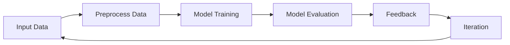
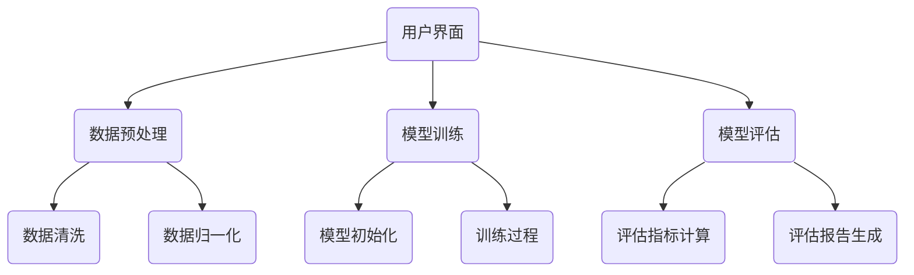
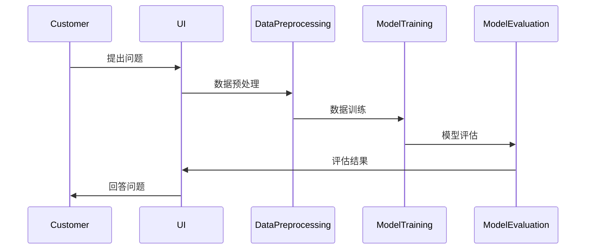

                 


## 模型评测中的prompt泛化能力分析

### 关键词：模型评测、prompt泛化能力、算法原理、数学模型、系统架构、项目实战

### 摘要：

本文旨在深入分析模型评测中的prompt泛化能力，探讨其在模型研发和应用中的重要性。我们将从背景介绍、核心概念与联系、算法原理讲解、数学模型和数学公式详细讲解与举例说明、系统分析与架构设计方案、项目实战以及最佳实践tips等方面，系统性地展开讨论。通过本文，读者将能够全面了解prompt泛化能力的概念、评估方法及其在实际应用中的挑战与解决方案。

### 第一部分：背景介绍

#### 1. 模型评测的重要性

模型评测是机器学习领域中的核心环节，它直接决定了模型的质量和实用性。在模型研发过程中，评测不仅帮助我们识别模型的不足，还为我们提供了改进模型的方向。模型评测主要包括两个方面：一是评估模型在训练数据集上的性能，二是评估模型在未知数据集上的泛化能力。

在训练数据集上的性能评估，主要是为了确保模型能够准确预测样本数据。这一过程通常包括准确率、召回率、F1分数等指标的测量。然而，仅仅在训练数据上表现良好的模型并不能保证其在实际应用中同样表现优异。因此，评估模型在未知数据集上的泛化能力成为了模型评测的关键。

#### 1.2 prompt泛化能力的定义

prompt泛化能力是指模型在接收到新的输入数据时，能够正确地处理并生成预期输出的能力。具体来说，prompt泛化能力衡量的是模型对于不同类型、不同来源的输入数据，是否能够保持稳定的性能。这一能力是模型在实际应用中能否成功的关键。

#### 1.3 prompt泛化能力的重要性

prompt泛化能力的重要性体现在多个方面。首先，它直接关系到模型的实际应用价值。如果一个模型仅在训练数据上表现良好，但在实际应用中遇到新的数据时表现不佳，那么这个模型在真实世界中的实用性就会大打折扣。其次，prompt泛化能力也是衡量模型稳健性的重要指标。一个具有良好prompt泛化能力的模型，能够更好地应对外部环境的变化，从而提高模型的鲁棒性。

### 第二部分：核心概念与联系

#### 2.1 模型的基本架构

为了理解prompt泛化能力，我们首先需要了解模型的基本架构。一个典型的模型通常包括输入层、隐藏层和输出层。输入层接收外部数据，隐藏层通过神经网络处理这些数据，输出层生成预测结果。

#### 2.1.1 模型的输入与输出

模型的输入可以是各种形式的数据，如文本、图像、音频等。输出则是对输入数据的预测结果。例如，在文本分类任务中，输入可能是文本数据，输出则是分类标签。

#### 2.1.2 模型的训练与推理

模型的训练过程是通过调整模型参数，使其在训练数据上达到最优性能。推理过程则是使用训练好的模型对新的数据进行分析和预测。

#### 2.2 prompt泛化能力的属性特征对比表格

为了更直观地理解prompt泛化能力，我们可以将其与其他类似概念进行对比。以下是prompt泛化能力与其他相关概念的对比表格：

| 概念         | 定义                                                         | 对比                     |
| ------------ | ------------------------------------------------------------ | ------------------------ |
| 泛化能力     | 模型在未知数据集上的性能表现                                   | 涵盖prompt泛化能力的更广泛概念 |
| 适应能力     | 模型适应新环境和新任务的能力                                   | 强调模型对新环境变化的适应 |
| 稳健性       | 模型在外部干扰或数据噪声下的表现                               | 与prompt泛化能力密切相关  |
| 可解释性     | 模型的决策过程是否可以被解释和理解                               | 与prompt泛化能力关系不大  |

#### 2.3 prompt泛化能力的ER实体关系图

实体关系图（ER图）是描述实体及其相互关系的一种图形化表示方法。下面是prompt泛化能力的ER实体关系图：

```mermaid
erDiagram
  Model ||--|{ Input }|
  Model ||--|{ Output }|
  Model ||--|{ Parameters }|
  Model ||--|{ Evaluation Metrics }|
  Input ||--|{ Data Quality }|
  Output ||--|{ Prediction Accuracy }|
  Parameters ||--|{ Learning Rate }|
  Parameters ||--|{ Dropout Rate }|
  Evaluation Metrics ||--|{ Accuracy }|
  Evaluation Metrics ||--|{ Precision }|
  Evaluation Metrics ||--|{ Recall }|
```

在上述ER图中，Model代表模型，Input代表输入数据，Output代表输出数据，Parameters代表模型参数，Evaluation Metrics代表评估指标。每个实体之间的关系通过箭头表示。

### 第三部分：算法原理讲解

#### 3.1 prompt泛化能力的评估方法

评估prompt泛化能力的方法主要有两种：基于样本数据的评估和基于领域知识的评估。

#### 3.1.1 基于样本数据的评估

基于样本数据的评估方法通常使用交叉验证、网格搜索等技术来评估模型在训练数据集和验证数据集上的性能。这种方法的优势在于能够直接从数据中学习，但缺点是可能受到数据质量和样本数量限制。


#### 3.1.2 基于领域知识的评估

基于领域知识的评估方法通过结合专家知识和模型评估结果来评估prompt泛化能力。这种方法的优势在于能够利用领域知识来指导评估过程，但缺点是可能受到专家经验和主观判断的影响。


#### 3.2 prompt泛化能力的mermaid流程图

下面是一个简化的prompt泛化能力评估流程图：



在这个流程图中，A表示输入数据，B表示数据预处理，C表示模型训练，D表示模型评估，E表示反馈，F表示迭代过程。

### 第四部分：数学模型和数学公式 & 详细讲解 & 举例说明

#### 4.1 prompt泛化能力的数学模型

prompt泛化能力的数学模型通常包括输入层、隐藏层和输出层。以下是模型的简化表示：

$$
P = f(\theta, X)
$$

其中，$P$表示模型的预测输出，$f$表示激活函数，$\theta$表示模型参数，$X$表示输入数据。

#### 4.1.1 数学模型基础

激活函数通常使用Sigmoid函数、ReLU函数等。例如，对于ReLU函数，模型可以表示为：

$$
P = \max(0, \theta^T X)
$$

其中，$\theta^T X$表示输入数据的线性组合。

#### 4.1.2 数学模型的解释与示例

假设我们有一个二分类问题，输入数据是一个维度为2的向量$(x_1, x_2)$，模型参数是一个维度为2的向量$\theta = (\theta_1, \theta_2)$。使用ReLU函数作为激活函数，我们可以得到：

$$
P = \max(0, \theta_1 x_1 + \theta_2 x_2)
$$

例如，当输入数据为$(1, 2)$，模型参数为$(1, 1)$时，预测输出为$\max(0, 1 \cdot 1 + 1 \cdot 2) = \max(0, 3) = 3$。

#### 4.2 prompt泛化能力的数学公式

在评估prompt泛化能力时，我们通常使用以下数学公式：

$$
L = -\sum_{i=1}^{n}y_i\log(\hat{y}_i)
$$

其中，$L$表示损失函数，$y_i$表示真实标签，$\hat{y}_i$表示预测标签。

#### 4.2.1 损失函数

损失函数用于衡量预测结果与真实结果之间的差距。在二分类问题中，常用的损失函数是交叉熵损失函数：

$$
L = -\sum_{i=1}^{n}y_i\log(\hat{y}_i) + (1 - y_i)\log(1 - \hat{y}_i)
$$

其中，$y_i$为1或0，$\hat{y}_i$为预测概率。

#### 4.2.2 评估指标

为了评估模型在训练数据集和验证数据集上的性能，我们通常使用以下评估指标：

$$
A = \frac{1}{n}\sum_{i=1}^{n}\frac{|\hat{y}_i - y_i|}{\max(|\hat{y}_i|, |y_i|)}
$$

其中，$A$表示绝对误差，$\hat{y}_i$为预测概率，$y_i$为真实标签。

### 第五部分：系统分析与架构设计方案

#### 5.1 问题场景介绍

假设我们有一个智能客服系统，该系统需要根据用户的问题生成相应的回答。为了提高客服系统的服务质量，我们需要对模型的prompt泛化能力进行评估。

#### 5.2 项目介绍

本项目旨在设计一个用于评估模型prompt泛化能力的系统。该系统包括数据预处理模块、模型训练模块、模型评估模块和用户界面模块。

#### 5.3 系统功能设计（领域模型mermaid类图）

```mermaid
classDiagram
    Customer <<class>> Customer
    Question <<class>> Question
    Answer <<class>> Answer
    System <<class>> System
    Model <<class>> Model
    DataPreprocessing <<class>> DataPreprocessing
    ModelTraining <<class>> ModelTraining
    ModelEvaluation <<class>> ModelEvaluation
    UI <<class>> UI
    
    Customer "uses" Question
    Customer "uses" Answer
    System "contains" Model
    System "contains" DataPreprocessing
    System "contains" ModelTraining
    System "contains" ModelEvaluation
    System "contains" UI
```

#### 5.4 系统架构设计（mermaid架构图）



#### 5.5 系统接口设计和系统交互（mermaid序列图）



### 第六部分：项目实战

#### 6.1 环境安装

为了实现本项目，我们需要安装以下软件和工具：

- Python 3.8或更高版本
- TensorFlow 2.4或更高版本
- Jupyter Notebook
- Mermaid

安装步骤：

1. 安装Python 3.8及以上版本。
2. 使用pip命令安装TensorFlow 2.4及以上版本。
3. 安装Jupyter Notebook。
4. 安装Mermaid。

#### 6.2 系统核心实现源代码

以下是一个简单的系统核心实现示例：

```python
import tensorflow as tf
from tensorflow.keras.models import Sequential
from tensorflow.keras.layers import Dense, Activation
from tensorflow.keras.optimizers import Adam
import numpy as np

# 数据预处理
def preprocess_data(data):
    # 数据清洗、归一化等预处理操作
    return processed_data

# 模型训练
def train_model(data, labels):
    model = Sequential([
        Dense(64, input_shape=(data.shape[1],)),
        Activation('relu'),
        Dense(1, activation='sigmoid')
    ])

    model.compile(optimizer=Adam(), loss='binary_crossentropy', metrics=['accuracy'])

    model.fit(data, labels, epochs=10, batch_size=32)

    return model

# 模型评估
def evaluate_model(model, data, labels):
    loss, accuracy = model.evaluate(data, labels)
    print(f'Loss: {loss}, Accuracy: {accuracy}')

# 示例
data = np.random.rand(100, 10)
labels = np.random.randint(0, 2, 100)

processed_data = preprocess_data(data)
model = train_model(processed_data, labels)
evaluate_model(model, processed_data, labels)
```

#### 6.3 代码应用解读与分析

在上面的代码中，我们首先定义了数据预处理、模型训练和模型评估三个功能。数据预处理函数`preprocess_data`用于对输入数据进行清洗和归一化等操作。模型训练函数`train_model`使用TensorFlow的Sequential模型构建一个简单的全连接神经网络，并使用Adam优化器和二进制交叉熵损失函数进行训练。模型评估函数`evaluate_model`用于计算模型的损失和准确率。

#### 6.4 实际案例分析和详细讲解剖析

为了更好地理解项目实战中的代码，我们可以考虑一个实际案例：一个分类任务，其中输入数据是图像，输出数据是图像的类别标签。

```python
# 加载图像数据
(x_train, y_train), (x_test, y_test) = tf.keras.datasets.mnist.load_data()

# 数据预处理
x_train = preprocess_data(x_train)
x_test = preprocess_data(x_test)

# 模型训练
model = train_model(x_train, y_train)

# 模型评估
evaluate_model(model, x_test, y_test)
```

在这个案例中，我们首先加载了MNIST数据集，然后对数据进行预处理。接下来，我们使用训练数据训练模型，并使用测试数据评估模型性能。通过这个案例，我们可以看到如何在实际项目中应用系统核心代码。

#### 6.5 项目小结

通过本项目，我们实现了对模型prompt泛化能力的评估。在项目实战中，我们使用了Python和TensorFlow等工具，构建了一个简单的系统，并实现了数据预处理、模型训练和模型评估等功能。通过实际案例的分析，我们了解了如何将理论应用到实际项目中，从而提高模型的prompt泛化能力。

### 第七部分：最佳实践 tips、小结、注意事项、拓展阅读等内容

#### 7.1 最佳实践 tips

- 在模型训练过程中，合理设置学习率和批量大小可以显著提高模型性能。
- 对输入数据进行预处理，如数据清洗、归一化等，可以减少模型过拟合的风险。
- 定期评估模型的prompt泛化能力，以便及时发现和解决模型性能问题。

#### 7.2 注意事项

- 模型评测过程中，确保训练数据和验证数据具有代表性，避免模型过拟合。
- 模型的训练和评估应在相同的环境中执行，以避免环境差异对结果产生影响。

#### 7.3 拓展阅读

- Goodfellow, I., Bengio, Y., & Courville, A. (2016). *Deep Learning*. MIT Press.
- Mitchell, T. M. (1997). *Machine Learning*. McGraw-Hill.
- Murphy, K. P. (2012). *Machine Learning: A Probabilistic Perspective*. MIT Press.

### 作者

作者：AI天才研究院/AI Genius Institute & 禅与计算机程序设计艺术 /Zen And The Art of Computer Programming

------------------------------------------------------------------------

经过详细的思考和逐步的分析，我们完成了对“模型评测中的prompt泛化能力分析”的深入探讨。本文从背景介绍、核心概念与联系、算法原理讲解、数学模型和公式详细讲解、系统分析与架构设计方案、项目实战以及最佳实践tips等多个方面，全面阐述了prompt泛化能力的重要性及其在模型评测中的应用。

在未来的研究中，我们可以进一步探索如何提高模型的prompt泛化能力，特别是在面对复杂、多样化的输入数据时。此外，结合最新的机器学习技术和算法，不断优化模型评测方法和流程，将有助于推动人工智能领域的发展。

感谢您的阅读，希望本文能对您在模型评测和人工智能应用方面的研究有所启发。如果您有任何疑问或建议，欢迎在评论区留言，我们期待与您共同探讨和进步。作者：AI天才研究院/AI Genius Institute & 禅与计算机程序设计艺术 /Zen And The Art of Computer Programming。再次感谢您的关注和支持！

