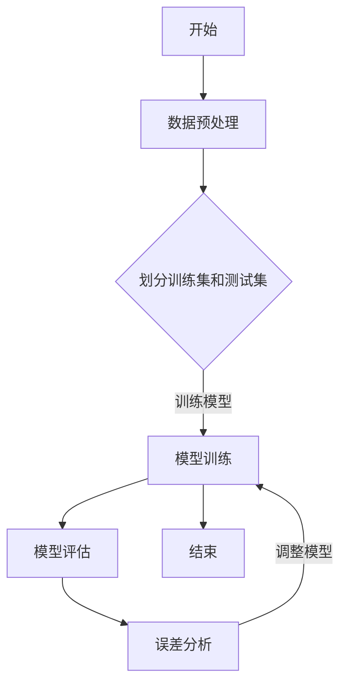

                 

### 第二部分：核心概念与理论

#### 2.1 常见误差类型

在模型评测中，误差是指模型预测结果与真实标签之间的不一致。根据模型应用的不同场景，误差可以分为以下几类：

**分类误差与回归误差**

- **分类误差**：分类任务中，模型将一个实例错误地分到某个类别。例如，一个用于垃圾邮件过滤的模型错误地将一封正常邮件分类为垃圾邮件。
  
- **回归误差**：回归任务中，模型对实例的预测值与真实值之间的差异。例如，房价预测模型预测的房价与实际房价之间的差距。

**误差率、准确率、召回率与F1分数**

- **误差率**（Error Rate）：模型预测错误的样本占总样本的比例。公式为：

  $$
  \text{Error Rate} = \frac{\text{误分类数}}{\text{总样本数}}
  $$

- **准确率**（Accuracy）：模型预测正确的样本占总样本的比例。公式为：

  $$
  \text{Accuracy} = \frac{\text{正确分类数}}{\text{总样本数}}
  $$

- **召回率**（Recall）：在分类任务中，实际为正类别的样本中被正确预测为正类的比例。公式为：

  $$
  \text{Recall} = \frac{\text{真正例数}}{\text{正类总数}}
  $$

- **F1分数**（F1 Score）：综合了准确率和召回率的指标，是两者的调和平均。公式为：

  $$
  \text{F1 Score} = 2 \times \frac{\text{准确率} \times \text{召回率}}{\text{准确率} + \text{召回率}}
  $$

#### 2.2 误差度量指标

在模型评测中，常用的误差度量指标包括：

- **均方误差**（Mean Squared Error, MSE）：回归任务中，预测值与真实值差的平方的平均值。公式为：

  $$
  \text{MSE} = \frac{1}{n}\sum_{i=1}^{n}(y_i - \hat{y}_i)^2
  $$

  其中，$y_i$是真实值，$\hat{y}_i$是预测值，$n$是样本数量。

- **平均绝对误差**（Mean Absolute Error, MAE）：回归任务中，预测值与真实值差的绝对值的平均值。公式为：

  $$
  \text{MAE} = \frac{1}{n}\sum_{i=1}^{n}|y_i - \hat{y}_i|
  $$

- **交叉验证误差**（Cross-Validation Error）：通过交叉验证方法计算出的模型误差，通常用于评估模型在不同数据集上的表现。

#### 2.3 错误分析技术

错误分析技术是指用于识别、理解和处理模型误差的方法。以下是几种常见的错误分析技术：

- **概率校准**：确保模型输出的概率预测值与实际概率分布相匹配，提高模型的可靠性。

- **置信度评估**：通过计算模型预测结果的不确定性，帮助用户理解模型预测的置信度。

- **模型选择与调整**：通过选择合适的模型和调整模型参数，减小模型误差。

### Mermaid 流程图示例

下面是一个使用Mermaid绘制的错误分析流程图：

在这个流程图中，我们从数据预处理开始，将数据集划分为训练集和测试集。然后训练模型并评估模型的误差。根据误差分析结果，可以调整模型参数或选择更合适的模型，重复训练和评估过程，直到满足预期的误差要求。

在接下来的章节中，我们将深入探讨各种误差分析技术和算法，以及如何在实际项目中应用这些技术来优化模型性能。让我们继续前进，一起探索模型评测中的错误分析方法！

