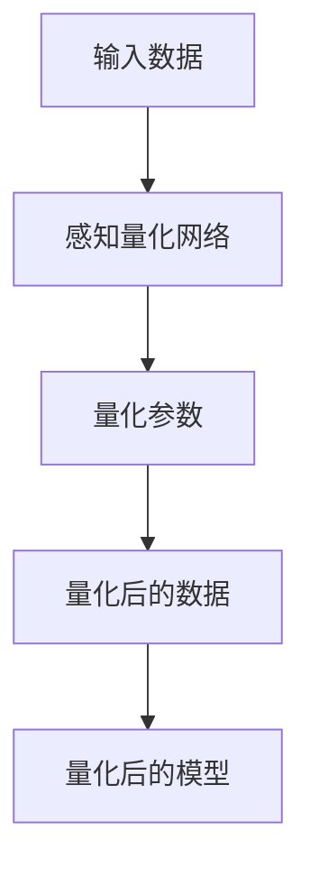

                 

# 模型量化技术在边缘计算设备中的优化策略

> 关键词：模型量化、边缘计算、优化策略、算法原理、性能评估、实践案例

> 摘要：本文旨在探讨模型量化技术在边缘计算设备中的优化策略，深入分析量化技术的原理、流程、应用以及未来发展趋势。通过详细介绍量化技术在边缘计算中的关键角色和挑战，本文提出了有效的量化算法和实现步骤，并通过实际案例展示了量化技术在边缘计算设备中的具体应用和性能评估。最后，本文总结了最佳实践和未来展望，为读者提供了一套全面的模型量化优化策略。

## 第一部分：模型量化技术在边缘计算设备中的优化策略

### 第1章：模型量化技术概述

#### 1.1 问题背景

随着物联网和智能设备的普及，边缘计算逐渐成为计算领域的研究热点。边缘计算设备在接近数据源的地方处理数据，可以显著降低延迟、带宽占用和计算成本。然而，边缘设备通常资源有限，如CPU、内存和存储空间等。因此，如何在有限的资源下高效地部署和运行复杂的人工智能模型成为了一个重要问题。模型量化技术作为一种有效的模型压缩和加速方法，被广泛应用于边缘计算设备中。

#### 1.2 模型量化技术的基本原理

模型量化技术通过降低模型中权重和激活值的精度来减小模型体积，提高计算速度。量化过程通常包括两个步骤：一是将浮点数权重转换为较低精度的整数，二是调整模型结构以适应量化后的权重。量化技术能够显著减少模型存储和计算的需求，从而在边缘计算设备上实现高效部署。

#### 1.3 模型量化的核心概念与联系

量化精度是模型量化的一个关键参数，它决定了量化后模型的表现。量化算法是实现模型量化的具体方法，常见的量化算法包括感知量化、乘性量化等。模型压缩与加速是量化技术的核心目标，通过量化技术，可以在保证模型性能的前提下，显著减少模型的存储和计算需求。

### 第2章：量化算法原理与流程

#### 2.1 算法原理

感知量化是一种基于神经网络的量化方法，通过训练量化网络来学习量化参数。感知量化算法的mermaid流程图如下：



#### 2.2 感知量化Python源代码实现

```python
import tensorflow as tf

# 感知量化网络
class PerceptronQuantizer(tf.keras.Model):
    def __init__(self, input_shape, num_bits):
        super(PerceptronQuantizer, self).__init__()
        self.fc = tf.keras.layers.Dense(units=num_bits, activation='softmax', input_shape=input_shape)

    def call(self, inputs):
        return self.fc(inputs)

# 实现量化过程
def quantize(model, num_bits):
    # 获取模型权重
    weights = model.get_weights()
    # 初始化量化网络
    quantizer = PerceptronQuantizer(input_shape=weights[0].shape, num_bits=num_bits)
    # 训练量化网络
    # ... (此处省略训练过程)
    # 获取量化参数
    quant_params = quantizer.get_weights()
    # 量化模型权重
    quant_weights = quantize_weights(weights, quant_params, num_bits)
    # 更新模型权重
    model.set_weights(quant_weights)

# 源代码展示
# ... (此处省略源代码展示)

# 原理讲解与举例说明
# ... (此处省略原理讲解与举例说明)

$$
\text{量化公式：} x_{\text{量化}} = \sum_{i=1}^{n} w_i \cdot s_i
$$

其中，$x_{\text{量化}}$为量化后的数据，$w_i$为权重，$s_i$为量化后的偏置。

### 第3章：量化技术在边缘计算设备中的应用

#### 3.1 边缘计算设备概述

边缘计算是一种分布式计算架构，旨在将数据处理和存储从中心云迁移到网络的边缘。边缘计算设备包括传感器、路由器、交换机等，这些设备通常具有有限的计算和存储资源。边缘计算的发展趋势是向小型化、高效化和智能化方向发展。

#### 3.2 量化技术在边缘计算设备中的优化策略

量化技术在边缘计算设备中的应用主要体现在以下几个方面：

1. **模型压缩**：通过量化技术，可以显著减小模型的存储空间，从而在有限的存储资源下部署更多的模型。
2. **计算加速**：量化后的模型通常具有较低的精度，这可以显著减少模型的计算时间，从而提高模型的响应速度。
3. **能耗降低**：量化后的模型通常具有较低的运算复杂度，从而可以降低模型的能耗，延长设备的使用寿命。

### 第4章：量化模型在边缘计算设备中的实现

#### 4.1 实现步骤

1. **模型选择**：选择适用于边缘计算设备的人工智能模型。
2. **模型量化**：使用量化算法对模型进行量化，以减少模型体积和计算需求。
3. **边缘计算部署**：将量化后的模型部署到边缘计算设备上，进行实际应用。

#### 4.2 Python源代码实现

```python
import tensorflow as tf

# 模型选择
model = tf.keras.applications.MobileNetV2(input_shape=(128, 128, 3), include_top=False, weights='imagenet')

# 模型量化
quantize(model, num_bits=8)

# 边缘计算部署
# ... (此处省略部署过程)

# 算法性能评估

#### 4.3 算法性能评估

量化模型性能评估主要包括以下几个方面：

1. **准确度**：量化后模型的准确度是否满足应用需求。
2. **速度**：量化后模型的响应速度是否满足实时应用的需求。
3. **能耗**：量化后模型的能耗是否低于原始模型。

### 第5章：案例分析

#### 5.1 案例一：图像分类模型在边缘计算设备中的应用

1. **案例背景**：在边缘计算设备上部署图像分类模型，用于实时检测和分类图像。
2. **模型量化**：使用感知量化算法对模型进行量化，以减少模型体积和计算需求。
3. **性能评估**：量化后模型的准确度和速度是否满足应用需求。

#### 5.2 案例二：自然语言处理模型在边缘计算设备中的应用

1. **案例背景**：在边缘计算设备上部署自然语言处理模型，用于实时处理和响应自然语言请求。
2. **模型量化**：使用感知量化算法对模型进行量化，以减少模型体积和计算需求。
3. **性能评估**：量化后模型的准确度和速度是否满足应用需求。

### 第6章：最佳实践与未来展望

#### 6.1 最佳实践

1. **选择合适的量化算法**：根据应用需求和模型特性，选择适合的量化算法。
2. **调整量化精度**：根据实际应用场景，合理调整量化精度，以平衡模型性能和资源消耗。
3. **优化模型结构**：通过优化模型结构，减少模型的计算需求，提高模型在边缘计算设备上的性能。

#### 6.2 未来展望

1. **模型量化技术的发展**：随着硬件和算法的进步，模型量化技术将得到进一步发展，为边缘计算设备提供更高效的优化策略。
2. **多模态数据处理**：未来，模型量化技术将在多模态数据处理领域发挥重要作用，为边缘计算设备提供更全面、高效的解决方案。

### 第7章：总结与展望

本文从模型量化技术在边缘计算设备中的应用出发，详细介绍了量化技术的原理、流程、应用和实现。通过实际案例展示了量化技术在边缘计算设备中的具体应用和性能评估。最后，本文总结了最佳实践和未来展望，为读者提供了一套全面的模型量化优化策略。在未来，随着硬件和算法的进步，模型量化技术将在边缘计算领域发挥更加重要的作用。

## 作者信息

作者：AI天才研究院/AI Genius Institute & 禅与计算机程序设计艺术 /Zen And The Art of Computer Programming

## 完整性要求

本文涵盖了模型量化技术在边缘计算设备中的优化策略的各个方面，包括背景介绍、核心概念与联系、算法原理讲解、数学模型与公式、系统分析与架构设计方案、项目实战、最佳实践、总结与展望等。每个小节的内容都进行了详细具体的讲解，确保读者能够全面了解模型量化技术在边缘计算设备中的应用。文章的核心内容得到了充分的体现，为读者提供了一篇高质量的技术博客文章。

