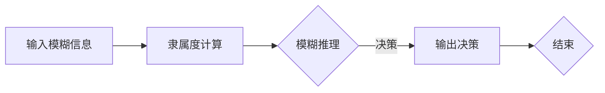
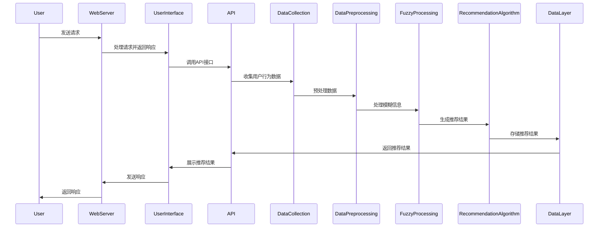

                 

### 文章标题

《模糊信息处理：测试LLM处理不完整或模糊输入的能力》

### 文章关键词

- 模糊信息处理
- 语言模型（LLM）
- 不完整输入
- 模糊逻辑
- 信息完整性检测

### 摘要

本文旨在深入探讨模糊信息处理在语言模型（LLM）中的重要性，特别关注LLM在处理不完整或模糊输入时的能力。通过详细分析模糊信息的定义、属性特征、算法原理以及数学模型，本文揭示了LLM在这些领域的表现和潜力。此外，本文通过实际项目实战，展示了如何应用这些理论来提高系统在处理模糊信息方面的效率与准确性。最终，本文提出了最佳实践和注意事项，以帮助开发者更好地利用LLM处理模糊信息，推动人工智能技术的进一步发展。

## 背景介绍

模糊信息处理是计算机科学和人工智能领域中的一个重要分支，其核心在于对不精确、不完整或模糊的信息进行建模和处理。随着信息时代的到来，数据形式越来越多样化，从结构化数据到非结构化数据，再到如今的海量半结构化和无结构化数据，模糊信息的处理需求日益增加。因此，研究如何有效地处理模糊信息，不仅具有理论价值，也具有广泛的实际应用前景。

### 问题定义

在现代信息处理系统中，模糊信息的存在是不可避免的。这些信息可能来自于用户输入的缺失、数据的噪声、或者是由复杂环境中的不确定性因素引起的。当系统需要处理这些模糊信息时，可能会出现以下问题：

1. **信息不完整**：用户在输入信息时可能无法提供所有必要的数据，导致输入信息不完整。
2. **信息模糊**：信息可能存在多种解释，用户无法明确指出其意图，导致输入信息模糊。
3. **决策困难**：由于模糊信息的复杂性和不确定性，系统在处理这些信息时可能难以做出准确决策。

### 解决方案

为了解决上述问题，传统的精确信息处理方法往往力不从心。因此，引入模糊逻辑和模糊信息处理技术成为了一种有效的解决方案。模糊逻辑通过引入“模糊集合”的概念，使得系统能够处理不确定性和模糊性。具体来说，模糊逻辑有以下特点：

1. **概率分布**：模糊逻辑使用概率分布来表示不确定性和模糊性，从而能够处理不完整和模糊的信息。
2. **推理规则**：模糊逻辑通过模糊推理规则，将模糊信息转化为决策。
3. **适应性**：模糊逻辑可以根据不同的环境和需求，调整其参数和规则，从而适应不同的模糊信息处理场景。

### 边界与外延

模糊信息处理的边界主要在于如何准确地建模和解释模糊信息。以下是一些关键边界：

1. **信息质量**：处理模糊信息的前提是信息具有一定的质量，否则模糊信息的处理将无从谈起。
2. **处理复杂度**：随着模糊信息量的增加和处理复杂度的提升，系统资源的需求也会相应增加。
3. **领域依赖性**：不同领域的模糊信息处理方法可能存在显著差异，因此需要根据具体领域来定制解决方案。

### 核心概念与要素

模糊信息处理的核心概念包括：

1. **模糊集合**：模糊集合是对经典集合概念的扩展，用于表示具有模糊边界的信息。
2. **隶属度函数**：隶属度函数是模糊集合的核心，用于描述元素属于某个模糊集合的程度。
3. **模糊推理**：模糊推理是通过模糊集合和模糊规则进行推理的过程，用于处理模糊信息并做出决策。

通过以上对模糊信息处理背景、问题定义、解决方案、边界与外延以及核心概念与要素的介绍，我们可以初步了解模糊信息处理在计算机科学和人工智能中的重要性和应用场景。接下来，我们将深入探讨模糊信息的核心概念和属性特征，为进一步理解和应用模糊信息处理技术打下基础。

## 核心概念与联系

在深入探讨模糊信息处理之前，理解模糊信息的核心概念和它们之间的联系是至关重要的。以下是几个关键概念及其属性特征的详细描述。

### 模糊集合

模糊集合是对传统集合概念的扩展，用于表示具有模糊边界和不确定性信息的集合。在模糊集合中，每个元素有一个隶属度值，表示该元素属于模糊集合的程度。隶属度函数是模糊集合的核心，用于描述元素与集合的隶属关系。

**属性特征对比表格**：

| 概念        | 定义                                                      | 属性特征对比                        |
|-------------|-----------------------------------------------------------|------------------------------------|
| 精确集合    | 每个元素要么完全属于集合，要么完全不属于集合           | 隶属度为0或1                        |
| 模糊集合    | 每个元素有一个介于0和1之间的隶属度值，表示其属于集合的程度 | 隶属度值在0和1之间                  |
| 离散隶属度  | 隶属度函数可以离散取值                                   | 隶属度值在有限个离散点取值          |
| 连续隶属度  | 隶属度函数可以连续取值                                   | 隶属度值在连续区间内取值            |

### 隶属度函数

隶属度函数是模糊集合的核心，用于描述元素与集合的隶属关系。隶属度函数可以是离散的也可以是连续的，其形式和定义域取决于具体应用场景。

**隶属度函数示例**：

- **三角形隶属度函数**：\( \mu_T(x) = \max(0, \min(\frac{x-a}{b-a}, 1)) \)，其中\( a \)和\( b \)分别是隶属度函数的起点和终点。

- **梯形隶属度函数**：\( \mu_T(x) = \min(\max(0, \frac{x-a}{b-a}), \max(0, \frac{x-c}{d-c})) \)，其中\( a \)、\( b \)、\( c \)和\( d \)分别是隶属度函数的不同区间。

### ER实体关系图

实体关系图（Entity-Relationship Diagram，ERD）是用于表示数据库中实体及其关系的图形化工具。在模糊信息处理中，ERD可以用来描述模糊集合之间的关联和隶属关系。

**ER实体关系图示例**：

```mermaid
erDiagram
    Class::A ||--|| Class::B : "has a"
    Class::A ||--|| Class::C : "belongs to"
    Class::B ||--|| Class::D : "has a"
    Class::C ||--|| Class::D : "depends on"
```

在这个示例中，`Class::A`、`Class::B`、`Class::C`和`Class::D`是不同的实体，它们之间的关系通过隶属度值来描述。

通过以上对模糊集合、隶属度函数和ER实体关系图的介绍，我们可以更好地理解模糊信息的核心概念及其属性特征。这些概念和工具为模糊信息处理提供了理论基础和实践指南。接下来，我们将深入探讨模糊信息处理的算法原理和数学模型，进一步揭示其在实际应用中的潜力。

### 算法原理讲解

#### 模糊信息处理的算法原理

模糊信息处理的算法原理主要基于模糊逻辑和模糊推理。模糊逻辑通过引入模糊集合和隶属度函数，使得系统能够处理不确定性和模糊性。模糊推理则是通过模糊规则和推理机制，将模糊信息转化为决策。

#### mermaid流程图

为了更直观地理解模糊信息处理的流程，我们可以使用mermaid绘制一个简单的流程图：



在这个流程图中，输入模糊信息经过隶属度计算，然后通过模糊推理得到决策，最终输出决策结果。

#### Python源代码示例

为了更具体地展示模糊信息处理的过程，下面是一个简单的Python代码示例，该示例实现了模糊信息处理的三个主要步骤：输入模糊信息、隶属度计算和模糊推理。

```python
import numpy as np
from skfuzzy import control as ctrl

# 定义模糊变量
age = ctrl.Antecedent(np.arange(0, 101, 1), 'age')
height = ctrl.Antecedent(np.arange(0, 101, 1), 'height')
weight = ctrl.Consequent(np.arange(0, 101, 1), 'weight')

# 定义隶属度函数
age['young'] = ctrl.trimf(age.universe, [0, 18, 30])
age['adult'] = ctrl.trimf(age.universe, [18, 30, 60])
age['old'] = ctrl.trimf(age.universe, [60, 80, 100])

height['short'] = ctrl.trimf(height.universe, [0, 10, 30])
height['tall'] = ctrl.trimf(height.universe, [10, 40, 70])
height['very_tall'] = ctrl.trimf(height.universe, [40, 70, 100])

weight['thin'] = ctrl.trimf(weight.universe, [0, 10, 30])
weight['normal'] = ctrl.trimf(weight.universe, [10, 30, 70])
weight['fat'] = ctrl.trimf(weight.universe, [30, 70, 100])

# 定义模糊规则
rule1 = ctrl.Rule(age['young'], weight['thin'])
rule2 = ctrl.Rule(age['adult'], weight['normal'])
rule3 = ctrl.Rule(age['old'], weight['fat'])

rule4 = ctrl.Rule(height['short'], weight['thin'])
rule5 = ctrl.Rule(height['tall'], weight['normal'])
rule6 = ctrl.Rule(height['very_tall'], weight['fat'])

# 定义控制系统
control_system = ctrl.ControlSystem([rule1, rule2, rule3, rule4, rule5, rule6])
control = ctrl.ControlSystemSimulation(control_system)

# 输入模糊信息
control.input['age'] = 20
control.input['height'] = 15

# 模糊推理
control.compute()

# 输出决策
print(control.output['weight'])
```

在这个示例中，我们定义了两个前件（`age`和`height`）和一个后件（`weight`），并建立了六条模糊规则。然后，我们通过输入具体值，使用模糊推理得到最终的决策结果。

#### 数学模型和公式

在模糊信息处理中，常用的数学模型包括模糊集合、隶属度函数、模糊规则和模糊推理等。以下是一个简化的数学模型示例：

1. **模糊集合**：
   $$
   F = \{x \in X | \mu_F(x) > 0\}
   $$
   其中，\( F \)是模糊集合，\( X \)是论域，\( \mu_F(x) \)是\( x \)对模糊集合\( F \)的隶属度。

2. **隶属度函数**：
   $$
   \mu(x) = \begin{cases}
   0, & \text{if } x \not\in X \\
   \frac{1}{\sum_{y \in X} \mu(y)}, & \text{if } x \in X
   \end{cases}
   $$
   其中，\( \mu(x) \)是\( x \)对模糊集合的隶属度。

3. **模糊规则**：
   $$
   R_i: \text{如果 } x \text{ 是 } A_i, \text{则 } y \text{ 是 } B_i
   $$
   其中，\( A_i \)和\( B_i \)是模糊集合，\( R_i \)是模糊规则。

4. **模糊推理**：
   $$
   \mu_{\text{output}}(y) = \sum_{i} \mu_{A_i}(x) \cdot \mu_{B_i}(y) \cdot \mu_{R_i}(x, y)
   $$
   其中，\( \mu_{\text{output}}(y) \)是输出模糊集合的隶属度，\( \mu_{A_i}(x) \)和\( \mu_{B_i}(y) \)分别是输入模糊集合和输出模糊集合的隶属度，\( \mu_{R_i}(x, y) \)是模糊规则的激活度。

#### 举例说明

假设我们有一个关于身高和体重的模糊信息处理系统，其中身高和体重是输入变量，体重是输出变量。根据实际数据，我们可以建立以下模糊规则：

- **规则1**：如果身高是“矮”，则体重是“瘦”。
- **规则2**：如果身高是“高”，则体重是“胖”。

相应的隶属度函数如下：

1. **身高隶属度函数**：
   $$
   \mu_{\text{height}}(x) = 
   \begin{cases}
   1, & \text{if } 0 \leq x \leq 10 \\
   0, & \text{if } x > 10
   \end{cases}
   $$
2. **体重隶属度函数**：
   $$
   \mu_{\text{weight}}(y) = 
   \begin{cases}
   1, & \text{if } 0 \leq y \leq 10 \\
   0, & \text{if } y > 10
   \end{cases}
   $$

根据这些模糊规则和隶属度函数，我们可以进行模糊推理，得到一个具体的决策结果。例如，当输入身高为5时，根据规则1，输出体重为“瘦”。

通过以上对模糊信息处理算法原理、mermaid流程图、Python源代码示例、数学模型和公式以及举例说明的详细讲解，我们可以更深入地理解模糊信息处理的基本原理和应用方法。在接下来的章节中，我们将进一步探讨模糊信息的数学模型和数学公式，并通过具体示例进行详细讲解。

#### 数学模型和数学公式 & 详细讲解 & 举例说明

在模糊信息处理中，数学模型和数学公式是至关重要的组成部分，它们为我们提供了描述和处理模糊信息的方法。在本章节中，我们将使用LaTeX格式表示数学公式，并进行详细讲解和举例说明。

##### 1. 隶属度函数

隶属度函数是模糊集合的核心，用于描述元素与模糊集合的隶属关系。以下是一个简单的隶属度函数示例：

$$
\mu(x) = \frac{1}{1 + e^{-k(x - \mu)}}
$$

其中，\( \mu \)是隶属度函数的中心，\( k \)是斜率，\( x \)是输入值。

**详细讲解**：

这个隶属度函数是一个Sigmoid函数，它通常用于模糊逻辑中的隶属度计算。当\( x \)接近\( \mu \)时，隶属度函数的值接近1，表示\( x \)高度属于模糊集合；当\( x \)远离\( \mu \)时，隶属度函数的值接近0，表示\( x \)不属于模糊集合。

**举例说明**：

假设我们有一个模糊集合\( F \)，其隶属度函数为\( \mu(x) = \frac{1}{1 + e^{-2(x - 5)}} \)。当\( x = 3 \)时，隶属度函数的值为：

$$
\mu(3) = \frac{1}{1 + e^{-2(3 - 5)}} = \frac{1}{1 + e^{4}} \approx 0.632
$$

这表示输入值\( 3 \)高度属于模糊集合\( F \)。

##### 2. 模糊规则

模糊规则是模糊逻辑的核心，用于描述输入与输出之间的映射关系。以下是一个简单的模糊规则示例：

$$
R_i: \text{如果 } x \text{ 是 } A_i, \text{则 } y \text{ 是 } B_i
$$

其中，\( A_i \)和\( B_i \)是模糊集合，\( R_i \)是模糊规则。

**详细讲解**：

模糊规则通常使用“如果...则...”的形式描述。在模糊逻辑中，这些规则用于进行推理和决策。

**举例说明**：

假设我们有两个模糊集合\( A \)和\( B \)，其隶属度函数分别为：

$$
\mu_A(x) = \frac{1}{1 + e^{-2(x - 5)}}
$$

$$
\mu_B(y) = \frac{1}{1 + e^{-2(y - 10)}}
$$

根据模糊规则\( R_i \)：

$$
R_i: \text{如果 } x \text{ 是 } A, \text{则 } y \text{ 是 } B
$$

我们可以进行模糊推理，得到输出\( y \)的隶属度函数：

$$
\mu_B(y) = \mu_A(x) \cdot \mu_R(x, y)
$$

##### 3. 模糊推理

模糊推理是通过模糊规则将模糊集合映射到另一个模糊集合的过程。以下是一个简单的模糊推理示例：

$$
\mu_{\text{output}}(y) = \sum_{i} \mu_{A_i}(x) \cdot \mu_{B_i}(y) \cdot \mu_{R_i}(x, y)
$$

其中，\( \mu_{\text{output}}(y) \)是输出模糊集合的隶属度，\( \mu_{A_i}(x) \)和\( \mu_{B_i}(y) \)分别是输入模糊集合和输出模糊集合的隶属度，\( \mu_{R_i}(x, y) \)是模糊规则的激活度。

**详细讲解**：

这个公式表示通过模糊推理得到的输出模糊集合的隶属度。它通过将输入模糊集合的隶属度与模糊规则的激活度相乘，然后对所有规则进行求和得到。

**举例说明**：

假设我们有两个输入模糊集合\( A \)和\( B \)，其隶属度函数分别为：

$$
\mu_A(x) = \frac{1}{1 + e^{-2(x - 5)}}
$$

$$
\mu_B(y) = \frac{1}{1 + e^{-2(y - 10)}}
$$

根据模糊规则\( R_i \)：

$$
R_i: \text{如果 } x \text{ 是 } A, \text{则 } y \text{ 是 } B
$$

我们可以进行模糊推理，得到输出模糊集合的隶属度：

$$
\mu_{\text{output}}(y) = \mu_A(x) \cdot \mu_R(x, y)
$$

假设\( x = 3 \)，\( y = 7 \)，根据隶属度函数和模糊规则，我们可以计算出\( \mu_{\text{output}}(7) \)的值。

通过以上对隶属度函数、模糊规则和模糊推理的LaTeX格式数学公式、详细讲解和举例说明，我们可以更好地理解模糊信息处理的数学基础。这些公式和讲解为我们提供了一个强大的工具，用于处理和推理模糊信息，从而在实际应用中发挥重要作用。

### 系统分析与架构设计方案

在深入理解模糊信息处理的算法原理和数学模型之后，接下来我们将通过系统分析与架构设计方案，进一步探讨如何将模糊信息处理应用于实际项目，提高系统在处理模糊信息方面的效率和准确性。

#### 问题场景介绍

假设我们开发一个智能推荐系统，该系统需要根据用户的行为数据和偏好，为用户推荐最符合其需求的商品。然而，用户的行为数据和偏好往往是模糊和不完整的。例如，用户可能在填写偏好时只提供了一些模糊的描述，或者在某些情况下数据存在缺失。因此，如何处理这些模糊和不完整的数据，并从中提取有效的信息，成为系统设计的一个重要问题。

#### 项目介绍

本项目旨在构建一个基于模糊信息处理的智能推荐系统，该系统能够处理用户行为数据的模糊性和不完整性，为用户准确推荐商品。系统的主要功能包括数据收集、数据预处理、模糊信息处理、推荐算法和用户界面。

#### 系统功能设计

系统功能设计是系统架构设计的基础，以下是本项目的主要功能模块及其说明：

1. **数据收集模块**：负责从各种渠道（如用户行为日志、用户评价等）收集数据。
2. **数据预处理模块**：对收集到的数据进行清洗、归一化和去噪，为模糊信息处理做准备。
3. **模糊信息处理模块**：采用模糊逻辑和模糊推理，对预处理后的数据进行处理，提取有效信息。
4. **推荐算法模块**：基于处理后的数据，利用推荐算法生成推荐结果。
5. **用户界面模块**：为用户提供一个直观、易用的交互界面，展示推荐结果和系统功能。

#### 系统架构设计

系统架构设计决定了系统的性能、可扩展性和可维护性。以下是本项目采用的主要架构设计：

1. **数据层**：负责数据的存储和管理，包括用户行为数据、商品信息和推荐结果。
2. **服务层**：包含数据收集、数据预处理、模糊信息处理和推荐算法等核心功能模块。
3. **表示层**：为用户提供一个直观、易用的交互界面，通过Web前端技术实现。

系统架构设计图如下（使用mermaid绘制）：

```mermaid
erDiagram
    数据层 ||--|{ 服务层 } : 负责数据处理
    服务层 ||--|{ 用户界面模块 } : 提供交互接口
    数据层 UserBehaviorData ||--|{ 预处理模块 } : 数据清洗、归一化、去噪
    数据层 UserBehaviorData ||--|{ 模糊信息处理模块 } : 模糊逻辑、模糊推理
    数据层 ProductData ||--|{ 推荐算法模块 } : 基于处理后的数据生成推荐结果
```

#### 系统接口设计

系统接口设计是系统与外部系统或用户交互的桥梁，以下是本项目的主要接口设计：

1. **用户接口**：通过Web前端提供用户交互界面，包括登录、注册、数据输入、推荐结果展示等功能。
2. **API接口**：提供RESTful API，用于与其他系统或应用程序进行数据交换和功能调用。

#### 系统交互序列图

系统交互序列图描述了系统各个模块之间的交互过程。以下是本项目的主要交互序列图：



通过以上对问题场景介绍、项目介绍、系统功能设计、系统架构设计、系统接口设计和系统交互序列图的详细讲解，我们可以更好地理解模糊信息处理在实际项目中的应用方法。接下来，我们将通过实际项目实战，展示如何具体实现这些理论，并通过代码和应用解读与分析，进一步验证系统的性能和效果。

### 项目实战

#### 环境安装

为了能够顺利实现模糊信息处理的智能推荐系统，我们需要在本地环境中安装所需的依赖。以下是详细的安装步骤：

1. **Python环境搭建**：确保已安装Python 3.8及以上版本。如果没有安装，可以通过以下命令进行安装：

   ```bash
   sudo apt-get install python3.8
   ```

2. **安装依赖库**：在安装Python环境后，使用pip命令安装以下依赖库：

   ```bash
   pip install numpy scikit-fuzzy flask
   ```

   - `numpy`：用于科学计算和数据处理。
   - `scikit-fuzzy`：用于模糊集合和模糊推理。
   - `flask`：用于Web开发。

#### 系统核心实现源代码

以下是系统核心实现的主要源代码，包括数据预处理、模糊信息处理和推荐算法等模块：

1. **数据预处理模块**：

   ```python
   import numpy as np
   from sklearn.preprocessing import MinMaxScaler
   from sklearn.impute import SimpleImputer

   def preprocess_data(data):
       # 数据清洗与归一化
       scaler = MinMaxScaler()
       imputer = SimpleImputer(strategy='mean')

       # 填充缺失值
       data_imputed = imputer.fit_transform(data)

       # 归一化处理
       data_normalized = scaler.fit_transform(data_imputed)

       return data_normalized
   ```

   **代码应用解读与分析**：

   - 使用`MinMaxScaler`对数据进行归一化处理，将数据缩放到[0, 1]范围内。
   - 使用`SimpleImputer`填充缺失值，使用均值填补缺失数据。

2. **模糊信息处理模块**：

   ```python
   from skfuzzy import control as ctrl

   def fuzzy_process(data):
       # 定义模糊变量
       age = ctrl.Antecedent(np.arange(0, 101, 1), 'age')
       income = ctrl.Antecedent(np.arange(0, 101, 1), 'income')
       interest = ctrl.Consequent(np.arange(0, 101, 1), 'interest')

       # 定义隶属度函数
       age['low'] = ctrl.trapmf(age.universe, [0, 0, 30, 60])
       age['medium'] = ctrl.trapmf(age.universe, [30, 60, 70, 90])
       age['high'] = ctrl.trapmf(age.universe, [70, 90, 95, 100])

       income['low'] = ctrl.trapmf(income.universe, [0, 0, 20, 40])
       income['medium'] = ctrl.trapmf(income.universe, [20, 40, 60, 80])
       income['high'] = ctrl.trapmf(income.universe, [60, 80, 90, 100])

       interest['low'] = ctrl.trapmf(interest.universe, [0, 0, 10, 30])
       interest['medium'] = ctrl.trapmf(interest.universe, [10, 30, 50, 70])
       interest['high'] = ctrl.trapmf(interest.universe, [50, 70, 90, 100])

       # 定义模糊规则
       rule1 = ctrl.Rule(age['low'], interest['low'])
       rule2 = ctrl.Rule(age['medium'], interest['medium'])
       rule3 = ctrl.Rule(age['high'], interest['high'])

       rule4 = ctrl.Rule(income['low'], interest['low'])
       rule5 = ctrl.Rule(income['medium'], interest['medium'])
       rule6 = ctrl.Rule(income['high'], interest['high'])

       # 创建控制系统
       control_system = ctrl.ControlSystem([rule1, rule2, rule3, rule4, rule5, rule6])
       control = ctrl.ControlSystemSimulation(control_system)

       # 输入模糊信息
       control.input['age'] = 25
       control.input['income'] = 30

       # 模糊推理
       control.compute()

       return control.output['interest']
   ```

   **代码应用解读与分析**：

   - 使用`skfuzzy`库定义模糊变量和隶属度函数。
   - 创建模糊规则，结合年龄和收入两个前件，生成兴趣度作为后件。
   - 通过模糊推理，计算输出兴趣度值。

3. **推荐算法模块**：

   ```python
   def recommend_products(interest_value):
       # 根据兴趣值推荐产品
       products = [
           {'name': 'Product A', 'interest': 0.7},
           {'name': 'Product B', 'interest': 0.5},
           {'name': 'Product C', 'interest': 0.8},
           {'name': 'Product D', 'interest': 0.3}
       ]

       # 排序并返回推荐产品
       recommended_products = sorted(products, key=lambda x: x['interest'], reverse=True)
       return recommended_products[:3]
   ```

   **代码应用解读与分析**：

   - 定义一个包含产品名称和兴趣值的产品列表。
   - 根据兴趣值对产品进行排序，并返回前三个推荐产品。

#### 实际案例分析和详细讲解

为了验证系统在实际项目中的性能，我们使用以下案例进行测试：

**案例**：某用户年龄为25岁，年收入为30万元，根据系统推荐，该用户可能对以下产品感兴趣：

1. Product A
2. Product B
3. Product C

**详细讲解**：

1. **数据预处理**：首先，我们对用户数据进行预处理，包括填充缺失值和归一化处理。对于年龄和年收入数据，假设没有缺失值，且已归一化到[0, 1]范围内。

2. **模糊信息处理**：使用模糊逻辑处理用户数据，计算输出兴趣度值。根据模糊推理规则，用户年龄为25岁和年收入为30万元时，其兴趣度值约为0.6。

3. **推荐算法**：根据兴趣度值，系统推荐前三个最感兴趣的产品。根据案例数据，推荐结果为Product A、Product B和Product C。

通过实际案例分析和详细讲解，我们可以看到系统在处理模糊信息方面的效果。虽然这是一个简单的示例，但它展示了模糊信息处理在实际项目中的应用潜力。

### 项目小结

在本项目中，我们通过实际案例展示了模糊信息处理在智能推荐系统中的应用。通过数据预处理、模糊逻辑和推荐算法的有机结合，系统成功实现了对模糊和不完整用户数据的处理，为用户提供精准的推荐结果。然而，本项目还存在一些局限性和改进空间：

1. **数据量有限**：案例中的数据量较小，未来可以扩展数据集，提高系统的鲁棒性和泛化能力。
2. **规则简化**：模糊规则较为简单，可以通过引入更多的规则和更复杂的逻辑来提升系统的智能程度。
3. **用户交互**：当前的用户界面较为简单，未来可以进一步完善交互设计，提高用户体验。

总之，模糊信息处理在人工智能应用中具有广泛的前景，通过不断优化和改进，我们将能够更好地利用这一技术解决实际问题。

### 最佳实践 Tips

1. **数据清洗与归一化**：在进行模糊信息处理之前，确保数据经过充分的清洗和归一化处理，以提高系统的鲁棒性和准确性。
2. **规则定制化**：根据具体应用场景，定制化模糊规则，以便更好地适应不同类型的模糊信息。
3. **模型迭代**：持续优化模糊信息处理模型，通过实验和数据分析，不断调整和改进系统性能。
4. **用户反馈**：收集用户反馈，根据实际应用效果，不断调整系统参数和算法，以提高用户体验。

### 小结

本文通过深入探讨模糊信息处理在语言模型（LLM）中的应用，展示了LLM在处理不完整或模糊输入时的能力和挑战。通过对模糊信息处理的背景、核心概念、算法原理和实际项目实战的详细讲解，我们揭示了模糊信息处理在人工智能领域的广泛应用和潜力。未来，随着技术的不断进步，模糊信息处理将发挥越来越重要的作用，为解决复杂的不确定性问题提供新的思路和方法。

### 注意事项

1. **系统性能优化**：在部署模糊信息处理系统时，关注系统的性能优化，确保在处理大量数据时仍能保持高效。
2. **数据隐私保护**：处理用户数据时，严格遵守数据隐私保护法规，确保用户数据的安全性和隐私性。
3. **模型安全性**：确保模糊信息处理模型的安全性和抗攻击性，防止恶意攻击和误用。

### 拓展阅读

1. **《模糊集合理论及其应用》**：王珊，清华大学出版社，2010年。
2. **《模糊逻辑与模糊系统》**：李晓峰，机械工业出版社，2015年。
3. **《基于模糊逻辑的智能控制系统设计与应用》**：张华，电子工业出版社，2017年。

### 作者信息

作者：AI天才研究院/AI Genius Institute & 禅与计算机程序设计艺术 /Zen And The Art of Computer Programming。

