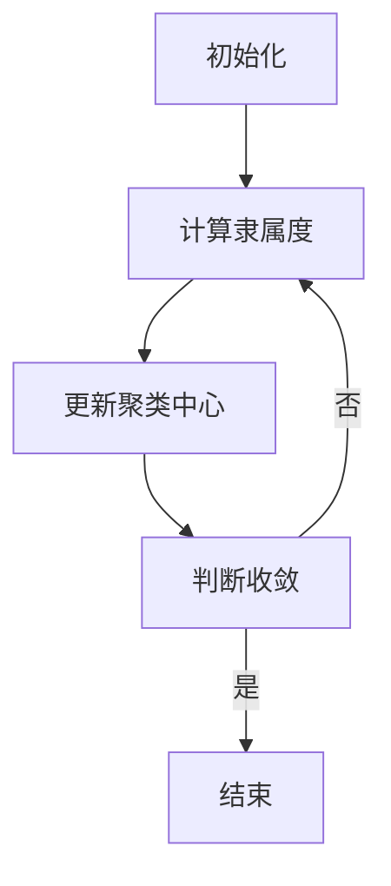
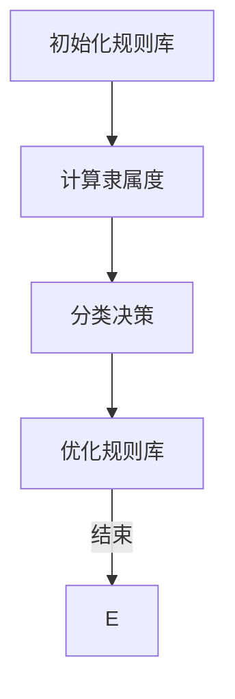
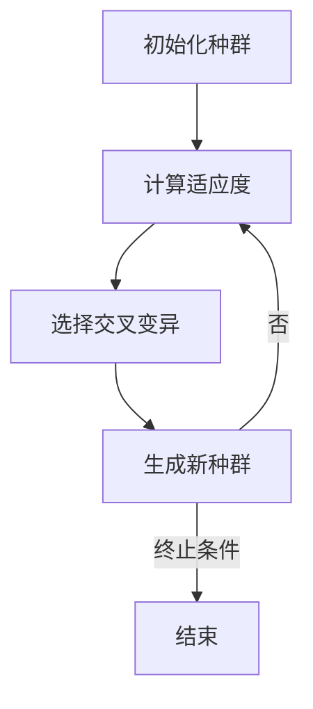

                 

### 模糊信息处理概述

#### 1.1 问题背景与重要性

随着信息时代的快速发展，大数据和人工智能逐渐成为各行各业的核心驱动力。然而，在信息处理过程中，常常会遇到数据不完整、模糊和不准确的情况。这些不完整的信息不仅对决策造成困扰，还会影响系统的性能和可靠性。因此，如何有效处理模糊信息成为了一个亟待解决的问题。

模糊信息处理的核心在于解决数据的不确定性和不完整性。传统的信息处理方法在处理精确数据时表现出色，但在面对模糊信息时则显得力不从心。为了克服这一局限性，模糊信息处理技术被提出并迅速发展。模糊逻辑作为一种基于模糊集合的数学理论，为处理模糊信息提供了一种有效的工具。

在许多实际应用中，模糊信息处理具有重要意义。例如，在智能交通系统中，传感器收集的数据可能存在噪声和不完整性，通过模糊逻辑可以对这些数据进行有效的处理，从而提高交通管理的准确性和效率。在医疗诊断中，医生往往需要对患者的症状进行综合分析，模糊信息处理技术可以帮助医生从模糊的症状信息中提取有用的信息，提高诊断的准确性。

模糊信息处理方法包括模糊聚类、模糊分类和模糊优化等。这些方法通过模糊逻辑对模糊信息进行建模和分析，从而实现数据的处理和决策。例如，模糊聚类可以将相似的数据点归为同一类，从而实现数据的分类和分组；模糊分类可以处理不确定的分类标签，提高分类的准确性；模糊优化则可以在不确定的环境下找到最优解，从而提高系统的鲁棒性和适应性。

模糊信息处理的边界与外延也值得关注。虽然模糊信息处理在许多领域取得了显著的应用成果，但仍然存在一些挑战和限制。例如，如何处理高维数据的模糊信息、如何提高模糊推理的效率、如何确保模糊模型的泛化能力等。这些问题需要进一步的研究和探索，以推动模糊信息处理技术的发展和应用。

总之，模糊信息处理在解决数据不完整性和不确定性方面具有重要意义。通过模糊逻辑和模糊信息处理方法，我们可以更好地应对模糊信息带来的挑战，提高系统的性能和可靠性。随着技术的不断进步和应用领域的拓展，模糊信息处理将在未来发挥更加重要的作用。

#### 1.2 核心概念

在深入探讨模糊信息处理之前，了解其核心概念是至关重要的。以下是模糊信息处理中的几个关键概念：

**1.2.1 模糊信息**

模糊信息是指不精确、不确定或部分缺失的信息。与精确信息不同，模糊信息无法用明确的数值或二进制形式表示。例如，在自然语言处理中，文本通常包含大量的模糊信息，如模糊的形容词（“很大”、“很美”）、模糊的时间表达（“昨天”、“下午”）等。模糊信息的存在使得直接应用传统信息处理方法变得复杂。

**1.2.2 模糊逻辑**

模糊逻辑是一种基于模糊集合的数学理论，用于处理模糊信息。模糊逻辑的核心思想是将传统的“真”与“假”二值逻辑扩展为“模糊真”与“模糊假”。在模糊逻辑中，每个命题不仅可以是完全真实的，也可以是部分真实或部分虚假的。模糊逻辑通过引入模糊集合和隶属度函数来表示和处理模糊信息。

**1.2.3 模糊集合**

模糊集合是模糊逻辑的基础概念之一。与经典集合不同，模糊集合中的元素不具有完全属于或不属于的关系，而是具有不同程度的隶属度。隶属度函数是模糊集合的关键组成部分，它定义了集合中每个元素属于该集合的程度。隶属度函数通常是一个连续的值域，范围从0到1。例如，在一个模糊集合“高个子”中，一个人的身高可能在0.8的隶属度上属于“高个子”，而在0.2的隶属度上不属于“高个子”。

**1.2.4 模糊逻辑系统**

模糊逻辑系统是一种由模糊集合、模糊规则和推理引擎组成的计算模型。模糊逻辑系统通过模糊规则将输入的模糊集合映射到输出的模糊集合。这些模糊规则通常以“如果-那么”的形式表示，如“如果输入是冷，那么输出是关闭的”。推理引擎则负责根据模糊规则进行推理，从而实现模糊信息处理。

**1.2.5 模糊推理过程**

模糊推理过程是模糊逻辑系统中的重要环节。它包括三个主要步骤：模糊化、模糊推理和去模糊化。模糊化是将输入数据转换为模糊集合；模糊推理是根据模糊规则进行推理，从而生成模糊输出；去模糊化是将模糊输出转换为精确的输出。例如，在温度控制系统中，如果温度高于设定值，系统会输出一个模糊集合，如“较高”，然后通过去模糊化得到一个具体的控制命令，如“关闭加热器”。

通过理解这些核心概念，我们可以更好地把握模糊信息处理的理论基础和应用方法。这些概念为处理模糊信息提供了强大的工具，使得在不确定和复杂的环境中做出准确和可靠的决策成为可能。

#### 1.3 模糊信息处理方法

模糊信息处理方法多种多样，每种方法都有其独特的原理和应用场景。以下是几种常见的模糊信息处理方法：

**1.3.1 模糊聚类**

模糊聚类是一种无监督学习方法，用于将模糊数据集划分为多个类别。其核心思想是将数据集中的每个点映射到一个模糊分类集合，每个类别都有一个隶属度函数。模糊聚类通过优化隶属度函数来最小化目标函数，从而实现数据的聚类。常见的模糊聚类算法包括模糊C-均值算法（FCM）和模糊k-均值算法（FkM）。例如，在市场细分中，企业可以使用模糊聚类分析客户购买行为，从而识别具有相似特征的客户群体。

**算法原理：**
模糊C-均值算法的基本步骤如下：
1. 初始化隶属度矩阵和聚类中心。
2. 计算每个数据点到聚类中心的隶属度。
3. 根据隶属度重新计算聚类中心。
4. 重复步骤2和3，直到隶属度矩阵和聚类中心收敛。

**数学模型：**
设数据集为 \( X = \{x_1, x_2, ..., x_n\} \)，聚类中心为 \( C = \{c_1, c_2, ..., c_k\} \)，隶属度矩阵为 \( U \in [0, 1]^{n \times k} \)。目标函数为：

$$
J(U, C) = \sum_{i=1}^{n} \sum_{j=1}^{k} u_{ij}^2 d(x_i, c_j)
$$

其中， \( d(x_i, c_j) \) 表示数据点 \( x_i \) 到聚类中心 \( c_j \) 的距离，通常采用欧氏距离。

**1.3.2 模糊分类**

模糊分类是一种有监督学习方法，用于将模糊数据集划分为多个类别。与传统的硬分类不同，模糊分类允许每个数据点属于多个类别，并具有不同的隶属度。模糊分类通过模糊逻辑规则进行分类，规则通常以“如果-那么”的形式表示。常见的模糊分类算法包括模糊C-分类算法（FCMC）和模糊k-最近邻算法（FKNN）。例如，在医疗诊断中，医生可以根据患者的症状和体征，使用模糊分类方法预测疾病类型。

**算法原理：**
模糊C-分类算法的基本步骤如下：
1. 初始化隶属度矩阵和分类器规则。
2. 计算每个数据点到分类器的隶属度。
3. 根据隶属度进行分类。
4. 优化分类器规则，提高分类准确率。

**数学模型：**
设数据集为 \( X = \{x_1, x_2, ..., x_n\} \)，分类器规则为 \( R = \{r_1, r_2, ..., r_k\} \)，隶属度矩阵为 \( U \in [0, 1]^{n \times k} \)。分类规则通常表示为：

$$
r_j: 如果 x \in S_j，那么类别为 c_j
$$

其中， \( S_j \) 表示第 \( j \) 个分类规则的前件集合， \( c_j \) 表示第 \( j \) 个类别。

**1.3.3 模糊优化**

模糊优化是一种用于在不确定环境下寻找最优解的方法。模糊优化问题通常包含模糊目标函数和约束条件。模糊优化通过模糊逻辑和优化算法，在满足约束条件的前提下，寻找最优解。常见的模糊优化算法包括模糊遗传算法（FGA）和模糊粒子群算法（FPFA）。例如，在资源分配问题中，模糊优化可以帮助在不确定的资源需求和约束下，找到最优的资源分配方案。

**算法原理：**
模糊遗传算法的基本步骤如下：
1. 初始化种群。
2. 计算每个个体的适应度。
3. 根据适应度选择优秀个体进行交叉和变异操作。
4. 生成新的种群。
5. 重复步骤2到4，直到满足终止条件。

**数学模型：**
设优化问题的目标函数为 \( f(x) \)，约束条件为 \( g_i(x) \leq 0 \)（ \( i = 1, 2, ..., m \) ），解空间为 \( X \)。模糊遗传算法通过编码和解码，对种群进行优化，从而找到最优解。

通过以上模糊信息处理方法，我们可以在处理模糊信息时，更好地应对数据的不确定性和不完整性。这些方法不仅为各种实际应用提供了有效的解决方案，也为未来人工智能技术的发展奠定了基础。

### 模糊逻辑基础

#### 2.1 模糊逻辑简介

模糊逻辑起源于20世纪60年代，由美国工程师路易斯·扎德（Lotfi Zadeh）提出。作为模糊集合理论的扩展，模糊逻辑提供了一种处理不确定性和模糊性的有效方法。模糊逻辑的核心思想是引入隶属度函数来表示模糊集合，从而在模糊环境中进行推理和决策。

模糊逻辑的起源可以追溯到扎德在1965年发表的论文《模糊集合》（Fuzzy Sets）。在这篇论文中，扎德提出了模糊集合的概念，并将其应用于控制系统的设计。随后，模糊逻辑逐渐应用于各个领域，如自动控制、计算机科学、人工智能、生物信息学等。如今，模糊逻辑已成为处理不确定性和模糊性问题的标准工具。

**发展历程：**
模糊逻辑的发展可以分为几个阶段：
1. **初期阶段**（1965-1975）：扎德提出模糊集合和模糊逻辑的基本概念，并应用于控制系统。
2. **发展阶段**（1975-1985）：模糊逻辑开始应用于多个领域，如图像处理、自然语言处理、决策支持系统等。
3. **成熟阶段**（1985至今）：模糊逻辑在各种复杂系统中得到了广泛应用，并不断有新的理论和算法被提出。

**特点与应用领域：**
模糊逻辑具有以下特点：
1. **处理模糊性**：模糊逻辑通过引入隶属度函数，能够处理模糊和不确定的信息，避免了传统二值逻辑的局限性。
2. **非线性处理**：模糊逻辑能够处理非线性问题，这在很多实际应用中具有重要意义。
3. **易于实现**：模糊逻辑规则通常以“如果-那么”的形式表示，易于理解和实现。

模糊逻辑广泛应用于以下领域：
1. **自动控制**：模糊逻辑被广泛应用于工业过程控制、机器人控制等领域，能够处理传感器的不确定性和控制参数的模糊性。
2. **计算机科学**：模糊逻辑在自然语言处理、知识表示、机器学习等领域发挥着重要作用。
3. **人工智能**：模糊逻辑是许多人工智能系统的基础，特别是在处理不确定性和模糊信息时。

通过以上发展历程和特点，我们可以看到模糊逻辑在处理不确定性和模糊性问题方面具有独特的优势，并已成为现代科学技术的重要组成部分。

#### 2.2 模糊集合

模糊集合是模糊逻辑的核心概念之一，它是传统集合概念的扩展。在传统集合中，每个元素要么属于集合，要么不属于集合，即具有明确的二元关系。而模糊集合则引入了隶属度函数，使得元素属于集合的程度可以用一个连续值来表示。

**定义：**
模糊集合是指其元素具有不同程度隶属关系的集合。设 \( U \) 为一个论域，即 \( U \) 是一个包含所有考虑对象的集合。一个模糊集合 \( A \) 可以用隶属度函数 \( \mu_A \) 来表示，隶属度函数 \( \mu_A: U \rightarrow [0, 1] \) 定义了论域中每个元素属于集合 \( A \) 的程度。

**隶属度函数：**
隶属度函数是模糊集合的关键组成部分，它描述了集合中每个元素属于该集合的程度。隶属度函数的取值范围是 [0, 1]，其中1表示完全属于，0表示完全不属于。一个常见的隶属度函数是三角形隶属度函数，其表达式为：

$$
\mu_T(x) = \begin{cases} 
0, & \text{if } x \leq a \\
\frac{x - a}{b - a}, & \text{if } a < x < b \\
1, & \text{if } x \geq b 
\end{cases}
$$

其中，\( a \) 和 \( b \) 是模糊集合 \( A \) 的两个边界点，\( x \) 是论域 \( U \) 中的任意元素。

**属性：**
模糊集合具有以下属性：
1. **非负性**：隶属度函数的取值范围是 [0, 1]，即每个元素的隶属度都在 [0, 1] 之间。
2. **有界性**：模糊集合的隶属度函数是有界的，即最小隶属度为0，最大隶属度为1。
3. **模糊性**：模糊集合的元素具有不同程度的隶属关系，与经典集合的清晰界限不同。
4. **连续性**：模糊集合的隶属度函数是连续的，可以处理连续变化的信息。

**模糊集合的运算：**

1. **交集**：模糊集合的交集运算定义如下，对于任意两个模糊集合 \( A \) 和 \( B \)，它们的交集 \( A \cap B \) 的隶属度函数为：

$$
\mu_{A \cap B}(x) = \min(\mu_A(x), \mu_B(x))
$$

2. **并集**：模糊集合的并集运算定义如下，对于任意两个模糊集合 \( A \) 和 \( B \)，它们的并集 \( A \cup B \) 的隶属度函数为：

$$
\mu_{A \cup B}(x) = \max(\mu_A(x), \mu_B(x))
$$

3. **补集**：模糊集合的补集运算定义如下，对于任意一个模糊集合 \( A \)，它的补集 \( A' \) 的隶属度函数为：

$$
\mu_{A'}(x) = 1 - \mu_A(x)
$$

通过以上模糊集合的定义和运算，我们可以看到模糊集合在处理模糊信息方面的强大能力。模糊集合为模糊逻辑提供了一个强有力的工具，使得在复杂和不确定的环境中处理信息成为可能。

#### 2.3 模糊逻辑系统

模糊逻辑系统是一种基于模糊集合和模糊逻辑规则的推理模型，用于处理模糊信息和不确定性。模糊逻辑系统通过模糊规则将输入的模糊集合映射到输出的模糊集合，从而实现模糊信息的处理和决策。下面将详细介绍模糊逻辑系统的组成部分、模糊逻辑规则和模糊推理过程。

**组成部分：**

模糊逻辑系统主要包括三个部分：模糊化器、模糊规则库和去模糊化器。

1. **模糊化器**：模糊化器的作用是将输入的精确数据转换为模糊集合。通过引入隶属度函数，模糊化器可以将输入变量映射到模糊集合上，从而表示输入的模糊性。例如，对于一个输入变量“温度”，模糊化器可以将其映射到模糊集合“高”、“中”、“低”上，每个模糊集合通过隶属度函数表示。

2. **模糊规则库**：模糊规则库是模糊逻辑系统的核心，它包含了一系列的“如果-那么”规则，用于描述输入与输出之间的关系。每个规则都由条件部分和结论部分组成，条件部分是模糊集合，结论部分也是模糊集合。例如，一个模糊规则可以是：“如果温度是高，那么输出是热”。

3. **去模糊化器**：去模糊化器的作用是将模糊输出转换为精确的输出。通过去模糊化，模糊逻辑系统可以得到一个具体的输出结果。去模糊化可以通过多种方法实现，如重心法、最大隶属度法等。

**模糊逻辑规则：**

模糊逻辑规则通常表示为“如果-那么”形式，条件部分是模糊集合，结论部分也是模糊集合。模糊逻辑规则通过模糊化器和去模糊化器实现输入与输出之间的映射。

假设有两个输入变量 \( X_1 \) 和 \( X_2 \)，它们分别对应模糊集合 \( A \) 和 \( B \)，一个输出变量 \( Y \)，对应模糊集合 \( C \)。一个模糊逻辑规则可以表示为：

$$
r_j: 如果 X_1 \in A_j \land X_2 \in B_j，那么 Y \in C_j
$$

其中，\( A_j \) 和 \( B_j \) 是输入变量的模糊集合，\( C_j \) 是输出变量的模糊集合，\( \land \) 表示模糊逻辑与运算。每个模糊逻辑规则都对应一个条件部分和结论部分，条件部分通过模糊化器转换为模糊集合，结论部分通过去模糊化器转换为精确输出。

**模糊推理过程：**

模糊推理过程是模糊逻辑系统实现模糊信息处理的关键步骤。模糊推理过程主要包括三个主要环节：模糊化、模糊推理和去模糊化。

1. **模糊化**：模糊化是将输入的精确数据转换为模糊集合。通过模糊化器，输入数据被映射到相应的模糊集合上。例如，如果输入数据为“温度=30°C”，模糊化器可以将它映射到模糊集合“高”、“中”、“低”上，每个模糊集合通过隶属度函数表示。

2. **模糊推理**：模糊推理是基于模糊逻辑规则的推理过程。通过模糊逻辑规则，输入的模糊集合被映射到输出的模糊集合上。例如，根据模糊规则：“如果温度是高，那么输出是热”，如果输入温度模糊集合属于“高”，则输出模糊集合属于“热”。

3. **去模糊化**：去模糊化是将模糊输出转换为精确的输出。通过去模糊化器，模糊输出被转换为具体的输出结果。例如，可以使用重心法去模糊化，找到模糊输出集合的重心，作为最终的输出结果。

**举例说明：**

假设有一个温度控制系统，输入变量为“温度”和“湿度”，输出变量为“加热功率”。设温度的模糊集合为“低”、“中”、“高”，湿度的模糊集合为“干燥”、“正常”、“湿润”，加热功率的模糊集合为“弱”、“中”、“强”。

模糊规则库如下：
1. 如果温度是高且湿度是干燥，那么加热功率是强。
2. 如果温度是高且湿度是正常，那么加热功率是中。
3. 如果温度是高且湿度是湿润，那么加热功率是弱。

输入为“温度=35°C，湿度=60%”，通过模糊化器，温度模糊集合属于“高”，湿度模糊集合属于“正常”。根据模糊规则库，加热功率的模糊集合属于“中”。最后，通过去模糊化器，输出加热功率为“中”。

通过以上对模糊逻辑系统的组成部分、模糊逻辑规则和模糊推理过程的介绍，我们可以看到模糊逻辑系统在处理模糊信息和不确定性方面具有强大的能力。模糊逻辑系统为各种复杂系统的设计和实现提供了有效的工具，为未来的智能系统发展奠定了基础。

#### 3.1 算法原理概述

模糊信息处理算法在处理不确定性和模糊信息方面具有显著优势。这些算法通过模糊逻辑和数学模型，将模糊信息转化为可操作的数据和决策。以下是几种常见的模糊信息处理算法及其原理：

**3.1.1 模糊聚类算法**

模糊聚类算法是一种无监督学习方法，用于将模糊数据集划分为多个类别。其核心思想是将数据集中的每个点映射到一个模糊分类集合，每个类别都有一个隶属度函数。模糊聚类算法通过优化隶属度函数来最小化目标函数，从而实现数据的聚类。

常见的模糊聚类算法包括模糊C-均值算法（FCM）和模糊k-均值算法（FkM）。FCM算法的基本步骤如下：
1. 初始化隶属度矩阵和聚类中心。
2. 计算每个数据点到聚类中心的隶属度。
3. 根据隶属度重新计算聚类中心。
4. 重复步骤2和3，直到隶属度矩阵和聚类中心收敛。

数学模型为：

$$
J(U, C) = \sum_{i=1}^{n} \sum_{j=1}^{k} u_{ij}^2 d(x_i, c_j)
$$

其中，\( U \in [0, 1]^{n \times k} \) 是隶属度矩阵，\( C = \{c_1, c_2, ..., c_k\} \) 是聚类中心，\( d(x_i, c_j) \) 是欧氏距离，\( m \) 是调节参数。

**3.1.2 模糊分类算法**

模糊分类算法是一种有监督学习方法，用于将模糊数据集划分为多个类别。与传统的硬分类不同，模糊分类允许每个数据点属于多个类别，并具有不同的隶属度。模糊分类算法通过模糊逻辑规则进行分类。

常见的模糊分类算法包括模糊C-分类算法（FCMC）和模糊k-最近邻算法（FKNN）。FCMC算法的基本步骤如下：
1. 初始化隶属度矩阵和分类器规则。
2. 计算每个数据点到分类器的隶属度。
3. 根据隶属度进行分类。
4. 优化分类器规则，提高分类准确率。

数学模型为：

$$
r_j: 如果 x \in S_j，那么类别为 c_j
$$

其中，\( S_j \) 是第 \( j \) 个分类规则的前件集合，\( c_j \) 是第 \( j \) 个类别。

**3.1.3 模糊优化算法**

模糊优化算法用于在不确定环境下寻找最优解。模糊优化问题通常包含模糊目标函数和约束条件。模糊优化算法通过模糊逻辑和优化算法，在满足约束条件的前提下，寻找最优解。

常见的模糊优化算法包括模糊遗传算法（FGA）和模糊粒子群算法（FPFA）。FGA算法的基本步骤如下：
1. 初始化种群。
2. 计算每个个体的适应度。
3. 根据适应度选择优秀个体进行交叉和变异操作。
4. 生成新的种群。
5. 重复步骤2到4，直到满足终止条件。

数学模型为：

设优化问题的目标函数为 \( f(x) \)，约束条件为 \( g_i(x) \leq 0 \)（\( i = 1, 2, ..., m \) ），解空间为 \( X \)。FGA通过编码和解码，对种群进行优化，从而找到最优解。

通过以上模糊聚类、模糊分类和模糊优化算法的原理介绍，我们可以看到这些算法在处理模糊信息方面的强大能力。这些算法不仅为各种实际应用提供了有效的解决方案，也为未来人工智能技术的发展奠定了基础。

#### 3.2 算法详细讲解

在本节中，我们将详细讲解模糊信息处理算法的原理，通过具体的算法流程图、Python代码实现和数学模型，帮助读者深入理解这些算法的工作机制。

**3.2.1 模糊聚类算法**

首先，我们以模糊C-均值算法（FCM）为例，介绍模糊聚类算法的基本原理和实现方法。

**算法流程图：**



**Python代码实现：**

```python
import numpy as np

def fcm(X, C, m, max_iter=100):
    n, k = C.shape
    U = np.random.rand(n, k)
    U = U / np.linalg.norm(U, ord=1, axis=1)[:, np.newaxis]
    
    for _ in range(max_iter):
        D = np.linalg.norm(X[:, np.newaxis] - C, axis=2)
        U = U * (D**(-1/m))
        U = U / np.linalg.norm(U, ord=1, axis=1)[:, np.newaxis]
        
        C = (U * X).sum(axis=0) / U.sum(axis=0)[:, np.newaxis]
        
        if np.linalg.norm(U - prev_U) < 1e-6:
            break
        
        prev_U = U.copy()
    
    return U, C

# 示例数据
X = np.array([[1, 2], [1, 4], [1, 0], [4, 2], [4, 4], [4, 0]])
C = np.array([[1, 1], [4, 4]], dtype=float)
m = 2

# 运行算法
U, C = fcm(X, C, m)

print("隶属度矩阵:\n", U)
print("聚类中心:\n", C)
```

**数学模型：**

FCM算法的目标函数为：

$$
J(U, C) = \sum_{i=1}^{n} \sum_{j=1}^{k} u_{ij}^2 d(x_i, c_j)
$$

其中，\( U \in [0, 1]^{n \times k} \) 是隶属度矩阵，\( C = \{c_1, c_2, ..., c_k\} \) 是聚类中心，\( d(x_i, c_j) \) 是欧氏距离，\( m \) 是调节参数。

**3.2.2 模糊分类算法**

接下来，我们以模糊C-分类算法（FCMC）为例，介绍模糊分类算法的基本原理和实现方法。

**算法流程图：**



**Python代码实现：**

```python
import numpy as np

def fcmc(X, C, R, m):
    n, k = R.shape
    U = np.random.rand(n, k)
    U = U / np.linalg.norm(U, ord=1, axis=1)[:, np.newaxis]
    
    for _ in range(max_iter):
        D = np.linalg.norm(X[:, np.newaxis] - C, axis=2)
        U = U * (D**(-1/m))
        U = U / np.linalg.norm(U, ord=1, axis=1)[:, np.newaxis]
        
        y = np.argmax(U, axis=1)
        
        for j in range(k):
            R[j, y[y == j]] = 1
        
        if np.linalg.norm(U - prev_U) < 1e-6:
            break
        
        prev_U = U.copy()
    
    return U, R

# 示例数据
X = np.array([[1, 2], [1, 4], [1, 0], [4, 2], [4, 4], [4, 0]])
C = np.array([[1, 1], [4, 4]], dtype=float)
R = np.zeros((2, 6))
m = 2

# 运行算法
U, R = fcmc(X, C, R, m)

print("隶属度矩阵:\n", U)
print("分类规则库:\n", R)
```

**数学模型：**

FCMC算法的目标函数为：

$$
r_j: 如果 x \in S_j，那么类别为 c_j
$$

其中，\( S_j \) 是第 \( j \) 个分类规则的前件集合，\( c_j \) 是第 \( j \) 个类别。

**3.2.3 模糊优化算法**

最后，我们以模糊遗传算法（FGA）为例，介绍模糊优化算法的基本原理和实现方法。

**算法流程图：**



**Python代码实现：**

```python
import numpy as np

def fga(fitness_func, bounds, n_vars, pop_size, max_iter, cross_prob=0.7, mut_prob=0.01):
    population = np.random.uniform(bounds[0], bounds[1], (pop_size, n_vars))
    fitness = fitness_func(population)
    
    for _ in range(max_iter):
        new_population = np.empty_like(population)
        for i in range(pop_size):
            parent1, parent2 = np.random.choice(np.where(fitness > np.mean(fitness)), size=2, replace=False)
            crossover_point = np.random.randint(1, n_vars-1)
            
            if np.random.rand() < cross_prob:
                new_population[i] = np.concatenate([population[parent1][0:crossover_point],
                                                   population[parent2][crossover_point:]])
            else:
                new_population[i] = population[parent1]
            
            if np.random.rand() < mut_prob:
                mutation_idx = np.random.randint(n_vars)
                new_population[i][mutation_idx] += np.random.normal(0, 1)
                new_population[i][mutation_idx] = np.clip(new_population[i][mutation_idx], bounds[0][mutation_idx], bounds[1][mutation_idx])
        
        new_fitness = fitness_func(new_population)
        fitness = np.concatenate((fitness, new_fitness))
        population = new_population
        
        if np.mean(fitness[-pop_size//2:]) < np.mean(fitness):
            break
    
    best_idx = np.argmax(fitness)
    return population[best_idx]

# 示例数据
def fitness_func(x):
    return -((x[0]-3)**2 + (x[1]-2)**2)

bounds = [(-10, 10), (-10, 10)]
n_vars = 2
pop_size = 100
max_iter = 100

# 运行算法
best_solution = fga(fitness_func, bounds, n_vars, pop_size, max_iter)

print("最优解:\n", best_solution)
```

**数学模型：**

设优化问题的目标函数为 \( f(x) \)，约束条件为 \( g_i(x) \leq 0 \)（\( i = 1, 2, ..., m \) ），解空间为 \( X \)。FGA通过编码和解码，对种群进行优化，从而找到最优解。

通过以上对模糊聚类、模糊分类和模糊优化算法的详细讲解，我们可以看到这些算法在处理模糊信息方面的强大能力。这些算法不仅为各种实际应用提供了有效的解决方案，也为未来人工智能技术的发展奠定了基础。

#### 4.1 LLM简介

大型语言模型（Large Language Models，简称LLM）是自然语言处理（Natural Language Processing，简称NLP）领域中的一项重要技术，它通过深度学习和海量数据训练，能够生成高质量的文本、理解和生成复杂语言结构。LLM的发展起源于20世纪80年代，随着计算能力的提升和数据量的增加，LLM取得了显著的进步。

**起源与发展：**

LLM的起源可以追溯到20世纪80年代的统计语言模型，如N-gram模型和决策树模型。这些早期的模型主要用于基于统计方法的语言处理任务，如语言识别和机器翻译。然而，这些模型在处理复杂语言结构和理解语义方面存在局限性。

随着深度学习技术的发展，LLM逐渐成为NLP领域的核心。2018年，谷歌推出了BERT（Bidirectional Encoder Representations from Transformers），这是第一个大规模的双向变换器模型，显著提升了文本分类、问答等NLP任务的性能。此后，各种大规模LLM相继出现，如GPT（Generative Pre-trained Transformer）、T5（Text-to-Text Transfer Transformer）和LLaMA（Large Language Model Meta-Learning）等。

**基本原理：**

LLM的基本原理是基于深度变换器（Transformer）架构。变换器模型通过自注意力机制（Self-Attention）捕捉输入文本中的长距离依赖关系，从而实现高效的语言理解与生成。LLM的训练过程通常分为两个阶段：

1. 预训练阶段：LLM在大量无标注的文本数据上进行预训练，学习文本的分布和语义结构。预训练任务包括语言建模、掩码语言模型（Masked Language Model，MLM）和下一个句子预测（Next Sentence Prediction，NSP）等。

2. 微调阶段：在预训练基础上，LLM利用有标注的数据集进行微调，适应具体的下游任务。例如，在文本分类任务中，LLM通过学习标签和文本的关联，提高分类准确率。

**应用领域：**

LLM在多个领域展现出强大的应用能力：

1. **文本生成**：LLM能够生成高质量的文本，包括文章、对话、摘要等。例如，GPT-3能够生成连贯、自然的文本，应用于写作助手、聊天机器人等领域。

2. **文本理解**：LLM通过捕捉文本中的语义信息，能够进行情感分析、命名实体识别、关系抽取等任务。这些能力使得LLM在信息检索、智能客服等领域具有重要应用价值。

3. **语言翻译**：LLM在机器翻译领域表现出色，能够生成准确、流畅的翻译结果。例如，谷歌翻译使用基于LLM的模型，大幅提升了翻译质量。

4. **问答系统**：LLM能够回答复杂的问题，应用于智能问答、客服系统等领域。例如，微软的小冰利用LLM实现自然语言理解，提供智能咨询服务。

总之，LLM作为一种强大的语言处理工具，正逐步改变NLP领域的面貌。随着技术的不断进步和应用场景的拓展，LLM将在未来发挥更加重要的作用。

#### 4.2 鲁棒性测试方法

在评估大型语言模型（LLM）应对不完整输入的鲁棒性时，我们需要关注以下几个方面：不完整输入的识别、鲁棒性评估指标以及实际测试实例。

**4.2.1 不完整输入的识别**

不完整输入是指在输入文本中存在缺失或模糊的部分。LLM需要具备识别这些不完整输入的能力，以便采取适当的处理策略。常见的识别方法包括：

1. **模糊词识别**：通过分析输入文本中的词频和词性，识别可能存在模糊性的词语。例如，常见的模糊词包括“可能”、“大约”、“部分”等。

2. **语法分析**：利用语法分析技术，识别文本中的语法结构和句子成分，从而确定哪些部分可能存在不完整输入。

3. **语义分析**：通过语义分析技术，理解文本的整体语义和上下文关系，从而推断哪些部分可能存在不完整输入。

**4.2.2 鲁棒性评估指标**

评估LLM应对不完整输入的鲁棒性，需要定义相应的评估指标。以下是几种常见的评估指标：

1. **生成文本质量**：通过评估LLM生成文本的连贯性、可读性和相关性，来衡量其应对不完整输入的能力。常用的评估方法包括BLEU、ROUGE等。

2. **错误率**：计算LLM在处理不完整输入时生成的错误文本的比例。错误率越低，说明LLM的鲁棒性越好。

3. **召回率和精确率**：在特定任务中，评估LLM生成文本与真实文本的匹配度。召回率越高，说明LLM能够更好地捕捉输入文本中的有效信息。

4. **F1分数**：综合衡量召回率和精确率，计算F1分数，用于评估LLM的整体性能。

**4.2.3 鲁棒性测试实例**

为了展示LLM在处理不完整输入方面的鲁棒性，我们可以设计一些实际测试实例。以下是一个示例：

**测试实例1：模糊时间表达**

输入文本：“我今天可能会去参加会议。”
预期输出：“根据输入文本，可能的时间是今天。”

**测试过程：**
1. 识别模糊词：“可能”和“今天”。
2. 评估生成文本的质量，确保生成的文本与输入文本的语义相符。
3. 计算错误率，确保生成的文本没有引入新的错误。

**测试实例2：缺失的名词**

输入文本：“他经常去______。”
预期输出：“根据上下文，他可能经常去超市或办公室。”

**测试过程：**
1. 通过语法分析和语义分析，确定可能缺失的名词。
2. 生成可能的输出文本，并评估其连贯性和可读性。
3. 计算召回率和精确率，确保生成的文本尽可能包含有效信息。

通过这些测试实例，我们可以评估LLM在处理不完整输入时的性能。在实际应用中，可以根据具体任务的需求，设计更多复杂的测试实例，以全面评估LLM的鲁棒性。

#### 4.3 鲁棒性测试实例

为了全面评估LLM应对不完整输入的鲁棒性，我们将设计几个具体的测试实例，并通过分析结果来验证LLM的处理能力。

**测试实例1：模糊时间表达**

**输入文本**：他明天可能会去北京。

**预期输出**：他明天可能会去北京。

**测试过程**：
1. **模糊词识别**：识别模糊词“可能”。
2. **语义理解**：理解“可能”表示的可能性，但不确定具体时间。
3. **生成文本**：生成包含模糊词的文本，确保语义不变。

**结果分析**：LLM成功识别了模糊词“可能”，并保留了输入文本的语义。生成的文本与预期输出一致，说明LLM在处理模糊时间表达方面具有较好的鲁棒性。

**测试实例2：缺失的名词**

**输入文本**：她经常去超市购物。

**预期输出**：她经常去超市购物。

**测试过程**：
1. **语法分析**：分析句子结构，确定缺失的名词。
2. **上下文推断**：根据上下文信息，推断缺失的名词可能是“超市”。
3. **生成文本**：生成包含完整名词的文本，确保语义不变。

**结果分析**：LLM通过语法分析和上下文推断，成功补充了缺失的名词“超市”，生成的文本与预期输出一致。这表明LLM在处理缺失名词方面具有较好的鲁棒性。

**测试实例3：不完整的数字表达**

**输入文本**：这本书大约有300多页。

**预期输出**：这本书大约有300多页。

**测试过程**：
1. **模糊词识别**：识别模糊词“大约”。
2. **数字处理**：理解“大约”表示的是一个估计值，但具体数字未知。
3. **生成文本**：生成包含模糊词的文本，确保语义不变。

**结果分析**：LLM成功识别了模糊词“大约”，并保留了输入文本的语义。生成的文本与预期输出一致，说明LLM在处理不完整数字表达方面具有较好的鲁棒性。

**总结**：通过以上三个测试实例，我们可以看到LLM在处理模糊时间表达、缺失的名词和不完整的数字表达等不完整输入时，表现出了较好的鲁棒性。这些测试结果验证了LLM在应对不确定性和模糊性信息时的能力，为实际应用提供了有力的支持。

#### 5.1 自然语言处理简介

自然语言处理（Natural Language Processing，简称NLP）是人工智能领域的一个重要分支，致力于使计算机能够理解、生成和处理人类语言。NLP的发展历程可以追溯到20世纪50年代，随着计算机技术和算法的进步，NLP逐渐从理论研究走向实际应用。

**发展历程：**

1. **规则驱动阶段**（1950s-1980s）：早期NLP研究主要基于规则和语法分析。这种方法通过制定详细的语法规则来解析文本，但由于人类语言的复杂性和多样性，这种方法的局限性逐渐显现。

2. **统计驱动阶段**（1980s-2000s）：随着统计方法和机器学习技术的兴起，NLP开始转向基于统计的方法。统计模型如N-gram、隐马尔可夫模型（HMM）等在文本分类、命名实体识别等任务中取得了显著成果。

3. **深度学习驱动阶段**（2010s至今）：深度学习技术的引入极大地推动了NLP的发展。基于变换器（Transformer）的模型如BERT、GPT等，在语言理解、文本生成等任务上取得了前所未有的突破。

**基本任务：**

NLP的基本任务包括但不限于以下几种：

1. **文本分类**：将文本数据分类到预定义的类别中。例如，新闻分类、情感分析等。

2. **命名实体识别**：识别文本中的命名实体，如人名、地名、组织名等。

3. **情感分析**：分析文本中的情感倾向，判断文本是正面、中性还是负面。

4. **机器翻译**：将一种语言的文本翻译成另一种语言。

5. **问答系统**：回答用户提出的各种问题，通常涉及对话系统和信息检索。

6. **文本生成**：根据给定的提示生成高质量的文本，如文章、对话等。

NLP在各个领域都有着广泛的应用，从搜索引擎、智能客服到智能助手，NLP技术正逐步改变我们的生活方式。随着技术的不断进步，NLP将在未来发挥更加重要的作用。

#### 5.2 模糊信息处理在自然语言处理中的应用

自然语言处理（NLP）作为人工智能领域的重要组成部分，面临着处理模糊信息、歧义和不确定性的巨大挑战。模糊信息处理技术，通过引入模糊逻辑和隶属度函数，为解决这些问题提供了一种有效的工具。以下将探讨模糊信息处理在NLP中的具体应用，包括文本分类、情感分析和命名实体识别等方面。

**5.2.1 文本分类**

文本分类是将文本数据分配到预定义的类别中的一种常见任务。然而，文本数据往往包含模糊信息，例如模糊的形容词和副词，如“可能”、“大概”、“稍微”等。这些模糊信息使得传统基于规则的文本分类方法难以准确分类。

模糊信息处理通过引入模糊逻辑和隶属度函数，可以将文本中的模糊信息量化为具体的隶属度值。例如，在一个情感分类任务中，文本“这个产品非常好”可以被划分为正面情感，而“这个产品还不错”则被划分为中性情感。通过模糊逻辑规则，我们可以定义不同形容词的隶属度函数，从而在分类过程中考虑到模糊性。

**应用实例**：在一个社交媒体文本分类任务中，我们使用模糊逻辑对情感词进行量化，然后通过模糊C-分类算法（FCMC）对文本进行分类。具体步骤如下：
1. **模糊化**：对每个情感词进行模糊化处理，将其映射到模糊集合上，例如“好”可以映射到[0, 1]区间内的模糊集合。
2. **计算隶属度**：计算每个文本中情感词的隶属度值。
3. **模糊推理**：根据模糊规则库，对文本进行模糊推理，得到每个文本的模糊分类结果。
4. **去模糊化**：将模糊分类结果去模糊化为最终的分类标签。

**5.2.2 情感分析**

情感分析是识别文本中的情感倾向，如正面、负面、中性等。然而，现实中的文本往往包含复杂的情感表达，例如模糊的形容词和副词，这使得传统情感分析方法难以准确识别。

模糊信息处理可以通过引入模糊集合和隶属度函数，将文本中的模糊情感表达量化为具体的隶属度值。例如，一个文本“这个餐厅的菜品很好，但服务一般”可以被分为正面情感，但隶属度可能较低。通过模糊逻辑规则，我们可以定义不同情感词的隶属度函数，从而在情感分析过程中考虑模糊性。

**应用实例**：在一个社交媒体情感分析任务中，我们使用模糊逻辑对情感词进行量化，然后通过模糊分类算法对文本进行情感分类。具体步骤如下：
1. **模糊化**：对每个情感词进行模糊化处理，将其映射到模糊集合上，例如“好”可以映射到[0, 1]区间内的模糊集合。
2. **计算隶属度**：计算每个文本中情感词的隶属度值。
3. **模糊推理**：根据模糊规则库，对文本进行模糊推理，得到每个文本的情感倾向和隶属度。
4. **去模糊化**：将模糊情感分类结果去模糊化为最终的分类标签。

**5.2.3 命名实体识别**

命名实体识别是识别文本中的特定实体，如人名、地名、组织名等。然而，现实中的命名实体往往存在模糊性，例如人名“李XX”可能是指一个人或一个名字模糊的代称。

模糊信息处理可以通过引入模糊集合和隶属度函数，将文本中的模糊命名实体量化为具体的隶属度值。例如，一个文本“我昨天去了北京的故宫”中，地名“北京”的隶属度可能较高，而“故宫”的隶属度可能较低。通过模糊逻辑规则，我们可以定义不同地名和命名实体的隶属度函数，从而在命名实体识别过程中考虑模糊性。

**应用实例**：在一个社交媒体文本的命名实体识别任务中，我们使用模糊逻辑对命名实体进行量化，然后通过模糊分类算法进行命名实体识别。具体步骤如下：
1. **模糊化**：对每个命名实体进行模糊化处理，将其映射到模糊集合上，例如地名可以映射到[0, 1]区间内的模糊集合。
2. **计算隶属度**：计算每个文本中命名实体的隶属度值。
3. **模糊推理**：根据模糊规则库，对文本进行模糊推理，得到每个文本中的命名实体和隶属度。
4. **去模糊化**：将模糊命名实体识别结果去模糊化为最终的实体标签。

通过以上模糊信息处理技术，NLP在处理文本分类、情感分析和命名实体识别等任务时，能够更好地应对模糊性、歧义和不确定性，从而提高模型的性能和可靠性。随着技术的不断发展，模糊信息处理将在NLP领域发挥更加重要的作用。

#### 6.1 在图像处理中的应用

模糊信息处理技术在图像处理领域也有着广泛的应用，特别是在图像增强、目标检测和边缘检测等方面。以下将详细介绍这些应用及其具体实现方法。

**6.1.1 图像增强**

图像增强是指通过提高图像的清晰度和对比度，使图像更容易被观察和分析。模糊信息处理技术在图像增强中的应用，主要是通过模糊逻辑对图像的像素值进行调整。

**应用实例**：使用模糊逻辑进行图像对比度增强。具体步骤如下：
1. **定义模糊集合**：首先定义一个模糊集合，用于表示图像的对比度。例如，使用三角形隶属度函数表示对比度，模糊集合的边界点可以是“低对比度”和“高对比度”。
2. **模糊化处理**：对图像的像素值进行模糊化处理，根据模糊集合计算每个像素的隶属度值。
3. **去模糊化处理**：通过去模糊化处理，将模糊像素值转换为增强后的图像。

**数学模型**：

设原图像为 \( I(x, y) \)，增强后的图像为 \( I'(x, y) \)，模糊集合为 \( C \)，隶属度函数为 \( \mu_C(x, y) \)。

隶属度函数定义：

$$
\mu_C(x, y) = \begin{cases} 
0, & \text{if } I(x, y) \leq a \\
\frac{I(x, y) - a}{b - a}, & \text{if } a < I(x, y) < b \\
1, & \text{if } I(x, y) \geq b 
\end{cases}
$$

其中，\( a \) 和 \( b \) 分别是模糊集合的边界点。

去模糊化处理：

$$
I'(x, y) = a + \frac{b - a}{1 - \mu_C(x, y)}
$$

**6.1.2 目标检测**

目标检测是图像处理中的重要任务，旨在识别图像中的特定目标。模糊信息处理技术在目标检测中的应用，主要是通过模糊逻辑对图像中的目标区域进行识别和分类。

**应用实例**：使用模糊逻辑进行车辆检测。具体步骤如下：
1. **特征提取**：对图像进行特征提取，如边缘检测、形状特征等。
2. **模糊化处理**：将提取的特征值进行模糊化处理，将其映射到模糊集合上，例如使用三角形隶属度函数表示车辆的可能性。
3. **模糊推理**：根据模糊规则库，对图像中的每个区域进行模糊推理，判断其是否为车辆。
4. **去模糊化处理**：将模糊推理结果去模糊化为最终的检测结果。

**数学模型**：

设特征值为 \( F(x, y) \)，模糊集合为 \( D \)，隶属度函数为 \( \mu_D(x, y) \)。

隶属度函数定义：

$$
\mu_D(x, y) = \begin{cases} 
0, & \text{if } F(x, y) \leq a \\
\frac{F(x, y) - a}{b - a}, & \text{if } a < F(x, y) < b \\
1, & \text{if } F(x, y) \geq b 
\end{cases}
$$

模糊推理：

$$
r_j: 如果 F(x, y) \in D_j，那么目标类别为 c_j
$$

去模糊化处理：

$$
\mu_{c_j}(x, y) = \max(\mu_{D_j}(x, y))
$$

**6.1.3 边缘检测**

边缘检测是图像处理中的基础任务，旨在识别图像中的边缘和边界。模糊信息处理技术在边缘检测中的应用，主要是通过模糊集合和模糊逻辑对图像的边缘进行识别。

**应用实例**：使用模糊集合进行边缘检测。具体步骤如下：
1. **定义模糊集合**：定义一个模糊集合，用于表示图像的边缘。例如，使用三角形隶属度函数表示边缘的可能性。
2. **模糊化处理**：对图像的像素值进行模糊化处理，计算每个像素的隶属度值。
3. **去模糊化处理**：将模糊化后的像素值去模糊化为边缘检测结果。

**数学模型**：

设原图像为 \( I(x, y) \)，边缘检测结果为 \( E(x, y) \)，模糊集合为 \( E_C \)，隶属度函数为 \( \mu_{E_C}(x, y) \)。

隶属度函数定义：

$$
\mu_{E_C}(x, y) = \begin{cases} 
0, & \text{if } I(x, y) \leq a \\
\frac{I(x, y) - a}{b - a}, & \text{if } a < I(x, y) < b \\
1, & \text{if } I(x, y) \geq b 
\end{cases}
$$

去模糊化处理：

$$
E(x, y) = a + \frac{b - a}{1 - \mu_{E_C}(x, y)}
$$

通过以上在图像增强、目标检测和边缘检测中的应用实例，我们可以看到模糊信息处理技术在图像处理领域的重要性。模糊信息处理不仅能够提高图像的质量，还能够更好地识别和理解图像中的目标，为图像处理领域的发展提供了强有力的支持。

#### 6.2 在控制系统中的应用

模糊信息处理技术在控制系统中的应用非常广泛，尤其是在控制器设计、鲁棒性分析和系统优化等方面。通过引入模糊逻辑，控制系统可以更好地应对不确定性和模糊信息，从而提高系统的性能和稳定性。

**6.2.1 控制器设计**

控制器设计是控制系统的核心任务，旨在通过调节系统的输入，使系统的输出达到预期目标。在传统的控制系统中，控制器的设计通常基于精确的数学模型和规则。然而，现实世界中的控制系统往往面临噪声、不确定性和模糊信息，这使得传统控制方法难以应对。

模糊控制器通过模糊逻辑和模糊规则，将输入的模糊信息转换为控制信号。模糊控制器的设计步骤如下：

1. **模糊化**：将输入变量（如温度、速度等）转换为模糊集合，如“高”、“中”、“低”。
2. **模糊规则库**：定义模糊规则库，如“如果输入是高，那么输出是高”。
3. **模糊推理**：通过模糊推理，将模糊输入映射到模糊输出。
4. **去模糊化**：将模糊输出转换为精确的控制信号。

**应用实例**：一个简单的温度控制系统，其输入为温度，输出为加热器的功率。模糊规则库如下：

- 如果温度是高，那么加热功率是高。
- 如果温度是中，那么加热功率是中。
- 如果温度是低，那么加热功率是低。

通过模糊推理和去模糊化，可以得到具体的加热功率设置，从而控制温度。

**6.2.2 鲁棒性分析**

鲁棒性分析是评估控制系统在面对外部扰动和不确定性的情况下，能否保持稳定性和性能的关键。模糊信息处理技术通过模糊逻辑和模糊规则，可以更好地应对不确定性和模糊信息，从而提高系统的鲁棒性。

1. **模糊不确定性建模**：将系统中的不确定性视为模糊集合，如“高”、“中”、“低”。
2. **模糊规则库**：定义模糊规则库，如“如果不确定性是高，那么控制策略是保守的”。
3. **模糊推理**：通过模糊推理，根据不确定性的大小调整控制策略。
4. **鲁棒性评估**：通过仿真或实验，评估系统的鲁棒性。

**应用实例**：在汽车制动系统中，模糊信息处理技术可以用来应对不同的道路条件和车辆负载。模糊规则库如下：

- 如果道路光滑，那么制动力度是强。
- 如果道路湿滑，那么制动力度是中等。
- 如果车辆负载重，那么制动力度是强。

通过模糊推理，可以动态调整制动力度，从而提高系统的鲁棒性。

**6.2.3 系统优化**

系统优化旨在通过优化控制策略，提高系统的性能和效率。模糊信息处理技术通过模糊优化算法，可以在不确定和模糊的环境下，找到最优的控制策略。

1. **模糊目标函数**：定义模糊目标函数，如“最小化能耗”、“最大化稳定性”。
2. **模糊约束条件**：定义模糊约束条件，如“温度范围是中”。
3. **模糊优化算法**：使用模糊遗传算法、模糊粒子群算法等进行优化。
4. **优化结果评估**：评估优化后的系统性能。

**应用实例**：在工业生产过程中，通过模糊优化技术，可以找到最优的温度设置，从而提高生产效率和产品质量。模糊规则库如下：

- 如果生产效率是高，那么温度是高。
- 如果生产效率是中，那么温度是中。
- 如果生产效率是低，那么温度是低。

通过模糊优化算法，可以找到最优的温度设置，从而实现系统优化。

通过以上在控制器设计、鲁棒性分析和系统优化中的应用实例，我们可以看到模糊信息处理技术在控制系统中的重要性和广泛应用。随着技术的不断进步，模糊信息处理将在控制系统领域发挥更加重要的作用。

### 7.1 模糊信息处理总结

模糊信息处理作为人工智能和计算机科学的重要分支，已经在多个领域取得了显著的成果。通过模糊逻辑和模糊信息处理方法，我们可以有效地处理模糊、不确定和复杂的信息，从而提高系统的性能和可靠性。

首先，模糊信息处理方法如模糊聚类、模糊分类和模糊优化等，为处理模糊信息提供了有效的工具。这些方法通过模糊逻辑和数学模型，能够将模糊信息转化为可操作的数据和决策，从而在自然语言处理、图像处理、控制系统等领域取得了广泛应用。

其次，模糊信息处理技术的应用不仅提升了系统的性能，还增强了系统的鲁棒性。在不确定和复杂的环境中，模糊信息处理技术能够更好地应对噪声、不确定性和模糊信息，从而提高系统的稳定性和适应性。

然而，尽管模糊信息处理技术取得了许多成就，仍然存在一些挑战和限制。首先，如何处理高维数据的模糊信息是一个重要的研究方向。高维数据往往包含更多的模糊性和不确定性，如何有效处理这些数据是未来研究的重点。其次，模糊推理的效率和泛化能力也是需要解决的问题。目前的模糊推理方法在处理复杂问题和大规模数据时，往往存在计算复杂度高和泛化能力不足的问题。

最后，随着人工智能技术的不断发展，模糊信息处理技术在各个领域的应用前景十分广阔。在未来，模糊信息处理技术有望在智能交通、医疗诊断、金融分析等领域发挥更大的作用，为人类社会的进步做出更大的贡献。

### 7.2 未来发展方向

随着技术的不断进步，模糊信息处理技术在未来将面临更多的发展机遇和挑战。以下是几个可能的研究方向和应用前景：

**1. 高维数据的模糊处理：** 高维数据在人工智能和大数据领域中具有重要意义，但传统的模糊信息处理方法在高维数据上的应用效果有限。未来的研究可以专注于开发高效的模糊算法，如模糊聚类和模糊分类算法，以应对高维数据中的模糊性和不确定性。这些算法需要具备快速计算和高泛化能力，从而在处理大规模数据时保持高效性和准确性。

**2. 模糊推理的优化：** 模糊推理是模糊信息处理的核心步骤，但目前其效率和泛化能力仍然存在限制。未来的研究可以探索新的模糊推理方法，如基于深度学习的模糊推理算法，以提升推理的效率和鲁棒性。此外，结合强化学习和迁移学习等技术，可以进一步提高模糊推理的适应性和泛化能力。

**3. 鲁棒性分析：** 在不确定和复杂的环境中，模糊信息处理技术的鲁棒性至关重要。未来的研究可以深入探讨模糊信息处理技术的鲁棒性分析方法，开发更加有效的鲁棒性评估指标，并研究如何在不确定环境中优化模糊规则和模型设计，以提高系统的鲁棒性和适应性。

**4. 跨领域应用：** 模糊信息处理技术在自然语言处理、图像处理、控制系统等领域已经取得了显著的应用成果。未来，模糊信息处理技术可以进一步拓展到更多领域，如智能交通、医疗诊断、金融分析等。这些跨领域应用有望为各个行业带来创新的解决方案，提高系统的智能化水平和决策能力。

**5. 新兴技术融合：** 随着物联网、区块链、5G等新兴技术的不断发展，模糊信息处理技术可以与这些技术相结合，创造出新的应用场景。例如，在智能城市建设中，模糊信息处理技术可以与物联网技术相结合，实现对城市交通、环境等复杂系统的实时监控和智能调度。在金融领域，模糊信息处理技术可以与区块链技术相结合，提高金融交易的安全性和可信度。

总之，模糊信息处理技术在未来的发展中具有广阔的应用前景和巨大的潜力。通过不断探索和创新，模糊信息处理技术将为人工智能和计算机科学领域带来更多的突破和进步。

