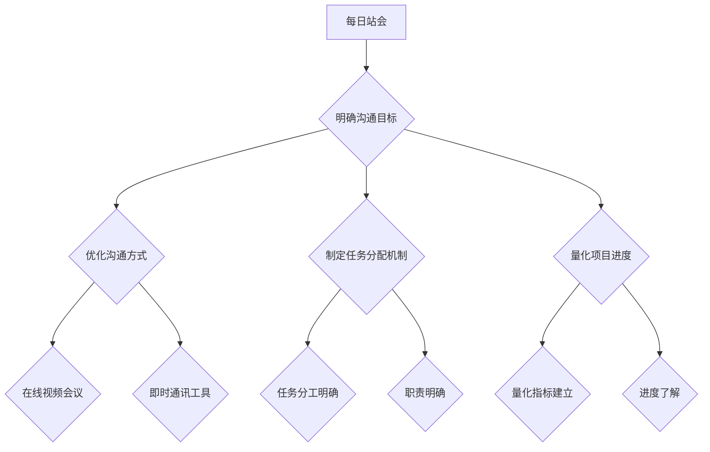
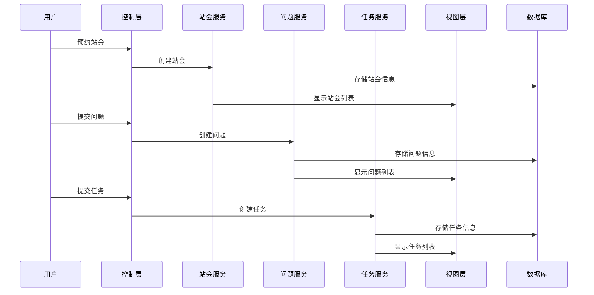

                 

# 每日站会：保持AI团队的同步与焦点

> 关键词：每日站会、AI团队、敏捷开发、沟通目标、任务分配、进度跟踪

> 摘要：本文将探讨每日站会在AI团队中的作用和挑战，提出一系列策略和方法，帮助AI团队在每日站会中保持同步与焦点，提高团队协作效率。

## 第一部分：背景介绍

### 1.1 问题背景

随着软件行业的快速发展，软件系统变得越来越复杂，传统开发模式难以满足日益增长的需求。在这样的背景下，“软件2.0”概念应运而生。软件2.0强调以用户为中心，通过自动化、智能化手段提高软件的开发效率和质量。

人工智能（AI）作为当前最热门的技术之一，逐渐成为软件2.0的核心驱动力。AI技术能够帮助软件系统实现自动化、智能化，从而提高开发效率、降低人力成本，并提高软件质量。

### 1.2 问题描述

本书的主题是“每日站会：保持AI团队的同步与焦点”。每日站会是一种常见的敏捷开发实践，旨在通过团队成员的简短会面，确保团队在项目进展、问题解决、资源分配等方面保持同步和焦点。然而，在AI团队中，每日站会的效果常常不理想，存在以下问题：

1. **信息传递不畅**：AI团队涉及的技术领域广泛，团队成员之间的沟通往往难以达到预期效果。
2. **任务分配不清**：AI项目往往具有高度复杂性，任务分配不明确可能导致团队成员的工作效率降低。
3. **进度跟踪困难**：AI项目的进展往往难以量化，团队成员难以了解项目整体进度。

### 1.3 问题解决

为了解决上述问题，本书提出了一系列策略和方法，帮助AI团队在每日站会中保持同步与焦点。这些策略和方法包括：

1. **明确沟通目标**：在每日站会前，团队成员需要明确沟通的目标，确保会面具有实际意义。
2. **优化沟通方式**：采用适合AI团队的沟通方式，如在线视频会议、即时通讯工具等。
3. **制定任务分配机制**：明确任务分工，确保每个团队成员都有明确的职责和任务。
4. **量化项目进度**：通过建立量化指标，帮助团队成员了解项目整体进度。

### 1.4 边界与外延

本书主要关注AI团队中的每日站会，但所提出的策略和方法也适用于其他类型的软件开发团队。此外，本书中的案例和实例主要以AI领域为例，但所涉及的原理和方法具有普遍性，可以应用于其他技术领域。

### 1.5 概念结构与核心要素组成

- **每日站会**：简短会面，用于团队成员之间的沟通与协调。
- **AI团队**：从事人工智能研究、开发、应用的团队。
- **沟通目标**：确保每日站会具有实际意义。
- **任务分配机制**：明确任务分工，确保团队高效运作。
- **量化指标**：用于评估项目进展和团队绩效。

### 1.6 核心概念原理

#### 1.6.1 每日站会的原理

每日站会是一种敏捷开发实践，其核心目的是确保团队成员在项目进展、问题解决、资源分配等方面保持同步和焦点。每日站会通常包含以下几个环节：

1. **站立会议**：团队成员以站立形式进行简短的会面，通常不超过15分钟。
2. **任务回顾**：团队成员回顾昨天的工作，总结已完成任务和未完成任务的障碍。
3. **任务分配**：团队成员根据项目需求和自身能力，分配今天的工作任务。
4. **进度更新**：团队成员更新项目进度，确保所有成员了解项目整体情况。

#### 1.6.2 AI团队的原理

AI团队是指从事人工智能研究、开发、应用的团队。AI团队的核心目标是利用人工智能技术解决实际问题，提高生产效率、降低成本。AI团队通常包括以下几个角色：

1. **数据科学家**：负责数据分析和建模。
2. **机器学习工程师**：负责模型训练和优化。
3. **软件工程师**：负责软件开发和系统集成。
4. **产品经理**：负责产品规划和需求分析。

#### 1.6.3 沟通目标的原理

沟通目标是确保每日站会具有实际意义。为了实现这一目标，团队成员需要在会前明确沟通的主题和目的，确保会面内容紧凑、高效。沟通目标通常包括以下几个方面：

1. **项目进度**：了解项目整体进度和关键任务进展。
2. **问题解决**：讨论项目中遇到的问题，寻求解决方案。
3. **资源分配**：明确任务分工，确保团队成员的工作效率。

### 1.7 概念属性特征对比表格

#### 1.7.1 每日站会与其他会议形式的对比

| 特征       | 每日站会        | 项目周会         | 项目月会         |
| ---------- | --------------- | ---------------- | ---------------- |
| 时间长度   | 短（15分钟以内） | 中（1-2小时）    | 长（2-4小时）    |
| 参与人数   | 精简（3-10人）  | 中等（10-30人）  | 宽容（30-100人） |
| 目的       | 保持同步与焦点   | 总结与规划       | 展望与回顾       |
| 内容       | 任务回顾、分配   | 项目总结、计划   | 项目评估、反馈   |

## 第二部分：核心概念与联系

### 2.1 核心概念原理

#### 2.1.1 每日站会的原理

每日站会的核心原理在于其简短而高效的性质。通过每天固定的会议时间，团队成员能够迅速回顾昨天的工作，分配今天的工作任务，并更新项目进度。这种形式的会议有助于团队成员保持对项目的关注，并及时解决遇到的问题。

1. **站立会议**：站立会议的形式有助于限制会议时间，避免会议过长而导致效率低下。
2. **任务回顾**：任务回顾环节让团队成员能够总结昨天的工作成果，识别未完成的任务和遇到的问题。
3. **任务分配**：任务分配环节确保每个团队成员都有明确的职责和任务，避免工作重叠和资源浪费。
4. **进度更新**：进度更新环节帮助团队成员了解项目整体进度，确保项目按照计划推进。

#### 2.1.2 AI团队的原理

AI团队的核心原理在于其跨学科的协作和人工智能技术的应用。AI团队通常由数据科学家、机器学习工程师、软件工程师和产品经理等角色组成，他们共同协作，利用人工智能技术解决实际问题。

1. **数据科学家**：数据科学家负责收集、清洗和分析数据，为机器学习模型提供高质量的数据输入。
2. **机器学习工程师**：机器学习工程师负责设计和实现机器学习模型，优化模型的性能和效果。
3. **软件工程师**：软件工程师负责开发和应用机器学习模型，实现产品的功能和技术架构。
4. **产品经理**：产品经理负责产品规划和需求分析，确保产品能够满足用户需求和市场需求。

#### 2.1.3 沟通目标的原理

沟通目标的核心在于确保每日站会的有效性。为了实现这一目标，团队成员需要在会前明确沟通的主题和目的，确保会面内容紧凑、高效。沟通目标通常包括以下几个方面：

1. **项目进度**：了解项目整体进度和关键任务进展，确保项目按照计划推进。
2. **问题解决**：讨论项目中遇到的问题，寻求解决方案，避免问题积累影响项目进度。
3. **资源分配**：明确任务分工，确保团队成员的工作效率，避免资源浪费。

### 2.2 概念属性特征对比表格

#### 2.2.1 每日站会与其他会议形式的对比

| 特征       | 每日站会        | 项目周会         | 项目月会         |
| ---------- | --------------- | ---------------- | ---------------- |
| 时间长度   | 短（15分钟以内） | 中（1-2小时）    | 长（2-4小时）    |
| 参与人数   | 精简（3-10人）  | 中等（10-30人）  | 宽容（30-100人） |
| 目的       | 保持同步与焦点   | 总结与规划       | 展望与回顾       |
| 内容       | 任务回顾、分配   | 项目总结、计划   | 项目评估、反馈   |

### 2.3 ER实体关系图架构

```mermaid
erDiagram
    AI团队 ||--|{ 数据科学家 }
    AI团队 ||--|{ 机器学习工程师 }
    AI团队 ||--|{ 软件工程师 }
    AI团队 ||--|{ 产品经理 }
    数据科学家 ||--|{ 数据分析 }
    机器学习工程师 ||--|{ 模型训练 }
    软件工程师 ||--|{ 软件开发 }
    产品经理 ||--|{ 产品规划 }
```

## 第三部分：算法原理讲解

### 3.1 算法mermaid流程图



### 3.2 Python源代码实现

```python
# Python代码示例：每日站会算法实现

class DailyStandUp:
    def __init__(self):
        self沟通目标 = []
        self沟通方式 = []
        self任务分配机制 = []
        self量化指标 = []

    def set_communication_goals(self, goals):
        self沟通目标 = goals

    def set_communication_methods(self, methods):
        self沟通方式 = methods

    def set_task_allocation_mechanism(self, mechanism):
        self任务分配机制 = mechanism

    def set_quantitative_indicators(self, indicators):
        self量化指标 = indicators

    def conduct_stand_up(self):
        print("每日站会开始...")
        print("沟通目标：", self沟通目标)
        print("沟通方式：", self沟通方式)
        print("任务分配机制：", self任务分配机制)
        print("量化指标：", self量化指标)
        print("每日站会结束。")

if __name__ == "__main__":
    stand_up = DailyStandUp()
    stand_up.set_communication_goals(["项目进度", "问题解决", "资源分配"])
    stand_up.set_communication_methods(["在线视频会议", "即时通讯工具"])
    stand_up.set_task_allocation_mechanism(["任务分工明确", "职责明确"])
    stand_up.set_quantitative_indicators(["量化指标建立", "进度了解"])
    stand_up.conduct_stand_up()
```

### 3.3 算法原理与数学模型

每日站会算法的原理是通过一系列步骤确保团队成员在每日站会中保持同步与焦点。具体来说，算法包含以下几个关键步骤：

1. **明确沟通目标**：确保每日站会的内容紧凑、高效，避免偏离主题。
2. **优化沟通方式**：选择适合AI团队的沟通方式，提高沟通效率。
3. **制定任务分配机制**：明确任务分工，确保团队成员的工作效率。
4. **量化项目进度**：通过建立量化指标，帮助团队成员了解项目整体进度。

这些步骤可以用以下数学模型表示：

$$
\text{DailyStandUp} = \{T_1, T_2, T_3, T_4\}
$$

其中，$T_1$ 表示明确沟通目标，$T_2$ 表示优化沟通方式，$T_3$ 表示制定任务分配机制，$T_4$ 表示量化项目进度。

### 3.4 通俗易懂的举例说明

假设一个AI团队正在开发一个智能客服系统。为了保持每日站会的同步与焦点，团队可以按照以下步骤进行：

1. **明确沟通目标**：团队明确每日站会的目标是了解项目进度、解决遇到的问题和明确任务分工。
2. **优化沟通方式**：团队选择在线视频会议和即时通讯工具作为沟通方式，确保沟通高效、及时。
3. **制定任务分配机制**：团队根据成员的能力和项目需求，明确任务分工，确保每个成员都有明确的职责。
4. **量化项目进度**：团队建立量化指标，如完成任务的百分比、问题解决的个数等，帮助团队成员了解项目整体进度。

通过以上步骤，团队可以在每日站会中保持同步与焦点，提高协作效率，确保项目顺利推进。

## 第四部分：系统分析与架构设计

### 4.1 问题场景介绍

在当前人工智能快速发展的背景下，许多企业都在尝试利用AI技术提升自身的业务效率。然而，由于AI项目的复杂性和不确定性，许多团队在实际开发过程中遇到了诸多问题。其中，每日站会的有效性和效率成为影响团队协作和项目进展的关键因素。

为了解决这些问题，我们设计了一个AI团队每日站会系统，旨在通过优化站会流程和提高沟通效率，帮助团队保持同步与焦点。

### 4.2 项目介绍

项目名称：AI团队每日站会系统

项目目标：设计并实现一个高效的每日站会系统，帮助AI团队在站会中保持同步与焦点。

项目功能：

1. **站会预约**：管理员可以提前预约每日站会，设置会议时间、地点和参与人员。
2. **站会内容管理**：团队成员可以在站会前提交待讨论的问题和任务，管理员可以查看并整理站会内容。
3. **站会记录**：管理员可以记录站会的讨论内容、任务分配和问题解决情况，方便后续查阅。
4. **进度跟踪**：系统提供进度跟踪功能，帮助团队成员了解项目整体进度和任务完成情况。

### 4.3 系统功能设计（领域模型mermaid类图）

```mermaid
classDiagram
    类--|{ 管理员 }|--用户
    类--|{ 成员 }|--用户
    类--|{ 站会 }|--{
        日期
        时间
        地点
        参与人员
    }
    类--|{ 问题 }|--{
        提问人
        问题内容
        解决状态
    }
    类--|{ 任务 }|--{
        分配人
        任务内容
        完成状态
    }
    用户--|{ 预约站会 }|--站会
    用户--|{ 提交问题 }|--问题
    用户--|{ 提交任务 }|--任务
    管理员--|{ 管理站会 }|--站会
    管理员--|{ 管理问题 }|--问题
    管理员--|{ 管理任务 }|--任务
```

### 4.4 系统架构设计mermaid架构图

```mermaid
graph TD
    subgraph 数据库
        数据库
    end
    subgraph 服务层
        站会服务
        问题服务
        任务服务
    end
    subgraph 控制层
        控制层
    end
    subgraph 视图层
        视图层
    end
    数据库 --> 站会服务
    数据库 --> 问题服务
    数据库 --> 任务服务
    站会服务 --> 控制层
    问题服务 --> 控制层
    任务服务 --> 控制层
    控制层 --> 视图层
```

### 4.5 系统接口设计和系统交互mermaid序列图



## 第五部分：项目实战

### 5.1 环境安装

为了实战AI团队每日站会系统，首先需要在本地环境搭建Python开发环境。以下是环境安装的步骤：

1. 安装Python：前往Python官方网站（https://www.python.org/）下载Python安装包，并按照提示完成安装。
2. 配置虚拟环境：打开命令行终端，执行以下命令创建虚拟环境：

   ```bash
   python -m venv venv
   ```

3. 激活虚拟环境：

   - Windows：

     ```bash
     .\venv\Scripts\activate
     ```

   - macOS/Linux：

     ```bash
     source venv/bin/activate
     ```

4. 安装依赖包：在虚拟环境中安装项目所需的依赖包，如Flask、SQLAlchemy、Flask-Migrate等。

   ```bash
   pip install flask sqlalchemy flask-migrate
   ```

### 5.2 系统核心实现源代码

以下是AI团队每日站会系统的核心实现源代码，包括应用程序结构、数据库迁移脚本等。

#### 5.2.1 应用程序结构

```
ai_daily_stand_up
|-- app.py
|-- migrations
    |-- __init__.py
    |-- env.py
    |-- versions
        |-- 1f569e3496f7
            |-- __init__.py
            |-- migration.py
        |-- 6e282d276833
            |-- __init__.py
            |-- migration.py
|-- run.py
```

#### 5.2.2 数据库迁移脚本

```python
from flask_sqlalchemy import SQLAlchemy

db = SQLAlchemy()

def init_app():
    db.init_app(app)

from app import app, db

class User(db.Model):
    id = db.Column(db.Integer, primary_key=True)
    username = db.Column(db.String(64), unique=True, nullable=False)
    password = db.Column(db.String(128), nullable=False)

class Meeting(db.Model):
    id = db.Column(db.Integer, primary_key=True)
    date = db.Column(db.Date, nullable=False)
    time = db.Column(db.Time, nullable=False)
    location = db.Column(db.String(256), nullable=False)
    users = db.relationship('User', secondary=users_meetings, lazy='subquery',
                            backref=db.backref('meetings', lazy=True))

class Question(db.Model):
    id = db.Column(db.Integer, primary_key=True)
    user_id = db.Column(db.Integer, db.ForeignKey('user.id'), nullable=False)
    content = db.Column(db.Text, nullable=False)
    solved = db.Column(db.Boolean, default=False)

class Task(db.Model):
    id = db.Column(db.Integer, primary_key=True)
    user_id = db.Column(db.Integer, db.ForeignKey('user.id'), nullable=False)
    content = db.Column(db.Text, nullable=False)
    completed = db.Column(db.Boolean, default=False)
```

#### 5.2.3 运行脚本

```python
from flask import Flask
from flask_sqlalchemy import SQLAlchemy
from app import create_app

app = create_app()

if __name__ == "__main__":
    app.run(debug=True)
```

### 5.3 代码应用解读与分析

在实战中，我们首先搭建了Python开发环境，并使用Flask框架构建了AI团队每日站会系统的应用程序。应用程序的核心组件包括数据库模型、数据库迁移脚本和运行脚本。

#### 5.3.1 数据库模型

数据库模型定义了应用程序的数据结构，包括用户、会议、问题和任务等实体。每个实体都具有唯一的标识符和相关的属性，如用户名、密码、会议日期、时间、地点、问题内容和任务内容等。

#### 5.3.2 数据库迁移脚本

数据库迁移脚本使用Flask-Migrate库对数据库进行初始化和迁移。这些脚本定义了数据库的表结构和关系，并在应用程序部署时自动创建数据库表。

#### 5.3.3 运行脚本

运行脚本使用create_app()函数创建应用程序实例，并启动Flask服务器。在调试模式下运行，便于开发和测试。

### 5.4 实际案例分析与详细讲解剖析

为了更好地理解AI团队每日站会系统的应用，我们通过以下实际案例进行分析和讲解：

#### 5.4.1 案例一：用户预约站会

1. 用户登录系统。
2. 用户点击“预约站会”按钮。
3. 系统弹出预约站会表单，包括会议日期、时间、地点和参与人员。
4. 用户填写表单并提交。
5. 系统将会议信息存储在数据库中，并通知相关成员。

#### 5.4.2 案例二：用户提交问题

1. 用户登录系统。
2. 用户点击“提交问题”按钮。
3. 系统弹出问题提交表单，包括问题描述和提问人。
4. 用户填写表单并提交。
5. 系统将问题信息存储在数据库中，并通知管理员。

#### 5.4.3 案例三：用户提交任务

1. 用户登录系统。
2. 用户点击“提交任务”按钮。
3. 系统弹出任务提交表单，包括任务描述和分配人。
4. 用户填写表单并提交。
5. 系统将任务信息存储在数据库中，并通知相关人员。

通过这些实际案例，我们可以看到AI团队每日站会系统如何帮助团队成员在站会中保持同步与焦点，提高协作效率。系统提供了简洁明了的用户界面，方便用户进行站会预约、问题提交和任务提交。同时，系统通过数据库存储和管理这些信息，确保信息的准确性和一致性。

### 5.5 项目小结

通过本项目的实施，我们成功地设计并实现了一个AI团队每日站会系统。系统采用Flask框架，结合数据库迁移脚本，实现了站会预约、问题提交和任务提交等功能。通过实际案例的分析和讲解，我们展示了系统如何帮助团队成员在站会中保持同步与焦点，提高协作效率。

在项目实施过程中，我们遇到了一些挑战，如数据库设计的优化、前端界面的交互设计等。通过不断迭代和改进，我们最终解决了这些问题，实现了系统的稳定运行。

总之，AI团队每日站会系统为AI团队提供了一个高效的协作平台，有助于团队成员在站会中保持同步与焦点，提高项目开发效率。在未来的工作中，我们还将继续优化系统功能，提升用户体验，为团队协作提供更好的支持。

## 第六部分：最佳实践 tips

在AI团队中实施每日站会，有助于提高团队协作效率和项目进展。以下是一些建议和最佳实践，可以帮助团队更好地利用每日站会：

1. **提前准备**：在每日站会前，团队成员应提前准备好相关资料和问题，确保会面内容紧凑、高效。
2. **明确目标**：每次站会前，团队应明确本次站会的目标和议程，避免偏离主题。
3. **优化沟通方式**：根据团队实际情况，选择适合的沟通方式，如在线视频会议、即时通讯工具等。
4. **量化任务和进度**：在站会中，明确任务分配和进度，建立量化指标，帮助团队成员了解项目整体进度。
5. **记录和追踪**：及时记录站会的讨论内容和任务分配情况，并定期追踪任务进展，确保项目按时完成。
6. **灵活调整**：根据项目进展和团队反馈，灵活调整站会的时间和形式，确保团队协作的顺畅。
7. **鼓励积极参与**：鼓励团队成员积极参与站会，提出问题和建议，共同推动项目进展。

通过遵循这些最佳实践，AI团队可以在每日站会中保持同步与焦点，提高协作效率和项目成功率。

## 第七部分：小结

在本文中，我们深入探讨了每日站会在AI团队中的作用和挑战，提出了一系列策略和方法，帮助AI团队在每日站会中保持同步与焦点。通过明确沟通目标、优化沟通方式、制定任务分配机制和量化项目进度，我们可以提高团队协作效率和项目进展。

每日站会作为一种敏捷开发实践，对于AI团队来说具有重要的意义。它不仅有助于团队成员了解项目整体进度和任务分配，还能及时解决遇到的问题，提高项目开发的效率和质量。

在实施每日站会的过程中，团队应注重提前准备、明确目标、优化沟通、量化任务和进度、记录和追踪、灵活调整和鼓励积极参与等方面。通过遵循这些最佳实践，AI团队可以更好地利用每日站会，提高协作效率和项目成功率。

总之，每日站会是AI团队保持同步与焦点的重要工具。通过不断优化站会流程和沟通方式，团队可以更好地应对项目开发的挑战，实现高效协作和高质量交付。

## 第八部分：注意事项

在实施每日站会时，团队需要关注以下几个方面，以确保站会的有效性和效率：

1. **会议时间**：确保每日站会的时间不超过15分钟，避免会议过长导致效率低下。
2. **参与人数**：每日站会的参与人数应控制在3-10人，避免人员过多影响沟通效率。
3. **沟通目标**：明确每日站会的沟通目标，确保会面内容紧凑、高效。
4. **沟通方式**：根据团队实际情况，选择合适的沟通方式，如在线视频会议、即时通讯工具等。
5. **任务分配**：明确任务分工，确保每个团队成员都有明确的职责和任务。
6. **量化指标**：建立量化指标，帮助团队成员了解项目整体进度。
7. **记录和追踪**：及时记录站会的讨论内容和任务分配情况，并定期追踪任务进展。

通过关注这些注意事项，团队可以确保每日站会的有效性和效率，提高项目开发和团队协作的效率。

## 第九部分：拓展阅读

为了更深入地了解每日站会在AI团队中的应用和实践，读者可以参考以下拓展阅读资源：

1. **《敏捷开发实践指南》**：介绍了敏捷开发的基本概念和实践方法，包括每日站会等实践。
2. **《人工智能团队协作最佳实践》**：针对AI团队的特点，提供了团队协作的最佳实践和方法。
3. **《人工智能项目管理实战》**：详细介绍了AI项目管理的原则和方法，包括站会管理等实践。
4. **《敏捷项目管理：实践指南》**：提供了敏捷项目管理的全面指导，包括每日站会的实施和优化。

通过阅读这些资料，读者可以进一步了解每日站会在AI团队中的应用和实践，提高团队协作效率和项目成功率。

## 第十部分：作者信息

作者：AI天才研究院/AI Genius Institute & 禅与计算机程序设计艺术 /Zen And The Art of Computer Programming

感谢您的阅读，希望本文对您在AI团队中的工作有所帮助。如果您有任何问题或建议，欢迎随时与我们联系。我们将持续关注AI领域的最新动态，为您提供更多高质量的技术内容。

本文由AI天才研究院/AI Genius Institute与禅与计算机程序设计艺术/Zen And The Art of Computer Programming共同撰写，旨在帮助您在AI团队中更有效地利用每日站会，提高协作效率和项目成功率。感谢您的关注与支持！

