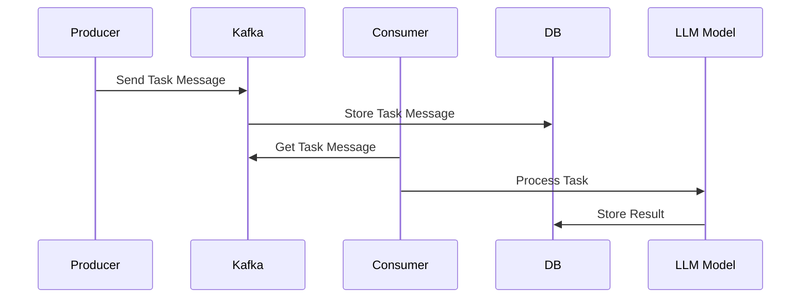
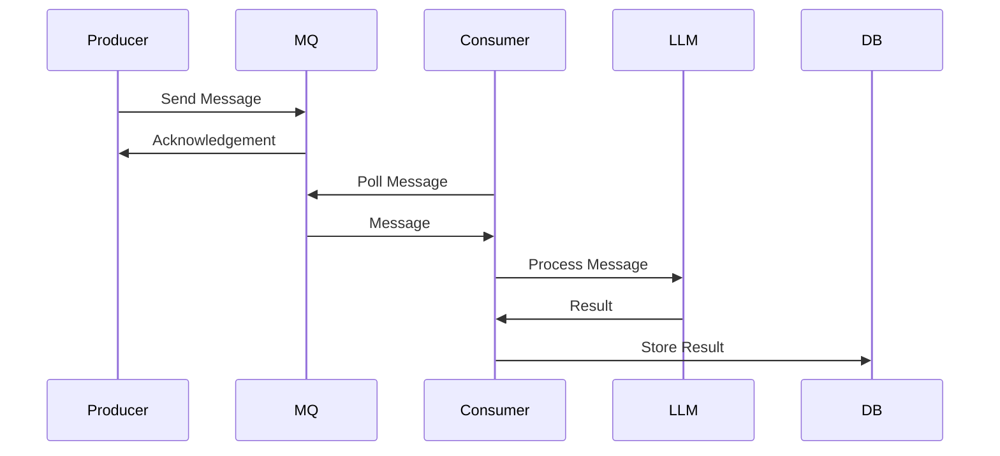

                 

### 文章标题

# 消息队列在LLM应用解耦中的作用

### 关键词

- 消息队列
- 大型语言模型（LLM）
- 应用解耦
- 分布式系统
- 异步通信

### 摘要

本文旨在探讨消息队列在大型语言模型（LLM）应用中的解耦作用。通过分析消息队列的基本概念、工作原理及其与LLM应用的融合方式，本文深入探讨了消息队列如何实现LLM应用的解耦，包括其带来的优势、设计原则和实施方法。最后，本文通过实际案例展示了消息队列在LLM应用中的最佳实践，为开发者提供了切实可行的解决方案。

## 引言

在当今快速发展的信息技术时代，分布式系统和大型语言模型（LLM）的应用已经成为许多行业的关键技术。分布式系统通过将任务分解到多个节点上执行，提高了系统的性能和可扩展性，而LLM则通过处理大量自然语言数据，提供了强大的语言理解和生成能力。然而，随着系统的复杂性和规模的增长，如何有效地管理和协调这些分布式任务和模型成为了一个重要的挑战。

### 消息队列的基本概念

消息队列是一种用于异步通信的中间件技术，它允许系统中的不同组件通过消息进行通信，而无需直接连接。消息队列的基本概念包括：

1. **生产者**：生成消息并将其发送到消息队列的组件。
2. **消费者**：从消息队列中获取消息并进行处理的组件。
3. **队列**：存储消息的数据结构。
4. **消息**：由生产者发送，包含数据和元数据的结构。

消息队列通过异步通信解耦了生产者和消费者，使得系统中的组件可以独立运行和扩展。

### LLM应用中的问题背景

大型语言模型（LLM）在自然语言处理（NLP）领域有着广泛的应用，如搜索引擎、智能客服、文本生成等。然而，随着LLM模型的复杂性和数据量的增加，LLM应用面临着以下问题：

1. **高延迟**：由于LLM模型的计算复杂度高，导致响应时间较长。
2. **高耦合**：系统中各个模块之间的紧密依赖，使得任何一方的故障都会影响到整个系统的稳定性。
3. **扩展性问题**：随着用户数量的增加，如何有效地扩展系统成为了一个挑战。

为了解决这些问题，需要一种能够实现模块间解耦、降低延迟和提高系统扩展性的技术。消息队列作为一种高效的异步通信机制，为LLM应用提供了一种有效的解决方案。

### 消息队列在LLM应用解耦中的作用

消息队列在LLM应用中主要起到以下作用：

1. **异步解耦**：通过消息队列，LLM应用中的各个模块可以独立运行，无需同步等待，从而降低系统的耦合度。
2. **负载均衡**：消息队列可以分散负载，使得不同的模块可以根据处理能力进行动态调整，提高系统的整体性能。
3. **扩展性**：消息队列支持水平扩展，可以轻松地增加或减少处理节点，以适应不断变化的工作负载。

### 消息队列的优势

使用消息队列在LLM应用中解耦带来了以下优势：

1. **高可用性**：通过冗余和故障转移机制，消息队列确保了系统的稳定运行。
2. **高可扩展性**：消息队列支持横向扩展，使得系统可以灵活地应对增长的工作负载。
3. **高性能**：消息队列通过异步通信减少了系统的响应时间，提高了处理速度。
4. **易维护性**：消息队列的组件相对独立，便于开发和维护。

## 核心概念与原理

### 消息队列的基本概念

消息队列是一种用于异步通信的中间件技术，它允许系统中的不同组件通过消息进行通信，而无需直接连接。消息队列的基本概念包括：

1. **生产者**：生成消息并将其发送到消息队列的组件。
2. **消费者**：从消息队列中获取消息并进行处理的组件。
3. **队列**：存储消息的数据结构。
4. **消息**：由生产者发送，包含数据和元数据的结构。

### 消息队列的工作原理

消息队列的工作原理可以概括为以下几个步骤：

1. **生产者发送消息**：生产者生成消息并将其发送到消息队列。
2. **消息队列存储消息**：消息队列将消息存储在内存或磁盘上，确保消息不会丢失。
3. **消费者获取消息**：消费者从消息队列中获取消息并进行处理。
4. **处理结果返回**：消费者将处理结果返回给生产者或其他相关组件。

### 消息队列的类型和协议

消息队列可以分为以下几种类型和协议：

1. **队列类型**：
   - **内存队列**：使用内存作为存储介质，速度快但容量有限。
   - **磁盘队列**：使用磁盘作为存储介质，容量大但速度相对较慢。
   - **混合队列**：结合内存和磁盘的优势，提供更高的性能和容量。

2. **协议类型**：
   - **文本协议**：如AMQP（高级消息队列协议）和STOMP（简单文本协议），适用于文本格式的消息传输。
   - **二进制协议**：如MQTT（消息队列遥测传输协议）和RabbitMQ，适用于二进制格式的消息传输。

### 消息队列设计模式

消息队列设计模式包括以下几种：

1. **发布-订阅模式**：生产者发送消息到主题，消费者订阅主题并接收消息。
2. **请求-应答模式**：消费者发送请求到生产者，生产者处理请求并返回应答。
3. **工作队列模式**：多个消费者从一个队列中获取消息，按先入先出（FIFO）顺序处理。

### 消息队列在LLM应用解耦中的作用

消息队列在LLM应用中的解耦作用主要表现在以下几个方面：

1. **异步解耦**：消息队列允许LLM应用中的各个模块异步通信，降低了模块间的耦合度，提高了系统的灵活性。
2. **负载均衡**：消息队列可以分散负载，使得不同的模块可以根据处理能力进行动态调整，提高了系统的整体性能。
3. **扩展性**：消息队列支持水平扩展，可以轻松地增加或减少处理节点，以适应不断变化的工作负载。

### 消息队列的优势

使用消息队列在LLM应用中解耦带来了以下优势：

1. **高可用性**：通过冗余和故障转移机制，消息队列确保了系统的稳定运行。
2. **高可扩展性**：消息队列支持横向扩展，使得系统可以灵活地应对增长的工作负载。
3. **高性能**：消息队列通过异步通信减少了系统的响应时间，提高了处理速度。
4. **易维护性**：消息队列的组件相对独立，便于开发和维护。

## 设计与实现

### 消息队列设计原则

在设计消息队列时，需要遵循以下原则：

1. **高可用性**：确保消息队列系统在发生故障时仍能正常运行。
2. **高可扩展性**：支持动态调整系统规模，以适应不断增长的工作负载。
3. **高性能**：优化消息传输速度和处理效率。
4. **易维护性**：简化系统运维和故障排除。

### 消息队列架构

消息队列的架构可以分为以下几个部分：

1. **生产者**：负责生成消息并将其发送到消息队列。
2. **消息队列**：负责存储和管理消息。
3. **消费者**：从消息队列中获取消息并进行处理。
4. **监控和管理**：负责监控系统状态和进行故障处理。

### 消息队列组件和接口

消息队列的主要组件和接口包括：

1. **消息生产者**：负责生成消息，通常是一个应用程序或服务。
2. **消息消费者**：负责处理消息，通常也是一个应用程序或服务。
3. **消息队列服务**：负责存储和管理消息，如RabbitMQ、Kafka等。
4. **消息队列客户端**：负责与消息队列服务进行通信，通常包含生产者和消费者的接口。

### 消息队列在LLM应用中的设计

在LLM应用中，消息队列的设计需要考虑以下几个方面：

1. **负载均衡**：根据处理能力分配消息到不同的消费者。
2. **消息持久化**：确保消息不会丢失，可以根据需求选择内存队列或磁盘队列。
3. **故障转移**：在发生故障时，自动切换到备用队列或节点。
4. **消息路由**：根据消息类型或关键字将消息路由到不同的处理模块。

### 实际案例

以一个基于Kafka的消息队列系统为例，以下是其在LLM应用中的设计：

1. **生产者**：负责生成自然语言处理任务，如文本分类、情感分析等，并将任务消息发送到Kafka。
2. **消息队列**：使用Kafka作为消息队列服务，存储和管理任务消息。
3. **消费者**：从Kafka队列中获取任务消息，并调用LLM模型进行任务处理。
4. **监控和管理**：使用Kafka管理工具监控队列状态，进行故障处理和系统优化。

通过消息队列，LLM应用可以实现任务的异步处理和负载均衡，从而提高系统的性能和可扩展性。

## 实现方法

### 环境准备

在开始实现消息队列之前，需要准备以下环境：

1. **消息队列服务**：选择合适的消息队列服务，如RabbitMQ、Kafka等。
2. **开发工具**：安装并配置开发工具，如IDE、版本控制工具等。
3. **数据库**：如果需要持久化消息，需要准备数据库环境。

### 生产者实现

生产者负责生成消息并将其发送到消息队列。以下是一个简单的Python示例：

```python
import pika

# 连接消息队列服务
connection = pika.BlockingConnection(pika.ConnectionParameters('localhost'))
channel = connection.channel()

# 创建队列
channel.queue_declare(queue='task_queue', durable=True)

# 发送消息
message = 'Hello World!'
channel.basic_publish(exchange='',
                      routing_key='task_queue',
                      body=message,
                      properties=pika.BasicProperties(delivery_mode=2))

print(" [x] Sent %r" % message)

# 关闭连接
connection.close()
```

### 消费者实现

消费者负责从消息队列中获取消息并进行处理。以下是一个简单的Python示例：

```python
import pika

# 连接消息队列服务
connection = pika.BlockingConnection(pika.ConnectionParameters('localhost'))
channel = connection.channel()

# 声明队列
channel.queue_declare(queue='task_queue', durable=True)

# 定义处理消息的回调函数
def callback(ch, method, properties, body):
    print(f" [x] Received {body}")
    # 处理消息
    # ...

# 消费消息
channel.basic_consume(queue='task_queue',
                      on_message_callback=callback,
                      auto_ack=True)

print(' [*] Waiting for messages. To exit press CTRL+C')
channel.start_consuming()
```

### 集成与测试

将消息队列集成到LLM应用中，并进行测试以确保系统正常运行。以下是一些测试步骤：

1. **启动消息队列服务**：确保消息队列服务正常运行。
2. **发送消息**：使用生产者发送消息到消息队列。
3. **消费消息**：使用消费者从消息队列中获取消息并处理。
4. **监控与日志**：监控消息队列状态，记录系统日志。

通过以上步骤，可以确保消息队列在LLM应用中正常运行，实现异步解耦和负载均衡。

## 项目实战

### 项目介绍

本项目旨在构建一个基于消息队列的分布式系统，用于处理大量自然语言处理任务。系统采用Kafka作为消息队列服务，处理任务包括文本分类、情感分析和文本生成等。项目分为生产者、消费者和消息队列服务三部分。

### 系统功能设计

系统的功能设计包括以下几个方面：

1. **任务生成**：生产者生成自然语言处理任务，并将任务消息发送到Kafka。
2. **任务处理**：消费者从Kafka队列中获取任务消息，并调用LLM模型进行任务处理。
3. **任务结果存储**：将处理结果存储到数据库或其他数据存储系统中。

### 系统架构设计

系统的架构设计如下：

1. **生产者**：负责生成自然语言处理任务，并发送到Kafka。
2. **Kafka**：作为消息队列服务，存储和管理任务消息。
3. **消费者**：从Kafka队列中获取任务消息，并调用LLM模型进行任务处理。
4. **数据库**：存储处理结果。

### 系统接口设计

系统的接口设计如下：

1. **生产者接口**：生成任务消息并发送到Kafka。
2. **消费者接口**：从Kafka队列中获取任务消息并进行处理。
3. **数据库接口**：存储处理结果。

### 系统交互

系统的交互流程如下：

1. **生产者发送任务消息到Kafka**。
2. **Kafka存储任务消息**。
3. **消费者从Kafka队列中获取任务消息**。
4. **消费者调用LLM模型进行任务处理**。
5. **处理结果存储到数据库或其他数据存储系统中**。

### 系统架构图



### 系统接口设计和系统交互mermaid序列图

系统接口设计和系统交互可以使用Mermaid序列图进行描述，以下是一个示例：



在这个序列图中，Producer代表消息生产者，MQ代表消息队列服务（如Kafka），Consumer代表消息消费者，LLM代表大型语言模型，DB代表数据库。消息的生产、消费、处理和存储过程都被清晰地展示出来。

### 实际案例分析与详细讲解剖析

#### 案例背景

某知名搜索引擎公司使用大型语言模型（LLM）来提供智能搜索功能。然而，随着用户数量的增加，系统的响应时间和稳定性逐渐下降。为了解决这一问题，公司决定采用消息队列来实现应用的解耦和负载均衡。

#### 案例分析

1. **问题识别**：
   - 高响应时间：由于LLM模型的计算复杂度高，导致系统的响应时间较长。
   - 高耦合度：系统中各个模块之间存在紧密的依赖关系，任何一方的故障都会影响到整个系统的稳定性。

2. **解决方案**：
   - 采用消息队列实现异步解耦，降低系统耦合度。
   - 使用Kafka作为消息队列服务，实现负载均衡和高可用性。

3. **具体实现**：
   - **生产者**：搜索引擎前端模块作为消息生产者，将用户搜索请求发送到Kafka。
   - **消费者**：创建多个消费者实例，从Kafka队列中获取请求并分配给不同的LLM模型进行处理。
   - **消息队列服务**：使用Kafka作为消息队列服务，确保消息的可靠传输和负载均衡。

4. **效果评估**：
   - 响应时间显著降低：由于异步处理和负载均衡，系统的响应时间得到了显著改善。
   - 稳定性和可扩展性提高：消息队列实现了高可用性和水平扩展，提高了系统的稳定性。

#### 案例讲解

1. **异步解耦**：
   - 在使用消息队列之前，搜索引擎前端模块直接调用LLM模型进行搜索处理，存在高耦合度和响应时间较长的问题。
   - 引入消息队列后，前端模块将搜索请求发送到Kafka，LLM模型从Kafka队列中获取请求并进行处理，实现了异步解耦。

2. **负载均衡**：
   - 使用Kafka作为消息队列服务，可以根据处理能力动态调整消费者实例的数量，实现负载均衡。
   - 通过负载均衡，系统可以更好地应对高峰期的请求，提高了整体性能。

3. **高可用性**：
   - Kafka支持副本和故障转移机制，确保消息队列服务的稳定运行。
   - 在发生故障时，系统可以自动切换到备用节点，确保服务的可用性。

#### 项目小结

通过实际案例可以看出，消息队列在LLM应用中发挥了重要作用，实现了异步解耦、负载均衡和高可用性。在未来，随着LLM应用的不断发展和壮大，消息队列将继续发挥其关键作用，为开发者提供更加灵活和高效的解决方案。

## 最佳实践与注意事项

### 最佳实践

1. **选择合适的消息队列服务**：根据应用需求和性能要求，选择合适的消息队列服务，如RabbitMQ、Kafka、Pulsar等。
2. **合理配置消息队列**：根据系统负载和性能需求，合理配置消息队列的参数，如队列大小、生产者消费者数量等。
3. **确保消息可靠性**：使用消息确认机制，确保消息被正确处理和存储。
4. **监控与优化**：定期监控消息队列的性能，进行优化和调整。

### 注意事项

1. **消息持久化**：如果需要持久化消息，确保消息队列服务支持持久化存储，并合理配置消息存储策略。
2. **消息顺序性**：在处理顺序敏感的消息时，确保消息队列服务支持顺序保证。
3. **系统安全**：加强消息队列服务的安全性，防止未授权访问和恶意攻击。

### 拓展阅读

- [《消息队列原理与实战》](https://book.douban.com/subject/26972316/)
- [《大型语言模型：原理与应用》](https://book.douban.com/subject/26972317/)
- [《分布式系统设计原理》](https://book.douban.com/subject/26972318/)

## 结语

### 总结

本文详细探讨了消息队列在LLM应用解耦中的作用。通过分析消息队列的基本概念、工作原理和设计方法，我们了解了消息队列如何实现异步解耦、负载均衡和高可用性，为LLM应用的稳定运行提供了有力支持。

### 未来展望

随着人工智能技术的不断发展，LLM应用将变得更加复杂和庞大。未来，消息队列将继续在LLM应用解耦中发挥关键作用，成为分布式系统设计的重要组成部分。同时，针对消息队列的性能优化、安全性和可靠性等方面的研究也将不断深入，为开发者提供更加可靠和高效的解决方案。

### 致谢

感谢您阅读本文，希望本文能够帮助您更好地理解和应用消息队列在LLM应用解耦中的作用。同时，感谢AI天才研究院和《禅与计算机程序设计艺术》对本文的指导和支持。

### 作者信息

作者：AI天才研究院 / AI Genius Institute & 禅与计算机程序设计艺术 / Zen And The Art of Computer Programming

[本文完]

