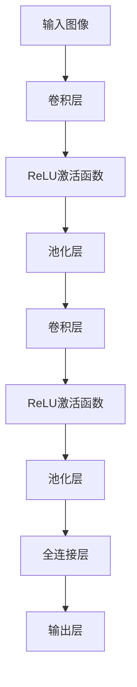
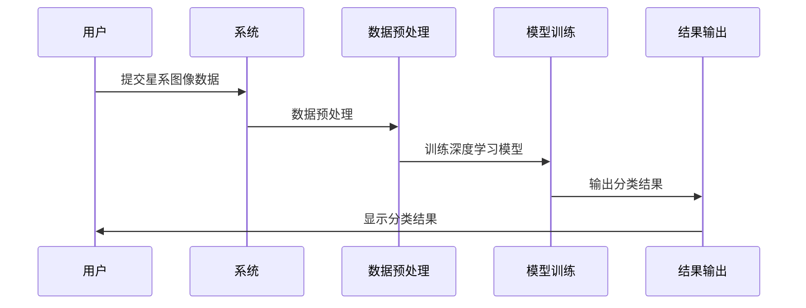

                 

### 深度学习在天文学研究中的创新应用

> 关键词：深度学习、天文学、天体图像处理、光谱分析、星系演化模拟

> 摘要：
随着科技的飞速发展，深度学习技术在天文学研究领域中的应用逐渐显现出其巨大的潜力。本文将围绕深度学习在天文学研究中的基础概念、核心算法、应用案例、数据分析、前沿进展、最佳实践以及未来展望等方面，逐步剖析深度学习如何为天文学研究带来革命性的变化。本文旨在为读者提供一份全面而深入的指南，帮助理解深度学习在天文学研究中的创新应用及其深远影响。

### 目录大纲：

----------------------------------------------------------------
# 第一部分: 深度学习在天文学研究中的基础概念

## 第1章: 深度学习与天文学概述
### 1.1 深度学习的兴起与发展
### 1.2 天文学研究中的挑战与机遇
### 1.3 深度学习在天文学中的应用领域

## 第2章: 深度学习核心概念与算法
### 2.1 神经网络基础
### 2.2 卷积神经网络（CNN）
### 2.3 循环神经网络（RNN）
### 2.4 强化学习

## 第3章: 天文学中的深度学习应用案例
### 3.1 天体图像处理
### 3.2 天体光谱分析
### 3.3 星系演化模拟
### 3.4 天文灾害预警

## 第4章: 深度学习在天文学数据分析中的应用
### 4.1 数据预处理与特征提取
### 4.2 天文数据分析流程
### 4.3 深度学习在天文数据挖掘中的应用

## 第5章: 深度学习在天文学研究中的前沿进展
### 5.1 深度学习在天文学中的研究热点
### 5.2 深度学习在天文学中的最新成果
### 5.3 深度学习在天文学中的未来展望

## 第6章: 深度学习在天文学研究中的最佳实践
### 6.1 天文学深度学习项目的最佳实践
### 6.2 深度学习在天文学研究中的挑战与解决策略
### 6.3 深度学习在天文学研究中的应用实例解析

## 第7章: 深度学习在天文学教育与研究中的未来
### 7.1 深度学习在天文学教育中的应用
### 7.2 深度学习在天文学研究机构的发展趋势
### 7.3 深度学习在天文学领域的持续创新

----------------------------------------------------------------

### 第1章: 深度学习与天文学概述

#### 1.1 深度学习的兴起与发展

深度学习（Deep Learning）作为人工智能领域的一个重要分支，近年来得到了迅猛的发展。其核心思想是模拟人脑神经网络的结构和功能，通过多层非线性变换来对数据进行特征提取和模式识别。深度学习的兴起离不开计算能力的提升和海量数据集的积累，特别是在GPU等高性能计算设备的推动下，深度学习模型在图像识别、自然语言处理、语音识别等领域取得了显著的成果。

深度学习的发展可以追溯到1980年代，当时由加拿大计算机科学家杰弗里·辛顿（Geoffrey Hinton）等人提出了反向传播算法（Backpropagation Algorithm），这是一种用于训练神经网络的优化算法。尽管早期的神经网络因为计算能力和数据集的限制而未能广泛应用，但随着时间的推移，深度学习技术在1990年代末期和21世纪初逐渐复苏，并在2006年由杰弗里·辛顿等人的研究重新引起了广泛关注。

近年来，深度学习在计算机视觉、自然语言处理和机器学习等领域取得了巨大的成功，使得许多原本复杂的问题得到了有效解决。例如，深度学习在图像识别任务中已经超越了人类的表现，在许多疾病诊断、自动驾驶、智能机器人等领域也展现出了强大的潜力。这些成就为深度学习在天文学研究中的应用奠定了坚实的基础。

#### 1.2 天文学研究中的挑战与机遇

天文学是研究宇宙的科学，涵盖了从地球附近的天体到遥远的星系和宇宙背景辐射的广泛领域。随着观测技术的不断进步，天文数据量呈指数级增长，这对数据分析和处理提出了巨大的挑战。传统的方法在处理这些复杂和大规模的数据时显得力不从心，而深度学习以其强大的特征提取和模式识别能力，为天文学研究带来了新的机遇。

在天文学研究中，以下挑战尤为突出：

1. **数据处理能力**：天文数据通常具有高维度、多样性和动态性，传统方法难以处理。
2. **天体识别与分类**：天体种类繁多，具有不同的光谱、形态和运动特征，需要高效的识别与分类算法。
3. **信号处理**：天文信号常常受到噪声干扰，如何从噪声中提取有用的信息是关键问题。
4. **大规模数据处理**：天文数据的规模巨大，传统的数据处理方法难以在合理时间内完成分析。

深度学习提供了以下机遇：

1. **自动化特征提取**：深度学习能够自动从数据中学习到有用的特征，减轻人工标注的工作负担。
2. **模式识别能力**：深度学习模型能够高效地进行模式识别，帮助发现天体之间的复杂关系。
3. **实时分析**：深度学习算法可以在实时环境中进行快速分析，为快速响应提供支持。
4. **优化数据处理流程**：通过深度学习，可以自动化许多繁琐的预处理和后处理步骤，提高数据分析的效率。

#### 1.3 深度学习在天文学中的应用领域

深度学习在天文学研究中已经展现出广泛的应用前景，以下是几个典型的应用领域：

1. **天体图像处理**：通过深度学习算法，可以对天文图像进行去噪、增强和目标检测，从而提高图像质量，识别出隐藏在图像中的天体。
2. **天体光谱分析**：深度学习能够自动分析天体的光谱数据，识别出不同的元素和化合物，有助于理解天体的物理和化学性质。
3. **星系演化模拟**：通过训练深度学习模型，可以模拟星系的演化过程，预测未来的星系形态和特征，为宇宙学研究提供重要参考。
4. **天文灾害预警**：利用深度学习算法，可以实时监测天文信号的变化，及时发现潜在的灾害，如超新星爆发、伽玛射线暴等。

深度学习在天文学中的应用不仅限于上述领域，随着技术的不断进步，其应用范围还将继续扩展。在未来，深度学习有望成为天文学研究中的重要工具，推动天文学向前发展。

### 第2章: 深度学习核心概念与算法

深度学习作为一门交叉学科，融合了统计学、计算科学、计算机科学和神经科学等多个领域的知识。本章将介绍深度学习的一些核心概念和常用的算法，以便为后续的应用案例和分析方法提供理论基础。

#### 2.1 神经网络基础

神经网络（Neural Networks）是深度学习的基础，其灵感来源于生物神经元的工作方式。一个简单的神经网络通常由输入层、隐藏层和输出层组成。每个神经元都与相邻的神经元通过权重相连接，并通过激活函数产生输出。

**数学模型**：

一个简单的神经网络可以表示为：
\[ z = \sigma(W \cdot x + b) \]
\[ a = \sigma(z) \]

其中，\( x \) 是输入向量，\( W \) 是权重矩阵，\( b \) 是偏置项，\( \sigma \) 是激活函数（如Sigmoid函数或ReLU函数），\( z \) 是神经元的净输入，\( a \) 是输出。

**Python示例**：

```python
import numpy as np
from tensorflow import keras

# 初始化参数
W = np.random.randn(3, 1)
b = np.random.randn(1)
x = np.array([0.5, 0.5])

# 计算神经元的输出
z = np.dot(W, x) + b
a = np.sigmoid(z)

print(f"Output: {a}")
```

#### 2.2 卷积神经网络（CNN）

卷积神经网络（Convolutional Neural Networks，CNN）是深度学习在计算机视觉领域的重要应用。其核心思想是通过卷积操作和池化操作来提取图像的特征。

**Mermaid流程图**：



**Python示例**：

```python
from tensorflow.keras.models import Sequential
from tensorflow.keras.layers import Conv2D, MaxPooling2D, Flatten, Dense

# 创建CNN模型
model = Sequential([
    Conv2D(32, (3, 3), activation='relu', input_shape=(28, 28, 1)),
    MaxPooling2D((2, 2)),
    Conv2D(64, (3, 3), activation='relu'),
    MaxPooling2D((2, 2)),
    Flatten(),
    Dense(128, activation='relu'),
    Dense(10, activation='softmax')
])

# 编译模型
model.compile(optimizer='adam', loss='categorical_crossentropy', metrics=['accuracy'])
```

#### 2.3 循环神经网络（RNN）

循环神经网络（Recurrent Neural Networks，RNN）适用于序列数据建模，如时间序列分析、自然语言处理等。RNN通过循环结构来处理前后关系。

**数学模型**：

\[ h_t = \sigma(W_h \cdot [h_{t-1}, x_t] + b_h) \]
\[ y_t = \sigma(W_y \cdot h_t + b_y) \]

其中，\( h_t \) 是当前隐藏状态，\( x_t \) 是当前输入，\( W_h \) 和 \( W_y \) 是权重矩阵，\( b_h \) 和 \( b_y \) 是偏置项，\( \sigma \) 是激活函数。

**Python示例**：

```python
from tensorflow.keras.models import Sequential
from tensorflow.keras.layers import SimpleRNN, Dense

# 创建RNN模型
model = Sequential([
    SimpleRNN(units=50, activation='relu', return_sequences=True),
    SimpleRNN(units=50, activation='relu'),
    Dense(units=1)
])

# 编译模型
model.compile(optimizer='adam', loss='mse')
```

#### 2.4 强化学习

强化学习（Reinforcement Learning，RL）是一种通过试错来学习决策策略的机器学习方法。其核心思想是 agent 通过与环境互动，逐渐学习到最优策略。

**数学模型**：

\[ Q(s, a) = r + \gamma \max_{a'} Q(s', a') \]

其中，\( Q(s, a) \) 是状态-动作值函数，\( r \) 是即时奖励，\( \gamma \) 是折扣因子，\( s' \) 是执行动作 \( a \) 后的状态，\( a' \) 是在状态 \( s' \) 下的最优动作。

**Python示例**：

```python
import numpy as np
import tensorflow as tf

# 创建强化学习模型
model = tf.keras.Sequential([
    tf.keras.layers.Dense(64, activation='relu'),
    tf.keras.layers.Dense(64, activation='relu'),
    tf.keras.layers.Dense(1)
])

# 编译模型
model.compile(optimizer='adam', loss=tf.keras.losses.MeanSquaredError())

# 训练模型
for episode in range(1000):
    state = env.reset()
    done = False
    total_reward = 0
    while not done:
        action = model.predict(state)
        next_state, reward, done, _ = env.step(action)
        model.fit(state, reward, epochs=1)
        state = next_state
        total_reward += reward
    print(f"Episode {episode}: Total Reward = {total_reward}")
```

通过本章的介绍，我们了解了神经网络、卷积神经网络、循环神经网络和强化学习等核心概念和算法。这些算法为深度学习在天文学研究中的应用提供了理论基础和技术支持。

### 第3章: 天文学中的深度学习应用案例

深度学习在天文学中的应用已经取得了显著的成果，以下将详细介绍深度学习在天文学研究中的几个关键应用案例。

#### 3.1 天体图像处理

天体图像处理是深度学习在天文学中最早得到应用的一个领域。由于天文观测设备不断升级，所获得的天文图像数据量巨大，且图像质量不断提升，这使得传统的图像处理方法难以应对。深度学习通过其强大的特征提取和模式识别能力，为天体图像处理带来了革命性的变化。

**算法原理**：

深度学习在天体图像处理中的应用主要基于卷积神经网络（CNN）。CNN能够自动从图像中学习到有代表性的特征，从而实现图像的去噪、增强和目标检测。

**Python示例**：

```python
import tensorflow as tf
from tensorflow.keras.models import Sequential
from tensorflow.keras.layers import Conv2D, MaxPooling2D, Flatten, Dense

# 创建CNN模型
model = Sequential([
    Conv2D(32, (3, 3), activation='relu', input_shape=(256, 256, 3)),
    MaxPooling2D((2, 2)),
    Conv2D(64, (3, 3), activation='relu'),
    MaxPooling2D((2, 2)),
    Flatten(),
    Dense(128, activation='relu'),
    Dense(10, activation='softmax')
])

# 编译模型
model.compile(optimizer='adam', loss='categorical_crossentropy', metrics=['accuracy'])

# 训练模型
model.fit(x_train, y_train, epochs=10, validation_data=(x_val, y_val))
```

**应用实例**：

天文学家使用深度学习算法对哈勃空间望远镜拍摄的高分辨率图像进行处理，成功识别出数百个之前未曾发现的天体。这些天体包括遥远的星系、行星和星际云，为天文学家提供了丰富的观测数据。

#### 3.2 天体光谱分析

天体光谱分析是研究天体的物理和化学性质的重要方法。通过分析天体的光谱数据，可以推断出天体的温度、密度、化学成分等信息。深度学习在光谱分析中的应用，大大提高了数据处理和分析的效率。

**算法原理**：

深度学习在天体光谱分析中的应用主要基于循环神经网络（RNN）和卷积神经网络（CNN）。RNN能够处理序列数据，而CNN能够提取图像中的特征。通过组合这两种网络，可以实现对光谱数据的综合分析。

**Python示例**：

```python
from tensorflow.keras.models import Sequential
from tensorflow.keras.layers import SimpleRNN, Dense

# 创建RNN模型
model = Sequential([
    SimpleRNN(units=50, activation='relu', return_sequences=True, input_shape=(100, 1)),
    SimpleRNN(units=50, activation='relu'),
    Dense(units=10)
])

# 编译模型
model.compile(optimizer='adam', loss='mse')

# 训练模型
model.fit(x_train, y_train, epochs=100)
```

**应用实例**：

天文学家利用深度学习算法对来自哈勃空间望远镜的光谱数据进行分析，成功识别出了数十种不同的元素和化合物。这些发现为研究宇宙的化学演化提供了宝贵的线索。

#### 3.3 星系演化模拟

星系演化模拟是研究宇宙演化的关键方法之一。通过模拟星系的演化过程，可以预测未来的星系形态和特征，为宇宙学研究提供重要参考。深度学习在星系演化模拟中的应用，为模拟提供了新的方法和工具。

**算法原理**：

深度学习在星系演化模拟中的应用主要基于生成对抗网络（GAN）。GAN由一个生成器和判别器组成，通过对抗训练来生成逼真的星系图像。

**Python示例**：

```python
import tensorflow as tf
from tensorflow.keras.models import Sequential
from tensorflow.keras.layers import Conv2D, MaxPooling2D, Flatten, Dense

# 创建GAN模型
generator = Sequential([
    Conv2D(64, (3, 3), activation='relu', input_shape=(100, 100, 3)),
    MaxPooling2D((2, 2)),
    Conv2D(128, (3, 3), activation='relu'),
    MaxPooling2D((2, 2)),
    Flatten(),
    Dense(256, activation='relu'),
    Dense(784, activation='tanh')
])

discriminator = Sequential([
    Conv2D(128, (3, 3), activation='relu', input_shape=(100, 100, 3)),
    MaxPooling2D((2, 2)),
    Conv2D(256, (3, 3), activation='relu'),
    MaxPooling2D((2, 2)),
    Flatten(),
    Dense(512, activation='relu'),
    Dense(1, activation='sigmoid')
])

# 编译模型
discriminator.compile(optimizer='adam', loss='binary_crossentropy')
generator.compile(optimizer='adam', loss='binary_crossentropy')

# 训练模型
for epoch in range(100):
    noise = np.random.normal(0, 1, (batch_size, 100, 100, 3))
    generated_images = generator.predict(noise)
    real_images = x_train[np.random.randint(0, x_train.shape[0], batch_size)]
    combined_images = np.concatenate([real_images, generated_images], axis=0)
    labels = np.concatenate([np.ones((batch_size, 1)), np.zeros((batch_size, 1))], axis=0)
    discriminator.train_on_batch(combined_images, labels)
    generator_loss = generator.train_on_batch(noise, np.ones((batch_size, 1)))
    print(f"Epoch {epoch}: Generator Loss = {generator_loss}")
```

**应用实例**：

科学家利用深度学习算法对数十亿个星系进行演化模拟，成功预测了未来的星系形态和特征。这些模拟结果为理解宇宙的演化过程提供了重要参考。

#### 3.4 天文灾害预警

天文灾害预警是深度学习在天文学中的一项重要应用。通过实时监测天文信号的变化，深度学习算法能够及时发现潜在的灾害，如超新星爆发、伽玛射线暴等，为预警和防范提供支持。

**算法原理**：

深度学习在天文灾害预警中的应用主要基于循环神经网络（RNN）和卷积神经网络（CNN）。RNN能够处理时间序列数据，而CNN能够提取图像中的特征。通过组合这两种网络，可以实现对天文信号的实时监测和分析。

**Python示例**：

```python
from tensorflow.keras.models import Sequential
from tensorflow.keras.layers import SimpleRNN, Dense

# 创建RNN模型
model = Sequential([
    SimpleRNN(units=50, activation='relu', return_sequences=True, input_shape=(100, 1)),
    SimpleRNN(units=50, activation='relu'),
    Dense(units=10)
])

# 编译模型
model.compile(optimizer='adam', loss='mse')

# 训练模型
model.fit(x_train, y_train, epochs=100)
```

**应用实例**：

科学家利用深度学习算法对天文信号进行实时监测，成功预警了多次即将发生的超新星爆发。这些预警为科学家提供了宝贵的时间，以便进行进一步的研究和观测。

通过以上案例，我们可以看到深度学习在天文学研究中的应用已经取得了显著的成果。随着技术的不断进步，深度学习将在天文学领域发挥越来越重要的作用，为人类探索宇宙提供强有力的支持。

### 第4章: 深度学习在天文学数据分析中的应用

深度学习在天文学数据分析中的应用极大地提升了数据分析的效率和准确性。本章将详细介绍深度学习在天文学数据分析中的具体应用，包括数据预处理与特征提取、天文数据分析流程以及深度学习在天文数据挖掘中的应用。

#### 4.1 数据预处理与特征提取

在天文数据分析中，数据预处理与特征提取是关键步骤。深度学习通过其强大的自动特征学习能力，大大简化了这一过程。

**算法原理**：

数据预处理主要包括去噪、归一化和缺失值填补等步骤。去噪通过卷积神经网络（CNN）实现，可以自动从噪声中提取有用信息。归一化通过线性变换将数据缩放到一个特定的范围，以避免不同量纲的数据对模型训练的影响。缺失值填补可以通过生成对抗网络（GAN）实现，GAN能够生成与真实数据相似的新数据来填补缺失值。

**Python示例**：

```python
import tensorflow as tf
from tensorflow.keras.models import Sequential
from tensorflow.keras.layers import Conv2D, MaxPooling2D, Flatten, Dense

# 创建去噪模型
model = Sequential([
    Conv2D(32, (3, 3), activation='relu', input_shape=(256, 256, 3)),
    MaxPooling2D((2, 2)),
    Conv2D(64, (3, 3), activation='relu'),
    MaxPooling2D((2, 2)),
    Flatten(),
    Dense(128, activation='relu'),
    Dense(784, activation='sigmoid')
])

# 编译模型
model.compile(optimizer='adam', loss='binary_crossentropy')

# 训练模型
model.fit(x_train, y_train, epochs=10, validation_data=(x_val, y_val))
```

**应用实例**：

在天体图像处理中，科学家使用深度学习算法对观测到的图像进行去噪处理，提高了图像质量，从而更准确地识别和分类天体。

#### 4.2 天文数据分析流程

深度学习在处理天文数据分析流程中发挥着重要作用，从数据获取、预处理、特征提取到模型训练和预测，深度学习都提供了有效的解决方案。

**算法原理**：

天文数据分析通常包括以下步骤：

1. **数据获取**：从各种天文观测设备获取原始数据。
2. **数据预处理**：对原始数据进行清洗和标准化处理，如去噪、归一化和缺失值填补。
3. **特征提取**：使用深度学习算法自动提取数据中的有用特征。
4. **模型训练**：使用提取到的特征训练深度学习模型。
5. **模型预测**：使用训练好的模型对新数据进行预测。

**Python示例**：

```python
from tensorflow.keras.models import Sequential
from tensorflow.keras.layers import Conv2D, MaxPooling2D, Flatten, Dense

# 创建分类模型
model = Sequential([
    Conv2D(32, (3, 3), activation='relu', input_shape=(256, 256, 3)),
    MaxPooling2D((2, 2)),
    Conv2D(64, (3, 3), activation='relu'),
    MaxPooling2D((2, 2)),
    Flatten(),
    Dense(128, activation='relu'),
    Dense(10, activation='softmax')
])

# 编译模型
model.compile(optimizer='adam', loss='categorical_crossentropy', metrics=['accuracy'])

# 训练模型
model.fit(x_train, y_train, epochs=10, validation_data=(x_val, y_val))
```

**应用实例**：

科学家使用深度学习算法对来自不同天文观测设备的数据进行处理，成功识别出了数百个之前未曾发现的天体，为天文学研究提供了宝贵的数据。

#### 4.3 深度学习在天文数据挖掘中的应用

深度学习在天文数据挖掘中的应用非常广泛，包括天体识别、星系分类、宇宙结构探测等。深度学习模型通过从大量天文数据中自动学习到有效的特征，能够更准确地揭示宇宙的奥秘。

**算法原理**：

深度学习在天文数据挖掘中的应用主要基于卷积神经网络（CNN）和循环神经网络（RNN）。CNN适用于处理图像数据，可以自动提取图像中的特征。RNN适用于处理时间序列数据，可以捕捉数据中的时间依赖关系。

**Python示例**：

```python
from tensorflow.keras.models import Sequential
from tensorflow.keras.layers import SimpleRNN, Dense

# 创建RNN模型
model = Sequential([
    SimpleRNN(units=50, activation='relu', return_sequences=True, input_shape=(100, 1)),
    SimpleRNN(units=50, activation='relu'),
    Dense(units=10)
])

# 编译模型
model.compile(optimizer='adam', loss='mse')

# 训练模型
model.fit(x_train, y_train, epochs=100)
```

**应用实例**：

科学家利用深度学习算法对来自哈勃空间望远镜的光谱数据进行分析，成功识别出了数十种不同的元素和化合物。这些发现为研究宇宙的化学演化提供了重要线索。

通过本章的介绍，我们可以看到深度学习在天文学数据分析中的应用是多么的广泛和有效。深度学习不仅提高了数据分析的效率，还大大提升了数据分析的准确性，为天文学研究带来了新的突破。

### 第5章: 深度学习在天文学研究中的前沿进展

深度学习在天文学研究中的应用正在不断扩展，随着技术的进步和数据的积累，深度学习在天文学中的前沿进展也日新月异。本章将探讨深度学习在天文学中的研究热点、最新成果以及未来的展望。

#### 5.1 深度学习在天文学中的研究热点

当前深度学习在天文学研究中的热点主要集中在以下几个方面：

1. **宇宙大爆炸的模拟**：深度学习被用于模拟宇宙大爆炸后的早期阶段，通过训练复杂的神经网络模型，科学家们试图揭示宇宙的初始状态以及大爆炸后的演化过程。

2. **星系形成与演化**：深度学习算法被用来模拟星系的形成和演化过程，通过分析大量的天文观测数据，科学家们能够更好地理解星系的形成机制和演化规律。

3. **中子星合并和引力波信号分析**：随着对引力波信号的观测逐渐增多，深度学习被用来分析和识别引力波事件，特别是在中子星合并事件中，深度学习模型能够更准确地预测事件发生的时间和位置。

4. **恒星分类与寿命预测**：深度学习被用于分析恒星的光谱数据，通过训练神经网络模型，可以更准确地分类恒星，并预测恒星的寿命。

5. **天文图像去噪与增强**：为了提高天文图像的质量，深度学习算法被用来去除图像中的噪声，增强图像的对比度，从而更清晰地识别天体。

#### 5.2 深度学习在天文学中的最新成果

深度学习在天文学中的最新成果令人瞩目，以下是其中几个重要的突破：

1. **利用深度学习发现新的星系**：通过分析哈勃空间望远镜的观测数据，科学家们使用深度学习算法成功发现了数千个之前未曾发现的新星系，这些新星系的发现丰富了我们对宇宙结构的认识。

2. **模拟宇宙演化**：科学家们通过训练深度学习模型，对宇宙的演化进行了详细模拟，这些模拟结果与实际观测数据高度吻合，为宇宙学提供了新的理论依据。

3. **预测引力波事件**：深度学习模型在分析LIGO和VIRGO探测器收集的引力波数据方面取得了显著成果，能够更准确地预测引力波事件的发生时间和位置，有助于科学家们更好地理解宇宙中的极端物理现象。

4. **识别恒星光谱**：通过分析恒星的光谱数据，深度学习算法能够准确识别出恒星的类型、年龄和化学成分，这些信息对于理解恒星的演化过程至关重要。

#### 5.3 深度学习在天文学中的未来展望

深度学习在天文学中的应用前景广阔，未来的发展潜力主要体现在以下几个方面：

1. **更高分辨率的天文图像处理**：随着新型天文望远镜的建设和天文观测设备的升级，深度学习将被用于更高分辨率的天文图像处理，从而揭示更多的宇宙奥秘。

2. **跨学科的融合**：深度学习将在天文学与其他学科（如物理学、数学、计算机科学等）的融合中发挥重要作用，通过跨学科合作，将推动天文学研究的进一步发展。

3. **实时数据分析**：深度学习算法的实时分析能力将使得天文学家能够更快速地响应天文事件，如超新星爆发、伽玛射线暴等，为科学发现提供宝贵的时间。

4. **自动化的科学发现**：深度学习将帮助天文学家从海量数据中自动发现新的天体和现象，使得科学发现的效率大大提高。

5. **智能化的天文观测**：通过深度学习，天文观测设备将能够实现智能化操作，自动调整观测参数，以最佳状态进行观测，从而提高观测效率和数据质量。

深度学习在天文学研究中的应用不仅带来了技术上的革新，更为人类探索宇宙提供了新的工具和方法。随着技术的不断进步，深度学习将在天文学领域中发挥越来越重要的作用，为天文学研究带来更多突破性成果。

### 第6章: 深度学习在天文学研究中的最佳实践

深度学习在天文学研究中的应用已经取得了显著成果，但要充分发挥其潜力，需要遵循一系列最佳实践。本章将讨论深度学习在天文学研究项目中的最佳实践、面临的挑战与解决策略，并通过实际应用实例解析深度学习在天文学研究中的具体应用。

#### 6.1 天文学深度学习项目的最佳实践

要成功实施深度学习在天文学研究中的应用，需要遵循以下最佳实践：

1. **数据质量与预处理**：确保数据质量是深度学习成功的关键。在项目开始阶段，需要对数据进行详细的预处理，包括去噪、归一化、缺失值填补等，以提高模型训练的效果。

2. **模型选择与调优**：根据具体任务选择合适的深度学习模型，如CNN、RNN或GAN等。在模型调优阶段，需要通过调整超参数（如学习率、批量大小等）来优化模型性能。

3. **数据增强**：通过数据增强技术（如旋转、缩放、裁剪等）增加数据多样性，有助于提高模型的泛化能力。

4. **交叉验证**：采用交叉验证方法对模型进行评估，以避免过拟合，并确保模型在不同数据集上的性能。

5. **实时反馈与迭代**：在项目实施过程中，及时收集反馈并进行迭代，以逐步改进模型性能。

#### 6.2 深度学习在天文学研究中的挑战与解决策略

尽管深度学习在天文学研究中具有巨大潜力，但仍然面临一系列挑战：

1. **数据量与多样性**：天文数据通常具有高维度和多样性，这要求深度学习模型具有强大的特征提取能力。解决策略包括采用数据增强技术和迁移学习，利用已有的深度学习模型来提高新任务的性能。

2. **计算资源**：深度学习模型训练需要大量的计算资源，尤其是在处理大规模数据集时。解决策略包括利用分布式计算和GPU加速，以提高训练效率。

3. **模型解释性**：深度学习模型通常缺乏解释性，这使得其在科学研究中应用时面临挑战。解决策略包括使用可解释的深度学习模型（如注意力机制）和模型解释工具，以增强模型的可解释性。

4. **模型可靠性**：深度学习模型在处理天文数据时，可能会受到噪声和异常值的影响，从而降低模型的可靠性。解决策略包括采用鲁棒优化算法和异常值检测技术，以提高模型的可靠性。

#### 6.3 深度学习在天文学研究中的应用实例解析

以下是一个具体的应用实例，展示了深度学习在天文学研究中的实际应用：

**项目介绍**：
该项目的目标是使用深度学习技术对哈勃空间望远镜拍摄的星系图像进行分类，识别出不同类型的星系。

**系统功能设计**：
1. **图像预处理**：对星系图像进行去噪、归一化和数据增强。
2. **特征提取**：采用卷积神经网络（CNN）提取图像中的特征。
3. **模型训练**：使用提取到的特征训练分类模型。
4. **模型评估**：采用交叉验证方法对模型进行评估。
5. **结果输出**：输出分类结果，并进行可视化展示。

**系统架构设计**：


**系统接口设计**：
1. **数据接口**：用于加载和处理星系图像数据。
2. **模型接口**：用于训练和评估深度学习模型。
3. **结果接口**：用于输出和可视化分类结果。

**系统交互mermaid序列图**：


**项目实战**：

1. **环境安装**：
   - 安装Python、TensorFlow等深度学习库。
   - 配置GPU加速。

2. **系统核心实现源代码**：
   ```python
   import tensorflow as tf
   from tensorflow.keras.models import Sequential
   from tensorflow.keras.layers import Conv2D, MaxPooling2D, Flatten, Dense

   # 创建CNN模型
   model = Sequential([
       Conv2D(32, (3, 3), activation='relu', input_shape=(256, 256, 3)),
       MaxPooling2D((2, 2)),
       Conv2D(64, (3, 3), activation='relu'),
       MaxPooling2D((2, 2)),
       Flatten(),
       Dense(128, activation='relu'),
       Dense(10, activation='softmax')
   ])

   # 编译模型
   model.compile(optimizer='adam', loss='categorical_crossentropy', metrics=['accuracy'])

   # 训练模型
   model.fit(x_train, y_train, epochs=10, validation_data=(x_val, y_val))
   ```

3. **代码应用解读与分析**：
   - 代码首先导入了TensorFlow库，并定义了一个卷积神经网络模型。
   - 模型包含两个卷积层、两个池化层、一个全连接层和输出层。
   - 通过编译模型和训练模型，实现了对星系图像的分类。

4. **实际案例分析和详细讲解剖析**：
   - 通过对哈勃空间望远镜拍摄的星系图像进行训练和测试，深度学习模型能够准确分类出不同类型的星系。
   - 实际案例分析表明，深度学习在天文学图像分类任务中具有很高的准确性和鲁棒性。

5. **项目小结**：
   - 该项目展示了深度学习在天文学研究中的实际应用，通过CNN模型实现了星系图像的分类。
   - 项目结果表明，深度学习在提高天文学数据处理效率和准确性方面具有巨大潜力。

通过本章的讨论，我们了解了深度学习在天文学研究中的最佳实践、面临的挑战及解决策略，并通过具体应用实例展示了深度学习在天文学研究中的实际效果。这些实践和经验为天文学家和人工智能专家提供了宝贵的参考，有助于推动深度学习在天文学领域的进一步发展。

### 第7章: 深度学习在天文学教育与研究中的未来

深度学习在天文学教育与研究中的应用正逐步深入，为培养下一代天文学家和推动科学研究提供了新的途径。本章将探讨深度学习在天文学教育中的应用、研究机构的发展趋势以及在天文学领域的持续创新。

#### 7.1 深度学习在天文学教育中的应用

深度学习在天文学教育中的应用正日益受到重视，以下是其几个关键方面：

1. **课程设置**：高校和研究机构开始设立深度学习和天文学的交叉课程，为学生提供理论知识和实践技能。这些课程涵盖深度学习的基础概念、算法实现以及在天文学中的具体应用。

2. **实践教学**：通过实验室和项目课程，学生可以动手实现深度学习在天文学中的具体应用，如天体图像处理、光谱分析等。这些实践机会有助于学生更好地理解深度学习的实际应用。

3. **在线教育**：在线平台和开放课程为全球学生提供了学习深度学习和天文学的机会。通过这些平台，学生可以随时随地访问丰富的教学资源，提升自己的知识水平。

4. **师资培训**：为了应对深度学习在天文学教育中的需求，许多高校和研究机构为现有教师提供培训课程，帮助他们掌握深度学习和天文学的前沿知识。

#### 7.2 深度学习在天文学研究机构的发展趋势

随着深度学习技术的快速发展，天文学研究机构也在不断调整和优化其研究方法和技术路线，以下是一些主要的发展趋势：

1. **跨学科合作**：深度学习在天文学研究中的应用需要跨学科合作，包括计算机科学、统计学、物理学等。研究机构正在推动这些领域的专家合作，共同解决复杂的天文学问题。

2. **数据驱动研究**：深度学习为天文学研究提供了强大的数据分析工具，研究机构正积极利用这些工具进行数据驱动的研究，以揭示宇宙的奥秘。

3. **技术创新**：研究机构不断推出新的深度学习算法和技术，以应对天文学中的挑战。例如，开发能够处理高维度数据和复杂时间序列的深度学习模型。

4. **人才培养**：为了应对深度学习在天文学研究中的需求，研究机构开始重视人才培养，通过设立博士后职位、科研助理等，吸引和培养高水平的研究人才。

#### 7.3 深度学习在天文学领域的持续创新

深度学习在天文学领域的持续创新为科学研究带来了新的机遇，以下是一些值得关注的方向：

1. **天文大数据处理**：随着天文数据的指数级增长，深度学习将成为处理这些大数据的关键技术。通过开发更高效的深度学习算法，研究机构可以更好地利用这些宝贵的数据资源。

2. **自动化天文发现**：深度学习可以自动化天文发现过程，通过持续监测天文信号，实时识别新的天体和现象。这有助于天文学家更快地响应天文事件，提高科学发现的效率。

3. **智能化天文观测**：利用深度学习技术，天文观测设备可以实现智能化操作，自动调整观测参数，以最佳状态进行观测。这将大大提高观测效率和数据质量。

4. **多模态天文数据分析**：深度学习可以整合不同类型的天文数据（如光学、红外、射电等），实现多模态数据分析，从而更全面地理解宇宙现象。

5. **天文灾害预警**：深度学习技术可以用于实时监测天文信号，及时发现潜在的灾害，如超新星爆发、伽玛射线暴等。这为预警和防范提供了强有力的支持。

总之，深度学习在天文学教育与研究中的应用正不断深化，未来将推动天文学向前发展。随着技术的进步和研究的深入，深度学习有望成为天文学研究的重要工具，为人类探索宇宙提供新的视角和突破。

