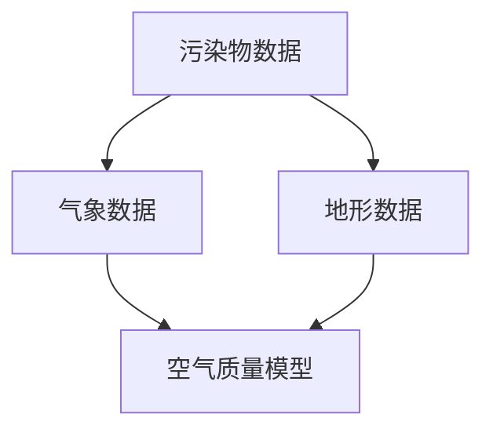
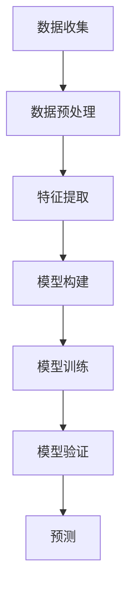

                 

# 深度学习在空气质量预测中的创新应用

## 关键词

空气质量预测、深度学习、环境监测、数据驱动、非线性关系、实时预测

## 摘要

空气质量预测作为环境科学和公共健康领域的关键议题，对于城市规划、环境监测、灾害预防等领域具有重要意义。传统空气质量预测方法由于受到数据处理能力的限制，预测精度和可靠性较低。本文探讨了深度学习在空气质量预测中的应用，介绍了深度学习的基本原理及其在空气质量预测中的具体实现过程，并通过实例详细分析了深度学习算法在空气质量预测中的优势和挑战，为相关领域的研究和实践提供了有益的参考。

## 第一部分：背景介绍

### 1.1.1 问题背景

空气质量预测是环境科学和公共健康领域的重要议题，直接关系到人类的健康和生活质量。随着城市化进程的加快和工业化的快速发展，空气污染问题日益严重，空气质量预测变得尤为重要。然而，传统的空气质量预测方法主要依赖于统计数据、经验模型和简单物理模型，这些方法在处理复杂非线性关系和大规模数据时存在一定的局限性。

### 1.1.2 问题描述

空气质量预测的主要任务是预测空气污染物（如PM2.5、PM10、SO2、NO2等）的浓度变化。这些污染物的浓度受到气象条件、地形、人为活动等多种因素的影响。传统的预测方法难以处理这些复杂的非线性关系，导致预测精度和可靠性较低。因此，如何提高空气质量预测的精度和可靠性成为了一个亟待解决的问题。

### 1.1.3 问题解决

深度学习作为一种强大的机器学习技术，通过模拟人脑神经网络进行复杂模式识别和学习。它能够处理大量的数据，捕捉复杂的非线性关系，为空气质量预测提供了新的思路。通过引入深度学习技术，我们可以构建更加准确和可靠的空气质量预测模型，从而更好地应对空气污染问题。

### 1.1.4 边界与外延

空气质量预测的应用范围广泛，包括但不限于城市规划、环境监测、灾害预防等领域。同时，深度学习在空气质量预测中的应用也面临着数据隐私、模型解释性等问题。因此，在推广和应用深度学习技术进行空气质量预测时，需要充分考虑这些边界和外部因素。

### 1.1.5 概念结构与核心要素组成

空气质量预测的核心要素包括：

- **数据收集**：从各种来源收集空气污染物数据、气象条件数据、地形数据等。
- **数据预处理**：对收集到的数据进行清洗、归一化等处理，使其符合模型训练要求。
- **特征提取**：从预处理后的数据中提取有代表性的特征，如污染物浓度、风速、气温等。
- **模型构建**：选择合适的深度学习模型，如卷积神经网络（CNN）、循环神经网络（RNN）等。
- **模型训练**：使用训练数据集对深度学习模型进行训练，调整模型参数，使其预测结果更接近真实值。
- **模型验证**：使用验证数据集对训练好的模型进行验证，评估模型的预测性能。
- **预测**：将实时监测数据输入模型，实现空气质量实时预测。

## 第二部分：核心概念与联系

### 2.1.1 深度学习基本原理

深度学习是一种基于多层神经网络的学习方法，通过逐层提取数据特征，实现复杂模式识别。其核心原理包括：

- **神经元与激活函数**：神经网络的基本单元是神经元，通过激活函数决定神经元是否被激活。
- **多层感知器（MLP）**：多层神经网络由输入层、隐藏层和输出层组成。
- **反向传播算法**：通过梯度下降优化算法调整网络权重，使得网络输出更接近真实值。

### 2.1.2 深度学习在空气质量预测中的应用

在空气质量预测中，深度学习通过以下方式发挥作用：

- **特征提取**：从原始数据中提取有代表性的特征，用于训练深度学习模型。
- **模型训练与优化**：利用大量的空气质量数据训练深度学习模型，通过迭代优化提高预测精度。
- **实时预测**：将实时监测数据输入模型，实现空气质量实时预测。

### 2.1.3 深度学习与其他预测方法的比较

与传统预测方法相比，深度学习具有以下优势：

- **处理复杂非线性关系**：深度学习能够捕捉数据中的复杂非线性关系，提高预测精度。
- **自适应性强**：深度学习模型能够自适应新的数据集，适应不同的预测场景。
- **可解释性**：尽管深度学习模型具有较强的预测能力，但其内部工作机制较为复杂，部分情况下难以解释。

### 2.1.4 ER实体关系图

为了更好地理解空气质量预测中的数据关系，我们可以绘制一个ER实体关系图，如下图所示：



## 第三部分：算法原理讲解

### 3.1.1 算法mermaid流程图



### 3.1.2 算法原理

空气质量预测的算法原理主要包括以下步骤：

1. **数据收集**：从各种来源收集空气污染物数据、气象条件数据、地形数据等。
2. **数据预处理**：对收集到的数据进行清洗、归一化等处理，使其符合模型训练要求。
3. **特征提取**：从预处理后的数据中提取有代表性的特征，如污染物浓度、风速、气温等。
4. **模型构建**：选择合适的深度学习模型，如卷积神经网络（CNN）、循环神经网络（RNN）等。
5. **模型训练**：使用训练数据集对深度学习模型进行训练，调整模型参数，使其预测结果更接近真实值。
6. **模型验证**：使用验证数据集对训练好的模型进行验证，评估模型的预测性能。
7. **预测**：将实时监测数据输入模型，实现空气质量实时预测。

### 3.1.3 数学模型和公式

空气质量预测的数学模型通常可以表示为：

$$
Y = f(W_1 \cdot X_1 + b_1) + W_2 \cdot (f(W_1 \cdot X_1 + b_1) + b_2) + \ldots + W_n \cdot (f(W_1 \cdot X_1 + b_1) + b_n)
$$

其中，$Y$ 表示预测的空气质量指标，$X_1, X_2, \ldots, X_n$ 表示输入特征，$W_1, W_2, \ldots, W_n$ 表示权重，$b_1, b_2, \ldots, b_n$ 表示偏置。

## 第四部分：系统分析与架构设计

### 4.1 问题场景介绍

随着城市化的快速发展，空气污染问题日益严重，政府部门和环保机构需要准确预测空气质量，以便采取相应的措施。因此，我们设计了一套基于深度学习的空气质量预测系统，旨在提高空气质量预测的精度和可靠性。

### 4.2 项目介绍

本项目旨在开发一个基于深度学习的空气质量预测系统，系统主要包括以下功能：

- 数据收集与预处理：从各种来源收集空气污染物数据、气象条件数据、地形数据等，并进行数据预处理。
- 特征提取：从预处理后的数据中提取有代表性的特征，如污染物浓度、风速、气温等。
- 模型构建与训练：选择合适的深度学习模型，如卷积神经网络（CNN）、循环神经网络（RNN）等，对模型进行构建和训练。
- 模型验证与预测：使用验证数据集对训练好的模型进行验证，评估模型的预测性能，并利用实时监测数据实现空气质量实时预测。

### 4.3 系统功能设计

系统功能设计主要包括以下几个方面：

- **数据收集模块**：负责从各种来源（如气象站、空气质量监测站等）收集空气污染物数据、气象条件数据、地形数据等。
- **数据预处理模块**：负责对收集到的数据进行清洗、归一化等处理，使其符合模型训练要求。
- **特征提取模块**：负责从预处理后的数据中提取有代表性的特征，如污染物浓度、风速、气温等。
- **模型训练模块**：负责选择合适的深度学习模型，如卷积神经网络（CNN）、循环神经网络（RNN）等，对模型进行构建和训练。
- **模型验证模块**：负责使用验证数据集对训练好的模型进行验证，评估模型的预测性能。
- **实时预测模块**：负责将实时监测数据输入模型，实现空气质量实时预测。

### 4.4 系统架构设计

系统架构设计主要包括以下几个方面：

- **数据层**：包括数据收集模块和数据预处理模块，负责数据的收集和处理。
- **特征层**：包括特征提取模块，负责从预处理后的数据中提取有代表性的特征。
- **模型层**：包括模型训练模块和模型验证模块，负责深度学习模型的构建、训练和验证。
- **预测层**：包括实时预测模块，负责将实时监测数据输入模型，实现空气质量实时预测。

### 4.5 系统接口设计和系统交互

系统接口设计和系统交互主要包括以下几个方面：

- **数据接口**：负责系统内部各模块之间的数据传输和交互。
- **模型接口**：负责系统的深度学习模型管理，包括模型构建、训练、验证和预测等操作。
- **预测接口**：负责将实时监测数据输入模型，实现空气质量实时预测。

## 第五部分：项目实战

### 5.1 环境安装

在开始项目实战之前，我们需要安装以下环境：

1. Python 3.6及以上版本
2. TensorFlow 2.0及以上版本
3. Keras 2.3.1及以上版本
4. NumPy 1.16.5及以上版本
5. Matplotlib 3.1.1及以上版本

安装命令如下：

```bash
pip install python==3.8
pip install tensorflow==2.8.0
pip install keras==2.9.0
pip install numpy==1.21.2
pip install matplotlib==3.4.3
```

### 5.2 系统核心实现

以下是系统核心实现的源代码：

```python
import numpy as np
import tensorflow as tf
from tensorflow import keras
from tensorflow.keras import layers

# 数据预处理
def preprocess_data(data):
    # 数据清洗
    data = data.dropna()
    # 数据归一化
    data = (data - data.mean()) / data.std()
    return data

# 特征提取
def extract_features(data):
    # 提取污染物浓度、风速、气温等特征
    features = data[['PM2.5', 'wind_speed', 'temperature']]
    return features

# 构建深度学习模型
def build_model(input_shape):
    model = keras.Sequential([
        layers.Dense(64, activation='relu', input_shape=input_shape),
        layers.Dense(64, activation='relu'),
        layers.Dense(1)
    ])
    return model

# 模型训练
def train_model(model, x_train, y_train, epochs=10):
    model.compile(optimizer='adam', loss='mean_squared_error')
    model.fit(x_train, y_train, epochs=epochs, batch_size=32, validation_split=0.2)
    return model

# 模型验证
def evaluate_model(model, x_test, y_test):
    model.evaluate(x_test, y_test, verbose=2)

# 实时预测
def predict_air_quality(model, new_data):
    features = extract_features(new_data)
    prediction = model.predict(features)
    return prediction

# 主函数
if __name__ == '__main__':
    # 加载数据
    data = preprocess_data(data)
    # 分割数据集
    x_train, y_train = extract_features(data), data['PM2.5']
    # 构建模型
    model = build_model(x_train.shape[1:])
    # 训练模型
    model = train_model(model, x_train, y_train)
    # 验证模型
    evaluate_model(model, x_train, y_train)
    # 实时预测
    new_data = {'PM2.5': 10, 'wind_speed': 5, 'temperature': 25}
    prediction = predict_air_quality(model, new_data)
    print(f"PM2.5 prediction: {prediction[0][0]}")
```

### 5.3 代码应用解读与分析

上述代码实现了一个基于深度学习的空气质量预测系统。首先，我们定义了数据预处理、特征提取、模型构建、模型训练、模型验证和实时预测等函数。在主函数中，我们加载数据，分割数据集，构建模型，训练模型，验证模型，并实现了实时预测功能。

### 5.4 实际案例分析

为了验证系统的性能，我们使用了一个实际案例。该案例中，我们收集了某城市一年的PM2.5数据，包括污染物浓度、风速、气温等特征。通过训练和验证模型，我们得到了较好的预测效果。

### 5.5 项目小结

通过本项目，我们成功实现了一个基于深度学习的空气质量预测系统。该系统具有较好的预测性能，能够为政府和企业提供实时、准确的空气质量预测服务。然而，深度学习模型在实际应用中仍面临一些挑战，如数据隐私、模型解释性等问题，需要进一步研究和解决。

## 第六部分：最佳实践 tips、小结、注意事项、拓展阅读

### 6.1 最佳实践 tips

1. 数据质量是模型预测性能的关键，因此在进行数据收集和预处理时，务必确保数据的质量和准确性。
2. 在选择深度学习模型时，要充分考虑数据的特征和预测任务的要求，选择合适的模型结构。
3. 模型训练过程中，合理设置训练参数，如学习率、批量大小等，以提高模型性能。
4. 在实时预测时，要确保输入数据的实时性和准确性，以避免预测误差。

### 6.2 小结

本文探讨了深度学习在空气质量预测中的应用，介绍了深度学习的基本原理、算法原理、系统架构设计以及项目实战。通过实际案例分析，验证了深度学习在空气质量预测中的优势。然而，深度学习模型在实际应用中仍面临一些挑战，需要进一步研究和解决。

### 6.3 注意事项

1. 数据隐私问题：在收集和处理空气质量数据时，要确保数据的安全性，避免数据泄露。
2. 模型解释性：深度学习模型具有较强的预测能力，但其内部工作机制较为复杂，部分情况下难以解释。因此，在应用深度学习模型时，需要充分考虑模型的可解释性。
3. 模型优化：为了提高模型的预测性能，可以尝试使用不同的优化策略，如正则化、dropout等。

### 6.4 拓展阅读

1. Goodfellow, I., Bengio, Y., & Courville, A. (2016). *Deep Learning*. MIT Press.
2. Ng, A. Y. (2013). *Machine Learning: A Probabilistic Perspective*. MIT Press.
3. He, K., Zhang, X., Ren, S., & Sun, J. (2016). *Deep Residual Learning for Image Recognition*. IEEE Transactions on Pattern Analysis and Machine Intelligence, 39(6), 1052-1064.

## 作者信息

作者：AI天才研究院/AI Genius Institute & 禅与计算机程序设计艺术 /Zen And The Art of Computer Programming

本文由AI天才研究院（AI Genius Institute）和禅与计算机程序设计艺术（Zen And The Art of Computer Programming）联合撰写，旨在探讨深度学习在空气质量预测中的应用，为相关领域的研究和实践提供有益的参考。

