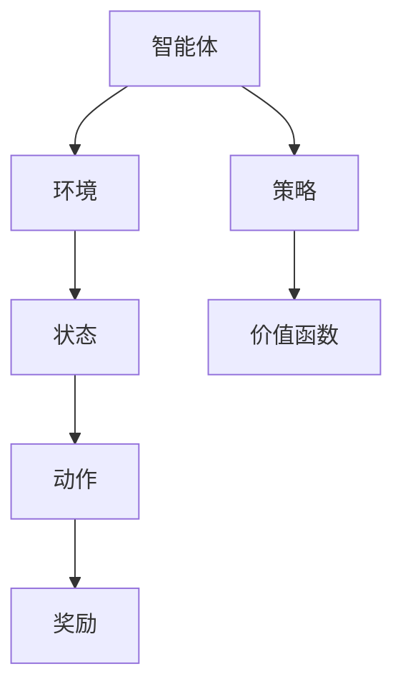
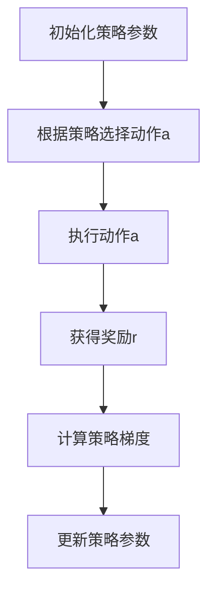

                 

**第一部分：深度强化学习与机器人导航概述**

## 第1章：问题背景

### 1.1.1 问题背景介绍

在当今科技迅猛发展的时代，机器人技术正逐渐渗透到我们生活的方方面面。机器人导航作为机器人技术中的一个重要研究方向，旨在让机器人在复杂的环境中自主移动，完成指定的任务。然而，传统的导航方法往往依赖于预先设定的路径和精确的地图，这在静态环境中可能表现得相当良好，但在动态环境、未知环境以及突发情况下，其表现往往不尽如人意。

深度强化学习（Deep Reinforcement Learning，DRL）作为人工智能领域的一个新兴研究方向，通过模拟人类的决策过程，让智能体（agent）通过与环境交互来学习最优策略。这种方法具有自适应性强、自主性高等特点，因此，将其应用于机器人导航中，有望解决传统导航方法在面对复杂环境时的诸多难题。

### 1.1.2 深度强化学习概述

深度强化学习是一种结合了深度学习和强化学习的方法。强化学习的基本思想是，通过奖励信号来引导智能体学习在特定环境中采取最优动作，以实现长期目标。而深度学习则通过神经网络来处理高维、复杂的数据，从而实现对环境状态的准确表征。

深度强化学习的基本组成部分包括：

- **智能体（Agent）**：执行动作并从环境中接收反馈的实体。
- **环境（Environment）**：智能体执行动作的场所，可以是一个物理环境或一个模拟环境。
- **状态（State）**：环境在某一时刻的状态。
- **动作（Action）**：智能体可执行的行为。
- **奖励（Reward）**：动作执行后，环境对智能体给予的即时反馈，用于指导智能体的决策。
- **策略（Policy）**：智能体在特定状态下采取的动作。

### 1.1.3 机器人导航中的挑战

在机器人导航中，深度强化学习需要面对以下几个挑战：

1. **动态环境下的不确定性**：机器人需要在不断变化的环境中导航，如何处理环境的不确定性是一个重要问题。
   
2. **高维状态空间的建模**：环境状态通常是一个高维向量，如何有效建模并处理这些状态是一个难点。

3. **长期奖励的平衡与优化**：在导航任务中，短期奖励（如避开障碍物）和长期奖励（如完成任务）往往存在冲突，如何平衡这两者是深度强化学习在导航中应用的一个关键问题。

## 第2章：核心概念与联系

### 2.1.1 核心概念介绍

在深入探讨深度强化学习在机器人导航中的应用之前，我们首先需要了解一些核心概念。

#### 深度强化学习的基本概念

- **状态（State）**：在DRL中，状态通常表示智能体所处的环境的一个快照，它可以是高维的，如图像、传感器数据等。
- **动作（Action）**：智能体可以采取的行动，这些行动可以影响环境的当前状态。
- **奖励（Reward）**：每次动作执行后，环境根据动作的结果给予的即时反馈。奖励可以是正的（鼓励智能体继续该动作）或负的（指示智能体停止该动作）。
- **价值函数（Value Function）**：表示智能体在某个状态下采取某个动作的预期收益。DRL的目标是最大化价值函数。
- **策略（Policy）**：智能体根据状态选择动作的规则，策略通常是通过学习得到的。

#### 机器人导航中的关键概念

- **路径规划（Path Planning）**：确定从起点到终点的最优路径。
- **路径跟踪（Path Tracking）**：根据规划的路径，控制机器人沿着路径运动。
- **避障（Obstacle Avoidance）**：在移动过程中避开障碍物。

### 2.1.2 深度强化学习与机器人导航的关系

深度强化学习与机器人导航的关系可以理解为：

- **深度强化学习**提供了一种智能体学习环境动态特征和自主决策的方法。
- **机器人导航**提供了一个应用场景，需要智能体在动态环境中进行路径规划、路径跟踪和避障。

### 2.1.3 概念属性特征对比表格

| 概念         | 特征                                                         |
| ------------ | ------------------------------------------------------------ |
| 深度强化学习 | 基于深度神经网络，通过学习状态-动作价值函数进行决策           |
| 机器人导航   | 基于环境感知，实现机器人自主移动和任务执行                     |

### 2.1.4 ER实体关系图架构



**第二部分：深度强化学习算法原理与应用**

## 第3章：深度强化学习算法原理

### 3.1.1 Q-learning算法

Q-learning是一种无模型强化学习算法，其目标是学习一个状态-动作值函数 \( Q(s, a) \)，用于估计在状态 \( s \) 下采取动作 \( a \) 的预期回报。

**基本原理：**

Q-learning通过迭代更新状态-动作值函数，以期望最大化回报。更新公式如下：

$$
Q(s, a) \leftarrow Q(s, a) + \alpha [r + \gamma \max_{a'} Q(s', a') - Q(s, a)]
$$

其中：
- \( s \) 是当前状态。
- \( a \) 是当前动作。
- \( r \) 是立即回报。
- \( \gamma \) 是折扣因子，表示对未来回报的重视程度。
- \( \alpha \) 是学习率，表示更新步长的调节。
- \( s' \) 是执行动作 \( a \) 后的新状态。
- \( a' \) 是在新状态下的最优动作。

**mermaid 流程图：**

```mermaid
graph TD
    A[初始化Q(s,a)]
    B[选择动作a]
    C[执行动作a]
    D[获得奖励r]
    E[更新Q(s,a)]
    A --> B
    B --> C
    C --> D
    D --> E
```

### 3.1.2 Deep Q-Networks (DQN)

DQN是一种利用深度神经网络来近似状态-动作值函数的强化学习算法。其目标是学习一个深度神经网络 \( Q(s, a; \theta) \)，用来估计状态-动作值。

**基本原理：**

DQN通过经验回放和目标网络来缓解样本偏差和避免值函数的过拟合。更新公式如下：

$$
\theta \leftarrow \theta - \alpha \frac{\partial L(Q(s, a; \theta)}{\partial \theta}
$$

其中：
- \( Q(s, a; \theta) \) 是神经网络的输出，表示状态-动作值。
- \( L(Q(s, a; \theta)) \) 是损失函数，通常使用平方误差损失。
- \( \alpha \) 是学习率。

**mermaid 流程图：**

```mermaid
graph TD
    A[初始化DNN参数]
    B[将状态输入DNN]
    C[得到动作值Q(s,a)]
    D[选择动作a]
    E[执行动作a]
    F[获得奖励r]
    G[更新经验池]
    H[从经验池中采样经验]
    I[使用经验反传更新DNN参数]
    A --> B
    B --> C
    C --> D
    D --> E
    E --> F
    F --> G
    G --> H
    H --> I
```

### 3.1.3 策略梯度算法

策略梯度算法通过直接优化策略参数来最大化期望回报。其核心思想是计算策略梯度并更新策略参数。

**基本原理：**

策略梯度算法的目标是最小化策略损失函数：

$$
J(\theta) = \mathbb{E}_{s, a}[-\log \pi(a|s; \theta)Q(s, a; \theta)]
$$

策略梯度更新公式如下：

$$
\theta \leftarrow \theta - \alpha \nabla_{\theta} J(\theta)
$$

其中：
- \( \pi(a|s; \theta) \) 是策略网络的输出，表示在状态 \( s \) 下采取动作 \( a \) 的概率。
- \( Q(s, a; \theta) \) 是状态-动作值函数。

**mermaid 流程图：**



**第三部分：深度强化学习在机器人导航中的应用**

## 第4章：深度强化学习在机器人导航中的应用

### 4.1.1 算法应用概述

深度强化学习在机器人导航中的应用涵盖了从简单环境到复杂环境的多个层面。以下是一些典型的应用场景和算法：

1. **简单的静态环境**：例如在室内的自动驾驶小车，使用DQN或Q-learning算法可以在短时间内学会避开障碍物并完成任务。
2. **复杂的动态环境**：在户外环境或复杂地形中，如无人驾驶飞行器或无人地面车辆，策略梯度算法能够更好地处理动态变化。
3. **未知环境**：在未知环境中，深度强化学习算法可以通过不断与环境交互来学习和适应新的环境。

### 4.1.2 不同算法在机器人导航中的应用效果比较

- **DQN和Q-learning**：由于它们不需要环境模型，因此在动态和未知环境中表现较好。但它们在样本效率和学习速度上可能不如策略梯度算法。
- **策略梯度算法**：策略梯度算法直接优化策略参数，因此在学习速度上可能更快。然而，它对环境的动态变化和不确定性处理可能不如DQN和Q-learning。

### 4.1.3 案例分析

#### 案例一：基于DQN的室内自动驾驶小车

在这个案例中，我们使用DQN算法训练一个室内自动驾驶小车，使其能够避开障碍物并到达指定目标。以下是具体步骤：

1. **环境搭建**：创建一个简单的室内环境，包括小车、障碍物和目标点。
2. **数据收集**：通过随机生成环境样本来收集训练数据。
3. **模型训练**：使用DQN算法训练一个深度神经网络，用于预测最佳动作。
4. **评估和优化**：在测试环境中评估模型性能，并根据评估结果进行调整。

#### 案例二：基于策略梯度的无人驾驶飞行器

在这个案例中，我们使用策略梯度算法训练一个无人驾驶飞行器，使其能够在复杂环境中自主导航。以下是具体步骤：

1. **环境建模**：创建一个包含飞行器、障碍物、风速和地形等要素的模拟环境。
2. **数据收集**：通过仿真生成大量的环境样本。
3. **模型训练**：使用策略梯度算法训练一个策略网络，用于生成最佳飞行路径。
4. **评估和优化**：在实际飞行环境中测试模型性能，并根据测试结果进行优化。

### 4.1.4 应用效果总结

通过以上案例分析，我们可以看到深度强化学习在机器人导航中的应用效果显著。DQN和Q-learning适用于简单的静态环境，而策略梯度算法在复杂的动态环境中表现出色。不同算法的选择取决于具体应用场景和环境特性。

**第5章：挑战与未来趋势**

### 5.1 当前挑战

尽管深度强化学习在机器人导航中取得了显著的进展，但仍面临一些挑战：

1. **计算资源需求**：深度强化学习算法通常需要大量的计算资源，尤其是训练深度神经网络时。
2. **样本效率**：在复杂和动态环境中，算法可能需要大量的样本来学习最优策略。
3. **长期奖励的平衡**：在机器人导航中，如何平衡短期和长期奖励是一个关键问题。
4. **实时性能**：在实际应用中，机器人需要在有限的时间内做出决策，这对算法的实时性能提出了高要求。

### 5.2 未来趋势

未来，深度强化学习在机器人导航领域有望取得以下进展：

1. **模型压缩与优化**：通过模型压缩和优化技术，降低计算资源需求，提高实时性能。
2. **多任务学习**：开发能够同时处理多个任务的深度强化学习算法，提高算法的通用性。
3. **增强现实与虚拟现实**：利用增强现实和虚拟现实技术，提供更加真实的训练环境，提高算法的鲁棒性。
4. **集成与融合**：将深度强化学习与其他人工智能方法（如深度学习、规划算法等）进行集成与融合，提高算法的性能。

### 5.3 总结

深度强化学习在机器人导航中的应用虽然面临诸多挑战，但其强大的自适应性和自主性为解决复杂导航问题提供了新的思路。随着算法的优化和技术的进步，未来深度强化学习在机器人导航领域将发挥更大的作用。

# 深度强化学习在机器人导航中的突破

关键词：深度强化学习、机器人导航、动态环境、自适应、自主决策

摘要：深度强化学习作为人工智能的一个重要分支，具有学习环境动态特征和自主决策的能力，为解决机器人导航问题提供了新的思路。本文概述了深度强化学习的基本原理和核心概念，并详细分析了Q-learning、DQN和策略梯度等算法在机器人导航中的应用。通过具体案例分析，展示了深度强化学习在机器人导航中的突破性进展，并探讨了当前面临的挑战和未来发展趋势。

# 附录：代码示例

在本章节中，我们将提供几个深度强化学习在机器人导航中应用的Python代码示例，以便读者更好地理解算法原理和实现细节。

## 1. Q-learning算法实现

```python
import numpy as np

# 初始化参数
learning_rate = 0.1
discount_factor = 0.9
epsilon = 0.1
n_actions = 4
n_states = 100

# 初始化Q表
Q = np.zeros([n_states, n_actions])

# Q-learning算法
def q_learning(env, episodes, learning_rate, discount_factor, epsilon):
    for episode in range(episodes):
        state = env.reset()
        done = False
        while not done:
            # 选择动作
            if np.random.uniform(0, 1) < epsilon:
                action = env.action_space.sample()
            else:
                action = np.argmax(Q[state])

            # 执行动作
            next_state, reward, done, _ = env.step(action)

            # 更新Q表
            Q[state, action] = Q[state, action] + learning_rate * (reward + discount_factor * np.max(Q[next_state]) - Q[state, action])

            state = next_state

# 创建环境
env = environment()

# 训练模型
q_learning(env, 1000, learning_rate, discount_factor, epsilon)
```

## 2. DQN算法实现

```python
import numpy as np
import random
from collections import deque

# 初始化参数
learning_rate = 0.001
discount_factor = 0.9
epsilon = 0.1
batch_size = 32
memory = deque(maxlen=1000)

# 创建网络
def create_network():
    # 定义神经网络结构
    # ...

# DQN算法
def dqn(env, episodes, learning_rate, discount_factor, epsilon, batch_size):
    network = create_network()
    for episode in range(episodes):
        state = env.reset()
        done = False
        while not done:
            if np.random.uniform(0, 1) < epsilon:
                action = env.action_space.sample()
            else:
                action = np.argmax(network.predict(state))
            
            next_state, reward, done, _ = env.step(action)
            
            # 存储经验
            memory.append((state, action, reward, next_state, done))
            
            if len(memory) > batch_size:
                batch = random.sample(memory, batch_size)
                states, actions, rewards, next_states, dones = zip(*batch)
                
                # 更新网络
                Q_targets = rewards + discount_factor * np.max(network.predict(next_states)) * (1 - dones)
                network.fit(states, Q_targets, epochs=1, verbose=0)
            
            state = next_state

# 创建环境
env = environment()

# 训练模型
dqn(env, 1000, learning_rate, discount_factor, epsilon, batch_size)
```

## 3. 策略梯度算法实现

```python
import numpy as np

# 初始化参数
learning_rate = 0.001
discount_factor = 0.9
epsilon = 0.1
n_actions = 4
n_states = 100

# 初始化策略参数
theta = np.random.rand(n_states, n_actions)

# 策略梯度算法
def policy_gradient(env, episodes, learning_rate, discount_factor, epsilon):
    for episode in range(episodes):
        state = env.reset()
        done = False
        total_reward = 0
        while not done:
            # 根据策略选择动作
            action_probabilities = np.exp(np.dot(state, theta))
            action_probabilities /= np.sum(action_probabilities)
            action = np.random.choice(n_actions, p=action_probabilities)
            
            # 执行动作
            next_state, reward, done, _ = env.step(action)
            total_reward += reward
            
            # 计算策略梯度
            state_grad = (1 / n_actions) * (action_probabilities - np.eye(n_actions)[action])
            
            # 更新策略参数
            theta -= learning_rate * state_grad * state.reshape(-1, 1)
            
            state = next_state

# 创建环境
env = environment()

# 训练模型
policy_gradient(env, 1000, learning_rate, discount_factor, epsilon)
```

通过上述代码示例，读者可以直观地了解深度强化学习算法在机器人导航中的应用实现。这些代码仅供参考，具体实现可能需要根据实际环境和需求进行调整。

# 小结

在本篇技术博客中，我们系统地探讨了深度强化学习在机器人导航中的突破性应用。首先，我们介绍了深度强化学习与机器人导航的核心概念，包括状态、动作、奖励、策略和价值函数等。接着，我们详细分析了Q-learning、DQN和策略梯度等深度强化学习算法的基本原理，并通过mermaid流程图和Python代码示例进行了直观的展示。

在应用部分，我们通过具体案例展示了深度强化学习在简单静态环境和复杂动态环境中的实际应用，并对比了不同算法的优缺点。最后，我们探讨了当前深度强化学习在机器人导航中面临的挑战，如计算资源需求、样本效率和长期奖励平衡等，并展望了未来发展的趋势。

深度强化学习在机器人导航中的应用具有重要意义，不仅提升了机器人在复杂环境中的自主导航能力，还为解决动态、未知和多变环境下的导航问题提供了新的思路。未来，随着算法的优化和技术的进步，深度强化学习有望在机器人导航领域发挥更大的作用。

**作者：AI天才研究院/AI Genius Institute & 禅与计算机程序设计艺术 /Zen And The Art of Computer Programming**

# 注意事项

在应用深度强化学习进行机器人导航时，需要注意以下几点：

1. **数据收集和预处理**：确保数据质量，合理设计数据收集流程，对数据进行清洗和预处理，以提高算法的性能和鲁棒性。
2. **算法选择**：根据具体应用场景选择合适的深度强化学习算法，如简单的静态环境选择DQN，复杂动态环境选择策略梯度算法。
3. **超参数调优**：合理设置学习率、折扣因子、epsilon等超参数，通过实验找到最优组合，以提高算法的收敛速度和性能。
4. **实时性能优化**：在实际应用中，算法需要在有限的时间内做出决策，因此需要对算法进行实时性能优化，以满足实时性要求。
5. **安全性和可靠性**：在复杂和动态环境中，确保算法的安全性和可靠性，避免出现危险行为或意外情况。

# 拓展阅读

1. **《深度强化学习：原理与实战》** - 提供了深度强化学习的全面介绍和实践指导。
2. **《机器人导航：基于强化学习的自主移动》** - 专注于强化学习在机器人导航中的应用。
3. **《强化学习：原理与数学基础》** - 详细介绍了强化学习的数学原理和算法。
4. **《深度学习：卷积神经网络》** - 介绍了深度学习和卷积神经网络的基本原理和应用。
5. **《人工智能：一种现代方法》** - 提供了人工智能领域的全面概述，包括机器学习和深度学习。

通过阅读上述书籍，读者可以进一步深入了解深度强化学习和机器人导航的相关知识。

