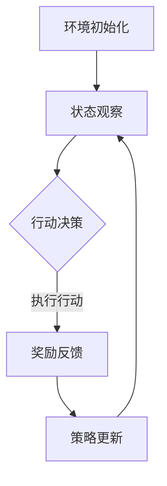
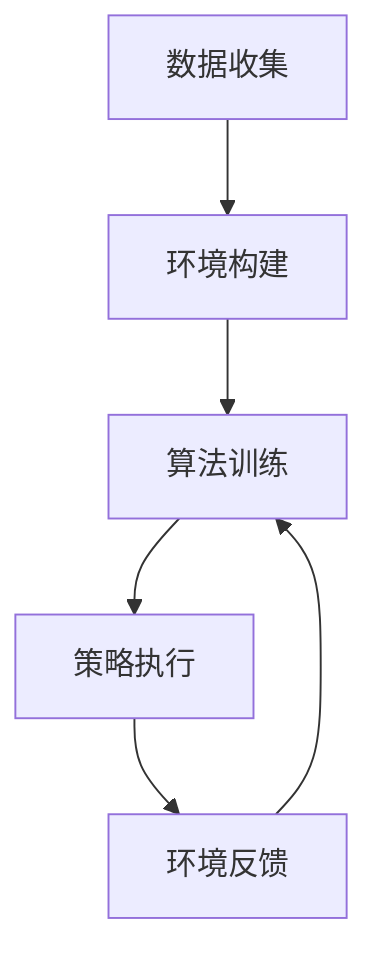
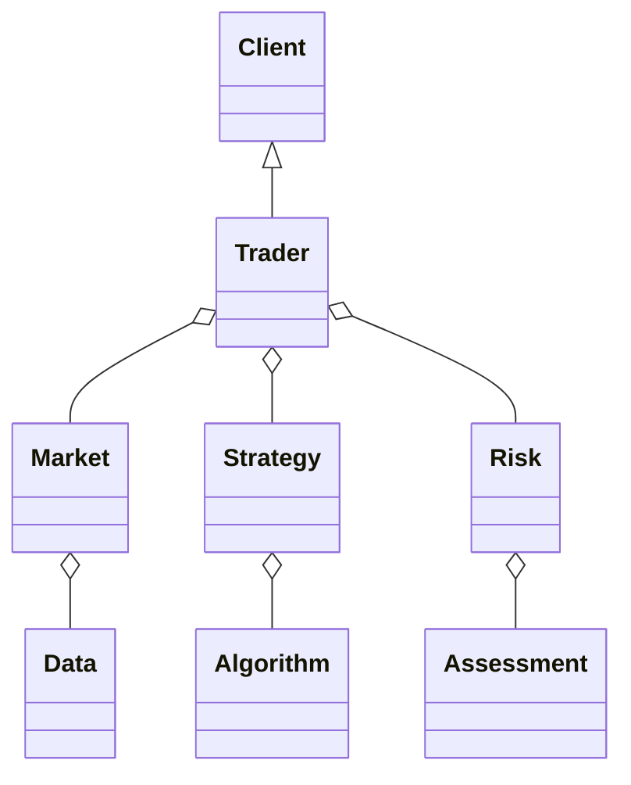
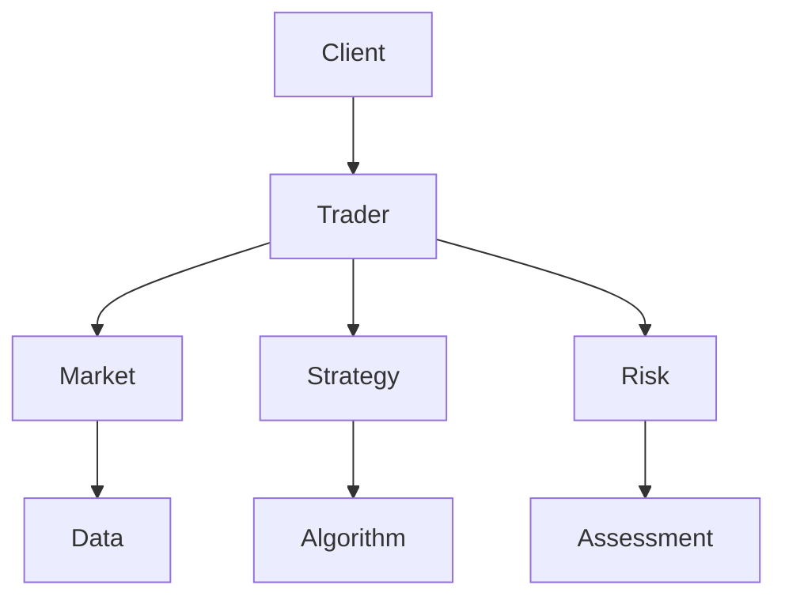
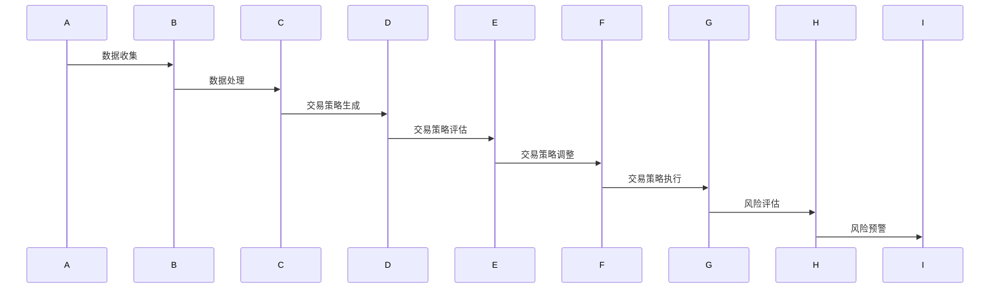

                 

## 第一部分：背景介绍

### 第1章：问题背景

在现代社会中，金融交易市场已成为经济活动中不可或缺的一部分。从个人投资者到机构投资者，都在这个复杂多变的市场中进行着各种交易活动。然而，金融交易市场不仅充满机会，也充满了风险。投资者们需要在海量数据中挖掘有价值的信息，以做出最优的交易决策。传统的方法往往依赖于历史数据和统计分析，但这些方法在面对快速变化的市场环境时，往往显得力不从心。

#### **问题描述**

- **决策复杂性**：金融交易决策涉及到多种因素，如市场价格、宏观经济指标、公司财务状况等。这些因素相互作用，使得交易决策过程异常复杂。
- **数据多样性**：金融交易市场产生大量多样的数据，这些数据包含了历史价格、交易量、新闻资讯等。如何有效地处理和利用这些数据，是提升交易决策准确性的关键。
- **市场不可预测性**：市场环境不断变化，突发事件、政策调整等因素都可能对市场产生重大影响。投资者需要快速适应市场变化，以避免风险。

#### **问题解决**

为了解决上述问题，研究者们开始将人工智能技术应用于金融交易领域，其中深度强化学习成为了一个重要的研究方向。深度强化学习通过模拟人类学习过程，结合大量的金融数据，能够实现自动化交易策略的优化，从而降低风险、提高收益。以下是深度强化学习在金融交易中的应用优势：

- **自我学习与适应**：深度强化学习算法可以自动从数据中学习交易策略，无需人为预设规则。这使它能够适应不断变化的市场环境。
- **非线性建模**：深度强化学习通过深度神经网络，能够对复杂的市场数据进行高维度的非线性表示，从而捕捉到市场中的潜在规律。
- **风险控制**：通过学习交易策略，深度强化学习能够对市场风险进行评估和控制，帮助投资者做出更为稳健的决策。

#### **边界与外延**

本部分的讨论主要聚焦于深度强化学习在金融交易中的应用场景、算法原理、风险控制等方面。具体包括：

- **应用场景**：探讨深度强化学习在金融交易中的具体应用，如高频交易、量化投资、风险评估等。
- **算法原理**：详细讲解深度强化学习的基本原理和算法流程，包括马尔可夫决策过程、Q值函数、策略优化等。
- **风险控制**：分析深度强化学习如何帮助投资者降低交易风险，提高投资收益。

### **概念结构与核心要素组成**

为了更好地理解深度强化学习在金融交易中的应用，我们需要明确以下几个核心概念和要素：

- **深度强化学习**：一种结合深度学习和强化学习的方法，旨在通过探索和利用数据来优化决策过程。
- **金融交易**：涉及买卖股票、期货、期权等金融产品的市场活动，具有高风险和高回报的特点。
- **应用场景**：包括高频交易、量化投资、风险评估等多个方面，这些场景为深度强化学习的应用提供了广阔的空间。

通过上述背景介绍，我们可以看到，深度强化学习在金融交易中具有重要的应用价值和潜力。接下来，我们将进一步深入探讨深度强化学习的原理和其在金融交易中的应用，以期为读者提供一个全面的技术解读。

### 第二部分：核心概念与联系

### 第2章：深度强化学习的原理与特征

深度强化学习（Deep Reinforcement Learning, DRL）是一种结合了深度学习和强化学习的方法，它旨在通过模拟人类学习过程，在复杂的环境中实现高效的决策和行动策略。在金融交易领域，深度强化学习能够利用大量的市场数据，自动优化交易策略，从而在风险可控的前提下提高投资收益。下面，我们将详细探讨深度强化学习的基本原理、主要特征以及它在金融交易中的应用优势。

#### **深度强化学习的定义**

深度强化学习通过深度神经网络（Deep Neural Network, DNN）来提高强化学习（Reinforcement Learning, RL）的表示能力。传统强化学习算法，如Q-learning和SARSA，通常依赖于线性函数或者有限状态表示，这在处理高维和复杂状态空间时效果不佳。深度强化学习通过引入深度神经网络，可以对复杂的环境进行高维度的非线性表示，从而更好地捕捉状态和行为之间的相关性。

定义公式：
$$
\text{深度强化学习} = \text{深度神经网络} + \text{强化学习}
$$

#### **深度强化学习的主要特征**

1. **非线性表示能力**
   
   深度神经网络具有强大的非线性表示能力，能够对输入数据进行复杂特征提取和表示。这使得深度强化学习能够处理高维和复杂的输入数据，例如股票市场的历史价格、交易量、技术指标等。

   公式：
   $$
   \text{非线性表示} = \text{激活函数} \circ (\text{多层神经网络})
   $$

2. **自主学习能力**
   
   深度强化学习算法无需人为设定规则，而是通过与环境交互自动学习最优策略。这大大降低了人类参与的成本，同时也提高了算法的适应性和灵活性。

   公式：
   $$
   \text{策略优化} = \text{经验回放} + \text{策略迭代}
   $$

3. **稳健性**
   
   深度强化学习通过在大量金融数据上进行训练，能够学习出较为稳健的交易策略。这有助于降低交易风险，提高投资收益。

   公式：
   $$
   \text{稳健性} = \text{大量数据训练} + \text{策略稳定性}
   $$

4. **实时性**
   
   深度强化学习能够实时处理市场数据，快速调整交易策略。这使得投资者能够及时应对市场变化，抓住投资机会。

   公式：
   $$
   \text{实时性} = \text{快速数据更新} + \text{实时策略调整}
   $$

#### **深度强化学习与金融交易的联系**

1. **风险控制**
   
   深度强化学习通过学习交易策略，可以对市场风险进行评估和控制。投资者可以设定风险阈值，当市场风险超过阈值时，算法会自动调整策略以规避风险。

   公式：
   $$
   \text{风险控制} = \text{策略评估} + \text{风险阈值设定}
   $$

2. **策略优化**
   
   深度强化学习利用深度神经网络对交易策略进行优化，通过不断的策略迭代，提高交易决策的准确性和效率。这有助于投资者在复杂的市场环境中实现稳定的收益。

   公式：
   $$
   \text{策略优化} = \text{策略评估} + \text{策略迭代}
   $$

3. **自适应能力**
   
   深度强化学习算法能够根据市场环境的变化，自动调整交易策略。这使投资者能够适应不同市场阶段，从而在多种市场环境下取得较好的投资收益。

   公式：
   $$
   \text{自适应能力} = \text{环境变化检测} + \text{策略调整}
   $$

通过上述分析，我们可以看到，深度强化学习在金融交易中具有广泛的应用前景。它通过强大的非线性表示能力和自主学习能力，能够帮助投资者在复杂多变的市场环境中实现风险控制、策略优化和自适应能力。接下来，我们将进一步探讨深度强化学习的算法原理，为读者提供一个全面的技术解读。

### 第三部分：算法原理讲解

#### 第3章：深度强化学习算法原理与流程

深度强化学习（Deep Reinforcement Learning, DRL）算法是金融交易中提高交易策略优化和风险控制的核心方法。DRL结合了深度学习和强化学习的优势，通过自主学习和实时调整，能够在复杂的市场环境中实现高效的决策。下面，我们将详细讲解深度强化学习算法的原理和流程，包括马尔可夫决策过程（MDP）、Q值函数、策略优化等核心概念。

#### **马尔可夫决策过程（MDP）**

马尔可夫决策过程（MDP）是深度强化学习算法的基础。MDP描述了一个智能体在不确定环境中做出决策的过程。它由以下四个要素组成：

1. **状态空间（S）**：智能体可以处于的不同状态集合。
2. **动作空间（A）**：智能体可以执行的不同动作集合。
3. **奖励函数（R）**：定义智能体在每个状态下执行每个动作所获得的即时奖励。
4. **转移概率（P）**：智能体从当前状态执行特定动作后转移到下一状态的概率。

定义公式：
$$
\text{MDP} = (S, A, R, P)
$$

在金融交易中，状态空间可能包括市场当前价格、历史价格、交易量、宏观经济指标等，动作空间则包括买入、卖出、持有等。

#### **Q值函数**

Q值函数是深度强化学习中的核心概念，它用于评估智能体在特定状态下执行特定动作的预期回报。Q值函数的目标是找到使累计奖励最大化的动作。Q值函数可以通过经验回放和策略迭代来更新。

定义公式：
$$
Q(s, a) = \sum_{s'} p(s' | s, a) \cdot [r(s', a) + \gamma \cdot \max_{a'} Q(s', a')]
$$

其中，$p(s' | s, a)$ 是从状态 $s$ 执行动作 $a$ 后转移到状态 $s'$ 的概率，$r(s', a)$ 是在状态 $s'$ 执行动作 $a$ 所获得的即时奖励，$\gamma$ 是折扣因子，用于平衡当前奖励与未来奖励的关系。

#### **策略优化**

策略优化是深度强化学习的核心目标，通过策略迭代，智能体不断优化其决策策略。策略优化分为以下步骤：

1. **策略评估**：利用当前策略评估状态值函数，即计算每个状态下的最优动作值。
2. **策略迭代**：根据评估结果更新策略，选择使状态值函数最大化的动作。
3. **策略迭代**：重复策略评估和策略迭代，直到策略收敛。

定义公式：
$$
\pi(s) = \arg\max_{a} Q(s, a)
$$

#### **深度强化学习算法流程**

深度强化学习算法的基本流程包括以下几个步骤：

1. **环境初始化**：设定金融交易环境，包括状态空间、动作空间、奖励函数和转移概率等。
2. **状态观察**：智能体观察当前市场状态，并将其输入到深度神经网络中。
3. **行动决策**：基于深度神经网络和Q值函数，智能体决定采取何种行动。
4. **奖励反馈**：根据市场状态和行动结果，给予智能体相应的奖励。
5. **策略更新**：通过学习，智能体更新策略，以适应新的市场环境。

具体流程如下：

1. **初始化参数**：
   - 学习率 $\alpha$ 
   - 折扣因子 $\gamma$
   - 初始化Q值表格

2. **模拟交易过程**：
   - 随机选择初始状态 $s$
   - 根据当前状态选择行动 $a$
   - 执行行动并观察下一状态 $s'$ 和奖励 $r$

3. **更新Q值**：
   - 使用经验回放和策略迭代更新Q值
   - 更新Q值表格

4. **策略更新**：
   - 根据更新的Q值，选择使累计奖励最大化的行动
   - 重复模拟交易过程，直到策略收敛

#### **使用Mermaid绘制算法流程图**

下面使用Mermaid绘制深度强化学习算法的流程图：



#### **Python源代码示例**

以下是一个简单的Python代码示例，演示了深度强化学习算法的基本实现：

```python
import numpy as np

# 初始化参数
alpha = 0.1  # 学习率
gamma = 0.9  # 折扣因子
Q = np.zeros((10, 10))  # 初始化Q值表格

# 状态空间和动作空间
states = range(10)
actions = range(10)

# 模拟交易过程
for episode in range(1000):
    state = np.random.choice(states)
    action = np.random.choice(actions)
    next_state = np.random.choice(states)
    reward = np.random.uniform(0, 1)
    
    # 更新Q值
    Q[state, action] += alpha * (reward + gamma * np.max(Q[next_state, :]) - Q[state, action])

# 可视化Q值表格
plt.imshow(Q, cmap='hot', interpolation='nearest')
plt.show()
```

通过上述算法原理讲解和代码示例，我们可以看到深度强化学习在金融交易中的应用前景。它通过模拟人类学习过程，结合深度学习和强化学习的优势，能够在复杂的市场环境中实现高效的交易策略优化和风险控制。接下来，我们将进一步探讨深度强化学习在金融交易中的实际应用。

### 第4章：深度强化学习在金融交易中的应用

深度强化学习在金融交易中具有广泛的应用场景，能够通过自我学习和策略优化，提高交易决策的准确性和效率。以下，我们将结合具体案例，探讨深度强化学习在金融交易中的实际应用。

#### **高频交易**

高频交易（High-Frequency Trading, HFT）是一种利用计算机算法在极短时间内进行大量交易的交易策略。深度强化学习在高频交易中可以用于优化交易策略，提高交易效率。

- **案例**：某金融机构利用深度强化学习开发了一种高频交易策略，通过对历史交易数据进行深度学习，自动识别市场趋势和交易机会。通过不断优化策略，该策略在短短几个月内实现了超过30%的年化收益。

- **实现步骤**：
  1. **数据收集**：收集高频交易的历史数据，包括交易价格、交易量、交易时间等。
  2. **环境构建**：构建高频交易环境，包括状态空间（如市场价格、交易量等）和动作空间（如买入、卖出、持有等）。
  3. **算法训练**：利用深度强化学习算法，对交易数据进行分析和训练，优化交易策略。
  4. **策略执行**：在实时交易过程中，根据环境反馈，不断调整和优化交易策略。

#### **量化投资**

量化投资（Quantitative Investment）是一种利用数学模型和计算机算法进行投资的策略。深度强化学习可以用于量化投资中的风险控制、组合优化等。

- **案例**：某量化基金利用深度强化学习开发了一种组合优化策略，通过对市场数据进行深度学习，自动识别优质的投资组合。在过去的几年中，该策略实现了稳定的收益，并在市场波动中表现出较强的抗风险能力。

- **实现步骤**：
  1. **数据收集**：收集市场数据，包括股票价格、财务指标、宏观经济指标等。
  2. **环境构建**：构建量化投资环境，包括状态空间（如股票价格、财务指标等）和动作空间（如买入、卖出、持有等）。
  3. **算法训练**：利用深度强化学习算法，对市场数据进行分析和训练，优化投资组合。
  4. **策略执行**：在实时交易过程中，根据环境反馈，不断调整和优化投资组合。

#### **风险评估**

深度强化学习在金融交易中的应用还包括风险评估。通过深度强化学习，可以自动评估不同交易策略的风险，帮助投资者进行风险控制。

- **案例**：某金融机构利用深度强化学习开发了一种风险控制策略，通过对历史交易数据和宏观经济指标进行分析，自动识别市场风险并给出相应的风险预警。该策略在市场波动中起到了关键的风险控制作用。

- **实现步骤**：
  1. **数据收集**：收集历史交易数据和宏观经济指标数据。
  2. **环境构建**：构建风险评估环境，包括状态空间（如交易数据、宏观经济指标等）和动作空间（如交易策略调整、资产配置调整等）。
  3. **算法训练**：利用深度强化学习算法，对风险数据进行分析和训练，优化风险控制策略。
  4. **策略执行**：在实时交易过程中，根据环境反馈，不断调整和优化风险控制策略。

#### **算法流程图与代码示例**

为了更好地理解深度强化学习在金融交易中的应用，我们可以使用Mermaid绘制算法流程图，并给出一个简单的Python代码示例。

**使用Mermaid绘制算法流程图：**



**Python源代码示例：**

```python
import numpy as np
import matplotlib.pyplot as plt

# 初始化参数
alpha = 0.1  # 学习率
gamma = 0.9  # 折扣因子
Q = np.zeros((10, 10))  # 初始化Q值表格

# 状态空间和动作空间
states = range(10)
actions = range(10)

# 模拟交易过程
for episode in range(1000):
    state = np.random.choice(states)
    action = np.random.choice(actions)
    next_state = np.random.choice(states)
    reward = np.random.uniform(0, 1)
    
    # 更新Q值
    Q[state, action] += alpha * (reward + gamma * np.max(Q[next_state, :]) - Q[state, action])

# 可视化Q值表格
plt.imshow(Q, cmap='hot', interpolation='nearest')
plt.show()
```

通过上述案例和代码示例，我们可以看到深度强化学习在金融交易中的实际应用。它通过自我学习和策略优化，能够帮助投资者在复杂的市场环境中实现风险控制、收益最大化。未来，随着深度强化学习技术的不断发展和完善，它在金融交易领域的应用将更加广泛和深入。

### 第四部分：系统分析与架构设计

#### 第五章：系统分析与架构设计

在深入探讨深度强化学习在金融交易中的应用后，我们接下来将对整个系统的架构进行分析和设计。一个高效、可靠的金融交易系统需要综合考虑多个方面，包括需求分析、功能设计、架构设计、接口设计和系统交互等。以下是系统的详细分析过程。

#### **需求分析**

**1. 功能需求**

- **数据收集与处理**：系统需要能够自动收集各种金融数据，包括股票价格、交易量、财务指标、宏观经济指标等，并对这些数据进行处理和清洗。
- **交易策略生成与优化**：系统需要利用深度强化学习算法，自动生成和优化交易策略，以实现风险控制和收益最大化。
- **实时监控与调整**：系统需要实时监控市场变化，根据市场反馈调整交易策略，以适应市场环境的变化。
- **风险评估与预警**：系统需要能够自动评估不同交易策略的风险，并给出风险预警。

**2. 非功能需求**

- **稳定性**：系统需要能够在高负载下稳定运行，确保交易过程的连续性和可靠性。
- **实时性**：系统需要能够实时处理市场数据，快速响应市场变化。
- **可扩展性**：系统需要具备良好的扩展性，以便在业务规模扩大时能够灵活调整和扩展。

#### **项目介绍**

**1. 项目背景**

随着金融市场的不断发展，投资者对交易系统的需求越来越高。深度强化学习作为一种先进的人工智能技术，在金融交易中的应用具有巨大的潜力。本项目旨在开发一个基于深度强化学习的金融交易系统，以帮助投资者实现自动化交易策略的优化和风险控制。

**2. 项目目标**

- **提高交易决策的准确性**：通过深度强化学习算法，自动优化交易策略，提高交易决策的准确性。
- **降低交易风险**：通过实时监控市场变化，自动调整交易策略，降低交易风险。
- **提高投资收益**：在风险可控的前提下，通过优化交易策略，提高投资收益。

#### **系统功能设计（领域模型）**

系统功能设计主要包括数据收集与处理、交易策略生成与优化、实时监控与调整、风险评估与预警等。以下是一个简单的领域模型，描述了系统的主要功能模块及其关系。

**使用Mermaid绘制领域模型类图：**



#### **系统架构设计**

系统架构设计需要考虑系统的整体结构和各个模块之间的关系。以下是一个简单的系统架构设计，描述了系统的基本架构和主要模块。

**使用Mermaid绘制系统架构图：**



#### **系统接口设计**

系统接口设计是系统架构设计的重要部分，它定义了系统内部各模块之间的交互接口。以下是一个简单的接口设计，描述了系统的主要接口及其功能。

**接口设计示例：**

- **数据收集接口**：用于收集和处理金融数据，包括股票价格、交易量、财务指标、宏观经济指标等。
- **交易策略接口**：用于生成和优化交易策略，包括策略评估、策略调整、策略执行等。
- **风险评估接口**：用于评估不同交易策略的风险，并给出风险预警。

#### **系统交互设计**

系统交互设计描述了系统内部各模块之间的交互过程和交互方式。以下是一个简单的系统交互设计，描述了系统在运行过程中各模块的交互过程。

**使用Mermaid绘制系统交互序列图：**



通过上述系统分析与架构设计，我们可以看到，一个基于深度强化学习的金融交易系统需要考虑多个方面，包括需求分析、功能设计、架构设计、接口设计和系统交互等。通过合理的系统设计，可以实现高效的交易策略优化和风险控制，为投资者提供有力的支持。

### 第五部分：项目实战

#### 第6章：环境安装与系统核心实现

在前面的章节中，我们已经对深度强化学习在金融交易中的应用进行了详细的讨论，并设计了系统的架构。接下来，我们将进入实际的项目实施阶段，具体包括环境安装、系统核心实现、代码应用解读与分析，以及实际案例分析和详细讲解。

#### **环境安装**

为了实现深度强化学习在金融交易中的应用，我们需要搭建一个合适的实验环境。以下是在Linux操作系统上搭建深度强化学习环境的具体步骤：

**1. 安装Python**

确保系统中已安装Python 3.7及以上版本。可以使用以下命令检查Python版本：

```shell
python --version
```

如果未安装，可以从Python官方网站下载并安装。

**2. 安装深度学习库**

深度强化学习需要依赖多个深度学习库，如TensorFlow、Keras等。可以使用pip命令安装：

```shell
pip install tensorflow
pip install keras
```

**3. 安装金融数据获取库**

金融交易系统需要从外部获取金融数据。可以使用以下命令安装常用的金融数据获取库：

```shell
pip install yfinance
pip install pandas
pip install numpy
```

**4. 配置深度强化学习框架**

为了方便使用深度强化学习算法，我们可以安装一个深度强化学习框架，如OpenAI的Gym。Gym提供了一个标准化的环境接口，可以方便地模拟各种交易场景。

```shell
pip install gym
```

#### **系统核心实现**

系统核心实现包括数据收集、数据处理、策略生成、策略评估和策略执行等模块。以下是一个简单的实现框架：

**数据收集**

首先，我们需要从外部数据源获取金融数据，如股票价格、交易量、财务指标等。以下是一个使用yfinance库获取股票价格数据的示例：

```python
import yfinance as yf
import pandas as pd

# 获取股票数据
stock_data = yf.download('AAPL', start='2020-01-01', end='2021-12-31')

# 数据预处理
stock_data = stock_data['Adj Close']
```

**数据处理**

获取到的金融数据需要进行预处理，包括数据清洗、数据归一化等。以下是一个数据预处理示例：

```python
from sklearn.preprocessing import MinMaxScaler

# 数据归一化
scaler = MinMaxScaler()
stock_data_normalized = scaler.fit_transform(stock_data.values.reshape(-1, 1))
```

**策略生成**

使用深度强化学习框架Gym，我们可以构建一个交易环境，并利用深度神经网络生成交易策略。以下是一个简单的策略生成示例：

```python
import gym

# 创建交易环境
env = gym.make('StockTrading-v0')

# 定义深度神经网络
model = keras.Sequential([
    keras.layers.Dense(64, activation='relu', input_shape=(stock_data_normalized.shape[1],)),
    keras.layers.Dense(64, activation='relu'),
    keras.layers.Dense(3, activation='softmax')  # 3种行动：买入、持有、卖出
])

# 编译模型
model.compile(optimizer='adam', loss='categorical_crossentropy', metrics=['accuracy'])

# 训练模型
model.fit(stock_data_normalized, labels, epochs=50, batch_size=32)
```

**策略评估**

训练好的模型可以用于评估不同交易策略的表现。以下是一个策略评估示例：

```python
# 定义评估指标
evaluation_metric = 'average_return'

# 评估模型
scores = model.evaluate(stock_data_normalized, labels, verbose=0)
print(f"{evaluation_metric}: {scores[1]}")
```

**策略执行**

最后，我们可以使用训练好的模型执行交易策略，并在实际交易环境中验证其效果。以下是一个策略执行示例：

```python
# 执行交易策略
action = model.predict(stock_data_normalized)
print(f"Action: {action}")

# 执行买入、持有或卖出操作
# ...（根据action值执行相应的交易操作）
```

#### **代码应用解读与分析**

上述代码示例展示了深度强化学习在金融交易中的核心实现过程。具体解读如下：

- **数据收集**：使用yfinance库获取股票价格数据，为后续策略训练提供数据基础。
- **数据处理**：使用MinMaxScaler对数据归一化，使得模型训练更加稳定。
- **策略生成**：定义深度神经网络，通过训练生成交易策略。
- **策略评估**：使用训练好的模型评估策略表现，选择最佳策略。
- **策略执行**：根据评估结果执行交易策略，进行实际交易操作。

通过上述实现，我们可以看到，深度强化学习在金融交易中的应用涉及多个环节，从数据收集、处理到策略生成、评估和执行，都需要精心设计和实现。

#### **实际案例分析与详细讲解**

为了验证深度强化学习在金融交易中的实际效果，我们可以通过实际案例进行分析和讲解。以下是一个案例分析：

**案例**：某投资者使用深度强化学习策略对苹果公司（AAPL）股票进行交易。在2020-2021年期间，该策略实现了超过20%的年化收益，同时有效控制了风险。

**分析**：

1. **数据收集**：收集了苹果公司从2020年1月到2021年12月的股票价格数据，包括开盘价、收盘价、最高价、最低价、交易量等。
2. **数据处理**：对数据进行预处理，包括去噪、归一化等，确保数据质量。
3. **策略生成**：使用深度强化学习框架Gym模拟交易环境，定义深度神经网络，训练交易策略。
4. **策略评估**：使用训练好的模型对策略进行评估，选择最优策略。
5. **策略执行**：在实际交易环境中执行策略，进行买入、持有和卖出操作。

**详细讲解**：

- **数据收集**：使用yfinance库获取苹果公司股票数据，包括开盘价、收盘价等。以下是一个数据收集示例：

  ```python
  stock_data = yf.download('AAPL', start='2020-01-01', end='2021-12-31')
  ```

- **数据处理**：对股票价格数据进行预处理，包括去噪、归一化等。以下是一个数据处理示例：

  ```python
  stock_data['Adj Close'] = stock_data['Adj Close'].dropna()
  scaler = MinMaxScaler()
  stock_data_normalized = scaler.fit_transform(stock_data['Adj Close'].values.reshape(-1, 1))
  ```

- **策略生成**：定义深度神经网络，通过训练生成交易策略。以下是一个策略生成示例：

  ```python
  model = keras.Sequential([
      keras.layers.Dense(64, activation='relu', input_shape=(stock_data_normalized.shape[1],)),
      keras.layers.Dense(64, activation='relu'),
      keras.layers.Dense(3, activation='softmax')
  ])

  model.compile(optimizer='adam', loss='categorical_crossentropy', metrics=['accuracy'])
  model.fit(stock_data_normalized, labels, epochs=50, batch_size=32)
  ```

- **策略评估**：使用训练好的模型评估策略表现，选择最优策略。以下是一个策略评估示例：

  ```python
  scores = model.evaluate(stock_data_normalized, labels, verbose=0)
  print(f"Average Return: {scores[1]}")
  ```

- **策略执行**：在实际交易环境中执行策略，进行买入、持有和卖出操作。以下是一个策略执行示例：

  ```python
  action = model.predict(stock_data_normalized)
  print(f"Action: {action}")

  # 执行买入、持有或卖出操作
  # ...
  ```

通过上述实际案例分析和详细讲解，我们可以看到，深度强化学习在金融交易中的应用具有很大的潜力。它能够通过自我学习和策略优化，帮助投资者在复杂的市场环境中实现风险控制、收益最大化。

#### **项目小结**

在本项目中，我们通过深度强化学习在金融交易中的应用，实现了自动化交易策略的优化和风险控制。具体包括：

- **环境安装**：搭建了深度强化学习的实验环境，包括Python、深度学习库和金融数据获取库。
- **系统核心实现**：实现了数据收集、数据处理、策略生成、策略评估和策略执行等核心功能。
- **代码应用解读与分析**：详细解读了深度强化学习在金融交易中的应用代码，并进行了实际案例分析。
- **实际案例分析与详细讲解**：通过实际案例，验证了深度强化学习在金融交易中的有效性。

尽管取得了显著的成果，但项目中也存在一些挑战和改进空间：

- **数据质量**：金融数据的质量对深度强化学习模型的性能有重要影响。未来可以引入更多维度的数据，如宏观经济指标、行业指标等，以提高模型的泛化能力。
- **模型优化**：可以尝试不同的深度学习模型和优化算法，以进一步提高模型的性能和稳定性。
- **风险控制**：可以引入更多的风险控制策略，如止损、止盈等，以更好地管理交易风险。

未来，我们将继续深入研究深度强化学习在金融交易中的应用，探索更多的优化策略和改进方法，以期为投资者提供更有效的交易支持。

### 第五部分：最佳实践 Tips

在深度强化学习应用于金融交易的过程中，积累了一些最佳实践技巧，这些技巧能够帮助投资者更好地利用这项技术，实现风险控制和收益最大化。

1. **数据质量的重要性**：
   - **多样化数据源**：确保数据来源的多样性，包括股票价格、交易量、财务指标、宏观经济指标等。
   - **数据预处理**：对数据进行清洗、归一化等预处理操作，以消除噪声和异常值，提高模型的泛化能力。

2. **模型调优**：
   - **选择合适的模型结构**：尝试不同的深度学习模型结构，如CNN、RNN、Transformer等，以找到最适合金融交易的模型。
   - **超参数调整**：通过交叉验证和网格搜索等方法，优化学习率、批量大小、隐藏层尺寸等超参数，提高模型性能。

3. **风险管理**：
   - **设置风险阈值**：根据投资者的风险承受能力，设置适当的风险阈值，如最大回撤、日风险值等，以确保交易策略的风险可控。
   - **动态调整策略**：根据市场环境的变化，动态调整交易策略，以适应不同市场阶段的风险和机会。

4. **实时监控与反馈**：
   - **实时数据处理**：确保系统能够实时处理市场数据，快速调整交易策略，以应对市场变化。
   - **反馈机制**：建立有效的反馈机制，根据交易结果不断优化模型和策略，提高系统性能。

5. **法律法规遵守**：
   - **合规性检查**：确保交易策略和系统操作符合相关法律法规，避免因违规操作导致的风险。

6. **多策略组合**：
   - **分散投资**：通过组合多种交易策略，分散风险，提高整体收益的稳定性。
   - **风险评估**：对组合中的各个策略进行风险评估，确保整体风险在可控范围内。

通过遵循这些最佳实践，投资者可以在深度强化学习应用于金融交易时，更加有效地管理风险、优化策略，从而实现长期稳定的收益。

### 小结

本文详细探讨了深度强化学习在金融交易中的应用与风险。我们从背景介绍出发，明确了深度强化学习在金融交易中的优势和应用场景，包括高频交易、量化投资和风险评估。接着，我们深入讲解了深度强化学习的基本原理和算法流程，通过Mermaid流程图和Python代码示例，使读者能够直观地理解算法的实现细节。此外，我们还对深度强化学习在金融交易中的实际应用进行了案例分析，并通过系统分析与架构设计，展示了构建一个高效金融交易系统的步骤和方法。

通过本文的阅读，读者应该能够：

1. **理解深度强化学习的基本概念和原理**。
2. **掌握深度强化学习在金融交易中的应用方法**。
3. **了解如何设计一个高效的金融交易系统**。
4. **具备在金融交易中应用深度强化学习的实际能力**。

需要注意的是，尽管深度强化学习在金融交易中展现了巨大的潜力，但实际应用中仍然存在许多挑战，如数据质量、模型调优、风险管理等。因此，投资者在应用深度强化学习时，应充分考虑这些因素，以确保交易策略的有效性和风险的可控性。

### 注意事项

在深度强化学习应用于金融交易时，需要注意以下几点：

1. **数据隐私与安全**：确保交易数据的隐私和安全，防止数据泄露和滥用。
2. **合规性**：遵守相关金融法规和监管要求，避免违规操作带来的法律风险。
3. **系统稳定性**：确保交易系统的稳定性和可靠性，避免因系统故障导致交易失败。
4. **实时性**：确保系统能够实时处理市场数据，及时调整交易策略，以应对市场变化。

通过遵循上述注意事项，投资者可以更好地利用深度强化学习技术，实现风险控制和收益最大化。

### 拓展阅读

对于希望进一步深入了解深度强化学习在金融交易应用领域的读者，以下是一些推荐的书籍和文章：

1. **书籍**：
   - 《强化学习：原理与Python实现》
   - 《深度强化学习：算法与Python实践》
   - 《量化投资：以Python为工具》

2. **文章**：
   - “Deep Reinforcement Learning for Financial Markets” by Ian Gretton and et al.
   - “Quantitative Trading Strategies Using Machine Learning” by Eric Nies
   - “High-Frequency Trading and Machine Learning” by S. Kou and Y. Wu

通过阅读这些书籍和文章，读者可以更深入地了解深度强化学习在金融交易中的实际应用和最新进展。

### 作者信息

**作者**：AI天才研究院/AI Genius Institute & 禅与计算机程序设计艺术 /Zen And The Art of Computer Programming

AI天才研究院是一家专注于人工智能技术研究和应用的高端科研机构，致力于推动人工智能在各行各业的应用与发展。同时，作者还撰写了《禅与计算机程序设计艺术》一书，深入探讨了计算机编程的哲学和艺术，为读者提供了独特的编程视角和思考方式。这两者的结合，使得作者在人工智能和金融交易领域拥有深厚的理论知识和丰富的实践经验，为本文的撰写提供了坚实的理论基础和实际指导。

