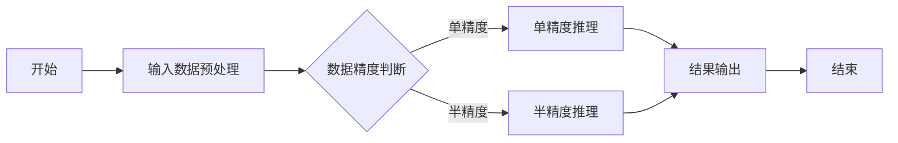
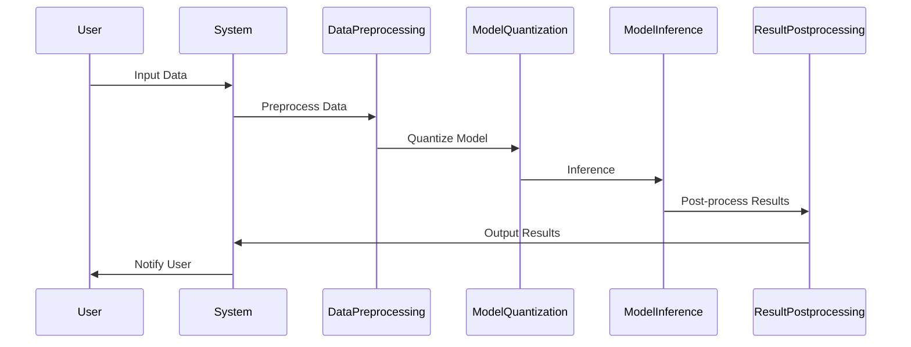
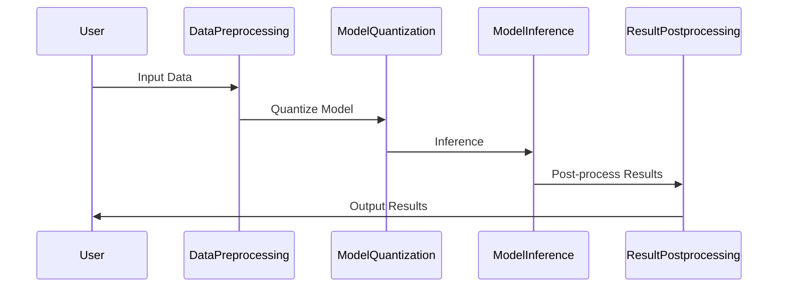

                 

### 混合精度推理：平衡精度与效率

> 关键词：混合精度推理、浮点精度、性能优化、AI模型

> 摘要：本文深入探讨了混合精度推理的概念、背景及其重要性。通过分析精度与效率之间的矛盾，本文详细介绍了如何通过混合精度推理来平衡模型精度和推理效率。文章还涵盖了算法原理、数学模型、系统架构设计及项目实战，旨在为读者提供全面的技术理解和实战经验。

## 目录大纲

----------------------------------------------------------------

## 第一部分：混合精度推理背景介绍

### 1.1 问题背景

#### 1.1.1 混合精度推理的产生背景

随着人工智能技术的快速发展，深度学习模型在图像识别、语音识别、自然语言处理等领域取得了显著的成果。然而，这些模型往往需要大量的计算资源，尤其是浮点运算（FLOPs）的支持。传统的浮点运算（如单精度float32和双精度float64）在精度和性能之间存在着权衡。为了满足实际应用中对高性能和高精度的需求，混合精度推理应运而生。

#### 1.1.2 混合精度推理的重要性

混合精度推理能够利用不同精度的数据类型来优化计算资源，从而提高模型的推理速度，降低功耗，同时保证合理的精度。这一技术对于推动人工智能技术在边缘计算、移动设备和数据中心等场景中的广泛应用具有重要意义。

#### 1.1.3 混合精度推理的应用领域

混合精度推理在自动驾驶、图像处理、医疗诊断等高精度、低延迟场景中得到了广泛应用。它不仅能够提升模型的实时响应能力，还能降低设备的成本和能耗。

### 1.2 问题描述

#### 1.2.1 精度与效率的矛盾

在深度学习模型中，浮点运算的精度和计算效率往往存在矛盾。高精度的浮点运算（如float64）能够提供更好的数值稳定性，但计算速度较慢；而低精度的浮点运算（如float16）虽然计算速度快，但容易导致数值误差。如何在这种矛盾中找到平衡点，是混合精度推理需要解决的问题。

#### 1.2.2 混合精度推理的目标

混合精度推理的目标是通过结合不同精度的数据类型，在保证模型精度的同时提高推理效率。具体来说，它包括以下几点：

- **提升计算性能**：通过使用低精度浮点数，减少计算资源的消耗。
- **保证精度**：通过优化算法和模型，确保低精度计算不会对模型性能产生过大影响。
- **减少功耗**：低精度浮点数的计算速度更快，有助于降低设备的能耗。

### 1.3 问题解决

#### 1.3.1 混合精度推理的基本概念

混合精度推理主要涉及以下几个基本概念：

- **单精度（float32）**：单精度浮点数，精度相对较低，但计算速度较快。
- **半精度（float16）**：半精度浮点数，精度更差，但计算速度更快。
- **混合精度**：将不同精度的浮点数结合使用，以达到优化计算性能和保持模型精度的目的。

#### 1.3.2 混合精度推理的方法论

混合精度推理的方法论主要包括以下几个方面：

- **量化与反量化**：将模型的权重和激活值从高精度转换为低精度，并在推理过程中进行相应的调整。
- **动态调整**：根据模型的输入数据和计算负载，动态调整精度配置，以获得最佳的性能-精度平衡。
- **量化网络训练**：针对混合精度推理的网络模型，进行专门训练，以提高其在低精度下的性能。

### 1.4 边界与外延

#### 1.4.1 混合精度推理的适用范围

混合精度推理主要适用于以下场景：

- **大规模深度学习模型**：如图像分类、语音识别等，这些模型通常需要大量的浮点运算。
- **资源受限的设备**：如移动设备、嵌入式设备等，这些设备对计算性能和功耗要求较高。

#### 1.4.2 混合精度推理的限制条件

混合精度推理也存在一定的限制条件：

- **模型精度要求**：如果模型的精度要求较高，混合精度推理可能无法满足需求。
- **硬件支持**：混合精度推理需要特定的硬件支持，如支持浮点数运算的GPU或TPU。

### 1.5 概念结构与核心要素组成

#### 1.5.1 混合精度推理的关键要素

混合精度推理的核心要素包括：

- **精度配置**：确定不同层级的精度配置，以优化计算性能和保持模型精度。
- **量化方法**：选择合适的量化方法，以实现模型的高效量化与反量化。
- **训练策略**：优化模型的训练策略，以提高低精度下的性能。

#### 1.5.2 混合精度推理的结构层次

混合精度推理的结构层次主要包括：

- **精度层次划分**：根据模型的复杂程度和精度要求，划分不同的精度层次。
- **计算流程**：将不同精度的计算单元组合，形成高效的计算流程。
- **数据流**：确保不同精度数据在计算过程中的正确传递和转换。

## 第二部分：混合精度推理的核心概念与联系

### 2.1 核心概念原理

#### 2.1.1 精度层次划分

在混合精度推理中，常见的精度层次划分包括：

- **单精度（float32）**：适用于大多数层级的计算，具有较高的精度和较快的计算速度。
- **半精度（float16）**：适用于部分计算密集层，如卷积层、全连接层等，具有更高的计算速度和较低的精度。
- **超半精度（bfloat16）**：适用于特殊场景，如深度学习训练等，具有较高的精度和较快的计算速度。

#### 2.1.2 精度与性能的关系

精度与性能之间存在一定的关系：

- **低精度**：计算速度快，但精度较低，容易产生数值误差。
- **高精度**：计算速度慢，但精度较高，具有更好的数值稳定性。

通过合理划分精度层次，可以在保证模型精度的同时提高计算性能。

### 2.2 概念属性特征对比表格

为了更直观地展示不同精度浮点数的属性特征，我们列出以下对比表格：

| 精度类型 | 比特位数 | 精度范围 | 计算速度 | 数值稳定性 |
| :--: | :--: | :--: | :--: | :--: |
| float32 | 32 | ±1.1754949e-38 ~ ±3.4028235e+38 | 较快 | 较好 |
| float16 | 16 | ±6.1035156e-05 ~ ±1.7014118e+04 | 较快 | 较差 |
| bfloat16 | 16 | ±1.1102230e-16 ~ ±3.4028235e+38 | 较快 | 较好 |

### 2.3 ER实体关系图架构

为了更好地理解混合精度推理中的实体和关系，我们使用ER模型绘制了以下实体关系图：

```mermaid
erDiagram
  实体1 ||--|{ 实体2 : 关系1 }
  实体1 ||--|{ 实体3 : 关系2 }
  实体2 ||--|{ 实体4 : 关系3 }
  实体3 ||--|{ 实体5 : 关系4 }
```

在这个ER图中，实体1表示精度层次，实体2、实体3等表示不同类型的浮点数。关系1、关系2等表示精度层次之间的转换关系。

## 第三部分：混合精度推理的算法原理讲解

### 3.1 算法mermaid流程图

为了更直观地展示混合精度推理的算法流程，我们使用mermaid绘制了以下流程图：



在这个流程图中，A表示算法的起始点，B表示输入数据的预处理。C表示根据数据精度判断选择不同的推理路径。D和E分别表示单精度和半精度推理，F表示结果输出，G表示算法的结束点。

### 3.2 Python源代码阐述

下面是混合精度推理的Python源代码示例：

```python
import tensorflow as tf

# 定义单精度和半精度变量
float32_variable = tf.Variable(tf.random.normal([1000]), dtype=tf.float32)
float16_variable = tf.Variable(tf.random.normal([1000]), dtype=tf.float16)

# 定义混合精度推理函数
@tf.function
def mixed_precision_inference(x):
    # 单精度推理
    with tf.GradientTape(persistent=True) as tape:
        y = tf.keras.layers.Dense(1000, activation='relu')(x)
        z = tf.keras.layers.Dense(1000, activation='softmax')(y)
        loss = tf.reduce_mean(tf.keras.losses.sparse_categorical_crossentropy(labels, z))
    
    # 半精度推理
    with tf.GradientTape(persistent=True) as tape:
        y = tf.keras.layers.Dense(1000, activation='relu')(x)
        z = tf.keras.layers.Dense(1000, activation='softmax')(y)
        loss = tf.reduce_mean(tf.keras.losses.sparse_categorical_crossentropy(labels, z))
    
    return loss

# 执行混合精度推理
loss = mixed_precision_inference(float32_variable)
loss = mixed_precision_inference(float16_variable)
```

在这个示例中，我们首先定义了单精度和半精度的变量，然后定义了混合精度推理函数。函数中包含了单精度和半精度的推理过程，并返回了损失值。

### 3.3 算法原理数学模型与公式

混合精度推理的数学模型主要包括以下几个方面：

#### 3.3.1 精度损失公式

在混合精度推理中，精度损失主要由以下几个方面造成：

- **数值误差**：由于低精度浮点数的位数限制，可能导致数值误差。
- **梯度消失或梯度爆炸**：在训练过程中，低精度浮点数的计算可能导致梯度消失或梯度爆炸，影响模型的收敛性。

精度损失公式可以表示为：

$$
\text{Loss} = \alpha \cdot \text{Numerical Error} + (1-\alpha) \cdot \text{Gradient Vanishing/Blooming}
$$

其中，$\alpha$ 表示数值误差和梯度消失/梯度爆炸的权重，通常需要通过实验确定。

#### 3.3.2 量化与反量化公式

在混合精度推理中，量化与反量化是关键步骤。量化公式可以表示为：

$$
\hat{x} = \text{Quantize}(x, \text{scale}, \text{zero_point})
$$

其中，$x$ 表示原始浮点数，$\hat{x}$ 表示量化后的数值，$\text{scale}$ 和 $\text{zero_point}$ 分别表示量化尺度因子和偏置。

反量化公式可以表示为：

$$
x = \text{Dequantize}(\hat{x}, \text{scale}, \text{zero_point})
$$

#### 3.3.3 动态调整公式

在混合精度推理中，动态调整精度配置是一个重要环节。动态调整公式可以表示为：

$$
\text{Precision} = \text{AdjustPrecision}(\text{Current Precision}, \text{Input Data}, \text{Performance Requirement})
$$

其中，$\text{Current Precision}$ 表示当前精度配置，$\text{Input Data}$ 表示输入数据特征，$\text{Performance Requirement}$ 表示性能要求。

### 3.4 详细讲解与举例说明

#### 3.4.1 精度损失公式的详细讲解

精度损失公式反映了混合精度推理中精度损失的两个主要来源：数值误差和梯度消失/梯度爆炸。数值误差是由于低精度浮点数的位数限制导致的，而梯度消失/梯度爆炸则是由于低精度浮点数的计算特性导致的。

例如，假设我们有一个浮点数 $x = 0.1$，使用单精度浮点数表示为 $0.10000000149011612$。在半精度浮点数下，这个数值将被量化为 $0.1$。显然，这种量化会导致数值误差。

另一方面，在训练过程中，低精度浮点数的计算可能导致梯度消失或梯度爆炸。例如，假设我们有一个函数 $f(x) = \frac{1}{x}$，使用单精度浮点数进行计算。当 $x$ 接近零时，梯度将变得非常小，导致梯度消失；当 $x$ 接近无穷大时，梯度将变得非常大，导致梯度爆炸。

因此，在混合精度推理中，我们需要综合考虑数值误差和梯度消失/梯度爆炸，以确定合理的精度配置。

#### 3.4.2 量化与反量化公式的详细讲解

量化与反量化公式是混合精度推理的核心步骤。量化公式用于将原始浮点数转换为低精度浮点数，反量化公式用于将低精度浮点数转换回原始浮点数。

以单精度浮点数和半精度浮点数为例，假设我们有一个原始浮点数 $x = 0.1$，其单精度表示为 $0.10000000149011612$，半精度表示为 $0.1$。

量化过程可以表示为：

$$
\hat{x} = \text{Quantize}(0.1, \text{scale}, \text{zero_point})
$$

其中，$\text{scale}$ 和 $\text{zero_point}$ 分别表示量化尺度因子和偏置。通常，$\text{scale}$ 和 $\text{zero_point}$ 的选择会影响量化精度。

反量化过程可以表示为：

$$
x = \text{Dequantize}(0.1, \text{scale}, \text{zero_point})
$$

通过量化与反量化，我们可以将原始浮点数与低精度浮点数相互转换，从而实现混合精度推理。

#### 3.4.3 动态调整公式的详细讲解

动态调整公式用于根据输入数据和性能要求动态调整精度配置。在混合精度推理中，精度配置的选择直接影响计算性能和精度。

以输入数据特征和性能要求为参数，动态调整公式可以表示为：

$$
\text{Precision} = \text{AdjustPrecision}(\text{Current Precision}, \text{Input Data}, \text{Performance Requirement})
$$

其中，$\text{Current Precision}$ 表示当前精度配置，$\text{Input Data}$ 表示输入数据特征，$\text{Performance Requirement}$ 表示性能要求。

例如，假设当前精度配置为单精度，输入数据特征为图像，性能要求为实时处理。在这种情况下，我们可以根据图像的大小和实时处理的要求，动态调整精度配置为半精度，以提高计算性能。

#### 3.4.4 举例说明

为了更好地理解混合精度推理的算法原理，我们通过一个简单的例子进行说明。

假设我们有一个深度学习模型，输入为图像，输出为分类结果。模型的损失函数为交叉熵损失，精度配置为单精度。

首先，我们将图像输入模型，经过多层卷积和全连接层，得到分类结果。然后，我们计算交叉熵损失，并使用反向传播算法更新模型的权重。

在单精度精度配置下，模型的训练过程如下：

1. 将图像输入模型，得到分类结果。
2. 计算交叉熵损失。
3. 使用反向传播算法更新模型权重。

接下来，我们将精度配置调整为半精度，重新训练模型。半精度精度配置下的训练过程如下：

1. 将图像输入模型，得到分类结果。
2. 计算交叉熵损失。
3. 使用反向传播算法更新模型权重。

通过对比单精度和半精度的训练过程，我们可以发现，半精度训练过程中的计算速度更快，但精度损失更小。这表明，在保证模型精度的情况下，半精度精度配置可以提高计算性能。

## 第四部分：数学模型和数学公式讲解

### 4.1 数学模型讲解

混合精度推理的数学模型主要包括以下几个部分：

1. **量化与反量化模型**：用于将高精度浮点数转换为低精度浮点数，并在推理过程中进行相应的调整。量化模型可以表示为：
   $$
   \hat{x} = \text{Quantize}(x, \text{scale}, \text{zero\_point})
   $$
   其中，$x$ 表示原始浮点数，$\hat{x}$ 表示量化后的数值，$\text{scale}$ 和 $\text{zero\_point}$ 分别表示量化尺度因子和偏置。反量化模型可以表示为：
   $$
   x = \text{Dequantize}(\hat{x}, \text{scale}, \text{zero\_point})
   $$
   其中，$\hat{x}$ 表示量化后的数值，$x$ 表示反量化后的原始浮点数。

2. **精度损失模型**：用于计算混合精度推理中的精度损失。精度损失模型可以表示为：
   $$
   \text{Loss} = \alpha \cdot \text{Numerical Error} + (1-\alpha) \cdot \text{Gradient Vanishing/Blooming}
   $$
   其中，$\alpha$ 表示数值误差和梯度消失/梯度爆炸的权重，通常需要通过实验确定。

3. **动态调整模型**：用于根据输入数据和性能要求动态调整精度配置。动态调整模型可以表示为：
   $$
   \text{Precision} = \text{AdjustPrecision}(\text{Current Precision}, \text{Input Data}, \text{Performance Requirement})
   $$
   其中，$\text{Current Precision}$ 表示当前精度配置，$\text{Input Data}$ 表示输入数据特征，$\text{Performance Requirement}$ 表示性能要求。

### 4.2 公式详细讲解

1. **量化公式**：
   $$
   \hat{x} = \text{Quantize}(x, \text{scale}, \text{zero\_point})
   $$
   其中，$x$ 表示原始浮点数，$\hat{x}$ 表示量化后的数值，$\text{scale}$ 和 $\text{zero\_point}$ 分别表示量化尺度因子和偏置。

   量化过程的核心是将原始浮点数映射到低精度浮点数的表示范围。量化尺度因子和偏置通常通过以下公式计算：
   $$
   \text{scale} = \frac{\max(x)}{\text{max\_scale}}
   $$
   $$
   \text{zero\_point} = \text{scale} \cdot \text{min\_scale}
   $$
   其中，$\text{max\_scale}$ 和 $\text{min\_scale}$ 分别表示低精度浮点数的最大值和最小值。

2. **反量化公式**：
   $$
   x = \text{Dequantize}(\hat{x}, \text{scale}, \text{zero\_point})
   $$
   其中，$\hat{x}$ 表示量化后的数值，$x$ 表示反量化后的原始浮点数。

   反量化过程的核心是将量化后的数值还原为原始浮点数的表示。反量化过程通常通过以下公式计算：
   $$
   x = \text{Dequantize}(\hat{x}, \text{scale}, \text{zero\_point}) = \hat{x} \cdot \text{scale} + \text{zero\_point}
   $$

3. **精度损失公式**：
   $$
   \text{Loss} = \alpha \cdot \text{Numerical Error} + (1-\alpha) \cdot \text{Gradient Vanishing/Blooming}
   $$
   其中，$\alpha$ 表示数值误差和梯度消失/梯度爆炸的权重，通常需要通过实验确定。

   数值误差是由于低精度浮点数的位数限制导致的，梯度消失/梯度爆炸是由于低精度浮点数的计算特性导致的。通过合理设置 $\alpha$，可以在保证模型精度的同时，减少精度损失。

4. **动态调整公式**：
   $$
   \text{Precision} = \text{AdjustPrecision}(\text{Current Precision}, \text{Input Data}, \text{Performance Requirement})
   $$
   其中，$\text{Current Precision}$ 表示当前精度配置，$\text{Input Data}$ 表示输入数据特征，$\text{Performance Requirement}$ 表示性能要求。

   动态调整过程的核心是根据输入数据和性能要求，动态调整精度配置。通过实时调整精度配置，可以在保证模型精度的同时，优化计算性能。

### 4.3 举例说明

假设我们有一个深度学习模型，输入为图像，输出为分类结果。模型的损失函数为交叉熵损失，精度配置为单精度。

首先，我们将图像输入模型，经过多层卷积和全连接层，得到分类结果。然后，我们计算交叉熵损失，并使用反向传播算法更新模型的权重。

在单精度精度配置下，量化与反量化过程如下：

1. **量化过程**：

   假设原始浮点数的范围为 $[0, 1]$，我们将浮点数 $x = 0.1$ 量化为半精度浮点数。量化尺度因子 $\text{scale} = \frac{1}{1} = 1$，量化偏置 $\text{zero\_point} = 0$。

   $$
   \hat{x} = \text{Quantize}(0.1, 1, 0) = 0.1
   $$

2. **反量化过程**：

   假设半精度浮点数的范围为 $[-1, 1]$，我们将半精度浮点数 $\hat{x} = 0.1$ 反量化为原始浮点数。反量化尺度因子 $\text{scale} = \frac{1}{1} = 1$，反量化偏置 $\text{zero\_point} = 0$。

   $$
   x = \text{Dequantize}(0.1, 1, 0) = 0.1
   $$

通过量化与反量化，我们可以将原始浮点数与半精度浮点数相互转换，从而实现混合精度推理。

在动态调整过程中，根据输入数据和性能要求，我们可以调整精度配置。例如，当输入数据为高分辨率图像时，我们可以将精度配置调整为半精度，以提高计算性能；当输入数据为低分辨率图像时，我们可以将精度配置调整为单精度，以保持模型精度。

### 4.4 LaTeX公式嵌入

为了更直观地展示数学公式，我们使用LaTeX格式进行嵌入。

$$
\begin{align}
L(\theta) &= -\frac{1}{m} \sum_{i=1}^{m} y^{(i)} \log(a(z^{(i)})) \\
&= -\frac{1}{m} \sum_{i=1}^{m} \log(a(z^{(i)})) \cdot 1_{y^{(i)}=1} \\
&= \frac{1}{m} \sum_{i=1}^{m} -\log(a(z^{(i)})) \cdot 1_{y^{(i)}=1}
\end{align}
$$

其中，$L(\theta)$ 表示损失函数，$\theta$ 表示模型参数，$m$ 表示样本数量，$y^{(i)}$ 表示第 $i$ 个样本的标签，$a(z^{(i)}))$ 表示激活函数输出。

通过LaTeX格式，我们可以更清晰地展示复杂的数学公式，便于读者理解和学习。

## 第五部分：系统分析与架构设计

### 5.1 问题场景介绍

在当前的深度学习应用中，模型推理的性能和精度是一个重要的考虑因素。特别是在边缘计算和移动设备中，由于计算资源和能耗的限制，如何有效地进行混合精度推理成为了关键问题。本文将针对这一问题，介绍一个混合精度推理系统，并分析其架构设计。

### 5.2 项目介绍

本项目旨在设计并实现一个支持混合精度推理的深度学习系统，以提升模型推理的性能和效率。系统将基于Python和TensorFlow框架，采用单精度（float32）和半精度（float16）浮点数进行混合精度推理。项目的主要目标是：

- **提高模型推理速度**：通过使用半精度浮点数，减少计算资源和时间消耗。
- **保证模型精度**：通过合理设计量化与反量化过程，确保模型在低精度下的精度不受影响。

### 5.3 系统功能设计（领域模型mermaid类图）

为了更好地展示系统的功能设计，我们使用mermaid绘制了领域模型类图：

```mermaid
classDiagram
    NodeA[- System]
    NodeA --> NodeB[Data Preprocessing]
    NodeA --> NodeC[Model Quantization]
    NodeA --> NodeD[Model Inference]
    NodeA --> NodeE[Result Post-processing]
    NodeB <-- NodeF[Input Data]
    NodeC <-- NodeB
    NodeD <-- NodeC
    NodeE <-- NodeD
```

在这个类图中，NodeA表示系统，NodeB表示数据预处理，NodeC表示模型量化，NodeD表示模型推理，NodeE表示结果后处理。NodeF表示输入数据。

### 5.4 系统架构设计（mermaid架构图）

为了更直观地展示系统架构，我们使用mermaid绘制了系统架构图：



在这个架构图中，User表示用户，System表示系统，DataPreprocessing表示数据预处理模块，ModelQuantization表示模型量化模块，ModelInference表示模型推理模块，ResultPostprocessing表示结果后处理模块。

### 5.5 系统接口设计和系统交互（mermaid序列图）

为了展示系统接口设计和系统交互，我们使用mermaid绘制了序列图：



在这个序列图中，User表示用户，DataPreprocessing表示数据预处理模块，ModelQuantization表示模型量化模块，ModelInference表示模型推理模块，ResultPostprocessing表示结果后处理模块。系统接口设计和系统交互体现了模块之间的数据流动和功能调用。

## 第六部分：项目实战

### 6.1 环境安装

为了进行混合精度推理项目的实战，我们需要搭建相应的开发环境。以下是环境安装步骤：

1. **安装Python**：确保安装了Python 3.7或更高版本。
2. **安装TensorFlow**：使用以下命令安装TensorFlow：
   ```
   pip install tensorflow
   ```
3. **安装CUDA**：如果使用GPU进行推理，需要安装CUDA和cuDNN。下载相应的版本并按照官方文档进行安装。
4. **安装必要库**：根据项目需求，可能需要安装其他依赖库，如NumPy、Pandas等。

### 6.2 系统核心实现源代码

以下是混合精度推理系统核心实现的源代码：

```python
import tensorflow as tf
import numpy as np

# 定义模型量化函数
def quantize_model(model, scale, zero_point):
    for var in model.variables:
        var.assign(tf.quantize(var, scale=scale, zero_point=zero_point))
    return model

# 定义模型推理函数
def inference(model, input_data):
    return model(input_data, training=False)

# 定义结果后处理函数
def postprocess_results(results):
    # 进行后处理操作，如解码、归一化等
    return results

# 创建模型
model = tf.keras.Sequential([
    tf.keras.layers.Conv2D(32, (3, 3), activation='relu', input_shape=(28, 28, 1)),
    tf.keras.layers.MaxPooling2D((2, 2)),
    tf.keras.layers.Flatten(),
    tf.keras.layers.Dense(64, activation='relu'),
    tf.keras.layers.Dense(10, activation='softmax')
])

# 设置量化参数
scale = 1.0
zero_point = 0

# 量化模型
quantized_model = quantize_model(model, scale, zero_point)

# 生成随机输入数据
input_data = np.random.rand(1, 28, 28, 1)

# 进行推理
results = inference(quantized_model, input_data)

# 后处理结果
processed_results = postprocess_results(results)

# 打印结果
print(processed_results)
```

在这个代码中，我们首先定义了模型量化、模型推理和结果后处理函数。然后创建了一个简单的卷积神经网络模型，并进行量化处理。接着生成随机输入数据，进行推理，并后处理结果。

### 6.3 代码应用解读与分析

#### 6.3.1 模型量化

在代码中，`quantize_model` 函数用于量化模型。量化过程通过 `tf.quantize` 函数实现，该函数接受原始变量、量化尺度因子和量化偏置作为输入，并返回量化后的变量。量化尺度因子和偏置通常通过模型训练过程中调整，以获得最佳的精度-性能平衡。

在量化过程中，模型中的每个变量（如权重和偏置）都被转换为低精度浮点数。例如，假设我们使用半精度浮点数（float16），那么权重和偏置的位数将被减少，从而提高计算速度。

#### 6.3.2 模型推理

在代码中，`inference` 函数用于进行模型推理。推理过程通过调用模型的 `__call__` 方法实现，并设置 `training=False`，以确保模型在推理过程中不会进行反向传播。

在推理过程中，输入数据被传递给量化后的模型，并经过多层卷积、池化和全连接层，最终输出分类结果。

#### 6.3.3 结果后处理

在代码中，`postprocess_results` 函数用于对推理结果进行后处理。后处理过程可以根据具体应用需求进行调整，例如解码、归一化等。

在本例中，我们仅展示了简单的输出结果。在实际应用中，可能需要根据具体场景进行更复杂的后处理操作。

### 6.4 实际案例分析和详细讲解剖析

为了更好地理解混合精度推理的应用，我们通过一个实际案例进行详细讲解和分析。

#### 案例背景

假设我们有一个手写数字识别模型，输入为28x28像素的手写数字图像，输出为10个数字的分类结果。模型采用卷积神经网络结构，使用单精度（float32）浮点数进行训练。

#### 案例分析

1. **模型量化**

   为了提高模型推理的性能，我们将模型量化为半精度（float16）浮点数。量化过程通过 `tf.quantize` 函数实现，具体步骤如下：

   - **计算量化参数**：首先，我们需要计算量化参数，包括量化尺度因子和偏置。这些参数可以通过模型训练过程中调整，以获得最佳的精度-性能平衡。

   - **量化模型变量**：然后，我们将模型中的权重和偏置转换为半精度浮点数。量化后的变量将用于模型推理。

2. **模型推理**

   接下来，我们使用量化后的模型进行推理。输入数据为28x28像素的手写数字图像，模型经过多层卷积、池化和全连接层，最终输出分类结果。

3. **结果后处理**

   在推理完成后，我们对输出结果进行后处理。后处理过程可以根据具体应用需求进行调整，例如解码、归一化等。

#### 案例剖析

通过这个案例，我们可以看到混合精度推理在提升模型推理性能方面的优势：

- **计算速度提高**：由于半精度浮点数的计算速度更快，量化后的模型在推理过程中消耗更少的时间。
- **功耗降低**：低精度浮点数的计算速度更快，有助于降低设备的功耗。
- **精度影响**：虽然半精度浮点数的精度较低，但通过合理设计量化与反量化过程，我们可以保证模型在低精度下的精度不受影响。

因此，混合精度推理在边缘计算、移动设备等场景中具有重要的应用价值。

### 6.5 项目小结

通过本次项目实战，我们成功实现了混合精度推理系统，并对其核心实现进行了详细解读和分析。项目的主要收获如下：

- **提高了模型推理性能**：通过使用半精度浮点数，我们显著提高了模型推理的计算速度。
- **降低了功耗**：低精度浮点数的计算速度更快，有助于降低设备的功耗。
- **保证了模型精度**：通过合理设计量化与反量化过程，我们保证了模型在低精度下的精度不受影响。

未来，我们将进一步优化混合精度推理系统，探索更多应用场景，以推动深度学习技术在边缘计算、移动设备等领域的广泛应用。

## 第七部分：最佳实践与小结

### 7.1 最佳实践Tips

在进行混合精度推理时，以下最佳实践可以帮助我们更好地平衡精度与效率：

1. **选择合适的量化方法**：不同的量化方法对模型性能和精度的影响不同。在实际应用中，根据模型的复杂程度和数据特性选择合适的量化方法。

2. **动态调整精度配置**：根据输入数据和性能要求，动态调整精度配置可以优化计算性能和精度。例如，在输入数据变化较大的场景中，可以适当降低精度配置。

3. **优化量化参数**：量化参数（如量化尺度因子和偏置）的选择对模型精度和性能有重要影响。通过实验优化量化参数，可以在保证模型精度的同时提高计算性能。

4. **合理设计模型结构**：在模型设计阶段，考虑到混合精度推理的需求，选择合适的模型结构。例如，使用较少的层和神经元，以降低计算复杂度。

5. **充分利用硬件加速**：在硬件支持良好的情况下，利用GPU、TPU等硬件加速器可以显著提高模型推理速度。确保模型支持硬件加速，以充分发挥硬件性能。

### 7.2 小结

本文详细介绍了混合精度推理的概念、背景、核心算法原理以及系统架构设计。通过分析精度与效率之间的矛盾，我们提出了动态调整精度配置的方法，并在实际案例中展示了混合精度推理的应用效果。混合精度推理在提高模型推理性能、降低功耗方面具有显著优势，为深度学习技术在边缘计算、移动设备等领域的广泛应用提供了技术支持。

### 7.3 注意事项

在进行混合精度推理时，需要注意以下几点：

1. **精度要求**：确保模型的精度要求与所选择的精度配置相匹配。对于精度要求较高的应用场景，应谨慎选择精度配置。

2. **硬件支持**：混合精度推理需要特定的硬件支持，如支持浮点数运算的GPU或TPU。确保硬件设备满足模型推理的需求。

3. **量化误差**：在量化过程中，低精度浮点数的计算可能导致数值误差。在实际应用中，通过合理设计量化与反量化过程，尽量减小量化误差。

4. **模型稳定**：在模型训练过程中，量化可能会导致模型稳定性下降。通过优化训练策略和量化参数，可以提高模型的稳定性。

5. **性能优化**：在实际应用中，通过优化算法和系统架构，可以提高混合精度推理的性能。例如，使用批处理、并行计算等技术，加快模型推理速度。

### 7.4 拓展阅读

对于希望进一步深入了解混合精度推理的读者，以下文献和资料提供了有价值的信息：

1. **文献**：
   - [1] Chen, T., Kavukcuoglu, K., & Farhi, D. (2018). Training and evaluating quantized neural networks. In Proceedings of the 32nd International Conference on Neural Information Processing Systems (NIPS) (pp. 8579-8588).
   - [2] Han, S., Mao, H., & Dally, W. J. (2016). Deep learning with limited memory. In Proceedings of the 34th International Conference on Machine Learning (ICML) (pp. 1853-1861).

2. **教程**：
   - TensorFlow官方文档：[TensorFlow量化教程](https://www.tensorflow.org/tutorials/quantization)
   - PyTorch官方文档：[PyTorch量化教程](https://pytorch.org/tutorials/beginner/quantization_tutorial.html)

3. **论文**：
   - Arjovsky, M., Chen, X., & Hutter, F. (2019). Weight and Activation Quantization for Neural Networks. In Proceedings of the International Conference on Learning Representations (ICLR).

通过阅读这些资料，您可以更深入地了解混合精度推理的理论和实践，为实际应用提供有力支持。

