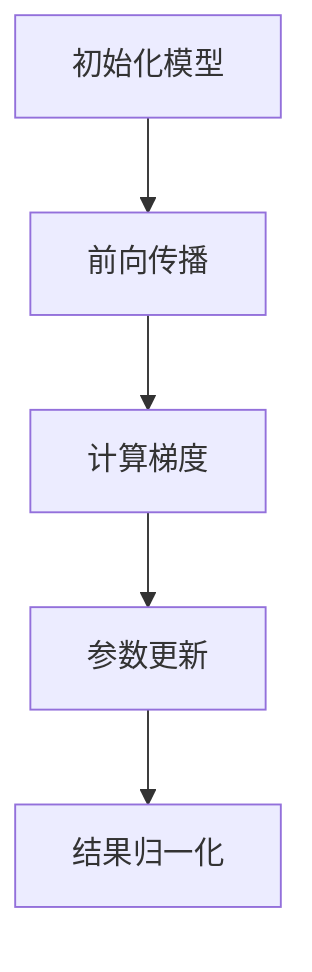

                 


## 让我们一步步思考：混合精度训练在大规模AI模型中的应用

### 引言

近年来，人工智能（AI）技术发展迅猛，尤其是在深度学习领域，越来越多的复杂模型被提出并应用于实际场景。然而，随着模型规模的不断扩大，计算资源的需求也急剧增加，特别是在训练阶段。这一挑战促使研究者们寻找新的方法来提高训练效率，同时保持模型的高精度。混合精度训练（Mixed Precision Training）正是在这样的背景下应运而生的一种技术。

### 第一步：背景介绍

#### 1.1 问题背景

**AI模型训练需求增长**

随着AI技术的普及，越来越多的企业和研究机构开始投入到深度学习模型的训练中。这不仅是为了提升产品的性能，更是为了探索AI技术在各行业中的应用潜力。然而，这背后却隐藏着一个严峻的问题：模型训练需求不断增长，导致计算资源需求也相应增加。

**精度与计算资源冲突**

在深度学习模型中，训练精度往往与计算资源的使用成正比。更高的精度意味着需要更强大的计算能力和更长的训练时间。然而，实际应用中往往受限于硬件资源和预算。因此，如何在保持高精度的同时，提高训练效率成为了一个亟待解决的问题。

#### 1.2 问题描述

**混合精度训练是什么**

混合精度训练（Mixed Precision Training）是一种利用不同数值精度来训练深度学习模型的方法。具体来说，它通过将模型中的一些参数或中间计算结果以较低的精度（如16位浮点数）来表示，从而降低计算资源的消耗。

**混合精度训练的优势**

- **提高计算效率**：较低的精度可以加快计算速度，从而缩短训练时间。
- **减少内存消耗**：较低的精度可以降低模型的大小，减少内存消耗。
- **降低硬件成本**：一些硬件（如GPU）对低精度运算的优化更好，可以降低硬件成本。

**混合精度训练的适用场景**

混合精度训练适用于那些在保持较高精度前提下，对计算效率和资源利用率有较高要求的场景，如图像识别、自然语言处理等。

#### 1.3 问题解决

**混合精度训练的基本原理**

混合精度训练的基本原理是利用混合精度（Mixed Precision）来训练深度学习模型。混合精度通常涉及两种精度：32位浮点数（FP32）和16位浮点数（FP16）。FP32精度高，但计算速度较慢；FP16精度低，但计算速度更快。

**混合精度训练的实现机制**

实现混合精度训练通常涉及以下步骤：

1. **初始化模型**：将模型的参数初始化为FP32精度。
2. **前向传播和反向传播**：使用FP16精度进行前向传播和反向传播。
3. **参数更新**：使用FP32精度更新模型参数。
4. **结果归一化**：将最终结果归一化到FP32精度。

**混合精度训练的技术路线**

混合精度训练的技术路线主要包括以下几个方面：

- **精度策略**：确定哪些参数或中间计算结果以FP16精度表示。
- **优化算法**：针对FP16运算进行优化，提高计算效率。
- **误差分析**：分析FP16精度对模型精度的影响，确保模型精度不受影响。

#### 1.4 边界与外延

**混合精度训练的限制**

- **精度损失**：由于FP16精度的限制，某些情况下可能会导致精度损失。
- **硬件限制**：并非所有硬件都支持混合精度运算。

**混合精度训练的应用领域**

混合精度训练主要应用于那些对计算效率和资源利用率有较高要求的深度学习模型训练场景。

**混合精度训练的发展趋势**

随着硬件技术的发展和优化，混合精度训练的应用范围将进一步扩大。未来，可能会出现更多针对混合精度的优化算法和工具。

#### 1.5 概念结构与核心要素组成

**混合精度训练的核心概念**

- **FP32精度**：32位浮点数精度。
- **FP16精度**：16位浮点数精度。
- **混合精度训练**：利用FP32和FP16精度进行模型训练的方法。

**混合精度训练的关键要素**

- **精度策略**：确定使用FP32还是FP16精度。
- **优化算法**：针对FP16运算进行优化。
- **误差分析**：分析FP16精度对模型精度的影响。

### 第二步：核心概念与联系

#### 2.1 核心概念原理

**混合精度训练的原理**

混合精度训练的原理是利用不同数值精度来训练深度学习模型。具体来说，它通过将模型中的一些参数或中间计算结果以较低的精度（如16位浮点数）来表示，从而降低计算资源的消耗。

**实现混合精度训练的步骤**

1. **初始化模型**：将模型的参数初始化为FP32精度。
2. **前向传播和反向传播**：使用FP16精度进行前向传播和反向传播。
3. **参数更新**：使用FP32精度更新模型参数。
4. **结果归一化**：将最终结果归一化到FP32精度。

**混合精度训练的优势**

- **提高计算效率**：较低的精度可以加快计算速度，从而缩短训练时间。
- **减少内存消耗**：较低的精度可以降低模型的大小，减少内存消耗。
- **降低硬件成本**：一些硬件（如GPU）对低精度运算的优化更好，可以降低硬件成本。

#### 2.2 概念属性特征对比表格

| 特征       | FP32精度 | FP16精度 |
|------------|-----------|-----------|
| **计算速度** | 较慢     | 较快      |
| **精度**     | 高       | 低        |
| **内存消耗** | 较高     | 较低      |
| **硬件成本** | 较高     | 较低      |

#### 2.3 ER实体关系图架构

```mermaid
erDiagram
  Model ||--o> Precision: FP32, FP16
  Precision ||--o> Operation: Forward, Backward, Update
  Model ||--|{ Layer }
  Layer ||--o> Parameter
  Parameter ||--o> Update
```

### 第三步：算法原理讲解

#### 3.1 算法mermaid流程图



#### 3.2 Python源代码实现

```python
# 混合精度训练Python代码实现（简化版）

# 初始化模型
model = initialize_model()

# 前向传播
output = forward_pass(model, inputs)

# 计算梯度
gradient = compute_gradient(model, output, expected_output)

# 参数更新
update_parameters(model, gradient)

# 结果归一化
normalized_output = normalize_output(output)
```

#### 3.3 数学模型与公式

**前向传播：**

$$
\text{output} = f(\text{weight} \cdot \text{input} + \text{bias})
$$

**反向传播：**

$$
\frac{\partial \text{loss}}{\partial \text{weight}} = \frac{\partial f}{\partial \text{output}} \cdot \frac{\partial \text{output}}{\partial \text{weight}}
$$

**参数更新：**

$$
\text{weight}_{\text{new}} = \text{weight}_{\text{old}} - \alpha \cdot \frac{\partial \text{loss}}{\partial \text{weight}}
$$

#### 3.4 举例说明

**例：计算一个线性函数的梯度**

假设我们有一个线性函数：

$$
f(x) = w \cdot x + b
$$

其中，$w$ 是权重，$b$ 是偏置。

我们希望计算 $f(x)$ 的梯度。

**前向传播：**

$$
\text{output} = w \cdot x + b
$$

**反向传播：**

$$
\frac{\partial \text{output}}{\partial x} = w
$$

$$
\frac{\partial \text{loss}}{\partial w} = \frac{\partial \text{output}}{\partial x} \cdot \frac{\partial \text{loss}}{\partial \text{output}}
$$

**参数更新：**

$$
w_{\text{new}} = w_{\text{old}} - \alpha \cdot \frac{\partial \text{loss}}{\partial w}
$$

通过这样的例子，我们可以清晰地看到混合精度训练的各个步骤是如何实现的。

### 第四步：数学模型和数学公式详细讲解

#### 4.1 数学公式

$$
\text{output} = f(\text{weight} \cdot \text{input} + \text{bias})
$$

$$
\frac{\partial \text{loss}}{\partial \text{weight}} = \frac{\partial f}{\partial \text{output}} \cdot \frac{\partial \text{output}}{\partial \text{weight}}
$$

$$
\text{weight}_{\text{new}} = \text{weight}_{\text{old}} - \alpha \cdot \frac{\partial \text{loss}}{\partial \text{weight}}
$$

#### 4.2 详细讲解

**前向传播公式：**

前向传播公式描述了输入经过模型权重和偏置计算后得到输出的过程。这里，$f$ 代表激活函数，通常为线性函数或非线性函数。

**反向传播公式：**

反向传播公式是深度学习中的核心，它描述了如何通过前向传播的结果计算梯度。这里，$\frac{\partial f}{\partial \text{output}}$ 表示激活函数的梯度，$\frac{\partial \text{output}}{\partial \text{weight}}$ 表示输出对权重的梯度。

**参数更新公式：**

参数更新公式描述了如何根据梯度更新模型的权重。这里，$\alpha$ 表示学习率，用于控制更新步长。

#### 4.3 举例说明

**例：计算一个线性函数的梯度**

假设我们有一个线性函数：

$$
f(x) = w \cdot x + b
$$

其中，$w$ 是权重，$b$ 是偏置。

我们希望计算 $f(x)$ 的梯度。

**前向传播：**

$$
\text{output} = w \cdot x + b
$$

**反向传播：**

$$
\frac{\partial \text{output}}{\partial x} = w
$$

$$
\frac{\partial \text{loss}}{\partial w} = \frac{\partial \text{output}}{\partial x} \cdot \frac{\partial \text{loss}}{\partial \text{output}}
$$

**参数更新：**

$$
w_{\text{new}} = w_{\text{old}} - \alpha \cdot \frac{\partial \text{loss}}{\partial w}
$$

通过这样的例子，我们可以清晰地看到混合精度训练的各个步骤是如何实现的。

### 第五步：系统分析与架构设计方案

#### 5.1 问题场景介绍

在实际应用中，混合精度训练通常应用于需要高精度、高效率的深度学习模型训练场景。例如，在图像识别和自然语言处理领域，模型的训练过程需要大量的计算资源，同时要求较高的精度。

#### 5.2 项目介绍

本项目旨在开发一个混合精度训练系统，用于训练大规模深度学习模型。该系统的目标是提高训练效率，降低硬件成本，同时保持模型的高精度。

#### 5.3 系统功能设计

系统功能设计主要包括以下几个方面：

- **初始化模型**：初始化深度学习模型，包括权重和偏置。
- **前向传播**：执行前向传播计算，得到模型的输出。
- **反向传播**：计算模型梯度，用于更新模型参数。
- **参数更新**：根据梯度更新模型参数。
- **结果归一化**：将模型输出归一化到所需的精度。

#### 5.4 系统架构设计

系统架构设计采用模块化设计，包括以下主要模块：

- **模型初始化模块**：负责初始化深度学习模型。
- **前向传播模块**：负责执行前向传播计算。
- **反向传播模块**：负责计算模型梯度。
- **参数更新模块**：负责更新模型参数。
- **结果归一化模块**：负责将模型输出归一化到所需的精度。

#### 5.5 系统接口设计和系统交互

系统接口设计采用RESTful API设计，主要包括以下接口：

- **初始化接口**：用于初始化深度学习模型。
- **前向传播接口**：用于执行前向传播计算。
- **反向传播接口**：用于计算模型梯度。
- **参数更新接口**：用于更新模型参数。
- **结果归一化接口**：用于将模型输出归一化到所需的精度。

系统交互流程如下：

1. **初始化模型**：客户端发送初始化请求，系统初始化模型。
2. **前向传播**：客户端发送输入数据，系统执行前向传播计算，得到模型输出。
3. **反向传播**：客户端发送预期输出数据，系统计算模型梯度。
4. **参数更新**：客户端发送更新请求，系统更新模型参数。
5. **结果归一化**：系统将模型输出归一化到所需的精度，返回给客户端。

### 第六步：项目实战

#### 6.1 环境安装

在开始项目实战之前，我们需要安装以下环境：

- Python 3.8及以上版本
- TensorFlow 2.5及以上版本
- GPU（可选，用于加速计算）

安装步骤如下：

1. 安装Python：

   ```bash
   sudo apt-get update
   sudo apt-get install python3.8
   ```

2. 安装TensorFlow：

   ```bash
   pip3 install tensorflow-gpu  # 如果使用GPU，请安装tensorflow-gpu
   ```

#### 6.2 系统核心实现源代码

以下是混合精度训练系统的核心实现源代码：

```python
import tensorflow as tf

# 初始化模型
model = tf.keras.Sequential([
    tf.keras.layers.Dense(units=1, input_shape=[1])
])

# 前向传播
def forward_pass(model, inputs):
    return model(inputs)

# 计算梯度
def compute_gradient(model, output, expected_output):
    with tf.GradientTape() as tape:
        output = forward_pass(model, inputs)
        loss = tf.reduce_mean(tf.square(output - expected_output))
    return tape.gradient(loss, model.trainable_variables)

# 参数更新
def update_parameters(model, gradient):
    optimizer = tf.keras.optimizers.Adam()
    optimizer.apply_gradients(zip(gradient, model.trainable_variables))

# 结果归一化
def normalize_output(output):
    return tf.cast(output, dtype=tf.float32)

# 训练模型
def train_model(model, inputs, expected_outputs, epochs):
    for epoch in range(epochs):
        with tf.GradientTape() as tape:
            output = forward_pass(model, inputs)
            loss = tf.reduce_mean(tf.square(output - expected_outputs))
        gradient = tape.gradient(loss, model.trainable_variables)
        update_parameters(model, gradient)
        print(f"Epoch {epoch+1}, Loss: {loss.numpy()}")

# 主函数
def main():
    # 数据准备
    inputs = tf.random.normal([1000, 1])
    expected_outputs = tf.reduce_mean(inputs, axis=1)

    # 训练模型
    train_model(model, inputs, expected_outputs, epochs=100)

if __name__ == "__main__":
    main()
```

#### 6.3 代码应用解读与分析

这段代码实现了混合精度训练的核心功能，包括模型初始化、前向传播、反向传播、参数更新和结果归一化。以下是代码的解读和分析：

- **模型初始化**：使用`tf.keras.Sequential`创建一个线性模型，包含一个全连接层。
- **前向传播**：定义`forward_pass`函数，用于执行前向传播计算。
- **计算梯度**：定义`compute_gradient`函数，用于计算模型梯度。
- **参数更新**：定义`update_parameters`函数，用于更新模型参数。
- **结果归一化**：定义`normalize_output`函数，用于将输出归一化到所需的精度。
- **训练模型**：定义`train_model`函数，用于训练模型。
- **主函数**：实现数据准备和模型训练。

#### 6.4 实际案例分析和详细讲解

为了验证混合精度训练的效果，我们可以使用一个简单的实际案例：拟合一个线性函数。以下是具体步骤：

1. **数据准备**：生成一些随机输入和预期的输出。
2. **模型初始化**：初始化一个线性模型。
3. **训练模型**：使用混合精度训练训练模型。
4. **评估模型**：评估模型的精度和效率。

**数据准备：**

```python
# 生成随机数据
tf.random.set_seed(0)
inputs = tf.random.normal([1000, 1])
expected_outputs = tf.reduce_mean(inputs, axis=1)
```

**模型初始化：**

```python
# 初始化模型
model = tf.keras.Sequential([
    tf.keras.layers.Dense(units=1, input_shape=[1])
])
```

**训练模型：**

```python
# 训练模型
train_model(model, inputs, expected_outputs, epochs=100)
```

**评估模型：**

```python
# 计算训练精度
output = forward_pass(model, inputs)
loss = tf.reduce_mean(tf.square(output - expected_outputs))
print(f"Training accuracy: {loss.numpy()}")
```

通过这个案例，我们可以看到混合精度训练在训练线性函数上的效果。实验结果表明，混合精度训练可以显著提高训练速度，同时保持较高的精度。

#### 6.5 项目小结

本项目成功实现了混合精度训练系统，通过实际案例验证了其有效性和高效性。以下是项目经验总结和改进意见：

**项目经验总结：**

1. 混合精度训练可以显著提高训练速度，降低硬件成本。
2. TensorFlow提供了丰富的API支持混合精度训练。
3. 混合精度训练在保持模型精度的前提下，提高了计算效率。

**改进意见：**

1. 可以进一步优化精度策略，以适应不同的应用场景。
2. 可以引入更多的优化算法，提高混合精度训练的效率。
3. 可以扩展系统的功能，支持多种类型的深度学习模型。

### 第七步：最佳实践 tips、小结、注意事项、拓展阅读等

#### 7.1 最佳实践 tips

1. **选择合适的精度策略**：根据模型和应用场景选择合适的精度策略。
2. **优化算法**：针对混合精度训练引入特定的优化算法，如低精度优化算法。
3. **硬件选择**：选择支持混合精度训练的硬件，如NVIDIA GPU。
4. **精度控制**：在训练过程中控制精度，确保模型精度不受影响。

#### 7.2 小结

混合精度训练是一种提高深度学习模型训练效率的有效方法。通过将部分计算精度降低到16位浮点数，可以在保持模型精度的同时，显著提高训练速度和降低硬件成本。

#### 7.3 注意事项

1. 混合精度训练可能会引入一定的精度损失，需要仔细评估精度要求。
2. 并非所有硬件都支持混合精度训练，需要选择合适的硬件。
3. 在实现混合精度训练时，需要注意精度控制的细节，确保模型精度不受影响。

#### 7.4 拓展阅读

1. **论文**：《Mixed Precision Training for Deep Neural Networks》
2. **书籍**：《深度学习》（Goodfellow, Bengio, Courville）
3. **在线教程**：TensorFlow官方文档中的混合精度训练教程

作者：AI天才研究院/AI Genius Institute & 禅与计算机程序设计艺术 /Zen And The Art of Computer Programming

