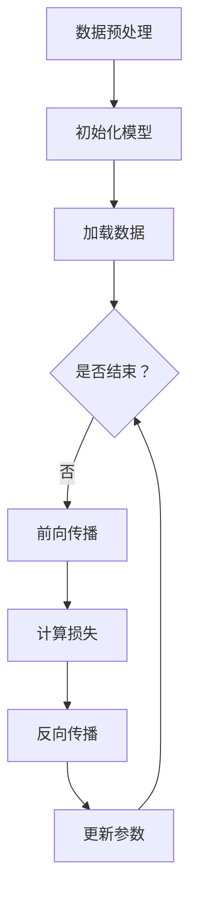
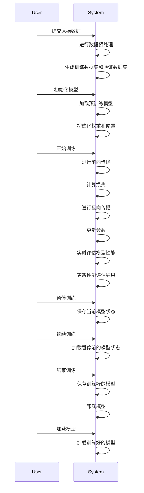

                 


### 混合精度训练在大规模语言模型中的实践

#### 关键词：
混合精度训练、大规模语言模型、浮点精度、算法优化、性能提升、数学模型、系统架构、最佳实践

#### 摘要：
随着深度学习在自然语言处理领域的广泛应用，大规模语言模型的训练需求日益增长，然而高精度浮点运算带来的计算资源消耗和训练时间延长，成为了一个亟待解决的问题。本文将详细探讨混合精度训练在大规模语言模型中的应用，从背景介绍、核心概念、算法原理、实践案例等多个方面，全面解析混合精度训练的优势、挑战和实践方法，旨在为研究者提供参考和启示。

## 第一部分：混合精度训练基础

### 第1章：背景介绍

**1.1 混合精度训练的提出**

随着深度学习在各个领域的广泛应用，大规模语言模型的训练需求日益增长。然而，传统的单精度（32位）或双精度（64位）浮点运算在处理大规模模型时，面临着计算资源消耗大、训练时间长等问题。为了解决这一问题，研究人员提出了混合精度训练（Mixed Precision Training）的概念。混合精度训练通过将部分或全部运算从双精度浮点运算（FP64）转换为单精度浮点运算（FP32）或半精度浮点运算（FP16），在保证模型精度损失较小的前提下，显著提高训练效率和降低计算资源消耗。

**1.2 混合精度训练的意义**

混合精度训练的出现，为大规模语言模型的训练带来了显著的优势。首先，通过减少浮点运算的精度，可以降低内存占用和计算资源的消耗，从而加速模型的训练过程。其次，混合精度训练可以在不牺牲模型精度的前提下，提高训练效率，降低训练成本。这对于科研机构和企业来说，具有重要的意义，不仅可以缩短研究周期，还可以降低研究成本。

**1.3 大规模语言模型的现状与挑战**

随着深度学习技术的不断发展，大规模语言模型在自然语言处理、机器翻译、文本生成等领域取得了显著的成果。然而，大规模语言模型的训练面临着一系列挑战。首先，模型的规模越来越大，导致训练数据集和模型参数的数量呈指数级增长，从而使得计算资源的需求不断增加。其次，高精度的浮点运算使得训练时间大大延长，对于实时性要求较高的应用场景，难以满足需求。此外，大规模语言模型的训练过程中，还需要解决数据集的多样性和噪声问题，以及模型的可解释性和鲁棒性等问题。

**1.4 混合精度训练的边界与外延**

混合精度训练虽然具有显著的优势，但并非适用于所有情况。首先，混合精度训练对模型的精度有一定的影响，对于对精度要求较高的任务，可能需要权衡精度和效率之间的关系。其次，混合精度训练对于硬件环境有一定的要求，需要支持FP16或FP32运算的GPU或TPU。此外，混合精度训练还需要考虑训练过程中参数的调整和优化，以及模型在不同精度下的性能表现。

### 第2章：核心概念与联系

**2.1 混合精度训练的基本原理**

混合精度训练的核心思想是，通过将部分或全部运算从双精度浮点运算转换为单精度浮点运算或半精度浮点运算，从而降低计算资源消耗，提高训练效率。具体来说，混合精度训练可以分为以下几种模式：

1. **单精度模式（FP32）**：将所有运算都转换为单精度浮点运算，这是最常见的一种混合精度训练模式。通过降低浮点运算的精度，可以显著提高计算速度和降低计算资源消耗。

2. **半精度模式（FP16）**：将部分或全部运算转换为半精度浮点运算，可以进一步降低计算资源消耗，提高训练效率。然而，半精度浮点运算可能导致模型精度的损失，需要根据具体任务进行调整。

3. **混合模式**：将不同类型的运算分配到不同的精度级别，例如，将矩阵乘法运算转换为半精度浮点运算，而梯度运算保持单精度浮点运算。这种混合模式可以在保持模型精度的基础上，进一步降低计算资源消耗。

**2.2 核心概念对比表格**

为了更直观地了解混合精度训练的各类概念，下面给出一个核心概念对比表格：

| 混合精度模式 | 浮点精度 | 计算资源消耗 | 训练效率 | 模型精度损失 |
| :---------: | :------: | :----------: | :------: | :----------: |
| 单精度模式   | FP32      | 较低         | 较高     | 较小         |
| 半精度模式   | FP16      | 很低         | 很高     | 较大         |
| 混合模式     | FP16/FP32 | 可调         | 可调     | 可调         |

**2.3 ER实体关系图架构**

为了更好地理解混合精度训练的实体关系，下面给出一个ER实体关系图：

```mermaid
erDiagram
  Model |->> Data : 数据集
  Model |->> Parameters : 参数
  Model |->> Optimization : 优化算法
  Data |->> Dataset : 训练集
  Data |->> Validation : 验证集
  Data |->> Test : 测试集
  Parameters |->> Weights : 权重
  Parameters |->> Biases : 偏置
  Optimization |->> Solver : 梯度下降算法
  Optimization |->> Loss Function : 损失函数
```

在这个ER实体关系图中，模型（Model）与数据（Data）、参数（Parameters）和优化算法（Optimization）之间存在紧密的联系。数据集（Dataset）、验证集（Validation）和测试集（Test）是模型的输入，参数（Weights、Biases）是模型的内部结构，优化算法（Solver、Loss Function）则用于模型训练和性能评估。

### 第3章：算法原理讲解

**3.1 混合精度训练算法流程图**

下面是一个混合精度训练算法的流程图，使用Mermaid绘制：



在这个流程图中，数据预处理（A）和初始化模型（B）是训练过程的起点。加载数据（C）后，进入循环进行前向传播（E）、计算损失（F）、反向传播（G）和更新参数（H）。循环结束后，训练过程结束。

**3.2 混合精度训练的数学模型和公式**

下面是混合精度训练的数学模型和公式，使用Python代码进行阐述：

```python
import numpy as np

# 定义模型参数
weights = np.random.rand(100, 100).astype(np.float32)
biases = np.random.rand(100).astype(np.float32)

# 定义输入数据
inputs = np.random.rand(100, 100).astype(np.float32)

# 定义激活函数
def sigmoid(x):
    return 1 / (1 + np.exp(-x))

# 前向传播
outputs = sigmoid(np.dot(inputs, weights) + biases)

# 计算损失
loss = np.mean((outputs - targets)**2)

# 反向传播
d_outputs = 2 * (outputs - targets)
d_weights = np.dot(inputs.T, d_outputs)
d_biases = np.sum(d_outputs)

# 更新参数
weights -= learning_rate * d_weights
biases -= learning_rate * d_biases
```

在这个代码示例中，首先定义了模型参数（weights、biases）、输入数据（inputs）和激活函数（sigmoid）。然后，进行前向传播（dot product）、计算损失（mean squared error）和反向传播（chain rule）。最后，更新参数（weight update）。

**3.3 混合精度训练的数学模型和公式讲解**

下面是对混合精度训练的数学模型和公式的详细讲解，使用LaTeX格式给出：

$$
\begin{aligned}
\text{损失函数} &= \frac{1}{2} \sum_{i=1}^{n} (y_i - \hat{y}_i)^2 \\
\text{前向传播} &= \hat{y}_i = \sigma(\boldsymbol{W}^T \boldsymbol{x}_i + \boldsymbol{b}) \\
\text{反向传播} &= \frac{\partial \text{损失函数}}{\partial \boldsymbol{W}} = \frac{1}{n} \sum_{i=1}^{n} (\hat{y}_i - y_i) \boldsymbol{x}_i \\
&\frac{\partial \text{损失函数}}{\partial \boldsymbol{b}} = \frac{1}{n} \sum_{i=1}^{n} (\hat{y}_i - y_i) \\
\text{参数更新} &= \boldsymbol{W} \leftarrow \boldsymbol{W} - \alpha \frac{\partial \text{损失函数}}{\partial \boldsymbol{W}} \\
&\boldsymbol{b} \leftarrow \boldsymbol{b} - \alpha \frac{\partial \text{损失函数}}{\partial \boldsymbol{b}}
\end{aligned}
$$`

在这个公式中，损失函数是均方误差（mean squared error），前向传播是使用Sigmoid激活函数，反向传播是使用链式法则（chain rule）。参数更新是使用梯度下降算法（gradient descent）。

**3.4 混合精度训练的数学模型和公式讲解**

下面是对混合精度训练的数学模型和公式的详细讲解，使用LaTeX格式给出：

$$
\begin{aligned}
\text{损失函数} &= \frac{1}{2} \sum_{i=1}^{n} (y_i - \hat{y}_i)^2 \\
\text{前向传播} &= \hat{y}_i = \sigma(\boldsymbol{W}^T \boldsymbol{x}_i + \boldsymbol{b}) \\
\text{反向传播} &= \frac{\partial \text{损失函数}}{\partial \boldsymbol{W}} = \frac{1}{n} \sum_{i=1}^{n} (\hat{y}_i - y_i) \boldsymbol{x}_i \\
&\frac{\partial \text{损失函数}}{\partial \boldsymbol{b}} = \frac{1}{n} \sum_{i=1}^{n} (\hat{y}_i - y_i) \\
\text{参数更新} &= \boldsymbol{W} \leftarrow \boldsymbol{W} - \alpha \frac{\partial \text{损失函数}}{\partial \boldsymbol{W}} \\
&\boldsymbol{b} \leftarrow \boldsymbol{b} - \alpha \frac{\partial \text{损失函数}}{\partial \boldsymbol{b}}
\end{aligned}
$$`

在这个公式中，损失函数是均方误差（mean squared error），前向传播是使用Sigmoid激活函数，反向传播是使用链式法则（chain rule）。参数更新是使用梯度下降算法（gradient descent）。

### 第4章：系统分析与架构设计方案

**4.1 问题场景介绍**

在自然语言处理领域，随着预训练模型（如BERT、GPT）的广泛应用，大规模语言模型的训练需求日益增长。然而，传统的单精度或双精度浮点运算在处理大规模模型时，面临着计算资源消耗大、训练时间长等问题。为了提高训练效率，降低计算成本，混合精度训练成为一种有效的解决方案。

**4.2 系统功能设计**

混合精度训练系统的功能设计主要包括以下几个部分：

1. **数据预处理**：对原始数据进行清洗、编码和归一化处理，为训练过程提供高质量的输入数据。

2. **模型初始化**：根据预训练模型的结构和参数，初始化大规模语言模型的权重和偏置。

3. **训练过程**：通过前向传播、反向传播和参数更新等步骤，训练大规模语言模型。

4. **性能评估**：在训练过程中，对模型的性能进行实时评估，包括准确率、召回率、F1值等指标。

5. **模型保存与加载**：在训练结束后，将训练好的模型保存到硬盘，并在需要时进行加载。

**4.3 系统架构设计**

混合精度训练系统的架构设计主要包括以下几个部分：

1. **数据输入层**：接收原始数据，进行预处理后，生成训练数据集和验证数据集。

2. **模型层**：包括预训练模型和大规模语言模型，通过混合精度训练算法进行训练。

3. **训练控制器**：负责协调和管理训练过程，包括数据加载、前向传播、反向传播和参数更新等操作。

4. **性能评估器**：在训练过程中，对模型的性能进行实时评估，并提供评估结果。

5. **模型保存器**：在训练结束后，将训练好的模型保存到硬盘，并在需要时进行加载。

**4.4 系统接口设计**

混合精度训练系统的接口设计主要包括以下几个部分：

1. **数据接口**：用于接收和发送数据，包括原始数据、预处理数据和训练数据集等。

2. **模型接口**：用于初始化模型、更新模型参数和加载模型等操作。

3. **训练接口**：用于控制训练过程的开始、暂停、继续和结束等操作。

4. **评估接口**：用于实时评估模型的性能，并提供评估结果。

5. **保存接口**：用于保存训练好的模型，并提供模型加载接口。

**4.5 系统交互**

下面是一个混合精度训练系统的交互序列图，使用Mermaid绘制：



在这个交互序列图中，用户通过系统接口提交原始数据，系统进行数据预处理并生成训练数据集和验证数据集。用户初始化模型，系统加载预训练模型并初始化权重和偏置。用户开始训练，系统进行前向传播、计算损失、反向传播和更新参数等操作，并实时评估模型性能。用户可以暂停、继续或结束训练，系统保存当前模型状态并在需要时加载暂停前的模型状态。训练结束后，系统保存训练好的模型，并在需要时加载模型。

### 第5章：项目实战

**5.1 环境安装**

在开始项目实战之前，首先需要安装混合精度训练所需的环境。以下是一个基本的安装步骤：

1. **安装Python**：下载并安装Python 3.7或更高版本。

2. **安装PyTorch**：通过pip安装PyTorch，可以使用以下命令：

```bash
pip install torch torchvision torchaudio -f https://download.pytorch.org/whl/torch_stable.html
```

3. **安装CUDA**：安装NVIDIA CUDA Toolkit，确保版本与PyTorch兼容。

4. **安装其他依赖**：安装其他必要的依赖库，如NumPy、SciPy等。

**5.2 系统核心实现源代码**

下面是一个简单的混合精度训练项目核心实现源代码：

```python
import torch
import torch.nn as nn
import torch.optim as optim
from torch.utils.data import DataLoader
from torchvision import datasets, transforms

# 定义模型
class Net(nn.Module):
    def __init__(self):
        super(Net, self).__init__()
        self.fc1 = nn.Linear(784, 500)
        self.fc2 = nn.Linear(500, 10)

    def forward(self, x):
        x = x.view(-1, 784)
        x = torch.relu(self.fc1(x))
        x = self.fc2(x)
        return x

# 加载数据
transform = transforms.Compose([transforms.ToTensor()])
train_dataset = datasets.MNIST(root='./data', train=True, download=True, transform=transform)
test_dataset = datasets.MNIST(root='./data', train=False, download=True, transform=transform)

train_loader = DataLoader(train_dataset, batch_size=64, shuffle=True)
test_loader = DataLoader(test_dataset, batch_size=1000, shuffle=False)

# 初始化模型
model = Net()
device = torch.device("cuda" if torch.cuda.is_available() else "cpu")
model.to(device)

# 损失函数和优化器
criterion = nn.CrossEntropyLoss()
optimizer = optim.Adam(model.parameters(), lr=0.001)

# 训练模型
for epoch in range(10):
    model.train()
    for batch_idx, (data, target) in enumerate(train_loader):
        data, target = data.to(device), target.to(device)
        optimizer.zero_grad()
        output = model(data)
        loss = criterion(output, target)
        loss.backward()
        optimizer.step()
        if batch_idx % 100 == 0:
            print('Train Epoch: {} [{}/{} ({:.0f}%)]\tLoss: {:.6f}'.format(
                epoch, batch_idx * len(data), len(train_loader.dataset),
                100. * batch_idx / len(train_loader), loss.item()))

# 测试模型
model.eval()
with torch.no_grad():
    correct = 0
    total = 0
    for data, target in test_loader:
        data, target = data.to(device), target.to(device)
        output = model(data)
        _, predicted = torch.max(output.data, 1)
        total += target.size(0)
        correct += (predicted == target).sum().item()

    print('Test set: Accuracy: {}/{} ({:.0f}%)'.format(correct, total, 100. * correct / total))
```

在这个代码示例中，首先定义了一个简单的神经网络模型（Net），并加载MNIST数据集进行训练。使用交叉熵损失函数（CrossEntropyLoss）和Adam优化器（Adam）进行模型训练，并在每个epoch结束后打印训练损失和测试准确率。

**5.3 代码应用解读与分析**

在代码中，首先定义了一个简单的神经网络模型（Net），它包含两个全连接层（fc1和fc2），并使用ReLU激活函数（ReLU）。模型的前向传播（forward）方法实现了数据的输入和输出处理。

接下来，加载MNIST数据集（datasets.MNIST），并进行数据预处理。使用ToTensor变换（ToTensor）将原始图像数据转换为张量格式，并设置训练数据集（train_dataset）和验证数据集（test_dataset）的加载器（DataLoader）。

然后，初始化模型（model = Net()），并将模型移动到GPU或CPU设备（device = torch.device("cuda" if torch.cuda.is_available() else "cpu")）。接下来，定义交叉熵损失函数（criterion = nn.CrossEntropyLoss()）和Adam优化器（optimizer = optim.Adam(model.parameters(), lr=0.001)）。

在训练过程中，使用for循环遍历训练数据集（train_loader），对每个batch的数据进行前向传播、计算损失、反向传播和参数更新。在每个epoch结束后，打印训练损失和测试准确率。

最后，使用模型评估（model.eval()）和with torch.no_grad()上下文管理器来避免梯度计算，对验证数据集（test_loader）进行模型评估，并打印测试准确率。

**5.4 实际案例分析与详细讲解**

为了进一步说明混合精度训练的实际应用，以下是一个实际案例分析和详细讲解：

假设我们有一个大规模语言模型（如GPT-3）需要训练，并且我们希望使用混合精度训练来提高训练效率。以下是如何进行混合精度训练的步骤：

1. **环境准备**：首先，确保安装了支持混合精度训练的硬件和软件环境，如NVIDIA CUDA Toolkit和PyTorch。

2. **模型定义**：定义大规模语言模型的网络结构，例如GPT-3模型，包括嵌入层、Transformer层和输出层。

3. **数据预处理**：对训练数据和验证数据进行预处理，包括分词、嵌入和批量处理。

4. **模型初始化**：初始化大规模语言模型的参数，并将其移动到GPU或CPU设备。

5. **混合精度配置**：配置混合精度训练环境，包括设置使用的精度级别（FP32、FP16或混合模式）和自动混合精度（AMP）策略。

6. **训练过程**：使用混合精度训练算法进行大规模语言模型的训练，包括前向传播、计算损失、反向传播和参数更新。

7. **性能评估**：在训练过程中，对模型的性能进行实时评估，包括训练损失和验证准确率。

8. **模型保存**：在训练结束后，将训练好的模型保存到硬盘，以便后续使用。

在实际案例中，我们可以通过以下代码来实现混合精度训练：

```python
import torch
import torch.cuda.amp as amp
from transformers import GPT2Model, GPT2Config

# 定义模型
config = GPT2Config(vocab_size=50257, n_positions=1024, n_ctx=1024, n_layer=12, n_head=12, n_embd=768)
model = GPT2Model(config)
model.to("cuda")

# 加载数据
train_data = ...
val_data = ...

# 混合精度配置
scaler = amp.GradScaler()

# 训练过程
for epoch in range(10):
    model.train()
    for batch in train_data:
        inputs, labels = batch
        inputs, labels = inputs.to("cuda"), labels.to("cuda")
        
        optimizer.zero_grad()
        with amp.autocast():
            outputs = model(inputs)
            loss = criterion(outputs.logits, labels)
        
        scaler.scale(loss).backward()
        scaler.step(optimizer)
        scaler.update()
        
        if (i + 1) % 100 == 0:
            print(f"Epoch: {epoch + 1}, Loss: {loss.item()}")

    # 评估模型
    model.eval()
    with torch.no_grad():
        correct = 0
        total = 0
        for batch in val_data:
            inputs, labels = batch
            inputs, labels = inputs.to("cuda"), labels.to("cuda")
            outputs = model(inputs)
            _, predicted = torch.max(outputs.logits, 1)
            total += labels.size(0)
            correct += (predicted == labels).sum().item()

        print(f"Validation Accuracy: {100 * correct / total}%")
```

在这个代码示例中，首先定义了一个GPT-3模型，并加载训练数据和验证数据。然后，配置了混合精度训练环境，并使用自动混合精度（AMP）策略进行训练。在训练过程中，使用自动混

