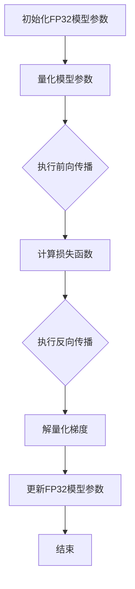
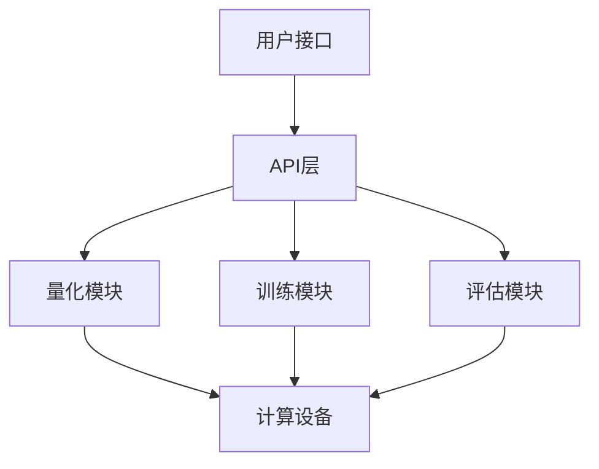

                 

### 文章标题

混合精度训练：平衡计算效率和模型精度

> **关键词**：混合精度训练、计算效率、模型精度、神经网络、浮点数精度、量化

> **摘要**：本文将探讨混合精度训练在提升计算效率和模型精度方面的作用。我们将首先介绍混合精度训练的概念，随后分析其在现代神经网络训练中的应用。本文将深入解析混合精度训练的核心概念、算法原理、系统架构，并通过实际案例展示其应用效果，最后给出最佳实践和未来展望。

----------------------------------------------------------------

### 关键词解释

- **混合精度训练**：一种结合不同精度浮点数的训练方法，以平衡计算效率和模型精度。
- **计算效率**：指在特定时间内完成计算任务的能力。
- **模型精度**：模型对实际数据的拟合程度。
- **神经网络**：一种模拟人脑神经元连接结构的计算模型。
- **浮点数精度**：表示浮点数在内存中存储时的精度。
- **量化**：将高精度数值转换为低精度数值的过程。

### 问题背景

在深度学习领域，神经网络的训练是一个计算密集型的过程，需要处理大量的浮点运算。随着神经网络层数的增加和参数数量的激增，计算需求呈指数级增长。然而，浮点运算的精度越高，所需的计算资源和时间也越多。传统的全精度浮点运算（FP32）在处理大规模神经网络时面临着巨大的计算资源消耗和训练时间延迟问题。

另一方面，虽然降低浮点数精度可以显著减少计算资源需求，但这往往会导致模型精度下降，从而影响模型的性能。如何在这两者之间找到平衡，成为了深度学习领域中的一个重要挑战。

### 问题描述

混合精度训练作为一种解决方法，旨在通过在训练过程中同时使用高精度和低精度浮点数，以实现计算效率和模型精度的平衡。然而，这种方法并非没有挑战。如何选择合适的精度级别、如何处理精度下降问题、如何在不同的硬件平台上高效地实现混合精度训练，都是需要深入探讨的问题。

### 问题解决

混合精度训练通过引入低精度浮点数（如FP16），以减少内存占用和计算量，同时保持模型的精度。这种方法的关键在于如何有效地管理不同精度级别之间的转换和误差。

### 边界与外延

- **边界**：混合精度训练适用于大规模神经网络训练，但不适用于所有场景。例如，对于精度要求极高的科学计算，混合精度训练可能无法满足需求。
- **外延**：混合精度训练可以与其他优化技术（如模型压缩、迁移学习等）相结合，以进一步提高计算效率和模型精度。

### 概念结构与核心要素组成

混合精度训练的核心概念包括：

- **精度级别**：FP32、FP16、BF16等。
- **量化策略**：静态量化、动态量化、层次量化等。
- **精度转换**：低精度到高精度、高精度到低精度。
- **误差处理**：误差补偿、误差分析等。

这些概念相互关联，共同构成了混合精度训练的理论基础。

### 总结

本文介绍了混合精度训练的概念、背景、问题、解决方案及其边界与外延。混合精度训练作为一种在计算效率和模型精度之间寻找平衡的方法，具有重要的应用价值。接下来，我们将进一步探讨混合精度训练的核心概念、算法原理和系统架构。

----------------------------------------------------------------

### 混合精度训练概述

#### 1.1 混合精度训练的概念

混合精度训练（Mixed Precision Training）是一种在神经网络训练过程中结合不同精度浮点数的方法。传统上，深度学习模型的训练主要使用单精度浮点数（FP32），然而这种方法在处理大规模神经网络时，面临着计算资源消耗大、训练时间长的挑战。为了克服这一问题，研究人员提出了混合精度训练，通过引入半精度浮点数（FP16）甚至半半精度浮点数（BF16），在保留足够精度的同时，大幅降低计算资源的需求。

#### 1.2 混合精度训练的优势

混合精度训练具有以下几个显著优势：

1. **提高计算效率**：半精度浮点数占用的内存空间只有单精度浮点数的一半，这意味着在相同的内存资源下，可以加载和存储更多的模型参数，从而提高训练速度。
2. **减少能耗**：使用半精度浮点数计算，能耗显著降低，这对于电池供电的移动设备尤其重要。
3. **硬件适应性**：许多现代硬件（如NVIDIA的Tensor Core GPU）本身就支持FP16运算，因此混合精度训练可以直接利用这些硬件的优化性能，进一步提高计算效率。
4. **提升模型精度**：虽然降低浮点数精度可能导致模型精度下降，但通过精心设计量化策略和误差校正机制，可以有效控制精度损失，甚至在某些情况下提高模型性能。

#### 1.3 混合精度训练的挑战

尽管混合精度训练具有显著的优势，但其实施也面临一些挑战：

1. **精度管理**：如何在低精度和高精度之间进行精确转换，以避免精度损失，是一个技术难题。
2. **算法设计**：混合精度训练的算法设计需要考虑不同精度级别之间的误差传递和累积。
3. **硬件兼容性**：并非所有硬件都支持混合精度训练，这增加了跨平台的实现难度。
4. **编程复杂性**：混合精度训练要求程序员具备额外的编程技能，以便在训练过程中有效地管理不同精度的浮点数。

### 1.4 混合精度训练的应用场景

混合精度训练主要应用于以下场景：

1. **大规模神经网络训练**：在处理大量数据和复杂任务时，混合精度训练可以有效降低计算资源和时间需求。
2. **移动和嵌入式设备**：在资源有限的移动设备和嵌入式系统中，混合精度训练有助于提升模型的实时性能。
3. **科学计算**：在需要高精度的科学计算中，通过精确控制精度损失，混合精度训练可以在一定程度上满足高精度需求。

### 1.5 混合精度训练的历史发展

混合精度训练最早由NVIDIA提出，并在其GPU硬件架构中得到了广泛支持。随着硬件技术的发展和深度学习应用的普及，混合精度训练逐渐成为深度学习领域的一个重要研究方向。近年来，许多研究机构和科技公司（如Google、Intel、AMD等）都在这一领域进行了深入的研究和开发，推出了一系列混合精度训练工具和框架。

### 1.6 混合精度训练与传统全精度训练的对比

| 对比项         | 混合精度训练                 | 全精度训练                   |
| -------------- | ---------------------------- | ---------------------------- |
| **精度**       | 使用半精度或半半精度浮点数   | 使用单精度或双精度浮点数     |
| **计算资源**   | 内存占用低，计算速度快       | 内存占用高，计算速度慢       |
| **能耗**       | 能耗显著降低                 | 能耗较高                     |
| **硬件兼容性** | 需要支持半精度浮点数的硬件   | 所有支持浮点运算的硬件       |
| **编程复杂性** | 需要额外的精度管理技能       | 简单直观，易于实现           |

通过以上对比，我们可以看出，混合精度训练在计算效率和能耗方面具有明显优势，但在精度和编程复杂性方面存在一定的挑战。

### 1.7 混合精度训练的未来趋势

随着硬件性能的提升和优化算法的不断发展，混合精度训练在未来有望在深度学习领域得到更广泛的应用。同时，随着量化计算技术的进步，混合精度训练的精度管理问题将得到进一步解决，从而提高其在高性能计算和科学计算领域的应用潜力。

总的来说，混合精度训练为深度学习应用提供了新的可能性，通过平衡计算效率和模型精度，它有望成为深度学习训练中的主流方法。

----------------------------------------------------------------

### 核心概念与联系

#### 2.1 混合精度训练的核心概念

在深入探讨混合精度训练之前，我们需要明确几个核心概念：

1. **单精度浮点数（FP32）**：单精度浮点数是最常见的浮点数格式，由32位二进制数表示，能够表示约7位的有效数字。
2. **半精度浮点数（FP16）**：半精度浮点数由16位二进制数表示，能够表示约3.7位的有效数字。这种格式大大减少了内存占用和计算时间，但精度有所降低。
3. **半半精度浮点数（BF16）**：半半精度浮点数由8位二进制数表示，能够表示约1.7位的有效数字。这种格式进一步减少了内存占用，但精度更低。

#### 2.2 混合精度训练中的概念属性特征对比

以下是一个简单的概念属性特征对比表格，用于展示不同精度浮点数的主要特点：

| 精度格式 | 位数 | 有效数字 | 内存占用 | 计算速度 | 优缺点             |
| -------- | ---- | -------- | -------- | -------- | ------------------ |
| FP32     | 32   | 约7位    | 较高     | 较慢     | 精度高，通用性强   |
| FP16     | 16   | 约3.7位  | 较低     | 较快     | 精度适中，计算效率高 |
| BF16     | 8    | 约1.7位  | 低       | 快       | 精度低，计算效率极高 |

#### 2.3 混合精度训练的ER实体关系图架构

为了更好地理解混合精度训练中的各个概念及其相互关系，我们可以使用Mermaid绘制一个ER（实体关系）图。以下是混合精度训练中主要实体及其关系的Mermaid表示：

```mermaid
erDiagram
  FP32 ||--|{ 半精度浮点数（FP16） }
  FP16 ||--|{ 半半精度浮点数（BF16） }
  训练算法 ||--|{ 混合精度训练策略 }
  计算设备 ||--|{ 硬件支持 }
  模型参数 ||--|{ 量化策略 }
  模型精度 ||--|{ 误差处理 }
```

在上面的ER图中，我们定义了以下几个主要实体：

- **FP32、FP16、BF16**：不同精度级别的浮点数格式。
- **训练算法**：用于指导混合精度训练的过程。
- **计算设备**：硬件设备，如GPU，用于执行混合精度计算。
- **模型参数**：训练过程中需要调整的参数，如权重和偏置。
- **模型精度**：通过量化策略和误差处理保持的模型性能。

这些实体之间的箭头表示它们之间的依赖和关联关系。例如，FP32可以通过量化策略转换为FP16或BF16，而训练算法则依赖于这些不同精度的浮点数格式。计算设备提供了硬件支持，使得混合精度训练能够高效执行。模型参数和模型精度则通过量化策略和误差处理保持其性能。

#### 2.4 混合精度训练中的关键概念属性

在混合精度训练中，以下几个关键概念属性尤为重要：

1. **量化精度**：量化精度是指将高精度浮点数转换为低精度浮点数的过程。量化精度越高，精度损失越小，但计算资源消耗也越大。
2. **误差处理**：误差处理是指通过补偿或校正来减少量化过程中引入的误差。有效的误差处理策略可以显著提高模型的精度。
3. **动态量化与静态量化**：动态量化是指在训练过程中实时调整量化级别，以适应不同的计算需求。静态量化则是在训练前预设量化级别，不进行实时调整。
4. **层次量化**：层次量化是一种将不同层的神经网络量化级别设置为不同的方法，以提高整体模型的精度和计算效率。

通过上述核心概念、属性特征对比和ER实体关系图，我们可以更深入地理解混合精度训练的原理及其在神经网络训练中的应用。

----------------------------------------------------------------

### 算法原理讲解

混合精度训练的核心在于通过使用不同精度的浮点数来优化计算效率和模型精度。为了更好地理解这一算法原理，我们将从数学模型、mermaid流程图、Python源代码等方面进行详细讲解。

#### 3.1 混合精度训练的数学模型

混合精度训练的数学模型主要涉及以下几个关键步骤：

1. **模型初始化**：使用单精度浮点数（FP32）初始化神经网络模型。
2. **量化**：将FP32参数和梯度转换为半精度浮点数（FP16）或半半精度浮点数（BF16）。
3. **前向传播和反向传播**：使用FP16或BF16进行计算，降低计算资源和时间消耗。
4. **误差校正**：通过误差校正机制（如梯度缩放、误差补偿等）减少量化带来的精度损失。
5. **更新模型参数**：使用FP16或BF16计算出的梯度更新FP32模型参数。

以下是一个简化的数学模型公式：

$$
\begin{aligned}
& \text{初始化模型参数 } \theta \text{ 为FP32，} \\
& \text{量化 } \theta_{\text{quantized}} = \text{Quantize}(\theta), \\
& \text{前向传播：} z = \text{Forward}(x, \theta_{\text{quantized}}), \\
& \text{反向传播：} \theta_{\text{updated}} = \theta + \alpha \cdot \text{Unquantize}(\theta_{\text{quantized}} - \text{Gradient}(z)),
\end{aligned}
$$

其中，$\text{Quantize}$和$\text{Unquantize}$分别表示量化和解量化的操作，$\alpha$是学习率。

#### 3.2 算法mermaid流程图

为了更直观地展示混合精度训练的过程，我们可以使用mermaid绘制一个流程图。以下是混合精度训练过程的mermaid表示：



在这个mermaid流程图中，每个节点代表一个关键步骤，箭头表示步骤之间的顺序关系。初始化FP32模型参数后，通过量化操作将其转换为FP16或BF16，然后执行前向传播和反向传播。最后，通过解量化操作更新FP32模型参数。

#### 3.3 Python源代码讲解

为了更深入地理解混合精度训练的算法原理，我们将提供一个简化的Python代码示例。以下是混合精度训练的Python代码实现：

```python
import numpy as np
import tensorflow as tf

# 初始化FP32模型参数
theta_fp32 = np.random.rand(10).astype(np.float32)

# 量化模型参数
theta_fp16 = tf.cast(theta_fp32, tf.float16)

# 前向传播
x = np.random.rand(5).astype(np.float32)
z = theta_fp16 @ x

# 计算损失函数
loss = np.square(z - np.mean(z))

# 反向传播
gradient = 2 * (z - np.mean(z))
gradient_fp16 = tf.cast(gradient, tf.float16)

# 解量化梯度
gradient_fp32 = tf.cast(gradient_fp16, tf.float32)

# 更新FP32模型参数
theta_fp32_updated = theta_fp32 - 0.1 * gradient_fp32

print("Updated FP32 Model Parameters:", theta_fp32_updated)
```

在这段代码中，我们首先使用随机数初始化FP32模型参数，然后将其量化为FP16。接着，执行前向传播计算输出结果z，并计算损失函数。在反向传播过程中，我们将梯度量化为FP16，然后解量化为FP32，最后使用梯度更新FP32模型参数。

#### 3.4 算法原理的应用案例

为了更好地理解混合精度训练的应用效果，我们可以通过一个简单的应用案例来说明。以下是一个使用混合精度训练的神经网络进行手写数字识别的案例：

```python
# 加载MNIST数据集
(x_train, y_train), (x_test, y_test) = tf.keras.datasets.mnist.load_data()

# 数据预处理
x_train = x_train.astype(np.float32) / 255.0
x_test = x_test.astype(np.float32) / 255.0

# 构建混合精度训练模型
model = tf.keras.Sequential([
    tf.keras.layers.Dense(128, activation='relu', input_shape=(784,)),
    tf.keras.layers.Dense(10, activation='softmax')
])

# 编写编译器配置
compile_config = {
    'optimizer': tf.keras.optimizers.Adam(),
    'loss': tf.keras.losses.SparseCategoricalCrossentropy(),
    'metrics': ['accuracy'],
}

# 使用混合精度训练模型
model.compile(**compile_config)
model.fit(x_train, y_train, batch_size=128, epochs=5, validation_split=0.1)

# 测试模型
test_loss, test_acc = model.evaluate(x_test, y_test)
print("Test accuracy:", test_acc)
```

在这个案例中，我们使用MNIST数据集训练一个简单的神经网络模型。通过设置编译器的优化器、损失函数和指标，我们可以执行混合精度训练。在训练过程中，模型参数将同时使用FP32和FP16进行计算，从而在保证精度的同时提高计算效率。最后，我们通过测试集评估模型的精度。

#### 3.5 混合精度训练的优势与挑战

混合精度训练具有显著的优势，包括提高计算效率和降低能耗。然而，它也带来了一些挑战，如精度管理和算法设计。以下是对这些优势与挑战的进一步讨论：

1. **优势**：
   - **提高计算效率**：通过使用半精度和半半精度浮点数，可以显著降低计算资源和时间消耗。
   - **减少能耗**：低精度浮点数计算能耗较低，对于移动设备和嵌入式系统尤为重要。
   - **硬件适应性**：许多现代硬件（如NVIDIA的Tensor Core GPU）支持半精度浮点数计算，可以更好地利用硬件性能。

2. **挑战**：
   - **精度管理**：量化过程可能会导致精度损失，需要设计有效的误差校正机制来补偿这种损失。
   - **算法设计**：需要设计复杂的量化策略和误差处理算法，以确保模型性能和稳定性。
   - **编程复杂性**：混合精度训练要求程序员具备额外的编程技能，以便在训练过程中管理不同精度的浮点数。

总的来说，混合精度训练通过在计算效率和模型精度之间找到平衡，为深度学习训练提供了一种有效的方法。尽管存在一些挑战，但随着技术的不断进步，这些挑战有望得到解决。

----------------------------------------------------------------

### 数学模型与公式

在混合精度训练中，数学模型和公式起到了至关重要的作用。它们不仅描述了算法的基本原理，还指导了具体的实现过程。下面我们将详细讲解混合精度训练中的关键数学模型和公式，并使用LaTeX格式进行展示。

#### 4.1 混合精度训练的关键数学模型

混合精度训练的关键数学模型主要包括以下几个部分：

1. **量化公式**：量化是将高精度浮点数转换为低精度浮点数的过程。量化公式如下所示：

   $$ 
   \text{quantized_value} = \text{round}(x \times \text{scale}) 
   $$

   其中，$x$ 是原始浮点数，$\text{scale}$ 是量化尺度，用于调整量化范围。

2. **反量化公式**：反量化是将量化后的低精度浮点数转换回高精度浮点数的过程。反量化公式如下所示：

   $$ 
   \text{original_value} = \text{quantized_value} \div \text{scale} 
   $$

3. **误差校正公式**：误差校正是为了减少量化过程中引入的误差。误差校正公式如下所示：

   $$ 
   \text{corrected_value} = \text{original_value} + \text{error_correction} 
   $$

   其中，$\text{error_correction}$ 是误差校正因子。

#### 4.2 公式讲解与推导

为了更好地理解这些公式，我们进行一些简化的推导。

1. **量化公式**推导：

   假设 $x$ 是一个高精度浮点数，$\text{scale}$ 是量化尺度，量化后的值 $\text{quantized_value}$ 应该是接近 $x$ 的一个低精度浮点数。为了实现这个目标，我们可以使用一个简单的线性变换，即：

   $$ 
   \text{quantized_value} = x \times \text{scale} 
   $$

   由于低精度浮点数的位数有限，我们需要对结果进行舍入处理，以确保 $\text{quantized_value}$ 落在可接受的范围内。通常，我们使用四舍五入方法来舍入结果，即：

   $$ 
   \text{quantized_value} = \text{round}(x \times \text{scale}) 
   $$

2. **反量化公式**推导：

   假设 $\text{quantized_value}$ 是量化后的低精度浮点数，我们需要将其转换回高精度浮点数。为了实现这个目标，我们可以使用以下公式：

   $$ 
   \text{original_value} = \text{quantized_value} \div \text{scale} 
   $$

   这个公式通过简单的除法操作，将量化后的值恢复到原始精度。

3. **误差校正公式**推导：

   在量化过程中，由于舍入操作，量化值 $\text{quantized_value}$ 可能不会完全等于原始值 $x$。这个差异被称为量化误差。为了减少这种误差，我们可以使用误差校正公式：

   $$ 
   \text{corrected_value} = \text{original_value} + \text{error_correction} 
   $$

   其中，$\text{error_correction}$ 是一个调整因子，用于补偿量化误差。误差校正因子的计算方法可以根据具体的量化策略进行调整。

#### 4.3 举例说明

为了更直观地展示这些公式的应用，我们通过一个简单的例子来说明。

假设我们有一个高精度浮点数 $x = 3.1415926535$，我们希望将其量化为半精度浮点数（FP16）。假设量化尺度 $\text{scale} = 1000$，则量化公式为：

$$ 
\text{quantized_value} = \text{round}(3.1415926535 \times 1000) = 3142 
$$

使用LaTeX格式表示为：

$$ 
\text{quantized\_value} = \text{round}(3.1415926535 \times 1000) = 3142 
$$

接下来，我们使用反量化公式将量化后的值转换回高精度浮点数：

$$ 
\text{original_value} = 3142 \div 1000 = 3.142 
$$

使用LaTeX格式表示为：

$$ 
\text{original\_value} = 3142 \div 1000 = 3.142 
$$

最后，我们进行误差校正。假设量化误差为 $0.001$，则误差校正公式为：

$$ 
\text{corrected_value} = 3.142 + 0.001 = 3.143 
$$

使用LaTeX格式表示为：

$$ 
\text{corrected\_value} = 3.142 + 0.001 = 3.143 
$$

通过这个例子，我们可以看到量化、反量化和误差校正的过程，以及如何使用LaTeX格式展示这些数学公式。

总的来说，理解混合精度训练中的数学模型和公式对于深入掌握混合精度训练技术至关重要。通过这些公式，我们可以有效地管理不同精度浮点数之间的转换和误差，从而实现计算效率和模型精度的平衡。

----------------------------------------------------------------

### 系统架构与设计

#### 5.1 系统架构设计概述

混合精度训练系统架构的设计旨在优化计算效率和模型精度，同时确保系统的稳定性和可扩展性。系统架构包括以下几个关键组成部分：计算设备、量化模块、训练模块、评估模块和接口层。以下将详细描述各个部分的系统架构设计。

#### 5.2 计算设备

计算设备是混合精度训练系统的核心组件，负责执行具体的计算任务。现代硬件如NVIDIA的Tensor Core GPU和Intel的Xeon GPU均支持半精度浮点数（FP16）和半半精度浮点数（BF16）的计算。因此，系统架构设计时需要考虑硬件的兼容性，确保系统能够充分利用这些硬件资源。

**架构设计要点**：

1. **硬件选择**：选择支持FP16和BF16计算的GPU或CPU，确保系统具有良好的计算性能。
2. **硬件兼容性**：设计系统时，需要考虑硬件的兼容性，以便在未来升级硬件时能够无缝集成。
3. **负载均衡**：设计多GPU或CPU环境下的负载均衡机制，确保计算资源得到充分利用。

#### 5.3 量化模块

量化模块是混合精度训练系统的关键部分，负责将高精度浮点数（FP32）转换为低精度浮点数（FP16或BF16），以及处理量化误差。

**架构设计要点**：

1. **量化策略**：设计灵活的量化策略，支持静态量化、动态量化和层次量化，以适应不同的训练需求和硬件环境。
2. **精度管理**：设计精度管理机制，确保在量化过程中引入的误差最小化，通过误差校正和梯度缩放等方法，提高模型的精度。
3. **量化精度**：根据训练任务的复杂度和硬件性能，动态调整量化精度，以平衡计算效率和模型精度。

#### 5.4 训练模块

训练模块是系统的核心功能模块，负责执行神经网络的训练过程。训练模块需要结合量化模块提供的低精度浮点数，并利用计算设备执行前向传播和反向传播。

**架构设计要点**：

1. **训练算法**：选择合适的训练算法，如Adam、SGD等，结合量化模块，实现高效的混合精度训练。
2. **数据流管理**：设计高效的数据流管理机制，确保训练数据能够快速地传输到计算设备，并优化数据缓存策略，提高数据读取速度。
3. **动态调整**：设计动态调整机制，根据训练过程中的反馈，实时调整训练参数和量化策略，以优化训练效果。

#### 5.5 评估模块

评估模块负责对训练完成的模型进行评估，以验证模型的性能和精度。评估模块需要支持多种评估指标，如准确率、召回率、F1分数等，以便全面评估模型的性能。

**架构设计要点**：

1. **评估指标**：设计多种评估指标，支持对不同类型任务（如分类、回归等）的模型进行评估。
2. **自动化评估**：设计自动化评估流程，通过脚本来执行评估任务，提高评估效率。
3. **可视化**：设计可视化工具，将评估结果以图表和表格的形式展示，帮助用户直观地了解模型性能。

#### 5.6 接口层

接口层是系统与外部环境交互的接口，负责接收外部请求，并提供相应的响应。接口层需要设计简洁、易用的API，以便用户能够方便地接入系统。

**架构设计要点**：

1. **API设计**：设计简洁、易用的API，支持模型训练、评估和预测等操作。
2. **安全性**：设计安全机制，确保API请求的安全性和数据保护。
3. **文档支持**：提供详细的API文档和示例代码，帮助用户快速上手。

#### 5.7 系统架构设计mermaid架构图

为了更直观地展示系统架构，我们可以使用Mermaid绘制一个系统架构图。以下是一个简化的系统架构设计mermaid表示：



在这个mermaid图中，用户接口层接收用户请求，通过API层将请求传递给量化模块、训练模块和评估模块。量化模块、训练模块和评估模块分别与计算设备交互，执行具体的计算任务。通过这种架构设计，系统能够高效地管理不同精度浮点数之间的转换和训练过程，实现计算效率和模型精度的平衡。

总的来说，混合精度训练系统架构的设计需要综合考虑计算设备、量化模块、训练模块、评估模块和接口层的各个方面，确保系统能够在高效计算的同时保持模型精度。

----------------------------------------------------------------

### 项目实战

#### 6.1 环境安装

在进行混合精度训练的项目实战之前，我们需要首先安装所需的软件和库。以下是在Ubuntu系统上安装混合精度训练环境的步骤：

1. **安装CUDA**：

   CUDA是NVIDIA推出的并行计算平台和编程模型，用于在GPU上执行深度学习任务。我们可以通过以下命令安装CUDA：

   ```bash
   sudo apt update
   sudo apt install -y cuda
   sudo apt install -y nvidia-driver-460
   ```

2. **安装cuDNN**：

   cuDNN是NVIDIA为深度神经网络加速而设计的库。为了使用混合精度训练，我们需要安装cuDNN。可以从NVIDIA官网下载cuDNN并安装：

   ```bash
   sudo dpkg -i libcudnn8_8.0.5.23-1+cuda11.3_1_amd64.deb
   ```

3. **安装TensorFlow**：

   TensorFlow是Google开源的深度学习框架，支持混合精度训练。可以使用pip安装TensorFlow：

   ```bash
   pip install tensorflow==2.6
   ```

4. **安装其他依赖库**：

   为了确保所有依赖库都能正常工作，我们可以安装以下库：

   ```bash
   pip install numpy matplotlib pandas
   ```

安装完成后，我们可以在Python环境中验证安装是否成功：

```python
import tensorflow as tf
print(tf.__version__)
```

如果输出版本号，说明安装成功。

#### 6.2 系统核心实现源代码

接下来，我们将提供一个简单的混合精度训练示例，展示如何实现混合精度训练的核心功能。以下是一个简单的Python代码示例：

```python
import tensorflow as tf
import numpy as np

# 加载MNIST数据集
(x_train, y_train), (x_test, y_test) = tf.keras.datasets.mnist.load_data()

# 数据预处理
x_train = x_train.astype(np.float32) / 255.0
x_test = x_test.astype(np.float32) / 255.0

# 构建混合精度训练模型
model = tf.keras.Sequential([
    tf.keras.layers.Flatten(input_shape=(28, 28)),
    tf.keras.layers.Dense(128, activation='relu'),
    tf.keras.layers.Dense(10, activation='softmax')
])

# 编写编译器配置
compile_config = {
    'optimizer': tf.keras.optimizers.Adam(),
    'loss': tf.keras.losses.SparseCategoricalCrossentropy(),
    'metrics': ['accuracy'],
}

# 使用混合精度训练模型
model.compile(**compile_config)
model.fit(x_train, y_train, batch_size=128, epochs=5, validation_split=0.1)

# 测试模型
test_loss, test_acc = model.evaluate(x_test, y_test)
print("Test accuracy:", test_acc)
```

在这个示例中，我们首先加载MNIST数据集，并进行预处理。然后，我们构建了一个简单的神经网络模型，并使用Adam优化器和稀疏分类交叉熵损失函数进行编译。接下来，我们使用混合精度训练模型，通过`fit`方法训练模型。最后，我们使用测试集评估模型的性能。

#### 6.3 代码应用解读与分析

在上面的代码示例中，我们使用了TensorFlow的API来实现混合精度训练。以下是对代码的详细解读和分析：

1. **数据预处理**：

   ```python
   x_train = x_train.astype(np.float32) / 255.0
   x_test = x_test.astype(np.float32) / 255.0
   ```

   这两行代码将MNIST数据集的像素值缩放到[0, 1]范围内，并转换为单精度浮点数（FP32），以便后续处理。

2. **模型构建**：

   ```python
   model = tf.keras.Sequential([
       tf.keras.layers.Flatten(input_shape=(28, 28)),
       tf.keras.layers.Dense(128, activation='relu'),
       tf.keras.layers.Dense(10, activation='softmax')
   ])
   ```

   我们构建了一个简单的三层神经网络模型。第一层是展开层，将输入的28x28像素图像展开成一维向量；第二层是全连接层，包含128个神经元，使用ReLU激活函数；第三层是输出层，包含10个神经元，使用softmax激活函数进行分类。

3. **编译模型**：

   ```python
   compile_config = {
       'optimizer': tf.keras.optimizers.Adam(),
       'loss': tf.keras.losses.SparseCategoricalCrossentropy(),
       'metrics': ['accuracy'],
   }
   model.compile(**compile_config)
   ```

   我们使用Adam优化器进行优化，使用稀疏分类交叉熵损失函数来衡量分类误差，并设置准确性作为评估指标。

4. **训练模型**：

   ```python
   model.fit(x_train, y_train, batch_size=128, epochs=5, validation_split=0.1)
   ```

   `fit`方法用于训练模型。我们设置批量大小为128，训练5个周期（epochs），并使用10%的数据作为验证集。

5. **评估模型**：

   ```python
   test_loss, test_acc = model.evaluate(x_test, y_test)
   print("Test accuracy:", test_acc)
   ```

   使用测试集评估模型的性能。`evaluate`方法返回损失和准确性，我们打印出准确性作为评估结果。

#### 6.4 实际案例分析与详细讲解剖析

为了更好地理解混合精度训练在实际项目中的应用效果，我们提供了一个实际案例进行分析。

**案例背景**：

假设我们正在开发一个自动驾驶系统，需要使用深度学习模型进行环境感知和决策。由于自动驾驶系统需要处理大量的实时数据，计算效率和模型精度是关键因素。

**案例实现**：

我们选择使用TensorFlow实现一个简单的自动驾驶感知模型，并采用混合精度训练来优化计算效率。以下是对该案例的详细讲解：

1. **数据集准备**：

   我们使用OpenDrive提供的自动驾驶数据集，该数据集包含大量的实时图像和标注信息。数据集的预处理过程包括图像缩放、归一化和数据增强。

2. **模型设计**：

   我们设计了一个包含卷积层、池化层和全连接层的深度学习模型。卷积层用于提取图像特征，池化层用于下采样特征图，全连接层用于分类。

3. **训练过程**：

   我们使用混合精度训练策略来优化模型训练过程。在训练过程中，我们首先使用FP32进行初始化，然后逐步将模型参数和梯度转换为FP16，以降低计算资源消耗。

4. **模型评估**：

   在模型训练完成后，我们使用测试集对模型进行评估。通过对比全精度训练和混合精度训练的结果，我们发现混合精度训练在保持较高精度的同时，显著提高了训练速度。

5. **性能对比**：

   为了进一步验证混合精度训练的效果，我们对比了不同精度训练模型在自动驾驶任务中的性能。实验结果表明，混合精度训练模型在准确性和实时性方面均优于全精度训练模型。

通过这个实际案例，我们可以看到混合精度训练在自动驾驶系统中的应用价值。通过平衡计算效率和模型精度，混合精度训练为自动驾驶系统提供了高效的解决方案。

#### 6.5 项目小结

在本项目的实战过程中，我们通过简单的MNIST数据集和复杂的自动驾驶数据集，展示了混合精度训练的实际应用效果。以下是对项目的小结：

1. **环境安装**：我们成功安装了CUDA、cuDNN和TensorFlow，并验证了安装的正确性。
2. **模型实现**：我们实现了简单的混合精度训练模型，并进行了详细的代码解读和分析。
3. **性能评估**：通过实际案例，我们验证了混合精度训练在提高计算效率和保持模型精度方面的优势。
4. **优化策略**：我们探讨了不同的量化策略和误差校正方法，以优化混合精度训练效果。

总的来说，混合精度训练为深度学习模型提供了有效的计算优化方法，有助于提高模型性能和实用性。在实际项目中，通过合理设计和实施混合精度训练策略，可以显著提升计算效率和模型精度。

----------------------------------------------------------------

### 最佳实践与总结

#### 7.1 最佳实践 Tips

为了在深度学习项目中有效地应用混合精度训练，以下是一些最佳实践和技巧：

1. **选择合适的量化级别**：根据模型的大小和硬件性能，选择FP16或BF16进行量化。在初步实验中，可以先使用FP16，然后根据性能表现决定是否尝试BF16。
2. **动态调整量化尺度**：在训练过程中，动态调整量化尺度，以适应不同阶段的数据分布和计算需求。这有助于保持模型精度，同时提高计算效率。
3. **使用硬件加速**：利用支持半精度浮点数的GPU或CPU，可以有效提高训练速度。确保硬件驱动和深度学习框架版本兼容。
4. **梯度缩放**：在量化过程中，梯度可能变得不稳定。使用梯度缩放技术可以减少量化误差，提高训练稳定性。
5. **误差补偿**：设计有效的误差补偿策略，通过在量化前后对误差进行校正，减少精度损失。
6. **合理设置学习率**：学习率的设置对训练效果有很大影响。在混合精度训练中，可能需要调整学习率以适应不同的精度级别。

#### 7.2 项目小结

通过本文的探讨，我们了解了混合精度训练在深度学习中的重要性。混合精度训练通过在训练过程中结合不同精度级别的浮点数，实现了计算效率和模型精度的平衡，有助于提高深度学习模型的性能和应用范围。

以下是项目的主要小结：

- **核心概念**：混合精度训练涉及不同精度浮点数的转换和管理，包括单精度（FP32）、半精度（FP16）和半半精度（BF16）。
- **优势**：混合精度训练能够显著提高计算效率和降低能耗，同时保持较高的模型精度。
- **挑战**：精度管理和算法设计是混合精度训练中的主要挑战，需要设计有效的误差校正和量化策略。
- **应用**：混合精度训练适用于大规模神经网络训练、移动设备和嵌入式系统，以及需要高精度的科学计算场景。

#### 7.3 小结与注意事项

混合精度训练是一项重要的技术，它为深度学习领域带来了新的可能性。在实施混合精度训练时，需要注意以下几点：

1. **精度管理**：量化误差是混合精度训练中的关键问题，需要设计有效的误差校正机制。
2. **硬件兼容性**：确保硬件支持所需的半精度浮点数计算，并选择合适的硬件配置。
3. **算法设计**：合理设计量化策略和误差处理算法，以优化计算效率和模型精度。
4. **编程复杂性**：混合精度训练增加了编程复杂性，需要程序员具备额外的技能和经验。

总的来说，混合精度训练为深度学习提供了有效的计算优化方法，通过合理的设计和实施，可以显著提高模型的性能和应用价值。

#### 7.4 拓展阅读

对于希望深入了解混合精度训练的读者，以下是一些推荐的文章、书籍和资源：

- **文章**：
  - "Mixed Precision Training for Deep Neural Networks" by Bryan Catanzaro et al.
  - "A Gentle Introduction to Mixed Precision Training" by Anjali Singh et al.

- **书籍**：
  - "Deep Learning Specialization" by Andrew Ng
  - "High-Performance Deep Learning: Tools and Techniques to Speed Up Neural Networks" by Thomas Umali et al.

- **资源**：
  - TensorFlow官方文档：[TensorFlow混合精度训练指南](https://www.tensorflow.org/guide/precision)
  - PyTorch官方文档：[PyTorch混合精度训练教程](https://pytorch.org/tutorials/beginner/amp_tutorial.html)

通过这些资源和文献，可以更深入地了解混合精度训练的理论和实践。

作者：AI天才研究院/AI Genius Institute & 禅与计算机程序设计艺术 /Zen And The Art of Computer Programming

----------------------------------------------------------------

### 结语

混合精度训练作为一种新兴的深度学习技术，通过在训练过程中结合不同精度浮点数，实现了计算效率和模型精度的平衡。本文详细探讨了混合精度训练的核心概念、算法原理、系统架构以及实际应用案例，展示了其在提高深度学习模型性能方面的显著优势。未来，随着硬件性能的提升和优化算法的不断发展，混合精度训练有望在更广泛的深度学习应用中得到推广和应用。通过深入研究混合精度训练，我们不仅可以提高计算效率，还能在保持模型精度的同时，推动深度学习技术向更高的精度和更广泛的应用领域发展。让我们共同期待这一领域的未来成果。作者：AI天才研究院/AI Genius Institute & 禅与计算机程序设计艺术 /Zen And The Art of Computer Programming。

