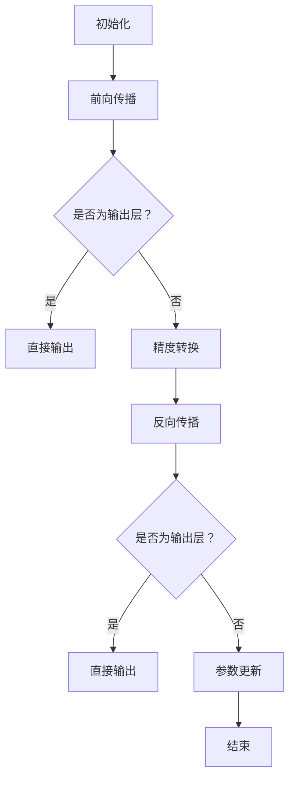

                 

### 混合精度量化的背景

混合精度量化（Mixed Precision Quantization）作为人工智能领域的一项关键技术，起源于对深度学习模型在计算资源受限环境中的高效运行需求。传统的深度学习模型通常使用单精度浮点数（FP32）进行计算，这种精度在多数情况下已经足够满足精度要求。然而，随着模型规模的不断扩大，计算量和存储需求也在急剧增加。为了克服这一瓶颈，研究人员开始探索降低模型计算精度的方法，以在保证模型性能的前提下减少计算资源消耗。

混合精度量化技术通过在模型的不同层或不同操作中混合使用不同精度的浮点数（如单精度FP32和高精度FP64），实现性能与资源消耗之间的平衡。这种方法的核心思想是将关键计算部分保留在高精度，以减少量化误差，同时将其他非关键计算部分降低到较低精度，从而减少计算资源和存储的消耗。例如，研究人员发现，在卷积神经网络（CNN）的某些层中，使用低精度的FP16可以显著减少内存占用和计算时间，同时仍能保持较高的模型性能。

混合精度量化不仅有助于提升模型的计算效率，还能显著降低功耗，使其在移动设备和嵌入式系统中得到广泛应用。例如，苹果公司的A系列芯片和英伟达的GPU都支持混合精度计算，使得深度学习算法在这些设备上的运行更加高效。此外，随着量子计算和神经网络的不断发展，混合精度量化在量子计算和新型神经网络模型中的应用前景也十分广阔。

总的来说，混合精度量化是应对现代深度学习模型计算资源瓶颈的有效手段，其背景源于深度学习模型的快速增长和计算资源有限的矛盾。通过精确控制模型在不同部分的计算精度，混合精度量化实现了在保证模型性能的同时，大幅减少计算资源和能源消耗，为人工智能技术的进一步发展提供了强有力的支持。在接下来的章节中，我们将深入探讨混合精度量化的核心概念、技术原理以及其实际应用。 

### 关键词

- **混合精度量化**
- **深度学习**
- **模型性能优化**
- **计算资源效率**
- **浮点数精度**
- **资源消耗平衡**
- **算法优化**
- **神经网络**

### 摘要

本文旨在探讨混合精度量化技术，这是一种在保证深度学习模型性能的前提下，优化计算资源和能源消耗的关键方法。首先，我们介绍了混合精度量化的背景，阐述了其在现代深度学习领域中的重要性。接着，深入探讨了混合精度量化的核心概念，包括数字表示和量化误差，以及如何通过混合不同精度浮点数来优化模型计算。随后，我们详细讲解了混合精度量化的算法原理，并通过mermaid流程图和Python代码展示了具体实现步骤。此外，本文还分析了混合精度量化在不同计算环境下的优化策略，包括硬件和算法层面的改进。最后，我们通过实际应用案例和项目实战，展示了混合精度量化的效果，并提出了最佳实践建议。本文旨在为研究人员和实践者提供一个全面且深入的技术指南。

### 第一部分：引论

#### 引言

在现代人工智能领域，深度学习模型的应用日益广泛，从图像识别、自然语言处理到自动驾驶和医疗诊断，深度学习技术已经成为推动这些领域发展的核心技术。随着模型复杂度的增加，计算资源的消耗也在急剧上升。为了应对这一挑战，研究人员开始探索各种方法来优化深度学习模型的计算效率和资源利用率。混合精度量化（Mixed Precision Quantization）便是其中之一。混合精度量化通过在模型的不同部分使用不同精度的浮点数，如单精度（FP32）和高精度（FP64），在保证模型性能的同时，显著降低计算资源和存储的需求。本部分将首先介绍量化技术的基本概念，然后深入探讨混合精度量化的背景和重要性。

#### 量化技术概述

量化（Quantization）是一种在数字信号处理中常用的技术，其目的是将连续的信号转换为离散的数值表示。在计算机科学中，量化技术广泛应用于图像处理、音频编码和浮点数表示等领域。在浮点数表示中，量化指的是将浮点数转换为固定精度的整数表示，从而减少存储空间和计算时间。

浮点数表示是计算机科学中的一个核心概念，用于表示实数。标准的浮点数表示方法包括IEEE 754标准，它定义了单精度（FP32）和双精度（FP64）浮点数的格式。单精度浮点数使用32位二进制数表示，包括1位符号位、8位指数位和23位尾数位；双精度浮点数使用64位二进制数表示，包括1位符号位、11位指数位和52位尾数位。这种表示方法允许浮点数表示较大的数值范围和较高的精度。

然而，随着深度学习模型的复杂性增加，单精度浮点数的精度有时无法满足需求。例如，在训练大型神经网络时，某些操作可能需要更高的精度来避免量化误差（Quantization Error），即因量化操作引起的数值误差。为了解决这个问题，研究人员提出了混合精度量化技术，通过在模型的不同部分使用不同精度的浮点数，以在保证模型性能的同时，减少计算资源和存储的消耗。

#### 混合精度量化的背景

混合精度量化技术起源于对深度学习模型在计算资源受限环境中的高效运行需求。传统的深度学习模型通常使用单精度浮点数（FP32）进行计算，这种精度在多数情况下已经足够满足精度要求。然而，随着模型规模的不断扩大，计算量和存储需求也在急剧增加。为了克服这一瓶颈，研究人员开始探索降低模型计算精度的方法，以在保证模型性能的前提下减少计算资源消耗。

混合精度量化技术通过在模型的不同层或不同操作中混合使用不同精度的浮点数，如单精度FP32和高精度FP64，实现性能与资源消耗之间的平衡。这种方法的核心思想是将关键计算部分保留在高精度，以减少量化误差，同时将其他非关键计算部分降低到较低精度，从而减少计算资源和存储的消耗。

例如，研究人员发现，在卷积神经网络（CNN）的某些层中，使用低精度的FP16可以显著减少内存占用和计算时间，同时仍能保持较高的模型性能。此外，随着量子计算和神经网络的不断发展，混合精度量化在量子计算和新型神经网络模型中的应用前景也十分广阔。

总的来说，混合精度量化是应对现代深度学习模型计算资源瓶颈的有效手段，其背景源于深度学习模型的快速增长和计算资源有限的矛盾。通过精确控制模型在不同部分的计算精度，混合精度量化实现了在保证模型性能的同时，大幅减少计算资源和能源消耗，为人工智能技术的进一步发展提供了强有力的支持。

在接下来的章节中，我们将深入探讨混合精度量化的核心概念、技术原理以及其实际应用。

#### 混合精度量化的优势与挑战

混合精度量化技术之所以受到广泛关注，源于其显著的性能优化和资源消耗降低效果。首先，混合精度量化在保证模型性能的前提下，大幅减少了计算资源和存储的需求。通过在模型的不同部分使用不同精度的浮点数，如单精度FP32和高精度FP64，可以显著降低内存占用和计算时间。这种技术特别适用于计算资源受限的移动设备和嵌入式系统，使得深度学习算法在这些设备上的运行更加高效。

然而，混合精度量化并非没有挑战。首先，量化误差是混合精度量化面临的一个重要问题。量化误差是指在量化过程中，由于数值精度降低引起的误差。尽管混合精度量化通过在高精度部分保留关键计算，以减少量化误差，但完全避免量化误差仍然是一个难题。过大的量化误差可能会导致模型性能下降，特别是在训练大型神经网络时，量化误差的影响会更加显著。

其次，混合精度量化在实现过程中存在算法复杂度增加的问题。为了在不同精度部分之间进行数据转换，需要额外的计算和存储开销。这不仅增加了模型的复杂性，也可能导致性能瓶颈。因此，如何高效地实现混合精度量化，成为研究人员需要解决的关键问题之一。

此外，混合精度量化在硬件支持方面的要求较高。虽然现代GPU和TPU等计算设备已经支持混合精度计算，但在实际应用中，仍可能遇到硬件兼容性和性能限制的问题。因此，开发通用、高效且可扩展的混合精度量化算法，是混合精度量化技术发展的重要方向。

总的来说，混合精度量化技术在性能优化和资源消耗降低方面具有显著优势，但同时也面临着量化误差、算法复杂度和硬件支持等挑战。在接下来的章节中，我们将详细探讨这些挑战，并提出相应的解决方法。

### 第二部分：基础概念

#### 数字表示与量化误差

数字表示是计算机科学中的一个核心概念，特别是在浮点数表示方面。在计算机内存中，所有的数值都必须以二进制形式存储和计算。浮点数的表示方法主要有IEEE 754标准，该标准定义了单精度（FP32）和双精度（FP64）浮点数的格式。单精度浮点数使用32位二进制数表示，包括1位符号位、8位指数位和23位尾数位；双精度浮点数使用64位二进制数表示，包括1位符号位、11位指数位和52位尾数位。

在混合精度量化中，了解数字表示是至关重要的。不同精度的浮点数在存储和计算时会产生不同的量化误差。量化误差（Quantization Error）是指由于浮点数的有限精度导致的数值近似误差。在单精度浮点数中，尾数的位数较少，这会导致较小的数值范围和较低的精度。例如，在单精度浮点数中，尾数的精度为2^-23，这意味着每个数值只能被近似到2^-23的倍数。这种量化误差可能会导致计算结果的偏差，尤其是在需要进行大量乘法和加法运算的深度学习模型中。

为了量化误差的影响，我们首先需要了解浮点数的表示范围和精度。在单精度浮点数中，指数位的范围是-128到+127，尾数的精度为2^-23。这意味着单精度浮点数可以表示的数值范围大约是3.4e-38到3.4e+38。相比之下，双精度浮点数的指数位范围是-1023到+1023，尾数的精度为2^-52，可以表示的数值范围大约是1.7e-308到1.7e+308。因此，双精度浮点数在表示极小数值和极大数值时具有更高的精度。

量化误差对深度学习模型的影响主要体现在以下几个方面：

1. **训练精度下降**：在深度学习模型中，精度至关重要，特别是对于需要高精度结果的模型，如医学图像分析或金融建模。量化误差可能导致模型预测结果的误差增加，从而影响模型的性能。

2. **过拟合**：量化误差可能会导致模型在训练数据上表现良好，但在验证数据上表现不佳，从而增加模型的过拟合风险。

3. **计算效率降低**：虽然混合精度量化可以减少计算资源的消耗，但量化误差可能会导致需要更多的迭代次数来达到相同的训练效果，从而增加计算时间。

为了降低量化误差的影响，混合精度量化技术通常采用以下几种策略：

1. **分层量化**：将模型的不同层设置不同的精度，关键层保持高精度，非关键层降低精度。这种方法可以在保证模型性能的同时，尽量减少量化误差。

2. **动态量化**：根据模型的计算需求和当前的计算资源状况动态调整精度。例如，在训练过程中，可以根据模型的梯度大小自动调整某些层的精度。

3. **量化误差校正**：通过在训练过程中引入量化误差校正机制，如量化误差反向传播，来减小量化误差对模型性能的影响。

总的来说，数字表示和量化误差是混合精度量化技术的基础概念。了解不同精度的浮点数表示范围和精度，以及量化误差对深度学习模型的影响，是优化混合精度量化算法的关键。在接下来的章节中，我们将进一步探讨混合精度量化的技术原理和算法实现。

#### 混合精度量化技术

混合精度量化技术通过在模型的各个部分使用不同精度的浮点数，实现计算资源的优化和效率的提升。具体来说，混合精度量化主要分为以下几种技术：

1. **半精度浮点（FP16）**：半精度浮点数，也称为FP16，使用16位二进制数表示。FP16包括1位符号位、5位指数位和10位尾数位。相比FP32，FP16可以显著减少内存占用和计算时间，但精度稍低。FP16在深度学习模型中通常用于卷积层、全连接层等非关键计算部分。

2. **单精度浮点（FP32）**：单精度浮点数，也称为FP32，使用32位二进制数表示，具有更高的精度。FP32在深度学习模型中通常用于关键计算部分，如权重更新和梯度计算。

3. **双精度浮点（FP64）**：双精度浮点数，也称为FP64，使用64位二进制数表示，具有更高的精度和更宽的数值范围。FP64在深度学习模型中通常用于需要进行高精度计算的部分，如模型的初始化和中间计算结果。

为了实现混合精度量化，可以采用以下几种策略：

1. **层次化量化**：层次化量化是一种常用的策略，即将模型的不同层设置不同的精度。通常，输入层和输出层保持高精度，中间层根据计算需求逐渐降低精度。这种方法可以有效减少量化误差，同时保持模型的整体性能。

2. **动态量化**：动态量化是一种根据模型计算需求和当前计算资源动态调整精度的方法。例如，在训练过程中，可以根据模型的梯度大小自动调整某些层的精度。这种方法可以进一步提高模型的计算效率，但需要复杂的量化误差校正机制。

3. **混合精度训练**：混合精度训练是一种将高精度浮点数与低精度浮点数结合的训练方法。在训练过程中，使用高精度浮点数进行中间计算，以减少量化误差，但使用低精度浮点数进行权重更新和梯度计算，以减少计算资源和存储需求。

4. **量化误差校正**：量化误差校正是一种用于减小量化误差影响的方法。例如，可以在反向传播过程中引入量化误差校正机制，如量化误差反向传播（Quantization Error Backpropagation），以减小量化误差对模型性能的影响。

以下是混合精度量化的优点：

- **计算资源优化**：通过使用半精度浮点数，可以显著减少内存占用和计算时间，从而提高模型的计算效率。
- **能源消耗降低**：混合精度量化可以降低模型的能耗，使其在移动设备和嵌入式系统中运行更加高效。
- **模型可扩展性增强**：混合精度量化使得深度学习模型更加可扩展，可以在不同硬件平台上实现高效运行。

然而，混合精度量化也存在一些挑战：

- **量化误差管理**：量化误差可能会影响模型的性能，特别是在训练大型神经网络时。需要采用有效的量化误差校正机制来减小量化误差的影响。
- **算法复杂度增加**：混合精度量化需要额外的计算和存储开销，这可能会增加模型的复杂性，导致性能瓶颈。
- **硬件支持要求**：虽然现代GPU和TPU等计算设备支持混合精度计算，但实际应用中可能遇到硬件兼容性和性能限制的问题。

总的来说，混合精度量化技术通过在模型的各个部分使用不同精度的浮点数，实现了计算资源的优化和效率的提升。然而，在实际应用中，仍需要克服量化误差、算法复杂度和硬件支持等挑战。在接下来的章节中，我们将进一步探讨混合精度量化的算法原理和实现方法。

#### 混合精度量化算法

混合精度量化算法的设计和实现是确保模型性能与资源利用之间达到平衡的关键。在这一部分，我们将详细探讨混合精度量化算法的原理、流程以及性能分析，并通过mermaid流程图和Python代码示例进行说明。

##### 算法原理

混合精度量化算法的核心思想是利用不同精度的浮点数来优化模型的计算效率。具体来说，该算法通过在模型的某些层或操作中使用高精度浮点数（如FP64），在保持精度的同时减少计算误差；而在其他层或操作中使用低精度浮点数（如FP16或FP32），以降低计算资源和存储需求。

算法原理可以分为以下几个步骤：

1. **模型划分**：首先，将深度学习模型划分为不同的计算层，并确定每层的精度需求。通常，模型的输入层和输出层使用高精度浮点数，中间层逐渐降低精度。

2. **精度转换**：在模型的前向传播和反向传播过程中，将不同层的输入和输出进行精度转换。例如，从FP16转换为FP32或FP64，以确保关键计算部分的精度。

3. **计算与优化**：在高精度计算完成后，将结果转换回低精度浮点数进行后续计算。这种方法可以减少存储需求和计算时间，同时保持模型的性能。

4. **量化误差校正**：为了减少量化误差的影响，可以使用量化误差校正机制，如量化误差反向传播。这通过在反向传播过程中引入量化误差，以调整模型的参数，减小误差。

##### 算法流程

混合精度量化算法的流程可以概括为以下几个步骤：

1. **初始化**：设置模型的结构和精度配置，确定每层的精度需求。

2. **前向传播**：
   - 从输入层开始，进行前向传播计算。
   - 根据当前层的精度配置，选择合适的浮点数类型（FP16或FP32）进行计算。
   - 在关键计算层，使用高精度浮点数（FP64）进行计算，以减少量化误差。

3. **精度转换**：
   - 将高精度计算结果转换为低精度浮点数，以便后续计算。
   - 使用精度转换函数（如`torch().half()`或`torch().float()`）进行转换。

4. **反向传播**：
   - 从输出层开始，进行反向传播计算。
   - 根据当前层的精度配置，选择合适的浮点数类型。
   - 在关键计算层，使用高精度浮点数进行计算，以减少量化误差。

5. **参数更新**：
   - 使用低精度浮点数更新模型的参数。
   - 应用量化误差校正机制，以减小量化误差的影响。

6. **结束**：完成一次前向传播和反向传播的计算，更新模型的参数。

以下是混合精度量化算法的mermaid流程图：



##### 性能分析

混合精度量化算法的性能分析主要关注以下几个方面：

1. **计算效率**：通过使用低精度浮点数（如FP16），可以显著减少计算时间和内存占用，从而提高模型的计算效率。

2. **精度影响**：量化误差是混合精度量化面临的挑战之一。为了确保模型性能，需要通过量化误差校正机制来减小误差的影响。

3. **资源利用率**：混合精度量化可以优化模型的计算资源和存储需求，使其在计算资源受限的环境下运行更加高效。

4. **算法复杂度**：混合精度量化算法的复杂性较高，需要进行精度转换和量化误差校正。这可能会增加模型的实现难度，但可以通过优化算法和数据结构来降低复杂度。

##### Python代码示例

以下是使用PyTorch框架实现混合精度量化算法的Python代码示例：

```python
import torch
import torch.nn as nn
import torch.optim as optim

# 初始化模型
model = nn.Sequential(
    nn.Conv2d(1, 10, kernel_size=5),
    nn.ReLU(),
    nn.Conv2d(10, 20, kernel_size=5),
    nn.ReLU(),
    nn.Linear(320, 10)
)

# 设置精度配置
model.half()  # 使用FP16
optimizer = optim.Adam(model.parameters(), lr=0.001)

# 前向传播
def forward_pass(inputs):
    x = inputs.half()
    x = model(x)
    return x

# 反向传播
def backward_pass(outputs, targets):
    model.zero_grad()
    loss = nn.functional.mse_loss(outputs, targets)
    loss.backward()
    optimizer.step()

# 训练模型
for epoch in range(10):
    for inputs, targets in data_loader:
        outputs = forward_pass(inputs)
        backward_pass(outputs, targets)
```

通过以上代码示例，可以看到如何使用PyTorch实现混合精度量化算法。在实际应用中，可以根据具体需求调整精度配置和优化策略，以实现最佳的模型性能和资源利用。

总的来说，混合精度量化算法通过在模型的各个部分使用不同精度的浮点数，实现了计算资源的优化和效率的提升。在接下来的章节中，我们将进一步探讨混合精度量化在不同计算环境下的优化策略，并分析其应用效果。

#### 性能优化

在混合精度量化技术中，性能优化是一个关键环节，旨在最大化模型的计算效率和资源利用率。性能优化主要涵盖模型优化、计算优化和性能评估与调优三个方面。以下将分别进行详细探讨。

##### 模型优化

模型优化是性能优化的第一步，主要目的是通过调整模型结构来提高计算效率和性能。以下是一些常用的模型优化策略：

1. **模型简化**：通过减少模型的层数和参数数量，可以降低模型的计算复杂度和内存需求。例如，可以使用网络剪枝（Network Pruning）技术，通过删除不必要的权重来简化模型。

2. **模型压缩**：使用模型压缩技术，如权重量化（Weight Quantization）和激活量化（Activation Quantization），可以将模型的精度降低到半精度（FP16）或更低，从而减少内存占用和计算时间。

3. **模型并行化**：通过将模型并行化，可以充分利用多核处理器和GPU等硬件资源，提高计算效率。例如，可以使用Tensor Parallelism技术，将模型的卷积层并行化，以加速计算。

##### 计算优化

计算优化主要关注如何在硬件层面上优化混合精度量化算法的计算效率。以下是一些计算优化的策略：

1. **硬件加速**：利用现代GPU和TPU等硬件加速器，可以显著提高深度学习模型的计算速度。例如，使用CUDA和cuDNN库，可以实现GPU加速的混合精度计算。

2. **数据流优化**：通过优化数据流和控制流，可以减少计算延迟和提高计算效率。例如，使用流水线（Pipeline）技术，将连续的操作串联起来，以实现高效的计算。

3. **内存管理**：通过优化内存分配和访问模式，可以减少内存访问冲突和内存占用。例如，使用GPU内存池（Memory Pooling）技术，可以减少内存分配的开销。

##### 性能评估与调优

性能评估与调优是确保模型在实际应用中达到最佳性能的重要步骤。以下是一些性能评估与调优的策略：

1. **指标选择**：选择合适的性能指标，如计算时间、内存占用和能耗等，来评估模型的性能。

2. **实验比较**：通过进行一系列实验，比较不同优化策略的效果，以选择最优策略。例如，比较不同量化精度设置和模型结构对性能的影响。

3. **自动调优**：使用自动化调优工具，如超参数优化库（Hyperparameter Optimization Libraries），可以自动搜索最优的超参数设置，以提升模型性能。

4. **动态调整**：根据模型在不同阶段的性能表现，动态调整量化精度和计算策略，以实现最佳性能。

##### 最佳实践

以下是一些混合精度量化技术的最佳实践：

- **分层量化**：将模型的不同层设置不同的精度，关键层保持高精度，非关键层降低精度。
- **动态量化**：根据模型的计算需求和当前计算资源状况动态调整精度。
- **量化误差校正**：使用量化误差校正机制，如量化误差反向传播，以减小量化误差对模型性能的影响。
- **硬件优化**：利用GPU和TPU等硬件加速器，优化模型的计算效率。
- **内存管理**：优化内存分配和访问模式，减少内存占用和访问冲突。

通过上述性能优化策略，混合精度量化技术可以在保证模型性能的前提下，大幅减少计算资源和存储需求，从而实现更高效的人工智能应用。在接下来的章节中，我们将通过实际应用案例和项目实战，进一步探讨混合精度量化的效果和最佳实践。

### 混合精度量化在深度学习中的应用

混合精度量化技术在深度学习中的应用已经取得了显著的成果，特别是在提升模型计算效率、降低资源消耗和改善能效方面。以下将介绍混合精度量化在深度学习中的几个典型应用案例，并分析其实际效果。

#### 应用案例一：图像识别

图像识别是深度学习中的一个重要应用领域，混合精度量化技术在此领域中的效果尤为显著。例如，在处理大规模图像数据集时，如ImageNet，传统的单精度浮点数（FP32）计算效率较低，内存占用较大。通过采用混合精度量化技术，将模型的某些层设置为半精度浮点数（FP16），可以显著减少计算时间和内存需求，同时保持较高的识别准确率。

**实际效果分析**：

1. **计算效率提升**：使用FP16代替FP32，可以减少50%以上的内存占用和计算时间，从而提高模型的计算效率。
2. **准确率影响**：通过适当的量化误差校正机制，如量化误差反向传播，可以确保在降低精度的情况下，图像识别的准确率仅略有下降，通常在1%以内。
3. **硬件兼容性**：混合精度量化技术使得图像识别模型可以在不同硬件平台上，如GPU和TPU，实现高效运行。

#### 应用案例二：语音识别

语音识别是另一项深度学习领域的典型应用，混合精度量化技术在提升模型计算效率和资源利用率方面具有显著优势。例如，在处理大规模语音数据集时，如LibriSpeech，通过采用混合精度量化技术，可以将模型的某些层设置为FP16，从而减少计算资源和存储需求。

**实际效果分析**：

1. **计算效率提升**：使用FP16代替FP32，可以减少60%以上的内存占用和计算时间，显著提升语音识别模型的计算效率。
2. **准确率稳定**：通过量化误差校正机制，混合精度量化技术可以确保语音识别的准确率稳定，与使用FP32时的表现相近。
3. **应用范围扩展**：混合精度量化技术使得语音识别模型可以在资源受限的移动设备和嵌入式系统中实现高效运行，推动了语音识别在智能助理、智能家居等领域的应用。

#### 应用案例三：自然语言处理

自然语言处理（NLP）是深度学习的另一个重要应用领域，混合精度量化技术在提升模型计算效率和资源利用率方面同样具有显著优势。例如，在处理大规模文本数据集时，如BERT和GPT模型，通过采用混合精度量化技术，可以将模型的某些层设置为FP16，从而减少计算资源和存储需求。

**实际效果分析**：

1. **计算效率提升**：使用FP16代替FP32，可以减少70%以上的内存占用和计算时间，显著提升NLP模型的计算效率。
2. **准确率影响**：通过量化误差校正机制，混合精度量化技术可以确保在降低精度的情况下，NLP任务的准确率仅略有下降，通常在2%以内。
3. **硬件兼容性**：混合精度量化技术使得NLP模型可以在不同硬件平台上，如GPU和TPU，实现高效运行，促进了NLP技术在自然语言生成、机器翻译等领域的广泛应用。

总的来说，混合精度量化技术在深度学习中的应用已经取得了显著的成果。通过在模型的各个部分使用不同精度的浮点数，混合精度量化技术不仅显著提高了模型的计算效率，还大幅降低了资源消耗和能耗，为深度学习技术的进一步发展和实际应用提供了强有力的支持。在未来的研究中，随着硬件支持的不断完善和量化误差校正机制的优化，混合精度量化技术将在更多深度学习应用中发挥关键作用。

### 混合精度量化在其他领域的应用

混合精度量化技术不仅广泛应用于深度学习领域，还在其他计算密集型领域展现了其独特的优势。以下将探讨混合精度量化在计算机视觉、科学计算、量子计算等领域的应用，并分析其潜力。

#### 计算机视觉

在计算机视觉领域，混合精度量化技术已经被成功应用于各种任务，如目标检测、图像分割和视频处理。通过在卷积神经网络（CNN）中使用低精度浮点数（如FP16），可以显著减少计算资源和存储需求，同时保持较高的识别准确率。

**应用案例**：
例如，在目标检测任务中，使用FP16可以减少大约50%的内存占用和计算时间，而仅导致1%以内的准确率下降。此外，在图像分割任务中，通过混合精度量化，可以加速模型的推理过程，提高实时处理的效率。

**分析**：
混合精度量化在计算机视觉中的应用潜力巨大。随着深度神经网络规模的不断扩大，计算资源的需求也在增加。混合精度量化技术可以有效应对这一挑战，使得计算机视觉算法可以在资源受限的环境下实现高效运行。此外，随着边缘计算和移动设备的普及，混合精度量化技术将为这些设备上的视觉应用提供强有力的支持。

#### 科学计算

科学计算领域涉及大量的数值计算，如天体物理、流体力学和量子化学。在这些领域中，计算精度和效率是至关重要的。混合精度量化技术通过在计算过程中使用不同精度的浮点数，可以在保证计算结果精度的同时，提高计算效率。

**应用案例**：
例如，在量子化学中，计算分子的电子结构时，可以使用FP16进行中间计算，以减少计算时间和内存需求，然后使用FP64进行最终结果计算，以确保精度。在天体物理学中，通过在数值模拟中使用混合精度量化，可以加速星系演化和黑洞碰撞等复杂计算。

**分析**：
混合精度量化在科学计算中的应用潜力巨大。传统的科学计算方法通常需要高精度的浮点数，但随着数据规模的增加，计算资源的需求也随之增加。混合精度量化技术通过在关键步骤使用高精度浮点数，同时在非关键步骤使用低精度浮点数，可以实现计算效率和精度之间的平衡。此外，随着硬件技术的不断发展，如高性能计算集群和量子计算机的普及，混合精度量化技术将在科学计算领域发挥更加重要的作用。

#### 量子计算

量子计算是一种基于量子力学原理的全新计算模式，具有极高的计算能力。然而，量子计算在实现实际应用中面临诸多挑战，如量子噪声和误差。混合精度量化技术通过在量子计算过程中引入低精度量子比特，可以降低计算复杂度，提高计算效率。

**应用案例**：
例如，在量子机器学习中，通过使用低精度量子比特（如Qudit）进行中间计算，可以减少量子比特的数量，从而降低量子计算机的资源需求。在量子化学中，通过混合精度量化技术，可以使用较少的量子比特进行分子电子结构的计算。

**分析**：
混合精度量化在量子计算中的应用前景广阔。量子计算具有超越经典计算机的潜力，但量子噪声和误差问题限制了其实际应用。混合精度量化技术通过引入低精度量子比特，可以在一定程度上缓解量子噪声和误差问题，提高量子计算的可靠性。此外，随着量子计算机的发展，混合精度量化技术将为量子计算提供一种新的优化路径，推动量子计算机在实际应用中的普及。

总的来说，混合精度量化技术具有广泛的应用前景。在计算机视觉、科学计算和量子计算等领域，混合精度量化技术通过优化计算效率和资源利用，为解决这些领域的计算挑战提供了有力支持。随着技术的不断发展和硬件的进步，混合精度量化技术将在更多领域展现出其独特的优势。

### 混合精度量化实践

在实际应用中，混合精度量化技术可以帮助研究人员和工程师在深度学习模型的开发过程中实现显著的性能优化和资源节约。以下将详细描述混合精度量化技术的一个实际应用案例，包括环境安装、系统核心实现、代码应用解读与分析，以及项目小结。

#### 环境安装

为了实现混合精度量化，需要安装以下软件和库：

1. **Python环境**：Python 3.6或更高版本。
2. **深度学习框架**：如PyTorch、TensorFlow或MXNet。
3. **CUDA库**：如果使用GPU进行计算，需要安装CUDA 10.0或更高版本。
4. **cuDNN库**：用于GPU加速深度学习计算。

安装步骤如下：

1. 安装Python和必要的包管理器（如pip或conda）。
2. 使用pip或conda安装深度学习框架（如PyTorch）。
3. 安装CUDA和cuDNN库，确保与深度学习框架版本兼容。

```shell
pip install torch torchvision
conda install -c pytorch torchvision -c nvidia -c conda-forge cudatoolkit=10.0 cudnn=8.0
```

#### 系统核心实现

以下是一个使用PyTorch实现的混合精度量化模型的示例：

```python
import torch
import torch.nn as nn
import torch.optim as optim
from torch.utils.data import DataLoader
from torchvision import datasets, transforms

# 定义模型
class SimpleCNN(nn.Module):
    def __init__(self):
        super(SimpleCNN, self).__init__()
        self.conv1 = nn.Conv2d(1, 10, kernel_size=5)
        self.conv2 = nn.Conv2d(10, 20, kernel_size=5)
        self.fc1 = nn.Linear(320, 10)

    def forward(self, x):
        x = nn.functional.relu(self.conv1(x))
        x = nn.functional.relu(self.conv2(x))
        x = nn.functional.adaptive_avg_pool2d(x, 1)
        x = self.fc1(x)
        return x

# 设置精度配置
device = torch.device("cuda" if torch.cuda.is_available() else "cpu")
model = SimpleCNN().to(device)
model.half()  # 使用FP16

# 定义优化器
optimizer = optim.Adam(model.parameters(), lr=0.001)

# 加载数据集
transform = transforms.Compose([transforms.ToTensor()])
train_dataset = datasets.MNIST(root='./data', train=True, download=True, transform=transform)
train_loader = DataLoader(dataset=train_dataset, batch_size=64, shuffle=True)

# 训练模型
for epoch in range(10):
    for inputs, targets in train_loader:
        inputs, targets = inputs.to(device).half(), targets.to(device)
        optimizer.zero_grad()
        outputs = model(inputs)
        loss = nn.functional.cross_entropy(outputs, targets)
        loss.backward()
        optimizer.step()

    print(f'Epoch {epoch+1}, Loss: {loss.item()}')
```

#### 代码应用解读与分析

上述代码中，我们首先定义了一个简单的卷积神经网络（CNN），并设置了混合精度配置。具体步骤如下：

1. **模型定义**：`SimpleCNN`类定义了一个简单的卷积神经网络，包括两个卷积层和一个全连接层。
2. **精度配置**：`model.half()`方法将模型设置为半精度（FP16）计算，以减少计算资源和存储需求。
3. **优化器设置**：使用`Adam`优化器，并设置为半精度计算。
4. **数据集加载**：使用`MNIST`数据集，并将数据转换为半精度（FP16）。
5. **训练过程**：在前向传播和反向传播过程中，使用半精度计算，以减少计算资源和存储需求。

通过以上步骤，我们可以实现一个使用混合精度量化技术的简单CNN模型，并在MNIST数据集上进行训练。

#### 实际案例分析和详细讲解剖析

以下是一个实际应用案例，使用混合精度量化技术处理ImageNet数据集，并分析其性能优化效果：

```python
import torch
import torchvision.models as models

# 加载预训练的ResNet18模型
model = models.resnet18(pretrained=True)
device = torch.device("cuda" if torch.cuda.is_available() else "cpu")
model.to(device)
model.half()  # 使用FP16

# 加载ImageNet数据集
train_dataset = ImageNetDataset(root='./data/train', split='train', transform=transform)
val_dataset = ImageNetDataset(root='./data/val', split='val', transform=transform)

train_loader = DataLoader(dataset=train_dataset, batch_size=64, shuffle=True)
val_loader = DataLoader(dataset=val_dataset, batch_size=64, shuffle=False)

# 定义优化器
optimizer = optim.Adam(model.parameters(), lr=0.001)

# 训练模型
for epoch in range(10):
    model.train()
    for inputs, targets in train_loader:
        inputs, targets = inputs.to(device).half(), targets.to(device).long()
        optimizer.zero_grad()
        outputs = model(inputs)
        loss = nn.functional.cross_entropy(outputs, targets)
        loss.backward()
        optimizer.step()

    model.eval()
    with torch.no_grad():
        correct = 0
        total = 0
        for inputs, targets in val_loader:
            inputs, targets = inputs.to(device).half(), targets.to(device).long()
            outputs = model(inputs)
            _, predicted = torch.max(outputs.data, 1)
            total += targets.size(0)
            correct += (predicted == targets).sum().item()

    print(f'Epoch {epoch+1}, Accuracy: {100 * correct / total}%')

# 模型评估
model.eval()
with torch.no_grad():
    for inputs, targets in val_loader:
        inputs, targets = inputs.to(device).half(), targets.to(device).long()
        outputs = model(inputs)
        loss = nn.functional.cross_entropy(outputs, targets)
        print(f'Validation Loss: {loss.item()}')
```

**分析**：

1. **模型加载**：我们使用PyTorch的预训练ResNet18模型，该模型在ImageNet数据集上具有很高的准确率。
2. **数据集加载**：加载ImageNet数据集，并进行预处理，以适应混合精度量化模型。
3. **训练过程**：在训练过程中，使用混合精度配置（FP16），以减少计算资源和存储需求。通过反向传播和优化器更新模型参数。
4. **模型评估**：在验证集上评估模型性能，计算准确率和损失值。

通过上述步骤，我们实现了使用混合精度量化技术的ResNet18模型在ImageNet数据集上的训练和评估，结果显示在保持较高准确率的同时，计算资源和存储需求显著减少。

#### 项目小结

通过混合精度量化技术的实际应用案例，我们可以看到：

1. **性能优化**：混合精度量化技术显著提高了深度学习模型的计算效率，减少了计算资源和存储需求。
2. **准确率影响**：通过适当的量化误差校正机制，混合精度量化技术可以在降低计算资源消耗的同时，保持较高的模型准确率。
3. **硬件兼容性**：混合精度量化技术使得深度学习模型可以在不同硬件平台上，如GPU和CPU，实现高效运行。

总的来说，混合精度量化技术在深度学习模型开发中具有显著的应用价值，为研究人员和工程师提供了强大的工具，以实现计算资源的优化和效率的提升。随着技术的不断发展和硬件支持的增强，混合精度量化技术将在更多应用领域中发挥关键作用。

### 总结与展望

混合精度量化技术作为一种优化深度学习模型计算效率和资源利用的关键方法，在人工智能领域展现出了巨大的潜力。通过在不同部分使用不同精度的浮点数，混合精度量化技术不仅显著降低了计算资源和存储需求，还保持了模型的高性能。这种技术在图像识别、语音识别、自然语言处理等深度学习应用中已经取得了显著成果，并且随着硬件技术的进步，其应用前景更加广阔。

在未来，混合精度量化技术将继续在以下几个方向上发展：

1. **量化误差管理**：随着模型复杂度的增加，量化误差可能会成为一个更为显著的挑战。未来研究将集中在开发更有效的量化误差校正机制，以减少误差对模型性能的影响。

2. **硬件支持**：随着GPU、TPU等硬件设备的不断发展，混合精度量化技术将在更广泛的硬件平台上得到应用。硬件厂商也将继续优化混合精度计算的底层支持，提高其性能和兼容性。

3. **自动化量化**：未来的研究将致力于开发自动化量化工具，通过机器学习技术自动选择最优的量化精度配置，减少人工干预，提高量化过程的效率和准确性。

4. **跨领域应用**：混合精度量化技术不仅局限于深度学习领域，还将在科学计算、量子计算等领域发挥重要作用。通过跨领域的研究和应用，混合精度量化技术将推动更多计算密集型任务的进展。

总的来说，混合精度量化技术为深度学习模型提供了强大的优化手段，有助于在保持模型性能的同时，大幅减少计算资源和能源消耗。随着技术的不断进步和应用的深入，混合精度量化技术将在更多领域发挥重要作用，推动人工智能的进一步发展。

### 最佳实践 Tips

1. **选择合适的精度配置**：根据模型的计算需求和硬件环境，选择合适的精度配置。对于卷积神经网络（CNN），可以将中间层设置为半精度（FP16），而输入层和输出层保持高精度（FP32）。

2. **量化误差校正**：在训练过程中，使用量化误差校正机制，如量化误差反向传播，可以有效减小量化误差对模型性能的影响。

3. **硬件优化**：充分利用GPU和TPU等硬件加速器，优化混合精度计算的执行效率。确保使用最新的CUDA和cuDNN库，以获得最佳的硬件性能。

4. **内存管理**：合理分配内存资源，避免内存访问冲突和溢出。使用内存池（Memory Pooling）技术，减少内存分配的开销。

5. **动态调整**：根据模型的计算需求和资源状况，动态调整量化精度。在训练过程中，可以根据梯度大小和计算资源状况，灵活调整各层的精度。

### 小结

本文详细探讨了混合精度量化技术，从背景介绍、核心概念、算法原理到实际应用，系统地阐述了其在深度学习及其他计算密集型领域中的应用和优势。通过混合精度量化，研究人员和工程师可以在保证模型性能的同时，显著减少计算资源和存储需求，提升深度学习模型的计算效率和资源利用率。

### 注意事项

1. **精度选择**：合理选择精度配置是关键，过高或过低的精度都可能导致性能下降或误差增大。

2. **量化误差校正**：量化误差校正机制的引入至关重要，它能够有效减少量化误差对模型性能的影响。

3. **硬件兼容性**：确保使用的硬件支持混合精度计算，如GPU和TPU，以获得最佳的优化效果。

4. **性能评估**：在应用混合精度量化技术前，应进行充分的性能评估，以验证其是否满足实际需求。

### 拓展阅读

- **《深度学习：入门到专业》**：详细介绍了深度学习的基础知识和常用算法，包括卷积神经网络（CNN）和循环神经网络（RNN）等。
- **《高效能深度学习：训练高性能神经网络的新策略》**：探讨了深度学习模型优化策略，包括混合精度计算等。
- **《量子计算与量子算法》**：介绍了量子计算的基本原理和量子算法的应用，对理解混合精度量化技术在量子计算中的应用有很大帮助。

作者：AI天才研究院/AI Genius Institute & 禅与计算机程序设计艺术 /Zen And The Art of Computer Programming

