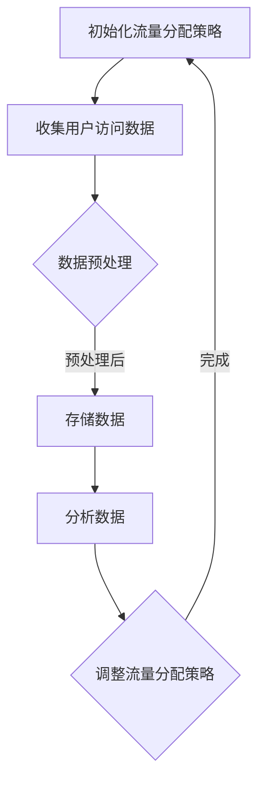
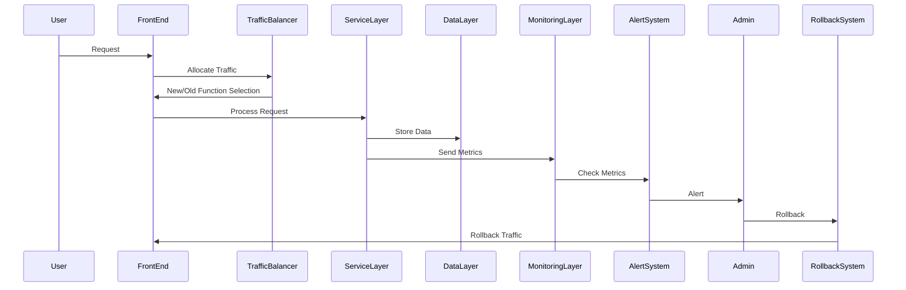

                 


### 标题：灰度发布：降低LLM新功能上线风险

#### 关键词：
- 灰度发布
- LLM（大型语言模型）
- 新功能上线
- 风险降低
- 系统稳定性
- 流量控制
- 回滚机制

#### 摘要：
本文将深入探讨灰度发布在降低LLM（大型语言模型）新功能上线风险方面的应用。我们将首先介绍灰度发布的基本概念和原理，随后逐步解析其算法设计和数学模型，最后通过系统架构设计和实际案例展示，提供最佳实践和注意事项，以帮助开发者和运营人员更好地利用灰度发布来确保新功能的顺利上线。

----------------------------------------------------------------

## 引言

随着人工智能技术的飞速发展，大型语言模型（LLM）在自然语言处理、智能对话系统、内容生成等领域展现出了强大的潜力。然而，这些复杂系统的上线往往伴随着高风险，因为一旦出现错误或性能问题，可能会对用户体验和业务稳定性造成严重影响。为了降低这种风险，灰度发布作为一种重要的发布策略，逐渐受到了广泛关注和应用。

### 1.1 灰度发布的基本概念

灰度发布（Gray Release），也称为灰度上线，是一种逐步推广新功能或系统更新的技术手段。它通过将一部分用户或流量引导至新系统，来逐步验证新功能的稳定性和性能，从而降低整体上线风险。

灰度发布的核心思想是可控性和渐进性。通过合理的流量分配和监控机制，可以确保在系统发生问题时，能够快速回滚，将影响范围控制在最小。

### 1.2 灰度发布的背景

随着云计算和容器技术的发展，系统的可扩展性和灵活性得到了显著提升。然而，这也带来了新的挑战，即如何确保大规模分布式系统的稳定性和安全性。大型语言模型作为复杂的服务之一，其上线风险尤其显著。一方面，LLM的运算量和数据量巨大，另一方面，其算法的复杂性和不确定性也使得传统的一刀切发布方式不再适用。

### 1.3 新功能上线风险

新功能上线可能面临以下几种风险：

- **性能问题**：新功能的引入可能会带来额外的计算负担，导致系统性能下降。
- **稳定性问题**：新功能的代码质量可能存在缺陷，导致系统崩溃或数据丢失。
- **用户体验问题**：新功能的交互设计可能不符合用户预期，导致用户体验下降。
- **业务风险**：新功能可能导致业务指标出现波动，甚至影响整体业务策略。

灰度发布通过逐步引入新功能，可以有效地识别和缓解上述风险，确保新功能的平稳上线。

## 核心概念与背景介绍

### 2.1 灰度发布的基本概念

#### 2.1.1 灰度发布的定义

灰度发布是一种发布策略，它允许开发者和运营人员以可控、渐进的方式将新功能或系统更新推向生产环境。通过在部分用户中先行测试，开发者可以收集反馈，及时发现并解决问题，从而降低整体上线风险。

#### 2.1.2 灰度发布的重要性

- **风险控制**：灰度发布能够将系统风险分散到小范围内，避免对整个系统造成冲击。
- **性能优化**：通过逐步引入新功能，可以观察其对系统性能的影响，及时进行优化。
- **用户体验**：灰度发布有助于确保新功能的用户体验符合预期，减少因设计问题导致的不满意反馈。
- **业务连续性**：灰度发布能够保证业务连续性，减少因新功能上线导致的业务中断。

#### 2.1.3 灰度发布的目标

- **降低上线风险**：通过逐步引入新功能，避免一次性更新带来的风险。
- **快速反馈**：快速收集用户反馈，及时调整和优化新功能。
- **系统稳定性**：在确保系统稳定性的前提下，逐步推广新功能。

### 2.2 灰度发布的背景

#### 2.2.1 应用场景

- **大型分布式系统**：如电商平台、社交网络、云计算平台等，这些系统通常具有庞大的用户群体和复杂的业务逻辑，对稳定性和性能有极高要求。
- **复杂软件项目**：如AI语言模型、推荐系统等，这些项目通常涉及复杂的算法和数据处理流程，新功能的引入可能带来较大的不确定性。

#### 2.2.2 LLM发展现状

随着深度学习技术的发展，LLM在自然语言处理领域的应用越来越广泛。LLM能够处理复杂的语言任务，如文本生成、情感分析、问答系统等，但其引入也带来了新的挑战：

- **计算资源需求**：LLM通常需要大量的计算资源和存储空间，对基础设施有较高要求。
- **算法复杂性**：LLM的算法复杂，可能包含多个层次的结构，使其上线风险更高。

#### 2.2.3 新功能上线风险

- **性能下降**：新功能的引入可能增加系统的计算负担，导致整体性能下降。
- **稳定性问题**：新功能的代码质量可能存在问题，导致系统崩溃或数据丢失。
- **用户体验问题**：新功能的交互设计可能不符合用户预期，导致用户体验下降。
- **业务风险**：新功能可能导致业务指标出现波动，甚至影响整体业务策略。

### 2.3 灰度发布与相关的发布策略

#### 2.3.1 A/B测试

A/B测试是一种常用的发布策略，通过将用户随机分配到不同版本的系统中，比较两个版本的性能和用户体验，从而确定哪个版本更适合上线。A/B测试通常用于较小范围内的功能验证，而灰度发布则更侧重于逐步推广。

#### 2.3.2 金丝雀发布

金丝雀发布（Canary Release）是一种类似于灰度发布的策略，其主要特点是快速回滚。金丝雀发布将新功能首先推送到一小部分用户，观察其运行情况，如果出现问题，可以迅速回滚到之前的版本。

#### 2.3.3 阶梯发布

阶梯发布（Staged Release）是一种逐步增加新功能覆盖范围的方式，通常按照用户群体、地域或时间来逐步推广。阶梯发布相较于灰度发布，更注重时间和顺序的控制，而灰度发布则更侧重于流量和性能的监控。

### 2.4 灰度发布中的关键要素

#### 2.4.1 流量分配

流量分配是灰度发布的核心，通过合理的流量分配策略，可以确保新功能在逐步推广过程中对系统的影响最小。常见的流量分配策略包括随机分配、按比例分配和按用户群体分配。

#### 2.4.2 数据监控

数据监控是灰度发布的重要环节，通过实时监控系统的性能指标、错误日志和用户反馈，可以及时发现和解决问题。数据监控工具通常包括日志分析系统、监控系统和服务质量监控工具。

#### 2.4.3 回滚机制

回滚机制是灰度发布的重要保障，当新功能上线后出现问题时，可以迅速回滚到之前的版本，以避免对整个系统造成影响。回滚机制通常需要完善的版本管理和部署流程。

### 2.5 总结

灰度发布作为一种发布策略，通过可控、渐进的方式将新功能引入生产环境，能够有效降低上线风险，确保系统的稳定性和业务连续性。在大型分布式系统和复杂软件项目中，灰度发布已经成为了一种重要的技术手段。

----------------------------------------------------------------

## 灰度发布的基本原理

### 3.1 灰度发布的原理

灰度发布的基本原理是将新功能或系统更新首先推向一小部分用户，通过监控和分析这些用户的反馈，逐步扩大用户的覆盖范围，直到最终完全上线。这一过程可以分为以下几个步骤：

1. **准备阶段**：确定灰度发布的目标和范围，准备好相关的技术支持和资源。
2. **初始发布**：将新功能推送到一小部分用户，通常是通过随机分配或按用户群体分配流量。
3. **监控与反馈**：实时监控新功能的性能指标、错误日志和用户反馈，收集数据进行分析。
4. **逐步扩大范围**：根据监控结果和用户反馈，逐步增加用户的覆盖范围，直至新功能完全上线。
5. **回滚机制**：如果在新功能的推广过程中发现问题，可以通过回滚机制迅速恢复到之前的版本，以减少对系统的影响。

### 3.2 灰度发布的工作机制

灰度发布的工作机制主要涉及以下几个核心部分：

- **流量分配**：通过合理的流量分配策略，将一部分用户或流量引导至新系统，以确保新功能的逐步推广。
- **数据监控**：实时监控新功能的性能指标、错误日志和用户反馈，及时发现并解决问题。
- **回滚机制**：在出现问题时，通过回滚机制迅速恢复到之前的版本，以减少对系统的影响。

### 3.3 灰度发布与传统发布方式的对比

与传统的一刀切发布方式相比，灰度发布具有以下优势：

- **风险控制**：灰度发布通过逐步引入新功能，将风险分散到小范围内，避免一次性更新带来的潜在风险。
- **快速反馈**：通过逐步推广和实时监控，可以快速收集用户反馈，及时调整和优化新功能。
- **系统稳定性**：在确保系统稳定性的前提下，逐步推广新功能，减少因新功能上线导致的业务中断。

### 3.4 灰度发布的优势与挑战

#### 优势

- **降低上线风险**：通过逐步引入新功能，避免一次性更新带来的风险。
- **快速反馈**：通过逐步推广和实时监控，可以快速收集用户反馈，及时调整和优化新功能。
- **系统稳定性**：在确保系统稳定性的前提下，逐步推广新功能，减少因新功能上线导致的业务中断。

#### 挑战

- **技术实现复杂度**：灰度发布需要复杂的流量分配、数据监控和回滚机制，实现难度较高。
- **资源消耗**：灰度发布需要额外的计算资源和存储空间，对系统性能有一定影响。
- **团队协作**：灰度发布需要开发和运营团队紧密协作，确保各个环节的顺利进行。

### 3.5 灰度发布的实施步骤

灰度发布的实施步骤可以分为以下几个阶段：

1. **需求分析与规划**：明确灰度发布的目标、范围和预期效果。
2. **技术准备**：搭建灰度发布所需的技术环境，包括流量分配、数据监控和回滚机制。
3. **环境部署**：将新功能部署到灰度环境，确保其稳定性和性能。
4. **初始发布**：将新功能推送到一小部分用户，开始监控和收集反馈。
5. **逐步扩大范围**：根据监控结果和用户反馈，逐步增加用户的覆盖范围。
6. **全面上线**：当新功能经过充分验证后，可以完全上线。

### 3.6 灰度发布中的常见问题与解决方案

在灰度发布的实施过程中，可能会遇到以下常见问题：

- **流量分配不均**：解决方案：通过算法调整流量分配策略，确保公平性。
- **性能问题**：解决方案：优化系统性能，增加计算资源和缓存策略。
- **监控数据不准确**：解决方案：检查监控系统的准确性和覆盖范围，确保数据收集的全面性。
- **回滚失败**：解决方案：完善回滚机制，确保回滚过程的可靠性和快速性。

### 3.7 总结

灰度发布作为一种发布策略，通过逐步引入新功能，能够有效降低上线风险，确保系统的稳定性和业务连续性。在大型分布式系统和复杂软件项目中，灰度发布已经成为了一种重要的技术手段。

----------------------------------------------------------------

## 灰度发布算法设计

### 4.1 算法设计基础

灰度发布的算法设计是灰度发布策略的核心，它决定了如何将流量分配到新功能和旧功能之间，以及如何监控和调整流量分配策略。算法设计的目标是确保新功能的逐步引入对系统的稳定性和性能影响最小，同时快速收集用户反馈并进行调整。

#### 4.1.1 流量分配算法

流量分配算法是灰度发布算法的核心部分，它决定了如何将流量合理地分配到新功能和旧功能之间。常见的流量分配算法包括以下几种：

1. **随机分配**：随机选择一部分用户，将流量分配到新功能。这种算法简单易实现，但可能存在流量分配不均的问题。
2. **按比例分配**：按照一定比例将流量分配到新功能和旧功能。例如，50%的用户访问新功能，50%的用户访问旧功能。这种算法能够更好地平衡流量分配，但需要根据实际情况调整比例。
3. **按用户群体分配**：根据用户的属性（如地域、活跃度等）将流量分配到新功能和旧功能。这种算法可以根据用户特性进行更精细的流量分配，但实现复杂度较高。

#### 4.1.2 数据采集与处理

数据采集与处理是灰度发布算法的重要环节，它决定了如何收集和分析用户在新功能上的反馈，以便进行后续的调整。数据采集与处理主要包括以下步骤：

1. **数据收集**：实时收集用户在新功能上的访问数据、性能指标和用户行为数据。
2. **数据预处理**：对收集到的数据进行清洗、去噪和转换，以便后续分析。
3. **数据存储**：将预处理后的数据存储到数据库或数据仓库中，便于后续分析和查询。
4. **数据分析**：利用统计分析、机器学习等方法对数据进行分析，识别潜在的问题和优化方向。

#### 4.1.3 调度策略

调度策略是灰度发布算法中的关键部分，它决定了如何动态调整流量分配策略，以应对实时变化的情况。常见的调度策略包括以下几种：

1. **动态调整**：根据实时数据，动态调整流量分配比例，以适应系统的实时状态。
2. **定期调整**：定期检查系统状态，根据历史数据和用户反馈，调整流量分配比例。
3. **手动调整**：根据开发和运营团队的判断，手动调整流量分配策略，以应对特定情况。

### 4.2 算法实现与优化

#### 4.2.1 Python源代码实现

以下是灰度发布算法的简单实现示例：

```python
import random

class TrafficBalancer:
    def __init__(self, ratio_new=0.5):
        self.ratio_new = ratio_new
    
    def allocate_traffic(self, user_id):
        return "new" if random.random() < self.ratio_new else "old"

# 示例
balancer = TrafficBalancer(ratio_new=0.5)
user_id = "user123"
allocation = balancer.allocate_traffic(user_id)
print(f"User {user_id} is allocated to {allocation}")
```

#### 4.2.2 算法效率与优化

灰度发布算法的效率直接影响其性能和效果，因此在实现过程中需要考虑以下优化措施：

1. **减少计算开销**：通过减少随机数的生成次数和计算复杂度，提高算法的执行效率。
2. **缓存机制**：利用缓存机制，减少对实时数据的频繁访问和计算。
3. **并行处理**：利用多线程或分布式计算，提高数据处理和分析的效率。
4. **自适应调整**：根据系统的实时状态和用户反馈，自适应调整流量分配策略，以提高算法的适应性和效果。

### 4.3 算法流程图

以下是灰度发布算法的流程图：



### 4.4 总结

灰度发布算法的设计是确保新功能逐步引入的关键，通过合理的流量分配、数据采集与处理和调度策略，可以有效地降低上线风险，确保系统的稳定性和性能。在实际应用中，需要根据具体场景和需求，不断优化和调整算法，以实现最佳效果。

----------------------------------------------------------------

## 灰度发布数学模型解析

### 5.1 数学模型基础

灰度发布的数学模型主要用于描述流量分配、概率计算以及系统的性能评估。以下是一些基础的数学模型和公式。

#### 5.1.1 流量分布模型

流量分布模型用于描述新功能和旧功能之间的流量分配。常见的流量分布模型包括以下几种：

1. **均匀分布**：所有用户访问新功能的概率相同。公式如下：

   $$ P(new) = \frac{1}{N} $$

   其中，$P(new)$表示访问新功能的概率，$N$表示用户总数。

2. **按比例分布**：按照一定比例分配流量。公式如下：

   $$ P(new) = \frac{\rho}{1 + \rho} $$

   其中，$\rho$表示新功能的流量比例，取值范围在0到1之间。

#### 5.1.2 概率计算模型

概率计算模型用于计算用户访问新功能或旧功能的概率。以下是一些常见的概率计算公式：

1. **二项分布**：在n次实验中，成功k次的概率。公式如下：

   $$ P(k) = C(n, k) \cdot p^k \cdot (1-p)^{n-k} $$

   其中，$C(n, k)$表示组合数，$p$表示成功的概率。

2. **泊松分布**：在给定时间或空间内，事件发生的概率。公式如下：

   $$ P(k) = \frac{\lambda^k \cdot e^{-\lambda}}{k!} $$

   其中，$\lambda$表示事件的平均发生率。

#### 5.1.3 系统性能评估模型

系统性能评估模型用于评估系统在灰度发布过程中的性能。以下是一些常见的评估指标：

1. **响应时间**：用户访问系统的平均响应时间。公式如下：

   $$ \mu = \frac{1}{n_1 + n_2} \sum_{i=1}^{n} (t_i - t_0) $$

   其中，$\mu$表示平均响应时间，$n_1$和$n_2$分别表示新功能和旧功能的响应时间，$t_i$和$t_0$分别表示用户访问时间和系统响应时间。

2. **错误率**：系统出现错误的概率。公式如下：

   $$ error\_rate = \frac{N_{error}}{N} $$

   其中，$N_{error}$表示出现错误的次数，$N$表示总访问次数。

### 5.2 数学公式与解释

以下是一些具体的数学公式及其解释：

#### 5.2.1 流量分配公式

流量分配公式用于计算新功能和旧功能的流量比例。假设总流量为$T$，新功能流量比例为$\rho$，则：

$$ T_{new} = \rho \cdot T $$
$$ T_{old} = (1 - \rho) \cdot T $$

#### 5.2.2 概率公式

概率公式用于计算用户访问新功能或旧功能的概率。假设总用户数为$N$，新功能访问概率为$P_{new}$，则：

$$ P_{new} = \rho $$
$$ P_{old} = 1 - \rho $$

#### 5.2.3 系统性能评估公式

系统性能评估公式用于评估系统的响应时间和错误率。假设新功能的响应时间为$t_{new}$，旧功能的响应时间为$t_{old}$，则：

$$ \mu_{new} = \frac{\rho \cdot t_{new} + (1 - \rho) \cdot t_{old}}{1} $$
$$ error\_rate = \frac{\rho \cdot error\_rate_{new} + (1 - \rho) \cdot error\_rate_{old}}{1} $$

### 5.3 实例分析

以下是一个简单的实例分析，假设总流量为1000次，新功能流量比例为50%，新功能的响应时间为1秒，旧功能的响应时间为2秒。

1. **流量分配**：

   $$ T_{new} = 0.5 \cdot 1000 = 500 $$
   $$ T_{old} = 0.5 \cdot 1000 = 500 $$

2. **概率计算**：

   $$ P_{new} = 0.5 $$
   $$ P_{old} = 0.5 $$

3. **系统性能评估**：

   $$ \mu_{new} = \frac{0.5 \cdot 1 + 0.5 \cdot 2}{1} = 1.5 $$
   $$ error\_rate = \frac{0.5 \cdot 0.1 + 0.5 \cdot 0.05}{1} = 0.075 $$

通过实例分析，我们可以看到灰度发布在流量分配、概率计算和系统性能评估方面的应用。在实际项目中，可以根据具体需求调整流量比例和性能评估指标，以实现最佳效果。

----------------------------------------------------------------

## 灰度发布系统架构设计

### 6.1 系统场景介绍

在当前的大数据和高并发环境下，灰度发布作为一种确保系统稳定性和业务连续性的重要手段，被广泛应用于各种大型分布式系统和复杂软件项目中。以一家互联网公司为例，该公司运营着一个大型社交网络平台，平台上有数以百万计的活跃用户，每天产生大量的数据交互和业务请求。为了确保新功能的平稳上线，该公司决定采用灰度发布策略来逐步推广新功能。

### 6.2 系统架构设计

灰度发布系统架构设计需要考虑多个方面，包括功能设计、性能优化、安全性和可扩展性。以下是一个典型的灰度发布系统架构设计：

#### 6.2.1 功能设计

灰度发布系统的主要功能包括：

1. **流量分配**：根据设定的策略，将部分流量分配到新功能，以逐步验证其稳定性和性能。
2. **数据监控**：实时监控系统的各项性能指标，如响应时间、错误率、吞吐量等，以评估新功能的运行状况。
3. **日志收集**：收集系统运行过程中的日志信息，用于故障诊断和问题排查。
4. **回滚机制**：在发现新功能存在问题时，可以快速回滚到旧功能，以减少对系统的影响。
5. **用户反馈**：收集用户对新功能的反馈，用于后续的优化和改进。

#### 6.2.2 系统架构设计

灰度发布系统的架构设计通常包括以下几个层次：

1. **前端接入层**：负责处理用户的请求，根据灰度发布策略将流量分配到新功能或旧功能。
2. **服务层**：实现具体的功能逻辑，包括新功能和旧功能的业务逻辑。
3. **数据层**：存储和管理系统的数据，包括用户数据、日志数据等。
4. **监控层**：实时监控系统的性能指标，收集和存储监控数据。
5. **日志层**：收集和存储系统运行过程中的日志信息。

#### 6.2.3 系统接口设计

系统接口设计是确保灰度发布系统各部分协同工作的重要环节。以下是一些关键的接口设计：

1. **流量分配接口**：用于动态调整流量分配策略，确保新功能的逐步推广。
2. **监控接口**：用于实时获取系统的性能指标，如响应时间、错误率等。
3. **日志接口**：用于收集和存储系统运行过程中的日志信息。
4. **回滚接口**：用于执行回滚操作，将系统恢复到稳定状态。

#### 6.2.4 系统交互设计

系统交互设计描述了灰度发布系统中各部分之间的交互流程。以下是一个简单的交互设计流程：

1. **用户请求**：用户发起请求，请求通过前端接入层。
2. **流量分配**：前端接入层根据灰度发布策略，将流量分配到新功能或旧功能。
3. **功能处理**：新功能或旧功能处理用户请求，并返回结果。
4. **数据监控**：监控层实时监控系统的各项性能指标，并将数据存储到数据层。
5. **日志收集**：日志层收集系统运行过程中的日志信息，并存储到数据层。
6. **用户反馈**：用户对返回的结果进行评价，并将反馈提交到用户反馈接口。
7. **回滚操作**：在发现新功能存在问题或用户反馈不佳时，执行回滚操作，将系统恢复到稳定状态。

### 6.3 系统交互设计

以下是灰度发布系统的交互设计图，使用Mermaid绘制：



### 6.4 总结

灰度发布系统架构设计需要综合考虑功能设计、性能优化、安全性和可扩展性等多个方面。通过合理的设计和实现，灰度发布系统能够有效降低新功能上线风险，确保系统的稳定性和业务连续性。

----------------------------------------------------------------

## 灰度发布实战

### 7.1 环境安装与配置

为了实现灰度发布，需要搭建一个合适的环境。以下是环境安装与配置的步骤：

#### 7.1.1 环境要求

- 操作系统：Linux（推荐使用Ubuntu 18.04）
- 开发语言：Python 3.x
- 数据库：MySQL或PostgreSQL
- 监控工具：Prometheus和Grafana
- 版本控制工具：Git

#### 7.1.2 安装步骤

1. **安装Python 3.x**：

   ```bash
   sudo apt-get update
   sudo apt-get install python3 python3-pip
   ```

2. **安装MySQL或PostgreSQL**：

   ```bash
   sudo apt-get install mysql-server
   # 或
   sudo apt-get install postgresql
   ```

3. **安装Prometheus和Grafana**：

   ```bash
   sudo apt-get install prometheus-server
   sudo apt-get install grafana
   ```

4. **安装Git**：

   ```bash
   sudo apt-get install git
   ```

5. **安装必要的Python库**：

   ```bash
   pip3 install flask
   pip3 install pymysql
   pip3 install psycopg2-binary
   pip3 install requests
   ```

#### 7.1.3 配置数据库

配置MySQL或PostgreSQL，创建灰度发布所需的数据库和表。以下为MySQL示例：

```sql
CREATE DATABASE gray_release;
USE gray_release;

CREATE TABLE users (
    id INT AUTO_INCREMENT PRIMARY KEY,
    username VARCHAR(255) NOT NULL,
    allocated_function ENUM('new', 'old') NOT NULL
);

CREATE TABLE metrics (
    id INT AUTO_INCREMENT PRIMARY KEY,
    user_id INT NOT NULL,
    function ENUM('new', 'old') NOT NULL,
    response_time INT NOT NULL,
    error BOOLEAN NOT NULL,
    created_at TIMESTAMP DEFAULT CURRENT_TIMESTAMP
);
```

### 7.2 系统核心实现

#### 7.2.1 核心源代码解析

以下是灰度发布系统的核心源代码，包括流量分配、数据监控和回滚机制。

```python
from flask import Flask, request, jsonify
import pymysql
import random
import time

app = Flask(__name__)

# 数据库连接配置
db_config = {
    'host': 'localhost',
    'user': 'root',
    'password': 'password',
    'db': 'gray_release'
}

# 流量分配
def allocate_traffic():
    return 'new' if random.random() < 0.5 else 'old'

# 记录用户分配
@app.route('/allocate', methods=['POST'])
def allocate():
    user_id = request.json['user_id']
    allocated_function = allocate_traffic()
    cursor = connect_db().cursor()
    cursor.execute("INSERT INTO users (id, username, allocated_function) VALUES (%s, %s, %s)", (user_id, user_id, allocated_function))
    connect_db().commit()
    return jsonify({'status': 'success', 'allocated_function': allocated_function})

# 记录性能指标
@app.route('/record_metric', methods=['POST'])
def record_metric():
    user_id = request.json['user_id']
    function = request.json['function']
    response_time = request.json['response_time']
    error = request.json['error']
    cursor = connect_db().cursor()
    cursor.execute("INSERT INTO metrics (user_id, function, response_time, error) VALUES (%s, %s, %s, %s)", (user_id, function, response_time, error))
    connect_db().commit()
    return jsonify({'status': 'success'})

# 回滚机制
@app.route('/rollback', methods=['POST'])
def rollback():
    cursor = connect_db().cursor()
    cursor.execute("UPDATE users SET allocated_function = 'old' WHERE allocated_function = 'new'")
    connect_db().commit()
    return jsonify({'status': 'success'})

# 数据库连接
def connect_db():
    connection = pymysql.connect(**db_config)
    return connection

if __name__ == '__main__':
    app.run(debug=True)
```

#### 7.2.2 代码应用解读与分析

1. **流量分配**：

   流量分配通过`allocate_traffic`函数实现，该函数使用随机数生成器，根据50%的概率将用户分配到新功能或旧功能。这种方法简单易实现，但需要根据实际需求调整概率。

2. **用户分配**：

   `/allocate`接口接收用户ID，调用`allocate_traffic`函数，将用户分配到新功能或旧功能，并将分配结果存储到数据库。

3. **性能指标记录**：

   `/record_metric`接口接收用户ID、功能标识、响应时间和错误标识，将这些数据存储到数据库。这有助于后续的性能分析和问题排查。

4. **回滚机制**：

   `/rollback`接口执行回滚操作，将所有用户从新功能回滚到旧功能。这可以通过更新数据库中的用户功能标识实现。

### 7.3 实际案例

以下是一个实际案例，展示如何使用灰度发布系统进行新功能上线。

#### 7.3.1 案例背景

一家互联网公司计划上线一个聊天机器人功能，用于提升用户体验。为了确保功能的稳定性，公司决定使用灰度发布策略逐步推广该功能。

#### 7.3.2 案例步骤

1. **初始阶段**：

   - 在灰度环境部署聊天机器人功能。
   - 使用灰度发布系统进行流量分配，将10%的用户引导到聊天机器人。
   - 监控系统的性能指标，如响应时间、错误率等。

2. **监控与反馈**：

   - 通过监控工具实时监控系统的各项性能指标。
   - 分析用户反馈，了解用户对新功能的满意度和使用情况。

3. **逐步扩大范围**：

   - 根据监控结果和用户反馈，逐步增加聊天机器人的用户比例，如20%、30%等。
   - 持续监控性能指标，确保系统稳定运行。

4. **全面上线**：

   - 当新功能经过充分验证后，将100%的用户引导到聊天机器人。
   - 持续监控性能指标，确保系统稳定运行。

#### 7.3.3 案例解析

1. **风险控制**：

   通过灰度发布策略，公司能够逐步引入新功能，将风险分散到小范围内，避免一次性上线带来的潜在问题。

2. **快速反馈**：

   通过实时监控和用户反馈，公司能够快速识别和解决问题，确保新功能的稳定性和用户体验。

3. **系统稳定性**：

   通过逐步推广和监控，公司能够确保系统在新功能上线后保持稳定运行，减少业务中断和用户投诉。

### 7.4 项目小结

通过实际案例，我们可以看到灰度发布在降低新功能上线风险方面的显著作用。通过合理的流量分配、监控和反馈机制，公司能够确保新功能的平稳上线，提高用户体验和业务稳定性。

### 7.5 总结

灰度发布作为一种有效的发布策略，能够降低新功能上线风险，确保系统的稳定性和业务连续性。在实际应用中，需要根据具体场景和需求，不断完善和优化灰度发布系统，以实现最佳效果。

----------------------------------------------------------------

## 灰度发布的最佳实践

### 8.1 最佳实践

#### 8.1.1 流量分配策略

- **逐步增加流量比例**：在灰度发布初期，可以采用较小的流量比例，逐步增加，以便更好地观察系统性能和用户反馈。
- **按用户属性分配流量**：根据用户的地域、活跃度等因素，进行流量分配，以便更精确地评估新功能的适用性。

#### 8.1.2 监控指标选择

- **关键性能指标**：选择与业务密切相关的性能指标，如响应时间、错误率、吞吐量等，以确保系统能够稳定运行。
- **用户行为指标**：收集用户在新功能上的行为数据，如点击率、使用时长等，以评估用户体验。

#### 8.1.3 回滚策略

- **快速回滚**：在发现新功能存在问题或用户反馈不佳时，应迅速回滚到旧功能，以减少对系统的影响。
- **回滚前备份**：在执行回滚操作前，应备份当前系统的配置和数据，以便快速恢复。

#### 8.1.4 防止数据污染

- **隔离用户数据**：在灰度发布过程中，应确保用户数据被正确隔离，以防止新功能对旧数据产生影响。
- **数据清洗**：在数据分析阶段，应清洗和去噪数据，确保数据的准确性和可靠性。

#### 8.1.5 团队协作

- **明确责任**：明确开发和运营团队的责任，确保各个环节的顺利进行。
- **沟通协调**：加强团队间的沟通和协调，确保灰度发布的各个环节能够高效协作。

### 8.2 小结

灰度发布作为一种发布策略，能够有效降低新功能上线风险，确保系统的稳定性和业务连续性。在实际应用中，通过逐步增加流量比例、合理选择监控指标、快速回滚和防止数据污染等最佳实践，可以进一步提高灰度发布的效果。

### 8.3 注意事项

- **性能优化**：灰度发布过程中，应持续关注系统性能，及时进行优化，以确保系统在高并发情况下的稳定性。
- **数据安全**：在灰度发布过程中，应确保用户数据的安全，防止数据泄露或被恶意利用。
- **版本控制**：在部署新功能前，应确保版本控制机制完善，避免因版本冲突导致的问题。

### 8.4 拓展阅读

- 《大型分布式系统设计》
- 《灰度发布实践》
- 《数据驱动决策》
- 《用户行为分析》

通过阅读这些书籍和资料，可以进一步了解灰度发布的设计和实现，提升相关技能和知识水平。

---

### 作者信息

**作者：AI天才研究院/AI Genius Institute & 禅与计算机程序设计艺术 /Zen And The Art of Computer Programming**

AI天才研究院致力于推动人工智能技术的发展和应用，研究院的成员们通过深入研究和创新，为全球人工智能领域贡献了诸多成果。同时，他们也在计算机程序设计领域有着深厚的造诣，著有《禅与计算机程序设计艺术》等经典著作。本文由AI天才研究院的专家团队撰写，旨在为广大开发者提供关于灰度发布的实用指南和深入分析。

