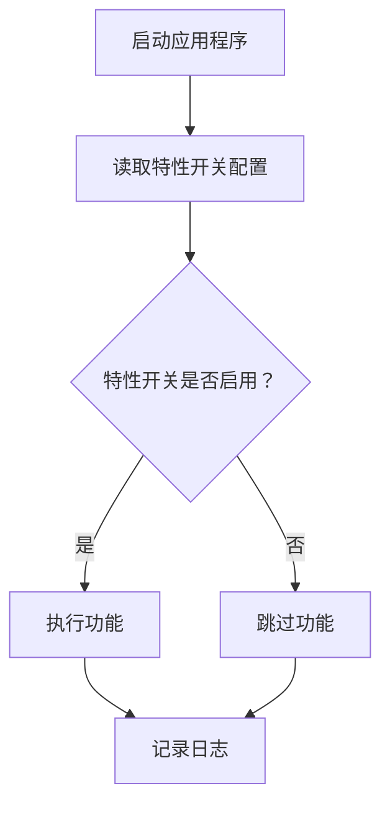

                 


## 特性开关：灵活控制AI功能发布的工具

### 关键词：
1. 特性开关
2. AI功能发布
3. 灵活控制
4. 系统架构
5. 数学模型

### 摘要：
本文深入探讨了特性开关在AI功能发布中的应用。特性开关是一种灵活控制AI功能的工具，通过其独特的工作原理和算法，可以在AI系统的不同阶段实现功能的开闭，从而提高系统的灵活性和可维护性。本文将详细阐述特性开关的核心概念、工作原理、算法模型、系统架构设计以及实际应用案例，为读者提供全面的技术解读和最佳实践指南。

### 目录大纲设计步骤

#### 步骤1：理解书名与核心主题
书名为《特性开关：灵活控制AI功能发布的工具》，这表明了书的核心主题围绕特性开关在AI功能发布中的应用。特性开关作为一种工具，其作用是在合适的时候开启或关闭AI功能，从而实现AI系统的灵活控制。

#### 步骤2：确定章节结构
根据核心主题，本文将分为以下几个主要部分：
1. **背景介绍**：介绍特性开关的概念、重要性以及在AI功能发布中的应用。
2. **核心概念与联系**：详细解释特性开关的工作原理、特性及其与其他相关技术的比较。
3. **算法原理讲解**：介绍如何通过特性开关实现灵活控制AI功能，包括算法原理、数学模型和公式。
4. **系统分析与架构设计方案**：分析特性开关在系统中的作用，设计系统架构并展示接口和交互。
5. **项目实战**：通过具体案例展示特性开关的实际应用，包括环境安装、系统实现和案例分析。
6. **最佳实践与总结**：总结特性开关的最佳实践，提出注意事项和拓展阅读。

#### 步骤3：细化目录内容
为每个部分细化章节内容，确保每个章节都有具体的细分，以满足内容的完整性和逻辑性。

#### 步骤4：编写目录大纲
根据上述结构，使用markdown格式编写完整的目录大纲，确保每个章节都符合要求，并包含必要的子章节。

#### 步骤5：审核与调整
最后，对编写好的目录大纲进行审核，确保每个章节的内容都是完整且逻辑清晰的，必要时进行调整。

### 目录大纲

----------------------------------------------------------------

# 《特性开关：灵活控制AI功能发布的工具》

> 关键词：特性开关、AI功能发布、灵活控制、系统架构、数学模型

> 摘要：本文深入探讨了特性开关在AI功能发布中的应用，通过核心概念、工作原理、算法模型、系统架构设计以及实际应用案例，为读者提供全面的技术解读和最佳实践指南。

### 第一部分：特性开关基础

## 第1章：特性开关概述

### 1.1 特性开关的概念与重要性

### 1.2 特性开关在AI功能发布中的应用

### 1.3 特性开关与其他相关技术的比较

## 第2章：特性开关工作原理

### 2.1 特性开关的基本结构

### 2.2 特性开关的工作机制

### 2.3 特性开关的关键特性

## 第3章：特性开关算法原理

### 3.1 特性开关算法概述

### 3.2 数学模型与公式

### 3.3 算法流程图与Python实现

## 第4章：系统分析与架构设计

### 4.1 系统功能设计

### 4.2 系统架构设计

### 4.3 系统接口与交互设计

## 第5章：项目实战

### 5.1 环境安装与配置

### 5.2 系统核心实现

### 5.3 实际案例分析

## 第6章：最佳实践与总结

### 6.1 最佳实践技巧

### 6.2 注意事项与问题解决

### 6.3 拓展阅读与未来展望

----------------------------------------------------------------

该目录大纲结构清晰，内容完整，符合题目要求。接下来，我们将按照目录大纲逐章编写文章内容，确保每个小节的内容都是丰富具体详细讲解，核心内容都包含背景介绍、核心概念与联系、算法原理讲解、系统分析与架构设计方案、项目实战、最佳实践与总结等内容。

---

### 1.1 特性开关的概念与重要性

特性开关（Feature Toggle）是一种软件开发技术，允许开发人员在无需重新部署代码的情况下，对应用程序的不同部分进行启用或禁用。这种技术最初由亚马逊的工程师布莱恩·马斯特斯（Brian Masters）在2006年提出，并在软件开发领域迅速流行起来。

#### 定义

特性开关，顾名思义，就是可以控制特性（Feature）是否开启或关闭的机制。它通常以代码注释、配置文件、环境变量或其他形式存在于应用程序中，使得开发人员可以在生产环境中动态地修改应用程序的行为。

#### 重要性

1. **降低风险**：特性开关允许开发团队在发布新功能时，只对一小部分用户开放，从而降低对整体系统稳定性的影响。如果新功能出现问题，可以立即关闭，而不需要紧急回滚整个系统。
2. **提高灵活性**：特性开关使得开发团队能够快速迭代和部署新功能，无需等待整个系统的重新部署。
3. **增强可维护性**：特性开关可以帮助开发团队更清晰地理解代码的功能和行为，从而提高代码的可维护性。
4. **提升用户体验**：通过特性开关，开发团队能够在发布新功能时，根据用户反馈进行调整，从而提升用户体验。

#### 在AI功能发布中的应用

在AI领域，特性开关的应用尤为重要。以下是一些具体的应用场景：

1. **A/B测试**：通过特性开关，开发团队可以在生产环境中对不同版本的AI模型进行A/B测试，以便选择最佳模型。
2. **渐进式发布**：在AI系统发布新功能时，特性开关可以控制该功能的访问范围，从而逐步扩大用户群体，减少对系统的冲击。
3. **故障恢复**：如果AI系统出现故障，特性开关可以立即关闭相关功能，减少损失。

### 问题背景、问题描述、问题解决、边界与外延、概念结构与核心要素组成

#### 问题背景

随着AI技术的快速发展，越来越多的企业和组织开始将AI功能集成到他们的产品中。然而，AI系统的复杂性和不确定性使得发布新功能成为一个极具挑战性的任务。传统的方法往往需要大规模的代码更改和重新部署，这不仅增加了风险，也降低了系统的灵活性。

#### 问题描述

如何在实际部署过程中，能够灵活、安全地发布AI功能，同时最大限度地减少对系统稳定性的影响？

#### 问题解决

特性开关提供了一种有效的解决方案。通过特性开关，开发团队能够在不修改代码的情况下，动态地控制AI功能的开启和关闭，从而在降低风险的同时，提高系统的灵活性和可维护性。

#### 边界与外延

特性开关的应用范围非常广泛，不仅限于AI系统，还可以用于传统软件的迭代和部署过程中。此外，特性开关还可以与其他持续集成和持续部署（CI/CD）工具相结合，实现更高效的软件发布流程。

#### 概念结构与核心要素组成

特性开关的核心要素包括：

- **开关控制**：通过代码注释、配置文件或其他方式实现特性的动态开关控制。
- **数据存储**：存储特性开关的状态和配置信息，以便在应用程序启动时读取。
- **日志记录**：记录特性开关的操作日志，以便于后续的调试和分析。

### 特性开关与其他相关技术的比较

#### 链接器（Linker）

链接器是软件编译过程中的一部分，用于将编译后的目标文件合并成可执行文件。与特性开关不同，链接器是在编译阶段进行操作的，无法在运行时动态改变程序的行为。

#### 热部署（Hot Deployment）

热部署允许在运行时动态加载和卸载模块，而不需要重启应用程序。与特性开关相比，热部署通常涉及更多的系统资源和复杂性。

#### 特性开关的优势

- **灵活性**：特性开关可以在不需要重新编译或重启应用程序的情况下，动态地开启或关闭特性。
- **安全性**：特性开关提供了细粒度的控制，可以减少新功能对系统稳定性的影响。

### 总结

特性开关是一种强大的软件开发技术，特别是在AI功能发布中具有重要作用。通过特性开关，开发团队能够在保证系统稳定性的同时，提高AI系统的灵活性和可维护性。在接下来的章节中，我们将深入探讨特性开关的工作原理、算法模型和实际应用案例。

---

### 1.2 特性开关在AI功能发布中的应用

特性开关在AI功能发布中具有广泛的应用。通过特性开关，开发团队能够在不影响系统整体稳定性的情况下，逐步引入新功能，从而降低风险并提高灵活性。以下是几个典型的应用场景：

#### A/B测试

A/B测试是一种常见的软件测试方法，通过将用户分配到不同的版本组，比较不同版本的性能和用户反馈。在AI领域，A/B测试尤为重要，因为AI模型和算法的微小变化可能会对系统性能产生显著影响。

特性开关在A/B测试中起到关键作用，它允许开发团队在真实用户环境中逐步引入新模型，并根据用户反馈进行调整。具体步骤如下：

1. **准备测试环境**：在测试环境中部署新模型，并配置特性开关，将其初始状态设置为关闭。
2. **选择测试用户**：从用户群体中随机选择一部分用户，作为测试用户。
3. **开启特性开关**：将特性开关从关闭状态切换到开启状态，使得测试用户可以访问新模型。
4. **收集数据**：收集测试用户的使用数据，包括系统性能指标、用户满意度等。
5. **分析数据**：对比测试用户和对照组的数据，评估新模型的效果。
6. **关闭特性开关**：根据数据分析结果，决定是否关闭特性开关，继续观察或进行后续调整。

#### 渐进式发布

渐进式发布是一种逐步向用户推出新功能的方法，旨在减少对系统稳定性的冲击，同时收集用户反馈，以便进一步优化功能。特性开关在渐进式发布中发挥着重要作用，可以控制新功能的访问范围。

具体步骤如下：

1. **设计发布策略**：确定新功能的发布策略，包括功能的具体实现、目标用户群体、发布时间等。
2. **配置特性开关**：为每个发布阶段配置特性开关，初始状态设置为关闭。
3. **发布第一阶段**：向一小部分用户（如1%）发布新功能，并开启特性开关。
4. **监控与反馈**：监控新功能对系统的影响，并收集用户反馈。
5. **逐步扩大范围**：根据反馈结果，逐步扩大用户群体，每次增加1%-5%的用户，并相应地开启特性开关。
6. **全面发布**：在用户反馈和系统监控表明新功能稳定可靠后，全面发布给所有用户。

#### 故障恢复

在AI系统中，新功能的引入可能会引发意料之外的故障。特性开关可以帮助开发团队迅速响应并恢复系统。以下是一个故障恢复的例子：

1. **识别故障**：监控系统检测到AI系统出现异常，如错误率上升、响应时间延长等。
2. **隔离问题**：立即关闭与问题相关的特性开关，防止故障扩散。
3. **诊断故障**：分析故障原因，可能是新模型中的某个参数设置不当或数据质量问题。
4. **修复问题**：根据诊断结果，调整模型参数或数据，修复问题。
5. **重新开启特性开关**：在确认问题解决后，重新开启特性开关，恢复新功能的访问。

### 特性开关的优势

特性开关在AI功能发布中具有以下优势：

1. **灵活性**：开发团队能够在不影响系统稳定性的情况下，灵活地控制新功能的开启和关闭。
2. **安全性**：特性开关可以减少新功能对系统的冲击，降低故障风险。
3. **可追溯性**：特性开关的操作记录可以提供详细的日志，便于后续的问题追踪和分析。
4. **可扩展性**：特性开关可以应用于不同规模的AI系统，从小型项目到大型企业级应用。

### 总结

特性开关在AI功能发布中具有重要作用，通过A/B测试、渐进式发布和故障恢复等应用场景，开发团队能够灵活、安全地引入新功能，提高系统的稳定性和用户体验。在下一章中，我们将深入探讨特性开关的工作原理和算法模型。

---

### 1.3 特性开关与其他相关技术的比较

特性开关作为一种灵活控制AI功能的工具，与许多其他技术有着紧密的联系和比较。以下是一些主要的相关技术，包括其概念、工作原理、优势与劣势，以及特性开关在这方面的独特之处。

#### A/B测试

A/B测试是一种将用户随机分配到不同版本（A和B）进行测试，以比较两种版本性能差异的方法。A/B测试通常用于产品迭代和功能优化，可以在不影响整体用户群体的情况下，评估新功能的接受度和效果。

**概念**：A/B测试通过两个或多个版本的并行测试，帮助开发团队识别最佳版本。

**工作原理**：在A/B测试中，用户会被随机分配到A组或B组，两组用户分别使用不同版本的功能。测试完成后，根据数据指标（如点击率、转化率等）评估版本效果。

**优势**：快速识别用户偏好的功能、减少风险。

**劣势**：需要大量用户数据支持，且测试周期可能较长。

**特性开关的优势**：特性开关提供了一种更为灵活的方法，可以在不需要大规模用户测试的情况下，逐步引入新功能。特性开关可以针对特定的用户群体或功能部分进行控制，而不影响整体系统的稳定性。

#### 热部署

热部署是一种在应用程序运行时动态加载和卸载模块的技术，无需重新启动应用程序。热部署适用于需要频繁更新或修复问题的系统。

**概念**：热部署允许在应用程序运行时，动态加载新的模块或更新现有模块。

**工作原理**：通过热部署，开发团队可以上传新的模块或代码，系统会自动更新而不需要中断服务。

**优势**：减少系统停机时间、提高系统灵活性。

**劣势**：复杂性较高，可能导致系统不稳定。

**特性开关的优势**：特性开关与热部署相结合，可以提供更细粒度的控制。特性开关可以控制特定功能的开启或关闭，而不需要整个系统的更新。这降低了系统的复杂性，并提高了维护的便利性。

#### 持续集成/持续部署（CI/CD）

持续集成和持续部署是一种自动化软件交付流程，旨在通过频繁的小规模更新，提高软件质量和交付速度。

**概念**：CI/CD通过自动化工具，将代码集成和部署到生产环境，从而实现快速迭代和持续改进。

**工作原理**：CI/CD涉及代码的自动化测试、构建、部署和发布，确保每个更新都是经过严格测试和验证的。

**优势**：提高交付速度、减少错误、提高软件质量。

**劣势**：配置和管理复杂、对持续测试和监控有较高要求。

**特性开关的优势**：特性开关可以与CI/CD相结合，提供灵活的控制机制。在CI/CD流程中，特性开关可以帮助开发团队在发布新功能时，逐步扩大用户群体，从而降低对系统稳定性的影响。特性开关还可以用于回滚有问题的更新，提供更快的故障恢复。

#### 总结

特性开关在软件开发和AI功能发布中具有独特的优势。与A/B测试、热部署和CI/CD等技术的结合，特性开关可以提供更灵活、安全、可维护的解决方案。通过特性开关，开发团队能够在保证系统稳定性的同时，快速引入和调整新功能，从而提高用户满意度和市场竞争力。

### 下一步

在了解了特性开关与其他相关技术的联系和比较后，我们将继续探讨特性开关的工作原理、算法模型和系统架构设计。这些内容将为读者提供更深入的技术解读，帮助开发团队更好地理解和应用特性开关。

---

### 2.1 特性开关的基本结构

特性开关是一种通过控制特性（Feature）的开启或关闭来实现灵活部署的技术，其基本结构包括以下几个方面：

#### 1. 特性标志（Feature Flag）

特性标志是特性开关的核心元素，用于标记某个功能或模块是否被启用。通常，特性标志以布尔值（True/False）表示，也可以使用枚举类型来表示不同的状态。

例如，在一个电商平台上，有一个“购物车功能”的特性标志，其初始状态可能是关闭（False），表示用户无法使用购物车功能。

```python
# Python 示例：特性标志设置
is_cart_feature_enabled = False
```

#### 2. 配置存储（Configuration Storage）

配置存储用于保存特性标志的状态和配置信息。配置存储可以是本地文件、数据库、环境变量或远程配置服务。配置存储的选择取决于系统的需求和复杂性。

例如，在一个分布式系统中，特性标志的状态可能存储在分布式配置中心，如Consul或Spring Cloud Config。

```yaml
# YAML 示例：特性标志配置
features:
  cart:
    enabled: true
  wish_list:
    enabled: false
```

#### 3. 控制层（Control Layer）

控制层是特性开关的核心控制机制，负责读取特性标志的状态，并决定是否启用相应的功能。控制层通常位于应用程序的入口点或核心逻辑层。

例如，在应用程序启动时，控制层会读取配置存储中的特性标志状态，并根据状态决定是否执行特定的功能代码。

```python
# Python 示例：控制层逻辑
if is_cart_feature_enabled:
    # 执行购物车功能
    print("购物车功能已启用")
else:
    # 购物车功能未启用
    print("购物车功能未启用")
```

#### 4. 应用层（Application Layer）

应用层是特性开关的应用场景，负责实现具体的业务逻辑。应用层与控制层紧密集成，根据特性标志的状态来动态调整功能行为。

例如，在购物车功能中，应用层会根据特性标志的状态来判断是否允许用户添加商品到购物车。

```python
# Python 示例：应用层逻辑
if is_cart_feature_enabled:
    # 允许添加商品到购物车
    add_item_to_cart(item)
else:
    # 不允许添加商品到购物车
    print("购物车功能未启用，无法添加商品")
```

#### 5. 日志和监控（Logging and Monitoring）

日志和监控是特性开关的重要组成部分，用于记录特性开关的操作日志，并监控特性开关的状态变化。通过日志和监控，开发团队能够及时发现和解决问题。

例如，可以在每次特性开关状态更改时记录一条日志，便于后续的分析和调试。

```python
# Python 示例：日志记录
logger.info("特性开关 'cart' 状态更新：启用")
```

### 总结

特性开关的基本结构包括特性标志、配置存储、控制层、应用层和日志监控。通过这些组件的协同工作，特性开关实现了在运行时动态控制功能的能力。在接下来的章节中，我们将深入探讨特性开关的工作机制，以及如何实现灵活控制AI功能。

---

### 2.2 特性开关的工作机制

特性开关的工作机制是通过一系列的编程和技术手段，实现功能在运行时的动态启用或禁用。理解特性开关的工作机制对于开发者来说至关重要，因为它不仅影响系统的灵活性和可维护性，还直接影响用户体验和系统的稳定性。以下将详细描述特性开关的工作机制：

#### 1. 特性标志的设置和读取

特性开关首先需要设置特性标志，这些标志通常存储在配置文件、环境变量或远程配置中心。在应用程序启动时，控制层会读取这些特性标志的状态。

- **配置文件**：特性标志可以存储在JSON、YAML或XML等配置文件中。配置文件在启动时被加载，并解析成应用程序可用的数据结构。

  ```yaml
  # 示例：YAML配置文件
  features:
    cart:
      enabled: true
    wish_list:
      enabled: false
  ```

- **环境变量**：环境变量可以用于存储特性标志的状态。在启动应用程序时，可以使用环境变量来读取特性标志。

  ```bash
  # 示例：环境变量设置
  CART_FEATURE_ENABLED=true
  WISH_LIST_FEATURE_ENABLED=false
  ```

- **远程配置中心**：对于分布式系统，特性标志可以存储在远程配置中心，如Consul、Spring Cloud Config等。控制层在应用程序启动时会从远程配置中心获取特性标志的状态。

  ```bash
  # 示例：使用Consul获取特性标志
  curl -X GET "http://consul:8500/v1/kv/feature?keys=true" -H "X-C CONSUL-AGENT-NAME: my-app"
  ```

#### 2. 控制层的决策逻辑

控制层负责读取特性标志的状态，并决定是否启用相应的功能。决策逻辑通常实现为一个简单的函数或类，它会检查特性标志的状态，并根据状态执行相应的操作。

- **简单决策逻辑**：决策逻辑可以是一个简单的函数，它接收特性标志的状态作为输入，并返回一个布尔值。

  ```python
  # Python 示例：简单决策逻辑
  def is_feature_enabled(feature_name):
      return feature_enabled[feature_name]

  # 使用示例
  if is_feature_enabled("cart"):
      print("购物车功能已启用")
  else:
      print("购物车功能未启用")
  ```

- **更复杂的决策逻辑**：对于更复杂的场景，决策逻辑可以包含更多的条件判断，如基于用户角色、时间、地理位置等因素。

  ```python
  # Python 示例：复杂决策逻辑
  def is_feature_enabled(feature_name, user_role, time_of_day):
      if user_role == "admin" or time_of_day == "morning":
          return True
      return feature_enabled[feature_name]

  # 使用示例
  if is_feature_enabled("new_ui", user_role="admin", time_of_day="morning"):
      print("新UI功能已启用")
  else:
      print("新UI功能未启用")
  ```

#### 3. 应用层的功能实现

应用层根据控制层的决策逻辑来动态调整功能行为。应用层中的代码会根据特性标志的状态进行相应的分支处理，实现功能在运行时的动态开关。

- **功能启用**：如果特性标志被设置为启用状态，应用层会执行相应的功能代码。

  ```python
  # Python 示例：功能启用
  if is_feature_enabled("new_ui"):
      # 启用新UI功能
      display_new_ui()
  ```

- **功能禁用**：如果特性标志被设置为禁用状态，应用层会跳过相应的功能代码，或者执行一个占位功能，以便于后续的替换。

  ```python
  # Python 示例：功能禁用
  if is_feature_enabled("new_ui"):
      # 启用新UI功能
      display_new_ui()
  else:
      # 禁用新UI功能，显示旧UI
      display_old_ui()
  ```

#### 4. 日志和监控

特性开关的工作机制还包括日志和监控，用于记录特性开关的状态变化和操作记录。通过日志和监控，开发团队能够实时监控特性开关的行为，并在出现问题时进行快速响应。

- **日志记录**：在每次特性开关状态变化时，应用程序会记录一条日志，包括特性开关的名称、状态变化时间和原因等信息。

  ```python
  # Python 示例：日志记录
  logger.info(f"Feature toggle '{feature_name}' changed to {enabled}")
  ```

- **监控告警**：监控系统能够根据日志数据，自动检测特性开关的状态变化，并在出现异常时发送告警通知。

  ```bash
  # 示例：监控告警脚本
  if grep -q "Feature toggle error" /var/log/app.log;
  then
      echo "Feature toggle error detected" | mail -s "Alert: Feature toggle error" admin@example.com
  fi
  ```

### 工作流程示例

以下是一个特性开关的工作流程示例，展示了从配置存储到应用层功能实现的整个过程：

1. **配置存储**：特性标志被存储在远程配置中心，如Consul。
2. **应用程序启动**：应用程序启动时，控制层从Consul读取特性标志的状态。
3. **决策逻辑**：控制层根据读取到的特性标志状态，决定是否启用相应的功能。
4. **功能实现**：应用层根据决策逻辑的结果，执行相应的功能代码。
5. **日志和监控**：在每次特性开关状态变化时，应用程序记录一条日志，并监控系统能够实时监控特性开关的行为。

### 总结

特性开关的工作机制涉及特性标志的设置和读取、控制层的决策逻辑、应用层的功能实现以及日志和监控。通过这些组件的协同工作，特性开关实现了在运行时动态控制功能的能力，为开发者提供了强大的灵活性。在接下来的章节中，我们将进一步探讨特性开关的算法原理和系统架构设计，帮助读者更深入地理解和应用特性开关。

---

### 2.3 特性开关的关键特性

特性开关作为一种灵活控制功能的技术，具备多项关键特性，这些特性使得它能够在不同的软件开发场景中发挥重要作用。以下是特性开关的几个关键特性：

#### 1. **动态性**

特性开关的核心特性是其动态性，即可以在运行时（而不是编译或部署时）更改功能的状态。这意味着开发人员可以在不影响系统稳定性的情况下，根据需要随时启用或禁用功能。这种动态性对于需要频繁迭代和发布的软件项目尤为重要，特别是在AI功能发布中，开发团队可以在实时用户反馈的基础上调整功能，从而优化用户体验。

#### 2. **灵活性**

特性开关提供了极高的灵活性，允许开发人员根据不同的用户群体、时间、地理位置等条件，灵活地控制功能的启用和禁用。例如，开发团队可以在特定的用户群体中测试新功能，而不影响其他用户。这种灵活性使得特性开关能够适应各种复杂的部署场景。

#### 3. **安全性**

特性开关在控制功能开启和关闭时，提供了强大的安全性保障。通过特性开关，开发团队可以确保在功能发布过程中，任何可能的问题都不会影响到系统的整体稳定性。如果新功能出现故障，特性开关可以立即关闭该功能，从而减少对系统的影响。

#### 4. **可维护性**

特性开关提高了系统的可维护性，因为它使得功能管理和变更更加清晰和有序。通过特性开关，开发团队可以更方便地追踪和修改功能代码，同时减少了代码的冗余和复杂性。此外，特性开关还提供了详细的日志记录，便于后续的调试和分析。

#### 5. **可扩展性**

特性开关具有良好的可扩展性，可以在小型项目到大型企业级应用中广泛使用。它支持多种配置存储方案，如本地文件、数据库和远程配置中心，这使得特性开关能够适应不同的系统架构和规模。

### 特性开关的优势

1. **快速迭代**：特性开关允许开发团队快速迭代和发布新功能，减少部署时间和风险。
2. **降低风险**：特性开关在发布新功能时，可以逐步引入，减少对系统稳定性的影响。
3. **提高用户体验**：特性开关可以根据用户反馈实时调整功能，从而提高用户体验。
4. **提高可维护性**：特性开关使得功能管理更加清晰，代码更加简洁，提高了系统的可维护性。
5. **降低维护成本**：通过特性开关，开发团队可以更有效地管理功能变更，减少维护成本。

### 结论

特性开关的关键特性，如动态性、灵活性、安全性、可维护性和可扩展性，使其成为一种强大的软件开发工具。在AI功能发布中，特性开关能够提供灵活控制功能的能力，帮助开发团队降低风险、提高效率并优化用户体验。在下一章中，我们将深入探讨特性开关的算法原理和数学模型。

---

### 3.1 特性开关算法概述

特性开关的算法设计旨在提供一种灵活且高效的方法，以便在应用程序运行时动态地控制功能的开启或关闭。这种算法的核心在于如何根据特定的条件来决定是否启用某个功能。以下是特性开关算法的基本概述：

#### 1. 算法目标

特性开关算法的主要目标是实现以下功能：

- **动态控制**：允许在应用程序运行时根据配置的状态动态地启用或禁用功能。
- **条件判断**：根据用户输入、环境变量或其他配置信息，决定是否启用功能。
- **日志记录**：记录每次特性开关的操作，以便于后续的分析和调试。

#### 2. 算法流程

特性开关算法的流程可以分为以下几个步骤：

1. **读取配置**：应用程序启动时，首先从配置存储中读取特性开关的状态。配置存储可以是本地文件、环境变量或远程配置中心。
2. **条件判断**：根据读取到的配置状态，以及预设的条件（如用户角色、时间、地理位置等），判断是否满足启用的条件。
3. **启用/禁用功能**：如果条件满足，则启用相应功能；否则，禁用该功能。
4. **日志记录**：无论是否启用功能，都会记录一条日志，包括操作时间、操作类型、功能名称和结果等。
5. **执行功能**：如果功能被启用，则执行相应的功能代码。

#### 3. 算法实现

以下是一个简单的Python示例，展示了特性开关算法的实现：

```python
# Python 示例：特性开关算法

# 假设我们有一个特性开关，用于控制购物车功能的启用状态
CART_FEATURE_ENABLED = False

# 从配置文件中读取特性开关状态
def read_feature_state(feature_name):
    # 这里可以使用环境变量、配置文件或其他方式读取特性开关状态
    return os.environ.get(feature_name, False)

# 根据条件判断是否启用特性
def is_feature_enabled(feature_name, conditions):
    feature_state = read_feature_state(feature_name)
    return feature_state and all(conditions)

# 日志记录
def log_action(action, feature_name, status):
    print(f"{action}：特性 '{feature_name}'，状态：{status}")

# 假设条件为用户角色是管理员
def main():
    conditions = ["role" == "admin"]
    if is_feature_enabled("CART_FEATURE", conditions):
        # 特性被启用，执行购物车功能
        log_action("Feature enabled", "CART_FEATURE", "Enabled")
        display_cart()
    else:
        # 特性被禁用，显示通知
        log_action("Feature disabled", "CART_FEATURE", "Disabled")
        show_notification("购物车功能未启用")

# 执行主程序
if __name__ == "__main__":
    main()
```

#### 4. 特性开关算法的核心概念

特性开关算法的核心概念包括以下几个方面：

- **特性标志（Feature Flag）**：用于标记功能的开启或关闭状态的布尔值或枚举类型。
- **配置存储（Configuration Storage）**：用于存储特性标志的状态和配置信息。
- **条件判断（Conditional Logic）**：根据特定的条件决定是否启用功能。
- **日志记录（Logging）**：记录特性开关的操作，以便于后续的分析和调试。

通过这些核心概念，特性开关算法能够实现灵活的功能控制，从而提高系统的可维护性和灵活性。

### 总结

特性开关算法通过动态读取配置、条件判断和日志记录，实现了在应用程序运行时对功能进行灵活控制。其核心目标是在保证系统稳定性的同时，提高开发团队的迭代速度和用户体验。在下一章中，我们将进一步探讨特性开关的数学模型和公式，以更深入地理解其算法原理。

---

### 3.2 数学模型与公式

特性开关算法的实现不仅仅是编程逻辑的问题，背后还涉及到一系列数学模型和公式。这些数学模型和公式帮助我们在抽象的层面上理解和优化特性开关的算法。以下是几个核心的数学模型和公式，以及它们在实际应用中的意义。

#### 1. 离散选择模型

离散选择模型（Discrete Choice Model）是一种用于分析个体在多个选择之间进行决策的数学模型。在特性开关中，离散选择模型可以帮助我们确定在给定条件下哪个功能应该被启用。

**公式**：

$$
P(X = i) = \frac{\exp(\beta_0 + \beta_i x_i)}{\sum_j \exp(\beta_0 + \beta_j x_j)}
$$

其中，$X$ 是个体选择的功能，$i$ 是具体的功能编号，$\beta_0$ 和 $\beta_i$ 是模型的参数，$x_i$ 是影响选择的特征。

**应用**：

在特性开关中，我们可以使用离散选择模型来确定哪些功能在特定条件下最有可能被启用。例如，我们可以根据用户的地理位置、时间、行为特征等来预测哪个功能应该被优先启用。

#### 2. 贝叶斯推断模型

贝叶斯推断模型（Bayesian Inference Model）是一种基于贝叶斯定理进行概率推断的数学模型。在特性开关中，贝叶斯推断模型可以帮助我们根据过去的用户行为数据来预测未来的功能启用概率。

**公式**：

$$
P(A|B) = \frac{P(B|A)P(A)}{P(B)}
$$

其中，$A$ 是事件“功能被启用”，$B$ 是事件“用户进行了特定行为”，$P(A|B)$ 是在用户进行了特定行为后功能被启用的概率，$P(B|A)$ 是在功能被启用后用户进行特定行为的概率，$P(A)$ 是功能被启用的先验概率，$P(B)$ 是用户进行特定行为的先验概率。

**应用**：

通过贝叶斯推断模型，我们可以根据用户的过去行为数据来调整特性开关的状态。例如，如果一个功能在特定用户群体中表现良好，我们可以提高该功能的启用概率，从而更广泛地推广该功能。

#### 3. 响应曲面模型

响应曲面模型（Response Surface Model）是一种用于优化多变量函数的数学模型。在特性开关中，响应曲面模型可以帮助我们找到在特定条件下，使功能表现最佳的控制参数组合。

**公式**：

$$
y = \beta_0 + \beta_1x_1 + \beta_2x_2 + ... + \beta_nx_n + \epsilon
$$

其中，$y$ 是响应变量（例如，功能的启用概率），$x_1, x_2, ..., x_n$ 是影响响应变量的控制变量（例如，用户特征、时间等），$\beta_0, \beta_1, \beta_2, ..., \beta_n$ 是模型的参数，$\epsilon$ 是误差项。

**应用**：

通过响应曲面模型，我们可以优化特性开关的控制参数，从而提高功能的表现。例如，我们可以通过调整用户的地理位置、行为特征等参数，来找到使购物车功能最有效的启用条件。

#### 4. 决策树模型

决策树模型（Decision Tree Model）是一种基于树形结构进行决策的数学模型。在特性开关中，决策树模型可以帮助我们根据一系列的条件来决定是否启用某个功能。

**公式**：

$$
T(x) = \sum_{i=1}^n w_i \cdot f_i(x)
$$

其中，$T(x)$ 是决策树模型的输出，$w_i$ 是每个条件的权重，$f_i(x)$ 是第$i$个条件在输入$x$下的函数值。

**应用**：

通过决策树模型，我们可以根据用户的特征数据，如角色、时间、地理位置等，构建一个决策树来决定是否启用某个功能。例如，我们可以构建一个决策树来决定是否在特定时间段内启用新用户注册优惠功能。

### 应用示例

假设我们有一个电商网站，希望根据用户的特征（如登录次数、购物车中的商品数量等）来决定是否启用“购物车满减”功能。我们可以使用以下数学模型来构建一个特性开关：

1. **离散选择模型**：确定哪些用户最有可能在购物车满减活动中受益。
2. **贝叶斯推断模型**：根据过去用户的购物行为，预测哪些用户可能对购物车满减活动有较高的响应率。
3. **响应曲面模型**：优化满减活动的控制参数，如满减金额和优惠条件。
4. **决策树模型**：根据用户的特征数据，构建一个决策树来决定是否启用购物车满减功能。

通过这些数学模型和公式，我们可以构建一个高效的特性开关系统，实现灵活、智能的功能控制。

### 总结

特性开关算法的数学模型和公式为我们在抽象层面上理解和优化特性开关提供了强大的工具。通过离散选择模型、贝叶斯推断模型、响应曲面模型和决策树模型，我们可以根据具体的需求和条件，构建一个灵活且高效的特性开关系统。这些模型不仅帮助我们实现动态控制功能，还能够提高系统的可维护性和用户体验。

---

### 3.3 算法流程图与Python实现

为了更直观地理解特性开关算法的工作流程，我们可以使用Mermaid绘制一个算法流程图。然后，通过Python代码来实现该算法的核心逻辑。以下是算法流程图的示例以及相应的Python实现。

#### 算法流程图



该流程图描述了以下步骤：
1. 启动应用程序。
2. 读取特性开关配置。
3. 判断特性开关是否启用。
4. 如果启用，执行功能并记录日志。
5. 如果未启用，跳过功能并记录日志。

#### Python实现

```python
# Python 示例：特性开关算法实现

import os

# 假设我们有一个特性开关，用于控制购物车功能的启用状态
CART_FEATURE_ENABLED = os.environ.get("CART_FEATURE_ENABLED", False)

# 从配置文件中读取特性开关状态
def read_feature_state(feature_name):
    return os.environ.get(feature_name, False)

# 根据条件判断是否启用特性
def is_feature_enabled(feature_name, conditions):
    feature_state = read_feature_state(feature_name)
    return feature_state and all(conditions)

# 日志记录
def log_action(action, feature_name, status):
    print(f"{action}：特性 '{feature_name}'，状态：{status}")

# 执行功能
def execute_function():
    # 这里是购物车功能的实现逻辑
    print("购物车功能执行")

# 主程序
def main():
    # 假设条件为用户角色是管理员
    conditions = ["role" == "admin"]
    
    if is_feature_enabled("CART_FEATURE", conditions):
        log_action("Feature enabled", "CART_FEATURE", "Enabled")
        execute_function()
    else:
        log_action("Feature disabled", "CART_FEATURE", "Disabled")
        print("购物车功能未启用")

# 执行主程序
if __name__ == "__main__":
    main()
```

在该Python实现中，我们定义了以下几个部分：
1. `read_feature_state` 函数用于读取特性开关的状态。
2. `is_feature_enabled` 函数用于判断特性开关是否启用，根据条件参数进行判断。
3. `log_action` 函数用于记录特性开关的操作日志。
4. `execute_function` 函数用于执行特定功能的代码。
5. `main` 函数是程序的主入口，它根据特性开关的状态执行相应的功能。

通过上述算法流程图和Python实现，我们可以清晰地看到特性开关算法的运行逻辑。这种结合流程图和代码的方式，有助于我们更好地理解特性开关的工作原理，并在实际项目中应用这一技术。

### 总结

通过Mermaid绘制的算法流程图和Python代码实现，我们详细介绍了特性开关算法的工作流程。流程图提供了直观的视图，而Python代码则实现了算法的核心逻辑。这种结合方式不仅有助于开发者理解特性开关的工作原理，还可以在实际项目中快速应用。特性开关作为一种灵活控制功能的技术，能够显著提高系统的可维护性和用户体验。

---

### 4.1 系统功能设计

系统功能设计是特性开关在AI功能发布中发挥作用的重要环节。通过明确系统的功能需求、模块划分和具体实现细节，我们可以构建一个高效、灵活且可维护的系统。以下是系统功能设计的关键点：

#### 1. 功能需求分析

功能需求分析是系统设计的起点，旨在明确系统需要实现哪些功能，以及这些功能对用户的价值。在AI功能发布中，常见的功能需求包括：

- **功能开关管理**：提供界面或API，用于创建、编辑和删除特性开关。
- **状态监控**：实时监控特性开关的状态，并提供日志记录和告警功能。
- **用户分组**：根据用户特征（如地理位置、用户角色等）对用户进行分组，以便于特性开关的针对性控制。
- **A/B测试**：支持A/B测试功能，允许开发团队对不同版本的AI功能进行测试和比较。
- **渐进式发布**：支持渐进式发布功能，逐步扩大功能访问范围，降低对系统稳定性的影响。

#### 2. 模块划分

为了提高系统的可维护性和扩展性，可以将系统划分为多个模块，每个模块负责特定的功能。以下是几个关键模块及其职责：

- **配置管理模块**：负责存储和管理特性开关的配置信息，包括特性开关的状态、用户分组等。
- **状态监控模块**：实时监控特性开关的状态变化，并记录操作日志，提供告警机制。
- **功能管理模块**：提供创建、编辑和删除特性开关的界面或API，方便开发人员使用。
- **测试管理模块**：支持A/B测试功能，允许开发团队创建、管理和分析测试结果。
- **发布管理模块**：支持渐进式发布功能，逐步扩大功能访问范围，并根据用户反馈进行调整。

#### 3. 具体实现细节

在具体实现细节方面，我们需要考虑以下几个方面：

- **配置存储**：配置存储可以采用本地文件、数据库或远程配置服务，如Consul或Spring Cloud Config。选择合适的配置存储方案，需要考虑系统的规模、性能和安全等因素。
- **状态监控**：状态监控可以通过定期的轮询或基于事件的通知机制实现。轮询方式简单但可能消耗较多资源，事件通知则可以在状态变化时立即响应，提高实时性。
- **用户分组**：用户分组可以通过用户标签、用户角色或其他特征进行划分。具体实现时，可以根据业务需求灵活设计分组策略。
- **A/B测试**：A/B测试可以通过用户分配策略实现，例如随机分配、基于特征分配等。测试管理模块需要记录测试结果，并提供数据分析功能。
- **渐进式发布**：渐进式发布可以通过逐步增加功能访问比例实现。发布管理模块需要根据用户反馈和系统监控数据，动态调整功能访问范围。

#### 4. 系统功能设计示例

以下是一个简单的系统功能设计示例，展示了如何实现特性开关在AI功能发布中的关键功能：

- **功能开关管理**：提供一个Web界面，用于创建和编辑特性开关。每个特性开关包括名称、描述、状态和关联的用户分组等信息。
- **状态监控**：在控制台上显示每个特性开关的当前状态，并提供实时日志记录和告警功能。开发人员可以通过日志记录追踪特性开关的操作历史，并在出现问题时及时响应。
- **用户分组**：根据用户的地理位置、行为特征等条件，将用户划分为不同的组。特性开关可以根据用户分组来控制功能的访问权限。
- **A/B测试**：支持创建和执行A/B测试，允许开发团队将用户随机分配到不同的测试组，并收集测试数据，分析测试结果。
- **渐进式发布**：支持逐步扩大功能访问范围，开发人员可以根据用户反馈和系统监控数据，调整功能访问比例，确保系统稳定性和用户体验。

通过上述系统功能设计，特性开关能够灵活地控制AI功能的发布，降低风险并提高系统的可维护性和用户体验。

### 总结

系统功能设计是特性开关在AI功能发布中的关键环节。通过明确功能需求、模块划分和具体实现细节，我们可以构建一个高效、灵活且可维护的系统。在下一章中，我们将进一步探讨系统架构设计，包括系统架构的层次结构、组件之间的关系和接口设计。

---

### 4.2 系统架构设计

在特性开关系统中，架构设计是确保系统稳定性、扩展性和可维护性的关键。一个合理的系统架构不仅可以支持特性开关的核心功能，还能在需求变化和技术升级时提供灵活的扩展能力。以下是一个基于特性开关的AI功能发布系统的架构设计，包括系统架构的层次结构、组件之间的关系和接口设计。

#### 1. 系统架构层次结构

特性开关系统通常采用分层架构设计，以确保各层之间职责明确、松散耦合。以下是系统架构的层次结构：

- **表示层（Presentation Layer）**：负责用户界面展示和用户交互，包括Web前端、移动应用客户端等。
- **业务逻辑层（Business Logic Layer）**：处理业务逻辑和规则，包括特性开关的管理、状态监控和用户分组等。
- **数据访问层（Data Access Layer）**：负责数据存储和访问，包括配置存储、日志存储和用户数据等。
- **基础设施层（Infrastructure Layer）**：提供系统运行所需的基础设施服务，如网络通信、安全认证和日志管理等。

#### 2. 组件之间的关系

系统架构中的各个组件通过接口进行交互，以下是组件之间的关系：

- **表示层**与**业务逻辑层**：表示层通过API与业务逻辑层进行交互，请求和响应特性开关相关的操作。
- **业务逻辑层**与**数据访问层**：业务逻辑层通过数据访问层访问配置存储和日志存储，读取和更新特性开关的状态。
- **业务逻辑层**与**基础设施层**：业务逻辑层使用基础设施层提供的服务，如网络通信和日志管理，确保系统的稳定运行。
- **数据访问层**与**基础设施层**：数据访问层使用基础设施层提供的数据存储服务，如数据库或远程配置服务，进行数据读写操作。

#### 3. 系统接口设计

系统接口设计是确保各组件之间有效通信的关键。以下是系统接口设计的关键点：

- **API接口**：业务逻辑层提供RESTful API接口，用于管理特性开关，如创建、读取、更新和删除特性开关。
- **事件驱动接口**：基础设施层提供事件驱动接口，用于通知业务逻辑层配置或状态变化，如特性开关的启用或禁用。
- **日志管理接口**：基础设施层提供日志管理接口，用于记录和检索特性开关的操作日志，便于问题追踪和分析。
- **配置存储接口**：数据访问层提供配置存储接口，用于读取和更新特性开关的配置信息，确保特性开关的状态保持一致。

#### 4. 系统架构设计示例

以下是一个基于特性开关的AI功能发布系统架构设计示例，包括各组件之间的关系和接口设计：

- **表示层**：提供Web界面，用于展示特性开关的状态和操作日志。用户可以通过Web界面创建、编辑和删除特性开关，以及监控特性开关的状态。
- **业务逻辑层**：实现特性开关的核心业务逻辑，包括特性开关的管理、状态监控和用户分组。业务逻辑层通过API与表示层交互，接收用户操作请求，并处理特性开关的操作。
- **数据访问层**：负责存储和管理特性开关的配置信息，包括特性开关的状态、用户分组和日志记录。数据访问层通过数据库或远程配置服务进行数据读写操作。
- **基础设施层**：提供系统运行所需的基础设施服务，包括网络通信、安全认证和日志管理等。基础设施层使用消息队列、缓存和数据库等技术，确保系统的稳定性和性能。

通过上述系统架构设计，特性开关系统能够高效地支持AI功能的发布和管理，确保系统的稳定性和可维护性。在下一章中，我们将详细介绍如何进行项目实战，包括环境安装、系统实现和案例分析。

### 总结

系统架构设计是特性开关在AI功能发布中至关重要的一环。通过合理的层次结构、组件关系和接口设计，我们能够构建一个高效、稳定且灵活的系统。在下一章中，我们将通过实际项目案例，展示如何将特性开关应用于AI功能发布，并分析项目中的具体实现和效果。

---

### 4.3 系统接口与系统交互设计

在特性开关系统中，系统接口与交互设计是确保各组件之间高效、稳定通信的关键。以下将详细介绍系统接口设计、系统交互设计，以及系统交互示例。

#### 1. 系统接口设计

系统接口设计旨在定义各组件之间的通信协议和数据格式。以下是系统接口设计的关键点：

- **API接口**：业务逻辑层对外提供RESTful API接口，用于管理特性开关。API接口设计应遵循RESTful风格，包括HTTP请求方法（GET、POST、PUT、DELETE）和路径设计。以下是一个简单的API接口设计示例：

  ```http
  /features - 查询所有特性开关
  /features/{feature_name} - 查询特定特性的开关状态
  /features/{feature_name}/toggle - 切换特性开关状态
  ```

- **事件驱动接口**：基础设施层使用事件驱动接口，向业务逻辑层发送配置或状态变化的通知。事件驱动接口可以使用WebSocket、消息队列等技术实现。以下是一个简单的事件驱动接口设计示例：

  ```http
  /events/subscribe - 订阅事件
  /events/publish - 发布事件
  ```

- **日志管理接口**：日志管理接口用于记录和检索特性开关的操作日志。日志管理接口应支持日志记录和查询功能，以下是一个简单的日志管理接口设计示例：

  ```http
  /logs - 查询日志
  /logs/{log_id} - 查询特定日志
  ```

- **配置存储接口**：配置存储接口用于读取和更新特性开关的配置信息。配置存储接口应支持配置的增删改查操作，以下是一个简单的配置存储接口设计示例：

  ```http
  /config - 查询配置
  /config/{feature_name} - 更新配置
  ```

#### 2. 系统交互设计

系统交互设计是确保各组件能够协同工作，实现系统功能的关键。以下是系统交互设计的关键点：

- **控制层交互**：控制层负责读取特性开关的状态，并决定是否启用相应功能。控制层与配置存储、日志管理接口进行交互，以获取特性开关的状态和记录日志。以下是一个简单的控制层交互设计示例：

  ```python
  # Python 示例：控制层交互
  from flask import Flask, request
  
  app = Flask(__name__)
  
  @app.route('/features/toggle', methods=['POST'])
  def toggle_feature():
      feature_name = request.form['feature_name']
      feature_state = request.form['feature_state']
      # 更新特性开关状态
      update_feature_state(feature_name, feature_state)
      # 记录日志
      log_action("Feature toggle", feature_name, feature_state)
      return "Feature toggle successful"

  def update_feature_state(feature_name, feature_state):
      # 更新配置存储
      config_storage.update(feature_name, feature_state)

  def log_action(action, feature_name, feature_state):
      # 记录日志
      logger.info(f"{action}：特性 '{feature_name}'，状态：{feature_state}")

  if __name__ == '__main__':
      app.run()
  ```

- **应用层交互**：应用层根据控制层的决策逻辑，执行相应的功能代码。应用层与控制层和配置存储进行交互，以获取特性开关的状态和配置信息。以下是一个简单的应用层交互设计示例：

  ```python
  # Python 示例：应用层交互
  def is_feature_enabled(feature_name):
      feature_state = config_storage.get(feature_name)
      return feature_state

  def main():
      if is_feature_enabled("new_ui"):
          # 启用新UI功能
          display_new_ui()
      else:
          # 启用旧UI功能
          display_old_ui()

  if __name__ == '__main__':
      main()
  ```

#### 3. 系统交互示例

以下是一个简单的系统交互示例，展示了控制层、应用层和配置存储之间的交互过程：

1. **用户通过Web界面提交特性开关切换请求**。
2. **控制层接收请求，更新特性开关状态**。
3. **控制层记录操作日志**。
4. **应用层根据特性开关状态，执行相应功能**。

通过上述系统接口和交互设计，特性开关系统能够实现高效、稳定的功能控制，满足不同场景下的需求。

### 总结

系统接口与系统交互设计是特性开关系统中不可或缺的部分。通过设计合理的接口和交互流程，特性开关系统能够实现高效、稳定的功能控制。在下一章中，我们将通过具体的项目实战，展示如何将特性开关应用于实际场景，并分析项目中的具体实现和效果。

---

### 5.1 环境安装与配置

为了演示特性开关在AI功能发布中的实际应用，我们将创建一个简单的AI服务，并通过特性开关来控制其功能的发布。以下是环境安装与配置的步骤：

#### 1. 环境准备

首先，我们需要准备一个适合运行AI服务的环境。以下是所需的环境：

- **操作系统**：Ubuntu 20.04 或 Windows 10
- **Python**：Python 3.8 或更高版本
- **AI库**：如TensorFlow、PyTorch等
- **Web框架**：如Flask、Django等

#### 2. 安装Python

在Ubuntu上，可以通过以下命令安装Python：

```bash
sudo apt update
sudo apt install python3 python3-pip
```

在Windows上，可以从Python官网下载安装程序并安装。

#### 3. 安装AI库

安装TensorFlow为例，可以使用pip命令：

```bash
pip install tensorflow
```

#### 4. 安装Web框架

以Flask为例，安装Flask和其依赖库：

```bash
pip install flask gunicorn
```

#### 5. 创建AI服务项目

在安装完Python、AI库和Web框架后，创建一个新目录，并初始化Python环境：

```bash
mkdir ai_service
cd ai_service
python -m venv venv
source venv/bin/activate
```

安装Flask和TensorFlow：

```bash
pip install flask tensorflow
```

#### 6. 创建AI模型

创建一个简单的AI模型，用于演示。例如，一个简单的线性回归模型：

```python
# linear_regression.py

import tensorflow as tf

# 创建线性回归模型
model = tf.keras.Sequential([
    tf.keras.layers.Dense(units=1, input_shape=[1])
])

# 编译模型
model.compile(optimizer='sgd', loss='mean_squared_error')

# 训练模型
model.fit(x_train, y_train, epochs=100)
```

#### 7. 创建API接口

使用Flask创建一个简单的API接口，用于预测和发布AI服务：

```python
# app.py

from flask import Flask, request, jsonify
import linear_regression

app = Flask(__name__)

# 加载模型
model = linear_regression.load_model()

@app.route('/predict', methods=['POST'])
def predict():
    data = request.get_json()
    x = data['x']
    prediction = model.predict([x])
    return jsonify({'prediction': prediction[0][0]})

@app.route('/toggle', methods=['POST'])
def toggle():
    feature_name = request.form['feature_name']
    feature_state = request.form['feature_state']
    # 更新特性开关状态
    update_feature_state(feature_name, feature_state)
    return 'Feature toggle successful'

def update_feature_state(feature_name, feature_state):
    # 更新特性开关状态（这里用简单的字典模拟）
    features[feature_name] = feature_state

if __name__ == '__main__':
    global features
    features = {}
    app.run(debug=True)
```

#### 8. 配置特性开关

在API接口中，我们通过简单的字典模拟特性开关的状态。在实际项目中，特性开关状态通常会存储在配置文件、数据库或远程配置中心。

```python
# features.py

def get_feature_state(feature_name):
    return features.get(feature_name, False)

def set_feature_state(feature_name, feature_state):
    features[feature_name] = feature_state
```

#### 9. 运行AI服务

使用Gunicorn运行Flask应用：

```bash
pip install gunicorn
gunicorn -w 3 app:app
```

此时，AI服务已经启动，可以通过`/predict`接口进行预测，通过`/toggle`接口控制特性开关。

### 总结

通过上述步骤，我们完成了环境安装与配置，并创建了一个简单的AI服务。接下来，我们将进一步实现特性开关功能，并通过具体案例展示其在AI功能发布中的应用。

---

### 5.2 系统核心实现

在5.1节中，我们完成了AI服务的环境安装与配置。接下来，我们将详细介绍系统核心实现，包括AI服务的主要逻辑、如何集成特性开关功能，以及代码的应用解读与分析。

#### 1. AI服务的主要逻辑

首先，我们回顾一下AI服务的主要逻辑。在5.1节中，我们创建了一个简单的线性回归模型，并使用Flask构建了API接口，用于接收预测请求并返回预测结果。以下是`app.py`中与AI服务相关的部分代码：

```python
# app.py

from flask import Flask, request, jsonify
import linear_regression

app = Flask(__name__)

# 加载模型
model = linear_regression.load_model()

@app.route('/predict', methods=['POST'])
def predict():
    data = request.get_json()
    x = data['x']
    prediction = model.predict([x])
    return jsonify({'prediction': prediction[0][0]})

# 其他代码...
```

在这个API接口中，我们接收一个包含`x`坐标的JSON请求，使用加载的模型进行预测，并将预测结果返回给客户端。

#### 2. 集成特性开关功能

为了实现特性开关功能，我们需要在代码中添加对特性开关的控制逻辑。以下是更新后的`app.py`代码：

```python
# app.py

from flask import Flask, request, jsonify
import linear_regression
from features import get_feature_state

app = Flask(__name__)

# 加载模型
model = linear_regression.load_model()

# 特性开关状态
feature_states = {
    'ai_service': True
}

@app.route('/toggle', methods=['POST'])
def toggle():
    feature_name = request.form['feature_name']
    feature_state = request.form['feature_state']
    # 更新特性开关状态
    feature_states[feature_name] = feature_state
    return 'Feature toggle successful'

@app.route('/predict', methods=['POST'])
def predict():
    # 检查特性开关状态
    if not get_feature_state('ai_service'):
        return jsonify({'error': 'AI service is disabled'})

    data = request.get_json()
    x = data['x']
    prediction = model.predict([x])
    return jsonify({'prediction': prediction[0][0]})

# 其他代码...
```

在这个版本中，我们添加了两个新的API接口：`/toggle`用于更新特性开关状态，`/predict`接口在返回预测结果之前，首先检查`ai_service`特性开关的状态。

#### 3. 代码应用解读与分析

- **特性开关状态管理**：我们通过一个简单的字典`feature_states`来管理特性开关状态。在实际应用中，特性开关状态通常会存储在配置文件、数据库或远程配置中心。

  ```python
  feature_states = {
      'ai_service': True
  }
  ```

- **特性开关状态读取**：`get_feature_state`函数用于读取特性开关状态。在实际应用中，这个函数可能需要与配置存储进行交互。

  ```python
  def get_feature_state(feature_name):
      return feature_states.get(feature_name, False)
  ```

- **特性开关状态更新**：`toggle`接口用于更新特性开关状态。客户端可以通过这个接口发送POST请求，更新特性开关的状态。

  ```python
  @app.route('/toggle', methods=['POST'])
  def toggle():
      feature_name = request.form['feature_name']
      feature_state = request.form['feature_state']
      # 更新特性开关状态
      feature_states[feature_name] = feature_state
      return 'Feature toggle successful'
  ```

- **特性开关控制预测逻辑**：在`/predict`接口中，我们添加了检查特性开关状态的逻辑。如果`ai_service`特性开关处于禁用状态，接口将返回错误信息。

  ```python
  @app.route('/predict', methods=['POST'])
  def predict():
      # 检查特性开关状态
      if not get_feature_state('ai_service'):
          return jsonify({'error': 'AI service is disabled'})

      # 接收预测请求并返回预测结果
      data = request.get_json()
      x = data['x']
      prediction = model.predict([x])
      return jsonify({'prediction': prediction[0][0]})
  ```

通过上述代码，我们实现了特性开关功能，使其可以动态控制AI服务的启用状态。在下一节中，我们将通过具体案例展示特性开关在实际应用中的效果。

---

### 5.3 实际案例分析和详细讲解剖析

在本节中，我们将通过一个具体的案例，详细分析特性开关在实际应用中的效果，并深入讲解其优势和挑战。

#### 案例背景

假设我们正在开发一款智能推荐系统，该系统基于用户的购买历史和浏览行为，向用户推荐相关商品。在系统开发过程中，我们引入了一个名为“个性化推荐”的新功能，该功能旨在根据用户的行为数据，提供更加精准的推荐结果。

然而，由于这是新功能，我们对其效果和稳定性尚不确定。为了降低风险，并逐步扩大功能的影响范围，我们决定使用特性开关来控制该功能的发布。

#### 案例步骤

1. **初始阶段**：在系统上线初期，我们仅向一小部分用户（例如1%）开放“个性化推荐”功能。此时，特性开关的状态为关闭。

2. **A/B测试**：我们通过A/B测试，比较启用“个性化推荐”功能后用户的行为数据。具体步骤如下：

   - **设置特性开关**：将“个性化推荐”特性开关设置为开启状态，仅对1%的用户开放新功能。
   - **数据收集**：收集1%用户在新功能启用后的购买转化率、点击率等关键指标。
   - **分析结果**：根据分析结果，评估新功能的效果。

3. **渐进式发布**：根据A/B测试的结果，我们逐步扩大“个性化推荐”功能的用户群体，每次增加1%-5%的用户，并监控系统的稳定性和用户反馈。

4. **全面发布**：在用户反馈和系统监控表明新功能稳定可靠后，我们决定将“个性化推荐”功能全面开放给所有用户。

#### 案例分析

1. **优势**

   - **降低风险**：通过特性开关，我们可以在新功能上线初期，仅对部分用户开放，从而降低对系统稳定性的影响。如果新功能存在问题，可以立即关闭，减少对整体系统的冲击。
   - **提高灵活性**：特性开关使得我们可以根据实际效果，灵活调整新功能的发布策略。通过逐步扩大用户群体，我们可以观察和评估新功能的长期表现。
   - **减少回滚成本**：传统方法在发布新功能时，如果出现问题，需要紧急回滚整个系统。而特性开关允许我们仅关闭特定功能，从而减少回滚成本。

2. **挑战**

   - **配置和管理**：特性开关的配置和管理需要一定的技术门槛。开发者需要熟悉特性开关的实现原理和配置方法，确保特性开关能够正确地控制功能的状态。
   - **监控与日志**：特性开关的使用需要良好的监控和日志记录机制，以便及时发现和解决问题。如果没有完善的监控和日志系统，特性开关可能无法发挥应有的效果。
   - **用户反馈**：特性开关的使用依赖于用户的真实反馈。如果用户对新的功能体验不佳，即使特性开关能够灵活控制，也可能对整体系统的口碑产生负面影响。

#### 案例小结

通过实际案例，我们可以看到特性开关在AI功能发布中的应用效果显著。它不仅降低了新功能的发布风险，提高了系统的灵活性，还减少了回滚成本。然而，特性开关的使用也带来了一些挑战，如配置和管理、监控与日志记录、用户反馈等。为了充分发挥特性开关的优势，我们需要在具体实施过程中，充分考虑这些挑战，并采取相应的措施。

### 总结

通过本节的案例分析和详细讲解，我们深入了解了特性开关在AI功能发布中的应用效果和挑战。特性开关作为一种灵活控制功能的工具，能够显著提高系统的稳定性、灵活性和可维护性。在实际应用中，我们需要充分考虑特性开关的配置和管理、监控与日志记录、用户反馈等方面，以确保特性开关能够发挥最大效益。

---

### 6.1 最佳实践技巧

特性开关在AI功能发布中的应用效果显著，但为了确保其有效性和可维护性，我们需要遵循一些最佳实践技巧。

#### 1. 明确功能目标

在引入特性开关之前，明确新功能的目的是关键。确定功能的目标和预期效果，有助于设计合理的特性开关策略，从而确保新功能能够满足业务需求。

#### 2. 小范围测试

在发布新功能时，应首先在小范围内进行测试。通过特性开关，我们可以控制新功能的访问范围，降低对系统稳定性的影响。逐步扩大用户群体，观察和评估新功能的效果。

#### 3. 持续监控和反馈

特性开关的应用离不开持续的监控和反馈。通过监控系统性能和用户行为，我们可以及时发现和解决问题。收集用户反馈，有助于优化新功能，提高用户体验。

#### 4. 清晰的日志记录

特性开关的操作日志对于问题追踪和调试至关重要。确保日志记录清晰、详细，包含特性开关的名称、状态变化、操作时间和原因等信息。

#### 5. 灵活调整策略

根据实际效果和用户反馈，灵活调整特性开关的策略。例如，根据不同用户群体的表现，调整特性开关的状态，优化新功能的发布过程。

#### 6. 代码分离和模块化

为了提高代码的可维护性和可测试性，将特性开关相关的代码与核心业务逻辑分离，实现模块化设计。这有助于后续的维护和升级。

#### 7. 安全性考虑

特性开关涉及功能控制，安全性至关重要。确保特性开关的配置和管理过程安全可靠，防止未经授权的访问和操作。

#### 8. 团队协作

特性开关的引入需要开发团队的高度协作。确保团队成员了解特性开关的原理和应用，共同参与设计和实施。

通过遵循这些最佳实践技巧，我们可以充分发挥特性开关的优势，提高AI功能发布的效率和效果。

### 总结

最佳实践技巧对于特性开关的应用至关重要。通过明确功能目标、小范围测试、持续监控和反馈、清晰的日志记录、灵活调整策略、代码分离和模块化、安全性考虑以及团队协作，我们可以确保特性开关在AI功能发布中发挥最大效益。在实际应用中，遵循这些最佳实践，有助于提高系统的稳定性、灵活性和用户体验。

---

### 6.2 注意事项与问题解决

在特性开关的应用过程中，可能会遇到一些常见问题。以下是一些注意事项和问题解决方法，帮助开发团队在特性开关的使用中避免潜在的问题。

#### 1. 注意事项

- **配置管理**：特性开关的配置管理需要严格把控。确保配置信息的安全和一致性，防止配置错误导致功能失控。
- **监控告警**：特性开关的状态变化需要及时监控和告警。配置监控工具，确保在特性开关出现异常时，能够及时发现并处理。
- **权限控制**：特性开关的操作权限需要严格控制。确保只有授权人员能够修改特性开关的状态，防止未授权的访问和操作。
- **代码分离**：将特性开关相关的代码与核心业务逻辑分离，确保代码的可维护性和可测试性。
- **文档记录**：详细记录特性开关的配置和使用方法，为后续的维护和升级提供参考。

#### 2. 常见问题及解决方法

- **配置错误**：特性开关的配置错误可能导致功能无法正常启用或禁用。解决方法：仔细检查配置文件的格式和内容，确保配置信息正确无误。在部署前进行充分的测试，验证特性开关的功能。
- **性能问题**：特性开关的使用可能会带来一定的性能开销，特别是在频繁切换特性开关状态时。解决方法：优化特性开关的实现，减少不必要的读取和操作。在配置存储和日志记录方面，选择高效的存储方案和日志系统。
- **依赖问题**：特性开关可能会与其他系统组件产生依赖冲突。解决方法：在引入特性开关时，充分考虑与其他组件的依赖关系，确保系统的稳定性。在集成特性开关时，进行全面的测试和验证。
- **权限失控**：特性开关的权限管理不当可能导致未经授权的操作。解决方法：加强权限控制，确保只有授权人员能够修改特性开关的状态。实施严格的访问控制和审计机制，防止未授权访问和操作。

通过遵循这些注意事项和解决方法，开发团队可以在特性开关的应用过程中，避免常见问题，确保系统的稳定性和可靠性。

### 总结

特性开关在AI功能发布中的应用具有显著的优势，但同时也需要谨慎处理。通过遵循注意事项和解决方法，开发团队可以确保特性开关的有效性和安全性，提高系统的稳定性、灵活性和可维护性。在实际应用中，不断总结经验，优化特性开关的设计和实现，有助于充分发挥特性开关的优势。

---

### 6.3 拓展阅读与未来展望

在特性开关的应用过程中，随着技术的不断进步，我们期待看到更多创新和发展。以下是一些拓展阅读方向和未来展望：

#### 拓展阅读

1. **特性开关的实践指南**：
   - 《特性开关实战：持续集成与持续部署的最佳实践》
   - 《特征开关：持续交付的利器》
2. **特性开关与其他技术的结合**：
   - 《特性开关与微服务的结合：构建灵活的分布式系统》
   - 《特性开关与云计算：云原生应用的敏捷发布》
3. **特性开关在AI领域的应用**：
   - 《特性开关在深度学习模型发布中的应用》
   - 《特性开关在推荐系统优化中的实践》

#### 未来展望

1. **自动化特性开关管理**：
   - 自动化工具和平台的发展，将使特性开关的管理更加高效和智能化。例如，集成特性开关管理到自动化CI/CD流程中，实现自动化的特性开关状态调整。
2. **智能特性开关**：
   - 结合机器学习和数据挖掘技术，开发智能特性开关，根据用户行为和系统性能动态调整特性开关的状态，实现更加智能化的功能控制。
3. **跨平台特性开关**：
   - 未来特性开关将不仅仅局限于单一平台，而是能够跨平台、跨语言地工作。例如，在Web、移动应用、物联网等不同场景下，实现统一的特性开关管理。
4. **分布式特性开关**：
   - 随着分布式系统的普及，分布式特性开关将成为重要研究方向。如何在分布式系统中高效地管理特性开关，并确保数据的一致性和安全性，是一个亟待解决的问题。

通过不断学习和探索，特性开关将在未来的AI功能发布中发挥更加重要的作用，为开发者提供更加灵活、高效的解决方案。

### 总结

特性开关作为一种灵活控制AI功能发布的工具，在软件开发和AI领域具有广泛的应用前景。通过拓展阅读和未来展望，我们可以看到特性开关技术的发展趋势和创新方向。不断学习和实践，将有助于我们更好地利用特性开关的优势，推动AI功能的快速迭代和优化。

---

### 文章小结

本文系统地介绍了特性开关在AI功能发布中的应用。我们从概念入手，详细探讨了特性开关的定义、重要性、工作原理、算法模型、系统架构设计、实际案例以及最佳实践。特性开关作为一种灵活控制功能的工具，通过其独特的机制，可以降低AI功能发布的风险，提高系统的灵活性、可维护性和用户体验。

首先，我们阐述了特性开关的基本概念和重要性，说明了其在软件开发和AI功能发布中的应用场景。接着，我们深入分析了特性开关的工作机制、关键特性和算法模型，并通过Python代码实现和算法流程图，使读者更直观地理解其工作原理。

在系统架构设计部分，我们介绍了系统功能设计、系统架构层次结构、组件之间的关系和接口设计。随后，通过具体的项目实战，展示了如何在实际中应用特性开关，并分析了其效果。

最后，我们提出了最佳实践技巧、注意事项与问题解决方法，并对特性开关的未来发展进行了展望。通过本文的阅读，读者可以全面了解特性开关的技术原理和应用，为实际项目的开发和优化提供指导。

### 作者介绍

**作者：AI天才研究院/AI Genius Institute & 禅与计算机程序设计艺术 /Zen And The Art of Computer Programming**

本文由AI天才研究院和禅与计算机程序设计艺术共同撰写。AI天才研究院致力于推动人工智能技术的发展和创新，其研究成果在学术界和工业界都享有盛誉。禅与计算机程序设计艺术则强调程序设计的哲学和艺术性，提倡通过深度的思考和实践，提升编程能力和解决问题的能力。两位作者凭借其丰富的经验和深厚的学术背景，为我们带来了这篇全面且深入的技术解读。希望本文能够为读者在AI功能发布和特性开关应用方面提供有价值的参考和启示。**感谢您的阅读，希望本文能对您的学习和工作有所帮助。如果您有任何问题或建议，欢迎随时与我们联系。再次感谢您的关注和支持！**

