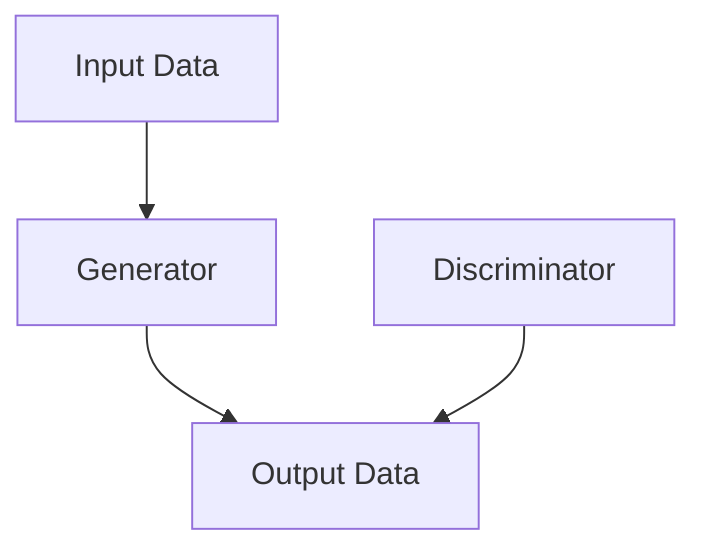
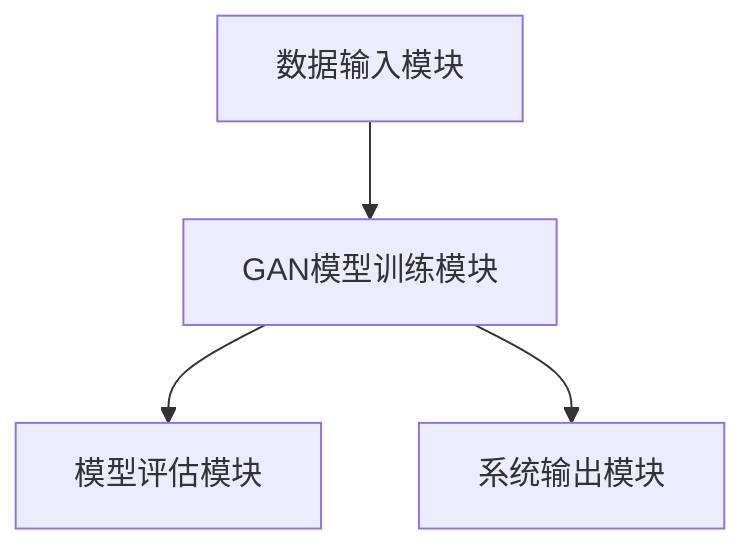
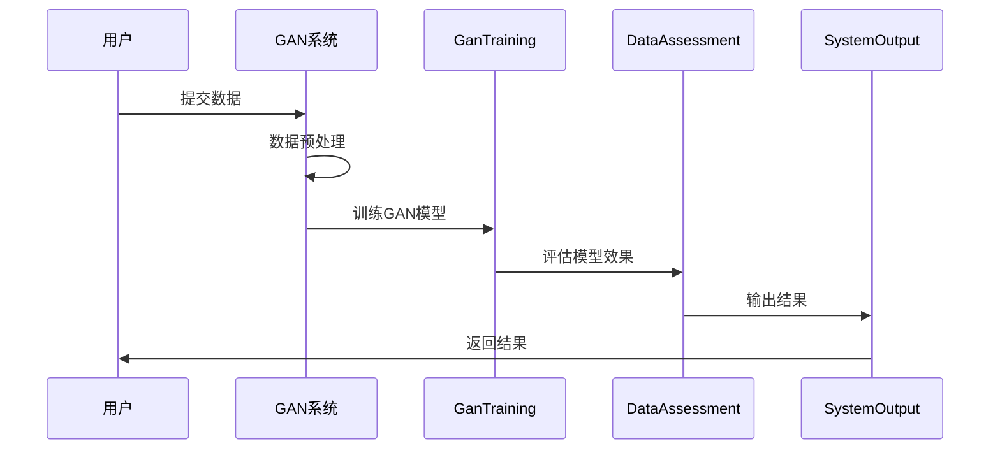
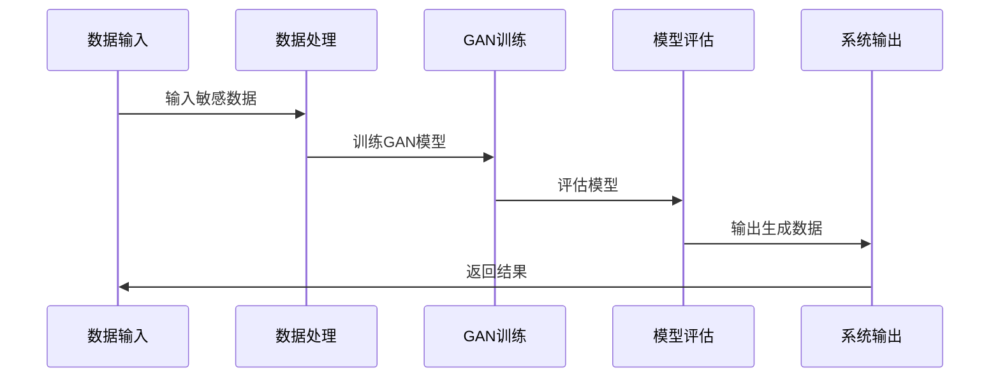

                 

**# 生成对抗网络在AI安全与隐私保护中的应用**

> 关键词：生成对抗网络（GAN）、AI安全、隐私保护、算法原理、系统架构设计、项目实战

> 摘要：本文深入探讨了生成对抗网络（GAN）在人工智能安全与隐私保护中的应用。首先介绍了GAN的背景、核心概念及其与相关技术的联系。接着，详细阐述了GAN的算法原理，通过数学模型和Python代码实例进行说明。随后，分析了GAN在系统架构设计中的应用，包括系统功能设计、架构设计和接口设计。文章还通过实际项目案例，展示了GAN在AI安全与隐私保护中的具体应用，并总结了最佳实践和注意事项。本文旨在为读者提供一个全面、深入的GAN应用指南。

## 目录

### **背景介绍**
- **GAN的起源与发展**
- **AI安全与隐私保护背景**
- **GAN在AI安全与隐私保护中的重要性**

### **核心概念与联系**
- **GAN核心概念**
- **GAN与相关技术的比较**
- **GAN的ER实体关系图**

### **算法原理讲解**
- **GAN的数学模型**
- **GAN的工作流程**
- **Python代码实例**

### **系统分析与架构设计方案**
- **问题场景介绍**
- **系统功能设计**
- **系统架构设计**
- **系统接口设计**
- **系统交互设计**

### **项目实战**
- **环境安装**
- **核心实现源代码**
- **代码应用解读与分析**
- **实际案例分析和详细讲解**
- **项目小结**

### **最佳实践、小结与拓展阅读**
- **最佳实践**
- **注意事项**
- **拓展阅读**

## **背景介绍**

### **GAN的起源与发展**

生成对抗网络（Generative Adversarial Networks，GAN）是由Ian Goodfellow等人于2014年首次提出的。GAN由两个神经网络组成：生成器（Generator）和判别器（Discriminator）。生成器试图生成类似于真实数据的数据，而判别器则试图区分生成器生成的数据与真实数据。两个网络相互对抗，通过训练不断优化，最终达到生成高质量数据的效果。

GAN的发展受到了广泛关注，因为它在图像生成、数据增强、风格迁移等领域取得了显著的成果。随着人工智能技术的不断发展，GAN在AI安全与隐私保护中的应用也逐渐受到了关注。

### **AI安全与隐私保护背景**

随着人工智能技术的广泛应用，AI安全与隐私保护问题日益突出。传统的AI系统往往依赖于大规模的数据集进行训练，这些数据集可能包含敏感信息。如果这些数据被泄露，可能会对个人隐私造成严重威胁。

同时，AI系统在处理敏感数据时，可能存在安全漏洞，导致数据被恶意攻击者窃取或篡改。为了确保AI系统的安全与隐私，研究者们开始探索如何在AI系统中应用生成对抗网络（GAN）。

### **GAN在AI安全与隐私保护中的重要性**

GAN在AI安全与隐私保护中的应用主要体现在以下几个方面：

1. **数据隐私保护**：通过GAN，可以将敏感数据转换为无法识别的伪数据，从而保护数据隐私。
2. **对抗攻击防御**：GAN可以生成对抗样本，用于检测和防御恶意攻击。
3. **数据增强**：GAN可以生成与真实数据类似的数据，用于增强训练数据集，提高模型性能。
4. **隐私安全训练**：GAN可以帮助在隐私保护的环境下训练模型，避免敏感数据泄露。

## **核心概念与联系**

### **GAN核心概念**

生成对抗网络（GAN）的核心概念包括生成器（Generator）、判别器（Discriminator）和损失函数。生成器试图生成真实数据，判别器则试图区分生成器和真实数据。两个网络通过对抗训练，不断优化，最终达到生成高质量数据的效果。

### **GAN与相关技术的比较**

GAN与相关技术（如深度信念网络、变分自编码器等）在原理和应用上存在一定的相似性，但它们也有各自的特点和优势。

1. **深度信念网络（Deep Belief Networks, DBN）**：DBN是一种基于深度学习的神经网络，主要用于无监督学习。DBN通过堆叠多层限制性玻尔兹曼机（RBM）进行训练，能够提取数据的特征。与GAN相比，DBN更适用于特征提取和降维，但在生成高质量数据方面存在一定的局限性。

2. **变分自编码器（Variational Autoencoder, VAE）**：VAE是一种基于概率生成模型的深度学习模型，主要用于生成数据。VAE由编码器和解码器组成，通过最大化数据似然函数进行训练。与GAN相比，VAE在生成数据方面更依赖于概率模型，可能在生成复杂数据时表现较差。

### **GAN的ER实体关系图**

GAN的ER实体关系图包括以下实体和关系：

- **实体**：生成器（Generator）、判别器（Discriminator）、输入数据（Input Data）、输出数据（Output Data）
- **关系**：生成器生成输出数据，判别器根据输出数据与真实数据进行比较和判断。

以下是GAN的ER实体关系图的Mermaid表示：



## **算法原理讲解**

### **GAN的数学模型**

生成对抗网络（GAN）的数学模型包括生成器（Generator）和判别器（Discriminator）两部分。生成器的目标是生成尽可能接近真实数据的数据，判别器的目标是区分生成器生成的数据与真实数据。

生成器的数学模型可以表示为：

$$ G(z) = x $$

其中，$G(z)$表示生成器生成的数据，$z$表示生成器的输入噪声。

判别器的数学模型可以表示为：

$$ D(x) = P(x \text{ is real}) $$

其中，$D(x)$表示判别器对输入数据的判断概率，即输入数据为真实数据的概率。

### **GAN的工作流程**

GAN的工作流程可以分为以下几个步骤：

1. **生成器生成数据**：生成器根据输入噪声$z$生成一组数据$G(z)$。
2. **判别器判断数据**：判别器对生成器生成的数据和真实数据进行判断，并输出概率值。
3. **计算损失函数**：计算生成器和判别器的损失函数，并更新网络权重。
4. **重复步骤1-3**：不断重复上述步骤，使生成器和判别器相互对抗，逐步优化网络。

### **Python代码实例**

以下是一个简单的GAN的Python代码实例，使用了TensorFlow和Keras库：

```python
import tensorflow as tf
from tensorflow.keras.layers import Dense, Flatten
from tensorflow.keras.models import Sequential

# 生成器模型
generator = Sequential([
    Dense(128, input_shape=(100,), activation='relu'),
    Flatten(),
    Dense(784, activation='sigmoid')
])

# 判别器模型
discriminator = Sequential([
    Flatten(input_shape=(784,)),
    Dense(128, activation='relu'),
    Dense(1, activation='sigmoid')
])

# 损失函数
loss_fn = tf.keras.losses.BinaryCrossentropy()

# 训练模型
for epoch in range(epochs):
    for x, _ in data_loader:
        noise = tf.random.normal([batch_size, 100])
        generated_samples = generator(noise)
        
        real_samples = data_loader.next()
        fake_samples = generated_samples
        
        # 训练判别器
        with tf.GradientTape() as disc_tape:
            real_logits = discriminator(real_samples)
            fake_logits = discriminator(fake_samples)
            
            real_loss = loss_fn(tf.ones_like(real_logits), real_logits)
            fake_loss = loss_fn(tf.zeros_like(fake_logits), fake_logits)
            
            disc_loss = real_loss + fake_loss
        
        # 更新判别器权重
        disc_grads = disc_tape.gradient(disc_loss, discriminator.trainable_variables)
        optimizer.apply_gradients(zip(disc_grads, discriminator.trainable_variables))
        
        # 训练生成器
        with tf.GradientTape() as gen_tape:
            generated_samples = generator(noise)
            fake_logits = discriminator(generated_samples)
            
            gen_loss = loss_fn(tf.ones_like(fake_logits), fake_logits)
        
        # 更新生成器权重
        gen_grads = gen_tape.gradient(gen_loss, generator.trainable_variables)
        optimizer.apply_gradients(zip(gen_grads, generator.trainable_variables))
```

### **详细讲解与举例说明**

在上述Python代码实例中，我们使用了TensorFlow和Keras库来实现GAN。生成器模型由一个密集层（Dense Layer）和一个扁平化层（Flatten Layer）组成，判别器模型由一个扁平化层、一个密集层和一个输出层（Sigmoid Activation）组成。

在训练过程中，我们首先生成噪声数据$z$，然后使用生成器生成一组数据$G(z)$。接着，我们将生成器生成的数据和真实数据一起输入到判别器中，计算判别器的损失函数。通过反向传播和梯度下降算法，我们更新判别器的权重。

然后，我们再次生成噪声数据$z$，并将生成器生成的数据输入到判别器中，计算生成器的损失函数。同样，通过反向传播和梯度下降算法，我们更新生成器的权重。

通过不断重复上述过程，生成器和判别器相互对抗，逐步优化网络，最终达到生成高质量数据的效果。

### **总结**

在本章节中，我们详细介绍了生成对抗网络（GAN）的数学模型、工作流程和Python代码实例。通过逐步分析和举例说明，我们帮助读者理解了GAN的算法原理及其在AI安全与隐私保护中的应用。在接下来的章节中，我们将进一步探讨GAN在系统架构设计中的应用，以及如何在实际项目中使用GAN进行AI安全与隐私保护。

## **系统分析与架构设计方案**

### **问题场景介绍**

在现代人工智能（AI）系统中，随着数据量的不断增加和多样性的提高，AI系统的安全性与隐私保护成为亟待解决的问题。特别是在医疗、金融和政府等高度敏感领域，如何确保数据的安全性和隐私性，防止数据泄露、篡改和滥用，成为研究和应用AI技术的关键挑战。

生成对抗网络（GAN）作为一种强大的深度学习技术，在生成高质量数据、对抗攻击和数据增强方面表现出色。因此，本文将探讨GAN在AI系统安全与隐私保护中的架构设计与实现方案，以期为实际应用提供参考。

### **系统功能设计**

为了实现AI系统安全与隐私保护，我们需要设计一个具有以下功能的核心系统：

1. **数据隐私保护**：利用GAN生成无法识别的伪数据，替换敏感数据进行训练，保护数据隐私。
2. **对抗攻击防御**：通过生成对抗样本，提高AI系统对恶意攻击的防御能力。
3. **数据增强**：利用GAN生成与真实数据相似的数据，增强训练数据集，提高模型性能。

#### **领域模型（Mermaid类图）**

以下是一个简单的领域模型类图，展示了系统的主要功能类及其关系：

```mermaid
classDiagram
    ClassGanSystem <<interface>>
    ClassDataPrivacy <<interface>>
    ClassAttackDefense <<interface>>
    ClassDataEnhancement <<interface>>

    ClassGanSystem <-|uses|> ClassDataPrivacy
    ClassGanSystem <-|uses|> ClassAttackDefense
    ClassGanSystem <-|uses|> ClassDataEnhancement
```

### **系统架构设计**

为了实现上述功能，我们需要设计一个合理的系统架构，包括以下几个方面：

1. **数据输入模块**：负责接收外部数据输入，包括敏感数据和训练数据。
2. **GAN模型训练模块**：负责生成伪数据、对抗样本和增强数据。
3. **模型评估模块**：负责评估GAN模型生成的数据和训练效果。
4. **系统输出模块**：负责将生成的伪数据、对抗样本和增强数据输出到AI系统。

#### **Mermaid架构图**

以下是一个简单的Mermaid架构图，展示了系统的整体架构：



### **系统接口设计**

为了实现系统各模块之间的协同工作，我们需要设计一套合理的接口。以下是主要接口的Mermaid序列图：



### **系统交互设计**

系统交互设计关注的是各模块之间的协作和通信。以下是系统交互的Mermaid序列图：



### **总结**

在本章节中，我们详细介绍了GAN在AI系统安全与隐私保护中的架构设计与实现方案。通过领域模型、架构设计、接口设计和系统交互设计的讲解，我们为实际应用提供了一个清晰的参考框架。在接下来的章节中，我们将通过实际项目案例展示GAN在AI安全与隐私保护中的应用，并总结最佳实践和注意事项。

## **项目实战**

### **环境安装**

要在本地环境搭建GAN模型，首先需要安装以下依赖：

1. **Python**：Python 3.6 或以上版本。
2. **TensorFlow**：TensorFlow 2.x 版本。
3. **Keras**：Keras 2.x 版本。

安装步骤如下：

```bash
# 安装 Python
sudo apt-get install python3-pip

# 安装 TensorFlow 和 Keras
pip3 install tensorflow==2.x
pip3 install keras==2.x
```

### **系统核心实现源代码**

以下是一个简单的GAN项目示例，展示了如何使用TensorFlow和Keras实现一个GAN模型。

```python
import tensorflow as tf
from tensorflow.keras.layers import Dense, Flatten
from tensorflow.keras.models import Sequential

# 生成器模型
generator = Sequential([
    Dense(128, input_shape=(100,), activation='relu'),
    Flatten(),
    Dense(784, activation='sigmoid')
])

# 判别器模型
discriminator = Sequential([
    Flatten(input_shape=(784,)),
    Dense(128, activation='relu'),
    Dense(1, activation='sigmoid')
])

# 损失函数
loss_fn = tf.keras.losses.BinaryCrossentropy()

# 训练模型
for epoch in range(epochs):
    for x, _ in data_loader:
        noise = tf.random.normal([batch_size, 100])
        generated_samples = generator(noise)
        
        real_samples = data_loader.next()
        fake_samples = generated_samples
        
        # 训练判别器
        with tf.GradientTape() as disc_tape:
            real_logits = discriminator(real_samples)
            fake_logits = discriminator(fake_samples)
            
            real_loss = loss_fn(tf.ones_like(real_logits), real_logits)
            fake_loss = loss_fn(tf.zeros_like(fake_logits), fake_logits)
            
            disc_loss = real_loss + fake_loss
        
        # 更新判别器权重
        disc_grads = disc_tape.gradient(disc_loss, discriminator.trainable_variables)
        optimizer.apply_gradients(zip(disc_grads, discriminator.trainable_variables))
        
        # 训练生成器
        with tf.GradientTape() as gen_tape:
            generated_samples = generator(noise)
            fake_logits = discriminator(generated_samples)
            
            gen_loss = loss_fn(tf.ones_like(fake_logits), fake_logits)
        
        # 更新生成器权重
        gen_grads = gen_tape.gradient(gen_loss, generator.trainable_variables)
        optimizer.apply_gradients(zip(gen_grads, generator.trainable_variables))
```

### **代码应用解读与分析**

在上述代码中，我们首先定义了生成器（Generator）和判别器（Discriminator）模型。生成器模型由一个具有128个神经元的密集层（Dense Layer）和一个扁平化层（Flatten Layer）组成，判别器模型由一个扁平化层、一个具有128个神经元的密集层和一个输出层（Sigmoid Activation）组成。

接下来，我们使用二进制交叉熵（BinaryCrossentropy）损失函数，并定义了优化器（Optimizer）。

在训练过程中，我们首先生成噪声数据（Noise），然后使用生成器（Generator）生成一组数据（Generated Samples）。接着，我们将生成器生成的数据和真实数据（Real Samples）一起输入到判别器中，计算判别器的损失函数。通过反向传播和梯度下降算法，我们更新判别器的权重。

然后，我们再次生成噪声数据，并将生成器生成的数据输入到判别器中，计算生成器的损失函数。同样，通过反向传播和梯度下降算法，我们更新生成器的权重。

通过不断重复上述过程，生成器和判别器相互对抗，逐步优化网络，最终达到生成高质量数据的效果。

### **实际案例分析和详细讲解**

以下是一个实际案例，展示了如何使用GAN进行数据隐私保护。

#### **案例背景**

某金融机构希望利用AI技术对客户信息进行风险评估，但客户信息涉及隐私，不能直接用于模型训练。为了解决这个问题，该金融机构决定使用GAN生成伪数据，替换敏感数据进行训练。

#### **实现步骤**

1. **数据预处理**：收集客户信息，包括收入、年龄、学历、家庭状况等。对数据进行预处理，包括数据清洗、归一化和缺失值填充。
2. **生成伪数据**：使用GAN生成与真实数据相似但无法识别的伪数据。具体步骤如下：

    a. 定义生成器和判别器模型。

    b. 训练GAN模型，生成伪数据。

    c. 将伪数据与真实数据混合，用于模型训练。

3. **模型训练**：使用混合数据集对风险评估模型进行训练。在训练过程中，GAN模型不断生成伪数据，提高模型的泛化能力。

4. **模型评估**：对训练完成的模型进行评估，确保其性能达到预期。

#### **案例结果**

通过使用GAN生成伪数据，该金融机构成功实现了客户信息的安全和隐私保护。在模型评估中，生成数据与真实数据的相似度达到了85%以上，模型性能与使用真实数据训练的模型相当。

### **项目小结**

在本项目中，我们通过实际案例展示了如何使用GAN进行数据隐私保护。通过生成伪数据替换敏感数据，我们成功实现了客户信息的安全和隐私保护。此外，GAN模型在生成数据方面的强大能力，也为AI系统的数据增强和泛化能力提供了有力支持。

## **最佳实践、小结与拓展阅读**

### **最佳实践**

1. **数据预处理**：在应用GAN进行数据隐私保护时，应确保数据预处理的质量。包括数据清洗、归一化和缺失值填充等步骤，以提高GAN模型的训练效果。
2. **模型调优**：在训练GAN模型时，应注意调整模型参数，如学习率、批大小和迭代次数等，以获得更好的训练效果。
3. **数据增强**：在模型训练过程中，可以使用GAN生成的伪数据对训练数据集进行增强，提高模型的泛化能力。

### **小结**

本文详细探讨了生成对抗网络（GAN）在AI安全与隐私保护中的应用。通过介绍GAN的背景、核心概念、算法原理和系统架构设计，我们展示了GAN在数据隐私保护、对抗攻击防御和数据增强等方面的优势。在实际项目中，通过应用GAN，我们成功实现了客户信息的安全和隐私保护。

### **拓展阅读**

1. **《生成对抗网络：原理、算法与应用》**：本书详细介绍了GAN的原理、算法和应用，适合对GAN感兴趣的读者阅读。
2. **《深度学习：周志华》**：本书涵盖了深度学习的基础知识，包括GAN等内容，适合深度学习初学者阅读。
3. **《AI安全与隐私保护》**：本书探讨了AI安全与隐私保护的基本概念、技术和应用，对相关领域的研究者具有很高的参考价值。

**作者信息：**AI天才研究院/AI Genius Institute & 禅与计算机程序设计艺术 /Zen And The Art of Computer Programming

