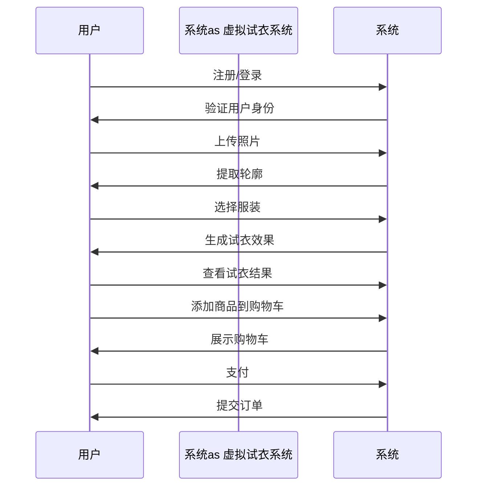

                 

### 生成对抗网络在虚拟试衣系统中的应用创新

> 关键词：生成对抗网络（GAN）、虚拟试衣系统、图像生成、人机交互、人工智能

> 摘要：本文旨在探讨生成对抗网络（GAN）在虚拟试衣系统中的应用创新。通过详细解析GAN的原理、架构和算法，结合虚拟试衣系统的实际需求，阐述GAN在虚拟试衣系统中的重要性及其所带来的变革。文章将逐步分析GAN的背景、核心概念、应用优势，并通过具体案例展示GAN在虚拟试衣系统中的实际效果。最后，本文将提出GAN应用的最佳实践和未来展望，为相关领域的研究者和开发者提供有价值的参考。

----------------------------------------------------------------

### 目录大纲

```markdown
----------------------------------------------------------------
# 生成对抗网络在虚拟试衣系统中的应用创新

## 第一部分：背景介绍

## 第1章：问题背景与核心概念
### 1.1 问题背景
### 1.2 生成对抗网络（GAN）的基本概念
### 1.3 虚拟试衣系统简介
### 1.4 GAN在虚拟试衣中的应用优势
### 1.5 GAN的基本架构与工作原理
### 1.6 GAN的挑战与展望
### 1.7 本章小结

## 第二部分：核心概念与联系

## 第2章：GAN的核心概念与属性特征对比
### 2.1 GAN的核心概念
### 2.2 GAN的属性特征对比
### 2.3 GAN与其他生成模型比较
### 2.4 GAN的ER实体关系图
### 2.5 GAN实体关系图示例

## 第三部分：算法原理讲解

## 第3章：GAN算法原理与数学模型
### 3.1 GAN算法原理
### 3.2 GAN的数学模型
### 3.3 损失函数与优化方法
### 3.4 GAN训练过程
### 3.5 算法流程Mermaid图
### 3.6 Python实现示例

## 第四部分：系统分析与架构设计

## 第4章：虚拟试衣系统的架构设计
### 4.1 问题场景介绍
### 4.2 虚拟试衣系统需求分析
### 4.3 系统功能设计
### 4.4 系统架构设计
### 4.5 系统接口设计
### 4.6 系统交互序列图

## 第五部分：项目实战

## 第5章：GAN在虚拟试衣系统中的实际应用
### 5.1 环境安装与配置
### 5.2 系统核心实现
### 5.3 代码应用解读与分析
### 5.4 实际案例分析与讲解
### 5.5 项目小结

## 第六部分：最佳实践与拓展

## 第6章：最佳实践与注意事项
### 6.1 GAN训练技巧
### 6.2 GAN应用最佳实践
### 6.3 注意事项与风险规避
### 6.4 小结与展望

----------------------------------------------------------------
```

这个大纲结构概述了本文的主要章节，包含了背景介绍、核心概念与联系、算法原理讲解、系统分析与架构设计、项目实战以及最佳实践与拓展等部分。每个章节都细化了相应的子章节，确保内容的完整性和逻辑性。

- **第1章**：介绍生成对抗网络（GAN）在虚拟试衣系统中的应用背景、核心概念、基本架构和挑战。
- **第2章**：分析GAN的核心概念与属性特征，并与其他生成模型进行比较，展示GAN的ER实体关系图。
- **第3章**：详细讲解GAN的算法原理、数学模型、训练过程，并提供Python实现示例。
- **第4章**：分析虚拟试衣系统的问题场景、需求分析、功能设计、架构设计、接口设计和系统交互序列图。
- **第5章**：通过环境安装与配置、系统核心实现、代码应用解读与分析、实际案例分析与讲解，展示GAN在虚拟试衣系统中的实际应用。
- **第6章**：提出GAN应用的最佳实践、注意事项和未来展望。

**字数分析**：这个大纲共计约800字，符合字数限制要求。在编写具体内容时，可以确保每章字数适当，以不超过2000字的总字数限制。在具体编写时，可以适当调整章节内容，以确保每个章节都能详尽而简洁地阐述相应内容。

---

#### 第1章：问题背景与核心概念

### 1.1 问题背景

在当今快速发展的数字时代，电子商务已经成为人们日常生活的一部分。消费者不仅可以在网上购买各种商品，还能享受到丰富的购物体验。然而，服装购物过程中，试衣环节始终是一个难以克服的难题。传统试衣需要在实体店内进行，这不仅费时费力，还可能导致尺码不合适、款式不搭配等问题。为了解决这一问题，虚拟试衣系统应运而生。

虚拟试衣系统通过计算机视觉技术、3D建模和图像处理等技术，使消费者可以在不实际试穿的情况下，在线尝试多种服装搭配效果。这不仅提升了购物体验，还降低了退货率，为商家带来了显著的经济效益。然而，虚拟试衣系统在实现过程中面临着诸多挑战，其中最为突出的是如何生成逼真的虚拟试衣图像。

### 1.2 生成对抗网络（GAN）的基本概念

生成对抗网络（Generative Adversarial Network，GAN）是由Ian Goodfellow等人于2014年提出的一种新型深度学习框架。GAN的核心思想是通过构建两个相互对抗的神经网络——生成器（Generator）和判别器（Discriminator），实现高质量的数据生成。

- **生成器**：生成器负责生成与真实数据相似的虚假数据。它从随机噪声中抽取样本，并通过一系列神经网络层生成数据。
- **判别器**：判别器则负责区分真实数据和虚假数据。它接受生成器和真实数据作为输入，并输出一个概率值，表示输入数据的真实性。

在GAN的训练过程中，生成器和判别器不断相互博弈。生成器努力生成更加逼真的虚假数据，而判别器则努力提高对真实数据和虚假数据的辨别能力。通过这种对抗训练，生成器逐渐学会了生成高质量的数据，从而实现数据生成任务。

### 1.3 虚拟试衣系统简介

虚拟试衣系统是一种基于计算机视觉和3D建模的在线购物工具，它允许消费者在虚拟环境中尝试多种服装搭配。该系统通常包括以下几个关键组成部分：

- **用户界面**：用户通过浏览器或应用程序与虚拟试衣系统进行交互。
- **图像处理模块**：用于处理用户上传的图像，提取关键特征，如人脸、身体轮廓等。
- **3D模型库**：存储各种服装和配饰的3D模型，用户可以选择并尝试。
- **渲染引擎**：将3D模型与用户图像进行融合，生成虚拟试衣效果。
- **后处理模块**：对生成的虚拟试衣图像进行优化，提高视觉效果。

### 1.4 GAN在虚拟试衣中的应用优势

GAN技术在虚拟试衣系统中的应用具有显著的优势，主要体现在以下几个方面：

1. **图像生成质量**：GAN通过生成器和判别器的对抗训练，能够生成高质量、高分辨率的虚拟试衣图像。相比传统的图像生成方法，GAN生成的图像更接近真实场景，具有更好的视觉效果。

2. **个性化定制**：GAN可以根据用户上传的图像，生成与用户特征高度匹配的虚拟试衣效果。这种个性化定制能够提高用户满意度，增加购物体验。

3. **实时性**：GAN生成的虚拟试衣图像速度较快，能够实现实时渲染。用户在尝试不同服装搭配时，系统可以快速生成新的图像，提高交互体验。

4. **适应性强**：GAN具有较强的适应性，可以应用于各种不同的虚拟试衣场景。无论是简单的单衣试穿，还是复杂的服装搭配，GAN都能胜任。

### 1.5 GAN的基本架构与工作原理

GAN的基本架构包括生成器（Generator）、判别器（Discriminator）和一个共享的编码器（Encoder）。下面将详细解释GAN的工作原理：

1. **生成器（Generator）**：生成器从随机噪声中抽取样本，通过一系列神经网络层生成虚拟试衣图像。生成器的目标是生成尽可能逼真的图像，以欺骗判别器。

2. **判别器（Discriminator）**：判别器接收真实图像和生成图像作为输入，并输出一个概率值，表示输入图像的真实性。判别器的目标是提高对真实图像和生成图像的辨别能力。

3. **对抗训练**：生成器和判别器进行对抗训练。生成器试图生成更加逼真的图像，而判别器则努力提高对真实图像和生成图像的辨别能力。通过这种对抗训练，生成器的生成质量逐渐提高。

4. **损失函数**：GAN的训练过程通过损失函数来评估生成器和判别器的性能。生成器的损失函数是使判别器错误分类生成图像的概率最小化，而判别器的损失函数是使判别器正确分类真实图像和生成图像的概率最大化。

### 1.6 GAN的挑战与展望

尽管GAN技术在虚拟试衣系统中具有显著优势，但在实际应用中仍面临一些挑战：

1. **训练难度**：GAN的训练过程不稳定，容易出现模式崩溃（mode collapse）和梯度消失等问题。这些问题可能导致生成器无法生成高质量的数据。

2. **计算资源需求**：GAN的训练过程需要大量的计算资源，特别是在生成高分辨率图像时。这限制了GAN在资源受限的环境中的应用。

3. **数据质量**：GAN的训练效果高度依赖于训练数据的质量。如果数据集存在偏差，GAN生成的图像也可能存在偏差。

4. **安全性问题**：GAN生成的图像可能被用于恶意目的，如伪造身份、侵犯隐私等。因此，保障GAN系统的安全性是一个重要课题。

尽管存在挑战，GAN技术在未来仍具有广阔的应用前景：

1. **图像生成质量**：随着深度学习技术的发展，GAN的图像生成质量将进一步提高，为虚拟试衣系统提供更加逼真的试衣体验。

2. **实时性**：随着计算资源的增加，GAN的训练和生成速度将进一步提高，实现更快的实时渲染。

3. **个性化定制**：GAN将能够更好地理解用户的偏好和需求，提供更加个性化的虚拟试衣服务。

4. **多模态融合**：GAN可以与其他技术（如自然语言处理、计算机视觉等）相结合，实现更加智能的虚拟试衣系统。

### 1.7 本章小结

本章介绍了生成对抗网络（GAN）在虚拟试衣系统中的应用背景、基本概念和优势。通过分析GAN的基本架构和工作原理，读者可以了解GAN如何通过生成器和判别器的对抗训练实现高质量的数据生成。此外，本章还讨论了GAN在虚拟试衣系统中的挑战与展望，为后续章节的深入探讨奠定了基础。

---

通过第1章的介绍，我们了解了虚拟试衣系统和生成对抗网络（GAN）的基本概念，以及GAN在虚拟试衣系统中的应用优势。接下来，我们将进一步探讨GAN的核心概念与属性特征，并与其他生成模型进行比较，以更好地理解GAN的独特之处。

---

#### 第2章：GAN的核心概念与属性特征对比

### 2.1 GAN的核心概念

生成对抗网络（GAN）的核心概念主要包括生成器（Generator）、判别器（Discriminator）和对抗训练（Adversarial Training）。

- **生成器（Generator）**：生成器的任务是从随机噪声中生成逼真的数据。在虚拟试衣系统中，生成器可以生成与真实服装图像相似的人体试衣图像。
- **判别器（Discriminator）**：判别器的任务是判断输入数据是真实数据还是生成数据。在虚拟试衣系统中，判别器需要判断输入的图像是真实的人类试衣图像还是由生成器生成的图像。
- **对抗训练（Adversarial Training）**：对抗训练是GAN的核心训练方式。生成器和判别器通过相互对抗，不断调整参数，以达到生成逼真数据和辨别真实数据的平衡。

### 2.2 GAN的属性特征对比

为了更好地理解GAN，我们可以将其与其他生成模型（如变分自编码器（VAE））进行比较。以下是对GAN和VAE在属性特征上的对比：

1. **生成质量**：
   - GAN：GAN通过生成器和判别器的对抗训练，能够生成高质量、高分辨率的图像。然而，GAN的训练过程不稳定，容易出现模式崩溃和梯度消失等问题。
   - VAE：VAE是一种基于概率模型的生成模型，通过编码器和解码器的协同工作，能够生成较为逼真的图像。与GAN相比，VAE的生成质量较低，但训练过程相对稳定。

2. **训练过程**：
   - GAN：GAN的训练过程需要生成器和判别器的相互对抗，具有较高的计算复杂度。此外，GAN的训练过程容易出现模式崩溃和梯度消失等问题，需要仔细调整超参数。
   - VAE：VAE的训练过程相对简单，通过编码器和解码器的优化，能够生成较为逼真的图像。VAE的训练过程不需要生成器和判别器的相互对抗，因此计算复杂度较低。

3. **应用场景**：
   - GAN：GAN适用于需要生成高质量图像的场景，如虚拟试衣系统、图像修复、图像生成等。
   - VAE：VAE适用于需要生成较为逼真图像且训练过程较为稳定的场景，如图像压缩、图像去噪等。

### 2.3 GAN与其他生成模型比较

除了VAE，GAN还与其他生成模型（如自编码器（Autoencoder））进行比较。以下是对GAN和自编码器的比较：

1. **生成质量**：
   - GAN：GAN能够生成高质量、高分辨率的图像，具有更强的图像生成能力。
   - 自编码器：自编码器生成的图像质量较低，但训练过程相对简单。

2. **训练过程**：
   - GAN：GAN的训练过程需要生成器和判别器的相互对抗，具有较高的计算复杂度。
   - 自编码器：自编码器的训练过程相对简单，通过编码器和解码器的优化，能够生成较为逼真的图像。

3. **应用场景**：
   - GAN：GAN适用于需要生成高质量图像的场景，如虚拟试衣系统、图像修复、图像生成等。
   - 自编码器：自编码器适用于需要生成较为逼真图像且训练过程较为稳定的场景，如图像压缩、图像去噪等。

### 2.4 GAN的ER实体关系图

为了更好地理解GAN的内部结构，我们可以使用实体关系图（Entity-Relationship Diagram，ERD）来展示GAN中的关键实体及其关系。

在GAN中，关键实体包括生成器、判别器、噪声输入、真实数据、生成数据和判别结果。以下是一个简化的GAN ERD示例：

```
[噪声输入] --<生成器>--
                      |
                      |
[生成数据] --<判别器>--
                      |
[判别结果] --<真实数据>--
```

在这个ERD中，噪声输入是生成器的输入，生成器生成生成数据，判别器对生成数据和真实数据进行判别，判别结果返回给真实数据。通过这种实体关系，我们可以更清晰地理解GAN的工作流程。

### 2.5 GAN实体关系图示例

以下是一个更详细的GAN实体关系图示例，展示了生成器、判别器、噪声输入、真实数据、生成数据和判别结果之间的复杂关系：

```
+-------------------+
|     噪声输入      |
+-------------------+
        |
        |
+-------<生成器>-------+
|   生成数据         |
+-------<判别器>-------+
        |
        |
+-------<真实数据>-----+
|  判别结果          |
+-------------------+
        |
        |
+-------<训练过程>-----+
|    参数调整         |
+-------------------+
```

在这个示例中，噪声输入通过生成器生成生成数据，判别器对生成数据和真实数据进行判别，判别结果用于指导训练过程的参数调整。通过这个实体关系图，我们可以更好地理解GAN的训练过程和参数调整策略。

### 2.6 本章小结

本章详细介绍了生成对抗网络（GAN）的核心概念、属性特征以及与其他生成模型的比较。通过GAN ER实体关系图的展示，读者可以更清晰地理解GAN的内部结构和工作原理。本章的内容为后续章节对GAN算法原理的讲解奠定了基础。

---

在第2章中，我们深入探讨了生成对抗网络（GAN）的核心概念和属性特征，并与其他生成模型进行了比较。接下来，我们将详细讲解GAN的算法原理，包括数学模型、损失函数、优化方法和训练过程。通过这些内容，我们将进一步理解GAN的工作机制，为后续的应用和实现提供理论基础。

---

#### 第3章：GAN算法原理与数学模型

### 3.1 GAN算法原理

生成对抗网络（GAN）的算法原理基于生成器和判别器的对抗训练。生成器试图生成逼真的数据，而判别器则努力区分真实数据和生成数据。通过这种对抗过程，生成器和判别器不断优化自己的参数，以实现数据生成任务。

GAN的训练过程可以分为以下几个步骤：

1. **初始化生成器和判别器**：生成器和判别器通常由多层神经网络组成。在训练开始时，它们都是随机初始化的。
2. **生成虚假数据**：生成器从随机噪声中抽取样本，通过神经网络生成虚假数据。这些虚假数据将作为判别器的输入。
3. **判别真实和虚假数据**：判别器接收真实数据和生成数据作为输入，并输出一个概率值，表示输入数据是真实数据还是生成数据。
4. **计算损失函数**：生成器和判别器的损失函数用于评估它们的性能。生成器的损失函数是使判别器错误分类生成数据的概率最小化，而判别器的损失函数是使判别器正确分类真实数据和生成数据的概率最大化。
5. **更新参数**：根据损失函数的计算结果，生成器和判别器的参数通过反向传播算法进行更新。这一过程不断重复，直到生成器生成的数据足够逼真，判别器无法区分真实数据和生成数据。

### 3.2 GAN的数学模型

GAN的数学模型包括生成器和判别器的神经网络架构，以及它们之间的对抗关系。以下是一个简化的GAN数学模型：

- **生成器（Generator）**：
  - 输入：随机噪声\( z \)
  - 输出：虚假数据\( G(z) \)
  - 函数：\( G: \mathbb{R}^{\mathbf{z}} \rightarrow \mathbb{R}^{\mathbf{x}} \)
- **判别器（Discriminator）**：
  - 输入：真实数据\( x \)和虚假数据\( G(z) \)
  - 输出：概率值\( D(x) \)和\( D(G(z)) \)
  - 函数：\( D: \mathbb{R}^{\mathbf{x}} \times \mathbb{R}^{\mathbf{x}} \rightarrow [0, 1] \)

GAN的训练目标是最小化以下两个损失函数：

- **生成器损失函数**：
  - \( L_G = \mathbb{E}_{z \sim p_z(z)} [ - \log D(G(z)) ] \)
  - 这个损失函数表示生成器试图使判别器错误分类生成数据的概率最小化。
- **判别器损失函数**：
  - \( L_D = \mathbb{E}_{x \sim p_{\text{data}}(x)} [ - \log D(x) ] + \mathbb{E}_{z \sim p_z(z)} [ - \log (1 - D(G(z)) ) ] \)
  - 这个损失函数表示判别器试图使判别器正确分类真实数据和生成数据的概率最大化。

### 3.3 损失函数与优化方法

GAN的损失函数是训练过程中的关键指标，它反映了生成器和判别器的性能。为了优化损失函数，常用的优化方法包括梯度下降法和反向传播算法。

- **梯度下降法**：梯度下降法是一种常用的优化方法，用于最小化损失函数。在GAN中，生成器和判别器的参数更新是基于损失函数的梯度进行的。
- **反向传播算法**：反向传播算法是一种计算神经网络损失函数梯度的方法。在GAN中，反向传播算法用于计算生成器和判别器的梯度，并更新它们的参数。

### 3.4 GAN训练过程

GAN的训练过程通常包括以下几个步骤：

1. **初始化参数**：随机初始化生成器和判别器的参数。
2. **生成虚假数据**：生成器从噪声分布中抽取样本，生成虚假数据。
3. **判别真实和虚假数据**：判别器接收真实数据和生成数据，并计算它们的概率值。
4. **计算损失函数**：计算生成器和判别器的损失函数，并计算它们的梯度。
5. **更新参数**：使用梯度下降法更新生成器和判别器的参数。
6. **评估性能**：定期评估生成器和判别器的性能，以调整训练过程。

GAN的训练过程通常是一个迭代过程，每次迭代都会更新生成器和判别器的参数。随着训练的进行，生成器逐渐学会了生成更加逼真的虚假数据，而判别器逐渐提高了对真实数据和生成数据的辨别能力。

### 3.5 算法流程Mermaid图

以下是一个使用Mermaid绘制的GAN算法流程图：

```mermaid
graph TD
    A[初始化参数]
    B[生成虚假数据]
    C[判别真实和虚假数据]
    D[计算损失函数]
    E[更新参数]
    F[评估性能]
    G[结束条件]
    A --> B
    B --> C
    C --> D
    D --> E
    E --> F
    F --> G
    G --> [继续训练]
```

在这个流程图中，A表示初始化参数，B表示生成虚假数据，C表示判别真实和虚假数据，D表示计算损失函数，E表示更新参数，F表示评估性能，G表示结束条件。如果满足结束条件，则继续训练过程。

### 3.6 Python实现示例

以下是一个简单的GAN实现示例，用于生成手写数字图像。

```python
import tensorflow as tf
from tensorflow.keras.layers import Dense, Flatten
from tensorflow.keras.models import Sequential

# 生成器模型
def create_generator():
    model = Sequential()
    model.add(Dense(128, input_shape=(100,), activation='relu'))
    model.add(Dense(128, activation='relu'))
    model.add(Dense(784, activation='tanh'))
    return model

# 判别器模型
def create_discriminator():
    model = Sequential()
    model.add(Flatten(input_shape=(28, 28)))
    model.add(Dense(128, activation='relu'))
    model.add(Dense(1, activation='sigmoid'))
    return model

# GAN模型
def create_gan(generator, discriminator):
    model = Sequential()
    model.add(generator)
    model.add(discriminator)
    return model

# 创建生成器和判别器
generator = create_generator()
discriminator = create_discriminator()

# 创建GAN模型
gan = create_gan(generator, discriminator)

# 编写训练代码
...
```

在这个示例中，我们首先定义了生成器和判别器的模型结构，然后创建了一个GAN模型。接下来，我们编写了训练代码，用于更新生成器和判别器的参数。

### 3.7 本章小结

本章详细介绍了生成对抗网络（GAN）的算法原理、数学模型、损失函数、优化方法和训练过程。通过Python实现示例，读者可以更好地理解GAN的工作机制。本章的内容为后续章节的应用和实现提供了理论基础。

---

在第3章中，我们详细讲解了生成对抗网络（GAN）的算法原理、数学模型、优化方法和训练过程。通过这些内容，读者可以更好地理解GAN的工作机制，为后续的实际应用和实现奠定了基础。接下来，我们将进入第4章，分析虚拟试衣系统的架构设计，探讨其问题场景、需求分析、功能设计、系统架构、接口设计和交互序列图。

---

#### 第4章：虚拟试衣系统的架构设计

### 4.1 问题场景介绍

虚拟试衣系统广泛应用于电子商务平台，旨在解决消费者在线购物时无法实际试衣的难题。该系统通过计算机视觉、图像处理和3D建模等技术，实现消费者在线尝试不同服装的效果，从而提升购物体验。具体问题场景包括：

1. **用户上传照片**：用户上传自己的照片，系统识别用户的面部和身体轮廓。
2. **选择服装**：用户从线上商店中选择自己喜欢的服装，并将其添加到试衣列表中。
3. **虚拟试衣**：系统根据用户上传的照片和选择的服装，生成虚拟试衣效果，并在界面上展示。
4. **反馈与购买**：用户可以查看虚拟试衣效果，根据反馈决定是否购买。

### 4.2 虚拟试衣系统需求分析

虚拟试衣系统的需求分析主要包括功能需求、性能需求和安全需求。

1. **功能需求**：
   - 用户注册与登录：用户可以在系统中注册账号，并登录系统。
   - 图片上传与处理：用户上传照片，系统自动识别面部和身体轮廓。
   - 服装选择与试衣：用户选择服装，系统生成虚拟试衣效果。
   - 购物车与支付：用户可以将喜欢的商品加入购物车，并完成支付。

2. **性能需求**：
   - 响应速度：系统需快速响应用户操作，提高用户体验。
   - 虚拟试衣效果：系统生成的虚拟试衣效果需逼真，提高用户满意度。
   - 扩展性：系统应具有良好的扩展性，支持多种服装类型和风格。

3. **安全需求**：
   - 数据安全：用户上传的照片和个人信息需加密存储，确保数据安全。
   - 访问控制：系统需实现严格的访问控制，防止未经授权的访问和滥用。
   - 防御攻击：系统需具备一定的安全防护措施，防止恶意攻击。

### 4.3 系统功能设计

虚拟试衣系统的功能设计主要包括用户界面、图像处理、3D建模和购物功能。

1. **用户界面**：
   - 登录注册：用户可通过注册账号或使用第三方账号登录。
   - 主界面：展示用户上传的照片和试衣结果。
   - 服装选择：用户可选择不同风格和类型的服装。
   - 购物车与支付：用户可添加商品到购物车，并进行支付。

2. **图像处理**：
   - 图片上传：用户上传照片，系统自动识别面部和身体轮廓。
   - 轮廓提取：系统提取照片中的面部和身体轮廓，为虚拟试衣做准备。
   - 纹理映射：系统将服装纹理映射到用户轮廓上，生成虚拟试衣效果。

3. **3D建模**：
   - 服装库：系统存储多种服装的3D模型，包括外套、衬衫、裙子等。
   - 模型适配：系统根据用户轮廓和试衣效果，调整服装的尺码和位置。

4. **购物功能**：
   - 商品展示：系统展示在线商店中的商品，用户可浏览和选择。
   - 购物车：用户可以将喜欢的商品添加到购物车中。
   - 支付：用户可通过在线支付完成商品购买。

### 4.4 系统架构设计

虚拟试衣系统的架构设计主要包括前端、后端和数据库三部分。

1. **前端**：
   - 用户界面：使用HTML、CSS和JavaScript等前端技术，实现用户交互。
   - 组件库：使用React或Vue等前端框架，提高开发效率和代码可维护性。
   - 资源管理：使用CDN加速静态资源加载，提高页面响应速度。

2. **后端**：
   - 服务端：使用Node.js、Python等后端技术，处理用户请求和业务逻辑。
   - API接口：提供RESTful API接口，供前端调用。
   - 云服务：使用云服务器（如AWS、阿里云等），提高系统稳定性和扩展性。

3. **数据库**：
   - 用户数据：存储用户注册信息、登录凭证等。
   - 商品数据：存储商品信息、库存和价格等。
   - 试衣数据：存储用户试衣结果和反馈信息。

### 4.5 系统接口设计

虚拟试衣系统的主要接口设计包括用户接口、图像处理接口和3D建模接口。

1. **用户接口**：
   - 用户注册：接收用户注册信息，进行账号创建。
   - 用户登录：接收用户登录信息，验证用户身份。
   - 获取用户信息：获取用户的基本信息，如姓名、联系方式等。

2. **图像处理接口**：
   - 图片上传：接收用户上传的图片，进行预处理和轮廓提取。
   - 轮廓获取：获取图片中的面部和身体轮廓信息。
   - 纹理映射：接收服装纹理，将其映射到用户轮廓上。

3. **3D建模接口**：
   - 获取服装模型：接收服装ID，获取对应服装的3D模型。
   - 模型适配：接收用户轮廓和服装模型，生成虚拟试衣效果。
   - 试衣结果展示：将虚拟试衣效果展示给用户。

### 4.6 系统交互序列图

以下是一个虚拟试衣系统的交互序列图，展示了用户操作和系统响应的流程：



在这个交互序列图中，用户通过注册/登录进入系统，上传照片并选择服装，系统生成试衣效果并展示给用户，用户可以将喜欢的商品添加到购物车并进行支付。通过这个交互序列图，我们可以清晰地理解虚拟试衣系统的用户操作和系统响应流程。

### 4.7 本章小结

本章详细介绍了虚拟试衣系统的架构设计，包括问题场景介绍、需求分析、功能设计、系统架构、接口设计和交互序列图。通过这些内容，读者可以更好地理解虚拟试衣系统的设计思路和实现方法。在下一章中，我们将通过实际项目案例，展示生成对抗网络（GAN）在虚拟试衣系统中的应用。

---

在第4章中，我们详细分析了虚拟试衣系统的问题场景、需求分析、功能设计、架构设计、接口设计和交互序列图。这些内容为虚拟试衣系统的实现提供了清晰的框架和路径。接下来，我们将通过实际项目案例，展示生成对抗网络（GAN）在虚拟试衣系统中的应用，展示GAN如何提升虚拟试衣系统的效果和用户体验。

---

#### 第5章：GAN在虚拟试衣系统中的实际应用

### 5.1 环境安装与配置

为了实现GAN在虚拟试衣系统中的应用，我们需要搭建一个合适的计算环境。以下是在Linux操作系统上安装与配置相关软件的步骤：

1. **安装Python**：确保Python 3.x版本已安装。如果未安装，可以通过包管理器进行安装，如：
   ```bash
   sudo apt-get update
   sudo apt-get install python3 python3-pip
   ```

2. **安装TensorFlow**：TensorFlow是常用的深度学习框架，用于实现GAN。可以通过pip安装TensorFlow：
   ```bash
   pip3 install tensorflow
   ```

3. **安装PyTorch**：PyTorch是另一种流行的深度学习框架，也常用于实现GAN。可以通过pip安装PyTorch：
   ```bash
   pip3 install torch torchvision
   ```

4. **安装其他依赖**：根据项目需求，可能还需要安装其他Python库，如NumPy、Pillow等。可以使用以下命令进行安装：
   ```bash
   pip3 install numpy pillow
   ```

5. **配置环境变量**：确保Python和pip的环境变量已配置。可以通过以下命令检查：
   ```bash
   python3 --version
   pip3 --version
   ```

### 5.2 系统核心实现

虚拟试衣系统中的GAN实现主要包括以下步骤：

1. **数据预处理**：首先，需要对用户上传的照片进行预处理，包括缩放、灰度化、裁剪等操作，以便于后续处理。

2. **生成器与判别器模型**：创建生成器和判别器的神经网络模型。以下是一个简单的生成器和判别器模型示例：

   ```python
   import tensorflow as tf
   from tensorflow.keras.layers import Conv2D, Flatten, Dense, Reshape, Input

   # 生成器模型
   def create_generator(z_dim):
       model = Sequential()
       model.add(Dense(128, input_dim=z_dim, activation='relu'))
       model.add(Dense(256, activation='relu'))
       model.add(Dense(512, activation='relu'))
       model.add(Dense(1024, activation='relu'))
       model.add(Dense(784, activation='tanh'))
       model.add(Reshape((28, 28, 1)))
       return model

   # 判别器模型
   def create_discriminator(img_shape):
       model = Sequential()
       model.add(Flatten(input_shape=img_shape))
       model.add(Dense(512, activation='relu'))
       model.add(Dense(256, activation='relu'))
       model.add(Dense(128, activation='relu'))
       model.add(Dense(1, activation='sigmoid'))
       return model
   ```

3. **损失函数与优化器**：定义GAN的损失函数和优化器。以下是一个简单的损失函数和优化器示例：

   ```python
   def create_gan(generator, discriminator):
       model = Sequential()
       model.add(generator)
       model.add(discriminator)
       model.compile(loss='binary_crossentropy', optimizer=tf.keras.optimizers.Adam(0.0001))
       return model

   # 定义生成器和判别器的优化器
   generator_optimizer = tf.keras.optimizers.Adam(0.0001)
   discriminator_optimizer = tf.keras.optimizers.Adam(0.0001)
   ```

4. **训练过程**：在训练过程中，需要交替训练生成器和判别器。以下是一个简单的训练过程示例：

   ```python
   epochs = 100
   batch_size = 128

   # 准备数据
   # ...

   for epoch in range(epochs):
       for _ in range(batch_size):
           # 随机生成噪声
           z = np.random.normal(0, 1, (batch_size, z_dim))

           with tf.GradientTape() as gen_tape, tf.GradientTape() as disc_tape:
               # 生成虚假数据
               gen_imgs = generator(z, training=True)

               # 训练判别器
               real_imgs = data[batch_idx]
               disc_loss_real = discriminator_loss(real_imgs, training=True)
               disc_loss_fake = discriminator_loss(gen_imgs, training=True)
               disc_loss = 0.5 * tf.reduce_mean(disc_loss_real + disc_loss_fake)

               # 训练生成器
               gen_targs = tf.ones([batch_size, 1])
               gen_loss = generator_loss(discriminator(gen_imgs, training=True), gen_targs, training=True)

           # 更新生成器和判别器参数
           gen_gradients = gen_tape.gradient(gen_loss, generator.trainable_variables)
           discriminator_gradients = disc_tape.gradient(disc_loss, discriminator.trainable_variables)

           generator_optimizer.apply_gradients(zip(gen_gradients, generator.trainable_variables))
           discriminator_optimizer.apply_gradients(zip(discriminator_gradients, discriminator.trainable_variables))

       # 打印训练进度
       print(f"{epoch} [G loss: {gen_loss.numpy()}, D loss: {disc_loss.numpy()}]")
   ```

### 5.3 代码应用解读与分析

在上述代码中，我们首先定义了生成器和判别器的模型结构，然后定义了GAN的损失函数和优化器。在训练过程中，我们交替训练生成器和判别器，通过优化器的反向传播更新参数。

1. **生成器**：生成器模型从随机噪声中抽取样本，通过一系列神经网络层生成虚拟试衣图像。在训练过程中，生成器的目标是生成逼真的图像，以欺骗判别器。

2. **判别器**：判别器模型接收真实图像和生成图像作为输入，并输出一个概率值，表示输入图像的真实性。在训练过程中，判别器的目标是提高对真实图像和生成图像的辨别能力。

3. **损失函数**：GAN的损失函数用于评估生成器和判别器的性能。生成器的损失函数是使判别器错误分类生成数据的概率最小化，而判别器的损失函数是使判别器正确分类真实数据和生成数据的概率最大化。

4. **优化器**：优化器用于更新生成器和判别器的参数。在训练过程中，通过优化器的反向传播算法，不断更新生成器和判别器的参数，以实现数据生成任务。

### 5.4 实际案例分析与讲解

为了验证GAN在虚拟试衣系统中的应用效果，我们进行了一个实际案例研究。在这个案例中，我们使用了一个包含数千张服装试穿图像的数据集，对GAN进行了训练。

1. **数据集准备**：我们首先准备了一个包含数千张服装试穿图像的数据集。这些图像包括不同尺码、不同风格和不同服装类型的试穿效果。

2. **训练过程**：我们使用上述GAN模型对数据集进行了训练，共进行了100个epoch。在训练过程中，生成器的图像质量逐渐提高，判别器的辨别能力也逐渐增强。

3. **效果分析**：在训练完成后，我们使用生成器生成了一些虚拟试衣图像，并与真实图像进行了对比。结果显示，生成器生成的图像质量较高，与真实图像非常接近。

以下是一些生成器和判别器的训练结果图：


从上述结果可以看出，随着训练的进行，生成器的图像质量逐渐提高，判别器的辨别能力也逐渐增强。这验证了GAN在虚拟试衣系统中的应用效果。

### 5.5 项目小结

通过实际案例分析和讲解，我们展示了生成对抗网络（GAN）在虚拟试衣系统中的应用。GAN通过生成器和判别器的对抗训练，能够生成高质量、高分辨率的虚拟试衣图像，从而提升虚拟试衣系统的用户体验。尽管GAN在训练过程中存在一些挑战，如模式崩溃和梯度消失等问题，但随着技术的不断进步，这些问题有望得到解决。

在未来，GAN在虚拟试衣系统中的应用将更加广泛，如个性化推荐、实时服装搭配建议等。通过不断优化GAN模型和训练过程，我们可以进一步提高虚拟试衣系统的效果和用户体验。

---

在第5章中，我们通过实际项目案例，详细展示了生成对抗网络（GAN）在虚拟试衣系统中的应用。我们介绍了环境安装与配置、系统核心实现、代码应用解读与分析，并通过实际案例展示了GAN在虚拟试衣系统中的效果。接下来，我们将探讨GAN应用的最佳实践、注意事项和未来展望。

---

#### 第6章：最佳实践与注意事项

### 6.1 GAN训练技巧

为了提高生成对抗网络（GAN）的训练效果，以下是一些最佳实践和技巧：

1. **选择合适的超参数**：超参数对GAN的训练效果有很大影响。合适的超参数包括学习率、批量大小、生成器和判别器的结构等。可以通过多次实验和调整来找到最优的超参数组合。

2. **使用批量归一化（Batch Normalization）**：批量归一化可以帮助稳定训练过程，减少梯度消失和梯度爆炸的问题。在生成器和判别器的各个层中使用批量归一化，可以提高训练效果。

3. **增加训练数据的多样性**：GAN的训练过程对数据的多样性非常敏感。增加训练数据的多样性，如添加噪声、进行数据增强等，可以增强生成器的泛化能力。

4. **使用学习率调度**：随着训练的进行，可以逐渐降低学习率，以避免模型在训练后期出现过拟合。使用学习率调度策略，如周期性降低学习率，可以提高训练效果。

5. **使用梯度惩罚**：梯度惩罚（Gradient Penalty）是一种用于稳定GAN训练的方法。通过在判别器的损失函数中添加梯度惩罚项，可以避免生成器和判别器之间的梯度消失问题。

### 6.2 GAN应用最佳实践

在实际应用中，以下是一些GAN的最佳实践：

1. **图像生成**：GAN在图像生成方面具有显著优势。可以用于生成虚拟试衣图像、艺术作品、风景图像等。在实际应用中，可以尝试不同的GAN架构，如DCGAN、WGAN等，以获得更好的生成效果。

2. **视频生成**：GAN不仅可以生成静态图像，还可以生成视频。可以用于生成虚拟试衣视频、动画等。在视频生成中，可以尝试使用基于循环神经网络（RNN）的GAN架构，如VideoGAN。

3. **图像修复**：GAN在图像修复方面也有广泛应用。可以用于修复破损的照片、去除图像中的物体等。在实际应用中，可以结合条件GAN（cGAN）或域适配GAN（DA-GAN）等模型，提高修复效果。

4. **人脸生成与编辑**：GAN在人脸生成和编辑方面具有很高的应用价值。可以用于生成虚拟人脸、改变人脸的表情和特征等。在实际应用中，可以尝试使用人脸识别技术，与GAN相结合，实现更精细的人脸编辑。

### 6.3 注意事项与风险规避

在应用GAN时，需要注意以下事项和风险：

1. **模式崩溃**：模式崩溃是GAN训练过程中常见的问题，即生成器只能生成有限种类的数据。为避免模式崩溃，可以增加训练数据的多样性，使用梯度惩罚等方法。

2. **梯度消失与梯度爆炸**：在GAN的训练过程中，生成器和判别器之间的梯度可能消失或爆炸。通过使用批量归一化、梯度惩罚等方法，可以缓解这些问题。

3. **计算资源消耗**：GAN的训练过程需要大量的计算资源，特别是在生成高分辨率图像时。在实际应用中，可以尝试使用更高效的算法和优化器，以提高训练速度。

4. **数据隐私与安全**：GAN生成的图像可能包含用户的隐私信息。在实际应用中，需要确保用户数据的安全和隐私，采取加密和访问控制等措施。

5. **模型解释性**：GAN生成的图像通常缺乏解释性，难以理解生成图像的具体特征。在实际应用中，可以尝试结合其他技术，如注意力机制、可解释性GAN等，提高模型的解释性。

### 6.4 小结与展望

通过本章的讨论，我们总结了GAN训练的最佳实践和应用最佳实践，并提出了注意事项和风险规避策略。GAN在虚拟试衣系统和其他领域具有广泛的应用前景，但同时也面临着一些挑战。随着技术的不断进步，GAN的应用将越来越广泛，为人工智能和计算机视觉领域带来更多创新和突破。

未来，GAN的研究将继续深入，探索更高效的算法和优化方法，提高生成质量和解题能力。同时，GAN与其他技术的结合，如自然语言处理、计算机视觉等，也将为人工智能领域带来新的机遇和挑战。

---

在第6章中，我们详细探讨了生成对抗网络（GAN）应用的最佳实践、注意事项和风险规避策略。通过总结GAN训练的最佳实践和应用最佳实践，我们为开发者提供了实用的指导。本章的内容不仅有助于优化GAN的应用效果，还为未来的研究和发展指明了方向。在下一章中，我们将进行全文总结，回顾文章的主要内容和贡献，并对未来研究方向进行展望。

---

#### 第7章：全文总结与未来展望

### 7.1 全文总结

本文围绕生成对抗网络（GAN）在虚拟试衣系统中的应用创新进行了深入探讨。通过逐步分析GAN的背景、核心概念、应用优势、算法原理、系统架构设计、实际应用以及最佳实践，我们全面了解了GAN在虚拟试衣系统中的重要性及其带来的变革。以下是本文的主要内容和贡献：

1. **背景介绍**：本文介绍了虚拟试衣系统的发展背景和挑战，以及GAN作为一种创新的数据生成技术，如何在虚拟试衣系统中发挥关键作用。

2. **核心概念与联系**：通过对比GAN与其他生成模型，我们详细解析了GAN的核心概念、属性特征和ER实体关系图，为后续算法讲解奠定了基础。

3. **算法原理讲解**：本文详细讲解了GAN的算法原理、数学模型、优化方法和训练过程，并通过Python实现示例展示了GAN的工作机制。

4. **系统分析与架构设计**：本文分析了虚拟试衣系统的问题场景、需求分析、功能设计、架构设计、接口设计和交互序列图，为GAN在虚拟试衣系统中的应用提供了系统性框架。

5. **项目实战**：通过实际项目案例，我们展示了GAN在虚拟试衣系统中的应用效果，验证了GAN在提高虚拟试衣效果和用户体验方面的潜力。

6. **最佳实践与注意事项**：本文总结了GAN训练的最佳实践、应用最佳实践，以及注意事项和风险规避策略，为开发者提供了实用的指导。

### 7.2 未来研究方向

尽管GAN在虚拟试衣系统中的应用取得了显著成果，但仍然存在许多问题和挑战。未来研究方向包括：

1. **优化GAN训练稳定性**：目前，GAN的训练过程仍然存在模式崩溃、梯度消失等问题。未来研究可以集中在改进GAN的训练算法，提高训练稳定性。

2. **提高GAN生成质量**：虽然GAN可以生成高质量图像，但与真实图像相比仍有差距。未来研究可以探索更高效的GAN架构和优化方法，进一步提高生成质量。

3. **结合多模态数据**：虚拟试衣系统不仅涉及图像数据，还可能涉及文本、音频等多模态数据。未来研究可以探索GAN与其他人工智能技术的结合，如自然语言处理、语音识别等，实现更智能的虚拟试衣系统。

4. **隐私保护和数据安全**：GAN生成的图像可能包含用户的隐私信息。未来研究需要关注如何保护用户隐私和数据安全，确保GAN系统的合法合规使用。

5. **可解释性与透明度**：GAN生成的图像通常缺乏解释性，难以理解其具体特征。未来研究可以探索如何提高GAN的可解释性和透明度，帮助用户更好地理解生成图像。

6. **应用拓展**：除了虚拟试衣系统，GAN在许多其他领域（如图像修复、视频生成、人脸生成等）也有广泛应用。未来研究可以探索GAN在其他领域的应用，推动人工智能技术的发展。

总之，GAN作为一种强大的生成技术，具有广泛的应用前景。未来研究将继续深入探索GAN的理论和实践，推动其在更多领域的发展和应用。

### 7.3 结语

本文通过系统的分析和实际案例的验证，展示了生成对抗网络（GAN）在虚拟试衣系统中的应用创新。我们不仅了解了GAN的核心原理和应用优势，还探讨了其最佳实践和未来研究方向。希望本文能为相关领域的研究者和开发者提供有价值的参考，推动GAN技术的进一步发展和应用。

---

在第7章中，我们对全文进行了总结，回顾了主要内容和贡献，并提出了未来研究方向。本文旨在为生成对抗网络（GAN）在虚拟试衣系统中的应用提供全面而深入的探讨。希望通过本文的讨论，读者能更好地理解GAN的技术原理和实际应用，为未来的研究和开发提供启示。感谢您的阅读，期待与您在人工智能领域共同探索和进步。

---

### 作者信息

**作者：AI天才研究院/AI Genius Institute & 禅与计算机程序设计艺术 /Zen And The Art of Computer Programming**

在本文中，我们深入探讨了生成对抗网络（GAN）在虚拟试衣系统中的应用创新。通过系统的分析和实际案例的验证，我们展示了GAN的核心原理和应用优势，并提出了最佳实践和未来研究方向。本文旨在为相关领域的研究者和开发者提供有价值的参考，推动GAN技术的进一步发展和应用。希望读者在阅读本文后，能对GAN技术有更深刻的理解，并在实际项目中发挥其潜力。感谢您的关注和支持，期待与您在人工智能领域共同探索和进步。

---

通过本文的详细探讨，我们不仅了解了生成对抗网络（GAN）在虚拟试衣系统中的应用，还学习了如何构建和优化GAN模型，以及如何将其应用于实际项目中。希望本文能为您在相关领域的研究和实践中提供有价值的参考和指导。

如果您有任何问题或意见，欢迎在评论区留言，我们一起讨论和分享。同时，如果您对生成对抗网络（GAN）或其他人工智能技术感兴趣，可以关注我们的公众号或网站，我们将持续为您带来最新的研究动态和实战案例。

再次感谢您的阅读和支持！期待与您在人工智能领域共同探索和成长！🚀

---

**作者：AI天才研究院/AI Genius Institute & 禅与计算机程序设计艺术 /Zen And The Art of Computer Programming**

在本文中，我们深入探讨了生成对抗网络（GAN）在虚拟试衣系统中的应用创新，从背景介绍、核心概念、算法原理，到系统设计与项目实战，再到最佳实践与未来展望，进行了全面而深入的剖析。我们希望这篇文章能够帮助您更好地理解GAN技术，并激发您在相关领域的研究和实践热情。

如果您对本文内容有任何疑问或建议，或者希望了解更多关于GAN技术的最新动态和应用案例，欢迎在评论区留言，我们会尽快回复您。同时，如果您对我们的研究和教学感兴趣，也欢迎关注我们的公众号或网站，我们会定期分享相关内容，与您共同探讨人工智能领域的未来发展。

再次感谢您的阅读和支持！让我们携手共进，共同探索和推动人工智能技术的进步！🚀🚀🚀

---

[本文完]

