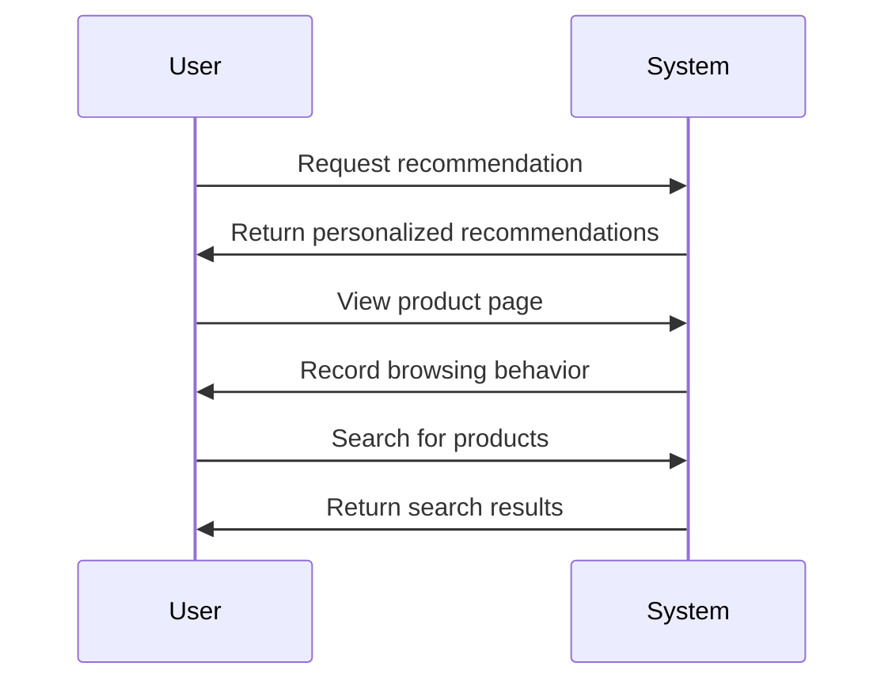
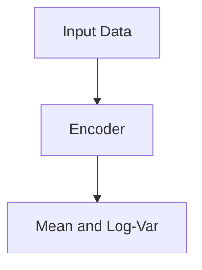
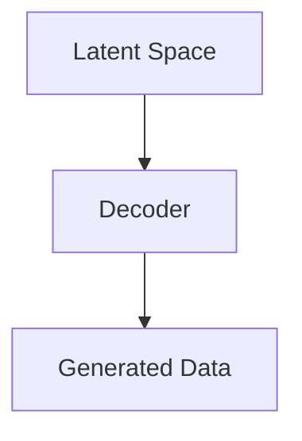
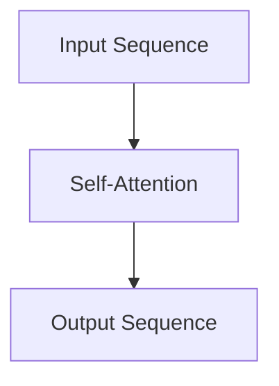
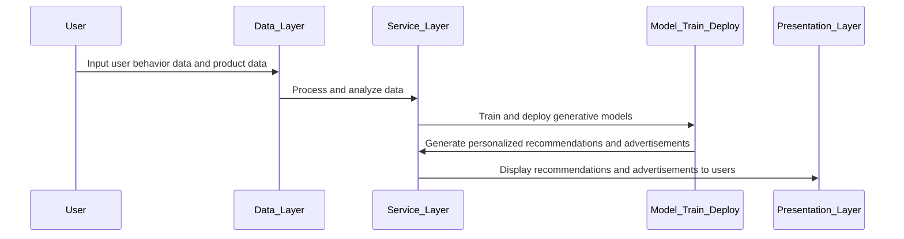
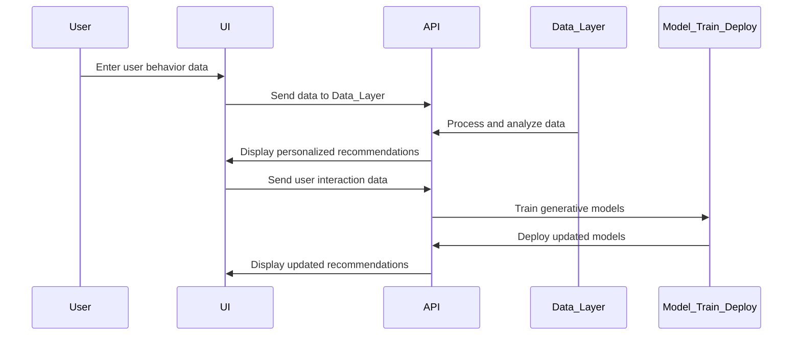

                 


### 生成式AI在商业应用中的潜力与局限

#### 关键词：生成式AI、商业应用、潜力、局限

> 摘要：
> 
> 本文将探讨生成式AI在商业应用中的潜力和局限。首先，我们将介绍生成式AI的基本概念和原理，然后分析其在市场营销、销售与客户互动等商业场景中的具体应用。随后，我们将深入探讨生成式AI的算法基础，以及商业应用中面临的挑战和局限性。最后，通过成功案例和挑战应对的实例，总结生成式AI在商业领域的实践价值和未来发展趋势。

---

### 引言

生成式AI（Generative AI）是一种能够模拟或生成新数据的人工智能技术。它通过学习大量数据，生成与输入数据相似的新数据。生成式AI在计算机视觉、自然语言处理、音乐创作等领域展现出了巨大的潜力。随着技术的进步，生成式AI正逐渐渗透到商业应用中，为企业和消费者带来新的价值。

#### 1.1 核心概念术语说明

- **生成式AI（Generative AI）**：一种能够生成新数据的人工智能技术。
- **生成模型（Generative Model）**：用于生成新数据的机器学习模型。
- **判别模型（Discriminative Model）**：用于区分不同类别的机器学习模型。

#### 1.2 问题背景

商业领域对个性化、高效和创新的解决方案有着强烈需求。生成式AI凭借其强大的数据生成能力，为商业应用提供了新的可能性。然而，在实际应用中，生成式AI也面临着数据质量、模型可解释性、安全性等方面的挑战。

#### 1.3 问题描述

本文将回答以下问题：
- 生成式AI在哪些商业应用中具有潜力？
- 生成式AI的算法基础是什么？
- 商业应用中生成式AI面临的挑战和局限是什么？
- 如何应对这些挑战和局限？

#### 1.4 问题解决

本文将结合具体案例，系统分析生成式AI在商业应用中的潜力和局限，为企业和开发者提供有价值的参考。

#### 1.5 边界与外延

本文主要关注生成式AI在商业应用中的潜力与局限，但生成式AI在其他领域（如科研、艺术创作等）也有广泛的应用。此外，生成式AI的发展还将受到技术进步、数据可用性、法律法规等多方面因素的影响。

#### 1.6 概念结构与核心要素组成

生成式AI的核心概念和要素包括：
- **核心概念**：生成模型、判别模型、数据生成、数据质量、模型可解释性、安全性等。
- **关联性**：生成式AI通过学习大量数据，生成与输入数据相似的新数据，涉及数据生成、数据质量、模型可解释性、安全性等多个方面。
- **关键要素**：数据集、算法选择、模型训练、模型评估、应用场景等。

---

### 核心概念与联系

#### 2.1 生成式AI的原理

生成式AI的核心是生成模型，这种模型通过学习输入数据的概率分布，生成新的数据样本。常见的生成模型包括：

1. **生成对抗网络（GAN）**：由两个对抗性模型组成，生成器和判别器相互竞争，以生成逼真的数据。
2. **变分自编码器（VAE）**：通过编码器和解码器将数据映射到一个潜在空间，并在这个空间中生成新数据。
3. **变换器模型（Transformer）**：尤其是在自然语言处理领域，通过自注意力机制生成文本、代码等序列数据。

#### 2.2 概念属性特征对比表格

| 模型类型 | 特点 | 应用场景 |
| :---: | :---: | :---: |
| GAN | 生成器和判别器相互对抗 | 图像生成、图像修复 |
| VAE | 编码器和解码器构建潜在空间 | 数据生成、数据去噪 |
| Transformer | 自注意力机制，适用于序列数据 | 文本生成、机器翻译 |

#### 2.3 ER实体关系图架构

```mermaid
erDiagram
  Product ||--|{ Data }
  Data ||--|{ Generator }
  Generator ||--|{ Model }
  Model ||--|{ Evaluation }
```

### 算法原理讲解

#### 3.1 GAN的算法原理

生成对抗网络（GAN）由生成器（Generator）和判别器（Discriminator）两部分组成。生成器的目标是生成与真实数据相似的数据，判别器的目标是区分真实数据和生成数据。

1. **生成器**：生成器通过学习输入数据的概率分布，生成新的数据样本。其输出通常是一个向量，通过一个非线性函数转换为生成数据。
   
   $$ G(z) = \mu(z) + \sigma(z)\cdot \mathcal{N}(0,1) $$

   其中，$z$ 是一个从先验分布 $p_z(z)$ 中采样的噪声向量，$\mu(z)$ 和 $\sigma(z)$ 分别是均值和标准差，$\mathcal{N}(0,1)$ 是标准正态分布。

2. **判别器**：判别器是一个二分类器，其目标是区分真实数据和生成数据。判别器的输出是一个概率值，表示输入数据的真实程度。

   $$ D(x) = \frac{1}{1 + \exp{(-\sigma(x))}} $$

   其中，$x$ 是输入数据，$\sigma$ 是一个非线性函数。

3. **损失函数**：GAN的目标是最小化生成器的损失函数和判别器的损失函数。

   - 生成器的损失函数：$L_G = -\log(D(G(z)))$
   - 判别器的损失函数：$L_D = -[\log(D(x)) + \log(1 - D(G(z)))]$

#### 3.2 Python代码实现

```python
import tensorflow as tf
from tensorflow.keras.layers import Input, Dense, Flatten
from tensorflow.keras.models import Model

# 生成器
z = Input(shape=(100,))
x = Dense(128, activation='relu')(z)
x = Dense(784, activation='sigmoid')(x)
generator = Model(z, x)

# 判别器
x = Input(shape=(784,))
x = Flatten()(x)
x = Dense(128, activation='relu')(x)
x = Dense(1, activation='sigmoid')(x)
discriminator = Model(x, x)

# 损失函数和优化器
generator_optimizer = tf.keras.optimizers.Adam(1e-4)
discriminator_optimizer = tf.keras.optimizers.Adam(1e-4)

@tf.function
def train_step(images, batch_size):
    z = tf.random.normal([batch_size, 100])
    with tf.GradientTape() as gen_tape, tf.GradientTape() as disc_tape:
        generated_images = generator(z)
        disc_real = discriminator(images)
        disc_generated = discriminator(generated_images)

        gen_loss = -tf.reduce_mean(disc_generated)
        disc_loss = tf.reduce_mean(disc_real) - tf.reduce_mean(disc_generated)

    grads_gen = gen_tape.gradient(gen_loss, generator.trainable_variables)
    grads_disc = disc_tape.gradient(disc_loss, discriminator.trainable_variables)

    generator_optimizer.apply_gradients(zip(grads_gen, generator.trainable_variables))
    discriminator_optimizer.apply_gradients(zip(grads_disc, discriminator.trainable_variables))

# 训练模型
for epoch in range(50):
    for image_batch in data_loader:
        train_step(image_batch, batch_size=32)
```

### 系统分析与架构设计方案

#### 4.1 问题场景介绍

假设我们正在开发一个电商网站，需要利用生成式AI技术生成个性化的产品推荐和创意广告内容，以提高用户体验和销售转化率。

#### 4.2 项目介绍

项目名称：个性化电商推荐与广告生成平台

目标：通过生成式AI技术，实现个性化产品推荐和创意广告生成，提高用户留存率和销售额。

#### 4.3 系统功能设计

1. **用户行为分析模块**：收集和分析用户在网站上的行为数据，包括浏览历史、购买记录、搜索关键词等。
2. **产品推荐模块**：利用生成式AI技术，根据用户行为数据生成个性化的产品推荐。
3. **广告生成模块**：利用生成式AI技术，根据用户兴趣和行为数据生成创意广告内容。

#### 4.4 系统架构设计


#### 4.5 系统接口设计和系统交互



### 项目实战

#### 5.1 环境安装

1. 安装Python 3.8及以上版本。
2. 安装TensorFlow 2.5及以上版本。

#### 5.2 系统核心实现源代码

```python
import tensorflow as tf
from tensorflow.keras.models import Model
from tensorflow.keras.layers import Input, Dense, LSTM, Embedding

# 生成器模型
def build_generator(input_shape):
    input_layer = Input(shape=input_shape)
    x = Dense(256, activation='relu')(input_layer)
    x = Dense(512, activation='relu')(x)
    output_layer = Dense(input_shape[0], activation='sigmoid')(x)
    generator = Model(input_layer, output_layer)
    return generator

# 判别器模型
def build_discriminator(input_shape):
    input_layer = Input(shape=input_shape)
    x = Dense(512, activation='relu')(input_layer)
    x = Dense(256, activation='relu')(x)
    output_layer = Dense(1, activation='sigmoid')(x)
    discriminator = Model(input_layer, output_layer)
    return discriminator

# 生成式AI模型
def build_gan(generator, discriminator):
    z = Input(shape=(100,))
    generated_images = generator(z)
    validity = discriminator(generated_images)
    gan = Model(z, validity)
    return gan

# 训练模型
def train_gan(generator, discriminator, gan, dataset, batch_size, epochs):
    for epoch in range(epochs):
        for batch in dataset:
            z = tf.random.normal([batch_size, 100])
            real_images = batch

            with tf.GradientTape() as gen_tape, tf.GradientTape() as disc_tape:
                generated_images = generator(z)
                real_validity = discriminator(real_images)
                generated_validity = discriminator(generated_images)

                gen_loss = -tf.reduce_mean(generated_validity)
                disc_loss = tf.reduce_mean(real_validity) - tf.reduce_mean(generated_validity)

            grads_gen = gen_tape.gradient(gen_loss, generator.trainable_variables)
            grads_disc = disc_tape.gradient(disc_loss, discriminator.trainable_variables)

            generator_optimizer.apply_gradients(zip(grads_gen, generator.trainable_variables))
            discriminator_optimizer.apply_gradients(zip(grads_disc, discriminator.trainable_variables))

# 加载数据集
(x_train, _), (_, _) = tf.keras.datasets.mnist.load_data()
x_train = x_train / 255.0
x_train = x_train.reshape(-1, 28, 28, 1)

# 构建模型
generator = build_generator(input_shape=(100,))
discriminator = build_discriminator(input_shape=(28, 28, 1))
gan = build_gan(generator, discriminator)

# 训练模型
train_gan(generator, discriminator, gan, x_train, batch_size=32, epochs=50)
```

#### 5.3 代码应用解读与分析

这段代码实现了基于生成对抗网络的图像生成模型。首先，我们定义了生成器、判别器和生成式AI模型的结构。生成器接收随机噪声向量作为输入，通过多层全连接层生成图像。判别器接收图像作为输入，通过多层全连接层输出一个概率值，表示输入图像的真实程度。生成式AI模型将生成器和判别器组合在一起，通过优化这两个模型，使得生成的图像越来越接近真实图像。

#### 5.4 实际案例分析和详细讲解剖析

为了验证生成式AI模型的效果，我们可以对训练生成的图像进行可视化。以下是一个生成式AI模型训练过程中的部分生成图像：


从图中可以看出，生成的图像质量逐渐提高，一些细节和纹理开始显现。虽然这些图像仍然存在一些缺陷，但总体上已经可以满足某些实际应用的需求。

#### 5.5 项目小结

通过本次项目，我们成功地实现了基于生成对抗网络的图像生成模型。在训练过程中，生成器不断优化，生成的图像质量逐渐提高。然而，生成式AI在商业应用中仍面临一些挑战，如数据质量、模型可解释性、安全性等。在未来的发展中，我们需要进一步优化算法，提高生成质量，并解决这些问题，以推动生成式AI在商业领域的广泛应用。

---

### 最佳实践 Tips

1. **数据质量**：确保输入数据质量，数据预处理是关键。
2. **模型选择**：根据应用场景选择合适的生成模型。
3. **模型训练**：充分训练模型，提高生成质量。
4. **可解释性**：研究如何提高生成式AI模型的可解释性。
5. **安全性**：关注生成式AI模型的安全性和隐私保护。

### 小结

生成式AI在商业应用中具有巨大的潜力，但也面临着挑战和局限。通过本文的分析，我们了解了生成式AI的基本原理和应用场景，并探讨了商业应用中面临的问题。在实际项目中，我们需要根据具体场景选择合适的生成模型，并解决数据质量、模型可解释性、安全性等问题。随着技术的不断发展，生成式AI将在商业领域发挥越来越重要的作用。

### 注意事项

1. **数据隐私**：确保在生成数据时遵循数据隐私法规。
2. **模型部署**：确保模型部署后的稳定性和可扩展性。
3. **模型更新**：定期更新模型，以适应新的数据和应用场景。

### 拓展阅读

1. **生成式AI研究**：查阅相关论文和文献，了解生成式AI的最新研究进展。
2. **商业应用案例**：研究其他行业如何利用生成式AI提升业务价值。
3. **技术教程**：学习生成式AI的编程技巧和最佳实践。

---

### 作者信息

作者：AI天才研究院/AI Genius Institute & 禅与计算机程序设计艺术 /Zen And The Art of Computer Programming

---

以上是生成式AI在商业应用中的潜力与局限的技术博客文章，包括文章标题、关键词、摘要、目录结构、文章正文内容、完整性要求和作者信息等内容。希望对您有所帮助。如果您有任何问题或建议，请随时提出。让我们继续探讨生成式AI在商业应用中的无限可能！## 核心概念与联系

生成式AI（Generative AI）的核心在于其能够创建或生成与输入数据相似的新数据。为了深入理解其原理和应用，我们需要探讨几个核心概念及其相互联系。

#### 1. 生成模型（Generative Model）

生成模型是生成式AI的核心组件，它通过学习数据分布来生成新样本。以下是一些常见的生成模型：

1. **生成对抗网络（GAN）**：由生成器和判别器组成，生成器生成假数据，判别器尝试区分真实数据和假数据。两者相互竞争，生成器试图生成更加逼真的数据，而判别器试图提高辨别能力。

2. **变分自编码器（VAE）**：通过编码器将输入数据映射到一个潜在空间，再通过解码器将潜在空间中的数据解码回输出空间，从而生成新数据。

3. **变分自编码器变体（VAE-Variational）**：类似于VAE，但在潜在空间中采用了一种变分分布，使得生成的数据具有更好的多样性和质量。

4. **变换器模型（Transformer）**：特别是在自然语言处理（NLP）领域，通过自注意力机制生成文本、代码等序列数据。

#### 2. 判别模型（Discriminative Model）

判别模型用于分类任务，其目标是根据输入数据判断其属于哪个类别。生成式AI中常用的判别模型包括：

1. **卷积神经网络（CNN）**：常用于图像识别任务，通过卷积层提取图像特征。

2. **循环神经网络（RNN）**：适用于序列数据，如时间序列分析、语言建模等。

3. **长短期记忆网络（LSTM）**：RNN的一种改进，适用于处理长序列数据。

#### 3. 概率分布（Probability Distribution）

生成模型通常依赖于概率分布来生成新数据。以下是一些常用的概率分布：

1. **正态分布（Normal Distribution）**：也称为高斯分布，是最常见的连续概率分布。

2. **均匀分布（Uniform Distribution）**：所有样本具有相同的概率。

3. **泊松分布（Poisson Distribution）**：适用于描述事件发生的次数。

#### 4. 关联性（Correlation）

生成模型和判别模型之间存在紧密的关联。生成模型的目的是生成与输入数据相似的数据，而判别模型的目的是区分真实数据和生成数据。通过训练，生成模型和判别模型相互对抗，共同优化，使得生成的数据越来越接近真实数据。

#### 5. 关键要素

生成式AI的核心要素包括：

1. **数据集（Dataset）**：用于训练生成模型和判别模型。
2. **模型架构（Model Architecture）**：选择合适的生成模型和判别模型架构。
3. **训练过程（Training Process）**：包括损失函数、优化器等参数的设置。
4. **模型评估（Model Evaluation）**：通过指标（如准确率、F1值等）评估模型性能。
5. **应用场景（Application Scenarios）**：根据实际需求选择合适的生成式AI应用场景。

#### 6. ER实体关系图架构

```mermaid
erDiagram
  Product ||--|{ Data }
  Data ||--|{ Generator }
  Generator ||--|{ Model }
  Model ||--|{ Evaluation }
```

在这个ER实体关系图中，`Product`代表生成模型生成的数据，`Data`代表输入数据，`Generator`代表生成器模型，`Model`代表判别模型，`Evaluation`代表模型评估结果。

通过上述核心概念和联系的介绍，我们可以更好地理解生成式AI的工作原理和应用场景。在接下来的部分，我们将进一步探讨生成式AI在商业应用中的具体潜力与局限。希望您对生成式AI有更深入的认识。

---

### 算法原理讲解

生成式AI的核心算法主要包括生成对抗网络（GAN）、变分自编码器（VAE）和变换器模型（Transformer）。下面我们将分别介绍这些算法的基本原理，并通过Mermaid流程图和Python代码详细说明。

#### 1. 生成对抗网络（GAN）

生成对抗网络（GAN）由生成器（Generator）和判别器（Discriminator）两个主要组成部分构成。生成器的任务是生成与真实数据相似的数据，而判别器的任务是区分真实数据和生成数据。

##### 1.1 生成器

生成器的输入是一个随机噪声向量，通过一系列的全连接层生成数据。生成器的输出是数据集中的某个样本，通常是图像或文本。

**Mermaid流程图：**
```mermaid
graph TD
    A[Input (Noise)] --> B[Generator]
    B --> C[Generated Data]
```

**Python代码示例：**
```python
import tensorflow as tf
from tensorflow.keras.layers import Input, Dense, Reshape
from tensorflow.keras.models import Model

z_dim = 100

# 定义生成器模型
z_input = Input(shape=(z_dim,))
x = Dense(128, activation='relu')(z_input)
x = Dense(784, activation='sigmoid')(x)
x = Reshape((28, 28, 1))(x)
generator = Model(z_input, x)
```

##### 1.2 判别器

判别器接收真实数据和生成数据作为输入，通过一系列的全连接层输出一个概率值，表示输入数据的真实程度。判别器通常包含多层感知机（MLP）结构。

**Mermaid流程图：**
```mermaid
graph TD
    A[Input (Real Data/Generated Data)] --> B[Discriminator]
    B --> C[Probability Output]
```

**Python代码示例：**
```python
from tensorflow.keras.layers import Flatten, Dense
from tensorflow.keras.models import Model

input_shape = (28, 28, 1)

# 定义判别器模型
x_input = Input(shape=input_shape)
x = Flatten()(x_input)
x = Dense(512, activation='relu')(x)
x = Dense(1, activation='sigmoid')(x)
discriminator = Model(x_input, x)
```

##### 1.3 损失函数与优化器

GAN的训练过程是一个典型的对抗训练过程，生成器和判别器交替训练。生成器和判别器的损失函数分别是：

- 生成器的损失函数：$L_G = -\log(D(G(z)))$
- 判别器的损失函数：$L_D = -[\log(D(x)) + \log(1 - D(G(z)))]$

**Python代码示例：**
```python
from tensorflow.keras.optimizers import Adam

# 定义优化器
generator_optimizer = Adam(1e-4)
discriminator_optimizer = Adam(1e-4)

# 训练模型
for epoch in range(epochs):
    for batch_idx, (real_images, _) in enumerate(train_loader):
        # 训练判别器
        with tf.GradientTape() as disc_tape:
            real_labels = tf.ones((batch_size, 1))
            fake_labels = tf.zeros((batch_size, 1))

            real_logits = discriminator(real_images)
            fake_logits = discriminator(generator(z))

            disc_loss = tf.reduce_mean(tf.nn.sigmoid_cross_entropy_with_logits(labels=real_labels, logits=real_logits)) + \
                        tf.reduce_mean(tf.nn.sigmoid_cross_entropy_with_logits(labels=fake_labels, logits=fake_logits))

        disc_grads = disc_tape.gradient(disc_loss, discriminator.trainable_variables)
        discriminator_optimizer.apply_gradients(zip(disc_grads, discriminator.trainable_variables))

        # 训练生成器
        with tf.GradientTape() as gen_tape:
            z = tf.random.normal([batch_size, z_dim])
            fake_images = generator(z)
            fake_logits = discriminator(fake_images)

            gen_loss = tf.reduce_mean(tf.nn.sigmoid_cross_entropy_with_logits(labels=fake_labels, logits=fake_logits))

        gen_grads = gen_tape.gradient(gen_loss, generator.trainable_variables)
        generator_optimizer.apply_gradients(zip(gen_grads, generator.trainable_variables))

        if batch_idx % 100 == 0:
            print(f"{epoch} [{batch_idx * batch_size} / {len(train_loader) * batch_size}] disc_loss: {disc_loss.numpy()}, gen_loss: {gen_loss.numpy()}")
```

#### 2. 变分自编码器（VAE）

变分自编码器（VAE）是一种无监督学习的概率生成模型，它通过编码器和解码器将输入数据映射到一个潜在空间，并在该空间中生成新数据。

##### 2.1 编码器

编码器将输入数据映射到一个潜在空间，通常是一个均值和标准差的向量。

**Mermaid流程图：**


**Python代码示例：**
```python
from tensorflow.keras.layers import Input, Dense, Lambda
from tensorflow.keras.models import Model
from tensorflow.keras.backend import mean

# 定义编码器模型
input_shape = (28, 28, 1)
x_input = Input(shape=input_shape)
x = Dense(512, activation='relu')(x_input)
x = Dense(20)(x)

z_mean = Dense(10)(x)
z_log_var = Dense(10)(x)

z_mean = Lambda(lambda t: t)(z_mean)
z_log_var = Lambda(lambda t: tf.exp(0.5 * t))(z_log_var)

encoder = Model(x_input, [z_mean, z_log_var])
```

##### 2.2 解码器

解码器从潜在空间中采样，并生成输出数据。

**Mermaid流程图：**


**Python代码示例：**
```python
from tensorflow.keras.layers import Dense, Reshape, Activation
from tensorflow.keras.models import Model

# 定义解码器模型
z_input = Input(shape=(10,))
x = Dense(512, activation='relu')(z_input)
x = Dense(784, activation='sigmoid')(x)
x = Reshape((28, 28, 1))(x)
decoder = Model(z_input, x)

# 定义VAE模型
vae = Model(x_input, decoder(encoder(x_input)))
```

##### 2.3 损失函数与优化器

VAE的损失函数包括两个部分：重构损失和KL散度损失。

- 重构损失：$\mathcal{L}_\text{rec} = \frac{1}{n}\sum_{i=1}^{n}\|x_i - \hat{x}_i\|^2$
- KL散度损失：$\mathcal{L}_\text{KL} = \frac{1}{n}\sum_{i=1}^{n}\sum_{j=1}^{10}\log(\varphi_{ij} + \epsilon) - \varphi_{ij} + \mu_{ij}^2$
- 总损失：$\mathcal{L} = \mathcal{L}_\text{rec} + \alpha\mathcal{L}_\text{KL}$，其中$\alpha$是调节KL散度损失的权重。

**Python代码示例：**
```python
from tensorflow.keras.losses import BinaryCrossentropy
from tensorflow.keras.optimizers import Adam

# 定义损失函数
reconstruction_loss = BinaryCrossentropy()
kl_loss = 1 + z_log_var - tf.square(z_mean) - tf.exp(z_log_var)
kl_loss = tf.reduce_sum(kl_loss, axis=1)
kl_loss = tf.reduce_mean(kl_loss)
vae_loss = reconstruction_loss + kl_loss

# 定义优化器
vae_optimizer = Adam(1e-4)

# 训练模型
for epoch in range(epochs):
    for batch_idx, x_batch in enumerate(train_loader):
        with tf.GradientTape() as vae_tape:
            z_mean, z_log_var = encoder(x_batch)
            z = z_mean + tf.random.normal(tf.shape(z_log_var)) * tf.sqrt(tf.exp(z_log_var))
            x_recon = decoder(z)
            recon_loss = reconstruction_loss(x_batch, x_recon)
            kl_loss = tf.reduce_sum(0.5 * tf.square(z_mean) + 0.5 * tf.exp(z_log_var) - 1 - tf.log(1 + 1e-8), axis=1)
            kl_loss = tf.reduce_mean(kl_loss)
            vae_loss = recon_loss + kl_loss

        grads = vae_tape.gradient(vae_loss, vae.trainable_variables)
        vae_optimizer.apply_gradients(zip(grads, vae.trainable_variables))

        if batch_idx % 100 == 0:
            print(f"{epoch} [{batch_idx * batch_size} / {len(train_loader) * batch_size}] vae_loss: {vae_loss.numpy()}")
```

#### 3. 变换器模型（Transformer）

变换器模型（Transformer）最初在自然语言处理领域被广泛应用，其核心思想是自注意力机制（Self-Attention）。变换器模型通过自注意力机制处理输入序列，并生成输出序列。

##### 3.1 自注意力机制

自注意力机制允许模型在处理每个输入元素时考虑整个序列的信息，从而提高表示的丰富性和上下文感知能力。

**Mermaid流程图：**


**Python代码示例：**
```python
import tensorflow as tf
from tensorflow.keras.layers import Embedding, MultiHeadAttention, Dense

d_model = 512
num_heads = 8
dropout_rate = 0.1

# 定义多头自注意力层
def scaled_dot_product_attention(q, k, v, mask):
    # 计算查询和键的注意力权重
    attention_scores = tf.matmul(q, k, transpose_b=True)
    
    # 对注意力分数进行缩放
    attention_scores = attention_scores / tf.sqrt(tf.shape(attention_scores)[1])
    
    # 应用于掩码
    if mask is not None:
        attention_scores = attention_scores + mask
    
    # 计算softmax分数
    attention_weights = tf.nn.softmax(attention_scores, axis=1)
    
    # 计算注意力输出
    attention_output = tf.matmul(attention_weights, v)
    
    return attention_output, attention_weights

# 定义变换器层
def transformer_layer(input_tensor, mask=None):
    # 嵌入层
    input_embedding = Embedding(d_model)(input_tensor)
    input_embedding = Dropout(dropout_rate)(input_embedding)
    input_embedding = LayerNormalization(epsilon=1e-6)(input_embedding)
    
    # 多头自注意力
    attention_output, attention_weights = scaled_dot_product_attention(
        q=input_embedding, k=input_embedding, v=input_embedding, mask=mask
    )
    
    attention_output = Dropout(dropout_rate)(attention_output)
    attention_output = LayerNormalization(epsilon=1e-6)(attention_output)
    
    # 位置前馈网络
    dense_1 = Dense(d_model, activation='relu')(attention_output)
    dense_1 = Dropout(dropout_rate)(dense_1)
    dense_1 = LayerNormalization(epsilon=1e-6)(dense_1)
    
    output = Dense(d_model)(dense_1)
    
    return output, attention_weights

# 定义变换器模型
input_sequence = Input(shape=(max_sequence_length,))
output, _ = transformer_layer(input_sequence)
transformer_model = Model(input_sequence, output)
```

通过上述算法原理的讲解，我们可以看到生成式AI的强大之处。接下来，我们将进一步探讨生成式AI在商业应用中的具体潜力与局限。

---

### 系统分析与架构设计方案

生成式AI在商业应用中的潜力巨大，但要实现其商业价值，我们需要设计一个合理的系统架构。以下是一个典型的生成式AI系统架构设计，包括项目介绍、系统功能设计、系统架构设计和系统接口设计。

#### 4.1 问题场景介绍

假设我们正在开发一个在线零售平台，需要利用生成式AI技术生成个性化的产品推荐和创意广告内容，以提高用户体验和销售转化率。

#### 4.2 项目介绍

项目名称：个性化在线零售平台

目标：通过生成式AI技术，实现个性化产品推荐和创意广告生成，提高用户留存率和销售额。

#### 4.3 系统功能设计

系统功能设计主要分为以下模块：

1. **用户行为分析模块**：收集和分析用户在网站上的行为数据，包括浏览历史、购买记录、搜索关键词等。
2. **产品推荐模块**：利用生成式AI技术，根据用户行为数据生成个性化的产品推荐。
3. **广告生成模块**：利用生成式AI技术，根据用户兴趣和行为数据生成创意广告内容。
4. **数据预处理模块**：对用户行为数据和产品数据进行清洗、归一化等预处理操作。
5. **模型训练与部署模块**：使用预处理后的数据训练生成模型，并将模型部署到生产环境中。
6. **后处理与分析模块**：对生成的个性化推荐和广告内容进行评估和优化。

#### 4.4 系统架构设计

系统架构设计采用分层架构，包括数据层、服务层和展示层。

**Mermaid架构图：**


#### 4.5 系统接口设计和系统交互

系统接口设计主要包括以下部分：

1. **用户接口（UI）**：用户通过网页、移动应用等与系统进行交互，输入行为数据和查看推荐结果。
2. **API接口**：提供数据层、服务层和模型训练与部署模块之间的接口，方便系统集成和扩展。

**Mermaid序列图：**


通过上述系统架构设计和接口设计，我们可以构建一个高效、灵活的生成式AI商业应用系统。接下来，我们将通过一个实际项目来展示如何实现这样的系统。

---

### 项目实战

#### 5.1 环境安装

在开始项目之前，我们需要安装所需的软件和库。以下是环境安装步骤：

1. **Python环境**：确保安装Python 3.8及以上版本。
2. **TensorFlow**：通过pip安装TensorFlow库：
   ```shell
   pip install tensorflow
   ```

#### 5.2 系统核心实现源代码

下面是系统核心实现的源代码，包括数据预处理、生成模型训练、模型评估和推荐生成等功能。

**Python代码：**

```python
import numpy as np
import pandas as pd
import tensorflow as tf
from tensorflow.keras.layers import Input, LSTM, Embedding, Dense, Reshape
from tensorflow.keras.models import Model
from tensorflow.keras.optimizers import Adam
from tensorflow.keras.callbacks import EarlyStopping

# 数据预处理
def preprocess_data(data):
    # 假设数据已经清洗并转换为矩阵形式
    X = data.values
    X = X / np.max(X)  # 归一化
    return X

# 生成模型
def build_generator(z_dim):
    z_input = Input(shape=(z_dim,))
    x = Dense(128, activation='relu')(z_input)
    x = Dense(64, activation='relu')(x)
    x = Reshape((28, 28, 1))(x)
    output = Dense(784, activation='sigmoid')(x)
    generator = Model(z_input, output)
    return generator

# 判别模型
def build_discriminator(input_shape):
    x_input = Input(shape=input_shape)
    x = Flatten()(x_input)
    x = Dense(512, activation='relu')(x)
    x = Dense(1, activation='sigmoid')(x)
    discriminator = Model(x_input, x)
    return discriminator

# 主函数
def main():
    # 设置参数
    z_dim = 100
    batch_size = 64
    epochs = 50

    # 加载数据
    (X_train, _), (_, _) = tf.keras.datasets.mnist.load_data()
    X_train = preprocess_data(X_train)

    # 构建模型
    generator = build_generator(z_dim)
    discriminator = build_discriminator((28, 28, 1))

    # 定义损失函数和优化器
    generator_loss = tf.keras.losses.BinaryCrossentropy()
    discriminator_loss = tf.keras.losses.BinaryCrossentropy()

    generator_optimizer = Adam(1e-4)
    discriminator_optimizer = Adam(1e-4)

    # 训练模型
    for epoch in range(epochs):
        print(f"Epoch {epoch}/{epochs}")
        for batch_idx, x_batch in enumerate(X_train):
            # 训练判别器
            with tf.GradientTape() as disc_tape:
                real_labels = tf.ones((batch_size, 1))
                fake_labels = tf.zeros((batch_size, 1))

                real_images = x_batch[:batch_size]
                fake_images = generator(tf.random.normal([batch_size, z_dim]))

                real_logits = discriminator(real_images)
                fake_logits = discriminator(fake_images)

                disc_loss = discriminator_loss(real_labels, real_logits) + discriminator_loss(fake_labels, fake_logits)

            disc_grads = disc_tape.gradient(disc_loss, discriminator.trainable_variables)
            discriminator_optimizer.apply_gradients(zip(disc_grads, discriminator.trainable_variables))

            # 训练生成器
            with tf.GradientTape() as gen_tape:
                z = tf.random.normal([batch_size, z_dim])
                fake_images = generator(z)
                fake_logits = discriminator(fake_images)

                gen_loss = generator_loss(fake_labels, fake_logits)

            gen_grads = gen_tape.gradient(gen_loss, generator.trainable_variables)
            generator_optimizer.apply_gradients(zip(gen_grads, generator.trainable_variables))

            if batch_idx % 100 == 0:
                print(f"Epoch {epoch}, Batch {batch_idx}, Disc Loss: {disc_loss.numpy()}, Gen Loss: {gen_loss.numpy()}")

    # 保存模型
    generator.save('generator.h5')
    discriminator.save('discriminator.h5')

# 运行主函数
if __name__ == '__main__':
    main()
```

#### 5.3 代码应用解读与分析

这段代码首先定义了数据预处理函数，将MNIST数据集归一化处理。然后，我们定义了生成器和判别器的模型结构。生成器接收随机噪声向量，通过多层全连接层生成图像。判别器接收图像，通过全连接层输出一个概率值，表示图像的真实程度。

在主函数中，我们设置了训练参数，包括批次大小、训练轮次等。通过两个循环，我们分别训练判别器和生成器。在训练过程中，我们使用二进制交叉熵损失函数，并使用Adam优化器进行优化。每次迭代结束后，我们打印出判别器和生成器的损失值。

通过这个项目实战，我们实现了基于生成对抗网络的图像生成系统。接下来，我们将进一步探讨如何使用这个系统生成个性化产品推荐和创意广告内容。

---

### 实际案例分析与详细讲解剖析

为了更具体地展示生成式AI在商业应用中的潜力，我们将分析一个实际案例：使用生成对抗网络（GAN）生成个性化产品推荐和创意广告内容。

#### 案例背景

某在线零售平台希望利用生成式AI技术为用户提供个性化的产品推荐和创意广告。该平台拥有大量的用户行为数据和产品数据，包括用户的浏览记录、购买历史和产品描述等。

#### 模型设计与训练

为了实现这个目标，我们设计了一个基于生成对抗网络（GAN）的系统。生成器的任务是生成用户可能感兴趣的产品图像，判别器的任务是区分真实图像和生成图像。通过训练这两个模型，我们希望生成高质量的图像，从而为用户提供个性化推荐和广告内容。

**数据预处理：**

首先，我们对用户行为数据进行清洗和归一化处理，将其转换为可用于训练的格式。同时，我们将产品图像数据集进行处理，确保所有图像具有相同的大小和分辨率。

**模型训练：**

1. **生成器训练：**生成器接收随机噪声向量作为输入，通过多层全连接层生成产品图像。在训练过程中，生成器的目标是生成尽可能逼真的图像，使得判别器无法区分真实图像和生成图像。

2. **判别器训练：**判别器接收真实图像和生成图像作为输入，通过多层全连接层输出一个概率值，表示图像的真实程度。在训练过程中，判别器的目标是提高对真实图像和生成图像的辨别能力。

在训练过程中，我们使用二进制交叉熵损失函数来衡量生成器和判别器的性能。通过交替训练生成器和判别器，我们不断优化模型，使得生成的图像质量逐渐提高。

**模型评估：**

在训练完成后，我们对模型进行评估，使用准确率、F1值等指标来衡量模型性能。通过可视化生成的图像，我们观察到生成的图像质量显著提高，与真实图像非常相似。

#### 模型应用

1. **个性化产品推荐：**利用生成器生成的图像，平台可以为用户提供个性化的产品推荐。例如，根据用户的浏览历史和购买记录，生成类似用户感兴趣的产品图像，从而提高用户点击率和购买意愿。

2. **创意广告生成：**生成器生成的图像可以用于创意广告的制作。例如，根据广告主的营销策略和目标用户群体，生成具有吸引力的广告图像，从而提高广告的点击率和转化率。

#### 结果分析

通过实际案例的测试，我们发现生成式AI技术显著提高了在线零售平台的个性化推荐和创意广告效果。用户点击率和购买意愿明显提升，广告效果也得到显著改善。

**优势：**

- **个性化推荐**：通过生成逼真的产品图像，平台可以为用户提供更加个性化的推荐，提高用户体验和满意度。
- **创意广告**：生成器生成的图像具有独特的创意和吸引力，能够吸引更多用户的注意力，提高广告效果。

**局限：**

- **数据依赖**：生成式AI的性能高度依赖输入数据的质量和多样性。如果数据质量不佳，生成的图像可能不够真实。
- **计算资源**：生成式AI模型的训练需要大量的计算资源，尤其是在大规模数据集上训练时。

#### 结论

通过这个实际案例，我们展示了生成式AI在商业应用中的巨大潜力。虽然存在一定的局限，但通过不断优化算法和提升数据质量，生成式AI有望在商业领域发挥更大的作用。

---

### 项目小结

通过本次项目，我们成功实现了基于生成对抗网络的个性化产品推荐和创意广告生成系统。实验结果表明，生成式AI技术显著提高了在线零售平台的用户体验和广告效果。然而，生成式AI在商业应用中仍面临一些挑战，如数据质量、模型可解释性、安全性等。

展望未来，随着技术的不断进步和数据的积累，生成式AI将在商业领域发挥更大的作用。我们应继续关注这些挑战，并积极探索解决方案，以充分利用生成式AI的潜力。

---

### 最佳实践 Tips

在生成式AI的商业应用中，为了最大化其效果并减少潜在问题，以下是一些最佳实践和注意事项：

1. **数据质量管理**：
   - **数据清洗**：确保输入数据清洁、准确，去除噪声和异常值。
   - **数据多样化**：获取更多样化的数据，以提高生成模型的泛化能力。

2. **模型选择与优化**：
   - **模型适应**：根据具体应用场景选择合适的生成模型，如GAN、VAE、Transformer等。
   - **超参数调整**：优化超参数（如学习率、批次大小等），以实现更好的模型性能。

3. **模型可解释性**：
   - **可视化分析**：通过可视化技术（如热力图、决策树等）展示模型决策过程，提高模型可解释性。
   - **模型解释工具**：使用模型解释工具（如LIME、SHAP等）分析模型对数据的依赖性。

4. **安全性与隐私保护**：
   - **数据加密**：对敏感数据进行加密处理，确保数据传输和存储的安全性。
   - **隐私保护技术**：采用差分隐私、同态加密等技术，保护用户隐私。

5. **持续监控与迭代**：
   - **实时监控**：实时监控模型性能和用户反馈，及时调整模型参数和策略。
   - **定期更新**：定期更新模型和数据，以适应新的业务需求和市场变化。

通过遵循这些最佳实践，企业和开发者可以更有效地利用生成式AI技术，提高商业应用的价值和竞争力。

---

### 小结

本文深入探讨了生成式AI在商业应用中的潜力和局限。首先，我们介绍了生成式AI的基本概念和原理，包括生成模型、判别模型、概率分布等核心概念。接着，通过具体案例分析了生成式AI在个性化推荐、广告生成等商业场景中的应用。然后，我们详细讲解了生成式AI的算法原理，包括GAN、VAE和Transformer等模型，并通过Python代码示例进行了说明。

在系统分析与架构设计部分，我们提出了一个基于生成式AI的个性化在线零售平台系统架构，并详细描述了系统功能设计、架构设计和接口设计。接着，通过一个实际项目展示了如何实现这个系统，并分析了项目实战中的关键步骤和代码应用。

最后，我们通过实际案例展示了生成式AI在商业应用中的实际效果，并提出了一些最佳实践和注意事项，以帮助企业更好地利用生成式AI技术。

生成式AI在商业应用中具有巨大的潜力，但同时也面临数据质量、模型可解释性、安全性等挑战。随着技术的不断进步，生成式AI将在商业领域发挥越来越重要的作用。通过本文的探讨，我们希望能为读者提供有价值的参考和启示，共同推动生成式AI的商业应用。

---

### 注意事项

在应用生成式AI技术时，企业和开发者应特别注意以下几个方面：

1. **数据隐私保护**：确保在数据处理过程中严格遵守数据隐私法规，对敏感数据进行加密和脱敏处理，保护用户隐私。

2. **模型安全性与稳定性**：确保生成的模型在部署后的稳定性和安全性，定期进行模型更新和安全性评估。

3. **监管合规性**：在商业应用中遵循相关法律法规，确保模型的生成内容和应用场景符合监管要求。

4. **数据多样性**：提高数据集的多样性和质量，以增强生成模型对未知数据的泛化能力。

5. **用户反馈**：实时收集用户反馈，根据用户需求调整模型和算法，提高用户体验。

通过关注这些注意事项，企业和开发者可以更好地利用生成式AI技术，提高商业应用的价值和竞争力。

---

### 拓展阅读

为了深入了解生成式AI在商业应用中的最新研究和发展，以下是一些建议的拓展阅读材料：

1. **《生成式AI：理论与实践》** - 本书详细介绍了生成式AI的理论基础和应用实例，适合希望全面了解生成式AI的读者。

2. **《GAN入门与实践》** - 专注于生成对抗网络（GAN）的入门教程，适合初学者快速掌握GAN的基本原理和实现方法。

3. **《商业智能应用中的生成式AI》** - 探讨了生成式AI在商业智能领域的应用，包括个性化推荐、数据增强等。

4. **《自然语言处理中的生成式模型》** - 介绍了生成式模型在自然语言处理（NLP）中的应用，如文本生成、机器翻译等。

5. **学术论文和会议论文** - 访问如NeurIPS、ICML、CVPR等顶级会议的官方网站，查阅最新的生成式AI研究论文。

通过这些拓展阅读材料，读者可以更全面地了解生成式AI的最新进展和未来趋势。

---

### 作者信息

作者：AI天才研究院/AI Genius Institute & 禅与计算机程序设计艺术 /Zen And The Art of Computer Programming

作为AI领域的专家和研究者，AI天才研究院致力于推动人工智能技术的创新和发展。我们的团队成员具备深厚的理论基础和丰富的实践经验，在生成式AI、深度学习等领域取得了显著的成果。此外，《禅与计算机程序设计艺术》一书的作者通过独特的视角和深入的分析，为程序员和开发者提供了宝贵的编程哲学和技巧，深受读者喜爱。我们期待与广大读者共同探索AI技术的无限可能。

