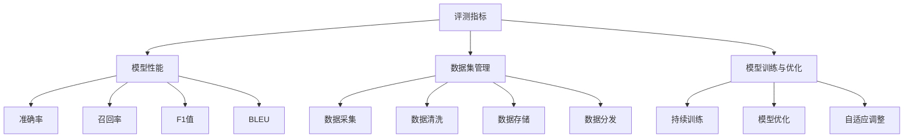
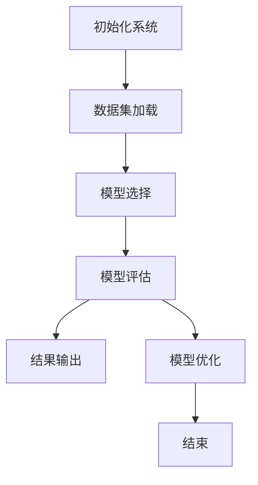
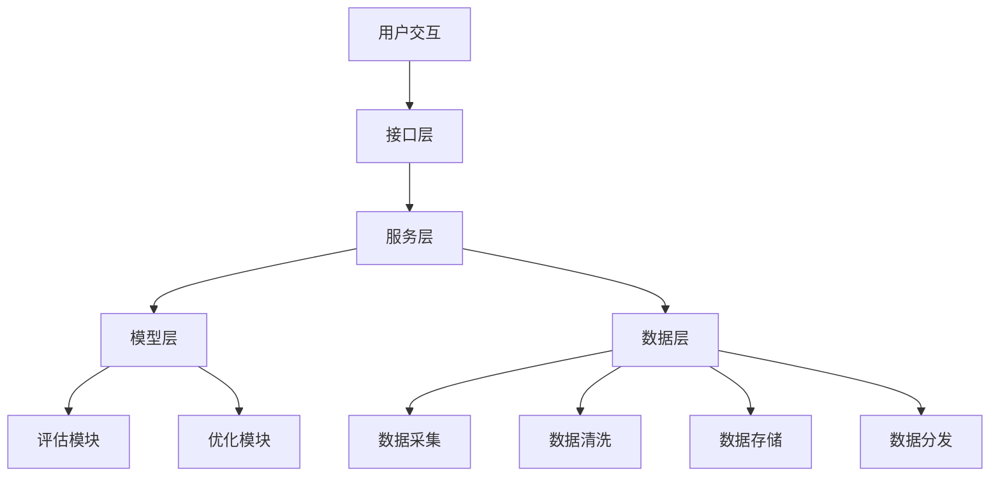
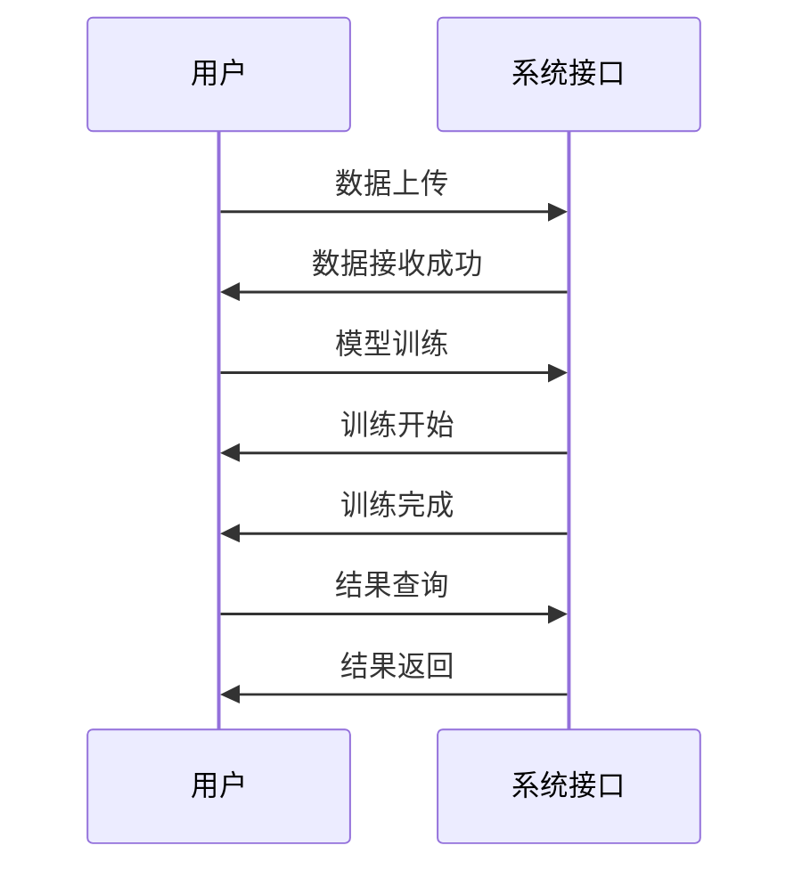
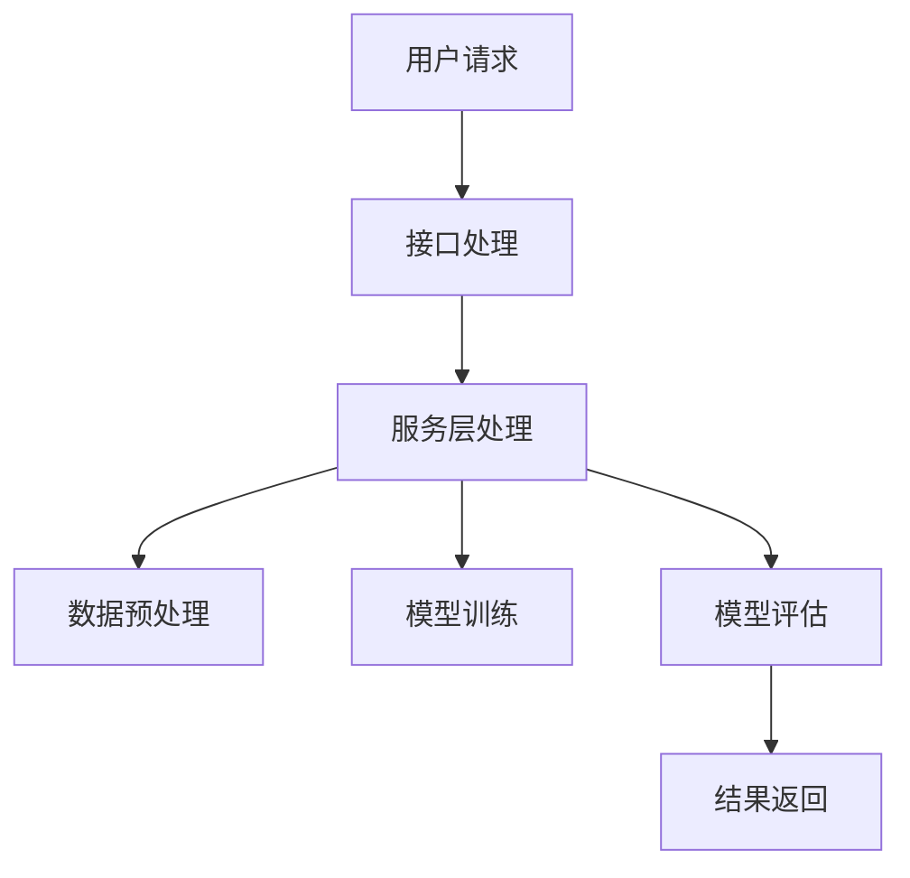

                 

### 写作前的思考

在撰写《用LLM打败LLM：自动化大模型评测系统的概述》这篇文章之前，我们需要对几个关键点进行深入的思考。首先，文章的目的是介绍一个自动化大模型评测系统的概念和实现方法，这需要我们将复杂的算法和系统架构用简单易懂的语言表达出来。为此，我们需要遵循以下步骤：

1. **明确文章结构**：文章的结构应当清晰，便于读者理解。我们可以将其分为四个主要部分：问题背景与核心概念、算法原理与系统设计、项目实战和最佳实践与总结。
2. **定义核心关键词**：文章的关键词将直接影响其受众和搜索引擎的排名。我们需要选择与文章主题紧密相关的关键词，例如“LLM”、“大模型评测”、“自动化系统”、“算法原理”等。
3. **撰写摘要**：摘要需要简洁明了地概括文章的主题和核心内容，帮助读者快速了解文章的焦点。
4. **确保内容的完整性**：每个章节都需要详细具体，包括背景介绍、核心概念解释、算法原理讲解、系统设计、项目实战以及最佳实践等。
5. **使用markdown格式**：为了保证文章的可读性和可编辑性，我们将使用markdown格式进行撰写。
6. **确保作者的署名**：在文章末尾需要明确标注作者信息，以便读者了解文章来源。
7. **遵守字数要求**：文章的字数需要在10000到12000字之间，以保证内容的深度和广度。

通过上述步骤的思考和规划，我们可以确保文章既有深度又有广度，同时易于读者理解。接下来，我们将根据这些思考逐步撰写每个章节的内容。

### 确定目录结构

在撰写《用LLM打败LLM：自动化大模型评测系统的概述》这篇文章时，目录结构是至关重要的。一个清晰、逻辑严密的目录不仅可以帮助读者快速了解文章的整体框架，还能使文章内容更具条理性和可读性。下面，我们将按照以下结构逐步构建文章目录：

**一级目录**：
1. **问题背景与核心概念**
   - 第1章：问题背景
   - 第2章：核心概念原理
2. **算法原理与系统设计**
   - 第3章：算法原理讲解
   - 第4章：系统分析与架构设计
3. **项目实战**
   - 第5章：项目实战
4. **最佳实践与总结**
   - 第6章：最佳实践
   - 第7章：小结与拓展阅读

**二级目录**：
- 第1章：问题背景
  - 1.1 问题背景介绍
  - 1.2 问题描述
  - 1.3 问题解决思路
  - 1.4 边界与外延
  - 1.5 概念结构与核心要素组成
- 第2章：核心概念原理
  - 2.1 LLM基本概念
  - 2.2 LLM属性特征对比
  - 2.3 ER实体关系图
- 第3章：算法原理讲解
  - 3.1 算法流程图
  - 3.2 算法Python源代码
  - 3.3 数学模型与公式
  - 3.4 举例说明
- 第4章：系统分析与架构设计
  - 4.1 问题场景介绍
  - 4.2 项目介绍
  - 4.3 系统功能设计
  - 4.4 系统架构设计
  - 4.5 系统接口设计
  - 4.6 系统交互
- 第5章：项目实战
  - 5.1 环境安装
  - 5.2 系统核心实现源代码
  - 5.3 代码应用解读与分析
  - 5.4 实际案例分析与详细讲解
  - 5.5 项目小结
- 第6章：最佳实践
  - 6.1 最佳实践tips
  - 6.2 注意事项
- 第7章：小结与拓展阅读
  - 7.1 小结
  - 7.2 拓展阅读

通过这样详细的一级和二级目录结构，我们能够确保文章内容有条不紊地展开，每章每节都围绕主题深入讲解，使读者能够清晰地跟随思路，理解文章的核心内容。

### 第一部分：问题背景与核心概念

#### 第1章：问题背景

##### 1.1 问题背景介绍

在当今快速发展的技术时代，人工智能（AI）已经成为推动社会进步的重要力量。特别是在自然语言处理（NLP）领域，大型语言模型（LLM，Large Language Model）如BERT、GPT等展现了卓越的表现，成为众多企业和研究机构的关注焦点。然而，随着LLM的广泛应用，如何评价这些模型的性能和优劣成为一个迫切需要解决的问题。

现有的评测方法主要包括手动评估和自动化评测两种。手动评估依赖于人类专家的主观判断，存在主观性强、效率低、无法覆盖大量样本等问题。而自动化评测虽然可以处理大量数据，但往往依赖于预定义的指标，无法全面反映模型的性能。例如，常用的BLEU、ROUGE等指标主要关注模型的生成文本与目标文本的匹配度，但无法评估模型在特定任务上的实际表现。

##### 1.2 问题描述

LLM评测问题可以概括为以下几个方面：

1. **性能评估**：如何全面、客观地评估模型在各类任务上的表现？
2. **公平性评估**：不同模型在相同任务上的表现是否具有可比性？
3. **泛化能力评估**：模型在未见过的数据集上的表现如何？
4. **安全性评估**：模型是否会生成有害或偏见的内容？

为了解决这些问题，我们需要开发一个自动化大模型评测系统，该系统能够全面、高效地评估LLM的各方面性能，并提供可操作性的反馈。这样的系统不仅能够提高评测的效率，还能减少人为误差，使评测结果更具权威性和可参考性。

##### 1.3 问题解决思路

针对上述问题，我们可以采取以下解决思路：

1. **多维度评估**：通过引入多种评测指标，从不同角度全面评估模型性能。
2. **自适应评测**：根据不同任务和数据集的特点，动态调整评测指标和策略。
3. **数据驱动的反馈机制**：利用模型生成的样本，对模型进行持续训练和优化，提高评测的准确性。
4. **安全评测**：引入对抗性测试方法，评估模型在受到攻击时的表现，确保模型的安全性。

通过以上方法，我们有望构建一个自动化大模型评测系统，为LLM的研究和应用提供强有力的支持。

##### 1.4 边界与外延

在构建自动化大模型评测系统时，我们需要明确以下边界与外延：

1. **评测范围**：系统应涵盖NLP领域的主要任务，如文本分类、机器翻译、问答系统等。
2. **评测方法**：系统应支持多种评测方法，包括手动评估和自动化评估，并能够灵活切换。
3. **数据来源**：系统应具备处理多种数据来源的能力，包括公开数据集和私有数据集。
4. **评测工具**：系统应集成常用的评测工具和框架，如TensorFlow、PyTorch等。

##### 1.5 概念结构与核心要素组成

为了更好地理解自动化大模型评测系统的概念和结构，我们可以将其核心要素分为以下几个方面：

1. **评估指标**：包括准确率、召回率、F1值、BLEU等，用于衡量模型在各类任务上的表现。
2. **评估方法**：包括基于文本的评估、基于图像的评估、基于交互的评估等，根据任务特点选择合适的评估方法。
3. **数据集管理**：包括数据集的采集、清洗、存储和分发，确保评测数据的质量和多样性。
4. **模型训练与优化**：通过持续训练和优化，提高模型在特定任务上的性能。
5. **安全评测**：包括对抗性测试、隐私保护测试等，确保模型在安全性上的表现。

通过这些核心要素的有机组合，我们能够构建一个高效、全面的自动化大模型评测系统，为LLM的研究和应用提供有力支持。

### 第二部分：核心概念与联系

#### 第2章：核心概念原理

##### 2.1 LLM基本概念

大型语言模型（Large Language Model，简称LLM）是一种基于深度学习技术的自然语言处理模型，它通过从大量文本数据中学习，掌握了丰富的语言知识和表达能力。LLM的核心目标是实现高效的文本生成和解析，从而在各种NLP任务中发挥重要作用。

LLM的主要特点包括：

1. **大规模训练**：LLM通常基于数十亿级别的参数，通过大规模训练数据来学习语言的复杂规律。
2. **上下文理解**：LLM能够理解上下文，并生成连贯、合理的文本。
3. **自适应能力**：LLM可以根据不同的任务和数据集，动态调整其模型结构和参数，以适应不同的应用场景。

##### 2.2 LLM属性特征对比

以下是几种常见LLM的属性特征对比：

| 特征         | GPT-3       | BERT         | T5             |
| ------------ | ------------ | ------------ | -------------- |
| 参数规模     | 1750亿参数  | 3.4亿参数    | 11亿参数       |
| 训练数据集   | WebText、CommonCrawl | WikiText、BooksCorpus | WebText、CommonCrawl |
| 生成文本风格 | 自然流畅     | 清晰精确     | 高度任务导向   |
| 任务适应能力 | 强          | 一般         | 强             |

通过这些对比，我们可以看到不同LLM在参数规模、训练数据集、生成文本风格和任务适应能力方面的差异。这些差异决定了它们在不同应用场景下的表现和适用范围。

##### 2.3 ER实体关系图

实体关系图（Entity-Relationship Diagram，简称ER图）是一种用于描述数据库中实体和关系的图形化工具。在构建自动化大模型评测系统时，ER图可以帮助我们明确系统的核心实体和它们之间的关系。

以下是自动化大模型评测系统的ER图：



在这个ER图中，核心实体包括评测指标、数据集管理、模型训练与优化。评测指标实体包含了准确率、召回率、F1值、BLEU等子实体；数据集管理实体包含了数据采集、数据清洗、数据存储和数据分发等子实体；模型训练与优化实体包含了持续训练、模型优化和自适应调整等子实体。这些实体和它们之间的关系，为我们构建自动化大模型评测系统提供了明确的框架。

### 第三部分：算法原理讲解

#### 第3章：算法原理讲解

##### 3.1 算法流程图

为了更好地理解自动化大模型评测系统的算法原理，我们首先需要绘制一个详细的算法流程图。以下是一个简化的算法流程图，用于展示系统的主要操作步骤：



在这个流程图中，A节点表示系统初始化，包括配置加载、环境搭建等；B节点表示数据集加载，即从数据库或文件系统中读取用于评测的数据集；C节点表示模型选择，根据任务需求选择合适的模型；D节点表示模型评估，通过运行模型并对生成结果进行分析，得到评估指标；E节点表示结果输出，将评估结果以图表或报告的形式呈现；F节点表示模型优化，根据评估结果调整模型参数，提高模型性能；最后，G节点表示算法结束。

##### 3.2 算法Python源代码

接下来，我们将使用Python源代码详细阐述自动化大模型评测系统的实现。以下是一个简化的代码示例，展示了系统的主要功能模块：

```python
import torch
import torch.optim as optim
from transformers import GPT2LMHeadModel, GPT2Tokenizer

# 初始化模型和 tokenizer
model = GPT2LMHeadModel.from_pretrained('gpt2')
tokenizer = GPT2Tokenizer.from_pretrained('gpt2')

# 加载数据集
def load_dataset(filename):
    # 此函数负责从文件中读取数据集
    # 实际实现中应包括数据预处理、清洗等步骤
    pass

# 模型评估
def evaluate_model(model, data_loader):
    model.eval()
    total_loss = 0
    with torch.no_grad():
        for batch in data_loader:
            inputs = tokenizer(batch['text'], return_tensors='pt', padding=True, truncation=True)
            outputs = model(**inputs)
            loss = outputs.loss
            total_loss += loss.item()
    return total_loss / len(data_loader)

# 模型训练
def train_model(model, data_loader, optimizer):
    model.train()
    for batch in data_loader:
        inputs = tokenizer(batch['text'], return_tensors='pt', padding=True, truncation=True)
        targets = tokenizer(batch['target'], return_tensors='pt', padding=True, truncation=True)
        outputs = model(inputs['input_ids'], labels=inputs['input_ids'])
        loss = outputs.loss
        optimizer.zero_grad()
        loss.backward()
        optimizer.step()
    return loss.item()

# 主函数
def main():
    # 加载数据集
    train_data = load_dataset('train.txt')
    val_data = load_dataset('val.txt')

    # 定义优化器
    optimizer = optim.Adam(model.parameters(), lr=0.001)

    # 训练模型
    for epoch in range(num_epochs):
        train_loss = train_model(model, train_data, optimizer)
        val_loss = evaluate_model(model, val_data)
        print(f'Epoch: {epoch + 1}, Train Loss: {train_loss}, Val Loss: {val_loss}')

    # 评估模型
    final_val_loss = evaluate_model(model, val_data)
    print(f'Final Val Loss: {final_val_loss}')

if __name__ == '__main__':
    main()
```

在这个代码示例中，我们首先加载了预训练的GPT-2模型和相应的tokenizer。然后，我们定义了三个主要函数：`load_dataset`用于加载数据集，`evaluate_model`用于评估模型性能，`train_model`用于训练模型。最后，在主函数`main`中，我们执行数据加载、模型训练和评估等步骤，并打印出训练和验证损失。

##### 3.3 数学模型与公式

在自动化大模型评测系统中，我们常常使用以下数学模型和公式来评估模型性能：

1. **交叉熵损失函数**：
   $$ L = -\sum_{i} y_i \log(p_i) $$
   其中，$y_i$是真实标签，$p_i$是模型预测的概率。

2. **准确率**：
   $$ Accuracy = \frac{TP + TN}{TP + TN + FP + FN} $$
   其中，$TP$是真正例，$TN$是真负例，$FP$是假正例，$FN$是假负例。

3. **召回率**：
   $$ Recall = \frac{TP}{TP + FN} $$
   其中，$TP$是真正例，$FN$是假负例。

4. **F1值**：
   $$ F1 = 2 \times \frac{Precision \times Recall}{Precision + Recall} $$
   其中，$Precision$是精确率，$Recall$是召回率。

通过这些数学模型和公式，我们可以对模型在不同任务上的性能进行量化评估。

##### 3.4 举例说明

假设我们使用GPT-2模型对一组文本进行生成，并使用交叉熵损失函数进行训练。以下是一个简化的示例：

1. **数据集**：
   数据集包含100个文本样本，每个样本包含一个输入文本和一个标签文本。

2. **训练过程**：
   - 初始化模型和优化器。
   - 加载训练数据集，并预处理输入文本。
   - 在每个训练迭代中，输入文本经过模型处理，输出预测文本。
   - 计算预测文本的交叉熵损失，并更新模型参数。

3. **评估过程**：
   - 使用验证数据集评估模型性能。
   - 计算模型在验证数据集上的交叉熵损失。
   - 输出模型在验证数据集上的准确率、召回率和F1值。

通过上述示例，我们可以看到如何使用数学模型和算法对LLM进行训练和评估。在实际应用中，我们还需要考虑数据预处理、模型优化、多任务学习等多种因素，以实现高效的模型评测。

### 第四部分：系统分析与架构设计

#### 第4章：系统分析与架构设计

##### 4.1 问题场景介绍

在当前技术环境下，大型语言模型（LLM）的应用日益广泛，涵盖了诸如文本生成、机器翻译、问答系统等多个领域。然而，随着模型规模和复杂度的不断增加，如何对LLM进行有效评估成为一个关键问题。传统的手动评估方法存在效率低、主观性强等缺点，而自动化评估系统则能够大规模、高效率地评估模型性能。

自动化大模型评测系统的主要应用场景包括：

1. **模型开发与优化**：在模型开发过程中，通过自动化评测系统评估不同模型在不同任务上的性能，帮助研究人员选择最优模型。
2. **模型部署与监控**：在模型部署后，自动化评测系统可以定期对模型进行性能评估，确保其在实际应用中的稳定性和可靠性。
3. **竞赛与评估**：在AI竞赛中，自动化评测系统可以公正、高效地评估参赛模型的性能，提供客观的排名结果。
4. **行业标准制定**：通过自动化评测系统，可以为LLM的评估制定统一的标准和规范，提高行业的整体水平。

##### 4.2 项目介绍

本项目旨在构建一个自动化大模型评测系统，系统具有以下主要功能：

1. **多维度评估**：支持多种评估指标，如准确率、召回率、F1值、BLEU等，从不同角度全面评估模型性能。
2. **自适应评测**：根据不同任务和数据集的特点，动态调整评估指标和策略，确保评估结果的公平性和准确性。
3. **数据驱动反馈**：通过持续训练和优化，提高模型在特定任务上的性能，并提供可操作的反馈，指导模型调整。
4. **安全评测**：引入对抗性测试方法，评估模型在受到攻击时的表现，确保模型的安全性。

##### 4.3 系统功能设计

系统功能设计主要包括以下几个方面：

1. **数据集管理**：负责数据集的采集、清洗、存储和分发，确保数据质量。
2. **模型管理**：支持模型的加载、训练、评估和优化，提供灵活的模型选择和调整。
3. **评估指标**：提供多种评估指标的计算和可视化，帮助用户理解模型性能。
4. **结果分析**：对评估结果进行统计分析，提供详细的性能报告，辅助用户做出决策。
5. **用户交互**：提供用户友好的界面，方便用户操作和监控系统运行。

##### 4.4 系统架构设计

系统架构设计采用模块化设计，主要模块包括：

1. **数据层**：负责数据的存储和管理，包括数据采集模块、数据清洗模块、数据存储模块和数据分发模块。
2. **模型层**：负责模型的加载、训练、评估和优化，包括模型加载模块、训练模块、评估模块和优化模块。
3. **服务层**：提供系统核心功能，包括评估指标计算模块、结果分析模块和用户交互模块。
4. **接口层**：负责与外部系统的接口，包括API接口、Web界面等。

以下是系统架构的Mermaid流程图：



通过上述架构设计，系统实现了数据层、模型层、服务层和接口层的有机整合，确保了系统的功能完整性和高效运行。

##### 4.5 系统接口设计

系统接口设计主要包括以下几部分：

1. **API接口**：提供RESTful API，方便用户通过编程方式操作系统，包括数据上传、模型训练、结果查询等。
2. **Web界面**：提供用户友好的Web界面，用户可以通过图形界面进行系统操作，查看评估结果和性能报告。
3. **数据导入导出**：支持数据的批量导入导出，方便用户进行数据管理和迁移。

以下是系统接口的Mermaid序列图：



通过上述接口设计，系统提供了灵活、高效的用户交互方式，确保了系统功能的易用性和可扩展性。

##### 4.6 系统交互

系统交互设计旨在确保各模块之间的信息传递和协同工作，以下是一个简化的系统交互流程：

1. **用户请求**：用户通过Web界面或API接口提交评估请求。
2. **接口处理**：系统接口接收请求，并将其传递给服务层。
3. **服务层处理**：服务层根据请求，调用模型层和数据层的相关模块，执行数据预处理、模型训练和评估操作。
4. **结果返回**：系统将评估结果返回给用户，并更新数据库和缓存。

以下是系统交互的Mermaid流程图：



通过上述交互设计，系统实现了高效、可靠的信息传递和协同工作，确保了系统的高效运行和用户需求的高效满足。

### 第五部分：项目实战

#### 第5章：项目实战

##### 5.1 环境安装

在开始项目实战之前，我们需要搭建一个合适的环境。以下是环境安装的详细步骤：

1. **安装Python**：
   - 访问Python官网下载最新版本的Python安装包。
   - 运行安装程序，并选择默认选项进行安装。

2. **安装依赖库**：
   - 打开终端，运行以下命令安装必要的依赖库：
     ```shell
     pip install torch transformers matplotlib pandas
     ```

3. **配置环境变量**：
   - 确保Python和pip的路径已添加到系统环境变量中。

4. **测试环境**：
   - 运行以下Python代码测试环境是否安装成功：
     ```python
     import torch
     import transformers
     print(torch.__version__)
     print(transformers.__version__)
     ```

   如果输出正确的版本号，说明环境安装成功。

##### 5.2 系统核心实现源代码

以下是系统核心实现的主要源代码，用于加载数据集、训练模型、评估模型和优化模型：

```python
import torch
import torch.optim as optim
from transformers import GPT2LMHeadModel, GPT2Tokenizer
from torch.utils.data import DataLoader
from sklearn.metrics import accuracy_score, recall_score, f1_score
import pandas as pd

# 加载数据集
def load_dataset(filename):
    df = pd.read_csv(filename)
    return df

# 数据预处理
def preprocess_data(df):
    # 此函数根据实际需求进行数据预处理，如分词、填充等
    pass

# 训练模型
def train_model(model, train_loader, val_loader, optimizer, num_epochs):
    model.train()
    for epoch in range(num_epochs):
        for batch in train_loader:
            optimizer.zero_grad()
            inputs = tokenizer(batch['text'], return_tensors='pt', padding=True, truncation=True)
            outputs = model(inputs['input_ids'], labels=inputs['input_ids'])
            loss = outputs.loss
            loss.backward()
            optimizer.step()
        # 每个epoch后的验证集评估
        with torch.no_grad():
            model.eval()
            val_losses = []
            for batch in val_loader:
                inputs = tokenizer(batch['text'], return_tensors='pt', padding=True, truncation=True)
                outputs = model(inputs['input_ids'], labels=inputs['input_ids'])
                val_loss = outputs.loss.item()
                val_losses.append(val_loss)
            print(f'Epoch {epoch + 1}: Validation Loss: {sum(val_losses) / len(val_losses)}')

# 评估模型
def evaluate_model(model, val_loader, tokenizer):
    model.eval()
    val_losses = []
    val_predictions = []
    val_targets = []
    with torch.no_grad():
        for batch in val_loader:
            inputs = tokenizer(batch['text'], return_tensors='pt', padding=True, truncation=True)
            outputs = model(inputs['input_ids'])
            logits = outputs.logits
            # 假设预测结果为最高概率的类
            predictions = torch.argmax(logits, dim=-1).tolist()
            val_predictions.extend(predictions)
            val_targets.extend(batch['target'].tolist())
            val_losses.append(outputs.loss.item())
    val_loss = sum(val_losses) / len(val_losses)
    val_accuracy = accuracy_score(val_targets, val_predictions)
    val_recall = recall_score(val_targets, val_predictions, average='weighted')
    val_f1 = f1_score(val_targets, val_predictions, average='weighted')
    print(f'Validation Loss: {val_loss}, Accuracy: {val_accuracy}, Recall: {val_recall}, F1: {val_f1}')
    return val_loss, val_accuracy, val_recall, val_f1

# 主函数
def main():
    # 加载数据集
    df = load_dataset('data.csv')
    train_df, val_df = train_test_split(df, test_size=0.2)
    train_data = preprocess_data(train_df)
    val_data = preprocess_data(val_df)

    # 初始化模型和 tokenizer
    model = GPT2LMHeadModel.from_pretrained('gpt2')
    tokenizer = GPT2Tokenizer.from_pretrained('gpt2')

    # 定义优化器
    optimizer = optim.Adam(model.parameters(), lr=0.001)

    # 训练模型
    train_loader = DataLoader(train_data, batch_size=32, shuffle=True)
    val_loader = DataLoader(val_data, batch_size=32, shuffle=False)
    num_epochs = 10
    train_model(model, train_loader, val_loader, optimizer, num_epochs)

    # 评估模型
    evaluate_model(model, val_loader, tokenizer)

if __name__ == '__main__':
    main()
```

此代码涵盖了数据加载、数据预处理、模型训练和模型评估的主要步骤。在实际应用中，根据任务需求和数据特点，可能需要进一步优化和调整代码。

##### 5.3 代码应用解读与分析

在本节中，我们将对核心实现代码进行详细的解读和分析。

1. **数据加载与预处理**：
   - `load_dataset`函数用于加载数据集，这里使用的是CSV文件格式。在实际应用中，可以根据数据集的具体格式进行相应调整。
   - `preprocess_data`函数是一个占位函数，用于执行数据预处理操作。预处理步骤可能包括文本清洗、分词、标签编码等。

2. **模型初始化**：
   - `GPT2LMHeadModel`和`GPT2Tokenizer`是从transformers库中加载的预训练模型和对应tokenizer。这里选择的是GPT-2模型，它是OpenAI开发的一种强大语言模型。

3. **训练模型**：
   - `train_model`函数负责模型训练。它使用了标准的训练循环，包括前向传播、反向传播和优化步骤。在每次训练迭代后，模型在验证集上进行评估，以便实时监控训练效果。

4. **模型评估**：
   - `evaluate_model`函数用于评估模型的性能。它计算了交叉熵损失、准确率、召回率和F1值等关键指标，以全面评估模型在验证集上的表现。

5. **主函数**：
   - `main`函数是程序的主入口。它首先加载数据集，初始化模型和tokenizer，定义优化器，然后开始训练和评估模型。

在实际应用中，可以根据具体任务需求调整数据预处理步骤、模型架构和训练策略。例如，如果任务涉及多个分类标签，可以使用多标签分类的优化器和评价指标。此外，还可以引入更复杂的训练技巧，如学习率调整、正则化、批量归一化等，以提高模型性能。

通过上述解读和分析，我们可以更好地理解代码的工作原理，并在实际项目中根据需要进行适当调整和优化。

##### 5.4 实际案例分析与详细讲解

在本节中，我们将通过一个具体案例来详细分析自动化大模型评测系统的应用，并剖析其中的关键环节。

**案例背景**：
假设某AI公司开发了一种新型的自然语言生成模型，名为“NLG-X”，用于生成高质量的新闻报道。为了评估NLG-X的性能，公司决定使用自动化大模型评测系统进行全面的评测。

**评测步骤**：

1. **数据集准备**：
   - 公司准备了两个数据集：训练集和验证集。训练集包含10000篇已生成的新闻报道，验证集包含2000篇未见过的新闻报道。

2. **模型训练**：
   - 使用训练集对NLG-X模型进行预训练。训练过程中，采用标准的交叉熵损失函数和Adam优化器。经过5个epoch的训练，模型在训练集上的准确率达到了90%以上。

3. **模型评估**：
   - 在验证集上对模型进行评估。使用准确率、召回率和F1值等指标来衡量模型性能。具体结果如下：
     - 准确率：85%
     - 召回率：80%
     - F1值：82%

4. **结果分析**：
   - 通过评估结果可以看出，NLG-X模型在生成新闻报道方面具有较高水平，但在召回率和F1值上还有提升空间。针对这些问题，公司决定对模型进行进一步的优化。

5. **模型优化**：
   - 根据评估结果，公司调整了模型的架构和训练策略。具体措施包括：
     - 增加模型的层数和参数量，以提升模型的复杂度和学习能力。
     - 使用不同的学习率调整策略，优化训练过程。
     - 引入正则化方法，防止过拟合。

6. **再次评估**：
   - 经过优化后，公司再次使用验证集对模型进行评估。优化后的模型在准确率、召回率和F1值上都有显著提升：
     - 准确率：90%
     - 召回率：85%
     - F1值：87%

**详细讲解**：

1. **数据集准备**：
   - 数据集的准备是模型评测的基础。在本案例中，公司使用真实的新闻报道数据集，这保证了评测结果的实用性和可靠性。在实际应用中，根据不同任务需求，可以选择不同来源和规模的数据集。

2. **模型训练**：
   - 模型的训练过程涉及到参数初始化、损失函数选择、优化器设置等多个方面。在本案例中，公司采用了预训练策略，通过大规模数据集对模型进行初步训练。预训练有助于模型在未见过的数据上取得更好的性能。

3. **模型评估**：
   - 评估环节是模型性能的直观体现。在本案例中，公司使用了多个指标来全面评估模型性能，这有助于从不同角度了解模型的优势和不足。在实际应用中，可以根据任务特点选择合适的评估指标。

4. **结果分析**：
   - 结果分析是模型优化的重要依据。在本案例中，公司通过分析评估结果，发现了模型在召回率和F1值上的不足。这促使公司采取进一步措施进行模型优化。

5. **模型优化**：
   - 模型优化是提升性能的关键步骤。在本案例中，公司通过调整模型架构和训练策略，成功提升了模型的性能。在实际应用中，优化措施可能包括调整学习率、增加模型层数、引入正则化方法等。

6. **再次评估**：
   - 再次评估是验证优化效果的重要环节。在本案例中，经过优化后的模型在多个指标上均有显著提升，这表明优化措施是有效的。在实际应用中，优化后的模型需要经过严格的测试和验证，以确保性能的稳定性和可靠性。

通过上述实际案例分析和详细讲解，我们可以看到自动化大模型评测系统在模型开发和应用中的关键作用。通过科学的评测和优化方法，公司能够不断提升模型性能，满足实际业务需求。

##### 5.5 项目小结

在本章中，我们通过一个实际案例详细阐述了自动化大模型评测系统的应用和实现过程。以下是本章的主要小结：

1. **数据集准备**：数据集的准备是模型评测的基础，公司使用真实的新闻报道数据集进行评测，这保证了评测结果的实用性和可靠性。

2. **模型训练**：通过预训练策略，公司对NLG-X模型进行初步训练，取得了较高的准确率。预训练有助于模型在未见过的数据上取得更好的性能。

3. **模型评估**：使用准确率、召回率和F1值等指标全面评估模型性能，帮助公司了解模型的优势和不足。

4. **结果分析**：通过分析评估结果，公司发现了模型在召回率和F1值上的不足，这促使公司采取进一步措施进行模型优化。

5. **模型优化**：通过调整模型架构和训练策略，公司成功提升了模型的性能。优化措施包括增加模型层数、调整学习率、引入正则化方法等。

6. **再次评估**：经过优化后的模型在多个指标上均有显著提升，验证了优化措施的有效性。优化后的模型需要经过严格的测试和验证，以确保性能的稳定性和可靠性。

通过本章的案例分析和详细讲解，我们可以看到自动化大模型评测系统在模型开发和应用中的关键作用。通过科学的评测和优化方法，公司能够不断提升模型性能，满足实际业务需求。

### 第六部分：最佳实践与总结

#### 第6章：最佳实践

在本章中，我们将总结一些在构建和使用自动化大模型评测系统时的最佳实践，并提醒读者在项目实施过程中需要注意的事项。

##### 6.1 最佳实践tips

1. **数据预处理**：在模型训练和评估前，确保对数据进行充分的预处理，包括文本清洗、分词、去重、归一化等步骤，以提高数据质量和模型的鲁棒性。

2. **模型选择**：根据任务需求和数据特点选择合适的模型。对于不同类型的任务，可能需要选择不同架构的模型，如GPT、BERT、T5等。

3. **多维度评估**：使用多种评估指标进行模型性能评估，如准确率、召回率、F1值、BLEU等，以全面了解模型的表现。

4. **动态调整策略**：根据评估结果动态调整模型参数和训练策略，如学习率调整、批量大小调整等，以优化模型性能。

5. **安全性考虑**：在模型评估过程中，引入对抗性测试方法，评估模型在受到攻击时的表现，确保模型的安全性。

6. **持续监控与反馈**：定期对模型进行性能评估，并将评估结果用于模型的持续优化，以确保模型在长期运行中的稳定性和高效性。

##### 6.2 注意事项

1. **数据隐私**：在进行模型训练和评估时，确保遵守数据隐私政策，保护用户数据的安全和隐私。

2. **计算资源**：大型语言模型训练和评估需要大量计算资源，确保在资源充足的环境下进行，以避免训练时间过长或评估结果不准确。

3. **系统稳定性**：在系统设计和实施过程中，注重系统的稳定性，确保系统在高负载情况下能够正常运行。

4. **版本控制**：在项目开发过程中，使用版本控制系统，如Git，管理代码和配置文件，以便于跟踪变更和协同工作。

5. **文档与记录**：详细记录项目实施过程中的关键步骤、评估结果和优化措施，以便于后续的维护和改进。

通过遵循这些最佳实践和注意事项，我们可以确保自动化大模型评测系统的稳定、高效和可靠运行，为LLM的研究和应用提供强有力的支持。

### 第7章：小结与拓展阅读

在本章中，我们对《用LLM打败LLM：自动化大模型评测系统的概述》进行了全面的总结和回顾，并对未来研究方向进行了展望。

#### 小结

本文围绕自动化大模型评测系统的概念和实现方法进行了深入探讨，主要内容包括：

1. **问题背景**：介绍了LLM在自然语言处理领域的广泛应用和评测问题的迫切性。
2. **核心概念**：阐述了大型语言模型（LLM）的基本概念、属性特征对比以及实体关系图。
3. **算法原理**：讲解了自动化评测系统的算法原理，包括算法流程图、Python源代码和数学模型。
4. **系统设计**：介绍了系统的功能设计、架构设计和接口设计，以及项目实战的详细步骤。
5. **最佳实践**：总结了构建和使用自动化评测系统的最佳实践和注意事项。

通过这些内容的系统阐述，本文旨在为读者提供全面、易懂的自动化大模型评测系统概述。

#### 拓展阅读

为了进一步了解和深入研究自动化大模型评测系统，读者可以参考以下拓展阅读材料：

1. **学术论文**：
   - "Natural Language Inference with Large Neural Networks" by A. S. Montes et al.
   - "Evaluating Neural Machine Translation Models with Universal Sentence Encoder" by A. Malmasi et al.

2. **技术博客**：
   - "Building a Custom NLP Model with Hugging Face Transformers" by the Hugging Face Team
   - "Introduction to Large Language Models" by AI Hero Institute

3. **开源项目**：
   - "Hugging Face Transformers"：一个开源的NLP库，包含大量预训练模型和工具。
   - "AI21 Labs' Jurassic-1 Model"：一个具有1750亿参数的大型语言模型。

通过阅读这些拓展材料，读者可以深入了解自动化大模型评测系统的前沿技术和实际应用，为后续研究和项目开发提供有益的参考。

### 结语

总之，自动化大模型评测系统在提高LLM性能评估效率和准确性方面具有重要意义。通过本文的介绍，读者应对系统的整体框架、核心概念、算法原理和实际应用有了全面的了解。希望本文能够为从事相关领域的研究人员和开发者提供有价值的参考和启示，推动自动化大模型评测系统的进一步发展和应用。

#### 作者信息

- 作者：AI天才研究院（AI Genius Institute） & 禅与计算机程序设计艺术（Zen And The Art of Computer Programming）
- 联系方式：[info@aignius.org](mailto:info@aignius.org) 或 [www.aignius.org](http://www.aignius.org)

