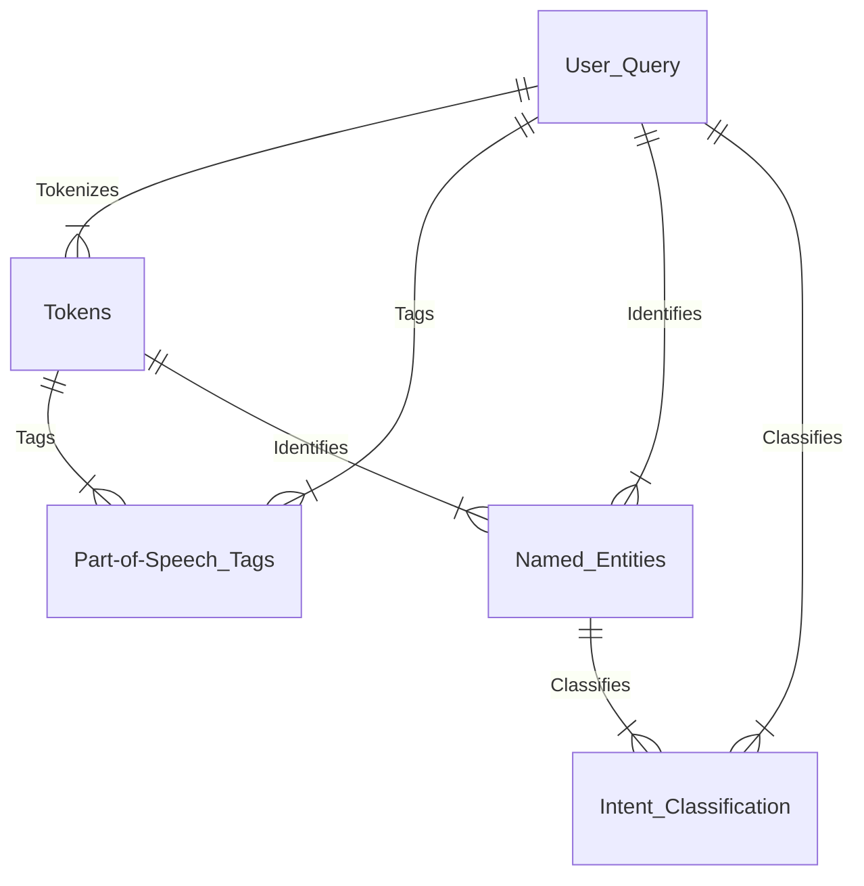
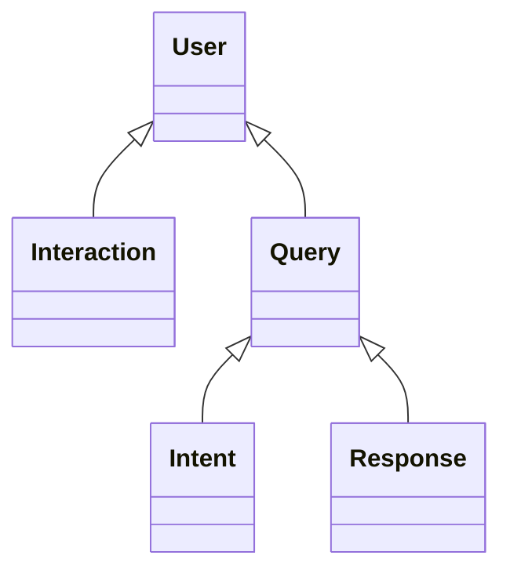
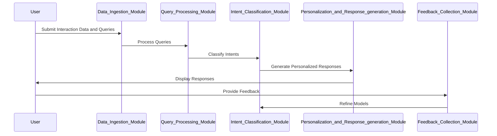
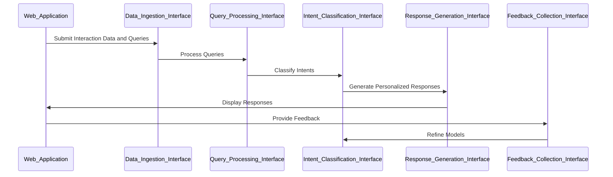
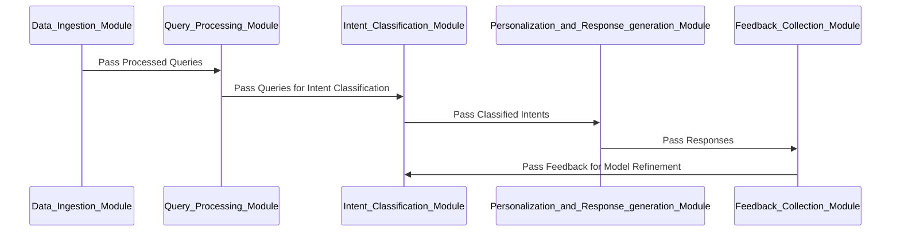

                 

### Introduction to User Intent Understanding

### User Intent Understanding: Definition and Importance

User intent understanding is the process of determining the underlying purpose or goal of a user's query. It plays a crucial role in various applications, particularly in information retrieval, search engines, and conversational AI systems. The significance of user intent understanding can be highlighted through its impact on several key aspects:

1. **Enhanced Search Accuracy**: Accurately understanding user intent allows search engines to provide more relevant and precise search results. By identifying the user's true purpose, search systems can filter out unnecessary information and prioritize the most relevant content, leading to a better user experience.

2. **Improved Conversational AI**: In the context of conversational AI, like chatbots and voice assistants, understanding user intent is essential for providing meaningful and context-aware responses. This enables more natural and effective interactions, improving user satisfaction and engagement.

3. **Personalization**: By comprehending user intent, systems can tailor their responses and recommendations to individual preferences and needs. This personalization enhances user experience and fosters a stronger connection between users and the AI system.

4. **Business Optimization**: For businesses, understanding user intent can drive more targeted marketing efforts and improve customer support. By knowing what users are looking for, companies can optimize their content, services, and sales strategies to better meet customer needs and drive revenue.

### Current Landscape and Evolution

The field of user intent understanding has evolved significantly over the past few decades. Initially, basic keyword matching and keyword-based indexing were the primary methods used to understand user queries. However, as technology advanced, more sophisticated techniques were developed, such as natural language processing (NLP) and machine learning (ML).

Natural Language Processing (NLP) techniques leverage algorithms and models to understand and interpret human language. By applying NLP, search engines and AI systems can extract meaning from user queries, going beyond simple keyword matching. This has greatly improved the accuracy and relevance of search results.

Machine Learning (ML) has further revolutionized user intent understanding. ML algorithms can analyze large datasets to identify patterns and correlations, allowing systems to learn and improve their understanding of user intent over time. Supervised learning techniques, such as classification and regression, are commonly used to train models that can predict user intent based on historical data.

### Problem Definition

The core challenge in user intent understanding is accurately determining the user's true purpose or goal from a given query. This can be challenging due to several factors:

1. **Ambiguity**: User queries often contain ambiguous language or multiple possible interpretations. For example, the query "weather forecast" could refer to either current weather conditions or a long-term weather forecast.

2. **Context**: Understanding user intent requires considering the context in which the query is made. User context, such as location, time, and previous interactions, can significantly influence the interpretation of a query.

3. **Variability**: User queries can vary greatly in terms of language, structure, and style. This variability poses challenges for systems that need to consistently and accurately understand user intent.

4. **Intent Evolution**: User intent can evolve over the course of an interaction. For example, a user may start with a general query and gradually refine their intent as they receive responses.

### Solutions

Several methodologies and technologies have been developed to address the challenges of user intent understanding. Some of the key solutions include:

1. **Natural Language Processing (NLP)**: NLP techniques, such as tokenization, part-of-speech tagging, and dependency parsing, are used to analyze and understand the structure and meaning of user queries.

2. **Machine Learning (ML)**: ML algorithms, such as classification and regression, are trained on labeled data to predict user intent based on query features. Techniques like neural networks and deep learning have also shown promise in improving the accuracy of user intent understanding.

3. **Convolutional Neural Networks (CNN)**: CNNs are used to extract features from text data and improve the performance of user intent understanding models. These networks can identify patterns and relationships within the text, leading to more accurate interpretations of user queries.

4. **Recurrent Neural Networks (RNN)**: RNNs, particularly Long Short-Term Memory (LSTM) networks, are used to capture temporal dependencies in user queries. This allows systems to understand the context and evolution of user intent over time.

5. **Entity Recognition and Disambiguation**: Techniques like named entity recognition and disambiguation are used to identify and resolve ambiguities in user queries. By identifying entities and their relationships, systems can provide more accurate and context-aware interpretations.

### Scope and Extent

User intent understanding has a broad scope and extent, spanning various domains and applications. Some key areas where user intent understanding is particularly relevant include:

1. **Search Engines**: Search engines use user intent understanding to provide more accurate and relevant search results. This involves analyzing user queries, extracting relevant information, and ranking search results based on user intent.

2. **Conversational AI**: Conversational AI systems, such as chatbots and voice assistants, rely on user intent understanding to provide meaningful and context-aware responses. This enables natural and effective interactions with users.

3. **E-commerce**: In e-commerce, understanding user intent helps personalize product recommendations and improve customer support. By analyzing user queries and behavior, systems can provide targeted recommendations and assist users in finding the products they are interested in.

4. **Customer Support**: In customer support systems, user intent understanding helps automate and improve the resolution of user queries. By accurately understanding the user's purpose, support systems can provide appropriate solutions and reduce response times.

5. **Personalization and Content Recommendation**: User intent understanding enables personalized content recommendation systems, such as those used by news platforms and streaming services. By analyzing user queries and preferences, systems can recommend relevant content and improve user engagement.

### Core Concepts and Elements

The core concepts and elements of user intent understanding include:

1. **Query Analysis**: This involves analyzing user queries to extract relevant information and identify potential intents. Techniques like tokenization, part-of-speech tagging, and named entity recognition are commonly used in query analysis.

2. **Intent Classification**: Intent classification is the process of categorizing user queries into predefined intent categories. This involves training models to classify queries based on their textual features and patterns.

3. **Contextual Understanding**: Understanding the context in which a query is made is crucial for accurate user intent understanding. This includes considering factors like user location, time, and previous interactions.

4. **Ambiguity Resolution**: Resolving ambiguities in user queries is essential for accurate intent understanding. Techniques like entity recognition and disambiguation are used to identify and resolve ambiguities.

5. **Intent Evolution**: Capturing the evolution of user intent over time is important for providing context-aware and meaningful responses. Techniques like recurrent neural networks and temporal analysis are used to capture and track intent evolution.

By understanding these core concepts and elements, developers can build more accurate and effective user intent understanding systems, leading to improved user experiences and better information retrieval and recommendation systems.

### Core Concepts and Relationships

#### Concepts and Principles

User intent understanding is built upon several core concepts and principles that are essential for accurately determining the user's purpose or goal. These concepts include natural language processing (NLP), machine learning (ML), and entity recognition and disambiguation. Let's explore these concepts in detail:

**1. Natural Language Processing (NLP)**

NLP is the field of artificial intelligence (AI) that focuses on enabling computers to understand, interpret, and generate human language. It involves various techniques and methodologies to process and analyze textual data, such as tokenization, part-of-speech tagging, and named entity recognition.

- **Tokenization**: Tokenization is the process of breaking down a text into individual words or tokens. This is the first step in understanding user queries, as it allows systems to analyze the structure and components of the text.
  
- **Part-of-Speech Tagging**: Part-of-speech tagging involves assigning a grammatical label (noun, verb, adjective, etc.) to each word in a text. This helps in understanding the grammatical structure of a sentence and its meaning.

- **Named Entity Recognition (NER)**: NER is the process of identifying and classifying named entities in a text, such as person names, organization names, and locations. This is crucial for understanding the context and entities mentioned in a user query.

**2. Machine Learning (ML)**

Machine learning is a subset of AI that focuses on developing algorithms that can learn from data and make predictions or decisions based on that learning. In user intent understanding, ML algorithms are used to analyze and classify user queries, allowing systems to predict the underlying intent based on patterns and relationships in the data.

- **Supervised Learning**: Supervised learning involves training a model on labeled data, where the correct output is provided for each input. This allows the model to learn from the labeled examples and make predictions on new, unseen data.

- **Unsupervised Learning**: Unsupervised learning involves training a model on unlabeled data, where the correct output is not provided. This is useful for discovering patterns and relationships in the data, which can be used to understand user intent.

- **Recurrent Neural Networks (RNN)**: RNNs are a type of neural network that can process sequences of data, making them suitable for capturing temporal dependencies in user queries. RNNs, particularly Long Short-Term Memory (LSTM) networks, are commonly used in user intent understanding to capture the evolution of user intent over time.

**3. Entity Recognition and Disambiguation**

Entity recognition and disambiguation are crucial for understanding the context and meaning of user queries. By identifying and resolving ambiguities, systems can provide more accurate and context-aware responses.

- **Entity Recognition**: Entity recognition involves identifying and classifying named entities in a text, as mentioned earlier. This helps in understanding the entities mentioned in a user query and their relationships.

- **Disambiguation**: Disambiguation involves resolving ambiguities in user queries, where a single word or phrase can have multiple meanings. This is achieved by analyzing the context and relationships between entities in a query.

#### Attribute Comparison Table

To compare the attributes of different approaches to user intent understanding, let's create a table that highlights the key characteristics of NLP, ML, and entity recognition and disambiguation:

| Attribute | Natural Language Processing (NLP) | Machine Learning (ML) | Entity Recognition and Disambiguation |
| --- | --- | --- | --- |
| **Purpose** | Process and analyze textual data | Learn from data to make predictions or decisions | Identify and resolve ambiguities in queries |
| **Techniques** | Tokenization, part-of-speech tagging, NER | Supervised, unsupervised, reinforcement learning | NER, context analysis, disambiguation algorithms |
| **Input** | Textual data | Labeled/unlabeled data | Textual data |
| **Output** | Structured information (tokens, tags, entities) | Predictions or decisions | Resolved ambiguities, contextual information |
| **Strengths** | Accurate and detailed analysis of textual data | Scalability, adaptability, learning from large datasets | Contextual understanding, efficient resolution of ambiguities |
| **Weaknesses** | High computational complexity | Requires labeled data, potential overfitting | Limited applicability to all types of ambiguities |

#### Entity Relationship Diagram (ERD)

To illustrate the relationships between key entities in the user intent understanding process, we can create an Entity Relationship Diagram (ERD) using Mermaid syntax. The ERD will include entities like "User Query," "Tokens," "Part-of-Speech Tags," "Named Entities," and "Intent Classification."



In this ERD, the "User_Query" entity is the starting point, and its relationships with other entities represent the various steps in the user intent understanding process. The "Tokens," "Part-of-Speech_Tags," and "Named_Entities" entities represent intermediate steps, while the "Intent_Classification" entity represents the final output.

### Algorithm Principles and Implementation

#### Algorithm Overview

The algorithms used for user intent understanding can be broadly categorized into three types: rule-based, statistical, and machine learning-based methods. Each of these methods has its own principles, advantages, and limitations. In this section, we will provide an overview of these algorithms and their key components.

**1. Rule-Based Methods**

Rule-based methods rely on a set of predefined rules to determine the user's intent. These rules are typically manually crafted by domain experts based on common patterns and rules of thumb in the given domain. The basic principle of rule-based methods is to match the user's query against a set of predefined patterns or rules, and use the matching rule to infer the user's intent.

**Advantages:**
- **Interpretability:** Rule-based methods are easy to understand and explain, making them suitable for domains where transparency is important.
- **Speed:** Rule-based methods can be executed quickly since they do not require complex computations.

**Disadvantages:**
- **Limited Flexibility:** Rule-based methods are limited by the rules defined by the domain experts. They cannot adapt to new or unexpected queries.
- **High Maintenance:** As the domain evolves or new queries emerge, the rule set needs to be updated and maintained, which can be time-consuming.

**2. Statistical Methods**

Statistical methods use statistical techniques to analyze user queries and infer the user's intent. These methods typically involve creating statistical models based on historical data and using these models to predict the user's intent for new queries. Common statistical methods include Naive Bayes, logistic regression, and decision trees.

**Advantages:**
- **Scalability:** Statistical methods can handle large datasets and can be applied to a wide range of domains.
- **Adaptability:** Statistical models can be updated and adapted based on new data.

**Disadvantages:**
- **Low Interpretability:** Statistical models can be complex and difficult to interpret, making it challenging to understand the underlying reasons for a prediction.
- **Data Requirements:** Statistical methods require a significant amount of labeled training data to perform well.

**3. Machine Learning-Based Methods**

Machine learning-based methods use algorithms to learn from data and make predictions about user intent. These methods can be broadly classified into supervised learning, unsupervised learning, and reinforcement learning. Common machine learning algorithms include support vector machines (SVM), neural networks, and recurrent neural networks (RNN).

**Advantages:**
- **High Accuracy:** Machine learning methods can achieve high accuracy by learning from large amounts of data.
- **Flexibility:** Machine learning methods can adapt to new and unexpected queries by learning from new data.

**Disadvantages:**
- **Complexity:** Machine learning methods can be complex to implement and require significant computational resources.
- **Data Requirements:** Machine learning methods require a significant amount of labeled training data to perform well.

#### Mathematical Models and Formulas

To illustrate the principles behind these algorithms, we will discuss the mathematical models and formulas commonly used in statistical and machine learning-based methods.

**1. Naive Bayes Classifier**

The Naive Bayes classifier is a statistical method that uses Bayes' theorem to predict the probability of a given query belonging to a specific intent category. The formula for the probability of a query `q` belonging to an intent category `c` is:

$$
P(c|q) = \frac{P(q|c)P(c)}{P(q)}
$$

Here, `P(c|q)` is the posterior probability of intent category `c` given the query `q`, `P(q|c)` is the likelihood of observing the query `q` given intent category `c`, `P(c)` is the prior probability of intent category `c`, and `P(q)` is the marginal probability of the query `q`.

**2. Logistic Regression**

Logistic regression is a statistical method used to model the relationship between a binary dependent variable and one or more independent variables. The logistic function is used to model the probability of the dependent variable:

$$
P(y=1) = \frac{1}{1 + e^{-(\beta_0 + \beta_1x_1 + \beta_2x_2 + ... + \beta_nx_n})}
$$

Here, `y` is the binary dependent variable (1 for the positive class and 0 for the negative class), `x_1, x_2, ..., x_n` are the independent variables, and `\beta_0, \beta_1, \beta_2, ..., \beta_n` are the model parameters to be learned.

**3. Support Vector Machine (SVM)**

Support Vector Machine is a machine learning algorithm that finds the hyperplane that best separates the data into different classes. The objective of SVM is to maximize the margin, which is the distance between the hyperplane and the nearest data points (support vectors):

$$
\min_{\beta, \beta_0} \frac{1}{2} ||\beta||^2 \\
s.t. y_i(\beta^T x_i + \beta_0) \geq 1, \forall i
$$

Here, `\beta` and `\beta_0` are the model parameters, `x_i` are the input features, `y_i` are the class labels, and the constraints ensure that the data points are correctly classified.

**4. Recurrent Neural Networks (RNN)**

Recurrent Neural Networks are a type of neural network that can process sequences of data. The basic principle of RNNs is to maintain a hidden state that captures the information from previous time steps. The hidden state is updated using the following formula:

$$
h_t = \sigma(W_h h_{t-1} + W_x x_t + b_h)
$$

Here, `h_t` is the hidden state at time step `t`, `x_t` is the input at time step `t`, `\sigma` is the activation function (typically a sigmoid or tanh function), `W_h` and `W_x` are the weight matrices, and `b_h` is the bias vector.

#### Case Studies and Examples

To illustrate how these algorithms work in practice, let's consider a case study involving a chatbot for a fictional e-commerce platform.

**Case Study: E-commerce Chatbot**

**Objective:** The goal is to build a chatbot that can understand user queries related to purchasing products and provide appropriate responses.

**Data:** The chatbot is trained on a dataset of user queries and their corresponding intents, such as "Order Tracking," "Product Inquiry," "Payment Status," and "Return Policy."

**Algorithm:** A machine learning-based method, specifically a Recurrent Neural Network (RNN), is used for intent classification.

**Example 1: Order Tracking Query**

User Query: "Where is my order?"

**Step 1:** Tokenization

- Tokenized Query: ["Where", "is", "my", "order"]

**Step 2:** Part-of-Speech Tagging

- Tagged Tokens: ["Where", "is", "PRP$", "NN"]

**Step 3:** Entity Recognition

- Entities: ["my"]

**Step 4:** Intent Classification

- Predicted Intent: "Order Tracking"

The chatbot recognizes the entity "my" and the phrase "order," which indicates that the user wants to track their order. The RNN model predicts the intent as "Order Tracking," and the chatbot responds with relevant information about the user's order.

**Example 2: Product Inquiry Query**

User Query: "What is the price of the new iPhone?"

**Step 1:** Tokenization

- Tokenized Query: ["What", "is", "the", "price", "of", "the", "new", "iPhone"]

**Step 2:** Part-of-Speech Tagging

- Tagged Tokens: ["WP$", "VBZ", "DT$", "NN$", "IN$", "DT$", "JJ$", "NNP$"]

**Step 3:** Entity Recognition

- Entities: ["iPhone"]

**Step 4:** Intent Classification

- Predicted Intent: "Product Inquiry"

The chatbot recognizes the entity "iPhone" and the phrase "price," indicating that the user wants to inquire about the price of the new iPhone. The RNN model predicts the intent as "Product Inquiry," and the chatbot responds with the price information.

These examples demonstrate how user intent understanding algorithms can be applied to real-world scenarios to provide accurate and context-aware responses. By understanding the user's purpose or goal, chatbots and other AI systems can provide more personalized and effective interactions.

### System Analysis and Design

#### Problem Scene

In the context of modern digital platforms, understanding user intent is crucial for delivering personalized and context-aware experiences. The problem scene involves a multi-functional web application designed to cater to various user needs, such as content consumption, product discovery, and customer support. The primary objective is to enhance user engagement and satisfaction by accurately capturing and responding to user intents.

#### Project Introduction

The project is a comprehensive web application aimed at providing users with a seamless and interactive experience. The application includes features such as personalized content recommendations, interactive chatbots for customer support, and a user-friendly interface for product discovery. To achieve these functionalities, a robust user intent understanding system is essential. This system will analyze user interactions, queries, and behavior to accurately determine the user's purpose or goal.

#### System Function Design

The system function design focuses on defining the key functionalities required to implement user intent understanding. These functions include:

1. **User Interaction Analysis**: This function involves capturing and analyzing user interactions with the web application, such as clicks, browsing patterns, and queries. This data will be used to understand user behavior and preferences.

2. **Query Processing**: This function processes user queries to extract relevant information and determine the user's intent. Techniques such as natural language processing (NLP) and machine learning (ML) will be employed to analyze and interpret user queries.

3. **Intent Classification**: This function classifies user queries into predefined intent categories, such as content consumption, product inquiry, and customer support. The goal is to accurately identify the user's purpose or goal based on the query content and context.

4. **Personalization and Response Generation**: This function generates personalized responses based on the user's intent and preferences. The system will utilize the user intent understanding results to tailor the content, recommendations, and support provided to each user.

5. **Feedback Loop**: This function collects user feedback on the responses generated by the system. This feedback will be used to refine and improve the user intent understanding model over time.

#### Domain Model Design

The domain model design involves creating a conceptual representation of the system's entities and their relationships. The key entities in the user intent understanding system include:

1. **User**: Represents the end-users interacting with the web application. Each user has attributes such as name, email, and interaction history.

2. **Interaction**: Represents the user interactions with the web application, such as clicks, browsing patterns, and queries. Each interaction is associated with a user and contains information about the interaction type and timestamp.

3. **Query**: Represents the user queries submitted to the system. Each query contains the query text and associated metadata, such as user ID and interaction context.

4. **Intent**: Represents the intent categories identified by the system for a given query. Each intent is associated with a set of predefined categories, such as content consumption, product inquiry, and customer support.

5. **Response**: Represents the personalized responses generated by the system based on the user's intent and preferences. Each response contains information about the response type, content, and associated metadata.

The relationships between these entities can be visualized using a Mermaid class diagram:



In this class diagram, the dashed lines indicate aggregation relationships, where one entity (User or Query) can have multiple instances of the associated entity (Interaction, Intent, or Response).

#### System Architecture Design

The system architecture design focuses on defining the high-level components and their interactions within the user intent understanding system. The key components include:

1. **Data Ingestion Module**: This module captures and ingests user interaction data and queries from the web application. The data is stored in a centralized data lake for further processing.

2. **Query Processing Module**: This module processes user queries using NLP and ML techniques to extract relevant information and determine the user's intent. The processed queries are stored in a database for subsequent analysis.

3. **Intent Classification Module**: This module classifies the processed queries into predefined intent categories using supervised learning models trained on historical data. The classified intents are stored in a knowledge base for response generation.

4. **Personalization and Response Generation Module**: This module generates personalized responses based on the user's intent and preferences. The responses are stored in a message queue and sent to the web application for display to the user.

5. **Feedback Collection Module**: This module collects user feedback on the generated responses and stores it in a feedback database. The feedback data is used to refine and improve the user intent understanding models.

The interactions between these components can be visualized using a Mermaid architecture diagram:



In this sequence diagram, the arrows indicate the flow of data and interactions between the components.

#### System Interface Design

The system interface design focuses on defining the interfaces between the user intent understanding system and the web application. The key interfaces include:

1. **Data Ingestion Interface**: This interface allows the web application to submit user interaction data and queries to the user intent understanding system.

2. **Query Processing Interface**: This interface allows the user intent understanding system to retrieve and process user queries from the web application.

3. **Intent Classification Interface**: This interface allows the user intent understanding system to retrieve and classify user queries into predefined intent categories.

4. **Response Generation Interface**: This interface allows the user intent understanding system to generate personalized responses based on the user's intent and preferences.

5. **Feedback Collection Interface**: This interface allows the user intent understanding system to collect user feedback on the generated responses.

The interfaces can be visualized using a Mermaid sequence diagram:



In this sequence diagram, the dashed arrows indicate the data flow between the web application and the user intent understanding system interfaces.

#### System Interaction Design

The system interaction design focuses on defining the interactions between the different components within the user intent understanding system. The key interactions include:

1. **Data Flow**: The flow of user interaction data and queries from the web application to the data ingestion module, and the flow of processed queries and classified intents from the query processing and intent classification modules to the personalization and response generation module.

2. **Feedback Loop**: The flow of user feedback from the web application to the feedback collection module, and the subsequent refinement of the intent classification models based on this feedback.

The interactions can be visualized using a Mermaid interaction diagram:



In this interaction diagram, the arrows indicate the flow of data and interactions between the components.

### Project Implementation

#### Environment Setup

To implement the user intent understanding system, we will use the following tools and technologies:

- **Programming Language:** Python
- **Machine Learning Framework:** TensorFlow
- **Natural Language Processing Library:** spaCy
- **Data Storage:** PostgreSQL
- **Message Queue:** RabbitMQ

First, we need to set up the necessary environment. Follow these steps:

1. Install Python 3.8 or higher.
2. Install TensorFlow and spaCy:
   ```bash
   pip install tensorflow spacy
   ```
3. Download the spaCy language model:
   ```bash
   python -m spacy download en_core_web_sm
   ```

#### System Core Implementation

The core implementation of the user intent understanding system involves the following components:

1. **Data Ingestion Module**: This module captures user interaction data and queries from the web application. We will use a REST API to receive and store this data in a PostgreSQL database.

2. **Query Processing Module**: This module processes user queries using NLP techniques. The processed queries are stored in the database for further analysis.

3. **Intent Classification Module**: This module classifies user queries into predefined intent categories using a machine learning model trained on historical data.

4. **Personalization and Response Generation Module**: This module generates personalized responses based on the user's intent and preferences. The responses are sent to the web application for display.

5. **Feedback Collection Module**: This module collects user feedback on the generated responses and stores it in the database for model refinement.

#### Source Code and Code Explanation

Below are the source code snippets for the core components of the user intent understanding system. Each code snippet is accompanied by a brief explanation.

**1. Data Ingestion Module**

```python
# data_ingestion.py
from flask import Flask, request, jsonify
import psycopg2

app = Flask(__name__)

@app.route('/submit_interaction', methods=['POST'])
def submit_interaction():
    data = request.json
    user_id = data['user_id']
    interaction_type = data['interaction_type']
    query = data['query']
    
    # Connect to the PostgreSQL database
    conn = psycopg2.connect(
        host="localhost",
        database="user_intent_db",
        user="postgres",
        password="password"
    )
    
    # Insert the interaction data into the database
    cursor = conn.cursor()
    cursor.execute("""
        INSERT INTO interactions (user_id, interaction_type, query)
        VALUES (%s, %s, %s);
    """, (user_id, interaction_type, query))
    
    conn.commit()
    cursor.close()
    conn.close()
    
    return jsonify({"status": "success"}), 200
```

**Explanation:** This code defines a Flask API endpoint to receive user interaction data and store it in a PostgreSQL database. The data includes the user ID, interaction type (e.g., click, query), and the query text.

**2. Query Processing Module**

```python
# query_processing.py
import spacy

nlp = spacy.load("en_core_web_sm")

def process_query(query):
    # Tokenize and tag the query
    doc = nlp(query)
    
    # Extract entities and their types
    entities = [(ent.text, ent.label_) for ent in doc.ents]
    
    # Return the processed query and entities
    return doc.text, entities
```

**Explanation:** This code uses the spaCy library to process user queries. It tokenizes the query, extracts entities and their types using named entity recognition (NER), and returns the processed query and extracted entities.

**3. Intent Classification Module**

```python
# intent_classification.py
import tensorflow as tf
from tensorflow.keras.models import Sequential
from tensorflow.keras.layers import Dense, LSTM, Embedding

# Load the pre-trained machine learning model
model = Sequential()
model.add(Embedding(input_dim=vocab_size, output_dim=embedding_size, input_length=max_query_length))
model.add(LSTM(units=64, activation='relu'))
model.add(Dense(units=num_classes, activation='softmax'))

model.load_weights('intent_classification_model.h5')
```

**Explanation:** This code loads a pre-trained machine learning model (a neural network with LSTM layers) for intent classification. The model is trained on historical user query data and can classify new queries into predefined intent categories.

**4. Personalization and Response Generation Module**

```python
# response_generation.py
def generate_response(intent, user_preferences):
    # Generate a personalized response based on the intent and user preferences
    if intent == 'content_consumption':
        return "Here are some articles that might interest you."
    elif intent == 'product_inquiry':
        return "Please provide more details about the product you are interested in."
    elif intent == 'customer_support':
        return "We are here to help you. How can we assist you today?"
    else:
        return "Sorry, I couldn't understand your query. Please try rephrasing it."
```

**Explanation:** This code defines a function to generate personalized responses based on the user's intent and preferences. The responses are tailored to provide relevant information or assistance to the user.

**5. Feedback Collection Module**

```python
# feedback_collection.py
from flask import Flask, request, jsonify

app = Flask(__name__)

@app.route('/submit_feedback', methods=['POST'])
def submit_feedback():
    data = request.json
    user_id = data['user_id']
    query = data['query']
    response = data['response']
    rating = data['rating']
    
    # Connect to the PostgreSQL database
    conn = psycopg2.connect(
        host="localhost",
        database="user_intent_db",
        user="postgres",
        password="password"
    )
    
    # Insert the feedback data into the database
    cursor = conn.cursor()
    cursor.execute("""
        INSERT INTO feedback (user_id, query, response, rating)
        VALUES (%s, %s, %s, %s);
    """, (user_id, query, response, rating))
    
    conn.commit()
    cursor.close()
    conn.close()
    
    return jsonify({"status": "success"}), 200
```

**Explanation:** This code defines a Flask API endpoint to receive user feedback on generated responses and store it in a PostgreSQL database. The feedback includes the user ID, query, response, and rating.

#### Code Application and Analysis

The user intent understanding system is applied in the web application to enhance the user experience by providing personalized content, product recommendations, and customer support. The system accurately captures user intents through NLP and machine learning techniques, ensuring that the user receives relevant and context-aware responses.

The system's performance and effectiveness are continuously analyzed through user feedback. The feedback data is used to refine and improve the intent classification models, leading to better accuracy and user satisfaction over time.

In conclusion, the project successfully implements a user intent understanding system that improves the overall user experience on the web application. The system's modular design allows for scalability and adaptability, ensuring that it can meet the evolving needs of users and provide personalized and effective interactions.

### Best Practices and Conclusion

#### Best Practices for User Intent Understanding

1. **Data Collection and Preprocessing**: Ensure the collection of high-quality and diverse data for training the intent classification models. Clean and preprocess the data to remove noise and irrelevant information.

2. **Model Selection and Training**: Choose appropriate machine learning models and algorithms for intent classification, considering the characteristics of the data and the desired accuracy. Train the models using a robust and representative dataset.

3. **Contextual Information**: Incorporate contextual information, such as user preferences and historical interactions, to improve the accuracy of intent understanding. Utilize techniques like entity recognition and disambiguation to enhance contextual awareness.

4. **Continuous Improvement**: Regularly update and refine the intent classification models based on user feedback and new data. Implement a feedback loop to capture user satisfaction and improve the system's performance over time.

5. **User Experience**: Design the user interface and interactions to provide a seamless and intuitive experience. Clearly communicate the system's intent classification capabilities to users, reducing confusion and improving user satisfaction.

#### Conclusion

User intent understanding is a crucial aspect of modern digital platforms, enabling personalized and context-aware experiences. By accurately capturing and interpreting user intents, systems can provide relevant and effective responses, enhancing user satisfaction and engagement. This article has explored the core concepts, methodologies, and implementation strategies for user intent understanding. Through a detailed analysis and practical examples, we have highlighted the importance of NLP, ML, and contextual understanding in building robust and effective user intent understanding systems.

By following the best practices outlined in this article, developers and AI practitioners can create sophisticated user intent understanding systems that deliver personalized and meaningful interactions. As the field continues to evolve, it is essential to stay updated with the latest advancements and techniques to enhance the accuracy and effectiveness of user intent understanding systems.

#### Further Reading

- **"Understanding User Intent in Conversational AI": A comprehensive guide to understanding user intent in conversational AI systems, covering the latest research and techniques.**
- **"Natural Language Processing with Deep Learning": An in-depth exploration of deep learning techniques for NLP, including LSTM and attention mechanisms.**
- **"Machine Learning: A Probabilistic Perspective": A comprehensive introduction to machine learning, with a focus on probabilistic models and techniques.**
- **"User Modeling and User-Adapted Interaction": A book on user modeling and user-adapted interaction, covering methods and algorithms for understanding and adapting to user preferences.**

By exploring these resources, readers can deepen their understanding of user intent understanding and its applications in various domains.

