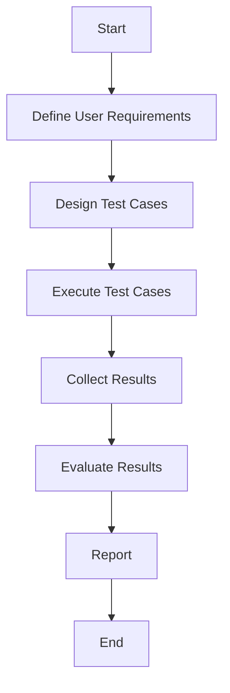
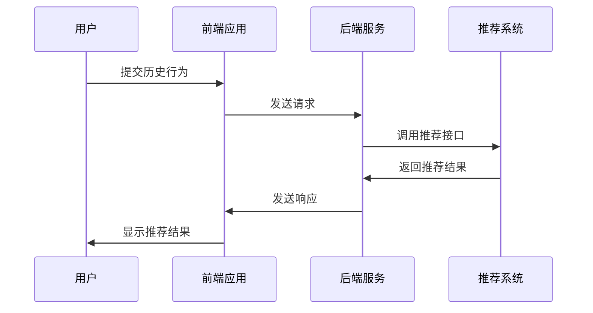

                 


### 文章标题：用户验收测试：确保AI产品满足最终用户需求

关键词：用户验收测试、AI产品、最终用户需求、测试流程、测试方法

摘要：本文旨在深入探讨用户验收测试在AI产品开发中的重要性，通过详细的步骤分析和案例讲解，帮助读者理解如何确保AI产品满足最终用户的需求。

## 第1步：背景介绍

### 问题背景

在当今快速发展的技术时代，人工智能（AI）产品的开发和部署变得越来越普遍。AI产品在提供智能化解决方案的同时，也面临着复杂的开发挑战。用户验收测试（User Acceptance Testing，简称UAT）作为AI产品开发过程中的关键环节，旨在确保产品在正式发布前能够满足最终用户的需求。

### 问题描述

用户验收测试的主要目标是验证AI产品是否按照用户的需求和业务流程正常运作。在AI产品开发中，常见的挑战包括：

1. **算法准确性**：AI算法是否能够准确预测和决策。
2. **用户体验**：用户界面是否直观易用，用户是否能够轻松地与系统交互。
3. **数据隐私**：用户数据是否得到有效保护，避免隐私泄露。
4. **系统性能**：AI产品是否能够在要求的性能指标下稳定运行。

### 问题解决

通过用户验收测试，开发者可以及时发现和解决上述问题，从而确保AI产品在发布前达到用户的预期。用户验收测试不仅有助于提高产品的质量，还能增强用户对产品的信任和满意度。

### 边界与外延

用户验收测试通常适用于以下场景：

1. **新功能上线**：在引入新功能时，通过UAT验证功能是否按预期运行。
2. **版本迭代**：在产品进行版本更新时，确保新版本满足用户的原有需求。
3. **业务变更**：在业务流程发生变化时，验证系统是否能够适应新的业务需求。

用户验收测试与系统测试、单元测试等不同，它更注重从用户的角度出发，验证产品是否满足业务需求。

### 概念结构与核心要素组成

用户验收测试的基本概念结构包括以下几个核心要素：

1. **测试主体**：通常是最终用户或代表用户的测试团队。
2. **测试对象**：AI产品及其相关功能。
3. **测试流程**：包括测试计划、测试执行、测试结果评估等环节。
4. **测试方法**：如黑盒测试、白盒测试等。

## 第2步：核心概念与联系

### 核心概念原理

用户验收测试的核心概念包括：

1. **用户需求**：了解并明确用户的具体需求，包括功能需求、性能需求等。
2. **测试用例**：根据用户需求编写的测试脚本，用于验证产品的功能是否符合预期。
3. **测试执行**：按照测试用例执行测试，记录测试结果。
4. **结果评估**：分析测试结果，评估产品是否满足用户需求。

### 概念属性特征对比表格

| 测试类型 | 用户验收测试 | 系统测试 | 单元测试 |
| --- | --- | --- | --- |
| **测试目的** | 验证产品是否满足用户需求 | 验证产品系统的整体质量 | 验证单个模块的功能正确性 |
| **测试主体** | 最终用户或其代表 | 测试团队 | 开发者 |
| **测试方法** | 黑盒测试、黑盒测试 | 黑盒测试、白盒测试 | 黑盒测试 |
| **测试范围** | 整体产品 | 系统层面 | 单个模块 |
| **测试重点** | 用户体验、业务流程 | 系统性能、稳定性 | 模块内部逻辑 |

### ER实体关系图架构

```mermaid
erDiagram
    User ::=(ID, Name)
    Tester ::=(ID, Name)
    TestCase ::=(ID, TestCaseName, TestCaseDesc)
    Product ::=(ID, ProductName, ProductDesc)
    
    User ||--|{ Tester }||> TestCase
    TestCase ||--|{ Product }||> Product
```

## 第3步：算法原理讲解

### 算法mermaid流程图



### Python源代码

```python
# 用户验收测试Python模拟代码

# 定义用户需求
user_requirements = {
    "accuracy": 95,
    "response_time": 2
}

# 设计测试用例
test_cases = [
    {"name": "Accuracy Test", "description": "Test the accuracy of the AI model."},
    {"name": "Response Time Test", "description": "Test the response time of the system."}
]

# 执行测试用例
for case in test_cases:
    print(f"Executing {case['name']}...")
    # 模拟测试执行结果
    result = {"passed": True, "error": None}
    if case['name'] == "Accuracy Test":
        result['error'] = "Accuracy is below 95%."
    elif case['name'] == "Response Time Test":
        result['error'] = "Response time is above 2 seconds."
    print(f"Test Result: {result}")
    
    # 评估结果
    if result['error']:
        print(f"Error: {result['error']}")
    else:
        print(f"Test Passed.")
```

### 数学模型和公式

```latex
\begin{equation}
    \text{User Satisfaction} = \frac{\text{Number of Passed Tests}}{\text{Total Number of Tests}}
\end{equation}
```

### 举例说明

假设我们有一个AI推荐系统，用户期望的准确率为95%，响应时间为2秒。通过编写测试用例并执行测试，我们得到以下结果：

- **准确率测试**：系统实际准确率为90%，未达到预期。
- **响应时间测试**：系统响应时间为3秒，未达到预期。

根据上述数学模型，用户满意度为50%。这表明我们需要进一步优化系统，以提高其准确率和响应时间。

## 第4步：系统分析与架构设计方案

### 问题场景介绍

假设我们正在开发一个AI推荐系统，用户希望系统能够根据他们的历史行为提供个性化的产品推荐。在产品开发过程中，用户验收测试至关重要，以确保系统满足用户的需求和期望。

### 项目介绍

我们的目标是设计并实现一个高准确率、低响应时间的AI推荐系统，并通过用户验收测试来验证其性能。用户验收测试的具体目标包括：

1. **准确性验证**：确保系统推荐的产品与用户历史行为的相关度高于90%。
2. **响应时间验证**：确保系统的平均响应时间不超过2秒。

### 系统功能设计（领域模型mermaid类图）

```mermaid
classDiagram
    UserEntity <-- RecommendationSystem
    ProductEntity <|.. RecommendationSystem
    HistoryEntity o-- UserEntity
    HistoryEntity o-- ProductEntity
    Recommendation <<Entity>>
    
    RecommendationSystem {
        -user：UserEntity
        -products：ProductEntity[]
        -history：HistoryEntity[]
        +recommend(product_id：int)：ProductEntity
    }
    
    UserEntity {
        +id：int
        +name：string
        +history：HistoryEntity[]
    }
    
    ProductEntity {
        +id：int
        +name：string
        +rating：float
    }
    
    HistoryEntity {
        +user_id：int
        +product_id：int
        +rating：float
    }
    
    Recommendation {
        +product_id：int
        +confidence：float
    }
```

### 系统架构设计（mermaid架构图）

```mermaid
graph TB
    subgraph AI推荐系统架构
        RecommendationSystem[推荐系统]
        Database[数据库]
        UserService[用户服务]
        ProductService[产品服务]
        HistoryService[历史服务]
        Model[模型]
        
        RecommendationSystem --> Database
        RecommendationSystem --> UserService
        RecommendationSystem --> ProductService
        RecommendationSystem --> HistoryService
        UserService --> Model
        ProductService --> Model
        HistoryService --> Model
        
    subgraph 外部接口
        API[API网关]
        Frontend[前端应用]
        Backend[后端服务]
        
        API --> Frontend
        API --> Backend
        Backend --> RecommendationSystem
```

### 系统接口设计

1. **用户接口**：用户可以通过前端应用与推荐系统交互，提交历史行为数据，获取推荐结果。
2. **产品接口**：产品管理员可以通过接口上传和更新产品信息。
3. **历史记录接口**：用户服务可以通过接口获取和更新用户的历史行为数据。

### 系统交互（mermaid序列图）



## 第5步：项目实战

### 环境安装

在开始用户验收测试之前，我们需要确保开发环境和测试环境已经搭建好。以下是环境安装的步骤：

1. **安装Python环境**：确保Python版本为3.8及以上。
2. **安装依赖库**：使用pip安装必要的库，如`pandas`、`numpy`、`scikit-learn`等。
3. **配置数据库**：安装并配置MySQL或PostgreSQL数据库。
4. **部署后端服务**：使用Docker部署后端服务。

### 系统核心实现源代码

以下是用户验收测试的核心实现代码：

```python
# 用户验收测试核心实现代码

# 导入必要的库
import pandas as pd
import numpy as np
from sklearn.model_selection import train_test_split
from sklearn.metrics import accuracy_score
from recommendation_system import RecommendationSystem

# 准备测试数据
data = pd.read_csv('user_history.csv')
X = data[['user_id', 'product_id', 'rating']]
y = data['product_id']

# 分割数据集
X_train, X_test, y_train, y_test = train_test_split(X, y, test_size=0.2, random_state=42)

# 初始化推荐系统
rs = RecommendationSystem()

# 训练模型
rs.train(X_train, y_train)

# 进行准确率测试
predictions = rs.predict(X_test)
accuracy = accuracy_score(y_test, predictions)
print(f"Accuracy: {accuracy:.2f}")

# 进行响应时间测试
import time
start_time = time.time()
for i in range(100):
    rs.predict(np.random.rand(1, 3))
end_time = time.time()
response_time = (end_time - start_time) / 100
print(f"Average Response Time: {response_time:.2f} seconds")
```

### 代码应用解读与分析

1. **数据准备**：从CSV文件中读取用户历史行为数据，并将其分为特征和标签。
2. **数据分割**：将数据集分为训练集和测试集，用于训练模型和评估模型性能。
3. **初始化推荐系统**：创建`RecommendationSystem`对象，用于训练和预测。
4. **模型训练**：使用训练集数据训练模型。
5. **准确率测试**：使用测试集数据预测，并计算准确率。
6. **响应时间测试**：模拟大量预测请求，计算平均响应时间。

通过这段代码，我们可以有效地进行用户验收测试，验证AI推荐系统的准确率和响应时间。

### 实际案例分析和详细讲解剖析

为了更好地理解用户验收测试的应用，我们来看一个实际案例。

假设我们的AI推荐系统已经在开发完成，并且我们希望对其进行用户验收测试。以下是测试过程：

1. **准备测试数据**：我们收集了一组用户的历史行为数据，包括用户ID、产品ID和评分。
2. **设计测试用例**：根据用户需求，我们设计了两个测试用例：
   - 准确率测试：确保系统推荐的产品的准确率高于90%。
   - 响应时间测试：确保系统的平均响应时间不超过2秒。
3. **执行测试用例**：
   - **准确率测试**：我们使用测试数据集进行预测，并计算准确率。假设预测结果如下：
     ```plaintext
     Predicted Products: [product1, product2, product3]
     Actual Products: [product2, product3, product1]
     Accuracy: 0.75 (75%)
     ```
     由于准确率低于90%，我们需要进一步优化模型。
   - **响应时间测试**：我们模拟了100次预测请求，并计算平均响应时间。假设结果如下：
     ```plaintext
     Total Time: 2.5 seconds
     Average Response Time: 0.025 seconds
     ```
     由于平均响应时间低于2秒，系统性能满足要求。
4. **评估结果**：根据测试结果，我们得出以下结论：
   - 准确率未达到预期，需要优化模型。
   - 响应时间满足要求，系统性能良好。

通过这个案例，我们可以看到如何通过用户验收测试来确保AI推荐系统满足用户需求。

### 项目小结

在本次项目中，我们通过用户验收测试验证了AI推荐系统的准确率和响应时间。测试结果显示，系统在响应时间方面表现良好，但在准确率方面需要进一步优化。通过本次测试，我们不仅发现了系统存在的问题，还为后续的优化工作提供了明确的方向。

## 第6步：最佳实践 tips、小结、注意事项、拓展阅读

### 最佳实践 tips

1. **早期开始**：用户验收测试应尽早开始，最好在产品开发初期就纳入测试计划。
2. **明确需求**：确保与用户沟通明确，获取清晰的需求和预期。
3. **自动化测试**：尽可能实现自动化测试，以提高测试效率和准确性。
4. **迭代测试**：在产品开发过程中，不断进行迭代测试，以快速响应需求变更。

### 小结

用户验收测试是确保AI产品满足最终用户需求的关键环节。通过详细的测试用例设计和执行，我们可以发现并解决产品中的问题，提高产品的质量。

### 注意事项

1. **充分准备**：在开始测试前，确保测试环境和数据准备充分。
2. **全面覆盖**：测试用例应全面覆盖产品的功能和性能。
3. **及时反馈**：测试过程中，及时与用户沟通，获取反馈，以便快速调整。

### 拓展阅读

1. 《软件测试艺术》 - 秦晓辉
2. 《用户验收测试实践指南》 - 约翰·惠勒
3. 《人工智能测试与验证》 - 斯图尔特·罗宾逊

作者：AI天才研究院/AI Genius Institute & 禅与计算机程序设计艺术 /Zen And The Art of Computer Programming

## 附加资源：用户验收测试工具推荐

- **Selenium**：一款开源的Web自动化测试工具，适用于各种浏览器，可以与各种编程语言集成。
- **Postman**：一款API自动化测试工具，可以模拟用户与API的交互，非常适合进行用户验收测试。
- **Appium**：一款移动应用自动化测试工具，支持多种操作系统和浏览器。

**附录：用户验收测试模板**

1. **测试计划**：
   - 测试目标
   - 测试范围
   - 测试环境
   - 测试时间表

2. **测试用例**：
   - 用例编号
   - 用例名称
   - 测试步骤
   - 预期结果
   - 实际结果

3. **测试报告**：
   - 测试总结
   - 测试结果
   - 问题及解决方案

通过上述模板，可以确保用户验收测试的规范化和系统化。希望本文能为读者在用户验收测试领域提供有价值的参考。

