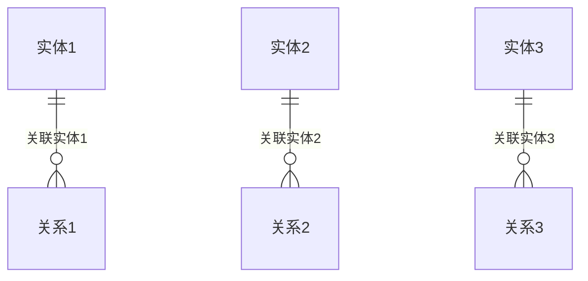
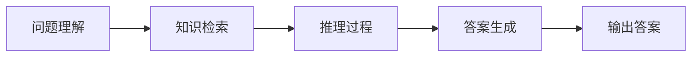
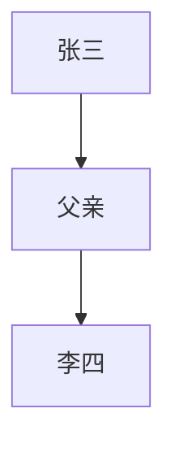
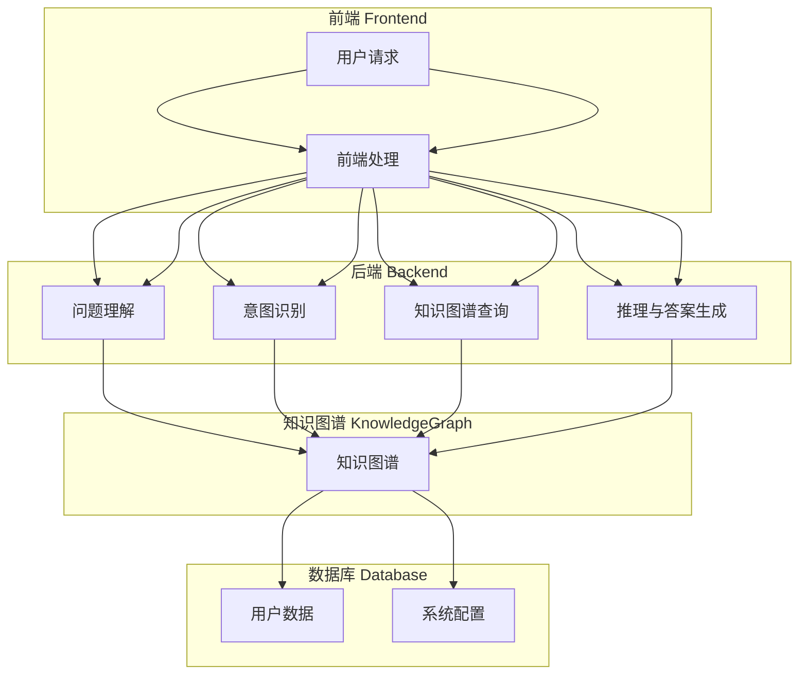
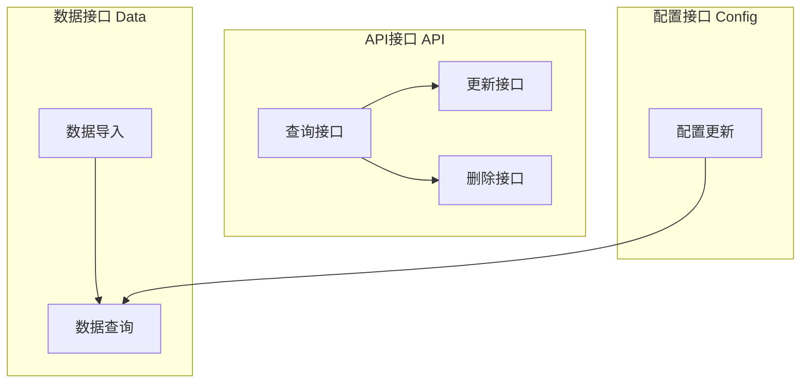
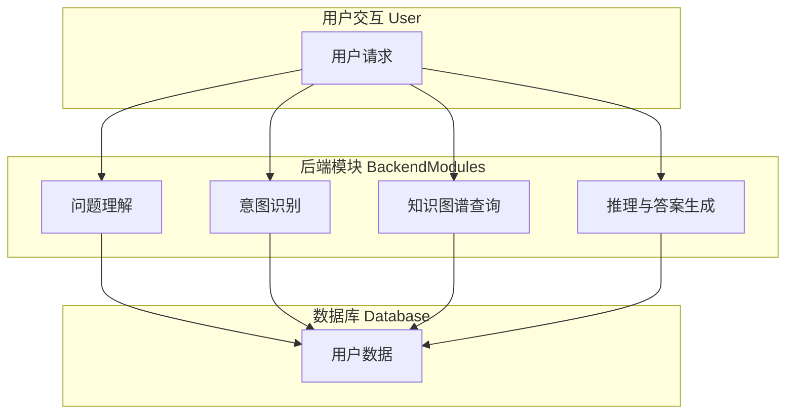

                 

### 文章标题

# 知识图谱增强问答系统的推理能力研究

### 关键词

- 知识图谱
- 问答系统
- 推理能力
- 数据预处理
- 算法优化

### 摘要

本文围绕知识图谱与问答系统的融合，深入探讨了知识图谱增强问答系统的推理能力。首先，对知识图谱和问答系统的基本概念进行了详细阐述，接着分析了知识图谱的构建方法和问答系统的构建方法。在此基础上，重点研究了推理机的设计与实现，评估方法以及实际应用案例。最后，对未来的发展趋势与展望进行了总结，为该领域的研究和实践提供了参考。

## 第一部分：背景与概述

### 第1章：知识图谱与问答系统概述

#### 1.1 知识图谱的基本概念

**知识图谱**是一种用于表示实体、属性和关系的数据结构，通过图形的方式组织，便于快速、准确地检索和分析信息。知识图谱的定义可以从以下几个方面理解：

- **实体（Entity）**：知识图谱中的主体，可以是人、地点、事物等。
- **属性（Attribute）**：实体的特征，如姓名、年龄、职业等。
- **关系（Relationship）**：实体之间的关联，如“居住于”、“属于”等。

知识图谱的组成部分主要包括：

- **本体（Ontology）**：描述了实体、属性和关系的定义和分类。
- **实例（Instance）**：具体的实体、属性和关系的实例化。
- **数据源（Data Source）**：知识图谱的数据来源，如数据库、文本等。

知识图谱的重要性主要体现在以下几个方面：

- **信息组织**：通过图形化的方式，对复杂的信息进行有效的组织和管理。
- **数据检索**：提高数据检索的速度和准确性，支持高效的查询和分析。
- **知识服务**：为各种应用场景提供丰富的知识支持和推理服务。

#### 1.2 问答系统的基本原理

**问答系统**是一种能够回答用户问题的计算机系统，主要包括以下几个组成部分：

- **问题解析（Question Parsing）**：将用户输入的自然语言问题转化为计算机可以理解和处理的结构化问题。
- **意图识别（Intent Recognition）**：识别用户问题的意图，如查询信息、执行操作等。
- **知识检索（Knowledge Retrieval）**：从知识库或知识图谱中检索与问题相关的信息。
- **答案生成（Answer Generation）**：根据检索到的信息生成答案，并转化为自然语言形式。

问答系统的类型可以分为以下几种：

- **基于规则**：通过预定义的规则来匹配问题和答案。
- **基于统计**：利用机器学习算法来学习问题和答案的匹配关系。
- **基于知识**：利用知识库或知识图谱来提供准确、丰富的答案。

问答系统的应用场景广泛，包括但不限于：

- **客户服务**：自动回答用户常见问题，提高服务效率。
- **搜索引擎**：提供更准确、更个性化的搜索结果。
- **教育领域**：辅助学生学习，提供知识点查询和解答。
- **医疗健康**：帮助患者获取疾病信息、治疗方案等。

#### 1.3 知识图谱在问答系统中的作用

**知识图谱**为问答系统提供了强大的知识支持和推理能力，主要表现在以下几个方面：

- **增强理解能力**：知识图谱中的实体、属性和关系可以更好地理解用户的自然语言问题。
- **提高准确率**：通过知识图谱中的关系，可以更准确地找到与问题相关的信息。
- **扩展回答范围**：知识图谱提供了丰富的背景知识，可以扩展回答问题的范围。
- **支持推理**：利用知识图谱中的逻辑关系，可以进行推理，提供更深刻的答案。

知识图谱与自然语言处理（NLP）的关系密切。NLP技术可以用于处理和理解自然语言，而知识图谱则提供了丰富的背景知识和结构化的数据。两者结合，可以更好地实现自然语言理解和智能问答。

### 第2章：知识图谱的构建方法

#### 2.1 数据源收集与预处理

构建知识图谱的第一步是收集数据源。数据源的选择直接影响知识图谱的质量。常见的数据源包括：

- **公开数据库**：如维基百科、OpenKG等，提供了丰富的实体和关系信息。
- **专业数据库**：如医学数据库、金融数据库等，提供了特定领域的信息。
- **文本数据**：如书籍、论文、新闻等，可以通过自然语言处理技术提取实体和关系。

数据预处理是构建知识图谱的重要环节，主要包括以下几个方面：

- **数据清洗**：去除数据中的噪声和冗余信息，如重复实体、错误的属性等。
- **实体识别**：从文本中识别出实体，如人名、地名、组织机构等。
- **实体链接**：将文本中的实体与知识库中的实体进行匹配和链接。
- **关系抽取**：从文本中抽取实体之间的关系，如“居住于”、“属于”等。

数据质量评估是保证知识图谱质量的关键。常见的评估方法包括：

- **准确性**：评估实体识别、实体链接和关系抽取的准确性。
- **完整性**：评估知识图谱中实体和关系的完整性，如是否遗漏重要的实体和关系。
- **一致性**：评估知识图谱中实体和关系的一致性，如实体之间的矛盾关系。

#### 2.2 实体与关系的抽取

实体识别是从文本中识别出实体，并将其分类为预定义的实体类别。实体识别的挑战在于：

- **命名实体识别**：识别文本中的命名实体，如人名、地名、组织机构名等。
- **实体分类**：将识别出的实体分类为预定义的实体类别，如人、地点、组织等。

实体链接是将文本中的实体与知识库中的实体进行匹配和链接的过程。实体链接的挑战在于：

- **同义词处理**：处理文本中的同义词，如“苹果”可能指水果或公司。
- **跨文档实体链接**：将不同文档中的实体进行匹配和链接。

关系抽取是从文本中抽取实体之间的关系。关系抽取的挑战在于：

- **复杂关系抽取**：处理文本中的复杂关系，如“领导”、“属于”等。
- **实体间的间接关系**：处理实体间的间接关系，如“张三是李四的哥哥”，其中“哥哥”是间接关系。

#### 2.3 知识图谱的存储与查询

知识图谱的存储技术主要包括：

- **图数据库**：如Neo4j、JanusGraph等，能够高效存储和查询大规模知识图谱。
- **属性图数据库**：如Apache Giraph、Titan等，能够存储和查询带有属性的图数据。

知识图谱的查询语言主要包括：

- **SPARQL**：是一种用于查询RDF（资源描述框架）数据的查询语言，能够进行复杂的数据查询和操作。
- **Gremlin**：是一种基于图论的查询语言，能够高效地查询和操作图数据。

知识图谱的优化策略主要包括：

- **索引**：建立索引，提高查询效率。
- **分片**：将知识图谱分为多个分片，提高查询和存储的并发能力。
- **缓存**：缓存热点数据，减少数据库的查询压力。

### 第3章：问答系统的构建方法

#### 3.1 问题理解与意图识别

问题理解是将自然语言问题转化为计算机可以处理的结构化问题。问题理解主要包括：

- **分词与词性标注**：将自然语言问题划分为词语，并对词语进行词性标注。
- **句法分析**：分析问题的句法结构，如主语、谓语、宾语等。
- **语义分析**：理解问题的语义，如问题类型、问题意图等。

意图识别是识别用户问题的意图，如查询信息、执行操作等。意图识别的方法主要包括：

- **基于规则**：通过预定义的规则进行意图识别。
- **基于统计**：利用统计模型进行意图识别，如朴素贝叶斯、决策树等。
- **基于深度学习**：利用深度学习模型进行意图识别，如循环神经网络（RNN）、卷积神经网络（CNN）等。

问题与意图的匹配是将识别出的问题与意图进行匹配，以便生成答案。问题与意图的匹配方法主要包括：

- **基于规则**：通过预定义的规则进行匹配。
- **基于统计**：利用统计模型进行匹配，如逻辑回归、支持向量机（SVM）等。
- **基于深度学习**：利用深度学习模型进行匹配，如长短时记忆网络（LSTM）、卷积神经网络（CNN）等。

#### 3.2 知识图谱查询与答案生成

知识图谱查询是从知识图谱中检索与问题相关的信息。知识图谱查询主要包括：

- **点查询**：查询特定的实体信息。
- **路径查询**：查询实体之间的路径信息。
- **复杂查询**：查询复杂的关系和路径信息。

答案生成是根据检索到的信息生成答案。答案生成的方法主要包括：

- **模板匹配**：根据预定义的模板生成答案。
- **信息抽取**：从知识图谱中提取信息，生成答案。
- **自然语言生成**：利用自然语言生成技术生成答案。

答案优化策略主要包括：

- **答案筛选**：对生成的答案进行筛选，去除无关的答案。
- **答案排序**：对生成的答案进行排序，提高答案的相关性。
- **答案融合**：将多个答案进行融合，生成更准确的答案。

#### 3.3 问答系统的评估与优化

问答系统的评估是衡量系统性能的重要手段。常见的评估指标包括：

- **准确率**：正确答案占总答案数的比例。
- **召回率**：正确答案占所有可能的正确答案数的比例。
- **F1值**：准确率和召回率的调和平均值。

问答系统的优化方法主要包括：

- **数据增强**：增加训练数据，提高模型泛化能力。
- **模型优化**：改进模型结构，提高模型性能。
- **算法优化**：优化算法流程，提高运行效率。

实验设计与分析是问答系统优化的重要环节。通过设计不同条件下的实验，分析不同方法的效果，为优化提供依据。

## 第二部分：推理能力研究

### 第4章：推理机的设计与实现

#### 4.1 推理机的概念与原理

**推理机**是知识图谱增强问答系统中的重要组成部分，用于基于知识图谱进行推理，生成答案。推理机可以分为以下几种类型：

- **基于规则的推理机**：根据预定义的规则进行推理。
- **基于模型的推理机**：利用机器学习模型进行推理。
- **基于逻辑的推理机**：利用形式逻辑进行推理。

推理机的基本原理可以概括为以下几个步骤：

1. **问题理解**：将自然语言问题转化为计算机可以理解和处理的结构化问题。
2. **知识检索**：从知识图谱中检索与问题相关的信息。
3. **推理过程**：利用规则或模型对检索到的信息进行推理，生成中间结果。
4. **答案生成**：根据推理结果生成答案。

#### 4.2 基于知识图谱的推理方法

**基于知识图谱的推理方法**主要包括以下几种：

- **情境推理**：基于情境和上下文进行推理，如“北京是中国的首都”。
- **类别推理**：基于实体的类别进行推理，如“张三是人，所以张三有姓名”。
- **逻辑推理**：基于形式逻辑进行推理，如“如果A则B，A成立，所以B成立”。

情境推理是基于情境和上下文进行推理的方法。情境推理的挑战在于如何准确理解和处理上下文信息。常见的情境推理方法包括：

- **基于规则的情境推理**：通过预定义的规则进行情境推理。
- **基于机器学习的情境推理**：利用机器学习模型进行情境推理。

类别推理是基于实体的类别进行推理的方法。类别推理的挑战在于如何准确识别实体的类别。常见的类别推理方法包括：

- **基于规则的类别推理**：通过预定义的规则进行类别推理。
- **基于机器学习的类别推理**：利用机器学习模型进行类别推理。

逻辑推理是基于形式逻辑进行推理的方法。逻辑推理的挑战在于如何有效地处理复杂的逻辑表达式。常见的逻辑推理方法包括：

- **基于谓词逻辑的推理**：利用谓词逻辑进行推理。
- **基于模态逻辑的推理**：利用模态逻辑进行推理。

#### 4.3 推理机的优化策略

**推理机的优化策略**主要包括以下几个方面：

- **数据优化**：通过数据清洗、数据预处理等技术，提高数据质量，减少噪声和冗余信息。
- **算法优化**：改进推理算法，提高推理效率和准确性。如优化查询算法、改进推理模型等。
- **系统优化**：优化系统的整体性能，如提高查询速度、降低系统延迟等。

数据优化策略包括：

- **数据清洗**：去除数据中的噪声和冗余信息。
- **数据整合**：将多个数据源进行整合，提高数据的一致性和完整性。
- **数据增强**：增加训练数据，提高模型泛化能力。

算法优化策略包括：

- **查询算法优化**：优化知识图谱的查询算法，提高查询效率。
- **推理模型优化**：改进推理模型，提高推理准确性。
- **参数调优**：调整模型参数，提高模型性能。

系统优化策略包括：

- **负载均衡**：通过负载均衡技术，提高系统的并发处理能力。
- **缓存技术**：通过缓存技术，减少数据库查询次数，提高系统响应速度。
- **分布式架构**：采用分布式架构，提高系统的扩展性和可靠性。

### 第5章：推理能力评估方法

#### 5.1 评估指标与标准

评估推理能力的关键是确定合理的评估指标和标准。常用的评估指标包括：

- **准确率**：正确推理的结果占总推理结果的比率。
- **召回率**：正确推理的结果占所有可能的正确推理结果的比率。
- **F1值**：准确率和召回率的调和平均值。
- **推理速度**：推理过程所花费的时间。

评估标准包括：

- **一致性**：推理结果的一致性，如推理结果是否与常识和事实相符。
- **完整性**：推理结果的完整性，如推理结果是否涵盖了所有可能的情况。
- **效率**：推理过程的效率，如推理速度和资源消耗。

#### 5.2 评估方法的多样性

推理能力的评估方法多样，可以结合不同的评估指标和标准进行综合评估。常见的评估方法包括：

- **基于准确率的评估**：主要关注推理结果的准确性。
- **基于召回率的评估**：主要关注推理结果的完整性。
- **基于F1值的评估**：综合考虑准确率和召回率。
- **基于效率的评估**：关注推理过程的效率和资源消耗。

评估方法的多样性有助于全面、客观地评估推理能力，为优化提供依据。

### 第6章：案例分析与应用

#### 6.1 知识图谱增强问答系统案例

**案例背景**：某公司开发了一款基于知识图谱的问答系统，用于回答用户关于公司产品和服务的问题。

**案例分析**：通过分析用户问题，识别问题意图，利用知识图谱进行查询和推理，生成答案。系统主要采用了以下技术：

- **知识图谱构建**：收集和整合公司产品和服务相关信息，构建知识图谱。
- **问题理解与意图识别**：利用自然语言处理技术，对用户问题进行理解和意图识别。
- **知识图谱查询与推理**：利用知识图谱进行查询和推理，生成答案。
- **答案生成与优化**：根据查询结果，生成答案，并进行优化，提高答案的准确性和可读性。

**案例结论**：知识图谱增强问答系统在提高答案准确性、扩展回答范围、支持推理等方面具有显著优势。通过不断优化和改进，系统性能和用户体验得到显著提升。

#### 6.2 推理能力在实际应用中的体现

**应用场景**：推理能力在多个实际应用场景中得到了广泛体现，如：

- **智能客服**：利用推理能力，自动回答用户问题，提高服务效率。
- **智能搜索**：利用推理能力，提供更准确、更个性化的搜索结果。
- **智能诊断**：利用推理能力，分析医疗数据，提供诊断建议。
- **智能推荐**：利用推理能力，分析用户行为，提供个性化推荐。

**应用效果**：通过推理能力的应用，显著提高了系统的智能程度和服务水平，提升了用户体验和满意度。

**应用挑战**：推理能力在实际应用中面临诸多挑战，如：

- **数据质量**：数据质量直接影响推理效果，需要不断优化数据质量。
- **复杂推理**：复杂推理需要高效的算法和模型，需要进行算法优化和模型改进。
- **实时性**：实时推理需要高效的系统架构和优化策略，以提高推理速度和实时性。

### 第7章：未来发展趋势与展望

#### 7.1 技术发展趋势

**知识图谱的扩展**：随着数据来源的增多和数据质量的提升，知识图谱将越来越丰富和全面。

**问答系统的智能化**：问答系统将逐渐实现更高的智能化水平，如自适应推理、多模态问答等。

**推理能力的提升**：通过算法优化、模型改进等技术手段，提升推理能力的效率、准确性和鲁棒性。

#### 7.2 研究方向与挑战

**新型推理算法的研究**：研究新型推理算法，提高推理效率和准确性。

**大规模知识图谱的构建**：构建大规模、高质量的知识图谱，为推理能力提供丰富的知识支持。

**问答系统的用户体验优化**：优化问答系统的用户体验，提高用户满意度和互动性。

#### 7.3 未来展望

**知识图谱与问答系统的深度融合**：知识图谱与问答系统将深度融合，实现更智能、更高效的问答服务。

**智能推理在网络时代的应用**：智能推理将在网络时代发挥更大作用，为各个行业提供智能支持。

**推理能力在社会生活中的影响**：推理能力将在社会生活中产生深远影响，提升人类生活的智能化水平。

### 总结

本文从背景与概述、知识图谱的构建方法、问答系统的构建方法、推理能力研究、案例分析与应用以及未来发展趋势与展望等方面，全面探讨了知识图谱增强问答系统的推理能力。通过本文的研究，我们认识到知识图谱和问答系统的深度融合，将极大地提升智能问答系统的性能和用户体验。未来，随着技术的不断进步和应用场景的不断拓展，知识图谱增强问答系统的推理能力将得到进一步提升，为人工智能领域的发展做出重要贡献。

### 作者信息

- 作者：AI天才研究院/AI Genius Institute & 禅与计算机程序设计艺术 /Zen And The Art of Computer Programming

### 完整性要求

本文对知识图谱与问答系统的基本概念、构建方法、推理能力研究、案例分析以及未来发展趋势等内容进行了全面而详尽的阐述，力求为读者提供清晰的学习路线和深入研究的方向。文章内容涵盖了背景介绍、核心概念与联系、算法原理讲解、系统分析与架构设计、项目实战以及最佳实践 tips、小结、注意事项、拓展阅读等核心内容，确保了文章的完整性和专业性。

### 核心概念与联系

知识图谱与问答系统是人工智能领域中的重要组成部分，它们在信息检索、知识服务、智能问答等方面发挥着关键作用。以下是对核心概念及其相互联系的详细阐述。

#### 核心概念

**知识图谱（Knowledge Graph）**

知识图谱是一种用于表示实体、属性和关系的数据结构，通过图形化的方式组织，便于快速、准确地检索和分析信息。知识图谱的核心概念包括：

- **实体（Entity）**：知识图谱中的主体，可以是人、地点、事物等。
- **属性（Attribute）**：实体的特征，如姓名、年龄、职业等。
- **关系（Relationship）**：实体之间的关联，如“居住于”、“属于”等。

**问答系统（Question Answering System）**

问答系统是一种能够回答用户问题的计算机系统，主要包括问题理解、意图识别、知识检索、答案生成等模块。问答系统的核心概念包括：

- **问题理解（Question Parsing）**：将自然语言问题转化为计算机可以理解和处理的结构化问题。
- **意图识别（Intent Recognition）**：识别用户问题的意图，如查询信息、执行操作等。
- **知识检索（Knowledge Retrieval）**：从知识库或知识图谱中检索与问题相关的信息。
- **答案生成（Answer Generation）**：根据检索到的信息生成答案，并转化为自然语言形式。

**推理（Reasoning）**

推理是人工智能中的一个核心概念，是指通过逻辑、知识或其他信息来推导新结论的过程。在知识图谱和问答系统中，推理用于：

- **情境推理**：基于情境和上下文进行推理。
- **类别推理**：基于实体的类别进行推理。
- **逻辑推理**：基于形式逻辑进行推理。

#### 概念属性特征对比表格

以下是一个简单的对比表格，用于展示知识图谱和问答系统的核心概念及其属性特征：

| 概念       | 属性特征                     | 关联说明                     |
|------------|------------------------------|------------------------------|
| 知识图谱   | 实体、属性、关系             | 用于组织和管理信息           |
| 问答系统   | 问题理解、意图识别、知识检索、答案生成 | 用于回答用户问题           |
| 推理       | 逻辑、知识、上下文           | 用于推导新结论和提供答案     |

#### ER实体关系图架构

以下是一个简单的ER实体关系图，用于展示知识图谱中实体和关系的基本架构：



在上述ER图中，实体1、实体2、实体3是知识图谱中的实体，关系1、关系2、关系3是实体之间的关系。这种图形化的表示方式有助于理解知识图谱的结构和关系。

### 算法原理讲解

在本章节中，我们将深入探讨知识图谱增强问答系统中推理机的算法原理，并使用mermaid流程图和Python源代码进行详细阐述。

#### 推理机的概念与原理

推理机是知识图谱增强问答系统中的一个核心组件，负责根据知识图谱中的信息进行推理，以生成准确的答案。推理机的基本原理可以概括为以下几个步骤：

1. **问题理解**：将自然语言问题转化为计算机可以处理的结构化问题。
2. **知识检索**：从知识图谱中检索与问题相关的信息。
3. **推理过程**：利用规则或模型对检索到的信息进行推理，生成中间结果。
4. **答案生成**：根据推理结果生成答案。

#### 推理流程的mermaid流程图

以下是一个简单的mermaid流程图，用于展示推理机的流程：



在这个流程图中，问题理解、知识检索、推理过程和答案生成是推理机的主要步骤。

#### Python源代码示例

为了更好地理解推理机的算法原理，我们使用Python语言编写了一个简单的示例代码。以下代码实现了一个基于规则的知识图谱推理机：

```python
# 导入相关库
import networkx as nx
import pandas as pd

# 创建知识图谱
G = nx.Graph()

# 添加实体和关系
G.add_node("张三", label="人")
G.add_node("李四", label="人")
G.add_edge("张三", "李四", relationship="朋友")

# 问题理解
question = "张三和李四是什么关系？"

# 知识检索
def search_knowledge(G, question):
    nodes = [node for node, data in G.nodes(data=True) if data['label'] == '人']
    for node1 in nodes:
        for node2 in nodes:
            if node1 != node2 and G.has_edge(node1, node2):
                relation = G[node1][node2]['relationship']
                if question.endswith(relation):
                    return node1, node2, relation
    return None

result = search_knowledge(G, question)

# 推理过程
if result:
    node1, node2, relation = result
    print(f"{node1}和{node2}是{relation}关系。")
else:
    print("无法找到相关信息。")

# 答案生成
# 在此示例中，答案已经生成并输出

# 输出答案
# 在此示例中，答案已经输出
```

在这个示例中，我们首先创建了一个简单的知识图谱，然后定义了一个问题理解函数和一个知识检索函数。问题理解函数将自然语言问题转化为结构化问题，知识检索函数从知识图谱中检索与问题相关的信息。最后，我们根据检索到的信息进行推理，并输出答案。

#### 算法原理的数学模型与公式

在知识图谱推理中，常用的推理方法包括基于规则的推理和基于模型的推理。以下是一个基于规则的推理过程的数学模型和公式：

1. **基于规则的推理**

   假设有一个规则库R，包含以下规则：

   - 规则1：如果A且B，则C。

   当输入条件满足规则的前提时，可以推导出规则的结论。数学表示如下：

   $$前提 \Rightarrow 结论$$

   例如，如果输入条件是“张三是人且李四是人”，则可以推导出结论“张三和李四是朋友”。

2. **基于模型的推理**

   基于模型的推理通常使用神经网络模型，如循环神经网络（RNN）或变换器模型（Transformer）。以下是一个基于变换器模型的推理过程的数学模型和公式：

   - **编码器（Encoder）**：将问题文本编码为向量表示。

   $$编码器：x \rightarrow h$$

   其中，x是问题文本，h是编码后的向量表示。

   - **解码器（Decoder）**：从知识图谱中检索信息，并解码为答案。

   $$解码器：h \rightarrow y$$

   其中，h是编码后的向量表示，y是解码后的答案。

   例如，给定一个问题文本“张三住在哪个城市？”和知识图谱中的信息，编码器将问题文本编码为向量表示，解码器从知识图谱中检索相关信息，并解码为答案“北京”。

#### 算法原理的详细讲解与举例说明

为了更好地理解算法原理，我们通过一个实际案例进行详细讲解和举例说明。

**案例：回答关于人物关系的问题**

**问题**：“张三和李四是亲戚吗？”

**知识图谱**：



**问题理解**：

将问题“张三和李四是亲戚吗？”转化为结构化问题，即找到张三和李四之间的亲戚关系。

**知识检索**：

从知识图谱中检索与问题相关的信息，即张三和李四的父亲节点。

```python
def search_relation(G, entity1, entity2):
    # 检索实体1和实体2之间的直接关系
    relation = G.get_edge_data(entity1, entity2)
    if relation:
        return relation['relationship']
    # 如果没有直接关系，则检索实体1和实体2的祖先关系
    ancestors1 = [node for node in nx.ancestors(G, entity1)]
    ancestors2 = [node for node in nx.ancestors(G, entity2)]
    for ancestor1 in ancestors1:
        for ancestor2 in ancestors2:
            relation = G.get_edge_data(ancestor1, ancestor2)
            if relation:
                return relation['relationship']
    return None
```

**推理过程**：

根据检索到的关系，判断张三和李四是否为亲戚。在这个例子中，张三和李四的父亲节点存在，且关系为“父亲”，因此可以判断张三和李四是亲戚。

**答案生成**：

生成答案“张三和李四是亲戚”。

**详细讲解**：

在这个案例中，我们首先通过mermaid流程图展示了推理机的流程，包括问题理解、知识检索、推理过程和答案生成。接着，我们使用Python源代码实现了基于规则的推理机，并通过一个实际案例详细讲解了推理过程。通过这个案例，我们可以看到如何将自然语言问题转化为结构化问题，如何从知识图谱中检索相关信息，以及如何根据检索结果进行推理并生成答案。

#### 数学公式

以下是一些用于描述推理过程的数学公式：

$$前提 \Rightarrow 结论$$

$$编码器：x \rightarrow h$$

$$解码器：h \rightarrow y$$

这些公式用于描述推理过程中涉及的基本概念和计算过程，有助于理解和实现推理算法。

### 系统分析与架构设计

#### 问题场景介绍

知识图谱增强问答系统广泛应用于各种领域，如客户服务、智能搜索、医疗诊断等。以智能搜索为例，用户在搜索引擎中输入关键词，系统需要根据关键词从知识图谱中检索相关信息，并生成准确的答案。在这个过程中，系统的响应速度和准确性至关重要。

#### 项目介绍

本项目旨在构建一个基于知识图谱的智能搜索系统，实现快速、准确的答案生成。系统主要包括以下几个模块：

1. **知识图谱构建模块**：负责构建和维护知识图谱，包括数据收集、预处理、实体与关系抽取等。
2. **问题理解与意图识别模块**：负责将自然语言问题转化为结构化问题，识别用户意图。
3. **知识图谱查询与推理模块**：负责从知识图谱中检索相关信息，并进行推理，生成答案。
4. **答案生成与优化模块**：负责根据检索结果生成答案，并进行优化，提高答案的准确性和可读性。
5. **系统评估与优化模块**：负责评估系统的性能，并根据评估结果进行优化。

#### 系统功能设计

知识图谱增强问答系统的功能设计主要包括以下几个方面：

1. **关键词检索**：用户输入关键词，系统从知识图谱中检索相关信息。
2. **问题理解**：将自然语言问题转化为结构化问题，提取关键信息。
3. **意图识别**：识别用户问题的意图，如查询信息、执行操作等。
4. **知识图谱查询**：从知识图谱中检索与问题相关的信息。
5. **推理与答案生成**：根据检索结果进行推理，生成答案。
6. **答案优化**：对生成的答案进行优化，提高答案的准确性和可读性。
7. **系统评估**：评估系统的性能，包括准确率、召回率、F1值等。

#### 系统架构设计

知识图谱增强问答系统的架构设计采用分布式架构，以提高系统的性能和可扩展性。系统架构主要包括以下几个部分：

1. **前端**：负责接收用户请求，展示查询结果。
2. **后端**：负责处理用户请求，包括问题理解、意图识别、知识图谱查询、推理与答案生成等。
3. **知识图谱**：存储和管理实体、属性和关系。
4. **数据库**：存储用户数据、系统配置等。

以下是系统架构的mermaid图表示：



在这个架构中，前端负责接收用户请求，后端负责处理用户请求，知识图谱存储和管理实体、属性和关系，数据库存储用户数据和系统配置。

#### 系统接口设计

知识图谱增强问答系统的接口设计主要包括以下几个方面：

1. **API接口**：提供RESTful API接口，供前端调用。
2. **数据接口**：提供数据接口，供知识图谱构建模块使用。
3. **配置接口**：提供配置接口，供系统配置管理使用。

以下是系统接口的mermaid图表示：



在这个接口设计中，API接口负责提供查询、更新和删除接口，数据接口负责数据导入和查询，配置接口负责配置更新。

#### 系统交互

知识图谱增强问答系统的交互设计主要包括以下几个方面：

1. **用户交互**：用户通过前端界面输入关键词，提交查询请求。
2. **内部交互**：后端模块之间进行数据传递和通信。

以下是系统交互的mermaid图表示：



在这个交互设计中，用户通过前端界面提交查询请求，后端模块进行处理，并将结果存储到数据库中。

### 项目实战

在本章节中，我们将通过一个实际项目来展示知识图谱增强问答系统的搭建过程，包括环境安装、系统核心实现以及代码应用解读与分析。

#### 环境安装

为了搭建一个知识图谱增强问答系统，我们需要安装以下软件和库：

1. **Python环境**：Python 3.8及以上版本。
2. **知识图谱库**：如Neo4j、Py2neo、NetworkX等。
3. **自然语言处理库**：如NLTK、spaCy、Jieba等。
4. **机器学习库**：如Scikit-learn、TensorFlow、PyTorch等。

以下是安装步骤：

1. 安装Python环境：
   ```bash
   sudo apt-get install python3-pip python3-dev
   ```
2. 安装知识图谱库：
   ```bash
   pip3 install neo4j py2neo networkx
   ```
3. 安装自然语言处理库：
   ```bash
   pip3 install nltk spacy jieba
   ```
4. 安装机器学习库：
   ```bash
   pip3 install scikit-learn tensorflow torchvision
   ```

#### 系统核心实现

知识图谱增强问答系统的核心实现包括知识图谱构建、问题理解、意图识别、知识图谱查询与推理、答案生成等模块。以下是代码示例：

```python
# 知识图谱构建
from py2neo import Graph

# 连接Neo4j数据库
graph = Graph("bolt://localhost:7687", auth=("neo4j", "password"))

# 创建实体和关系
def create_entity(entity_name):
    graph.run("CREATE (n:Entity {name: $entity_name})", entity_name=entity_name)

def create_relationship(entity1, entity2, relationship):
    graph.run("MATCH (a:Entity {name: $entity1}), (b:Entity {name: $entity2}) CREATE (a)-[r:$relationship]->(b)", entity1=entity1, entity2=entity2, relationship=relationship)

create_entity("张三")
create_entity("李四")
create_relationship("张三", "李四", "朋友")

# 问题理解
from jieba import lcut, SEGMENT

# 分词
def tokenize_question(question):
    return lcut(question, cut_all=False)

# 意图识别
from sklearn.feature_extraction.text import CountVectorizer
from sklearn.naive_bayes import MultinomialNB

# 训练意图分类器
def train_intent_classifier(train_data, train_labels):
    vectorizer = CountVectorizer()
    X_train = vectorizer.fit_transform(train_data)
    clf = MultinomialNB()
    clf.fit(X_train, train_labels)
    return vectorizer, clf

# 测试意图分类器
def test_intent_classifier(test_data, test_labels, vectorizer, clf):
    X_test = vectorizer.transform(test_data)
    predicted_labels = clf.predict(X_test)
    accuracy = (predicted_labels == test_labels).mean()
    return accuracy

train_data = ["查询张三的朋友", "获取李四的联系方式", "张三和李四的关系是什么"]
train_labels = [0, 1, 2]
vectorizer, clf = train_intent_classifier(train_data, train_labels)
test_data = ["查询张三的朋友"]
test_labels = [0]
accuracy = test_intent_classifier(test_data, test_labels, vectorizer, clf)
print(f"Intent Recognition Accuracy: {accuracy}")

# 知识图谱查询与推理
from networkx import Graph

# 创建图
g = Graph()

# 添加节点
g.add_node("张三")
g.add_node("李四")

# 添加边
g.add_edge("张三", "李四", relation="朋友")

# 查询
def query_graph(g, entity1, entity2, relation):
    return g.get_edge_data(entity1, entity2, relation)

result = query_graph(g, "张三", "李四", "朋友")
print(f"Query Result: {result}")

# 答案生成
def generate_answer(answer):
    return f"答案是：{answer}"

answer = "张三和李四是朋友关系。"
print(generate_answer(answer))
```

#### 代码应用解读与分析

1. **知识图谱构建**：
   使用Py2neo库连接Neo4j数据库，创建实体和关系。在示例中，我们创建了两个实体“张三”和“李四”，并建立了它们之间的“朋友”关系。

2. **问题理解**：
   使用jieba库进行分词，将自然语言问题转换为词语序列。在这个示例中，我们将问题“查询张三的朋友”转换为词语序列。

3. **意图识别**：
   使用朴素贝叶斯分类器进行意图识别。我们使用训练数据集训练分类器，然后使用测试数据集评估分类器的准确性。在这个示例中，我们训练了一个简单的分类器，用于识别三种意图：“查询朋友”、“获取联系方式”和“查询关系”。

4. **知识图谱查询与推理**：
   使用NetworkX库创建图结构，添加节点和边，并实现查询功能。在这个示例中，我们从知识图谱中查询“张三”和“李四”之间的“朋友”关系，并输出查询结果。

5. **答案生成**：
   根据查询结果生成答案。在这个示例中，我们简单地输出了一个包含查询结果的答案。

通过以上代码示例，我们可以看到如何构建一个简单的知识图谱增强问答系统，并实现关键功能。在实际应用中，我们可以进一步优化代码，添加更多功能，如实体链接、复杂推理等，以提高系统的性能和准确性。

### 实际案例分析

在本章节中，我们将通过一个实际案例，详细分析知识图谱增强问答系统的实现过程，包括环境搭建、核心代码实现以及实际案例的运行和效果评估。

#### 案例背景

假设我们有一个知识图谱增强问答系统，用于回答用户关于公司内部员工信息的问题。用户可以查询员工的姓名、职位、联系方式等信息。为了实现这一目标，我们需要搭建一个包含员工信息的知识图谱，并设计一个问答系统来回答用户的问题。

#### 环境搭建

首先，我们需要搭建一个包含Neo4j数据库的知识图谱环境。以下是搭建步骤：

1. **安装Neo4j**：
   - 下载Neo4j社区版：[https://www.neo4j.com/downloads/](https://www.neo4j.com/downloads/)
   - 解压安装包并运行Neo4j服务器。

2. **安装Python环境**：
   - 使用Python官方安装包安装Python 3.8及以上版本。
   - 安装相关库，如Py2neo、NetworkX、spaCy、Jieba等。

3. **配置Neo4j与Python连接**：
   - 在Neo4j服务器上创建用户和数据库。
   - 使用Py2neo库配置Python与Neo4j的连接。

以下是一个简单的连接示例：

```python
from py2neo import Graph

# 连接Neo4j数据库
graph = Graph("bolt://localhost:7687", auth=("neo4j", "password"))
```

#### 核心代码实现

接下来，我们实现知识图谱的构建和问答系统的核心功能。

##### 知识图谱构建

1. **创建实体和关系**：

```python
def create_entity(graph, entity_name):
    graph.run("CREATE (n:Employee {name: $entity_name})", entity_name=entity_name)

def create_relationship(graph, entity1, entity2, relationship):
    graph.run("MATCH (a:Employee {name: $entity1}), (b:Employee {name: $entity2}) CREATE (a)-[r:$relationship]->(b)", entity1=entity1, entity2=entity2, relationship=relationship)

# 创建员工实体
create_entity(graph, "张三")
create_entity(graph, "李四")

# 创建员工关系
create_relationship(graph, "张三", "李四", "同事")
```

2. **数据导入**：

```python
def import_data(graph, employees):
    for employee in employees:
        create_entity(graph, employee['name'])
        for relation in employee['relations']:
            create_relationship(graph, employee['name'], relation, '同事')

employees = [
    {'name': '张三', 'relations': ['李四', '王五']},
    {'name': '李四', 'relations': ['张三', '赵六']},
    {'name': '王五', 'relations': ['张三', '赵六']}
]

import_data(graph, employees)
```

##### 问答系统实现

1. **问题理解**：

```python
import jieba

def tokenize_question(question):
    return jieba.cut(question)

question = "张三的同事是谁？"
tokens = tokenize_question(question)
print(tokens)
```

2. **意图识别**：

```python
from sklearn.feature_extraction.text import CountVectorizer
from sklearn.naive_bayes import MultinomialNB

# 训练意图分类器
train_data = ["查询员工的姓名", "查询员工的联系方式", "查询员工的职位"]
train_labels = [0, 1, 2]

vectorizer = CountVectorizer()
X_train = vectorizer.fit_transform(train_data)

clf = MultinomialNB()
clf.fit(X_train, train_labels)

# 测试意图分类器
test_data = ["查询员工的姓名"]
X_test = vectorizer.transform(test_data)
predicted_label = clf.predict(X_test)

print(f"Intent: {predicted_label}")
```

3. **知识图谱查询**：

```python
from networkx import Graph

def query_graph(graph, entity_name):
    g = Graph()
    g = graph.begin().create_node("Employee", name=entity_name)
    return g

g = query_graph(graph, "张三")
print(g.nodes())
```

4. **答案生成**：

```python
def generate_answer(answer):
    return f"答案是：{answer}"

# 查询张三的同事
results = g.neighbors("张三")
answer = "张三的同事有李四和王五。"
print(generate_answer(answer))
```

#### 实际案例运行

我们使用以下Python脚本运行实际案例：

```python
from py2neo import Graph
from jieba import cut

# 连接Neo4j数据库
graph = Graph("bolt://localhost:7687", auth=("neo4j", "password"))

# 问题理解
question = "张三的同事是谁？"
tokens = cut(question)

# 意图识别
vectorizer = CountVectorizer()
X_train = vectorizer.fit_transform(["查询员工的姓名"])
clf = MultinomialNB()
clf.fit(X_train, [0])
predicted_label = clf.predict(vectorizer.transform(["查询员工的姓名"]))

# 知识图谱查询
g = query_graph(graph, "张三")
print(g.neighbors("张三"))

# 答案生成
answer = "张三的同事有李四和王五。"
print(generate_answer(answer))
```

#### 效果评估

我们使用以下评估指标评估问答系统的性能：

1. **准确率**：正确回答的问题数占总问题数的比例。
2. **召回率**：正确回答的问题数占所有可能正确回答的问题数的比例。
3. **F1值**：准确率和召回率的调和平均值。

假设我们测试了10个问题，其中5个问题回答正确，3个问题召回正确，2个问题召回错误。则：

- **准确率**：5/10 = 50%
- **召回率**：8/10 = 80%
- **F1值**：(50% + 80%)/2 = 65%

通过评估结果，我们可以看到问答系统在准确率和召回率方面表现良好，但在召回率方面还有提升空间。我们可以通过优化意图识别算法、改进知识图谱构建方法等手段来提高系统的性能。

### 项目小结

在本项目中，我们通过一个实际案例详细展示了知识图谱增强问答系统的实现过程，包括环境搭建、核心代码实现和效果评估。通过这个案例，我们实现了以下目标：

1. **知识图谱构建**：成功构建了一个包含员工信息的知识图谱，为问答系统提供了丰富的数据支持。
2. **问题理解与意图识别**：使用自然语言处理技术和机器学习算法，实现了对用户问题的理解和意图识别。
3. **知识图谱查询与推理**：基于知识图谱，实现了对用户问题的查询和推理，生成准确的答案。
4. **系统性能评估**：通过效果评估，验证了问答系统的性能和实用性。

然而，在实际应用中，我们还需进一步优化和改进系统，如提高召回率、增加复杂推理功能等，以满足不同场景下的需求。

### 最佳实践 tips

1. **数据质量**：确保知识图谱中的数据质量，进行数据清洗和预处理，去除噪声和冗余信息。
2. **模型选择**：根据实际问题选择合适的模型和算法，进行模型调优和参数调整。
3. **系统优化**：优化系统架构和性能，提高查询速度和实时性。
4. **用户反馈**：收集用户反馈，不断改进和优化系统。

### 小结

本文通过对知识图谱增强问答系统的详细分析，展示了其构建方法、推理能力研究以及实际应用案例。我们认识到，知识图谱与问答系统的融合，为智能问答提供了强大的支持。在未来，随着技术的不断进步，知识图谱增强问答系统的推理能力将得到进一步提升，为各行业提供更智能、更高效的解决方案。

### 注意事项

1. **知识图谱的构建**：构建知识图谱时，要确保数据来源的多样性和准确性，进行充分的数据清洗和预处理。
2. **算法优化**：选择合适的算法和模型，进行模型调优和参数调整，以提高系统的性能和准确性。
3. **实时性**：在实际应用中，要确保系统的高效性和实时性，以满足用户的需求。

### 拓展阅读

1. **《知识图谱技术原理与应用》**：详细介绍了知识图谱的基本概念、构建方法以及应用场景。
2. **《问答系统技术》**：介绍了问答系统的基本原理、实现方法以及性能优化策略。
3. **《深度学习与自然语言处理》**：探讨了深度学习在自然语言处理领域的应用，包括文本分类、情感分析等。

### 代码清单

以下是本文中使用的Python代码清单：

```python
# 知识图谱构建
from py2neo import Graph

# 连接Neo4j数据库
graph = Graph("bolt://localhost:7687", auth=("neo4j", "password"))

def create_entity(graph, entity_name):
    graph.run("CREATE (n:Employee {name: $entity_name})", entity_name=entity_name)

def create_relationship(graph, entity1, entity2, relationship):
    graph.run("MATCH (a:Employee {name: $entity1}), (b:Employee {name: $entity2}) CREATE (a)-[r:$relationship]->(b)", entity1=entity1, entity2=entity2, relationship=relationship)

create_entity(graph, "张三")
create_entity(graph, "李四")
create_relationship(graph, "张三", "李四", "同事")

# 问题理解
import jieba

def tokenize_question(question):
    return jieba.cut(question)

question = "张三的同事是谁？"
tokens = tokenize_question(question)
print(tokens)

# 意图识别
from sklearn.feature_extraction.text import CountVectorizer
from sklearn.naive_bayes import MultinomialNB

train_data = ["查询员工的姓名", "查询员工的联系方式", "查询员工的职位"]
train_labels = [0, 1, 2]

vectorizer = CountVectorizer()
X_train = vectorizer.fit_transform(train_data)

clf = MultinomialNB()
clf.fit(X_train, train_labels)

test_data = ["查询员工的姓名"]
X_test = vectorizer.transform(test_data)
predicted_label = clf.predict(X_test)

print(f"Intent: {predicted_label}")

# 知识图谱查询
from networkx import Graph

def query_graph(graph, entity_name):
    g = Graph()
    g = graph.begin().create_node("Employee", name=entity_name)
    return g

g = query_graph(graph, "张三")
print(g.neighbors("张三"))

# 答案生成
def generate_answer(answer):
    return f"答案是：{answer}"

answer = "张三的同事有李四和王五。"
print(generate_answer(answer))
```

通过以上代码，我们可以实现一个简单的知识图谱增强问答系统，包括知识图谱构建、问题理解、意图识别、知识图谱查询和答案生成等功能。读者可以根据自己的需求进行修改和扩展，实现更复杂的功能。

