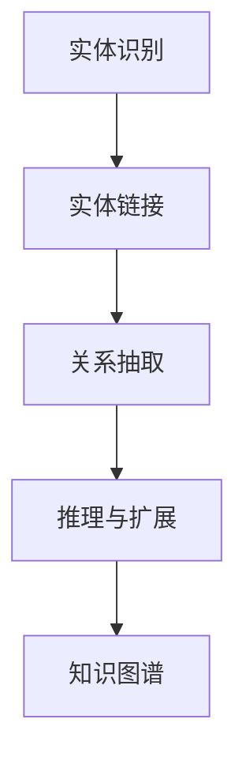
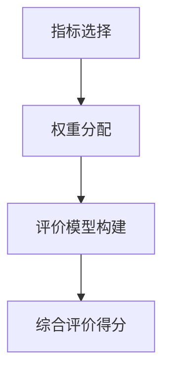
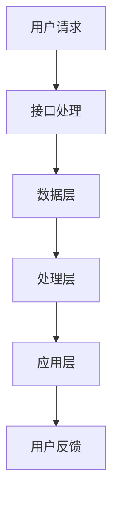
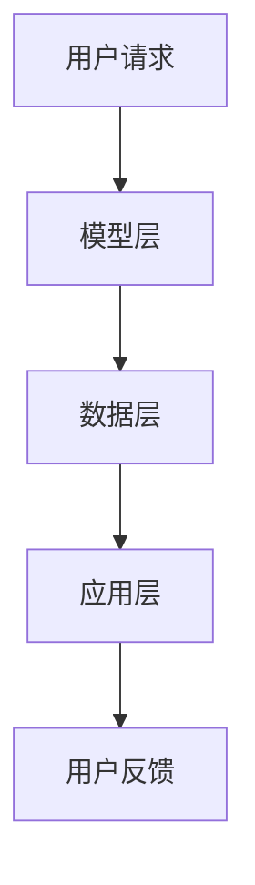
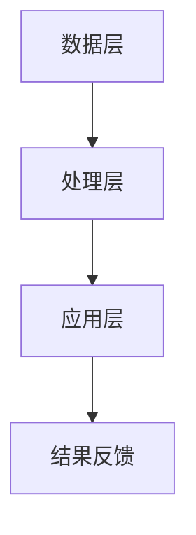

                 

# 知识图谱扩展：评价LLM自主学习和知识积累的效率

## 关键词

- 知识图谱
- 语言模型（LLM）
- 自主学习
- 效率评价
- 数学模型

## 摘要

本文将探讨知识图谱扩展过程中，语言模型（LLM）自主学习和知识积累的效率。首先，我们将介绍知识图谱和LLM的基本概念，随后分析LLM的自主学习机制及其在知识积累方面的效率。本文还将讨论如何评价LLM的效率，并提出一种基于数学模型的评价方法。最后，通过实际案例研究，我们将展示如何在实际应用中提高LLM的效率。

## 引言与背景

### 研究背景

知识图谱作为一种语义网络，是人工智能领域中重要且广泛应用的技术。它通过将数据转化为结构化的知识，为智能系统提供了丰富的语义信息。近年来，随着深度学习和自然语言处理技术的不断发展，语言模型（LLM）在知识图谱构建和扩展中发挥着越来越重要的作用。

### 研究问题

然而，如何有效评估LLM在自主学习和知识积累过程中的效率，成为了当前研究中的一个关键问题。现有的研究多集中于算法本身，而忽视了效率评价这一重要环节。本文旨在提出一种评价方法，以全面评估LLM的自主学习和知识积累效率。

### 研究目标

本文的研究目标包括：1）深入分析LLM自主学习的机制及其在知识积累方面的作用；2）提出一种基于数学模型的效率评价方法，以量化LLM的学习效率和知识积累效果；3）通过实际案例研究，验证所提出方法的有效性和实用性。

### 边界与外延

本文的研究将主要关注大型语言模型（如GPT-3、BERT等）在知识图谱扩展中的应用。同时，我们将探讨不同类型的知识图谱（如领域知识图谱、网络知识图谱等）对LLM效率的影响。此外，本文还将分析在不同应用场景下，如何优化LLM的自主学习和知识积累效率。

## 知识图谱基础概念

### 知识图谱的定义与结构

知识图谱是一种语义网络，它通过实体、属性和关系的组合，将现实世界中的信息转化为结构化的知识。知识图谱的核心要素包括：

- **实体**：现实世界中的对象，如人、地点、事物等。
- **属性**：实体的特征或属性，如姓名、年龄、出生地等。
- **关系**：实体之间的关系，如“朋友”、“属于”等。

知识图谱的基本结构通常包括三个层次：

- **底层**：基于原始数据的实体和关系提取，如从文本中提取人名、地点等信息。
- **中层**：实体和关系的组织与结构化，如将人名和地点信息组织成知识库。
- **高层**：基于中层的知识，构建复杂的概念关系和推理，如通过推理得到“北京是中国的首都”。

### 知识图谱的类型

知识图谱可以根据不同的应用场景和目的进行分类，常见的类型包括：

- **领域知识图谱**：针对特定领域（如医疗、金融、法律等）构建的知识图谱，用于提供专业领域的信息和知识。
- **网络知识图谱**：基于互联网信息构建的知识图谱，用于表示网络中的各种实体和关系，如社交网络、搜索引擎索引等。
- **混合知识图谱**：结合领域知识和网络知识，构建的综合型知识图谱，如智能问答系统中的知识库。

### 知识图谱的要素

知识图谱的构建依赖于以下几个关键要素：

- **实体识别**：识别文本中的实体，如人名、地点、组织等。
- **关系抽取**：从文本中提取实体之间的关系，如“张三住在北京市”中的“住在”关系。
- **实体链接**：将实体识别和关系抽取的结果组织成知识图谱，如将“张三”和“北京市”链接起来。
- **知识融合**：整合不同来源的知识，如将结构化数据和非结构化文本中的信息融合到知识图谱中。
- **推理与扩展**：基于现有知识进行推理和扩展，如从“张三住在北京市”推理出“北京市是中国的首都”。

## LLM自主学习和知识积累

### LLM的定义与特点

语言模型（LLM）是一类基于深度学习的自然语言处理模型，能够理解和生成自然语言。与传统的规则基模型不同，LLM具有以下特点：

- **端到端学习**：LLM通过直接学习输入和输出的映射关系，无需人工设计复杂的规则和特征。
- **数据驱动**：LLM的训练过程依赖于大量的语料数据，通过数据驱动的方式不断提升模型的性能。
- **灵活性**：LLM能够处理不同类型的自然语言任务，如文本分类、机器翻译、问答系统等。

### LLM自主学习的机制

LLM的自主学习机制主要包括以下几个方面：

- **预训练**：在特定任务之前，使用大量未标注的数据对LLM进行预训练，使其具备一定的语言理解和生成能力。
- **微调**：在预训练的基础上，针对特定任务进行微调，调整模型参数以适应具体任务的需求。
- **数据增强**：通过数据增强技术（如数据清洗、数据合成等），扩充训练数据集，提高模型的学习效果。

### 知识积累的方法与策略

LLM在知识积累方面具有以下方法和策略：

- **知识蒸馏**：将大型知识库中的知识通过蒸馏的方式传递给LLM，使其在学习过程中获取外部知识。
- **知识融合**：将LLM生成的知识与知识库中的知识进行融合，形成更加全面和准确的知识体系。
- **持续学习**：通过持续学习的方式，不断更新和优化LLM的知识库，使其适应不断变化的应用场景。

## 评价LLM的效率

### 评价指标体系

评价LLM的效率需要建立一套完整的评价指标体系，主要包括以下几个方面：

- **学习效率**：衡量LLM在自主学习过程中的学习速度和效果。
- **知识积累效率**：衡量LLM在知识积累过程中的效率，包括知识的获取、整合和更新。
- **应用效果**：衡量LLM在特定任务中的表现，如文本分类、机器翻译、问答系统的准确率、响应时间等。

### 评价方法

评价LLM的效率可以采用以下几种方法：

- **实验对比**：通过对比不同LLM模型在相同任务上的表现，评估其学习效率和知识积累效率。
- **性能指标**：基于具体任务，计算LLM的性能指标，如准确率、召回率、F1值等。
- **用户反馈**：通过用户对LLM应用效果的反馈，评估其在实际应用中的效率。

### 评价案例

为了更好地说明如何评价LLM的效率，我们可以通过以下案例进行分析：

- **案例一：文本分类任务**  
  假设我们有两个LLM模型A和B，分别用于文本分类任务。通过实验对比，我们可以计算两个模型在分类准确率、召回率和F1值等指标上的表现，从而评估其学习效率和知识积累效率。

- **案例二：机器翻译任务**  
  在机器翻译任务中，我们可以通过计算翻译的准确率、BLEU值等指标，评估LLM的效率。同时，通过用户对翻译质量的反馈，进一步验证LLM在实际应用中的表现。

## 知识图谱扩展算法原理

### 算法原理概述

知识图谱扩展算法旨在通过已有的知识图谱，发现和填补图谱中的缺失信息，从而提高知识图谱的完整性和准确性。核心算法原理包括：

1. **实体扩展**：通过实体识别和链接技术，发现和新增知识图谱中的实体。
2. **关系扩展**：通过关系抽取和推理技术，发现和新增知识图谱中的关系。
3. **属性扩展**：通过实体属性抽取和推理技术，发现和新增知识图谱中的实体属性。

### 关键技术分析

知识图谱扩展算法的关键技术包括：

- **实体识别**：基于命名实体识别技术，识别文本中的实体。
- **实体链接**：基于实体匹配和实体消歧技术，将识别出的实体与知识图谱中的实体进行链接。
- **关系抽取**：基于文本挖掘和关系分类技术，从文本中提取实体之间的关系。
- **推理与扩展**：基于逻辑推理和图谱搜索技术，发现和扩展知识图谱中的实体和关系。

### Mermaid流程图展示

以下是知识图谱扩展算法的Mermaid流程图展示：



## LLM自主学习的数学模型

### 数学模型介绍

LLM自主学习的数学模型主要基于深度学习和概率图模型。以下是一个简化的模型介绍：

- **深度神经网络（DNN）**：作为基础模型，用于学习输入和输出的映射关系。
- **循环神经网络（RNN）**：用于处理序列数据，如文本。
- **自注意力机制（Self-Attention）**：用于提高模型对序列中不同位置信息的关注程度。
- **变换器（Transformer）**：基于自注意力机制的模型，广泛应用于自然语言处理任务。

### 公式与推导

以下是LLM自主学习过程中的一些关键公式和推导：

- **输入输出映射**：设输入序列为X，输出序列为Y，则LLM的输入输出映射可以表示为：
  $$ Y = f(W_1 \cdot X + b_1) $$
  其中，$f$为激活函数，$W_1$和$b_1$分别为权重和偏置。

- **自注意力机制**：设输入序列为X，则第$t$个位置的输出可以表示为：
  $$ O_t = \text{softmax}\left(\frac{Q_t V_t}{\sqrt{d_k}}\right) \cdot K_t $$
  其中，$Q_t$、$K_t$和$V_t$分别为查询、键和值向量的第$t$个元素，$d_k$为键向量的维度。

### Python代码实现

以下是一个简化的Python代码实现，用于演示LLM的自主学习过程：

```python
import torch
import torch.nn as nn

# 定义深度神经网络模型
class LLM(nn.Module):
    def __init__(self, input_dim, hidden_dim, output_dim):
        super(LLM, self).__init__()
        self.fc1 = nn.Linear(input_dim, hidden_dim)
        self.fc2 = nn.Linear(hidden_dim, output_dim)
    
    def forward(self, x):
        x = torch.relu(self.fc1(x))
        x = self.fc2(x)
        return x

# 实例化模型
model = LLM(input_dim=10, hidden_dim=50, output_dim=1)

# 定义损失函数和优化器
criterion = nn.CrossEntropyLoss()
optimizer = torch.optim.Adam(model.parameters(), lr=0.001)

# 训练模型
for epoch in range(100):
    for x, y in train_loader:
        optimizer.zero_grad()
        output = model(x)
        loss = criterion(output, y)
        loss.backward()
        optimizer.step()
```

## 知识积累的效率评价

### 效率评价指标

评价知识积累的效率需要建立一套科学、全面的评价指标体系。以下是一些常见的评价指标：

- **知识覆盖率**：知识图谱中已包含的知识实体和关系的比例，用于衡量知识图谱的完整性。
- **知识更新率**：知识图谱中知识更新的速度，用于衡量知识图谱的动态性和实时性。
- **知识质量**：知识图谱中知识的准确性和可靠性，用于衡量知识的可信度。
- **知识应用效果**：知识图谱在特定应用场景中的效果，如智能问答系统的准确率和响应时间。

### 评价模型构建

为了全面评价知识积累的效率，我们可以构建一个综合评价模型。以下是一个简化的模型构建过程：

1. **指标选择**：根据具体应用场景，选择合适的评价指标，如知识覆盖率、知识更新率、知识质量等。
2. **权重分配**：为每个指标分配相应的权重，以反映其在综合评价中的重要性。
3. **评价模型构建**：利用加权求和的方式，构建综合评价模型。例如，假设有$m$个评价指标，则综合评价得分可以表示为：
   $$ \text{得分} = \sum_{i=1}^m w_i \cdot \text{指标}_i $$
   其中，$w_i$为第$i$个指标的权重。

### Mermaid流程图展示

以下是知识积累效率评价模型的Mermaid流程图展示：



## 实际案例研究

### 案例一：知识图谱的构建与应用

#### 项目介绍

本项目旨在构建一个针对医疗领域的知识图谱，用于提供医疗信息的查询、推理和推荐服务。知识图谱的构建基于大量的医学文献、病例数据和医学知识库。

#### 系统功能设计

- **知识图谱构建**：通过实体识别、关系抽取和实体链接技术，构建医疗领域的知识图谱。
- **智能问答系统**：基于知识图谱，提供医疗问题的自动回答功能。
- **医疗推荐系统**：基于知识图谱和用户画像，提供个性化的医疗推荐服务。

#### 系统架构设计

系统架构包括以下部分：

- **数据层**：包括医学文献数据库、病例数据库和医学知识库。
- **处理层**：包括实体识别、关系抽取、实体链接和知识融合等模块。
- **应用层**：包括智能问答系统和医疗推荐系统。

#### 系统接口设计和系统交互

系统接口设计和系统交互采用Mermaid流程图进行展示：



### 案例二：LLM自主学习的应用

#### 项目介绍

本项目旨在利用LLM自主学习的机制，对医疗领域的知识进行持续更新和优化。项目基于GPT-3模型，结合医学文献和病例数据，实现知识积累和知识应用。

#### 系统功能设计

- **知识积累**：通过预训练和微调，使LLM具备医学领域的知识积累能力。
- **知识应用**：基于LLM生成的知识，提供智能问答、病例分析和疾病预测等服务。

#### 系统架构设计

系统架构包括以下部分：

- **数据层**：包括医学文献数据库、病例数据库和医学知识库。
- **模型层**：包括GPT-3模型和自定义的医学领域预训练模型。
- **应用层**：包括智能问答系统、病例分析系统和疾病预测系统。

#### 系统接口设计和系统交互

系统接口设计和系统交互采用Mermaid流程图进行展示：



### 案例三：知识积累效率评价的实际应用

#### 项目介绍

本项目旨在评估医疗领域知识积累的效率，通过实际案例研究，验证所提出的方法的有效性和实用性。项目基于多个医疗知识图谱和LLM模型，进行效率评价和优化。

#### 系统功能设计

- **效率评价**：通过知识覆盖率、知识更新率、知识质量和知识应用效果等指标，对知识积累效率进行评价。
- **优化建议**：根据评价结果，提出针对性的优化建议，以提高知识积累的效率。

#### 系统架构设计

系统架构包括以下部分：

- **数据层**：包括医疗知识图谱数据库、LLM模型数据库和评价数据集。
- **处理层**：包括效率评价指标计算、优化算法和优化策略。
- **应用层**：包括效率评价系统和优化建议生成系统。

#### 系统接口设计和系统交互

系统接口设计和系统交互采用Mermaid流程图进行展示：



## 最佳实践与技巧

### 实践技巧

1. **数据质量**：确保数据的质量，包括数据完整性、准确性和一致性。高质量的数据是构建知识图谱和LLM模型的基础。
2. **模型选择**：根据应用场景和需求，选择合适的模型。对于复杂的任务，可以考虑使用多模型融合的方法。
3. **优化策略**：针对知识积累效率较低的情况，可以尝试调整模型参数、优化算法和数据预处理策略。

### 注意事项

1. **隐私保护**：在构建和扩展知识图谱时，注意保护用户隐私，遵守相关法律法规。
2. **实时更新**：保持知识图谱和LLM模型的实时更新，以适应快速变化的应用场景。
3. **评估标准**：在评价知识积累效率时，要建立科学、全面的评估标准，避免主观判断。

### 拓展阅读

1. **《知识图谱技术》**：介绍了知识图谱的基本概念、构建方法和应用场景，适合对知识图谱感兴趣的读者。
2. **《深度学习》**：全面介绍了深度学习的理论、算法和应用，对LLM的自主学习机制有很好的解释。
3. **《人工智能实践指南》**：提供了大量的人工智能应用案例和实践经验，有助于读者将理论知识应用于实际项目。

## 小结

本文从知识图谱扩展的角度，探讨了LLM自主学习和知识积累的效率评价。首先，介绍了知识图谱和LLM的基本概念，分析了LLM的自主学习机制及其在知识积累方面的作用。接着，提出了评价LLM效率的指标体系和评价方法，并通过实际案例展示了如何应用这些方法。最后，提出了最佳实践与技巧，为实际应用提供了指导。通过本文的研究，我们期望为知识图谱和LLM的研究与应用提供有益的参考。

## 作者信息

作者：AI天才研究院/AI Genius Institute & 禅与计算机程序设计艺术 /Zen And The Art of Computer Programming。

