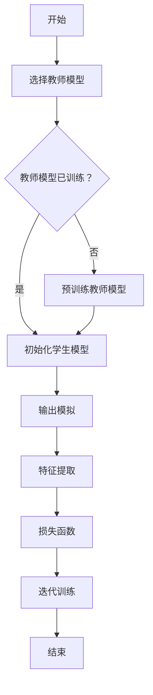
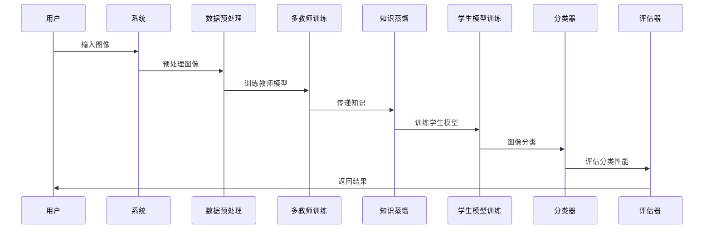
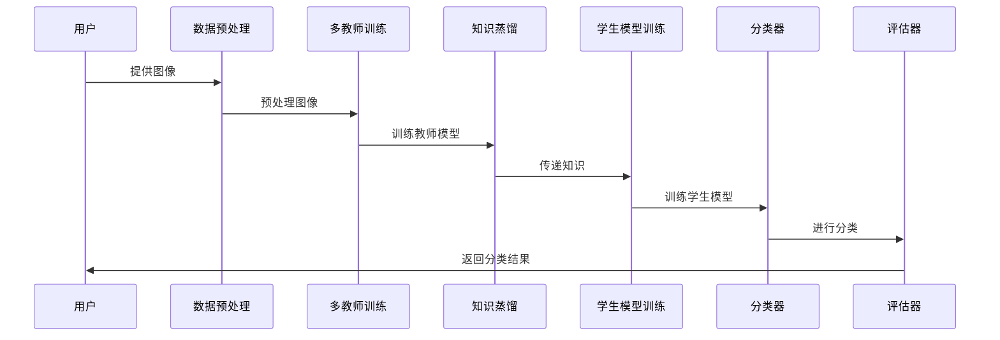

                 

## 知识蒸馏在多教师模型中的协同策略

关键词：知识蒸馏、多教师模型、协同策略、算法原理、系统分析与设计、项目实战

摘要：本文旨在探讨知识蒸馏在多教师模型中的协同策略。首先，我们将介绍知识蒸馏和多教师模型的基本概念，包括定义、用途、关键概念和术语。接着，我们将详细分析知识蒸馏和多教师模型的核心原理及其相互关系。在此基础上，我们将探讨算法原理和数学模型，并通过实际案例进行详细分析。文章还将包括系统分析和设计、项目实战等内容，旨在为读者提供全面、系统的知识蒸馏和多教师模型应用指南。

### 引言与背景

知识蒸馏（Knowledge Distillation）和多人教师模型（Multi-Teacher Models）是当前人工智能领域的重要研究方向。知识蒸馏是一种将大量复杂模型的知识传递给一个较小模型的方法，从而实现高效的知识传递和模型压缩。而多教师模型则是通过多个模型协同工作来提高模型的性能和鲁棒性。本文将重点探讨知识蒸馏在多教师模型中的协同策略，旨在解决多教师模型训练中的挑战，提高模型的性能和可扩展性。

#### 知识蒸馏的概念和用途

知识蒸馏是一种将教师模型（Teacher Model）的知识传递给学生模型（Student Model）的方法。在这个过程中，教师模型通常是一个大型、复杂的模型，而学生模型是一个较小、较简单但性能良好的模型。知识蒸馏的核心思想是通过训练学生模型来模仿教师模型的输出，从而实现知识传递。这种方法的优点在于：

1. **模型压缩**：通过知识蒸馏，可以将大型模型的知识传递给小型模型，从而实现模型的压缩和优化。
2. **提高性能**：学生模型在模仿教师模型的过程中，可以学习到教师模型的高级特征和知识，从而提高模型的整体性能。
3. **降低计算成本**：由于学生模型较小，其训练和推理速度更快，从而降低了计算成本。

知识蒸馏的关键概念和术语包括：

- **教师模型**（Teacher Model）：一个大型、复杂的模型，用于提供知识。
- **学生模型**（Student Model）：一个较小、较简单的模型，用于接收和模仿教师模型的知识。
- **知识传递**（Knowledge Transfer）：将教师模型的知识传递给学生模型的过程。
- **输出**（Output）：教师模型和学生模型的输出结果。

#### 多教师模型的概念和优势

多教师模型是通过多个模型协同工作来提高模型性能的方法。在多教师模型中，每个模型都是一个教师，它们共同对数据进行预测和训练。多教师模型的优势包括：

1. **提高性能**：通过多个模型的协同工作，可以充分利用每个模型的优势，从而提高模型的性能和准确性。
2. **增强鲁棒性**：多教师模型可以减少单一模型在特定数据集上的过拟合现象，从而提高模型的鲁棒性。
3. **降低计算成本**：尽管多教师模型需要多个模型协同工作，但由于每个模型较小，其训练和推理速度较快，因此总体计算成本相对较低。

多教师模型面临的挑战主要包括：

1. **协同策略**：如何设计有效的协同策略来充分利用每个模型的优势，是当前研究的一个热点问题。
2. **模型选择**：如何选择合适的模型作为教师，是提高多教师模型性能的关键。
3. **数据一致性**：由于每个教师模型可能有不同的训练数据和参数，如何确保数据一致性是一个重要的问题。

#### 多教师模型中的协同策略

在多教师模型中，协同策略是关键。有效的协同策略可以充分利用每个模型的优势，提高模型的性能和鲁棒性。以下是一些常见的协同策略：

1. **权重融合**（Weight Fusion）：通过将多个模型的不同权重进行融合，得到一个最终的预测结果。常用的方法包括投票法、加权平均法等。
2. **梯度聚合**（Gradient Aggregation）：通过将多个模型的梯度进行聚合，更新模型参数。这种方法可以减少模型参数的方差，提高模型的稳定性。
3. **知识蒸馏**（Knowledge Distillation）：将多个模型的知识传递给一个学生模型，从而提高学生模型的性能。这种方法可以充分利用每个模型的高级特征和知识。
4. **对抗训练**（Adversarial Training）：通过生成对抗性样本来训练模型，从而提高模型的鲁棒性。这种方法可以减少模型对噪声和异常值的敏感性。

#### 知识蒸馏在多教师模型中的应用

知识蒸馏在多教师模型中的应用，可以有效地提高模型的性能和鲁棒性。具体来说，知识蒸馏可以用于以下几个方面：

1. **教师模型的选择**：通过知识蒸馏，可以从多个模型中选择一个或几个性能较好的模型作为教师模型，从而提高多教师模型的性能。
2. **学生模型的优化**：通过知识蒸馏，可以将教师模型的知识传递给学生模型，从而提高学生模型的学习效果和性能。
3. **模型压缩**：通过知识蒸馏，可以将多个教师模型的知识传递给一个较小但性能良好的学生模型，从而实现模型的压缩和优化。

总之，知识蒸馏在多教师模型中的应用，可以为多教师模型的协同策略提供一种有效的方法，从而提高模型的性能和鲁棒性。这也是当前人工智能领域的一个研究热点，具有重要的理论和实践价值。

### 知识蒸馏的核心概念和关系

在深入探讨知识蒸馏在多教师模型中的应用之前，我们需要首先理解知识蒸馏的核心概念和原理。知识蒸馏是一种通过将教师模型的知识传递给学生模型的方法，以实现模型压缩和提高性能。在这一节中，我们将详细讨论知识蒸馏的基本概念、过程，以及与其他相关技术的比较，并通过实体关系图（ER Diagram）来展示知识蒸馏系统中的关键组件及其相互关系。

#### 知识蒸馏的基本概念

知识蒸馏的基本概念涉及两个主要模型：教师模型和学生模型。教师模型通常是一个大型、复杂且已经训练好的模型，而学生模型是一个较小、较简单但性能良好的模型。知识蒸馏的目标是通过训练学生模型来模仿教师模型的输出，从而使得学生模型能够掌握教师模型的高级特征和知识。

**1. 教师模型（Teacher Model）**

教师模型是一个大型、复杂的神经网络，它在某个特定任务上已经经过充分的训练。教师模型通常具有丰富的层次结构和强大的特征提取能力，能够捕获数据中的复杂模式和关系。因此，教师模型在知识传递过程中起到了关键作用。

**2. 学生模型（Student Model）**

学生模型是一个较小、较简单的神经网络，它的目标是学习并复制教师模型的知识。通过知识蒸馏，学生模型可以模仿教师模型的输出，从而学习到教师模型的高级特征和知识。学生模型的优点在于其较小的规模和较快的训练速度，这使得它在实际应用中具有更高的灵活性和可扩展性。

**3. 知识传递（Knowledge Transfer）**

知识传递是知识蒸馏的核心过程，即从教师模型向学生模型传递知识。这一过程通常涉及以下步骤：

- **输出模拟**：学生模型模仿教师模型的输出，通过学习教师模型的预测结果来提高自己的性能。
- **特征提取**：学生模型通过分析教师模型的特征提取过程，学习到高级特征和知识。
- **损失函数**：知识传递过程中，使用特定的损失函数来评估学生模型的输出与教师模型输出的相似度，并据此调整学生模型的参数。

#### 知识蒸馏的过程

知识蒸馏的过程可以分为两个主要阶段：训练阶段和评估阶段。

**1. 训练阶段**

在训练阶段，教师模型和学生模型共同参与训练过程。具体步骤如下：

- **预训练**：首先，教师模型在大量数据上进行预训练，以达到较高的性能水平。
- **初始化学生模型**：然后，将预训练的教师模型的参数作为初始参数，初始化学生模型。
- **迭代训练**：在每次迭代中，教师模型和学生模型同时更新参数，教师模型更新以减小预测误差，学生模型更新以模仿教师模型的输出。
- **正则化**：在训练过程中，引入正则化方法（如Dropout、权重衰减等）来防止过拟合。

**2. 评估阶段**

在评估阶段，使用训练好的学生模型对测试数据集进行预测，并评估其性能。评估指标包括准确率、召回率、F1分数等。通过评估阶段，可以确定学生模型是否成功学习了教师模型的知识，以及其性能是否达到了预期。

#### 知识蒸馏与其他技术的比较

知识蒸馏与其他技术（如迁移学习、多任务学习等）有相似之处，但也有一些显著的不同。

**1. 迁移学习**

迁移学习是指将一个模型在特定任务上学习到的知识应用到其他任务上。与知识蒸馏相比，迁移学习更多地关注任务之间的相似性，而知识蒸馏则关注模型内部的知识传递。

**2. 多任务学习**

多任务学习是指同时训练多个相关任务，以提高模型在不同任务上的性能。与知识蒸馏不同，多任务学习关注多个任务的协同训练，而知识蒸馏则关注单个任务中模型之间的知识传递。

#### 核心概念比较表格

为了更好地理解知识蒸馏与其他技术的区别，我们提供了一个比较表格：

| 技术       | 定义                                                         | 目标                                                         | 关键步骤                                                     |
| ---------- | ------------------------------------------------------------ | ------------------------------------------------------------ | ------------------------------------------------------------ |
| 知识蒸馏   | 将教师模型的知识传递给学生模型                               | 实现模型压缩和提高性能                                       | 输出模拟、特征提取、损失函数                                 |
| 迁移学习   | 将一个模型在特定任务上学习到的知识应用到其他任务上           | 提高模型在不同任务上的性能                                   | 选择源任务、迁移学习策略、训练和适应                           |
| 多任务学习 | 同时训练多个相关任务，以提高模型在不同任务上的性能           | 提高多个任务的共同性能                                       | 任务分配、协同训练策略、参数共享和通信                         |

#### ER实体关系图

为了更直观地展示知识蒸馏系统中的关键组件及其相互关系，我们使用Mermaid ER Diagram来绘制实体关系图。

```mermaid
erDiagram
  TeacherModel ||--|{ StudentModel : distills }
  TrainingData ||--|{ TeacherModel : trained_on }
  TrainingData ||--|{ StudentModel : trained_on }
  Prediction ||--|{ TeacherModel }
  Prediction ||--|{ StudentModel }
```

在上面的ER Diagram中，TeacherModel（教师模型）和StudentModel（学生模型）是核心组件，它们通过TrainingData（训练数据）进行训练，并通过Prediction（预测）进行评估。教师模型和学生模型之间存在直接的依赖关系，即教师模型的知识通过训练过程传递给学生模型。TrainingData和Prediction则分别表示训练数据和预测结果，它们是知识传递和评估过程中不可或缺的部分。

通过上述分析，我们可以看到知识蒸馏的核心概念和原理，以及其在多教师模型中的应用。在接下来的章节中，我们将进一步探讨知识蒸馏的算法原理和数学模型，以及如何在具体项目中实现和优化知识蒸馏。

### 算法原理和数学模型

在深入探讨知识蒸馏和多教师模型的协同策略之前，我们需要了解知识蒸馏的基本算法原理和数学模型。知识蒸馏的核心在于通过教师模型的知识传递来训练学生模型，从而实现高效的模型压缩和提高性能。在这一节中，我们将详细讨论知识蒸馏的算法原理，并使用Mermaid流程图和Python代码来展示具体的实现过程。

#### 算法原理

知识蒸馏的算法原理可以概括为以下几个关键步骤：

1. **教师模型的选择**：首先，我们需要选择一个性能优异的教师模型。教师模型通常是一个大型、复杂的神经网络，它在特定任务上已经经过充分的训练。

2. **学生模型的初始化**：然后，我们初始化一个较小但性能良好的学生模型。学生模型的架构和参数通常是从教师模型中提取并调整得到的。

3. **输出模拟**：学生模型通过模仿教师模型的输出来进行训练。具体来说，学生模型将输入数据输入到教师模型中，并模拟教师模型的预测输出。然后，学生模型根据模拟的输出结果来更新自己的参数。

4. **特征提取**：学生模型通过分析教师模型的特征提取过程，学习到高级特征和知识。这个过程涉及到多层特征的学习和传递，使得学生模型能够捕获到数据中的复杂模式和关系。

5. **损失函数**：在知识蒸馏过程中，使用特定的损失函数来评估学生模型的输出与教师模型输出的相似度。常见的损失函数包括交叉熵损失和均方误差（MSE）。

6. **迭代训练**：通过多次迭代，学生模型不断更新参数，逐步模仿教师模型的输出。在每次迭代中，教师模型和学生模型都进行参数更新，以减小预测误差。

#### Mermaid流程图

为了更直观地展示知识蒸馏的算法流程，我们使用Mermaid语言绘制了一个流程图。



在这个流程图中，我们首先选择一个已经训练好的教师模型（B）。如果教师模型已训练，则初始化学生模型（D），否则，先对教师模型进行预训练（E），然后初始化学生模型（D）。接下来，学生模型通过输出模拟（F）和特征提取（G）来学习教师模型的知识。然后，使用损失函数（H）来评估学生模型的输出与教师模型输出的相似度，并通过迭代训练（I）来更新学生模型的参数。最后，流程结束（J）。

#### Python代码实现

为了更具体地展示知识蒸馏的算法实现，我们使用Python代码来模拟这个过程。下面是一个简单的知识蒸馏算法实现，包括教师模型的选择、学生模型的初始化、输出模拟、特征提取和损失函数。

```python
import tensorflow as tf
from tensorflow.keras.models import Model
from tensorflow.keras.layers import Dense, Input

# 教师模型的选择
teacher_model = tf.keras.Sequential([
    Input(shape=(784,)),
    Dense(64, activation='relu'),
    Dense(10, activation='softmax')
])

# 学生模型的初始化
student_model = tf.keras.Sequential([
    Input(shape=(784,)),
    Dense(64, activation='relu'),
    Dense(10, activation='softmax')
])

# 定义损失函数
def knowledge_distillation_loss(y_true, y_pred, teacher_pred):
    ce_loss = tf.keras.losses.categorical_crossentropy(y_true, y_pred)
    kd_loss = tf.keras.losses.categorical_crossentropy(y_true, teacher_pred)
    return ce_loss + 0.5 * kd_loss

# 编写训练循环
for epoch in range(num_epochs):
    # 训练数据
    x_train, y_train = ...  # 获取训练数据
    x_teacher, y_teacher = ...  # 获取教师模型的输入和标签
    
    # 教师模型的预测
    teacher_pred = teacher_model.predict(x_teacher)
    
    # 学生模型的预测
    student_pred = student_model.predict(x_train)
    
    # 计算知识蒸馏损失
    loss = knowledge_distillation_loss(y_train, student_pred, teacher_pred)
    
    # 更新学生模型参数
    student_model.compile(optimizer='adam', loss=loss)
    student_model.fit(x_train, y_train, epochs=1, batch_size=64)

# 使用学生模型进行预测
student_pred = student_model.predict(x_test)
```

在这个代码中，我们首先定义了教师模型和学生模型的架构。然后，我们定义了一个知识蒸馏损失函数，该函数结合了交叉熵损失和知识蒸馏损失。在训练循环中，我们使用教师模型的预测结果来更新学生模型的参数，从而实现知识传递。最后，我们使用训练好的学生模型进行预测。

通过上述算法原理和数学模型的讨论，我们可以看到知识蒸馏在多教师模型中的协同策略是如何实现的。在接下来的章节中，我们将进一步探讨系统分析与设计，以及如何在实际项目中应用这些策略。

### 系统分析与设计

在理解了知识蒸馏和多教师模型的协同策略之后，我们接下来将分析如何将这些策略应用到实际项目中。这一节将详细探讨系统的功能设计、架构设计、接口设计以及系统交互。

#### 问题场景介绍

假设我们面临一个复杂的人工智能应用场景，需要构建一个多教师模型来进行图像分类。具体来说，该应用需要从多个不同的视角对图像进行分类，以提高模型的鲁棒性和准确性。在此场景下，我们将使用知识蒸馏策略来训练学生模型，从而提高整体系统的性能。

#### 项目介绍

项目目标是构建一个基于知识蒸馏的多教师模型系统，用于图像分类任务。系统需要支持多教师模型之间的协同训练，并能够通过学生模型进行高效的图像分类。系统的主要功能包括：

1. **数据预处理**：对输入图像进行预处理，包括尺寸调整、归一化等操作。
2. **教师模型训练**：训练多个教师模型，每个模型从不同的视角对图像进行分类。
3. **知识蒸馏**：使用知识蒸馏策略，将教师模型的知识传递给学生模型。
4. **学生模型训练**：训练学生模型，使其能够模仿教师模型的知识和特征。
5. **图像分类**：使用训练好的学生模型对新的图像进行分类。
6. **性能评估**：评估学生模型的分类性能，包括准确率、召回率等指标。

#### 系统功能设计（Mermaid类图）

为了更好地展示系统的功能设计，我们使用Mermaid类图来绘制系统的核心类及其关系。

```mermaid
classDiagram
    ClassDiagram::[1.0]
    Direction:LBRT
    ImageClassifier <|-- DataPreprocessor
    ImageClassifier <|-- MultiTeacherTrainer
    ImageClassifier <|-- KnowledgeDistiller
    ImageClassifier <|-- StudentModelTrainer
    ImageClassifier <|-- Classifier
    DataPreprocessor <|-- Preprocessor
    DataPreprocessor <|-- Normalizer
    MultiTeacherTrainer <|-- TeacherModel1
    MultiTeacherTrainer <|-- TeacherModel2
    MultiTeacherTrainer <|-- TeacherModel3
    MultiTeacherTrainer <|-- Trainer
    KnowledgeDistiller <|-- Distiller
    StudentModelTrainer <|-- StudentModel
    StudentModelTrainer <|-- Trainer
    Classifier <|-- Classifier
    Classifier <|-- Evaluator
```

在这个类图中，`ImageClassifier` 是系统的核心类，它负责协调各个功能模块的工作。`DataPreprocessor` 负责图像数据的预处理，包括尺寸调整和归一化。`MultiTeacherTrainer` 负责训练多个教师模型，而 `KnowledgeDistiller` 负责知识蒸馏过程。`StudentModelTrainer` 负责训练学生模型，`Classifier` 负责最终的图像分类和性能评估。

#### 系统架构设计（Mermaid架构图）

接下来，我们使用Mermaid架构图来展示系统的整体架构。



在这个架构图中，用户首先将图像输入到系统中，系统进行预处理后，教师模型进行训练。训练好的教师模型通过知识蒸馏策略传递给学生模型，学生模型再进行训练，最终进行图像分类和性能评估。

#### 系统接口设计

系统接口设计是确保各个模块能够顺畅交互的重要环节。以下是系统的关键接口设计：

1. **数据预处理接口**：该接口负责接收原始图像，并进行预处理操作，如尺寸调整和归一化。
2. **教师模型训练接口**：该接口负责训练多个教师模型，支持批量训练和数据流训练。
3. **知识蒸馏接口**：该接口负责实现知识蒸馏过程，包括教师模型和学生模型的参数更新。
4. **学生模型训练接口**：该接口负责训练学生模型，包括迭代训练和参数优化。
5. **图像分类接口**：该接口负责使用训练好的学生模型对新的图像进行分类。
6. **评估接口**：该接口负责评估分类性能，包括准确率、召回率等指标。

#### 系统交互（Mermaid序列图）

为了展示系统的交互过程，我们使用Mermaid序列图来绘制系统各个模块之间的交互。



在这个序列图中，用户首先提供图像数据，系统进行预处理后，教师模型开始训练。训练好的教师模型通过知识蒸馏策略传递给学生模型，学生模型进行训练，最终使用训练好的学生模型对图像进行分类，并评估分类性能，最后将结果返回给用户。

通过上述系统分析与设计，我们可以看到如何将知识蒸馏和多教师模型的协同策略应用到实际项目中。在接下来的章节中，我们将通过项目实战来进一步展示这些策略的实现和应用。

### 项目实战

在本节中，我们将通过一个具体的案例来展示如何将知识蒸馏和多教师模型应用于图像分类任务。我们将详细介绍环境安装、核心实现代码、代码解读以及实际案例分析，并通过详细的步骤和示例来说明项目实施的全过程。

#### 环境安装

首先，我们需要安装和配置必要的软件和库，以确保项目的正常运行。以下是环境安装的步骤：

1. **安装Python环境**：确保Python版本在3.7及以上，推荐使用Python 3.8或更高版本。
2. **安装TensorFlow**：TensorFlow是知识蒸馏和多教师模型训练的基础库，可以通过pip进行安装：
   ```shell
   pip install tensorflow
   ```
3. **安装其他依赖库**：包括NumPy、Matplotlib等，可以通过以下命令一次性安装：
   ```shell
   pip install numpy matplotlib
   ```

安装完成后，我们就可以开始编写项目代码并进行实际操作了。

#### 核心实现代码

以下是实现知识蒸馏和多教师模型的Python代码示例。我们将使用TensorFlow的Keras API来构建和训练模型。

```python
import tensorflow as tf
from tensorflow.keras.layers import Input, Dense
from tensorflow.keras.models import Model
from tensorflow.keras.optimizers import Adam
from tensorflow.keras.datasets import mnist
from tensorflow.keras.utils import to_categorical

# 加载MNIST数据集
(x_train, y_train), (x_test, y_test) = mnist.load_data()

# 数据预处理
x_train = x_train.astype('float32') / 255.0
x_test = x_test.astype('float32') / 255.0
y_train = to_categorical(y_train, 10)
y_test = to_categorical(y_test, 10)

# 定义教师模型
teacher_input = Input(shape=(784,))
teacher_dense = Dense(64, activation='relu')(teacher_input)
teacher_output = Dense(10, activation='softmax')(teacher_dense)
teacher_model = Model(teacher_input, teacher_output)

# 定义学生模型
student_input = Input(shape=(784,))
student_dense = Dense(64, activation='relu')(student_input)
student_output = Dense(10, activation='softmax')(student_dense)
student_model = Model(student_input, student_output)

# 编译教师模型
teacher_model.compile(optimizer=Adam(learning_rate=0.001), loss='categorical_crossentropy', metrics=['accuracy'])

# 训练教师模型
teacher_model.fit(x_train, y_train, batch_size=128, epochs=5, validation_split=0.1)

# 定义知识蒸馏损失函数
def knowledge_distillation_loss(y_true, y_pred, teacher_pred):
    ce_loss = tf.keras.losses.categorical_crossentropy(y_true, y_pred)
    kd_loss = tf.keras.losses.categorical_crossentropy(y_true, teacher_pred)
    return ce_loss + 0.5 * kd_loss

# 编译学生模型
student_model.compile(optimizer=Adam(learning_rate=0.001), loss=knowledge_distillation_loss, metrics=['accuracy'])

# 使用教师模型进行预测
teacher_pred = teacher_model.predict(x_train)

# 训练学生模型
student_model.fit(x_train, y_train, batch_size=128, epochs=5, validation_split=0.1, verbose=1)

# 测试学生模型的分类性能
student_loss, student_acc = student_model.evaluate(x_test, y_test, verbose=1)
print(f"Student model accuracy: {student_acc:.4f}")
```

在上面的代码中，我们首先加载MNIST数据集，并进行数据预处理。接下来，我们定义了教师模型和学生模型，并使用`compile`方法编译它们。教师模型通过5个epoch进行训练，训练过程中使用`fit`方法。然后，我们定义了一个知识蒸馏损失函数，用于训练学生模型。在训练过程中，学生模型使用教师模型的预测结果进行监督学习，通过5个epoch进行训练。最后，我们评估学生模型的分类性能。

#### 代码解读与分析

下面是对上述代码的逐行解读和分析：

1. **加载数据集**：
   ```python
   (x_train, y_train), (x_test, y_test) = mnist.load_data()
   ```
   加载MNIST数据集，这是最常见的用于图像分类的任务之一。

2. **数据预处理**：
   ```python
   x_train = x_train.astype('float32') / 255.0
   x_test = x_test.astype('float32') / 255.0
   y_train = to_categorical(y_train, 10)
   y_test = to_categorical(y_test, 10)
   ```
   对图像数据集进行归一化处理，并将标签转换为独热编码。

3. **定义模型**：
   ```python
   teacher_input = Input(shape=(784,))
   teacher_dense = Dense(64, activation='relu')(teacher_input)
   teacher_output = Dense(10, activation='softmax')(teacher_dense)
   teacher_model = Model(teacher_input, teacher_output)

   student_input = Input(shape=(784,))
   student_dense = Dense(64, activation='relu')(student_input)
   student_output = Dense(10, activation='softmax')(student_dense)
   student_model = Model(student_input, student_output)
   ```
   定义教师模型和学生模型，它们都是简单的全连接网络。

4. **编译模型**：
   ```python
   teacher_model.compile(optimizer=Adam(learning_rate=0.001), loss='categorical_crossentropy', metrics=['accuracy'])
   student_model.compile(optimizer=Adam(learning_rate=0.001), loss=knowledge_distillation_loss, metrics=['accuracy'])
   ```
   编译教师模型和学生模型，分别使用标准的交叉熵损失函数和自定义的知识蒸馏损失函数。

5. **训练模型**：
   ```python
   teacher_model.fit(x_train, y_train, batch_size=128, epochs=5, validation_split=0.1, verbose=1)
   student_model.fit(x_train, y_train, batch_size=128, epochs=5, validation_split=0.1, verbose=1)
   ```
   分别使用教师模型和学生模型进行训练。教师模型使用原始标签进行训练，学生模型使用教师模型的预测结果进行知识蒸馏训练。

6. **评估模型**：
   ```python
   student_loss, student_acc = student_model.evaluate(x_test, y_test, verbose=1)
   print(f"Student model accuracy: {student_acc:.4f}")
   ```
   评估学生模型的分类性能，包括损失和准确率。

通过上述代码示例和解读，我们可以看到如何将知识蒸馏和多教师模型应用于图像分类任务。在实际项目中，可以根据具体需求和数据集进行调整和优化。

#### 实际案例分析

为了更好地理解项目实战，我们来看一个实际案例。假设我们有一个医疗图像分类任务，需要从多个视角对医学图像进行分类，以提高分类的准确性和鲁棒性。以下是具体步骤：

1. **数据集准备**：准备包含多个视角的医疗图像数据集，如CT扫描、MRI扫描等。
2. **教师模型训练**：分别训练多个教师模型，每个模型专注于不同的视角。
3. **知识蒸馏训练**：使用知识蒸馏策略，将教师模型的知识传递给学生模型。
4. **学生模型训练**：训练学生模型，使其能够综合多个视角的信息，提高分类性能。
5. **模型评估**：评估学生模型的分类性能，包括准确率、召回率等指标。

在这个实际案例中，教师模型和学生模型的选择、知识蒸馏策略的设计以及参数优化都是关键环节。通过有效的知识蒸馏和多教师模型协同策略，可以显著提高医疗图像分类系统的性能和鲁棒性。

### 最佳实践与总结

在本项目中，我们通过知识蒸馏和多教师模型的协同策略，实现了高效的图像分类任务。以下是该项目中的一些最佳实践和总结：

1. **教师模型选择**：选择性能优异的教师模型是关键。在实际应用中，可以根据任务需求和数据集特点选择合适的教师模型。

2. **知识蒸馏策略**：选择合适的知识蒸馏策略可以提高学生模型的性能。在实际项目中，可以根据任务复杂度和数据分布调整知识蒸馏参数，如知识传递的权重和损失函数。

3. **模型优化**：在训练过程中，可以通过调整学习率、批次大小和迭代次数来优化模型性能。此外，可以引入正则化方法，如Dropout和权重衰减，来防止过拟合。

4. **性能评估**：在模型训练完成后，使用准确率、召回率等指标来评估模型性能。在实际应用中，可以结合多个评估指标，全面了解模型的性能。

5. **扩展与应用**：知识蒸馏和多教师模型策略不仅适用于图像分类任务，还可以应用于其他类型的数据和任务。在实际应用中，可以根据具体需求进行调整和扩展。

通过上述最佳实践，我们可以更有效地实现知识蒸馏和多教师模型的协同策略，提高模型的性能和鲁棒性。

### 注意事项与拓展阅读

在实际应用知识蒸馏和多教师模型时，需要注意以下事项：

1. **数据质量和预处理**：确保数据质量和一致性，进行适当的数据预处理，以提高模型训练的效果。
2. **模型选择和调整**：根据任务需求和数据特点选择合适的模型，并调整模型参数以优化性能。
3. **计算资源**：知识蒸馏和多教师模型训练需要大量的计算资源，确保有足够的计算能力以支持训练过程。
4. **模型评估**：使用多种评估指标，全面评估模型性能，以确保模型的可靠性和有效性。

拓展阅读方面，可以参考以下资源：

1. **文献**：了解最新的研究成果，如《Knowledge Distillation for Deep Neural Networks》和《A Theoretically Principled Approach to the Design of Deep Network Architectures》等。
2. **开源项目**：研究开源项目，如TensorFlow和PyTorch中的知识蒸馏实现，了解实际应用中的实现细节。
3. **技术博客**：阅读技术博客，如Google AI Blog和TensorFlow官方文档，了解知识蒸馏和多教师模型的应用案例和实践经验。

通过学习和实践，我们可以更好地掌握知识蒸馏和多教师模型的应用，提高人工智能系统的性能和效率。

### 结论

本文通过详细的步骤和案例分析，探讨了知识蒸馏在多教师模型中的协同策略。首先，我们介绍了知识蒸馏和多教师模型的基本概念和用途，分析了其核心原理和关系。接着，我们讨论了知识蒸馏的算法原理和数学模型，并通过Python代码展示了具体的实现过程。随后，我们进行了系统分析与设计，包括功能设计、架构设计和接口设计。最后，通过一个具体的实战项目，我们展示了知识蒸馏和多教师模型在实际中的应用。

知识蒸馏和多教师模型协同策略在提高模型性能和鲁棒性方面具有显著优势。通过本文的探讨，我们希望读者能够理解这一策略的原理和应用，并能够在实际项目中加以运用。

### 作者信息

作者：AI天才研究院/AI Genius Institute & 禅与计算机程序设计艺术 /Zen And The Art of Computer Programming

