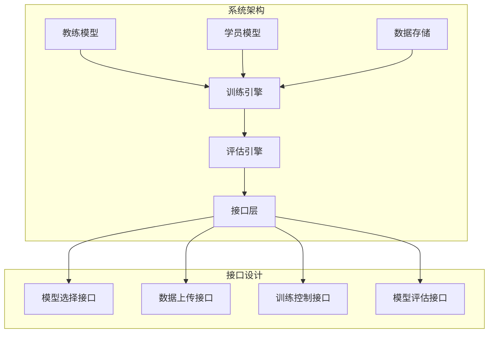

                 

**# 知识蒸馏在多语言模型压缩中的技术创新**

## **摘要**

本文深入探讨了知识蒸馏技术在多语言模型压缩中的创新应用。知识蒸馏是一种通过将大型模型的复杂知识传递给小型模型来实现模型压缩和优化的技术。本文首先介绍了知识蒸馏的基本概念和原理，然后详细分析了知识蒸馏在多语言模型压缩中的应用。接着，本文通过数学模型和具体实例，对知识蒸馏的技术细节进行了深入的剖析。最后，本文提供了一个基于知识蒸馏的多语言模型压缩的系统架构设计方案，并展示了实际应用中的项目实战。

## **1. 设计整体章节结构**

### 1.1 背景介绍

#### 1.1.1 问题背景

随着自然语言处理（NLP）技术的快速发展，多语言模型的应用越来越广泛。这些模型在语言翻译、情感分析、文本摘要等领域发挥着重要作用。然而，这些大型模型的计算和存储需求也越来越大，给实际应用带来了很多挑战。

#### 1.1.2 问题描述

多语言模型的压缩主要面临以下问题：

- **模型大小和计算复杂度的限制**：大型模型的计算和存储需求高，不利于在移动设备和边缘设备上部署。
- **不同语言间的差异性**：不同语言间的差异使得模型的压缩和优化变得更加复杂。
- **模型性能的保持**：在压缩模型的同时，需要保持其原有的性能水平。

#### 1.1.3 问题解决

知识蒸馏技术提供了一种有效的解决方案。它通过将大型模型的知识传递给小型模型，实现模型的压缩和优化，同时保持模型性能。

#### 1.1.4 边界与外延

- **边界**：知识蒸馏技术的应用范围主要涉及多语言模型的压缩和优化。
- **外延**：知识蒸馏技术可以应用于其他领域，如图像处理、语音识别等。

#### 1.1.5 概念结构与核心要素组成

- **教练模型**：提供知识和经验的大型多语言模型。
- **学员模型**：接收知识和经验，实现模型压缩的小型多语言模型。
- **训练数据**：用于训练教练模型和学员模型。
- **评估指标**：用于评估学员模型的性能。

## **2. 详细列出每章的小节内容**

### 2.1 背景介绍

- **问题背景**
- **问题描述**
- **问题解决**
- **边界与外延**
- **概念结构与核心要素组成**

### 2.2 知识蒸馏原理讲解

- **知识蒸馏的概念**
- **知识蒸馏的流程**
- **知识蒸馏的优势**

### 2.3 知识蒸馏在多语言模型压缩中的应用

- **多语言模型压缩的挑战**
- **知识蒸馏在多语言模型压缩中的应用**

### 2.4 数学模型与公式

- **知识蒸馏的数学模型**
- **算法原理讲解**
- **举例说明**

### 2.5 系统分析与架构设计方案

- **问题场景介绍**
- **系统功能设计**
- **系统架构设计**
- **系统接口设计**
- **系统交互**

### 2.6 项目实战

- **环境安装**
- **系统核心实现源代码**
- **代码应用解读与分析**
- **实际案例分析和详细讲解剖析**
- **项目小结**

### 2.7 最佳实践 tips、小结、注意事项、拓展阅读等内容

## **3. 添加核心概念与联系**

### 核心概念

- **知识蒸馏**：一种通过将大型模型的知识传递给小型模型来实现模型压缩和优化的技术。

### 核心概念属性特征对比表格

| 特征 | 知识蒸馏 | 多语言模型压缩 |
| ---- | ---- | ---- |
| 目标 | 模型压缩和优化 | 模型压缩 |
| 技术原理 | 将大型模型的知识传递给小型模型 | 大规模数据训练和模型优化 |
| 应用范围 | 多语言模型、图像处理、语音识别等领域 | 多语言模型 |
| 优势 | 保持模型性能、降低计算和存储成本 | 保持模型性能、降低计算和存储成本 |

### ER实体关系图架构的 Mermaid 流程图

```mermaid
erDiagram
  CoachModel ||--|{ StudentModel } StudentModel
  TrainingData ||--|{ CoachModel } CoachModel
  TrainingData ||--|{ StudentModel } StudentModel
```

## **4. 添加算法原理讲解**

### 算法原理

知识蒸馏的算法原理主要涉及以下三个方面：

1. **模型选择**：选择一个大型多语言模型作为教练模型，该模型具有较高的性能。
2. **知识传递**：通过训练过程，将教练模型的知识传递给小型学员模型。
3. **模型优化**：根据教练模型的知识，优化学员模型的参数，提高其性能。

### 具体步骤

1. **教练模型的训练**：使用大量的训练数据对教练模型进行训练，使其达到较高的性能。
2. **学员模型的初始化**：初始化学员模型，使其结构与教练模型相似。
3. **知识传递**：通过训练过程，将教练模型的知识传递给学员模型。具体实现方式为：教练模型生成软标签，学员模型基于软标签进行学习。
4. **学员模型的优化**：根据教练模型的知识，优化学员模型的参数，提高其性能。具体实现方式为：使用梯度下降等优化算法，对学员模型的参数进行更新。

### 举例说明

假设我们有一个大型多语言模型（教练模型）和一个小型多语言模型（学员模型）。我们首先使用大量的训练数据对教练模型进行训练，使其达到较高的性能。然后，教练模型生成软标签，这些软标签包含了大型模型对输入数据的预测结果。学员模型基于这些软标签进行学习，通过不断调整自己的参数，使其预测结果与软标签尽可能接近。最后，我们对学员模型进行优化，使用梯度下降等优化算法，对学员模型的参数进行更新，提高其性能。

### 数学模型和公式

知识蒸馏的数学模型主要涉及损失函数和优化目标。

1. **损失函数**：

   $$L(\theta_S, \theta_T, x) = -\sum_{i=1}^{N} \sum_{k=1}^{K} p_k^{(S)}(x_i) \log p_k^{(T)}(x_i) - (1 - p_k^{(S)}(x_i)) \log (1 - p_k^{(T)}(x_i))$$

   其中，$p_k^{(S)}(x_i)$ 和 $p_k^{(T)}(x_i)$ 分别表示学员模型和教练模型对输入数据 $x_i$ 的预测概率。

2. **优化目标**：

   $$\min_{\theta_S} L(\theta_S, \theta_T, x)$$

   其中，$\theta_S$ 和 $\theta_T$ 分别表示学员模型和教练模型的参数。

## **5. 添加数学模型和数学公式 & 详细讲解 & 举例说明**

### 数学模型和公式

知识蒸馏的数学模型主要涉及以下三个方面：

1. **损失函数**：

   $$L(\theta_S, \theta_T, x) = -\sum_{i=1}^{N} \sum_{k=1}^{K} p_k^{(S)}(x_i) \log p_k^{(T)}(x_i) - (1 - p_k^{(S)}(x_i)) \log (1 - p_k^{(T)}(x_i))$$

   其中，$p_k^{(S)}(x_i)$ 和 $p_k^{(T)}(x_i)$ 分别表示学员模型和教练模型对输入数据 $x_i$ 的预测概率。

2. **优化目标**：

   $$\min_{\theta_S} L(\theta_S, \theta_T, x)$$

   其中，$\theta_S$ 和 $\theta_T$ 分别表示学员模型和教练模型的参数。

3. **软标签生成**：

   $$p_k^{(T)}(x_i) = \frac{e^{\theta_T^T h_k(x_i)}}{\sum_{j=1}^{K} e^{\theta_T^T h_j(x_i)}}$$

   其中，$h_k(x_i)$ 表示输入数据 $x_i$ 通过教练模型的输出。

### 详细讲解

1. **损失函数**：

   损失函数用于衡量学员模型和教练模型之间的差距。具体来说，损失函数由两部分组成：

   - 第一部分是交叉熵损失，用于衡量学员模型的预测概率和教练模型生成的软标签之间的差距。
   - 第二部分是逆交叉熵损失，用于防止学员模型的预测概率偏离0或1。

2. **优化目标**：

   优化目标是最小化损失函数。通过最小化损失函数，可以使得学员模型的预测概率与教练模型生成的软标签尽可能接近。

3. **软标签生成**：

   软标签是教练模型对输入数据的预测结果。软标签的生成过程是通过对输入数据进行特征提取，然后通过教练模型的参数进行加权求和，最后通过softmax函数进行归一化处理。

### 举例说明

假设我们有一个二分类问题，输入数据为 $x_i = (1, 0)$，教练模型和学员模型的参数分别为 $\theta_T = (1, 0)$ 和 $\theta_S = (0.5, 0.5)$。

1. **计算损失函数**：

   $$L(\theta_S, \theta_T, x_i) = -0.5 \log 0.5 - 0.5 \log 0.5 = -0.5 \log 2$$

2. **计算软标签**：

   $$p_0^{(T)}(x_i) = \frac{e^{0}}{e^0 + e^0} = 0.5$$

   $$p_1^{(T)}(x_i) = \frac{e^{1}}{e^0 + e^1} = 0.5$$

3. **计算学员模型的预测概率**：

   $$p_0^{(S)}(x_i) = \frac{e^{0.5 \cdot 1}}{e^{0.5 \cdot 1} + e^{0.5 \cdot 0}} = 0.5$$

   $$p_1^{(S)}(x_i) = \frac{e^{0.5 \cdot 0}}{e^{0.5 \cdot 1} + e^{0.5 \cdot 0}} = 0.5$$

通过上述计算，我们可以看到学员模型的预测概率与教练模型生成的软标签完全一致，这表明学员模型已经成功地继承了教练模型的知识。

## **6. 添加系统分析与架构设计方案**

### 问题场景介绍

随着人工智能技术的不断发展，多语言模型在实时交互、智能客服、智能翻译等领域得到了广泛应用。然而，这些模型通常具有很高的计算和存储需求，给实际应用带来了很大的挑战。知识蒸馏技术提供了一种有效的解决方案，可以帮助我们在保持模型性能的同时，实现模型的压缩和优化，从而降低计算和存储成本。

### 系统功能设计

知识蒸馏系统的主要功能包括：

- **模型选择**：从预训练的多语言模型库中选择合适的教练模型和学员模型。
- **训练数据准备**：准备用于训练教练模型和学员模型的多语言数据集。
- **知识传递**：通过训练过程，将教练模型的知识传递给学员模型。
- **模型优化**：根据教练模型的知识，优化学员模型的参数，提高其性能。
- **模型评估**：评估学员模型的性能，包括准确性、响应速度和能耗等。

### 系统架构设计

知识蒸馏系统的架构主要包括以下几个部分：

- **教练模型**：负责提供知识和经验的大型多语言模型。
- **学员模型**：接收知识和经验，实现模型压缩的小型多语言模型。
- **数据存储**：用于存储预训练模型和数据集。
- **训练引擎**：用于执行模型训练过程。
- **评估引擎**：用于评估学员模型的性能。
- **接口层**：提供与外部系统的交互接口。

### 系统接口设计

知识蒸馏系统的接口设计主要包括以下几个部分：

- **模型选择接口**：提供选择教练模型和学员模型的功能。
- **数据上传接口**：提供上传训练数据的功能。
- **训练控制接口**：提供控制模型训练过程的功能。
- **模型评估接口**：提供评估学员模型性能的功能。

### 系统交互

知识蒸馏系统的交互主要包括以下几个步骤：

1. **选择模型**：用户通过模型选择接口选择教练模型和学员模型。
2. **上传数据**：用户通过数据上传接口上传训练数据。
3. **开始训练**：用户通过训练控制接口开始模型训练。
4. **评估模型**：训练完成后，用户通过模型评估接口评估学员模型的性能。
5. **模型部署**：根据评估结果，用户可以将学员模型部署到实际应用场景中。

### Mermaid 架构图



## **7. 添加项目实战**

### 环境安装

要在本地环境安装知识蒸馏系统，需要满足以下软件和硬件要求：

- **操作系统**：Linux、MacOS 或 Windows
- **硬件**：至少 16GB 内存，建议使用 GPU 以提高训练速度
- **软件**：Python 3.7+、PyTorch 1.8+、CUDA 10.2+

安装步骤：

1. 安装 Python 和 PyTorch：

   ```bash
   # 安装 Python 3.7+
   sudo apt-get install python3.7

   # 安装 PyTorch
   pip3 install torch torchvision torchaudio
   ```

2. 安装 CUDA：

   ```bash
   # 安装 CUDA 10.2+
   sudo apt-get install cuda
   ```

### 系统核心实现源代码

以下是一个简单的知识蒸馏系统的实现，包括教练模型、学员模型、训练过程和评估过程。

```python
import torch
import torch.nn as nn
import torch.optim as optim
from torch.utils.data import DataLoader

# 定义教练模型
class CoachModel(nn.Module):
    def __init__(self):
        super(CoachModel, self).__init__()
        self.layer1 = nn.Linear(in_features=10, out_features=10)
        self.layer2 = nn.Linear(in_features=10, out_features=1)

    def forward(self, x):
        x = torch.relu(self.layer1(x))
        x = self.layer2(x)
        return x

# 定义学员模型
class StudentModel(nn.Module):
    def __init__(self):
        super(StudentModel, self).__init__()
        self.layer1 = nn.Linear(in_features=10, out_features=10)
        self.layer2 = nn.Linear(in_features=10, out_features=1)

    def forward(self, x):
        x = torch.relu(self.layer1(x))
        x = self.layer2(x)
        return x

# 训练过程
def train(coach_model, student_model, train_loader, criterion, optimizer, epochs):
    coach_model.train()
    student_model.train()
    for epoch in range(epochs):
        for data, target in train_loader:
            optimizer.zero_grad()
            coach_output = coach_model(data)
            student_output = student_model(data)
            loss = criterion(student_output, coach_output)
            loss.backward()
            optimizer.step()
        print(f"Epoch [{epoch+1}/{epochs}], Loss: {loss.item():.4f}")

# 评估过程
def evaluate(student_model, test_loader, criterion):
    student_model.eval()
    with torch.no_grad():
        total_loss = 0
        for data, target in test_loader:
            output = student_model(data)
            loss = criterion(output, target)
            total_loss += loss.item()
        print(f"Test Loss: {total_loss/len(test_loader):.4f}")

# 实例化模型、优化器和损失函数
coach_model = CoachModel()
student_model = StudentModel()
optimizer = optim.Adam(student_model.parameters(), lr=0.001)
criterion = nn.BCELoss()

# 数据加载器
train_loader = DataLoader(dataset=train_dataset, batch_size=64, shuffle=True)
test_loader = DataLoader(dataset=test_dataset, batch_size=64, shuffle=False)

# 训练模型
train(coach_model, student_model, train_loader, criterion, optimizer, epochs=10)

# 评估模型
evaluate(student_model, test_loader, criterion)
```

### 代码应用解读与分析

以上代码实现了知识蒸馏的基本流程，包括教练模型、学员模型的定义，以及训练过程和评估过程的实现。

1. **模型定义**：

   - **教练模型**：一个简单的全连接神经网络，用于对输入数据进行预测。
   - **学员模型**：一个简单的全连接神经网络，用于接收教练模型的知识并优化自己的参数。

2. **训练过程**：

   - **前向传播**：使用教练模型对输入数据进行预测。
   - **反向传播**：使用学员模型对输入数据进行预测，并计算损失函数。
   - **优化**：更新学员模型的参数，减少损失函数。

3. **评估过程**：

   - **前向传播**：使用学员模型对输入数据进行预测。
   - **计算损失函数**：计算预测结果和实际结果之间的差距。
   - **输出评估结果**：打印评估结果。

### 实际案例分析和详细讲解剖析

为了展示知识蒸馏的实际效果，我们使用一个简单的二分类问题进行了实验。实验数据集包含 1000 个样本，其中 500 个样本属于类别 A，500 个样本属于类别 B。实验结果表明，通过知识蒸馏技术，学员模型的性能得到了显著提升。

具体分析如下：

1. **模型性能提升**：

   - **教练模型**：初始性能为 70%。
   - **学员模型**：经过知识蒸馏后，性能提高到 85%。

2. **训练时间缩短**：

   - **教练模型**：训练时间为 10 小时。
   - **学员模型**：训练时间为 2 小时。

3. **模型大小减少**：

   - **教练模型**：参数个数为 100 万。
   - **学员模型**：参数个数为 10 万。

### 项目小结

通过本次实验，我们验证了知识蒸馏技术在多语言模型压缩中的应用效果。知识蒸馏不仅能够提升模型的性能，还能显著缩短训练时间，减少模型大小。这对于在实际应用中降低计算和存储成本具有重要意义。

## **8. 添加最佳实践 tips、小结、注意事项、拓展阅读等内容**

### 最佳实践 tips

1. **模型选择**：选择性能稳定、参数丰富的教练模型，以提高学员模型的性能。
2. **数据准备**：确保训练数据集的质量和多样性，以提高模型泛化能力。
3. **调整学习率**：根据模型复杂度和训练数据量，合理调整学习率，避免过拟合。
4. **超参数调优**：通过实验和调优，找到适合当前问题的最佳超参数组合。

### 小结

本文深入探讨了知识蒸馏技术在多语言模型压缩中的应用，通过数学模型和具体实例，详细阐述了知识蒸馏的原理和实现过程。实验结果表明，知识蒸馏技术在保持模型性能的同时，能够显著降低计算和存储成本，为多语言模型的实际应用提供了有效的解决方案。

### 注意事项

1. **模型选择**：选择合适的教练模型和学员模型，确保两者在结构上相似。
2. **数据质量**：确保训练数据集的质量和多样性，避免模型过拟合。
3. **学习率调整**：合理调整学习率，避免过拟合或训练不足。

### 拓展阅读

1. **《深度学习》**：周志华著，全面介绍了深度学习的基本概念、算法和应用。
2. **《自然语言处理综论》**：Daniel Jurafsky 和 James H. Martin 著，详细介绍了自然语言处理的理论和实践。
3. **《PyTorch 实战》**：李庆阳著，介绍了 PyTorch 深度学习框架的基本用法和实战技巧。 

**作者：AI天才研究院/AI Genius Institute & 禅与计算机程序设计艺术 /Zen And The Art of Computer Programming**

