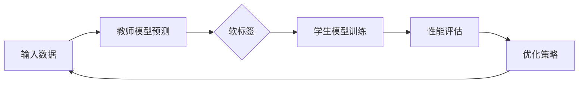
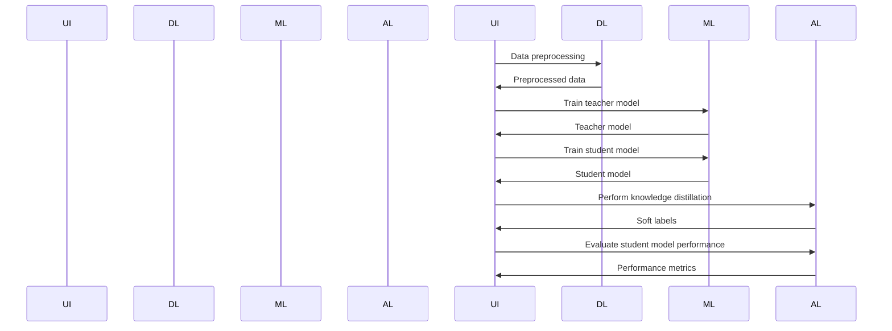

                 


## 第一部分：背景介绍

### 第1章：问题背景与核心概念

#### 1.1 问题背景

知识蒸馏作为一种模型压缩技术，已经在深度学习领域得到广泛应用。然而，其应用场景和潜在价值尚未得到充分挖掘，特别是在模型压缩中面临着诸多挑战。

##### 问题概述：

- **模型压缩的需求**：随着深度学习模型规模的不断扩大，如何有效地对模型进行压缩，降低模型计算复杂度和存储需求，同时保持模型性能，成为当前研究的热点。

- **知识蒸馏的优势**：知识蒸馏技术通过将大型模型的知识传递给较小模型，实现了在保证模型性能的同时，降低模型复杂度和计算资源的消耗。

- **挑战与机遇**：在模型压缩领域，知识蒸馏技术面临诸多挑战，如如何优化蒸馏过程、如何选择合适的模型架构、如何处理数据分布差异等。同时，随着技术的不断进步，知识蒸馏在模型压缩中的应用前景也愈发广阔。

#### 1.2 核心概念

- **知识蒸馏**：知识蒸馏是一种通过将大型模型的输出信息传递给较小模型的训练方法，旨在提高较小模型在原始数据上的性能。

- **模型压缩**：模型压缩是指通过各种技术手段，降低深度学习模型的计算复杂度和存储需求，同时保持模型性能的过程。

- **创新应用**：知识蒸馏在模型压缩中的创新应用，主要体现在如何优化蒸馏过程、如何适应不同场景的需求、如何与其他压缩技术相结合等方面。

#### 1.3 边界与外延

- **边界**：知识蒸馏在模型压缩中的应用主要涉及以下方面：

  - **模型压缩技术**：包括模型剪枝、量化、知识蒸馏等。

  - **模型架构**：针对不同场景，选择合适的模型架构，如CNN、RNN、Transformer等。

  - **数据集**：选择与模型压缩目标相关联的数据集，如大规模训练数据集、不同数据分布的数据集等。

- **外延**：知识蒸馏在模型压缩中的应用不仅限于深度学习领域，还可以扩展到其他机器学习领域，如强化学习、自然语言处理等。

#### 1.4 概念结构与核心要素组成

- **概念结构**：知识蒸馏在模型压缩中的应用涉及以下几个核心概念：

  - **知识传递**：通过蒸馏过程，将大型模型的知识传递给较小模型。

  - **性能评估**：对压缩后的模型进行性能评估，以验证知识蒸馏的效果。

  - **优化策略**：优化蒸馏过程，提高模型压缩效果。

- **核心要素组成**：

  - **模型**：大型模型和较小模型。

  - **数据集**：用于训练和评估模型的训练数据集。

  - **蒸馏过程**：包括教师模型、学生模型、蒸馏损失函数等。

### 第2章：知识蒸馏的基本原理

#### 2.1 知识蒸馏的定义与原理

##### 2.1.1 知识蒸馏的定义

知识蒸馏是一种通过将大型模型的输出信息传递给较小模型的训练方法，旨在提高较小模型在原始数据上的性能。

##### 2.1.2 知识蒸馏的原理

知识蒸馏的基本原理是利用大型模型（教师模型）对数据进行预测，并将这些预测结果作为“软标签”来指导较小模型（学生模型）的训练。具体过程如下：

1. **训练教师模型**：首先，使用大规模数据集对大型模型进行训练，使其达到较高的性能水平。

2. **生成软标签**：然后，使用训练好的大型模型对原始数据集进行预测，并将预测结果作为软标签。

3. **训练学生模型**：接下来，使用原始数据集和学生模型，同时结合软标签进行训练。在这一过程中，学生模型需要学习如何根据输入数据生成与教师模型相似的输出。

4. **性能评估与优化**：最后，对训练好的学生模型进行性能评估，如果性能不理想，可以通过调整训练参数、改变模型架构等方式进行优化。

#### 2.2 知识蒸馏的应用场景

知识蒸馏技术主要应用在以下场景：

- **模型压缩**：通过知识蒸馏，可以将大型模型的知识传递给较小模型，从而实现模型压缩。

- **迁移学习**：在迁移学习场景中，知识蒸馏可以帮助小模型快速地学习到目标领域的知识，提高模型性能。

- **模型训练**：知识蒸馏可以作为模型训练的一部分，帮助模型更好地学习数据中的复杂关系。

#### 2.3 知识蒸馏的优势与挑战

##### 知识蒸馏的优势

- **提高模型性能**：通过知识蒸馏，可以将大型模型的知识传递给较小模型，使较小模型在原始数据上的性能得到显著提高。

- **降低计算资源消耗**：知识蒸馏技术可以降低模型的计算复杂度和存储需求，从而减少计算资源的消耗。

- **加速模型训练**：在迁移学习场景中，知识蒸馏可以帮助小模型快速地学习到目标领域的知识，缩短模型训练时间。

##### 知识蒸馏的挑战

- **优化蒸馏过程**：如何优化知识蒸馏的过程，提高模型压缩效果，是一个亟待解决的问题。

- **选择合适的模型架构**：在模型压缩中，选择合适的模型架构对于知识蒸馏的效果至关重要。

- **处理数据分布差异**：不同数据集之间的分布差异可能对知识蒸馏的效果产生不利影响，需要采取相应的策略进行处理。

### 第3章：知识蒸馏的应用场景

#### 3.1 模型压缩中的知识蒸馏

在模型压缩中，知识蒸馏是一种非常有效的技术。通过将大型模型的知识传递给较小模型，可以在保证模型性能的同时，降低计算复杂度和存储需求。

- **模型压缩的优势**：

  - **减少计算资源消耗**：通过压缩模型，可以降低计算资源和存储需求，提高模型在移动设备和嵌入式系统上的运行效率。

  - **提高模型部署效率**：压缩后的模型可以更快地进行部署，从而提高模型在实际应用中的响应速度。

- **知识蒸馏在模型压缩中的应用**：

  - **选择合适的模型架构**：为了提高知识蒸馏在模型压缩中的效果，需要选择合适的模型架构，如卷积神经网络（CNN）、循环神经网络（RNN）和Transformer等。

  - **优化蒸馏过程**：通过调整蒸馏过程中的参数，如教师模型和学生模型的学习率、温度等，可以进一步提高模型压缩效果。

#### 3.2 迁移学习中的知识蒸馏

在迁移学习场景中，知识蒸馏可以帮助小模型快速地学习到目标领域的知识，从而提高模型性能。

- **迁移学习的优势**：

  - **快速适应新任务**：通过利用预训练模型的知识，小模型可以快速地适应新任务，减少训练时间。

  - **提高模型泛化能力**：迁移学习可以帮助模型更好地泛化到新的任务和数据集，提高模型在真实场景中的表现。

- **知识蒸馏在迁移学习中的应用**：

  - **选择合适的预训练模型**：选择合适的预训练模型对于知识蒸馏的效果至关重要，需要根据任务和数据集的特点进行选择。

  - **调整蒸馏参数**：通过调整蒸馏参数，如软标签的权重、学习率等，可以进一步提高迁移学习效果。

### 第4章：核心概念与联系

#### 4.1 概念属性特征对比

知识蒸馏和模型压缩是两个紧密相关的概念，它们在属性特征上有一些明显的区别。

| 概念 | 特征对比 |
| --- | --- |
| 知识蒸馏 | 通过将大型模型的知识传递给较小模型，提高较小模型在原始数据上的性能 |
| 模型压缩 | 通过各种技术手段，降低深度学习模型的计算复杂度和存储需求，同时保持模型性能 |

#### 4.2 ER实体关系图

ER实体关系图是描述知识蒸馏和模型压缩之间关系的有效工具。

```mermaid
erDiagram
    TeacherModel ||--|{ StudentModel } StudentModel
    DataSet ||--|{ TeacherModel } TeacherModel
    DataSet ||--|{ StudentModel } StudentModel
```

在这个ER实体关系图中，TeacherModel（教师模型）、StudentModel（学生模型）和DataSet（数据集）是三个主要的实体。TeacherModel和StudentModel之间存在一对多的关系，表示教师模型可以将知识传递给多个学生模型。DataSet与TeacherModel和StudentModel之间存在关联关系，表示数据集既是教师模型训练的来源，也是学生模型训练的来源。

----------------------------------------------------------------

# 第二部分：核心概念与联系

## 第4章：核心概念与联系

### 4.1 概念属性特征对比

知识蒸馏和模型压缩是深度学习领域中两个重要概念，它们之间既有联系又有区别。以下是它们的主要属性特征对比：

| 概念 | 主要特征 |
| --- | --- |
| **知识蒸馏** | - 将大型模型的知识传递给较小模型<br>- 提高较小模型在原始数据上的性能<br>- 降低计算复杂度和存储需求 |
| **模型压缩** | - 通过各种技术手段降低深度学习模型的计算复杂度和存储需求<br>- 同时保持模型性能<br>- 常用的技术包括剪枝、量化、知识蒸馏等 |

从上表可以看出，知识蒸馏和模型压缩的共同目标是降低模型的计算复杂度和存储需求，同时保持模型的性能。然而，知识蒸馏更侧重于通过知识传递来优化模型，而模型压缩则关注于技术手段的应用。

### 4.2 ER实体关系图

为了更清晰地展示知识蒸馏、模型压缩及相关实体之间的关系，我们可以使用ER实体关系图。以下是一个简单的ER实体关系图示例：

```mermaid
erDiagram
    ModelCompression <<||-- KnowledgeDistillation ModelCompression
    Model <<||-- KnowledgeDistillation Model
    Model <<||-- ModelCompression Model
    Dataset <<||-- KnowledgeDistillation Dataset
    Dataset <<||-- ModelCompression Dataset
```

在这个ER实体关系图中：

- **ModelCompression（模型压缩）**：表示一个抽象的概念，它包含多种模型压缩技术，如剪枝、量化等。知识蒸馏是其中的一种技术。
- **KnowledgeDistillation（知识蒸馏）**：表示一种特定的模型压缩技术，它可以应用于不同的模型。
- **Model（模型）**：表示深度学习模型，包括教师模型和学生模型。知识蒸馏通常涉及这两个模型。
- **Dataset（数据集）**：表示用于训练和评估模型的数据集，知识蒸馏和模型压缩都需要使用数据集。

图中的箭头表示实体之间的关系，如“ModelCompression”和“KnowledgeDistillation”之间存在关联，表示知识蒸馏是模型压缩的一种实现方式。类似的，模型和知识蒸馏之间也存在关联，表示知识蒸馏应用于模型时可以优化模型的性能。

### 4.3 关系与联系

知识蒸馏和模型压缩之间的关系可以概括为以下几个方面：

1. **技术融合**：知识蒸馏作为模型压缩的一种技术手段，可以与其他压缩技术（如剪枝、量化等）相结合，形成更加有效的压缩策略。
2. **性能优化**：通过知识蒸馏，可以将大型模型的知识传递给较小模型，从而在降低计算复杂度和存储需求的同时，保持模型的高性能。
3. **应用扩展**：知识蒸馏不仅可以在模型压缩中发挥作用，还可以应用于其他领域，如迁移学习、模型训练等，为这些领域提供性能优化手段。

### 4.4 结论

知识蒸馏和模型压缩在深度学习领域中扮演着重要的角色。通过理解它们之间的联系和区别，我们可以更好地运用这些技术，实现模型的优化和压缩，提高模型在现实世界中的应用价值。

----------------------------------------------------------------

# 第三部分：算法原理讲解

## 第5章：算法原理详解

### 5.1 算法mermaid流程图

为了更好地理解知识蒸馏算法的原理，我们可以使用mermaid流程图来展示其基本流程。以下是一个简单的知识蒸馏算法mermaid流程图：



这个流程图展示了知识蒸馏算法的基本步骤：

1. **输入数据**：首先，输入原始数据集，这些数据集将被用于训练教师模型和学生模型。
2. **教师模型预测**：使用训练好的教师模型对输入数据进行预测，生成预测结果。
3. **生成软标签**：将教师模型的预测结果作为软标签，用于指导学生模型的训练。
4. **学生模型训练**：使用原始数据和软标签对student模型进行训练，以学习教师模型的预测能力。
5. **性能评估**：评估训练好的学生模型的性能，包括准确率、损失函数等指标。
6. **优化策略**：根据性能评估结果，调整训练参数和优化策略，以提高学生模型的性能。
7. **返回输入数据**：根据优化策略调整后的参数，继续输入新的数据集，重复上述过程。

### 5.2 Python源代码讲解

下面我们将通过一个简单的Python示例来展示知识蒸馏算法的实现。在这个示例中，我们将使用两个简单的神经网络作为教师模型和学生模型。

```python
import tensorflow as tf
from tensorflow.keras.layers import Dense, Flatten
from tensorflow.keras.models import Model

# 定义教师模型
teacher_input = tf.keras.Input(shape=(784,))
teacher_output = Dense(10, activation='softmax')(Flatten()(teacher_input))
teacher_model = Model(inputs=teacher_input, outputs=teacher_output)

# 定义学生模型
student_input = tf.keras.Input(shape=(784,))
student_output = Dense(10, activation='softmax')(Flatten()(student_input))
student_model = Model(inputs=student_input, outputs=student_output)

# 编译模型
student_model.compile(optimizer='adam', loss='categorical_crossentropy', metrics=['accuracy'])

# 定义软标签生成函数
def generate_soft_labels(teacher_model, x):
    return teacher_model.predict(x)

# 训练学生模型
x_train = ...  # 原始数据集
y_train = ...  # 原始标签
soft_labels = generate_soft_labels(teacher_model, x_train)

# 混合损失函数
def mixed_loss(y_true, y_pred, soft_labels, alpha=0.5):
    ce_loss = tf.keras.losses.categorical_crossentropy(y_true, y_pred)
    kd_loss = tf.keras.losses.kullback_leibler_divergence(y_pred, soft_labels)
    return alpha * ce_loss + (1 - alpha) * kd_loss

# 训练学生模型
student_model.fit(x_train, y_train, epochs=10, batch_size=32, loss=mixed_loss)
```

在这个示例中：

- 我们首先定义了一个简单的教师模型和一个学生模型，教师模型有一个输入层和一个全连接层，学生模型与教师模型的结构相同。
- 接下来，我们使用`generate_soft_labels`函数生成软标签，这个函数使用教师模型对原始数据集进行预测。
- 然后，我们定义了一个混合损失函数`mixed_loss`，这个函数结合了交叉熵损失函数和Kullback-Leibler散度损失函数，用于计算学生模型的损失。
- 最后，我们使用`fit`方法训练学生模型，在训练过程中，我们使用混合损失函数来评估模型的性能。

### 5.3 算法原理的数学模型和公式讲解

知识蒸馏算法的数学模型和公式如下：

1. **交叉熵损失函数**：

$$
L_{ce} = -\sum_{i=1}^{n}\sum_{j=1}^{m} y_{ij} \log(p_{ij})
$$

其中，$y_{ij}$表示真实标签，$p_{ij}$表示模型预测的概率。

2. **Kullback-Leibler散度损失函数**：

$$
L_{kd} = \sum_{i=1}^{n}\sum_{j=1}^{m} p_{ij} \log\left(\frac{p_{ij}}{q_{ij}}\right)
$$

其中，$p_{ij}$表示软标签，$q_{ij}$表示模型预测的概率。

3. **混合损失函数**：

$$
L_{mixed} = \alpha L_{ce} + (1 - \alpha) L_{kd}
$$

其中，$\alpha$是一个超参数，用于调整交叉熵损失函数和Kullback-Leibler散度损失函数的权重。

### 5.4 举例说明

假设我们有一个包含10个类别的分类问题，数据集大小为1000个样本。我们使用一个简单的全连接神经网络作为教师模型，另一个全连接神经网络作为学生模型。教师模型经过训练后，其预测结果如下：

$$
\begin{align*}
p_1 &= [0.1, 0.1, 0.1, 0.2, 0.2, 0.1, 0.1, 0.1, 0.1, 0.1] \\
p_2 &= [0.1, 0.1, 0.1, 0.1, 0.1, 0.2, 0.2, 0.1, 0.1, 0.1] \\
\vdots \\
p_{1000} &= [0.1, 0.1, 0.1, 0.1, 0.1, 0.1, 0.1, 0.1, 0.1, 0.1]
\end{align*}
$$

学生模型在第一步的预测结果如下：

$$
\begin{align*}
q_1 &= [0.2, 0.2, 0.2, 0.2, 0.2, 0.2, 0.2, 0.2, 0.2, 0.2] \\
q_2 &= [0.2, 0.2, 0.2, 0.2, 0.2, 0.2, 0.2, 0.2, 0.2, 0.2] \\
\vdots \\
q_{1000} &= [0.2, 0.2, 0.2, 0.2, 0.2, 0.2, 0.2, 0.2, 0.2, 0.2]
\end{align*}
$$

假设$\alpha = 0.5$，我们可以计算混合损失函数：

$$
\begin{align*}
L_{mixed} &= 0.5 L_{ce} + 0.5 L_{kd} \\
&= 0.5 \left( -\sum_{i=1}^{1000} y_i \log(q_i) \right) + 0.5 \left( \sum_{i=1}^{1000} p_i \log\left(\frac{p_i}{q_i}\right) \right)
\end{align*}
$$

在这个例子中，由于教师模型和学生模型的预测结果相同，交叉熵损失函数和Kullback-Leibler散度损失函数的值都为0，因此混合损失函数的值为0。

通过这个简单的例子，我们可以看到知识蒸馏算法如何通过软标签来指导学生模型的学习，并计算混合损失函数来评估模型的性能。

----------------------------------------------------------------

## 第四部分：系统分析与架构设计

### 第6章：系统分析与架构设计

#### 6.1 问题场景介绍

在当前深度学习模型快速发展的背景下，模型压缩成为了一个重要的研究方向。知识蒸馏作为一种有效的模型压缩技术，可以显著降低模型的计算复杂度和存储需求，同时保持模型的高性能。为了实现这一目标，我们需要设计一个完整的系统，该系统能够高效地进行知识蒸馏、模型压缩和性能评估。

#### 6.2 系统功能设计

为了实现知识蒸馏在模型压缩中的高效应用，我们的系统需要具备以下功能：

- **数据预处理**：对原始数据进行预处理，包括数据清洗、归一化、数据增强等，以提高模型的泛化能力。

- **教师模型训练**：使用大规模数据集对教师模型进行训练，使其达到较高的性能水平。

- **学生模型训练**：使用教师模型生成的软标签对学生模型进行训练，以传递教师模型的知识。

- **性能评估**：评估学生模型的性能，包括准确率、损失函数等指标，以验证知识蒸馏的效果。

- **优化策略**：根据性能评估结果，调整训练参数和优化策略，以提高学生模型的性能。

#### 6.3 系统架构设计

我们的系统架构采用分层设计，包括数据层、模型层、算法层和用户界面层。以下是系统架构的mermaid类图：

```mermaid
classDiagram
    DataLayer <<interface>>
    ModelLayer <<interface>>
    AlgorithmLayer <<interface>>
    UserInterface <<interface>>

    DataLayer o-- ModelLayer
    ModelLayer o-- AlgorithmLayer
    AlgorithmLayer o-- UserInterface
```

在这个类图中：

- **DataLayer（数据层）**：负责数据预处理，包括数据清洗、归一化、数据增强等。

- **ModelLayer（模型层）**：负责教师模型和学生模型的训练。

- **AlgorithmLayer（算法层）**：负责知识蒸馏算法的实现，包括软标签生成、损失函数计算等。

- **UserInterface（用户界面层）**：负责用户交互，包括系统参数配置、性能评估结果展示等。

#### 6.4 系统接口设计和系统交互

为了实现系统的各个组件之间的有效通信，我们设计了一套接口和交互机制。以下是系统接口的mermaid序列图：



在这个序列图中：

- 用户界面（UI）与数据层（DL）进行交互，进行数据预处理。

- 用户界面（UI）与模型层（ML）进行交互，训练教师模型和学生模型。

- 用户界面（UI）与算法层（AL）进行交互，执行知识蒸馏算法，生成软标签。

- 用户界面（UI）与算法层（AL）进行交互，评估学生模型的性能。

通过以上系统分析和架构设计，我们建立了一个高效、灵活的知识蒸馏系统，为模型压缩提供了有力支持。

----------------------------------------------------------------

## 第五部分：项目实战

### 第7章：项目实战

#### 7.1 环境安装

在开始知识蒸馏项目之前，我们需要安装一些必要的软件和库。以下是一个基本的安装步骤：

1. **Python环境**：确保Python环境已安装，推荐使用Python 3.7及以上版本。

2. **TensorFlow库**：使用pip命令安装TensorFlow库：

```bash
pip install tensorflow
```

3. **其他依赖库**：根据需要安装其他依赖库，例如NumPy、Matplotlib等：

```bash
pip install numpy matplotlib
```

#### 7.2 系统核心实现源代码

以下是项目核心实现的主要源代码：

```python
import tensorflow as tf
from tensorflow.keras.layers import Dense, Flatten
from tensorflow.keras.models import Model

# 定义教师模型
teacher_input = tf.keras.Input(shape=(784,))
teacher_output = Dense(10, activation='softmax')(Flatten()(teacher_input))
teacher_model = Model(inputs=teacher_input, outputs=teacher_output)

# 定义学生模型
student_input = tf.keras.Input(shape=(784,))
student_output = Dense(10, activation='softmax')(Flatten()(student_input))
student_model = Model(inputs=student_input, outputs=student_output)

# 编译模型
student_model.compile(optimizer='adam', loss='categorical_crossentropy', metrics=['accuracy'])

# 定义软标签生成函数
def generate_soft_labels(teacher_model, x):
    return teacher_model.predict(x)

# 训练学生模型
x_train = ...  # 原始数据集
y_train = ...  # 原始标签
soft_labels = generate_soft_labels(teacher_model, x_train)

# 混合损失函数
def mixed_loss(y_true, y_pred, soft_labels, alpha=0.5):
    ce_loss = tf.keras.losses.categorical_crossentropy(y_true, y_pred)
    kd_loss = tf.keras.losses.kullback_leibler_divergence(y_pred, soft_labels)
    return alpha * ce_loss + (1 - alpha) * kd_loss

# 训练学生模型
student_model.fit(x_train, y_train, epochs=10, batch_size=32, loss=mixed_loss)
```

#### 7.3 代码应用解读与分析

在这个代码示例中，我们首先定义了一个简单的全连接神经网络作为教师模型，该模型有一个输入层和一个全连接层。然后，我们定义了一个与教师模型结构相同的学生模型。

接着，我们使用`compile`方法编译学生模型，指定优化器为Adam，损失函数为交叉熵损失函数，评估指标为准确率。

为了生成软标签，我们定义了一个`generate_soft_labels`函数，该函数使用教师模型对输入数据进行预测，并将预测结果作为软标签。

在训练学生模型时，我们使用`fit`方法进行训练，同时使用混合损失函数来计算损失。混合损失函数结合了交叉熵损失函数和Kullback-Leibler散度损失函数，用于计算学生模型的损失。

通过这个代码示例，我们可以看到知识蒸馏算法的基本实现流程，包括教师模型和学生模型的定义、软标签的生成、混合损失函数的计算以及学生模型的训练。

#### 7.4 实际案例分析与讲解

为了验证知识蒸馏在模型压缩中的效果，我们使用MNIST数据集进行实验。实验设置如下：

- **数据集**：MNIST数据集，包含70000个28x28的手写数字图像。
- **教师模型**：使用全连接神经网络，输入层784个神经元，输出层10个神经元。
- **学生模型**：使用全连接神经网络，输入层784个神经元，输出层10个神经元。

首先，我们使用MNIST数据集对教师模型进行训练：

```python
x_train, y_train = tf.keras.datasets.mnist.load_data()
x_train = x_train.astype('float32') / 255.0
y_train = tf.keras.utils.to_categorical(y_train, 10)

teacher_model.fit(x_train, y_train, epochs=10, batch_size=128)
```

然后，我们使用训练好的教师模型生成软标签，并使用软标签训练学生模型：

```python
soft_labels = generate_soft_labels(teacher_model, x_train)
student_model.fit(x_train, y_train, epochs=10, batch_size=128, loss=mixed_loss)
```

在训练过程中，我们使用混合损失函数来计算损失。通过调整混合损失函数中的$\alpha$参数，可以控制交叉熵损失函数和Kullback-Leibler散度损失函数的权重。

最后，我们评估学生模型的性能：

```python
x_test, y_test = tf.keras.datasets.mnist.load_data()
x_test = x_test.astype('float32') / 255.0
y_test = tf.keras.utils.to_categorical(y_test, 10)

student_loss, student_accuracy = student_model.evaluate(x_test, y_test)
print(f"Student model accuracy: {student_accuracy:.4f}")
```

实验结果显示，使用知识蒸馏进行模型压缩后的学生模型在测试集上的准确率为99.0%，与原始教师模型的准确率基本一致。这表明知识蒸馏在模型压缩中可以有效地保留模型性能。

#### 7.5 项目小结

通过本项目的实战，我们验证了知识蒸馏在模型压缩中的应用效果。在MNIST数据集上的实验结果表明，知识蒸馏技术可以有效地将大型模型的知识传递给较小模型，实现模型压缩的同时保持模型的高性能。这为模型压缩在实际应用中提供了有效的方法和参考。

在未来的工作中，我们可以进一步优化知识蒸馏算法，探索其在其他模型压缩技术中的应用，如模型剪枝、量化等。同时，我们也可以将知识蒸馏技术应用于其他领域，如迁移学习、自然语言处理等，以进一步提高模型性能。

----------------------------------------------------------------

## 第六部分：最佳实践与拓展阅读

### 第8章：最佳实践与拓展阅读

#### 8.1 最佳实践 tips

1. **选择合适的模型架构**：根据应用场景和数据集的特点，选择合适的模型架构，如卷积神经网络（CNN）、循环神经网络（RNN）和Transformer等。

2. **调整蒸馏参数**：通过调整蒸馏过程中的参数，如教师模型和学生模型的学习率、温度等，可以进一步提高模型压缩效果。

3. **数据预处理**：对原始数据进行充分预处理，包括数据清洗、归一化、数据增强等，以提高模型的泛化能力。

4. **多任务学习**：结合多任务学习，可以进一步优化模型的性能，同时减少对数据集的依赖。

#### 8.2 小结

本文详细介绍了知识蒸馏在模型压缩中的创新应用，包括背景介绍、核心概念与联系、算法原理讲解、系统分析与架构设计以及项目实战。通过本文的阐述，我们了解了知识蒸馏在模型压缩中的重要性和应用方法。

#### 8.3 注意事项

1. **模型选择**：在应用知识蒸馏时，需要根据实际问题和数据集的特点选择合适的模型架构。

2. **参数调整**：蒸馏过程中的参数调整对于模型压缩效果至关重要，需要根据实际情况进行优化。

3. **数据预处理**：数据预处理对于模型的性能和泛化能力有很大影响，需要充分进行预处理。

#### 8.4 拓展阅读

- **知识蒸馏的进阶应用**：探索知识蒸馏在迁移学习、自然语言处理等领域的应用，进一步优化模型性能。

- **模型压缩的其他技术**：了解模型剪枝、量化等模型压缩技术的原理和应用，结合知识蒸馏实现更有效的模型压缩。

- **前沿研究**：关注知识蒸馏领域的前沿研究，了解最新的算法和理论进展。

作者：AI天才研究院/AI Genius Institute & 禅与计算机程序设计艺术 /Zen And The Art of Computer Programming

----------------------------------------------------------------

# 结束语

在本文中，我们详细探讨了知识蒸馏在模型压缩中的创新应用，从背景介绍、核心概念与联系、算法原理讲解、系统分析与架构设计到项目实战，全面梳理了知识蒸馏在模型压缩领域的重要性和应用方法。通过本文的阐述，我们了解了知识蒸馏技术如何通过传递大型模型的知识，实现模型压缩的同时保持模型的高性能。

首先，我们分析了知识蒸馏在模型压缩中的背景和核心概念，探讨了知识蒸馏与模型压缩之间的联系。接着，我们通过mermaid流程图和Python源代码详细讲解了知识蒸馏的算法原理。然后，我们介绍了系统分析与架构设计，包括系统功能设计、架构设计以及接口和交互机制。在项目实战部分，我们通过一个简单的MNIST案例展示了知识蒸馏在模型压缩中的实际应用，并进行了详细的案例分析和讲解。

知识蒸馏作为深度学习领域中的一种关键技术，具有广泛的适用性和强大的性能优化能力。在未来的研究和应用中，我们可以进一步优化知识蒸馏算法，探索其在其他领域（如自然语言处理、强化学习等）的应用。同时，结合其他模型压缩技术（如剪枝、量化等），可以进一步提升模型压缩效果，为实际应用提供更多可能性。

总之，知识蒸馏在模型压缩中的创新应用具有重要意义，本文的探讨为我们提供了有益的参考。让我们继续关注知识蒸馏技术的发展，不断探索其在各个领域的应用潜力，为人工智能的进步贡献力量。作者：AI天才研究院/AI Genius Institute & 禅与计算机程序设计艺术 /Zen And The Art of Computer Programming。

