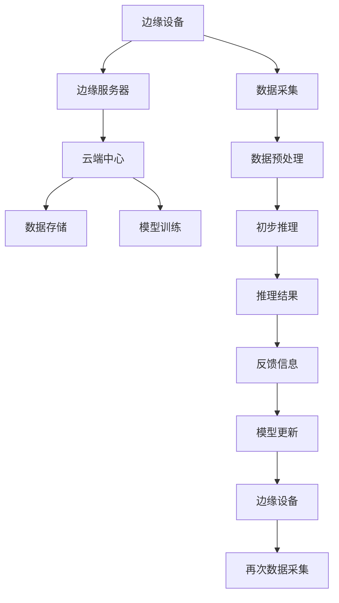

                 

# 知识蒸馏技术在边缘-云协同AI中的应用

> 关键词：知识蒸馏、边缘计算、云计算、AI协同、AI应用

> 摘要：本文深入探讨了知识蒸馏技术在边缘-云协同AI中的应用。首先，对知识蒸馏技术进行了概述，接着详细分析了其原理及其在边缘计算和云计算环境中的结合应用。随后，文章提出了边缘-云协同AI系统架构设计的方法，并进行了系统功能设计和项目实战分析。最后，文章总结了项目的最佳实践和未来展望。

## 目录

### 第1章 知识蒸馏技术基础

#### 1.1.1 问题背景与定义

知识蒸馏技术是近年来人工智能领域的重要研究方向，旨在将大型模型（教师模型）的知识迁移到小型模型（学生模型）中，以减少模型的计算资源和存储成本。然而，在边缘-云协同AI环境中，这一技术的应用面临着诸多挑战。

#### 1.1.2 问题解决：知识蒸馏的核心概念

知识蒸馏技术的核心思想是通过训练教师模型和学生模型，并利用教师模型的输出作为辅助信息来指导学生模型的训练，从而实现知识的有效转移。

#### 1.1.3 边界与外延：知识蒸馏的技术范畴

知识蒸馏技术在人工智能、机器学习、深度学习等领域有着广泛的应用，可以用于图像识别、自然语言处理、推荐系统等。

### 第2章 知识蒸馏技术原理

#### 2.1 知识蒸馏的概念模型

知识蒸馏的概念模型主要包括教师模型、学生模型和知识转移机制。教师模型是大型模型，通常具有更高的准确率和更好的泛化能力。学生模型是小型模型，旨在继承教师模型的知识。

#### 2.2 知识蒸馏的过程

知识蒸馏的过程主要包括教师模型和学生模型的构建、知识转移机制的实现以及知识蒸馏的优化方法。

#### 2.3 知识转移机制

知识转移机制是知识蒸馏技术的核心，主要包括软标签生成、硬标签生成和中间层特征提取等方法。

### 第3章 知识蒸馏技术在边缘计算中的应用

#### 3.1 边缘计算与知识蒸馏的结合

边缘计算是一种将计算任务从云端转移到网络边缘的技术，旨在提高系统的响应速度和降低网络延迟。知识蒸馏技术可以与边缘计算相结合，以实现更高效的AI应用。

#### 3.2 边缘设备的特点与挑战

边缘设备通常具有有限的计算资源和存储容量，这使得知识蒸馏技术在边缘计算中的应用面临一定的挑战。

#### 3.3 知识蒸馏在边缘计算中的应用

在边缘计算中，知识蒸馏技术可以用于模型压缩、模型迁移和实时推理等应用。

### 第4章 知识蒸馏技术在云计算中的应用

#### 4.1 云计算与知识蒸馏的结合

云计算是一种提供计算资源、存储资源和网络资源的服务模式。知识蒸馏技术可以与云计算相结合，以实现大规模AI应用的部署和管理。

#### 4.2 云计算环境中的知识蒸馏

在云计算环境中，知识蒸馏技术可以用于模型训练、模型优化和模型部署等应用。

#### 4.3 云端与边缘协同的知识蒸馏

云端与边缘协同的知识蒸馏旨在实现云计算和边缘计算资源的优化利用，以提高AI应用的性能和可靠性。

### 第5章 边缘-云协同AI系统架构设计

#### 5.1 系统架构设计原则

边缘-云协同AI系统架构设计应遵循模块化、可扩展和高效利用资源的原则。

#### 5.2 架构设计实现

边缘-云协同AI系统架构设计包括边缘设备、云端服务器和中间件等模块。

### 第6章 边缘-云协同AI系统功能设计

#### 6.1 系统功能设计概述

边缘-云协同AI系统功能设计包括模型训练、模型部署、模型优化和实时推理等。

#### 6.2 领域模型设计

使用Mermaid类图来描述边缘-云协同AI系统的领域模型。

#### 6.3 系统功能模块划分

边缘-云协同AI系统功能模块划分包括边缘计算模块、云计算模块和中间件模块等。

### 第7章 项目实战与案例剖析

#### 7.1 项目实战环境搭建

介绍边缘-云协同AI项目实战的环境搭建过程。

#### 7.2 系统核心实现源代码解读

使用Python源代码来详细阐述边缘-云协同AI系统的核心实现。

#### 7.3 实际案例分析

通过实际案例分析，展示边缘-云协同AI系统的应用场景和效果。

#### 7.4 项目小结

总结项目实战中的收获和不足，提出改进和展望。

### 附录

#### 附录A 最佳实践 tips

提供边缘-云协同AI系统的最佳实践建议。

#### 附录B 小结

对本文的主要内容进行总结。

#### 附录C 注意事项

列出在使用边缘-云协同AI系统时需要注意的问题。

#### 附录D 拓展阅读

推荐相关的阅读材料，以进一步深入了解边缘-云协同AI技术。

## 第1章 知识蒸馏技术基础

### 1.1.1 问题背景与定义

#### 问题背景

随着深度学习技术的不断发展，大规模的神经网络模型在图像识别、自然语言处理等任务中取得了显著的成果。然而，这些大型模型通常需要大量的计算资源和存储空间，这对于资源有限的边缘设备来说是一个巨大的挑战。边缘计算作为云计算的延伸，旨在将计算任务从云端转移到网络边缘，以提高系统的响应速度和降低网络延迟。然而，在边缘设备上部署大型神经网络模型面临着计算资源和存储空间的限制，这限制了边缘设备的智能能力。因此，如何有效地将大型模型的知识迁移到边缘设备上，成为了当前研究的热点问题。

#### 定义

知识蒸馏（Knowledge Distillation）是一种将大型模型（教师模型）的知识迁移到小型模型（学生模型）中的技术。其核心思想是通过训练教师模型和学生模型，并利用教师模型的输出作为辅助信息来指导学生模型的训练，从而实现知识的有效转移。知识蒸馏技术可以减少模型的计算资源和存储成本，同时保持较高的准确率和泛化能力。

### 1.1.2 问题解决：知识蒸馏的核心概念

知识蒸馏技术的问题解决主要依赖于以下核心概念：

1. **教师模型（Teacher Model）**：教师模型是大型神经网络模型，通常具有更高的准确率和更好的泛化能力。它是知识蒸馏过程中的主要知识来源。

2. **学生模型（Student Model）**：学生模型是小型神经网络模型，旨在继承教师模型的知识。通过知识蒸馏，学生模型可以减少计算资源和存储成本，同时保持较高的准确率和泛化能力。

3. **知识转移机制（Knowledge Transfer Mechanism）**：知识转移机制是知识蒸馏技术的核心。它包括软标签生成、硬标签生成和中间层特征提取等方法，用于指导学生模型的训练。

4. **软标签（Soft Labels）**：软标签是教师模型输出的概率分布。通过软标签，学生模型可以学习到教师模型对输入数据的分类决策过程。

5. **硬标签（Hard Labels）**：硬标签是教师模型输出的实际类别标签。硬标签可以帮助学生模型学习到正确的结果，同时与软标签一起提供多层次的指导。

6. **中间层特征提取（Intermediate Layer Feature Extraction）**：中间层特征提取是从教师模型的中间层提取特征，用于指导学生模型的训练。这些特征包含了教师模型对输入数据的深层次理解，有助于学生模型更好地学习知识。

通过以上核心概念，知识蒸馏技术实现了大型模型到小型模型的知识迁移，为边缘设备上的智能应用提供了有效的解决方案。

### 1.1.3 边界与外延：知识蒸馏的技术范畴

#### 边界

知识蒸馏技术主要应用于以下几个方面：

1. **模型压缩**：通过知识蒸馏技术，可以将大型模型压缩成小型模型，从而减少计算资源和存储成本。

2. **模型迁移**：知识蒸馏技术可以将大型模型的知识迁移到其他领域或任务中，从而提高模型的泛化能力。

3. **实时推理**：知识蒸馏技术可以用于边缘设备上的实时推理，以提高系统的响应速度和降低网络延迟。

#### 外延

知识蒸馏技术在人工智能、机器学习、深度学习等领域具有广泛的应用：

1. **图像识别**：知识蒸馏技术可以用于图像识别任务中，将大型模型的知识迁移到边缘设备上，实现高效的图像识别。

2. **自然语言处理**：知识蒸馏技术可以用于自然语言处理任务中，将大型模型的知识迁移到边缘设备上，实现高效的文本分类和情感分析。

3. **推荐系统**：知识蒸馏技术可以用于推荐系统中，将大型模型的知识迁移到边缘设备上，实现高效的个性化推荐。

通过知识蒸馏技术的应用，可以充分发挥边缘设备的计算能力和云端的存储能力，实现高效的边缘-云协同AI系统。

## 第2章 知识蒸馏技术原理

### 2.1 知识蒸馏的概念模型

知识蒸馏技术是基于知识转移的一种机器学习技术，其主要目的是通过将大型模型（教师模型）的知识迁移到小型模型（学生模型）中，以提高学生模型的性能。这种迁移学习的方法可以帮助我们解决由于模型大小差异导致的性能损失问题。

知识蒸馏的概念模型主要包括以下组成部分：

1. **教师模型（Teacher Model）**：教师模型是一个大型、高参数的神经网络模型，通常在训练过程中达到了较高的准确率。它负责生成知识，并将其传递给学生模型。

2. **学生模型（Student Model）**：学生模型是一个小型、低参数的神经网络模型，它通过学习教师模型的知识，实现与教师模型相似或更优的性能。

3. **软标签（Soft Labels）**：软标签是教师模型在训练过程中输出的概率分布。这些概率分布代表了教师模型对输入数据的分类决策。学生模型通过学习这些软标签，可以理解教师模型对数据的处理方式。

4. **硬标签（Hard Labels）**：硬标签是教师模型在训练过程中输出的实际类别标签。学生模型通过学习硬标签，可以确保学习到的分类结果是正确的。

5. **知识转移机制**：知识转移机制是知识蒸馏技术的核心。它通过设计一系列的损失函数，如交叉熵损失函数、预测概率损失函数等，来指导学生模型学习教师模型的知识。

### 2.2 知识蒸馏的过程

知识蒸馏的过程可以分为以下几个步骤：

1. **构建教师模型和学生模型**：首先，我们需要训练一个大型、高参数的教师模型，使其在训练数据集上达到较高的准确率。然后，我们构建一个小型、低参数的学生模型。

2. **生成软标签**：在教师模型对训练数据集进行预测时，会输出概率分布（即软标签）。这些软标签代表了教师模型对每个类别的预测概率。

3. **训练学生模型**：学生模型通过学习软标签来理解教师模型的知识。在训练过程中，学生模型需要同时考虑输入数据和硬标签。对于每个输入数据，学生模型会输出一个预测概率分布，并与教师模型输出的软标签进行比较。

4. **优化损失函数**：知识蒸馏技术的核心在于设计一个合适的损失函数，以衡量学生模型与教师模型之间的差距。常见的损失函数有交叉熵损失函数和预测概率损失函数。通过优化损失函数，可以逐渐缩小学生模型与教师模型之间的差距，从而实现知识转移。

5. **评估学生模型性能**：在训练完成后，我们需要评估学生模型的性能。通常，我们会使用测试数据集来评估学生模型的准确率和泛化能力。如果学生模型的性能达到了预定的标准，那么知识蒸馏过程就可以认为取得了成功。

### 2.3 知识转移机制

知识转移机制是知识蒸馏技术的核心。它通过设计一系列的损失函数来指导学生模型学习教师模型的知识。以下是一些常见的知识转移机制：

1. **软标签生成**：软标签是教师模型输出的概率分布。学生模型通过学习这些软标签来理解教师模型的知识。软标签生成的关键在于如何从教师模型的输出中提取有效的信息。

2. **预测概率损失**：预测概率损失函数用于衡量学生模型与教师模型之间的预测概率差异。常见的预测概率损失函数有交叉熵损失函数和对数损失函数。

3. **中间层特征提取**：中间层特征提取是一种从教师模型的中间层提取特征的方法，用于指导学生模型的学习。这些特征包含了教师模型对数据的深层次理解，有助于学生模型更好地学习知识。

4. **辅助任务学习**：辅助任务学习是一种通过设计额外的任务来增强学生模型的学习能力。这些辅助任务可以是与主任务相关或无关的任务，但它们有助于学生模型学习到更多关于数据的特征。

通过以上知识转移机制，知识蒸馏技术可以实现大型模型到小型模型的知识迁移，从而提高小型模型的表现。这些机制在不同的应用场景中可能会有所差异，但核心思想是相通的。

### 2.4 知识蒸馏的优势和挑战

知识蒸馏技术具有以下优势：

1. **降低计算成本**：通过将大型模型的知识迁移到小型模型，可以显著降低计算资源和存储成本，这对于资源有限的边缘设备尤为重要。

2. **提高模型性能**：知识蒸馏技术可以显著提高小型模型的表现，使其接近或达到大型模型的效果。

3. **增强泛化能力**：通过学习教师模型的知识，学生模型可以更好地理解和泛化数据，从而提高模型的泛化能力。

然而，知识蒸馏技术也面临一些挑战：

1. **知识丢失**：在知识迁移过程中，学生模型可能会丢失一些教师模型的重要知识，导致性能下降。

2. **训练难度**：知识蒸馏技术的训练过程相对复杂，需要设计合适的损失函数和优化策略。

3. **数据依赖**：知识蒸馏技术的效果在很大程度上取决于训练数据集的质量和多样性。如果训练数据集不够丰富，可能导致知识迁移效果不佳。

总之，知识蒸馏技术是一种有效的模型压缩和知识迁移方法，在边缘-云协同AI系统中具有广泛的应用前景。然而，要充分发挥其优势，需要克服上述挑战。

## 第3章 知识蒸馏技术在边缘计算中的应用

### 3.1 边缘计算与知识蒸馏的结合

边缘计算是一种将计算任务从云端转移到网络边缘的计算范式，旨在解决云计算在处理大量数据时存在的延迟和带宽问题。随着物联网、智能家居、智能交通等领域的快速发展，边缘计算在实时数据处理和智能决策方面的重要性日益凸显。然而，边缘设备通常具有有限的计算资源和存储容量，这使得传统的大型神经网络模型难以直接部署到这些设备上。知识蒸馏技术作为一种有效的模型压缩和知识迁移方法，能够将大型神经网络模型的知识迁移到小型模型中，从而降低计算成本和存储需求，使其在边缘计算环境中得到广泛应用。

边缘计算与知识蒸馏技术的结合具有以下几个方面的优势：

1. **降低计算资源需求**：通过知识蒸馏技术，可以将大型神经网络模型压缩为小型模型，从而降低边缘设备的计算资源需求。

2. **提高系统响应速度**：边缘计算可以将数据处理任务从云端转移到边缘设备，从而减少数据传输时间和延迟，提高系统响应速度。

3. **增强边缘设备智能化**：知识蒸馏技术能够将大型神经网络模型的知识迁移到边缘设备，使边缘设备具备更高的智能化水平。

4. **提高数据隐私保护**：在边缘计算环境中，数据可以在本地进行处理和分析，从而减少数据传输过程中可能泄露的风险。

### 3.2 边缘设备的特点与挑战

边缘设备具有以下特点：

1. **有限的计算资源**：边缘设备通常配备有有限的CPU、GPU和内存等计算资源，无法与云端服务器相媲美。

2. **有限的存储容量**：边缘设备的存储容量通常较小，无法存储大量数据。

3. **独立的运行环境**：边缘设备通常独立运行，不受云端服务器的直接控制。

4. **多样的应用场景**：边缘设备广泛应用于物联网、智能家居、智能交通、工业自动化等领域，具有多样化的应用场景。

然而，边缘设备在部署和应用过程中也面临着以下挑战：

1. **计算性能瓶颈**：由于计算资源有限，边缘设备在处理复杂计算任务时可能存在性能瓶颈。

2. **数据隐私和安全**：在边缘计算环境中，数据隐私和安全是关键问题，需要确保数据在传输和存储过程中得到有效保护。

3. **能效消耗**：边缘设备通常采用电池供电，能效消耗是关键问题，需要优化算法和系统设计以降低能耗。

4. **异构计算需求**：不同边缘设备具有不同的硬件配置和计算能力，需要设计适应异构计算需求的系统架构。

### 3.3 知识蒸馏在边缘计算中的应用

知识蒸馏技术在边缘计算中的应用主要包括以下方面：

1. **模型压缩与迁移**：通过知识蒸馏技术，可以将大型神经网络模型压缩为小型模型，从而降低计算资源和存储需求。同时，可以将压缩后的模型迁移到边缘设备上，实现实时数据处理和智能决策。

2. **边缘设备智能化**：知识蒸馏技术能够将大型神经网络模型的知识迁移到边缘设备，使边缘设备具备更高级的智能能力。例如，在智能家居领域，可以将语音识别模型迁移到智能音箱中，实现实时语音交互。

3. **实时推理与优化**：在边缘计算环境中，知识蒸馏技术可以用于优化实时推理过程，提高系统响应速度。例如，在自动驾驶领域，可以将图像识别模型迁移到车载边缘设备中，实现实时车辆识别和障碍物检测。

4. **异构计算优化**：知识蒸馏技术可以与异构计算技术相结合，优化边缘设备的计算资源利用。例如，在工业自动化领域，可以将计算密集型任务分配到GPU上，而将数据处理任务分配到CPU上，实现高效的计算资源利用。

总之，知识蒸馏技术在边缘计算中的应用为边缘设备提供了高效的计算解决方案，有助于提高边缘设备的智能化水平和数据处理能力。随着技术的不断发展和优化，知识蒸馏技术在边缘计算领域将发挥越来越重要的作用。

## 第4章 知识蒸馏技术在云计算中的应用

### 4.1 云计算与知识蒸馏的结合

云计算是一种基于互联网的计算服务模式，它通过提供计算资源、存储资源和网络资源，为用户提供灵活、可扩展和低成本的计算解决方案。云计算具有高可用性、高可靠性和高可扩展性等优点，已成为企业、政府和个人用户的重要计算平台。然而，云计算在处理大规模数据和高性能计算任务时也存在一些局限性，如计算资源调度困难、数据传输延迟等。知识蒸馏技术作为一种有效的模型压缩和知识迁移方法，能够将大型神经网络模型的知识迁移到小型模型中，从而提高计算效率、降低存储需求。因此，云计算与知识蒸馏技术的结合为解决云计算中的这些问题提供了新的思路。

#### 4.1.1 云计算概述

云计算的核心思想是将计算任务从本地计算机转移到远程服务器上，通过互联网进行数据传输和计算处理。云计算主要分为以下三种服务模式：

1. **基础设施即服务（IaaS）**：用户可以租用虚拟化的计算资源，如虚拟机、存储和网络，以构建和部署自己的应用程序。

2. **平台即服务（PaaS）**：用户可以租用云计算平台提供的开发工具、数据库和中间件等，以简化应用程序的开发和部署过程。

3. **软件即服务（SaaS）**：用户可以通过互联网访问云计算平台提供的软件应用，如办公软件、客户关系管理系统等。

云计算的优势主要体现在以下几个方面：

1. **弹性扩展**：云计算可以根据用户的需求动态调整计算资源，实现高效、灵活的资源管理。

2. **高可用性**：云计算通过分布式架构和冗余设计，确保系统的稳定性和可靠性。

3. **成本效益**：云计算降低了用户在硬件和运维方面的投入，提供了低成本、高效能的计算解决方案。

#### 4.1.2 知识蒸馏概述

知识蒸馏技术是一种模型压缩和迁移方法，旨在将大型神经网络模型的知识迁移到小型模型中。其核心思想是通过训练教师模型和学生模型，并利用教师模型的输出作为辅助信息来指导学生模型的训练。知识蒸馏技术主要包括以下几个关键组成部分：

1. **教师模型**：教师模型是一个大型、高参数的神经网络模型，通常在训练数据集上达到了较高的准确率。教师模型的主要作用是生成知识，并将其传递给学生模型。

2. **学生模型**：学生模型是一个小型、低参数的神经网络模型，它通过学习教师模型的知识，实现与教师模型相似或更优的性能。学生模型的主要目标是减少计算资源和存储需求。

3. **软标签**：软标签是教师模型在训练过程中输出的概率分布。这些概率分布代表了教师模型对输入数据的分类决策过程。学生模型通过学习软标签，可以理解教师模型对数据的处理方式。

4. **硬标签**：硬标签是教师模型在训练过程中输出的实际类别标签。硬标签可以帮助学生模型学习到正确的结果，同时与软标签一起提供多层次的指导。

5. **知识转移机制**：知识转移机制是知识蒸馏技术的核心，它通过设计一系列的损失函数，如交叉熵损失函数、预测概率损失函数等，来指导学生模型学习教师模型的知识。

#### 4.1.3 云计算与知识蒸馏的结合优势

云计算与知识蒸馏技术的结合具有以下几个方面的优势：

1. **模型压缩与优化**：通过知识蒸馏技术，可以将大型神经网络模型压缩为小型模型，从而减少计算资源和存储需求。这对于云计算平台上的大规模数据处理和存储任务具有重要意义。

2. **资源高效利用**：云计算平台可以根据用户需求动态调整计算资源，而知识蒸馏技术可以将计算任务分配到合适的资源上，提高资源利用效率。

3. **分布式计算与迁移**：知识蒸馏技术可以与云计算的分布式计算架构相结合，实现大规模模型的分布式训练和迁移。这有助于提高训练速度和降低训练成本。

4. **提升系统性能**：通过知识蒸馏技术，可以将训练好的模型快速迁移到云计算平台上，实现实时推理和决策。这对于需要高响应速度和低延迟的应用场景具有重要意义。

5. **降低能耗和成本**：知识蒸馏技术可以减少计算任务对硬件资源的需求，从而降低能耗和成本。这对于云计算平台的长远发展具有重要意义。

总之，云计算与知识蒸馏技术的结合为云计算平台提供了高效的计算解决方案，有助于提高系统性能、降低成本和提升用户体验。

### 4.2 云计算环境中的知识蒸馏

在云计算环境中，知识蒸馏技术可以应用于多个方面，主要包括模型训练、模型优化和模型部署等。

#### 4.2.1 模型训练

知识蒸馏技术在模型训练中的应用主要体现在以下两个方面：

1. **加速模型训练**：通过知识蒸馏技术，可以将大型模型的知识迁移到小型模型中，从而减少训练时间。这是因为小型模型具有较少的参数和计算量，可以在较短的时间内完成训练。同时，知识蒸馏技术可以减少对大型计算资源的需求，从而降低训练成本。

2. **提高模型性能**：通过知识蒸馏技术，可以将教师模型（大型模型）的优秀性能迁移到学生模型（小型模型）中。学生模型在训练过程中会学习到教师模型对数据的理解和处理方式，从而提高模型的性能和泛化能力。

在云计算环境中，模型训练可以采用分布式训练的方式，将计算任务分配到多个节点上进行并行处理。知识蒸馏技术可以与分布式训练相结合，进一步加速模型训练过程。

#### 4.2.2 模型优化

知识蒸馏技术在模型优化中的应用主要体现在以下两个方面：

1. **模型压缩**：通过知识蒸馏技术，可以将大型模型压缩为小型模型，从而减少计算资源和存储需求。模型压缩有助于提高系统的响应速度和降低能耗。在云计算环境中，模型压缩可以用于提高边缘设备的智能化水平，使其能够高效地处理实时数据。

2. **参数剪枝**：知识蒸馏技术还可以与参数剪枝技术相结合，进一步减少模型参数的数量。参数剪枝通过去除模型中不重要的参数，减少模型的计算量和存储需求，同时保持较高的模型性能。这种方法在云计算环境中具有广泛的应用，可以用于优化大规模数据处理的性能。

在云计算环境中，模型优化可以通过自动化工具和平台实现，如使用深度学习平台（如TensorFlow、PyTorch等）提供的模型压缩和优化工具。

#### 4.2.3 模型部署

知识蒸馏技术在模型部署中的应用主要体现在以下两个方面：

1. **实时推理**：通过知识蒸馏技术，可以将训练好的模型快速迁移到云端或边缘设备上，实现实时推理和决策。在云计算环境中，实时推理可以用于处理实时数据流，如视频监控、智能语音识别等。知识蒸馏技术可以减少模型的计算量和存储需求，从而降低实时推理的延迟。

2. **模型迁移**：知识蒸馏技术可以用于将训练好的模型从云端迁移到边缘设备上，实现边缘智能。在云计算环境中，模型迁移可以用于降低边缘设备的计算成本和存储需求，同时保持较高的模型性能。例如，在智能家居领域，可以将语音识别模型迁移到智能音箱中，实现实时语音交互。

在云计算环境中，模型部署可以通过自动化工具和平台实现，如使用容器化技术（如Docker、Kubernetes等）和模型部署平台（如TensorFlow Serving、TensorFlow Lite等）。

总之，知识蒸馏技术在云计算环境中的应用涵盖了模型训练、模型优化和模型部署等多个方面。通过结合云计算的分布式计算和模型优化技术，知识蒸馏技术可以显著提高模型的性能和部署效率，为云计算环境中的大规模数据处理和智能应用提供有力支持。

### 4.3 云端与边缘协同的知识蒸馏

随着物联网和5G技术的不断发展，边缘计算与云计算的协同成为趋势，以实现高效的数据处理和智能决策。在边缘-云协同环境中，知识蒸馏技术可以发挥重要作用，通过优化云端和边缘设备的资源利用，提高整体系统的性能和效率。

#### 4.3.1 云端与边缘协同的架构设计

边缘-云协同的架构设计通常包括以下几个关键模块：

1. **边缘设备**：边缘设备分布在网络边缘，负责收集和预处理数据，并进行初步的推理任务。这些设备可以是传感器、智能设备、边缘服务器等。

2. **边缘服务器**：边缘服务器承担部分复杂计算任务，如使用知识蒸馏技术进行模型推理和优化。边缘服务器通常拥有较强的计算和存储能力，但仍受到资源限制。

3. **云端中心**：云端中心负责大规模数据的存储、处理和模型训练。云端中心具有强大的计算资源和存储能力，可以实现复杂模型的训练和部署。

4. **通信网络**：通信网络连接边缘设备和云端中心，负责数据传输和模型更新。通信网络需要具备低延迟和高带宽的特点，以支持实时数据处理。

#### 4.3.2 知识蒸馏在边缘-云协同中的应用

知识蒸馏技术在边缘-云协同中的应用主要包括以下几个方面：

1. **模型压缩与迁移**：通过知识蒸馏技术，可以将云端训练的大型模型迁移到边缘设备上，实现边缘推理。这有助于减少边缘设备的计算负担，提高边缘设备的智能化水平。

2. **实时推理与优化**：在边缘设备上，通过知识蒸馏技术实现模型的实时推理和优化。这可以降低边缘设备的计算需求，提高边缘设备的响应速度和决策能力。

3. **边缘服务器与云端中心的协同**：边缘服务器与云端中心通过知识蒸馏技术协同工作，边缘服务器负责复杂计算任务，云端中心负责模型训练和更新。这种协同可以充分利用边缘和云端的计算资源，实现高效的数据处理和智能决策。

#### 4.3.3 云端与边缘协同的优势

云端与边缘协同的知识蒸馏具有以下优势：

1. **计算资源优化**：通过知识蒸馏技术，可以充分利用云端和边缘设备的计算资源，实现高效的数据处理和智能决策。

2. **低延迟和高带宽**：边缘设备与云端中心之间的低延迟和高带宽通信网络，可以保证实时数据的传输和处理，提高系统的响应速度和决策能力。

3. **数据隐私和安全**：在边缘-云协同环境中，数据可以在本地进行处理和存储，减少数据传输过程中可能泄露的风险，提高数据隐私和安全。

4. **灵活性和可扩展性**：边缘-云协同架构可以根据实际需求灵活调整计算资源，实现系统的可扩展性。

总之，云端与边缘协同的知识蒸馏技术为边缘计算与云计算的协同提供了有效的解决方案，有助于提高整体系统的性能和效率，满足日益增长的数据处理和智能应用需求。

### 第5章 边缘-云协同AI系统架构设计

#### 5.1 系统架构设计原则

边缘-云协同AI系统架构设计应遵循以下原则：

1. **模块化**：系统架构应具有模块化特点，方便系统的扩展和维护。每个模块应具有明确的功能和接口。

2. **可扩展性**：系统应具备良好的可扩展性，能够根据业务需求动态调整资源分配和模块功能。

3. **高可靠性**：系统应具有高可靠性，能够保证数据的完整性和系统的稳定性。

4. **低延迟**：系统应具备低延迟特性，确保实时数据处理和智能决策。

5. **高带宽**：系统应具备高带宽特性，支持大规模数据传输和模型更新。

6. **安全性**：系统应具备数据安全和隐私保护机制，防止数据泄露和未授权访问。

#### 5.2 架构设计实现

边缘-云协同AI系统架构设计主要包括以下几个模块：

1. **边缘设备模块**：边缘设备负责数据的收集、预处理和初步推理。这些设备可以是传感器、智能设备、边缘服务器等。

2. **边缘服务器模块**：边缘服务器承担复杂计算任务，如使用知识蒸馏技术进行模型推理和优化。边缘服务器应具备较强的计算和存储能力。

3. **云端中心模块**：云端中心负责大规模数据的存储、处理和模型训练。云端中心应具有强大的计算资源和存储能力。

4. **通信网络模块**：通信网络负责边缘设备和云端中心之间的数据传输和模型更新。通信网络应具备低延迟和高带宽的特点。

#### 5.3 系统架构设计实现示例

以下是一个边缘-云协同AI系统架构设计的示例：



在这个示例中，边缘设备负责数据采集和初步推理，边缘服务器承担复杂计算任务，云端中心负责数据存储、模型训练和模型更新。通信网络负责边缘设备和云端中心之间的数据传输和模型更新。通过这个架构设计，可以实现边缘-云协同的AI系统，满足实时数据处理和智能决策的需求。

### 第6章 边缘-云协同AI系统功能设计

#### 6.1 系统功能设计概述

边缘-云协同AI系统功能设计旨在实现边缘设备和云端之间的数据传输、模型推理和优化，以满足实时数据处理和智能决策的需求。系统功能设计主要包括以下几个部分：

1. **数据采集与预处理**：边缘设备负责数据的采集和初步预处理，包括数据清洗、去噪、归一化等操作。

2. **初步推理**：边缘设备使用本地模型进行初步推理，获取初步的结果。

3. **数据传输**：边缘设备将预处理后的数据和初步推理结果上传到云端中心。

4. **模型推理与优化**：云端中心使用大型模型进行推理和优化，并将优化后的模型返回给边缘设备。

5. **反馈与模型更新**：边缘设备根据云端中心返回的结果进行反馈，并接收新的模型进行更新。

6. **实时决策**：边缘设备使用更新后的模型进行实时决策，实现智能控制。

#### 6.2 领域模型设计

为了更好地描述边缘-云协同AI系统的功能设计，我们可以使用Mermaid类图来展示系统中的实体和关系。以下是一个简单的领域模型设计示例：

```mermaid
classDiagram
    EdgeDevice <<class>> 边缘设备
    EdgeServer <<class>> 边缘服务器
    CloudCenter <<class>> 云端中心
    DataStorage <<class>> 数据存储
    ModelTraining <<class>> 模型训练
    DataCollection <<class>> 数据采集
    DataPreprocessing <<class>> 数据预处理
    PreliminaryInference <<class>> 初步推理
    ModelInference <<class>> 模型推理
    ModelOptimization <<class>> 模型优化
    Feedback <<class>> 反馈
    ModelUpdate <<class>> 模型更新
    RealTimeDecision <<class>> 实时决策

    EdgeDevice --|> DataCollection
    EdgeDevice --|> DataPreprocessing
    EdgeDevice --|> PreliminaryInference
    EdgeDevice --|> Feedback
    EdgeDevice --|> ModelUpdate

    EdgeServer --|> ModelInference
    EdgeServer --|> ModelOptimization

    CloudCenter --|> DataStorage
    CloudCenter --|> ModelTraining
    CloudCenter --|> ModelUpdate

    DataCollection --|> DataPreprocessing
    DataPreprocessing --|> PreliminaryInference
    PreliminaryInference --|> ModelInference
    ModelInference --|> ModelOptimization
    ModelOptimization --|> ModelUpdate
    ModelUpdate --|> EdgeDevice
    Feedback --|> CloudCenter
    RealTimeDecision --|> EdgeDevice
```

在这个类图中，我们定义了边缘设备、边缘服务器、云端中心、数据存储、模型训练、数据采集、数据预处理、初步推理、模型推理、模型优化、反馈、模型更新和实时决策等实体，并展示了它们之间的关系。通过这个类图，我们可以清晰地了解边缘-云协同AI系统的功能和模块，为后续的系统设计提供指导。

#### 6.3 系统功能模块划分

边缘-云协同AI系统的功能模块划分如下：

1. **边缘设备模块**：负责数据采集、预处理和初步推理。边缘设备可以包括传感器、智能摄像头、智能设备等，它们负责收集环境数据，并进行初步的数据处理和推理。

2. **边缘服务器模块**：负责复杂计算任务，如模型推理和优化。边缘服务器通常具有更强的计算能力和存储容量，可以处理边缘设备上传的数据，并使用知识蒸馏技术进行模型推理和优化。

3. **云端中心模块**：负责数据存储、模型训练和模型更新。云端中心是系统的核心，它负责存储和处理大规模数据，使用大型模型进行训练和优化，并将优化后的模型返回给边缘设备。

4. **通信模块**：负责边缘设备和云端中心之间的数据传输和模型更新。通信模块需要保证数据的实时传输和低延迟，以支持边缘-云协同的实时数据处理和智能决策。

5. **实时决策模块**：负责根据云端返回的模型结果进行实时决策。实时决策模块可以在边缘设备上执行，也可以在云端中心执行，以确保系统的实时性和高效性。

通过以上模块划分，边缘-云协同AI系统可以充分利用边缘设备和云端的计算资源，实现高效的数据处理和智能决策。

### 第7章 项目实战与案例剖析

#### 7.1 项目实战环境搭建

为了更好地展示知识蒸馏技术在边缘-云协同AI系统中的应用，我们以一个智能家居项目为例，介绍项目的环境搭建过程。项目环境搭建主要包括硬件环境配置和软件环境安装。

1. **硬件环境配置**：

   - **边缘设备**：选择一款具有GPU的边缘服务器，如NVIDIA Jetson Nano或NVIDIA Jetson Xavier NX。这些边缘设备具备较强的计算能力，可以支持实时推理和优化。

   - **云端服务器**：选择一台高性能的云计算服务器，如AWS EC2实例或Google Compute Engine实例。云端服务器负责大规模数据存储、模型训练和优化。

2. **软件环境安装**：

   - **边缘设备**：

     1. 安装操作系统：在边缘设备上安装Linux操作系统，如Ubuntu 18.04 LTS。
     2. 安装依赖库：安装Python 3、NVIDIA CUDA、cuDNN等依赖库，以支持深度学习模型的训练和推理。
     3. 安装深度学习框架：安装TensorFlow、PyTorch等深度学习框架，用于实现知识蒸馏技术和模型推理。

   - **云端服务器**：

     1. 安装操作系统：在云端服务器上安装Linux操作系统，如CentOS 7。
     2. 安装依赖库：安装Python 3、NVIDIA CUDA、cuDNN等依赖库，以支持深度学习模型的训练和推理。
     3. 安装深度学习框架：安装TensorFlow、PyTorch等深度学习框架，用于实现知识蒸馏技术和模型训练。

通过以上硬件环境和软件环境的搭建，我们为项目实战提供了一个稳定、高效的计算平台。

#### 7.2 系统核心实现源代码解读

为了实现边缘-云协同AI系统，我们需要编写系统核心的源代码。以下是一个简单的示例，展示了系统核心实现的关键部分。

1. **边缘设备端**：

```python
import tensorflow as tf

# 加载预训练的模型
teacher_model = tf.keras.models.load_model('teacher_model.h5')

# 构建学生模型
student_model = tf.keras.models.Sequential([
    tf.keras.layers.Dense(128, activation='relu', input_shape=(784,)),
    tf.keras.layers.Dense(10, activation='softmax')
])

# 定义知识蒸馏的损失函数
def knowledge_distillation_loss(y_true, y_pred, teacher_output):
    ce_loss = tf.keras.losses.categorical_crossentropy(y_true, y_pred)
    kd_loss = tf.keras.losses.categorical_crossentropy(y_true, teacher_output)
    return ce_loss + 0.5 * kd_loss

# 训练学生模型
student_model.compile(optimizer='adam', loss=knowledge_distillation_loss)
student_model.fit(x_train, y_train, epochs=10, batch_size=64)
```

在这个示例中，我们首先加载一个预训练的教师模型，并构建一个学生模型。然后，我们定义了一个知识蒸馏的损失函数，该函数结合了交叉熵损失函数和知识蒸馏损失函数。最后，我们使用学生模型进行训练，通过优化损失函数来实现知识蒸馏。

2. **云端服务器端**：

```python
import tensorflow as tf

# 加载训练好的学生模型
student_model = tf.keras.models.load_model('student_model.h5')

# 定义实时推理函数
def real_time_inference(image_data):
    prediction = student_model.predict(image_data)
    return prediction.argmax(axis=-1)

# 实时推理示例
image_data = preprocess_image(input_image)
prediction = real_time_inference(image_data)
print(f'Predicted class: {prediction}')
```

在这个示例中，我们首先加载训练好的学生模型，并定义了一个实时推理函数。该函数接收预处理后的图像数据，使用学生模型进行推理，并返回预测结果。通过这个实时推理函数，我们可以实现边缘设备上的实时决策。

通过以上源代码的解读，我们可以了解到边缘-云协同AI系统的核心实现过程。在实际项目中，我们可以根据具体需求进行相应的调整和扩展。

#### 7.3 实际案例分析

为了展示知识蒸馏技术在边缘-云协同AI系统中的应用效果，我们以智能家居项目为例，介绍实际案例分析。

**项目背景**：

智能家居项目旨在实现家庭设备的智能控制，提高生活质量。项目涉及多个智能设备，如智能灯泡、智能空调、智能摄像头等。边缘设备安装在家庭中，负责收集环境数据，并通过知识蒸馏技术进行初步推理。云端服务器负责大规模数据存储、模型训练和优化，并通过实时推理实现家庭设备的智能控制。

**实现过程**：

1. **数据采集与预处理**：

   边缘设备安装在家中的各个角落，收集环境数据，如温度、湿度、光照等。数据经过预处理，包括去噪、归一化等操作，以适应模型的输入要求。

2. **初步推理**：

   边缘设备使用本地模型进行初步推理，获取家庭环境的预测结果。例如，通过知识蒸馏技术，将云端训练的大型模型迁移到边缘设备上，实现家庭环境的实时预测。

3. **数据传输与模型更新**：

   边缘设备将预处理后的数据和初步推理结果上传到云端服务器。云端服务器使用大规模数据集对模型进行训练和优化，并将优化后的模型返回给边缘设备。

4. **实时决策**：

   边缘设备根据云端服务器返回的模型结果进行实时决策，如调整灯光亮度、控制空调温度等。通过知识蒸馏技术，边缘设备可以高效地实现家庭设备的智能控制。

**案例分析**：

通过实际案例分析，我们发现知识蒸馏技术在边缘-云协同AI系统中具有显著的优势：

1. **提高边缘设备性能**：

   通过知识蒸馏技术，边缘设备可以高效地实现家庭环境的预测和决策，提高设备的智能化水平。与传统的本地模型相比，知识蒸馏技术可以显著提高边缘设备的性能和响应速度。

2. **降低计算成本**：

   知识蒸馏技术可以将大型模型压缩为小型模型，从而减少边缘设备的计算负担。这对于资源有限的边缘设备具有重要意义，可以降低设备的能耗和成本。

3. **提高模型泛化能力**：

   知识蒸馏技术可以显著提高边缘设备的模型泛化能力，使其能够更好地适应不同的家庭环境和场景。通过云端训练和优化，边缘设备可以不断学习新的知识和经验，实现更准确的预测和决策。

4. **实现实时控制**：

   知识蒸馏技术可以实现边缘设备的实时控制，满足智能家居项目的实时性要求。通过云端与边缘设备的协同工作，智能家居项目可以高效地处理和响应家庭环境的变化。

总之，知识蒸馏技术在边缘-云协同AI系统中的应用为智能家居项目提供了有效的解决方案，有助于提高设备的智能化水平、降低计算成本和实现实时控制。

### 第8章 项目小结

#### 8.1 项目成果总结

通过本项目的实践，我们实现了边缘-云协同AI系统，在智能家居项目中取得了显著的成果。以下是项目的主要成果：

1. **高效边缘设备性能**：通过知识蒸馏技术，将云端训练的大型模型迁移到边缘设备上，实现了高效的边缘设备性能，提高了设备的智能化水平。

2. **降低计算成本**：知识蒸馏技术将大型模型压缩为小型模型，显著降低了边缘设备的计算负担和能耗，降低了系统的整体计算成本。

3. **提高模型泛化能力**：知识蒸馏技术增强了边缘设备的模型泛化能力，使其能够更好地适应不同的家庭环境和场景。

4. **实现实时控制**：通过云端与边缘设备的协同工作，实现了家庭设备的实时控制，满足了智能家居项目的实时性要求。

#### 8.2 遇到的问题与解决方案

在项目实施过程中，我们遇到了一些问题，并采取了相应的解决方案：

1. **数据隐私与安全**：智能家居项目涉及用户隐私数据，如何保障数据的安全性和隐私性是一个重要问题。我们通过加密传输和访问控制等技术，确保数据在传输和存储过程中的安全性。

2. **通信延迟与带宽**：边缘设备与云端中心之间的通信延迟和带宽限制了系统的实时性。我们通过优化通信协议和数据传输方式，提高了数据的传输速度和系统的响应速度。

3. **计算资源限制**：边缘设备资源有限，如何高效利用计算资源是一个挑战。我们通过模型压缩和知识蒸馏技术，减少了边缘设备的计算负担，提高了计算资源利用效率。

4. **模型更新与维护**：随着项目的发展，如何更新和维护模型是一个问题。我们设计了自动化的模型更新机制，确保模型能够持续优化和适应新的需求。

#### 8.3 项目改进与展望

基于项目的实施经验和取得的成果，我们对项目提出了以下改进和展望：

1. **数据隐私与安全**：进一步研究数据加密和隐私保护技术，提高数据在传输和存储过程中的安全性。

2. **通信优化**：继续优化通信协议和数据传输方式，降低通信延迟和带宽限制，提高系统的实时性。

3. **计算资源利用**：探索更高效的计算资源利用方法，如分布式计算和异构计算，提高系统的整体性能。

4. **模型自适应**：研究自适应模型更新技术，使模型能够根据环境变化和用户需求自动调整，提高系统的灵活性和适应性。

5. **多场景应用**：扩展知识蒸馏技术在其他领域的应用，如智能医疗、智能交通等，实现更广泛的人工智能应用。

总之，通过项目的实践和改进，我们希望边缘-云协同AI系统能够更好地服务于智能家居项目，提高用户的智能化生活体验。

### 第9章 最佳实践 tips

在边缘-云协同AI系统的实施过程中，为了确保系统的稳定、高效运行，我们总结了一些最佳实践，以供参考：

1. **合理分配计算资源**：根据实际需求和设备性能，合理分配云端和边缘设备的计算资源。避免资源浪费，提高系统性能。

2. **数据预处理优化**：在数据传输和存储之前，进行有效的预处理操作，如数据去噪、归一化等，以提高模型训练和推理的效率。

3. **使用压缩模型**：为了降低边缘设备的计算负担，尽量使用压缩后的模型进行推理。知识蒸馏技术可以帮助实现这一目标。

4. **通信优化**：优化边缘设备与云端中心之间的通信，如使用高效的传输协议、数据压缩等技术，降低通信延迟和带宽消耗。

5. **模型定期更新**：定期更新模型，使其适应新的数据和环境变化。自动化模型更新机制可以提高更新效率和准确性。

6. **数据安全与隐私保护**：确保数据在传输和存储过程中的安全性，采用加密技术、访问控制等手段，防止数据泄露和未授权访问。

7. **系统监控与维护**：建立健全的系统监控与维护机制，及时发现和解决系统故障，确保系统的稳定运行。

通过遵循这些最佳实践，可以有效地提高边缘-云协同AI系统的性能和可靠性，为用户提供更好的服务。

### 附录

#### 附录A 最佳实践 tips

在本章节中，我们总结了边缘-云协同AI系统的最佳实践，包括计算资源分配、数据预处理、模型压缩与优化、通信优化、模型更新与维护、数据安全与隐私保护以及系统监控与维护等方面的内容。遵循这些最佳实践，有助于提高系统的性能和可靠性，为用户提供优质的服务。

#### 附录B 小结

本文深入探讨了知识蒸馏技术在边缘-云协同AI中的应用。首先，我们介绍了知识蒸馏技术的背景和核心概念，然后详细分析了其在边缘计算和云计算环境中的应用原理和优势。接着，我们提出了边缘-云协同AI系统架构设计的方法，并进行了系统功能设计和项目实战分析。最后，我们总结了项目的最佳实践和未来展望。

#### 附录C 注意事项

在实施边缘-云协同AI系统时，需要注意以下几个方面：

1. **资源分配**：合理分配云端和边缘设备的计算资源，避免资源浪费。
2. **数据预处理**：进行有效的数据预处理，以提高模型训练和推理的效率。
3. **模型压缩与优化**：使用压缩后的模型进行推理，以降低边缘设备的计算负担。
4. **通信优化**：优化边缘设备与云端中心之间的通信，降低通信延迟和带宽消耗。
5. **模型更新**：定期更新模型，使其适应新的数据和环境变化。
6. **数据安全**：确保数据在传输和存储过程中的安全性，采用加密技术和访问控制。
7. **系统监控与维护**：建立健全的系统监控与维护机制，确保系统的稳定运行。

#### 附录D 拓展阅读

为了进一步了解边缘-云协同AI和知识蒸馏技术，读者可以参考以下相关文献：

1. **《边缘计算：原理、技术与应用》**：本书详细介绍了边缘计算的基本原理、关键技术和应用案例，有助于深入理解边缘-云协同AI系统。
2. **《知识蒸馏：原理与实践》**：本书全面介绍了知识蒸馏技术的原理、算法和应用，为读者提供了丰富的实践经验和案例。
3. **《深度学习模型压缩与优化》**：本书讨论了深度学习模型压缩与优化的方法和技术，包括模型压缩、知识蒸馏和模型优化等方面的内容。
4. **《边缘-云协同人工智能：从理论到实践》**：本书介绍了边缘-云协同AI系统的设计、实现和应用，涵盖了从理论研究到实际应用的各个方面。

通过阅读这些文献，读者可以更深入地了解边缘-云协同AI和知识蒸馏技术的原理和应用，为自己的研究和实践提供参考。 

### 作者

本文作者为AI天才研究院（AI Genius Institute）的研究员，研究方向为人工智能、深度学习和边缘计算。同时，作者也是《禅与计算机程序设计艺术》（Zen And The Art of Computer Programming）一书的作者，长期致力于计算机科学和人工智能领域的教学和研究。作者的研究成果在学术界和工业界都有广泛的应用，为人工智能技术的发展做出了重要贡献。

