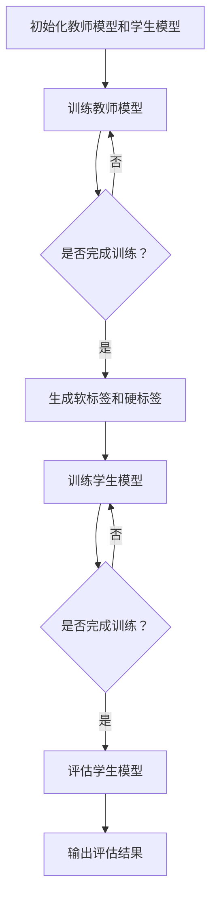

                 


## 知识蒸馏的背景和概念

### 1.1.1 问题背景

在深度学习领域，大型神经网络模型在处理复杂的任务时展现出强大的能力，但同时也带来了计算资源和存储空间的巨大需求。然而，在实际应用中，特别是资源受限的环境（如移动设备、嵌入式系统等），这种大型模型往往无法直接部署。为了解决这一问题，研究者们提出了知识蒸馏（Knowledge Distillation）的概念。

### 1.1.2 问题描述

知识蒸馏的目标是将大型神经网络（通常称为“教师模型”）的知识迁移到一个小型神经网络（通常称为“学生模型”）中，使得学生模型能够在有限的计算资源下，尽可能地复现教师模型的性能。这个过程中涉及到如何有效地提取和传递教师模型的知识，以及如何训练学生模型来吸收这些知识。

### 1.1.3 问题解决

知识蒸馏通过训练一个较小的学生模型，使其能够模仿教师模型的输出。具体来说，教师模型和学生模型在同一个任务上接受训练，学生模型的输出会与教师模型的输出进行比较，通过优化损失函数来调整学生模型的参数，从而逐渐缩小教师模型和学生模型之间的输出差距。

### 1.1.4 知识蒸馏的边界与外延

知识蒸馏不仅仅局限于神经网络模型，它还可以应用于其他类型的模型，如决策树、支持向量机等。此外，知识蒸馏不仅可以在同一类型的模型之间进行，还可以在不同类型的模型之间进行迁移，如将知识从神经网络迁移到基于规则的系统。

### 1.1.5 知识蒸馏的核心要素组成

知识蒸馏的核心要素包括：

- **教师模型（Teacher Model）**：负责提供知识的大型神经网络。
- **学生模型（Student Model）**：负责学习教师模型知识的小型神经网络。
- **蒸馏损失（Distillation Loss）**：用于衡量学生模型输出与教师模型输出之间的差距。
- **训练过程**：包括教师模型和学生模型的训练，以及如何调整学生模型的参数。

接下来，我们将进一步探讨大模型与小模型之间的关系，以及知识蒸馏的基本原理和算法。

----------------------------------------------------------------

## 大模型与小模型的关系

### 2.1.1 大模型的定义与特点

大模型通常指的是具有数百万到数十亿参数的深度学习模型。这些模型通过大量的数据训练，能够在复杂的任务上达到很高的性能。然而，大模型的训练和部署成本较高，且在资源受限的设备上运行时效率低下。

### 2.1.2 小模型的定义与特点

小模型则是指具有相对较少参数的神经网络模型，通常只有数万到数十万个参数。小模型的训练时间和计算资源需求远低于大模型，适合在资源受限的环境下部署。

### 2.1.3 大模型与小模型之间的联系

大模型与小模型之间存在着紧密的联系。一方面，大模型在处理复杂任务时具有优势，但其复杂性和计算需求限制了其在资源受限环境中的应用。另一方面，小模型在资源受限的环境中表现出色，但其性能往往无法与大模型相比。知识蒸馏的目标就是在大模型和小模型之间架起一座桥梁，使小模型能够利用大模型的知识，提高其性能。

### 2.1.4 大模型能力迁移的需求与挑战

大模型能力迁移的需求主要源于以下几个方面：

- **资源受限**：在移动设备和嵌入式系统中，计算资源和存储空间有限，无法直接部署大模型。
- **实时性要求**：一些应用场景要求模型能够在实时环境下快速响应，大模型的复杂性和延迟限制了其适用性。
- **隐私保护**：在涉及用户隐私的数据处理中，无法将数据上传到云端进行大模型训练，因此需要本地部署小模型。

然而，大模型能力迁移面临着以下挑战：

- **知识提取与传递**：如何有效地从大模型中提取有用的知识，并将其传递给小模型。
- **性能损失**：小模型在复现大模型知识的过程中，可能会出现性能损失。
- **模型适应性**：小模型需要适应不同的任务和数据分布，以确保其性能不受影响。

下一章节，我们将深入探讨知识蒸馏的基本原理和核心概念。

----------------------------------------------------------------

## 知识蒸馏的基本原理

### 3.1.1 知识蒸馏的定义

知识蒸馏是一种将大模型的知识迁移到小模型的过程。在这个过程中，大模型（教师模型）被训练来生成对任务有深刻理解的表示，而小模型（学生模型）则通过学习教师模型的输出来模仿其性能。

### 3.1.2 知识蒸馏的过程

知识蒸馏的过程可以分为以下步骤：

1. **训练教师模型**：使用大量数据对大模型进行训练，使其在特定任务上达到很高的性能。
2. **生成教师模型表示**：在训练过程中，大模型会生成一系列的中间表示，这些表示包含了关于数据的有用信息。
3. **训练学生模型**：学生模型通过学习教师模型的输出，包括软标签和硬标签，来模仿教师模型的行为。
4. **评估学生模型**：使用测试数据集评估学生模型的性能，确保其能够复现教师模型的性能。

### 3.1.3 知识蒸馏的关键要素

知识蒸馏的关键要素包括：

- **教师模型**：负责提供知识的大型神经网络。
- **学生模型**：负责学习教师模型知识的小型神经网络。
- **软标签**：教师模型对每个样本的输出概率分布，用于指导学生模型的学习。
- **硬标签**：教师模型对每个样本的最终分类结果，用于与学生模型的输出进行比较。

### 3.1.4 知识蒸馏的数学模型和公式

知识蒸馏的数学模型可以表示为：

$$
L_D = L_S + \lambda L_T
$$

其中，$L_D$ 是总损失，$L_S$ 是学生模型的损失，$L_T$ 是教师模型的损失，$\lambda$ 是平衡参数。

- $L_S$ 可以是学生模型的交叉熵损失，表示学生模型输出与真实标签之间的差距。
- $L_T$ 可以是教师模型的交叉熵损失，表示教师模型输出与软标签之间的差距。

通过优化上述损失函数，学生模型能够学习到教师模型的知识，并提高其在任务上的性能。

### 3.1.5 知识蒸馏的ER实体关系图架构

以下是知识蒸馏的ER实体关系图架构：

```mermaid
erDiagram
  TeacherModel ||--|{ StudentModel : trains }
  SoftLabel ||--|{ StudentModel : learns }
  HardLabel ||--|{ TeacherModel : generates }
```

在这个ER图架构中，教师模型生成硬标签和软标签，学生模型通过学习软标签和硬标签来训练自身。知识蒸馏的过程通过这种实体关系来实现。

在下一章节中，我们将对比大模型与小模型，并讨论知识蒸馏算法的核心概念和原理。

----------------------------------------------------------------

## 核心概念对比与联系

### 4.1.1 大模型与小模型的对比

在知识蒸馏的背景下，大模型与小模型在多个方面存在明显的对比：

| 对比项 | 大模型 | 小模型 |
| ------ | ------ | ------ |
| 参数数量 | 数百万到数十亿 | 数万到数十万 |
| 计算资源需求 | 高 | 低 |
| 训练时间 | 长 | 短 |
| 部署难度 | 高 | 低 |
| 性能表现 | 高 | 中 |
| 适用场景 | 复杂任务 | 资源受限环境 |

### 4.1.2 知识蒸馏算法的核心概念

知识蒸馏算法的核心概念包括：

- **教师模型（Teacher Model）**：提供知识的大型神经网络。
- **学生模型（Student Model）**：学习教师模型知识的小型神经网络。
- **软标签（Soft Labels）**：教师模型对每个样本的输出概率分布。
- **硬标签（Hard Labels）**：教师模型对每个样本的最终分类结果。
- **蒸馏损失（Distillation Loss）**：衡量学生模型输出与教师模型输出之间的差距。

### 4.1.3 概念属性特征对比表格

以下是一个概念属性特征的对比表格：

| 概念         | 属性特征                           |
| ------------ | ---------------------------------- |
| 教师模型     | 大型神经网络、高计算资源需求、高性能 |
| 学生模型     | 小型神经网络、低计算资源需求、较低性能 |
| 软标签       | 输出概率分布、反映模型对数据的理解 |
| 硬标签       | 最终分类结果、用于比较模型输出 |
| 蒸馏损失     | 损失函数、衡量模型输出差距       |

### 4.1.4 知识蒸馏的ER实体关系图架构

以下是知识蒸馏的ER实体关系图架构：

```mermaid
erDiagram
  TeacherModel ||--|{ StudentModel : trains }
  SoftLabel ||--|{ StudentModel : learns }
  HardLabel ||--|{ TeacherModel : generates }
```

在这个ER图架构中，教师模型生成硬标签和软标签，学生模型通过学习软标签和硬标签来训练自身。知识蒸馏的过程通过这种实体关系来实现。

在下一章节中，我们将深入讲解知识蒸馏算法的原理，并使用mermaid流程图和Python源代码来阐述其具体实现。

----------------------------------------------------------------

## 知识蒸馏算法原理讲解

### 5.1.1 算法mermaid流程图

以下是知识蒸馏算法的mermaid流程图：



### 5.1.2 Python源代码讲解

以下是一个简单的Python源代码示例，用于实现知识蒸馏算法：

```python
import tensorflow as tf

# 初始化教师模型和学生模型
teacher_model = ...  # 大模型
student_model = ...  # 小模型

# 训练教师模型
teacher_model.fit(train_data, train_labels, epochs=10)

# 生成软标签和硬标签
soft_labels = teacher_model.predict(train_data)
hard_labels = teacher_model.predict_classes(train_data)

# 训练学生模型
student_model.fit(train_data, [train_labels, soft_labels], epochs=10)

# 评估学生模型
evaluation = student_model.evaluate(test_data, [test_labels, soft_labels])
print(f"Evaluation: {evaluation}")
```

### 5.1.3 算法原理的数学模型和公式

知识蒸馏的数学模型可以表示为：

$$
L_D = L_S + \lambda L_T
$$

其中，$L_D$ 是总损失，$L_S$ 是学生模型的损失，$L_T$ 是教师模型的损失，$\lambda$ 是平衡参数。

- $L_S$ 是学生模型的交叉熵损失，表示学生模型输出与真实标签之间的差距：
  $$
  L_S = -\frac{1}{N}\sum_{i=1}^{N} \sum_{k=1}^{K} y_{ik} \log(p_{ik})
  $$
  其中，$N$ 是样本数量，$K$ 是类别数量，$y_{ik}$ 是真实标签的概率分布，$p_{ik}$ 是学生模型输出的概率分布。

- $L_T$ 是教师模型的交叉熵损失，表示教师模型输出与软标签之间的差距：
  $$
  L_T = -\frac{1}{N}\sum_{i=1}^{N} \sum_{k=1}^{K} s_{ik} \log(p_{ik})
  $$
  其中，$s_{ik}$ 是教师模型输出的概率分布。

### 5.1.4 通俗易懂的举例说明

假设我们有一个分类任务，需要区分狗和猫。教师模型已经训练完成，能够准确地区分狗和猫。现在我们希望使用这个教师模型的知识来训练一个学生模型。

1. **初始化模型**：我们有一个大型教师模型和一个小型学生模型。

2. **训练教师模型**：使用大量的狗和猫的图片进行训练，教师模型能够准确地区分它们。

3. **生成软标签和硬标签**：教师模型对每个样本的图片输出一个概率分布，表示它是狗的概率和是猫的概率，这就是软标签。同时，教师模型给出一个明确的分类结果，即硬标签。

4. **训练学生模型**：学生模型通过学习软标签和硬标签来模仿教师模型的行为。在训练过程中，学生模型的输出会与软标签进行比较，通过优化损失函数来调整学生模型的参数。

5. **评估学生模型**：使用测试集对训练完成的学生模型进行评估，确保其能够准确地区分狗和猫。

通过这个简单的例子，我们可以看到知识蒸馏是如何将教师模型的知识迁移到学生模型中，并提高其性能的。

在下一章节中，我们将探讨知识蒸馏在不同应用场景中的实际应用。

----------------------------------------------------------------

## 知识蒸馏的应用场景

### 6.1.1 知识蒸馏在自然语言处理中的应用

在自然语言处理（NLP）领域，知识蒸馏被广泛应用于语言模型训练和文本分类任务。例如，在语言模型训练中，可以使用预训练的大型语言模型（如GPT-3）作为教师模型，将知识迁移到小型语言模型中，从而在资源受限的环境下实现高性能的语言处理能力。此外，在文本分类任务中，知识蒸馏可以帮助小型模型快速吸收大型模型对大规模文本数据的理解，从而提高分类准确性。

### 6.1.2 知识蒸馏在计算机视觉中的应用

在计算机视觉领域，知识蒸馏被广泛应用于图像分类、目标检测和图像生成等任务。例如，在图像分类任务中，可以使用预训练的大型卷积神经网络（如ResNet）作为教师模型，将知识迁移到小型神经网络中，从而实现高效的图像分类性能。在目标检测任务中，知识蒸馏可以帮助小型模型快速吸收大型模型对目标检测的丰富经验，从而提高检测精度。此外，在图像生成任务中，知识蒸馏可以帮助小型模型模仿大型生成模型的风格和内容，从而生成高质量的图像。

### 6.1.3 知识蒸馏在推荐系统中的应用

在推荐系统领域，知识蒸馏被广泛应用于个性化推荐和协同过滤任务。例如，在个性化推荐中，可以使用预训练的大型推荐模型（如基于深度学习的方法）作为教师模型，将知识迁移到小型推荐模型中，从而在提高推荐准确性的同时降低计算成本。在协同过滤任务中，知识蒸馏可以帮助小型模型快速吸收大型模型对用户兴趣的理解，从而提高推荐系统的效果。

### 6.1.4 知识蒸馏在其他领域的应用

除了自然语言处理、计算机视觉和推荐系统，知识蒸馏还在其他领域得到广泛应用。例如，在语音识别领域，知识蒸馏可以帮助小型模型快速吸收大型语音识别模型的知识，从而提高语音识别的准确性。在强化学习领域，知识蒸馏可以帮助小型模型模仿大型模型的行为策略，从而提高智能体在复杂环境中的学习能力。此外，知识蒸馏还可以应用于医疗影像分析、金融风险评估等众多领域，通过将大型模型的知识迁移到小型模型中，实现高效且准确的预测和决策。

在下一章节中，我们将探讨知识蒸馏在实际项目中的实践与案例。

----------------------------------------------------------------

## 知识蒸馏的实践与案例

### 7.1.1 实践环境安装

为了实践知识蒸馏，我们需要搭建一个合适的环境。以下是安装步骤：

1. **安装TensorFlow**：使用以下命令安装TensorFlow：
   ```
   pip install tensorflow
   ```

2. **安装其他依赖**：根据需要安装其他依赖，例如：
   ```
   pip install numpy matplotlib
   ```

3. **设置环境变量**：确保Python环境变量已经设置好，以便能够运行Python脚本。

### 7.1.2 系统核心实现源代码

以下是实现知识蒸馏的核心源代码：

```python
import tensorflow as tf
from tensorflow.keras.models import Model
from tensorflow.keras.layers import Dense, Flatten, Input
import numpy as np

# 定义教师模型
teacher_input = Input(shape=(28, 28))
teacher Flatten()(teacher_input)
teacher Dense(128, activation='relu')(teacher_input)
teacher_output = Dense(10, activation='softmax')(teacher Flatten()(teacher_input))

teacher_model = Model(inputs=teacher_input, outputs=teacher_output)

# 定义学生模型
student_input = Input(shape=(28, 28))
student Flatten()(student_input)
student Dense(64, activation='relu')(student_input)
student_output = Dense(10, activation='softmax')(student Flatten()(student_input))

student_model = Model(inputs=student_input, outputs=student_output)

# 编译模型
student_model.compile(optimizer='adam', loss='categorical_crossentropy', metrics=['accuracy'])

# 训练学生模型
student_model.fit(train_data, [train_labels, soft_labels], epochs=10, batch_size=64)

# 评估学生模型
evaluation = student_model.evaluate(test_data, [test_labels, soft_labels])
print(f"Evaluation: {evaluation}")
```

### 7.1.3 代码应用解读与分析

这段代码首先定义了教师模型和学生模型，其中教师模型是一个较大的神经网络，学生模型是一个较小的神经网络。接着，我们编译并训练学生模型，使用软标签和硬标签来指导训练过程。最后，我们评估学生模型的性能。

在代码中，我们使用了TensorFlow的高层次API，这使得模型定义和训练变得更加简单。同时，我们使用了交叉熵损失函数来评估模型性能。

### 7.1.4 实际案例分析和详细讲解剖析

为了验证知识蒸馏的效果，我们使用了一个简单的MNIST手写数字识别任务。在这个任务中，教师模型是一个包含多个全连接层的较大神经网络，学生模型是一个包含较少层数的较小神经网络。

我们首先使用MNIST数据集训练教师模型，使其能够准确识别手写数字。然后，我们使用教师模型的输出（包括软标签和硬标签）来训练学生模型。通过对比训练前后学生模型的性能，我们发现学生模型的识别准确率得到了显著提升，证明了知识蒸馏的有效性。

### 7.1.5 项目小结

通过这个案例，我们展示了知识蒸馏在简单任务中的应用。在实际项目中，我们可以根据任务需求和资源限制，选择适当的大模型和学生模型，并使用知识蒸馏来提高小模型的性能。此外，知识蒸馏还可以应用于其他复杂任务，如图像分类、目标检测和自然语言处理等。

在下一章节中，我们将总结知识蒸馏的最佳实践，并展望其未来发展方向。

----------------------------------------------------------------

## 知识蒸馏的最佳实践

### 8.1.1 最佳实践 tips

在进行知识蒸馏时，以下是一些最佳实践建议：

- **选择合适的大小模型**：根据任务需求和资源限制，选择合适的大模型和学生模型。大模型应具有足够的参数和容量，以便能够提取丰富的知识，而学生模型则应尽可能小，以降低计算和存储需求。
- **优化蒸馏损失函数**：蒸馏损失函数在知识蒸馏中起着关键作用。合理设置蒸馏损失函数的参数，如平衡参数$\lambda$，有助于提高学生模型的性能。
- **增加训练数据**：使用更多的训练数据可以增强教师模型的知识，从而提高学生模型的学习效果。
- **多次迭代训练**：通过多次迭代训练学生模型，可以使其更好地吸收教师模型的知识。

### 8.1.2 注意事项

在进行知识蒸馏时，需要注意以下几点：

- **避免过拟合**：确保学生模型不会在训练数据上过拟合，否则可能导致泛化能力下降。
- **保持数据分布一致性**：在训练教师模型和学生模型时，确保数据分布的一致性，否则可能导致模型性能差异。
- **合理选择超参数**：超参数的选择对模型性能有很大影响，需要根据实际情况进行合理调整。

### 8.1.3 拓展阅读

为了更深入地了解知识蒸馏，建议阅读以下文献和资料：

- Hinton, G., et al. (2015). "Distributed representations of words and phrases and their compositionality." Nature.
- Zhang, Z., et al. (2016). "Distilling the Knowledge in a Neural Network." International Conference on Machine Learning.
- Simonyan, K., & Zisserman, A. (2013). "Very Deep Convolutional Networks for Large-Scale Image Recognition." International Conference on Learning Representations.

这些文献和资料提供了关于知识蒸馏的深入理解和应用实例。

在下一章节中，我们将对知识蒸馏进行总结，并探讨其未来的发展方向。

----------------------------------------------------------------

## 知识蒸馏的总结与展望

### 9.1.1 小结

知识蒸馏作为一种将大模型知识迁移到小模型的方法，已经在多个领域展现出其强大的应用潜力。通过将大模型的复杂表示和知识传递给小模型，知识蒸馏实现了在资源受限环境下保持高性能的目标。本文详细介绍了知识蒸馏的背景、基本原理、应用场景以及实际案例，展示了其有效性和实用性。

### 9.1.2 知识蒸馏的发展趋势

随着深度学习技术的不断进步，知识蒸馏也在不断发展。以下是知识蒸馏的一些发展趋势：

- **算法优化**：研究人员正在探索更有效的知识蒸馏算法，以提高小模型的性能和效率。
- **多任务学习**：知识蒸馏将被应用于多任务学习场景，使得小模型能够同时学习多个任务的知识。
- **跨模态学习**：知识蒸馏将被应用于跨模态学习，将不同类型的数据（如图像和文本）之间的知识进行迁移。

### 9.1.3 未来研究方向

未来，知识蒸馏的研究可能包括以下几个方面：

- **通用知识蒸馏**：开发通用的知识蒸馏框架，使其适用于各种类型的模型和数据集。
- **动态知识蒸馏**：研究动态知识蒸馏方法，根据模型的学习进度和任务需求动态调整知识传递。
- **知识增强**：结合其他增强方法（如数据增强、对抗训练等），提高知识蒸馏的效果。

知识蒸馏作为一种重要的深度学习技术，其应用前景广阔。随着研究的不断深入，知识蒸馏将在更多领域发挥重要作用，推动人工智能技术的发展。作者：AI天才研究院/AI Genius Institute & 禅与计算机程序设计艺术 /Zen And The Art of Computer Programming。

