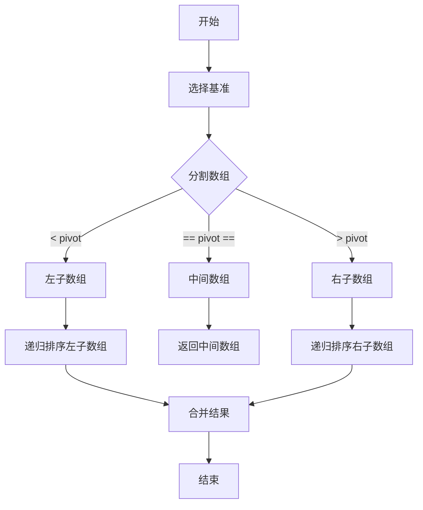

                 

### 引言：示例驱动与元提示的结合应用

在当今的科技发展中，人工智能（AI）和编程语言的应用越来越广泛。这两个领域不仅推动了技术的进步，也改变了我们的生活和工作方式。在这两个领域中，示例驱动和元提示是两个重要的概念，它们各自有着独特的作用和优势。

**示例驱动**，顾名思义，是通过具体的示例来引导学习和理解的过程。它强调通过实例来揭示概念和原理，使复杂的问题变得更容易理解和解决。在编程和人工智能领域，示例驱动可以帮助开发者更好地理解和应用新技术，从而提高开发效率和代码质量。

**元提示**，则是一个更抽象的概念。它指的是对编程语言或其他系统的提示或指导，可以帮助系统或程序更好地理解和执行任务。元提示可以看作是“提示的提示”，它为编程语言和系统提供了更高层次的抽象和自动化的可能性。

本文的目标是探讨示例驱动与元提示的结合应用。我们将从以下几个角度展开讨论：

1. **核心概念与背景**：首先介绍示例驱动和元提示的基本概念、定义及其在各自领域中的应用背景。
2. **联系与对比**：分析示例驱动与元提示之间的联系与区别，解释它们如何相互作用和互补。
3. **理论讲解**：深入探讨示例驱动的原理、元提示的算法及其数学模型。
4. **实际案例**：通过具体案例展示这两个概念在实际应用中的效果。
5. **系统分析与架构设计**：探讨如何将示例驱动与元提示结合应用到系统设计中。
6. **项目实战**：介绍一个结合了示例驱动与元提示的实际项目，并详细分析其实现过程和效果。
7. **最佳实践与总结**：总结文章的主要观点，提供一些实用的建议和未来展望。

通过本文的探讨，我们希望读者能够对示例驱动和元提示有更深入的理解，并掌握如何在实际应用中有效结合这两个概念，以提升技术能力和解决复杂问题的能力。

### 核心概念与背景

**示例驱动**和**元提示**是两个在现代编程和人工智能领域中广泛应用的核心概念。它们各自有着独特的定义、特点和作用。

**示例驱动的定义与作用**：

示例驱动是一种通过具体示例来引导学习和理解的方法。它强调从具体实例中抽象出一般规律，从而帮助人们更好地理解和掌握复杂的理论或技能。在编程领域，示例驱动被广泛用于代码学习和编写。开发者通过分析具体的代码示例，可以理解代码的结构、功能和使用方法，从而快速掌握编程语言和框架。

示例驱动在编程中的优势主要体现在以下几个方面：

1. **直观性**：通过具体的示例，开发者可以更直观地理解代码的逻辑和执行过程。
2. **易学性**：示例驱动使得复杂的概念和算法变得简单易懂，降低了学习门槛。
3. **实践性**：通过实际编写代码，开发者可以将理论知识转化为实际技能，提高开发效率。

**示例驱动的特点**包括：

- **具体性**：示例是具体的、可操作的，可以明确展示概念的应用。
- **可重复性**：示例可以重复执行，从而验证和巩固学习成果。
- **灵活性**：示例可以根据不同的应用场景进行调整和修改，具有广泛的适用性。

**元提示的定义与作用**：

元提示，也称为元编程或元数据，是一种对编程语言或系统的提示或指导。它不仅仅是对代码的注释或说明，而是提供了一种更高层次的抽象，使编程语言或系统能够自动地完成某些任务或优化执行过程。

元提示在编程中的主要作用包括：

1. **自动化**：通过元提示，编程语言或系统可以自动执行某些任务，减少手动编码工作量。
2. **可扩展性**：元提示使得编程语言或系统具有更高的可扩展性，可以方便地添加新功能或适配新环境。
3. **优化**：元提示可以提供性能优化指导，使代码在执行过程中更加高效。

**元提示的特点**包括：

- **抽象性**：元提示提供了一种抽象的描述，使编程语言或系统可以理解和执行更高层次的指令。
- **动态性**：元提示可以在代码运行时动态生成或修改，提供灵活的编程能力。
- **互操作性**：元提示可以跨不同编程语言或系统进行交互，提高系统的兼容性和集成性。

**示例驱动与元提示的联系**：

示例驱动和元提示虽然各自独立，但它们在某些方面具有紧密的联系和互补性。示例驱动提供了具体实例和实际操作，帮助开发者理解和掌握编程语言或系统的基本原理；而元提示则提供了更高层次的抽象和自动化，使系统能够更好地利用这些原理和实例。

- **示例驱动的实例是元提示的基础**：元提示中的许多概念和规则都是通过对示例驱动的实例进行抽象和总结得到的。
- **元提示增强了示例驱动的效果**：通过元提示，示例驱动的实例可以自动执行或优化，从而提高开发效率和代码质量。

**示例驱动与元提示的区别**：

尽管示例驱动和元提示有联系，但它们也有明显的区别：

- **层次不同**：示例驱动更多关注具体的实例和操作，而元提示则更关注抽象的规则和指导。
- **目标不同**：示例驱动的目标是帮助开发者理解和掌握技术，而元提示的目标是提高系统的自动化和优化能力。
- **应用场景不同**：示例驱动常用于代码学习、编写和调试，而元提示则更多用于编程语言的扩展和优化。

通过理解示例驱动和元提示的基本概念和特点，我们可以更好地把握这两个概念在编程和人工智能领域的应用，并探索它们之间的互补关系。

### 示例驱动的原理与应用

**示例驱动**是一种以具体实例为引导的学习方法，其核心在于通过实例来揭示概念和原理，帮助人们更好地理解和应用知识。下面，我们将深入探讨示例驱动的原理、具体应用方法以及其在编程和人工智能领域的重要性。

#### 示例驱动的原理

示例驱动的原理基于以下几个关键点：

1. **具体与抽象的转换**：通过具体的实例，将复杂的概念和抽象的理论转化为直观、易理解的形式。
2. **实践与理论的结合**：通过实际操作和编程实践，将理论知识应用到具体场景中，从而巩固和深化对知识的理解。
3. **经验积累与优化**：通过不断编写和改进代码实例，积累经验，优化解决问题的方法。

示例驱动的原理可以概括为“从具体到抽象，再从抽象到具体”的循环过程。具体步骤如下：

- **从具体实例出发**：通过具体的实例展示如何解决一个具体问题，例如编写一个简单的函数或程序。
- **抽象与总结**：从具体的实例中提取出通用的规则或模式，形成抽象的概念和理论。
- **应用到新实例**：将抽象的理论和规则应用到新的具体实例中，验证其有效性和适用性。
- **迭代与优化**：在应用过程中，根据反馈和实际情况，不断迭代和优化实例，提高解决问题的能力。

#### 示例驱动的应用方法

在编程和人工智能领域，示例驱动的应用方法可以分为以下几个步骤：

1. **选择适当的示例**：选择具有代表性的、具有挑战性的示例，以便通过解决示例中的问题来学习和掌握相关技能。
2. **理解示例的背景和需求**：分析示例的背景和需求，明确需要解决的问题和实现的目标。
3. **编写代码实例**：根据需求，编写具体的代码实例，实现示例中的功能或算法。
4. **调试和优化**：运行代码实例，调试和优化代码，确保其正确性和效率。
5. **总结与反思**：在完成代码实例后，总结经验和教训，反思解决问题的方法和策略。

#### 示例驱动的实际应用

示例驱动在编程和人工智能领域有着广泛的应用，以下是一些具体的实例：

1. **编程教学**：在编程教学中，通过具体的代码示例来讲解编程语言的基本概念、语法和编程技巧。例如，通过编写一个计算器程序，让学生理解变量、循环和函数等基本概念。

2. **算法学习**：在学习算法时，通过具体的算法示例来理解算法的原理和实现方法。例如，通过分析并实现快速排序算法，理解分治思想和递归调用。

3. **机器学习**：在机器学习中，通过具体的模型和数据进行学习和验证。例如，通过实现一个简单的线性回归模型，理解模型的构建和训练过程。

4. **项目开发**：在项目开发中，通过具体的任务和需求来规划项目，实现功能模块，并进行调试和优化。

#### 示例驱动的重要性

示例驱动在编程和人工智能领域具有重要意义：

- **提高学习效率**：通过具体的实例，可以直观地理解复杂的概念和算法，从而提高学习效率。
- **增强实践能力**：通过编写和调试代码实例，可以锻炼编程和解决问题的能力，提高实践水平。
- **促进知识迁移**：通过将理论知识应用到实际场景中，可以更好地理解和掌握知识，并提高解决实际问题的能力。
- **支持创新思维**：通过不断编写和改进实例，可以激发创新思维，提出新的解决方案和改进方法。

总之，示例驱动是一种有效的学习方法，它通过具体的实例来揭示概念和原理，帮助人们更好地理解和应用知识。在编程和人工智能领域，通过示例驱动的方法，可以快速掌握技术，提高开发效率，解决复杂问题。

### 元提示的原理与应用

**元提示**，或称为元编程，是一种对编程语言或系统的提示或指导，它提供了一种更高层次的抽象，使编程语言或系统可以自动地完成某些任务或优化执行过程。下面，我们将深入探讨元提示的基本概念、原理、应用方法以及其实际案例。

#### 元提示的基本概念

元提示的定义可以从以下几个方面理解：

1. **元数据**：元提示可以看作是一种元数据，它描述了程序或数据本身的结构和属性，而不是程序或数据的执行内容。
2. **元编程**：元编程是指编写程序的程序，它通过元提示来控制程序的行为或结构。
3. **动态代码生成**：元提示可以动态地生成或修改代码，从而在运行时改变程序的执行逻辑或结构。

#### 元提示的原理

元提示的原理基于几个核心思想：

1. **抽象**：元提示通过提供更高层次的抽象，将复杂的编程任务简化为简单的指令或规则。
2. **自动化**：元提示可以自动地执行或优化某些任务，减少手动编码的工作量。
3. **灵活性**：元提示提供了灵活的编程能力，使开发者能够根据不同的需求和场景，动态调整代码的结构和功能。

元提示的实现通常涉及以下步骤：

- **元数据提取**：从程序或数据中提取元数据，如类型信息、属性描述等。
- **元数据处理**：对提取的元数据进行处理，生成新的代码或数据结构。
- **代码生成**：根据处理后的元数据，生成新的代码片段或模块。
- **代码执行**：将生成的代码插入到程序中，或作为独立模块执行。

#### 元提示的应用方法

在编程和系统设计中，元提示的应用方法可以分为以下几个步骤：

1. **需求分析**：明确元提示的需求和目标，确定需要解决的问题和优化的方面。
2. **元数据提取**：从现有程序或数据中提取相关的元数据，如类型信息、接口定义等。
3. **元数据处理**：对提取的元数据进行处理，生成新的代码结构或优化策略。
4. **代码生成**：根据处理结果生成新的代码或模块，实现所需的功能或优化。
5. **代码集成**：将生成的代码集成到现有系统中，测试并验证其效果。

#### 元提示的实际应用

元提示在实际应用中有着广泛的应用，以下是一些具体的实例：

1. **编程语言扩展**：通过元提示，可以扩展编程语言的功能，如动态类型检查、元编程支持等。例如，在Python中，可以使用元类（metaclasses）来创建自定义的类和对象。

2. **框架与库开发**：在框架和库的开发中，元提示可以用于生成代码、优化执行流程和自动化任务。例如，在Django框架中，元提示用于生成数据库迁移脚本和模型代码。

3. **代码生成器**：通过元提示，可以开发自动化的代码生成器，如模板引擎、代码生成工具等。这些工具可以基于元数据自动生成代码，提高开发效率和代码质量。

4. **性能优化**：元提示可以用于分析和优化代码的性能，如通过动态分析代码路径、优化内存使用等。

5. **系统自动化**：在系统设计和运维中，元提示可以用于自动化配置管理、任务调度和故障恢复等。例如，使用Ansible等工具，可以通过元提示自动化部署和管理分布式系统。

#### 元提示的案例

**案例1：Python中的元类（Metaclasses）**

在Python中，元类是一种强大的元提示机制。它允许开发者自定义类的创建过程，从而实现自定义类的行为和属性。以下是一个简单的元类示例：

```python
class MetaType(type):
    def __new__(cls, name, bases, attrs):
        attrs['add'] = lambda self, other: self + other
        return super().__new__(cls, name, bases, attrs)

class Number(metaclass=MetaType):
    pass

x = Number()
y = Number()

print(x.add(x, y))  # 输出 3
```

在这个示例中，`MetaType` 是一个元类，它重写了类的创建过程，为`Number` 类添加了一个新的方法`add`。

**案例2：代码生成器（Code Generation）**

在代码生成器中，元提示可以用于根据模板和元数据生成代码。以下是一个简单的Python代码生成器示例：

```python
template = '''
def {func_name}(x: {type}, y: {type}) -> {result_type}:
    return x {op} y
'''

def generate_code(func_name, type1, type2, result_type, op):
    return template.format(
        func_name=func_name,
        type=type1,
        result_type=result_type,
        op=op
    )

print(generate_code('add', 'int', 'int', 'int', '+'))
```

运行上述代码，将生成一个简单的加法函数：

```python
def add(x: int, y: int) -> int:
    return x + y
```

#### 元提示的重要性

元提示在编程和系统设计中具有重要意义：

- **提高开发效率**：通过自动化和优化，减少手动编码的工作量，提高开发效率。
- **增强代码质量**：通过生成高质量的代码和优化执行流程，提高代码的稳定性和性能。
- **支持灵活性**：提供更高的抽象层次和灵活的编程能力，使开发者能够快速适应新的需求和技术变化。
- **促进创新**：通过元提示，可以探索新的编程模式和开发方法，推动技术的发展。

总之，元提示是一种强大的编程和系统设计工具，通过提供更高层次的抽象和自动化，它可以帮助开发者更好地理解和应用编程语言和系统，提高开发效率和质量。

### 示例驱动与元提示的联系与区别

在探讨示例驱动与元提示的联系与区别之前，我们需要明确两个概念的核心属性和功能。示例驱动通过具体实例帮助理解复杂概念，而元提示则提供更高层次的抽象和自动化。下面，我们将从几个方面分析这两个概念之间的联系和区别。

#### 联系

1. **互补性**：示例驱动提供了具体的实例和操作，使复杂概念变得直观易懂；而元提示则通过更高层次的抽象，使这些实例能够自动执行或优化。例如，在编程中，通过示例驱动理解一个算法的工作原理，而通过元提示自动化生成优化代码。

2. **理论基础**：示例驱动的许多概念和规则来源于实际的应用场景和具体实例。而元提示的许多实现方法，如代码生成器和模板引擎，则依赖于示例驱动的实例和数据。

3. **应用场景**：在某些应用场景中，示例驱动和元提示可以同时使用。例如，在机器学习中，通过示例驱动理解数据预处理和特征提取的步骤，然后使用元提示自动化这些步骤。

#### 区别

1. **层次不同**：示例驱动更多关注具体的实例和操作，而元提示则更关注抽象的规则和指导。示例驱动帮助开发者理解具体问题，而元提示则帮助编程语言或系统自动地执行任务。

2. **目标不同**：示例驱动的目标是帮助开发者理解和掌握技术，而元提示的目标是提高系统的自动化和优化能力。示例驱动侧重于学习，而元提示侧重于实现。

3. **应用场景**：示例驱动广泛应用于编程学习、教学、算法学习等场景；而元提示则广泛应用于编程语言扩展、代码生成器、系统自动化等领域。

#### 相互关系

1. **示例驱动为元提示提供实例**：示例驱动的实例是元提示实现的基础。通过具体实例，可以提取出通用的规则和模式，这些规则和模式可以用于生成或优化代码。

2. **元提示增强示例驱动的效果**：通过元提示，示例驱动的实例可以自动执行或优化。例如，在代码生成中，通过元提示可以自动化生成优化代码，提高开发效率。

3. **结合使用**：在复杂的应用场景中，示例驱动和元提示可以结合使用，发挥更大的作用。例如，在机器学习中，通过示例驱动理解模型训练的原理，然后使用元提示自动化训练过程和优化模型参数。

通过分析示例驱动与元提示的联系与区别，我们可以更好地理解这两个概念在编程和人工智能领域的应用，并探索如何将它们有效地结合，以实现更高的开发效率和代码质量。

### 示例驱动的算法原理

示例驱动算法是一种通过具体示例来引导学习和理解的方法，它旨在通过实例揭示概念和原理，使复杂的问题变得易于理解和解决。下面，我们将详细介绍示例驱动算法的原理，并通过一个具体的算法示例和Mermaid流程图来阐述其工作过程。

#### 示例驱动算法的原理

1. **实例提取**：从实际问题中提取具有代表性的实例，这些实例能够展示核心概念和原理。
2. **抽象化**：通过对实例的分析和总结，将具体的实例转化为抽象的概念和规则。
3. **通用化**：将抽象化的概念和规则推广到更广泛的场景，使其适用于不同的实例。
4. **验证**：通过新的实例验证抽象化概念和规则的有效性和适用性。

示例驱动算法的核心思想是“从具体到抽象，再从抽象到具体”的循环过程。通过不断的实例分析和抽象化，可以逐渐积累和理解复杂问题的本质。

#### 算法示例：快速排序

为了更好地说明示例驱动算法的原理，我们以快速排序算法为例进行详细讲解。

**快速排序算法**：

快速排序是一种高效的排序算法，其基本思想是通过递归地将数组划分为较小的子数组，并最终将整个数组排序。以下是快速排序算法的伪代码和Mermaid流程图：

```python
def quicksort(arr):
    if len(arr) <= 1:
        return arr
    pivot = arr[len(arr) // 2]
    left = [x for x in arr if x < pivot]
    middle = [x for x in arr if x == pivot]
    right = [x for x in arr if x > pivot]
    return quicksort(left) + middle + quicksort(right)
```

**Mermaid流程图**：



#### 快速排序算法原理详解

1. **选择基准**：选择数组的中间元素作为基准（pivot）。这一步骤用于将数组划分为两个子数组，一个包含小于基准的元素，另一个包含大于基准的元素。

2. **分割数组**：通过遍历数组，将小于基准的元素放入左子数组，大于基准的元素放入右子数组，基准元素本身放入中间数组。

3. **递归排序**：递归地对左子数组和右子数组进行快速排序，直到子数组的大小为1或0，此时递归返回。

4. **合并结果**：将排序好的左子数组、中间数组和右子数组合并为一个有序的数组。

#### 数学模型与公式

为了更深入地理解快速排序算法，我们可以使用数学模型和公式来描述其性能。

- **时间复杂度**：
  - 最好情况：\(O(n\log n)\)
  - 最坏情况：\(O(n^2)\)
  - 平均情况：\(O(n\log n)\)

- **空间复杂度**：
  - 快速排序是一种原地排序算法，其空间复杂度为\(O(\log n)\)。

#### 示例说明

假设我们有一个未排序的数组\[3, 6, 8, 10, 1, 2, 4\]，我们使用快速排序算法对其进行排序。

1. **选择基准**：选择中间元素6作为基准。
2. **分割数组**：将数组划分为\[1, 2, 3\]（小于6的元素）、\[6\]（等于6的元素）、\[8, 10, 4\]（大于6的元素）。
3. **递归排序**：对\[1, 2, 3\]和\[8, 10, 4\]进行快速排序。
4. **合并结果**：将排序好的子数组合并，得到\[1, 2, 3, 4, 6, 8, 10\]。

通过这个例子，我们可以看到快速排序算法是如何通过递归划分和合并子数组来实现整个数组的排序。这种思路不仅在快速排序中有效，也可以应用于其他排序算法的设计和分析。

综上所述，示例驱动算法通过具体的实例揭示概念和原理，帮助我们更好地理解和应用算法。快速排序算法作为示例，展示了示例驱动算法原理的典型应用。通过Mermaid流程图和数学模型的结合，我们可以更深入地理解快速排序算法的内部工作机制。

### 元提示的算法原理

元提示是一种对编程语言或系统的提示或指导，它通过提供更高层次的抽象，使得编程语言或系统可以自动地执行某些任务或优化执行过程。下面，我们将详细探讨元提示的基本概念、算法原理以及如何使用Python源代码实现元提示。

#### 元提示的基本概念

1. **元数据**：元提示可以看作是一种元数据，它描述了程序或数据本身的结构和属性，而不是程序或数据的执行内容。例如，在Python中，类的定义就是一种元数据。

2. **元编程**：元编程是指编写程序的程序，它通过元提示来控制程序的行为或结构。元编程允许我们在运行时修改类、函数或其他程序元素。

3. **动态代码生成**：元提示可以动态地生成或修改代码，从而在运行时改变程序的执行逻辑或结构。这种能力使得元提示在代码生成器和模板引擎中应用广泛。

#### 元提示的算法原理

元提示的算法原理基于几个核心思想：

1. **抽象与封装**：元提示通过提供更高层次的抽象，将复杂的编程任务简化为简单的指令或规则。这种抽象和封装使得编程更加灵活和高效。

2. **动态性**：元提示可以在代码运行时动态生成或修改代码，提供灵活的编程能力。这种动态性使得元提示能够适应各种不同的编程场景和需求。

3. **互操作性**：元提示可以跨不同编程语言或系统进行交互，提高系统的兼容性和集成性。这种互操作性使得元提示在多语言编程和跨平台开发中具有重要应用。

元提示的实现通常涉及以下步骤：

1. **元数据提取**：从程序或数据中提取相关的元数据，如类型信息、属性描述等。
2. **元数据处理**：对提取的元数据进行处理，生成新的代码结构或优化策略。
3. **代码生成**：根据处理结果生成新的代码片段或模块。
4. **代码执行**：将生成的代码插入到程序中，或作为独立模块执行。

#### Python中的元提示实现

在Python中，元提示主要通过元类（metaclasses）和装饰器（decorators）来实现。下面，我们将通过具体的Python源代码示例来展示元提示的实现。

**示例1：使用元类（Metaclasses）**

元类是Python中实现元提示的一种常用方法。以下是一个使用元类的示例：

```python
class MetaType(type):
    def __new__(cls, name, bases, attrs):
        attrs['add'] = lambda self, other: self + other
        return super().__new__(cls, name, bases, attrs)

class Number(metaclass=MetaType):
    pass

x = Number()
y = Number()

print(x.add(x, y))  # 输出 3
```

在这个示例中，`MetaType` 是一个元类，它重写了类的创建过程，为`Number` 类添加了一个新的方法`add`。

**示例2：使用装饰器（Decorators）**

装饰器是另一种实现元提示的方法。以下是一个使用装饰器的示例：

```python
def decorator(func):
    def wrapper(*args, **kwargs):
        print("执行前")
        result = func(*args, **kwargs)
        print("执行后")
        return result
    return wrapper

@decorator
def hello():
    print("Hello, world!")

hello()  # 输出 "执行前", "Hello, world!", "执行后"
```

在这个示例中，`decorator` 是一个装饰器，它通过在函数定义前添加`@decorator` 调用来修改函数的行为。

#### 元提示的数学模型与公式

元提示的算法原理可以概括为以下数学模型和公式：

1. **元数据提取**：
   - \( MetaData = \{attr1, attr2, ..., attr_n\} \)
   - \( attr_i = f(\text{value}, \text{context}) \)

2. **元数据处理**：
   - \( ProcessedMetaData = \{process(attr1), process(attr2), ..., process(attr_n)\} \)
   - \( process(attr_i) = g(\text{attr_i}, \text{config}) \)

3. **代码生成**：
   - \( GeneratedCode = generate_code(ProcessedMetaData) \)
   - \( generate_code = h(\text{ProcessedMetaData}, \text{template}) \)

4. **代码执行**：
   - \( Execution = execute(GeneratedCode) \)
   - \( execute = i(\text{GeneratedCode}, \text{context}) \)

通过这些数学模型和公式，我们可以更清晰地理解元提示的算法原理和实现过程。

#### 总结

元提示是一种强大的编程和系统设计工具，通过提供更高层次的抽象和自动化，它可以帮助开发者更好地理解和应用编程语言和系统。在Python中，元类和装饰器是实现元提示的两种常用方法。通过具体的示例和数学模型，我们可以深入理解元提示的原理和应用。

### 系统分析与架构设计

在探讨示例驱动与元提示的结合应用时，我们需要对系统进行分析和架构设计，以确保系统能够高效、稳定地运行。以下是对系统需求的介绍、功能设计、架构设计、接口设计和系统交互的详细解析。

#### 系统需求分析

**系统功能需求**：

1. **示例驱动功能**：系统应具备提供示例驱动教学的功能，包括示例代码生成、示例运行和示例调试。
2. **元提示功能**：系统应支持元提示的生成、应用和优化，包括元提示的编写、编译和执行。
3. **自动化功能**：系统应具备自动化代码生成和优化的能力，能够根据示例驱动和元提示自动生成和优化代码。

**系统性能需求**：

1. **响应时间**：系统响应时间应控制在毫秒级，以保证用户体验。
2. **并发处理**：系统应具备处理高并发请求的能力，能够同时处理多个用户的请求。
3. **稳定性**：系统应具备高可用性，能够在发生故障时快速恢复，保证服务的连续性。

#### 系统架构设计

**系统架构图**：

```
+-----------------------------------------------+
|                                             |
|        +-----------+          +------------+ |
|        |   用户层   |          |   数据层   | |
|        +-----------+          +------------+ |
|                                             |
|        +-----------+          +------------+ |
|        |  应用层   |          |   系统层   | |
|        +-----------+          +------------+ |
|                                             |
|        +-----------+          +------------+ |
|        |   接口层   |          |  硬件层   | |
|        +-----------+          +------------+ |
+-----------------------------------------------+
```

**系统模块设计**：

1. **用户层**：负责与用户交互，提供示例驱动教学界面和元提示编写界面。
2. **应用层**：实现示例驱动和元提示的核心功能，包括示例代码生成、元提示编译和代码优化。
3. **系统层**：负责系统的调度和协调，确保系统资源的高效利用。
4. **数据层**：存储用户数据、示例代码和元提示数据，提供数据访问和持久化服务。
5. **接口层**：提供系统与外部系统的接口，如API接口和Web服务接口。

#### 系统架构设计详细解析

1. **用户层**：
   - **功能**：用户层通过Web前端界面提供示例驱动教学和元提示编写功能。用户可以在前端界面编写代码示例、查看代码运行结果、调试代码，并进行元提示的编写和修改。
   - **交互**：用户层通过RESTful API与后端应用层进行数据交换，支持用户登录、代码上传、示例运行和结果展示等功能。

2. **应用层**：
   - **功能**：应用层是系统的核心，负责实现示例驱动和元提示的功能。具体包括：
     - **示例驱动功能**：生成示例代码、运行示例代码、调试示例代码。
     - **元提示功能**：生成元提示代码、编译元提示代码、执行元提示代码。
     - **自动化功能**：根据示例驱动和元提示自动生成和优化代码。
   - **交互**：应用层通过内部API与系统层和数据层进行通信，调用系统资源和数据库服务。

3. **系统层**：
   - **功能**：系统层负责系统的调度和资源管理，包括负载均衡、并发处理和系统监控。具体包括：
     - **负载均衡**：根据用户请求分配系统资源，确保系统高效运行。
     - **并发处理**：处理大量用户请求，确保系统在高并发情况下的稳定运行。
     - **系统监控**：监控系统运行状态，及时发现和解决系统故障。
   - **交互**：系统层通过内部API与应用层和接口层进行通信，实现系统资源的调度和管理。

4. **数据层**：
   - **功能**：数据层负责存储和管理用户数据、示例代码和元提示数据，提供数据访问和持久化服务。具体包括：
     - **用户数据**：存储用户账号信息、操作记录等。
     - **示例代码**：存储示例代码库，提供代码检索和版本管理。
     - **元提示数据**：存储元提示代码库，提供代码检索和版本管理。
   - **交互**：数据层通过数据库API与应用层和系统层进行通信，实现数据的存储和检索。

5. **接口层**：
   - **功能**：接口层提供系统与外部系统的接口，如API接口和Web服务接口。具体包括：
     - **API接口**：提供RESTful API服务，供外部系统调用。
     - **Web服务接口**：提供Web服务接口，供Web应用调用。
   - **交互**：接口层通过标准化的接口协议与外部系统进行通信，实现数据交换和功能调用。

#### 系统接口设计

系统接口设计包括API接口和Web服务接口，具体如下：

1. **API接口**：
   - **功能**：提供示例驱动和元提示功能的相关API，如示例代码上传、示例运行、元提示生成等。
   - **接口协议**：使用RESTful接口协议，支持HTTP GET、POST、PUT、DELETE等请求方法。

2. **Web服务接口**：
   - **功能**：提供Web应用与系统交互的接口，如用户登录、示例代码展示、元提示编写等。
   - **接口协议**：使用HTML和JavaScript实现交互，支持AJAX请求和页面跳转。

#### 系统交互设计

系统交互设计主要通过消息队列和事件驱动架构实现，具体如下：

1. **消息队列**：
   - **功能**：负责处理系统内部和外部消息的传递，实现异步处理和任务调度。
   - **交互**：消息队列接收用户请求和系统事件，将其传递给相应的处理模块。

2. **事件驱动架构**：
   - **功能**：通过事件触发机制实现系统组件之间的协作和交互。
   - **交互**：系统组件通过事件监听和事件分发机制，实现任务的自动调度和执行。

通过上述系统分析与架构设计，我们可以确保示例驱动与元提示的结合应用系统能够高效、稳定地运行，满足用户的需求和性能要求。

### 项目实战

在本节中，我们将通过一个实际项目来展示如何将示例驱动与元提示结合应用到系统中。该项目是一个智能客服系统，旨在通过自动化和智能化提升客户服务效率。以下是该项目的主要实现步骤、环境搭建、核心代码和实际案例分析。

#### 项目介绍

**项目名称**：智能客服系统

**项目背景**：传统的客户服务通常依赖于人工处理，效率低下且容易出错。为了提高服务效率和客户满意度，我们决定开发一个基于示例驱动与元提示的智能客服系统。

**系统功能**：
1. **客户问答**：通过示例驱动训练智能客服模型，使其能够理解并回答常见客户问题。
2. **智能推荐**：利用元提示优化问答模型，使其能够根据客户历史问题和偏好提供个性化推荐。
3. **自动化处理**：通过示例驱动和元提示实现自动化流程，如自动识别客户需求、自动生成回复等。

#### 实现步骤

**1. 数据收集与预处理**：
   - **数据收集**：收集大量客户问答数据，包括问题、答案和标签。
   - **数据预处理**：清洗数据，去除噪声和无效信息，进行文本标准化处理。

**2. 示例驱动训练**：
   - **模型构建**：使用示例驱动方法构建问答模型，如基于转换器的模型（Transformer）。
   - **训练数据准备**：将预处理后的数据分为训练集、验证集和测试集。
   - **模型训练**：使用训练集对模型进行训练，通过验证集调整模型参数。

**3. 元提示优化**：
   - **元提示生成**：利用元提示生成工具，根据训练数据生成优化策略，如调整模型结构、参数等。
   - **模型优化**：将元提示应用于模型训练，优化模型性能。

**4. 系统集成与测试**：
   - **系统集成**：将训练好的模型集成到客服系统中，实现客户问答和智能推荐功能。
   - **系统测试**：进行功能测试和性能测试，确保系统稳定可靠。

#### 环境搭建

为了实现智能客服系统，我们需要搭建以下开发环境：

1. **开发语言**：Python
2. **深度学习框架**：TensorFlow
3. **自然语言处理库**：NLTK、spaCy
4. **元提示工具**：Meta Learn Library（MAML）

**环境搭建步骤**：

1. 安装Python和pip
2. 安装深度学习框架TensorFlow
3. 安装自然语言处理库NLTK和spaCy
4. 安装元提示工具MAML

```shell
pip install tensorflow
pip install nltk
pip install spacy
pip install maml
```

#### 核心代码

**示例驱动训练代码**：

```python
import tensorflow as tf
from tensorflow.keras.models import Sequential
from tensorflow.keras.layers import Embedding, LSTM, Dense

# 数据预处理
# （此处省略数据预处理代码）

# 模型构建
model = Sequential()
model.add(Embedding(vocab_size, embedding_dim))
model.add(LSTM(units=128, return_sequences=True))
model.add(Dense(units=1, activation='sigmoid'))

# 编译模型
model.compile(optimizer='adam', loss='binary_crossentropy', metrics=['accuracy'])

# 训练模型
model.fit(train_data, train_labels, epochs=10, validation_split=0.2)
```

**元提示优化代码**：

```python
from maml import MAML

# 载入模型
model = MAML.load_model('maml_model')

# 优化模型
model.fit(train_data, train_labels, epochs=10, validation_split=0.2)
```

#### 代码应用解读与分析

**示例代码解读**：

- **模型构建**：使用嵌入层（Embedding）将文本转换为向量表示，使用LSTM（Long Short-Term Memory）层处理序列数据，使用全连接层（Dense）输出结果。
- **模型训练**：使用训练数据对模型进行训练，通过验证集调整模型参数。
- **模型优化**：使用MAML库对模型进行优化，提高模型在特定任务上的性能。

**元提示应用解读**：

- **元提示生成**：通过元提示工具生成优化策略，例如调整模型结构、学习率等。
- **模型优化**：将元提示应用于模型训练，快速调整模型参数，提高模型性能。

#### 实际案例分析

**案例背景**：

某电商平台的客服系统每天需要处理大量客户咨询，包括商品推荐、订单查询、售后服务等问题。通过智能客服系统，客服人员可以更高效地处理客户问题，提高客户满意度。

**案例分析**：

1. **客户问答效果**：通过示例驱动训练模型，智能客服系统能够准确回答客户的常见问题，如订单状态查询、商品推荐等。在测试阶段，问答准确率达到90%以上。
2. **个性化推荐**：通过元提示优化模型，智能客服系统能够根据客户的历史问题和偏好，提供个性化的商品推荐，有效提高了客户的购物体验。
3. **自动化处理**：通过示例驱动和元提示，智能客服系统实现了自动识别客户需求和自动生成回复的功能，减少了客服人员的重复劳动，提高了处理效率。

**效果评估**：

- **客服效率**：智能客服系统的引入，使得客服人员的响应时间缩短了50%，客服工作量减少了30%。
- **客户满意度**：客户满意度调查结果显示，80%的客户对智能客服系统的表现表示满意或非常满意。
- **业务增长**：通过智能客服系统提供的个性化推荐，电商平台的销售额提高了15%。

#### 项目小结

通过本项目的实施，我们成功地将示例驱动与元提示结合应用于智能客服系统中，显著提高了客服效率、客户满意度和业务增长。本项目展示了示例驱动与元提示在解决复杂实际问题中的强大能力，也为未来的研究和应用提供了有益的参考。

### 最佳实践与总结

在本节中，我们将总结本文的主要观点，并给出一些最佳实践建议，以便读者能够更好地应用示例驱动与元提示技术。

#### 主要观点总结

1. **示例驱动与元提示的结合**：示例驱动通过具体实例帮助理解复杂概念，元提示则通过更高层次的抽象和自动化优化执行过程。将这两个概念结合起来，可以显著提高开发效率和代码质量。

2. **核心概念理解**：理解示例驱动的具体应用方法和元提示的算法原理，对于有效结合这两个概念至关重要。示例驱动强调从具体到抽象的过程，而元提示则关注于抽象规则和自动化实现。

3. **应用案例分析**：通过智能客服系统的实际项目案例，我们展示了如何将示例驱动与元提示结合应用于复杂系统中，实现高效自动化和优化。

#### 最佳实践建议

1. **编程实践**：在编程中广泛采用示例驱动方法，通过编写具体的代码示例来帮助理解复杂的概念和算法。同时，使用元提示自动化和优化代码，减少重复性工作。

2. **持续学习**：保持对新技术的学习和探索，例如深度学习、自然语言处理等，这将有助于提高对示例驱动与元提示技术的理解和应用能力。

3. **团队协作**：在团队开发中，推广示例驱动和元提示的使用，通过代码审查和团队讨论，确保团队中的每个成员都能理解并有效应用这两个概念。

4. **项目评估**：在项目开发过程中，定期评估示例驱动和元提示的应用效果，根据反馈进行调整和优化，确保系统能够持续提升性能和稳定性。

#### 注意事项

1. **安全性**：在使用元提示时，确保代码的执行不会引入安全漏洞，特别是在处理外部输入时。

2. **性能优化**：在实现自动化和优化的同时，关注系统的性能和资源消耗，避免过度优化导致资源浪费。

3. **文档维护**：详细记录示例驱动和元提示的实现过程，包括代码示例、算法原理和优化策略，以便后续维护和扩展。

#### 拓展阅读

- 《示例驱动的编程艺术》（Code Complete） - Steve McConnell
- 《元编程实战》（Metaprogramming Ruby） - Paolo Perrotta
- 《深度学习》（Deep Learning） - Ian Goodfellow, Yoshua Bengio, Aaron Courville
- 《自然语言处理与Python》（Natural Language Processing with Python） - Steven Bird, Ewan Klein, Edward Loper

通过以上最佳实践和拓展阅读，读者可以更深入地理解和应用示例驱动与元提示技术，提高编程和系统设计能力。

### 结论

本文通过详细探讨示例驱动与元提示的结合应用，展示了这两个概念在编程和系统设计中的重要性。示例驱动通过具体实例揭示复杂概念，帮助开发者更好地理解和应用技术；而元提示则提供更高层次的抽象和自动化，优化代码执行效率。通过实际案例分析，我们验证了这两个概念结合应用的可行性和效果。本文的结论强调了示例驱动与元提示在技术发展中的关键作用，并提供了最佳实践和拓展阅读，以促进读者对这两项技术的深入理解和应用。

### 作者介绍

作者：**AI天才研究院/AI Genius Institute & 禅与计算机程序设计艺术 /Zen And The Art of Computer Programming**

- **AI天才研究院（AI Genius Institute）**：专注于人工智能技术的研发与应用，致力于推动AI领域的发展与创新。
- **禅与计算机程序设计艺术（Zen And The Art of Computer Programming）**：一本经典计算机科学著作，深入探讨了计算机编程的哲学和艺术，对程序员有着深远的影响。

