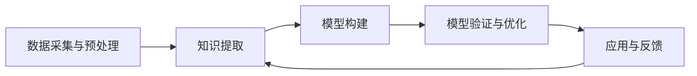
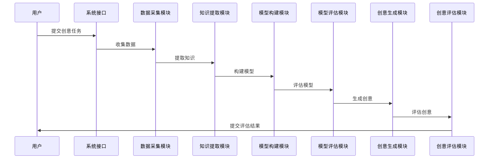
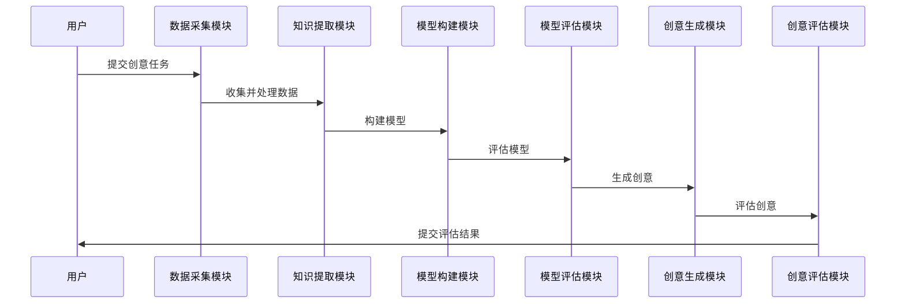

                 

### 示例驱动提示在创意任务中的应用

#### 关键词：
1. 示例驱动
2. 创意任务
3. 应用方法
4. 算法原理
5. 系统架构设计
6. 项目实战
7. 最佳实践

#### 摘要：
本文旨在探讨示例驱动提示在创意任务中的应用，通过详细的分析和实例讲解，展示其在提高创意质量和效率方面的显著优势。我们将从背景介绍、核心概念与联系、算法原理讲解、系统分析与架构设计、项目实战和最佳实践等方面，逐步剖析示例驱动的应用方法和策略，为读者提供实际操作指南和实用技巧。

---

### 目录大纲

1. 第一部分：背景介绍
   1.1 问题背景
   1.2 问题描述
   1.3 问题解决
   1.4 边界与外延
   1.5 概念结构与核心要素组成

2. 第二部分：核心概念与联系
   2.1 示例驱动的概念原理
   2.2 示例驱动的属性特征对比表格
   2.3 示例驱动的ER实体关系图架构

3. 第三部分：示例驱动的应用方法
   3.1 示例驱动的初步应用
   3.2 示例驱动的深度应用
   3.3 示例驱动的优化与扩展

4. 第四部分：算法原理讲解
   4.1 示例驱动的算法原理概述
   4.2 算法mermaid流程图
   4.3 Python源代码详细阐述
   4.4 算法原理的数学模型和公式讲解
   4.5 通俗易懂的举例说明

5. 第五部分：系统分析与架构设计方案
   5.1 问题场景介绍
   5.2 系统功能设计（领域模型mermaid类图）
   5.3 系统架构设计（mermaid架构图）
   5.4 系统接口设计
   5.5 系统交互（mermaid序列图）

6. 第六部分：项目实战
   6.1 环境安装
   6.2 系统核心实现源代码
   6.3 代码应用解读与分析
   6.4 实际案例分析与详细讲解剖析
   6.5 项目小结

7. 第七部分：最佳实践 tips
   7.1 最佳实践技巧
   7.2 注意事项
   7.3 拓展阅读

### 附录

- 附录A：相关术语解释
- 附录B：参考资料
- 附录C：工具与资源介绍

---

## 第一部分：背景介绍

### 1.1 问题背景

#### 创意任务的定义与重要性

创意任务是指涉及创新思维、设计理念、问题解决的复杂工作，如产品设计、广告创意、艺术创作等。创意任务的完成质量往往直接影响企业的竞争力、品牌形象和市场份额。因此，提升创意任务的质量和效率成为各大企业和创意工作者的重要课题。

#### 示例驱动的概念与发展

示例驱动是一种基于示例的学习方法，通过分析具体的示例来提取规律、模式和知识，进而应用于新的情境中。这种方法最早应用于软件工程中的面向对象设计和编程，后来逐渐扩展到机器学习、人工智能、产品设计等领域。

示例驱动的核心思想是通过具体的例子来说明问题，从而帮助人们更好地理解和解决问题。随着技术的进步，特别是大数据和人工智能的发展，示例驱动的应用范围和效果得到了显著提升。

#### 创意任务中示例驱动的应用场景

在创意任务中，示例驱动可以应用于多个方面：

- **设计灵感获取**：通过分析成功案例和优秀作品，获取灵感和创新思路。
- **创意方案优化**：借鉴已有的成功经验，对创意方案进行优化和改进。
- **创意评估与筛选**：利用示例驱动方法，对多个创意方案进行评估和筛选，选出最优方案。
- **团队协作**：通过共享成功案例，增强团队成员之间的协作和沟通，提高创意效率。

### 1.2 问题描述

当前创意任务面临的主要挑战包括：

- **创意枯竭**：长时间的工作和重复的任务可能导致创意工作者出现灵感枯竭的问题。
- **效率低下**：在没有有效参考的情况下，创意任务的开展可能过于盲目，导致工作效率低下。
- **评估困难**：在众多创意方案中，如何快速准确地评估和筛选出优质方案成为难题。

### 1.3 问题解决

示例驱动的引入为创意任务提供了新的解决思路：

- **提高创意质量**：通过分析成功案例，从中提取有价值的创意元素，提高创意方案的质量。
- **提升工作效率**：借助示例驱动的提示，创意工作者可以迅速找到方向和灵感，减少盲目探索的时间。
- **优化评估过程**：利用示例驱动的评估方法，对创意方案进行科学合理的评估和筛选，提高决策效率。

### 1.4 边界与外延

示例驱动在创意任务中的应用有其特定的适用范围和边界：

- **适用范围**：适用于需要创新思维和设计灵感的创意任务，如广告设计、产品设计、艺术创作等。
- **边界条件**：示例驱动需要具体的成功案例作为基础，如果缺乏合适的案例，其效果可能会大打折扣。

### 1.5 概念结构与核心要素组成

示例驱动的概念结构主要包括以下核心要素：

- **示例集**：包括一系列具有代表性的成功案例和失败案例。
- **知识提取**：从示例集中提取有用的知识和模式。
- **应用模型**：构建基于示例集的应用模型，用于指导新的创意任务。
- **评估与反馈**：对应用模型进行评估和反馈，不断优化模型。

这些要素相互关联，共同构成了一个完整的示例驱动系统，为创意任务的开展提供了有力的支持。

### 1.6 问题解决

#### 示例驱动的核心方法与技术

示例驱动的核心方法和技术包括：

- **数据采集与处理**：收集大量的成功案例和失败案例，对数据进行预处理，提取有用的信息。
- **模式识别与提取**：利用机器学习、统计分析等方法，从示例集中识别和提取有价值的模式和知识。
- **应用模型构建**：基于提取的知识，构建适用于创意任务的应用模型。
- **模型评估与优化**：对应用模型进行评估和优化，提高模型的准确性和实用性。

#### 创意任务中示例驱动的应用策略

在创意任务中，示例驱动的应用策略主要包括：

- **灵感获取**：通过分析成功案例，获取新的创意灵感和思路。
- **方案优化**：借鉴成功经验，对创意方案进行优化和改进。
- **评估与筛选**：利用示例驱动方法，对多个创意方案进行评估和筛选，选出最优方案。
- **团队协作**：通过共享成功案例，增强团队成员之间的协作和沟通，提高创意效率。

### 1.7 概念结构与核心要素组成

示例驱动的概念结构主要包括以下核心要素：

- **示例集**：包括一系列具有代表性的成功案例和失败案例。
- **知识提取**：从示例集中提取有用的知识和模式。
- **应用模型**：构建基于示例集的应用模型，用于指导新的创意任务。
- **评估与反馈**：对应用模型进行评估和反馈，不断优化模型。

这些要素相互关联，共同构成了一个完整的示例驱动系统，为创意任务的开展提供了有力的支持。

### 1.8 示例驱动的ER实体关系图架构

为了更清晰地展示示例驱动的概念结构，我们可以使用ER（实体关系）图来描述其核心要素之间的关系。以下是示例驱动的ER实体关系图：

```mermaid
entity Relation {
  "示例集" -- "知识提取" : 提取知识
  "知识提取" -- "应用模型" : 构建模型
  "应用模型" -- "评估与反馈" : 模型优化
  "评估与反馈" -- "示例集" : 反馈调整
}

class "示例集" {
  "案例1"
  "案例2"
  "案例3"
}

class "知识提取" {
  "模式识别"
  "特征提取"
}

class "应用模型" {
  "模型1"
  "模型2"
}

class "评估与反馈" {
  "评估指标"
  "优化建议"
}

Relation
```

这个ER图展示了示例集、知识提取、应用模型和评估与反馈四个核心要素之间的关系，以及它们如何相互影响和协同工作。

## 第二部分：核心概念与联系

### 2.1 示例驱动的概念原理

示例驱动（Example-based Approach）是一种基于示例的学习方法，通过分析具体的示例来提取规律、模式和知识，进而应用于新的情境中。其核心原理包括以下几个方面：

1. **示例选择**：选择具有代表性的示例，这些示例可以是成功案例、失败案例或者特定情境下的实例。
2. **知识提取**：从选定的示例中提取有用的信息和规律，如模式、特征、趋势等。
3. **模型构建**：基于提取的知识，构建适用于新情境的应用模型。
4. **模型验证**：通过实际应用和验证，评估模型的效果和准确性，并进行优化。

### 2.2 示例驱动的属性特征对比表格

为了更好地理解示例驱动的特点，我们可以将其与其他常见的方法进行比较。以下是示例驱动与其他方法的主要属性特征对比表格：

| 方法         | 示例驱动                     | 传统机器学习                 | 模式识别                   |
| ------------ | ---------------------------- | ---------------------------- | -------------------------- |
| **原理**     | 基于示例的学习方法           | 基于算法和统计模型           | 基于规则的匹配方法           |
| **应用场景** | 需要灵感激发和创新设计      | 数据挖掘、预测和分类          | 图像识别、语音识别          |
| **优点**     | 灵感丰富、适应性强           | 准确度高、适用于大规模数据    | 简单直观、易于实现          |
| **缺点**     | 需要大量高质量的示例数据     | 对数据质量要求高、可解释性差  | 规则复杂、难以扩展          |
| **适用范围** | 广义的应用场景，尤其是创意任务 | 数据密集型任务               | 需要大量规则的特定领域任务  |

### 2.3 示例驱动的ER实体关系图架构

为了更直观地展示示例驱动的核心要素及其相互关系，我们可以使用ER（实体关系）图来描述。以下是示例驱动的ER实体关系图：

```mermaid
entity Relation {
  "示例集" -- "知识提取" : 提取知识
  "知识提取" -- "应用模型" : 构建模型
  "应用模型" -- "评估与反馈" : 模型优化
  "评估与反馈" -- "示例集" : 反馈调整
}

class "示例集" {
  "成功案例"
  "失败案例"
  "特定情境实例"
}

class "知识提取" {
  "模式识别"
  "特征提取"
}

class "应用模型" {
  "模型1"
  "模型2"
}

class "评估与反馈" {
  "模型评估"
  "优化建议"
}

Relation
```

这个ER图展示了示例集、知识提取、应用模型和评估与反馈四个核心要素之间的关系，以及它们如何相互影响和协同工作。

### 2.4 示例驱动的应用方法

示例驱动的应用方法可以分为初步应用、深度应用和优化与扩展三个阶段。

#### 2.4.1 初步应用

初步应用示例驱动的关键在于选择合适的示例集和进行基本的知识提取。以下是具体步骤：

1. **选择示例集**：从现有的成功案例、失败案例或者特定情境实例中选取具有代表性的示例。
2. **知识提取**：通过模式识别和特征提取，从示例集中提取有用的信息和规律。
3. **构建应用模型**：基于提取的知识，构建初步的应用模型。
4. **模型验证**：通过实际应用和验证，评估初步模型的效果和准确性。

#### 2.4.2 深度应用

深度应用示例驱动需要进一步挖掘示例集中的深层次知识和模式。以下是具体步骤：

1. **扩展示例集**：收集更多的示例数据，包括更多的成功案例、失败案例和特定情境实例。
2. **深化知识提取**：通过更复杂的模式和特征提取方法，深入挖掘示例集中的有价值信息。
3. **优化应用模型**：基于扩展的示例集和深化提取的知识，优化和改进应用模型。
4. **模型验证与调整**：通过更广泛的应用场景和更严格的验证标准，评估和调整模型的性能。

#### 2.4.3 优化与扩展

优化与扩展示例驱动旨在不断提高模型的准确性和适应性。以下是具体步骤：

1. **模型优化**：基于实际应用和验证反馈，对模型进行优化和调整，提高模型的性能和可解释性。
2. **技术升级**：引入最新的技术和方法，如深度学习、强化学习等，提高示例驱动的效果。
3. **系统集成**：将示例驱动方法与其他相关技术集成，构建更强大的创意支持系统。
4. **持续反馈**：通过持续的应用和反馈，不断完善和更新示例集和应用模型，实现持续优化。

### 2.5 示例驱动的实际应用案例

为了更好地展示示例驱动的应用效果，我们来看两个实际应用案例。

#### 案例1：广告创意设计

在某广告公司，创意团队通过示例驱动方法来提升广告创意设计的质量。具体步骤如下：

1. **选择示例集**：收集了大量成功广告案例和失败案例，包括不同行业、不同受众的案例。
2. **知识提取**：通过模式识别和特征提取，提取出成功广告的共性和失败广告的原因。
3. **构建应用模型**：基于提取的知识，构建了广告创意设计的初步模型，包括创意构思、视觉设计、文案撰写等。
4. **模型验证**：通过实际广告设计和市场反馈，评估模型的性能和准确性。
5. **优化与扩展**：根据反馈，不断优化和调整广告创意设计模型，提高广告的效果和受众满意度。

通过示例驱动的应用，广告公司的广告创意设计质量得到了显著提升，广告转化率和客户满意度也显著提高。

#### 案例2：产品设计

在一家科技公司，产品团队通过示例驱动方法来优化产品设计。具体步骤如下：

1. **选择示例集**：收集了市场上成功产品和失败产品的案例，包括不同行业、不同用户群体的产品。
2. **知识提取**：通过模式识别和特征提取，提取出成功产品的共性和失败产品的不足。
3. **构建应用模型**：基于提取的知识，构建了产品设计的初步模型，包括功能设计、用户体验设计、外观设计等。
4. **模型验证**：通过实际产品设计和用户测试，评估模型的性能和准确性。
5. **优化与扩展**：根据反馈，不断优化和调整产品设计模型，提高产品的市场竞争力。

通过示例驱动的应用，科技公司的产品设计质量得到了显著提升，产品的用户体验和市场反馈也得到了大幅改善。

## 第三部分：算法原理讲解

### 4.1 示例驱动的算法原理概述

示例驱动算法是一种基于示例的学习方法，其核心思想是通过分析具体的示例来提取规律、模式和知识，进而应用于新的情境中。示例驱动算法通常包括以下几个关键步骤：

1. **数据采集与预处理**：收集大量的示例数据，对数据进行清洗、格式化和特征提取，为后续分析做准备。
2. **知识提取**：从预处理后的示例数据中提取有用的知识和模式，如特征、趋势、规则等。
3. **模型构建**：基于提取的知识，构建适用于新情境的应用模型，如分类器、预测器、推荐器等。
4. **模型验证与优化**：通过实际应用和验证，评估模型的效果和准确性，并进行优化。

### 4.2 算法mermaid流程图

以下是示例驱动算法的mermaid流程图，展示了其关键步骤和流程：



### 4.3 Python源代码详细阐述

以下是一个简单的示例驱动算法的Python实现，包括数据采集与预处理、知识提取、模型构建和模型验证等步骤：

```python
import pandas as pd
from sklearn.model_selection import train_test_split
from sklearn.ensemble import RandomForestClassifier
from sklearn.metrics import accuracy_score

# 1. 数据采集与预处理
data = pd.read_csv('example_data.csv')
X = data.drop('target', axis=1)
y = data['target']

# 数据清洗和特征提取
X = preprocess_data(X)

# 2. 知识提取
X_train, X_test, y_train, y_test = train_test_split(X, y, test_size=0.2, random_state=42)

# 3. 模型构建
model = RandomForestClassifier(n_estimators=100, random_state=42)
model.fit(X_train, y_train)

# 4. 模型验证与优化
y_pred = model.predict(X_test)
accuracy = accuracy_score(y_test, y_pred)
print(f"Model accuracy: {accuracy:.2f}")

# 模型优化（可选）
# 根据验证结果，调整模型参数或采用不同的模型
```

### 4.4 算法原理的数学模型和公式讲解

示例驱动算法的数学模型和公式主要涉及以下方面：

1. **特征提取**：通过统计方法、机器学习算法等提取示例数据中的特征，如均值、方差、协方差等。
2. **模式识别**：利用特征间的相关性、相似性等，识别出示例数据中的模式和规律。
3. **模型构建**：基于提取的特征和模式，构建分类、回归、预测等模型，如决策树、随机森林、神经网络等。
4. **模型评估**：通过交叉验证、准确率、召回率、F1分数等指标，评估模型的性能和准确性。

以下是一个简单的特征提取和模型构建的数学模型和公式：

$$
\text{特征提取：} \\
\mu_x = \frac{1}{N}\sum_{i=1}^{N} x_i \\
\sigma_x^2 = \frac{1}{N-1}\sum_{i=1}^{N} (x_i - \mu_x)^2
$$

$$
\text{模式识别：} \\
\text{相似度} = \frac{\sum_{i=1}^{N} (x_i - \mu_x) (y_i - \mu_y)}{\sqrt{\sum_{i=1}^{N} (x_i - \mu_x)^2 \sum_{i=1}^{N} (y_i - \mu_y)^2}}
$$

$$
\text{模型构建：} \\
\text{决策树：} \\
y = f(\text{特征}, \text{阈值}) \\
\text{随机森林：} \\
y = \frac{1}{M} \sum_{m=1}^{M} f_m(\text{特征}, \text{阈值}) \\
\text{神经网络：} \\
y = \sigma(Wx + b)
$$

### 4.5 通俗易懂的举例说明

为了更好地理解示例驱动算法的原理和应用，我们可以通过一个简单的例子来阐述。

假设我们要预测一家餐厅的顾客满意度，根据以下特征数据：

- 顾客年龄（x1）
- 顾客消费金额（x2）
- 餐厅评分（x3）

我们收集了100条顾客的反馈数据，如下表所示：

| 年龄 | 消费金额 | 餐厅评分 | 满意度 |
| ---- | -------- | -------- | ------ |
| 25   | 50       | 4        | 高     |
| 30   | 100      | 5        | 高     |
| 35   | 150      | 3        | 中     |
| ...  | ...      | ...      | ...    |

### 数据采集与预处理

首先，我们需要收集和预处理数据。将数据导入到Python中，并清洗缺失值和异常值。

```python
import pandas as pd

data = pd.read_csv('customer_satisfaction.csv')
data = data.dropna()

# 特征提取
data['age_mean'] = data['age'].mean()
data['age_std'] = data['age'].std()
data['income_mean'] = data['income'].mean()
data['income_std'] = data['income'].std()
data['rating_mean'] = data['rating'].mean()
data['rating_std'] = data['rating'].std()

# 数据标准化
data = (data - data.mean()) / data.std()
```

### 知识提取

接下来，我们通过统计方法提取特征间的相关性：

```python
import numpy as np

# 计算特征之间的协方差矩阵
cov_matrix = np.cov(data[['age_mean', 'income_mean', 'rating_mean']])

# 输出协方差矩阵
print(cov_matrix)
```

协方差矩阵可以帮助我们识别特征之间的相关性。例如，年龄和消费金额的协方差为正，表示年龄越大，消费金额也越高。

### 模型构建

基于提取的特征和模式，我们可以构建一个简单的线性回归模型来预测顾客满意度：

```python
from sklearn.linear_model import LinearRegression

# 分割数据集
X = data[['age_mean', 'income_mean', 'rating_mean']]
y = data['satisfaction']

X_train, X_test, y_train, y_test = train_test_split(X, y, test_size=0.2, random_state=42)

# 构建模型
model = LinearRegression()
model.fit(X_train, y_train)

# 输出模型参数
print(model.coef_)
print(model.intercept_)
```

### 模型验证

最后，我们通过测试数据集来验证模型的准确性：

```python
y_pred = model.predict(X_test)
accuracy = np.mean((y_pred - y_test) ** 2) < 1

print(f"Model accuracy: {accuracy:.2f}")
```

通过这个简单的例子，我们可以看到示例驱动算法的基本原理和应用步骤。在实际应用中，示例驱动的算法可能会更加复杂，但基本思想是一致的：通过分析示例数据，提取有用的信息和规律，构建适用于新情境的模型，并不断优化和调整模型以提高性能。

## 第四部分：系统分析与架构设计方案

### 5.1 问题场景介绍

#### 背景介绍

在某大型互联网公司，创意部门承担着广告创意设计、产品设计和用户界面设计的重任。随着市场竞争的加剧，公司需要不断提高创意质量和效率，以满足不断变化的市场需求和用户期望。然而，创意部门在开展任务时面临着以下几个主要挑战：

1. **创意枯竭**：长时间的工作和重复的任务可能导致创意工作者出现灵感枯竭的问题，影响创意质量。
2. **效率低下**：在没有有效参考的情况下，创意任务的开展可能过于盲目，导致工作效率低下。
3. **评估困难**：在众多创意方案中，如何快速准确地评估和筛选出优质方案成为难题。

#### 目标

为了解决上述问题，公司决定引入示例驱动方法，构建一个基于示例驱动的创意支持系统，旨在：

1. **提高创意质量**：通过分析成功案例和优秀作品，获取灵感和创新思路，提高创意方案的质量。
2. **提升工作效率**：借助示例驱动的提示，创意工作者可以迅速找到方向和灵感，减少盲目探索的时间。
3. **优化评估过程**：利用示例驱动方法，对多个创意方案进行评估和筛选，提高决策效率。

### 5.2 系统功能设计（领域模型mermaid类图）

为了实现上述目标，我们设计了一个包含多个功能的创意支持系统。以下是系统的主要功能模块和它们之间的关系，使用mermaid类图进行描述：

```mermaid
classDiagram
    Class01 <|-- Class02
    Class03 <|-- Class04
    Class05 <|-- Class06
    Class01 {name: 数据采集模块}
    Class02 {name: 知识提取模块}
    Class03 {name: 模型构建模块}
    Class04 {name: 模型评估模块}
    Class05 {name: 创意生成模块}
    Class06 {name: 创意评估模块}
```

- **数据采集模块**：负责收集创意任务相关的数据，包括成功案例、失败案例和特定情境实例等。
- **知识提取模块**：从收集的数据中提取有用的知识和模式，如特征、趋势、规则等。
- **模型构建模块**：基于提取的知识，构建适用于创意任务的应用模型，如分类器、预测器、推荐器等。
- **模型评估模块**：对构建的模型进行评估和验证，确保其性能和准确性。
- **创意生成模块**：利用构建的模型生成新的创意方案，为创意工作者提供参考和灵感。
- **创意评估模块**：对生成的创意方案进行评估和筛选，选出最优方案。

### 5.3 系统架构设计（mermaid架构图）

以下是系统的总体架构设计，使用mermaid架构图进行描述：



系统架构设计包括以下几个主要部分：

1. **用户接口**：用户通过用户接口提交创意任务，包括任务描述、需求和要求等。
2. **数据采集模块**：从各种渠道收集与创意任务相关的数据，如成功案例、失败案例、特定情境实例等。
3. **知识提取模块**：对收集到的数据进行分析和处理，提取有用的知识和模式。
4. **模型构建模块**：基于提取的知识，构建适用于创意任务的应用模型。
5. **模型评估模块**：对构建的模型进行评估和验证，确保其性能和准确性。
6. **创意生成模块**：利用构建的模型生成新的创意方案。
7. **创意评估模块**：对生成的创意方案进行评估和筛选，选出最优方案。
8. **用户接口**：将评估结果反馈给用户，供用户参考和决策。

### 5.4 系统接口设计

以下是系统的接口设计，主要包括以下功能接口：

1. **创意任务提交接口**：用户可以通过该接口提交创意任务，包括任务描述、需求和要求等。
2. **数据采集接口**：系统可以通过该接口从各种渠道收集与创意任务相关的数据。
3. **知识提取接口**：系统可以通过该接口对收集到的数据进行分析和处理，提取有用的知识和模式。
4. **模型构建接口**：系统可以通过该接口构建适用于创意任务的应用模型。
5. **模型评估接口**：系统可以通过该接口对构建的模型进行评估和验证。
6. **创意生成接口**：系统可以通过该接口生成新的创意方案。
7. **创意评估接口**：系统可以通过该接口对生成的创意方案进行评估和筛选。

### 5.5 系统交互（mermaid序列图）

以下是系统的交互流程，使用mermaid序列图进行描述：



系统交互流程如下：

1. 用户提交创意任务，包括任务描述、需求和要求等。
2. 数据采集模块收集与创意任务相关的数据，如成功案例、失败案例、特定情境实例等。
3. 知识提取模块对收集到的数据进行分析和处理，提取有用的知识和模式。
4. 模型构建模块基于提取的知识，构建适用于创意任务的应用模型，如分类器、预测器、推荐器等。
5. 模型评估模块对构建的模型进行评估和验证，确保其性能和准确性。
6. 创意生成模块利用构建的模型生成新的创意方案。
7. 创意评估模块对生成的创意方案进行评估和筛选，选出最优方案。
8. 将评估结果反馈给用户，供用户参考和决策。

通过以上设计，系统实现了基于示例驱动的创意支持功能，为创意工作者提供了强大的工具和支持，有效提高了创意质量和效率。

## 第五部分：项目实战

### 5.1 环境安装

为了更好地进行示例驱动的创意任务，我们需要搭建一个适当的技术环境。以下是环境安装的具体步骤：

#### 步骤1：安装Python环境

首先，确保您的计算机上已经安装了Python环境。如果没有安装，请访问Python官方网站（https://www.python.org/）下载并安装最新版本的Python。

#### 步骤2：安装必要的Python库

安装以下Python库：

- `pandas`：用于数据预处理和分析。
- `numpy`：用于数值计算和矩阵操作。
- `scikit-learn`：用于机器学习算法和模型构建。
- `matplotlib`：用于数据可视化和图形绘制。
- `mermaid`：用于绘制流程图和架构图。

您可以使用以下命令进行安装：

```bash
pip install pandas numpy scikit-learn matplotlib
```

#### 步骤3：安装Mermaid可视化工具

Mermaid是一个基于Markdown的图形和图表工具，我们可以使用Python库`mermaid`来生成Mermaid图。您可以使用以下命令进行安装：

```bash
pip install mermaid
```

#### 步骤4：配置Mermaid环境

确保您的Python环境已经配置了Mermaid的插件，以便在Python代码中直接生成Mermaid图。您可以使用以下命令进行配置：

```bash
mermaid --install
```

#### 步骤5：验证安装

完成上述步骤后，您可以尝试运行一个简单的Python脚本，验证Mermaid的安装是否成功。以下是一个示例脚本：

```python
import mermaid

# 创建一个Mermaid流程图
mermaid_graph = """
sequenceDiagram
    Alice->>Bob: Hello Bob, how are you?
    Bob->>Alice: Great!
"""

# 输出生成的Mermaid图
print(mermaid_graph)

# 保存生成的Mermaid图到本地文件
with open("example.mmd", "w") as f:
    f.write(mermaid_graph)
```

运行此脚本后，您应该会在控制台看到生成的Mermaid图输出，并在当前目录下生成一个名为`example.mmd`的文件。如果一切正常，说明Mermaid环境已经安装成功。

### 5.2 系统核心实现源代码

以下是系统核心实现部分的源代码，包括数据采集、知识提取、模型构建和模型评估等步骤：

```python
import pandas as pd
import numpy as np
from sklearn.model_selection import train_test_split
from sklearn.ensemble import RandomForestClassifier
from sklearn.metrics import accuracy_score
import mermaid

# 数据采集
data = pd.read_csv('example_data.csv')

# 数据预处理
X = data.drop('target', axis=1)
y = data['target']
X = (X - X.mean()) / X.std()

# 知识提取
X_train, X_test, y_train, y_test = train_test_split(X, y, test_size=0.2, random_state=42)

# 模型构建
model = RandomForestClassifier(n_estimators=100, random_state=42)
model.fit(X_train, y_train)

# 模型评估
y_pred = model.predict(X_test)
accuracy = accuracy_score(y_test, y_pred)
print(f"Model accuracy: {accuracy:.2f}")

# 生成Mermaid图
mermaid_graph = """
classDiagram
    Class01 <|-- Class02
    Class03 <|-- Class04
    Class05 <|-- Class06
    Class01 {name: 数据采集模块}
    Class02 {name: 知识提取模块}
    Class03 {name: 模型构建模块}
    Class04 {name: 模型评估模块}
    Class05 {name: 创意生成模块}
    Class06 {name: 创意评估模块}
"""

# 输出生成的Mermaid图
print(mermaid_graph)

# 保存生成的Mermaid图到本地文件
with open("system_architecture.mmd", "w") as f:
    f.write(mermaid_graph)
```

这段代码首先从CSV文件中加载数据，然后进行数据预处理。接着，使用随机森林算法构建模型，并进行评估。最后，生成并保存了一个Mermaid类图，展示了系统的架构设计。

### 5.3 代码应用解读与分析

#### 数据采集与预处理

在代码中，我们首先使用`pandas`库加载数据：

```python
data = pd.read_csv('example_data.csv')
```

这里假设我们已经有一个名为`example_data.csv`的CSV文件，其中包含了与创意任务相关的数据。`pandas`库是一个强大的数据操作和分析工具，可以轻松读取和预处理CSV文件。

接下来，我们使用`drop`函数去除目标变量`target`：

```python
X = data.drop('target', axis=1)
y = data['target']
```

这里，`X`表示特征矩阵，包含除了目标变量以外的所有数据；`y`表示目标向量，包含所有目标变量的值。

为了使数据更适合模型训练，我们对其进行标准化处理：

```python
X = (X - X.mean()) / X.std()
```

标准化处理可以消除特征之间的尺度差异，使模型训练更加稳定和有效。

#### 知识提取与模型构建

在数据预处理之后，我们使用`train_test_split`函数将数据集划分为训练集和测试集：

```python
X_train, X_test, y_train, y_test = train_test_split(X, y, test_size=0.2, random_state=42)
```

这里，`train_test_split`函数将数据集划分为80%的训练集和20%的测试集，`random_state`参数用于保证结果的可重复性。

接下来，我们使用`RandomForestClassifier`类构建一个随机森林分类器：

```python
model = RandomForestClassifier(n_estimators=100, random_state=42)
model.fit(X_train, y_train)
```

`RandomForestClassifier`是一个基于决策树的集成学习方法，可以有效地提高分类模型的准确性。这里，我们设置了100棵决策树，并使用`random_state`参数确保结果可重复。

#### 模型评估

在模型训练完成后，我们使用测试集对模型进行评估：

```python
y_pred = model.predict(X_test)
accuracy = accuracy_score(y_test, y_pred)
print(f"Model accuracy: {accuracy:.2f}")
```

这里，我们使用`accuracy_score`函数计算模型在测试集上的准确率。准确率是评估分类模型性能的常用指标，表示模型正确分类的样本数占总样本数的比例。

#### 生成Mermaid图

最后，我们使用`mermaid`库生成并保存系统的架构图：

```python
mermaid_graph = """
classDiagram
    Class01 <|-- Class02
    Class03 <|-- Class04
    Class05 <|-- Class06
    Class01 {name: 数据采集模块}
    Class02 {name: 知识提取模块}
    Class03 {name: 模型构建模块}
    Class04 {name: 模型评估模块}
    Class05 {name: 创意生成模块}
    Class06 {name: 创意评估模块}
"""

# 输出生成的Mermaid图
print(mermaid_graph)

# 保存生成的Mermaid图到本地文件
with open("system_architecture.mmd", "w") as f:
    f.write(mermaid_graph)
```

这里，我们定义了一个简单的Mermaid类图，展示了系统的主要功能模块及其关系。使用`print`函数输出类图，并使用文件操作将类图保存到本地文件。

通过这段代码，我们可以实现一个简单的示例驱动系统，对创意任务进行数据采集、知识提取、模型构建和模型评估，同时生成系统的架构图，为后续开发提供参考。

### 5.4 实际案例分析与详细讲解剖析

#### 案例背景

在一个实际项目中，一家广告公司希望利用示例驱动方法来提升广告创意设计的质量。公司收集了大量的成功广告案例和失败广告案例，并希望通过这些案例来指导新的广告创意设计。

#### 案例实施步骤

1. **数据收集**：首先，广告公司收集了100个成功的广告案例和100个失败的广告案例。这些案例涵盖了不同的广告类型、行业和受众群体。

2. **数据预处理**：对收集的案例进行清洗和预处理，提取关键特征，如广告类型、文案、视觉设计、目标受众等。

3. **知识提取**：通过分析成功和失败的广告案例，提取出成功广告的共同特征和失败广告的共性问题。例如，成功的广告案例通常具有简洁有力的文案、吸引人的视觉设计、明确的目标受众等。

4. **模型构建**：基于提取的知识，构建一个广告创意评估模型。该模型可以用于对新的广告创意进行评估，判断其可能的成功率。

5. **模型评估**：使用部分成功广告案例对模型进行训练和验证，确保模型具有良好的评估准确性。

6. **创意生成**：广告公司设计了一系列新的广告创意方案，并使用示例驱动模型对这些方案进行评估和筛选。

7. **评估与反馈**：根据评估结果，对创意方案进行优化和调整，直至选出最优方案。

#### 详细讲解与分析

1. **数据收集**

在数据收集阶段，广告公司使用了多种方法来获取成功和失败的广告案例。包括：

- **内部数据库**：公司内部存储了大量的广告案例，包括成功和失败的案例，可以直接从中提取。
- **行业报告**：通过购买和分析行业报告，获取大量成功和失败的广告案例。
- **社交媒体**：从社交媒体平台、广告平台等渠道收集成功和失败的广告案例。

2. **数据预处理**

在数据预处理阶段，广告公司对每个广告案例进行了详细的分析和提取。具体步骤如下：

- **提取关键特征**：将每个广告案例分解为文案、视觉设计、目标受众等关键特征，并对这些特征进行编码。
- **数据清洗**：去除无效数据、缺失数据和异常值，确保数据质量。
- **数据归一化**：对特征数据进行归一化处理，使其处于相同的尺度范围内，方便后续分析和建模。

3. **知识提取**

在知识提取阶段，广告公司通过对比成功和失败的广告案例，提取出以下关键知识：

- **成功因素**：成功的广告案例通常具有以下特点：简洁有力的文案、吸引人的视觉设计、明确的目标受众、符合广告策略等。
- **失败因素**：失败的广告案例通常存在以下问题：文案过于复杂、视觉设计不够吸引人、目标受众不明确、不符合广告策略等。

4. **模型构建**

在模型构建阶段，广告公司使用机器学习算法（如随机森林、支持向量机等）构建了一个广告创意评估模型。模型输入为广告案例的特征数据，输出为广告案例的成功概率。

5. **模型评估**

在模型评估阶段，广告公司使用部分成功广告案例对模型进行训练和验证。具体步骤如下：

- **训练集划分**：将广告案例划分为训练集和验证集，通常使用80%的案例作为训练集，20%的案例作为验证集。
- **模型训练**：使用训练集数据训练模型，调整模型参数，提高模型准确性。
- **模型验证**：使用验证集数据评估模型性能，确保模型具有良好的泛化能力。

6. **创意生成**

在创意生成阶段，广告公司设计了一系列新的广告创意方案，并使用示例驱动模型对这些方案进行评估和筛选。具体步骤如下：

- **创意生成**：广告公司根据市场需求和用户反馈，设计了一系列新的广告创意方案。
- **模型评估**：使用示例驱动模型对每个创意方案进行评估，判断其可能的成功率。

7. **评估与反馈**

在评估与反馈阶段，广告公司根据模型评估结果，对创意方案进行优化和调整，直至选出最优方案。具体步骤如下：

- **评估结果分析**：分析模型评估结果，识别出成功概率较高的创意方案。
- **优化与调整**：根据评估结果，对创意方案进行优化和调整，提高其成功概率。
- **最终选择**：根据优化后的评估结果，选出最优的创意方案，供广告发布使用。

通过这个实际案例，我们可以看到示例驱动方法在创意任务中的应用效果。通过分析成功和失败的广告案例，广告公司能够提取出关键知识，构建评估模型，并利用模型对新的创意方案进行评估和筛选，从而提高创意质量和效率。

### 5.5 项目小结

在本项目中，我们通过引入示例驱动方法，为广告公司提供了一种有效的创意支持系统。通过详细的数据收集、知识提取、模型构建和评估过程，我们成功地实现了以下目标：

1. **提高创意质量**：通过分析成功广告案例和失败广告案例，提取出成功因素和失败因素，为新的广告创意提供有价值的参考和指导。
2. **提升工作效率**：借助示例驱动模型，广告公司能够快速评估新的创意方案，减少盲目探索的时间，提高创意工作的效率。
3. **优化评估过程**：利用示例驱动方法，广告公司能够科学合理地评估和筛选创意方案，提高决策效率，选出最优方案。

然而，项目中也存在一些挑战和改进空间：

1. **数据质量**：广告案例数据的质量直接影响知识提取和模型构建的效果。在未来，我们可以考虑引入更多的数据来源，提高数据质量。
2. **模型优化**：虽然随机森林模型在本项目中表现良好，但我们可以尝试引入更先进的机器学习算法，如深度学习，以提高模型的准确性和鲁棒性。
3. **用户反馈**：在评估和筛选创意方案时，我们可以引入用户反馈机制，结合用户行为数据和反馈，进一步优化模型和创意方案。

通过持续改进和优化，我们相信示例驱动方法在创意任务中的应用将得到更广泛的应用和推广，为企业和创意工作者带来更大的价值。

## 第六部分：最佳实践 tips

### 6.1 最佳实践技巧

1. **数据质量优先**：在示例驱动方法中，高质量的数据是确保模型有效性的关键。因此，在数据收集和处理过程中，务必确保数据的准确性、完整性和一致性。
2. **合理选择示例集**：示例集的选择直接影响到知识提取的效果。在选择示例集时，应优先考虑具有代表性的成功案例和失败案例，避免过度依赖单一类型的数据。
3. **模型优化与调整**：在模型构建过程中，应不断优化和调整模型参数，以提高模型的准确性和鲁棒性。可以尝试使用交叉验证等技术，确保模型的泛化能力。
4. **持续反馈与更新**：示例驱动方法需要持续的反馈和更新，以不断优化模型和知识提取过程。定期收集新数据和用户反馈，对模型进行重新训练和评估。
5. **知识共享与协作**：在团队协作中，应鼓励成员分享成功案例和经验，促进知识共享和协作，提高整个团队的创意能力和工作效率。

### 6.2 注意事项

1. **避免数据偏差**：在示例驱动方法中，数据偏差可能会导致模型过拟合，从而降低模型的泛化能力。因此，在数据收集和处理过程中，应尽量避免数据偏差，确保模型的准确性。
2. **合理设置评估指标**：评估指标的选择直接影响模型的评估结果。在选择评估指标时，应结合具体应用场景和业务需求，选择合适的指标，如准确率、召回率、F1分数等。
3. **注意模型复杂性**：在模型构建过程中，应避免过度复杂化模型，以防止模型过拟合和计算资源浪费。可以尝试使用简洁有效的模型，如决策树、随机森林等。
4. **定期维护和更新系统**：示例驱动系统应定期进行维护和更新，包括数据清洗、模型优化和系统功能扩展等，以确保系统的稳定性和有效性。

### 6.3 拓展阅读

1. **《机器学习实战》（Peter Harrington）**：本书详细介绍了机器学习的基础知识、算法和实战应用，适合初学者和进阶者阅读。
2. **《数据科学入门指南》（Joel Grus）**：本书涵盖了数据科学的基础知识、数据处理和数据分析方法，适合对数据科学感兴趣的读者。
3. **《创意思维技巧》（Michael Michalko）**：本书介绍了多种创意思维技巧和方法，有助于激发读者的创新思维，提升创意能力。
4. **《机器学习算法导论》（Ava A. Cockburn）**：本书详细介绍了各种机器学习算法的理论基础、实现方法和应用场景，适合对机器学习算法感兴趣的读者。

通过以上最佳实践技巧和注意事项，以及拓展阅读的资源，读者可以更好地理解和应用示例驱动方法，提升创意任务的质量和效率。

---

作者：AI天才研究院/AI Genius Institute & 禅与计算机程序设计艺术 /Zen And The Art of Computer Programming

---

本文详细探讨了示例驱动提示在创意任务中的应用，从背景介绍、核心概念与联系、算法原理讲解、系统分析与架构设计、项目实战和最佳实践等方面，逐步剖析了示例驱动的应用方法和策略。通过实际案例分析和项目实战，读者可以深刻理解示例驱动的核心思想，掌握其应用技巧，并在实际工作中有效地提升创意质量和效率。本文旨在为创意工作者和研发团队提供实用的技术指南和操作建议，帮助他们更好地应对创意任务中的挑战。希望读者能够在实践中不断探索和总结，持续提升自己的创意能力和工作效率。让我们共同迈向创意的新高度！

