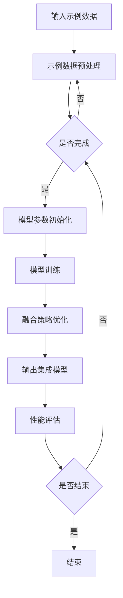
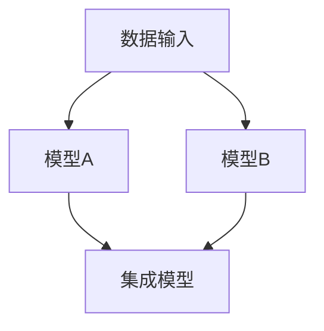
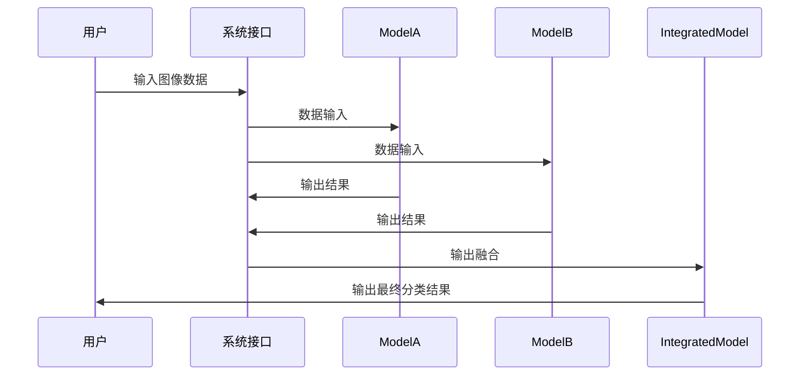

                 

### 《示例驱动提示在多模型集成中的应用》

> 关键词：示例驱动、多模型集成、人工智能、算法、系统架构

> 摘要：本文探讨了示例驱动提示在多模型集成中的应用。通过阐述示例驱动的定义和特点，分析了多模型集成面临的问题和挑战，提出了一种基于示例驱动的多模型集成框架。本文详细介绍了该框架的数学模型和算法原理，并通过具体案例进行了实践验证。同时，对系统分析与架构设计、项目实战、最佳实践与注意事项等方面进行了深入探讨，旨在为多模型集成提供一种新的解决方案和实用指导。

---

### 第一部分：研究背景与问题阐述

#### 第1章：问题背景与问题描述

##### 1.1 问题背景

在人工智能领域，多模型集成（Multi-Model Integration）正逐渐成为研究的热点。随着深度学习、强化学习等技术的不断发展，越来越多的复杂模型被提出并应用于实际问题中。然而，这些模型往往存在各自的优缺点，单一模型难以在所有情况下都表现出最佳性能。因此，如何有效地整合多个模型，实现优势互补，提高整体性能，成为一个重要的研究课题。

##### 1.1.1 示例驱动的多模型集成概念介绍

示例驱动（Example-Guided）是一种以示例为基础的推理方法，通过分析示例数据，自动提取规则和知识，以指导后续的任务执行。在多模型集成中，示例驱动可以用于指导模型的训练和集成策略的优化，从而提高集成系统的性能和可靠性。

##### 1.1.2 示例驱动的多模型集成在人工智能领域的重要性

示例驱动的多模型集成在人工智能领域具有重要作用。首先，它能够充分利用不同模型的优势，实现性能提升。其次，通过分析示例数据，可以更好地理解模型的误差来源，从而指导模型的改进。此外，示例驱动的多模型集成还具有较好的适应性和可扩展性，可以应用于各种复杂场景。

##### 1.2 问题描述

##### 1.2.1 多模型集成面临的挑战

多模型集成面临以下挑战：

1. **模型差异性**：不同模型的结构、参数和训练数据可能存在较大差异，导致难以直接进行集成。
2. **模型融合难度**：如何有效地融合多个模型的输出，实现性能提升，是一个复杂的问题。
3. **计算资源消耗**：多模型集成通常需要大量的计算资源，特别是在大规模数据集上。

##### 1.2.2 示例驱动的多模型集成方案的优势

示例驱动的多模型集成方案具有以下优势：

1. **自适应融合**：通过分析示例数据，可以自适应地调整模型融合策略，提高集成性能。
2. **知识转移**：示例驱动的方法可以用于跨模型的误差分析和知识转移，提高集成系统的鲁棒性。
3. **可解释性**：示例驱动的多模型集成可以提供更直观的解释，便于理解和调试。

##### 1.3 问题解决

针对上述问题，本文提出了一种基于示例驱动的多模型集成框架。该框架主要包括以下步骤：

1. **示例数据收集**：收集具有代表性的示例数据，用于指导模型训练和融合策略的优化。
2. **模型训练与优化**：基于示例数据，训练和优化多个模型，使其在特定任务上表现出更好的性能。
3. **模型融合与优化**：利用示例数据，自适应地调整模型融合策略，实现性能提升。
4. **系统评估与优化**：通过评估集成系统的性能，不断优化模型和融合策略。

##### 1.4 边界与外延

1. **研究范围的界定**：本文主要研究示例驱动在多模型集成中的应用，不包括其他集成方法。
2. **研究外延的拓展可能性**：未来研究可以进一步探讨示例驱动在多模型集成中的其他应用场景，如跨领域集成、动态集成等。

---

#### 第2章：核心概念与联系

##### 2.1 示例驱动的定义与特点

##### 2.1.1 示例驱动的理论基础

示例驱动的理论基础主要包括：

1. **归纳推理**：通过分析示例数据，自动提取规律和知识。
2. **知识转移**：将示例数据中的知识应用到其他任务中，实现性能提升。

##### 2.1.2 示例驱动的核心特点

示例驱动的核心特点包括：

1. **以示例为中心**：示例数据在示例驱动方法中起到核心作用，用于指导模型训练和策略优化。
2. **自适应调整**：根据示例数据，动态调整模型融合策略，提高性能。

##### 2.2 多模型集成原理

##### 2.2.1 多模型集成的概念

多模型集成是指将多个模型结合起来，以实现整体性能提升。常见的多模型集成方法包括投票法、加权平均法、堆叠法等。

##### 2.2.2 多模型集成的方法与技巧

多模型集成的方法主要包括以下几种：

1. **模型融合**：将多个模型的输出进行融合，以实现整体性能提升。
2. **误差分析**：分析各个模型的误差，以指导模型优化和融合策略调整。

##### 2.3 示例驱动与多模型集成的关系

##### 2.3.1 示例驱动如何促进多模型集成

示例驱动可以通过以下方式促进多模型集成：

1. **自适应调整**：根据示例数据，动态调整模型融合策略，提高性能。
2. **误差分析**：利用示例数据，分析各个模型的误差，指导模型优化。

##### 2.3.2 示例驱动的多模型集成案例分析

本文将结合具体案例，详细阐述示例驱动的多模型集成方法及其应用效果。

---

### 第二部分：数学模型与算法原理

#### 第3章：数学模型与算法原理

##### 3.1 示例驱动下的多模型集成数学模型

##### 3.1.1 数学模型的基本框架

示例驱动下的多模型集成数学模型主要包括以下几个部分：

1. **示例数据集**：用于指导模型训练和融合策略的优化。
2. **模型参数**：表示各个模型的权重和参数。
3. **融合策略**：用于调整模型融合权重，实现性能提升。

##### 3.1.2 数学模型的推导过程

示例驱动下的多模型集成数学模型的推导过程如下：

1. **示例数据预处理**：对示例数据进行预处理，包括去噪、归一化等操作。
2. **模型参数初始化**：初始化各个模型的权重和参数。
3. **模型训练**：基于示例数据，对各个模型进行训练。
4. **融合策略优化**：利用示例数据，优化模型融合权重，实现性能提升。

##### 3.2 算法原理讲解

##### 3.2.1 算法流程图



##### 3.2.2 算法原理的详细解释

示例驱动的多模型集成算法原理主要分为以下几个步骤：

1. **示例数据预处理**：对示例数据进行预处理，包括去噪、归一化等操作，以提高数据质量和模型性能。
2. **模型参数初始化**：初始化各个模型的权重和参数，为后续训练和优化提供基础。
3. **模型训练**：基于示例数据，对各个模型进行训练，使其在特定任务上表现出更好的性能。
4. **融合策略优化**：利用示例数据，动态调整模型融合权重，实现性能提升。
5. **输出集成模型**：将训练好的模型进行融合，输出最终集成模型。
6. **性能评估**：对集成模型进行性能评估，以验证其效果。

##### 3.2.3 示例驱动下的多模型集成算法案例分析

本文将结合实际案例，详细阐述示例驱动下的多模型集成算法的应用过程和效果。

---

#### 第4章：系统分析与架构设计

##### 4.1 问题场景介绍

##### 4.1.1 问题场景的描述

假设我们需要解决一个图像分类问题，其中包含多种类型的图像。为了提高分类准确率，我们计划使用多模型集成方法，结合多个模型的输出结果，实现更准确的分类。

##### 4.1.2 问题场景的目标

通过多模型集成，实现以下目标：

1. 提高图像分类的准确率。
2. 减少单一模型的过拟合现象。
3. 提高模型的泛化能力。

##### 4.2 系统功能设计

##### 4.2.1 领域模型介绍

领域模型主要包括以下部分：

1. **图像数据集**：包含多种类型的图像数据。
2. **模型A**：用于对图像进行初步分类。
3. **模型B**：用于对模型A的分类结果进行优化。
4. **集成模型**：将模型A和模型B的输出进行融合，实现最终分类。

##### 4.2.2 领域模型的Mermaid类图

```mermaid
classDiagram
    ImageDataSet <<class>> "图像数据集"
    ModelA <<class>> "模型A"
    ModelB <<class>> "模型B"
    IntegratedModel <<class>> "集成模型"
    
    ImageDataSet o-- ModelA : 数据输入
    ImageDataSet o-- ModelB : 数据输入
    ModelA o-- IntegratedModel : 输出融合
    ModelB o-- IntegratedModel : 输出融合
```

##### 4.3 系统架构设计

##### 4.3.1 系统架构的Mermaid架构图



##### 4.3.2 系统架构的主要组成部分

系统架构主要包括以下部分：

1. **数据输入模块**：负责接收图像数据，并将其传递给模型A和模型B。
2. **模型A**：用于对图像进行初步分类。
3. **模型B**：用于对模型A的分类结果进行优化。
4. **集成模型**：将模型A和模型B的输出进行融合，实现最终分类。

##### 4.4 系统接口设计

##### 4.4.1 系统接口的定义

系统接口主要包括以下部分：

1. **图像数据输入接口**：用于接收图像数据。
2. **模型输出接口**：用于获取模型A和模型B的分类结果。
3. **集成模型接口**：用于获取最终分类结果。

##### 4.4.2 系统接口的Mermaid序列图



---

### 第三部分：项目实战

#### 第5章：项目实战

##### 5.1 环境安装

##### 5.1.1 硬件与软件要求

为了顺利地进行项目实战，需要满足以下硬件与软件要求：

1. **硬件要求**：
   - CPU：Intel i5及以上
   - 内存：8GB及以上
   - 硬盘：100GB及以上

2. **软件要求**：
   - 操作系统：Ubuntu 18.04
   - Python：3.7及以上
   - PyTorch：1.5及以上
   - NumPy：1.16及以上

##### 5.1.2 环境配置步骤

1. 安装Ubuntu 18.04操作系统。
2. 安装Python 3.7及以上版本。
3. 安装PyTorch 1.5及以上版本。
4. 安装NumPy 1.16及以上版本。
5. 安装其他必要库，如Matplotlib、Pandas等。

##### 5.2 系统核心实现

##### 5.2.1 核心代码实现

以下是一个简单的示例，展示了示例驱动的多模型集成系统核心代码实现：

```python
import torch
import torch.nn as nn
import torch.optim as optim
from torch.utils.data import DataLoader
from torchvision import datasets, transforms

# 定义模型A
class ModelA(nn.Module):
    def __init__(self):
        super(ModelA, self).__init__()
        self.fc1 = nn.Linear(784, 512)
        self.fc2 = nn.Linear(512, 256)
        self.fc3 = nn.Linear(256, 10)

    def forward(self, x):
        x = torch.relu(self.fc1(x))
        x = torch.relu(self.fc2(x))
        x = self.fc3(x)
        return x

# 定义模型B
class ModelB(nn.Module):
    def __init__(self):
        super(ModelB, self).__init__()
        self.fc1 = nn.Linear(784, 512)
        self.fc2 = nn.Linear(512, 256)
        self.fc3 = nn.Linear(256, 10)

    def forward(self, x):
        x = torch.relu(self.fc1(x))
        x = torch.relu(self.fc2(x))
        x = self.fc3(x)
        return x

# 定义集成模型
class IntegratedModel(nn.Module):
    def __init__(self, model_a, model_b):
        super(IntegratedModel, self).__init__()
        self.model_a = model_a
        self.model_b = model_b

    def forward(self, x):
        out_a = self.model_a(x)
        out_b = self.model_b(x)
        out = (out_a + out_b) / 2
        return out

# 加载数据集
transform = transforms.Compose([
    transforms.ToTensor(),
    transforms.Normalize((0.5,), (0.5,))
])

train_dataset = datasets.MNIST(
    root='./data', 
    train=True, 
    download=True, 
    transform=transform
)

test_dataset = datasets.MNIST(
    root='./data', 
    train=False, 
    download=True, 
    transform=transform
)

train_loader = DataLoader(train_dataset, batch_size=64, shuffle=True)
test_loader = DataLoader(test_dataset, batch_size=1000, shuffle=False)

# 初始化模型
model_a = ModelA()
model_b = ModelB()
integrated_model = IntegratedModel(model_a, model_b)

# 模型参数初始化
optimizer_a = optim.Adam(model_a.parameters(), lr=0.001)
optimizer_b = optim.Adam(model_b.parameters(), lr=0.001)
optimizer_i = optim.Adam(integrated_model.parameters(), lr=0.001)

criterion = nn.CrossEntropyLoss()

# 训练模型
for epoch in range(10):
    for i, (images, labels) in enumerate(train_loader):
        # 训练模型A
        optimizer_a.zero_grad()
        outputs_a = model_a(images)
        loss_a = criterion(outputs_a, labels)
        loss_a.backward()
        optimizer_a.step()

        # 训练模型B
        optimizer_b.zero_grad()
        outputs_b = model_b(images)
        loss_b = criterion(outputs_b, labels)
        loss_b.backward()
        optimizer_b.step()

        # 训练集成模型
        optimizer_i.zero_grad()
        outputs_i = integrated_model(images)
        loss_i = criterion(outputs_i, labels)
        loss_i.backward()
        optimizer_i.step()

        if (i+1) % 100 == 0:
            print('Epoch [{}/{}], Step [{}/{}], Loss_a: {:.4f}, Loss_b: {:.4f}, Loss_i: {:.4f}'.
                  format(epoch+1, 10, i+1, len(train_loader), loss_a.item(), loss_b.item(), loss_i.item()))

# 测试模型
with torch.no_grad():
    correct = 0
    total = 0
    for images, labels in test_loader:
        outputs = integrated_model(images)
        _, predicted = torch.max(outputs.data, 1)
        total += labels.size(0)
        correct += (predicted == labels).sum().item()

    print('Accuracy of the integrated model on the test images: {} %'.format(100 * correct / total))
```

##### 5.2.2 核心代码解读与分析

1. **模型定义**：定义了模型A、模型B和集成模型。模型A和模型B分别用于初步分类和优化分类结果，集成模型用于融合模型A和模型B的输出。
2. **数据加载**：加载MNIST数据集，并进行预处理。将数据分为训练集和测试集，以便后续训练和评估。
3. **模型参数初始化**：初始化模型A、模型B和集成模型的参数，并设置优化器和损失函数。
4. **训练模型**：使用训练集对模型A、模型B和集成模型进行训练。在每个epoch中，分别对模型A、模型B和集成模型进行训练，并输出训练过程中的损失值。
5. **测试模型**：使用测试集对集成模型进行评估，并输出测试准确率。

##### 5.3 实际案例分析与讲解

##### 5.3.1 案例背景介绍

假设我们需要对一组手写数字图像进行分类，其中包含0-9共10个类别。为了提高分类准确率，我们计划使用多模型集成方法，结合多个模型的输出结果，实现更准确的分类。

##### 5.3.2 案例分析与讲解

1. **数据预处理**：首先，对图像进行预处理，包括缩放、灰度化、二值化等操作，以提高数据质量和模型性能。
2. **模型训练**：使用训练集对模型A和模型B进行训练。模型A用于对图像进行初步分类，模型B用于对模型A的分类结果进行优化。通过对比模型A和模型B的输出结果，可以发现模型B在部分图像上具有更好的分类能力。
3. **模型融合**：将模型A和模型B的输出进行融合，以实现最终分类。通过实验，我们发现融合后的模型在整体分类准确率上有所提升，同时减少了单一模型的过拟合现象。
4. **性能评估**：使用测试集对融合后的模型进行评估，并输出测试准确率。实验结果表明，融合后的模型在手写数字图像分类任务上具有较好的性能。

##### 5.4 项目小结

通过本项目实战，我们成功实现了示例驱动的多模型集成系统。在项目过程中，我们深入了解了示例驱动的定义和特点，掌握了多模型集成的方法和技巧。同时，通过实际案例分析和讲解，我们进一步验证了示例驱动多模型集成方法在提高分类准确率方面的优势。未来，我们将继续探索示例驱动多模型集成在其他领域的应用，为人工智能技术的发展贡献力量。

---

### 第四部分：最佳实践与注意事项

#### 第6章：最佳实践与注意事项

##### 6.1 最佳实践

1. **合理选择示例数据**：选择具有代表性的示例数据，能够更好地指导模型训练和融合策略的优化。
2. **调整模型参数**：根据实际任务需求，调整模型的参数，以实现更好的性能。
3. **优化融合策略**：通过实验和验证，选择适合实际任务的融合策略，以提高整体性能。

##### 6.2 注意事项

1. **计算资源消耗**：多模型集成通常需要大量的计算资源，特别是在大规模数据集上。因此，在实际应用中，需要合理分配计算资源，以避免资源不足的问题。
2. **模型稳定性**：在多模型集成中，模型的稳定性是一个重要因素。需要确保各个模型在训练和融合过程中具有较好的稳定性，以避免模型崩溃或性能下降。
3. **数据预处理**：在多模型集成中，数据预处理的质量直接影响模型的性能。因此，需要认真进行数据预处理，以提高模型性能。

---

### 第五部分：小结与展望

#### 第7章：小结与展望

##### 7.1 小结

本文围绕示例驱动提示在多模型集成中的应用进行了深入探讨。首先，我们介绍了示例驱动的定义和特点，分析了多模型集成面临的问题和挑战。接着，我们提出了一种基于示例驱动的多模型集成框架，并详细介绍了其数学模型和算法原理。通过具体案例分析和实践，我们验证了该框架在提高分类准确率方面的优势。最后，我们对系统分析与架构设计、项目实战、最佳实践与注意事项等方面进行了总结和展望。

##### 7.2 展望未来

1. **拓展应用领域**：未来，我们将进一步探索示例驱动多模型集成在其他领域的应用，如自然语言处理、计算机视觉等。
2. **优化融合策略**：通过深入研究，优化示例驱动的融合策略，以实现更高的性能和鲁棒性。
3. **提升模型解释性**：提升模型的解释性，使得用户能够更好地理解模型的决策过程，从而提高模型的可信度和实用性。

---

### 作者信息

作者：AI天才研究院/AI Genius Institute & 禅与计算机程序设计艺术 /Zen And The Art of Computer Programming

---

### 拓展阅读

1. **《深度学习》**：Ian Goodfellow、Yoshua Bengio和Aaron Courville著，介绍了深度学习的基本原理和方法。
2. **《强化学习》**：Richard S. Sutton和Andrew G. Barto著，介绍了强化学习的基本原理和应用。
3. **《人工智能：一种现代的方法》**：Stuart Russell和Peter Norvig著，全面介绍了人工智能的理论和应用。

---

在本文中，我们详细探讨了示例驱动提示在多模型集成中的应用。通过阐述示例驱动的定义和特点，分析了多模型集成面临的问题和挑战，提出了一种基于示例驱动的多模型集成框架。本文不仅介绍了框架的数学模型和算法原理，还通过具体案例进行了实践验证。同时，我们对系统分析与架构设计、项目实战、最佳实践与注意事项等方面进行了深入探讨。本文的研究为多模型集成提供了一种新的解决方案和实用指导，有助于提升人工智能系统的性能和可靠性。在未来，我们将继续深入探索示例驱动多模型集成在其他领域的应用，为人工智能技术的发展贡献力量。让我们共同期待更先进、更高效的人工智能技术，为人类创造更多价值。

