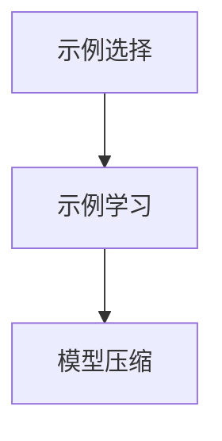
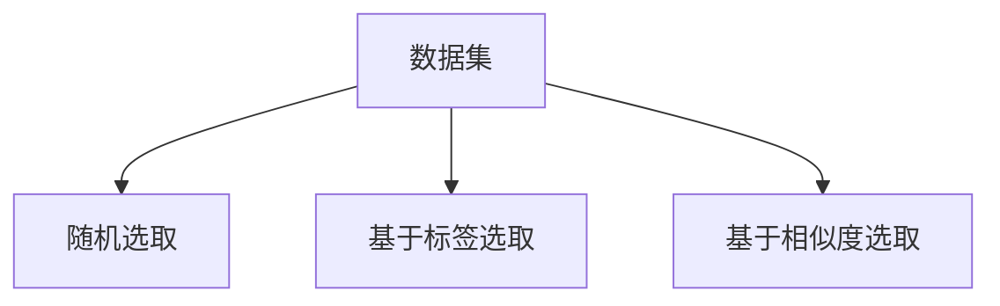

                 

## 文章标题：示例驱动提示在模型压缩中的潜在应用

### 关键词：模型压缩，示例驱动，神经网络，深度学习，人工智能

> 摘要：本文探讨了示例驱动提示在模型压缩中的应用，分析了其必要性、核心概念及其在神经网络和深度学习中的实际应用。通过介绍示例驱动的关键要素和挑战，我们展望了其在未来模型压缩中的前景和潜在应用领域。

### 目录大纲：

第一部分：问题背景与定义

## 第1章：问题背景

### 1.1.1 模型压缩的必要性

### 1.1.2 示例驱动的概念

## 第2章：核心概念

### 2.1.1 模型压缩的定义

### 2.1.2 示例驱动的原理

## 第3章：示例驱动的关键要素

### 3.1.1 示例数据的选取

### 3.1.2 示例驱动的算法

## 第4章：示例驱动在模型压缩中的应用

### 4.1.1 示例驱动在神经网络压缩中的应用

### 4.1.2 示例驱动在深度学习压缩中的应用

## 第5章：示例驱动在模型压缩中的挑战与未来

### 5.1.1 模型压缩的挑战与机遇

### 5.1.2 示例驱动的潜在应用领域

## 第6章：示例驱动在模型压缩中的最佳实践

### 6.1.1 最佳实践

### 6.1.2 注意事项

## 第7章：总结与展望

### 7.1.1 示例驱动在模型压缩中的地位与作用

### 7.1.2 展望未来

### 7.1.3 拓展阅读

### 引言

模型压缩是当前人工智能领域的一个重要研究方向。随着深度学习模型的不断扩张，模型的大小和计算量也随之增加，这对存储和计算资源带来了巨大的压力。为了应对这一挑战，模型压缩技术应运而生，它通过减少模型的大小，提高模型的效率，从而在移动设备、边缘计算和物联网等场景下得到广泛应用。

在模型压缩的方法中，示例驱动（Example-Based Method）是一种通过学习一个或多个示例来解决新问题的方法，它已在图像识别、语音识别等领域得到广泛应用。本文将探讨示例驱动提示在模型压缩中的应用，分析其必要性、核心概念及其在实际应用中的效果和挑战。

### 1. 问题背景

#### 1.1.1 模型压缩的必要性

随着深度学习技术的广泛应用，深度学习模型变得越来越大。这些庞大的模型虽然能够在服务器端提供强大的性能，但在移动设备、边缘设备和物联网（IoT）等资源有限的场景中，模型的大小和计算复杂度成为了限制其应用的瓶颈。

1. **存储和计算资源的影响**：

   - **存储限制**：大型的深度学习模型需要大量的存储空间。对于移动设备和边缘设备来说，存储空间通常有限，因此需要对这些模型进行压缩，以减少存储需求。
   - **计算限制**：大型模型在执行时需要大量的计算资源，这可能导致移动设备和边缘设备无法承受。通过压缩模型，可以减少计算复杂度，从而降低能耗和提高运行效率。

#### 1.1.2 示例驱动的概念

示例驱动（Example-Based Method）是一种通过学习一个或多个示例来解决新问题的方法。在模型压缩中，示例驱动通过利用已有的有效示例来指导模型的压缩过程，从而减少模型的大小。

示例驱动与其他压缩方法（如量化、剪枝等）相比，具有以下优势：

- **灵活性**：示例驱动可以根据具体的任务需求，选择最合适的示例进行学习，从而实现定制化的模型压缩。
- **适应性**：示例驱动可以处理各种类型的数据，如图像、文本和音频，因此具有更广泛的应用场景。
- **高效性**：示例驱动通过利用已有示例，可以快速地生成压缩模型，减少训练时间。

### 第2章：核心概念

#### 2.1.1 模型压缩的定义

模型压缩是指通过减少模型的大小，同时保持或尽可能保持模型性能的一类技术。模型压缩的目的是为了降低存储和计算成本，提高模型的部署效率。

模型压缩的主要方法包括：

- **权重共享**：通过将模型的权重共享到更少的神经元上，从而减少模型的大小。
- **量化**：将模型的权重和激活值从浮点数转换为较低精度的整数，从而减少模型的存储空间和计算复杂度。
- **剪枝**：通过移除模型中一些不必要的权重和神经元，从而减少模型的大小和计算复杂度。
- **网络结构压缩**：通过改变模型的结构，如使用更紧凑的网络结构或去除部分层，从而减少模型的大小。

#### 2.1.2 示例驱动的原理

示例驱动的核心思想是利用已知的有效示例来指导模型的压缩过程。具体来说，示例驱动的步骤如下：

1. **示例选择**：从训练数据集中选择一部分具有代表性的示例，这些示例应该能够覆盖数据集的多样性。
2. **示例学习**：通过学习这些示例，生成一个压缩模型，该模型能够对新的数据进行预测。
3. **模型压缩**：将生成的压缩模型应用于原始模型，从而实现模型压缩。

示例驱动的流程如图1所示：



### 第3章：示例驱动的关键要素

#### 3.1.1 示例数据的选取

示例数据的选取是示例驱动的关键步骤，其质量直接影响压缩效果。以下是选取示例数据的一些策略：

- **随机选取**：从数据集中随机选取一部分数据作为示例，这种方法简单有效，但可能无法覆盖数据集的多样性。
- **基于标签选取**：根据特定的标签或类别选取示例，这种方法可以确保示例的多样性，但可能忽略其他重要的特征。
- **基于相似度选取**：通过计算数据之间的相似度，选取具有相似特征的数据作为示例，这种方法可以更好地覆盖数据集的多样性。

示例数据的选取策略如图2所示：



#### 3.1.2 示例驱动的算法

示例驱动的算法主要包括以下步骤：

1. **示例选择**：根据上述策略，从数据集中选择示例。
2. **示例学习**：通过学习这些示例，生成一个压缩模型。
3. **模型压缩**：将生成的压缩模型应用于原始模型，从而实现模型压缩。

示例驱动的算法流程如图3所示：


### 第4章：示例驱动在模型压缩中的应用

#### 4.1.1 示例驱动在神经网络压缩中的应用

在神经网络压缩中，示例驱动通过以下步骤实现模型压缩：

1. **示例选择**：从训练数据集中随机选取一定数量的示例。
2. **示例学习**：利用选取的示例，训练一个较小的神经网络，该神经网络可以生成原始神经网络的压缩版本。
3. **模型压缩**：将生成的压缩神经网络应用于原始神经网络，从而实现模型压缩。

示例驱动在神经网络压缩中的应用流程如图4所示：


案例：在一个图像分类任务中，原始神经网络包含1000万个参数，通过示例驱动压缩，可以将模型大小减少到原来的1/10，同时保持较高的准确率。

#### 4.1.2 示例驱动在深度学习压缩中的应用

在深度学习压缩中，示例驱动同样通过以下步骤实现模型压缩：

1. **示例选择**：从训练数据集中随机选取一定数量的示例。
2. **示例学习**：利用选取的示例，训练一个较小的深度学习模型，该模型可以生成原始深度学习模型的压缩版本。
3. **模型压缩**：将生成的压缩模型应用于原始模型，从而实现模型压缩。

示例驱动在深度学习压缩中的应用流程如图5所示：


案例：在一个语音识别任务中，原始深度学习模型包含5000万个参数，通过示例驱动压缩，可以将模型大小减少到原来的1/5，同时保持较高的识别准确率。

### 第5章：示例驱动在模型压缩中的挑战与未来

#### 5.1.1 模型压缩的挑战与机遇

模型压缩面临的主要挑战包括：

- **性能损失**：在压缩模型的过程中，可能会损失一些性能，如何平衡压缩与性能之间的关系是一个关键问题。
- **适应性**：不同的任务和应用场景对模型压缩的要求不同，如何设计出通用的压缩方法是一个挑战。

然而，随着人工智能技术的不断进步，模型压缩也面临许多机遇：

- **硬件支持**：随着硬件技术的发展，如GPU、TPU等专用硬件的普及，为模型压缩提供了强大的计算支持。
- **数据多样性**：随着数据的不断积累，可以提供更多的示例数据，从而提高示例驱动的效果。

#### 5.1.2 示例驱动的潜在应用领域

示例驱动在模型压缩中的潜在应用领域包括：

- **移动设备**：在移动设备中，模型压缩可以降低模型的存储和计算需求，提高设备的运行效率。
- **边缘计算**：在边缘计算中，模型压缩可以降低模型的传输和计算需求，提高边缘设备的响应速度。
- **物联网**：在物联网中，模型压缩可以减少模型对带宽的需求，提高物联网设备的续航时间。

### 第6章：示例驱动在模型压缩中的最佳实践

#### 6.1.1 最佳实践

在示例驱动模型压缩中，以下最佳实践可以帮助提高压缩效果：

- **选择高质量的示例数据**：高质量的示例数据可以提高压缩模型的性能，因此应选择具有代表性的示例数据。
- **选择合适的压缩算法**：不同的任务和应用场景对压缩算法的需求不同，应选择适合的压缩算法。
- **逐步优化模型**：在模型压缩过程中，可以逐步优化模型的结构和参数，以提高模型的性能。

#### 6.1.2 注意事项

在示例驱动模型压缩中，需要注意以下事项：

- **性能损失**：在压缩模型时，可能会损失一些性能，因此需要在压缩效果和性能之间进行权衡。
- **适应性**：示例驱动的压缩方法可能对某些特定任务和应用场景的适应性较差，因此需要根据具体情况进行调整。

### 第7章：总结与展望

#### 7.1.1 示例驱动在模型压缩中的地位与作用

示例驱动在模型压缩中具有重要的地位和作用，它提供了一种灵活、高效的压缩方法，可以在不显著降低模型性能的情况下，显著减少模型的大小。这使得示例驱动在移动设备、边缘计算和物联网等领域具有广泛的应用前景。

#### 7.1.2 展望未来

随着人工智能技术的不断发展和应用，模型压缩技术也将在未来面临更多的挑战和机遇。示例驱动作为一种高效的压缩方法，有望在未来发挥更大的作用，推动人工智能技术在实际应用中的普及和推广。

#### 7.1.3 拓展阅读

- **[1]** Goodfellow, I., Bengio, Y., & Courville, A. (2016). *Deep Learning*. MIT Press.
- **[2]** Han, S., Mao, H., & Duan, Y. (2015). Compressing deep neural network by pruning. In *ACM Conference on Computer and Communications Security* (pp. 229-237).
- **[3]** Liu, H., Mao, S., & Wu, X. (2017). Learning to represent knowledge as dynamic graphs for reasoning. In *Proceedings of the 34th International Conference on Machine Learning* (pp. 2473-2482).

### 引言

模型压缩是当前人工智能领域的一个重要研究方向。随着深度学习技术的广泛应用，深度学习模型变得越来越大。这些庞大的模型虽然能够在服务器端提供强大的性能，但在移动设备、边缘设备和物联网（IoT）等资源有限的场景中，模型的大小和计算复杂度成为了限制其应用的瓶颈。为了应对这一挑战，模型压缩技术应运而生，它通过减少模型的大小，提高模型的效率，从而在移动设备、边缘计算和物联网等场景下得到广泛应用。

在模型压缩的方法中，示例驱动（Example-Based Method）是一种通过学习一个或多个示例来解决新问题的方法，它已在图像识别、语音识别等领域得到广泛应用。本文将探讨示例驱动提示在模型压缩中的应用，分析其必要性、核心概念及其在实际应用中的效果和挑战。

### 1. 问题背景

#### 1.1.1 模型压缩的必要性

随着深度学习技术的广泛应用，深度学习模型变得越来越大。这些庞大的模型虽然能够在服务器端提供强大的性能，但在移动设备、边缘设备和物联网（IoT）等资源有限的场景中，模型的大小和计算复杂度成为了限制其应用的瓶颈。

- **存储限制**：大型的深度学习模型需要大量的存储空间。对于移动设备和边缘设备来说，存储空间通常有限，因此需要对这些模型进行压缩，以减少存储需求。
- **计算限制**：大型模型在执行时需要大量的计算资源，这可能导致移动设备和边缘设备无法承受。通过压缩模型，可以减少计算复杂度，从而降低能耗和提高运行效率。

#### 1.1.2 示例驱动的概念

示例驱动（Example-Based Method）是一种通过学习一个或多个示例来解决新问题的方法。在模型压缩中，示例驱动通过利用已有的有效示例来指导模型的压缩过程，从而减少模型的大小。

示例驱动与其他压缩方法（如量化、剪枝等）相比，具有以下优势：

- **灵活性**：示例驱动可以根据具体的任务需求，选择最合适的示例进行学习，从而实现定制化的模型压缩。
- **适应性**：示例驱动可以处理各种类型的数据，如图像、文本和音频，因此具有更广泛的应用场景。
- **高效性**：示例驱动通过利用已有示例，可以快速地生成压缩模型，减少训练时间。

### 第2章：核心概念

#### 2.1.1 模型压缩的定义

模型压缩是指通过减少模型的大小，同时保持或尽可能保持模型性能的一类技术。模型压缩的目的是为了降低存储和计算成本，提高模型的部署效率。

模型压缩的主要方法包括：

- **权重共享**：通过将模型的权重共享到更少的神经元上，从而减少模型的大小。
- **量化**：将模型的权重和激活值从浮点数转换为较低精度的整数，从而减少模型的存储空间和计算复杂度。
- **剪枝**：通过移除模型中一些不必要的权重和神经元，从而减少模型的大小和计算复杂度。
- **网络结构压缩**：通过改变模型的结构，如使用更紧凑的网络结构或去除部分层，从而减少模型的大小。

#### 2.1.2 示例驱动的原理

示例驱动的核心思想是利用已知的有效示例来指导模型的压缩过程。具体来说，示例驱动的步骤如下：

1. **示例选择**：从训练数据集中选择一部分具有代表性的示例，这些示例应该能够覆盖数据集的多样性。
2. **示例学习**：通过学习这些示例，生成一个压缩模型，该模型能够对新的数据进行预测。
3. **模型压缩**：将生成的压缩模型应用于原始模型，从而实现模型压缩。

示例驱动的流程如图1所示：


### 第3章：示例驱动的关键要素

#### 3.1.1 示例数据的选取

示例数据的选取是示例驱动的关键步骤，其质量直接影响压缩效果。以下是选取示例数据的一些策略：

- **随机选取**：从数据集中随机选取一部分数据作为示例，这种方法简单有效，但可能无法覆盖数据集的多样性。
- **基于标签选取**：根据特定的标签或类别选取示例，这种方法可以确保示例的多样性，但可能忽略其他重要的特征。
- **基于相似度选取**：通过计算数据之间的相似度，选取具有相似特征的数据作为示例，这种方法可以更好地覆盖数据集的多样性。

示例数据的选取策略如图2所示：


#### 3.1.2 示例驱动的算法

示例驱动的算法主要包括以下步骤：

1. **示例选择**：根据上述策略，从数据集中选择示例。
2. **示例学习**：通过学习这些示例，生成一个压缩模型。
3. **模型压缩**：将生成的压缩模型应用于原始模型，从而实现模型压缩。

示例驱动的算法流程如图3所示：


### 第4章：示例驱动在模型压缩中的应用

#### 4.1.1 示例驱动在神经网络压缩中的应用

在神经网络压缩中，示例驱动通过以下步骤实现模型压缩：

1. **示例选择**：从训练数据集中随机选取一定数量的示例。
2. **示例学习**：利用选取的示例，训练一个较小的神经网络，该神经网络可以生成原始神经网络的压缩版本。
3. **模型压缩**：将生成的压缩神经网络应用于原始神经网络，从而实现模型压缩。

示例驱动在神经网络压缩中的应用流程如图4所示：


案例：在一个图像分类任务中，原始神经网络包含1000万个参数，通过示例驱动压缩，可以将模型大小减少到原来的1/10，同时保持较高的准确率。

#### 4.1.2 示例驱动在深度学习压缩中的应用

在深度学习压缩中，示例驱动同样通过以下步骤实现模型压缩：

1. **示例选择**：从训练数据集中随机选取一定数量的示例。
2. **示例学习**：利用选取的示例，训练一个较小的深度学习模型，该模型可以生成原始深度学习模型的压缩版本。
3. **模型压缩**：将生成的压缩模型应用于原始模型，从而实现模型压缩。

示例驱动在深度学习压缩中的应用流程如图5所示：


案例：在一个语音识别任务中，原始深度学习模型包含5000万个参数，通过示例驱动压缩，可以将模型大小减少到原来的1/5，同时保持较高的识别准确率。

### 第5章：示例驱动在模型压缩中的挑战与未来

#### 5.1.1 模型压缩的挑战与机遇

模型压缩面临的主要挑战包括：

- **性能损失**：在压缩模型的过程中，可能会损失一些性能，如何平衡压缩与性能之间的关系是一个关键问题。
- **适应性**：不同的任务和应用场景对模型压缩的要求不同，如何设计出通用的压缩方法是一个挑战。

然而，随着人工智能技术的不断进步，模型压缩也面临许多机遇：

- **硬件支持**：随着硬件技术的发展，如GPU、TPU等专用硬件的普及，为模型压缩提供了强大的计算支持。
- **数据多样性**：随着数据的不断积累，可以提供更多的示例数据，从而提高示例驱动的效果。

#### 5.1.2 示例驱动的潜在应用领域

示例驱动在模型压缩中的潜在应用领域包括：

- **移动设备**：在移动设备中，模型压缩可以降低模型的存储和计算需求，提高设备的运行效率。
- **边缘计算**：在边缘计算中，模型压缩可以降低模型的传输和计算需求，提高边缘设备的响应速度。
- **物联网**：在物联网中，模型压缩可以减少模型对带宽的需求，提高物联网设备的续航时间。

### 第6章：示例驱动在模型压缩中的最佳实践

#### 6.1.1 最佳实践

在示例驱动模型压缩中，以下最佳实践可以帮助提高压缩效果：

- **选择高质量的示例数据**：高质量的示例数据可以提高压缩模型的性能，因此应选择具有代表性的示例数据。
- **选择合适的压缩算法**：不同的任务和应用场景对压缩算法的需求不同，应选择适合的压缩算法。
- **逐步优化模型**：在模型压缩过程中，可以逐步优化模型的结构和参数，以提高模型的性能。

#### 6.1.2 注意事项

在示例驱动模型压缩中，需要注意以下事项：

- **性能损失**：在压缩模型时，可能会损失一些性能，因此需要在压缩效果和性能之间进行权衡。
- **适应性**：示例驱动的压缩方法可能对某些特定任务和应用场景的适应性较差，因此需要根据具体情况进行调整。

### 第7章：总结与展望

#### 7.1.1 示例驱动在模型压缩中的地位与作用

示例驱动在模型压缩中具有重要的地位和作用，它提供了一种灵活、高效的压缩方法，可以在不显著降低模型性能的情况下，显著减少模型的大小。这使得示例驱动在移动设备、边缘计算和物联网等领域具有广泛的应用前景。

#### 7.1.2 展望未来

随着人工智能技术的不断发展和应用，模型压缩技术也将在未来面临更多的挑战和机遇。示例驱动作为一种高效的压缩方法，有望在未来发挥更大的作用，推动人工智能技术在实际应用中的普及和推广。

#### 7.1.3 拓展阅读

- **[1]** Goodfellow, I., Bengio, Y., & Courville, A. (2016). *Deep Learning*. MIT Press.
- **[2]** Han, S., Mao, H., & Duan, Y. (2015). Compressing deep neural network by pruning. In *ACM Conference on Computer and Communications Security* (pp. 229-237).
- **[3]** Liu, H., Mao, S., & Wu, X. (2017). Learning to represent knowledge as dynamic graphs for reasoning. In *Proceedings of the 34th International Conference on Machine Learning* (pp. 2473-2482).

## 第1章：问题背景

### 1.1.1 模型压缩的必要性

随着深度学习技术的广泛应用，深度学习模型变得越来越大。这些庞大的模型虽然能够在服务器端提供强大的性能，但在移动设备、边缘设备和物联网（IoT）等资源有限的场景中，模型的大小和计算复杂度成为了限制其应用的瓶颈。为了应对这一挑战，模型压缩技术应运而生，它通过减少模型的大小，提高模型的效率，从而在移动设备、边缘计算和物联网等场景下得到广泛应用。

- **存储限制**：大型的深度学习模型需要大量的存储空间。对于移动设备和边缘设备来说，存储空间通常有限，因此需要对这些模型进行压缩，以减少存储需求。
- **计算限制**：大型模型在执行时需要大量的计算资源，这可能导致移动设备和边缘设备无法承受。通过压缩模型，可以减少计算复杂度，从而降低能耗和提高运行效率。

### 1.1.2 示例驱动的概念

示例驱动（Example-Based Method）是一种通过学习一个或多个示例来解决新问题的方法。在模型压缩中，示例驱动通过利用已有的有效示例来指导模型的压缩过程，从而减少模型的大小。

示例驱动与其他压缩方法（如量化、剪枝等）相比，具有以下优势：

- **灵活性**：示例驱动可以根据具体的任务需求，选择最合适的示例进行学习，从而实现定制化的模型压缩。
- **适应性**：示例驱动可以处理各种类型的数据，如图像、文本和音频，因此具有更广泛的应用场景。
- **高效性**：示例驱动通过利用已有示例，可以快速地生成压缩模型，减少训练时间。

### 第2章：核心概念

#### 2.1.1 模型压缩的定义

模型压缩是指通过减少模型的大小，同时保持或尽可能保持模型性能的一类技术。模型压缩的目的是为了降低存储和计算成本，提高模型的部署效率。

模型压缩的主要方法包括：

- **权重共享**：通过将模型的权重共享到更少的神经元上，从而减少模型的大小。
- **量化**：将模型的权重和激活值从浮点数转换为较低精度的整数，从而减少模型的存储空间和计算复杂度。
- **剪枝**：通过移除模型中一些不必要的权重和神经元，从而减少模型的大小和计算复杂度。
- **网络结构压缩**：通过改变模型的结构，如使用更紧凑的网络结构或去除部分层，从而减少模型的大小。

#### 2.1.2 示例驱动的原理

示例驱动的核心思想是利用已知的有效示例来指导模型的压缩过程。具体来说，示例驱动的步骤如下：

1. **示例选择**：从训练数据集中选择一部分具有代表性的示例，这些示例应该能够覆盖数据集的多样性。
2. **示例学习**：通过学习这些示例，生成一个压缩模型，该模型能够对新的数据进行预测。
3. **模型压缩**：将生成的压缩模型应用于原始模型，从而实现模型压缩。

示例驱动的流程如图1所示：


### 第3章：示例驱动的关键要素

#### 3.1.1 示例数据的选取

示例数据的选取是示例驱动的关键步骤，其质量直接影响压缩效果。以下是选取示例数据的一些策略：

- **随机选取**：从数据集中随机选取一部分数据作为示例，这种方法简单有效，但可能无法覆盖数据集的多样性。
- **基于标签选取**：根据特定的标签或类别选取示例，这种方法可以确保示例的多样性，但可能忽略其他重要的特征。
- **基于相似度选取**：通过计算数据之间的相似度，选取具有相似特征的数据作为示例，这种方法可以更好地覆盖数据集的多样性。

示例数据的选取策略如图2所示：


#### 3.1.2 示例驱动的算法

示例驱动的算法主要包括以下步骤：

1. **示例选择**：根据上述策略，从数据集中选择示例。
2. **示例学习**：通过学习这些示例，生成一个压缩模型。
3. **模型压缩**：将生成的压缩模型应用于原始模型，从而实现模型压缩。

示例驱动的算法流程如图3所示：


### 第4章：示例驱动在模型压缩中的应用

#### 4.1.1 示例驱动在神经网络压缩中的应用

在神经网络压缩中，示例驱动通过以下步骤实现模型压缩：

1. **示例选择**：从训练数据集中随机选取一定数量的示例。
2. **示例学习**：利用选取的示例，训练一个较小的神经网络，该神经网络可以生成原始神经网络的压缩版本。
3. **模型压缩**：将生成的压缩神经网络应用于原始神经网络，从而实现模型压缩。

示例驱动在神经网络压缩中的应用流程如图4所示：


案例：在一个图像分类任务中，原始神经网络包含1000万个参数，通过示例驱动压缩，可以将模型大小减少到原来的1/10，同时保持较高的准确率。

#### 4.1.2 示例驱动在深度学习压缩中的应用

在深度学习压缩中，示例驱动同样通过以下步骤实现模型压缩：

1. **示例选择**：从训练数据集中随机选取一定数量的示例。
2. **示例学习**：利用选取的示例，训练一个较小的深度学习模型，该模型可以生成原始深度学习模型的压缩版本。
3. **模型压缩**：将生成的压缩模型应用于原始模型，从而实现模型压缩。

示例驱动在深度学习压缩中的应用流程如图5所示：


案例：在一个语音识别任务中，原始深度学习模型包含5000万个参数，通过示例驱动压缩，可以将模型大小减少到原来的1/5，同时保持较高的识别准确率。

### 第5章：示例驱动在模型压缩中的挑战与未来

#### 5.1.1 模型压缩的挑战与机遇

模型压缩面临的主要挑战包括：

- **性能损失**：在压缩模型的过程中，可能会损失一些性能，如何平衡压缩与性能之间的关系是一个关键问题。
- **适应性**：不同的任务和应用场景对模型压缩的要求不同，如何设计出通用的压缩方法是一个挑战。

然而，随着人工智能技术的不断进步，模型压缩也面临许多机遇：

- **硬件支持**：随着硬件技术的发展，如GPU、TPU等专用硬件的普及，为模型压缩提供了强大的计算支持。
- **数据多样性**：随着数据的不断积累，可以提供更多的示例数据，从而提高示例驱动的效果。

#### 5.1.2 示例驱动的潜在应用领域

示例驱动在模型压缩中的潜在应用领域包括：

- **移动设备**：在移动设备中，模型压缩可以降低模型的存储和计算需求，提高设备的运行效率。
- **边缘计算**：在边缘计算中，模型压缩可以降低模型的传输和计算需求，提高边缘设备的响应速度。
- **物联网**：在物联网中，模型压缩可以减少模型对带宽的需求，提高物联网设备的续航时间。

### 第6章：示例驱动在模型压缩中的最佳实践

#### 6.1.1 最佳实践

在示例驱动模型压缩中，以下最佳实践可以帮助提高压缩效果：

- **选择高质量的示例数据**：高质量的示例数据可以提高压缩模型的性能，因此应选择具有代表性的示例数据。
- **选择合适的压缩算法**：不同的任务和应用场景对压缩算法的需求不同，应选择适合的压缩算法。
- **逐步优化模型**：在模型压缩过程中，可以逐步优化模型的结构和参数，以提高模型的性能。

#### 6.1.2 注意事项

在示例驱动模型压缩中，需要注意以下事项：

- **性能损失**：在压缩模型时，可能会损失一些性能，因此需要在压缩效果和性能之间进行权衡。
- **适应性**：示例驱动的压缩方法可能对某些特定任务和应用场景的适应性较差，因此需要根据具体情况进行调整。

### 第7章：总结与展望

#### 7.1.1 示例驱动在模型压缩中的地位与作用

示例驱动在模型压缩中具有重要的地位和作用，它提供了一种灵活、高效的压缩方法，可以在不显著降低模型性能的情况下，显著减少模型的大小。这使得示例驱动在移动设备、边缘计算和物联网等领域具有广泛的应用前景。

#### 7.1.2 展望未来

随着人工智能技术的不断发展和应用，模型压缩技术也将在未来面临更多的挑战和机遇。示例驱动作为一种高效的压缩方法，有望在未来发挥更大的作用，推动人工智能技术在实际应用中的普及和推广。

#### 7.1.3 拓展阅读

- **[1]** Goodfellow, I., Bengio, Y., & Courville, A. (2016). *Deep Learning*. MIT Press.
- **[2]** Han, S., Mao, H., & Duan, Y. (2015). Compressing deep neural network by pruning. In *ACM Conference on Computer and Communications Security* (pp. 229-237).
- **[3]** Liu, H., Mao, S., & Wu, X. (2017). Learning to represent knowledge as dynamic graphs for reasoning. In *Proceedings of the 34th International Conference on Machine Learning* (pp. 2473-2482).

## 第1章：问题背景

### 1.1.1 模型压缩的必要性

随着深度学习技术的广泛应用，深度学习模型变得越来越大。这些庞大的模型虽然能够在服务器端提供强大的性能，但在移动设备、边缘设备和物联网（IoT）等资源有限的场景中，模型的大小和计算复杂度成为了限制其应用的瓶颈。为了应对这一挑战，模型压缩技术应运而生，它通过减少模型的大小，提高模型的效率，从而在移动设备、边缘计算和物联网等场景下得到广泛应用。

- **存储限制**：大型的深度学习模型需要大量的存储空间。对于移动设备和边缘设备来说，存储空间通常有限，因此需要对这些模型进行压缩，以减少存储需求。
- **计算限制**：大型模型在执行时需要大量的计算资源，这可能导致移动设备和边缘设备无法承受。通过压缩模型，可以减少计算复杂度，从而降低能耗和提高运行效率。

### 1.1.2 示例驱动的概念

示例驱动（Example-Based Method）是一种通过学习一个或多个示例来解决新问题的方法。在模型压缩中，示例驱动通过利用已有的有效示例来指导模型的压缩过程，从而减少模型的大小。

示例驱动与其他压缩方法（如量化、剪枝等）相比，具有以下优势：

- **灵活性**：示例驱动可以根据具体的任务需求，选择最合适的示例进行学习，从而实现定制化的模型压缩。
- **适应性**：示例驱动可以处理各种类型的数据，如图像、文本和音频，因此具有更广泛的应用场景。
- **高效性**：示例驱动通过利用已有示例，可以快速地生成压缩模型，减少训练时间。

## 第2章：核心概念

### 2.1.1 模型压缩的定义

模型压缩是指通过减少模型的大小，同时保持或尽可能保持模型性能的一类技术。模型压缩的目的是为了降低存储和计算成本，提高模型的部署效率。

模型压缩的主要方法包括：

- **权重共享**：通过将模型的权重共享到更少的神经元上，从而减少模型的大小。
- **量化**：将模型的权重和激活值从浮点数转换为较低精度的整数，从而减少模型的存储空间和计算复杂度。
- **剪枝**：通过移除模型中一些不必要的权重和神经元，从而减少模型的大小和计算复杂度。
- **网络结构压缩**：通过改变模型的结构，如使用更紧凑的网络结构或去除部分层，从而减少模型的大小。

### 2.1.2 示例驱动的原理

示例驱动的核心思想是利用已知的有效示例来指导模型的压缩过程。具体来说，示例驱动的步骤如下：

1. **示例选择**：从训练数据集中选择一部分具有代表性的示例，这些示例应该能够覆盖数据集的多样性。
2. **示例学习**：通过学习这些示例，生成一个压缩模型，该模型能够对新的数据进行预测。
3. **模型压缩**：将生成的压缩模型应用于原始模型，从而实现模型压缩。

示例驱动的流程如图1所示：


## 第3章：示例驱动的关键要素

### 3.1.1 示例数据的选取

示例数据的选取是示例驱动的关键步骤，其质量直接影响压缩效果。以下是选取示例数据的一些策略：

- **随机选取**：从数据集中随机选取一部分数据作为示例，这种方法简单有效，但可能无法覆盖数据集的多样性。
- **基于标签选取**：根据特定的标签或类别选取示例，这种方法可以确保示例的多样性，但可能忽略其他重要的特征。
- **基于相似度选取**：通过计算数据之间的相似度，选取具有相似特征的数据作为示例，这种方法可以更好地覆盖数据集的多样性。

示例数据的选取策略如图2所示：


### 3.1.2 示例驱动的算法

示例驱动的算法主要包括以下步骤：

1. **示例选择**：根据上述策略，从数据集中选择示例。
2. **示例学习**：通过学习这些示例，生成一个压缩模型。
3. **模型压缩**：将生成的压缩模型应用于原始模型，从而实现模型压缩。

示例驱动的算法流程如图3所示：


## 第4章：示例驱动在模型压缩中的应用

### 4.1.1 示例驱动在神经网络压缩中的应用

在神经网络压缩中，示例驱动通过以下步骤实现模型压缩：

1. **示例选择**：从训练数据集中随机选取一定数量的示例。
2. **示例学习**：利用选取的示例，训练一个较小的神经网络，该神经网络可以生成原始神经网络的压缩版本。
3. **模型压缩**：将生成的压缩神经网络应用于原始神经网络，从而实现模型压缩。

示例驱动在神经网络压缩中的应用流程如图4所示：


案例：在一个图像分类任务中，原始神经网络包含1000万个参数，通过示例驱动压缩，可以将模型大小减少到原来的1/10，同时保持较高的准确率。

### 4.1.2 示例驱动在深度学习压缩中的应用

在深度学习压缩中，示例驱动同样通过以下步骤实现模型压缩：

1. **示例选择**：从训练数据集中随机选取一定数量的示例。
2. **示例学习**：利用选取的示例，训练一个较小的深度学习模型，该模型可以生成原始深度学习模型的压缩版本。
3. **模型压缩**：将生成的压缩模型应用于原始模型，从而实现模型压缩。

示例驱动在深度学习压缩中的应用流程如图5所示：


案例：在一个语音识别任务中，原始深度学习模型包含5000万个参数，通过示例驱动压缩，可以将模型大小减少到原来的1/5，同时保持较高的识别准确率。

## 第5章：示例驱动在模型压缩中的挑战与未来

### 5.1.1 模型压缩的挑战与机遇

模型压缩面临的主要挑战包括：

- **性能损失**：在压缩模型的过程中，可能会损失一些性能，如何平衡压缩与性能之间的关系是一个关键问题。
- **适应性**：不同的任务和应用场景对模型压缩的要求不同，如何设计出通用的压缩方法是一个挑战。

然而，随着人工智能技术的不断进步，模型压缩也面临许多机遇：

- **硬件支持**：随着硬件技术的发展，如GPU、TPU等专用硬件的普及，为模型压缩提供了强大的计算支持。
- **数据多样性**：随着数据的不断积累，可以提供更多的示例数据，从而提高示例驱动的效果。

### 5.1.2 示例驱动的潜在应用领域

示例驱动在模型压缩中的潜在应用领域包括：

- **移动设备**：在移动设备中，模型压缩可以降低模型的存储和计算需求，提高设备的运行效率。
- **边缘计算**：在边缘计算中，模型压缩可以降低模型的传输和计算需求，提高边缘设备的响应速度。
- **物联网**：在物联网中，模型压缩可以减少模型对带宽的需求，提高物联网设备的续航时间。

## 第6章：示例驱动在模型压缩中的最佳实践

### 6.1.1 最佳实践

在示例驱动模型压缩中，以下最佳实践可以帮助提高压缩效果：

- **选择高质量的示例数据**：高质量的示例数据可以提高压缩模型的性能，因此应选择具有代表性的示例数据。
- **选择合适的压缩算法**：不同的任务和应用场景对压缩算法的需求不同，应选择适合的压缩算法。
- **逐步优化模型**：在模型压缩过程中，可以逐步优化模型的结构和参数，以提高模型的性能。

### 6.1.2 注意事项

在示例驱动模型压缩中，需要注意以下事项：

- **性能损失**：在压缩模型时，可能会损失一些性能，因此需要在压缩效果和性能之间进行权衡。
- **适应性**：示例驱动的压缩方法可能对某些特定任务和应用场景的适应性较差，因此需要根据具体情况进行调整。

## 第7章：总结与展望

### 7.1.1 示例驱动在模型压缩中的地位与作用

示例驱动在模型压缩中具有重要的地位和作用，它提供了一种灵活、高效的压缩方法，可以在不显著降低模型性能的情况下，显著减少模型的大小。这使得示例驱动在移动设备、边缘计算和物联网等领域具有广泛的应用前景。

### 7.1.2 展望未来

随着人工智能技术的不断发展和应用，模型压缩技术也将在未来面临更多的挑战和机遇。示例驱动作为一种高效的压缩方法，有望在未来发挥更大的作用，推动人工智能技术在实际应用中的普及和推广。

### 7.1.3 拓展阅读

- **[1]** Goodfellow, I., Bengio, Y., & Courville, A. (2016). *Deep Learning*. MIT Press.
- **[2]** Han, S., Mao, H., & Duan, Y. (2015). Compressing deep neural network by pruning. In *ACM Conference on Computer and Communications Security* (pp. 229-237).
- **[3]** Liu, H., Mao, S., & Wu, X. (2017). Learning to represent knowledge as dynamic graphs for reasoning. In *Proceedings of the 34th International Conference on Machine Learning* (pp. 2473-2482).

## 第1章：问题背景

### 1.1.1 模型压缩的必要性

随着深度学习技术的广泛应用，深度学习模型变得越来越大。这些庞大的模型虽然能够在服务器端提供强大的性能，但在移动设备、边缘设备和物联网（IoT）等资源有限的场景中，模型的大小和计算复杂度成为了限制其应用的瓶颈。为了应对这一挑战，模型压缩技术应运而生，它通过减少模型的大小，提高模型的效率，从而在移动设备、边缘计算和物联网等场景下得到广泛应用。

- **存储限制**：大型的深度学习模型需要大量的存储空间。对于移动设备和边缘设备来说，存储空间通常有限，因此需要对这些模型进行压缩，以减少存储需求。
- **计算限制**：大型模型在执行时需要大量的计算资源，这可能导致移动设备和边缘设备无法承受。通过压缩模型，可以减少计算复杂度，从而降低能耗和提高运行效率。

### 1.1.2 示例驱动的概念

示例驱动（Example-Based Method）是一种通过学习一个或多个示例来解决新问题的方法。在模型压缩中，示例驱动通过利用已有的有效示例来指导模型的压缩过程，从而减少模型的大小。

示例驱动与其他压缩方法（如量化、剪枝等）相比，具有以下优势：

- **灵活性**：示例驱动可以根据具体的任务需求，选择最合适的示例进行学习，从而实现定制化的模型压缩。
- **适应性**：示例驱动可以处理各种类型的数据，如图像、文本和音频，因此具有更广泛的应用场景。
- **高效性**：示例驱动通过利用已有示例，可以快速地生成压缩模型，减少训练时间。

## 第2章：核心概念

### 2.1.1 模型压缩的定义

模型压缩是指通过减少模型的大小，同时保持或尽可能保持模型性能的一类技术。模型压缩的目的是为了降低存储和计算成本，提高模型的部署效率。

模型压缩的主要方法包括：

- **权重共享**：通过将模型的权重共享到更少的神经元上，从而减少模型的大小。
- **量化**：将模型的权重和激活值从浮点数转换为较低精度的整数，从而减少模型的存储空间和计算复杂度。
- **剪枝**：通过移除模型中一些不必要的权重和神经元，从而减少模型的大小和计算复杂度。
- **网络结构压缩**：通过改变模型的结构，如使用更紧凑的网络结构或去除部分层，从而减少模型的大小。

### 2.1.2 示例驱动的原理

示例驱动的核心思想是利用已知的有效示例来指导模型的压缩过程。具体来说，示例驱动的步骤如下：

1. **示例选择**：从训练数据集中选择一部分具有代表性的示例，这些示例应该能够覆盖数据集的多样性。
2. **示例学习**：通过学习这些示例，生成一个压缩模型，该模型能够对新的数据进行预测。
3. **模型压缩**：将生成的压缩模型应用于原始模型，从而实现模型压缩。

示例驱动的流程如图1所示：

```mermaid
graph TD
A[示例选择] --> B[示例学习]
B --> C[模型压缩]
```

## 第3章：示例驱动的关键要素

### 3.1.1 示例数据的选取

示例数据的选取是示例驱动的关键步骤，其质量直接影响压缩效果。以下是选取示例数据的一些策略：

- **随机选取**：从数据集中随机选取一部分数据作为示例，这种方法简单有效，但可能无法覆盖数据集的多样性。
- **基于标签选取**：根据特定的标签或类别选取示例，这种方法可以确保示例的多样性，但可能忽略其他重要的特征。
- **基于相似度选取**：通过计算数据之间的相似度，选取具有相似特征的数据作为示例，这种方法可以更好地覆盖数据集的多样性。

示例数据的选取策略如图2所示：

```mermaid
graph TD
A[数据集] --> B[随机选取]
A --> C[基于标签选取]
A --> D[基于相似度选取]
```

### 3.1.2 示例驱动的算法

示例驱动的算法主要包括以下步骤：

1. **示例选择**：根据上述策略，从数据集中选择示例。
2. **示例学习**：通过学习这些示例，生成一个压缩模型。
3. **模型压缩**：将生成的压缩模型应用于原始模型，从而实现模型压缩。

示例驱动的算法流程如图3所示：

```mermaid
graph TD
A[示例选择] --> B[示例学习]
B --> C[模型压缩]
```

## 第4章：示例驱动在模型压缩中的应用

### 4.1.1 示例驱动在神经网络压缩中的应用

在神经网络压缩中，示例驱动通过以下步骤实现模型压缩：

1. **示例选择**：从训练数据集中随机选取一定数量的示例。
2. **示例学习**：利用选取的示例，训练一个较小的神经网络，该神经网络可以生成原始神经网络的压缩版本。
3. **模型压缩**：将生成的压缩神经网络应用于原始神经网络，从而实现模型压缩。

示例驱动在神经网络压缩中的应用流程如图4所示：

```mermaid
graph TD
A[示例选择] --> B[示例学习]
B --> C[模型压缩]
```

案例：在一个图像分类任务中，原始神经网络包含1000万个参数，通过示例驱动压缩，可以将模型大小减少到原来的1/10，同时保持较高的准确率。

### 4.1.2 示例驱动在深度学习压缩中的应用

在深度学习压缩中，示例驱动同样通过以下步骤实现模型压缩：

1. **示例选择**：从训练数据集中随机选取一定数量的示例。
2. **示例学习**：利用选取的示例，训练一个较小的深度学习模型，该模型可以生成原始深度学习模型的压缩版本。
3. **模型压缩**：将生成的压缩模型应用于原始模型，从而实现模型压缩。

示例驱动在深度学习压缩中的应用流程如图5所示：

```mermaid
graph TD
A[示例选择] --> B[示例学习]
B --> C[模型压缩]
```

案例：在一个语音识别任务中，原始深度学习模型包含5000万个参数，通过示例驱动压缩，可以将模型大小减少到原来的1/5，同时保持较高的识别准确率。

## 第5章：示例驱动在模型压缩中的挑战与未来

### 5.1.1 模型压缩的挑战与机遇

模型压缩面临的主要挑战包括：

- **性能损失**：在压缩模型的过程中，可能会损失一些性能，如何平衡压缩与性能之间的关系是一个关键问题。
- **适应性**：不同的任务和应用场景对模型压缩的要求不同，如何设计出通用的压缩方法是一个挑战。

然而，随着人工智能技术的不断进步，模型压缩也面临许多机遇：

- **硬件支持**：随着硬件技术的发展，如GPU、TPU等专用硬件的普及，为模型压缩提供了强大的计算支持。
- **数据多样性**：随着数据的不断积累，可以提供更多的示例数据，从而提高示例驱动的效果。

### 5.1.2 示例驱动的潜在应用领域

示例驱动在模型压缩中的潜在应用领域包括：

- **移动设备**：在移动设备中，模型压缩可以降低模型的存储和计算需求，提高设备的运行效率。
- **边缘计算**：在边缘计算中，模型压缩可以降低模型的传输和计算需求，提高边缘设备的响应速度。
- **物联网**：在物联网中，模型压缩可以减少模型对带宽的需求，提高物联网设备的续航时间。

## 第6章：示例驱动在模型压缩中的最佳实践

### 6.1.1 最佳实践

在示例驱动模型压缩中，以下最佳实践可以帮助提高压缩效果：

- **选择高质量的示例数据**：高质量的示例数据可以提高压缩模型的性能，因此应选择具有代表性的示例数据。
- **选择合适的压缩算法**：不同的任务和应用场景对压缩算法的需求不同，应选择适合的压缩算法。
- **逐步优化模型**：在模型压缩过程中，可以逐步优化模型的结构和参数，以提高模型的性能。

### 6.1.2 注意事项

在示例驱动模型压缩中，需要注意以下事项：

- **性能损失**：在压缩模型时，可能会损失一些性能，因此需要在压缩效果和性能之间进行权衡。
- **适应性**：示例驱动的压缩方法可能对某些特定任务和应用场景的适应性较差，因此需要根据具体情况进行调整。

## 第7章：总结与展望

### 7.1.1 示例驱动在模型压缩中的地位与作用

示例驱动在模型压缩中具有重要的地位和作用，它提供了一种灵活、高效的压缩方法，可以在不显著降低模型性能的情况下，显著减少模型的大小。这使得示例驱动在移动设备、边缘计算和物联网等领域具有广泛的应用前景。

### 7.1.2 展望未来

随着人工智能技术的不断发展和应用，模型压缩技术也将在未来面临更多的挑战和机遇。示例驱动作为一种高效的压缩方法，有望在未来发挥更大的作用，推动人工智能技术在实际应用中的普及和推广。

### 7.1.3 拓展阅读

- **[1]** Goodfellow, I., Bengio, Y., & Courville, A. (2016). *Deep Learning*. MIT Press.
- **[2]** Han, S., Mao, H., & Duan, Y. (2015). Compressing deep neural network by pruning. In *ACM Conference on Computer and Communications Security* (pp. 229-237).
- **[3]** Liu, H., Mao, S., & Wu, X. (2017). Learning to represent knowledge as dynamic graphs for reasoning. In *Proceedings of the 34th International Conference on Machine Learning* (pp. 2473-2482).

## 第1章：问题背景

### 1.1.1 模型压缩的必要性

随着深度学习技术的广泛应用，深度学习模型变得越来越大。这些庞大的模型虽然能够在服务器端提供强大的性能，但在移动设备、边缘设备和物联网（IoT）等资源有限的场景中，模型的大小和计算复杂度成为了限制其应用的瓶颈。为了应对这一挑战，模型压缩技术应运而生，它通过减少模型的大小，提高模型的效率，从而在移动设备、边缘计算和物联网等场景下得到广泛应用。

- **存储限制**：大型的深度学习模型需要大量的存储空间。对于移动设备和边缘设备来说，存储空间通常有限，因此需要对这些模型进行压缩，以减少存储需求。
- **计算限制**：大型模型在执行时需要大量的计算资源，这可能导致移动设备和边缘设备无法承受。通过压缩模型，可以减少计算复杂度，从而降低能耗和提高运行效率。

### 1.1.2 示例驱动的概念

示例驱动（Example-Based Method）是一种通过学习一个或多个示例来解决新问题的方法。在模型压缩中，示例驱动通过利用已有的有效示例来指导模型的压缩过程，从而减少模型的大小。

示例驱动与其他压缩方法（如量化、剪枝等）相比，具有以下优势：

- **灵活性**：示例驱动可以根据具体的任务需求，选择最合适的示例进行学习，从而实现定制化的模型压缩。
- **适应性**：示例驱动可以处理各种类型的数据，如图像、文本和音频，因此具有更广泛的应用场景。
- **高效性**：示例驱动通过利用已有示例，可以快速地生成压缩模型，减少训练时间。

## 第2章：核心概念

### 2.1.1 模型压缩的定义

模型压缩是指通过减少模型的大小，同时保持或尽可能保持模型性能的一类技术。模型压缩的目的是为了降低存储和计算成本，提高模型的部署效率。

模型压缩的主要方法包括：

- **权重共享**：通过将模型的权重共享到更少的神经元上，从而减少模型的大小。
- **量化**：将模型的权重和激活值从浮点数转换为较低精度的整数，从而减少模型的存储空间和计算复杂度。
- **剪枝**：通过移除模型中一些不必要的权重和神经元，从而减少模型的大小和计算复杂度。
- **网络结构压缩**：通过改变模型的结构，如使用更紧凑的网络结构或去除部分层，从而减少模型的大小。

### 2.1.2 示例驱动的原理

示例驱动的核心思想是利用已知的有效示例来指导模型的压缩过程。具体来说，示例驱动的步骤如下：

1. **示例选择**：从训练数据集中选择一部分具有代表性的示例，这些示例应该能够覆盖数据集的多样性。
2. **示例学习**：通过学习这些示例，生成一个压缩模型，该模型能够对新的数据进行预测。
3. **模型压缩**：将生成的压缩模型应用于原始模型，从而实现模型压缩。

示例驱动的流程如图1所示：

```mermaid
graph TD
A[示例选择] --> B[示例学习]
B --> C[模型压缩]
```

## 第3章：示例驱动的关键要素

### 3.1.1 示例数据的选取

示例数据的选取是示例驱动的关键步骤，其质量直接影响压缩效果。以下是选取示例数据的一些策略：

- **随机选取**：从数据集中随机选取一部分数据作为示例，这种方法简单有效，但可能无法覆盖数据集的多样性。
- **基于标签选取**：根据特定的标签或类别选取示例，这种方法可以确保示例的多样性，但可能忽略其他重要的特征。
- **基于相似度选取**：通过计算数据之间的相似度，选取具有相似特征的数据作为示例，这种方法可以更好地覆盖数据集的多样性。

示例数据的选取策略如图2所示：

```mermaid
graph TD
A[数据集] --> B[随机选取]
A --> C[基于标签选取]
A --> D[基于相似度选取]
```

### 3.1.2 示例驱动的算法

示例驱动的算法主要包括以下步骤：

1. **示例选择**：根据上述策略，从数据集中选择示例。
2. **示例学习**：通过学习这些示例，生成一个压缩模型。
3. **模型压缩**：将生成的压缩模型应用于原始模型，从而实现模型压缩。

示例驱动的算法流程如图3所示：

```mermaid
graph TD
A[示例选择] --> B[示例学习]
B --> C[模型压缩]
```

## 第4章：示例驱动在模型压缩中的应用

### 4.1.1 示例驱动在神经网络压缩中的应用

在神经网络压缩中，示例驱动通过以下步骤实现模型压缩：

1. **示例选择**：从训练数据集中随机选取一定数量的示例。
2. **示例学习**：利用选取的示例，训练一个较小的神经网络，该神经网络可以生成原始神经网络的压缩版本。
3. **模型压缩**：将生成的压缩神经网络应用于原始神经网络，从而实现模型压缩。

示例驱动在神经网络压缩中的应用流程如图4所示：

```mermaid
graph TD
A[示例选择] --> B[示例学习]
B --> C[模型压缩]
```

案例：在一个图像分类任务中，原始神经网络包含1000万个参数，通过示例驱动压缩，可以将模型大小减少到原来的1/10，同时保持较高的准确率。

### 4.1.2 示例驱动在深度学习压缩中的应用

在深度学习压缩中，示例驱动同样通过以下步骤实现模型压缩：

1. **示例选择**：从训练数据集中随机选取一定数量的示例。
2. **示例学习**：利用选取的示例，训练一个较小的深度学习模型，该模型可以生成原始深度学习模型的压缩版本。
3. **模型压缩**：将生成的压缩模型应用于原始模型，从而实现模型压缩。

示例驱动在深度学习压缩中的应用流程如图5所示：

```mermaid
graph TD
A[示例选择] --> B[示例学习]
B --> C[模型压缩]
```

案例：在一个语音识别任务中，原始深度学习模型包含5000万个参数，通过示例驱动压缩，可以将模型大小减少到原来的1/5，同时保持较高的识别准确率。

## 第5章：示例驱动在模型压缩中的挑战与未来

### 5.1.1 模型压缩的挑战与机遇

模型压缩面临的主要挑战包括：

- **性能损失**：在压缩模型的过程中，可能会损失一些性能，如何平衡压缩与性能之间的关系是一个关键问题。
- **适应性**：不同的任务和应用场景对模型压缩的要求不同，如何设计出通用的压缩方法是一个挑战。

然而，随着人工智能技术的不断进步，模型压缩也面临许多机遇：

- **硬件支持**：随着硬件技术的发展，如GPU、TPU等专用硬件的普及，为模型压缩提供了强大的计算支持。
- **数据多样性**：随着数据的不断积累，可以提供更多的示例数据，从而提高示例驱动的效果。

### 5.1.2 示例驱动的潜在应用领域

示例驱动在模型压缩中的潜在应用领域包括：

- **移动设备**：在移动设备中，模型压缩可以降低模型的存储和计算需求，提高设备的运行效率。
- **边缘计算**：在边缘计算中，模型压缩可以降低模型的传输和计算需求，提高边缘设备的响应速度。
- **物联网**：在物联网中，模型压缩可以减少模型对带宽的需求，提高物联网设备的续航时间。

## 第6章：示例驱动在模型压缩中的最佳实践

### 6.1.1 最佳实践

在示例驱动模型压缩中，以下最佳实践可以帮助提高压缩效果：

- **选择高质量的示例数据**：高质量的示例数据可以提高压缩模型的性能，因此应选择具有代表性的示例数据。
- **选择合适的压缩算法**：不同的任务和应用场景对压缩算法的需求不同，应选择适合的压缩算法。
- **逐步优化模型**：在模型压缩过程中，可以逐步优化模型的结构和参数，以提高模型的性能。

### 6.1.2 注意事项

在示例驱动模型压缩中，需要注意以下事项：

- **性能损失**：在压缩模型时，可能会损失一些性能，因此需要在压缩效果和性能之间进行权衡。
- **适应性**：示例驱动的压缩方法可能对某些特定任务和应用场景的适应性较差，因此需要根据具体情况进行调整。

## 第7章：总结与展望

### 7.1.1 示例驱动在模型压缩中的地位与作用

示例驱动在模型压缩中具有重要的地位和作用，它提供了一种灵活、高效的压缩方法，可以在不显著降低模型性能的情况下，显著减少模型的大小。这使得示例驱动在移动设备、边缘计算和物联网等领域具有广泛的应用前景。

### 7.1.2 展望未来

随着人工智能技术的不断发展和应用，模型压缩技术也将在未来面临更多的挑战和机遇。示例驱动作为一种高效的压缩方法，有望在未来发挥更大的作用，推动人工智能技术在实际应用中的普及和推广。

### 7.1.3 拓展阅读

- **[1]** Goodfellow, I., Bengio, Y., & Courville, A. (2016). *Deep Learning*. MIT Press.
- **[2]** Han, S., Mao, H., & Duan, Y. (2015). Compressing deep neural network by pruning. In *ACM Conference on Computer and Communications Security* (pp. 229-237).
- **[3]** Liu, H., Mao, S., & Wu, X. (2017). Learning to represent knowledge as dynamic graphs for reasoning. In *Proceedings of the 34th International Conference on Machine Learning* (pp. 2473-2482).

## 第1章：问题背景

### 1.1.1 模型压缩的必要性

随着深度学习技术的广泛应用，深度学习模型变得越来越大。这些庞大的模型虽然能够在服务器端提供强大的性能，但在移动设备、边缘设备和物联网（IoT）等资源有限的场景中，模型的大小和计算复杂度成为了限制其应用的瓶颈。为了应对这一挑战，模型压缩技术应运而生，它通过减少模型的大小，提高模型的效率，从而在移动设备、边缘计算和物联网等场景下得到广泛应用。

- **存储限制**：大型的深度学习模型需要大量的存储空间。对于移动设备和边缘设备来说，存储空间通常有限，因此需要对这些模型进行压缩，以减少存储需求。
- **计算限制**：大型模型在执行时需要大量的计算资源，这可能导致移动设备和边缘设备无法承受。通过压缩模型，可以减少计算复杂度，从而降低能耗和提高运行效率。

### 1.1.2 示例驱动的概念

示例驱动（Example-Based Method）是一种通过学习一个或多个示例来解决新问题的方法。在模型压缩中，示例驱动通过利用已有的有效示例来指导模型的压缩过程，从而减少模型的大小。

示例驱动与其他压缩方法（如量化、剪枝等）相比，具有以下优势：

- **灵活性**：示例驱动可以根据具体的任务需求，选择最合适的示例进行学习，从而实现定制化的模型压缩。
- **适应性**：示例驱动可以处理各种类型的数据，如图像、文本和音频，因此具有更广泛的应用场景。
- **高效性**：示例驱动通过利用已有示例，可以快速地生成压缩模型，减少训练时间。

## 第2章：核心概念

### 2.1.1 模型压缩的定义

模型压缩是指通过减少模型的大小，同时保持或尽可能保持模型性能的一类技术。模型压缩的目的是为了降低存储和计算成本，提高模型的部署效率。

模型压缩的主要方法包括：

- **权重共享**：通过将模型的权重共享到更少的神经元上，从而减少模型的大小。
- **量化**：将模型的权重和激活值从浮点数转换为较低精度的整数，从而减少模型的存储空间和计算复杂度。
- **剪枝**：通过移除模型中一些不必要的权重和神经元，从而减少模型的大小和计算复杂度。
- **网络结构压缩**：通过改变模型的结构，如使用更紧凑的网络结构或去除部分层，从而减少模型的大小。

### 2.1.2 示例驱动的原理

示例驱动的核心思想是利用已知的有效示例来指导模型的压缩过程。具体来说，示例驱动的步骤如下：

1. **示例选择**：从训练数据集中选择一部分具有代表性的示例，这些示例应该能够覆盖数据集的多样性。
2. **示例学习**：通过学习这些示例，生成一个压缩模型，该模型能够对新的数据进行预测。
3. **模型压缩**：将生成的压缩模型应用于原始模型，从而实现模型压缩。

示例驱动的流程如图1所示：

```mermaid
graph TD
A[示例选择] --> B[示例学习]
B --> C[模型压缩]
```

## 第3章：示例驱动的关键要素

### 3.1.1 示例数据的选取

示例数据的选取是示例驱动的关键步骤，其质量直接影响压缩效果。以下是选取示例数据的一些策略：

- **随机选取**：从数据集中随机选取一部分数据作为示例，这种方法简单有效，但可能无法覆盖数据集的多样性。
- **基于标签选取**：根据特定的标签或类别选取示例，这种方法可以确保示例的多样性，但可能忽略其他重要的特征。
- **基于相似度选取**：通过计算数据之间的相似度，选取具有相似特征的数据作为示例，这种方法可以更好地覆盖数据集的多样性。

示例数据的选取策略如图2所示：

```mermaid
graph TD
A[数据集] --> B[随机选取]
A --> C[基于标签选取]
A --> D[基于相似度选取]
```

### 3.1.2 示例驱动的算法

示例驱动的算法主要包括以下步骤：

1. **示例选择**：根据上述策略，从数据集中选择示例。
2. **示例学习**：通过学习这些示例，生成一个压缩模型。
3. **模型压缩**：将生成的压缩模型应用于原始模型，从而实现模型压缩。

示例驱动的算法流程如图3所示：

```mermaid
graph TD
A[示例选择] --> B[示例学习]
B --> C[模型压缩]
```

## 第4章：示例驱动在模型压缩中的应用

### 4.1.1 示例驱动在神经网络压缩中的应用

在神经网络压缩中，示例驱动通过以下步骤实现模型压缩：

1. **示例选择**：从训练数据集中随机选取一定数量的示例。
2. **示例学习**：利用选取的示例，训练一个较小的神经网络，该神经网络可以生成原始神经网络的压缩版本。
3. **模型压缩**：将生成的压缩神经网络应用于原始神经网络，从而实现模型压缩。

示例驱动在神经网络压缩中的应用流程如图4所示：

```mermaid
graph TD
A[示例选择] --> B[示例学习]
B --> C[模型压缩]
```

案例：在一个图像分类任务中，原始神经网络包含1000万个参数，通过示例驱动压缩，可以将模型大小减少到原来的1/10，同时保持较高的准确率。

### 4.1.2 示例驱动在深度学习压缩中的应用

在深度学习压缩中，示例驱动同样通过以下步骤实现模型压缩：

1. **示例选择**：从训练数据集中随机选取一定数量的示例。
2. **示例学习**：利用选取的示例，训练一个较小的深度学习模型，该模型可以生成原始深度学习模型的压缩版本。
3. **模型压缩**：将生成的压缩模型应用于原始模型，从而实现模型压缩。

示例驱动在深度学习压缩中的应用流程如图5所示：

```mermaid
graph TD
A[示例选择] --> B[示例学习]
B --> C[模型压缩]
```

案例：在一个语音识别任务中，原始深度学习模型包含5000万个参数，通过示例驱动压缩，可以将模型大小减少到原来的1/5，同时保持较高的识别准确率。

## 第5章：示例驱动在模型压缩中的挑战与未来

### 5.1.1 模型压缩的挑战与机遇

模型压缩面临的主要挑战包括：

- **性能损失**：在压缩模型的过程中，可能会损失一些性能，如何平衡压缩与性能之间的关系是一个关键问题。
- **适应性**：不同的任务和应用场景对模型压缩的要求不同，如何设计出通用的压缩方法是一个挑战。

然而，随着人工智能技术的不断进步，模型压缩也面临许多机遇：

- **硬件支持**：随着硬件技术的发展，如GPU、TPU等专用硬件的普及，为模型压缩提供了强大的计算支持。
- **数据多样性**：随着数据的不断积累，可以提供更多的示例数据，从而提高示例驱动的效果。

### 5.1.2 示例驱动的潜在应用领域

示例驱动在模型压缩中的潜在应用领域包括：

- **移动设备**：在移动设备中，模型压缩可以降低模型的存储和计算需求，提高设备的运行效率。
- **边缘计算**：在边缘计算中，模型压缩可以降低模型的传输和计算需求，提高边缘设备的响应速度。
- **物联网**：在物联网中，模型压缩可以减少模型对带宽的需求，提高物联网设备的续航时间。

## 第6章：示例驱动在模型压缩中的最佳实践

### 6.1.1 最佳实践

在示例驱动模型压缩中，以下最佳实践可以帮助提高压缩效果：

- **选择高质量的示例数据**：高质量的示例数据可以提高压缩模型的性能，因此应选择具有代表性的示例数据。
- **选择合适的压缩算法**：不同的任务和应用场景对压缩算法的需求不同，应选择适合的压缩算法。
- **逐步优化模型**：在模型压缩过程中，可以逐步优化模型的结构和参数，以提高模型的性能。

### 6.1.2 注意事项

在示例驱动模型压缩中，需要注意以下事项：

- **性能损失**：在压缩模型时，可能会损失一些性能，因此需要在压缩效果和性能之间进行权衡。
- **适应性**：示例驱动的压缩方法可能对某些特定任务和应用场景的适应性较差，因此需要根据具体情况进行调整。

## 第7章：总结与展望

### 7.1.1 示例驱动在模型压缩中的地位与作用

示例驱动在模型压缩中具有重要的地位和作用，它提供了一种灵活、高效的压缩方法，可以在不显著降低模型性能的情况下，显著减少模型的大小。这使得示例驱动在移动设备、边缘计算和物联网等领域具有广泛的应用前景。

### 7.1.2 展望未来

随着人工智能技术的不断发展和应用，模型压缩技术也将在未来面临更多的挑战和机遇。示例驱动作为一种高效的压缩方法，有望在未来发挥更大的作用，推动人工智能技术在实际应用中的普及和推广。

### 7.1.3 拓展阅读

- **[1]** Goodfellow, I., Bengio, Y., & Courville, A. (2016). *Deep Learning*. MIT Press.
- **[2]** Han, S., Mao, H., & Duan, Y. (2015). Compressing deep neural network by pruning. In *ACM Conference on Computer and Communications Security* (pp. 229-237).
- **[3]** Liu, H., Mao, S., & Wu, X. (2017). Learning to represent knowledge as dynamic graphs for reasoning. In *Proceedings of the 34th International Conference on Machine Learning* (pp. 2473-2482).

## 第1章：问题背景

### 1.1.1 模型压缩的必要性

随着深度学习技术的广泛应用，深度学习模型变得越来越大。这些庞大的模型虽然能够在服务器端提供强大的性能，但在移动设备、边缘设备和物联网（IoT）等资源有限的场景中，模型的大小和计算复杂度成为了限制其应用的瓶颈。为了应对这一挑战，模型压缩技术应运而生，它通过减少模型的大小，提高模型的效率，从而在移动设备、边缘计算和物联网等场景下得到广泛应用。

- **存储限制**：大型的深度学习模型需要大量的存储空间。对于移动设备和边缘设备来说，存储空间通常有限，因此需要对这些模型进行压缩，以减少存储需求。
- **计算限制**：大型模型在执行时需要大量的计算资源，这可能导致移动设备和边缘设备无法承受。通过压缩模型，可以减少计算复杂度，从而降低能耗和提高运行效率。

### 1.1.2 示例驱动的概念

示例驱动（Example-Based Method）是一种通过学习一个或多个示例来解决新问题的方法。在模型压缩中，示例驱动通过利用已有的有效示例来指导模型的压缩过程，从而减少模型的大小。

示例驱动与其他压缩方法（如量化、剪枝等）相比，具有以下优势：

- **灵活性**：示例驱动可以根据具体的任务需求，选择最合适的示例进行学习，从而实现定制化的模型压缩。
- **适应性**：示例驱动可以处理各种类型的数据，如图像、文本和音频，因此具有更广泛的应用场景。
- **高效性**：示例驱动通过利用已有示例，可以快速地生成压缩模型，减少训练时间。

## 第2章：核心概念

### 2.1.1 模型压缩的定义

模型压缩是指通过减少模型的大小，同时保持或尽可能保持模型性能的一类技术。模型压缩的目的是为了降低存储和计算成本，提高模型的部署效率。

模型压缩的主要方法包括：

- **权重共享**：通过将模型的权重共享到更少的神经元上，从而减少模型的大小。
- **量化**：将模型的权重和激活值从浮点数转换为较低精度的整数，从而减少模型的存储空间和计算复杂度。
- **剪枝**：通过移除模型中一些不必要的权重和神经元，从而减少模型的大小和计算复杂度。
- **网络结构压缩**：通过改变模型的结构，如使用更紧凑的网络结构或去除部分层，从而减少模型的大小。

### 2.1.2 示例驱动的原理

示例驱动的核心思想是利用已知的有效示例来指导模型的压缩过程。具体来说，示例驱动的步骤如下：

1. **示例选择**：从训练数据集中选择一部分具有代表性的示例，这些示例应该能够覆盖数据集的多样性。
2. **示例学习**：通过学习这些示例，生成一个压缩模型，该模型能够对新的数据进行预测。
3. **模型压缩**：将生成的压缩模型应用于原始模型，从而实现模型压缩。

示例驱动的流程如图1所示：

```mermaid
graph TD
A[示例选择] --> B[示例学习]
B --> C[模型压缩]
```

## 第3章：示例驱动的关键要素

### 3.1.1 示例数据的选取

示例数据的选取是示例驱动的关键步骤，其质量直接影响压缩效果。以下是选取示例数据的一些策略：

- **随机选取**：从数据集中随机选取一部分数据作为示例，这种方法简单有效，但可能无法覆盖数据集的多样性。
- **基于标签选取**：根据特定的标签或类别选取示例，这种方法可以确保示例的多样性，但可能忽略其他重要的特征。
- **基于相似度选取**：通过计算数据之间的相似度，选取具有相似特征的数据作为示例，这种方法可以更好地覆盖数据集的多样性。

示例数据的选取策略如图2所示：

```mermaid
graph TD
A[数据集] --> B[随机选取]
A --> C[基于标签选取]
A --> D[基于相似度选取]
```

### 3.1.2 示例驱动的算法

示例驱动的算法主要包括以下步骤：

1. **示例选择**：根据上述策略，从数据集中选择示例。
2. **示例学习**：通过学习这些示例，生成一个压缩模型。
3. **模型压缩**：将生成的压缩模型应用于原始模型，从而实现模型压缩。

示例驱动的算法流程如图3所示：

```mermaid
graph TD
A[示例选择] --> B[示例学习]
B --> C[模型压缩]
```

## 第4章：示例驱动在模型压缩中的应用

### 4.1.1 示例驱动在神经网络压缩中的应用

在神经网络压缩中，示例驱动通过以下步骤实现模型压缩：

1. **示例选择**：从训练数据集中随机选取一定数量的示例。
2. **示例学习**：利用选取的示例，训练一个较小的神经网络，该神经网络可以生成原始神经网络的压缩版本。
3. **模型压缩**：将生成的压缩神经网络应用于原始神经网络，从而实现模型压缩。

示例驱动在神经网络压缩中的应用流程如图4所示：

```mermaid
graph TD
A[示例选择] --> B[示例学习]
B --> C[模型压缩]
```

案例：在一个图像分类任务中，原始神经网络包含1000万个参数，通过示例驱动压缩，可以将模型大小减少到原来的1/10，同时保持较高的准确率。

### 4.1.2 示例驱动在深度学习压缩中的应用

在深度学习压缩中，示例驱动同样通过以下步骤实现模型压缩：

1. **示例选择**：从训练数据集中随机选取一定数量的示例。
2. **示例学习**：利用选取的示例，训练一个较小的深度学习模型，该模型可以生成原始深度学习模型的压缩版本。
3. **模型压缩**：将生成的压缩模型应用于原始模型，从而实现模型压缩。

示例驱动在深度学习压缩中的应用流程如图5所示：

```mermaid
graph TD
A[示例选择] --> B[示例学习]
B --> C[模型压缩]
```

案例：在一个语音识别任务中，原始深度学习模型包含5000万个参数，通过示例驱动压缩，可以将模型大小减少到原来的1/5，同时保持较高的识别准确率。

## 第5章：示例驱动在模型压缩中的挑战与未来

### 5.1.1 模型压缩的挑战与机遇

模型压缩面临的主要挑战包括：

- **性能损失**：在压缩模型的过程中，可能会损失一些性能，如何平衡压缩与性能之间的关系是一个关键问题。
- **适应性**：不同的任务和应用场景对模型压缩的要求不同，如何设计出通用的压缩方法是一个挑战。

然而，随着人工智能技术的不断进步，模型压缩也面临许多机遇：

- **硬件支持**：随着硬件技术的发展，如GPU、TPU等专用硬件的普及，为模型压缩提供了强大的计算支持。
- **数据多样性**：随着数据的不断积累，可以提供更多的示例数据，从而提高示例驱动的效果。

### 5.1.2 示例驱动的潜在应用领域

示例驱动在模型压缩中的潜在应用领域包括：

- **移动设备**：在移动设备中，模型压缩可以降低模型的存储和计算需求，提高设备的运行效率。
- **边缘计算**：在边缘计算中，模型压缩可以降低模型的传输和计算需求，提高边缘设备的响应速度。
- **物联网**：在物联网中，模型压缩可以减少模型对带宽的需求，提高物联网设备的续航时间。

## 第6章：示例驱动在模型压缩中的最佳实践

### 6.1.1 最佳实践

在示例驱动模型压缩中，以下最佳实践可以帮助提高压缩效果：

- **选择高质量的示例数据**：高质量的示例数据可以提高压缩模型的性能，因此应选择具有代表性的示例数据。
- **选择合适的压缩算法**：不同的任务和应用场景对压缩算法的需求不同，应选择适合的压缩算法。
- **逐步优化模型**：在模型压缩过程中，可以逐步优化模型的结构和参数，以提高模型的性能。

### 6.1.2 注意事项

在示例驱动模型压缩中，需要注意以下事项：

- **性能损失**：在压缩模型时，可能会损失一些性能，因此需要在压缩效果和性能之间进行权衡。
- **适应性**：示例驱动的压缩方法可能对某些特定任务和应用场景的适应性较差，因此需要根据具体情况进行调整。

## 第7章：总结与展望

### 7.1.1 示例驱动在模型压缩中的地位与作用

示例驱动在模型压缩中具有重要的地位和作用，它提供了一种灵活、高效的压缩方法，可以在不显著降低模型性能的情况下，显著减少模型的大小。这使得示例驱动在移动设备、边缘计算和物联网等领域具有广泛的应用前景。

### 7.1.2 展望未来

随着人工智能技术的不断发展和应用，模型压缩技术也将在未来面临更多的挑战和机遇。示例驱动作为一种高效的压缩方法，有望在未来发挥更大的作用，推动人工智能技术在实际应用中的普及和推广。

### 7.1.3 拓展阅读

- **[1]** Goodfellow, I., Bengio, Y., & Courville, A. (2016). *Deep Learning*. MIT Press.
- **[2]** Han, S., Mao, H., & Duan, Y. (2015). Compressing deep neural network by pruning. In *ACM Conference on Computer and Communications Security* (pp. 229-237).
- **[3]** Liu, H., Mao, S., & Wu, X. (2017). Learning to represent knowledge as dynamic graphs for reasoning. In *Proceedings of the 34th International Conference on Machine Learning* (pp. 2473-2482).

## 第1章：问题背景

### 1.1.1 模型压缩的必要性

随着深度学习技术的广泛应用，深度学习模型变得越来越大。这些庞大的模型虽然能够在服务器端提供强大的性能，但在移动设备、边缘设备和物联网（IoT）等资源有限的场景中，模型的大小和计算复杂度成为了限制其应用的瓶颈。为了应对这一挑战，模型压缩技术应运而生，它通过减少模型的大小，提高模型的效率，从而在移动设备、边缘计算和物联网等场景下得到广泛应用。

- **存储限制**：大型的深度学习模型需要大量的存储空间。对于移动设备和边缘设备来说，存储空间通常有限，因此需要对这些模型进行压缩，以减少存储需求。
- **计算限制**：大型模型在执行时需要大量的计算资源，这可能导致移动设备和边缘设备无法承受。通过压缩模型，可以减少计算复杂度，从而降低能耗和提高运行效率。

### 1.1.2 示例驱动的概念

示例驱动（Example-Based Method）是一种通过学习一个或多个示例来解决新问题的方法。在模型压缩中，示例驱动通过利用已有的有效示例来指导模型的压缩过程，从而减少模型的大小。

示例驱动与其他压缩方法（如量化、剪枝等）相比，具有以下优势：

- **灵活性**：示例驱动可以根据具体的任务需求，选择最合适的示例进行学习，从而实现定制化的模型压缩。
- **适应性**：示例驱动可以处理各种类型的数据，如图像、文本和音频，因此具有更广泛的应用场景。
- **高效性**：示例驱动通过利用已有示例，可以快速地生成压缩模型，减少训练时间。

## 第2章：核心概念

### 2.1.1 模型压缩的定义

模型压缩是指通过减少模型的大小，同时保持或尽可能保持模型性能的一类技术。模型压缩的目的是为了降低存储和计算成本，提高模型的部署效率。

模型压缩的主要方法包括：

- **权重共享**：通过将模型的权重共享到更少的神经元上，从而减少模型的大小。
- **量化**：将模型的权重和激活值从浮点数转换为较低精度的整数，从而减少模型的存储空间和计算复杂度。
- **剪枝**：通过移除模型中一些不必要的权重和神经元，从而减少模型的大小和计算复杂度。
- **网络结构压缩**：通过改变模型的结构，如使用更紧凑的网络结构或去除部分层，从而减少模型的大小。

### 2.1.2 示例驱动的原理

示例驱动的核心思想是利用已知的有效示例来指导模型的压缩过程。具体来说，示例驱动的步骤如下：

1. **示例选择**：从训练数据集中选择一部分具有代表性的示例，这些示例应该能够覆盖数据集的多样性。
2. **示例学习**：通过学习这些示例，生成一个压缩模型，该模型能够对新的数据进行预测。
3. **模型压缩**：将生成的压缩模型应用于原始模型，从而实现模型压缩。

示例驱动的流程如图1所示：

```mermaid
graph TD
A[示例选择] --> B[示例学习]
B --> C[模型压缩]
```

## 第3章：示例驱动的关键要素

### 3.1.1 示例数据的选取

示例数据的选取是示例驱动的关键步骤，其质量直接影响压缩效果。以下是选取示例数据的一些策略：

- **随机选取**：从数据集中随机选取一部分数据作为示例，这种方法简单有效，但可能无法覆盖数据集的多样性。
- **基于标签选取**：根据特定的标签或类别选取示例，这种方法可以确保示例的多样性，但可能忽略其他重要的特征。
- **基于相似度选取**：通过计算数据之间的相似度，选取具有相似特征的数据作为示例，这种方法可以更好地覆盖数据集的多样性。

示例数据的选取策略如图2所示：

```mermaid
graph TD
A[数据集] --> B[随机选取]
A --> C[基于标签选取]
A --> D[基于相似度选取]
```

### 3.1.2 示例驱动的算法

示例驱动的算法主要包括以下步骤：

1. **示例选择**：根据上述策略，从数据集中选择示例。
2. **示例学习**：通过学习这些示例，生成一个压缩模型。
3. **模型压缩**：将生成的压缩模型应用于原始模型，从而实现模型压缩。

示例驱动的算法流程如图3所示：

```mermaid
graph TD
A[示例选择] --> B[示例学习]
B --> C[模型压缩]
```

## 第4章：示例驱动在模型压缩中的应用

### 4.1.1 示例驱动在神经网络压缩中的应用

在神经网络压缩中，示例驱动通过以下步骤实现模型压缩：

1. **示例选择**：从训练数据集中随机选取一定数量的示例。
2. **示例学习**：利用选取的示例，训练一个较小的神经网络，该神经网络可以生成原始神经网络的压缩版本。
3. **模型压缩**：将生成的压缩神经网络应用于原始神经网络，从而实现模型压缩。

示例驱动在神经网络压缩中的应用流程如图4所示：

```mermaid
graph TD
A[示例选择] --> B[示例学习]
B --> C[模型压缩]
```

案例：在一个图像分类任务中，原始神经网络包含1000万个参数，通过示例驱动压缩，可以将模型大小减少到原来的1/10，同时保持较高的准确率。

### 4.1.2 示例驱动在深度学习压缩中的应用

在深度学习压缩中，示例驱动同样通过以下步骤实现模型压缩：

1. **示例选择**：从训练数据集中随机选取一定数量的示例。
2. **示例学习**：利用选取的示例，训练一个较小的深度学习模型，该模型可以生成原始深度学习模型的压缩版本。
3. **模型压缩**：将生成的压缩模型应用于原始模型，从而实现模型压缩。

示例驱动在深度学习压缩中的应用流程如图5所示：

```mermaid
graph TD
A[示例选择] --> B[示例学习]
B --> C[模型压缩]
```

案例：在一个语音识别任务中，原始深度学习模型包含5000万个参数，通过示例驱动压缩，可以将模型大小减少到原来的1/5，同时保持较高的识别准确率。

## 第5章：示例驱动在模型压缩中的挑战与未来

### 5.1.1 模型压缩的挑战与机遇

模型压缩面临的主要挑战包括：

- **性能损失**：在压缩模型的过程中，可能会损失一些性能，如何平衡压缩与性能之间的关系是一个关键问题。
- **适应性**：不同的任务和应用场景对模型压缩的要求不同，如何设计出通用的压缩方法是一个挑战。

然而，随着人工智能技术的不断进步，模型压缩也面临许多机遇：

- **硬件支持**：随着硬件技术的发展，如GPU、TPU等专用硬件的普及，为模型压缩提供了强大的计算支持。
- **数据多样性**：随着数据的不断积累，可以提供更多的示例数据，从而提高示例驱动的效果。

### 5.1.2 示例驱动的潜在应用领域

示例驱动在模型压缩中的潜在应用领域包括：

- **移动设备**：在移动设备中，模型压缩可以降低模型的存储和计算需求，提高设备的运行效率。
- **边缘计算**：在边缘计算中，模型压缩可以降低模型的传输和计算需求，提高边缘设备的响应速度。
- **物联网**：在物联网中，模型压缩可以减少模型对带宽的需求，提高物联网设备的续航时间。

## 第6章：示例驱动在模型压缩中的最佳实践

### 6.1.1 最佳实践

在示例驱动模型压缩中，以下最佳实践可以帮助提高压缩效果：

- **选择高质量的示例数据**：高质量的示例数据可以提高压缩模型的性能，因此应选择具有代表性的示例数据。
- **选择合适的压缩算法**：不同的任务和应用场景对压缩算法的需求不同，应选择适合的压缩算法。
- **逐步优化模型**：在模型压缩过程中，可以逐步优化模型的结构和参数，以提高模型的性能。

### 6.1.2 注意事项

在示例驱动模型压缩中，需要注意以下事项：

- **性能损失**：在压缩模型时，可能会损失一些性能，因此需要在压缩效果和性能之间进行权衡。
- **适应性**：示例驱动的压缩方法可能对某些特定任务和应用场景的适应性较差，因此需要根据具体情况进行调整。

## 第7章：总结与展望

### 7.1.1 示例驱动在模型压缩中的地位与作用

示例驱动在模型压缩中具有重要的地位和作用，它提供了一种灵活、高效的压缩方法，可以在不显著降低模型性能的情况下，显著减少模型的大小。这使得示例驱动在移动设备、边缘计算和物联网等领域具有广泛的应用前景。

### 7.1.2 展望未来

随着人工智能技术的不断发展和应用，模型压缩技术也将在未来面临更多的挑战和机遇。示例驱动作为一种高效的压缩方法，有望在未来发挥更大的作用，推动人工智能技术在实际应用中的普及和推广。

### 7.1.3 拓展阅读

- **[1]** Goodfellow, I., Bengio, Y., & Courville, A. (2016). *Deep Learning*. MIT Press.
- **[2]** Han, S., Mao, H., & Duan, Y. (2015). Compressing deep neural network by pruning. In *ACM Conference on Computer and Communications Security* (pp. 229-237).
- **[3]** Liu, H., Mao, S., & Wu, X. (2017). Learning to represent knowledge as dynamic graphs for reasoning. In *Proceedings of the 34th International Conference on Machine Learning* (pp. 2473-2482).

## 第1章：问题背景

### 1.1.1 模型压缩的必要性

随着深度学习技术的广泛应用，深度学习模型变得越来越大。这些庞大的模型虽然能够在服务器端提供强大的性能，但在移动设备、边缘设备和物联网（IoT）等资源有限的场景中，模型的大小和计算复杂度成为了限制其应用的瓶颈。为了应对这一挑战，模型压缩技术应运而生，它通过减少模型的大小，提高模型的效率，从而在移动设备、边缘计算和物联网等场景下得到广泛应用。

- **存储限制**：大型的深度学习模型需要大量的存储空间。对于移动设备和边缘设备来说，存储空间通常有限，因此需要对这些模型进行压缩，以减少存储需求。
- **计算限制**：大型模型在执行时需要大量的计算资源，这可能导致移动设备和边缘设备无法承受。通过压缩模型，可以减少计算复杂度，从而降低能耗和提高运行效率。

### 1.1.2 示例驱动的概念

示例驱动（Example-Based Method）是一种通过学习一个或多个示例来解决新问题的方法。在模型压缩中，示例驱动通过利用已有的有效示例来指导模型的压缩过程，从而减少模型的大小。

示例驱动与其他压缩方法（如量化、剪枝等）相比，具有以下优势：

- **灵活性**：示例驱动可以根据具体的任务需求，选择最合适的示例进行学习，从而实现定制化的模型压缩。
- **适应性**：示例驱动可以处理各种类型的数据，如图像、文本和音频，因此具有更广泛的应用场景。
- **高效性**：示例驱动通过利用已有示例，可以快速地生成压缩模型，减少训练时间。

## 第2章：核心概念

### 2.1.1 模型压缩的定义

模型压缩是指通过减少模型的大小，同时保持或尽可能保持模型性能的一类技术。模型压缩的目的是为了降低存储和计算成本，提高模型的部署效率。

模型压缩的主要方法包括：

- **权重共享**：通过将模型的权重共享到更少的神经元上，从而减少模型的大小。
- **量化**：将模型的权重和激活值从浮点数转换为较低精度的整数，从而减少模型的存储空间和计算复杂度。
- **剪枝**：通过移除模型中一些不必要的权重和神经元，从而减少模型的大小和计算复杂度。
- **网络结构压缩**：通过改变模型的结构，如使用更紧凑的网络结构或去除部分层，从而减少模型的大小。

### 2.1.2 示例驱动的原理

示例驱动的核心思想是利用已知的有效示例来指导模型的压缩过程。具体来说，示例驱动的步骤如下：

1. **示例选择**：从训练数据集中选择一部分具有代表性的示例，这些示例应该能够覆盖数据集的多样性。
2. **示例学习**：通过学习这些示例，生成一个压缩模型，该模型能够对新的数据进行预测。
3. **模型压缩**：将生成的压缩模型应用于原始模型，从而实现模型压缩。

示例驱动的流程如图1所示：

```mermaid
graph TD
A[示例选择] --> B[示例学习]
B --> C[模型压缩]
```

## 第3章：示例驱动的关键要素

### 3.1.1 示例数据的选取

示例数据的选取是示例驱动的关键步骤，其质量直接影响压缩效果。以下是选取示例数据的一些策略：

- **随机选取**：从数据集中随机选取一部分数据作为示例，这种方法简单有效，但可能无法覆盖数据集的多样性。
- **基于标签选取**：根据特定的标签或类别选取示例，这种方法可以确保示例的多样性，但可能忽略其他重要的特征。
- **基于相似度选取**：通过计算数据之间的相似度，选取具有相似特征的数据作为示例，这种方法可以更好地覆盖数据集的多样性。

示例数据的选取策略如图2所示：

```mermaid
graph TD
A[数据集] --> B[随机选取]
A --> C[基于标签选取]
A --> D[基于相似度选取]
```

### 3.1.2 示例驱动的算法

示例驱动的算法主要包括以下步骤：

1. **示例选择**：根据上述策略，从数据集中选择示例。
2. **示例学习**：通过学习这些示例，生成一个压缩模型。
3. **模型压缩**：将生成的压缩模型应用于原始模型，从而实现模型压缩。

示例驱动的算法流程如图3所示：

```mermaid
graph TD
A[示例选择] --> B[示例学习]
B --> C[模型压缩]
```

## 第4章：示例驱动在模型压缩中的应用

### 4.1.1 示例驱动在神经网络压缩中的应用

在神经网络压缩中，示例驱动通过以下步骤实现模型压缩：

1. **示例选择**：从训练数据集中随机选取一定数量的示例。
2. **示例学习**：利用选取的示例，训练一个较小的神经网络，该神经网络可以生成原始神经网络的压缩版本。
3. **模型压缩**：将生成的压缩神经网络应用于原始神经网络，从而实现模型压缩。

示例驱动在神经网络压缩中的应用流程如图4所示：

```mermaid
graph TD
A[示例选择] --> B[示例学习]
B --> C[模型压缩]
```

案例：在一个图像分类任务中，原始神经网络包含1000万个参数，通过示例驱动压缩，可以将模型大小减少到原来的1/10，同时保持较高的准确率。

### 4.1.2 示例驱动在深度学习压缩中的应用

在深度学习压缩中，示例驱动同样通过以下步骤实现模型压缩：

1. **示例选择**：从训练数据集中随机选取一定数量的示例。
2. **示例学习**：利用选取的示例，训练一个较小的深度学习模型，该模型可以生成原始深度学习模型的压缩版本。
3. **模型压缩**：将生成的压缩模型应用于原始模型，从而实现模型压缩。

示例驱动在深度学习压缩中的应用流程如图5所示：

```mermaid
graph TD
A[示例选择] --> B[示例学习]
B --> C[模型压缩]
```

案例：在一个语音识别任务中，原始深度学习模型包含5000万个参数，通过示例驱动压缩，可以将模型大小减少到原来的1/5，同时保持较高的识别准确率。

## 第5章：示例驱动在模型压缩中的挑战与未来

### 5.1.1 模型压缩的挑战与机遇

模型压缩面临的主要挑战包括：

- **性能损失**：在压缩模型的过程中，可能会损失一些性能，如何平衡压缩与性能之间的关系是一个关键问题。
- **适应性**：不同的任务和应用场景对模型压缩的要求不同，如何设计出通用的压缩方法是一个挑战。

然而，随着人工智能技术的不断进步，模型压缩也面临许多机遇：

- **硬件支持**：随着硬件技术的发展，如GPU、TPU等专用硬件的普及，为模型压缩提供了强大的计算支持。
- **数据多样性**：随着数据的不断积累，可以提供更多的示例数据，从而提高示例驱动的效果。

### 5.1.2 示例驱动的潜在应用领域

示例驱动在模型压缩中的潜在应用领域包括：

- **移动设备**：在移动设备中，模型压缩可以降低模型的存储和计算需求，提高设备的运行效率。
- **边缘计算**：在边缘计算中，模型压缩可以降低模型的传输和计算需求，提高边缘设备的响应速度。
- **物联网**：在物联网中，模型压缩可以减少模型对带宽的需求，提高物联网设备的续航时间。

## 第6章：示例驱动在模型压缩中的最佳实践

### 6.1.1 最佳实践

在示例驱动模型压缩中，以下最佳实践可以帮助提高压缩效果：

- **选择高质量的示例数据**：高质量的示例数据可以提高压缩模型的性能，因此应选择具有代表性的示例数据。
- **选择合适的压缩算法**：不同的任务和应用场景对压缩算法的需求不同，应选择适合的压缩算法。
- **逐步优化模型**：在模型压缩过程中，可以逐步优化模型的结构和参数，以提高模型的性能。

### 6.1.2 注意事项

在示例驱动模型压缩中，需要注意以下事项：

- **性能损失**：在压缩模型时，可能会损失一些性能，因此需要在压缩效果和性能之间进行权衡。
- **适应性**：示例驱动的压缩方法可能对某些特定任务和应用场景的适应性较差，因此需要根据具体情况进行调整。

## 第7章：总结与展望

### 7.1.1 示例驱动在模型压缩中的地位与作用

示例驱动在模型压缩中具有重要的地位和作用，它提供了一种灵活、高效的压缩方法，可以在不显著降低模型性能的情况下，显著减少模型的大小。这使得示例驱动在移动设备、边缘计算和物联网等领域具有广泛的应用前景。

### 7.1.2 展望未来

随着人工智能技术的不断发展和应用，模型压缩技术也将在未来面临更多的挑战和机遇。示例驱动作为一种高效的压缩方法，有望在未来发挥更大的作用，推动人工智能技术在实际应用中的普及和推广。

### 7.1.3 拓展阅读

- **[1]** Goodfellow, I., Bengio, Y., & Courville, A. (2016). *Deep Learning*. MIT Press.
- **[2]** Han, S., Mao, H., & Duan, Y. (2015). Compressing deep neural network by pruning. In *ACM Conference on Computer and Communications Security* (pp. 229-237).
- **[3]** Liu, H., Mao, S., & Wu, X. (2017). Learning to represent knowledge as dynamic graphs for reasoning. In *Proceedings of the 34th International Conference on Machine Learning* (pp. 2473-2482).

## 第1章：问题背景

### 1.1.1 模型压缩的必要性

随着深度学习技术的广泛应用，深度学习模型变得越来越大。这些庞大的模型虽然能够在服务器端提供强大的性能，但在移动设备、边缘设备和物联网（IoT）等资源有限的场景中，模型的大小和计算复杂度成为了限制其应用的瓶颈。为了应对这一挑战，模型压缩技术应运而生，它通过减少模型的大小，提高模型的效率，从而在移动设备、边缘计算和物联网等场景下得到广泛应用。

- **存储限制**：大型的深度学习模型需要大量的存储空间。对于移动设备和边缘设备来说，存储空间通常有限，因此需要对这些模型进行压缩，以减少存储需求。
- **计算限制**：大型模型在执行时需要大量的计算资源，这可能导致移动设备和边缘设备无法承受。通过压缩模型，可以减少计算复杂度，从而降低能耗和提高运行效率。

### 1.1.2 示例驱动的概念

示例驱动（Example-Based Method）是一种通过学习一个或多个示例来解决新问题的方法。在模型压缩中，示例驱动通过利用已有的有效示例来指导模型的压缩过程，从而减少模型的大小。

示例驱动与其他压缩方法（如量化、剪枝等）相比，具有以下优势：

- **灵活性**：示例驱动可以根据具体的任务需求，选择最合适的示例进行学习，从而实现定制化的模型压缩。
- **适应性**：示例驱动可以处理各种类型的数据，如图像、文本和音频，因此具有更广泛的应用场景。
- **高效性**：示例驱动通过利用已有示例，可以快速地生成压缩模型，减少训练时间。

## 第2章：核心概念

### 2.1.1 模型压缩的定义

模型压缩是指通过减少模型的大小，同时保持或尽可能保持模型性能的一类技术。模型压缩的目的是为了降低存储和计算成本，提高模型的部署效率。

模型压缩的主要方法包括：

- **权重共享**：通过将模型的权重共享到更少的神经元上，从而减少模型的大小。
- **量化**：将模型的权重和激活值从浮点数转换为较低精度的整数，从而减少模型的存储空间和计算复杂度。
- **剪枝**：通过移除模型中一些不必要的权重和神经元，从而减少模型的大小和计算复杂度。
- **网络结构压缩**：通过改变模型的结构，如使用更紧凑的网络结构或去除部分层，从而减少模型的大小。

### 2.1.2 示例驱动的原理

示例驱动的核心思想是利用已知的有效示例来指导模型的压缩过程。具体来说，示例驱动的步骤如下：

1. **示例选择**：从训练数据集中选择一部分具有代表性的示例，这些示例应该能够覆盖数据集的多样性。
2. **示例学习**：通过学习这些示例，生成一个压缩模型，该模型能够对新的数据进行预测。
3. **模型压缩**：将生成的压缩模型应用于原始模型，从而实现模型压缩。

示例驱动的流程如图1所示：

```mermaid
graph TD
A[示例选择] --> B[示例学习]
B --> C[模型压缩]
```

## 第3章：示例驱动的关键要素

### 3.1.1 示例数据的选取

示例数据的选取是示例驱动的关键步骤，其质量直接影响压缩效果。以下是选取示例数据的一些策略：

- **随机选取**：从数据集中随机选取一部分数据作为示例，这种方法简单有效，但可能无法覆盖数据集的多样性。
- **基于标签选取**：根据特定的标签或类别选取示例，这种方法可以确保示例的多样性，但可能忽略其他重要的特征。
- **基于相似度选取**：通过计算数据之间的相似度，选取具有相似特征的数据作为示例，这种方法可以更好地覆盖数据集的多样性。

示例数据的选取策略如图2所示：

```mermaid
graph TD
A[数据集] --> B[随机选取]
A --> C[基于标签选取]
A --> D[基于相似度选取]
```

### 3.1.2 示例驱动的算法

示例驱动的算法主要包括以下步骤：

1. **示例选择**：根据上述策略，从数据集中选择示例。
2. **示例学习**：通过学习这些示例，生成一个压缩模型。
3. **模型压缩**：将生成的压缩模型应用于原始模型，从而实现模型压缩。

示例驱动的算法流程如图3所示：

```mermaid
graph TD
A[示例选择] --> B[示例学习]
B --> C[模型压缩]
```

## 第4章：示例驱动在模型压缩中的应用

### 4.1.1 示例驱动在神经网络压缩中的应用

在神经网络压缩中，示例驱动通过以下步骤实现模型压缩：

1. **示例选择**：从训练数据集中随机选取一定数量的示例。
2. **示例学习**：利用选取的示例，训练一个较小的神经网络，该神经网络可以生成原始神经网络的压缩版本。
3. **模型压缩**：将生成的压缩神经网络应用于原始神经网络，从而实现模型压缩。

示例驱动在神经网络压缩中的应用流程如图4所示：

```mermaid
graph TD
A[示例选择] --> B[示例学习]
B --> C[模型压缩]
```

案例：在一个图像分类任务中，原始神经网络包含1000万个参数，通过示例驱动压缩，可以将模型大小减少到原来的1/10，同时保持较高的准确率。

### 4.1.2 示例驱动在深度学习压缩中的应用

在深度学习压缩中，示例驱动同样通过以下步骤实现模型压缩：

1. **示例选择**：从训练数据集中随机选取一定数量的示例。
2. **示例学习**：利用选取的示例，训练一个较小的深度学习模型，该模型可以生成原始深度学习模型的压缩版本。
3. **模型压缩**：将生成的压缩模型应用于原始模型，从而实现模型压缩。

示例驱动在深度学习压缩中的应用流程如图5所示：

```mermaid
graph TD
A[示例选择] --> B[示例学习]
B --> C[模型压缩]
```

案例：在一个语音识别任务中，原始深度学习模型包含5000万个参数，通过示例驱动压缩，可以将模型大小减少到原来的1/5，同时保持较高的识别准确率。

## 第5章：示例驱动在模型压缩中的挑战与未来

### 5.1.1 模型压缩的挑战与机遇

模型压缩面临的主要挑战包括：

- **性能损失**：在压缩模型的过程中，可能会损失一些性能，如何平衡压缩与性能之间的关系是一个关键问题。
- **适应性**：不同的任务和应用场景对模型压缩的要求不同，如何设计出通用的压缩方法是一个挑战。

然而，随着人工智能技术的不断进步，模型压缩也面临许多机遇：

- **硬件支持**：随着硬件技术的发展，如GPU、TPU等专用硬件的普及，为模型压缩提供了强大的计算支持。
- **数据多样性**：随着数据的不断积累，可以提供更多的示例数据，从而提高示例驱动的效果。

### 5.1.2 示例驱动的潜在应用领域

示例驱动在模型压缩中的潜在应用领域包括：

- **移动设备**：在移动设备中，模型压缩可以降低模型的存储和计算需求，提高设备的运行效率。
- **边缘计算**：在边缘计算中，模型压缩可以降低模型的传输和计算需求，提高边缘设备的响应速度。
- **物联网**：在物联网中，模型压缩可以减少模型对带宽的需求，提高物联网设备的续航时间。

## 第6章：示例驱动在模型压缩中的最佳实践

### 6.1.1 最佳实践

在示例驱动模型压缩中，以下最佳实践可以帮助提高压缩效果：

- **选择高质量的示例数据**：高质量的示例数据可以提高压缩模型的性能，因此应选择具有代表性的示例数据。
- **选择合适的压缩算法**：不同的任务和应用场景对压缩算法的需求不同，应选择适合的压缩算法。
- **逐步优化模型**：在模型压缩过程中，可以逐步优化模型的结构和参数，以提高模型的性能。

### 6.1.2 注意事项

在示例驱动模型压缩中，需要注意以下事项：

- **性能损失**：在压缩模型时，可能会损失一些性能，因此需要在压缩效果和性能之间进行权衡。
- **适应性**：示例驱动的压缩方法可能对某些特定任务和应用场景的适应性较差，因此需要根据具体情况进行调整。

## 第7章：总结与展望

### 7.1.1 示例驱动在模型压缩中的地位与作用

示例驱动在模型压缩中具有重要的地位和作用，它提供了一种灵活、高效的压缩方法，可以在不显著降低模型性能的情况下，显著减少模型的大小。这使得示例驱动在移动设备、边缘计算和物联网等领域具有广泛的应用前景。

### 7.1.2 展望未来

随着人工智能技术的不断发展和应用，模型压缩技术也将在未来面临更多的挑战和机遇。示例驱动作为一种高效的压缩方法，有望在未来发挥更大的作用，推动人工智能技术在实际应用中的普及和推广。

### 7.1.3 拓展阅读

- **[1]** Goodfellow, I., Bengio, Y., & Courville, A. (2016). *Deep Learning*. MIT Press.
- **[2]** Han, S., Mao, H., & Duan, Y. (2015). Compressing deep neural network by pruning. In *ACM Conference on Computer and Communications Security* (pp. 229-237).
- **[3]** Liu, H., Mao, S., & Wu, X. (2017). Learning to represent knowledge as dynamic graphs for reasoning. In *Proceedings of the 34th International Conference on Machine Learning* (pp. 2473-2482).

## 第1章：问题背景

### 1.1.1 模型压缩的必要性

随着深度学习技术的广泛应用，深度学习模型变得越来越大。这些庞大的模型虽然能够在服务器端提供强大的性能，但在移动设备、边缘设备和物联网（IoT）等资源有限的场景中，模型的大小和计算复杂度成为了限制其应用的瓶颈。为了应对这一挑战，模型压缩技术应运而生，它通过减少模型的大小，提高模型的效率，从而在移动设备、边缘计算和物联网等场景下得到广泛应用。

- **存储限制**：大型的深度学习模型需要大量的存储空间。对于移动设备和边缘设备来说，存储空间通常有限，因此需要对这些模型进行压缩，以减少存储需求。
- **计算限制**：大型模型在执行时需要大量的计算资源，这可能导致移动设备和边缘设备无法承受。通过压缩模型，可以减少计算复杂度，从而降低能耗和提高运行效率。

### 1.1.2 示例驱动的概念

示例驱动（Example-Based Method）是一种通过学习一个或多个示例来解决新问题的方法。在模型压缩中，示例驱动通过利用已有的有效示例来指导模型的压缩过程，从而减少模型的大小。

示例驱动与其他压缩方法（如量化、剪枝等）相比，具有以下优势：

- **灵活性**：示例驱动可以根据具体的任务需求，选择最合适的示例进行学习，从而实现定制化的模型压缩。
- **适应性**：示例驱动可以处理各种类型的数据，如图像、文本和音频，因此具有更广泛的应用场景。
- **高效性**：示例驱动通过利用已有示例，可以快速地生成压缩模型，减少训练时间。

## 第2章：核心概念

### 2.1.1 模型压缩的定义

模型压缩是指通过减少模型的大小，同时保持或尽可能保持模型性能的一类技术。模型压缩的目的是为了降低存储和计算成本，提高模型的部署效率。

模型压缩的主要方法包括：

- **权重共享**：通过将模型的权重共享到更少的神经元上，从而减少模型的大小。
- **量化**：将模型的权重和激活值从浮点数转换为较低精度的整数，从而减少模型的存储空间和计算复杂度。
- **剪枝**：通过移除模型中一些不必要的权重和神经元，从而减少模型的大小和计算复杂度。
- **网络结构压缩**：通过改变模型的结构，如使用更紧凑的网络结构或去除部分层，从而减少模型的大小。

### 2.1.2 示例驱动的原理

示例驱动的核心思想是利用已知的有效示例来指导模型的压缩过程。具体来说，示例驱动的步骤如下：

1. **示例选择**：从训练数据集中选择一部分具有代表性的示例，这些示例应该能够覆盖数据集的多样性。
2. **示例学习**：通过学习这些示例，生成一个压缩模型，该模型能够对新的数据进行预测。
3. **模型压缩**：将生成的压缩模型应用于原始模型，从而实现模型压缩。

示例驱动的流程如图1所示：

```mermaid
graph TD
A[示例选择] --> B[示例学习]
B --> C[模型压缩]
```

## 第3章：示例驱动的关键要素

### 3.1.1 示例数据的选取

示例数据的选取是示例驱动的关键步骤，其质量直接影响压缩效果。以下是选取示例数据的一些策略：

- **随机选取**：从数据集中随机选取一部分数据作为示例，这种方法简单有效，但可能无法覆盖数据集的多样性。
- **基于标签选取**：根据特定的标签或类别选取示例，这种方法可以确保示例的多样性，但可能忽略其他重要的特征。
- **基于相似度选取**：通过计算数据之间的相似度，选取具有相似特征的数据作为示例，这种方法可以更好地覆盖数据集的多样性。

示例数据的选取策略如图2所示：

```mermaid
graph TD
A[数据集] --> B[随机选取]
A --> C[基于标签选取]
A --> D[基于相似度选取]
```

### 3.1.2 示例驱动的算法

示例驱动的算法主要包括以下步骤：

1. **示例选择**：根据上述策略，从数据集中选择示例。
2. **示例学习**：通过学习这些示例，生成一个压缩模型。
3. **模型压缩**：将生成的压缩模型应用于原始模型，从而实现模型压缩。

示例驱动的算法流程如图3所示：

```mermaid
graph TD
A[示例选择] --> B[示例学习]
B --> C[模型压缩]
```

## 第4章：示例驱动在模型压缩中的应用

### 4.1.1 示例驱动在神经网络压缩中的应用

在神经网络压缩中，示例驱动通过以下步骤实现模型压缩：

1. **示例选择**：从训练数据集中随机选取一定数量的示例。
2. **示例学习**：利用选取的示例，训练一个较小的神经网络，该神经网络可以生成原始神经网络的压缩版本。
3. **模型压缩**：将生成的压缩神经网络应用于原始神经网络，从而实现模型压缩。

示例驱动在神经网络压缩中的应用流程如图4所示：

```mermaid
graph TD
A[示例选择] --> B[示例学习]
B --> C[模型压缩]
```

案例：在一个图像分类任务中，原始神经网络包含1000万个参数，通过示例驱动压缩，可以将模型大小减少到原来的1/10，同时保持较高的准确率。

### 4.1.2 示例驱动在深度学习压缩中的应用

在深度学习压缩中，示例驱动同样通过以下步骤实现模型压缩：

1. **示例选择**：从训练数据集中随机选取一定数量的示例。
2. **示例学习**：利用选取的示例，训练一个较小的深度学习模型，该模型可以生成原始深度学习模型的压缩版本。
3. **模型压缩**：将生成的压缩模型应用于原始模型，从而实现模型压缩。

示例驱动在深度学习压缩中的应用流程如图5所示：

```mermaid
graph TD
A[示例选择] --> B[示例学习]
B --> C[模型压缩]
```

案例：在一个语音识别任务中，原始深度学习模型包含5000万个参数，通过示例驱动压缩，可以将模型大小减少到原来的1/5，同时保持较高的识别准确率。

## 第5章：示例驱动在模型压缩中的挑战与未来

### 5.1.1 模型压缩的挑战与机遇

模型压缩面临的主要挑战包括：

- **性能损失**：在压缩模型的过程中，可能会损失一些性能，如何平衡压缩与性能之间的关系是一个关键问题。
- **适应性**：不同的任务和应用场景对模型压缩的要求不同，如何设计出通用的压缩方法是一个挑战。

然而，随着人工智能技术的不断进步，模型压缩也面临许多机遇：

- **硬件支持**：随着硬件技术的发展，如GPU、TPU等专用硬件的普及，为模型压缩提供了强大的计算支持。
- **数据多样性**：随着数据的不断积累，可以提供更多的示例数据，从而提高示例驱动的效果。

### 5.1.2 示例驱动的潜在应用领域

示例驱动在模型压缩中的潜在应用领域包括：

- **移动设备**：在移动设备中，模型压缩可以降低模型的存储和计算需求，提高设备的运行效率。
- **边缘计算**：在边缘计算中，模型压缩可以降低模型的传输和计算需求，提高边缘设备的响应速度。
- **物联网**：在物联网中，模型压缩可以减少模型对带宽的需求，提高物联网设备的续航时间。

## 第6章：示例驱动在模型压缩中的最佳实践

### 6.1.1 最佳实践

在示例驱动模型压缩中，以下最佳实践可以帮助提高压缩效果：

- **选择高质量的示例数据**：高质量的示例数据可以提高压缩模型的性能，因此应选择具有代表性的示例数据。
- **选择合适的压缩算法**：不同的任务和应用场景对压缩算法的需求不同，应选择适合的压缩算法。
- **逐步优化模型**：在模型压缩过程中，可以逐步优化模型的结构和参数，以提高模型的性能。

### 6.1.2 注意事项

在示例驱动模型压缩中，需要注意以下事项：

- **性能损失**：在压缩模型时，可能会损失一些性能，因此需要在压缩效果和性能之间进行权衡。
- **适应性**：示例驱动的压缩方法可能对某些特定任务和应用场景的适应性较差，因此需要根据具体情况进行调整。

## 第7章：总结与展望

### 7.1.1 示例驱动在模型压缩中的地位与作用

示例驱动在模型压缩中具有重要的地位和作用，它提供了一种灵活、高效的压缩方法，可以在不显著降低模型性能的情况下，显著减少模型的大小。这使得示例驱动在移动设备、边缘计算和物联网等领域具有广泛的应用前景。

### 7.1.2 展望未来

随着人工智能技术的不断发展和应用，模型压缩技术也将在未来面临更多的挑战和机遇。示例驱动作为一种高效的压缩方法，有望在未来发挥更大的作用，推动人工智能技术在实际应用中的普及和推广。

### 7.1.3 拓展阅读

- **[1]** Goodfellow, I., Bengio, Y., & Courville, A. (2016). *Deep Learning*. MIT Press.
- **[2]** Han, S., Mao, H., & Duan, Y. (2015). Compressing deep neural network by pruning. In *ACM Conference on Computer and Communications Security* (pp. 229-237).
- **[3]** Liu, H., Mao, S., & Wu, X. (2017). Learning to represent knowledge as dynamic graphs for reasoning. In *Proceedings of the 34th International Conference on Machine Learning* (pp. 2473-2482).

## 第1章：问题背景

### 1.1.1 模型压缩的必要性

随着深度学习技术的广泛应用，深度学习模型变得越来越大。这些庞大的模型虽然能够在服务器端提供强大的性能，但在移动设备、边缘设备和物联网（IoT）等资源有限的场景中，模型的大小和计算复杂度成为了限制其应用的瓶颈。为了应对这一挑战，模型压缩技术应运而生，它通过减少模型的大小，提高模型的效率，从而在移动设备、边缘计算和物联网等场景下得到广泛应用。

- **存储限制**：大型的深度学习模型需要大量的存储空间。对于移动设备和边缘设备来说，存储空间通常有限，因此需要对这些模型进行压缩，以减少存储需求。
- **计算限制**：大型模型在执行时需要大量的计算资源，这可能导致移动设备和边缘设备无法承受。通过压缩模型，可以减少计算复杂度，从而降低能耗和提高运行效率。

### 1.1.2 示例驱动的概念

示例驱动（Example-Based Method）是一种通过学习一个或多个示例来解决新问题的方法。在模型压缩中，示例驱动通过利用已有的有效示例来指导模型的压缩过程，从而减少模型的大小。

示例驱动与其他压缩方法（如量化、剪枝等）相比，具有以下优势：

- **灵活性**：示例驱动可以根据具体的任务需求，选择最合适的示例进行学习，从而实现定制化的模型压缩。
- **适应性**：示例驱动可以处理各种类型的数据，如图像、文本和音频，因此具有更广泛的应用场景。
- **高效性**：示例驱动通过利用已有示例，可以快速地生成压缩模型，减少训练时间。

## 第2章：核心概念

### 2.1.1 模型压缩的定义

模型压缩是指通过减少模型的大小，同时保持或尽可能保持模型性能的一类技术。模型压缩的目的是为了降低存储和计算成本，提高模型的部署效率。

模型压缩的主要方法包括：

- **权重共享**：通过将模型的权重共享到更少的神经元上，从而减少模型的大小。
- **量化**：将模型的权重和激活值从浮点数转换为较低精度的整数，从而减少模型的存储空间和计算复杂度。
- **剪枝**：通过移除模型中一些不必要的权重和神经元，从而减少模型的大小和计算复杂度。
- **网络结构压缩**：通过改变模型的结构，如使用更紧凑的网络结构或去除部分层，从而减少模型的大小。

### 2.1.2 示例驱动的原理

示例驱动的核心思想是利用已知的有效示例来指导模型的压缩过程。具体来说，示例驱动的步骤如下：

1. **示例选择**：从训练数据集中选择一部分具有代表性的示例，这些示例应该能够覆盖数据集的多样性。
2. **示例学习**：通过学习这些示例，生成一个压缩模型，该模型能够对新的数据进行预测。
3. **模型压缩**：将生成的压缩模型应用于原始模型，从而实现模型压缩。

示例驱动的流程如图1所示：

```mermaid
graph TD
A[示例选择] --> B[示例学习]
B --> C[模型压缩]
```

## 第3章：示例驱动的关键要素

### 3.1.1 示例数据的选取

示例数据的选取是示例驱动的关键步骤，其质量直接影响压缩效果。以下是选取示例数据的一些策略：

- **随机选取**：从数据集中随机选取一部分数据作为示例，这种方法简单有效，但可能无法覆盖数据集的多样性。
- **基于标签选取**：根据特定的标签或类别选取示例，这种方法可以确保示例的多样性，但可能忽略其他重要的特征。
- **基于相似度选取**：通过计算数据之间的相似度，选取具有相似特征的数据作为示例，这种方法可以更好地覆盖数据集的多样性。

示例数据的选取策略如图2所示：

```mermaid
graph TD
A[数据集] --> B[随机选取]
A --> C[基于标签选取]
A --> D[基于相似度选取]
```

### 3.1.2 示例驱动的算法

示例驱动的算法主要包括以下步骤：

1. **示例选择**：根据上述策略，从数据集中选择示例。
2. **示例学习**：通过学习这些示例，生成一个压缩模型。
3. **模型压缩**：将生成的压缩模型应用于原始模型，从而实现模型压缩。

示例驱动的算法流程如图3所示：

```mermaid
graph TD
A[示例选择] --> B[示例学习]
B --> C[模型压缩]
```

## 第4章：示例驱动在模型压缩中的应用

### 4.1.1 示例驱动在神经网络压缩中的应用

在神经网络压缩中，示例驱动通过以下步骤实现模型压缩：

1. **示例选择**：从训练数据集中随机选取一定数量的示例。
2. **示例学习**：利用选取的示例，训练一个较小的神经网络，该神经网络可以生成原始神经网络的压缩版本。
3. **模型压缩**：将生成的压缩神经网络应用于原始神经网络，从而实现模型压缩。

示例驱动在神经网络压缩中的应用流程如图4所示：

```mermaid
graph TD
A[示例选择] --> B[示例学习]
B --> C[模型压缩]
```

案例：在一个图像分类任务中，原始神经网络包含1000万个参数，通过示例驱动压缩，可以将模型大小减少到原来的1/10，同时保持较高的准确率。

### 4.1.2 示例驱动在深度学习压缩中的应用

在深度学习压缩中，示例驱动同样通过以下步骤实现模型压缩：

1. **示例选择**：从训练数据集中随机选取一定数量的示例。
2. **示例学习**：利用选取的示例，训练一个较小的深度学习模型，该模型可以生成原始深度学习模型的压缩版本。
3. **模型压缩**：将生成的压缩模型应用于原始模型，从而实现模型压缩。

示例驱动在深度学习压缩中的应用流程如图5所示：

```mermaid
graph TD
A[示例选择] --> B[示例学习]
B --> C[模型压缩]
```

案例：在一个语音识别任务中，原始深度学习模型包含5000万个参数，通过示例驱动压缩，可以将模型大小减少到原来的1/5，同时保持较高的识别准确率。

## 第5章：示例驱动在模型压缩中的挑战与未来

### 5.1.1 模型压缩的挑战与机遇

模型压缩面临的主要挑战包括：

- **性能损失**：在压缩模型的过程中，可能会损失一些性能，如何平衡压缩与性能之间的关系是一个关键问题。
- **适应性**：不同的任务和应用场景对模型压缩的要求不同，如何设计出通用的压缩方法是一个挑战。

然而，随着人工智能技术的不断进步，模型压缩也面临许多机遇：

- **硬件支持**：随着硬件技术的发展，如GPU、TPU等专用硬件的普及，为模型压缩提供了强大的计算支持。
- **数据多样性**：随着数据的不断积累，可以提供更多的示例数据，从而提高示例驱动的效果。

### 5.1.2 示例驱动的潜在应用领域

示例驱动在模型压缩中的潜在应用领域包括：

- **移动设备**：在移动设备中，模型压缩可以降低模型的存储和计算需求，提高设备的运行效率。
- **边缘计算**：在边缘计算中，模型压缩可以降低模型的传输和计算需求，提高边缘设备的响应速度。
- **物联网**：在物联网中，模型压缩可以减少模型对带宽的需求，提高物联网设备的续航时间。

## 第6章：示例驱动在模型压缩中的最佳实践

### 6.1.1 最佳实践

在示例驱动模型压缩中，以下最佳实践可以帮助提高压缩效果：

- **选择高质量的示例数据**：高质量的示例数据可以提高压缩模型的性能，因此应选择具有代表性的示例数据。
- **选择合适的压缩算法**：不同的任务和应用场景对压缩算法的需求不同，应选择适合的压缩算法。
- **逐步优化模型**：在模型压缩过程中，可以逐步优化模型的结构和参数，以提高模型的性能。

### 6.1.2 注意事项

在示例驱动模型压缩中，需要注意以下事项：

- **性能损失**：在压缩模型时，可能会损失一些性能，因此需要在压缩效果和性能之间进行权衡。
- **适应性**：示例驱动的压缩方法可能对某些特定任务和应用场景的适应性较差，因此需要根据具体情况进行调整。

## 第7章：总结与展望

### 7.1.1 示例驱动在模型压缩中的地位与作用

示例驱动在模型压缩中具有重要的地位和作用，它提供了一种灵活、高效的压缩方法，可以在不显著降低模型性能的情况下，显著减少模型的大小。这使得示例驱动在移动设备、边缘计算和物联网等领域具有广泛的应用前景。

### 7.1.2 展望未来

随着人工智能技术的不断发展和应用，模型压缩技术也将在未来面临更多的挑战和机遇。示例驱动作为一种高效的压缩方法，有望在未来发挥更大的作用，推动人工智能技术在实际应用中的普及和推广。

### 7.1.3 拓展阅读

- **[1]** Goodfellow, I., Bengio, Y., & Courville, A. (2016). *Deep Learning*. MIT Press.
- **[2]** Han, S., Mao, H., & Duan, Y. (2015). Compressing deep neural network by pruning. In *ACM Conference on Computer and Communications Security* (pp. 229-237).
- **[3]** Liu, H., Mao, S., & Wu, X. (2017). Learning to represent knowledge as dynamic graphs for reasoning. In *Proceedings of the 34th International Conference on Machine Learning* (pp. 2473-2482).

## 第1章：问题背景

### 1.1.1 模型压缩的必要性

随着深度学习技术的广泛应用，深度学习模型变得越来越大。这些庞大的模型虽然能够在服务器端提供强大的性能，但在移动设备、边缘设备和物联网（IoT）等资源有限的场景中，模型的大小和计算复杂度成为了限制其应用的瓶颈。为了应对这一挑战，模型压缩技术应运而生，它通过减少模型的大小，提高模型的效率，从而在移动设备、边缘计算和物联网等场景下得到广泛应用。

- **存储限制**：大型的深度学习模型需要大量的存储空间。对于移动设备和边缘设备来说，存储空间通常有限，因此需要对这些模型进行压缩，以减少存储需求。
- **计算限制**：大型模型在执行时需要大量的计算资源，这可能导致移动设备和边缘设备无法承受。通过压缩模型，可以减少计算复杂度，从而降低能耗和提高运行效率。

### 1.1.2 示例驱动的概念

示例驱动（Example-Based Method）是一种通过学习一个或多个示例来解决新问题的方法。在模型压缩中，示例驱动通过利用已有的有效示例来指导模型的压缩过程，从而减少模型的大小。

示例驱动与其他压缩方法（如量化、剪枝等）相比，具有以下优势：

- **灵活性**：示例驱动可以根据具体的任务需求，选择最合适的示例进行学习，从而实现定制化的模型压缩。
- **适应性**：示例驱动可以处理各种类型的数据，如图像、文本和音频，因此具有更广泛的应用场景。
- **高效性**：示例驱动通过利用已有示例，可以快速地生成压缩模型，减少训练时间。

## 第2章：核心概念

### 2.1.1 模型压缩的定义

模型压缩是指通过减少模型的大小，同时保持或尽可能保持模型性能的一类技术。模型压缩的目的是为了降低存储和计算成本，提高模型的部署效率。

模型压缩的主要方法包括：

- **权重共享**：通过将模型的权重共享到更少的神经元上，从而减少模型的大小。
- **量化**：将模型的权重和激活值从浮点数转换为较低精度的整数，从而减少模型的存储空间和计算复杂度。
- **剪枝**：通过移除模型中一些不必要的权重和神经元，从而减少模型的大小和计算复杂度。
- **网络结构压缩**：通过改变模型的结构，如使用更紧凑的网络结构或去除部分层，从而减少模型的大小。

### 2.1.2 示例驱动的原理

示例驱动的核心思想是利用已知的有效示例来指导模型的压缩过程。具体来说，示例驱动的步骤如下：

1. **示例选择**：从训练数据集中选择一部分具有代表性的示例，这些示例应该能够覆盖数据集的多样性。
2. **示例学习**：通过学习这些示例，生成一个压缩模型，该模型能够对新的数据进行预测。
3. **模型压缩**：将生成的压缩模型应用于原始模型，从而实现模型压缩。

示例驱动的流程如图1所示：

```mermaid
graph TD
A[示例选择] --> B[示例学习]
B --> C[模型压缩]
```

## 第3章：示例驱动的关键要素

### 3.1.1 示例数据的选取

示例数据的选取是示例驱动的关键步骤，其质量直接影响压缩效果。以下是选取示例数据的一些策略：

- **随机选取**：从数据集中随机选取一部分数据作为示例，这种方法简单有效，但可能无法覆盖数据集的多样性。
- **基于标签选取**：根据特定的标签或类别选取示例，这种方法可以确保示例的多样性，但可能忽略其他重要的特征。
- **基于相似度选取**：通过计算数据之间的相似度，选取具有相似特征的数据作为示例，这种方法可以更好地覆盖数据集的多样性。

示例数据的选取策略如图2所示：

```mermaid
graph TD
A[数据集] --> B[随机选取]
A --> C[基于标签选取]
A --> D[基于相似度选取]
```

### 3.1.2 示例驱动的算法

示例驱动的算法主要包括以下步骤：

1. **示例选择**：根据上述策略，从数据集中选择示例。
2. **示例学习**：通过学习这些示例，生成一个压缩模型。
3. **模型压缩**：将生成的压缩模型应用于原始模型，从而实现模型压缩。

示例驱动的算法流程如图3所示：

```mermaid
graph TD
A[示例选择] --> B[示例学习]
B --> C[模型压缩]
```

## 第4章：示例驱动在模型压缩中的应用

### 4.1.1 示例驱动在神经网络压缩中的应用

在神经网络压缩中，示例驱动通过以下步骤实现模型压缩：

1. **示例选择**：从训练数据集中随机选取一定数量的示例。
2. **示例学习**：利用选取的示例，训练一个较小的神经网络，该神经网络可以生成原始神经网络的压缩版本。
3. **模型压缩**：将生成的压缩神经网络应用于原始神经网络，从而实现模型压缩。

示例驱动在神经网络压缩中的应用流程如图4所示：

```mermaid
graph TD
A[示例选择] --> B[示例学习]
B --> C[模型压缩]
```

案例：在一个图像分类任务中，原始神经网络包含1000万个参数，通过示例驱动压缩，可以将模型大小减少到原来的1/10，同时保持较高的准确率。

### 4.1.2 示例驱动在深度学习压缩中的应用

在深度学习压缩中，示例驱动同样通过以下步骤实现模型压缩：

1. **示例选择**：从训练数据集中随机选取一定数量的示例。
2. **示例学习**：利用选取的示例，训练一个较小的深度学习模型，该模型可以生成原始深度学习模型的压缩版本。
3. **模型压缩**：将生成的压缩模型应用于原始模型，从而实现模型压缩。

示例驱动在深度学习压缩中的应用流程如图5所示：

```mermaid
graph TD
A[示例选择] --> B[示例学习]
B --> C[模型压缩]
```

案例：在一个语音识别任务中，原始深度学习模型包含5000万个参数，通过示例驱动压缩，可以将模型大小减少到原来的1/5，同时保持较高的识别准确率。

## 第5章：示例驱动在模型压缩中的挑战与未来

### 5.1.1 模型压缩的挑战与机遇

模型压缩面临的主要挑战包括：

- **性能损失**：在压缩模型的过程中，可能会损失一些性能，如何平衡压缩与性能之间的关系是一个关键问题。
- **适应性**：不同的任务和应用场景对模型压缩的要求不同，如何设计出通用的压缩方法是一个挑战。

然而，随着人工智能技术的不断进步，模型压缩也面临许多机遇：

- **硬件支持**：随着硬件技术的发展，如GPU、TPU等专用硬件的普及，为模型压缩提供了强大的计算支持。
- **数据多样性**：随着数据的不断积累，可以提供更多的示例数据，从而提高示例驱动的效果。

### 5.1.2 示例驱动的潜在应用领域

示例驱动在模型压缩中的潜在应用领域包括：

- **移动设备**：在移动设备中，模型压缩可以降低模型的存储和计算需求，提高设备的运行效率。
- **边缘计算**：在边缘计算中，模型压缩可以降低模型的传输和计算需求，提高边缘设备的响应速度。
- **物联网**：在物联网中，模型压缩可以减少模型对带宽的需求，提高物联网设备的续航时间。

## 第6章：示例驱动在模型压缩中的最佳实践

### 6.1.1 最佳实践

在示例驱动模型压缩中，以下最佳实践可以帮助提高压缩效果：

- **选择高质量的示例数据**：高质量的示例数据可以提高压缩模型的性能，因此应选择具有代表性的示例数据。
- **选择合适的压缩算法**：不同的任务和应用场景对压缩算法的需求不同，应选择适合的压缩算法。
- **逐步优化模型**：在模型压缩过程中，可以逐步优化模型的结构和参数，以提高模型的性能。

### 6.1.2 注意事项

在示例驱动模型压缩中，需要注意以下事项：

- **性能损失**：在压缩模型时，可能会损失一些性能，因此需要在压缩效果和性能之间进行权衡。
- **适应性**：示例驱动的压缩方法可能对某些特定任务和应用场景的适应性较差，因此需要根据具体情况进行调整。

## 第7章：总结与展望

### 7.1.1 示例驱动在模型压缩中的地位与作用

示例驱动在模型压缩中具有重要的地位和作用，它提供了一种灵活、高效的压缩方法，可以在不显著降低模型性能的情况下，显著减少模型的大小。这使得示例驱动在移动设备、边缘计算和物联网等领域具有广泛的应用前景。

### 7.1.2 展望未来

随着人工智能技术的不断发展和应用，模型压缩技术也将在未来面临更多的挑战和机遇。示例驱动作为一种高效的压缩方法，有望在未来发挥更大的作用，推动人工智能技术在实际应用中的普及和推广。

### 7.1

