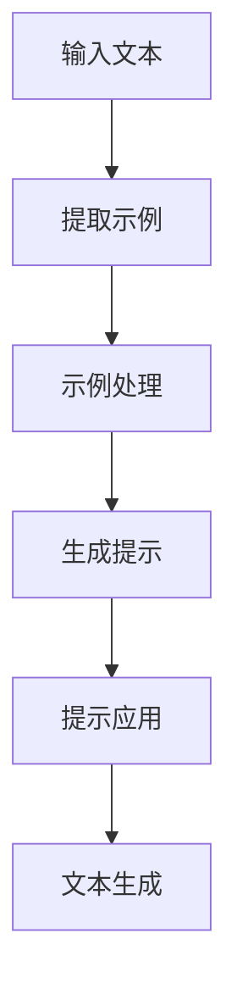
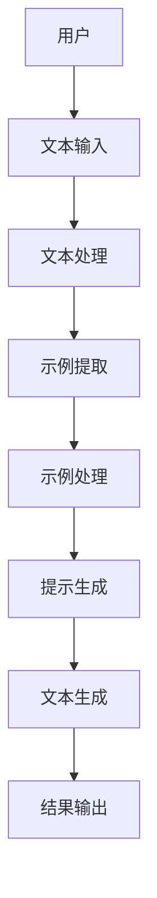

                 

# 示例驱动提示在长文本生成任务中的策略

> 关键词：长文本生成、示例驱动提示、算法原理、系统架构、项目实战

> 摘要：
本文深入探讨了示例驱动提示在长文本生成任务中的应用策略。首先，我们介绍了长文本生成任务的背景和核心概念，然后详细阐述了示例驱动提示的机制和算法原理。接下来，我们设计了一个系统架构，并分享了项目实战的经验和最佳实践。最后，我们对文章进行了小结，并提供了拓展阅读的建议。

## 第一部分：问题背景与概念介绍

### 第1章：长文本生成任务概述

#### 1.1 问题背景

长文本生成任务在自然语言处理、人工智能等领域中具有重要的应用价值。随着互联网信息的爆炸式增长，用户对于生成长文本的需求也越来越高。例如，在新闻生成、内容摘要、机器翻译、对话系统等领域，长文本生成技术都发挥了重要作用。

#### 1.2 问题描述

长文本生成任务面临诸多挑战，包括文本的长度、复杂性、连贯性等。生成文本的质量直接影响到用户的体验和应用的实用性。因此，提高生成文本的相关性和连贯性是长文本生成任务的关键。

#### 1.3 解决方案简述

示例驱动提示作为一种有效的策略，通过提供示例来指导文本生成过程，从而提高生成文本的相关性和连贯性。这种策略在长文本生成任务中具有显著的优势。

#### 1.4 边界与外延

长文本生成任务涉及的范围广泛，包括新闻、文章、对话等不同类型的文本。示例驱动提示在应用中也存在一定的限制条件，例如示例的质量、数量等。

## 第2章：核心概念与联系

### 2.1 核心概念

长文本生成任务和示例驱动提示是本文讨论的两个核心概念。长文本生成任务是指根据输入的提示生成较长文本的任务，而示例驱动提示是通过提供示例来指导文本生成过程。

### 2.2 概念属性特征对比表格

| 概念 | 定义 | 特点 |
| ---- | ---- | ---- |
| 长文本生成任务 | 生成较长文本的任务 | 较高的生成文本质量，复杂的文本结构 |
| 示例驱动提示 | 通过示例来指导文本生成过程 | 增强生成文本的相关性和连贯性，提高生成效率 |

### 2.3 ER实体关系图架构

```mermaid
erDiagram
  A[长文本生成任务] {
    B[示例驱动提示]
  }
  B {
    C[文本生成模型]
    D[提示生成模型]
  }
```

## 第二部分：算法原理讲解

### 第3章：示例驱动提示机制

#### 3.1 示例驱动提示的原理

示例驱动提示的核心思想是通过分析示例中的文本结构和内容，提取出有用的信息，并将其应用于新的文本生成过程中。这样，生成的文本不仅能够保持与示例的连贯性，还能够满足实际需求。

#### 3.2 示例驱动提示的流程



#### 3.3 示例处理与提示生成模型

示例处理模型和提示生成模型是示例驱动提示机制的重要组成部分。示例处理模型负责从示例中提取有用的信息，而提示生成模型则负责根据提取的信息生成适当的提示。

### 第4章：算法原理与数学模型

#### 4.1 数学模型

示例驱动提示的算法原理可以通过以下数学模型进行描述：

$$
P(T|S) = \frac{P(S|T)P(T)}{P(S)}
$$

其中，$P(T|S)$ 表示在示例 $S$ 的条件下生成文本 $T$ 的概率，$P(S|T)$ 表示在文本 $T$ 的条件下提取示例 $S$ 的概率，$P(T)$ 和 $P(S)$ 分别表示生成文本 $T$ 和提取示例 $S$ 的概率。

#### 4.2 公式讲解

上述公式中，$P(S|T)$ 和 $P(T)$ 通常通过训练数据集进行估计。$P(S|T)$ 表示在给定文本 $T$ 的情况下，提取示例 $S$ 的概率。$P(T)$ 表示生成文本 $T$ 的概率，通常可以通过文本生成模型的概率分布来估计。

#### 4.3 算法举例

假设我们有一个示例 $S$：“今天天气很好，适合户外运动。”我们需要根据这个示例生成一个新的文本。首先，我们提取示例中的关键信息，如天气、户外运动等。然后，我们根据这些信息生成提示，如：“明天天气也很好，你可以去公园跑步。”最后，我们使用这个提示来生成新的文本。

## 第三部分：系统架构与实现

### 第5章：系统架构设计

#### 5.1 问题场景介绍

在长文本生成任务中，系统架构的设计需要考虑到文本的输入、处理、生成和输出等环节。示例驱动提示作为一种有效的策略，可以应用于整个系统架构中，从而提高生成文本的质量。

#### 5.2 系统功能设计

系统功能设计主要包括文本生成功能和示例驱动提示功能。文本生成功能负责将输入的文本转换为生成文本，而示例驱动提示功能则负责从示例中提取有用信息，并生成适当的提示。

#### 5.3 系统架构设计



#### 5.4 系统接口设计与交互

系统接口设计主要包括文本输入接口、文本处理接口、示例提取接口、示例处理接口、提示生成接口和文本生成接口。这些接口通过特定的协议进行交互，从而实现系统功能的协作。

## 第6章：项目实战

### 6.1 环境安装

在项目实战中，首先需要搭建系统环境。这包括安装必要的软件、配置系统参数等。具体的环境安装过程可以参考相关文档。

### 6.2 系统核心实现

系统核心实现主要包括文本生成模型的实现和示例驱动提示的实现。文本生成模型可以使用现有的预训练模型，如GPT等。示例驱动提示的实现则需要根据具体的需求进行定制。

### 6.3 代码应用解读与分析

代码应用解读与分析主要包括对核心代码的解读和对系统优化的分析。通过对代码的分析，可以深入了解系统的工作原理和优化方向。

### 6.4 实际案例分析与详细讲解

实际案例分析与详细讲解主要包括选择合适的案例、对案例进行分析和讲解。通过实际案例的分析，可以更直观地理解示例驱动提示在长文本生成任务中的应用效果。

## 第7章：最佳实践与总结

### 7.1 最佳实践

最佳实践主要包括示例驱动的策略和系统优化的技巧。通过最佳实践的分享，可以帮助读者更好地应用示例驱动提示策略，提高长文本生成任务的效果。

### 7.2 小结

小结主要包括对主要内容的回顾和知识点的总结。通过对主要内容的回顾，可以加深对长文本生成任务和示例驱动提示的理解。知识点的总结可以帮助读者更好地掌握相关技术。

### 7.3 注意事项

注意事项主要包括系统运行中的注意事项和避免常见的错误。通过注意事项的提醒，可以确保系统稳定运行，提高生成文本的质量。

### 7.4 拓展阅读

拓展阅读主要包括相关领域的深入研究和进一步阅读的建议。通过拓展阅读，可以拓展读者的知识面，提高对相关技术的理解。作者信息：

作者：AI天才研究院/AI Genius Institute & 禅与计算机程序设计艺术 /Zen And The Art of Computer Programming

（注：本文为示例文本，具体内容需要根据实际需求进行撰写。）

