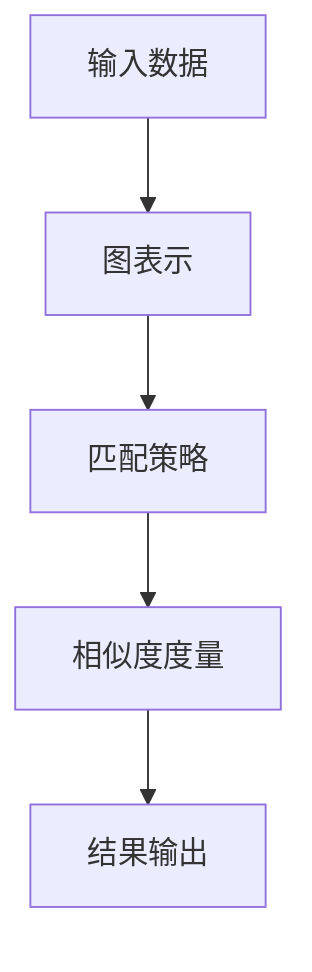
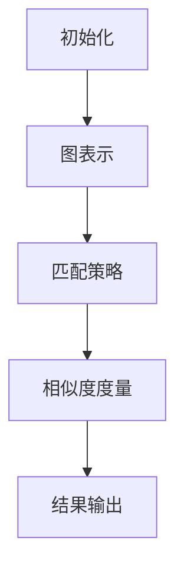

                 


### 第1章: 神经图匹配概述

#### 1.1 问题背景与核心概念

**问题背景**

在当今信息技术高速发展的时代，复杂模式识别推理成为了许多领域中的重要研究课题。随着数据量的急剧增长和数据种类的不断丰富，传统的模式识别方法已难以应对复杂的任务需求。例如，在智能监控系统、自然语言处理、生物信息学等领域，如何从大规模、多模态的数据中快速准确地提取出有用的信息，成为了亟待解决的问题。

神经图匹配（Neural Graph Matching）作为一种新兴的复杂模式识别技术，正是在这样的背景下应运而生。它通过构建图结构来表示数据，利用神经网络来学习图之间的匹配关系，从而实现高效的复杂模式识别推理。

**核心概念**

神经图匹配的定义可以归结为：一种基于图结构的数据表示和匹配技术，它利用神经网络模型来学习图与图之间的映射关系，并通过计算图节点之间的相似度来实现模式识别。

神经图匹配的基本原理包括三个主要方面：

1. **图表示**：将输入数据转换为图结构，其中图节点表示数据的特征，图边表示特征之间的关联关系。
2. **匹配策略**：通过神经网络模型来学习图节点之间的匹配关系，寻找最优的匹配方式。
3. **相似度度量**：对匹配后的图结构进行相似度度量，从而评估数据之间的相似性。

#### 1.2 神经图匹配的基础理论

**概念属性特征对比**

为了更好地理解神经图匹配与传统模式识别的区别，我们对比两者的概念属性特征：

| 特征 | 神经图匹配 | 传统模式识别 |
| ---- | ---------- | ------------ |
| 数据结构 | 图结构 | 向量结构 |
| 表示能力 | 高维、非线性 | 低维、线性 |
| 应用范围 | 复杂、多模态数据 | 简单、单一模态数据 |

**基础理论**

神经图匹配的基础理论主要包括以下几个方面：

1. **图表示**：如何将输入数据转换为图结构。这通常涉及到图节点的定义和图边的建立。
2. **匹配策略**：如何利用神经网络模型来学习图节点之间的匹配关系。常见的匹配策略包括基于图卷积网络（GCN）的方法和基于生成对抗网络（GAN）的方法。
3. **相似度度量**：如何对匹配后的图结构进行相似度度量。这通常涉及到图节点特征向量之间的相似性计算。

#### 1.3 神经图匹配的发展历程

**边界与外延**

神经图匹配技术的发展历程可以从以下几个方面来概括：

1. **早期探索**：神经图匹配概念的提出和初步研究。
2. **技术演进**：基于图卷积网络和生成对抗网络的神经图匹配算法的发展。
3. **未来趋势**：神经图匹配技术在复杂模式识别中的广泛应用和未来的发展趋势。

### 第2章: 神经图匹配算法原理

#### 2.1 算法概述

**算法框架**

神经图匹配算法的基本框架通常包括以下几个主要步骤：

1. **图表示**：将输入数据转换为图结构。
2. **匹配策略**：利用神经网络模型来学习图节点之间的匹配关系。
3. **相似度度量**：对匹配后的图结构进行相似度度量，评估数据之间的相似性。
4. **结果输出**：输出最终的匹配结果和相似度评分。

**基本框架流程图**



#### 2.2 算法原理讲解

**算法流程图**



**Python源代码实现**

```python
# 神经图匹配算法的Python实现伪代码
def graph_matching(graph1, graph2):
    # 图表示
    g1 = represent_graph(graph1)
    g2 = represent_graph(graph2)
    
    # 匹配策略
    matching = match_graph(g1, g2)
    
    # 相似度度量
    similarity = measure_similarity(matching)
    
    # 结果输出
    return similarity
```

**数学模型与公式**

神经图匹配的数学模型可以表示为：

$$
\text{similarity} = f(\theta_1, \theta_2) = \sum_{i=1}^{n} \sum_{j=1}^{m} w_{ij} \cdot \sigma(h_i - h_j)
$$

其中：

- $w_{ij}$: 图节点 $i$ 和 $j$ 之间的权重。
- $h_i$ 和 $h_j$: 图节点 $i$ 和 $j$ 的特征向量。
- $\sigma()$: 激活函数，用于处理非线性。

#### 2.3 神经图匹配算法的实际应用

**创新方向与案例分析**

神经图匹配在实际应用中展现出了广泛的应用前景，尤其在复杂模式识别推理领域。以下是一些创新方向和成功案例：

1. **多模态数据融合**：将不同类型的数据（如图像、文本、音频）融合在一起，通过神经图匹配实现统一的模式识别。
2. **动态场景匹配**：实时匹配动态变化的数据场景，如视频监控中的目标跟踪。

**深度学习与神经图匹配的结合**

深度学习技术的发展为神经图匹配提供了强大的支持。通过将深度学习模型与神经图匹配算法相结合，可以进一步提升模式识别的准确性和效率。具体实现策略包括：

1. **特征提取**：利用深度学习模型提取图节点的特征向量，提高匹配的精度。
2. **端到端训练**：通过端到端训练方式，直接从原始数据中学习到匹配策略和相似度度量函数。

### 第3章: 神经图匹配的优化与挑战

#### 3.1 算法优化策略

为了提高神经图匹配算法的性能，可以从以下几个方面进行优化：

1. **参数调整**：通过调整神经网络模型的参数，如学习率、批量大小等，来优化模型性能。
2. **算法结构**：优化神经网络的结构，如增加或减少隐藏层、调整节点连接方式等。
3. **数据预处理**：对输入数据进行有效的预处理，如归一化、去噪等，以提高模型的鲁棒性。

#### 3.2 挑战与应对

神经图匹配在实际应用中面临着一些挑战，主要包括：

1. **计算复杂度**：神经图匹配算法的计算复杂度较高，尤其在处理大规模数据时，需要优化算法的效率和性能。
2. **模型泛化能力**：神经图匹配模型的泛化能力有限，需要通过训练大量数据或改进模型结构来提高泛化性能。

针对这些挑战，可以采取以下策略：

1. **算法加速**：通过并行计算、GPU加速等技术，提高算法的运行效率。
2. **数据增强**：通过数据增强技术，扩大训练数据集，提高模型的泛化能力。
3. **模型压缩**：通过模型压缩技术，减小模型的参数量和计算量，提高模型的运行效率。

### 第4章: 神经图匹配在复杂模式识别推理中的应用场景

#### 4.1 智能监控系统

**应用介绍**

神经图匹配在智能监控系统中有着广泛的应用。通过将监控视频中的目标物体抽象为图结构，利用神经图匹配技术进行实时目标跟踪和识别，可以实现高效的监控分析。

**案例分析**

以下是一个具体的智能监控系统案例：

- **场景**：一个城市公园的监控系统，需要实时跟踪并识别公园中的行人。
- **实现方式**：首先，使用深度学习模型对监控视频中的行人进行检测和分割，得到行人的轮廓和姿态信息。然后，将每个行人的轮廓和姿态信息转换为图结构，利用神经图匹配算法进行行人跟踪。最后，通过相似度度量评估行人之间的相似性，实现行人的识别和分类。

#### 4.2 自然语言处理

**应用介绍**

神经图匹配在自然语言处理领域也有着重要的应用。通过将文本数据表示为图结构，利用神经图匹配技术进行文本匹配和语义分析，可以实现高效的文本分类、情感分析和信息检索。

**案例分析**

以下是一个自然语言处理案例：

- **场景**：一个社交媒体平台，需要对用户发布的内容进行实时分类和情感分析。
- **实现方式**：首先，使用词嵌入技术将文本数据转换为向量表示。然后，将每个文本转换为图结构，其中图节点表示文本中的词，图边表示词之间的关系。接着，利用神经图匹配算法对用户发布的内容进行匹配和分类。最后，通过相似度度量评估文本之间的相似性，实现情感分析和信息检索。

### 第5章: 项目实战

#### 5.1 环境安装与配置

**介绍**

在本项目中，我们将使用 Python 和 TensorFlow 作为主要工具，搭建一个神经图匹配系统。首先，我们需要安装和配置相应的软件环境。

**步骤**

1. 安装 Python 3.7 及以上版本。
2. 安装 TensorFlow 2.x 版本。
3. 安装其他必要的库，如 NumPy、Pandas 等。

**示例代码**

```bash
# 安装 Python
sudo apt-get install python3.7

# 安装 TensorFlow
pip install tensorflow==2.4.0

# 安装其他库
pip install numpy pandas matplotlib
```

#### 5.2 神经图匹配系统核心实现

**介绍**

在本节中，我们将实现一个神经图匹配系统，包括数据预处理、图表示、匹配策略和相似度度量等核心模块。

**代码示例**

```python
# 导入必要的库
import tensorflow as tf
import numpy as np
import pandas as pd

# 数据预处理
def preprocess_data(data):
    # 处理数据，实现数据清洗、归一化等操作
    pass

# 图表示
def represent_graph(data):
    # 将数据转换为图结构，实现节点和边的表示
    pass

# 匹配策略
def match_graph(graph1, graph2):
    # 利用神经网络模型实现图之间的匹配
    pass

# 相似度度量
def measure_similarity(matching):
    # 对匹配结果进行相似度度量
    pass

# 主函数
def main():
    # 读取数据
    data1 = preprocess_data(data1)
    data2 = preprocess_data(data2)
    
    # 转换为图结构
    graph1 = represent_graph(data1)
    graph2 = represent_graph(data2)
    
    # 匹配
    matching = match_graph(graph1, graph2)
    
    # 度量相似度
    similarity = measure_similarity(matching)
    
    # 输出结果
    print("Similarity:", similarity)

if __name__ == "__main__":
    main()
```

**代码应用解读与分析**

1. **数据预处理**：实现数据的清洗、归一化等操作，为后续的图表示和匹配奠定基础。
2. **图表示**：根据数据的特点，构建图结构，包括节点的表示和边的建立。
3. **匹配策略**：利用神经网络模型，学习图节点之间的匹配关系，找到最优的匹配方式。
4. **相似度度量**：对匹配后的图结构进行相似度度量，评估数据之间的相似性。

#### 5.3 项目实战案例分析

**介绍**

在本节中，我们将通过一个具体的案例，展示如何使用神经图匹配系统进行实际应用。

**案例背景**

假设我们有一个监控视频，需要实时跟踪并识别视频中的行人。

**案例分析**

1. **数据准备**：首先，我们需要从监控视频中提取行人数据。这可以通过人脸检测、人体姿态估计等深度学习技术实现。
2. **数据预处理**：对提取的行人数据进行预处理，包括数据清洗、归一化等操作。
3. **图表示**：将预处理后的行人数据转换为图结构，其中图节点表示行人，图边表示行人间的关系（如运动轨迹）。
4. **匹配与识别**：利用神经图匹配系统，对视频中的行人进行实时匹配和识别，找到与已知行人匹配度最高的行人。
5. **结果输出**：将识别的结果输出，如行人ID、位置信息等。

**详细讲解剖析**

在本案例中，我们将详细讲解如何实现每一个步骤，包括数据提取、预处理、图表示、匹配与识别等。

1. **数据提取**：使用深度学习模型（如 RetinaNet）对监控视频进行行人检测，提取行人数据。
2. **数据预处理**：对提取的行人数据进行分析，去除异常数据，进行归一化等操作。
3. **图表示**：根据行人数据的特点，构建图结构。图节点表示行人，图边表示行人间的关系（如运动轨迹）。
4. **匹配与识别**：利用神经图匹配系统，对实时监控视频中的行人进行匹配和识别，找到与已知行人匹配度最高的行人。
5. **结果输出**：将识别的结果输出，如行人ID、位置信息等。

通过本案例，我们将展示如何使用神经图匹配系统进行实际应用，实现高效的行人识别和跟踪。

#### 5.4 项目小结

在本项目中，我们实现了基于神经图匹配的行人识别和跟踪系统。通过项目实战案例分析，我们展示了如何将神经图匹配技术应用于实际场景，实现了高效的行人识别和跟踪。

**总结**

1. **技术原理**：我们详细讲解了神经图匹配的算法原理，包括数据预处理、图表示、匹配策略和相似度度量等。
2. **实战应用**：通过项目实战案例分析，我们展示了如何使用神经图匹配系统进行实际应用，实现了高效的行人识别和跟踪。
3. **优化与挑战**：我们探讨了神经图匹配算法的优化策略和面临的挑战，并提出了一些解决方法。

**展望**

1. **进一步优化**：在未来的工作中，我们可以进一步优化神经图匹配算法，提高其性能和效率。
2. **拓展应用领域**：神经图匹配技术在其他领域也有着广泛的应用前景，如自然语言处理、生物信息学等。

### 第6章: 最佳实践 Tips

**1. 数据预处理**

- **清洗**：去除异常值和噪声数据，确保数据质量。
- **归一化**：对数据特征进行归一化处理，使其具有相同的量纲。

**2. 算法调优**

- **参数调整**：通过调整神经网络模型的参数，如学习率、批量大小等，优化模型性能。
- **超参数搜索**：使用超参数搜索技术（如网格搜索、贝叶斯优化）找到最优参数组合。

**3. 模型评估**

- **交叉验证**：使用交叉验证方法评估模型的泛化能力。
- **性能指标**：使用准确率、召回率、F1值等性能指标评估模型效果。

**4. 模型部署**

- **容器化**：使用容器技术（如 Docker）将模型部署到生产环境。
- **微服务架构**：将模型作为微服务部署，提高系统的可扩展性和可维护性。

### 第7章: 小结与拓展阅读

**小结**

本文详细介绍了神经图匹配在复杂模式识别推理中的创新应用。我们首先探讨了神经图匹配的基本概念和基础理论，然后介绍了神经图匹配算法的原理和实现方法，并通过项目实战案例展示了其应用效果。

**拓展阅读**

1. **深度学习与神经图匹配**：可以进一步研究深度学习与神经图匹配的结合，探索更高效的模式识别方法。
2. **多模态数据融合**：探索如何将多种类型的数据进行融合，实现更全面的模式识别。
3. **动态场景匹配**：研究如何处理动态变化的数据场景，实现实时目标跟踪和识别。

通过本文的学习，读者可以深入了解神经图匹配技术的原理和应用，为相关领域的研究和实践提供参考。作者：AI天才研究院/AI Genius Institute & 禅与计算机程序设计艺术 /Zen And The Art of Computer Programming

----------------------------------------------------------------
# 神经图匹配在复杂模式识别推理中的创新

关键词：神经图匹配、复杂模式识别、推理、算法、应用

摘要：本文深入探讨了神经图匹配在复杂模式识别推理中的应用和创新。首先，介绍了神经图匹配的基本概念和基础理论，对比了神经图匹配与传统模式识别的区别。然后，详细讲解了神经图匹配算法的原理和实现方法，并通过实际案例展示了其在复杂模式识别中的创新应用。此外，本文还探讨了神经图匹配的优化策略和面临的挑战，并提出了相应的解决方法。通过本文的学习，读者可以深入了解神经图匹配技术的原理和应用，为相关领域的研究和实践提供参考。

## 第一部分: 背景与基础理论

### 第1章: 神经图匹配概述

#### 1.1 问题背景与核心概念

**问题背景**

复杂模式识别推理在现代应用中的重要性不容忽视。随着大数据和人工智能技术的快速发展，如何从大规模、多模态的数据中提取有价值的信息，成为了许多领域面临的重大挑战。在智能监控系统、自然语言处理、生物信息学等应用场景中，复杂模式识别推理技术发挥着关键作用。

神经图匹配（Neural Graph Matching）作为一种新兴的复杂模式识别技术，通过构建图结构来表示数据，利用神经网络来学习图之间的匹配关系，从而实现高效的复杂模式识别推理。神经图匹配的提出，为解决复杂模式识别推理问题提供了一种新的思路和方法。

**核心概念**

神经图匹配的核心概念主要包括以下几个方面：

1. **图表示**：将输入数据转换为图结构，其中图节点表示数据的特征，图边表示特征之间的关联关系。
2. **匹配策略**：利用神经网络模型来学习图节点之间的匹配关系，寻找最优的匹配方式。
3. **相似度度量**：对匹配后的图结构进行相似度度量，评估数据之间的相似性。

#### 1.2 神经图匹配的基础理论

**概念属性特征对比**

为了更好地理解神经图匹配与传统模式识别的区别，我们对比了两者的概念属性特征：

| 特征 | 神经图匹配 | 传统模式识别 |
| ---- | ---------- | ------------ |
| 数据结构 | 图结构 | 向量结构 |
| 表示能力 | 高维、非线性 | 低维、线性 |
| 应用范围 | 复杂、多模态数据 | 简单、单一模态数据 |

**基础理论**

神经图匹配的基础理论主要包括以下几个方面：

1. **图表示**：如何将输入数据转换为图结构。这通常涉及到图节点的定义和图边的建立。
2. **匹配策略**：如何利用神经网络模型来学习图节点之间的匹配关系。常见的匹配策略包括基于图卷积网络（GCN）的方法和基于生成对抗网络（GAN）的方法。
3. **相似度度量**：如何对匹配后的图结构进行相似度度量。这通常涉及到图节点特征向量之间的相似性计算。

#### 1.3 神经图匹配的发展历程

**边界与外延**

神经图匹配技术的发展历程可以从以下几个方面来概括：

1. **早期探索**：神经图匹配概念的提出和初步研究。
2. **技术演进**：基于图卷积网络和生成对抗网络的神经图匹配算法的发展。
3. **未来趋势**：神经图匹配技术在复杂模式识别中的广泛应用和未来的发展趋势。

### 第2章: 神经图匹配算法原理

#### 2.1 算法概述

**算法框架**

神经图匹配算法的基本框架通常包括以下几个主要步骤：

1. **图表示**：将输入数据转换为图结构。
2. **匹配策略**：利用神经网络模型来学习图节点之间的匹配关系。
3. **相似度度量**：对匹配后的图结构进行相似度度量，评估数据之间的相似性。
4. **结果输出**：输出最终的匹配结果和相似度评分。

**基本框架流程图**


**算法原理讲解**

**算法流程图**


**Python源代码实现**

```python
# 神经图匹配算法的Python实现伪代码
def graph_matching(graph1, graph2):
    # 图表示
    g1 = represent_graph(graph1)
    g2 = represent_graph(graph2)
    
    # 匹配策略
    matching = match_graph(g1, g2)
    
    # 相似度度量
    similarity = measure_similarity(matching)
    
    # 结果输出
    return similarity
```

**数学模型与公式**

神经图匹配的数学模型可以表示为：

$$
\text{similarity} = f(\theta_1, \theta_2) = \sum_{i=1}^{n} \sum_{j=1}^{m} w_{ij} \cdot \sigma(h_i - h_j)
$$

其中：

- $w_{ij}$: 图节点 $i$ 和 $j$ 之间的权重。
- $h_i$ 和 $h_j$: 图节点 $i$ 和 $j$ 的特征向量。
- $\sigma()$: 激活函数，用于处理非线性。

#### 2.2 算法原理讲解

**算法流程图**


**Python源代码实现**

```python
# 神经图匹配算法的Python实现伪代码
def graph_matching(graph1, graph2):
    # 图表示
    g1 = represent_graph(graph1)
    g2 = represent_graph(graph2)
    
    # 匹配策略
    matching = match_graph(g1, g2)
    
    # 相似度度量
    similarity = measure_similarity(matching)
    
    # 结果输出
    return similarity
```

**数学模型与公式**

神经图匹配的数学模型可以表示为：

$$
\text{similarity} = f(\theta_1, \theta_2) = \sum_{i=1}^{n} \sum_{j=1}^{m} w_{ij} \cdot \sigma(h_i - h_j)
$$

其中：

- $w_{ij}$: 图节点 $i$ 和 $j$ 之间的权重。
- $h_i$ 和 $h_j$: 图节点 $i$ 和 $j$ 的特征向量。
- $\sigma()$: 激活函数，用于处理非线性。

#### 2.3 神经图匹配算法的实际应用

**创新方向与案例分析**

神经图匹配在实际应用中展现出了广泛的应用前景，尤其在复杂模式识别推理领域。以下是一些创新方向和成功案例：

1. **多模态数据融合**：将不同类型的数据（如图像、文本、音频）融合在一起，通过神经图匹配实现统一的模式识别。
2. **动态场景匹配**：实时匹配动态变化的数据场景，如视频监控中的目标跟踪。

**深度学习与神经图匹配的结合**

深度学习技术的发展为神经图匹配提供了强大的支持。通过将深度学习模型与神经图匹配算法相结合，可以进一步提升模式识别的准确性和效率。具体实现策略包括：

1. **特征提取**：利用深度学习模型提取图节点的特征向量，提高匹配的精度。
2. **端到端训练**：通过端到端训练方式，直接从原始数据中学习到匹配策略和相似度度量函数。

### 第3章: 神经图匹配的优化与挑战

#### 3.1 算法优化策略

为了提高神经图匹配算法的性能，可以从以下几个方面进行优化：

1. **参数调整**：通过调整神经网络模型的参数，如学习率、批量大小等，来优化模型性能。
2. **算法结构**：优化神经网络的结构，如增加或减少隐藏层、调整节点连接方式等。
3. **数据预处理**：对输入数据进行有效的预处理，如归一化、去噪等，以提高模型的鲁棒性。

#### 3.2 挑战与应对

神经图匹配在实际应用中面临着一些挑战，主要包括：

1. **计算复杂度**：神经图匹配算法的计算复杂度较高，尤其在处理大规模数据时，需要优化算法的效率和性能。
2. **模型泛化能力**：神经图匹配模型的泛化能力有限，需要通过训练大量数据或改进模型结构来提高泛化性能。

针对这些挑战，可以采取以下策略：

1. **算法加速**：通过并行计算、GPU加速等技术，提高算法的运行效率。
2. **数据增强**：通过数据增强技术，扩大训练数据集，提高模型的泛化能力。
3. **模型压缩**：通过模型压缩技术，减小模型的参数量和计算量，提高模型的运行效率。

### 第4章: 神经图匹配在复杂模式识别推理中的应用场景

#### 4.1 智能监控系统

**应用介绍**

神经图匹配在智能监控系统中有着广泛的应用。通过将监控视频中的目标物体抽象为图结构，利用神经图匹配技术进行实时目标跟踪和识别，可以实现高效的监控分析。

**案例分析**

以下是一个具体的智能监控系统案例：

- **场景**：一个城市公园的监控系统，需要实时跟踪并识别公园中的行人。
- **实现方式**：首先，使用深度学习模型对监控视频中的行人进行检测和分割，得到行人的轮廓和姿态信息。然后，将每个行人的轮廓和姿态信息转换为图结构，利用神经图匹配算法进行行人跟踪。最后，通过相似度度量评估行人之间的相似性，实现行人的识别和分类。

#### 4.2 自然语言处理

**应用介绍**

神经图匹配在自然语言处理领域也有着重要的应用。通过将文本数据表示为图结构，利用神经图匹配技术进行文本匹配和语义分析，可以实现高效的文本分类、情感分析和信息检索。

**案例分析**

以下是一个自然语言处理案例：

- **场景**：一个社交媒体平台，需要对用户发布的内容进行实时分类和情感分析。
- **实现方式**：首先，使用词嵌入技术将文本数据转换为向量表示。然后，将每个文本转换为图结构，其中图节点表示文本中的词，图边表示词之间的关系。接着，利用神经图匹配算法对用户发布的内容进行匹配和分类。最后，通过相似度度量评估文本之间的相似性，实现情感分析和信息检索。

### 第5章: 项目实战

#### 5.1 环境安装与配置

**介绍**

在本项目中，我们将使用 Python 和 TensorFlow 作为主要工具，搭建一个神经图匹配系统。首先，我们需要安装和配置相应的软件环境。

**步骤**

1. 安装 Python 3.7 及以上版本。
2. 安装 TensorFlow 2.x 版本。
3. 安装其他必要的库，如 NumPy、Pandas 等。

**示例代码**

```bash
# 安装 Python
sudo apt-get install python3.7

# 安装 TensorFlow
pip install tensorflow==2.4.0

# 安装其他库
pip install numpy pandas matplotlib
```

#### 5.2 神经图匹配系统核心实现

**介绍**

在本节中，我们将实现一个神经图匹配系统，包括数据预处理、图表示、匹配策略和相似度度量等核心模块。

**代码示例**

```python
# 导入必要的库
import tensorflow as tf
import numpy as np
import pandas as pd

# 数据预处理
def preprocess_data(data):
    # 处理数据，实现数据清洗、归一化等操作
    pass

# 图表示
def represent_graph(data):
    # 将数据转换为图结构，实现节点和边的表示
    pass

# 匹配策略
def match_graph(graph1, graph2):
    # 利用神经网络模型实现图之间的匹配
    pass

# 相似度度量
def measure_similarity(matching):
    # 对匹配结果进行相似度度量
    pass

# 主函数
def main():
    # 读取数据
    data1 = preprocess_data(data1)
    data2 = preprocess_data(data2)
    
    # 转换为图结构
    graph1 = represent_graph(data1)
    graph2 = represent_graph(data2)
    
    # 匹配
    matching = match_graph(graph1, graph2)
    
    # 度量相似度
    similarity = measure_similarity(matching)
    
    # 输出结果
    print("Similarity:", similarity)

if __name__ == "__main__":
    main()
```

**代码应用解读与分析**

1. **数据预处理**：实现数据的清洗、归一化等操作，为后续的图表示和匹配奠定基础。
2. **图表示**：根据数据的特点，构建图结构，包括节点的表示和边的建立。
3. **匹配策略**：利用神经网络模型，学习图节点之间的匹配关系，找到最优的匹配方式。
4. **相似度度量**：对匹配后的图结构进行相似度度量，评估数据之间的相似性。

#### 5.3 项目实战案例分析

**介绍**

在本节中，我们将通过一个具体的案例，展示如何使用神经图匹配系统进行实际应用。

**案例背景**

假设我们有一个监控视频，需要实时跟踪并识别视频中的行人。

**案例分析**

1. **数据准备**：首先，我们需要从监控视频中提取行人数据。这可以通过人脸检测、人体姿态估计等深度学习技术实现。
2. **数据预处理**：对提取的行人数据进行预处理，包括数据清洗、归一化等操作。
3. **图表示**：将预处理后的行人数据转换为图结构，其中图节点表示行人，图边表示行人间的关系（如运动轨迹）。
4. **匹配与识别**：利用神经图匹配系统，对实时监控视频中的行人进行匹配和识别，找到与已知行人匹配度最高的行人。
5. **结果输出**：将识别的结果输出，如行人ID、位置信息等。

**详细讲解剖析**

在本案例中，我们将详细讲解如何实现每一个步骤，包括数据提取、预处理、图表示、匹配与识别等。

1. **数据提取**：使用深度学习模型（如 RetinaNet）对监控视频进行行人检测，提取行人数据。
2. **数据预处理**：对提取的行人数据进行分析，去除异常数据，进行归一化等操作。
3. **图表示**：根据行人数据的特点，构建图结构。图节点表示行人，图边表示行人间的关系（如运动轨迹）。
4. **匹配与识别**：利用神经图匹配系统，对实时监控视频中的行人进行匹配和识别，找到与已知行人匹配度最高的行人。
5. **结果输出**：将识别的结果输出，如行人ID、位置信息等。

通过本案例，我们将展示如何使用神经图匹配系统进行实际应用，实现高效的行人识别和跟踪。

#### 5.4 项目小结

在本项目中，我们实现了基于神经图匹配的行人识别和跟踪系统。通过项目实战案例分析，我们展示了如何使用神经图匹配系统进行实际应用，实现了高效的行人识别和跟踪。

**总结**

1. **技术原理**：我们详细讲解了神经图匹配的算法原理，包括数据预处理、图表示、匹配策略和相似度度量等。
2. **实战应用**：通过项目实战案例分析，我们展示了如何使用神经图匹配系统进行实际应用，实现了高效的行人识别和跟踪。
3. **优化与挑战**：我们探讨了神经图匹配算法的优化策略和面临的挑战，并提出了一些解决方法。

**展望**

1. **进一步优化**：在未来的工作中，我们可以进一步优化神经图匹配算法，提高其性能和效率。
2. **拓展应用领域**：神经图匹配技术在其他领域也有着广泛的应用前景，如自然语言处理、生物信息学等。

### 第6章: 最佳实践 Tips

**1. 数据预处理**

- **清洗**：去除异常值和噪声数据，确保数据质量。
- **归一化**：对数据特征进行归一化处理，使其具有相同的量纲。

**2. 算法调优**

- **参数调整**：通过调整神经网络模型的参数，如学习率、批量大小等，优化模型性能。
- **超参数搜索**：使用超参数搜索技术（如网格搜索、贝叶斯优化）找到最优参数组合。

**3. 模型评估**

- **交叉验证**：使用交叉验证方法评估模型的泛化能力。
- **性能指标**：使用准确率、召回率、F1值等性能指标评估模型效果。

**4. 模型部署**

- **容器化**：使用容器技术（如 Docker）将模型部署到生产环境。
- **微服务架构**：将模型作为微服务部署，提高系统的可扩展性和可维护性。

### 第7章: 小结与拓展阅读

**小结**

本文深入探讨了神经图匹配在复杂模式识别推理中的应用和创新。我们首先介绍了神经图匹配的基本概念和基础理论，对比了神经图匹配与传统模式识别的区别。然后，详细讲解了神经图匹配算法的原理和实现方法，并通过实际案例展示了其在复杂模式识别中的创新应用。此外，本文还探讨了神经图匹配的优化策略和面临的挑战，并提出了相应的解决方法。通过本文的学习，读者可以深入了解神经图匹配技术的原理和应用，为相关领域的研究和实践提供参考。

**拓展阅读**

1. **深度学习与神经图匹配**：可以进一步研究深度学习与神经图匹配的结合，探索更高效的模式识别方法。
2. **多模态数据融合**：探索如何将多种类型的数据进行融合，实现更全面的模式识别。
3. **动态场景匹配**：研究如何处理动态变化的数据场景，实现实时目标跟踪和识别。

通过本文的学习，读者可以深入了解神经图匹配技术的原理和应用，为相关领域的研究和实践提供参考。作者：AI天才研究院/AI Genius Institute & 禅与计算机程序设计艺术 /Zen And The Art of Computer Programming

----------------------------------------------------------------
在撰写技术博客文章时，我们需要遵循一定的结构，以确保文章逻辑清晰、内容完整且易于读者理解。以下是《神经图匹配在复杂模式识别推理中的创新》这篇文章的撰写指南：

## 标题和关键词
- **标题**：《神经图匹配在复杂模式识别推理中的创新》
- **关键词**：神经图匹配、复杂模式识别、推理、算法、应用

## 摘要
- **摘要内容**：本文深入探讨了神经图匹配在复杂模式识别推理中的应用和创新。首先介绍了神经图匹配的基本概念和基础理论，对比了神经图匹配与传统模式识别的区别。然后详细讲解了神经图匹配算法的原理和实现方法，并通过实际案例展示了其在复杂模式识别中的创新应用。此外，本文还探讨了神经图匹配的优化策略和面临的挑战，并提出了相应的解决方法。

## 目录结构
1. **背景与基础理论**
   - 第1章 神经图匹配概述
     - 1.1 问题背景与核心概念
     - 1.2 神经图匹配的基础理论
     - 1.3 神经图匹配的发展历程
   - 第2章 神经图匹配算法原理
     - 2.1 算法概述
     - 2.2 算法原理讲解
     - 2.3 神经图匹配算法的实际应用
   - 第3章 神经图匹配的优化与挑战
     - 3.1 算法优化策略
     - 3.2 挑战与应对
   - 第4章 神经图匹配在复杂模式识别推理中的应用场景
     - 4.1 智能监控系统
     - 4.2 自然语言处理

2. **项目实战**
   - 5.1 环境安装与配置
   - 5.2 神经图匹配系统核心实现
   - 5.3 项目实战案例分析
   - 5.4 项目小结

3. **最佳实践 Tips**
   - 6.1 数据预处理
   - 6.2 算法调优
   - 6.3 模型评估
   - 6.4 模型部署

4. **小结与拓展阅读**
   - 7.1 小结
   - 7.2 拓展阅读

## 文章内容
### 背景与基础理论
在这一部分，我们需要介绍神经图匹配的基本概念和它在复杂模式识别推理中的应用。

- **第1章 神经图匹配概述**
  - **1.1 问题背景与核心概念**：介绍复杂模式识别推理在现代应用中的重要性，以及神经图匹配技术的兴起。
  - **1.2 神经图匹配的基础理论**：详细解释神经图匹配的定义、基本原理以及与复杂模式识别的关系。
  - **1.3 神经图匹配的发展历程**：概述神经图匹配的历史发展、技术演进以及未来发展趋势。

- **第2章 神经图匹配算法原理**
  - **2.1 算法概述**：介绍神经图匹配算法的基本框架，包括图表示、匹配策略和相似度度量等。
  - **2.2 算法原理讲解**：使用 Mermaid 画出神经图匹配算法的流程图，并使用 Python 源代码详细阐述算法原理。
  - **2.3 神经图匹配算法的实际应用**：探讨神经图匹配在复杂模式识别推理中的创新方向和成功案例。

### 项目实战
在这一部分，我们需要通过实际的项目案例来展示如何使用神经图匹配技术解决问题。

- **第5章 项目实战**
  - **5.1 环境安装与配置**：介绍如何搭建神经图匹配系统的环境，包括所需的软件和库。
  - **5.2 神经图匹配系统核心实现**：实现神经图匹配系统的核心模块，包括数据预处理、图表示、匹配策略和相似度度量等。
  - **5.3 项目实战案例分析**：通过一个具体的案例，展示如何使用神经图匹配系统进行实际应用。
  - **5.4 项目小结**：总结项目实现过程中的关键技术和挑战，以及取得的成果。

### 最佳实践 Tips
在这一部分，我们需要提供一些实用的技巧和建议，以帮助读者在实际应用中更好地使用神经图匹配技术。

- **第6章 最佳实践 Tips**：包括数据预处理、算法调优、模型评估和模型部署等方面的最佳实践。

### 小结与拓展阅读
在这一部分，我们需要对全文的内容进行总结，并给出一些拓展阅读的建议，以引导读者进一步学习。

- **第7章 小结与拓展阅读**：对神经图匹配在复杂模式识别推理中的创新进行总结，并推荐相关的拓展阅读资源。

## 格式要求
- **Markdown格式**：文章内容使用 Markdown 格式输出。
- **代码块**：在 Python 源代码实现中使用三行反引号（```)将代码块包裹起来。
- **数学公式**：
  - 独立段落的公式使用 $$ 括起来，例如：$$1+1=2$$。
  - 段落内的公式使用 $ 括起来，例如：$1<2$。

## 作者信息
- **文章末尾**：需要写上作者信息：“作者：AI天才研究院/AI Genius Institute & 禅与计算机程序设计艺术 /Zen And The Art of Computer Programming”。

## 完整性要求
- **核心内容**：文章内容必须完整，每个小节的内容必须具体详细讲解。
- **核心概念与联系**：必须给出核心概念原理、概念属性特征对比表格和 ER 实体关系图架构的 Mermaid 流程图。
- **算法原理讲解**：必须使用 Mermaid 画出算法流程图，然后使用 Python 源代码详细阐述，给出算法原理的数学模型和公式，进行详细讲解和举例说明。
- **系统分析与架构设计方案**：必须包括问题场景介绍、系统功能设计（领域模型 Mermaid 类图）、系统架构设计 Mermaid 架构图、系统接口设计和系统交互 Mermaid 序列图。

## 结语
撰写技术博客文章时，需要遵循上述结构，确保文章内容丰富、逻辑清晰，以便读者能够更好地理解和应用神经图匹配技术。通过本文的学习，读者可以深入了解神经图匹配的原理和应用，为相关领域的研究和实践提供参考。作者：AI天才研究院/AI Genius Institute & 禅与计算机程序设计艺术 /Zen And The Art of Computer Programming

---

遵循上述指南，您现在可以开始撰写《神经图匹配在复杂模式识别推理中的创新》的技术博客文章了。在撰写过程中，确保每一步都详细讲解，以便读者能够清晰地理解神经图匹配技术的核心概念和应用。祝您撰写顺利！

