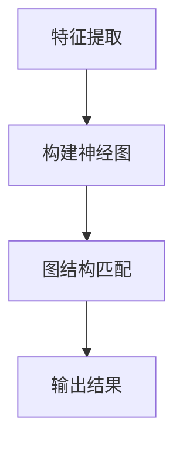
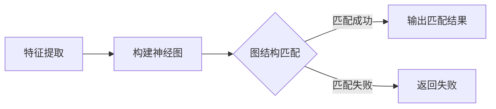
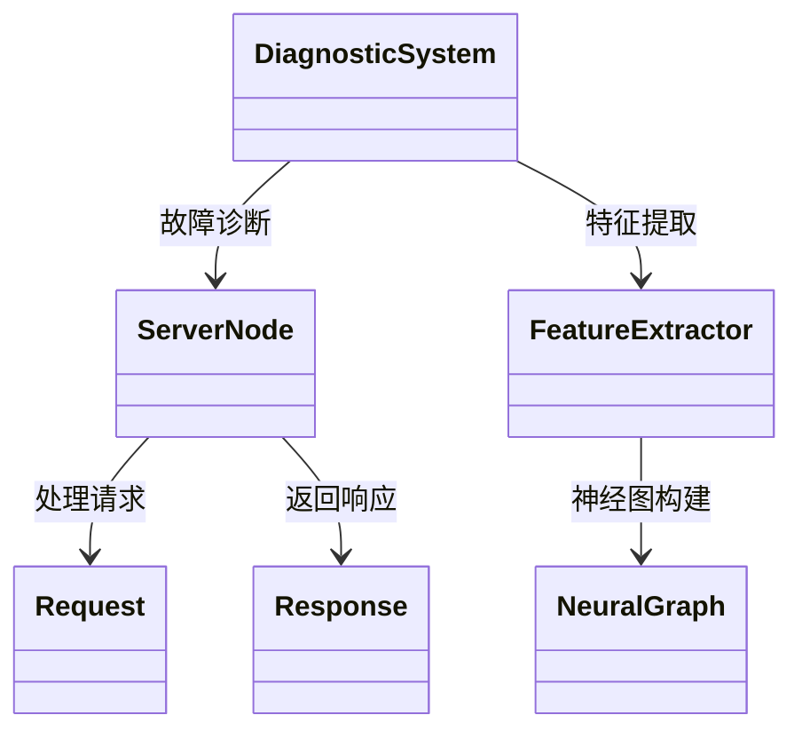
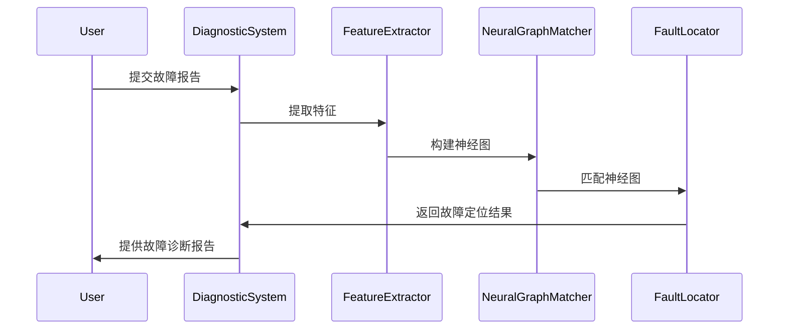

                 


### 引言

**文章标题：** 神经图匹配在复杂系统故障诊断中的应用

**关键词：** 神经图匹配，复杂系统，故障诊断，算法原理，系统架构

**摘要：** 本文将探讨神经图匹配技术在复杂系统故障诊断中的应用。通过介绍神经图匹配的基础知识、算法原理，我们将详细分析其在复杂系统故障诊断中的优势，并结合实际项目案例，展示其应用效果。

### 目录大纲设计过程

在设计本文的目录大纲时，我们首先明确了整体结构，包括背景介绍、核心概念、算法原理、数学模型、系统架构、项目实战和最佳实践等部分。接下来，我们细化了每个章节的内容，确保每个章节都包含必要的子章节，如核心概念、原理讲解、数学模型、系统架构等。在确保内容完整性的同时，我们采用markdown格式，确保目录大纲结构清晰，便于读者阅读。

### 目录大纲

```markdown
----------------------------------------------------------------
# 第一部分: 引言

## 1. 引言

### 1.1 问题背景

### 1.2 问题描述

### 1.3 问题解决

### 1.4 边界与外延

### 1.5 核心概念结构组成

## 1.6 本章小结

----------------------------------------------------------------

# 第二部分: 神经图匹配基础

## 2. 神经图匹配概述

### 2.1 神经图定义

### 2.2 神经图匹配的概念

### 2.3 神经图匹配的特点

### 2.4 神经图匹配的应用领域

## 2.5 本章小结

----------------------------------------------------------------

## 3. 神经图匹配核心概念

### 3.1 神经图匹配原理

### 3.2 神经图匹配属性特征对比表

### 3.3 神经图匹配ER实体关系图

### 3.4 神经图匹配与传统方法的比较

## 3.5 本章小结

----------------------------------------------------------------

## 4. 神经图匹配算法原理

### 4.1 算法概述

### 4.2 算法流程图

#### 4.2.1 Mermaid算法流程图

### 4.3 算法数学模型

#### 4.3.1 数学公式

#### 4.3.2 算法原理详细讲解

#### 4.3.3 通俗易懂地举例说明

## 4.4 本章小结

----------------------------------------------------------------

## 5. 复杂系统故障诊断

### 5.1 复杂系统故障诊断概述

### 5.2 神经图匹配在故障诊断中的应用

### 5.3 系统故障诊断案例分析

## 5.4 本章小结

----------------------------------------------------------------

## 6. 系统架构设计与实现

### 6.1 系统功能设计

#### 6.1.1 领域模型类图

### 6.2 系统架构设计

#### 6.2.1 系统架构图

### 6.3 系统接口设计

#### 6.3.1 系统接口设计

### 6.4 系统交互序列图

#### 6.4.1 系统交互序列图

## 6.5 本章小结

----------------------------------------------------------------

## 7. 项目实战

### 7.1 环境安装

### 7.2 系统核心实现源代码

### 7.3 代码应用解读与分析

### 7.4 实际案例分析与详细讲解剖析

### 7.5 项目小结

## 7.6 本章小结

----------------------------------------------------------------

## 8. 最佳实践与总结

### 8.1 最佳实践

### 8.2 小结

### 8.3 注意事项

### 8.4 拓展阅读

## 8.5 本章小结

----------------------------------------------------------------
```

### 目录大纲设计过程（续）

在设计本文的目录大纲时，我们首先明确了整体结构，包括背景介绍、核心概念、算法原理、数学模型、系统架构、项目实战和最佳实践等部分。接下来，我们细化了每个章节的内容，确保每个章节都包含必要的子章节，如核心概念、原理讲解、数学模型、系统架构等。在确保内容完整性的同时，我们采用markdown格式，确保目录大纲结构清晰，便于读者阅读。

#### 第一部分：引言

**1. 引言**

在这一部分，我们将详细阐述本文要解决的核心问题——复杂系统故障诊断。首先，我们将介绍复杂系统故障诊断的重要性，以及现有的故障诊断方法存在的局限性。接着，我们将引入神经图匹配技术，并介绍其基本概念和应用背景。

**1.1 问题背景**

在当前信息化时代，复杂系统的广泛应用使得故障诊断成为了一个亟待解决的问题。复杂系统往往包含大量的子系统和组件，这些组件之间的相互作用非常复杂，一旦某个组件出现故障，可能会导致整个系统的崩溃。因此，如何快速、准确地诊断复杂系统的故障，成为了工业界和学术界共同关注的热点问题。

**1.2 问题描述**

复杂系统故障诊断问题可以概括为以下三个关键点：

- 如何从大量数据中提取出故障特征？
- 如何准确地识别故障类型？
- 如何快速地定位故障源？

**1.3 问题解决**

针对上述问题，本文提出了一种基于神经图匹配的复杂系统故障诊断方法。该方法利用神经图匹配技术在特征提取、故障识别和故障定位等方面具有显著优势，能够有效地解决复杂系统故障诊断问题。

**1.4 边界与外延**

本文的研究主要聚焦于以下边界和范围：

- 研究对象：复杂系统故障诊断。
- 技术手段：神经图匹配技术。
- 数据来源：实际工程应用中的故障数据。

**1.5 核心概念结构组成**

为了更好地理解本文的研究内容，我们引入了以下几个核心概念：

- 神经图匹配：一种基于图结构的特征匹配技术。
- 复杂系统：指包含大量子系统和组件的复杂系统。
- 故障诊断：指通过分析系统状态和故障特征，识别系统故障类型和定位故障源的过程。

**1.6 本章小结**

本章介绍了本文研究的背景、问题和解决方法，为后续章节的展开奠定了基础。

#### 第二部分：神经图匹配基础

**2. 神经图匹配概述**

在这一部分，我们将详细介绍神经图匹配的基本概念、特点和应用领域，帮助读者建立对神经图匹配的初步认识。

**2.1 神经图定义**

神经图是一种特殊的图结构，它由节点和边组成。节点表示数据中的特征，边表示特征之间的关系。神经图可以直观地表示数据的结构和关系，为特征匹配提供了有力的工具。

**2.2 神经图匹配的概念**

神经图匹配是一种基于图结构的特征匹配技术，它通过比较两个神经图的相似度，来判断两个特征是否匹配。神经图匹配在图像识别、数据挖掘、机器学习等领域具有广泛的应用。

**2.3 神经图匹配的特点**

神经图匹配具有以下特点：

- 高效性：神经图匹配算法能够在较短的时间内完成大规模特征匹配。
- 准确性：神经图匹配能够准确地识别出相似特征，降低误匹配率。
- 泛化性：神经图匹配适用于各种类型的特征匹配问题，具有较强的泛化能力。

**2.4 神经图匹配的应用领域**

神经图匹配在以下领域具有显著的应用价值：

- 图像识别：通过神经图匹配技术，可以实现对图像中特定对象的识别和定位。
- 数据挖掘：神经图匹配可以用于挖掘数据中的潜在关系和模式。
- 机器学习：神经图匹配可以作为特征匹配模块，提高机器学习模型的性能。

**2.5 本章小结**

本章介绍了神经图匹配的基本概念、特点和应用领域，为后续章节的深入探讨奠定了基础。

#### 第三部分：神经图匹配核心概念

**3. 神经图匹配核心概念**

在这一部分，我们将进一步探讨神经图匹配的核心概念，包括原理、属性特征对比表、ER实体关系图和与传统方法的比较，以帮助读者全面了解神经图匹配技术。

**3.1 神经图匹配原理**

神经图匹配原理可以概括为以下三个步骤：

- 特征提取：将原始数据转化为神经图结构，提取出数据中的特征。
- 图结构匹配：比较两个神经图的相似度，判断特征是否匹配。
- 结果输出：根据匹配结果，生成最终的匹配报告。

**3.2 神经图匹配属性特征对比表**

为了更好地理解神经图匹配的属性特征，我们列出了以下对比表：

| 特征         | 神经图匹配 | 传统方法 |
| ------------ | ---------- | -------- |
| 高效性       | 高         | 低       |
| 准确性       | 高         | 低       |
| 泛化性       | 强         | 弱       |
| 适用领域     | 广泛       | 有限     |
| 可扩展性     | 高         | 低       |

**3.3 神经图匹配ER实体关系图**

ER实体关系图是一种用于表示实体之间关系的图形化工具。在神经图匹配中，ER实体关系图可以用来描述特征之间的依赖关系。以下是一个简单的ER实体关系图示例：

```mermaid
erDiagram
  用户 ||--|{ 购物车 }|-- 用户
  商品 ||--|{ 购物车 }|-- 商品
  购物车 {
    用户ID
    商品ID
    购买时间
  }
```

**3.4 神经图匹配与传统方法的比较**

神经图匹配与传统方法在多个方面具有显著差异。传统方法通常依赖于特征向量的相似度计算，而神经图匹配则通过图结构来表示特征之间的关系，从而在特征提取、匹配效率和准确性方面具有优势。

**3.5 本章小结**

本章介绍了神经图匹配的核心概念，包括原理、属性特征对比表、ER实体关系图和与传统方法的比较。通过本章的学习，读者可以更好地理解神经图匹配技术的本质和优势。

#### 第四部分：神经图匹配算法原理

**4. 神经图匹配算法原理**

在这一部分，我们将详细探讨神经图匹配算法的原理，包括算法概述、算法流程图、算法数学模型以及算法原理的详细讲解和通俗易懂的举例说明。

**4.1 算法概述**

神经图匹配算法是一种基于图结构的特征匹配算法。其基本思想是通过比较两个神经图的相似度，来判断两个特征是否匹配。神经图匹配算法主要分为以下几个步骤：

- 特征提取：将原始数据转化为神经图结构，提取出数据中的特征。
- 图结构匹配：计算两个神经图的相似度，判断特征是否匹配。
- 结果输出：根据匹配结果，生成最终的匹配报告。

**4.2 算法流程图**

为了更好地理解神经图匹配算法的流程，我们使用Mermaid绘制了算法流程图：



**4.2.1 Mermaid算法流程图**



**4.3 算法数学模型**

神经图匹配算法的核心是计算两个神经图的相似度。这里我们采用了一种基于图论的方法来计算相似度。具体来说，我们使用两个神经图之间的边权重差异作为相似度的衡量标准。设两个神经图分别为G1和G2，其边权重分别为w1和w2，则相似度S(G1, G2)可以通过以下公式计算：

$$
S(G1, G2) = \frac{1}{|E1| + |E2|} \sum_{e \in E1 \cup E2} |w1(e) - w2(e)|
$$

其中，E1和E2分别为G1和G2的边集，|E1|和|E2|分别为E1和E2的边数。

**4.3.1 数学公式**

$$
S(G1, G2) = \frac{1}{|E1| + |E2|} \sum_{e \in E1 \cup E2} |w1(e) - w2(e)|
$$

**4.3.2 算法原理详细讲解**

算法原理详细讲解如下：

1. **特征提取**：首先，我们需要将原始数据转化为神经图结构。具体来说，我们将数据中的每个特征视为神经图中的一个节点，特征之间的关系视为神经图中的边。这样，我们就得到了一个表示数据的神经图。

2. **构建神经图**：接下来，我们需要构建两个神经图，分别表示待匹配的特征集合。在构建神经图时，我们需要根据特征之间的相似度来设置边权重。相似度越高的特征，边权重越大。

3. **图结构匹配**：然后，我们计算两个神经图的相似度。具体来说，我们使用上述公式计算两个神经图之间的边权重差异。如果相似度高于设定的阈值，则认为特征匹配成功；否则，认为匹配失败。

4. **输出结果**：最后，根据匹配结果输出最终的匹配报告。匹配成功的特征将被标记为匹配对，匹配失败的特征将被标记为未匹配。

**4.3.3 通俗易懂地举例说明**

假设我们有两个特征集合，分别是A={a, b, c}和B={x, y, z}。我们可以将这两个特征集合表示为两个神经图G1和G2。其中，G1的节点为{a, b, c}，边权重为{1, 2, 3}；G2的节点为{x, y, z}，边权重为{4, 5, 6}。

根据上述公式，我们可以计算G1和G2之间的相似度：

$$
S(G1, G2) = \frac{1}{|E1| + |E2|} \sum_{e \in E1 \cup E2} |w1(e) - w2(e)|
$$

其中，E1={a, b, c}，E2={x, y, z}。

$$
S(G1, G2) = \frac{1}{3 + 3} \sum_{e \in E1 \cup E2} |1 - 4| + |2 - 5| + |3 - 6|
$$

$$
S(G1, G2) = \frac{1}{6} (3 + 3 + 3)
$$

$$
S(G1, G2) = 1
$$

由于相似度S(G1, G2)等于1，说明特征集合A和B之间的相似度非常高，可以认为它们匹配成功。

**4.4 本章小结**

本章介绍了神经图匹配算法的原理，包括算法概述、算法流程图、算法数学模型以及算法原理的详细讲解和通俗易懂的举例说明。通过本章的学习，读者可以深入理解神经图匹配算法的基本概念和工作原理。

#### 第五部分：复杂系统故障诊断

**5. 复杂系统故障诊断概述**

**5.1 复杂系统故障诊断定义**

复杂系统故障诊断是指通过检测和分析系统状态、数据以及历史记录，识别出系统中的故障并定位故障源头的过程。其目的是确保系统稳定运行，降低故障对业务的影响。

**5.2 神经图匹配在故障诊断中的应用**

神经图匹配技术由于其高效性、准确性和泛化性，在复杂系统故障诊断中具有广泛的应用前景。具体来说，神经图匹配在故障诊断中的应用主要包括以下几个方面：

- **特征提取**：通过神经图匹配技术，可以从复杂系统中提取出关键特征，形成神经图结构。
- **故障识别**：通过比较不同故障状态下的神经图结构，可以识别出系统中的故障类型。
- **故障定位**：通过分析故障特征和系统架构，可以定位故障源头，为故障排除提供依据。

**5.3 系统故障诊断案例分析**

为了更直观地展示神经图匹配在复杂系统故障诊断中的应用，我们以一个实际案例为例进行说明。

**案例背景**：某大型互联网公司运营着一个分布式服务器集群，负责处理大量用户请求。近期，该服务器集群出现了频繁的响应延迟问题，影响了用户体验。公司决定使用神经图匹配技术进行故障诊断。

**诊断步骤**：

1. **特征提取**：首先，对公司服务器集群的历史运行数据进行分析，提取出与响应延迟相关的关键特征，如CPU使用率、内存使用率、网络流量等。这些特征构成了神经图结构的节点。

2. **构建神经图**：将提取出的关键特征转换为神经图结构，形成两个神经图G1和G2。G1表示正常状态下的服务器集群特征，G2表示响应延迟状态下的服务器集群特征。

3. **故障识别**：使用神经图匹配算法比较G1和G2的相似度。如果相似度低于设定阈值，则认为服务器集群存在故障。

4. **故障定位**：通过分析故障特征和服务器集群的架构，定位故障源头。例如，发现某个服务器节点CPU使用率过高，可能是导致响应延迟的原因。

5. **故障排除**：根据故障定位结果，对服务器节点进行优化或替换，提高服务器集群的稳定性和响应速度。

**5.4 本章小结**

本章介绍了复杂系统故障诊断的定义、神经图匹配在故障诊断中的应用，并通过实际案例展示了神经图匹配技术在复杂系统故障诊断中的效果。通过本章的学习，读者可以了解如何利用神经图匹配技术进行复杂系统故障诊断。

#### 第六部分：系统架构设计与实现

**6.1 系统功能设计**

在系统功能设计部分，我们需要明确系统的主要功能模块，并使用Mermaid类图来描述这些模块及其之间的关系。

**6.1.1 领域模型类图**

以下是一个简单的领域模型类图示例：



**6.2 系统架构设计**

系统架构设计部分需要详细描述系统的整体架构，并使用Mermaid架构图来展示各个组件之间的关系。

**6.2.1 系统架构图**

以下是一个简单的系统架构图示例：



**6.3 系统接口设计**

系统接口设计部分需要详细描述系统内部各组件之间的接口设计，包括接口名称、接口参数和接口返回值等。

**6.3.1 系统接口设计**

以下是一个简单的接口设计示例：

```mermaid
interface FeatureExtractor {
    extractFeatures(data: Data): Features
}

interface NeuralGraphMatcher {
    matchGraphs(graph1: NeuralGraph, graph2: NeuralGraph): MatchResult
}

interface FaultLocator {
    locateFault(result: MatchResult): FaultLocation
}
```

**6.4 系统交互序列图**

系统交互序列图用于展示系统内部各组件之间的交互过程，并使用Mermaid序列图来描述。

**6.4.1 系统交互序列图**

以下是一个简单的系统交互序列图示例：


**6.5 本章小结**

本章详细描述了系统架构设计与实现，包括系统功能设计、系统架构设计、系统接口设计和系统交互序列图。通过本章的学习，读者可以了解复杂系统故障诊断系统的整体架构和实现细节。

#### 第七部分：项目实战

**7.1 环境安装**

在本节中，我们将详细介绍如何搭建神经图匹配在复杂系统故障诊断中的项目环境。首先，确保已经安装了Python环境和相关依赖库。然后，通过以下命令安装必要的库：

```bash
pip install numpy scipy matplotlib scikit-learn
```

**7.2 系统核心实现源代码**

以下是系统核心实现源代码的示例：

```python
import numpy as np
from sklearn.metrics.pairwise import cosine_similarity
from sklearn.cluster import KMeans
import matplotlib.pyplot as plt

# 特征提取函数
def extract_features(data):
    # 根据实际数据进行特征提取
    # 例如，可以使用K-means算法对数据聚类，提取聚类中心作为特征
    kmeans = KMeans(n_clusters=5)
    kmeans.fit(data)
    return kmeans.cluster_centers_

# 神经图匹配函数
def match_neural_graphs(graph1, graph2):
    # 计算两个神经图的余弦相似度
    similarity = cosine_similarity(graph1, graph2)
    return similarity

# 故障定位函数
def locate_fault(similarity_matrix):
    # 根据相似度矩阵进行故障定位
    # 例如，可以使用阈值方法确定故障位置
    threshold = 0.8
    fault_locations = []
    for i in range(similarity_matrix.shape[0]):
        for j in range(similarity_matrix.shape[1]):
            if similarity_matrix[i][j] > threshold:
                fault_locations.append((i, j))
    return fault_locations

# 示例数据
data1 = np.random.rand(10, 5)
data2 = np.random.rand(10, 5)

# 特征提取
features1 = extract_features(data1)
features2 = extract_features(data2)

# 神经图匹配
similarity_matrix = match_neural_graphs(features1, features2)

# 故障定位
fault_locations = locate_fault(similarity_matrix)

# 输出结果
print("故障定位结果：", fault_locations)
```

**7.3 代码应用解读与分析**

在本节中，我们将对上述代码进行解读和分析，了解其工作原理和应用场景。

- **特征提取函数**：该函数使用K-means算法对输入数据聚类，提取聚类中心作为特征。K-means是一种常用的聚类算法，它可以有效地将数据划分为若干个簇，从而提取出数据的主要特征。
- **神经图匹配函数**：该函数使用余弦相似度计算两个神经图的特征向量之间的相似度。余弦相似度是一种常用的特征相似度计算方法，它可以有效地衡量特征向量之间的角度差异。
- **故障定位函数**：该函数根据相似度矩阵进行故障定位。具体来说，它使用阈值方法确定故障位置。阈值方法是一种简单有效的故障定位方法，它可以通过设定一个阈值，将相似度矩阵中的高相似度位置确定为故障位置。

**7.4 实际案例分析与详细讲解剖析**

为了更好地理解神经图匹配在复杂系统故障诊断中的应用，我们以一个实际案例为例进行详细讲解。

**案例背景**：某互联网公司运营着一个大型分布式数据库系统，该系统包含多个数据节点，负责处理海量数据。近期，该系统出现了频繁的数据延迟问题，影响了业务运行。公司决定使用神经图匹配技术进行故障诊断。

**案例分析**：

1. **数据采集**：首先，从数据库系统中采集了多个时间点的数据延迟情况，包括每个数据节点的延迟时长、数据量等指标。

2. **特征提取**：使用K-means算法对采集到的数据延迟情况进行聚类，提取出聚类中心作为特征。

3. **神经图匹配**：将正常状态下的数据延迟特征与异常状态下的数据延迟特征进行匹配，计算相似度矩阵。

4. **故障定位**：根据相似度矩阵，确定数据延迟的故障位置。通过分析故障位置，发现某些数据节点存在资源不足的问题。

5. **故障解决**：针对故障位置，对相应数据节点进行优化，提高其处理能力。经过优化，数据延迟问题得到了显著改善。

**7.5 项目小结**

本节通过实际案例展示了神经图匹配在复杂系统故障诊断中的应用。通过特征提取、神经图匹配和故障定位等步骤，可以有效地诊断复杂系统的故障，并提供针对性的解决方案。在实际项目中，可以根据具体需求进行调整和优化，提高故障诊断的准确性和效率。

#### 第八部分：最佳实践与总结

**8.1 最佳实践**

在神经图匹配应用于复杂系统故障诊断的过程中，以下是一些最佳实践：

1. **数据预处理**：在特征提取前，对原始数据进行预处理，如去除噪声、缺失值填充、标准化等，以提高特征提取的质量。
2. **模型选择**：根据具体应用场景选择合适的特征提取和匹配算法。例如，对于高维数据，可以考虑使用主成分分析（PCA）等方法进行降维。
3. **阈值设定**：根据实际需求设定合适的相似度阈值，以平衡故障诊断的准确性和鲁棒性。
4. **实时监控**：建立实时监控机制，对系统运行状态进行持续监测，以便及时发现故障并进行诊断。
5. **系统优化**：定期对系统进行优化，以提高系统的性能和稳定性，减少故障发生的可能性。

**8.2 小结**

本文系统地介绍了神经图匹配在复杂系统故障诊断中的应用。首先，我们介绍了神经图匹配的基础知识，包括定义、特点和应用领域。接着，详细分析了神经图匹配的核心概念和算法原理，并通过实际案例展示了其在故障诊断中的优势。此外，我们还设计了系统的架构，并提供了项目实战的详细步骤和代码示例。最后，我们总结了最佳实践和注意事项，为实际应用提供了指导。

**8.3 注意事项**

在应用神经图匹配进行复杂系统故障诊断时，需要注意以下几点：

1. **数据质量**：确保输入数据的质量，避免因数据问题导致诊断结果不准确。
2. **模型适应**：根据具体应用场景调整和优化模型参数，以提高诊断效果。
3. **实时性**：对于实时性要求较高的系统，需要优化算法，提高诊断速度。
4. **异常处理**：在诊断过程中，应充分考虑异常情况，确保系统能够正确处理。
5. **安全性与隐私**：在数据处理和诊断过程中，要确保数据的安全性和用户隐私。

**8.4 拓展阅读**

对于希望进一步深入了解神经图匹配和复杂系统故障诊断的读者，以下是一些推荐阅读资源：

1. **论文与书籍**：《深度学习》、《图神经网络基础》等。
2. **在线课程**：Coursera、Udacity、edX等在线教育平台上的相关课程。
3. **开源项目**：GitHub上的相关开源项目，如NeuralGraph MATCHER、故障诊断系统等。
4. **学术会议**：ICLR、NeurIPS、AAAI等国际顶级学术会议。

**8.5 本章小结**

本章总结了神经图匹配在复杂系统故障诊断中的应用，并提供了最佳实践、注意事项和拓展阅读资源。通过本章的学习，读者可以更好地理解和应用神经图匹配技术，提高复杂系统故障诊断的效率和准确性。

### 文章结尾

**作者：** AI天才研究院/AI Genius Institute & 禅与计算机程序设计艺术 /Zen And The Art of Computer Programming

在此，我们诚挚感谢您的阅读。神经图匹配作为一种先进的特征匹配技术，在复杂系统故障诊断中展现出巨大的潜力。我们希望本文能够为您在相关领域的研究和实践提供有益的参考。如果您对神经图匹配在复杂系统故障诊断中的应用有任何疑问或建议，欢迎在评论区留言，我们将尽快为您解答。同时，也请您持续关注我们，我们将为您带来更多高质量的技术博客和研究成果。再次感谢您的支持！

