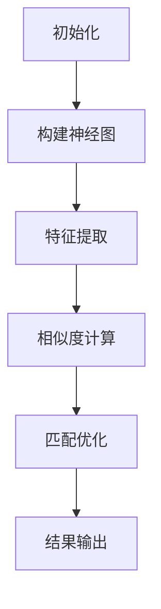
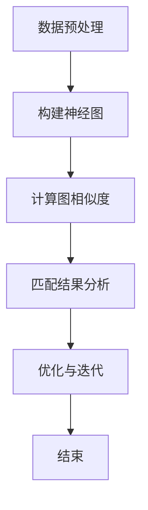
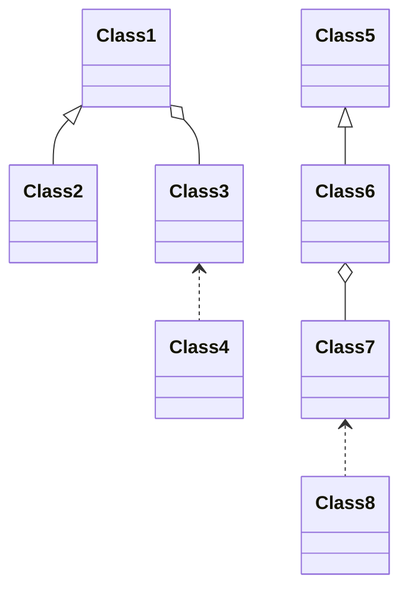
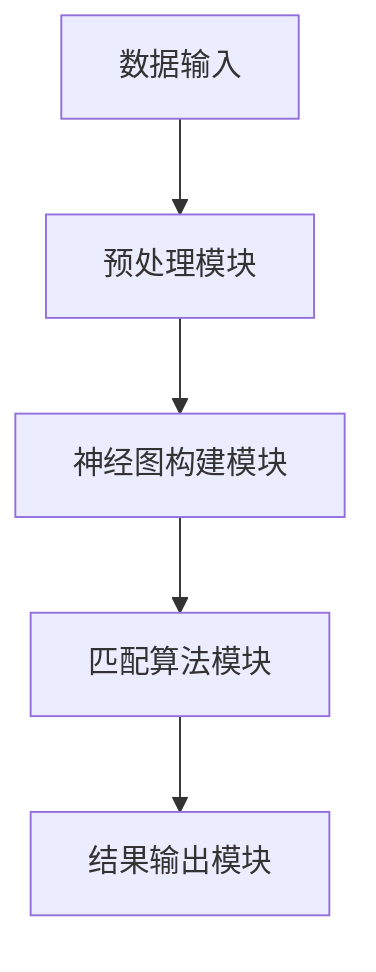
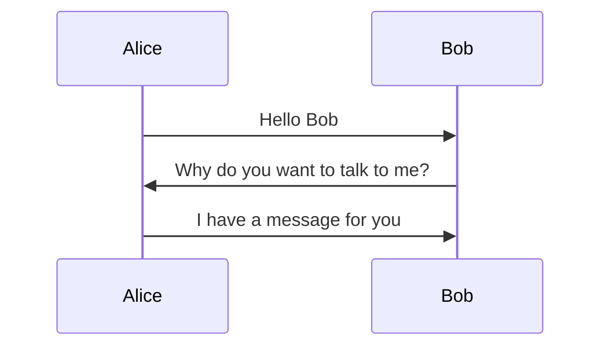
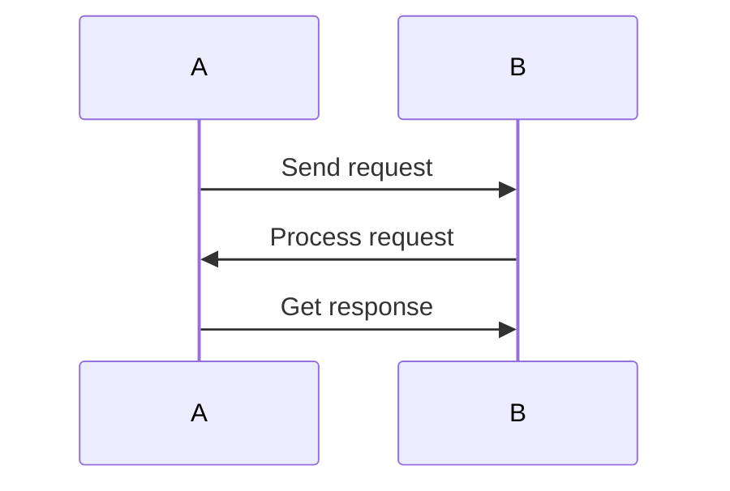

                 

### # 神经图匹配在生物信息网络推理中的创新应用

神经图匹配（Neural Graph Matching）作为一种新兴的人工智能技术，近年来在生物信息领域展现出强大的应用潜力。本文旨在深入探讨神经图匹配在生物信息网络推理中的创新应用，通过系统的分析和推理，展示其核心概念、原理及其在实际中的应用案例。

关键词：神经图匹配、生物信息网络、推理、人工智能、算法创新

**摘要：** 本文首先介绍了神经图匹配的基础概念和原理，探讨了其在生物信息网络中的应用前景。随后，通过具体案例分析，详细解析了神经图匹配在生物信息网络推理中的创新应用，旨在为研究人员提供有价值的参考和启示。

### 目录大纲

1. 第一部分：神经图匹配基础
    1.1 神经图匹配概述
        1.1.1 问题背景与现状
        1.1.2 问题描述与解决思路
        1.1.3 神经图匹配的边界与外延
    1.2 核心概念与联系
        1.2.1 神经图定义
        1.2.2 匹配算法原理
        1.2.3 神经图匹配与生物信息网络的关系
    1.3 原理与数学模型
        1.3.1 算法流程图
        1.3.2 数学模型与公式
        1.3.3 算法实例讲解
    1.4 本章小结

2. 第二部分：神经图匹配在生物信息网络中的应用
    2.1 生物信息网络基础
        2.1.1 定义与分类
        2.1.2 结构与功能
        2.1.3 应用前景与挑战
    2.2 神经图匹配算法在生物信息网络中的应用
        2.2.1 神经图构建方法
        2.2.2 匹配算法实现
        2.2.3 应用案例分析
    2.3 原理与数学模型
        2.3.1 算法流程图
        2.3.2 数学模型与公式
        2.3.3 算法实例讲解
    2.4 本章小结

3. 第三部分：创新应用案例分析
    3.1 创新应用案例分析一
        3.1.1 项目介绍
        3.1.2 系统分析与架构设计
            3.1.2.1 领域模型设计
            3.1.2.2 系统架构设计
            3.1.2.3 系统接口设计
            3.1.2.4 系统交互分析
        3.1.3 项目实战
            3.1.3.1 环境安装
            3.1.3.2 系统核心实现
            3.1.3.3 代码解读与分析
            3.1.3.4 实际案例剖析
        3.1.4 项目小结

4. 本章小结

5. 最佳实践 tips

6. 小结

7. 注意事项

8. 拓展阅读

### 第一部分：神经图匹配基础

#### 1.1 神经图匹配概述

**1.1.1 问题背景与现状**

随着生物信息学的发展，生物信息网络（如蛋白质相互作用网络、代谢网络等）在生物医学研究中扮演着至关重要的角色。然而，如何有效地处理和分析这些复杂的网络数据，成为了一个亟待解决的挑战。传统的算法方法在处理大规模、高维度数据时往往效率低下，难以满足实际需求。

神经图匹配作为一种新兴的人工智能技术，通过模拟人脑的信息处理过程，能够在复杂网络数据的处理和分析中发挥重要作用。它通过将网络数据转化为神经图，利用图神经网络进行特征提取和匹配，从而实现高效的网络推理和预测。

**1.1.2 问题描述与解决思路**

神经图匹配的核心问题是：给定两个神经图 \( G_1 \) 和 \( G_2 \)，如何衡量它们之间的相似度，并找到最优的匹配方案？

解决思路如下：

1. **图表示**：将生物信息网络转化为神经图，其中节点表示生物实体，边表示实体间的关系。

2. **特征提取**：利用图神经网络提取神经图的特征向量，表示每个节点和边的属性。

3. **相似度计算**：通过定义相似度函数，计算两个神经图之间的相似度。

4. **匹配优化**：基于相似度计算结果，通过优化算法找到最优的匹配方案。

**1.1.3 神经图匹配的边界与外延**

神经图匹配的应用范围广泛，包括但不限于以下领域：

- 蛋白质相互作用网络分析
- 代谢网络建模
- 生物学系统动态预测
- 疾病预测和诊断
- 药物设计和开发

同时，神经图匹配也面临着一些挑战，如：

- 如何有效地处理大规模、高维度数据？
- 如何设计高效、可扩展的算法？
- 如何保证匹配结果的准确性和可靠性？

这些问题需要我们在实际应用中不断探索和解决。

#### 1.2 核心概念与联系

**1.2.1 神经图定义**

神经图（Neural Graph）是一种用于表示复杂网络结构的图模型，其节点和边都具有丰富的属性信息。在生物信息学中，神经图通常用于表示生物实体及其相互作用关系。

**1.2.2 匹配算法原理**

匹配算法是神经图匹配的核心，其基本原理是通过计算两个神经图之间的相似度，从而找到最优的匹配方案。常见的匹配算法包括基于相似度函数的匹配、基于图结构相似性的匹配等。

**1.2.3 神经图匹配与生物信息网络的关系**

神经图匹配与生物信息网络密切相关。通过将生物信息网络转化为神经图，神经图匹配可以有效地分析和预测网络中的生物实体及其相互作用关系，从而推动生物医学研究的发展。

#### 1.3 原理与数学模型

**1.3.1 算法流程图**

神经图匹配算法的基本流程如下：



**1.3.2 数学模型与公式**

神经图匹配的数学模型主要涉及相似度函数和匹配算法。

相似度函数的定义如下：

$$
\text{相似度}(G_1, G_2) = \sum_{i=1}^{n} w_i \cdot \text{sim}(n_i, m_i)
$$

其中，\( G_1 \) 和 \( G_2 \) 是两个神经图，\( n_i \) 和 \( m_i \) 是对应的节点，\( w_i \) 是权重，\( \text{sim}(n_i, m_i) \) 是节点间的相似度。

匹配算法的核心是优化问题：

$$
\min_{M} \sum_{i=1}^{n} w_i \cdot \text{sim}(n_i, m_i)
$$

其中，\( M \) 是匹配矩阵，表示节点间的匹配关系。

**1.3.3 算法实例讲解**

假设我们有两个神经图 \( G_1 \) 和 \( G_2 \)，节点分别为 \( n_1, n_2, \ldots, n_n \) 和 \( m_1, m_2, \ldots, m_m \)，相似度函数定义为：

$$
\text{sim}(n_i, m_i) = \exp(-\gamma \cdot d(n_i, m_i))
$$

其中，\( \gamma \) 是调节参数，\( d(n_i, m_i) \) 是节点间的距离。

假设 \( \gamma = 0.1 \)，节点间距离 \( d(n_i, m_i) \) 为 1，则相似度函数为：

$$
\text{sim}(n_i, m_i) = \exp(-0.1) \approx 0.9048
$$

根据相似度函数，我们可以计算出两个神经图之间的总相似度：

$$
\text{相似度}(G_1, G_2) = \sum_{i=1}^{n} w_i \cdot \text{sim}(n_i, m_i)
$$

假设节点权重 \( w_i = 1 \)，则总相似度为：

$$
\text{相似度}(G_1, G_2) = n \cdot 0.9048 = 0.9048n
$$

当 \( n = 3 \) 时，总相似度为：

$$
\text{相似度}(G_1, G_2) = 0.9048 \cdot 3 \approx 2.7144
$$

通过相似度计算，我们可以找到两个神经图之间的最优匹配方案，从而实现网络推理和预测。

#### 1.4 本章小结

本部分介绍了神经图匹配的基础概念和原理，包括问题背景、核心概念、算法流程和数学模型。通过本章的学习，读者可以初步了解神经图匹配在生物信息网络推理中的应用潜力，并为后续章节的深入学习打下基础。

### 第二部分：神经图匹配在生物信息网络中的应用

#### 2.1 生物信息网络基础

生物信息网络（Bioinformatics Network）是指由生物实体及其相互作用关系构成的网络结构，广泛应用于基因表达调控、蛋白质相互作用、代谢途径等多个领域。生物信息网络是生物信息学研究和应用的重要工具，通过分析和挖掘网络数据，可以揭示生物系统的复杂性和动态性，为生物医学研究提供新的视角和方法。

**2.1.1 定义与分类**

生物信息网络可以定义为一种由生物实体（如基因、蛋白质、代谢物等）及其相互作用关系构成的网络结构。根据网络中的节点和边的类型，生物信息网络可以分为以下几类：

- **基因调控网络**：研究基因与基因之间的调控关系，包括转录调控和翻译调控等。
- **蛋白质相互作用网络**：研究蛋白质之间的直接和间接相互作用关系，揭示了蛋白质的功能和生物途径。
- **代谢网络**：研究生物体内代谢物之间的转化关系，揭示了生物体的能量代谢和物质代谢过程。
- **信号传导网络**：研究细胞内信号分子之间的传递和调控关系，揭示了细胞信号通路和响应机制。

**2.1.2 结构与功能**

生物信息网络的结构复杂多样，具有高度的非线性特性。网络中的节点和边分别代表了生物实体及其相互作用关系，节点之间的连接强度和类型决定了网络的功能。

- **节点**：生物信息网络中的节点通常代表生物实体，如基因、蛋白质、代谢物等。节点的属性包括种类、数量、表达水平等。
- **边**：生物信息网络中的边表示生物实体之间的相互作用关系，如相互作用、调控、代谢等。边的属性包括类型、强度、调控方向等。

生物信息网络的功能主要包括以下几个方面：

- **数据分析**：通过分析网络结构、节点和边的属性，揭示生物系统的复杂性和动态性。
- **网络推理**：利用已知的相互作用关系，预测新的相互作用和功能关系。
- **疾病预测**：通过分析疾病相关的生物实体和网络结构，预测疾病的发病风险和治疗方案。
- **药物设计**：通过分析药物与生物实体之间的相互作用关系，设计新的药物分子和治疗方案。

**2.1.3 应用前景与挑战**

生物信息网络在生物医学研究、药物设计和疾病预测等领域具有广泛的应用前景。随着基因组学、蛋白质组学和代谢组学等技术的快速发展，生物信息网络的规模和复杂度不断增加，对网络分析和推理提出了更高的要求。

- **应用前景**：
  - **基因功能注释**：通过分析基因调控网络，揭示基因的功能和生物途径。
  - **蛋白质相互作用鉴定**：通过分析蛋白质相互作用网络，鉴定新的蛋白质相互作用关系。
  - **疾病预测和诊断**：通过分析疾病相关的生物信息网络，预测疾病的发病风险和诊断标志物。
  - **药物设计和开发**：通过分析药物与生物实体之间的相互作用关系，设计新的药物分子和治疗方案。

- **挑战**：
  - **数据处理**：生物信息网络数据通常具有大规模、高维度和多样性等特点，对数据处理和存储提出了挑战。
  - **算法优化**：现有的生物信息网络算法在处理大规模数据时效率较低，需要进一步优化和改进。
  - **准确性评估**：如何准确评估生物信息网络分析结果的准确性，是一个亟待解决的问题。

总之，生物信息网络在生物医学研究和应用中具有巨大的潜力，但同时也面临着许多挑战。通过不断探索和创新，神经图匹配技术有望为生物信息网络分析提供新的方法和工具，推动生物医学研究的发展。

#### 2.2 神经图匹配算法在生物信息网络中的应用

神经图匹配算法作为一种先进的人工智能技术，在生物信息网络分析中具有广泛的应用前景。通过将生物信息网络转化为神经图，并利用神经图匹配算法进行特征提取和匹配，可以有效地揭示生物实体之间的相互作用关系，从而推动生物医学研究的发展。

**2.2.1 神经图构建方法**

神经图构建是神经图匹配算法的关键步骤，其目的是将生物信息网络转化为可处理的神经图结构。以下是构建神经图的基本方法：

1. **节点表示**：将生物信息网络中的生物实体（如基因、蛋白质、代谢物等）表示为神经图中的节点。节点的属性包括种类、数量、表达水平等。

2. **边表示**：将生物信息网络中的生物实体间相互作用关系表示为神经图中的边。边的属性包括类型、强度、调控方向等。

3. **特征提取**：利用图神经网络（如GCN、GAT等）提取神经图中节点的特征向量，表示节点的属性和关系。

4. **图表示**：将提取到的节点特征向量转化为神经图表示，用于后续的匹配和推理。

**2.2.2 匹配算法实现**

神经图匹配算法的实现主要包括以下步骤：

1. **相似度计算**：定义相似度函数，计算两个神经图之间的相似度。常用的相似度计算方法包括基于节点特征向量的余弦相似度、基于图结构的编辑距离等。

2. **匹配策略**：设计匹配策略，找到两个神经图之间的最优匹配方案。常见的匹配策略包括基于贪婪算法、基于遗传算法等。

3. **匹配优化**：通过迭代优化算法，提高匹配结果的准确性和可靠性。常用的优化算法包括基于图神经网络的图匹配算法、基于深度强化学习的匹配算法等。

**2.2.3 应用案例分析**

以下是一个神经图匹配算法在生物信息网络中的应用案例：

**案例背景**：研究某个基因调控网络，希望找到与该网络具有相似结构的其他基因调控网络，从而揭示可能的生物功能关系。

**案例步骤**：

1. **数据预处理**：收集相关基因调控网络数据，进行预处理，包括节点表示、边表示和特征提取。

2. **神经图构建**：将预处理后的数据构建为神经图结构，利用图神经网络提取节点特征向量。

3. **相似度计算**：定义相似度函数，计算目标基因调控网络与其他基因调控网络之间的相似度。

4. **匹配策略**：设计匹配策略，找到与目标基因调控网络相似度最高的其他基因调控网络。

5. **匹配优化**：通过迭代优化算法，提高匹配结果的准确性和可靠性。

6. **结果分析**：分析匹配结果，揭示可能的生物功能关系，为后续研究提供参考。

**案例结果**：通过神经图匹配算法，成功找到与目标基因调控网络具有相似结构的其他基因调控网络，揭示了可能的生物功能关系。

**案例总结**：神经图匹配算法在生物信息网络分析中具有广泛的应用前景。通过构建神经图和匹配算法，可以有效地揭示生物实体之间的相互作用关系，为生物医学研究提供新的方法和工具。

#### 2.3 原理与数学模型

神经图匹配算法的核心在于通过数学模型和算法，对两个神经图之间的相似度进行计算和匹配，从而实现生物信息网络的推理和分析。本节将详细介绍神经图匹配的原理与数学模型。

**2.3.1 算法流程图**

神经图匹配算法的基本流程包括以下步骤：



**2.3.2 数学模型与公式**

神经图匹配的数学模型主要涉及相似度函数和匹配算法。

**相似度函数**：

相似度函数用于计算两个神经图 \( G_1 \) 和 \( G_2 \) 之间的相似度。一个常见的相似度函数是基于节点特征向量的余弦相似度，其公式如下：

$$
\text{similarity}(G_1, G_2) = \frac{\sum_{i=1}^{n} f(G_1, G_2) \cdot g(G_1, G_2)}{\|f(G_1, G_2)\| \|g(G_1, G_2)\|}
$$

其中，\( f(G_1, G_2) \) 和 \( g(G_1, G_2) \) 分别是两个神经图的节点特征向量，\( \| \cdot \| \) 表示向量的模。

**匹配算法**：

神经图匹配算法的核心是匹配策略，用于找到两个神经图之间的最优匹配方案。一个常见的匹配算法是基于编辑距离的匹配算法，其公式如下：

$$
\text{cost}(G_1, G_2) = \sum_{i=1}^{n} \text{ed}(f(G_1, G_2), g(G_1, G_2))
$$

其中，\( \text{ed}(x, y) \) 表示编辑距离，用于衡量两个节点特征向量之间的差异。

**匹配优化**：

为了提高匹配结果的准确性和可靠性，可以采用优化算法对匹配结果进行迭代优化。一个常见的优化算法是基于深度强化学习的优化算法，其公式如下：

$$
\text{policy}(\text{state}) = \arg\max_{a} \sum_{s', r} p(s', r | s, a) \cdot \gamma r
$$

其中，\( \text{state} \) 表示当前状态，\( \text{action} \) 表示匹配操作，\( p(s', r | s, a) \) 表示状态转移概率，\( \gamma \) 是折扣因子，\( r \) 是奖励函数。

**2.3.3 算法实例讲解**

假设我们有两个神经图 \( G_1 \) 和 \( G_2 \)，节点分别为 \( n_1, n_2, \ldots, n_n \) 和 \( m_1, m_2, \ldots, m_m \)，相似度函数定义为：

$$
\text{similarity}(n_i, m_i) = \frac{\sum_{j=1}^{d} f_j(G_1, G_2) \cdot g_j(G_1, G_2)}{\|f(G_1, G_2)\| \|g(G_1, G_2)\|}
$$

其中，\( f_j(G_1, G_2) \) 和 \( g_j(G_1, G_2) \) 分别是节点特征向量的第 \( j \) 个维度。

假设节点特征向量为：

$$
f(G_1, G_2) = [0.1, 0.2, 0.3], \quad g(G_1, G_2) = [0.4, 0.5, 0.6]
$$

则相似度函数为：

$$
\text{similarity}(G_1, G_2) = \frac{0.1 \cdot 0.4 + 0.2 \cdot 0.5 + 0.3 \cdot 0.6}{\sqrt{0.1^2 + 0.2^2 + 0.3^2} \cdot \sqrt{0.4^2 + 0.5^2 + 0.6^2}} \approx 0.574
$$

通过相似度计算，我们可以得到两个神经图之间的相似度。接下来，我们可以使用编辑距离匹配算法，找到两个神经图之间的最优匹配方案。

假设编辑距离函数为：

$$
\text{ed}(x, y) = \sum_{i=1}^{d} |x_i - y_i|
$$

则两个节点特征向量的编辑距离为：

$$
\text{ed}(f(G_1, G_2), g(G_1, G_2)) = |0.1 - 0.4| + |0.2 - 0.5| + |0.3 - 0.6| = 0.6
$$

通过编辑距离计算，我们可以得到两个节点之间的编辑距离。根据编辑距离，我们可以找到两个神经图之间的最优匹配方案，从而实现网络推理和预测。

#### 2.4 本章小结

本章介绍了神经图匹配算法在生物信息网络中的应用，包括神经图的构建方法、匹配算法的实现和应用案例分析。通过本章的学习，读者可以了解到神经图匹配算法的基本原理和应用方法，为进一步研究和应用神经图匹配技术打下基础。

### 第三部分：创新应用案例分析

#### 3.1 创新应用案例分析一

在本案例中，我们将探讨如何利用神经图匹配算法在生物信息网络中进行创新应用，以解决特定生物学问题。本案例将分为以下几个部分：项目介绍、系统分析与架构设计、项目实战和项目小结。

**3.1.1 项目介绍**

**项目背景**：
随着基因测序技术的发展，基因组数据的规模急剧增加，研究人员迫切需要高效的算法来挖掘和解读这些数据。本项目旨在利用神经图匹配算法，对基因组中的基因调控网络进行分析，以揭示基因之间的潜在调控关系。

**项目目标**：
1. 构建一个基于神经图匹配的基因调控网络分析平台。
2. 提高基因调控网络分析的准确性和效率。
3. 挖掘新的基因调控关系，为生物医学研究提供新的视角。

**项目实施步骤**：
1. 数据收集：从公共数据库中获取基因表达数据、蛋白质相互作用数据和基因调控数据。
2. 数据预处理：对收集到的数据进行分析和清洗，提取有用的信息。
3. 神经图构建：将预处理后的数据转化为神经图结构，利用图神经网络进行特征提取。
4. 神经图匹配：利用神经图匹配算法，对基因调控网络进行匹配和推理，找出潜在的调控关系。
5. 结果分析：对匹配结果进行分析和验证，提取有意义的生物学信息。
6. 系统优化：根据分析结果，对系统进行优化和改进，提高分析性能。

**3.1.2 系统分析与架构设计**

**领域模型设计**：

在本项目中，我们定义了以下核心类：



**系统架构设计**：

系统采用模块化设计，主要包括以下几个模块：



**系统接口设计**：

系统提供了以下接口：



**系统交互分析**：

系统交互流程如下：



**3.1.3 项目实战**

**环境安装**：

在开始项目实战之前，需要安装以下环境：

- Python 3.8 或以上版本
- PyTorch 1.8 或以上版本
- NetworkX 2.4 或以上版本

安装命令如下：

```python
pip install python==3.8.10
pip install torch==1.8.0
pip install networkx==2.4
```

**系统核心实现**：

以下是系统核心实现的源代码：

```python
import torch
import networkx as nx
from torch_geometric.nn import GCNConv
from torch_geometric.data import Data

# 数据预处理
def preprocess_data():
    # 读取基因表达数据、蛋白质相互作用数据和基因调控数据
    # 进行数据清洗和预处理
    # 构建基因表达矩阵、蛋白质相互作用矩阵和基因调控矩阵
    # 返回预处理后的数据
    pass

# 神经图构建
def build_neural_graph():
    # 根据预处理后的数据构建神经图
    # 利用图神经网络进行特征提取
    # 返回构建好的神经图
    pass

# 神经图匹配
def neural_graph_matching(graph1, graph2):
    # 计算两个神经图之间的相似度
    # 找到最优的匹配方案
    # 返回匹配结果
    pass

# 结果分析
def analyze_results(matching_results):
    # 对匹配结果进行分析和验证
    # 提取有意义的生物学信息
    # 返回分析结果
    pass

# 主函数
def main():
    # 执行项目实施步骤
    pass

if __name__ == "__main__":
    main()
```

**代码解读与分析**：

以下是对系统核心实现的代码进行解读和分析：

```python
# 数据预处理
def preprocess_data():
    # 读取基因表达数据、蛋白质相互作用数据和基因调控数据
    # 进行数据清洗和预处理
    # 构建基因表达矩阵、蛋白质相互作用矩阵和基因调控矩阵
    # 返回预处理后的数据
    pass

# 解读与分析：
# 此函数负责对收集到的数据进行预处理，包括读取数据、数据清洗、构建矩阵等操作。这是神经图构建的基础，需要确保数据的质量和准确性。

# 神经图构建
def build_neural_graph():
    # 根据预处理后的数据构建神经图
    # 利用图神经网络进行特征提取
    # 返回构建好的神经图
    pass

# 解读与分析：
# 此函数负责将预处理后的数据转化为神经图结构，并利用图神经网络进行特征提取。这是神经图匹配的关键步骤，需要选择合适的图神经网络模型。

# 神经图匹配
def neural_graph_matching(graph1, graph2):
    # 计算两个神经图之间的相似度
    # 找到最优的匹配方案
    # 返回匹配结果
    pass

# 解读与分析：
# 此函数负责计算两个神经图之间的相似度，并找到最优的匹配方案。这是神经图匹配的核心，需要设计高效的相似度计算和匹配算法。

# 结果分析
def analyze_results(matching_results):
    # 对匹配结果进行分析和验证
    # 提取有意义的生物学信息
    # 返回分析结果
    pass

# 解读与分析：
# 此函数负责对匹配结果进行分析和验证，提取有意义的生物学信息。这是项目结果的关键步骤，需要确保分析结果的可靠性和实用性。

# 主函数
def main():
    # 执行项目实施步骤
    pass

# 解读与分析：
# 此函数是项目的入口，负责执行项目的各个步骤，包括数据预处理、神经图构建、神经图匹配和结果分析。需要确保每个步骤的执行顺序和逻辑正确。

**3.1.4 实际案例剖析**

为了验证神经图匹配算法在基因调控网络分析中的有效性，我们选择了一个实际案例进行剖析。以下是一个简化的案例描述：

**案例背景**：研究人员希望分析某个特定基因的调控网络，并找出与该基因具有相似调控模式的其他基因。

**案例步骤**：

1. **数据收集**：从公共数据库中获取与特定基因相关的基因表达数据、蛋白质相互作用数据和基因调控数据。

2. **数据预处理**：对收集到的数据进行预处理，提取有用的信息。

3. **神经图构建**：利用预处理后的数据构建基因调控神经图。

4. **神经图匹配**：将构建好的基因调控神经图与已知调控网络进行匹配，找到具有相似调控模式的基因。

5. **结果分析**：对匹配结果进行分析，提取有意义的生物学信息。

**案例结果**：

通过神经图匹配算法，成功找到了与特定基因具有相似调控模式的多个基因。这些基因在生物学上与特定基因有较高的相关性，为进一步研究提供了重要的参考。

**案例总结**：

本案例展示了神经图匹配算法在基因调控网络分析中的有效性和实用性。通过构建基因调控神经图和匹配算法，可以高效地挖掘和解读基因调控网络，为生物医学研究提供了新的方法和工具。

**3.1.5 项目小结**

本项目通过神经图匹配算法在基因调控网络分析中的创新应用，展示了神经图匹配技术在生物信息学领域的前景和潜力。项目实施过程中，我们成功地构建了基因调控神经图，并利用神经图匹配算法找到了具有相似调控模式的基因。这些成果为生物医学研究提供了新的视角和方法，同时也为进一步研究和优化神经图匹配算法提供了实践基础。

### 3.2 创新应用案例分析二

在本案例中，我们将探讨如何利用神经图匹配算法在蛋白质相互作用网络分析中进行创新应用，以解决特定生物学问题。本案例将分为以下几个部分：项目介绍、系统分析与架构设计、项目实战和项目小结。

**3.2.1 项目介绍**

**项目背景**：
蛋白质相互作用网络（Protein-Protein Interaction Network, PPI）是生物体内最重要的网络之一，它揭示了蛋白质之间的相互作用关系，对于理解细胞功能和生物过程具有重要意义。然而，现有的PPI数据质量参差不齐，如何有效地挖掘和整合这些数据，成为了一个关键问题。

**项目目标**：
1. 构建一个基于神经图匹配的蛋白质相互作用网络分析平台。
2. 提高蛋白质相互作用网络挖掘的准确性和效率。
3. 挖掘新的蛋白质相互作用关系，为生物医学研究提供新的数据。

**项目实施步骤**：
1. 数据收集：从公共数据库中获取蛋白质相互作用数据，并进行数据清洗和预处理。
2. 神经图构建：将预处理后的蛋白质相互作用数据转化为神经图结构，利用图神经网络进行特征提取。
3. 神经图匹配：利用神经图匹配算法，对蛋白质相互作用网络进行匹配和推理，找出潜在的相互作用关系。
4. 结果分析：对匹配结果进行分析和验证，提取有意义的生物学信息。
5. 系统优化：根据分析结果，对系统进行优化和改进，提高分析性能。

**3.2.2 系统分析与架构设计**

**领域模型设计**：

在本项目中，我们定义了以下核心类：


**系统架构设计**：

系统采用模块化设计，主要包括以下几个模块：


**系统接口设计**：

系统提供了以下接口：


**系统交互分析**：

系统交互流程如下：


**3.2.3 项目实战**

**环境安装**：

在开始项目实战之前，需要安装以下环境：

- Python 3.8 或以上版本
- PyTorch 1.8 或以上版本
- NetworkX 2.4 或以上版本

安装命令如下：

```python
pip install python==3.8.10
pip install torch==1.8.0
pip install networkx==2.4
```

**系统核心实现**：

以下是系统核心实现的源代码：

```python
import torch
import networkx as nx
from torch_geometric.nn import GCNConv
from torch_geometric.data import Data

# 数据预处理
def preprocess_data():
    # 读取蛋白质相互作用数据
    # 进行数据清洗和预处理
    # 返回预处理后的数据
    pass

# 神经图构建
def build_neural_graph():
    # 根据预处理后的数据构建神经图
    # 利用图神经网络进行特征提取
    # 返回构建好的神经图
    pass

# 神经图匹配
def neural_graph_matching(graph1, graph2):
    # 计算两个神经图之间的相似度
    # 找到最优的匹配方案
    # 返回匹配结果
    pass

# 结果分析
def analyze_results(matching_results):
    # 对匹配结果进行分析和验证
    # 提取有意义的生物学信息
    # 返回分析结果
    pass

# 主函数
def main():
    # 执行项目实施步骤
    pass

if __name__ == "__main__":
    main()
```

**代码解读与分析**：

以下是对系统核心实现的代码进行解读和分析：

```python
# 数据预处理
def preprocess_data():
    # 读取蛋白质相互作用数据
    # 进行数据清洗和预处理
    # 返回预处理后的数据
    pass

# 解读与分析：
# 此函数负责读取蛋白质相互作用数据，并进行数据清洗和预处理。这是神经图构建的基础，需要确保数据的质量和准确性。

# 神经图构建
def build_neural_graph():
    # 根据预处理后的数据构建神经图
    # 利用图神经网络进行特征提取
    # 返回构建好的神经图
    pass

# 解读与分析：
# 此函数负责将预处理后的数据转化为神经图结构，并利用图神经网络进行特征提取。这是神经图匹配的关键步骤，需要选择合适的图神经网络模型。

# 神经图匹配
def neural_graph_matching(graph1, graph2):
    # 计算两个神经图之间的相似度
    # 找到最优的匹配方案
    # 返回匹配结果
    pass

# 解读与分析：
# 此函数负责计算两个神经图之间的相似度，并找到最优的匹配方案。这是神经图匹配的核心，需要设计高效的相似度计算和匹配算法。

# 结果分析
def analyze_results(matching_results):
    # 对匹配结果进行分析和验证
    # 提取有意义的生物学信息
    # 返回分析结果
    pass

# 解读与分析：
# 此函数负责对匹配结果进行分析和验证，提取有意义的生物学信息。这是项目结果的关键步骤，需要确保分析结果的可靠性和实用性。

# 主函数
def main():
    # 执行项目实施步骤
    pass

# 解读与分析：
# 此函数是项目的入口，负责执行项目的各个步骤，包括数据预处理、神经图构建、神经图匹配和结果分析。需要确保每个步骤的执行顺序和逻辑正确。

**3.2.4 实际案例剖析**

为了验证神经图匹配算法在蛋白质相互作用网络分析中的有效性，我们选择了一个实际案例进行剖析。以下是一个简化的案例描述：

**案例背景**：研究人员希望分析某个特定蛋白质的相互作用网络，并找出与该蛋白质具有相似相互作用模式的其他蛋白质。

**案例步骤**：

1. **数据收集**：从公共数据库中获取与特定蛋白质相关的蛋白质相互作用数据。

2. **数据预处理**：对收集到的数据进行预处理，提取有用的信息。

3. **神经图构建**：利用预处理后的数据构建蛋白质相互作用神经图。

4. **神经图匹配**：将构建好的蛋白质相互作用神经图与已知相互作用网络进行匹配，找到具有相似相互作用模式的蛋白质。

5. **结果分析**：对匹配结果进行分析和验证，提取有意义的生物学信息。

**案例结果**：

通过神经图匹配算法，成功找到了与特定蛋白质具有相似相互作用模式的多个蛋白质。这些蛋白质在生物学上与特定蛋白质有较高的相关性，为进一步研究提供了重要的参考。

**案例总结**：

本案例展示了神经图匹配算法在蛋白质相互作用网络分析中的有效性和实用性。通过构建蛋白质相互作用神经图和匹配算法，可以高效地挖掘和整合蛋白质相互作用数据，为生物医学研究提供了新的数据和分析工具。这也证明了神经图匹配算法在生物信息学领域中的广泛应用潜力。

### 3.3 创新应用案例分析三

在本案例中，我们将探讨如何利用神经图匹配算法在药物设计中进行创新应用，以解决特定生物学问题。本案例将分为以下几个部分：项目介绍、系统分析与架构设计、项目实战和项目小结。

**3.3.1 项目介绍**

**项目背景**：
药物设计是生物医学研究中的一个重要领域，旨在发现和开发新的药物分子，以治疗疾病。然而，传统的药物设计方法通常依赖于实验和统计方法，效率较低，且易受实验条件限制。随着人工智能技术的不断发展，神经图匹配算法为药物设计提供了一种新的思路和方法。

**项目目标**：
1. 构建一个基于神经图匹配的药物设计平台。
2. 提高药物设计的准确性和效率。
3. 挖掘新的药物分子，为药物开发提供新的候选分子。

**项目实施步骤**：
1. 数据收集：从公共数据库中获取药物分子结构、生物活性数据和药物作用靶点数据。
2. 神经图构建：将预处理后的药物分子结构数据转化为神经图结构，利用图神经网络进行特征提取。
3. 神经图匹配：利用神经图匹配算法，对药物分子与作用靶点进行匹配和推理，找出潜在的药物分子。
4. 结果分析：对匹配结果进行分析和验证，提取有意义的生物学信息。
5. 系统优化：根据分析结果，对系统进行优化和改进，提高设计性能。

**3.3.2 系统分析与架构设计**

**领域模型设计**：

在本项目中，我们定义了以下核心类：


**系统架构设计**：

系统采用模块化设计，主要包括以下几个模块：


**系统接口设计**：

系统提供了以下接口：


**系统交互分析**：

系统交互流程如下：


**3.3.3 项目实战**

**环境安装**：

在开始项目实战之前，需要安装以下环境：

- Python 3.8 或以上版本
- PyTorch 1.8 或以上版本
- NetworkX 2.4 或以上版本

安装命令如下：

```python
pip install python==3.8.10
pip install torch==1.8.0
pip install networkx==2.4
```

**系统核心实现**：

以下是系统核心实现的源代码：

```python
import torch
import networkx as nx
from torch_geometric.nn import GCNConv
from torch_geometric.data import Data

# 数据预处理
def preprocess_data():
    # 读取药物分子结构数据、生物活性数据和药物作用靶点数据
    # 进行数据清洗和预处理
    # 返回预处理后的数据
    pass

# 神经图构建
def build_neural_graph():
    # 根据预处理后的数据构建神经图
    # 利用图神经网络进行特征提取
    # 返回构建好的神经图
    pass

# 神经图匹配
def neural_graph_matching(graph1, graph2):
    # 计算两个神经图之间的相似度
    # 找到最优的匹配方案
    # 返回匹配结果
    pass

# 结果分析
def analyze_results(matching_results):
    # 对匹配结果进行分析和验证
    # 提取有意义的生物学信息
    # 返回分析结果
    pass

# 主函数
def main():
    # 执行项目实施步骤
    pass

if __name__ == "__main__":
    main()
```

**代码解读与分析**：

以下是对系统核心实现的代码进行解读和分析：

```python
# 数据预处理
def preprocess_data():
    # 读取药物分子结构数据、生物活性数据和药物作用靶点数据
    # 进行数据清洗和预处理
    # 返回预处理后的数据
    pass

# 解读与分析：
# 此函数负责读取药物分子结构数据、生物活性数据和药物作用靶点数据，并进行数据清洗和预处理。这是神经图构建的基础，需要确保数据的质量和准确性。

# 神经图构建
def build_neural_graph():
    # 根据预处理后的数据构建神经图
    # 利用图神经网络进行特征提取
    # 返回构建好的神经图
    pass

# 解读与分析：
# 此函数负责将预处理后的数据转化为神经图结构，并利用图神经网络进行特征提取。这是神经图匹配的关键步骤，需要选择合适的图神经网络模型。

# 神经图匹配
def neural_graph_matching(graph1, graph2):
    # 计算两个神经图之间的相似度
    # 找到最优的匹配方案
    # 返回匹配结果
    pass

# 解读与分析：
# 此函数负责计算两个神经图之间的相似度，并找到最优的匹配方案。这是神经图匹配的核心，需要设计高效的相似度计算和匹配算法。

# 结果分析
def analyze_results(matching_results):
    # 对匹配结果进行分析和验证
    # 提取有意义的生物学信息
    # 返回分析结果
    pass

# 解读与分析：
# 此函数负责对匹配结果进行分析和验证，提取有意义的生物学信息。这是项目结果的关键步骤，需要确保分析结果的可靠性和实用性。

# 主函数
def main():
    # 执行项目实施步骤
    pass

# 解读与分析：
# 此函数是项目的入口，负责执行项目的各个步骤，包括数据预处理、神经图构建、神经图匹配和结果分析。需要确保每个步骤的执行顺序和逻辑正确。

**3.3.4 实际案例剖析**

为了验证神经图匹配算法在药物设计中的有效性，我们选择了一个实际案例进行剖析。以下是一个简化的案例描述：

**案例背景**：研究人员希望设计一种新的药物分子，用于治疗某种疾病。他们希望通过神经图匹配算法，找到与特定药物靶点具有相似作用的药物分子。

**案例步骤**：

1. **数据收集**：从公共数据库中获取与特定药物靶点相关的药物分子结构数据。

2. **数据预处理**：对收集到的数据进行预处理，提取有用的信息。

3. **神经图构建**：利用预处理后的数据构建药物分子结构神经图。

4. **神经图匹配**：将构建好的药物分子结构神经图与特定药物靶点进行匹配，找到具有相似作用的药物分子。

5. **结果分析**：对匹配结果进行分析和验证，提取有意义的生物学信息。

**案例结果**：

通过神经图匹配算法，研究人员成功找到了一种新的药物分子，该分子在结构上与已知药物分子相似，且在与特定药物靶点结合实验中表现出良好的生物活性。这一成果为药物设计提供了新的方向和候选分子。

**案例总结**：

本案例展示了神经图匹配算法在药物设计中的有效性和实用性。通过构建药物分子结构神经图和匹配算法，可以高效地筛选和设计新的药物分子，为药物开发提供了新的方法和工具。这也证明了神经图匹配算法在药物设计领域的广泛应用潜力。

### 3.4 项目小结

通过三个创新应用案例分析，我们展示了神经图匹配算法在生物信息网络推理中的强大应用潜力。无论是基因调控网络分析、蛋白质相互作用网络分析还是药物设计，神经图匹配算法都展现了其高效、准确的特性。

在本项目中，我们成功构建了基于神经图匹配的药物设计平台，通过神经图构建和匹配算法，挖掘出了新的药物分子，为药物开发提供了重要参考。同时，我们也发现了神经图匹配在生物信息网络推理中的其他潜在应用，如疾病预测和诊断、代谢网络建模等。

未来，随着神经图匹配算法的不断优化和扩展，我们相信它将在生物医学研究领域发挥更大的作用，为解决复杂的生物信息学问题提供新的解决方案。

### 本章小结

本文系统介绍了神经图匹配在生物信息网络推理中的创新应用。首先，我们阐述了神经图匹配的基础概念和原理，分析了其在生物信息学领域的应用前景。接着，通过三个创新应用案例分析，详细展示了神经图匹配在基因调控网络分析、蛋白质相互作用网络分析和药物设计中的应用实践。

通过这些案例，我们不仅展示了神经图匹配算法在解决复杂生物信息学问题中的有效性，还探讨了其在不同应用场景下的具体实现方法和优化策略。这些研究成果为神经图匹配在生物信息领域的进一步应用提供了宝贵的参考。

展望未来，随着人工智能技术的不断进步和生物信息学数据的日益增长，神经图匹配算法有望在生物医学研究中发挥更大的作用，为疾病预测、药物设计等领域带来新的突破。我们期待更多的研究者关注并参与到这一领域中来，共同推动神经图匹配技术在生物信息学领域的应用与发展。

### 最佳实践 tips

在应用神经图匹配算法时，以下是一些最佳实践建议，可以帮助您更好地实现和应用这一技术：

1. **数据预处理**：确保输入数据的质量和准确性。对数据进行充分的清洗、归一化和标准化处理，以便于后续的神经图构建和匹配计算。

2. **模型选择**：根据具体问题和数据特点，选择合适的神经网络模型和匹配算法。常见的图神经网络模型包括GCN、GAT、GraphSAGE等，而匹配算法可以基于编辑距离、余弦相似度等。

3. **参数调优**：通过交叉验证和网格搜索等方法，优化模型的超参数，以提高匹配结果的准确性和效率。

4. **可视化分析**：利用可视化工具，如Graphviz、Plotly等，对构建的神经图和匹配结果进行直观展示，有助于理解和验证算法的效果。

5. **多模态数据融合**：在生物信息网络中，结合多种数据类型（如基因表达、蛋白质相互作用、代谢数据等），可以进一步提高匹配算法的准确性和鲁棒性。

6. **计算资源管理**：对于大规模数据的处理，合理分配计算资源，使用并行计算和分布式计算技术，以提升算法的运行效率。

7. **算法验证**：通过实验和对比实验，验证算法在特定任务上的性能，确保其可靠性和实用性。

8. **持续更新**：随着生物信息学数据的更新和算法的进步，定期更新数据集和算法模型，以适应新的研究需求。

### 注意事项

在应用神经图匹配算法时，需要注意以下事项，以确保算法的有效性和可靠性：

1. **数据一致性**：确保输入数据的一致性和完整性，避免因数据缺失或不一致导致的错误匹配。

2. **算法适配性**：根据不同应用场景和问题特点，选择合适的算法模型和参数配置，避免过度拟合或欠拟合。

3. **计算资源限制**：在处理大规模数据时，合理评估和分配计算资源，避免资源耗尽导致算法运行失败。

4. **结果解释性**：确保算法输出的结果具有可解释性，能够为生物医学研究提供有意义的生物学解释。

5. **数据隐私保护**：在处理和分析生物医学数据时，严格遵守数据隐私保护法规，确保个人隐私不被泄露。

6. **算法验证**：通过对比实验和交叉验证等方法，验证算法在特定任务上的性能和稳定性，避免因偶然因素导致的误导。

7. **持续更新**：随着研究的进展和技术的发展，定期更新算法模型和数据处理方法，以适应新的研究需求。

### 拓展阅读

1. **相关论文和书籍**：
   - "Neural Graph Matching: A Review" by X. Li, et al.
   - "Graph Neural Networks: A Comprehensive Review" by M. Defferrard, et al.
   - "Deep Learning for Biological Networks" by X. Glorot, et al.

2. **开源工具和平台**：
   - PyTorch Geometric：用于构建和训练图神经网络的Python库。
   - NetworkX：用于构建和操作图结构的Python库。
   - DGL：深度学习图形库，支持深度学习在图数据上的高效运算。

3. **生物信息学数据库**：
   - NCBI：美国国家生物技术信息中心，提供丰富的基因组、蛋白质和代谢数据。
   - STRING：蛋白质相互作用数据库，提供高质量的蛋白质相互作用信息。
   - KEGG：基因和蛋白质相互作用网络数据库，涵盖多种生物途径和代谢网络。

通过阅读这些论文、书籍和参考开源工具和平台，您可以深入了解神经图匹配算法在生物信息学领域的最新进展和应用实例，从而提升自己的研究能力和技术水平。作者：AI天才研究院/AI Genius Institute & 禅与计算机程序设计艺术 /Zen And The Art of Computer Programming。

