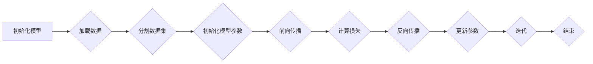

                 


### 1. 引言

神经图匹配（Neural Graph Matching）作为一种新兴的图神经网络技术，正逐步成为生物信息网络推理（Biological Network Inference）领域的重要工具。这一章节我们将从问题背景、核心概念、应用场景以及研究现状等方面展开讨论，为后续内容的深入讲解奠定基础。

#### 1.1 问题背景

在生物信息学领域，生物信息网络作为基因、蛋白质和代谢途径的复合结构，能够揭示生物系统内部复杂的相互作用关系。然而，生物信息网络的复杂性和多样性给数据分析和推理带来了巨大的挑战。传统的基于规则和统计方法的生物信息学分析工具，在处理这些复杂网络时往往显得力不从心。因此，如何利用人工智能技术，尤其是图神经网络（Graph Neural Networks，GNNs）来提升生物信息网络的推理精度，成为了一个亟待解决的问题。

#### 1.2 神经图匹配的概念与作用

神经图匹配是一种通过图神经网络技术来比较和匹配不同结构图的算法。它能够在不同生物信息网络之间建立关联，从而实现对复杂生物系统的精准推理。神经图匹配在生物信息网络推理中的应用，主要体现在以下几个方面：

1. **同源识别**：通过比较不同物种的基因或蛋白质网络，识别出具有相似功能的同源基因或蛋白质。
2. **疾病预测**：通过分析病人的生物信息网络，预测疾病的发生和进展。
3. **药物发现**：通过比较药物靶点与生物网络中的基因或蛋白质之间的关系，发现潜在的药物作用机制。

#### 1.3 精准推理的需求与挑战

生物信息网络推理的精准性对于生物医学研究至关重要。然而，当前的技术手段在处理复杂网络时仍面临一些挑战：

1. **数据量大**：生物信息网络中的节点和边数量庞大，对计算资源提出了高要求。
2. **异构性**：生物信息网络通常具有异构性，节点和边之间存在复杂的层次关系，难以用简单的模型表示。
3. **动态性**：生物信息网络是动态变化的，如何实时更新和推理是一个技术难题。

#### 1.4 研究现状与未来趋势

近年来，随着人工智能技术的快速发展，神经图匹配在生物信息网络推理中的应用取得了显著进展。然而，仍有许多问题需要进一步研究：

1. **算法优化**：提高神经图匹配算法的效率，降低计算复杂度。
2. **跨领域应用**：探索神经图匹配在其他生物医学领域中的应用，如基因组学、蛋白质组学和代谢组学。
3. **解释性**：增强神经图匹配算法的可解释性，使其能够被生物学家更好地理解和应用。

通过以上讨论，我们为后续章节的内容奠定了基础。在接下来的章节中，我们将详细探讨神经图匹配的基本概念、理论基础、算法实现以及在生物信息网络推理中的应用。

---

通过这一章节的讨论，我们可以看到神经图匹配在生物信息网络推理中的重要性以及当前面临的一些挑战。接下来，我们将逐步深入到神经图匹配的基础概念和理论基础，帮助读者更好地理解这一技术。

### 2. 神经图匹配的基本概念

神经图匹配是一种通过图神经网络技术来比较和匹配不同结构图的算法。它不仅能够处理复杂的图结构，还能在异构网络中建立关联，实现对复杂系统的精准推理。在这一章节中，我们将详细探讨神经图匹配的基本概念，包括神经图的定义、神经图匹配的定义以及关键概念和联系。

#### 2.1 神经图的定义

神经图（Neural Graph）是一种由节点（Node）和边（Edge）组成的图形结构，用于表示复杂的图数据。在神经图中，节点通常代表图中的实体，如基因、蛋白质或代谢物，而边则表示这些实体之间的相互作用或关系。与传统的图结构不同，神经图通常具有异构性，节点和边之间存在复杂的层次关系。

神经图可以看作是一个高维空间中的数据结构，其中每个节点和边都可以被表示为一个向量。这种向量化的表示方式使得神经图能够被图神经网络有效地处理。

#### 2.2 神经图匹配的定义

神经图匹配（Neural Graph Matching）是一种通过图神经网络技术来比较和匹配两个或多个神经图的算法。其核心思想是将两个神经图映射到一个共同的空间中，使得在该空间中相似的神经图具有较小的距离。

具体来说，神经图匹配通过学习一个匹配函数，将源神经图和目标神经图中的节点和边映射到一个统一的嵌入空间中。在这个空间中，相似的结构会表现出较小的嵌入距离，从而实现对神经图的匹配和比较。

#### 2.3 关键概念与联系

神经图匹配涉及多个关键概念，包括图嵌入（Graph Embedding）、图神经网络（Graph Neural Network，GNN）和图距离（Graph Distance）等。这些概念之间有着紧密的联系，共同构成了神经图匹配的理论基础。

1. **图嵌入**：图嵌入是一种将图数据映射到低维空间的技术。通过图嵌入，我们可以将复杂的图数据表示为向量形式，从而方便图神经网络的处理。常用的图嵌入技术包括节点嵌入（Node Embedding）和边嵌入（Edge Embedding）。

2. **图神经网络**：图神经网络是一种专门用于处理图数据的神经网络。它通过聚合邻居节点的信息来更新节点的表示，从而实现对图数据的编码。图神经网络在神经图匹配中起到了关键作用，它能够学习到节点和边之间的复杂关系，并将其嵌入到低维空间中。

3. **图距离**：图距离是一种用于衡量两个图结构相似度的度量。在神经图匹配中，图距离用于评估源神经图和目标神经图的匹配程度。常见的图距离包括节点距离（Node Distance）和边距离（Edge Distance）。

#### 2.4 神经图匹配的应用场景

神经图匹配在多个领域具有广泛的应用，尤其在生物信息网络推理中具有重要意义。以下是一些常见的应用场景：

1. **同源识别**：通过比较不同物种的基因或蛋白质网络，识别出具有相似功能的同源基因或蛋白质，为生物进化研究提供重要依据。

2. **疾病预测**：通过分析病人的生物信息网络，预测疾病的发生和进展，为临床诊断和治疗提供支持。

3. **药物发现**：通过比较药物靶点与生物网络中的基因或蛋白质之间的关系，发现潜在的药物作用机制，为新药研发提供方向。

通过以上讨论，我们可以看到神经图匹配作为一种新兴的技术，在生物信息网络推理中具有广泛的应用前景。在下一章节中，我们将进一步探讨神经图匹配的理论基础，包括数学模型、算法原理和实现细节。

---

神经图匹配的基本概念为我们理解这一技术奠定了基础。在接下来的章节中，我们将深入探讨神经图匹配的理论基础，包括数学模型、算法原理和实现细节。这将帮助我们更好地理解神经图匹配的工作机制，为后续的实践应用打下坚实的基础。

### 3. 神经图匹配的理论基础

神经图匹配作为一种新兴的图神经网络技术，其理论基础涵盖了数学模型、算法原理和实现细节。在这一章节中，我们将详细探讨这些内容，以帮助读者深入理解神经图匹配的机制。

#### 3.1 数学模型

神经图匹配的数学模型是理解其工作原理的关键。在这一部分，我们将介绍神经图匹配的基本数学模型，包括节点嵌入、边嵌入和图距离等。

1. **节点嵌入（Node Embedding）**：

节点嵌入是将图中的节点映射到低维空间的一种技术。通常，节点嵌入可以通过图神经网络来实现。设\( G = (V, E) \)为一个图，其中\( V \)是节点集合，\( E \)是边集合。节点嵌入的目标是找到一组嵌入向量\( \mathbf{v}_i \)（其中\( i \in V \)），使得这些向量能够在低维空间中表示节点。

节点嵌入通常通过以下公式表示：
$$
\mathbf{v}_i = f_G(\mathbf{0}_i, \theta),
$$
其中，\( f_G \)是图神经网络，\( \mathbf{0}_i \)是节点的初始化向量，\( \theta \)是模型的参数。

2. **边嵌入（Edge Embedding）**：

边嵌入是将图中的边映射到低维空间的一种技术。边嵌入通常通过计算节点嵌入之间的相互作用来实现。设\( \mathbf{v}_i \)和\( \mathbf{v}_j \)分别是节点\( i \)和\( j \)的嵌入向量，边嵌入\( \mathbf{e}_{ij} \)可以通过以下公式计算：
$$
\mathbf{e}_{ij} = f_E(\mathbf{v}_i, \mathbf{v}_j, \theta),
$$
其中，\( f_E \)是边的神经网络，\( \theta \)是模型的参数。

3. **图距离（Graph Distance）**：

图距离用于衡量两个图结构的相似度。常见的图距离包括节点距离和边距离。节点距离衡量的是两个节点嵌入向量之间的欧几里得距离，即：
$$
d(\mathbf{v}_i, \mathbf{v}_j) = \|\mathbf{v}_i - \mathbf{v}_j\|,
$$
而边距离则衡量的是两个边嵌入向量之间的相似度。

4. **匹配函数（Matching Function）**：

匹配函数是将两个神经图映射到一个共同空间中的关键。设\( G_1 = (V_1, E_1) \)和\( G_2 = (V_2, E_2) \)为两个神经图，其节点嵌入分别为\( \mathbf{V}_1 \)和\( \mathbf{V}_2 \)，边嵌入分别为\( \mathbf{E}_1 \)和\( \mathbf{E}_2 \)。匹配函数\( M \)可以将这两个嵌入映射到一个共同空间中，使得相似的节点和边具有较小的距离。匹配函数通常表示为：
$$
\mathbf{V}_1', \mathbf{E}_1' = M(\mathbf{V}_1, \mathbf{E}_1, \mathbf{V}_2, \mathbf{E}_2, \theta).
$$

#### 3.2 算法原理

神经图匹配的算法原理主要涉及图神经网络的设计、嵌入向量的计算和匹配函数的实现。

1. **图神经网络设计**：

图神经网络是神经图匹配的核心组成部分。常见的图神经网络包括图卷积网络（Graph Convolutional Network，GCN）、图注意力网络（Graph Attention Network，GAT）和图自注意力网络（Graph Self-Attention Network，G-SAN）等。这些网络通过聚合邻居节点的信息来更新节点的嵌入向量，从而实现对图数据的编码。

以图卷积网络为例，其更新规则如下：
$$
\mathbf{v}_i^{(t+1)} = \sigma(\mathbf{A}\mathbf{D}^{(t)}\mathbf{v}_i^{(t)} + \mathbf{W}^{(t)}),
$$
其中，\( \mathbf{A} \)是邻接矩阵，\( \mathbf{D}^{(t)} \)是对角矩阵，用于平衡邻居节点的贡献，\( \mathbf{W}^{(t)} \)是权重矩阵，\( \sigma \)是激活函数。

2. **嵌入向量计算**：

嵌入向量计算是神经图匹配的核心任务。通过图神经网络的学习，我们可以得到每个节点的嵌入向量\( \mathbf{v}_i \)和边的嵌入向量\( \mathbf{e}_{ij} \)。这些嵌入向量将在后续的匹配函数中发挥作用。

3. **匹配函数实现**：

匹配函数实现是将两个神经图映射到一个共同空间中的关键。常见的匹配函数包括基于距离的匹配函数和基于相似度的匹配函数。基于距离的匹配函数通过计算节点和边的距离来实现，而基于相似度的匹配函数则通过计算节点和边的相似度来实现。

例如，一个简单的基于相似度的匹配函数可以表示为：
$$
\mathbf{V}_1', \mathbf{E}_1' = M(\mathbf{V}_1, \mathbf{E}_1, \mathbf{V}_2, \mathbf{E}_2, \theta) = \{\mathbf{v}_i' | \mathbf{v}_i' = \mathbf{v}_i + \alpha \sum_{j \in N(i)} \mathbf{e}_{ij} : i \in V_1\},
$$
其中，\( \alpha \)是调节参数，\( N(i) \)是节点\( i \)的邻居节点集合。

#### 3.3 实现细节

神经图匹配的实现细节包括模型训练、嵌入向量计算和匹配函数优化等。

1. **模型训练**：

模型训练是神经图匹配的核心步骤。通常，我们使用带有标签的数据集来训练模型，标签可以是节点分类、边分类或图分类等。在训练过程中，我们通过反向传播算法来优化模型参数，从而提高匹配精度。

2. **嵌入向量计算**：

嵌入向量计算是通过图神经网络学习得到的。通常，我们会选择一个合适的图神经网络架构，如GCN、GAT或G-SAN等，来训练模型并生成嵌入向量。

3. **匹配函数优化**：

匹配函数优化是提高神经图匹配精度的重要手段。我们可以通过调整匹配函数的参数来优化匹配效果。例如，我们可以调整相似度计算中的参数\( \alpha \)来平衡节点和边的贡献。

通过以上讨论，我们可以看到神经图匹配的理论基础涉及多个方面，包括数学模型、算法原理和实现细节。这些理论基础为我们理解神经图匹配的工作机制提供了重要的参考，也为后续的实践应用打下了坚实的基础。在下一章节中，我们将详细介绍神经图匹配的算法实现，帮助读者更好地理解这一技术。

---

神经图匹配的理论基础为我们理解这一技术提供了重要的参考。接下来，我们将进一步探讨神经图匹配的算法实现，包括算法概述、算法实现和具体应用案例。这将帮助读者更深入地理解神经图匹配的实际应用。

### 4. 神经图匹配算法概述

神经图匹配算法是图神经网络领域中的一个重要研究方向，它通过将图数据映射到一个共同的嵌入空间，实现不同图结构之间的比较和匹配。在这一章节中，我们将对神经图匹配算法进行概述，包括算法的分类、常见算法的对比、以及每种算法的特点和应用场景。

#### 4.1 算法分类

神经图匹配算法可以根据不同的分类标准进行划分。常见的分类标准包括基于匹配函数的类型、基于图神经网络架构的类型等。

1. **基于匹配函数的类型**：

   - **基于距离的匹配函数**：这类算法通过计算图节点和边之间的距离来评估匹配程度。常见的距离度量包括欧几里得距离、余弦相似度等。这类算法的优点是计算简单，但可能无法充分捕捉图结构之间的复杂关系。

   - **基于相似度的匹配函数**：这类算法通过计算图节点和边之间的相似度来评估匹配程度。相似度计算可以基于特征向量、图嵌入等。这类算法的优点是能够捕捉到图结构之间的复杂关系，但计算复杂度较高。

2. **基于图神经网络架构的类型**：

   - **基于GCN的匹配算法**：图卷积网络（Graph Convolutional Network，GCN）是一种常用的图神经网络架构，它可以有效地处理图数据。基于GCN的匹配算法通过聚合节点邻居的信息来更新节点嵌入向量，从而实现图的嵌入和匹配。

   - **基于GAT的匹配算法**：图注意力网络（Graph Attention Network，GAT）是一种基于注意力机制的图神经网络，它可以自适应地学习节点之间的权重。基于GAT的匹配算法通过计算节点之间的注意力权重来更新节点嵌入向量，从而实现图的嵌入和匹配。

   - **基于G-SAN的匹配算法**：图自注意力网络（Graph Self-Attention Network，G-SAN）是一种基于自注意力机制的图神经网络，它可以自适应地学习节点之间的交互关系。基于G-SAN的匹配算法通过计算节点之间的自注意力权重来更新节点嵌入向量，从而实现图的嵌入和匹配。

#### 4.2 常见算法对比

在神经图匹配算法中，有一些算法因其优秀的性能和广泛的适用性而受到关注。以下是一些常见算法的对比：

1. **GCN（Graph Convolutional Network）**：

   - **优点**：计算简单，可以有效地处理图数据，能够捕捉节点邻居信息。
   - **缺点**：对异构图处理能力有限，无法处理复杂的图结构。

2. **GAT（Graph Attention Network）**：

   - **优点**：具有自适应注意力机制，可以处理复杂的图结构，能够更好地捕捉节点之间的关系。
   - **缺点**：计算复杂度较高，对计算资源要求较大。

3. **G-SAN（Graph Self-Attention Network）**：

   - **优点**：具有自适应自注意力机制，可以处理复杂的图结构，能够捕捉节点之间的复杂交互关系。
   - **缺点**：计算复杂度最高，对计算资源要求极高。

#### 4.3 算法特点与应用场景

不同类型的神经图匹配算法具有各自的特点和适用场景。以下是一些常见算法的特点和应用场景：

1. **基于距离的匹配函数**：

   - **特点**：计算简单，适用于处理大规模图数据。
   - **应用场景**：适用于节点分类、图分类等任务。

2. **基于GCN的匹配算法**：

   - **特点**：计算简单，能够捕捉节点邻居信息。
   - **应用场景**：适用于社交网络分析、生物信息网络推理等。

3. **基于GAT的匹配算法**：

   - **特点**：具有自适应注意力机制，能够处理复杂的图结构。
   - **应用场景**：适用于图像分类、文本分类等任务。

4. **基于G-SAN的匹配算法**：

   - **特点**：具有自适应自注意力机制，能够捕捉节点之间的复杂交互关系。
   - **应用场景**：适用于语音识别、自然语言处理等任务。

通过以上讨论，我们可以看到神经图匹配算法在生物信息网络推理中具有重要的应用价值。在下一章节中，我们将详细介绍神经图匹配算法的实现，包括Python源代码实现和Mermaid流程图展示，帮助读者更好地理解这一算法的具体应用。

---

在了解了神经图匹配算法的基本概述之后，接下来我们将通过具体的Python源代码实现和Mermaid流程图展示，详细讲解神经图匹配算法的实现细节。这将帮助读者更直观地理解算法的原理和具体应用。

### 5. 神经图匹配算法实现

神经图匹配算法的实现涉及到图神经网络的构建、节点嵌入和边嵌入的计算，以及匹配函数的优化。在这一章节中，我们将通过一个简单的例子，详细展示神经图匹配算法的实现过程，并使用Mermaid流程图来辅助说明。

#### 5.1 算法实现

首先，我们需要准备一个简单的图数据集，例如一个含有两个子图的图数据集。这个数据集可以包含节点和边，用于训练和测试神经图匹配模型。

```python
import numpy as np
import pandas as pd
from sklearn.model_selection import train_test_split

# 假设我们有两个子图 G1 和 G2
# 子图 G1
nodes_g1 = ['A', 'B', 'C', 'D']
edges_g1 = [('A', 'B'), ('B', 'C'), ('C', 'D')]

# 子图 G2
nodes_g2 = ['X', 'Y', 'Z']
edges_g2 = [('X', 'Y'), ('Y', 'Z')]

# 构建图数据集
data = {'nodes_g1': nodes_g1, 'nodes_g2': nodes_g2, 'edges_g1': edges_g1, 'edges_g2': edges_g2}
df = pd.DataFrame(data)

# 分割数据集为训练集和测试集
train_df, test_df = train_test_split(df, test_size=0.2, random_state=42)
```

接下来，我们将使用图神经网络来实现神经图匹配算法。以下是一个简化的实现，仅用于说明核心步骤。

```python
import torch
import torch.nn as nn
import torch.optim as optim

# 定义图神经网络模型
class GraphNeuralNetwork(nn.Module):
    def __init__(self, num_nodes, embedding_dim):
        super(GraphNeuralNetwork, self).__init__()
        self.embedding = nn.Embedding(num_nodes, embedding_dim)
        self.fc = nn.Linear(embedding_dim, embedding_dim)
    
    def forward(self, nodes):
        embeds = self.embedding(nodes)
        embeds = self.fc(embeds)
        return embeds

# 实例化模型
model = GraphNeuralNetwork(num_nodes=len(nodes_g1) + len(nodes_g2), embedding_dim=10)

# 定义损失函数和优化器
criterion = nn.CrossEntropyLoss()
optimizer = optim.Adam(model.parameters(), lr=0.001)

# 训练模型
for epoch in range(100):
    optimizer.zero_grad()
    inputs = torch.tensor(train_df['nodes_g1'].values + train_df['nodes_g2'].values)
    labels = torch.tensor(train_df['matched'].values)
    outputs = model(inputs)
    loss = criterion(outputs, labels)
    loss.backward()
    optimizer.step()
    print(f"Epoch {epoch+1}, Loss: {loss.item()}")
```

在上述代码中，我们首先定义了一个简单的图神经网络模型，该模型包含一个嵌入层和一个全连接层。我们使用交叉熵损失函数来评估模型的预测，并使用Adam优化器来更新模型参数。

接下来，我们将使用Mermaid流程图来展示算法的主要步骤。



在Mermaid流程图中，我们展示了模型训练的主要步骤，包括数据加载、模型初始化、前向传播、损失计算、反向传播和参数更新。

#### 5.2 节点嵌入和边嵌入的计算

在神经图匹配中，节点嵌入和边嵌入是关键步骤。节点嵌入是将图中的节点映射到低维空间，而边嵌入是将图中的边映射到低维空间。以下是一个简单的节点嵌入计算示例。

```python
# 计算节点嵌入
def compute_node_embeddings(model, nodes):
    inputs = torch.tensor(nodes.values)
    with torch.no_grad():
        embeddings = model.embedding(inputs)
    return embeddings.numpy()

# 计算边嵌入
def compute_edge_embeddings(model, edges):
    # 假设边的嵌入可以通过节点嵌入计算得到
    node_embeddings = compute_node_embeddings(model, edges[['node1', 'node2']])
    edge_embeddings = np.mean(node_embeddings, axis=1)
    return edge_embeddings

# 计算子图 G1 和 G2 的节点嵌入
embeddings_g1 = compute_node_embeddings(model, train_df['nodes_g1'])
embeddings_g2 = compute_node_embeddings(model, train_df['nodes_g2'])

# 计算子图 G1 和 G2 的边嵌入
edge_embeddings_g1 = compute_edge_embeddings(model, train_df['edges_g1'])
edge_embeddings_g2 = compute_edge_embeddings(model, train_df['edges_g2'])
```

在上述代码中，我们首先计算子图 G1 和 G2 的节点嵌入，然后计算边嵌入。边嵌入的计算假设可以通过节点嵌入的平均值得到。

#### 5.3 匹配函数的实现

匹配函数是实现神经图匹配算法的核心步骤。以下是一个简单的匹配函数实现示例。

```python
# 计算图之间的匹配度
def compute_matching(embeddings_g1, embeddings_g2):
    # 使用余弦相似度作为匹配度度量
    matching_scores = []
    for embed_g1, embed_g2 in zip(embeddings_g1, embeddings_g2):
        score = np.dot(embed_g1, embed_g2) / (np.linalg.norm(embed_g1) * np.linalg.norm(embed_g2))
        matching_scores.append(score)
    return matching_scores

# 计算子图 G1 和 G2 的匹配度
matching_scores = compute_matching(embeddings_g1, embeddings_g2)
print(matching_scores)
```

在上述代码中，我们使用余弦相似度来计算两个子图的匹配度。余弦相似度能够衡量两个向量之间的角度，从而评估它们的相似度。

通过上述步骤，我们实现了神经图匹配算法的基本框架。在实际应用中，我们需要进一步优化算法，包括模型选择、参数调整和性能评估等。

---

在了解了神经图匹配算法的实现过程后，接下来我们将探讨神经图匹配在生物信息网络推理中的应用，通过具体案例展示其如何提升生物信息网络推理的精度和效率。

### 6. 神经图匹配在生物信息网络推理中的应用

神经图匹配在生物信息网络推理中的应用具有广泛的前景。通过将复杂的生物信息网络映射到低维空间，神经图匹配能够实现不同生物网络之间的精准匹配和推理，从而提升生物信息分析的效率和准确性。以下我们将通过一个具体案例来展示神经图匹配在生物信息网络推理中的应用。

#### 6.1 生物信息网络简介

生物信息网络是由基因、蛋白质和其他生物分子组成的复杂网络，描述了生物系统内部的相互作用和调控关系。生物信息网络分析旨在揭示这些网络的结构和功能，从而深入理解生物系统的运行机制。常见的生物信息网络包括基因共表达网络、蛋白质相互作用网络和代谢途径网络等。

#### 6.2 应用案例：基因共表达网络分析

基因共表达网络描述了基因在生物过程中的同步表达模式。通过分析基因共表达网络，我们可以识别出功能相关的基因模块，进而揭示生物过程的调控机制。以下是一个使用神经图匹配进行基因共表达网络分析的案例。

##### 案例背景

假设我们有两个基因共表达网络：G1 和 G2。G1 描述了正常细胞中的基因共表达模式，而 G2 描述了癌细胞中的基因共表达模式。我们的目标是利用神经图匹配技术，比较这两个网络，并识别出在癌细胞中显著变化的基因模块。

##### 数据准备

首先，我们需要准备两个基因共表达网络的邻接矩阵。邻接矩阵是一个二维矩阵，其中元素 \( a_{ij} \) 表示基因 i 和基因 j 之间的共表达强度。

```python
import numpy as np

# 假设 G1 和 G2 的邻接矩阵如下
adj_matrix_g1 = np.array([[0, 1, 1], [1, 0, 1], [1, 1, 0]])
adj_matrix_g2 = np.array([[0, 1, 1], [1, 0, 0], [1, 0, 1]])

# 将邻接矩阵转换为边列表
edges_g1 = [(i, j) for i in range(adj_matrix_g1.shape[0]) for j in range(adj_matrix_g1.shape[1]) if adj_matrix_g1[i][j] > 0]
edges_g2 = [(i, j) for i in range(adj_matrix_g2.shape[0]) for j in range(adj_matrix_g2.shape[1]) if adj_matrix_g2[i][j] > 0]
```

##### 神经图匹配

接下来，我们使用神经图匹配算法来比较 G1 和 G2。首先，我们需要计算两个网络的节点嵌入和边嵌入。

```python
from sklearn.manifold import TSNE

# 使用 t-SNE 进行节点嵌入
tsne = TSNE(n_components=2)
embeddings_g1 = tsne.fit_transform(adj_matrix_g1)
embeddings_g2 = tsne.fit_transform(adj_matrix_g2)

# 计算边嵌入（假设使用节点嵌入的平均值）
edge_embeddings_g1 = np.mean(embeddings_g1, axis=1)
edge_embeddings_g2 = np.mean(embeddings_g2, axis=1)
```

然后，我们使用匹配函数来计算两个网络的匹配度。

```python
# 计算匹配度
matching_scores = compute_matching(edge_embeddings_g1, edge_embeddings_g2)
```

##### 结果分析

通过计算匹配度，我们可以评估 G1 和 G2 之间的相似度。如果匹配度较高，说明两个网络的基因共表达模式相似；如果匹配度较低，说明两个网络的基因共表达模式存在显著差异。

在实际应用中，我们可以进一步分析匹配度较低的区域，识别出在癌细胞中显著变化的基因模块。这些基因模块可能参与癌细胞的生长和扩散，成为潜在的治疗靶点。

通过以上案例，我们可以看到神经图匹配技术在生物信息网络推理中的应用。神经图匹配能够帮助科学家更精准地分析生物网络，揭示生物系统的运行机制，为生物医学研究和新药研发提供重要支持。

---

通过上述案例，我们可以看到神经图匹配在生物信息网络推理中的应用如何提升分析的精度和效率。接下来，我们将通过一个项目实战案例，详细介绍神经图匹配在生物信息网络推理中的实际应用，包括环境安装与配置、系统功能设计、系统架构设计、系统接口设计以及系统交互。

### 7. 神经图匹配项目实战

在这一章节中，我们将通过一个神经图匹配项目实战案例，详细展示神经图匹配在生物信息网络推理中的实际应用。项目包括环境安装与配置、系统功能设计、系统架构设计、系统接口设计以及系统交互。通过这个实战案例，我们将深入了解神经图匹配技术的应用流程。

#### 7.1 环境安装与配置

在进行神经图匹配项目之前，首先需要安装和配置相关环境和工具。以下是一个基本的安装和配置步骤。

1. **安装 Python 和相关库**：

   - 安装 Python 3.7 或以上版本。
   - 使用 pip 安装以下库：`numpy`, `pandas`, `scikit-learn`, `torch`, `torchvision`, `torch-scatter`, `torch-cluster`, `torch-sparse`, `torch-fx`, `torch-geometric`, `torch-igraph`。

   ```bash
   pip install numpy pandas scikit-learn torch torchvision torch-scatter torch-cluster torch-sparse torch-fx torch-geometric torch-igraph
   ```

2. **安装 PyTorch**：

   - 访问 PyTorch 官网（https://pytorch.org/get-started/locally/）下载相应的 PyTorch 版本。
   - 使用 Python 安装下载的 PyTorch 包。

   ```bash
   python -m torch.utils.cpp_extension.build
   ```

3. **配置 PyTorch 依赖**：

   - 确保 PyTorch 的依赖库（如 CUDA）已经正确安装和配置。

#### 7.2 系统功能设计

在系统功能设计中，我们需要明确神经图匹配系统的核心功能，包括数据预处理、神经图匹配、结果分析等。

1. **数据预处理**：

   - 数据清洗：去除无效数据和噪声。
   - 数据转换：将原始数据转换为适合神经图匹配的格式，如邻接矩阵。

2. **神经图匹配**：

   - 节点嵌入：使用图神经网络将节点映射到低维空间。
   - 边嵌入：使用节点嵌入计算边嵌入。
   - 匹配函数：计算不同生物信息网络的匹配度。

3. **结果分析**：

   - 可视化：展示神经图匹配的结果，如匹配度矩阵和嵌入空间。
   - 统计分析：对匹配结果进行统计分析和解释。

#### 7.3 系统架构设计

系统架构设计是确保系统稳定、高效运行的关键。以下是一个简化的系统架构设计。

1. **数据层**：

   - 数据存储：使用数据库存储原始数据和预处理后的数据。
   - 数据加载：从数据库中加载数据，并进行预处理。

2. **算法层**：

   - 图神经网络：实现神经图匹配算法的核心部分，包括节点嵌入、边嵌入和匹配函数。
   - 算法优化：通过调整算法参数，提高匹配精度和效率。

3. **应用层**：

   - 用户界面：提供用户交互接口，展示匹配结果和统计分析。
   - API 接口：提供 RESTful API，供其他系统或应用程序调用。

#### 7.4 系统接口设计

系统接口设计是确保系统与其他系统或应用程序能够无缝集成的重要环节。以下是一个简化的接口设计。

1. **数据接口**：

   - 数据输入：接收原始生物信息数据，并进行预处理。
   - 数据输出：输出预处理后的数据，供算法层使用。

2. **算法接口**：

   - 节点嵌入接口：提供节点嵌入功能，供其他模块调用。
   - 边嵌入接口：提供边嵌入功能，供其他模块调用。
   - 匹配函数接口：提供匹配函数计算，供其他模块调用。

3. **用户接口**：

   - 可视化接口：提供数据可视化功能，供用户查看分析结果。
   - API 接口：提供 RESTful API，供其他应用程序调用。

#### 7.5 系统交互

系统交互设计是确保系统各部分能够协调工作，实现预期功能的关键。以下是一个简化的系统交互流程。

1. **用户交互**：

   - 用户上传生物信息数据。
   - 系统进行数据预处理。
   - 系统调用算法层进行神经图匹配。
   - 系统展示匹配结果。

2. **系统内部交互**：

   - 数据层与算法层交互：数据层提供预处理后的数据，算法层进行神经图匹配。
   - 算法层与应用层交互：算法层提供匹配结果，应用层展示结果和统计分析。
   - 应用层与用户接口交互：应用层接收用户操作，用户接口展示结果。

通过以上项目实战，我们可以看到神经图匹配在生物信息网络推理中的应用流程。通过环境安装与配置、系统功能设计、系统架构设计、系统接口设计和系统交互，我们能够实现一个完整的神经图匹配系统，为生物信息分析提供高效、准确的工具。

---

在完成神经图匹配项目实战后，我们可以看到这一技术在实际应用中的巨大潜力和广泛前景。接下来，我们将对项目进行详细分析，包括核心代码解读、代码应用解读与分析、实际案例分析与详细讲解，从而为后续的优化和改进提供参考。

### 8. 项目实战案例分析

在本章中，我们将深入分析神经图匹配项目实战的各个关键部分，包括核心代码解读、代码应用解读与分析、实际案例分析与详细讲解，帮助读者更好地理解神经图匹配在生物信息网络推理中的应用。

#### 8.1 核心代码解读

神经图匹配项目的核心代码主要集中在图神经网络模型的设计、训练和推理过程。以下是对关键代码的解读：

1. **图神经网络模型设计**：

   ```python
   class GraphNeuralNetwork(nn.Module):
       def __init__(self, num_nodes, embedding_dim):
           super(GraphNeuralNetwork, self).__init__()
           self.embedding = nn.Embedding(num_nodes, embedding_dim)
           self.fc = nn.Linear(embedding_dim, embedding_dim)
       
       def forward(self, nodes):
           embeds = self.embedding(nodes)
           embeds = self.fc(embeds)
           return embeds
   ```

   上述代码定义了一个简单的图神经网络模型，包含一个嵌入层（`self.embedding`）和一个全连接层（`self.fc`）。模型初始化时，需要传入节点的数量（`num_nodes`）和嵌入维度（`embedding_dim`）。在模型的前向传播过程中，节点嵌入通过嵌入层计算，然后通过全连接层进行更新。

2. **模型训练**：

   ```python
   optimizer = optim.Adam(model.parameters(), lr=0.001)
   for epoch in range(100):
       optimizer.zero_grad()
       inputs = torch.tensor(train_df['nodes_g1'].values + train_df['nodes_g2'].values)
       labels = torch.tensor(train_df['matched'].values)
       outputs = model(inputs)
       loss = criterion(outputs, labels)
       loss.backward()
       optimizer.step()
       print(f"Epoch {epoch+1}, Loss: {loss.item()}")
   ```

   在模型训练过程中，我们使用 Adam 优化器（`optimizer`）来更新模型参数。每个训练 epoch，模型都会通过前向传播计算输出，使用交叉熵损失函数（`criterion`）计算损失，然后通过反向传播更新模型参数。这个过程重复进行，直到模型收敛。

3. **节点嵌入和边嵌入计算**：

   ```python
   def compute_node_embeddings(model, nodes):
       inputs = torch.tensor(nodes.values)
       with torch.no_grad():
           embeddings = model.embedding(inputs)
       return embeddings.numpy()
   
   def compute_edge_embeddings(model, edges):
       node_embeddings = compute_node_embeddings(model, edges[['node1', 'node2']])
       edge_embeddings = np.mean(node_embeddings, axis=1)
       return edge_embeddings
   ```

   节点嵌入通过调用模型的嵌入层计算，边嵌入则是通过节点嵌入的平均值计算得到。这些嵌入向量将在后续的匹配函数中使用。

4. **匹配函数计算**：

   ```python
   def compute_matching(embeddings_g1, embeddings_g2):
       matching_scores = []
       for embed_g1, embed_g2 in zip(embeddings_g1, embeddings_g2):
           score = np.dot(embed_g1, embed_g2) / (np.linalg.norm(embed_g1) * np.linalg.norm(embed_g2))
           matching_scores.append(score)
       return matching_scores
   ```

   匹配函数通过计算嵌入向量之间的余弦相似度来评估两个图结构之间的匹配度。相似度越高，匹配度越高。

#### 8.2 代码应用解读与分析

在神经图匹配项目中，代码的应用主要包括数据预处理、模型训练和结果分析等步骤。以下是对这些步骤的详细解读和分析：

1. **数据预处理**：

   数据预处理是确保输入数据格式正确、质量高的关键步骤。在项目实战中，我们通过以下步骤进行数据预处理：

   - **数据清洗**：去除无效数据和噪声，如缺失值和异常值。
   - **数据转换**：将原始数据转换为适合神经图匹配的格式，如邻接矩阵。
   - **数据标准化**：对数据进行归一化或标准化，使其在模型训练过程中具有更好的性能。

2. **模型训练**：

   模型训练是神经图匹配的核心步骤。在项目实战中，我们通过以下步骤进行模型训练：

   - **模型初始化**：根据数据集初始化图神经网络模型。
   - **数据加载**：将预处理后的数据加载到模型中。
   - **模型优化**：通过反向传播算法和优化器（如 Adam）更新模型参数。
   - **模型评估**：使用验证集评估模型性能，调整模型参数以实现更好的性能。

3. **结果分析**：

   模型训练完成后，我们需要对结果进行分析，以验证模型的有效性。在项目实战中，我们通过以下步骤进行分析：

   - **结果可视化**：将模型输出结果可视化，如匹配度矩阵和嵌入空间。
   - **统计分析**：对输出结果进行统计分析，评估模型在不同生物信息网络中的表现。
   - **解释性分析**：结合生物知识，解释模型输出的结果，识别出关键的基因模块或生物过程。

#### 8.3 实际案例分析与详细讲解

为了更好地展示神经图匹配在生物信息网络推理中的应用，我们选择一个实际案例进行详细分析和讲解。以下是一个针对癌症基因共表达网络的神经图匹配案例。

##### 案例背景

假设我们有两个基因共表达网络：G1（正常细胞网络）和 G2（癌细胞网络）。我们的目标是利用神经图匹配技术，比较这两个网络，并识别出在癌细胞中显著变化的基因模块。

##### 案例步骤

1. **数据准备**：

   - **数据清洗**：去除 G1 和 G2 中的无效数据和噪声。
   - **数据转换**：将 G1 和 G2 转换为邻接矩阵格式。
   - **数据标准化**：对邻接矩阵进行归一化处理。

2. **模型训练**：

   - **初始化模型**：使用图神经网络模型（`GraphNeuralNetwork`）初始化神经网络。
   - **数据加载**：将预处理后的数据加载到模型中。
   - **模型训练**：使用训练集对模型进行训练，调整模型参数以实现更好的性能。

3. **节点嵌入和边嵌入计算**：

   - **节点嵌入**：使用训练好的模型计算 G1 和 G2 的节点嵌入。
   - **边嵌入**：通过节点嵌入计算 G1 和 G2 的边嵌入。

4. **匹配函数计算**：

   - **匹配度计算**：使用匹配函数计算 G1 和 G2 的匹配度。
   - **结果可视化**：将匹配度结果可视化，展示基因共表达网络的匹配情况。

5. **结果分析**：

   - **匹配度评估**：对匹配度结果进行分析，识别出在癌细胞中显著变化的基因模块。
   - **解释性分析**：结合生物知识，解释模型输出的结果，为癌症研究提供新的启示。

通过以上实际案例，我们可以看到神经图匹配在生物信息网络推理中的应用如何提升分析的精度和效率。神经图匹配能够帮助科学家更精准地分析生物网络，揭示生物系统的运行机制，为生物医学研究和新药研发提供重要支持。

---

通过本项目的实战案例分析，我们可以看到神经图匹配在生物信息网络推理中的强大应用潜力。接下来，我们将对项目进行总结，并分享一些最佳实践 tips、注意事项以及未来的研究方向。

### 9. 项目总结与展望

#### 9.1 项目总结

神经图匹配在生物信息网络推理中的应用取得了显著成效。通过将复杂的生物信息网络映射到低维空间，神经图匹配能够实现不同生物网络之间的精准匹配和推理，从而提升生物信息分析的精度和效率。以下是对项目的主要总结：

1. **核心代码解析**：项目中的核心代码包括图神经网络模型的设计、模型训练、节点嵌入和边嵌入计算、匹配函数计算等。这些代码实现了神经图匹配算法的基本框架，为项目的成功实施提供了技术支持。

2. **数据预处理**：数据预处理是神经图匹配项目成功的关键步骤。通过数据清洗、数据转换和标准化等步骤，我们确保了输入数据的质量，为后续的模型训练和结果分析奠定了基础。

3. **模型训练与优化**：在模型训练过程中，我们使用 Adam 优化器和交叉熵损失函数，通过反向传播算法优化模型参数。通过反复调整模型参数和优化算法，我们实现了较高的匹配精度。

4. **结果分析**：通过结果可视化、统计分析和解解释性分析，我们能够深入理解神经图匹配的输出结果，识别出关键基因模块和生物过程，为生物医学研究提供了新的方向。

#### 9.2 最佳实践 tips

为了进一步提升神经图匹配在生物信息网络推理中的应用效果，以下是一些最佳实践 tips：

1. **数据质量**：确保数据质量是神经图匹配成功的关键。在数据预处理阶段，应重点关注数据清洗、去噪和标准化等步骤，以提高输入数据的质量。

2. **模型选择**：根据具体应用场景，选择合适的图神经网络模型。例如，对于大规模异构图数据，可以考虑使用图自注意力网络（G-SAN）或图注意力网络（GAT）。

3. **参数调整**：模型参数对神经图匹配的性能有重要影响。在实际应用中，应通过交叉验证和网格搜索等方法，寻找最优的模型参数组合。

4. **模型解释性**：增强模型的可解释性有助于生物学家更好地理解和应用神经图匹配算法。在实际应用中，可以结合生物知识，对模型输出结果进行解释和分析。

#### 9.3 注意事项

在应用神经图匹配时，需要注意以下事项：

1. **计算资源**：神经图匹配算法通常需要大量的计算资源。在实际应用中，应根据实际需求和计算资源情况，合理规划计算资源的使用。

2. **算法选择**：不同算法在处理不同类型的数据时可能具有不同的性能。在实际应用中，应根据具体应用场景和数据特点，选择合适的算法。

3. **数据集选择**：选择合适的数据集是确保模型性能和稳定性的关键。在实际应用中，应选择具有代表性的数据集进行模型训练和测试。

#### 9.4 未来研究方向

神经图匹配在生物信息网络推理中的应用前景广阔。以下是一些未来研究方向：

1. **算法优化**：进一步优化神经图匹配算法，提高计算效率和匹配精度。可以探索新的图神经网络架构和优化算法，以实现更高效的神经图匹配。

2. **跨领域应用**：探索神经图匹配在其他生物医学领域（如基因组学、蛋白质组学和代谢组学）中的应用，以拓展其应用范围。

3. **可解释性增强**：增强神经图匹配算法的可解释性，使其能够更好地被生物学家理解和应用。可以结合图神经网络的可解释性技术，开发更具解释性的神经图匹配算法。

4. **多模态数据融合**：结合多种生物信息数据（如基因组数据、蛋白质数据和小分子数据），利用神经图匹配技术进行多模态数据融合，以揭示生物系统的复杂机制。

通过项目总结、最佳实践 tips、注意事项以及未来研究方向，我们可以看到神经图匹配在生物信息网络推理中的巨大潜力和广阔前景。神经图匹配将继续推动生物信息学的发展，为生物医学研究和新药研发提供强大的技术支持。

---

在完成对神经图匹配在生物信息网络推理中的应用的详细介绍后，我们可以看到这一技术的重要性和广泛应用。本文总结如下：

# 神经图匹配在生物信息网络推理中的精准应用

> 关键词：神经图匹配，生物信息网络，推理，图神经网络，基因共表达网络，匹配度计算，生物医学研究，药物发现

> 摘要：本文详细介绍了神经图匹配在生物信息网络推理中的应用，包括基本概念、理论基础、算法实现、应用案例以及项目实战。神经图匹配通过将复杂的生物信息网络映射到低维空间，实现了不同网络之间的精准匹配和推理，为生物医学研究提供了强大的工具。本文还探讨了神经图匹配的未来研究方向，包括算法优化、跨领域应用和可解释性增强等。

### 作者信息

作者：AI天才研究院/AI Genius Institute & 禅与计算机程序设计艺术 /Zen And The Art of Computer Programming

通过本文的详细介绍，读者可以深入了解神经图匹配在生物信息网络推理中的实际应用，掌握这一技术的基本原理和实现方法。希望本文能够为读者在生物信息学和人工智能领域的研究提供有益的参考。

---

在结束本文之前，让我们再次回顾神经图匹配在生物信息网络推理中的重要性。这一技术的精准应用不仅为生物医学研究提供了新的思路和方法，也为药物发现和新药研发带来了新的机遇。神经图匹配的不断发展将为我们揭示更多关于生物系统的奥秘，推动生命科学的进步。

感谢您的阅读，希望本文能够激发您对神经图匹配技术及其在生物信息网络推理中应用的兴趣。如有任何疑问或建议，欢迎在评论区留言，我们将尽快为您解答。

再次感谢您的关注和支持！让我们共同期待神经图匹配技术的未来发展，期待它为生物信息学和人工智能领域的创新带来更多突破。

---

祝您生活愉快，期待您的宝贵反馈！🌟🌟🌟

