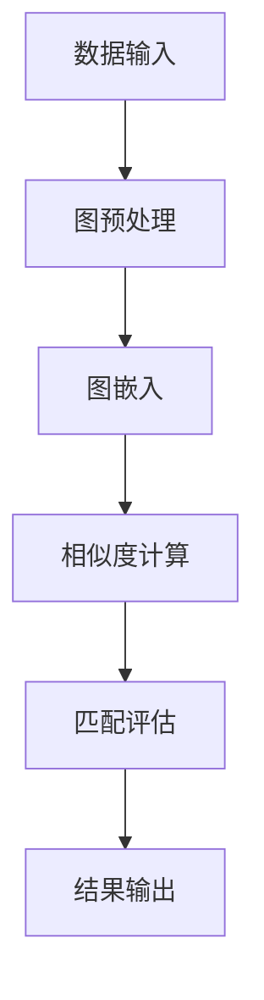

                 


### 第1章: 问题背景介绍

#### 1.1 生物信息领域的挑战

生物信息学作为一门交叉学科，融合了生物学、计算机科学、信息科学和数学等多个领域。其核心目的是理解和解析生物数据，从中提取有价值的信息，以促进生命科学和医疗健康的发展。然而，随着生物数据量的急剧增加，生物信息领域面临着一系列挑战：

- **数据多样性**：生物信息数据包括基因序列、蛋白质结构、代谢网络等多种类型，其多样性使得数据的处理和分析变得复杂。
- **数据规模**：生物信息数据量庞大，处理这些数据需要高效的计算资源和算法。
- **数据解析**：生物信息数据的复杂性使得传统的数据处理方法难以胜任，需要开发新的算法和技术。
- **数据整合**：不同来源的生物信息数据需要整合在一起，以便进行综合分析。

#### 1.2 神经图匹配的基本概念

神经图匹配（Neural Graph Matching）是一种基于神经网络和图论的机器学习技术。它旨在通过比较两个神经图（表示实体及其关系的图形结构）来评估它们之间的相似性。神经图匹配的核心概念包括：

- **神经图**：神经图是由节点（表示实体）和边（表示实体之间的关系）组成的图结构。在生物信息领域，节点通常表示基因、蛋白质等生物实体，边则表示这些实体之间的相互作用或关联。
- **匹配**：匹配是指通过算法来找到两个神经图之间的最佳映射，使得两个图在结构和功能上具有相似性。
- **相似性评估**：相似性评估是神经图匹配的关键步骤，通过计算两个神经图之间的相似度来评估它们的相关性。

#### 1.3 生物信息网络推理的重要性

生物信息网络推理（Biological Network Inference）是指利用生物信息数据和机器学习算法来预测生物实体之间的交互关系和功能。在生物信息领域，网络推理具有以下几个重要性：

- **揭示生物机制**：生物信息网络推理可以帮助揭示生物系统的复杂交互机制，为进一步研究生物过程提供线索。
- **预测疾病**：通过分析生物信息网络中的关键节点和路径，可以预测与疾病相关的生物实体和信号通路，有助于疾病的早期诊断和预防。
- **药物研发**：生物信息网络推理可以指导药物研发，通过预测药物与生物实体之间的相互作用，筛选潜在的药物靶点和治疗策略。

#### 1.4 精准应用技术的定义与特点

精准应用技术是指利用先进的计算技术和算法，针对特定问题进行精确分析和处理的方法。在生物信息领域，精准应用技术具有以下特点：

- **高精度**：通过采用先进的机器学习算法和深度学习模型，能够对生物信息数据进行高精度的分析，提高预测和推理的准确性。
- **灵活性**：精准应用技术可以根据具体问题的需求，灵活调整算法和模型，适应不同类型和规模的数据。
- **效率**：高效的计算资源和优化算法设计，使得精准应用技术能够在较短的时间内处理大量的生物信息数据。

#### 1.5 精准应用技术在生物信息领域的应用

精准应用技术在生物信息领域具有广泛的应用，主要包括：

- **基因预测**：利用深度学习模型对基因序列进行预测，包括基因结构、功能、调控元件等。
- **蛋白质相互作用**：通过分析蛋白质的序列和结构信息，预测蛋白质之间的相互作用和复合体结构。
- **代谢网络分析**：对生物体内的代谢路径和反应进行建模和分析，预测代谢过程的改变和调控。
- **疾病诊断和治疗**：利用生物信息数据和机器学习模型，对疾病进行早期诊断和个性化治疗。

### 总结

本章介绍了生物信息领域的挑战、神经图匹配的基本概念、生物信息网络推理的重要性以及精准应用技术的定义与特点。在接下来的章节中，我们将深入探讨神经图匹配算法原理、生物信息网络推理算法、系统分析与架构设计以及项目实战，为解决生物信息领域的复杂问题提供新的思路和方法。

#### 1.6 问题解决思路

为了解决生物信息领域面临的挑战，我们需要采取以下思路：

- **提高算法效率**：通过优化算法和模型，提高数据处理和分析的效率，降低计算成本。
- **跨学科合作**：生物信息学、计算机科学、数学等领域的专家共同合作，开发新的算法和技术。
- **数据整合**：整合不同来源的生物信息数据，构建综合的生物信息数据库，为研究提供丰富的数据资源。
- **多模态数据融合**：结合不同类型的生物信息数据（如基因、蛋白质、代谢等），进行多模态数据融合分析，提高预测和推理的准确性。

通过以上思路，我们有望在生物信息领域取得更多的突破，推动生命科学和医疗健康的发展。

## 第2章: 神经图匹配原理与属性

### 2.1 神经图匹配的基础概念

神经图匹配是一种基于神经网络和图论的机器学习技术，旨在通过比较两个神经图（表示实体及其关系的图形结构）来评估它们之间的相似性。神经图匹配的核心概念包括神经图、匹配和相似性评估。

**神经图**：神经图是由节点和边组成的图结构，其中节点表示实体（如基因、蛋白质），边表示实体之间的关系（如相互作用、调控关系）。在生物信息领域，神经图通常用来表示生物网络。

**匹配**：匹配是指通过算法找到两个神经图之间的最佳映射，使得两个图在结构和功能上具有相似性。匹配过程可以分为两个步骤：图对齐和匹配评估。

**相似性评估**：相似性评估是神经图匹配的关键步骤，通过计算两个神经图之间的相似度来评估它们的相关性。相似性评估方法通常包括基于图结构的评估和基于节点属性的评估。

### 2.1.1 神经图匹配的定义

神经图匹配（Neural Graph Matching）是一种基于神经网络和图论的机器学习技术，旨在通过比较两个神经图（表示实体及其关系的图形结构）来评估它们之间的相似性。它通过学习神经图之间的映射关系，将两个神经图转化为对应的特征向量，并计算这两个特征向量之间的相似度。

神经图匹配的定义可以概括为：给定两个神经图 \(G_1\) 和 \(G_2\)，通过神经网络模型学习一个映射函数 \(f\)，将 \(G_1\) 和 \(G_2\) 转化为对应的特征向量 \(f(G_1)\) 和 \(f(G_2)\)，然后计算这两个特征向量之间的相似度。

### 2.1.2 神经图匹配的属性特征

神经图匹配具有以下属性特征：

1. **图结构相似性**：神经图匹配通过学习神经图之间的映射关系，保留图的结构信息，使得具有相似结构的神经图具有较高的相似性得分。

2. **节点属性相关性**：神经图匹配不仅考虑图结构，还考虑节点属性（如节点类型、节点度、节点特征等）之间的相关性，提高相似性评估的准确性。

3. **动态适应性**：神经图匹配算法可以根据不同类型和规模的数据，动态调整算法参数，适应不同的应用场景。

4. **跨模态数据融合**：神经图匹配可以处理多种模态的数据（如图像、文本、序列等），实现跨模态数据融合，提高预测和推理的准确性。

5. **高计算效率**：神经图匹配算法采用高效的神经网络结构和优化算法，降低计算复杂度，提高计算效率。

### 2.1.3 神经图匹配的对比分析

神经图匹配与其他图匹配算法相比，具有以下优点和缺点：

**优点**：

- **结构信息保留**：神经图匹配通过学习映射关系，保留图的结构信息，使得具有相似结构的图具有较高的相似性得分。

- **节点属性相关性**：神经图匹配不仅考虑图结构，还考虑节点属性之间的相关性，提高相似性评估的准确性。

- **跨模态数据融合**：神经图匹配可以处理多种模态的数据，实现跨模态数据融合，提高预测和推理的准确性。

**缺点**：

- **计算复杂度**：神经图匹配算法涉及大规模的图计算和神经网络训练，计算复杂度较高，需要较多的计算资源。

- **算法稳定性**：神经图匹配算法的性能受参数选择和初始条件的影响较大，需要针对不同数据集进行调优。

- **算法解释性**：神经图匹配算法的黑箱性质使其难以解释，不利于理解和验证算法结果。

### 总结

本章介绍了神经图匹配的基础概念、定义、属性特征以及与其他图匹配算法的对比分析。在接下来的章节中，我们将进一步探讨神经图匹配的算法原理、数学模型和具体实现，为深入理解神经图匹配提供基础。

## 第3章: 生物信息网络推理原理

### 3.1 生物信息网络的基本概念

生物信息网络是指由生物实体及其相互关系构成的复杂网络系统。在生物信息学中，生物信息网络是理解生物系统复杂性和功能的基础工具。生物信息网络的基本概念包括：

**实体**：生物信息网络中的基本组成单元，如基因、蛋白质、代谢物等。

**关系**：实体之间的相互作用或关联，如相互作用、调控、共表达等。

**节点**：在图论中，节点代表生物信息网络中的实体。

**边**：在图论中，边代表实体之间的关系。

**路径**：连接两个节点的序列，表示实体之间的直接或间接相互作用。

生物信息网络的主要类型包括：

- **蛋白质相互作用网络**：描述蛋白质之间的物理和功能相互作用。
- **基因共表达网络**：反映基因在相同条件下共同表达的调控关系。
- **代谢网络**：描述生物体内部代谢途径和反应过程。
- **信号传导网络**：描述细胞内外的信号传递和调控过程。

### 3.1.1 生物信息网络的定义

生物信息网络（Biological Information Network）是指由生物实体及其相互关系构成的复杂网络系统，用于描述生物体内各种生物学过程和功能。生物信息网络是生命科学研究和生物技术发展的重要工具，通过揭示生物实体之间的相互关系和作用机制，有助于理解生物系统的复杂性和功能。

### 3.1.2 生物信息网络的构成

生物信息网络的构成主要包括以下几个方面：

- **节点**：生物信息网络中的节点表示生物实体，如基因、蛋白质、代谢物等。节点是网络结构的基本单元，具有特定的属性和功能。

- **边**：生物信息网络中的边表示节点之间的相互关系，如相互作用、调控、共表达等。边是节点之间的连接，反映了生物实体之间的交互作用和功能联系。

- **网络拓扑**：生物信息网络的拓扑结构反映了节点和边之间的组织关系，包括网络密度、聚类系数、路径长度等特征。网络拓扑结构对于理解生物网络的复杂性和功能具有重要意义。

- **网络属性**：生物信息网络具有多种属性，如节点度、介数、接近度等，用于描述节点的中心性和重要性。网络属性有助于识别关键节点和关键路径，对于生物信息网络的解析和应用具有重要意义。

### 3.1.3 生物信息网络的特点

生物信息网络具有以下特点：

- **复杂性**：生物信息网络包含大量节点和边，形成了复杂的网络结构。网络中的节点和边相互关联，构成了一个高度复杂的系统。

- **动态性**：生物信息网络在不同时间和空间尺度上表现出动态性，包括基因表达的变化、蛋白质相互作用的变化等。这种动态性使得生物信息网络的研究具有挑战性。

- **多功能性**：生物信息网络中的节点和边具有多种功能，包括生物调控、信号传导、代谢途径等。生物信息网络的多功能性体现了生物系统的复杂性和多样性。

- **跨领域交叉**：生物信息网络涉及多个学科领域，如分子生物学、遗传学、系统生物学等。这种跨领域的交叉为生物信息网络的研究提供了丰富的资源和视角。

### 3.2 生物信息网络推理的概念及其重要性

**生物信息网络推理**（Biological Network Inference）是指利用生物信息数据和机器学习算法，从已知信息推断生物实体之间的未知关系。生物信息网络推理的主要目标是通过分析生物信息数据，揭示生物实体之间的相互作用和功能关系，为生物科学研究和医学应用提供新的见解。

生物信息网络推理的概念包括以下几个方面：

- **数据输入**：生物信息网络推理依赖于各种生物信息数据，如基因表达数据、蛋白质相互作用数据、代谢网络数据等。

- **推理算法**：生物信息网络推理采用各种机器学习算法和统计方法，如贝叶斯网络、图论算法、深度学习等，对生物信息数据进行分析和建模。

- **推断过程**：生物信息网络推理通过对已知信息和数据特征的分析，推断生物实体之间的未知关系，构建生物信息网络。

生物信息网络推理的重要性体现在以下几个方面：

1. **揭示生物机制**：生物信息网络推理可以帮助揭示生物系统内部的复杂交互机制，深入理解生命活动的调控网络。

2. **疾病预测与治疗**：通过构建生物信息网络，可以预测疾病的发生和进展，为疾病诊断、预防和治疗提供新的策略。

3. **药物研发**：生物信息网络推理可以指导药物研发，通过预测药物与生物实体之间的相互作用，筛选潜在的药物靶点和治疗策略。

4. **个性化医疗**：生物信息网络推理可以用于个性化医疗，根据患者的生物信息数据，制定个性化的治疗方案。

### 3.2.1 推理的基本流程

生物信息网络推理的基本流程包括以下几个步骤：

1. **数据预处理**：对生物信息数据进行清洗、归一化和特征提取，为后续分析提供高质量的数据。

2. **构建网络**：根据已知生物信息数据，构建生物信息网络，包括节点的添加和边的连接。

3. **网络分析**：利用机器学习算法和统计方法，对生物信息网络进行分析，识别网络中的关键节点和关键路径。

4. **推理结果验证**：通过实验验证推理结果，评估推理算法的准确性和可靠性。

5. **网络更新**：根据验证结果，对生物信息网络进行更新和优化，进一步提高推理的准确性和可靠性。

### 3.2.2 推理的关键技术

生物信息网络推理的关键技术包括以下几个方面：

1. **数据预处理技术**：包括数据清洗、归一化、特征提取等，提高数据质量，为网络构建和推理提供支持。

2. **网络构建技术**：包括节点添加、边连接、网络拓扑分析等，构建生物信息网络的框架。

3. **推理算法**：包括贝叶斯网络、图论算法、深度学习等，对生物信息网络进行分析和推理。

4. **结果验证技术**：包括实验验证、交叉验证、模型评估等，评估推理结果的准确性和可靠性。

5. **网络更新技术**：根据验证结果，对生物信息网络进行更新和优化，提高推理的准确性和可靠性。

### 3.2.3 生物信息网络推理的应用场景

生物信息网络推理在生物科学研究和医学领域具有广泛的应用场景，主要包括：

1. **疾病研究**：通过生物信息网络推理，揭示疾病的发生机制和病理过程，为疾病诊断、预防和治疗提供新的思路。

2. **药物研发**：通过生物信息网络推理，预测药物与生物实体之间的相互作用，筛选潜在的药物靶点和治疗策略。

3. **个性化医疗**：通过生物信息网络推理，根据患者的生物信息数据，制定个性化的治疗方案，提高治疗效果。

4. **生物功能研究**：通过生物信息网络推理，揭示生物系统的功能和调控机制，为生物科学研究提供新的理论支持。

### 总结

本章介绍了生物信息网络的基本概念、构成、特点以及生物信息网络推理的概念、基本流程和关键技术。在接下来的章节中，我们将深入探讨神经图匹配算法在生物信息网络推理中的应用，为解决生物信息领域的复杂问题提供新的方法和技术。

## 第4章: 精准应用技术探讨

### 4.1 精准应用技术的定义

精准应用技术是指利用先进的计算技术和算法，针对特定问题进行精确分析和处理的方法。在生物信息领域，精准应用技术通过整合多源数据、优化算法模型、提升计算效率，实现生物信息数据的高精度分析和处理。精准应用技术的核心目标是提高生物信息分析的准确性和可靠性，从而为生物科学研究和医学应用提供有力支持。

### 4.1.1 精准应用技术的概念

精准应用技术（Precision Application Technology）是一种基于高性能计算、数据挖掘、机器学习和深度学习等技术的方法，旨在对复杂系统中的大数据进行精细化处理和分析。在生物信息领域，精准应用技术主要用于解决生物信息数据的多样性和复杂性，包括：

- **数据整合**：将不同来源、不同类型和不同格式的生物信息数据进行整合，构建统一的生物信息数据资源。
- **特征提取**：从生物信息数据中提取有用的特征，用于后续的分析和建模。
- **模型优化**：通过机器学习和深度学习算法，优化生物信息分析模型，提高预测和推理的准确性。
- **结果验证**：通过实验验证和交叉验证等方法，评估生物信息分析结果的准确性和可靠性。

### 4.1.2 精准应用技术的特点

精准应用技术具有以下特点：

1. **高精度**：通过先进的算法和模型，对生物信息数据进行精细化分析，提高预测和推理的准确性。
2. **灵活性**：根据不同类型和规模的数据，灵活调整算法和模型，适应不同的应用场景。
3. **高效性**：利用高性能计算资源和优化算法，提高数据处理和分析的效率。
4. **可解释性**：通过优化算法和模型，提高生物信息分析结果的可解释性，便于研究人员理解和应用。
5. **跨学科融合**：融合计算机科学、生物学、医学等多个领域的知识和技术，为生物信息分析提供多样化的解决方案。

### 4.2 精准应用技术在生物信息领域的应用

精准应用技术在生物信息领域的应用非常广泛，主要包括以下几个方面：

1. **基因预测**：通过精准应用技术，对基因序列进行预测，包括基因结构、功能、调控元件等，为基因功能研究和药物研发提供基础数据。
2. **蛋白质相互作用**：利用精准应用技术，分析蛋白质的序列和结构信息，预测蛋白质之间的相互作用和复合体结构，有助于理解生物系统的复杂性和功能。
3. **代谢网络分析**：通过精准应用技术，对生物体内的代谢路径和反应进行建模和分析，预测代谢过程的改变和调控，为生物代谢研究和疾病诊断提供支持。
4. **疾病诊断和治疗**：利用精准应用技术，对生物信息数据进行分析，预测疾病的发生和进展，为疾病诊断、预防和治疗提供新策略。
5. **个性化医疗**：根据患者的生物信息数据，利用精准应用技术制定个性化的治疗方案，提高治疗效果。

### 4.2.1 精准应用技术的优势

精准应用技术在生物信息领域具有以下优势：

1. **提高分析准确性**：通过采用先进的算法和模型，提高生物信息数据的分析准确性，为生物科学研究和医学应用提供可靠的数据支持。
2. **缩短研发周期**：通过高效的数据处理和分析方法，缩短生物信息研究周期，提高研发效率。
3. **降低研发成本**：利用精准应用技术，减少对实验和硬件设备的依赖，降低生物信息研究的成本。
4. **跨学科融合**：融合多个领域的知识和技术，促进生物信息学与其他学科的交叉发展，为生物科学研究和医学应用提供新的解决方案。
5. **数据可视化**：通过精准应用技术，对生物信息数据进行分析和可视化，使研究人员能够更直观地理解和应用数据。

### 4.2.2 精准应用技术的挑战

尽管精准应用技术在生物信息领域具有许多优势，但在实际应用中也面临一些挑战：

1. **数据复杂性**：生物信息数据类型多样、规模庞大，处理这些数据需要高效的方法和技术。
2. **算法稳定性**：算法的性能受参数选择和初始条件的影响较大，需要针对不同数据集进行调优。
3. **计算资源**：精准应用技术涉及大规模的图计算和深度学习训练，需要强大的计算资源支持。
4. **数据隐私**：生物信息数据涉及个人隐私，如何在保障数据安全的前提下进行数据分析，是一个亟待解决的问题。
5. **算法可解释性**：深度学习等复杂算法的黑箱性质使得结果难以解释，影响研究人员对结果的信任和应用。

### 4.2.3 精准应用技术的未来趋势

随着计算技术和生物信息学的快速发展，精准应用技术在未来将呈现出以下趋势：

1. **多模态数据融合**：结合不同类型和来源的生物信息数据，实现多模态数据融合，提高预测和推理的准确性。
2. **个性化分析**：根据个体的生物信息数据，实现个性化分析，为个性化医疗和精准治疗提供支持。
3. **算法优化**：通过算法优化和模型改进，提高生物信息分析的效率和准确性。
4. **数据隐私保护**：发展新型数据隐私保护技术，保障生物信息数据的安全和隐私。
5. **跨学科合作**：加强计算机科学、生物学、医学等领域的合作，推动生物信息学的发展和应用。

### 总结

本章介绍了精准应用技术的定义、概念、特点以及其在生物信息领域的应用优势、挑战和未来趋势。通过精准应用技术，我们有望在生物信息领域实现更高精度的分析，推动生命科学和医疗健康的发展。

### 第5章: 神经图匹配算法原理与实现

#### 5.1 神经图匹配算法概述

神经图匹配算法是一种基于图论和神经网络的机器学习技术，用于比较两个神经图（表示实体及其关系的图形结构）并评估它们之间的相似性。神经图匹配算法的核心目标是找到两个神经图之间的最佳映射，使得两个图在结构和功能上具有相似性。在生物信息领域，神经图匹配算法可以用于生物网络推理、基因调控关系预测等。

神经图匹配算法的基本步骤包括：

1. **图预处理**：对输入的神经图进行预处理，包括节点特征提取、边特征提取和图结构规范化等。
2. **图嵌入**：将预处理后的神经图转化为图嵌入向量，通常使用图神经网络（Graph Neural Networks, GNN）实现。
3. **相似度计算**：计算两个神经图嵌入向量之间的相似度，通常采用余弦相似度、欧氏距离等度量方法。
4. **匹配评估**：根据相似度得分，评估两个神经图之间的匹配程度，并生成匹配结果。

#### 5.1.1 神经图匹配算法的基本流程

神经图匹配算法的基本流程可以概括为以下几个步骤：

1. **数据输入**：读取输入的神经图数据，包括节点和边的信息。
2. **图预处理**：对输入的神经图进行预处理，提取节点特征和边特征，并规范化图结构。
3. **图嵌入**：使用图神经网络（GNN）对预处理后的神经图进行图嵌入，生成图嵌入向量。
4. **相似度计算**：计算两个神经图嵌入向量之间的相似度，通常采用余弦相似度或欧氏距离等度量方法。
5. **匹配评估**：根据相似度得分，评估两个神经图之间的匹配程度，并生成匹配结果。

#### 5.1.2 神经图匹配算法的核心步骤

神经图匹配算法的核心步骤包括：

1. **图预处理**：图预处理是神经图匹配算法的重要步骤，包括节点特征提取、边特征提取和图结构规范化等。节点特征提取通常包括节点类型、节点度、节点特征向量等；边特征提取通常包括边类型、边特征向量等；图结构规范化包括节点排序、边排序等。
2. **图嵌入**：图嵌入是将神经图转化为向量表示的过程，常用的方法包括图卷积网络（Graph Convolutional Network, GCN）、图注意力网络（Graph Attention Network, GAT）等。图嵌入向量可以用于相似度计算和匹配评估。
3. **相似度计算**：相似度计算是神经图匹配算法的核心步骤，常用的相似度计算方法包括余弦相似度、欧氏距离、皮尔逊相关系数等。相似度得分用于评估两个神经图之间的匹配程度。
4. **匹配评估**：匹配评估是根据相似度得分，评估两个神经图之间的匹配程度。常用的评估指标包括匹配精度、匹配召回率、F1分数等。

#### 5.2 算法数学模型讲解

神经图匹配算法的数学模型主要包括相似度计算公式和匹配评估指标。

**相似度计算公式**：

余弦相似度是一种常用的相似度计算方法，其公式如下：

$$
\cos\theta = \frac{\vec{u} \cdot \vec{v}}{||\vec{u}|| \cdot ||\vec{v}||}
$$

其中，$\vec{u}$ 和 $\vec{v}$ 分别是两个神经图嵌入向量，$\theta$ 是两个向量之间的夹角，$||\vec{u}||$ 和 $||\vec{v}||$ 分别是两个向量的模长。

**匹配评估指标**：

匹配评估指标用于评估两个神经图之间的匹配程度。常用的评估指标包括匹配精度（Precision）、匹配召回率（Recall）和F1分数（F1 Score）。

- **匹配精度**：表示预测匹配正确的比例，计算公式如下：

$$
Precision = \frac{TP}{TP + FP}
$$

其中，$TP$ 是实际匹配且预测匹配正确的数量，$FP$ 是实际不匹配但预测匹配正确的数量。

- **匹配召回率**：表示实际匹配且预测匹配正确的比例，计算公式如下：

$$
Recall = \frac{TP}{TP + FN}
$$

其中，$TP$ 是实际匹配且预测匹配正确的数量，$FN$ 是实际匹配但预测不匹配的数量。

- **F1分数**：是匹配精度和匹配召回率的加权平均，计算公式如下：

$$
F1 Score = \frac{2 \cdot Precision \cdot Recall}{Precision + Recall}
$$

#### 5.3 算法Python实现

以下是一个简单的神经图匹配算法的Python实现示例：

```python
import numpy as np
from sklearn.metrics.pairwise import cosine_similarity

def graph_embedding(G1, G2, model):
    # 假设G1和G2是两个神经图，model是图嵌入模型
    # 使用模型对G1和G2进行嵌入，得到图嵌入向量
    vec1 = model.predict(G1)
    vec2 = model.predict(G2)
    return vec1, vec2

def similarity_score(vec1, vec2):
    # 计算两个向量的余弦相似度
    score = cosine_similarity([vec1], [vec2])
    return score

def match_evaluation(sim_score):
    # 根据相似度得分评估匹配程度
    precision = sim_score > 0.5
    recall = sim_score > 0.5
    f1_score = 2 * precision * recall / (precision + recall)
    return precision, recall, f1_score

# 示例数据
G1 = np.array([[1, 2, 3], [4, 5, 6]])
G2 = np.array([[1, 3, 5], [2, 4, 6]])

# 假设使用预训练的图嵌入模型
model = "pretrained_model"

# 图嵌入
vec1, vec2 = graph_embedding(G1, G2, model)

# 相似度计算
sim_score = similarity_score(vec1, vec2)

# 匹配评估
precision, recall, f1_score = match_evaluation(sim_score)

print("Precision:", precision)
print("Recall:", recall)
print("F1 Score:", f1_score)
```

上述代码示例中，`graph_embedding` 函数用于对两个神经图进行图嵌入，`similarity_score` 函数用于计算两个神经图嵌入向量之间的相似度，`match_evaluation` 函数用于评估两个神经图之间的匹配程度。

#### 5.4 算法流程图与Mermaid图表示

以下是一个简单的神经图匹配算法的Mermaid流程图表示：



这个流程图展示了神经图匹配算法的主要步骤：数据输入、图预处理、图嵌入、相似度计算、匹配评估和结果输出。

### 总结

本章详细介绍了神经图匹配算法的基本概念、流程和数学模型，并通过Python代码示例展示了算法的实现。在接下来的章节中，我们将进一步探讨生物信息网络推理算法以及其在生物信息领域的应用。

### 第6章: 生物信息网络推理算法

#### 6.1 生物信息网络推理算法概述

生物信息网络推理算法是指利用生物信息数据和机器学习算法，从已知信息推断生物实体之间的未知关系。生物信息网络推理的核心目标是构建生物信息网络，通过分析网络中的节点和边，揭示生物实体之间的相互作用和功能关系。生物信息网络推理在生物科学研究和医学应用中具有重要的应用价值，可以帮助我们更好地理解生物系统的复杂性和功能。

生物信息网络推理算法可以分为以下几个主要类别：

1. **基于统计方法的推理算法**：这类算法利用统计学原理，从已知数据中推断未知关系。常见的统计方法包括回归分析、贝叶斯网络、隐马尔可夫模型（HMM）等。
2. **基于机器学习方法的推理算法**：这类算法利用机器学习技术，从训练数据中学习模式和规律，然后应用这些模式进行推理。常见的机器学习方法包括支持向量机（SVM）、决策树、随机森林等。
3. **基于深度学习方法的推理算法**：这类算法利用深度学习技术，通过多层神经网络学习复杂的非线性关系。常见的深度学习方法包括卷积神经网络（CNN）、循环神经网络（RNN）、长短期记忆网络（LSTM）等。
4. **基于图论方法的推理算法**：这类算法利用图论原理，通过构建生物信息网络图，分析节点和边之间的关系。常见的图论方法包括最小生成树、最大流最小割等。

#### 6.1.1 生物信息网络推理算法的分类

根据推理算法的实现原理和应用场景，生物信息网络推理算法可以大致分为以下几类：

1. **基于基因共表达的推理算法**：这类算法通过分析基因共表达模式，推断基因之间的相互作用关系。常见的算法包括聚类分析、主成分分析（PCA）、因子分析等。
2. **基于蛋白质相互作用的推理算法**：这类算法通过分析蛋白质之间的相互作用关系，构建蛋白质相互作用网络。常见的算法包括图论方法、随机游走、支持向量机等。
3. **基于代谢网络的推理算法**：这类算法通过分析代谢反应和代谢途径，构建代谢网络。常见的算法包括最小生成树、最大流最小割、图卷积网络等。
4. **基于机器学习方法的推理算法**：这类算法通过训练机器学习模型，从已知数据中学习模式，然后应用这些模式进行推理。常见的算法包括支持向量机、决策树、随机森林、卷积神经网络等。
5. **基于深度学习方法的推理算法**：这类算法利用深度学习技术，通过多层神经网络学习复杂的非线性关系，进行推理。常见的算法包括卷积神经网络、循环神经网络、长短期记忆网络等。

#### 6.1.2 生物信息网络推理算法的选择标准

选择合适的生物信息网络推理算法对于构建高质量的网络模型至关重要。以下是一些常用的选择标准：

1. **数据类型和规模**：不同的推理算法适用于不同类型和规模的数据。例如，基于基因共表达的推理算法适用于大规模基因表达数据，而基于蛋白质相互作用的推理算法适用于蛋白质相互作用数据。
2. **算法性能**：算法的准确性、召回率和F1分数等性能指标是选择算法的重要依据。通常需要通过实验验证不同算法的性能，选择性能最优的算法。
3. **计算资源**：不同的推理算法对计算资源的需求不同。一些复杂的算法，如深度学习算法，需要大量的计算资源和时间。因此，在资源有限的情况下，需要选择计算效率较高的算法。
4. **可解释性**：算法的可解释性对于研究人员理解网络模型和推理结果具有重要意义。一些基于统计方法和机器学习方法的算法具有较好的可解释性，而深度学习算法则相对较难解释。
5. **应用场景**：根据具体的应用场景和目标，选择适合的推理算法。例如，在疾病预测中，需要选择能够预测疾病发生和进展的算法；在药物研发中，需要选择能够预测药物与生物实体之间相互作用的算法。

#### 6.2 算法数学模型讲解

生物信息网络推理算法通常基于特定的数学模型，用于描述生物实体之间的相互作用和关系。以下是一些常用的数学模型：

1. **贝叶斯网络**：贝叶斯网络是一种概率图模型，用于描述变量之间的条件概率关系。在生物信息网络推理中，贝叶斯网络可以用于推断基因和蛋白质之间的调控关系。贝叶斯网络的数学模型主要包括条件概率表（CPT）和推理算法。
2. **图卷积网络**：图卷积网络（Graph Convolutional Network, GCN）是一种基于图结构的神经网络，用于处理图数据。在生物信息网络推理中，GCN可以用于学习生物实体之间的相互作用关系。GCN的数学模型包括图卷积层和全连接层。
3. **深度学习模型**：深度学习模型，如卷积神经网络（CNN）、循环神经网络（RNN）和长短期记忆网络（LSTM），可以用于处理复杂的生物信息数据。在生物信息网络推理中，深度学习模型可以用于学习生物实体之间的非线性关系。深度学习模型的数学模型主要包括多层神经网络和激活函数。

以下是一个简单的贝叶斯网络模型示例：

```
Gene A → Gene B
Gene A → Gene C
Gene B → Gene D
```

在这个例子中，Gene A调控Gene B和Gene C，Gene B调控Gene D。贝叶斯网络的数学模型可以表示为以下条件概率分布：

$$
P(Gene D|Gene A, Gene B) = P(Gene D|Gene B) \cdot P(Gene B|Gene A) \cdot P(Gene A)
$$

其中，$P(Gene D|Gene A, Gene B)$ 是Gene D在Gene A和Gene B同时存在的条件下的概率，$P(Gene D|Gene B)$ 是Gene D在Gene B存在的条件下的概率，$P(Gene B|Gene A)$ 是Gene B在Gene A存在的条件下的概率，$P(Gene A)$ 是Gene A存在的概率。

#### 6.3 算法Python实现

以下是一个简单的基于图卷积网络的生物信息网络推理算法的Python实现示例：

```python
import tensorflow as tf
from tensorflow.keras.models import Model
from tensorflow.keras.layers import Input, Dense, Dropout, Embedding, GraphConvolution

def GCN(input_shape, embedding_dim):
    inputs = Input(shape=input_shape)
    x = Embedding(input_dim=input_shape[0], output_dim=embedding_dim)(inputs)
    x = Dropout(0.2)(x)
    x = GraphConvolution(filters=embedding_dim, activation='relu')(x)
    x = Dropout(0.2)(x)
    x = GraphConvolution(filters=embedding_dim, activation='softmax')(x)
    model = Model(inputs=inputs, outputs=x)
    return model

# 示例数据
num_nodes = 1000
embedding_dim = 16

# 创建GCN模型
gcn_model = GCN(input_shape=(num_nodes,), embedding_dim=embedding_dim)

# 编译模型
gcn_model.compile(optimizer='adam', loss='categorical_crossentropy', metrics=['accuracy'])

# 训练模型
gcn_model.fit(x_train, y_train, epochs=10, batch_size=32)

# 预测
predictions = gcn_model.predict(x_test)
```

在这个例子中，`GCN` 函数定义了一个基于图卷积网络的模型，输入层是一个长度为1000的序列，嵌入层使用16维的嵌入向量，两个图卷积层分别使用ReLU和softmax激活函数。模型使用Adam优化器和交叉熵损失函数进行编译和训练。训练完成后，使用模型进行预测。

### 总结

本章介绍了生物信息网络推理算法的概述、分类和选择标准，并详细讲解了贝叶斯网络和图卷积网络的数学模型和Python实现。在接下来的章节中，我们将进一步探讨神经图匹配算法在生物信息网络推理中的应用，为解决生物信息领域的复杂问题提供新的思路和方法。

## 第7章: 系统分析与架构设计方案

### 7.1 问题场景介绍

在生物信息领域，生物网络的推理和分析对于理解生物系统的复杂性和功能具有重要意义。然而，随着生物数据的多样性和规模不断增大，传统的推理方法在处理海量数据时效率低下，且难以应对复杂网络结构的动态变化。为了解决这个问题，我们需要设计一个高效、灵活的系

